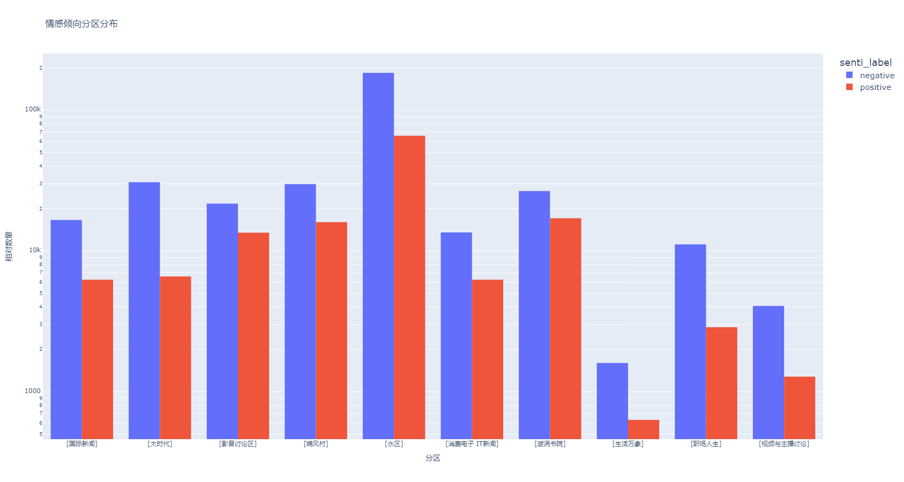
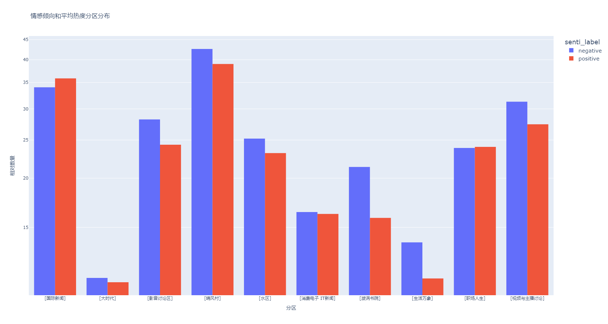
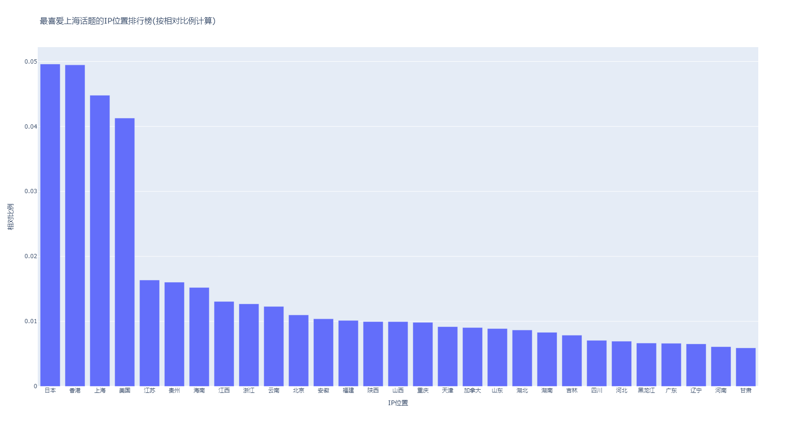
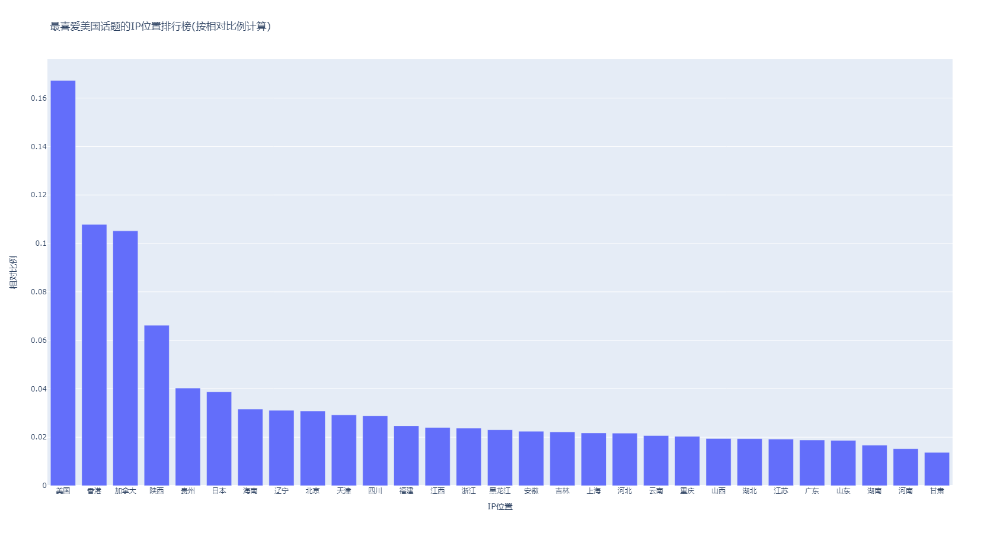

### NGA水区数据分析 Code:OmegaNeko[Ver2024.3.20]

Made by ngapost2md (c) ludoux [GitHub Repo](https://github.com/ludoux/ngapost2md)

----

##### 0.[85] \<pid:0\> 2024-03-20 18:39:01 by kjsdfsdf\(韩国\)
<h4>前言</h4>如果想发一个流量贴,应该在一天之中的什么时间发帖,才能吸引最多的回复呢？泥潭在星期几最活跃？泥潭的哪个分区最火热？帖子的内容应该与什么主题有关？什么话题最火热?泥潭更喜欢建政还是打拳?什么帖子能拿下高热度/高获赞?各个分区的用户画像有什么不同?
如果仅凭在马桶冲浪的印象,恐怕很难准确回答这些问题。
希望通过本项目 ~~马桶生态观察~~ ,让大家对水区有一个更加客观全面的认识。

~~不想继续看废话的请直接下拉到正文部分~~

<i>“<b>敬请见证……</b>”</i>

水区数据增量备份&quot;<i>永不冲水的理想城Lord Camelot v1.26</i>&quot;
及其子项目
水区数据分析&quot;<i>OmegaNeko v1.2</i>&quot; 2023年度版 

<i>“<b>啊,马桶,我的流浪马桶……</b>”</i>

数据范围:NGA网事杂谈(水区)板块及其下辖的9个 ~~我感兴趣的~~ 比较有代表性的子分区:晴风村、旋涡书院、大时代、影音讨论、国新区、消费电子、职场人生、视频主播、生活万象。
时间范围:2023年01月01日 - 2023年12月31日

免责声明:
  本项目立足于中国大陆,服务全球华人,受中国大陆法律保护。
  项目数据已经尽可能脱敏,并不会公开。
  若有侵权,请立刻联系笔者。
  本报告仅对上文指明的范围和时间内的数据有效性负责。
  本项目已获得血压酱授权。 

特别鸣谢:
  [@kjsdfsdf]对本项目的大力支持。
  
卫星:
  地域黑嗅探装置&quot;<i>地狱骑士Hell Rider</i>&quot;正式版
  楼主成分一键查询&quot;<i>CanCanNeed</i>&quot; 
  流量号数据探针&quot;<i>广告位招租</i>&quot; 

<a href="javascript:;" onclick="collapse(this);">+</a>更新日志 ...
新特性和重构:
 增加了若干数据实体
 重构了自动化部署方案
 重构了整体数据采集逻辑,降低服务器负担
 重构了并发逻辑,现在项目对高并发更加友好了
 优化了异常处理逻辑
 实装了断点重启逻辑
 实装了完善的监听逻辑,现在当某个特定的尚未修复的致命漏洞报错时,项目能够偷偷重启了
 重构了对匿名用户的采集逻辑
 重构了参数的读取逻辑,现在再也没有人可以通过命令行成功运行本项目了
 实装了&#39;闪电旋风劈&#39;机制,试图规避用户对主楼的编辑
 重新进行了数据库选型,数据迁移至非关系型数据库
 重构了数据库逻辑,现在项目对非结构化数据更加友好了
 重构了数据实体之间的关联关系,使得更加细粒度的NLP成为可能
 重构了NLP逻辑,现在项目可以得到更加精确的结果了
 重构了主题帖热度计算逻辑
 新增若干分析条目
 新增若干注释以增强项目可维护性,试图规避半年后项目被拖进回收站的可悲宿命
 将NLP模型更换为百度解语
 将情感预测模型更换为skep_ernie_1.0_large_ch
 实装了自适应采集算法,进一步优化自动化部署
 实装了异常消息邮件推送系统
 实装了&#39;地狱骑士Hell Rider&#39;EA版

 漏洞修复:
 修复了一个致命漏洞,该漏洞曾导致数据无法正常累加
 修复了一个致命漏洞,该漏洞曾导致偶尔崩溃
 修复了一个致命漏洞,该漏洞曾导致某些时间段的数据无法被采集
 修复了一个致命漏洞,该漏洞曾导致进行高频率的长时间忙等
 修复了一个漏洞,该漏洞曾导致运行缓慢
 修复了一个漏洞,该漏洞曾导致异常CPU高占用
 修复了一个漏洞,该漏洞曾导致大量数据冗余
 修复了一个漏洞,该漏洞曾导致定时器异常
 修复了一个漏洞,该漏洞曾导致无效的自旋锁
 修复了一个漏洞,该漏洞曾导致某些数据字段为空值
 修复了一个漏洞,该漏洞曾导致一个无限超时问题
 修复了一个漏洞,该漏洞曾导致在特定条件下的异常终止
 修复了一个漏洞,该漏洞曾导致在特定时序条件下的数据库写入冗余
 修复了一个漏洞,该漏洞曾导致某些特定嵌套结构的数据出错
 修复了一个漏洞,该漏洞曾导致采集到错误的数据
 修复了一个漏洞,该漏洞曾导致采集到空的用户设备键值
 修复了一个漏洞,该漏洞曾导致cookie失效时的异常行为
 修复了一个漏洞,该漏洞曾导致采集某些已被封禁的用户信息时的异常行为
 修复了一个漏洞,该漏洞曾导致主题帖支持数的采集异常
 修复了一个致命漏洞,该漏洞曾导致采集的用户名出现异常

<a href="javascript:;" onclick="collapse(this);">+</a>关键词提取效果对比 ...

<table cellspacing='0px' style='border:1px solid #aaa;width:99.9%'><tr><td  style='width:29%;border-left:1px solid #aaa;border-bottom:1px solid #aaa'>源文本</td><td  style='width:29%;border-left:1px solid #aaa;border-bottom:1px solid #aaa'>你说得对,但是《尼尔：自动人形》是史克威尔艾尼克斯与白金工作室联合自主研发的一款全新开放世界动作角色扮演游戏。中间忘了。同时，逐步发掘人类衰退的真相。</td></tr><tr><td  style='width:29%;border-left:1px solid #aaa;border-bottom:1px solid #aaa'>Jieba</td><td  style='width:29%;border-left:1px solid #aaa;border-bottom:1px solid #aaa'>&#39;你&#39;, &#39;说得对&#39;, &#39;,&#39;, &#39;但是&#39;, &#39;《&#39;, &#39;尼尔&#39;, &#39;：&#39;, &#39;自动&#39;, &#39;人形&#39;, &#39;》&#39;, &#39;是&#39;, &#39;史&#39;, &#39;克威尔&#39;, &#39;艾&#39;, &#39;尼克斯&#39;, &#39;与&#39;, &#39;白金&#39;, &#39;工作室&#39;, &#39;联合&#39;, &#39;自主&#39;, &#39;研发&#39;, &#39;的&#39;, &#39;一款&#39;, &#39;全新&#39;, &#39;开放&#39;, &#39;世界&#39;, &#39;动作&#39;, &#39;角色扮演&#39;, &#39;游戏&#39;, &#39;。&#39;, &#39;中间&#39;, &#39;忘&#39;, &#39;了&#39;, &#39;。&#39;, &#39;同时&#39;, &#39;，&#39;, &#39;逐步&#39;, &#39;发掘&#39;, &#39;人类&#39;, &#39;衰退&#39;, &#39;的&#39;, &#39;真相&#39;, &#39;。&#39;</td></tr><tr><td  style='width:29%;border-left:1px solid #aaa;border-bottom:1px solid #aaa'>LAC</td><td  style='width:29%;border-left:1px solid #aaa;border-bottom:1px solid #aaa'>&#39;你&#39;, &#39;说&#39;, &#39;得&#39;, &#39;对&#39;, &#39;,&#39;, &#39;但是&#39;, &#39;《&#39;, &#39;尼尔：自动人形&#39;, &#39;》&#39;, &#39;是&#39;, &#39;史克威尔艾尼克斯&#39;, &#39;与&#39;, &#39;白金工作室&#39;, &#39;联合&#39;, &#39;自主&#39;, &#39;研发&#39;, &#39;的&#39;, &#39;一款&#39;, &#39;全新&#39;, &#39;开放&#39;, &#39;世界&#39;, &#39;动作&#39;, &#39;角色&#39;, &#39;扮演&#39;, &#39;游戏&#39;, &#39;。&#39;, &#39;中间&#39;, &#39;忘&#39;, &#39;了&#39;, &#39;同时&#39;, &#39;，&#39;, &#39;逐步&#39;, &#39;发掘&#39;, &#39;人类&#39;, &#39;衰退&#39;, &#39;真相&#39;</td></tr><tr><td  style='width:29%;border-left:1px solid #aaa;border-bottom:1px solid #aaa'>百度解语(实体模式)</td><td  style='width:29%;border-left:1px solid #aaa;border-bottom:1px solid #aaa'>&#39;说&#39;, &#39;对&#39;, &#39;尼尔：自动人形&#39;, &#39;史克威尔&#39;, &#39;艾尼克斯&#39;, &#39;白金工作室&#39;, &#39;联合&#39;, &#39;研发&#39;, &#39;一款&#39;, &#39;开放&#39;, &#39;世界&#39;, &#39;动作角色扮演游戏&#39;, &#39;中间&#39;, &#39;忘了&#39;, &#39;发掘&#39;, &#39;人类&#39;, &#39;衰退&#39;</td></tr></table>

<a href="javascript:;" onclick="collapse(this);">+</a>情感分析效果展示 ...

<table cellspacing='0px' style='border:1px solid #aaa;width:99.9%'><tr><td  style='width:13%;border-left:1px solid #aaa;border-bottom:1px solid #aaa'>标题</td><td  style='width:13%;border-left:1px solid #aaa;border-bottom:1px solid #aaa'>正文</td><td  style='width:13%;border-left:1px solid #aaa;border-bottom:1px solid #aaa'>情感</td><td  style='width:13%;border-left:1px solid #aaa;border-bottom:1px solid #aaa'>得分</td></tr><tr><td  style='width:13%;border-left:1px solid #aaa;border-bottom:1px solid #aaa'>相亲捡到了很可爱的女朋友这件事</td><td  style='width:13%;border-left:1px solid #aaa;border-bottom:1px solid #aaa'>先匿名测试下，泥潭有好友</td><td  style='width:13%;border-left:1px solid #aaa;border-bottom:1px solid #aaa'>positive</td><td  style='width:13%;border-left:1px solid #aaa;border-bottom:1px solid #aaa'>0.99</td></tr><tr><td  style='width:13%;border-left:1px solid #aaa;border-bottom:1px solid #aaa'>恢复的这么快我是没想到的…</td><td  style='width:13%;border-left:1px solid #aaa;border-bottom:1px solid #aaa'>我以为餐饮要惨淡三个月了，结果各种综合体车都停不下</td><td  style='width:13%;border-left:1px solid #aaa;border-bottom:1px solid #aaa'>positive</td><td  style='width:13%;border-left:1px solid #aaa;border-bottom:1px solid #aaa'>0.69</td></tr><tr><td  style='width:13%;border-left:1px solid #aaa;border-bottom:1px solid #aaa'>微信读书的APP做的真的很干净</td><td  style='width:13%;border-left:1px solid #aaa;border-bottom:1px solid #aaa'>点进去翻书城，恍惚间有种以前逛书店的感觉上次进书店已经是好几年前了</td><td  style='width:13%;border-left:1px solid #aaa;border-bottom:1px solid #aaa'>positive</td><td  style='width:13%;border-left:1px solid #aaa;border-bottom:1px solid #aaa'>0.98</td></tr><tr><td  style='width:13%;border-left:1px solid #aaa;border-bottom:1px solid #aaa'>我奶奶在医院去世了</td><td  style='width:13%;border-left:1px solid #aaa;border-bottom:1px solid #aaa'>发展的很快 肺很快就白了 呼吸机在生命的最后也是平添痛苦</td><td  style='width:13%;border-left:1px solid #aaa;border-bottom:1px solid #aaa'>Negative</td><td  style='width:13%;border-left:1px solid #aaa;border-bottom:1px solid #aaa'>0.89</td></tr><tr><td  style='width:13%;border-left:1px solid #aaa;border-bottom:1px solid #aaa'>感觉索尼商店升级是个败笔</td><td  style='width:13%;border-left:1px solid #aaa;border-bottom:1px solid #aaa'>很复杂，根本看不懂</td><td  style='width:13%;border-left:1px solid #aaa;border-bottom:1px solid #aaa'>Negative</td><td  style='width:13%;border-left:1px solid #aaa;border-bottom:1px solid #aaa'>0.99</td></tr><tr><td  style='width:13%;border-left:1px solid #aaa;border-bottom:1px solid #aaa'>路上开车傻逼真多</td><td  style='width:13%;border-left:1px solid #aaa;border-bottom:1px solid #aaa'>真见识了 越堵车傻逼越多 左转拥堵 都tm占着直行道加塞 搞得直行也拥堵。八公里开了两小时 昨晚心态搞崩了。</td><td  style='width:13%;border-left:1px solid #aaa;border-bottom:1px solid #aaa'>Negative</td><td  style='width:13%;border-left:1px solid #aaa;border-bottom:1px solid #aaa'>0.99</td></tr></table>

<h4>正文</h4>
<h4>帖子数量分区比例饼状图</h4>

可以看到,水区还是占据了半壁江山,发帖数量占比超过了50%。
剩下几个大分区(晴风村、书院、大时代、影音讨论)算是第二梯队,占比在10%左右。
再往后的分区,占比就少得可怜了,差了一个数量级。
<h4>帖子数量分区比例直方图</h4>

帖子数量分区比例的直方图形式。可以更直观地感受到水区的重量级存在。

<h4>热度加权的分区比例饼状图</h4>

将热度加权计算之后的分区比例饼状图。水区的占比稍微下降,而其他分区的排名有所变动。
<h4>热度加权的分区比例直方图</h4>

将热度加权计算之后的分区比例直方图形式。
<h4>分区平均热度直方图</h4>

平均热度最高的是晴风村,达到了惊人的40,这几乎是排名最末的大时代的4倍。紧随其后的是国新区。
这意味着舔狗故事果然还是最吸引眼球的,其次就是建政了。
  水区取得了一个中游的排名,平均热度达到了25。

<h4>总热度分布散点图</h4>

横坐标是热度,纵坐标是达到该热度的帖子数量。
  符合先验知识的一条反比例曲线。
  可以看到,绝大多数的帖子取得了0热度,压根没人在意。由于论坛采用的是上古时代的顶帖刷新机制: 这并不是一个非常公平的机制。这意味着0热度的帖子不会被推送,更难获得关注,而正处于火热讨论的帖子会被反复置顶。
  因此,只要一个帖子取得了零的突破,获得了1热度,它就立刻打破了推送机制的禁锢,对应图上1热度右侧的曲线立刻变得平滑了。
  大量的帖子集中于100热度以下,能达到100甚至更高热度的帖子凤毛麟角。 

<h4>更小比例尺的总热度分布散点图</h4>

更小比例尺的总热度分布散点图。横坐标是热度,纵坐标是达到该热度的帖子数量。
这一段曲线下降的其实还比较均匀。
能取得50热度,就已经是泥潭出类拔萃的热帖了。
<h4>热度分布与分区散点</h4>

将分区也纳入计算。横坐标是热度,纵坐标是达到该热度的帖子数量。
可以看到水区曲线的极速下降,这意味着水区确实是最水的,拥有大量无热度、无趣的内容。
<h4>热度分布与分区散点</h4>

我们把水区去掉。明显可以看到,大部分的子分区也是反比例函数,快速下降后趋于平缓。
但是注意紫色的晴风村,居然是先上升再下降的,足以证明第一平均热度分区的含金量!
同时深蓝色的国新区在越过1的鞍点之后也有一个细微的上升趋势,含金量十足。
<h4>更小比例尺的热度分布与分区散点</h4>

更小比例尺的热度分布与分区散点,横坐标只显示50热度以下的。
<h4>更小比例尺的热度分布与分区散点</h4>

把水区去掉。注意观察不同分区在低热度下的曲线差异。
<h4>分时发帖数量(精确至分钟)</h4>

横坐标是时间,24小时制,精确至分钟,纵坐标是发帖数量。
可以看出还是非常有规律的。我们直接看下面的小时图,更清楚一些。
  <h4>分时发帖数量(精确至小时)</h4>

把横坐标粒度放大至小时单位。一条非常有规律、符合先验知识的曲线。
从0点到5点,发帖数快速下降。等到5时,基本上熬夜的也都去睡了,早起的还没起来,发帖数达到低谷。随着6时开始陆续起床工作、上学,发帖数上升,一直到11时午饭前摸鱼时段达到最高峰。从12时出现小下降,应该是在午休。14时又回升,睡午觉的人都醒了。随后从下午时段一路缓慢下降到夜间。
一天内的不同时段对马桶活跃程度的影响最高可达92%。
<h4>分区分时发帖数量折线图(精确至小时)</h4>

可以看出各分区的区别。还是比较符合规律的。由于水区的体量最大,因此水区的曲线对于总曲线起到了非常大的影响。

<h4>分区分时发帖数量折线图(精确至小时)</h4>

把水区去掉,看一下子分区的分时发帖数量折线图。
  
可以看到各个子分区基本上都是符合总体规律的,尤其是0点到5点的波谷,拟合得非常好。毕竟不管是什么分区总得睡觉。  

唯一与众不同的就是大时代。大时代的曲线更加陡峭,在10时、下午14时形成两个波峰,同时在下午15时快速下降,降到了一个非常低的水平。这异常的波动可能是受到股市开市时间影响。
与此相对,其他子分区则显得更加平滑,在整个下午-夜间时段波动不大。
<h4>分时发帖数量折线图(精确至曜日)</h4>

横坐标精确至曜日。
周一的发帖数最高,然后缓慢下降,直到周五。
周六有一个巨大的下降,发帖数最低。
周日比周六略好一些,然后是一个巨大上升到周一。
曜日对于马桶活跃程度的影响最高可达25%。
<h4>分区分时发帖数量折线图(精确至曜日)</h4>

分区展示。大时代在周末的降幅非常明显。我们直接看下一幅图。 
<h4>分区分时发帖数量折线图(精确至曜日)</h4>

把水区去掉。可以看出大时代在周末的降幅非常明显,最大降幅达到了80%。
此外,忽略波动不明显的最后两个分区,那么影音区就是唯一的周末热度居然不降反增的分区,不禁令人感叹。
<h4>分时平均热度折线图(精确至小时)</h4>

一条符合先验知识的曲线。
可以看到,在论坛比较活跃的时间段(例如下午14时或晚上20时),由于大量的新发帖子,将平均热度稀释了。
而一个发表于早上7时的帖子,会经过一个上午的完整&quot;曝光&quot;,因此取得了最高的平均热度,高达35。回想一下热度的散点图,有多少帖子只能拿到10以下的热度,甚至大量的0热度,说明分时对于热度的影响如此重要。
因此想要建一个高楼,尽量选择早上7时或8时发帖更好哦。
~~不过这个帖子大概做不到早上8点发,那时候我还在床上。~~
<h4>分时平均热度折线图(精确至曜日)</h4>

可以看出周三平均热度最高而周六平均热度最低。不过差距很小,因为是统计了全年的帖子,因此曜日对热度的影响没有想象中那么大。不过周六的波谷仍然具有统计学意义。
综合之前精确至小时的热度曲线,我们可以得出结论:
如果想发流量贴,只需要考虑良辰,不需要考虑吉日。
<h4>总获赞分布散点图</h4>

横坐标是主楼获赞数量,纵坐标是对应的帖子数量。
可以看到,绝大部分的帖子都属于无价值的水贴。获赞数比热度更加有正面意义,因为你发一个傻逼帖也可以舌战群儒喷他个200楼(然后被锁);但是你的帖子内容肯定要有点东西别人才会给你点个赞。
因此,只要你能获得一个赞,那就已经超过了差不多10倍数量的其他水贴了。

~~你知道吗?上一期数据分析斩获了坛友们1151个赞。 ~~
<h4>获赞数总排行榜(前50名)</h4>

2023年度获赞数总排行榜。
最高的一位”外甥女变成女儿了”斩获了接近6000赞,拿下2023年度获赞榜首。而即便是第50名”女朋友求打分”也拿下了一千赞,真是恐怖如斯。
看着这些高赞帖,是不是光看着标题就忍不住想点进去呢?也许这就是排行榜前列的厚重吧。不过应该很多帖子都已经被冲水了。~~你以为本项目为什么叫&quot;永不冲水的理想城Lord Camelot&quot;~~
<h4>对称分区获赞数排行榜(每分区前5名)</h4>

下面是各个子分区的分区榜单。
可以看到晴风村扛起了大旗,是子分区中唯一可以和水区谈笑风生的高手,甚至拿下了总榜的年度榜首。

其他子分区的高赞帖也是技惊四座,秘密武器更给你意外的惊喜呀。

话说影音区上榜的五个帖子都是流浪地球相关……
<h4>匿名帖占比饼状图</h4>

泥潭2023年度的匿名贴占比为1.29%。 

<h4>设备种类总分布饼状图</h4>

安卓设备占比较大的优势,达到了66.3%的占比,IOS设备占33.7%。
而根据IDC数据，2023年中国手机市场全年出货量苹果占比达到17.3%。说明泥潭的苹果用户还是多于平均水平的嘛。
<h4>查询分区含果量(分区苹果用户占比) </h4>

可以发现,大时代的苹果用户比例最高,高达41%。而令人惊讶的是,漩涡书院的苹果用户占比非常低,甚至不到20%,两者差了一倍还多。
这个现象非常有趣。
如果将水区的数值(34%)作为baseline,那么可以发现最后两个分区,也就是书院和国新区的苹果用户占比明显偏少(20%左右);
而除了榜首的大时代(41%)之外,消费电子区达到了第二名(37%)。 

<h4>发帖量用户总排行榜(前50名)</h4>

最能水的总榜。
这就要打开我的文本了,OK,前十是谁呢,独角丘比猫,御风,绝望如此美好,高尔吉亚,冰冻罗非鱼,短流苏特,2000哥,字母哥,流星一条,萌萌哒苹果。这十个人的含金量,显而易见吧。
<h4>对称分区高发帖量用户排行榜(每分区前5名)</h4>

最能水的分区榜单。
一眼望去,要么就是各个顶天立地的水区选手，要么就是子分区大杀四方的人。就不一一介绍了哈。
<h4>历史发言数分布直方图</h4>

整体还是呈现一个平滑的反比例分布,大量用户的历史发言数还是比较少的。(不是谁都像上面榜单那些人那么闲)
<h4>威望分布直方图</h4>

用户的威望分布。注意纵坐标是对数缩放。
最大的群体集中于(0,5);其次就是(-5,-0.1)。
而这两者的差距刚好是一个数量级。
其余的所有威望加起来,又和(-5,-0.1)差了一个数量级。
最低威望-30,最高威望达到上百,但是在这个范围只剩个位数的用户了,因此出现了空缺。
整体呈现一个极端陡峭的正态分布。
<h4>总用户组分布饼状图</h4>

喜闻乐见的人口普查环节。
  
首先看总览。学徒39占据了绝对的大比例,达到了87.6%。
紧随其后的是警告等级1,占比8.76%。
二者的总和达到了96.36%,而剩下的所有用户组加起来不到4%。

<h4>总用户组分布饼状图</h4>

接下来去掉占比最高的学徒39和警告等级1。
学徒73占比59.1%;警告等级2占比17.8%。
<h4>总用户组分布饼状图</h4>

再去掉占比最高的学徒73和警告等级2。此时已经去掉了所有的吠舍和首陀罗,只保留人上人用户组。
  可以看到助手刚好占一半。还有15%的工匠。

<h4>总用户组分布饼状图</h4>

去掉助手和工匠。
到了这一阶段终于有点群星调色盘的感觉了,百花齐放,没有占绝对优势的种群了。
大师占比21%;
Warden、old go、警告等级3占比都在15%左右;(这说明如果你是警告等级3还没被ccq,你已经和warden一样珍贵了)
专家占比14%。
<h4>总用户组分布饼状图</h4>

去掉上一阶段占比超过10%的:大师、warden、old god、警告等级3、专家。
所有稀有的用户组都露出来了。原来还有警告等级4吗?我都感觉没见过。
看到血压酱了吗?在最后一个组,仅有一个用户的阵营领袖组。
<h4>总用户组分布直方图</h4>

更加直观的总用户组分布直方图。
注意纵坐标是对数缩放。
<h4>注册时间分布折线图</h4>

虽然上次我记得哪位老哥跟我说泥潭的注册时间记录不准,不过我还是把这个留着了。
至于为什么会有2024年注册的,因为这张表我统计的是全部用户。
2019、2020是个高峰啊,是不是疫情大伙都闲的蛋疼跑来泥潭吹水了。
<h4>标题长度分区分布</h4>

一条漂亮的曲线。太美丽了泊松分布。还是看看远处的正态吧。
可以看到标题长度的均值落在14和15。 
<h4>主楼长度分区分布</h4>

注意纵坐标对数缩放。
主楼长度在100以内的帖子占绝对数量优势。
同时也有不少长得不得了的帖子,甚至高于10K的都不少,只是图上没画出来,不然就太丑了。说起来这篇帖子写到这里也水了不少字了。

<h4>情感倾向比例饼状图</h4>

用深度学习对文本语义进行情感分析。
负面情感占比71.4%,正面感情占比28.6%。
更换语言模型之后理论性能上升了不少,不过这也没法对比。应该更准确了(大概)。
<h4>情感倾向分区分布</h4>

注意纵坐标对数缩放。
所有的分区都是负面情感大于正面情感。但是明显可以看出分区之间的情感倾向仍有不同。这个我们下幅图来细说。
<h4>痛苦指数分区排行榜(负面感情倾向占比)</h4>

虽然所有的分区都是负面情感大于正面情感,但是它们的负面情感比例不同。
最痛苦的分区是大时代,占比高达82%,可以说毫无悬念。
其次是职场人生,社畜的痛苦我是认可的。
主播讨论区十个帖子有9.5个是骂主播的,合理。
水区作为baseline,达到了74%的负面情感。
而相对最快乐的分区是影音区和书院,也是众望所归,都是纯娱乐分区。
<h4>情感倾向和平均热度分区分布</h4>

来看一下情感倾向对于帖子平均热度的影响。
可以看到,大部分分区,负面情感的帖子更火热。
但是国新区的正面情感平均热度竟然比负面的更高,赢!
书院的负面热度远高于正面,我猜这是因为正面帖子大多数都是推书,一般没多少回复,而你要是对着某本书开喷那可就有的吵了。

<h4>关键词直接计数直方图(前50)</h4>

对全区关键词进行直接计数。 
<h4>非对称分区关键词计数分布(前50)</h4>

非对称分区计数。非对称意味着更火热的分区占有的关键词更多。
<h4>对称分区关键词计数分布(每分区前5)</h4>

对称分区计数。对称意味着每个分区单独计算出现次数最多的关键词。
注意纵坐标对数缩放。
影音区的重量级选手:流浪地球2、满江红。这两部电影给泥潭KPI刷爆了都。
国新区的四大战将:美国、日本、乌克兰、俄罗斯。我怀疑如果突然穿越到除了中国只剩这四个国家的世界,国新区都能波澜不惊地继续聊下去。
电子区:华为!苹果!
大时代:根据我的经验,以”家人们”开头,十有八九就要开哭了。
主播区:超级小桀爽刷了一波KPI。
<h4>关键词负面情感倾向占比排行榜(前50)</h4>

已经排除了出现次数过少的偏差值。

好一个”女乘客”!负面情感倾向高达100%!如此霸气,有谁可以阻挡得了?  
重量级选手还有:12315、被害人、检方、股灾、判决书、贷款、劳动法……  
剩下的关键词一个一个看过去已经开始生气了。就不报菜名了。
  
话说有没有人知道这个卷毛狒狒和3月27号是什么玩意。
<h4>关键词正面情感倾向占比排行榜(前50)</h4>

比较快乐的关键词。
网易云音乐,永远的神!
其他的关键词明显看得出是来自一些美食推荐、旅游攻略、电影推荐、小说推荐之类的帖子。  

[i]地域黑嗅探装置 &quot;地狱骑士Hell Rider&quot;EA版 [/i]
注意：该抢先体验的分析内容尚不完整且也许会发生变化。如果您目前不是特别认同本分析，那么您应该等待一段时间来观察项目的开发进度。 
<h4>IP位置总计数直方图(前50)</h4>

人口普查环节!(再放送)
可以看到广东、江苏遥遥领先,几乎是其他地区均值的两倍了。
<h4>IP位置计数国内地图</h4>

对国内地图进行染色。 

<h4>IP位置计数世界地图</h4>

对世界地图进行染色。
注意Z坐标对数缩放。
美国、日本、澳洲、欧洲的人还挺多。
泥潭的在非洲的国际业务开展的不太顺利啊感觉。

[i]下面几个项目已经去除了出现次数特别少的偏差值,但是由于某些IP(例如香港、美国)的数量仍然远低于国内IP,因此可能排名虚高。因此请自行参照完整榜单,独立思考。[/i]
<h4>最喜爱东北话题的IP位置排行榜(按相对比例计算)</h4>

前三名来自吉黑辽。

<h4>最喜爱上海话题的IP位置排行榜(按相对比例计算)</h4>

前三名来自日本、香港、上海。 

<h4>最喜爱河南话题的IP位置排行榜(按相对比例计算)</h4>

前三名来自河南、香港、美国。 
<h4>最喜爱北京话题的IP位置排行榜(按相对比例计算)</h4>

前三名来自北京、香港、美国。
<h4>最喜爱山东话题的IP位置排行榜(按相对比例计算)</h4>

前三名来自山东、香港、美国。
<h4>最喜爱日本话题的IP位置排行榜(按相对比例计算)</h4>

前三名来自日本、香港、美国。
<h4>最喜爱美国话题的IP位置排行榜(按相对比例计算)</h4>

前三名来自美国、香港、加拿大。

<h4>后记</h4><i>如闪电般归来?从未离开!</i> 

没想到一转眼,距离第一期水区数据分析已经过去两年了,不知道有多少坛友阅读过上一期的数据分析呢?
上期数据分析: [tid=31993061]NGA水区数据分析[Ver2022.5.21][/tid]
不过如果没看过上期也不用看了,直接看这期就好了,上期有的这期都有。

其实2023年11月的时候就想做一期23年的年度分析了,但是由于遭遇了一些重大的变故(指博德之门3发售和神之天平DLC发售),一不小心就拖到现在了。不过年度财报一般也不是在年末,而是在春季发布的嘛,这么一想就很合理了。

本来以为随便改改很简单,但是由于当初脑子抽风了上了非关系数据库,甚至数据结构还全解耦了,导致数据分析的逻辑几乎都要重构一遍,浪费了不少时间。另外实验室服务器最近在维护,导致NLP只能用CPU嗯跑了一百多个小时……所以以身试法,告诫大家这种小项目如果写的时候没解耦,后面不解耦就不解耦吧,重构一遍浪费的时间比你解耦能节约的维护时间多得多(因为压根不存在维护这回事)。
然后写分析和编辑帖子的格式也比预想中麻烦……泥潭的编辑器还经常抽风。被气晕.jpg

顺便一提本来想用本地部署大模型LLaMA做NLP的,一想到还要写prompt麻烦过头了还是饶了我吧。

欢迎大家踊跃参与讨论,捧个场吧。

最后,稍后会将新版本的代码同步至github仓库,欢迎有能力访问的坛友们点个 star : [url](https://github.com/Awakumori/NGAspider)

----

##### 1.[0] \<pid:748889512\> 2024-03-20 18:49:32 by superdoll\(重庆\)
绝望如此美好和冰冻罗非鱼   这两是啥成分 看发帖记录就知道了

----

##### 2.[36] \<pid:748889554\> 2024-03-20 18:49:47 by 血牙酱\(中国\)
以没有数据库的外部用户来讲做的很详细了(比他妈的NGA自己的都细的多)，不过说真的，如果有能力，真的想能开一个能让正面情感倾向大于50%的区。~~楼主你看看cos区是多少呗？~~
另外如果高赞帖子哪个被冲水了想捞出来看看的可以跟我说下，我可以负责打捞。

----

##### 3.[6] \<pid:748890601\> 2024-03-20 18:55:23 by 水水水玖子\(福建\)
火贴前排留名  
看到如梦似幻2000笑喷了哈哈哈哈哈2000哥的弱智贴一天能蹦出仨
卷毛狒狒是诡秘之主粉丝的自称，负面情感多估计是因为乌贼闺蜜二写拉了都在骂

----

##### 4.[5] \<pid:748890695\> 2024-03-20 18:55:50 by 阿纳贝尔·卡多\(北京\)
我居然看完了

性别比例呢？我咋没找到

----

##### 5.[0] \<pid:748891146\> 2024-03-20 18:58:19 by 纷纷扰扰断风雲\(浙江\)
数据很详实，但是你的图为什么都这么模糊？

----

##### 6.[0] \<pid:748891375\> 2024-03-20 18:59:33 by chocolateeg\(广东\)
火钳刘明

----

##### 7.[0] \<pid:748891557\> 2024-03-20 19:00:26 by kjsdfsdf\(韩国\)
>[jump](#pid748891146) 纷纷扰扰断风雲(2024-03-20 18:58)说:
>数据很详实，但是你的图为什么都这么模糊？

分辨率都在1600 * 900 左右,我在电脑端点开大图看好像没问题啊。如果你是在移动端那看着可能有点糊,因为我们的纵横比是反的,你在横屏设备上看就好多了。

----

##### 8.[0] \<pid:748891776\> 2024-03-20 19:01:35 by 弦上奏鸣\(北京\)
数据非常有趣

----

##### 9.[0] \<pid:748891808\> 2024-03-20 19:01:48 by 毒蛇KISS\(河北\)
看看用户粉丝数分布，是不是COS区遥遥领先？

----

##### 10.[0] \<pid:748893155\> 2024-03-20 19:09:06 by kjsdfsdf\(韩国\)
>[jump](#pid748891808) 毒蛇KISS(2024-03-20 19:01)说:
>看看用户粉丝数分布，是不是COS区遥遥领先？

没做Cos区的数据,Cos区基本都是图,没啥能NLP的有效信息。

----

##### 11.[0] \<pid:748910230\> 2024-03-20 20:45:24 by kjsdfsdf\(韩国\)
原来我八点钟的时候调整了一下排版,主楼直接被拿下了……
现在应该已经修复。
如果之后有更新我会编辑在这一楼里,就不再编辑主楼了。

----

##### 12.[0] \<pid:748915819\> 2024-03-20 21:20:27 by 哲学家水杉\(内蒙古\)
那几个ID的含金量还是算了，话题的引导性和目前这种舆论氛围还是挺痛苦的

----

##### 13.[5] \<pid:748917079\> 2024-03-20 21:28:51 by zhushaowan\(江苏\)
666666，大时代真是经典。。家人们那段笑死我了。

----

##### 14.[0] \<pid:748923874\> 2024-03-20 22:15:30 by 橙橙橙橙！\(北京\)
火钳刘明

----

##### 15.[6] \<pid:748925006\> 2024-03-20 22:23:17 by 海伯利安之歌\(北京\)
大时代痛苦指数82%哈哈哈哈哈哈哈

----

##### 16.[0] \<pid:748928516\> 2024-03-20 22:46:42 by Agnesi\(浙江\)
好有趣，谢谢楼主

----

##### 17.[2] \<pid:748932832\> 2024-03-20 23:17:11 by SyHenry\(浙江\)
很好的分析，使我家人们

----

##### 18.[5] \<pid:748934463\> 2024-03-20 23:28:10 by 福娃泡泡\(陕西\)
好像看到了我的两个帖子
我甚至忘记发了些什么
我明明每次发的都是日常生活呀

----

##### 19.[1] \<pid:748935122\> 2024-03-20 23:32:50 by 冬天应该吃柚子\(加拿大\)
主播区十个帖子9.5个是骂主播的

没绷住

----

##### 20.[0] \<pid:748938009\> 2024-03-20 23:53:33 by kimklove\(山东\)
请问能看出男女比么
晴风村的活动已经预估99.58%和0.42%了

----

##### 21.[0] \<pid:748942153\> 2024-03-21 00:28:49 by 你是猫薄荷\(中国\)
>[jump](#pid748889554) 血牙酱(2024-03-20 18:49) 说: 
>
>以没有数据库的外部用户来讲做的很详细了(比他妈的NGA自己的都细的多)，不过说真的，如果有能力，真的想能开一个能让正面情感倾向大于50%的区。~~楼主你看看cos区是多少呗？~~
>另外如果高赞帖子哪个被冲水了想捞出来看看的可以跟我说下，我可以负责打捞。

围观

----

##### 22.[0] \<pid:748952163\> 2024-03-21 02:41:11 by 盛世の繁华\(广东\)
最喜欢xx地区话题的ip前三怎么总有美国香港呢。。。东北地区在黑吉辽后面就是美国香港。。。

----

##### 23.[0] \<pid:748959781\> 2024-03-21 07:29:54 by 禁言期间小号\(四川\)
老哥牛哇

----

##### 24.[0] \<pid:748959894\> 2024-03-21 07:31:32 by 发帖数一直是0\(澳大利亚\)
厉害??????看着很有意思。

----

##### 25.[0] \<pid:748962023\> 2024-03-21 07:59:55 by 欧琳的吟颂\(中国\)
>[jump](#pid748889554) 血牙酱(2024-03-20 18:49)说:
>以没有数据库的外部用户来讲做的很详细了(比他妈的NGA自己的都细的多)，不过说真的，如果有能力，真的想能开一个能让正面情感倾向大于50%的区。~~楼主你看看cos区是多少呗？~~
>另外如果高赞帖子哪个被冲水了想捞出来看看的可以跟我说下，我可以负责打捞。

血牙酱复活了！血牙酱还没跑路！泥潭有救了！

----

##### 26.[0] \<pid:748963921\> 2024-03-21 08:17:21 by 猪七戒\(江苏\)
看完了，地域黑的大部分都是行走的50W？

----

##### 27.[0] \<pid:748969216\> 2024-03-21 08:52:05 by msqg975\(北京\)
人口统计说明了为什么是江浙沪论坛
江浙沪ip断崖领先其他地区。

----

##### 28.[0] \<pid:748973038\> 2024-03-21 09:12:58 by semencui\(天津\)
其实人口部分应该使用用户量除以省人口，可以大致推算出本省市NGA用户比例

----

##### 29.[3] \<pid:748973529\> 2024-03-21 09:15:20 by 德拉卡与黑\(澳大利亚\)
关注东北最多的除了黑吉辽哥仨就是美港日蚌埠住了~~恭喜猫楼日变获得本年度最水奖~~

----

##### 30.[3] \<pid:748975670\> 2024-03-21 09:26:21 by Mr、风暴烈酒\(陕西\)
大时代精准的反映了这个时代股民的精神面貌

----

##### 31.[0] \<pid:748980265\> 2024-03-21 09:49:51 by cxro\(江苏\)
仰望大佬

----

##### 32.[0] \<pid:748982406\> 2024-03-21 10:00:47 by 我查查我查查\(河北\)
人口分布有没有清晰的图啊

----

##### 33.[0] \<pid:748983899\> 2024-03-21 10:08:18 by Peppa吹风机\(APNIC\)
评价上海帖子绷不住了，日本？？？~~因为日语和上海话比较像么~~

----

##### 34.[0] \<pid:748985840\> 2024-03-21 10:17:48 by fasb1988\(安徽\)
可以可以，做的不错

----

##### 35.[0] \<pid:748988826\> 2024-03-21 10:31:34 by 带病延年\(中国\)
编辑了

----

##### 36.[0] \<pid:748995143\> 2024-03-21 11:01:02 by 蒼月の懺悔詩\(美国\)
太强了

----

##### 37.[3] \<pid:749023849\> 2024-03-21 13:29:48 by nylonchina\(陕西\)
>[jump](#pid748952163) 盛世の繁华(2024-03-21 02:41) 说: 
>
>最喜欢xx地区话题的ip前三怎么总有美国香港呢。。。东北地区在黑吉辽后面就是美国香港。。。

代理服务器在香港呗，另外一个是上海

----

##### 38.[1] \<pid:749037871\> 2024-03-21 14:45:53 by 寒冰傲霜\(北京\)
>[jump](#pid748952163) 盛世の繁华(2024-03-21 02:41) 说: 
>
>最喜欢xx地区话题的ip前三怎么总有美国香港呢。。。东北地区在黑吉辽后面就是美国香港。。。

境外势力

----

##### 39.[0] \<pid:749043502\> 2024-03-21 15:13:41 by 澤毓\(江西\)
好帖帮顶

----

##### 40.[0] \<pid:749046877\> 2024-03-21 15:30:01 by 弦川\(陕西\)
楼主这个帖好玩

----

##### 41.[0] \<pid:749058239\> 2024-03-21 16:24:34 by kjsdfsdf\(韩国\)
>[jump](#pid748938009) kimklove(2024-03-20 23:53) 说: 
>请问能看出男女比么
>晴风村的活动已经预估99.58%和0.42%了

为啥你们总惦记着男女比例…
我是能按着手机号一个个开盒查坛友的性别吗

----

##### 42.[0] \<pid:749063506\> 2024-03-21 16:50:07 by 墨软\(南非\)
md什么顶级data analyst

----

##### 43.[0] \<pid:749064742\> 2024-03-21 16:55:53 by lihansunbai\(北京\)
有意思，真正的世界最高城！

----

##### 44.[0] \<pid:749095020\> 2024-03-21 19:39:40 by M_Kun\(江苏\)
境外势力实锤了好吧。

----

##### 45.[0] \<pid:749095957\> 2024-03-21 19:45:07 by 何时江水西回\(上海\)
顶顶顶，看到大时代我好想笑hhhh

----

##### 46.[0] \<pid:749098466\> 2024-03-21 19:59:53 by MIAOCCCCC\(江苏\)
想到了我本科做的大作业，只不过没有从这么多角度分析结果

----

##### 47.[1] \<pid:749136750\> 2024-03-21 23:40:56 by ww9825\(福建\)
最喜爱地域ip地址的分析真的好评

----

##### 48.[0] \<pid:749197154\> 2024-03-22 10:36:42 by 认真的和我恋爱\(广东\)
这才是真正的大数据分析，真正的数据信息的终极方向

楼主加油，数据分析是一部分，如果有更多的模型预测过来就太屌了，感觉以后是这个大趋势

----

##### 49.[0] \<pid:749221061\> 2024-03-22 12:11:09 by wormz\(中国\)
老哥nb
有空来分析下手综？
感觉完全变成情绪垃圾场了

----

##### 50.[0] \<pid:749240727\> 2024-03-22 13:40:48 by HeliumZou\(上海\)
>[jump](#pid748893155) kjsdfsdf(2024-03-20 19:09) 说: 
>
>没做Cos区的数据,Cos区基本都是图,没啥能NLP的有效信息。

但是应该正面情感最多

----

##### 51.[0] \<pid:749252844\> 2024-03-22 14:39:02 by 路辑\(江苏\)
楼主做的分析很有趣啊

只是有一点挺奇怪的，为什么项目要用seleiumn来爬，可以直接用request发包，取json数据么，应该效率会高很多

赞一下楼主做的分析，有数据是一回事，能做出来分析，才是最有意思最有价值的地方

----

##### 52.[0] \<pid:749253858\> 2024-03-22 14:43:39 by 路辑\(江苏\)
另外还有一个疑惑，怎么获取的所有用户清单？水区有这个地方可以获取吗？

还是说通过UID直接一个个爬出来？

----

##### 54.[0] \<pid:749285339\> 2024-03-22 16:59:41 by 边缘星2020-11\(重庆\)
很优秀的帖子

----

##### 55.[1] \<pid:749288100\> 2024-03-22 17:09:58 by kjsdfsdf\(韩国\)
>[jump](#pid749252844) 路辑(2024-03-22 14:39) 说: 
>楼主做的分析很有趣啊
>只是有一点挺奇怪的，为什么项目要用seleiumn来爬，可以直接用request发包，取json数据么，应该效率会高很多
>赞一下楼主做的分析......

高情商:selenium能为泥潭广告点击量做出贡献

----

##### 56.[0] \<pid:749305938\> 2024-03-22 18:33:01 by 白之尘\(中国\)
马克一下

----

##### 57.[0] \<pid:749310659\> 2024-03-22 18:59:41 by lvyun0214\(上海\)
虽然很好
可惜逛水区都越来越少了

----

##### 58.[0] \<pid:749315507\> 2024-03-22 19:26:03 by hylf2\(浙江\)
学到了，数据分析很受用~

----

##### 59.[0] \<pid:749326250\> 2024-03-22 20:23:14 by jkilar\(浙江\)
强，数据哥

----

##### 60.[0] \<pid:749326330\> 2024-03-22 20:23:40 by 梦碎洛城\(江西\)
大佬厉害(??????)??

----

##### 61.[0] \<pid:749330511\> 2024-03-22 20:46:05 by 转过千万心事\(江苏\)
写得好。我要是文科生高低得抄一抄成论文了。

----

##### 62.[0] \<pid:749393193\> 2024-03-23 09:07:53 by 烂番茄LanFQ\(江苏\)
江浙沪论坛喜提广州仔

