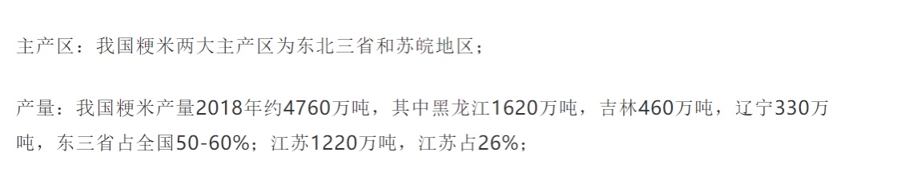
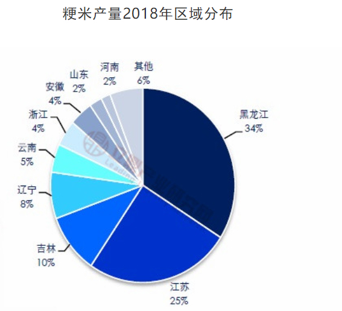
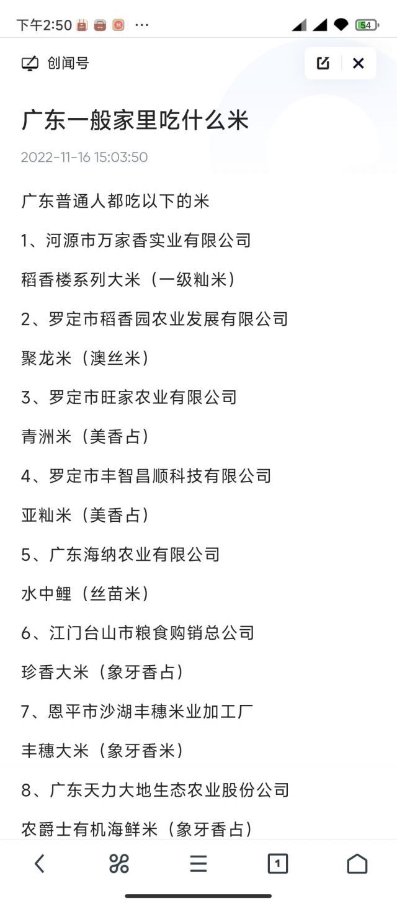
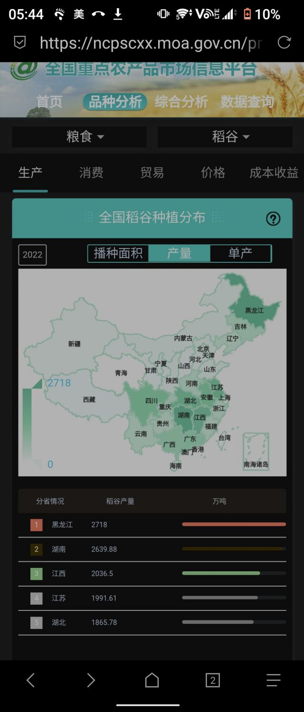
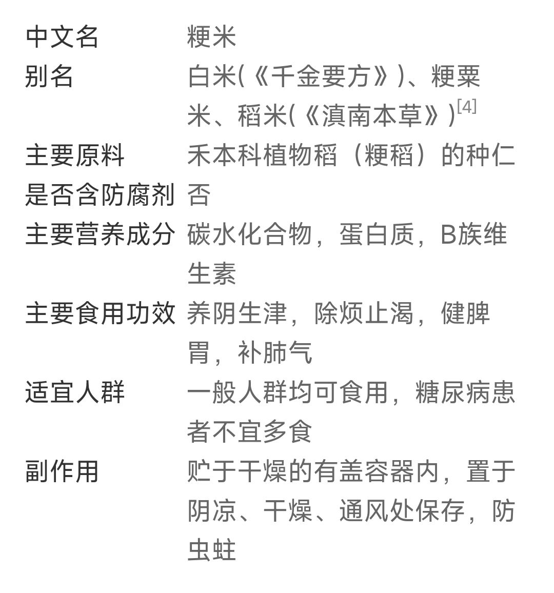
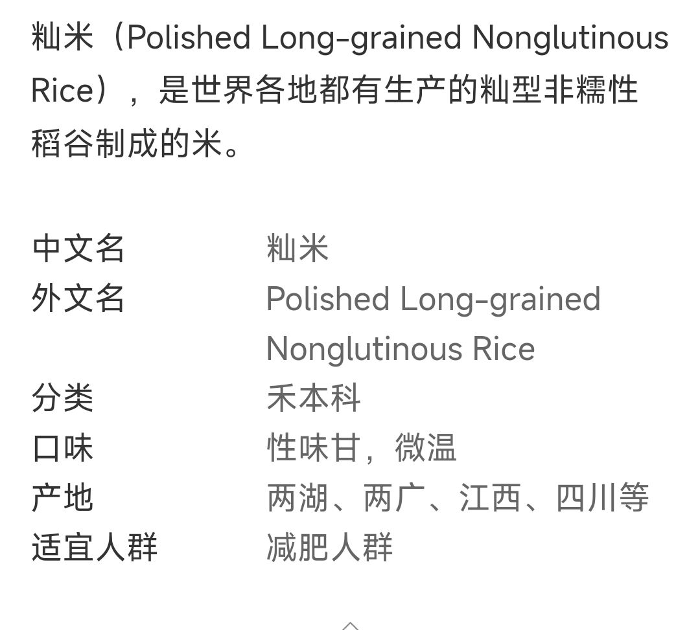
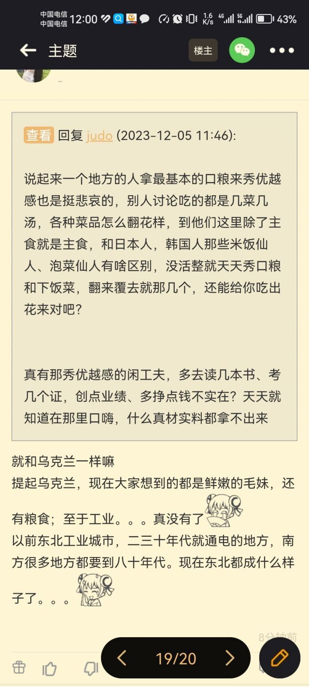
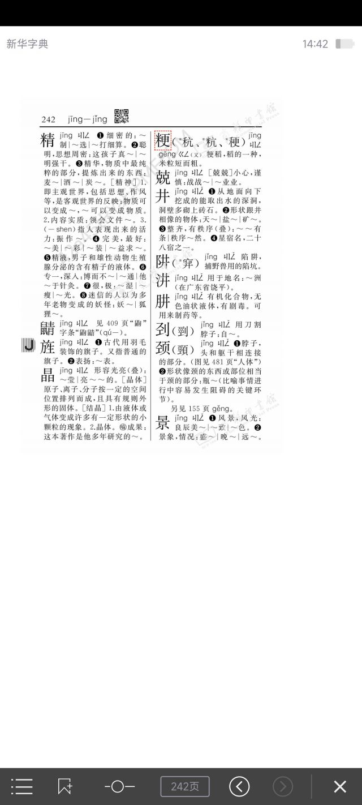

### 到底是谁在推动东北米取代南方米？

Made by ngapost2md (c) ludoux [GitHub Repo](https://github.com/ludoux/ngapost2md)

----

##### 0.[0] \<pid:0\> 2023-12-05 01:47:15 by 愛才七元錢\(福建\)
现在去商场吃饭基本都只提供粳米了！想要碗籼米都没有！这样做有没有考虑南方粮农怎么生活？

----

##### 1.[416] \<pid:730597167\> 2023-12-05 01:49:57 by 每每ever\(北京\)
南方主要稻米产区也是粳米啊(就是古代鱼米之乡这一片儿

----

##### 2.[473] \<pid:730597182\> 2023-12-05 01:50:13 by sd58203753\(重庆\)
是钱在推动东北米
东北地广人稀，种米直接机械化大生产，比南方种米感觉更有油水。
南方好点的平地要不是有政策管着，当地更想拿来建房开厂

----

##### 4.[466] \<pid:730597654\> 2023-12-05 01:58:20 by 馄饨猫\(北京\)
>[jump](#pid730597209) 自闭334(2023-12-05 01:50) 说: 
>
>南方米就是答辩

+1，以前难以下咽才磨浆做米粉

----

##### 5.[614] \<pid:730597776\> 2023-12-05 02:00:30 by 宫本y3\(河北\)
不是嘲讽你们南方人啊，南方米能吃？？？

----

##### 6.[425] \<pid:730597790\> 2023-12-05 02:00:44 by 秦武王嬴荡\(江苏\)
你有没有想过为什么会把米磨成粉做成米线肠粉这些东西？

----

##### 7.[117] \<pid:730597872\> 2023-12-05 02:02:18 by muxiong\(河南\)
我这北方超市都可以买到丝苗米。。。
你那超市买不到可太遗憾了

----

##### 8.[69] \<pid:730597963\> 2023-12-05 02:04:06 by 立于黄昏中\(中国\)
多吃点有营养的东西吧

----

##### 9.[253] \<pid:730597976\> 2023-12-05 02:04:19 by 最后的初生儿\(广东\)
又到了我最喜欢的南征北战环节咯。

----

##### 10.[137] \<pid:730598062\> 2023-12-05 02:05:55 by paillard\(浙江\)
我父母30年前刚下海时卖过粮油，南方一样吃粳米，最好吃的就是东北米。

我最早有印象的价格，东北珍珠米1.4/斤，太湖珍珠米1.3/斤，泰国香米3~4/斤。

东北/太湖珍珠米粳米，就是比泰国香米籼米好吃，评价不以价格为转移。

----

##### 11.[41] \<pid:730598068\> 2023-12-05 02:06:00 by kgb1110\(陕西\)
南方米真的很难吃，一直吃东北米

----

##### 12.[0] \<pid:730598107\> 2023-12-05 02:06:40 by ForMichaelJackson\(上海\)
这俩字咋读啊，哪位语文分高的解读下

----

##### 13.[81] \<pid:730598217\> 2023-12-05 02:09:04 by 罐狸鸢σ\(北京\)
怎么，东北连粮食都不能种了？

----

##### 14.[0] \<pid:730598239\> 2023-12-05 02:09:30 by 还睡呢\(江苏\)
>[jump](#pid730597209) 自闭334(2023-12-05 01:50) 说: 
>
>南方米就是答辩

说难吃也就算了，说答辩是不是太过分了？

----

##### 15.[68] \<pid:730598417\> 2023-12-05 02:13:25 by coococo91\(辽宁\)
我觉得，你是在问

到底是谁在推动国产米取代越南米？

讲真上网十几年第一次真的是在说越南

----

##### 16.[1] \<pid:730598530\> 2023-12-05 02:15:29 by 部落勇士都是狗\(北京\)
>[jump](#pid730598239) 还睡呢(2023-12-05 02:09) 说: 
>
>说难吃也就算了，说答辩是不是太过分了？

你这太过认真以至于觉得你是反串。。。要不你觉得米粉这玩意儿咋来的

----

##### 17.[57] \<pid:730598565\> 2023-12-05 02:16:18 by 噗乐蛙\(山东\)
一生要强的____________
哈哈哈哈哈哈哈哈

----

##### 18.[49] \<pid:730598734\> 2023-12-05 02:20:10 by cytyjm\(陕西\)
>[jump](#pid730598107) ForMichaelJackson(2023-12-05 02:06) 说: 
>
>这俩字咋读啊，哪位语文分高的解读下

粳jing 籼xian
都是一声

----

##### 19.[9] \<pid:730598759\> 2023-12-05 02:20:40 by 微笑不反抗\(重庆\)
>[jump](#pid730598062) paillard(2023-12-05 02:05) 说: 
>
>我父母30年前刚下海时卖过粮油，南方一样吃粳米，最好吃的就是东北米。
>
>我最早有印象的价格，东北珍珠米1.4/斤，太湖珍珠米1.3/斤，泰国香米3~4/斤。
>
>东北/太湖珍珠米粳米，就是比泰国香米籼米好吃，评价不以价格为转移。

珍珠米是真的好吃
小时候我家买米都是买8毛的汉中米
后面别人送了一袋泰国珍珠米，真的是惊为天人
当时还去超市看了下，同款泰国珍珠米超市要卖3块5一斤
以前家里轮不到我做主，只能继续吃了十几年便宜米
一边吃一边在心里暗暗发誓——等我有钱了再也不吃汉中米
等我工作之后直接包下了家里买米这件事，天天怼着珍珠米、五常米买
导致我妈天天念我败家

----

##### 21.[0] \<pid:730598884\> 2023-12-05 02:23:38 by 还睡呢\(江苏\)
>[jump](#pid730598530) 部落勇士都是狗(2023-12-05 02:15) 说: 
>
>你这太过认真以至于觉得你是反串。。。要不你觉得米粉这玩意儿咋来的

串什么了？我有说籼米好吃吗？没有米线的家伙

----

##### 22.[16] \<pid:730598894\> 2023-12-05 02:23:53 by UID5931776\(墨西哥\)
南方很多地方就是强行种的根本不适合，湖南米因为土地铬超标，还得混其他地方的米才能达到国家标准上架销售。

----

##### 23.[87] \<pid:730598960\> 2023-12-05 02:25:38 by 伊利丹爱琴海\(吉林\)
>[jump](#pid730598815) 病院坂有希(2023-12-05 02:22) 说: 
>
>北方也就靠这个来吹牛逼了。

粮食安全在你这仅限于吃的大米么？知道肉蛋奶是怎么来的么？

----

##### 24.[16] \<pid:730599061\> 2023-12-05 02:27:44 by 鸭话专家赛麦\(北京\)
没人推动，只是国家粮食供给结构现在就是北粮南运，所以你吃到东北大米的概率自然就提高了。

----

##### 25.[8] \<pid:730599076\> 2023-12-05 02:28:11 by 摸鱼圣手\(陕西\)
>[jump](#pid730598759) 微笑不反抗(2023-12-05 02:20) 说: 
>
>珍珠米是真的好吃
>小时候我家买米都是买8毛的汉中米
>后面别人送了一袋泰国珍珠米，真的是惊为天人
>当时还去超市看了下，同款泰国珍珠米超市要卖3块5一斤
>以前家里轮不到我做主，只能继续吃了十几年便宜米
>一边吃一边在心里暗暗发誓——等我有钱了再也不吃这狗屁汉中米
>等我工作之后直接包下了家里买米这件事，天天怼着珍珠米、五常米买
>导致我妈天天念我败家

汉中人受到了暴击

----

##### 27.[15] \<pid:730599134\> 2023-12-05 02:29:58 by Guayaba\(江苏\)
什么时候都不要道德绑架消费者，还是说商家换米如果导致营业额减少你给补上

----

##### 28.[3] \<pid:730599161\> 2023-12-05 02:30:41 by Huapen_BalconyLord\(辽宁\)
那啥我有点五谷不分，做出来细长的硬硬的颗粒分明的是粳米还是籼米……如果再加一条定语的话是美国的一些中餐馆/印度餐馆会用的米

----

##### 29.[15] \<pid:730599196\> 2023-12-05 02:31:41 by 微笑不反抗\(重庆\)
>[jump](#pid730599076) 摸鱼圣手(2023-12-05 02:28) 说: 
>
>汉中人受到了暴击

汉中米当年真是把我吃出心里阴影了
超市里最便宜的一款
我妈煮饭习惯又偏软，真是一言难尽
小时候就盼着是我爸去买米
因为我爸至少会挑一下，选1块2左右好一点的
我妈真是就是哪个最便宜选哪个，能糊弄嘴就行
直接导致汉中米在我心中留下了“最低端的米”这个印象

----

##### 30.[2] \<pid:730599198\> 2023-12-05 02:31:45 by 清尘君__\(浙江\)
东北米确实好吃

----

##### 31.[7] \<pid:730599267\> 2023-12-05 02:33:28 by 听潮的海蛎子\(加拿大\)
是我干的。

----

##### 32.[7] \<pid:730599425\> 2023-12-05 02:37:14 by 只为周郎顾\(广西\)
两广好吃的煲仔饭很多会三种米一起用，东北圆头米 南方的丝苗米 还有泰国的香米，再加点稻米油，饭香口感又好

南方很多地方地形确实不适合做商品粮基地这是客观事实，我国几大商品粮基地主要也是集中在华北平原和东北三江平原那边

----

##### 33.[0] \<pid:730599454\> 2023-12-05 02:38:10 by 一位路过的DK\(河北\)
>[jump](#pid730598239) 还睡呢(2023-12-05 02:09) 说: 
>
>说难吃也就算了，说答辩是不是太过分了？

南方米，又碎又难吃，就是浪费炒菜的存在，真是遭罪。希望东北米统一全国。

----

##### 34.[19] \<pid:730599511\> 2023-12-05 02:39:43 by Guayaba\(江苏\)
>[jump](#pid730599161) Huapen_BalconyLord(2023-12-05 02:30) 说: 
>
>那啥我有点五谷不分，做出来细长的硬硬的颗粒分明的是粳米还是籼米……如果再加一条定语的话是美国的一些中餐馆/印度餐馆会用的米

欧美印度市场一般用的是阿拉伯米，一粒更比五粒长，硬要说是籼米，但是和国内米差别太大了。这个是真答辩，评价为不配咖喱没法吃

----

##### 35.[0] \<pid:730599559\> 2023-12-05 02:40:45 by 部落勇士都是狗\(北京\)
>[jump](#pid730598884) 还睡呢(2023-12-05 02:23) 说: 
>
>串什么了？我有说籼米好吃吗？没有米线的家伙

就是难吃的像答辩 要不然为啥南方本地的当时都做成米粉

----

##### 36.[0] \<pid:730600016\> 2023-12-05 02:51:16 by 魔山居士gggr\(湖北\)
>[jump](#pid730597167) 每每ever(2023-12-05 01:49) 说: 
>
>南方主要稻米产区也是粳米啊(就是古代鱼米之乡这一片儿

湖广熟，天下足。不知道我们湖北算不算传统产粮鱼米之乡？ 湖北最有代表的京山桥米不是汕米？

----

##### 37.[13] \<pid:730600358\> 2023-12-05 02:59:55 by 还睡呢\(江苏\)
>[jump](#pid730599559) 部落勇士都是狗(2023-12-05 02:40) 说: 
>
>就是难吃的像答辩 要不然为啥南方本地的当时都做成米粉

不知道，不认识粳米。
只认识米线，祝你天天顿顿嘴里有米线。

----

##### 38.[2] \<pid:730600369\> 2023-12-05 03:00:21 by 夏彩\(中国\)
真的有那么大差距吗？找个机会试试

----

##### 39.[25] \<pid:730600459\> 2023-12-05 03:02:33 by 鹿大王呢\(陕西\)
只有一个原因，东北的大米好吃，就这么简单，我以前也去过湖南，那时候去小吃店米饭随便盛，但是真的不好吃。
东北的大米也不是自古就有的，也是引进各种品种再改良才适合寒地种植，一年一熟。

----

##### 40.[0] \<pid:730600725\> 2023-12-05 03:10:09 by ayane250\(海南\)
>[jump](#pid730600016) 魔山居士gggr(2023-12-05 02:51) 说: 
>
>湖广熟，天下足。不知道我们湖北算不算传统产粮鱼米之乡？ 湖北最有代表的京山桥米不是汕米？

湖北算鱼米之乡？头一次听说

----

##### 41.[1] \<pid:730600825\> 2023-12-05 03:13:35 by NGA左轮回\(江苏\)
江苏的米算哪的米啊，我们这也没啥米粉啊

----

##### 42.[0] \<pid:730600961\> 2023-12-05 03:17:28 by Andwang\(广东\)
>[jump](#pid730598239) 还睡呢(2023-12-05 02:09) 说: 
>
>说难吃也就算了，说答辩是不是太过分了？

应该说浪费答辩，我小时候吃过一次东北大米，那种米连菜都不要我能吃两碗

----

##### 43.[0] \<pid:730601049\> 2023-12-05 03:20:29 by 调停官\(辽宁\)

没吃过南方米，不好说，等吃了再来锐评

----

##### 44.[0] \<pid:730601062\> 2023-12-05 03:20:51 by xpaladinz\(上海\)
以前的松江大米真的好吃，新米烧的没菜多能吃几大碗，现在不行了，不是稻米不行是地不行了

----

##### 45.[4] \<pid:730601674\> 2023-12-05 03:44:31 by 终于注册成功\(黑龙江\)
>[jump](#pid730598107) ForMichaelJackson(2023-12-05 02:06)说:
>这俩字咋读啊，哪位语文分高的解读下

<b>经米，仙米。
</b>

----

##### 46.[10] \<pid:730601755\> 2023-12-05 03:48:05 by 终于注册成功\(黑龙江\)
>[jump](#pid730600358) 还睡呢(2023-12-05 02:59) 说: 
>
>
>
>不知道，不认识粳米。
>只认识米线，祝你天天顿顿嘴里有米线。

笑死了，三年来第一次看见江苏人把江苏当成一整个省。

----

##### 47.[37] \<pid:730601846\> 2023-12-05 03:52:57 by xpaladinz\(上海\)
>[jump](#pid730601755) 终于注册成功(2023-12-05 03:48) 说: 
>
>笑死了，三年来第一次看见江苏人把江苏当成一整个省。

国内数据统计不按省市来？你是准备按县还是按街道村委算啊！

----

##### 48.[0] \<pid:730601876\> 2023-12-05 03:54:17 by 押切もえ\(中国\)
小时候东北米少因为东北都在发展工业吧，现在东北工业不行就大米就成主推物了

----

##### 49.[0] \<pid:730601958\> 2023-12-05 03:57:55 by tmmter\(辽宁\)
>[jump](#pid730601846) xpaladinz(2023-12-05 03:52) 说: 
>
>国内数据统计不按省市来？你是准备按县还是按街道村委算啊！

江苏各算各的不是泥潭共识吗

----

##### 50.[7] \<pid:730602004\> 2023-12-05 03:59:44 by ccMIRCAL\(内蒙古\)
一年几熟怎么跟一年一熟打

----

##### 51.[0] \<pid:730602041\> 2023-12-05 04:01:22 by 貌为董卓内为袁绍\(吉林\)
对对对就这样不种大米不种主粮东西搞点经济作物包装运作下和什么农科院农学院挂个名，不行就烧   当然是烧玉米杆，玉米发展畜牧业   反正别几把搞粮食了，累死累活 都知道不挣钱。各省自己供给自己吧

~~这样就可以发现工业了~~  

我现在吃的是苏州的张家港西水道米 就好吃口感弹牙我推荐大家吃这个

----

##### 52.[2] \<pid:730602094\> 2023-12-05 04:04:28 by azuki7\(山东\)
正好相反，我是北方人，一直吃东北大米，之前有一阵经常去广西出差，特别喜欢那边的大米口感

----

##### 53.[0] \<pid:730602143\> 2023-12-05 04:07:28 by 山吹.\(重庆\)
南方的米就和北方的糖一样垃圾

----

##### 54.[13] \<pid:730602156\> 2023-12-05 04:08:15 by 继续前进i\(美国\)
>[jump](#pid730599161) Huapen_BalconyLord(2023-12-05 02:30)说:
>那啥我有点五谷不分，做出来细长的硬硬的颗粒分明的是粳米还是籼米……如果再加一条定语的话是美国的一些中餐馆/印度餐馆会用的米

是籼米，籼米又叫做印度稻，粳米又叫做日本稻
粳米一般是短粒米或者中粒米，米粒短，有粘性，常见于东北亚地区，主要以中国北方和日韩的菜肴为主，日本的寿司米，东北大米等等都是短粒米
籼米一般是长粒米，包括茉莉香米，以及南方产的籼米等等，粒长，没有粘性，常见于南亚地区，各种泰国，印度的菜肴，比如各种咖喱，糊糊等等菜品一般会配籼米比较多
粳米耐寒但是产量低，北方一年只能种一季；籼米耐热，而且在高温地区可以种好几季，产量高很多，中国最早的杂交水稻基本都是籼米品种，因为当时真的非常需要填饱肚子
虽然某些情况籼米会更适合菜品一些，比如炒饭一类；但是在单吃的情况下，保守说十个人至少有八个中国人会觉得粳米好吃
在美国的印度菜馆肯定会因为传统问题选用籼米的，但是中餐馆吃到籼米肯定是老板完全不想做大陆人生意或者偷工减料了，美国非进口的水稻里面单价最贵的就是日本引进，在加州种植的短粒水稻品种，最普遍的叫“koshihikari”，越光米，在日本也是最大的水稻品种，跟东北大米味道几乎没有区别，然而越光米单价超高，在美国可以卖到1斤米1刀多，有些中餐馆为了成本考量会选用成本稍低的中粒米，比如“nishiki”锦牌等等，直接用完全没有粘性的长粒米的挺少的

----

##### 55.[0] \<pid:730602286\> 2023-12-05 04:15:39 by 赵部柱\(江苏\)
籼米是真的难吃，可能比较健康？但确实难吃，我从小就吃不惯籼米。

----

##### 56.[0] \<pid:730602297\> 2023-12-05 04:16:10 by ztztztnn\(希腊\)
你以为为啥南边吃米粉和米糕，年糕

----

##### 57.[0] \<pid:730602448\> 2023-12-05 04:24:13 by xpaladinz\(上海\)
>[jump](#pid730602297) ztztztnn(2023-12-05 04:16) 说: 
>
>你以为为啥南边吃米粉和米糕，年糕

历史上南方以前没那么多小麦，汉人在南方想吃面食只能吃米粉而不是面粉

----

##### 58.[0] \<pid:730602495\> 2023-12-05 04:26:58 by 做事诚信余承东\(北京\)
我云南的

20年前就几乎没人种籼米了。。。

另外说南方没有好吃米的，去买云粳37试试。

----

##### 59.[0] \<pid:730602731\> 2023-12-05 04:39:20 by 真正的部落勇士\(广东\)
广东不吃东北米。
珍珠米一般是拿来煮粥。

----

##### 60.[0] \<pid:730602779\> 2023-12-05 04:42:16 by 唄妳宠坏\(中国\)
南方现在也种粳米  还是最新研究出来的 多看看农业

----

##### 61.[0] \<pid:730602900\> 2023-12-05 04:50:17 by zyfc007\(重庆\)
东北米好吃

----

##### 62.[0] \<pid:730603021\> 2023-12-05 04:57:42 by 糖好吃\(广东\)
这么多说东北米好吃的？我这单位慰问品次次买的五常大米，同事都苦不堪言，只能煲粥，做饭吃不了一点，粘粘的，一锅饭做出来一坨，不香不好吃。给提意见还不换，最近换领导了改买丝苗米，个个都说舒服了。

----

##### 63.[0] \<pid:730603066\> 2023-12-05 05:00:50 by 四分之一狗\(广东\)
>[jump](#pid730597209) 自闭334(2023-12-05 01:50) 说: 
>
>南方米就是答辩

你才是答辩

----

##### 64.[0] \<pid:730603363\> 2023-12-05 05:20:34 by 舛了个曦\(江苏\)
>[jump](#pid0) 愛才七元錢(2023-12-05 01:47) 说: 
>
>现在去商场吃饭基本都只提供粳米了！想要碗籼米都没有！这样做有没有考虑南方粮农怎么生活？

虽然有些让南方朋友可能难以接受，但是南方比确实是大便啊

----

##### 65.[23] \<pid:730603454\> 2023-12-05 05:26:18 by 花花盖\(中国\)
南大人是不是有被迫害妄想症？

----

##### 66.[5] \<pid:730603508\> 2023-12-05 05:30:38 by Ryulu\(美国\)
>[jump](#pid730597776) 宫本y3(2023-12-05 02:00) 说: 
>
>不是嘲讽你们南方人啊，南方米能吃？？？

确实，真就越北的地方种出来的越好吃

----

##### 67.[79] \<pid:730603543\> 2023-12-05 05:33:32 by 花花盖\(中国\)
>[jump](#pid730603021) 糖好吃(2023-12-05 04:57) 说: 
>
>这么多说东北米好吃的？我这单位慰问品次次买的五常大米，同事都苦不堪言，只能煲粥，做饭吃不了一点，粘粘的，一锅饭做出来一坨，不香不好吃。给提意见还不换，最近换领导了改买丝苗米，个个都说舒服了。

你们广东人啊，真是干什么都不服输

吃屎都得说你们的屎好吃

----

##### 68.[13] \<pid:730603571\> 2023-12-05 05:35:18 by bbvvmars\(上海\)
是的呢，
这是对南方的经济侵略和文化侵略！
建议国家禁止东北发展农业，
让他们滚回工业时代！

----

##### 69.[0] \<pid:730603603\> 2023-12-05 05:37:51 by 键盘车神GTR\(四川\)
九十年代初吃泰国香米那会真念念不忘，米还能这么香，那会表哥单位有发，他们单位还发可口可乐和各种劳保用品。

----

##### 70.[7] \<pid:730603644\> 2023-12-05 05:40:15 by 露西小囡\(韩国\)
这特么的也能挑起地域战争来啊
楼主你干脆说为啥东北人都往南方跑，抢南方人的饭碗这样更有话题性

----

##### 71.[5] \<pid:730603649\> 2023-12-05 05:40:29 by 遥远的海蓝石\(广东\)
南方米是指那种比较长条细身，煮起来比较干身不会发起来，口感比较爽的那种么

我就特喜欢那种米，以前外面茶楼吃饭都是那种，我吃得特别多，现在在外面都吃不到了，全换了

----

##### 72.[0] \<pid:730603668\> 2023-12-05 05:41:20 by 爱珍珍的小索索\(广西\)
>[jump](#pid730603021) 糖好吃(2023-12-05 04:57) 说: 
>
>这么多说东北米好吃的？我这单位慰问品次次买的五常大米，同事都苦不堪言，只能煲粥，做饭吃不了一点，粘粘的，一锅饭做出来一坨，不香不好吃。给提意见还不换，最近换领导了改买丝苗米，个个都说舒服了。

还真是，吃不惯，我们家就拿来喂鸡

----

##### 73.[1] \<pid:730603859\> 2023-12-05 05:55:11 by changjushai3\(澳大利亚\)
吃的东西当然是消费者用脚投票

----

##### 74.[4] \<pid:730603941\> 2023-12-05 05:59:54 by windhaven\(四川\)
稻谷除开一个黑龙江，主要产出还是南方这边，不知道具体用于深加工的比例有多少，但市场上那么多单独卖的都喜欢叫个东北大米肯定不太对劲，稻谷总产量都1.5亿吨了，很好奇这里面有多少挂羊头卖狗肉
个人算比较异类了，不太喜欢黏乎乎口感的食物，汤汤水水多没所谓，但秋葵、糯米、山药、粘豆包、藕粉或者其他勾了浓芡的是真咽不下去，松软没粘性的那种印度米还挺很合口味的

----

##### 75.[0] \<pid:730603963\> 2023-12-05 06:01:11 by 胡十八\(北京\)
>[jump](#pid730601049) 调停官(2023-12-05 03:20) 说: 
>
>
>没吃过南方米，不好说，等吃了再来锐评

可以尝尝，和吃木头渣子区别不大。

----

##### 76.[2] \<pid:730604179\> 2023-12-05 06:14:17 by 自动化-周一多\(四川\)
>[jump](#pid730602156) 继续前进i(2023-12-05 04:08) 说: 
>
>是籼米，籼米又叫做印度稻，粳米又叫做日本稻
>粳米一般是短粒米或者中粒米，米粒短，有粘性，常见于东北亚地区，主要以中国北方和日韩的菜肴为主，日本的寿司米，东北大米等等都是短粒米
>籼米一般是长粒米，包括茉莉香米，以及南方产的籼米等等，粒长，没有粘性，常见于南亚地区，各种泰国，印度的菜肴，比如各种咖喱，糊糊等等菜品一般会配籼米比较多
>粳米耐寒但是产量低，北方一年只能种一季；籼米耐热，而且在高温地区可以种好几季，产量高很多，中国最早的杂交水稻基本都是籼米品种，因为当时真的非常需要填饱肚子
>虽然某些情况籼

同样是长粒米
泰米和印度米味道差别很大的
泰国香米是香软而且有一定弹性的
印度米完全是水垮垮的  

我们家一直吃泰国或者柬埔寨的香米，很好吃
但是有时候吃到印度那种米(比如去马尔代夫的时候)
看着好看
完全没法吃  
国内吃饭也碰到过几次。
短粒米同样有好吃的，也有偏硬或者黏牙嚼不烂的。
只能说不能只看大类。具体的品种差别巨大。

----

##### 77.[0] \<pid:730604213\> 2023-12-05 06:16:01 by 断尾巴小瘸猫\(辽宁\)
南方那种长米做成煲仔饭或者炒饭还是好吃的
我不爱吃白米饭 觉得没啥味道

----

##### 78.[0] \<pid:730604330\> 2023-12-05 06:22:50 by 青鸟往事\(新疆\)
露珠阔以用两种以上的大米混合配置不同比例一天的大米用量，这样的大米营养更丰富，阔以适应不同的人群体质

----

##### 79.[0] \<pid:730604451\> 2023-12-05 06:29:30 by 终于注册成功\(黑龙江\)
>[jump](#pid730601846) xpaladinz(2023-12-05 03:52) 说: 
>
>国内数据统计不按省市来？你是准备按县还是按街道村委算啊！

江苏以外的都按江苏省，你们江苏自己按啥没B数吗。

----

##### 80.[0] \<pid:730604608\> 2023-12-05 06:37:22 by 我就不改名字\(广西\)
煲仔饭的米是什么米？那个米才好吃

----

##### 81.[0] \<pid:730604745\> 2023-12-05 06:43:16 by 大王的娘家\(上海\)
>[jump](#pid730603941) windhaven(2023-12-05 05:59) 说: 
>
>稻谷除开一个黑龙江，主要产出还是南方这边，不知道具体用于深加工的比例有多少，但市场上那么多单独卖的都喜欢叫个东北大米肯定不太对劲，稻谷总产量都1.5亿吨了，很好奇这里面有多少挂羊头卖狗肉
>个人算比较异类了，不太喜欢黏乎乎口感的食物，汤汤水水多没所谓，但秋葵、糯米、山药、粘豆包、藕粉或者其他勾了浓芡的是真咽不下去，松软没粘性的那种印度米还挺很合口味的

国家水稻数据中心查品种可以挑自己喜欢的。要粘的糯的就选直链淀粉低的，硬的不粘的就选直链淀粉高的，20以上差不多就是籼米了。多试几个品种，总能挑到自己喜欢的。

----

##### 82.[0] \<pid:730604835\> 2023-12-05 06:46:25 by meteor0926\(河南\)
几乎不吃米饭的人不知道你们在说啥...

----

##### 83.[0] \<pid:730604875\> 2023-12-05 06:48:40 by 小黄鸭子还活着\(中国\)
大米好吃，要旱地的水稻

----

##### 84.[0] \<pid:730605037\> 2023-12-05 06:55:28 by 言过一般形式\(广东\)
炒饭用粘性低点的米很好
看到上边有人说东北米粘性高吃起来苦不堪言。。正是因为有粘性才好用筷子把饭送进嘴里，优点是米饭香口感好，没粘性的米都是端着碗一筷子一筷子扒着吃的，优点是拌酱料比较方便

----

##### 85.[0] \<pid:730605273\> 2023-12-05 07:02:45 by 灰谷暗夜猎人\(湖北\)
从小吃杂交水稻长大的，湖北人，我觉得籼米比东北大米好吃，每次买米都买国宝京桥……
吃过最好吃的米是猫牙米

----

##### 86.[0] \<pid:730605376\> 2023-12-05 07:05:47 by 飒飒意志\(江苏\)
>[jump](#pid730598734) cytyjm(2023-12-05 02:20) 说: 
>
>粳jing 籼xian
>都是一声

我们那边念 geng 第三声

----

##### 87.[0] \<pid:730605377\> 2023-12-05 07:05:50 by bjbyh\(中国\)
看你们论辩真有意思

----

##### 88.[4] \<pid:730605427\> 2023-12-05 07:07:32 by 灰谷暗夜猎人\(湖北\)
>[jump](#pid730604608) 我就不改名字(2023-12-05 06:37) 说: 
>
>煲仔饭的米是什么米？那个米才好吃

那是籼米，也是南方的米

----

##### 89.[0] \<pid:730605446\> 2023-12-05 07:08:08 by 吟游竖琴手\(广东\)
>[jump](#pid730603021) 糖好吃(2023-12-05 04:57) 说: 
>
>这么多说东北米好吃的？我这单位慰问品次次买的五常大米，同事都苦不堪言，只能煲粥，做饭吃不了一点，粘粘的，一锅饭做出来一坨，不香不好吃。给提意见还不换，最近换领导了改买丝苗米，个个都说舒服了。

那可能是你们单位的问题
我们单位发大米当慰问品，如果不是五常米，工会那几个是要被各部门领导轮番点名的

----

##### 90.[0] \<pid:730605496\> 2023-12-05 07:09:50 by 鶴鹤鹤\(河北\)
不会有人觉得南方那种米好吃吧

----

##### 91.[0] \<pid:730605597\> 2023-12-05 07:12:13 by 专怼歪门邪道\(宁夏\)
>[jump](#pid730603021) 糖好吃(2023-12-05 04:57) 说: 
>
>这么多说东北米好吃的？我这单位慰问品次次买的五常大米，同事都苦不堪言，只能煲粥，做饭吃不了一点，粘粘的，一锅饭做出来一坨，不香不好吃。给提意见还不换，最近换领导了改买丝苗米，个个都说舒服了。

五常大米……你能买的到？我哈尔滨的，都吃不到正宗五常大米。只能买到五常附近的大米。

----

##### 92.[0] \<pid:730605631\> 2023-12-05 07:13:26 by 庆盛大包\(广东\)
南方米确实不好吃

----

##### 93.[0] \<pid:730605827\> 2023-12-05 07:18:10 by 右代宫魔理沙\(广东\)
不知道，反正发的卡全部买金象了，应该是籼米吧。

----

##### 94.[0] \<pid:730605904\> 2023-12-05 07:19:42 by Vuxbom\(河北\)
>[jump](#pid730602156) 继续前进i(2023-12-05 04:08) 说: 
>
>是籼米，籼米又叫做印度稻，粳米又叫做日本稻
>粳米一般是短粒米或者中粒米，米粒短，有粘性，常见于东北亚地区，主要以中国北方和日韩的菜肴为主，日本的寿司米，东北大米等等都是短粒米
>籼米一般是长粒米，包括茉莉香米，以及南方产的籼米等等，粒长，没有粘性，常见于南亚地区，各种泰国，印度的菜肴，比如各种咖喱，糊糊等等菜品一般会配籼米比较多
>粳米耐寒但是产量低，北方一年只能种一季；籼米耐热，而且在高温地区可以种好几季，产量高很多，中国最早的杂交水稻基本都是籼米品种，因为当时真的非常需要填饱肚子
>虽然某些情况籼

越光米和东北米有区别，我个人认为越光米比东北米更好吃，包括核心产区的欧标有机五常大米

----

##### 95.[0] \<pid:730605928\> 2023-12-05 07:20:24 by targetme\(广东\)
米饭东北米好吃，南方米煮粥煲仔饭还是可以的

----

##### 96.[0] \<pid:730605934\> 2023-12-05 07:20:35 by 铁皮憨\(江苏\)
鱼米之乡想笑

----

##### 97.[0] \<pid:730605965\> 2023-12-05 07:21:19 by eleman\(上海\)
自然选择

----

##### 98.[0] \<pid:730605984\> 2023-12-05 07:21:49 by Vuxbom\(河北\)
>[jump](#pid730605597) 专怼歪门邪道(2023-12-05 07:12) 说: 
>
>五常大米……你能买的到？我哈尔滨的，都吃不到正宗五常大米。只能买到五常附近的大米。

买得到，就是贵，核心产区的，欧标有机五常大米，十几块钱一斤

----

##### 99.[0] \<pid:730605996\> 2023-12-05 07:22:06 by Death Knight\(天津\)
羊驼，南方人自己选择不种主粮，你怪市场？

----

##### 100.[0] \<pid:730606244\> 2023-12-05 07:26:43 by hemingmoon\(北京\)
>[jump](#pid730602041) 貌为董卓内为袁绍(2023-12-05 04:01) 说: 
>
>对对对就这样不种大米不种主粮东西搞点经济作物包装运作下和什么农科院农学院挂个名，不行就烧   当然是烧玉米杆，玉米发展畜牧业   反正别几把搞粮食了，累死累活 都知道不挣钱。各省自己供给自己吧
>
>~~这样就可以发现工业了~~  
>
>我现在吃的是苏州的张家港西水道米 就好吃口感弹牙我推荐大家吃这个

非常非常同意这层主说的！！！无法更同意！

但是能把之前几十年欠的账还一下么？

----

##### 101.[0] \<pid:730606299\> 2023-12-05 07:27:49 by 映色\(河南\)
我从小在郑州长大，一顿面条都不在家里吃，外头的烩面也从来不吃一碗

家里为了我一直都是 5 块左右的东北米

后来在南方读书他们说你像个南方人 
我说南方米 狗都不吃

----

##### 103.[34] \<pid:730607145\> 2023-12-05 07:42:08 by judo\(广东\)
楼上某些用米粉来论证粳米比籼米高级的真是够了。合着你们以为中国北方汉代以后才逐渐把小麦做主食是为什么？难道北方人天天吃包子馒头是因为麦片粥不好吃对吧？

我一个南方人活了40多年，也没听过哪个南方省份吃大米还要顿顿加工成米线的……

还有，是不是你们觉得南宋引入占城稻是因为南宋人傻逼啊，还是说泰国丝苗这么有名是因为南方人还有东南亚各国都是低等牲畜不如你们高贵对吧？

吃个大米都能吃出优越感，确实挺符合我对某些人的刻板印象的，做梦都是我祖上是正统xxx旗老贵族，合着活成您这都能活出贵族范了是吧？

----

##### 104.[0] \<pid:730607154\> 2023-12-05 07:42:15 by 剑仙曲无劫\(辽宁\)
小时候本地米反正是不吃的，除了餐馆提供的免费米饭

----

##### 105.[1] \<pid:730607175\> 2023-12-05 07:42:32 by 红茶QQ\(广西\)
还能有谁推动，南方种米基本上都是亏钱，要不谁发对，谁去承包田地种米去。
南方大多数田地不成片，比较适合种高附加值的经济作物，天气原因，一年四季都比较方便就近管理，南方果蔬产量大也真是此原因。
很多农村人都买米吃了现在。

----

##### 106.[0] \<pid:730607179\> 2023-12-05 07:42:38 by 时雨思\(浙江\)
吃过东北米后就再也没买过南方米，好难吃

----

##### 107.[0] \<pid:730607263\> 2023-12-05 07:43:52 by xutaonasa\(上海\)
>[jump](#pid730598530) 部落勇士都是狗(2023-12-05 02:15) 说: 
>
>你这太过认真以至于觉得你是反串。。。要不你觉得米粉这玩意儿咋来的

南方全是米粉？

----

##### 108.[10] \<pid:730607300\> 2023-12-05 07:44:14 by Rho_Aias\(英国\)
这玩意儿还用推广？东北大米就是比南方米好吃啊，没有任何恶意
之前去江西考察住村里吃了一个月南方米，给我吃的痛不欲生

----

##### 109.[0] \<pid:730607308\> 2023-12-05 07:44:19 by Rauing\(北京\)
>[jump](#pid730598815) 病院坂有希(2023-12-05 02:22) 说: 
>
>北方也就靠这个来吹牛逼了。

米面都被北方统治，怎么你还想吃什么

----

##### 110.[0] \<pid:730607423\> 2023-12-05 07:46:15 by 永远的菲\(广西\)
不是我嘲讽各位北方人，你们真的是孤陋寡闻

----

##### 111.[12] \<pid:730607448\> 2023-12-05 07:46:33 by ezprodigy1\(加拿大\)
>[jump](#pid730598815) 病院坂有希(2023-12-05 02:22) 说: 
>
>北方也就靠这个来吹牛逼了。

最冷最热最宜居的地域狗来啦？吃个大米你都忍受不了真是可怜你呢

----

##### 112.[5] \<pid:730607462\> 2023-12-05 07:46:47 by 逍遥我行007\(中国\)
傻逼太多而已
各有特色

炒饭我选丝苗米

----

##### 113.[0] \<pid:730607648\> 2023-12-05 07:49:12 by 天狗未来がない\(广东\)
你想来推动梯田种米？

----

##### 114.[12] \<pid:730607662\> 2023-12-05 07:49:26 by ezprodigy1\(加拿大\)
>[jump](#pid730607145) judo(2023-12-05 07:42) 说: 
>
>楼上某些用米粉来论证粳米比籼米高级的真是够了。合着你们以为中国北方汉代以后才逐渐把小麦做主食是为什么？难道北方人天天吃包子馒头是因为麦片粥不好吃对吧？
>
>我一个南方人活了40多年，也没听过哪个南方省份吃大米还要顿顿加工成米线的……
>
>
>还有，是不是你们觉得南宋引入占城稻是因为南宋人傻逼啊，还是说泰国丝苗这么有名是因为南方人还有东南亚各国都是低等牲畜不如你们高贵对吧？
>
>吃个大米都能吃出优越感，确实挺符合我对某些人的刻板印象的，做梦都是我祖上是正统xxx旗老贵族，合着活成您这都能活出贵族范了是吧？

别人大米比你好吃都接受不了也要对比真是符合我对某些人的刻板印象啊，毕竟最冷最热最宜居，中华正统说的都是古汉语，全部都很低调但是所有人都有十套楼收租，坏事全是外地人干的对吧

----

##### 115.[0] \<pid:730607703\> 2023-12-05 07:49:59 by zhx2hqn\(广东\)
>[jump](#pid730597209) 自闭334(2023-12-05 01:50) 说: 
>
>南方米就是答辩

北方米屎一样

----

##### 116.[0] \<pid:730607776\> 2023-12-05 07:51:00 by kytezz\(河南\)
>[jump](#pid730606299) 映色(2023-12-05 07:27) 说: 
>
>我从小在郑州长大，一顿面条都不在家里吃，外头的烩面也从来不吃一碗
>
>家里为了我一直都是 5 块左右的东北米
>
>后来在南方读书他们说你像个南方人?
>我说南方米 狗都不吃

你是真不懂啊
新乡原阳的黄金晴是非常好的大米 比大多数东北米好吃

----

##### 117.[3] \<pid:730607787\> 2023-12-05 07:51:08 by walysclw\(北京\)
>[jump](#pid730600725) ayane250(2023-12-05 03:10) 说: 
>
>湖北算鱼米之乡？头一次听说

洪湖水呀浪呀嘛浪打浪啊，
洪湖岸边是呀嘛是家乡啊，
清早船儿去呀去撒网，
晚上回来鱼满舱。
四处野鸭和菱藕啊，
秋收满畈稻谷香，
人人都说天堂美，
怎比我洪湖鱼米乡。

----

##### 118.[0] \<pid:730607803\> 2023-12-05 07:51:17 by zhx2hqn\(广东\)
>[jump](#pid730606244) hemingmoon(2023-12-05 07:26) 说: 
>
>非常非常同意这层主说的！！！无法更同意！
>
>
>
>
>
>
>但是能把之前几十年欠的账还一下么？

什么账？
全国支援东北的账么

----

##### 119.[0] \<pid:730608012\> 2023-12-05 07:53:44 by judo\(广东\)
>[jump](#pid730607662) ezprodigy1(2023-12-05 07:49) 说: 
>
>别人大米比你好吃都接受不了也要对比真是符合我对某些人的刻板印象啊，毕竟最冷最热最宜居，中华正统说的都是古汉语，全部都很低调但是所有人都有十套楼收租，坏事全是外地人干的对吧

是是是，您说的对，南方人都是傻逼，北方大米天下无敌，南方人做饭都惨到顿顿加工成米线，就像北方人吃个小麦还要顿顿磨成面粉，所以吃面粉和吃籼米的都是傻逼，长江流域、珠江流域开除人籍、广东、江浙都是弱智，您满意了吧？

----

##### 120.[1] \<pid:730608096\> 2023-12-05 07:54:41 by euuns\(北京\)
吃个大米饭都有这么多南大人破防真是把自己当宇宙中心了吗

----

##### 121.[0] \<pid:730608223\> 2023-12-05 07:56:22 by QASHQAI\(浙江\)
江苏的南粳系列口感非常不错的。我湖南人绝对认可。
南粳46  南粳5055   南粳9108都非常不错。

----

##### 122.[0] \<pid:730608237\> 2023-12-05 07:56:30 by 真相才是快刀\(广东\)
就东北米那口感
只能说在广东这是宁愿吃面也没人会选的米

----

##### 123.[0] \<pid:730608336\> 2023-12-05 07:57:31 by SuperTable\(上海\)
反正我买的十块一斤的五常米和封控居委发的杂牌米差不多味道，天知道他们吹的那么牛逼的米到底怎么才能买到

----

##### 124.[8] \<pid:730608488\> 2023-12-05 07:59:19 by WKVaan\(江苏\)
南方怎么定义的？我江苏粳米产量也不比东北少多少啊，也不常吃米线米粉，我们是要被开除南方籍？

----

##### 125.[0] \<pid:730608523\> 2023-12-05 07:59:39 by 暗耀之雾\(上海\)
>[jump](#pid730599161) Huapen_BalconyLord(2023-12-05 02:30) 说: 
>
>那啥我有点五谷不分，做出来细长的硬硬的颗粒分明的是粳米还是籼米……如果再加一条定语的话是美国的一些中餐馆/印度餐馆会用的米

籼米
泰国、东南亚的米都属于这一类
米粒细长 颗粒分明不易粘

----

##### 126.[0] \<pid:730608545\> 2023-12-05 07:59:48 by bws_ne\(福建\)
因为生活水平上去了，有限的胃想吃点更好吃的。

----

##### 127.[0] \<pid:730608664\> 2023-12-05 08:00:51 by 永远的菲\(广西\)
>[jump](#pid730608096) euuns(2023-12-05 07:54) 说: 
>
>吃个大米饭都有这么多南大人破防真是把自己当宇宙中心了吗

北方人这方面确实孤陋寡闻，居然真的以为南方没好吃的米，当然，量产确实比不上北方

----

##### 128.[3] \<pid:730608736\> 2023-12-05 08:01:36 by lepistanuda\(中国\)
咋还有人觉得种地是福报的

----

##### 129.[0] \<pid:730608825\> 2023-12-05 08:02:35 by niche669\(黑龙江\)
利益相关，看ip
我不说，有人替我说

----

##### 130.[0] \<pid:730608834\> 2023-12-05 08:02:44 by 真相才是快刀\(广东\)
>[jump](#pid730602297) ztztztnn(2023-12-05 04:16) 说: 
>
>你以为为啥南边吃米粉和米糕，年糕

你以为为啥北边吃饺子
还不是米太垃圾了

----

##### 131.[0] \<pid:730608988\> 2023-12-05 08:04:06 by 老陈陈陈陈\(江西\)
五常大米好吃

----

##### 132.[8] \<pid:730609021\> 2023-12-05 08:04:36 by 再来\(辽宁\)
看着楼里，多少人破防了，可怕的获胜欲，啥玩意都得争一下，和幼儿园小朋友一样，好可爱啊！

----

##### 133.[1] \<pid:730609141\> 2023-12-05 08:05:55 by zhx2hqn\(广东\)
>[jump](#pid730597654) 馄饨猫(2023-12-05 01:58) 说: 
>
>+1，以前难以下咽才磨浆做米粉

那东北肯定没面食了

----

##### 134.[0] \<pid:730609148\> 2023-12-05 08:06:01 by judo\(广东\)
>[jump](#pid730608664) 永远的菲(2023-12-05 08:00) 说: 
>
>北方人这方面确实孤陋寡闻，居然真的以为南方没好吃的米，当然，量产确实比不上北方

南方还有个产粮大省江西就这么被你开除了……还有，湖南、江苏、四川也不低的，北方量大更多是平原优势以及国家对不同省份的经济规划所致

----

##### 135.[3] \<pid:730609257\> 2023-12-05 08:07:05 by 灭嗳\(中国\)
我江苏的，我看着你们在争南方北方，我头一次迷糊了，我算哪的？我们这也是产米大区啊，也好吃的啊。

----

##### 136.[0] \<pid:730609369\> 2023-12-05 08:08:13 by 无聊转转\(浙江\)
我觉得江苏米也挺好吃的，主要是机械化压低成本，你在浙江福建种地，机器开不进去，再好吃也没人种啊

----

##### 137.[0] \<pid:730609429\> 2023-12-05 08:08:47 by jiuerd\(广东\)
>[jump](#pid730608336) SuperTable(2023-12-05 07:57) 说: 
>
>反正我买的十块一斤的五常米和封控居委发的杂牌米差不多味道，天知道他们吹的那么牛逼的米到底怎么才能买到

问就是网上买不到，老央企卖的也是假的

----

##### 138.[0] \<pid:730609491\> 2023-12-05 08:09:23 by 经常迷路\(北京\)
根本不想碰东北以外的大米，无法下咽。

----

##### 139.[0] \<pid:730609656\> 2023-12-05 08:11:00 by 真正的部落勇士\(广东\)
>[jump](#pid730608664) 永远的菲(2023-12-05 08:00) 说: 
>
>北方人这方面确实孤陋寡闻，居然真的以为南方没好吃的米，当然，量产确实比不上北方

额。。。其实我们的心头好是泰国的米，然后是本地的米(因为一样是籼米)，东北米根本就没有市场。

----

##### 140.[0] \<pid:730609738\> 2023-12-05 08:11:40 by 无药可救的卷毛\(江苏\)
南方也吃粳米的，江苏东南这块子有一个很好的米种叫南粳46

----

##### 141.[0] \<pid:730609742\> 2023-12-05 08:11:43 by 青泉石上流\(江苏\)
东北米确实好吃，淡水鱼也是东北的好吃，肉类也是

----

##### 142.[0] \<pid:730609838\> 2023-12-05 08:12:44 by cilebp\(辽宁\)
我来告诉你谁在推行
阅兵式站在那个红旗车上边的
他当年推的东北大粮仓，把黑龙江从工业省变成农业省

----

##### 143.[13] \<pid:730609855\> 2023-12-05 08:12:52 by Mustuki_toruuu\(山东\)
>[jump](#pid730603543) 花花盖(2023-12-05 05:33) 说: 
>
>你们广东人啊，真是干什么都不服输
>
>吃屎都得说你们的屎好吃

笑死，广东人确实是这样的

----

##### 144.[0] \<pid:730609869\> 2023-12-05 08:12:59 by zhx2hqn\(广东\)
>[jump](#pid730608096) euuns(2023-12-05 07:54) 说: 
>
>吃个大米饭都有这么多南大人破防真是把自己当宇宙中心了吗

贬低别人方面
北小人还是遥遥领先的

----

##### 145.[9] \<pid:730610074\> 2023-12-05 08:14:40 by 沃斯胖次\(湖南\)
北方米确实比南方好吃，这是我和所有朋友的共识，至于你要说南方有好吃的米，可是我没吃到过啊？餐馆也好，食堂也好，全是难吃又不顶饿的南方米，你让我说南方米好？餐馆都拿东北大米打招牌，有人拿刀架老板脖子上了？我在东北上学的时候，2两米饭顶饱，4两就撑到下顿饭了，到湖南之后，霍，给这么多米饭吃的完吗？最后发现不仅吃的晚，还饿的早。
另外，北方即有主食是面的地方，也有主食是米饭的地方，上面说北方为什么要吃面的，那是因为当地缺水种不了水稻这帖真暴露常识

----

##### 146.[0] \<pid:730610097\> 2023-12-05 08:14:54 by 秘慕斯法\(河南\)
>[jump](#pid730598815) 病院坂有希(2023-12-05 02:22):

急了？

----

##### 147.[0] \<pid:730610107\> 2023-12-05 08:15:00 by 列山玄\(上海\)
江浙沪种的也是粳米啊，这么说来江浙沪也算北方？

----

##### 148.[0] \<pid:730610125\> 2023-12-05 08:15:13 by dadaxigua\(上海\)
>[jump](#pid730598815) 病院坂有希(2023-12-05 02:22) 说: 
>
>北方也就靠这个来吹牛逼了。

不然怎么办，让它们天天吹饺子嘛

----

##### 150.[8] \<pid:730610355\> 2023-12-05 08:17:30 by lepistanuda\(中国\)
>[jump](#pid730607145) judo(2023-12-05 07:42) 说: 
>
>楼上某些用米粉来论证粳米比籼米高级的真是够了。合着你们以为中国北方汉代以后才逐渐把小麦做主食是为什么？难道北方人天天吃包子馒头是因为麦片粥不好吃对吧？
>
>我一个南方人活了40多年，也没听过哪个南方省份吃大米还要顿顿加工成米线的……
>
>
>还有，是不是你们觉得南宋引入占城稻是因为南宋人傻逼啊，还是说泰国丝苗这么有名是因为南方人还有东南亚各国都是低等牲畜不如你们高贵对吧？
>
>吃个大米都能吃出优越感，确实挺符合我对某些人的刻板印象的，做梦都是我祖上是正统xxx旗老贵族，合着活成您这都能活出贵族范了是吧？

有没有可能，麦片确实不好吃。麦饭粒食的时代，小麦地位远不如小米。从地中海到东亚，小麦的主要食用方法都是面粉二次加工

----

##### 151.[0] \<pid:730610388\> 2023-12-05 08:17:58 by 潮州大傻\(陕西\)
>[jump](#pid730598815) 病院坂有希(2023-12-05 02:22) 说: 
>
>北方也就靠这个来吹牛逼了。

全国广东的米最难吃

----

##### 152.[3] \<pid:730610392\> 2023-12-05 08:18:01 by 流年wlllll\(日本\)
>[jump](#pid730609656) 真正的部落勇士(2023-12-05 08:11) 说: 
>
>
>额。。。其实我们的心头好是泰国的米，然后是本地的米(因为一样是籼米)，东北米根本就没有市场。
>

不是我不信，是2013年实在没什么说服力啊

----

##### 153.[0] \<pid:730610476\> 2023-12-05 08:18:47 by 卡菲猴\(上海\)
北方米好啊，我记得买过一次湖南的米，煮个饭，放正常的水，烧出来像粥，同样的水，烧北方的米，煮出来就是饭了。北方由于天冷，一般都是一年一季的，稻米生长慢，口感就好。

----

##### 154.[0] \<pid:730610556\> 2023-12-05 08:19:28 by guojun_074\(广东\)
吃个米也要争

----

##### 155.[0] \<pid:730610565\> 2023-12-05 08:19:33 by nihao6661\(上海\)
广东煲仔饭是籼米，袁隆平培育的是籼米，泰国印度米更细长

----

##### 156.[0] \<pid:730610608\> 2023-12-05 08:19:55 by 流年wlllll\(日本\)
>[jump](#pid730610143) zhx2hqn(2023-12-05 08:15) 说: 
>
>东北喜欢吹逼又不是不知道
>大忽悠的地方
>要是真那么好吃的
>要么就卖到收入高的地方 那肯定不会是东北
>要么就全世界推广种植 那么贵不赚钱么
>
>现在是两个都没有 那就一个可能 在吹呢

论商品化打不过同品种的日本米，还不如供给内需了

----

##### 157.[0] \<pid:730610623\> 2023-12-05 08:20:06 by freefin\(广西\)
从来不吃东北米，特别是什么珍珠米，难吃得一匹

----

##### 158.[0] \<pid:730610644\> 2023-12-05 08:20:15 by 子夜熊猫\(广东\)
>[jump](#pid730608012) judo(2023-12-05 07:53) 说: 
>
>是是是，您说的对，南方人都是傻逼，北方大米天下无敌，南方人做饭都惨到顿顿加工成米线，就像北方人吃个小麦还要顿顿磨成面粉，所以吃面粉和吃籼米的都是傻逼，长江流域、珠江流域开除人籍、广东、江浙都是弱智，您满意了吧？

小麦不磨是真的难吃。
南方为什么要磨米粉，心里真的没数吗？

----

##### 159.[0] \<pid:730610709\> 2023-12-05 08:20:46 by 擎天圣\(内蒙古\)
广州的米饭都是南方米，难吃的要死

----

##### 160.[0] \<pid:730610725\> 2023-12-05 08:20:57 by mowwom007\(广东\)
差不多得了，好像南方人就没吃过粳米一样。好的籼米跟差的籼米的差距，比籼米跟粳米的差距大多了。怕是你们没吃过好的籼米…

----

##### 161.[0] \<pid:730610864\> 2023-12-05 08:22:03 by judo\(广东\)
>[jump](#pid730610355) lepistanuda(2023-12-05 08:17) 说: 
>
>有没有可能，麦片确实不好吃。麦饭粒食的时代，小麦地位远不如小米。从地中海到东亚，小麦的主要食用方法都是面粉二次加工

嘿嘿嘿，合着到您这为了给你们粳米论证贵族身份，开始论证小麦不好吃了对吧？我都要笑死了，原来国人合着把吃小米做主食的习惯改成吃面食为主食就是因为犯贱啊

----

##### 162.[0] \<pid:730610912\> 2023-12-05 08:22:30 by 永远的菲\(广西\)
>[jump](#pid730610074) 沃斯胖次(2023-12-05 08:14) 说: 
>
>北方米确实比南方好吃，这是我和所有朋友的共识，至于你要说南方有好吃的米，可是我没吃到过啊？餐馆也好，食堂也好，全是难吃又不顶饿的南方米，你让我说南方米好？餐馆都拿东北大米打招牌，有人拿刀架老板脖子上了？我在东北上学的时候，2两米饭顶饱，4两就撑到下顿饭了，到湖南之后，霍，给这么多米饭吃的完吗？最后发现不仅吃的晚，还饿的早。
>另外，北方即有主食是面的地方，也有主食是米饭的地方，上面说北方为什么要吃面的，那是因为当地缺水种不了水稻这帖真暴露常识

这贴暴露的是你孤陋寡闻，居然以为家里买的米跟餐馆一样

----

##### 164.[1] \<pid:730610974\> 2023-12-05 08:22:57 by 候汝入梦\(湖北\)
虽然这帖子确实有引战嫌疑。
但是我吃过那么多年米，泰国香米什么的我都没什么特别感觉，唯独十块钱一斤的五常大米是真的发自内心的觉得好吃，这玩意配上一些经典的下饭川菜是真的大杀器。

----

##### 165.[0] \<pid:730610983\> 2023-12-05 08:23:04 by 南郡～\(广东\)
>[jump](#pid730600725) ayane250(2023-12-05 03:10) 说: 
>
>湖北算鱼米之乡？头一次听说

历史知识太少，不同历史时期鱼米之乡有三个版本，随着开发和人口南移不断变迁

----

##### 166.[0] \<pid:730610992\> 2023-12-05 08:23:08 by judo\(广东\)
>[jump](#pid730610644) 子夜熊猫(2023-12-05 08:20) 说: 
>
>小麦不磨是真的难吃。
>南方为什么要磨米粉，心里真的没数吗？

是是是，南方人天天吃米粉，顿顿米粉，没米粉立即就要死了，真的。

----

##### 167.[0] \<pid:730611017\> 2023-12-05 08:23:19 by zhx2hqn\(广东\)
>[jump](#pid730610644) 子夜熊猫(2023-12-05 08:20) 说: 
>
>小麦不磨是真的难吃。
>南方为什么要磨米粉，心里真的没数吗？

当然是因为北方米不好吃
所以拿南方米粒做米粉啊

----

##### 168.[7] \<pid:730611037\> 2023-12-05 08:23:31 by lepistanuda\(中国\)
>[jump](#pid730610864) judo(2023-12-05 08:22) 说: 
>
>嘿嘿嘿，合着到您这为了给你们粳米论证贵族身份，开始论证小麦不好吃了对吧？我都要笑死了，原来国人合着把吃小米做主食的习惯改成吃面食为主食就是因为犯贱啊

不会真的有人吃小麦是吃麦粒吧，这东西不磨不是只配喂马吗

----

##### 169.[2] \<pid:730611142\> 2023-12-05 08:24:15 by 烟花·王\(上海\)
首选东北大米，其次苏北大米。
云南紫米也常吃，经常和普通大米混一块烧。
泰国米尝过一般性。
广东福建南方的米？？

----

##### 170.[0] \<pid:730611146\> 2023-12-05 08:24:19 by 嘀嘀嘀嘀嘀嘀嘀开车了\(山东\)
就是东北米差的也挺大的
能网购到的普通五常米、金龙鱼、
家门口市场能买到的寒育、
如果做米饭用，就这三种一口就能吃出来。
买过的南方米做米饭口感确实不太行。
更不用说有些米普通人根本买不到，不知这个说法是以谣传谣，还是也是就有专供。

----

##### 171.[5] \<pid:730611219\> 2023-12-05 08:24:51 by 子夜熊猫\(广东\)
>[jump](#pid730611017) zhx2hqn(2023-12-05 08:23) 说: 
>
>当然是因为北方米不好吃
>所以拿南方米粒做米粉啊

啊，，牛的。

----

##### 172.[0] \<pid:730611247\> 2023-12-05 08:25:05 by HHB546\(中国\)
我南方的，从小受到的宣传就是东北大米好，这事少说也有二十年以上了

----

##### 173.[6] \<pid:730611256\> 2023-12-05 08:25:08 by 落地成海\(山东\)
>[jump](#pid730598815) 病院坂有希(2023-12-05 02:22):

帖子是南方人发的吧，然后北方人一回复辩驳不了，就整这个？不愧是一生要强

----

##### 174.[0] \<pid:730611305\> 2023-12-05 08:25:29 by zhx2hqn\(广东\)
>[jump](#pid730610974) 候汝入梦(2023-12-05 08:22) 说: 
>
>虽然这帖子确实有引战嫌疑。
>但是我吃过那么多年米，泰国香米什么的我都没什么特别感觉，唯独十块钱一斤的五常大米是真的发自内心的觉得好吃，这玩意配上一些经典的下饭川菜是真的大杀器。

十块钱的五常米除了吹逼
好吃的有限
当然 北方人有钱啊
人均都是吃十块钱的大米

----

##### 175.[1] \<pid:730611410\> 2023-12-05 08:26:25 by 子夜熊猫\(广东\)
>[jump](#pid730610992) judo(2023-12-05 08:23) 说: 
>
>是是是，南方人天天吃米粉，顿顿米粉，没米粉立即就要死了，真的。

是是是，南方太厉害啦。

----

##### 176.[0] \<pid:730611418\> 2023-12-05 08:26:28 by mowwom007\(广东\)
还有拿餐馆饭馆的米饭说事的是真没什么见识…
你们觉得饭馆会给你上最好的米？你们是真没买过好米吗？知不知道米的价钱差距有多大？饭馆做生意要控制成本的，大哥大姐们！

----

##### 177.[0] \<pid:730611480\> 2023-12-05 08:26:53 by 看戏中\(上海\)
南方米确实不如东北米这不是常识吗

----

##### 178.[0] \<pid:730611483\> 2023-12-05 08:26:54 by zhx2hqn\(广东\)
>[jump](#pid730611219) 子夜熊猫(2023-12-05 08:24) 说: 
>
>啊，，牛的。

你想反驳啥
都有北方人说难以下咽的米才拿来做粉面
东北没有粉面的吧

----

##### 179.[0] \<pid:730611486\> 2023-12-05 08:26:56 by 候汝入梦\(湖北\)
>[jump](#pid730611146) 嘀嘀嘀嘀嘀嘀嘀开车了(2023-12-05 08:24)说:
>就是东北米差的也挺大的
>能网购到的普通五常米、金龙鱼、
>家门口市场能买到的寒育、
>如果做米饭用，就这三种一口就能吃出来。
>买过的南方米做米饭口感确实不太行。
>更不用说有些米普通人根本买不到，不知这个说法是以谣传谣，还是也是就有专供。

我南方人，米站五常这边，确实好吃，别人米要下饭，五香米根本不需要配菜干吃都好吃。
我自己感觉，五常这个地方能种大米本身就是奇迹，地球上这么高纬度还有这么多水能种大米，还雨热同期，还黑土地，东西确实不一般。

----

##### 180.[10] \<pid:730611492\> 2023-12-05 08:26:58 by 米哈游水军\(浙江\)
三季稻永远没一季稻好吃

----

##### 181.[0] \<pid:730611518\> 2023-12-05 08:27:11 by judo\(广东\)
>[jump](#pid730611037) lepistanuda(2023-12-05 08:23) 说: 
>
>不会真的有人吃小麦是吃麦粒吧，这东西不磨不是只配喂马吗

小米不香么？不是有高贵的粳米么？

----

##### 182.[0] \<pid:730611526\> 2023-12-05 08:27:16 by 落地成海\(山东\)
>[jump](#pid730610940) zhx2hqn(2023-12-05 08:22):

说说你经常购买的南北方米的品种，产地，我做一期双盲

----

##### 183.[5] \<pid:730611614\> 2023-12-05 08:27:59 by 冰冻·浅霜\(北京\)
三季稻怎么可能有一季稻好吃
都得讲客观规律吧

----

##### 184.[0] \<pid:730611621\> 2023-12-05 08:28:02 by zhx2hqn\(广东\)
>[jump](#pid730611418) mowwom007(2023-12-05 08:26) 说: 
>
>还有拿餐馆饭馆的米饭说事的是真没什么见识…
>你们觉得饭馆会给你上最好的米？你们是真没买过好米吗？知不知道米的价钱差距有多大？饭馆做生意要控制成本的，大哥大姐们！

对啊 
东北米便宜
傻子才会拿贵的米来给你

----

##### 185.[0] \<pid:730611638\> 2023-12-05 08:28:13 by 言过一般形式\(广东\)
给他一个冷暖话题，他能比西伯利亚还冷出优越，给他一个南北米话题，他能从米浆得出南方米不行，随手一贴，引得半泥潭的北方爷喊南大人，小嘴一张，北方米就已开拓全球市场统治世界，此贴一发瞬间引起广大网友关注，就连远在美国的五星上将麦克阿瑟也评价道：如果珍珠港事件用的军粮是北方米，那也不会被小日子轰炸的毫无还手之力，因为吃了北方米能上天。北方米是不是真的比南方米好吃到上天？nga南北米纪录片持续为您播出

----

##### 186.[3] \<pid:730611671\> 2023-12-05 08:28:29 by 巨龙潘\(安徽\)
南方米确实难吃，我们在南北交界，一直吃北方米

----

##### 187.[0] \<pid:730611760\> 2023-12-05 08:29:10 by 候汝入梦\(湖北\)
>[jump](#pid730611305) zhx2hqn(2023-12-05 08:25)说:
>>[jump](#pid730610974) 候汝入梦(2023-12-05 08:22) 说: 
>>
>>虽然这帖子确实有引战嫌疑。
>>但是我吃过那么多年米，泰国香米什么的我都没什么特别感觉，唯独十块钱一斤的五常大米是真的发自内心的觉得好吃，这玩意配上一些经典的下饭川菜是真的大杀器。
>
>十块钱的五常米除了吹逼
>好吃的有限
>当然 北方人有钱啊
>人均都是吃十块钱的大米

我自己经常在家做菜我没必要骗自己，五常米就是好吃不少，这玩意干吃都不错。
当然我吃过最难吃的是印度长米。

----

##### 188.[0] \<pid:730611786\> 2023-12-05 08:29:22 by laokshishen\(湖北\)
就那又短又肥的东北米么，狗都不吃。

----

##### 189.[4] \<pid:730611999\> 2023-12-05 08:31:05 by lepistanuda\(中国\)
>[jump](#pid730611518) judo(2023-12-05 08:27) 说: 
>
>小米不香么？不是有高贵的粳米么？

是啊，有啊，怎么了

----

##### 190.[7] \<pid:730612207\> 2023-12-05 08:32:32 by xjdunuhfeu\(广东\)
东北米就是比南方米好吃，大米都吃不懂的人就别瞎破防了

----

##### 191.[0] \<pid:730612229\> 2023-12-05 08:32:39 by Raikkonen_K\(陕西\)
我汉中米不服长粒口感好，东北米太黏糊了少加水也一样。就是山地多产量不行

----

##### 192.[9] \<pid:730612261\> 2023-12-05 08:32:56 by 冰封洛尘\(黑龙江\)
当然是土壤和温差……而且一季稻就是比两季稻好吃啊，这是客观因素

----

##### 193.[9] \<pid:730612352\> 2023-12-05 08:33:33 by darklighting\(辽宁\)
>[jump](#pid730607145) judo(2023-12-05 07:42) 说: 
>
>楼上某些用米粉来论证粳米比籼米高级的真是够了。合着你们以为中国北方汉代以后才逐渐把小麦做主食是为什么？难道北方人天天吃包子馒头是因为麦片粥不好吃对吧？
>
>我一个南方人活了40多年，也没听过哪个南方省份吃大米还要顿顿加工成米线的……
>
>
>还有，是不是你们觉得南宋引入占城稻是因为南宋人傻逼啊，还是说泰国丝苗这么有名是因为南方人还有东南亚各国都是低等牲畜不如你们高贵对吧？
>
>吃个大米都能吃出优越感，确实挺符合我对某些人的刻板印象的，做梦都是我祖上是正统xxx旗老贵族，合着活成您这都能活出贵族范了是吧？

引入占城稻不是因为好吃，是因为熟的快

----

##### 194.[10] \<pid:730612370\> 2023-12-05 08:33:43 by 看戏中\(上海\)
>[jump](#pid730607145) judo(2023-12-05 07:42) 说: 
>
>楼上某些用米粉来论证粳米比籼米高级的真是够了。合着你们以为中国北方汉代以后才逐渐把小麦做主食是为什么？难道北方人天天吃包子馒头是因为麦片粥不好吃对吧？
>
>我一个南方人活了40多年，也没听过哪个南方省份吃大米还要顿顿加工成米线的……
>
>
>还有，是不是你们觉得南宋引入占城稻是因为南宋人傻逼啊，还是说泰国丝苗这么有名是因为南方人还有东南亚各国都是低等牲畜不如你们高贵对吧？
>
>吃个大米都能吃出优越感，确实挺符合我对某些人的刻板印象的，做梦都是我祖上是正统xxx旗老贵族，合着活成您这都能活出贵族范了是吧？

我笑了，因为占城稻产量高啊，古代有口吃的就不错了，你还要求质量是吧，你别太离谱了

----

##### 195.[0] \<pid:730612413\> 2023-12-05 08:33:57 by mowwom007\(广东\)
还有发这种贴的真的是逆天。
在后面被牵着鼻子开始骂人的被人当猴耍还沾沾自喜的更是老坛。
粳米，籼米有多少个品种？粳米就没差的？籼米就没好的？还是说你们的脑子只能接受两个数的计算？不是黑就是白，真就二极管论坛…

----

##### 196.[16] \<pid:730612417\> 2023-12-05 08:33:59 by 再来\(辽宁\)
>[jump](#pid730611638) 言过一般形式(2023-12-05 08:28) 说: 
>
>给他一个冷暖话题，他能比西伯利亚还冷出优越，给他一个南北米话题，他能从米浆得出南方米不行，随手一贴，引得半泥潭的北方爷喊南大人，小嘴一张，北方米就已开拓全球市场统治世界，此贴一发瞬间引起广大网友关注，就连远在美国的五星上将麦克阿瑟也评价道：如果珍珠港事件用的军粮是北方米，那也不会被小日子轰炸的毫无还手之力，因为吃了北方米能上天。北方米是不是真的比南方米好吃到上天？nga南北米纪录片持续为您播出

哎呀，颠倒黑白还得是您啊，到处南征北战，必须都要争的，到底是哪里人的，你心里明镜的，在这里扯什么犊子呢。现在不都给你们赢去了，还不满意啊

----

##### 197.[0] \<pid:730612436\> 2023-12-05 08:34:09 by 刘都统有几条腿？\(上海\)
>[jump](#pid730597654) 馄饨猫(2023-12-05 01:58) 说: 
>
>+1，以前难以下咽才磨浆做米粉

我寻思江南也没有吃米粉的习惯啊

----

##### 198.[4] \<pid:730612561\> 2023-12-05 08:35:18 by 东皇太一天帝帝俊\(辽宁\)
什么推动不推动的，老百姓又不傻哪个米口感好还判断不出来吗？

----

##### 199.[0] \<pid:730612581\> 2023-12-05 08:35:24 by 大部分网友\(广东\)
南方绝大多数也是粳米，籼米也是两广福建甚至越南了吧，一直都是小众。

----

##### 200.[3] \<pid:730612635\> 2023-12-05 08:35:49 by sithel\(江苏\)
看老爷吃哪里的米不就知道了。老爷的舌头是不会骗人的。

----

##### 201.[0] \<pid:730612655\> 2023-12-05 08:35:55 by 爸爸的生日愿望\(山东\)
>[jump](#pid730598239) 还睡呢(2023-12-05 02:09) 说: 
>
>说难吃也就算了，说答辩是不是太过分了？

讲道理答辩过分了，南方米做做米线还凑合

----

##### 202.[0] \<pid:730612733\> 2023-12-05 08:36:26 by judo\(广东\)
>[jump](#pid730611999) lepistanuda(2023-12-05 08:31) 说: 
>
>是啊，有啊，怎么了

按照你们的优越论论政法，有小米和粳米这么优秀的本土主食合着为啥还要更改口味非要改成需要深加工才能入口的外来作物小麦啊？这个帖子里不是有人用南方人顿顿米线来论证南方人低人一等，吃的籼米不加工难以入口吗？我等你高论。

----

##### 203.[0] \<pid:730612781\> 2023-12-05 08:36:46 by gnlBGM\(广东\)
是那种煮起来黏黏的，椭圆形的那种吗？那种超级大便的。

----

##### 204.[0] \<pid:730612798\> 2023-12-05 08:36:53 by more2022\(广东\)
只吃油粘米！

----

##### 205.[11] \<pid:730612829\> 2023-12-05 08:37:05 by 拔剑望西山忠义我所安\(河南\)
>[jump](#pid730598815) 病院坂有希(2023-12-05 02:22) 说: 
>
>北方也就靠这个来吹牛逼了。

一生要强却又气急败坏的南大人

----

##### 206.[0] \<pid:730612885\> 2023-12-05 08:37:27 by Raikkonen_K\(陕西\)
>[jump](#pid730599196) 微笑不反抗(2023-12-05 02:31) 说: 
>
>汉中米当年真是把我吃出心里阴影了
>超市里最便宜的一款
>我妈煮饭习惯又偏软，真是一言难尽
>小时候就盼着是我爸去买米
>因为我爸至少会挑一下，选1块2左右好一点的
>我妈真是就是哪个最便宜选哪个，能糊弄嘴就行
>直接导致汉中米在我心中留下了“最低端的米”这个印象

汉中人就喜欢吃本地的长粒米啊，少加水有嚼劲。东北米总是太粘糊感觉吃不惯我买米只挑长粒的

----

##### 207.[0] \<pid:730612930\> 2023-12-05 08:37:47 by judo\(广东\)
>[jump](#pid730612370) 看戏中(2023-12-05 08:33) 说: 
>
>我笑了，因为占城稻产量高啊，古代有口吃的就不错了，你还要求质量是吧，你别太离谱了

如果产量高是引进外来作物的唯一理由，中国人早就不吃米面转成啃土豆了。

----

##### 208.[0] \<pid:730613012\> 2023-12-05 08:38:31 by tedtaylor\(上海\)
>[jump](#pid730597209) 自闭334(2023-12-05 01:50) 说: 
>
>南方米就是答辩

苏湖新米吊打市面上的东北米。就算是松江大米也远超普通东北米。当然东北米也不差。

----

##### 209.[0] \<pid:730613050\> 2023-12-05 08:38:49 by 爸爸的生日愿望\(山东\)
>[jump](#pid730603021) 糖好吃(2023-12-05 04:57) 说: 
>
>这么多说东北米好吃的？我这单位慰问品次次买的五常大米，同事都苦不堪言，只能煲粥，做饭吃不了一点，粘粘的，一锅饭做出来一坨，不香不好吃。给提意见还不换，最近换领导了改买丝苗米，个个都说舒服了。

你们发的都是假米，五常米哪有那么好买

----

##### 210.[0] \<pid:730613117\> 2023-12-05 08:39:20 by 安逸大叔\(广东\)
还行，最喜欢是油粘米，其次五常，长粒香，珍珠米是真不行，这玩意是真的一点香味都没有

----

##### 211.[8] \<pid:730613196\> 2023-12-05 08:39:48 by 再来\(辽宁\)
>[jump](#pid730611483) zhx2hqn(2023-12-05 08:26) 说: 
>
>你想反驳啥
>都有北方人说难以下咽的米才拿来做粉面
>东北没有粉面的吧

哎呦，看您酸的，您是不是得到了犹太真传啊，都是哈马斯，是吧。
这楼里有一个算一个说北方米好吃的都是东北人是吧。
您就活在你那个上称不足一两的大脑杜撰出来的可悲幻境里吧。
这楼里有几个破防的狗，你就是其中一个。

----

##### 212.[14] \<pid:730613197\> 2023-12-05 08:39:49 by euuns\(北京\)
>[jump](#pid730609869) zhx2hqn(2023-12-05 08:12) 说: 
>
>贬低别人方面
>北小人还是遥遥领先的

对对对，出了广东都是北方，广东是宇宙中心，广东人说不好吃，谁敢说好吃

----

##### 213.[7] \<pid:730613211\> 2023-12-05 08:39:55 by lepistanuda\(中国\)
>[jump](#pid730612733) judo(2023-12-05 08:36) 说: 
>
>按照你们的优越论论政法，有小米和粳米这么优秀的本土主食合着为啥还要更改口味非要改成需要深加工才能入口的外来作物小麦啊？这个帖子里不是有人用南方人顿顿米线来论证南方人低人一等，吃的籼米不加工难以入口吗？我等你高论。

有啥高论的，小麦产量高呗。而且不是有磨盘么，麦粒难吃磨磨就好了，谁像您那么娇气啊

----

##### 214.[0] \<pid:730613477\> 2023-12-05 08:41:45 by 1301063555a\(中国\)
不是，你们吃个大米都能掐架啊

----

##### 215.[0] \<pid:730613507\> 2023-12-05 08:41:56 by 逝去之梦\(浙江\)
>[jump](#pid730598107) ForMichaelJackson(2023-12-05 02:06) 说: 
>
>这俩字咋读啊，哪位语文分高的解读下

分不了，培育水稻的都有两种念法

----

##### 216.[0] \<pid:730613570\> 2023-12-05 08:42:27 by judo\(广东\)
>[jump](#pid730613211) lepistanuda(2023-12-05 08:39) 说: 
>
>有啥高论的，小麦产量高呗。而且不是有磨盘么，麦粒难吃磨磨就好了，谁像您那么娇气啊

那您用您那“丰富”的知识猜猜，磨盘啥时候才有的？如果按您的理论，南方人在磨盘出现以前是不是因为粳米无法下咽不能加工成米线只能顿顿吃野菜呢？

----

##### 217.[2] \<pid:730613593\> 2023-12-05 08:42:34 by 看戏中\(上海\)
>[jump](#pid730612930) judo(2023-12-05 08:37) 说: 
>
>如果产量高是引进外来作物的唯一理由，中国人早就不吃米面转成啃土豆了。

土豆在宋朝有是吧，而且土豆种多了伤地你不知道吗，我麻烦你基本的常识总该有吧

----

##### 218.[7] \<pid:730613627\> 2023-12-05 08:42:47 by 天煞令Z\(上海\)
>[jump](#pid730603021) 糖好吃(2023-12-05 04:57) 说: 
>
>这么多说东北米好吃的？我这单位慰问品次次买的五常大米，同事都苦不堪言，只能煲粥，做饭吃不了一点，粘粘的，一锅饭做出来一坨，不香不好吃。给提意见还不换，最近换领导了改买丝苗米，个个都说舒服了。

广东人还是觉得日系三家车好开呢。事实上不还是一坨答辩。
你们觉得有啥用

----

##### 219.[12] \<pid:730613713\> 2023-12-05 08:43:19 by sjpoplar\(中国\)
楼里几个广东人真的好急

----

##### 220.[0] \<pid:730613794\> 2023-12-05 08:43:51 by 沃斯胖次\(湖南\)
>[jump](#pid730610912) 永远的菲(2023-12-05 08:22) 说: 
>
>这贴暴露的是你孤陋寡闻，居然以为家里买的米跟餐馆一样

动动脑子大哥，你以为说南方米难吃的都是什么人？游客，学生，短时务工人员等。谁买米？至于餐馆和食堂的米难吃，因为那种米便宜，但是东北食堂和餐馆就不是，这么说你明白我意思了吗？？？

----

##### 221.[0] \<pid:730613952\> 2023-12-05 08:44:58 by tedtaylor\(上海\)
>[jump](#pid730613196) 再来(2023-12-05 08:39) 说: 
>
>哎呦，看您酸的，您是不是得到了犹太真传啊，都是哈马斯，是吧。
>这楼里有一个算一个说北方米好吃的都是东北人是吧。
>您就活在你那个上称不足一两的大脑杜撰出来的可悲幻境里吧。
>这楼里有几个破防的狗，你就是其中一个。

北方米只能说还凑合。和北方其他食品一样，凑合吃，不够精致，但能充饥。

----

##### 223.[6] \<pid:730614181\> 2023-12-05 08:46:24 by 冰封洛尘\(黑龙江\)
后面还有比产量的，nb了，拿一季稻和三季稻比产量

再讲个常识，米线，米粉，米饼，米糕这一类再加工产物，用的都是散米碎米，就是因为口感差所以再加工的，北方如此南方也是如此，不知道有什么好吹的

----

##### 224.[0] \<pid:730614393\> 2023-12-05 08:47:47 by lepistanuda\(中国\)
>[jump](#pid730613570) judo(2023-12-05 08:42) 说: 
>
>那您用您那“丰富”的知识猜猜，磨盘啥时候才有的？如果按您的理论，南方人在磨盘出现以前是不是因为粳米无法下咽不能加工成米线只能顿顿吃野菜呢？

我记得考古学上最早的石磨应该是4000多年前就有了呀，比小麦传入要早多了。不准的话我百度再查下？

----

##### 225.[0] \<pid:730614486\> 2023-12-05 08:48:17 by 沃斯胖次\(湖南\)
>[jump](#pid730610940) zhx2hqn(2023-12-05 08:22) 说: 
>
>南方米确实比北方好吃，这是我和所有朋友的共识，至于你要说北方有好吃的米，可是我没吃到过啊？餐馆也好，食堂也好，全是难吃又不顶饿的北方米，你让我说北方米好？餐馆都不拿东北大米打招牌，有人拿刀架老板脖子上了？我在南方旅游的时候，2两米饭顶饱，4两就撑到下顿饭了，到东北之后，霍，给这么点米饭吃的饱吗？最后发现不仅吃的晚，还饿的早。
>另外，南方即有主食是面的地方，也有主食是米饭的地方，上面说南方为什么要吃面的，那是因为当地米好拿来做面食好吃，暴露了北方人没常识

你要说你在北方没吃过好米，我估计没人信，不然这帖子早就完结了，至于吵到现在？至于你喜欢学舌，你就学嘛。南方吃面的地方确实有，但主食是面的，你倒是举一个出来嘛。学舌都学不好，这都不是常识问题了。

----

##### 226.[0] \<pid:730614559\> 2023-12-05 08:48:40 by judo\(广东\)
>[jump](#pid730613593) 看戏中(2023-12-05 08:42) 说: 
>
>土豆在宋朝有是吧，而且土豆种多了伤地你不知道吗，我麻烦你基本的常识总该有吧

土豆宋朝没有清朝有啊，如果口味不重要你猜为啥辣椒成为国人重要调味料的时间不过百来年。

还有拿土豆伤地做说法的，合着美洲大陆那些原住民，还有欧洲人天天在用土豆祸害自己的田地自我灭绝对吧？

啊对了对了，至少英国人还做了一个节目论证水稻的富集效应对人体和水资源环境的破坏，由此嘲笑亚洲人呢~赶紧拿你的土豆伤害论跟顿顿吃土豆的英国佬干一架去

----

##### 227.[0] \<pid:730614606\> 2023-12-05 08:48:56 by 映色\(河南\)
>[jump](#pid730607776) kytezz(2023-12-05 07:51)说:
>>[jump](#pid730606299) 映色(2023-12-05 07:27) 说: 
>>
>>我从小在郑州长大，一顿面条都不在家里吃，外头的烩面也从来不吃一碗
>>
>>家里为了我一直都是 5 块左右的东北米
>>
>>后来在南方读书他们说你像个南方人?
>>我说南方米 狗都不吃
>
>你是真不懂啊
>新乡原阳的黄金晴是非常好的大米 比大多数东北米好吃

你甭管我懂不懂 我又没有和原阳米对比
南方米本来就是垃圾 关原阳米好吃什么事儿？

----

##### 228.[1] \<pid:730614624\> 2023-12-05 08:49:03 by 137504a\(广东\)
吃了这么多年，我也不知道我吃过哪些品种，但只要不是水少了太硬我都无所谓能就菜吃，除了有一次吃到一种大粒椭圆型，煮饭煲粥都煮不烂的米，不知道是算弹还是硬的口感，还不粘，实在不喜欢吃

----

##### 229.[0] \<pid:730614710\> 2023-12-05 08:49:37 by YAU0001\(安徽\)
丝苗米算什么米？我家吃了十几年

----

##### 230.[0] \<pid:730614784\> 2023-12-05 08:50:03 by 映色\(河南\)
>[jump](#pid730613794) 沃斯胖次(2023-12-05 08:43) 说: 
>
>动动脑子大哥，你以为说南方米难吃的都是什么人？游客，学生，短时务工人员等。谁买米？至于餐馆和食堂的米难吃，因为那种米便宜，但是东北食堂和餐馆就不是，这么说你明白我意思了吗？？？

闹麻了 原来湖南饭馆不用好米 是因为 湖南都是有课学生短期务工是吧

----

##### 231.[0] \<pid:730617257\> 2023-12-05 09:05:33 by 咕咕咕咕鸡儿\(广东\)
什么米能卖好价钱，商家就往哪里凑呗
过去是泰国香米，现在是五常大米

----

##### 232.[0] \<pid:730618372\> 2023-12-05 09:12:05 by 无念观星\(福建\)
东北米确实好吃啊

----

##### 233.[0] \<pid:730618636\> 2023-12-05 09:13:39 by 8023u\(吉林\)
>[jump](#pid730598107) ForMichaelJackson(2023-12-05 02:06) 说: 
>
>这俩字咋读啊，哪位语文分高的解读下

粳米 京 籼米 仙

----

##### 234.[0] \<pid:730619000\> 2023-12-05 09:15:45 by freefin\(广西\)
>[jump](#pid730614624) 137504a(2023-12-05 08:49) 说: 
>
>吃了这么多年，我也不知道我吃过哪些品种，但只要不是水少了太硬我都无所谓能就菜吃，除了有一次吃到一种大粒椭圆型，煮饭煲粥都煮不烂的米，不知道是算弹还是硬的口感，还不粘，实在不喜欢吃

好像是珍珠米，又不怎么吸水，煮出来一粒粒分开的，还弹牙，嚼了也不甜，难吃得一匹，家里都是吃丝苗，软粘，香粘

----

##### 235.[0] \<pid:730619157\> 2023-12-05 09:16:39 by nightelfcat\(山东\)
>[jump](#pid730613570) judo(2023-12-05 08:42) 说: 
>
>那您用您那“丰富”的知识猜猜，磨盘啥时候才有的？如果按您的理论，南方人在磨盘出现以前是不是因为粳米无法下咽不能加工成米线只能顿顿吃野菜呢？

磨盘最早见于石器时代，石制磨盘广泛运用不晚于汉代，现代样式的磨盘普及不晚于隋唐，占城稻引进是宋代的事情，你真的知道自己在说什么么？

----

##### 236.[0] \<pid:730619186\> 2023-12-05 09:16:50 by 开山怪叔叔\(江西\)
一到吃米这环节，论坛的东北人高度统一，反正在这论坛，东北除了大米和快手外不知道还有啥了。

----

##### 237.[0] \<pid:730619429\> 2023-12-05 09:18:04 by 卡卡鲁宾斯\(山东\)
>[jump](#pid730598239) 还睡呢(2023-12-05 02:09) 说: 
>
>说难吃也就算了，说答辩是不是太过分了？

这一看就没饿着，不用理他

----

##### 239.[0] \<pid:730619905\> 2023-12-05 09:20:44 by 奶猫丶\(湖南\)
泰国香米算什么米？
难道算北方？

----

##### 240.[7] \<pid:730620128\> 2023-12-05 09:21:55 by 看戏中\(上海\)
>[jump](#pid730614559) judo(2023-12-05 08:48) 说: 
>
>土豆宋朝没有清朝有啊，如果口味不重要你猜为啥辣椒成为国人重要调味料的时间不过百来年。
>
>还有拿土豆伤地做说法的，合着美洲大陆那些原住民，还有欧洲人天天在用土豆祸害自己的田地自我灭绝对吧？
>
>
>啊对了对了，至少英国人还做了一个节目论证水稻的富集效应对人体和水资源环境的破坏，由此嘲笑亚洲人呢~赶紧拿你的土豆伤害论跟顿顿吃土豆的英国佬干一架去

欧洲人主食是土豆是吧，你脑子呢，那小麦是什么，还有土豆很好储存吗，你真的把我逗乐了

----

##### 241.[1] \<pid:730620235\> 2023-12-05 09:22:25 by mobile19911\(广东\)
楼上真有点急了

----

##### 242.[7] \<pid:730620298\> 2023-12-05 09:22:45 by 看戏中\(上海\)
>[jump](#pid730614559) judo(2023-12-05 08:48) 说: 
>
>土豆宋朝没有清朝有啊，如果口味不重要你猜为啥辣椒成为国人重要调味料的时间不过百来年。
>
>还有拿土豆伤地做说法的，合着美洲大陆那些原住民，还有欧洲人天天在用土豆祸害自己的田地自我灭绝对吧？
>
>
>啊对了对了，至少英国人还做了一个节目论证水稻的富集效应对人体和水资源环境的破坏，由此嘲笑亚洲人呢~赶紧拿你的土豆伤害论跟顿顿吃土豆的英国佬干一架去

地等于水，眼瞎是吧  ，还有我们才吃饱饭几十年啊，你多少岁啊  ，有些广东人差不多得了，连欧洲人主食是土豆都说出来了

----

##### 243.[8] \<pid:730620445\> 2023-12-05 09:23:29 by 不想画画呀\(辽宁\)
>[jump](#pid730598815) 病院坂有希(2023-12-05 02:22) 说: 
>
>北方也就靠这个来吹牛逼了。

你这么敏感么

----

##### 244.[1] \<pid:730620625\> 2023-12-05 09:24:26 by ninja_yc\(上海\)
东北大米确实好吃啊

----

##### 245.[0] \<pid:730620649\> 2023-12-05 09:24:33 by 银色轨道炮\(广东\)
还是nga的精英们讲究，我都是吃本地村里种的米，也不知道是啥粳米还是籼米

----

##### 246.[4] \<pid:730620695\> 2023-12-05 09:24:46 by Y___H\(浙江\)
东北米替代南方米还需要推动？我身边朋友没有一个不说东北米好吃的，南方米南方本地人都不吃。你知道为啥江西的米线最出名码？因为江西本地的籼米是最难吃的

----

##### 247.[0] \<pid:730620748\> 2023-12-05 09:25:05 by 再来\(辽宁\)
>[jump](#pid730619186) 开山怪叔叔(2023-12-05 09:16)说:
>一到吃米这环节，论坛的东北人高度统一，反正在这论坛，东北除了大米和快手外不知道还有啥了。

对对对，这帖子里都是东北人 ，您都对

----

##### 248.[0] \<pid:730620768\> 2023-12-05 09:25:12 by 真正的部落勇士\(广东\)
>[jump](#pid730614624) 137504a(2023-12-05 08:49) 说: 
>
>吃了这么多年，我也不知道我吃过哪些品种，但只要不是水少了太硬我都无所谓能就菜吃，除了有一次吃到一种大粒椭圆型，煮饭煲粥都煮不烂的米，不知道是算弹还是硬的口感，还不粘，实在不喜欢吃

恭喜你，这就是珍珠米，就是他们说的东北米。

不光不好吃，淀粉更高，蛋白质更低，更容易致胖哦。

两广等地区吃的是籼米。

无病无痛，还适合减肥哦。

----

##### 249.[0] \<pid:730621175\> 2023-12-05 09:27:21 by 自由搏击选手\(上海\)
>[jump](#pid730598734) cytyjm(2023-12-05 02:20) 说: 
>
>粳jing 籼xian
>都是一声

粳已经改回geng的发音了，因为农业专家们的抗议和推动改的，jing属于没文化文科生瞎搞出来的，辞海，康熙字典，说文解字，中国稻田史自古以来就没有jing的读法，没文化的文科生不知道用哪里的方言给现代汉语的它赋了个jing读音

----

##### 250.[0] \<pid:730621364\> 2023-12-05 09:28:23 by UID42053367\(天津\)
我安徽的 从小吃自己家种的米长大的，现在再天津买的五常大米，说实话，有时候回老家还是觉得老家的米煮饭好吃一点

----

##### 251.[0] \<pid:730621444\> 2023-12-05 09:28:52 by 好想长胖\(广东\)
>[jump](#pid730600358) 还睡呢(2023-12-05 02:59) 说: 
>
>
>
>不知道，不认识粳米。
>只认识米线，祝你天天顿顿嘴里有米线。

这个死妈的玩意吃过大便，要不怎么知道呢

----

##### 252.[9] \<pid:730621507\> 2023-12-05 09:29:09 by swingAlien\(四川\)
天天喜欢地域歧视地域黑，好不好吃难道不是看个人口味喜好吗？得有多自卑才在米上找自信

----

##### 253.[0] \<pid:730621625\> 2023-12-05 09:29:46 by 蛋壳HearthStone\(河南\)
南方很多米都有污染，东北米好一点

----

##### 254.[0] \<pid:730621760\> 2023-12-05 09:30:32 by 弗拉德骑士\(辽宁\)
咋又成地域大战了？很简单啊，现在南方最好的地不少都不种米了，那可不被黑土地种的米慢慢占领市场了呗

----

##### 255.[0] \<pid:730622026\> 2023-12-05 09:32:01 by 沃斯胖次\(湖南\)
>[jump](#pid730614784) 映色(2023-12-05 08:50) 说: 
>
>闹麻了 原来湖南饭馆不用好米 是因为 湖南都是有课学生短期务工是吧

你这理解能力可以的

----

##### 256.[0] \<pid:730622229\> 2023-12-05 09:33:01 by 丢丢牛\(北京\)
我个湖南人都觉得门前的水稻不如北方的。。。。这不需要推动

----

##### 257.[0] \<pid:730622339\> 2023-12-05 09:33:30 by 大臀小牛\(辽宁\)
每次去海南，我都很少点米饭，因为和我们这的米饭口感差距太大了，所以就算有人推，不好吃谁买，归根结底大家买北方米不就是口感好吃吗

----

##### 258.[0] \<pid:730622593\> 2023-12-05 09:34:47 by 子书墨白\(浙江\)
>[jump](#pid730598239) 还睡呢(2023-12-05 02:09) 说: 
>
>说难吃也就算了，说答辩是不是太过分了？

好不容易有优势项目，可不得狠狠发挥下

----

##### 259.[0] \<pid:730622649\> 2023-12-05 09:35:03 by judo\(广东\)
>[jump](#pid730620298) 看戏中(2023-12-05 09:22) 说: 
>
>地等于水，眼瞎是吧  ，还有我们才吃饱饭几十年啊，你多少岁啊  ，有些广东人差不多得了，连欧洲人主食是土豆都说出来了

你猜猜富集的危害说的是啥？土豆不是英国人主食？你猜爱尔兰饥荒的源头是啥来着？笑死

----

##### 260.[0] \<pid:730622897\> 2023-12-05 09:36:22 by 看戏中\(上海\)
>[jump](#pid730622649) judo(2023-12-05 09:35) 说: 
>
>你猜猜富集的危害说的是啥？土豆不是英国人主食？你猜爱尔兰饥荒的源头是啥来着？笑死

眼瞎了就去治  ，你真的把我逗乐了

----

##### 261.[4] \<pid:730622906\> 2023-12-05 09:36:25 by Dokuo\(北京\)
>[jump](#pid0) 愛才七元錢(2023-12-05 01:47) 说: 
>
>现在去商场吃饭基本都只提供粳米了！想要碗籼米都没有！这样做有没有考虑南方粮农怎么生活？

俗话说“山猪吃不了细糠”

----

##### 262.[8] \<pid:730622923\> 2023-12-05 09:36:31 by 自由搏击选手\(上海\)
至于哪里的米更好，反正广州某家口碑好的煲仔饭好吃的原因之一就是用得“东北米”，不言而喻了

另外米粉大省基本都可以判定为米不好，否则不需要那么麻烦磨成米粉吃

----

##### 263.[0] \<pid:730622997\> 2023-12-05 09:36:52 by tom5757\(四川\)
问题是南方人也觉得东北大米好吃呀，我从小就觉得周围的人都说东北大米好吃，家庭主妇聊天甚至有隐藏的鄙视链：你家居然还不是吃东北大米的？

----

##### 264.[0] \<pid:730623041\> 2023-12-05 09:37:05 by 爱喝冰拿铁\(四川\)
米还是北方的好吃

----

##### 265.[0] \<pid:730623098\> 2023-12-05 09:37:19 by 孤灯予身后\(广东\)
说南方米不能吃的是没吃过炒饭吗我倒还想说北方米炒不了饭呢

----

##### 266.[0] \<pid:730623199\> 2023-12-05 09:37:49 by judo\(广东\)
>[jump](#pid730620128) 看戏中(2023-12-05 09:21) 说: 
>
>欧洲人主食是土豆是吧，你脑子呢，那小麦是什么，还有土豆很好储存吗，你真的把我逗乐了

我说的是英国，你跟我说全欧洲？还有，土豆怎么不是主食了，合着中国人能吃两种主食，人家美洲，欧洲不能吃两种以上的主食了？没文化的人真的就是没文化。

----

##### 267.[0] \<pid:730623307\> 2023-12-05 09:38:22 by 蒜香大苹果\(安徽\)
你们南方人自己吃么？

----

##### 268.[0] \<pid:730623317\> 2023-12-05 09:38:25 by specklu\(北京\)
现在超市里东北米普遍包装好看一点也贵一点，但是个人比较喜欢泰国香米

----

##### 269.[0] \<pid:730623386\> 2023-12-05 09:38:44 by 看戏中\(上海\)
>[jump](#pid730623199) judo(2023-12-05 09:37) 说: 
>
>我说的是英国，你跟我说全欧洲？还有，土豆怎么不是主食了，合着中国人能吃两种主食，人家美洲，欧洲不能吃两种以上的主食了？没文化的人真的就是没文化。

所以爱尔兰吃马铃薯等于全欧洲人都吃是吧

----

##### 270.[0] \<pid:730623617\> 2023-12-05 09:39:59 by 踏雪兀\(吉林\)
>[jump](#pid730599511) Guayaba(2023-12-05 02:39) 说: 
>
>欧美印度市场一般用的是阿拉伯米，一粒更比五粒长，硬要说是籼米，但是和国内米差别太大了。这个是真答辩，评价为不配咖喱没法吃

对啊对啊！欧美哪儿是吃米啊，就是吃那点儿酱呢。

----

##### 271.[10] \<pid:730623699\> 2023-12-05 09:40:25 by Curserage\(吉林\)
南方的米确实好吃，可恶啊南方人尤其广东人为了独占这份美味特意减少种植，减少铺货，导致超市和网络都难买到。
而且为了迷惑大众，特意低价销售，让大家以为便宜没好货，这样他们都去买价格贵且铺货量大的东北大米就没人和他们抢铺货量小且便宜美味的南方南方大米了。

南方人动不动就市场经济，大米就不市场经济了啊？怪不得最冷最热最宜居。

----

##### 273.[1] \<pid:730623741\> 2023-12-05 09:40:37 by ccsffcscsf。\(山东\)
不是，南方人真差不多得了，南方米没有东北米好吃是一个客观事实啊，这也要杠

----

##### 274.[0] \<pid:730623814\> 2023-12-05 09:41:00 by uuskyk\(吉林\)
这玩意就是用钱包投票，事实就是东北大米销量远远高于南方大米

----

##### 275.[0] \<pid:730623822\> 2023-12-05 09:41:02 by HousenkaRR\(上海\)
叶公好米。真让你买一大袋丝苗米慢慢吃就知道多折磨了。
江浙沪一带种的基本也都是粳米了。
籼米垃圾就是垃圾品种……

----

##### 276.[0] \<pid:730623827\> 2023-12-05 09:41:04 by judo\(广东\)
>[jump](#pid730619157) nightelfcat(2023-12-05 09:16) 说: 
>
>磨盘最早见于石器时代，石制磨盘广泛运用不晚于汉代，现代样式的磨盘普及不晚于隋唐，占城稻引进是宋代的事情，你真的知道自己在说什么么？

你自己都说的石制磨盘是两汉时代的事了，两汉以前你让寻常人家自己给小麦脱个壳、磨合粉试试？还有，你家梗米那么好吃，干嘛还用那么麻烦加工的小麦啊，那么不给祖先面子去吃外来作物小麦，多伤您老祖的脸不是

----

##### 278.[0] \<pid:730623926\> 2023-12-05 09:41:42 by 大头儿子和大头爸爸\(江苏\)
主要是东北地广人稀，大农场比较多，机械化水平高——对应的，他们的播种、运输、销售也就更容易
南方的地稀碎，水网密布，没法大农场作业，也没有超大型的品牌去介入，就没人推咯

----

##### 279.[0] \<pid:730624155\> 2023-12-05 09:42:55 by judo\(广东\)
>[jump](#pid730623386) 看戏中(2023-12-05 09:38) 说: 
>
>所以爱尔兰吃马铃薯等于全欧洲人都吃是吧

你猜欧洲其他地区吃不吃土豆做的主食？英国它又算不算欧洲？

----

##### 280.[0] \<pid:730624441\> 2023-12-05 09:44:22 by 看戏中\(上海\)
>[jump](#pid730623822) HousenkaRR(2023-12-05 09:41) 说: 
>
>叶公好米。真让你买一大袋丝苗米慢慢吃就知道多折磨了。
>江浙沪一带种的基本也都是粳米了。
>籼米垃圾就是垃圾品种……

超市都是粳米

----

##### 281.[0] \<pid:730624574\> 2023-12-05 09:45:02 by 起个名字烦死猫\(广东\)
作为南方人 吃过东北大米后表示真的很好吃。

----

##### 282.[1] \<pid:730624636\> 2023-12-05 09:45:23 by 看戏中\(上海\)
>[jump](#pid730624155) judo(2023-12-05 09:42) 说: 
>
>你猜欧洲其他地区吃不吃土豆做的主食？英国它又算不算欧洲？

所以欧洲人就不吃小麦了是吧，还有土豆那东西你猜能储藏多久

----

##### 283.[0] \<pid:730624902\> 2023-12-05 09:46:57 by 开山怪叔叔\(江西\)
>[jump](#pid730620748) 再来(2023-12-05 09:25) 说: 
>
>对对对，这帖子里都是东北人 ，您都对

帖子里是不是东北人不知道，您这可是辽宁的ip。
而且东北人都你这样强词夺理偷换概念么？我有说帖子里都是东北人？南方人但凡说一句就要被喷两条街罢了。

----

##### 284.[0] \<pid:730624982\> 2023-12-05 09:47:20 by sayhalo2u\(四川\)
好贴！！鉴定为挑动地域攻击新方向！

平常主食选哪个我就不说了，不过炒饭我还是选籼米，不然米粒炒不开不好吃

----

##### 285.[2] \<pid:730625018\> 2023-12-05 09:47:30 by zhengyu6211\(广东\)
有没有想过一件事，开超市是为了挣钱，没人买的东西为什么要摆上货架？

----

##### 287.[0] \<pid:730625070\> 2023-12-05 09:47:46 by PInkyMemory\(北京\)
这不是市场决定的吗，说明国内大部分人都觉得东北米更好吃，只有少部分口味比较独特的更爱吃南方米

----

##### 288.[3] \<pid:730625375\> 2023-12-05 09:49:19 by a106199011\(海南\)
广东ip的兄弟们好急啊

----

##### 289.[0] \<pid:730625413\> 2023-12-05 09:49:27 by druidymy\(重庆\)
超市啥米没卖的，但是个人确实不会买籼米，因为确实口感不太行...

----

##### 290.[0] \<pid:730625415\> 2023-12-05 09:49:28 by 罐狸鸢σ\(北京\)
>[jump](#pid730598530) 部落勇士都是狗(2023-12-05 02:15) 说: 
>
>你这太过认真以至于觉得你是反串。。。要不你觉得米粉这玩意儿咋来的

感觉南方粉真的好多，湖南广西各种米粉，云南米线，广东肠粉河粉。

----

##### 291.[0] \<pid:730625585\> 2023-12-05 09:50:24 by 蛇叔斯内克\(香港\)
虽然我是南方人，但我也喜欢东北米

----

##### 292.[0] \<pid:730625730\> 2023-12-05 09:51:07 by 阿姨alter\(浙江\)
话语权就是这样一步一步没的

先是树立几个靶子，说美食荒漠

现在直接地图炮aoe整个南方

接下去就得跟大韩民国一样了

----

##### 293.[0] \<pid:730625799\> 2023-12-05 09:51:26 by 自引壶觞酌\(浙江\)
东北的珍珠米口感太粘了，吃了一袋后换回香米

----

##### 294.[0] \<pid:730625869\> 2023-12-05 09:51:49 by 看戏中\(上海\)
>[jump](#pid730624155) judo(2023-12-05 09:42) 说: 
>
>你猜欧洲其他地区吃不吃土豆做的主食？英国它又算不算欧洲？

还有占城稻那玩意引进来就是为了产量，你吹他多好吃真是搞笑，古代人民是脑子有问题去选择产量低口味的品种吗，你的脑子呢，还是他们脑子有问题回去选择不耐储存的土豆啊

----

##### 295.[6] \<pid:730625947\> 2023-12-05 09:52:14 by 叫我大大大呲花\(辽宁\)
>[jump](#pid730622997) tom5757(2023-12-05 09:36) 说: 
>
>问题是南方人也觉得东北大米好吃呀，我从小就觉得周围的人都说东北大米好吃，家庭主妇聊天甚至有隐藏的鄙视链：你家居然还不是吃东北大米的？

这帖子纯靠那几个广东IP盘活的，你在他们眼里也不配当南方人

----

##### 296.[7] \<pid:730626024\> 2023-12-05 09:52:35 by 堕落、小诸葛\(河南\)
>[jump](#pid730611638) 言过一般形式(2023-12-05 08:28) 说: 
>
>给他一个冷暖话题，他能比西伯利亚还冷出优越，给他一个南北米话题，他能从米浆得出南方米不行，随手一贴，引得半泥潭的北方爷喊南大人，小嘴一张，北方米就已开拓全球市场统治世界，此贴一发瞬间引起广大网友关注，就连远在美国的五星上将麦克阿瑟也评价道：如果珍珠港事件用的军粮是北方米，那也不会被小日子轰炸的毫无还手之力，因为吃了北方米能上天。北方米是不是真的比南方米好吃到上天？nga南北米纪录片持续为您播出

真有你的    够不要脸    南方夏天最热  冬天最冷  然后你们还是最宜居的

----

##### 297.[0] \<pid:730626085\> 2023-12-05 09:52:52 by 看戏中\(上海\)
>[jump](#pid730625947) 叫我大大大呲花(2023-12-05 09:52) 说: 
>
>这帖子纯靠那几个广东IP盘活的，你在他们眼里也不配当南方人

上面还有个吹占城稻的呢

----

##### 298.[0] \<pid:730626158\> 2023-12-05 09:53:12 by OTAKU幻想\(江苏\)
>[jump](#pid730597167) 每每ever(2023-12-05 01:49) 说: 
>
>南方主要稻米产区也是粳米啊(就是古代鱼米之乡这一片儿

苏州人，从小到大吃的都是粳米。现在正常米饭基本只吃南粳46

----

##### 299.[0] \<pid:730626203\> 2023-12-05 09:53:26 by 天体飞陀\(浙江\)
市场更认可呗

----

##### 300.[0] \<pid:730626329\> 2023-12-05 09:54:02 by 映色\(河南\)
>[jump](#pid730622026) 沃斯胖次(2023-12-05 09:32)说:
>>[jump](#pid730614784) 映色(2023-12-05 08:50) 说: 
>>
>>闹麻了 原来湖南饭馆不用好米 是因为 湖南都是有课学生短期务工是吧
>
>你这理解能力可以的

对呀 为啥东北饭馆的米就好吃
而我在湖南吃的饭店的米也是那样？

为啥我们这开的湖南菜馆用的也是东北大米 是我们这里的湖南菜馆拿不出好的南方米么？

----

##### 301.[0] \<pid:730626351\> 2023-12-05 09:54:08 by judo\(广东\)
>[jump](#pid730624636) 看戏中(2023-12-05 09:45) 说: 
>
>所以欧洲人就不吃小麦了是吧，还有土豆那东西你猜能储藏多久

为什么中国人可以吃面又可以吃米，欧洲人就不能既吃面又吃土豆？你能不能告诉我为啥啊？

土豆十九世纪就能做主食的东西你跟我说仓储是问题？合着你的位面中美洲人民因为土豆储存不了大饥荒灭绝了对吧？

----

##### 302.[3] \<pid:730626577\> 2023-12-05 09:55:12 by 看戏中\(上海\)
>[jump](#pid730626158) OTAKU幻想(2023-12-05 09:53) 说: 
>
>苏州人，从小到大吃的都是粳米。现在正常米饭基本只吃南粳46

上海人也是，要么苏北那边的粳米，要么就是东北大米

----

##### 305.[0] \<pid:730627296\> 2023-12-05 09:58:46 by 鄙人天正\(河北\)
我在家都是吃米饭的，但是每次去南方出差都会改吃面，南方米是真难吃

----

##### 306.[4] \<pid:730627304\> 2023-12-05 09:58:48 by ylhaha\(江苏\)
每一页都翻过了，看见好几个问江苏不吃米线到底算南还是北的，没有人回应。
我也很好奇，我是江苏人，小时候没听说过米线这种食物，类似的食物我这都是吃面的。看见几个人上的图显示江苏也是粳米产区之一，那么江苏到底算南还是北。还是说在米的话题上得当成北方看？到其他话题再转成南方？

----

##### 307.[3] \<pid:730627440\> 2023-12-05 09:59:28 by 藤咲ウサ\(辽宁\)
籼稻非糯口感就是依托辣鸡。。
也就做炒饭和抓饭勉强吃吃。。。
纯焖白米饭盲选大部分人中国人都选粳米

----

##### 308.[0] \<pid:730630489\> 2023-12-05 10:13:30 by judo\(广东\)
>[jump](#pid730625869) 看戏中(2023-12-05 09:51) 说: 
>
>还有占城稻那玩意引进来就是为了产量，你吹他多好吃真是搞笑，古代人民是脑子有问题去选择产量低口味的品种吗，你的脑子呢，还是他们脑子有问题回去选择不耐储存的土豆啊

我就直白的跟你定论：古代老百姓也是讲口味的，从古典时代的地中海到现代解放战争的华中平原寻常人家，都是如此。包括以前所谓的清代人口爆炸是因为红薯、土豆引入的论断就是错误的。

请你有空多读读书，比如最近有本《食日谈 中国餐桌上的食物》就是本不错的科普读物，有空多增加点知识，别在那里秀你自己那贫弱的知识来秀优越感。

----

##### 309.[5] \<pid:730632217\> 2023-12-05 10:21:11 by 哦呼qaq\(山西\)
一年一熟肯定比一年三熟好吃啊
那么什么地方一年一熟呢？冷的地方
那么那里更冷呢？南方更冷
逻辑闭环得出结论：南方米好吃

----

##### 310.[0] \<pid:730632414\> 2023-12-05 10:22:00 by ADA9009\(河南\)
南方有什么有名的品种米吗？小时候我们这吃原阳大米，后来都是东北米。在外面上学的时候深圳的同学告诉我他们一般都吃泰国米，从没听说过吃南方某地都米的

----

##### 311.[0] \<pid:730632624\> 2023-12-05 10:22:55 by 大家快看天上\(黑龙江\)
爱吃哪种米就去买，市面上各种米都有，没必要说谁强谁弱

----

##### 312.[0] \<pid:730632913\> 2023-12-05 10:24:13 by 贝叶0526\(中国\)
>[jump](#pid730598062) paillard(2023-12-05 02:05) 说: 
>
>我父母30年前刚下海时卖过粮油，南方一样吃粳米，最好吃的就是东北米。
>
>我最早有印象的价格，东北珍珠米1.4/斤，太湖珍珠米1.3/斤，泰国香米3~4/斤。
>
>东北/太湖珍珠米粳米，就是比泰国香米籼米好吃，评价不以价格为转移。

80年代末90年代初的时候，家里一般都是吃粳米的，籼米产量大但是吃口太差，家里都是存在当储备粮的。
当年还极其偶尔有乞丐上门讨饭的，这种时候一般都是给的籼米。

----

##### 313.[0] \<pid:730633713\> 2023-12-05 10:27:30 by 语晨\(吉林\)
我国人民真淳朴啊，按理说好东西不得偷摸吃，生怕被抬高物价，大家却扭打在一团边打边说老子的好吃。

----

##### 314.[0] \<pid:730634614\> 2023-12-05 10:31:13 by 猫777\(江苏\)

作为一个江苏人粳米从小吃，某次外地吃了籼米真的戳心的感觉，粒粒分明但是真的很硬……

----

##### 315.[0] \<pid:730635657\> 2023-12-05 10:35:21 by solososo\(浙江\)
>[jump](#pid730598530) 部落勇士都是狗(2023-12-05 02:15) 说: 
>
>你这太过认真以至于觉得你是反串。。。要不你觉得米粉这玩意儿咋来的

因南方米是大便
所以磨成粉变成为大便粉，大便粉比大便更好吃，可以这么认为吧

----

##### 316.[0] \<pid:730636140\> 2023-12-05 10:37:13 by 左岸暮色\(江苏\)
[color=#10273f][font=Verdana, Tahoma, Arial, &quot;Microsoft YaHei&quot;, &quot;Hiragino Sans GB&quot;, &quot;WenQuanYi Micro Hei&quot;, sans-serif]籼米就是比较垃圾的米，粳米再差不会太难吃，籼米就是大部分真的很难吃。[/font][/color]

----

##### 317.[0] \<pid:730636480\> 2023-12-05 10:38:36 by 鼻涕逆流成痰实在不行我就咽下去了\(北京\)
我一直觉得是南方米太难吃了，所以才研究出了米粉米线粿条什么各种研磨后在制作的主食

----

##### 318.[0] \<pid:730637528\> 2023-12-05 10:42:38 by 现在都看星座\(辽宁\)
这东西不是用钱站队么，你们南方人觉得东北米不好吃，你们都别买，超市卖不出去自然就不推了

----

##### 319.[0] \<pid:730638529\> 2023-12-05 10:46:44 by 小木少侠\(江苏\)
对对对 北方米天下第一好吃

----

##### 320.[0] \<pid:730638698\> 2023-12-05 10:47:23 by fine0603\(山西\)
>[jump](#pid730603021) 糖好吃(2023-12-05 04:57) 说: 
>
>这么多说东北米好吃的？我这单位慰问品次次买的五常大米，同事都苦不堪言，只能煲粥，做饭吃不了一点，粘粘的，一锅饭做出来一坨，不香不好吃。给提意见还不换，最近换领导了改买丝苗米，个个都说舒服了。

你用米做米饭时 米饭和水的比例是多少 ？

我家用东北米
一般是米:水=1:2
不能多不能少 选用精华煮模式  想吃锅巴就在跳闸之后再按下去煮一遍

用广东本地米煮饭时是不是得减少水的份量？

----

##### 321.[0] \<pid:730638951\> 2023-12-05 10:48:23 by Peithon\(上海\)
东北大米都硬邦邦的，还是我们南方的水稻大米软绵绵。。

----

##### 322.[0] \<pid:730639179\> 2023-12-05 10:49:15 by 郭嘉字德纲\(辽宁\)
>[jump](#pid730597182) sd58203753(2023-12-05 01:50) 说: 
>
>是钱在推动东北米
>东北地广人稀，种米直接机械化大生产，比南方种米感觉更有油水。
>南方好点的平地要不是有政策管着，当地更想拿来建房开厂

南方一年两季稻甚至三季稻，和一年一季的东北大米比谁更有经济优势？

----

##### 323.[0] \<pid:730640199\> 2023-12-05 10:53:12 by lw415\(安徽\)
不懂什么米，但是不喜欢软绵绵黏糊糊的米，炒饭都炒不了

----

##### 324.[0] \<pid:730640803\> 2023-12-05 10:55:39 by xpaladinz\(上海\)
当年优质水稻的南方产地由于经济开发很多不适合大规模耕种水稻，小规模种植根本无法和东北米竞争。东北在水稻形成大规模产业后再依靠科技进步暴打南方米。

----

##### 325.[0] \<pid:730640874\> 2023-12-05 10:55:57 by twi_tsu\(江苏\)
虽然分不清你说的两种米 但是我们无锡一般吃本地大米，或者宜兴大米。

----

##### 326.[0] \<pid:730641031\> 2023-12-05 10:56:36 by 阿宇想吃酥饼\(浙江\)
所以我讨厌北方米，不好吃

----

##### 327.[2] \<pid:730641500\> 2023-12-05 10:58:22 by 逍遥我行007\(中国\)
丝苗米 油粘米好吃，但价格比普通籼米贵不少

名气没有日本玩过的五常大米那么响

坛里老是说的隆江猪脚饭，
猪脚糯，各人喜欢(我喜欢有点咬劲的)
但潮汕佬配的米饭，真是太太太难吃了
前后吃过n多家，都一样。
所以难免留给人南方米差的印象

上档次一点的饭店的钵仔饭，材料是五常or丝苗都很好吃。

家里用五常，丝苗也很好吃
不过丝苗还能做炒饭。

----

##### 328.[6] \<pid:730641595\> 2023-12-05 10:58:45 by 半草\(辽宁\)
谢楼主写的怎么一股子棒子的感觉
“诶呦来到中国这面泡菜一点都不好吃思密达，没泡菜吃不下去饭啊思密达”

----

##### 329.[2] \<pid:730642136\> 2023-12-05 11:00:56 by 阿肉肉ing\(福建\)
东北米产量还低一些，大众口味都觉得东北米好吃你口味独特也不能自己代表大众口味

----

##### 330.[0] \<pid:730642299\> 2023-12-05 11:01:37 by 大力还要喝大力\(浙江\)
南方多热多雨，一般种双季稻或者三季稻，产量上比北方的单季晚稻产量高不少。籼米直链淀粉为主，糯性低，颗粒分明，做出来的饭较硬，做煲仔饭和炒饭好用。粳米支链淀粉较高，糯性大，蒸煮的时候加水少，口感上软糯。
主要还是看地区对米饭口感上的需求，福建两广那边喜欢籼米为主，其余南方喜欢粳米

----

##### 331.[0] \<pid:730642403\> 2023-12-05 11:02:02 by lifeoffire\(广东\)
>[jump](#pid730599161) Huapen_BalconyLord(2023-12-05 02:30) 说: 
>
>那啥我有点五谷不分，做出来细长的硬硬的颗粒分明的是粳米还是籼米……如果再加一条定语的话是美国的一些中餐馆/印度餐馆会用的米

正经籼米，你在美国买东北米/日本米/寿司米买到的就是粳米

----

##### 332.[0] \<pid:730642687\> 2023-12-05 11:03:03 by 老牛霸气威武\(辽宁\)
东北随便一个地方的大米都比一年三熟，尤其是啥啥熟，天下足那些地方的米好吃。随便来喷！这一点不怕！还有土豆，黑龙江土豆天下第一！杂粮，赤峰天下无敌！

----

##### 333.[0] \<pid:730642871\> 2023-12-05 11:03:48 by 原来生活可以更美帝\(江西\)
消费者要是都喜欢籼米，市场会选出用籼米的商家。

----

##### 334.[2] \<pid:730643001\> 2023-12-05 11:04:20 by 老牛霸气威武\(辽宁\)
>[jump](#pid730642136) 阿肉肉ing(2023-12-05 11:00) 说: 
>
>东北米产量还低一些，大众口味都觉得东北米好吃你口味独特也不能自己代表大众口味

产量低，可是我地多啊！！你一年三季，我一年一季，我地比你多十倍

----

##### 335.[0] \<pid:730643232\> 2023-12-05 11:05:06 by longzaibei01\(山东\)
>[jump](#pid730598107) ForMichaelJackson(2023-12-05 02:06)说:
>这俩字咋读啊，哪位语文分高的解读下

粳geng米，籼xian米
这里粳需要说明一下，稻米学界统一读geng，按照正常语音流转，普通话里粳也应该读geng(因为梗、更、粳、庚等字一直都是同音的)。
但是当年普通话审音的时候，莫名其妙粳选了jing这个读音。实际上研究稻米的都哼之以鼻，根本就不认这个读音。
再有，粳米的拉丁学名是O. sativa L. subsp. keng Ting，其中的keng是韦氏拼音，韦氏拼音的keng就是汉语拼音的geng

----

##### 336.[0] \<pid:730643500\> 2023-12-05 11:06:02 by 凉方\(中国\)
>[jump](#pid730600961) Andwang(2023-12-05 03:17) 说: 
>
>应该说浪费答辩，我小时候吃过一次东北大米，那种米连菜都不要我能吃两碗

有的好米煮好了很远就能闻到米香

----

##### 337.[0] \<pid:730643614\> 2023-12-05 11:06:31 by 大力还要喝大力\(浙江\)
籼稻以它的价格优势流入饲料市场的有什么，再者南部省份粮食自给率都低的离谱，优质籼米也就基本出不了外地

----

##### 338.[0] \<pid:730643743\> 2023-12-05 11:07:02 by tomoyo love\(中国\)
因为南方米不好吃

----

##### 339.[2] \<pid:730643867\> 2023-12-05 11:07:30 by lifeoffire\(广东\)
>[jump](#pid730642299) 大力还要喝大力(2023-12-05 11:01) 说: 
>
>南方多热多雨，一般种双季稻或者三季稻，产量上比北方的单季晚稻产量高不少。籼米直链淀粉为主，糯性低，颗粒分明，做出来的饭较硬，做煲仔饭和炒饭好用。粳米支链淀粉较高，糯性大，蒸煮的时候加水少，口感上软糯。
>主要还是看地区对米饭口感上的需求，福建两广那边喜欢籼米为主，其余南方喜欢粳米

籼米和粳米口感上最大的区别不是你说的这点，而是蛋白质和脂肪含量差别很大，粳米蛋白质含量基本是籼米的2倍，所以口感更q弹；籼米脂肪含量更高，尤其丝苗米，但蛋白质含量很低因此口感是脆软的，容易碎，口感上很接近糜子(小米)，这两个都是高脂肪低蛋白质的谷类。

----

##### 340.[0] \<pid:730644529\> 2023-12-05 11:10:09 by lifeoffire\(广东\)
>[jump](#pid730642687) 老牛霸气威武(2023-12-05 11:03) 说: 
>
>东北随便一个地方的大米都比一年三熟，尤其是啥啥熟，天下足那些地方的米好吃。随便来喷！这一点不怕！还有土豆，黑龙江土豆天下第一！杂粮，赤峰天下无敌！

江浙沪的米种和东北是一样的，品质也相仿。和东北米差别很大的是湖南江西两广一带的米，这里才是籼米的集中种植区，难吃的紧

----

##### 341.[0] \<pid:730644643\> 2023-12-05 11:10:36 by 浩然同学\(广西\)
>[jump](#pid730598530) 部落勇士都是狗(2023-12-05 02:15) 说: 
>
>你这太过认真以至于觉得你是反串。。。要不你觉得米粉这玩意儿咋来的

米粉据传说是中国古代五胡乱华时期民众避居南方而产生的食品。一说是为了方便走难时携带和食用，因为米粉已预先煮熟，使烹煮容易，外出携带也方便。

另一说法为当时汉人南迁华南地区，却怀念北方的面条，因此以稻米取代麦榨条而吃，根据《新竹市志》上的记载：“五胡乱华，华人南迁闽浙时，仍以稻米榨条而食，即当今之米粉也”、“米粉之制法由福建惠安传入台湾”。

米粉在以前算得上是“高级食品”，只有喜庆宴客、特殊节日才会以“炒米粉”招待客人。

----

##### 342.[2] \<pid:730644963\> 2023-12-05 11:11:47 by 专怼歪门邪道\(宁夏\)
>[jump](#pid730608336) SuperTable(2023-12-05 07:57) 说: 
>
>反正我买的十块一斤的五常米和封控居委发的杂牌米差不多味道，天知道他们吹的那么牛逼的米到底怎么才能买到

别吹牛了，还五常大米，我一个哈尔滨人，开车去五常本地买，都买不到五常大米。你最多吃的是过水五常米。
好吃的那种五常大米，根本不在市面上流通。

----

##### 343.[0] \<pid:730645009\> 2023-12-05 11:11:57 by lifeoffire\(广东\)
>[jump](#pid730627304) ylhaha(2023-12-05 09:58) 说: 
>
>每一页都翻过了，看见好几个问江苏不吃米线到底算南还是北的，没有人回应。
>我也很好奇，我是江苏人，小时候没听说过米线这种食物，类似的食物我这都是吃面的。看见几个人上的图显示江苏也是粳米产区之一，那么江苏到底算南还是北。还是说在米的话题上得当成北方看？到其他话题再转成南方？

籼米就那几个省的人在吃，两湖两广最多加个江西，传统江南省/南直隶从来都吃粳米。

----

##### 344.[0] \<pid:730645663\> 2023-12-05 11:14:30 by 专怼歪门邪道\(宁夏\)
>[jump](#pid730625799) 自引壶觞酌(2023-12-05 09:51) 说: 
>
>东北的珍珠米口感太粘了，吃了一袋后换回香米

有没有可能，是你不会做，米和水的比例不对呢？

----

##### 345.[0] \<pid:730645676\> 2023-12-05 11:14:33 by ciceyh1990\(江苏\)
东北大米好吃啊，希望加快推广

----

##### 346.[6] \<pid:730646051\> 2023-12-05 11:15:56 by ezprodigy1\(加拿大\)
>[jump](#pid730608012) judo(2023-12-05 07:53) 说: 
>
>是是是，您说的对，南方人都是傻逼，北方大米天下无敌，南方人做饭都惨到顿顿加工成米线，就像北方人吃个小麦还要顿顿磨成面粉，所以吃面粉和吃籼米的都是傻逼，长江流域、珠江流域开除人籍、广东、江浙都是弱智，您满意了吧？

不愧是你们啊，别人说北方大米比南方大米好吃都受不了开始bb，别人说你又委屈好像谁欺负你了，真的太典型了吧，你们到底为什么这么自卑啊？什么都tm要攀比说不过人就开始翻旧账死皮赖脸的现在直接广东江浙都包括了， 你们跟小仙女有什么区别？

----

##### 347.[7] \<pid:730647998\> 2023-12-05 11:23:34 by FaKer_\(广东\)
>[jump](#pid730610143) zhx2hqn(2023-12-05 08:15) 说: 
>
>东北喜欢吹逼又不是不知道
>大忽悠的地方
>要是真那么好吃的
>要么就卖到收入高的地方 那肯定不会是东北
>要么就全世界推广种植 那么贵不赚钱么
>
>现在是两个都没有 那就一个可能 在吹呢

全世界推广种植……全世界一共才几块黑土地，相比吹牛还是没常识更让人无法理解

----

##### 348.[0] \<pid:730649335\> 2023-12-05 11:28:55 by HashTag002FA7\(上海\)
一年一收的确实好吃一些

----

##### 350.[0] \<pid:730650390\> 2023-12-05 11:33:19 by zhx2hqn\(广东\)
>[jump](#pid730647998) FaKer_(2023-12-05 11:23) 说: 
>
>全世界推广种植……全世界一共才几块黑土地，相比吹牛还是没常识更让人无法理解

啊 对对对 日本也没推广啊，

----

##### 351.[0] \<pid:730650614\> 2023-12-05 11:34:15 by zhx2hqn\(广东\)
>[jump](#pid730646051) ezprodigy1(2023-12-05 11:15) 说: 
>
>不愧是你们啊，别人说北方大米比南方大米好吃都受不了开始bb，别人说你又委屈好像谁欺负你了，真的太典型了吧，你们到底为什么这么自卑啊？什么都tm要攀比说不过人就开始翻旧账死皮赖脸的现在直接广东江浙都包括了， 你们跟小仙女有什么区别？

恩，对啊，有人说南方大米不如北方受不了开始BB，我说北方米不如南方米，你BB不？

----

##### 352.[0] \<pid:730650778\> 2023-12-05 11:35:01 by zhx2hqn\(广东\)
>[jump](#pid730644963) 专怼歪门邪道(2023-12-05 11:11) 说: 
>
>别吹牛了，还五常大米，我一个哈尔滨人，开车去五常本地买，都买不到五常大米。你最多吃的是过水五常米。
>好吃的那种五常大米，根本不在市面上流通。

问就是好吃，买就是没有。。。忒神奇了

----

##### 353.[0] \<pid:730650839\> 2023-12-05 11:35:15 by judo\(广东\)
>[jump](#pid730646051) ezprodigy1(2023-12-05 11:15) 说: 
>
>不愧是你们啊，别人说北方大米比南方大米好吃都受不了开始bb，别人说你又委屈好像谁欺负你了，真的太典型了吧，你们到底为什么这么自卑啊？什么都tm要攀比说不过人就开始翻旧账死皮赖脸的现在直接广东江浙都包括了， 你们跟小仙女有什么区别？

是是是，拿自己的喜好去强加给别人，还要在别人面前秀优越感、贬低别人的口味和习俗，这种人真是见过太多了，满满的优越感，还要妄图霸凌别人，说理说不过还怪别人了是吧？你们这些人和棒子有啥区别，你自己的味蕾留着你自己慢慢对镜子欣赏好了，请不要翻出来恶心别人

----

##### 354.[0] \<pid:730650968\> 2023-12-05 11:35:49 by zhx2hqn\(广东\)
>[jump](#pid730644529) lifeoffire(2023-12-05 11:10) 说: 
>
>江浙沪的米种和东北是一样的，品质也相仿。和东北米差别很大的是湖南江西两广一带的米，这里才是籼米的集中种植区，难吃的紧

得了吧，难吃的才是东北大米

----

##### 355.[0] \<pid:730651544\> 2023-12-05 11:38:06 by LiM_林\(上海\)
反正只爱吃偏硬的粒粒分明的米
黏糊糊的属实是难吃的一批

----

##### 356.[0] \<pid:730651842\> 2023-12-05 11:39:19 by zhx2hqn\(广东\)
>[jump](#pid730650839) judo(2023-12-05 11:35) 说: 
>
>是是是，拿自己的喜好去强加给别人，还要在别人面前秀优越感、贬低别人的口味和习俗，这种人真是见过太多了，满满的优越感，还要妄图霸凌别人，说理说不过还怪别人了是吧？你们这些人和棒子有啥区别，你自己的味蕾留着你自己慢慢对镜子欣赏好了，请不要翻出来恶心别人

北方人不就这样，他们天下第一，啥都是他们最好的
四川担担面，江西米粉，广西螺蛳粉，广东河粉，河南烩面，山西刀削面。每个地方都有自己的喜好和口味
然后非得是吹东北大米天下第一，辣椒的最好吃。。。别人的口味一文不值
最后，还说你小心眼，破防，

----

##### 357.[3] \<pid:730652274\> 2023-12-05 11:41:01 by 织田不信长\(上海\)
第一次吃籼米是小时候去广西旅游，那个硬的……籼米这东西是人吃的？

----

##### 358.[0] \<pid:730652364\> 2023-12-05 11:41:21 by zhx2hqn\(广东\)
>[jump](#pid730642687) 老牛霸气威武(2023-12-05 11:03) 说: 
>
>东北随便一个地方的大米都比一年三熟，尤其是啥啥熟，天下足那些地方的米好吃。随便来喷！这一点不怕！还有土豆，黑龙江土豆天下第一！杂粮，赤峰天下无敌！

----

##### 359.[0] \<pid:730652567\> 2023-12-05 11:42:10 by zhx2hqn\(广东\)
>[jump](#pid730624574) 起个名字烦死猫(2023-12-05 09:45) 说: 
>
>作为南方人 吃过东北大米后表示真的很好吃。

作为南方人，吃过东北大米表示这玩意煮粥喂猪挺好的

----

##### 360.[0] \<pid:730652695\> 2023-12-05 11:42:42 by zhx2hqn\(广东\)
>[jump](#pid730625375) a106199011(2023-12-05 09:49) 说: 
>
>广东ip的兄弟们好急啊

东北IP的老铁好兴奋啊

----

##### 361.[0] \<pid:730652829\> 2023-12-05 11:43:18 by 从未离s\(安徽\)
北方佬这么急 乐

----

##### 362.[0] \<pid:730652895\> 2023-12-05 11:43:37 by zhx2hqn\(广东\)
>[jump](#pid730623307) 蒜香大苹果(2023-12-05 09:38) 说: 
>
>你们南方人自己吃么？

南方人不吃，那是拿去喂猪了？

----

##### 363.[0] \<pid:730652952\> 2023-12-05 11:43:54 by 用于找回password\(中国\)
一年两季稻，又不种小麦，过去又不像现在商业发达直接买面粉做面食，没有充足的面粉来源情况下，光大米还不准多做点花样了？南方人就只能顿顿吃煮米饭是吧？不能搞点米面米饼米饺年糕是吧？
不考虑生产情况，就知道凭感觉讨论磨粉的原因？还是你浅薄的知识面以为南方也种小麦？

----

##### 364.[0] \<pid:730653362\> 2023-12-05 11:45:31 by zhx2hqn\(广东\)
>[jump](#pid730623699) Curserage(2023-12-05 09:40) 说: 
>
>南方的米确实好吃，可恶啊南方人尤其广东人为了独占这份美味特意减少种植，减少铺货，导致超市和网络都难买到。
>而且为了迷惑大众，特意低价销售，让大家以为便宜没好货，这样他们都去买价格贵且铺货量大的东北大米就没人和他们抢铺货量小且便宜美味的南方南方大米了。
>
>
>南方人动不动就市场经济，大米就不市场经济了啊？怪不得最冷最热最宜居。

因为南方做更赚钱的事情，不管是来着北方的大米，还是南方的大米多的是，至于种田，什么田

----

##### 365.[1] \<pid:730653428\> 2023-12-05 11:45:48 by cgca\(北京\)
没必要黑南方米
都是口粮，还非要分个高低贵贱干啥
喜欢吃东北米的自己掏钱买，一杆子打死南方米算怎么回事
还是吃的太饱了

----

##### 366.[0] \<pid:730653584\> 2023-12-05 11:46:29 by judo\(广东\)
>[jump](#pid730651842) zhx2hqn(2023-12-05 11:39) 说: 
>
>北方人不就这样，他们天下第一，啥都是他们最好的
>四川担担面，江西米粉，广西螺蛳粉，广东河粉，河南烩面，山西刀削面。每个地方都有自己的喜好和口味
>然后非得是吹东北大米天下第一，辣椒的最好吃。。。别人的口味一文不值
>最后，还说你小心眼，破防，

说起来一个地方的人拿最基本的口粮来秀优越感也是挺悲哀的，别人讨论吃的都是几菜几汤，各种菜品怎么翻花样，到他们这里除了主食就是主食，和日本人，韩国人那些米饭仙人、泡菜仙人有啥区别，没活整就天天秀口粮和下饭菜，翻来覆去就那几个，还能给你吃出花来对吧？

真有那秀优越感的闲工夫，多去读几本书、考几个证，创点业绩、多挣点钱不实在？天天就知道在那里口嗨，什么真材实料都拿不出来

----

##### 367.[0] \<pid:730653605\> 2023-12-05 11:46:35 by 人间灯火\(广东\)
东北老爷别来南方呗，呆在北方吃饺子多好。

----

##### 368.[0] \<pid:730653642\> 2023-12-05 11:46:43 by zhx2hqn\(广东\)
>[jump](#pid730613794) 沃斯胖次(2023-12-05 08:43) 说: 
>
>动动脑子大哥，你以为说南方米难吃的都是什么人？游客，学生，短时务工人员等。谁买米？至于餐馆和食堂的米难吃，因为那种米便宜，但是东北食堂和餐馆就不是，这么说你明白我意思了吗？？？

说南方米难吃，最后一看，发现都是东北大米，无他，东北大米便宜啊

----

##### 369.[1] \<pid:730653939\> 2023-12-05 11:47:56 by ryanflees\(北京\)
>[jump](#pid730644643) 浩然同学(2023-12-05 11:10) 说: 
>
>米粉据传说是中国古代五胡乱华时期民众避居南方而产生的食品。一说是为了方便走难时携带和食用，因为米粉已预先煮熟，使烹煮容易，外出携带也方便。
>
>另一说法为当时汉人南迁华南地区，却怀念北方的面条，因此以稻米取代麦榨条而吃，根据《新竹市志》上的记载：“五胡乱华，华人南迁闽浙时，仍以稻米榨条而食，即当今之米粉也”、“米粉之制法由福建惠安传入台湾”。
>
>米粉在以前算得上是“高级食品”，只有喜庆宴客、特殊节日才会以“炒米粉”招待客人。

这个应该说不太通，因为五胡乱华之前小麦还不是北方主食。那时候研磨技术不发达，吃小麦也是吃麦饭。北方主粮是小米。
唐宋之后低成本的研磨技术才发展出来，北方开始普及面食。

----

##### 370.[0] \<pid:730654263\> 2023-12-05 11:49:28 by zhx2hqn\(广东\)
>[jump](#pid730653584) judo(2023-12-05 11:46) 说: 
>
>说起来一个地方的人拿最基本的口粮来秀优越感也是挺悲哀的，别人讨论吃的都是几菜几汤，各种菜品怎么翻花样，到他们这里除了主食就是主食，和日本人，韩国人那些米饭仙人、泡菜仙人有啥区别，没活整就天天秀口粮和下饭菜，翻来覆去就那几个，还能给你吃出花来对吧？
>
>
>真有那秀优越感的闲工夫，多去读几本书、考几个证，创点业绩、多挣点钱不实在？天天就知道在那里口嗨，什么真材实料都拿不出来

就和乌克兰一样嘛
提起乌克兰，现在大家想到的都是鲜嫩的毛妹，还有粮食；至于工业。。。真没有了
以前东北工业城市，二三十年代就通电的地方，南方很多地方都要到八十年代。现在东北都成什么样子了。。。

----

##### 371.[0] \<pid:730654675\> 2023-12-05 11:51:06 by ryanyyu\(中国\)
哎 之前公司发的都是扶贫米，难吃的一比，南方的米就不说哪个省了。我也是南方的。

----

##### 372.[0] \<pid:730654869\> 2023-12-05 11:51:53 by 起个名字烦死猫\(广东\)
>[jump](#pid730652567) zhx2hqn(2023-12-05 11:42)说:
>>[jump](#pid730624574) 起个名字烦死猫(2023-12-05 09:45) 说: 
>>
>>作为南方人 吃过东北大米后表示真的很好吃。
>
>作为南方人，吃过东北大米表示这玩意煮粥喂猪挺好的

各人口味不同吧，我个人还是挺喜欢东北米的，喂猪就太奢侈了。

----

##### 373.[5] \<pid:730654905\> 2023-12-05 11:52:03 by liuweichu1112\(海南\)
>[jump](#pid730608237) 真相才是快刀(2023-12-05 07:56) 说: 
>
>就东北米那口感
>只能说在广东这是宁愿吃面也没人会选的米

我寻思在南方去装修好一点的店里吃饭，大部分都是粳米白饭啊

----

##### 374.[6] \<pid:730655319\> 2023-12-05 11:53:48 by 小号与小小号\(北京\)
还真有人觉得南方米好吃啊，我只能说啊对对对

南方最冷最热最宜居，南方大米最好吃

还有什么，都可以往后续

----

##### 375.[0] \<pid:730655587\> 2023-12-05 11:54:55 by zhx2hqn\(广东\)
>[jump](#pid730611526) 落地成海(2023-12-05 08:27) 说: 
>
>说说你经常购买的南北方米的品种，产地，我做一期双盲

丝苗米，猫牙米，还有就是老家的碾米，

----

##### 376.[0] \<pid:730655645\> 2023-12-05 11:55:14 by 春未老寒食后\(河北\)
又到了我最喜欢的南征北战环节

----

##### 377.[5] \<pid:730655650\> 2023-12-05 11:55:15 by a106199011\(海南\)
>[jump](#pid730652695) zhx2hqn(2023-12-05 11:42) 说: 
>
>东北IP的老铁好兴奋啊

是的，我就喜欢看你急

----

##### 378.[0] \<pid:730656016\> 2023-12-05 11:56:42 by zhx2hqn\(广东\)
>[jump](#pid730655319) 小号与小小号(2023-12-05 11:53) 说: 
>
>还真有人觉得南方米好吃啊，我只能说啊对对对
>
>南方最冷最热最宜居，南方大米最好吃[img]http://img.nga.178.com/attachments/mo

恩，全部人都说北方大米好吃呢，，，我也只能呵呵
北方黑土地富饶美丽，北方大米最好

----

##### 379.[0] \<pid:730656220\> 2023-12-05 11:57:34 by zhx2hqn\(广东\)
>[jump](#pid730654905) liuweichu1112(2023-12-05 11:52) 说: 
>
>我寻思在南方去装修好一点的店里吃饭，大部分都是粳米白饭啊

南方好一点的都用泰香米

----

##### 380.[0] \<pid:730656340\> 2023-12-05 11:58:02 by zhx2hqn\(广东\)
>[jump](#pid730655650) a106199011(2023-12-05 11:55) 说: 
>
>是的，我就喜欢看你急

急得不得了

----

##### 381.[0] \<pid:730656427\> 2023-12-05 11:58:24 by 黎曼努斯\(北京\)
口味啊，南方的二季稻三季稻口味就是不如东北一年一季的啊

----

##### 382.[0] \<pid:730656568\> 2023-12-05 11:59:03 by TerranChengZi\(上海\)
不是我抬南方 我东北人吃南方米没觉得难吃
东北米会好吃一些 但是我这要求是不大的。
而且我会主张环保问题。建三江地下水越来越少

----

##### 383.[0] \<pid:730656776\> 2023-12-05 11:59:58 by 强哥该下了\(广东\)
籼米做做煲仔饭和炒饭还行，其他的时候真的一言难尽

----

##### 384.[0] \<pid:730656784\> 2023-12-05 12:00:00 by nagi311\(安徽\)
北伐！北伐！全面占领北方大米市场！

----

##### 385.[0] \<pid:730656831\> 2023-12-05 12:00:10 by 帕朵菲莉丝\(广东\)
喜欢aoe是吧，那喜欢吃北方米的都是喜欢吃屎的

----

##### 386.[0] \<pid:730656990\> 2023-12-05 12:00:53 by 真相才是快刀\(广东\)
>[jump](#pid730654905) liuweichu1112(2023-12-05 11:52) 说: 
>
>我寻思在南方去装修好一点的店里吃饭，大部分都是粳米白饭啊

《装修好一点》
能别逗我笑吗

----

##### 387.[6] \<pid:730657068\> 2023-12-05 12:01:13 by 这就是国士无双\(北京\)
鉴定为图穷匕见

----

##### 388.[1] \<pid:730657675\> 2023-12-05 12:03:53 by 此逝\(中国\)
我是南方人，但是南方米真的不好吃……

----

##### 389.[4] \<pid:730657987\> 2023-12-05 12:05:14 by samhuang_96821\(吉林\)
籼米就算了，吃过籼米才知道为什么相声里调侃的早年间戏曲艺术家吃个饭都得把米粒两头尖儿剪了再吃，唯一的长处就是做炒饭时候确实松散炒完之后也是一粒一粒的。

----

##### 390.[8] \<pid:730658022\> 2023-12-05 12:05:29 by 自由搏击选手\(上海\)
>[jump](#pid730657068) 这就是国士无双(2023-12-05 12:01) 说: 
>
>鉴定为图穷匕见

作为沪爷，本也应该是南方人，这两天看泥潭粤语区部分用户的言论逆天到我都忍不住喷一句南蛮子了

----

##### 391.[9] \<pid:730658135\> 2023-12-05 12:06:01 by 看戏中\(上海\)
>[jump](#pid730657068) 这就是国士无双(2023-12-05 12:01) 说: 
>
>鉴定为图穷匕见

一看Ip全广东

----

##### 392.[9] \<pid:730658579\> 2023-12-05 12:08:12 by 看戏中\(上海\)
>[jump](#pid730658022) 自由搏击选手(2023-12-05 12:05) 说: 
>
>作为沪爷，本也应该是南方人，这两天看泥潭粤语区部分用户的言论逆天到我都忍不住喷一句南蛮子了

粤语，粤语歌，TVB，粤菜，哪里都有他们

----

##### 393.[3] \<pid:730659539\> 2023-12-05 12:12:59 by nightelfcat\(山东\)
>[jump](#pid730623827) judo(2023-12-05 09:41) 说: 
>
>你自己都说的石制磨盘是两汉时代的事了，两汉以前你让寻常人家自己给小麦脱个壳、磨合粉试试？还有，你家梗米那么好吃，干嘛还用那么麻烦加工的小麦啊，那么不给祖先面子去吃外来作物小麦，多伤您老祖的脸不是

您这么厉害，来帮华北、山陕种种大米？
我反正知道山东这边<b>能</b>种大米的地方都是种的粳米

----

##### 394.[0] \<pid:730659654\> 2023-12-05 12:13:32 by SuperTable\(上海\)
>[jump](#pid730644963) 专怼歪门邪道(2023-12-05 11:11) 说: 
>
>别吹牛了，还五常大米，我一个哈尔滨人，开车去五常本地买，都买不到五常大米。你最多吃的是过水五常米。
>好吃的那种五常大米，根本不在市面上流通。

早说嘛，原来是山东大樱桃

----

##### 395.[0] \<pid:730659784\> 2023-12-05 12:14:09 by jiuerd\(广东\)
稻花香长粒香确实好吃，但是珍珠米这种煮饭就是垃圾，煮粥就很好。丝苗油粘也很好吃。我在京东买各种产地的米，最难吃的是苏软香，可能是买到陈米了，没啥米香。

----

##### 396.[0] \<pid:730660356\> 2023-12-05 12:17:08 by 权有市恐无为\(广西\)
>[jump](#pid730607308) Rauing(2023-12-05 07:44) 说: 
>
>米面都被北方统治，怎么你还想吃什么

不是因为难吃才做成那些玩意的吗

----

##### 397.[2] \<pid:730662989\> 2023-12-05 12:30:46 by 传说的小TT\(江苏\)
首先粳米≠东北米，籼米≠南方米。我估摸由北到南至江浙粮区种的也多是粳稻。比如我家这边种的有南粳系列里的某种。

其次，我蒸饭鲜有吃过籼米，就老早跟风吃泰国香米的时候尝过，还是乐意以粳米为主粮。

所以，我相信一直到长江流域以米饭为食的大多数地区，首选多少大部分都是粳稻，食用粳米。

最后，至于谁推动东北米取代南方米，大概问题选择不够准确，这一切由种植户和市场决定。商场没有籼米提供，主体是商家，也是市场的倾向。南方粮农该种还是种，不影响。

----

##### 398.[0] \<pid:730663016\> 2023-12-05 12:30:54 by 晓星猪\(浙江\)
之前在讨论粮食产量的帖子里面。有人回复，一季稻产量和两季三季的没法比。其中还有个版主，黑龙江水稻产量全国第一还用怀疑吗？泥潭真就不看客观事实，瞎几把说。

冬天比东北冷，大米比东北米好吃，水稻产量比黑龙江高，我算是在泥潭见识了物种多样性。我身边也没人觉得东北大米比南方的米好吃啊？看我ip，难不成我这不是南方？

----

##### 399.[0] \<pid:730663603\> 2023-12-05 12:34:05 by 包子大人阁下\(广西\)
每个人口味不一样，有的人就喜欢粳米，有的人就喜欢籼米 ，一定说某种米比某种米好吃的，有问题的不是米，是你

----

##### 400.[8] \<pid:730664898\> 2023-12-05 12:41:06 by Curserage\(吉林\)
>[jump](#pid730653362) zhx2hqn(2023-12-05 11:45) 说: 
>
>因为南方做更赚钱的事情，不管是来着北方的大米，还是南方的大米多的是，至于种田，什么田

你用你的脑壳想想，更赚钱的事你们在做没问题，但是不是一点地都不种，还是要种的吧。
那么就有了你们广东趋之若鹜的南方米了，按理说南方人多，经济好，南方大米好，南方人多。那么按照市场经济来看，物以稀为贵对不对吧。本来就少还受欢迎，这不得几百块一斤啊。那么是什么导致了你们南方大米这么便宜的呢，为什么籼米打入不了高端市场呢？

所以但凡有点脑的就龟着得了，偏偏要出头。

还打个小表情，蠢不蠢啊，事实摆在那里除了嘴硬脑子蠢的人谁会硬着头皮上啊。

这帖子堪称广东ip大型卖蠢现场。

----

##### 401.[4] \<pid:730664917\> 2023-12-05 12:41:12 by 再来\(辽宁\)
>[jump](#pid730656340) zhx2hqn(2023-12-05 11:58) 说: 
>
>急得不得了

你看你急的，你继续急啊，怎么不牛逼了啊，咋被塞口球了，这下你急也得忍着了
这帖子要不是有你这种上窜下跳的小丑，还没这么热闹呢，你看狗被人用链子栓上之后，无能狂怒的样子像不像你啊，小丑狗

----

##### 402.[0] \<pid:730665139\> 2023-12-05 12:42:27 by 裕肆\(江苏\)
南北米都能吵起来，不知道的还以为中国的粮食产量已经富足到大家餐桌上可以吃一碗北米倒一碗南米了。

----

##### 403.[5] \<pid:730665387\> 2023-12-05 12:43:53 by 再来\(辽宁\)
>[jump](#pid730665139) 裕肆(2023-12-05 12:42) 说: 
>
>南北米都能吵起来，不知道的还以为中国的粮食产量已经富足到大家餐桌上可以吃一碗北米倒一碗南米了。

原本是吵不起来，这帖子里有几个人破防了，属实是小仙女那一套用上了，突出一个胡搅蛮缠。

----

##### 404.[0] \<pid:730665492\> 2023-12-05 12:44:31 by 扬州杰克斯\(吉林\)
卖给米线厂一样的

----

##### 405.[0] \<pid:730665866\> 2023-12-05 12:46:30 by 清风煮酒a\(山东\)
不知道啊但是我最近没听说

----

##### 406.[0] \<pid:730667076\> 2023-12-05 12:53:11 by aozken\(澳门\)
不太懂你们说的两种米怎么分。
一直吃的丝苗米和油占米，还有就是泰国香米。

现在的米最大的问题是没有饭香味。
小时候一到饭点就飘着饭香，现在没了。

----

##### 407.[0] \<pid:730667351\> 2023-12-05 12:54:47 by 蹦哒的泵泵\(上海\)
我妈就很迷信崇明大米

----

##### 408.[0] \<pid:730668301\> 2023-12-05 13:00:21 by czmxxx\(浙江\)
我吃过最难吃的是江西那边的米，老丈人家的，长粒米蒸的，松散没粘性也没香味口感极差
老婆几个亲戚现在回老家都自带米的

----

##### 409.[4] \<pid:730668720\> 2023-12-05 13:02:43 by 拿李氏多得\(上海\)
让南方保持伟大MSKG！！！

----

##### 410.[5] \<pid:730669807\> 2023-12-05 13:09:01 by samhuang_96821\(吉林\)
>[jump](#pid730658135) 看戏中(2023-12-05 12:06) 说: 
>
>一看Ip全广东

戳啦，鸡要有鸡味，鱼要有鱼味，煲仔饭要先食外边再食中间啦，识食的都食籼米啦捞仔。

----

##### 411.[0] \<pid:730673157\> 2023-12-05 13:29:45 by 传说的小TT\(江苏\)
题主问题纯纯属于搞事。

首先，祭出不等式，粳米≠东北米，南方米≠籼米。粳米种植地区至少能南过江苏，南北之争以公认淮河为界的话，粳米绝不仅仅是东北米，也是南方米。

其次，标题的问题和商场吃不到籼米两个问题，对其进行归纳就是市场上商业用途的米粮中粳米可能占优势，籼米可能占劣势。这样的结论不符合题主的预期，于是发本帖与大家探讨。

至于南方粮农怎么活，那不该种粳稻种粳稻，该种籼稻种籼稻，市场客观存在啊。

评论区争夺观点最激烈大概是粳米和籼米谁好吃。
我给个结论，白饭粳米，炒饭/煲仔饭/海鲜饭等籼米，问题为啥没人提糯米？

再本质一点，粳米籼米糯米最直接的区别就是支链淀粉含量，也就饭煮出来硬到软的区别。由于本人常年食用粳米，斗胆妄思评论区喜食籼稻而不惯吃粳稻的朋友，粳米煮饭时直接一比一加水即可，无需使用小指指节加水，这样米会较为干硬，但不如籼米颗颗分明，粳米还是会黏在一起。

----

##### 412.[0] \<pid:730673762\> 2023-12-05 13:33:29 by 5852011951\(河南\)
>[jump](#pid730621175) 自由搏击选手(2023-12-05 09:27) 说: 
>
>粳已经改回geng的发音了，因为农业专家们的抗议和推动改的，jing属于没文化文科生瞎搞出来的，辞海，康熙字典，说文解字，中国稻田史自古以来就没有jing的读法，没文化的文科生不知道用哪里的方言给现代汉语的它赋了个jing读音

张嘴就来。
首先权威发音指南《新华字典》依然是jing发音。
然后，康熙字典原文(《集韻》居行切，音庚。《玉篇》稻不黏者。《爾雅·釋草疏》秔糯甚相類，黏不黏爲異。《周禮·天官·食醬註》稌稉也。《梁·庾肩吾集》有《謝賚粳米啓》。《韻會補》粳，俗秔字)
其他的看不懂可以，最后一句，俗秔字，这个字也恰好是jing的发音

----

##### 413.[0] \<pid:730673832\> 2023-12-05 13:33:56 by awets\(江西\)
不懂，我就江西乡巴佬一个，上次去武汉旅游，中午去饭店吃饭点了个“东北珍珠米米饭”，是不是东北的不知道，但是确实很好吃，跟我平时吃的口感完全不一样

----

##### 414.[0] \<pid:730674215\> 2023-12-05 13:36:05 by a550154911\(中国\)
看不见的手。

----

##### 415.[0] \<pid:730674457\> 2023-12-05 13:37:30 by fantef\(广东\)
>[jump](#pid730621175) 自由搏击选手(2023-12-05 09:27) 说: 
>
>粳已经改回geng的发音了，因为农业专家们的抗议和推动改的，jing属于没文化文科生瞎搞出来的，辞海，康熙字典，说文解字，中国稻田史自古以来就没有jing的读法，没文化的文科生不知道用哪里的方言给现代汉语的它赋了个jing读音

用“没文化的文科人”是不是容易让人反感，用jing的有他们的解释，用geng的同样也有说法，当然新华字典、汉语词典还是jing, 而农业从业者和相关学者很多是geng

----

##### 416.[0] \<pid:730674987\> 2023-12-05 13:40:38 by 吃人不吐骨头\(上海\)
>[jump](#pid730667351) 蹦哒的泵泵(2023-12-05 12:54) 说: 
>
>我妈就很迷信崇明大米

我妈也是，我觉得太烂！东北米、泰国米、日本米都比崇明好吃

----

##### 417.[0] \<pid:730675284\> 2023-12-05 13:42:29 by fantef\(广东\)
>[jump](#pid730674457) fantef(2023-12-05 13:37) 说: 
>
>用“没文化的文科人”是不是容易让人反感，用jing的有他们的解释，用geng的同样也有说法，当然新华字典、汉语词典还是jing, 而农业从业者和相关学者很多是geng

修正一下 12版的新华字典有jing 和geng,都是一声。似乎geng的声调是一还是三也有争论

----

##### 418.[1] \<pid:730676302\> 2023-12-05 13:48:31 by Leopard846\(上海\)
>[jump](#pid730667351) 蹦哒的泵泵(2023-12-05 12:54) 说: 
>
>我妈就很迷信崇明大米

崇明米确实不错而且按上面北方人的分类，崇明米算北方米，赢两次

----

##### 419.[0] \<pid:730676375\> 2023-12-05 13:48:57 by 自由搏击选手\(上海\)
>[jump](#pid730674457) fantef(2023-12-05 13:37) 说: 
>
>用“没文化的文科人”是不是容易让人反感，用jing的有他们的解释，用geng的同样也有说法，当然新华字典、汉语词典还是jing, 而农业从业者和相关学者很多是geng

因为确认现代汉语发音的蠢货搞错了，新华字典和现代汉语词典当然就是错的，农学专家们查典籍找证据自古以来书面记载这个字就没有jing的发音  

反感就对了，搞出这么大的问题，发音都影响到国际上亚种分类问题了，喷他们没文化都是轻的了

----

##### 420.[4] \<pid:730676840\> 2023-12-05 13:51:43 by HousenkaRR\(上海\)
>[jump](#pid730673157) 传说的小TT(2023-12-05 13:29) 说: 
>
>题主问题纯纯属于搞事。
>
>首先，祭出不等式，粳米≠东北米，南方米≠籼米。粳米种植地区至少能南过江苏，南北之争以公认淮河为界的话，粳米绝不仅仅是东北米，也是南方米。
>
>其次，标题的问题和商场吃不到籼米两个问题，对其进行归纳就是市场上商业用途的米粮中粳米可能占优势，籼米可能占劣势。这样的结论不符合题主的预期，于是发本帖与大家探讨。
>
>至于南方粮农怎么活，那不该种粳稻种粳稻，该种籼稻种籼稻，市场客观存在啊。
>
>评论区争夺观点最激烈大概是粳米和籼米谁好吃。
>我给个结论，白饭粳米，炒饭/煲仔饭/海鲜饭等籼

按照那几个广东ip的看法，江沪皖一带早就被开除他们的南籍了。
不过我也觉得是这样，江沪皖比起广东这种南方地区本来就更贴近北方习俗一点。在地理上也是。

论坛里经常看到的南征北战基本上都是广东这种真“南大人”发起的吧。

----

##### 421.[0] \<pid:730676894\> 2023-12-05 13:52:00 by 螺旋のストライクバースト\(广东\)
不喜欢吃珍珠米，太黏了，至于其他的米我吃不出太大区别，也分不出哪些是南方米哪些是北方米，反正买超市最便宜的那个。

----

##### 422.[0] \<pid:730677169\> 2023-12-05 13:53:42 by 自由搏击选手\(上海\)
>[jump](#pid730673762) 5852011951(2023-12-05 13:33) 说: 
>
>张嘴就来。
>首先权威发音指南《新华字典》依然是jing发音。
>然后，康熙字典原文(《集韻》居行切，音庚。《玉篇》稻不黏者。《爾雅·釋草疏》秔糯甚相類，黏不黏爲異。《周禮·天官·食醬註》稌稉也。《梁·庾肩吾集》有《謝賚粳米啓》。《韻會補》粳，俗秔字)
>其他的看不懂可以，最后一句，俗秔字，这个字也恰好是jing的发音

不好意思你奉为真理的新华字典最新修订版已经改了

----

##### 423.[3] \<pid:730677887\> 2023-12-05 13:57:39 by 数字君07\(上海\)
楼里这些广东人真的急

----

##### 424.[0] \<pid:730679088\> 2023-12-05 14:04:09 by ezprodigy1\(加拿大\)
>[jump](#pid730650839) judo(2023-12-05 11:35) 说: 
>
>是是是，拿自己的喜好去强加给别人，还要在别人面前秀优越感、贬低别人的口味和习俗，这种人真是见过太多了，满满的优越感，还要妄图霸凌别人，说理说不过还怪别人了是吧？你们这些人和棒子有啥区别，你自己的味蕾留着你自己慢慢对镜子欣赏好了，请不要翻出来恶心别人

别人上来一句公认的东北大米比南方大米好吃你们最冷最热最宜居区的人都受不了还好意思bb，前面说的真对啊，有人说他们的屎好吃你们都给跑出来争一下说你们的更好吃

----

##### 425.[0] \<pid:730682165\> 2023-12-05 14:21:36 by biogon\(江苏\)
>[jump](#pid730659539) nightelfcat(2023-12-05 12:12)说:
>>[jump](#pid730623827) judo(2023-12-05 09:41) 说: 
>>
>>你自己都说的石制磨盘是两汉时代的事了，两汉以前你让寻常人家自己给小麦脱个壳、磨合粉试试？还有，你家梗米那么好吃，干嘛还用那么麻烦加工的小麦啊，那么不给祖先面子去吃外来作物小麦，多伤您老祖的脸不是
>
>您这么厉害，来帮华北、山陕种种大米？
>我反正知道山东这边<b>能</b>种大米的地方都是种的粳米

华北陕西山西都有大米种植的

----

##### 426.[1] \<pid:730682261\> 2023-12-05 14:22:10 by 专怼歪门邪道\(宁夏\)
>[jump](#pid730650778) zhx2hqn(2023-12-05 11:35) 说: 
>
>问就是好吃，买就是没有。。。忒神奇了

好吃，可惜你吃不到。这个没问题吧？

----

##### 427.[0] \<pid:730682354\> 2023-12-05 14:22:44 by 远离战场的咸鱼zZ\(山东\)
初中没上过？
一年一熟和一年二到三熟的质量能一样？

----

##### 428.[0] \<pid:730686048\> 2023-12-05 14:43:17 by 5852011951\(河南\)
>[jump](#pid730677169) 自由搏击选手(2023-12-05 13:53) 说: 
>
>不好意思你奉为真理的新华字典最新修订版已经改了

最新的新华字典第12版。

----

##### 429.[0] \<pid:730696331\> 2023-12-05 15:34:47 by judo\(广东\)
>[jump](#pid730679088) ezprodigy1(2023-12-05 14:04) 说: 
>
>别人上来一句公认的东北大米比南方大米好吃你们最冷最热最宜居区的人都受不了还好意思bb，前面说的真对啊，有人说他们的屎好吃你们都给跑出来争一下说你们的更好吃

是是是，以色列还说哈马斯是公认的恐怖组织呢，你咋不说你的舌头就是五星级米其林餐厅的唯一鉴定标准

----

##### 431.[3] \<pid:730697931\> 2023-12-05 15:42:36 by a106199011\(海南\)
>[jump](#pid730656340) zhx2hqn(2023-12-05 11:58) 说: 
>
>急得不得了

继续急啊，怎么不回复了，是不想回复吗？

----

##### 432.[0] \<pid:730698124\> 2023-12-05 15:43:35 by judo\(广东\)
>[jump](#pid730682354) 远离战场的咸鱼zZ(2023-12-05 14:22) 说: 
>
>初中没上过？
>一年一熟和一年二到三熟的质量能一样？

没文化真可怕，口味这种东西和产量大小有毛关系。难道不是土地质量、光照、温度、浇灌力度、品种才是第一要素吗？埃及在古典时代有一种两穗的小麦就是一年两熟的，畅销整个地中海世界，难道地中海的老百姓都是你想象中的傻子对吧？

----

##### 433.[0] \<pid:730698851\> 2023-12-05 15:47:09 by lifeoffire\(广东\)
>[jump](#pid730668301) czmxxx(2023-12-05 13:00) 说: 
>
>我吃过最难吃的是江西那边的米，老丈人家的，长粒米蒸的，松散没粘性也没香味口感极差
>老婆几个亲戚现在回老家都自带米的

这就是标准的籼米呀

----

##### 434.[0] \<pid:730699054\> 2023-12-05 15:48:14 by UID2265371\(北京\)
看着楼里“最X最x最xx“”ip的几个小丑急的跳脚，真有意思啊。

----

##### 435.[0] \<pid:730699602\> 2023-12-05 15:50:56 by qq707148451\(广东\)
很正常，我老家是洞庭湖周边的，传统鱼米之乡，从小到大吃的都是籼米，自己种的
但是我们那的商场里面依然是提供粳米

----

##### 436.[0] \<pid:730699788\> 2023-12-05 15:51:50 by 罗马雅乐\(广西\)
南方的籼米确实不好吃 
最重要的一点 其实是南方网友觉得好吃的一般都是吃晚稻  真的尝一次早籼米就知道为什么南方米粉那么火了  早籼米还不是一两个省 南方基本都种 只能食品加工或者当饲料 

----

##### 437.[0] \<pid:730700883\> 2023-12-05 15:57:09 by 11UQA15362\(江苏\)
>[jump](#pid730605496) 鶴鹤鹤(2023-12-05 07:09) 说: 
>
>不会有人觉得南方那种米好吃吧

你吃过南粳9108和南粳8055吗？没吃过你有什么资格说那些屁话！！！

----

##### 438.[0] \<pid:730701167\> 2023-12-05 15:58:31 by 下脚很重\(黑龙江\)
>[jump](#pid730658579) 看戏中(2023-12-05 12:08) 说: 
>
>粤语，粤语歌，TVB，粤菜，哪里都有他们

粮食单产，两广全国洼地

----

##### 439.[0] \<pid:730701877\> 2023-12-05 16:02:08 by 雨正前行\(广东\)
我南方人，我老家都不种田的，别为难我们了老家田地稀稀拉拉，让东北种田不挺好的

----

##### 440.[0] \<pid:730703401\> 2023-12-05 16:10:12 by 渐渐飞舟\(中国\)
籼米吃着没味道，更适合做煲仔饭和配咖喱吃。
粳米本身香味丰富，用来煮粥，捏寿司，或者直接煮饭吃都很不错。
这波老广躺枪了，老广们又不是只吃籼米，他们煮粥用得也是粳米。

----

##### 441.[1] \<pid:730703686\> 2023-12-05 16:11:37 by _Bridges\(辽宁\)
虽然南方米不如东北米好吃，但这不是针对南方米，我是说但是，这个星球上除了中国东北米在座的各位都是lese，什么印度米埃及米泰国米长粒米统统都是

----

##### 442.[0] \<pid:730703935\> 2023-12-05 16:12:46 by 鱼头豆腐粉丝汤\(北京\)
买的会昌扶贫大米，挺贵也算好吃，比五常差一些，煮的时候得多放点水，不然太硬

----

##### 443.[0] \<pid:730704694\> 2023-12-05 16:16:32 by abldz\(江苏\)
都能都造房子了

----

##### 444.[0] \<pid:730704940\> 2023-12-05 16:17:48 by 道尔君\(广西\)
东北米确实好吃，但现在吃米比较少，有机会搞点

----

##### 445.[0] \<pid:730705194\> 2023-12-05 16:19:04 by 火猫美毛\(吉林\)
有一个问题是，你不会觉得北方的种粮农民过得很好吧？

就算全国地都不种粮，就东北种水稻，那东北的农民也过不好。

种地=穷。

所以现在农业大省全是人口输出。
河南安徽黑龙江吉林，就山东那么牛逼的地方，粘了农业的边儿没好。

----

##### 446.[0] \<pid:730705340\> 2023-12-05 16:19:48 by 吴钩霜刃\(四川\)
比较优势啊，东北地广人稀适合搞大农场农业，有成本优势和农产品的品种优势；
相对来说，南方的地拿来搞工业商业房地产收益更高。

----

##### 447.[0] \<pid:730705856\> 2023-12-05 16:22:10 by 扮一场春寒c\(江西\)
>[jump](#pid730599196) 微笑不反抗(2023-12-05 02:31) 说: 
>
>汉中米当年真是把我吃出心里阴影了
>超市里最便宜的一款
>我妈煮饭习惯又偏软，真是一言难尽
>小时候就盼着是我爸去买米
>因为我爸至少会挑一下，选1块2左右好一点的
>我妈真是就是哪个最便宜选哪个，能糊弄嘴就行
>直接导致汉中米在我心中留下了“最低端的米”这个印象

跟我妈一样，从小吃饭跟吃烂泥一样。
现在家里都是我买米，东北米口感跟江西本地的大米完全就是天壤之别，关键是价钱还差不太多。

----

##### 448.[0] \<pid:730706016\> 2023-12-05 16:22:56 by 我就不改名字\(广西\)
>[jump](#pid730605427) 灰谷暗夜猎人(2023-12-05 07:07) 说: 
>
>那是籼米，也是南方的米

有啥推荐的牌子吗？读书的时候吃过一次饭堂的煲仔饭，搞得我天天吃，出了学校就再也没吃过那么有嚼劲的米了，我记得饭堂04年好像卖7毛/2两，真的好吃，我能炫1块钱的。出来工作后吃过各种米，都不够好吃。现在我妈买的是广西不知道那里产的米特难吃，宁愿吃粉

----

##### 449.[0] \<pid:730706645\> 2023-12-05 16:25:42 by 时间的朋友\(河北\)
这是哪找的提问机器人，主打一个先造谣再提问

----

##### 450.[0] \<pid:730707347\> 2023-12-05 16:28:46 by Maybe催眠\(中国\)
我吃过的南方米没有东北大米香，米香味差了好多，还很硬口感不好，我本人喜欢吃粒粒分明的口感硬一点的米，并不是我喜欢吃软的才说南方米硬

----

##### 451.[0] \<pid:730708061\> 2023-12-05 16:31:53 by 滚滚长江东逝水\(湖北\)
这问题问的，东北大米产量远超本地需求，多出来的不往南方卖难道喂？

----

##### 452.[0] \<pid:730708706\> 2023-12-05 16:34:48 by exgloris\(四川\)
南方米多数品种确实不如东北大米好吃

----

##### 453.[0] \<pid:730709100\> 2023-12-05 16:36:34 by 远离战场的咸鱼zZ\(山东\)
>[jump](#pid730698124) judo(2023-12-05 15:43)说:
>>[jump](#pid730682354) 远离战场的咸鱼zZ(2023-12-05 14:22) 说: 
>>
>>初中没上过？
>>一年一熟和一年二到三熟的质量能一样？
>
>没文化真可怕，口味这种东西和产量大小有毛关系。难道不是土地质量、光照、温度、浇灌力度、品种才是第一要素吗？埃及在古典时代有一种两穗的小麦就是一年两熟的，畅销整个地中海世界，难道地中海的老百姓都是你想象中的傻子对吧？

你个大聪明 东北的黑土地 昼夜温差 成熟周期长 更利于营养物质、糖分的产生与积累 看你每个人都杠就知道你连初中都没上过 笨不可怕 不自知最可怕

----

##### 454.[0] \<pid:730709295\> 2023-12-05 16:37:27 by flyinggch\(江苏\)
粳米是不能在南方种吗？还分南方米北方米，我反正只觉得本地米好吃，超市买的所谓东北米吃起来都不行

----

##### 455.[0] \<pid:730709451\> 2023-12-05 16:38:13 by 暴白克星考迪克\(福建\)
我有个问题，袁隆平的那个算什么米

----

##### 456.[0] \<pid:730709667\> 2023-12-05 16:39:19 by 藤咲ウサ\(辽宁\)
>[jump](#pid730700883) 11UQA15362(2023-12-05 15:57)说:
>>[jump](#pid730605496) 鶴鹤鹤(2023-12-05 07:09) 说: 
>>
>>不会有人觉得南方那种米好吃吧
>
>你吃过南粳9108和南粳8055吗？没吃过你有什么资格说那些屁话！！！

你都南“粳”了。。。。
亲本源跟东北大米一样，都是最初来自日本母本的粳稻杂交的。
京引58选育单位：日本
↓
武香粳14号 
↓
南粳9108

----

##### 457.[0] \<pid:730710584\> 2023-12-05 16:43:43 by 苍山有井水却空\(中国\)
一年一熟的就是好吃啊

----

##### 458.[0] \<pid:730711210\> 2023-12-05 16:46:37 by Boriss\(云南\)
这样吧，奖励贵省未来几年商品粮产量翻两番怎么样

----

##### 459.[0] \<pid:730711425\> 2023-12-05 16:47:40 by FlameAlex\(河北\)
希望南方米心里有点逼数

----

##### 460.[0] \<pid:730711772\> 2023-12-05 16:49:07 by moonkin\(中国\)
之前扶贫买过一个啥高山大米，要口感没口感，要米香没米香，和仓库里躺了三五年的陈米没区别

----

##### 461.[1] \<pid:730711909\> 2023-12-05 16:49:44 by zhblzy\(上海\)
籼米，上海话叫洋籼米，难吃是有历史原因的。得去问问六七十岁，七八十岁，也就是我们父母一辈的人，他们是知道的。

----

##### 462.[0] \<pid:730712070\> 2023-12-05 16:50:29 by 11UQA15362\(江苏\)
>[jump](#pid730709667) 藤咲ウサ(2023-12-05 16:39) 说: 
>
>你都南“粳”了。。。。
>亲本源跟东北大米一样，都是最初来自日本母本的粳稻杂交的。
>京引58选育单位：日本
>↓
>武香粳14号 
>↓
>南粳9108

照你这意思就是跟东北大米相关的都是东北大米了呗。那还叫啥南粳，直接东北粳完了呗

----

##### 463.[3] \<pid:730712229\> 2023-12-05 16:51:20 by 殺卐笑里藏刀\(四川\)
兄弟，你才建号几天，就已经发了两页了，NGA给你工资还是咋？

----

##### 464.[0] \<pid:730712477\> 2023-12-05 16:52:24 by 虎式自行火炮\(陕西\)
>[jump](#pid730598107) ForMichaelJackson(2023-12-05 02:06) 说: 
>
>这俩字咋读啊，哪位语文分高的解读下

jingmi和xianmi

----

##### 465.[2] \<pid:730713099\> 2023-12-05 16:55:18 by lei713648\(上海\)
苏北米也是粳米，蛮好吃

----

##### 466.[0] \<pid:730713411\> 2023-12-05 16:56:44 by Lewis丶木木枭\(广东\)
五常米，泰国香米，越光米都好吃，不同米做不同料理，吃个饭都要比出优越感，是不是没别的比了？

----

##### 467.[2] \<pid:730715522\> 2023-12-05 17:06:37 by 鶴鹤鹤\(河北\)
>[jump](#pid730700883) 11UQA15362(2023-12-05 15:57) 说: 
>
>你吃过南粳9108和南粳8055吗？没吃过你有什么资格说那些屁话！！！

现在去商场吃饭基本都只提供粳米了！想要碗籼米都没有

这是lz原话

----

##### 468.[0] \<pid:730716390\> 2023-12-05 17:10:57 by piayxrj\(上海\)
>[jump](#pid730597776) 宫本y3(2023-12-05 02:00)说:
>不是嘲讽你们南方人啊，南方米能吃？？？

籼米用来做煲仔咖喱比粳米好很多啊，干有干的好

----

##### 469.[2] \<pid:730717767\> 2023-12-05 17:17:17 by 藤咲ウサ\(辽宁\)
>[jump](#pid730712070) 11UQA15362(2023-12-05 16:50) 说: 
>
>照你这意思就是跟东北大米相关的都是东北大米了呗。那还叫啥南粳，直接东北粳完了呗

因为南方米指的一般都是籼米

----

##### 470.[0] \<pid:730719101\> 2023-12-05 17:23:34 by piayxrj\(上海\)
>[jump](#pid730610074) 沃斯胖次(2023-12-05 08:14)说:
>北方米确实比南方好吃，这是我和所有朋友的共识，至于你要说南方有好吃的米，可是我没吃到过啊？餐馆也好，食堂也好，全是难吃又不顶饿的南方米，你让我说南方米好？餐馆都拿东北大米打招牌，有人拿刀架老板脖子上了？我在东北上学的时候，2两米饭顶饱，4两就撑到下顿饭了，到湖南之后，霍，给这么多米饭吃的完吗？最后发现不仅吃的晚，还饿的早。
>另外，北方即有主食是面的地方，也有主食是米饭的地方，上面说北方为什么要吃面的，那是因为当地缺水种不了水稻这帖真暴露常识

哪家餐馆没有菜要拿米做招牌啊。。。。。。。。。。。。。。。。。。。招牌米？

----

##### 471.[0] \<pid:730720520\> 2023-12-05 17:30:12 by nightelfcat\(山东\)
>[jump](#pid730682165) biogon(2023-12-05 14:21) 说: 
>
>华北陕西山西都有大米种植的

但是大部分地方根本种不了水稻。
能大规模种植水稻的地区都是水资源比较丰富的地区，就我知道的北方能大规模种植的有河套地区，白洋淀，鲁西南湖区。
而北方大部分地区水资源自古以来就非常缺乏，是无法大规模种植水稻的。粮食作物只能从旱作作物里选，所以才形成了面粉为主的饮食习惯。
那位广东哥都开始让北方人全吃粳米别吃麦子了，哪怕是现代，只靠北方地区(除东北外)的大米产量，当主食恐怕也有不小缺口吧。

----

##### 472.[0] \<pid:730723304\> 2023-12-05 17:44:29 by judo\(广东\)
>[jump](#pid730709100) 远离战场的咸鱼zZ(2023-12-05 16:36) 说: 
>
>你个大聪明 东北的黑土地 昼夜温差 成熟周期长 更利于营养物质、糖分的产生与积累 看你每个人都杠就知道你连初中都没上过 笨不可怕 不自知最可怕

说的杠精就是你这种人，我说了东北黑土地不行？麻烦你嘴瓢之前带好你的深度近视眼镜看清楚别人说什么

----

##### 473.[0] \<pid:730724042\> 2023-12-05 17:48:25 by 焦月廿六\(中国\)
湖南人。喜欢吃那种细长的米煮出来粒粒分明但是又不干不硬的那种
不喜欢吃那种黏糊糊的短圆胖感觉那种饭吃起来不香拿菜拌饭也不方便(

----

##### 474.[0] \<pid:730724216\> 2023-12-05 17:49:21 by judo\(广东\)
>[jump](#pid730720520) nightelfcat(2023-12-05 17:30) 说: 
>
>但是大部分地方根本种不了水稻。
>能大规模种植水稻的地区都是水资源比较丰富的地区，就我知道的北方能大规模种植的有河套地区，白洋淀，鲁西南湖区。
>而北方大部分地区水资源自古以来就非常缺乏，是无法大规模种植水稻的。粮食作物只能从旱作作物里选，所以才形成了面粉为主的饮食习惯。
>那位广东哥都开始让北方人全吃粳米别吃麦子了，哪怕是现代，只靠北方地区(除东北外)的大米产量，当主食恐怕也有不小缺口吧。

你看清楚我说什么再来跟我辩论吧，你不会以为小麦是发源地中国吧？还有，我能告诉你们去看《食日谈》这样的专业科普读物，我当然知道北方传统粮食很长时间是小米，包括抗战和解放战争，北方解放区发放的补贴都是小米。

也就你们这些梗米优越党以为别人跟你们一样无知

----

##### 475.[3] \<pid:730729713\> 2023-12-05 18:20:23 by 远离战场的咸鱼zZ\(山东\)
>[jump](#pid730723304) judo(2023-12-05 17:44)说:
>>[jump](#pid730709100) 远离战场的咸鱼zZ(2023-12-05 16:36) 说: 
>>
>>你个大聪明 东北的黑土地 昼夜温差 成熟周期长 更利于营养物质、糖分的产生与积累 看你每个人都杠就知道你连初中都没上过 笨不可怕 不自知最可怕
>
>说的杠精就是你这种人，我说了东北黑土地不行？麻烦你嘴瓢之前带好你的深度近视眼镜看清楚别人说什么

好了 你别叫了真的丢人 偷换概念玩的真好 也不知道谁杠吗的笑死

----

##### 476.[0] \<pid:730730043\> 2023-12-05 18:22:24 by hy19901224\(中国\)
说实话，纯种南方人，从小到大印象里最好的都是东北米

----

##### 477.[2] \<pid:730730394\> 2023-12-05 18:24:30 by 金大猪二号\(山东\)
泥潭南方人什么都要争第一真是让人难绷。

----

##### 478.[0] \<pid:730730803\> 2023-12-05 18:26:45 by judo\(广东\)
>[jump](#pid730729713) 远离战场的咸鱼zZ(2023-12-05 18:20) 说: 
>
>好了 你别叫了真的丢人 偷换概念玩的真好 也不知道谁杠吗的笑死

哎哟，前面你们粳米优越党拿南方的米线来证明南方籼米口感不行的时候，这种荒谬的言论您这位公正人在哪里啊？

你们粳米优越党敢说南方人天天吃米线还说是因为籼米口感不行才做成米线，那我类比下北方人把麦子做成面制品也是小麦口感不行来给大家看下你们的证明过程有多荒谬那不是挺合理的

----

##### 479.[3] \<pid:730732600\> 2023-12-05 18:36:56 by 远离战场的咸鱼zZ\(山东\)
>[jump](#pid730730803) judo(2023-12-05 18:26)说:
>>[jump](#pid730729713) 远离战场的咸鱼zZ(2023-12-05 18:20) 说: 
>>
>>好了 你别叫了真的丢人 偷换概念玩的真好 也不知道谁杠吗的笑死
>
>哎哟，前面你们粳米优越党拿南方的米线来证明南方籼米口感不行的时候，这种荒谬的言论您这位公正人在哪里啊？
>
>
>你们粳米优越党敢说南方人天天吃米线还说是因为籼米口感不行才做成米线，那我类比下北方人把麦子做成面制品也是小麦口感不行来给大家看下你们的证明过程有多荒谬那不是挺合理的

行了我的孩 在这里杠有啥意思啊 各种科普类书籍里面都有明确的资料来说明东北大米要比南方大米更具营养价值 口感也更好
以为大家都跟你似的 一天天闲的逛各大论坛看谁不顺眼就杠一下 
别回我了嗷 回我也不理你没事多看看书 别扯这个大嘴瞎叭叭

----

##### 480.[0] \<pid:730733783\> 2023-12-05 18:43:49 by 右边的眼泪\(黑龙江\)
海伦的米也可以，兄弟们可以支持下

----

##### 481.[0] \<pid:730736986\> 2023-12-05 19:02:52 by 沃斯胖次\(湖南\)
>[jump](#pid730719101) piayxrj(2023-12-05 17:23) 说: 
>
>哪家餐馆没有菜要拿米做招牌啊。。。。。。。。。。。。。。。。。。。招牌米？

招牌米=店的招牌=没招牌菜？什么逻辑？真没见过餐馆专门标明东北大米、五常大米的？

----

##### 482.[0] \<pid:730738884\> 2023-12-05 19:15:05 by 寸草化刃\(广东\)
>[jump](#pid730603543) 花花盖(2023-12-05 05:33) 说: 
>
>你们广东人啊，真是干什么都不服输
>
>吃屎都得说你们的屎好吃

桌饺吃多了是这样的

----

##### 483.[0] \<pid:730740749\> 2023-12-05 19:26:22 by 浩然同学\(广西\)
>[jump](#pid730653939) ryanflees(2023-12-05 11:47) 说: 
>
>这个应该说不太通，因为五胡乱华之前小麦还不是北方主食。那时候研磨技术不发达，吃小麦也是吃麦饭。北方主粮是小米。
>唐宋之后低成本的研磨技术才发展出来，北方开始普及面食。

大哥  秦代就有米粉了  秦始皇在桂林修灵渠的时候  那时候就有桂林米粉了

----

##### 484.[0] \<pid:730742349\> 2023-12-05 19:36:15 by 一炮币四千万\(广东\)
>[jump](#pid730597790) 秦武王嬴荡(2023-12-05 02:00) 说: 
>
>你有没有想过为什么会把米磨成粉做成米线肠粉这些东西？

但是面食不是北方多吗？

----

##### 485.[0] \<pid:730743420\> 2023-12-05 19:42:52 by judo\(广东\)
>[jump](#pid730732600) 远离战场的咸鱼zZ(2023-12-05 18:36) 说: 
>
>行了我的孩 在这里杠有啥意思啊 各种科普类书籍里面都有明确的资料来说明东北大米要比南方大米更具营养价值 口感也更好
>以为大家都跟你似的 一天天闲的逛各大论坛看谁不顺眼就杠一下 
>别回我了嗷 回我也不理你没事多看看书 别扯这个大嘴瞎叭叭

哟，前面说口感，现在又说营养，来来来，我倒是想看看某些“大牛”窝土地里比别人多一倍时间是不是营养就丰富繁多一倍。不是不信，我等你拿专业书籍给我等见识下啊。

----

##### 486.[0] \<pid:730744990\> 2023-12-05 19:52:41 by 谁啊\(辽宁\)
我姐夫家五常县的，有一年过年的时候送过来的五常大米，我家里电饭锅闷饭，快熟的时候我下楼买东西，回来跟邻居一起坐电梯，他说谁家煮的饭好香啊。
开着门一条走廊都能闻到香味的大米，不用菜都能吃两碗。
吃个单位发的假五常就说五常米难吃，只能说明坐井观天了。

----

##### 487.[0] \<pid:730746302\> 2023-12-05 20:01:38 by ryanflees\(北京\)
>[jump](#pid730740749) 浩然同学(2023-12-05 19:26) 说: 
>
>大哥  秦代就有米粉了  秦始皇在桂林修灵渠的时候  那时候就有桂林米粉了

我也没说没有啊。
有不等于推广开。最早的面条还是4000年前出土的呢。
古代研磨一直是成本非常高的技术，难以普及。到了唐宋前置科技点解决了才普及。即使这样也是一个村就1，2个磨坊，而且里面也参杂石碎，谷削等等。
同理炒菜的雏形出现也很早，但是到了宋朝炼油和冶铁发达了才普及开。

----

##### 488.[3] \<pid:730747882\> 2023-12-05 20:12:52 by 后来也吃红萝卜\(湖北\)
东北大米粘性太强了，那种黏糊糊的口感会劝退不少人，南方大米粘性低，煮出来相对粒粒分明，很多喜欢的就是这种口感，另外南方大米香气也不比东北大米差啊，很多品种以前都是贡米，曾经买到过一袋附近山里县城产的新米，煮出来的饭不仅颗粒分明而且香气扑鼻，比之前吃的泰国米都香

----

##### 489.[0] \<pid:730748088\> 2023-12-05 20:14:13 by argentCanteen\(上海\)
东北米好吃就是事实，消费者的购买趋势总比楼里几个嚷嚷很大声的身边统计学靠谱，而且楼里有的人不点开就知道IP是哪了 怎么回事呢？

----

##### 490.[0] \<pid:730748313\> 2023-12-05 20:15:30 by NGA2006\(广西\)
>[jump](#pid730682354) 远离战场的咸鱼zZ(2023-12-05 14:22) 说: 
>
>初中没上过？
>一年一熟和一年二到三熟的质量能一样？

东北米是是一个地理概念

有很多种品种

同样，南方米也是地理概念，也有很多品种

有些人套用新疆的水果的例子，想当然认为温差大，米就好吃

如果是这样的理论，泰国米应该是最难吃的，比中国南方米难吃
泰国米才是真正的一年三熟
中国南方米大部分只能是一年两熟，
甚至一年一熟，其他时间种其他东西，东北所谓的一年一熟，也是种一次，然后其他时间种其他东西

----

##### 491.[0] \<pid:730748611\> 2023-12-05 20:17:32 by 变节者\(广东\)
人在深圳，只吃东北米。10块一斤从东北运过来，因为东北米1年1季，只能每年储备300斤买一次吃一年。南方米的三季稻？只能喂猪好嘛

----

##### 492.[0] \<pid:730748862\> 2023-12-05 20:19:15 by NGA2006\(广西\)
>[jump](#pid730748611) 变节者(2023-12-05 20:17) 说: 
>
>人在深圳，只吃东北米。10块一斤从东北运过来，因为东北米1年1季，只能每年储备300斤买一次吃一年。南方米的三季稻？只能喂猪好嘛

如果是这样的理论，泰国米应该是最难吃的，比中国南方米难吃
泰国米才是真正的一年三熟

中国南方米大部分只能是一年两熟，海南勉强一年三熟，你东北米吃多了。。脑子不清醒，可以理解，不怪你
甚至一年一熟，其他时间种其他东西，东北所谓的一年一熟，也是种一次，然后其他时间种其他东西

----

##### 493.[0] \<pid:730748872\> 2023-12-05 20:19:18 by 泡泡咖啡机\(天津\)
天津人 要不吃小站 要不吃五常 我大概可能也许没吃过南方米 无感

----

##### 494.[0] \<pid:730749925\> 2023-12-05 20:26:20 by NGA2006\(广西\)
>[jump](#pid730709100) 远离战场的咸鱼zZ(2023-12-05 16:36) 说: 
>
>你个大聪明 东北的黑土地 昼夜温差 成熟周期长 更利于营养物质、糖分的产生与积累 看你每个人都杠就知道你连初中都没上过 笨不可怕 不自知最可怕

 你套用新疆水果的例子？谁告诉你大米也适用这个理论的

 如果是这样的理论，泰国米应该是最难吃的，比中国南方米难吃

无知不可怕，不自知才可怕，但是最可怕的还是半桶水，想当然，自以为是，嗓门还很大

----

##### 495.[0] \<pid:730749976\> 2023-12-05 20:26:39 by 七月味道\(四川\)
南方的米真的难吃啊
我是四川的

----

##### 496.[0] \<pid:730750358\> 2023-12-05 20:29:13 by haiyis\(吉林\)
>[jump](#pid730748862) NGA2006(2023-12-05 20:19)说:
>>[jump](#pid730748611) 变节者(2023-12-05 20:17) 说: 
>>
>>人在深圳，只吃东北米。10块一斤从东北运过来，因为东北米1年1季，只能每年储备300斤买一次吃一年。南方米的三季稻？只能喂猪好嘛
>
>如果是这样的理论，泰国米应该是最难吃的，比中国南方米难吃
>泰国米才是真正的一年三熟
>
>中国南方米大部分只能是一年两熟，海南勉强一年三熟，你东北米吃多了。。脑子不清醒，可以理解，不怪你
>甚至一年一熟，其他时间种其他东西，东北所谓的一年一熟，也是种一次，然后其他时间种其他东西

不好意思，东北的一年一季就是种一次。春种秋收。然后就完了。

十月末气温就到零度以下，过没几天地里就冻的跟钢板一样，你就是种绿皮waga也长不出来。

----

##### 497.[0] \<pid:730751496\> 2023-12-05 20:37:13 by NGA2006\(广西\)
>[jump](#pid730750358) haiyis(2023-12-05 20:29) 说: 
>
>不好意思，东北的一年一季就是种一次。春种秋收。然后就完了。
>
>十月末气温就到零度以下，过没几天地里就冻的跟钢板一样，你就是种绿皮waga也长不出来。

看来你不是干农活的

东北种植完，也可以种植一些耐寒的短期农作物

但是你如果不种，空在那里那就另当别论
南方也有这样的，自己种来吃，一年只种一次，其余时间荒在那里

你还是解释一下，一年三熟的泰国米好吃，一年两熟的日本米好吃，为什么你们却觉得中国一年两熟的南方米不好吃？？

----

##### 498.[0] \<pid:730752593\> 2023-12-05 20:45:16 by haiyis\(吉林\)
>[jump](#pid730751496) NGA2006(2023-12-05 20:37)说:
>>[jump](#pid730750358) haiyis(2023-12-05 20:29) 说: 
>>
>>不好意思，东北的一年一季就是种一次。春种秋收。然后就完了。
>>
>>十月末气温就到零度以下，过没几天地里就冻的跟钢板一样，你就是种绿皮waga也长不出来。
>
>看来你不是干农活的
>
>东北种植完，也可以种植一些耐寒的短期农作物
>
>但是你如果不种，空在那里那就另当别论
>南方也有这样的，自己种来吃，一年只种一次，其余时间荒在那里
>
>你还是解释一下，一年三熟的泰国米好吃，一年两熟的日本米好吃，为什么你们却觉得中国一年两熟的南方米不好吃？？

<b>辽宁部分地区可能，黑龙江和吉林绝对不可能。</b>

<b>吉林这破地方以前山区种玉米有时候没等玉米熟就上霜，你还种个屁啊。</b>

<b>我是没干过农活，但我是粮库院里长大的，我姥姥姥爷那边亲戚年年卖粮都要找我家老爷子插队。我&amp;#8482;不知道他们冬天干啥？
</b>

