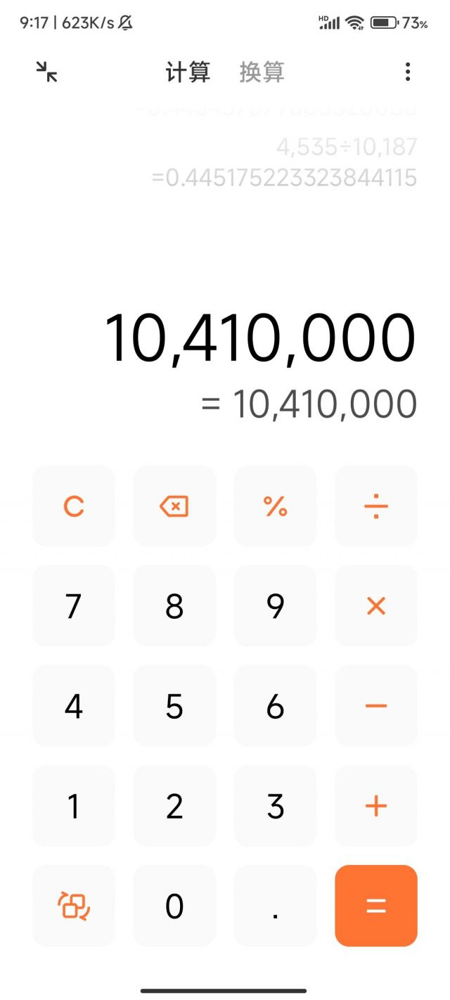

### 为什么中国大额数字逗号只隔三位？

Made by ngapost2md (c) ludoux [GitHub Repo](https://github.com/ludoux/ngapost2md)

----

##### 0.[0] \<pid:0\> 2023-12-05 09:19:02 by 色雨声花\(江西\)
一点都不简便明了，隔四位不好吗？

----

##### 1.[424] \<pid:730619685\> 2023-12-05 09:19:32 by 钻石武力1988\(湖北\)
学的英国的

----

##### 2.[551] \<pid:730619693\> 2023-12-05 09:19:36 by 咕咕鸡来啦\(广西\)
这是国际规则  千

----

##### 3.[271] \<pid:730619900\> 2023-12-05 09:20:43 by 武德天君\(浙江\)
人家语言里没有万啊。。。。。

----

##### 4.[0] \<pid:730619906\> 2023-12-05 09:20:44 by 犹记当年\(辽宁\)
k，m看起来方便

----

##### 5.[0] \<pid:730619937\> 2023-12-05 09:20:56 by 纯净帝王\(江苏\)
英式的

第一个，百

第二个，十万

第三个，亿  

编辑：我说的是加逗号前的一位

----

##### 6.[0] \<pid:730619956\> 2023-12-05 09:21:01 by 丶伱的微笑\(浙江\)
阿拉伯数字毕竟是外来的，沿用KMBT也正常吧。

----

##### 7.[66] \<pid:730620016\> 2023-12-05 09:21:19 by 那些花儿z2\(江苏\)
老外的标准。

----

##### 8.[0] \<pid:730620021\> 2023-12-05 09:21:21 by ﹎圈子\(江西\)
369  百 十万 亿

----

##### 9.[143] \<pid:730620171\> 2023-12-05 09:22:07 by ZONE0000\(吉林\)
学的国外千进制，虽然按咱们习惯确实4位一隔更合适

----

##### 10.[113] \<pid:730620227\> 2023-12-05 09:22:24 by 王者之狼\(江苏\)
这个逗号逗得徒增阅读难度，还不如不逗

----

##### 11.[58] \<pid:730620338\> 2023-12-05 09:22:56 by 换一个心情去晒太阳\(山东\)
英语啊。千、百万、十亿是单位。英文里面54000就是54千。加逗号老外读得快认得快

----

##### 12.[130] \<pid:730620449\> 2023-12-05 09:23:29 by UID25846461\(广东\)
>[jump](#pid730619937) 纯净帝王(2023-12-05 09:20) 说: 
>
>英式的
>
>第一个，百
>
>第二个，百万
>
>第三个，亿

你要不再想想？

----

##### 13.[103] \<pid:730620486\> 2023-12-05 09:23:40 by 锌锌坐提\(北京\)
这不都是SB白皮的计数习惯吗？？？

----

##### 14.[16] \<pid:730620528\> 2023-12-05 09:23:54 by tedtaylor\(上海\)
千，百万，十亿，科学界通用

----

##### 15.[0] \<pid:730620599\> 2023-12-05 09:24:16 by tedtaylor\(上海\)
>[jump](#pid730620486) 锌锌坐提(2023-12-05 09:23) 说: 
>
>这不都是SB白皮的计数习惯吗？？？

那只能说你太low

----

##### 16.[49] \<pid:730620607\> 2023-12-05 09:24:19 by 老司机KKK\(北京\)
英语里没有万，挺搞笑的

----

##### 17.[26] \<pid:730620708\> 2023-12-05 09:24:54 by nasal7d\(香港\)
这个还不如何，那个小数点和千位分隔符标准不同才坑人

----

##### 18.[5] \<pid:730620732\> 2023-12-05 09:25:02 by 阿宝今天吃什么\(浙江\)
要不都中文大写吧
阿拉伯数字也是人家的

----

##### 19.[6] \<pid:730620740\> 2023-12-05 09:25:04 by dynastyyj\(上海\)
>[jump](#pid730619937) 纯净帝王(2023-12-05 09:20) 说: 
>
>英式的
>
>第一个，百
>
>第二个，百万
>
>第三个，亿

第一个是千啊

----

##### 20.[20] \<pid:730620747\> 2023-12-05 09:25:06 by 武德天君\(浙江\)
<b>Reply to [pid=730620338,38595838,1]Reply[/pid] Post by [uid=35348959]换一个心情去晒太阳[/uid] (2023-12-05 09:22)会计准则全是英美标准 可不得照着别人的标准弄？</b>

----

##### 21.[16] \<pid:730620804\> 2023-12-05 09:25:24 by OstCollector\(浙江\)
GB/T15835-1995

----

##### 22.[0] \<pid:730620857\> 2023-12-05 09:25:40 by panstar\(河北\)
我们是百千万都常用 也不是说千就不用

----

##### 23.[42] \<pid:730621747\> 2023-12-05 09:30:28 by chr5409\(广东\)
受不了啦，为什么这么多脑残流量贴，走点心写点小作文小段子行不行啊，这样的傻逼贴拿的到钱吗

----

##### 24.[38] \<pid:730621827\> 2023-12-05 09:30:53 by 锌锌坐提\(北京\)
>[jump](#pid730620599) tedtaylor(2023-12-05 09:24) 说: 
>
>那只能说你太low

白皮的==不low？？？

好舔~~~

----

##### 25.[0] \<pid:730622182\> 2023-12-05 09:32:46 by 正中小杰尼\(北京\)
泥潭劳保又开始团建了

----

##### 26.[13] \<pid:730622375\> 2023-12-05 09:33:41 by 蓝色的眼镜\(上海\)
而且不仅仅有这个问题，欧洲大部分国家的逗号和实心点的使用方法和英制的这个是反过来的。
比如英制的是100,000.00代表10万，欧洲的要100.000,00这么写

----

##### 27.[28] \<pid:730622403\> 2023-12-05 09:33:48 by 等你离开我\(四川\)
>[jump](#pid730620599) tedtaylor(2023-12-05 09:24) 说: 
>
>那只能说你太low

傻逼慕洋犬，滚你妈的。来来来 你给我解释一下这种技术方式的高端之处。

----

##### 28.[0] \<pid:730622577\> 2023-12-05 09:34:41 by 秀采\(上海\)
那你定个标准看有多少人用吧

----

##### 29.[21] \<pid:730622910\> 2023-12-05 09:36:27 by 一直很安静112\(福建\)
对外三数一撇很正常
对内还这样就是傻逼，纯傻逼
对内必须要四数一撇方便国人才合理

----

##### 30.[0] \<pid:730623169\> 2023-12-05 09:37:38 by UID961155\(上海\)
>[jump](#pid730621827) 锌锌坐提(2023-12-05 09:30) 说: 
>
>白皮的==不low？？？
>好舔~~~
>

你回复里也出现 英文，按你自己的道理，你也很 漏～

首先，阿拉伯数字，不是白皮的哦

其次，会计 这行业国际标准就这样。一公里 还等于 一千米 ，难道你觉得 用中国古代的： 一寸 一尺 一步 一里 一亩 这些单位，更高级，更方便？

你这种没有文化的，狭隘的民族主义回复，只会拉低整体民族的发言水平。

----

##### 31.[24] \<pid:730623295\> 2023-12-05 09:38:20 by 末日天启骑士\(四川\)
>[jump](#pid730622403) 等你离开我(2023-12-05 09:33) 说: 
>
>傻逼慕洋犬，滚你妈的。来来来?你给我解释一下这种技术方式的高端之处。

公制单位都是千进制的，除非你能把公制单位的标准改了，不然就是以千计数更合理。
 
还有一个哪怕改标准也没法改的，计算机领域1k≈2^10，这个一万就真没办法了。

----

##### 32.[19] \<pid:730623301\> 2023-12-05 09:38:22 by pranooa\(广东\)
国际标准
如果你笑别人傻为啥不用万千这种的话
后续也一定不要笑为啥还在用英制

一个道理
一个是习惯
一个是标准

----

##### 33.[0] \<pid:730623391\> 2023-12-05 09:38:45 by 一直很安静112\(福建\)
>[jump](#pid730620599) tedtaylor(2023-12-05 09:24) 说: 
>
>那只能说你太low

哟，那只能说你太HIGH

----

##### 34.[0] \<pid:730623403\> 2023-12-05 09:38:50 by UID961155\(上海\)
>[jump](#pid730622403) 等你离开我(2023-12-05 09:33) 说: 
>
>傻逼慕洋犬，滚你妈的。来来来 你给我解释一下这种技术方式的高端之处。

首先，阿拉伯数字，不是白皮的哦

其次，会计 这行业国际标准就这样。一公里 还等于 一千米 ，难道你觉得 用中国古代的： 一寸 一尺 一步 一里 一亩 这些单位，更高级，更方便？

你这种没有文化的，狭隘的民族主义回复，只会拉低整体民族的发言水平。

----

##### 35.[2] \<pid:730624076\> 2023-12-05 09:42:30 by devilwing001\(广东\)
这是千位分隔符，直接在数值上标出thousand，million ，billion方便辨认的，中文没有这种习惯不过还是沿用了这种标准

----

##### 36.[7] \<pid:730624134\> 2023-12-05 09:42:49 by 万里往矣\(中国\)
举个例子，长度单位千米 米 毫米 微米 纳米是以千倍分开的(别杠分米厘米，为什么十米百米没有单位)
容积单位 升 毫升 微升是千倍区分的
质量单位 吨 千克 克 毫克是千倍区分的

----

##### 37.[0] \<pid:730624211\> 2023-12-05 09:43:13 by 珠子_34\(江苏\)
真特码弱智

----

##### 38.[0] \<pid:730624487\> 2023-12-05 09:44:36 by 民工团长\(上海\)
国际惯例，但凡你学过英文...

----

##### 39.[0] \<pid:730624649\> 2023-12-05 09:45:28 by 虎式自行火炮\(陕西\)
>[jump](#pid730623403) UID961155(2023-12-05 09:38) 说: 
>
>首先，阿拉伯数字，不是白皮的哦
>
>其次，会计 这行业国际标准就这样。一公里 还等于 一千米 ，难道你觉得 用中国古代的： 一寸 一尺 一步 一里 一亩 这些单位，更高级，更方便？
>
>
>你这种没有文化的，狭隘的民族主义回复，只会拉低整体民族的发言水平。

印度白皮也是白皮

----

##### 40.[11] \<pid:730625078\> 2023-12-05 09:47:49 by ARchara2\(广东\)
用的是公制，没办法，学界大部分物理单位转换也还是千进制，建议你们努努力把学界干碎然后重新定义为万进制  
比如，高速标牌写距离下一个出口0.5wm(万米)

----

##### 41.[0] \<pid:730625233\> 2023-12-05 09:48:34 by UID62292013\(新疆\)
因为沙雕白皮的计数单位是千

----

##### 42.[0] \<pid:730625452\> 2023-12-05 09:49:38 by dracular_400\(中国\)
你觉得傻逼你不用不就行了

用这个的目的就是为了统一，不是因为这个方法本身多先进，统一可以带来便利性

键盘QWERTY傻不傻逼，你完全可以不用这个键位

----

##### 43.[0] \<pid:730625508\> 2023-12-05 09:49:57 by 倒立的牛\(福建\)
>[jump](#pid0) 色雨声花(2023-12-05 09:19) 说: 
>
>一点都不简便明了，隔四位不好吗？

这个是西方传过来的用法

----

##### 44.[0] \<pid:730625532\> 2023-12-05 09:50:05 by ahawar\(四川\)
你把这些问号用在今年为什么只挣这么点 多好

----

##### 45.[0] \<pid:730625550\> 2023-12-05 09:50:11 by onsomnia\(广东\)
拿个截图就能代表中国了？流量号真是司马啊

----

##### 46.[0] \<pid:730625581\> 2023-12-05 09:50:23 by 锌锌坐提\(北京\)
>[jump](#pid730623169) UID961155(2023-12-05 09:37) 说: 
>
>你回复里也出现 英文，按你自己的道理，你也很 漏～
>
>首先，阿拉伯数字，不是白皮的哦
>
>其次，会计 这行业国际标准就这样。一公里 还等于 一千米 ，难道你觉得 用中国古代的： 一寸 一尺 一步 一里 一亩 这些单位，更高级，更方便？
>
>
>你这种没有文化的，狭隘的民族主义回复，只会拉低整体民族的发言水平。

首先，英文是别人回复我的时候用的，我用别人自己的话反击不行嘛？？？

其次，现在说的是计数方式，跟阿拉伯数字没关系，建议重修小学语文，小学语文有点难的话，可以从幼儿园拼音开始学起~~~

再次，你说的会计标准跟我手机计算器有什么关系？？？我只用计算机算个数，又不做会计报账，用NM的会计标准啊？？？

最后，你这种自持“有文化”、只会扣帽子的SX精英式回复，只能暴露你自己一瓶子不满，半瓶子晃荡的真实水平，实在是贻笑大方~~~

----

##### 47.[6] \<pid:730625584\> 2023-12-05 09:50:24 by GOGOON\(四川\)
>[jump](#pid730623403) UID961155(2023-12-05 09:38) 说: 
>
>首先，阿拉伯数字，不是白皮的哦
>
>其次，会计 这行业国际标准就这样。一公里 还等于 一千米 ，难道你觉得 用中国古代的： 一寸 一尺 一步 一里 一亩 这些单位，更高级，更方便？
>
>
>你这种没有文化的，狭隘的民族主义回复，只会拉低整体民族的发言水平。

真是智障，你知不知道专家一直再提3位数改4位数更符合“中文汉字”使用习惯？什么更方面你这被规训完了的脑子确实没法理解

----

##### 48.[0] \<pid:730625657\> 2023-12-05 09:50:50 by 漂泊的老麦\(广东\)
这是英制的千分位

----

##### 49.[0] \<pid:730625708\> 2023-12-05 09:51:03 by UID5191005\(中国\)
学国外的啊。。

要不看一些国外的数据，不得别扭死。

----

##### 50.[11] \<pid:730625785\> 2023-12-05 09:51:23 by 冰雪无踪\(上海\)
>[jump](#pid730623403) UID961155(2023-12-05 09:38)说:
>>[jump](#pid730622403) 等你离开我(2023-12-05 09:33) 说: 
>>
>>傻逼慕洋犬，滚你妈的。来来来 你给我解释一下这种技术方式的高端之处。
>
>首先，阿拉伯数字，不是白皮的哦
>
>其次，会计 这行业国际标准就这样。一公里 还等于 一千米 ，难道你觉得 用中国古代的： 一寸 一尺 一步 一里 一亩 这些单位，更高级，更方便？
>
>
>你这种没有文化的，狭隘的民族主义回复，只会拉低整体民族的发言水平。

能用到逗号的数字，一般都是金融行业。对外接轨没什么，纯国内使用还三位就是脑子僵硬。

----

##### 51.[1] \<pid:730625859\> 2023-12-05 09:51:45 by 我试试凯恩之角\(中国\)
英语里面的thousand million billion

----

##### 52.[0] \<pid:730625900\> 2023-12-05 09:52:00 by 尚方宝剑惹不起\(浙江\)

 等全世界都用易语言编程的时候. 可能就是隔4位了

----

##### 53.[0] \<pid:730625909\> 2023-12-05 09:52:03 by 夸特\(北京\)
thousand
million
billion
英语里没有万 十万 千万

----

##### 54.[6] \<pid:730626346\> 2023-12-05 09:54:06 by 华夏汉魂\(河南\)
>[jump](#pid730623403) UID961155(2023-12-05 09:38) 说: 
>
>首先，阿拉伯数字，不是白皮的哦
>
>其次，会计 这行业国际标准就这样。一公里 还等于 一千米 ，难道你觉得 用中国古代的： 一寸 一尺 一步 一里 一亩 这些单位，更高级，更方便？
>
>
>你这种没有文化的，狭隘的民族主义回复，只会拉低整体民族的发言水平。

阿拉伯传播开的数字，又不是传播开的千位符，千位符就是拉丁语的计量习惯，现代社会的规则是白皮创建用不着否认

----

##### 55.[0] \<pid:730626725\> 2023-12-05 09:55:54 by xxxxxxxxxx11\(北京\)
>[jump](#pid730620486) 锌锌坐提(2023-12-05 09:23) 说: 
>这不都是SB白皮的计数习惯吗？？？

你用的字母和阿拉伯数字也都是sb白皮发明的，要不别用了吧

----

##### 56.[0] \<pid:730626856\> 2023-12-05 09:56:39 by phynoworld\(湖北\)
我小学学的是四位一隔，方便多了

----

##### 57.[0] \<pid:730626858\> 2023-12-05 09:56:40 by 抛物线的三角\(中国\)
>[jump](#pid730623403) UID961155(2023-12-05 09:38) 说: 
>
>首先，阿拉伯数字，不是白皮的哦
>
>其次，会计 这行业国际标准就这样。一公里 还等于 一千米 ，难道你觉得 用中国古代的： 一寸 一尺 一步 一里 一亩 这些单位，更高级，更方便？
>
>
>你这种没有文化的，狭隘的民族主义回复，只会拉低整体民族的发言水平。

你不会以为印度没有万这个单位吧

----

##### 58.[1] \<pid:730626879\> 2023-12-05 09:56:45 by 古明地恋恋恋恋\(广西\)
楼上那么义愤填膺的，可以不用千克，千米之类的单位，这些也是傻逼千进制。一个国际公认标准而已，又不是只有西方在用，而且千和万进制真看不出来哪个更优越，只是万更符合我们这边的习惯罢了。

----

##### 59.[8] \<pid:730626925\> 2023-12-05 09:56:57 by 浅笑柳风扬\(北京\)
[url](http://www.moe.gov.cn/ewebeditor/uploadfile/2015/01/13/20150113091154536.pdf)

国家标准规定的，你说谁是牧羊犬？

----

##### 60.[0] \<pid:730627009\> 2023-12-05 09:57:22 by zgcvcd\(福建\)
>[jump](#pid730625581) 锌锌坐提(2023-12-05 09:50) 说: 
>
>首先，英文是别人回复我的时候用的，我用别人自己的话反击不行嘛？？？
>
>其次，现在说的是计数方式，跟阿拉伯数字没关系，建议重修小学语文，小学语文有点难的话，可以从幼儿园拼音开始学起~~~
>
>再次，你说的会计标准跟我手机计算器有什么关系？？？我只用计算机算个数，又不做会计报账，用NM的会计标准啊？？？
>
>最后，你这种自持“有文化”、只会扣帽子的SX精英式回复，只能暴露你自己一瓶子不满，半瓶子晃荡的真实水平，实在是贻笑大方~~~
>
>

纯正脑瘫发言，上来就带你老木升值气，你不low谁low？

----

##### 61.[0] \<pid:730627457\> 2023-12-05 09:59:31 by 呜啦哒哒哒哒哒\(山东\)
这是抄的国外的习惯吧，中文读法一般是从万开始上面是十万百万千万亿，那是不是应该四位一隔

----

##### 62.[2] \<pid:730627533\> 2023-12-05 09:59:54 by 锌锌坐提\(北京\)
>[jump](#pid730626725) xxxxxxxxxx11(2023-12-05 09:55) 说: 
>
>你用的字母和阿拉伯数字也都是sb白皮发明的，要不别用了吧

四大发明也是中国发明的呢，白砒能先不用吗？？？
你能替你主子先不用汉字吗？？？

----

##### 63.[0] \<pid:730627827\> 2023-12-05 10:01:11 by tedtaylor\(上海\)
>[jump](#pid730622403) 等你离开我(2023-12-05 09:33) 说: 
>
>傻逼慕洋犬，滚你妈的。来来来 你给我解释一下这种技术方式的高端之处。

您配吗？也就在这喊两句

----

##### 64.[0] \<pid:730627952\> 2023-12-05 10:01:44 by 白泽不白帽子店\(陕西\)
《中国》

----

##### 65.[0] \<pid:730628160\> 2023-12-05 10:02:48 by 锌锌坐提\(北京\)
>[jump](#pid730627009) zgcvcd(2023-12-05 09:57) 说: 
>
>纯正脑瘫发言，上来就带你老木升值气，你不low谁low？

龟龟，我还以为是个什么货色呢~~~

----

##### 66.[3] \<pid:730628178\> 2023-12-05 10:02:52 by lihansunbai\(北京\)
因为这是统一的国际分位制，千、兆、分、皮这些单位名称都是是10的3次方分位的。生活中更常用的个、十、百、千是10分位的。区别就是使用环境不一样。

----

##### 67.[31] \<pid:730628216\> 2023-12-05 10:03:05 by 龙女幽儿希卡\(浙江\)
难绷，nga中专红脖子论坛

凡是外国的，都要反对
凡是国产的，一律支持

数理常识是一点没有的，懂的最多的是中医，风水，儒教

----

##### 68.[0] \<pid:730628298\> 2023-12-05 10:03:25 by 林七明\(江苏\)
因为这是国际通用。
以100亿为例：10,000,000,000。

最右边的是千，也就是thousand，一般也会打作K。
右二是百万，是million，国际上一般打作m。
左一是十亿，是billion，国际上一般打作b。

所以，比如40m，就是四千五；400m，就是4亿；4b，就是四十亿。 ( eve玩家如数家珍的数字游戏)

----

##### 70.[0] \<pid:730628735\> 2023-12-05 10:05:19 by seabelieve\(广东\)
>[jump](#pid0) 色雨声花(2023-12-05 09:19) 说: 
>
>一点都不简便明了，隔四位不好吗？

这不是中国的规则。
这软件也不像是中国企业开发的软件。

你这话里话外透漏着既不喜欢中国，又没有离开过中国的。

是啥玩意？

----

##### 71.[2] \<pid:730628841\> 2023-12-05 10:05:46 by 月阳天启狼\(安徽\)
千、百万、十亿
(不知道前面那个楼怎么出来的)
一般都是国外的计算习惯，国内不太需要在意这个。
但数学和计量运算就要考虑了，不少公式和单位变换是用的这个标准。
K千、M百万，还有m毫、μ微、n纳、p皮，也是以三位(千)递进，这样三位一个逗号有利于阅读。

至于哪国传来的，有必要吗？

----

##### 72.[0] \<pid:730629365\> 2023-12-05 10:08:18 by zgcvcd\(福建\)
>[jump](#pid730628160) 锌锌坐提(2023-12-05 10:02) 说: 
>
>龟龟，我还以为是个什么货色呢~~~
>

哈哈哈，继续翻啊，真是渣滓。我是懒得看你是什么成分，都是?吧

----

##### 73.[0] \<pid:730629946\> 2023-12-05 10:10:57 by 吱吱哥\(广东\)
习惯而已，没什么所谓

但是，大家都习惯了三位一隔，你突然搞个四位一隔，等下一下没注意就弄错了，后果可能很严重

所以还是按回原来的来

有国产的计算器会清晰的用中文在间隔处表明万，亿。也有app有这个功能，可以选用一下

----

##### 74.[1] \<pid:730630109\> 2023-12-05 10:11:44 by 锌锌坐提\(北京\)
>[jump](#pid730629365) zgcvcd(2023-12-05 10:08) 说: 
>
>哈哈哈，继续翻啊，真是渣滓。我是懒得看你是什么成分，都是?吧

没事，我看你打滚也挺有意思的~~~

啥都不讨论，上来直接喷，看来龟龟心理压力确实也挺大，需要一个宣泄的出口~~~

----

##### 75.[3] \<pid:730630302\> 2023-12-05 10:12:37 by qsd01\(内蒙古\)
建议先杀千米 再杀千克 后杀一升 怒杀一吨

----

##### 76.[0] \<pid:730630473\> 2023-12-05 10:13:26 by mgicess\(广东\)
嗯，中国人就应该写“壹仟零肆拾萬伍佰捌拾陆”这样才对

----

##### 77.[0] \<pid:730630658\> 2023-12-05 10:14:18 by 暗耀之雾\(上海\)
最主要还是因为公制， 千米、千克这种
为了换算方便就用了三位分隔

中国传统习惯是用四位，万 但涉及到科学计算、财务报表这一块 还是习惯用公制的单位

----

##### 78.[0] \<pid:730630880\> 2023-12-05 10:15:18 by 黄埔江底娜迦大澡堂\(中国\)
因为公制单位都是3位一逗号

----

##### 79.[0] \<pid:730630908\> 2023-12-05 10:15:25 by Antoc\(河北\)
>[jump](#pid730620528) tedtaylor(2023-12-05 09:23) 说: 
>
>千，百万，十亿，科学界通用

就是白皮的傻逼计数制

不能因为过去几百年白皮主导它就不傻逼了啊

逆转因果的喽

哦  又一次加深IP刻板印象

----

##### 80.[0] \<pid:730631437\> 2023-12-05 10:17:42 by 亚崔迪\(中国\)
这不都是方便你国能看懂么，我国人可不用这么计数，也不受其影响

----

##### 81.[0] \<pid:730631515\> 2023-12-05 10:18:04 by zgcvcd\(福建\)
>[jump](#pid730630109) 锌锌坐提(2023-12-05 10:11) 说: 
>
>没事，我看你打滚也挺有意思的~~~
>
>啥都不讨论，上来直接喷，看来龟龟心理压力确实也挺大，需要一个宣泄的出口~~~
>
>

讨论啥？我都不知道你在自嗨什么，我只是看到一个张口就是升值气的nt想骂一句而已。上来就翻成分的东西，就不要否认自己low了，还有脸说讨论，真的好笑。

----

##### 82.[1] \<pid:730631797\> 2023-12-05 10:19:26 by 中年无聊者备用号\(广东\)
>[jump](#pid730628216) 龙女幽儿希卡(2023-12-05 10:03) 说: 
>
>难绷，nga中专红脖子论坛
>
>凡是外国的，都要反对
>凡是国产的，一律支持
>
>数理常识是一点没有的，懂的最多的是中医，风水，儒教

啥时候千分位一个计数方式是他娘的“数理” 常识了？？？？

咱能不能别学条狗捡个词就叼着不松口，

----

##### 83.[0] \<pid:730632270\> 2023-12-05 10:21:23 by 锌锌坐提\(北京\)
>[jump](#pid730631515) zgcvcd(2023-12-05 10:18) 说: 
>
>讨论啥？我都不知道你在自嗨什么，我只是看到一个张口就是升值气的nt想骂一句而已。上来就翻成分的东西，就不要否认自己low了，还有脸说讨论，真的好笑。

看不懂人话，建议回炉重造呢，顺便也能重新调整一下龟龟的属性~~~
另外，我也挺好奇，我说白皮，你跳这么高干啥？？？
难不成刚说着主子，狗就开始叫了？？？

----

##### 84.[0] \<pid:730632808\> 2023-12-05 10:23:45 by zhouzhengjiji\(中国\)
接轨欧美体系吧，毕竟英语没有万这个单词，10,000直接读ten thousand很方便，虽然对我们不方便就是了，我们可以直接读一万。1,000,000英语直接读one million。1,000,000,000英语直接读one billion。英语每3个0就有一个专门的单词表示，而我们是每4个0。而公制大部分也是每3个0换一个标准单位。只能说这个是我们在适应人家的标准。

----

##### 85.[0] \<pid:730633077\> 2023-12-05 10:24:57 by clares0\(吉林\)
玩过eve的一眼就看出一千万，还有亿和十亿，百万位数

----

##### 86.[0] \<pid:730633094\> 2023-12-05 10:25:01 by 北极狐的媚笑\(上海\)
>[jump](#pid730619900) 武德天君(2023-12-05 09:20)说:
>人家语言里没有万啊。。。。。

他们怕反写的万

----

##### 87.[0] \<pid:730634065\> 2023-12-05 10:28:56 by zgcvcd\(福建\)
>[jump](#pid730632270) 锌锌坐提(2023-12-05 10:21) 说: 
>
>看不懂人话，建议回炉重造呢，顺便也能重新调整一下龟龟的属性~~~
>另外，我也挺好奇，我说白皮，你跳这么高干啥？？？
>难不成刚说着主子，狗就开始叫了？？？
>

三个回复，9个弱智表情，建议你mua呢建议，没娘教的dogthing

----

##### 88.[0] \<pid:730634296\> 2023-12-05 10:29:52 by Oldbrunooo\(黑龙江\)
巴西人会用逗号代表小数点
去年圣保罗的爱彼迎房东告诉我半个月要打扫一次房子费用大概是180，00 

给我吓完了，寻思什么保洁要花两万人民币

----

##### 89.[0] \<pid:730634585\> 2023-12-05 10:31:05 by 懒龙菌\(北京\)
现在数字都是3位一节，也就是每个单位之间都是1000倍。
公制单位也是啊。
千米，米，毫米，微米，纳米。
很难改的啦。

----

##### 90.[0] \<pid:730634995\> 2023-12-05 10:32:42 by 蹦哒的泵泵\(上海\)
学英语的
第一个thousand 
第二个million
第三个billion

----

##### 91.[0] \<pid:730635260\> 2023-12-05 10:33:40 by 锌锌坐提\(北京\)
>[jump](#pid730634065) zgcvcd(2023-12-05 10:28) 说: 
>
>三个回复，9个弱智表情，建议你mua呢建议，没娘教的dogthing

表情都能刺激到你啊？？？
看来龟龟的情绪真是不太稳定呢~~~

呦，还会拽英文了呢~~~

----

##### 92.[3] \<pid:730635274\> 2023-12-05 10:33:42 by 速冻水饺\(安徽\)
这东西本来就是个辅助，为了让人更容易看清数字，对于中国人来说，明显是四位一隔更合理。

三位一隔还不如不隔。

就应该设置一个切换开关。

----

##### 93.[0] \<pid:730635556\> 2023-12-05 10:34:52 by 281954168\(新疆\)
>[jump](#pid730628298) 林七明(2023-12-05 10:03)说:
>因为这是国际通用。
>以100亿为例：10,000,000,000。
>
>最右边的是千，也就是thousand，一般也会打作K。
>右二是百万，是million，国际上一般打作m。
>左一是十亿，是billion，国际上一般打作b。
>
>所以，比如40m，就是四千五；400m，就是4亿；4b，就是四十亿。 ( eve玩家如数家珍的数字游戏)

<b>玩eve学千分位</b>

<b>大数字我比我们公司会计认得还快，他要数数，我看一眼就能读出来</b>

----

##### 94.[0] \<pid:730636244\> 2023-12-05 10:37:40 by 幻想侵蚀万象\(内蒙古\)
>[jump](#pid730623295) 末日天启骑士(2023-12-05 09:38) 说: 
>
>公制单位都是千进制的，除非你能把公制单位的标准改了，不然就是以千计数更合理。
> 
>还有一个哪怕改标准也没法改的，计算机领域1k≈2^10，这个一万就真没办法了。

但是这种千分位分隔符最常用的是金钱货币，事实上这种分割法就是在阻碍生产力发展，已经落后了

----

##### 95.[0] \<pid:730636835\> 2023-12-05 10:39:50 by 暮雨江天\(安徽\)
楼主连初中学历都没有吗？

----

##### 96.[2] \<pid:730637235\> 2023-12-05 10:41:29 by 能不能起名字了\(四川\)
>[jump](#pid730619937) 纯净帝王(2023-12-05 09:20) 说: 
>
>英式的
>
>第一个，百
>
>第二个，十万
>
>第三个，亿

你的回答比这楼里吵架的还逆天

----

##### 97.[0] \<pid:730637332\> 2023-12-05 10:41:50 by 宿命对决\(上海\)
英制的，或者叫千进制，比如你这个1041万，有千进制逗号就能直接定位，读“十百万四百(与)一十千”。

----

##### 98.[0] \<pid:730637340\> 2023-12-05 10:41:51 by 电脑玩家白给\(上海\)
白皮约定成俗的千分位规则而已

K-MILLION-BILLION，如果真的是按国内规则，怕不是四位数一个逗号，万起。

----

##### 99.[3] \<pid:730637586\> 2023-12-05 10:42:53 by zgcvcd\(福建\)
>[jump](#pid730635260) 锌锌坐提(2023-12-05 10:33) 说: 
>
>表情都能刺激到你啊？？？
>看来龟龟的情绪真是不太稳定呢~~~
>
>呦，还会拽英文了呢~~~
>

你就接着脑补吧，真是弱智，跟你这种垃圾桶没什么好聊的

----

##### 100.[0] \<pid:730637772\> 2023-12-05 10:43:44 by 夜风听雨233\(江苏\)
>[jump](#pid730619937) 纯净帝王(2023-12-05 09:20) 说: 
>
>英式的
>
>第一个，百
>
>第二个，十万
>
>第三个，亿

但凡懂点英文都知道是千进制，

----

##### 101.[0] \<pid:730638036\> 2023-12-05 10:44:46 by lixihao05\(安徽\)
这是学英文里计数的，初中应该讲过吧

----

##### 102.[0] \<pid:730638155\> 2023-12-05 10:45:13 by 风暴雄殿\(陕西\)
现在不知道，但8090大部分接受的是四位一分吧，三位的读起来总得换一下

----

##### 103.[2] \<pid:730638207\> 2023-12-05 10:45:26 by 兰国一等勋章\(北京\)
英语里有万:myriad，因为经常用thousand所以很少用myriad，不仅有万字，而且myriad的引申字意跟汉语的万很像，指非常多的事物，myriad of sth ≈ 成千上万的某种事物，myriad现在更多的用来表达引申义

----

##### 104.[0] \<pid:730638479\> 2023-12-05 10:46:32 by Woodkeeper\(中国\)
不用一眼代表所有人中国人，我这行的单位就是 千、兆

----

##### 105.[0] \<pid:730638500\> 2023-12-05 10:46:38 by 纯净帝王\(江苏\)
>[jump](#pid730637772) 夜风听雨233(2023-12-05 10:43) 说: 
>
>但凡懂点英文都知道是千进制，

我说的是逗号右边那一位啊，有什么问题？

111，111，111

亿 千万 百万，十万 万 千，百 十 个

----

##### 106.[0] \<pid:730638594\> 2023-12-05 10:47:00 by 气定\(浙江\)
国人肯定是用百 千 万 这样读顺口 ，不过你这个是国际标准，要么你有本事去改了不然就憋着。

----

##### 107.[0] \<pid:730638693\> 2023-12-05 10:47:23 by 施坦伯格没有头\(重庆\)
帽子扣得一套一套的

----

##### 108.[0] \<pid:730638713\> 2023-12-05 10:47:28 by 锌锌坐提\(北京\)
>[jump](#pid730637586) zgcvcd(2023-12-05 10:42) 说: 
>
>你就接着脑补吧，真是弱智，跟你这种垃圾桶没什么好聊的

龟龟不显摆显摆自己的英文水平了？？？

----

##### 109.[0] \<pid:730638756\> 2023-12-05 10:47:38 by 再吸一口就一口\(吉林\)
可以理解为英国人数学拉胯 超过1000就转不过来了 所以只能每千位分割一下

----

##### 110.[0] \<pid:730638803\> 2023-12-05 10:47:48 by 南山北海\(广东\)
崇洋媚外呗，还说什么

----

##### 111.[0] \<pid:730639051\> 2023-12-05 10:48:47 by Woodkeeper\(中国\)
>[jump](#pid730625785) 冰雪无踪(2023-12-05 09:51) 说: 
>
>能用到逗号的数字，一般都是金融行业。对外接轨没什么，纯国内使用还三位就是脑子僵硬。

那你以后想用&quot;公里&quot;就先揉揉僵硬的脑子

----

##### 112.[5] \<pid:730639454\> 2023-12-05 10:50:17 by 杀穿这些废物\(北京\)
这个加精，年度弱智贴。

----

##### 113.[0] \<pid:730639489\> 2023-12-05 10:50:27 by 千面之城\(江苏\)
>[jump](#pid730626925) 浅笑柳风扬(2023-12-05 09:56)说:
>[url](http://www.moe.gov.cn/ewebeditor/uploadfile/2015/01/13/20150113091154536.pdf)
>
>国家标准规定的，你说谁是牧羊犬？

BG/T是推荐标准不是强制标准。
另外这个标准就是牧羊犬定的我说的。出版广告新闻会计届牧羊犬还少？？？
中文语境环境从来没有三分位过，万和亿都是4分位。
英文数量词才是三位一分。
小时候珠心算的算盘上标志都是四位一划分，近几年的算盘上才改成了三位一划分，懂？
甚至国外游戏的界面，涉及到数字的，客户端切中文是四位一逗点，英文客户端是三位一逗点。连斯拉夫-/都懂中国人需要什么，出版届那帮牧羊犬能不懂？
纯舔狗罢了。

----

##### 114.[0] \<pid:730639935\> 2023-12-05 10:52:06 by feixia\(浙江\)
汉字里以万，亿来进行单位变更，但是英文数字里用的是千，不用万。

----

##### 115.[3] \<pid:730639964\> 2023-12-05 10:52:17 by evilmeteor\(中国\)
你要是按中文习惯可就是一位一逗号了
中文也不是以万为主要单位啊

----

##### 117.[3] \<pid:730640672\> 2023-12-05 10:55:06 by ms9907\(中国\)
只要还是十进制数字，区别不大。英尺英寸加仑这种反人类的单位才是智障

----

##### 118.[0] \<pid:730641088\> 2023-12-05 10:56:46 by butterflyingthehell\(上海\)
我坛这种事情都要杠，是真的屌
标题就够蠢的了

----

##### 119.[0] \<pid:730641719\> 2023-12-05 10:59:16 by butterflyingthehell\(上海\)
>[jump](#pid730640672) ms9907(2023-12-05 10:55)说:
>只要还是十进制数字，区别不大。英尺英寸加仑这种反人类的单位才是智障

把英删掉，里 寸 尺，这些是哪来的

----

##### 120.[0] \<pid:730642111\> 2023-12-05 11:00:51 by 溜溜球919\(上海\)
等我们掌握话语权了才会改回来

----

##### 121.[0] \<pid:730644786\> 2023-12-05 11:11:09 by ms9907\(中国\)
>[jump](#pid730641719) butterflyingthehell(2023-12-05 10:59) 说: 
>
>把英删掉，里 寸 尺，这些是哪来的

国内以前的单位：尺，寸，丈，两几乎已经不在正式场合使用了，

----

##### 122.[0] \<pid:730645127\> 2023-12-05 11:12:24 by tomx33\(上海\)
因为白皮猪的语言没有万只有千，也没有1千万，只有10百万。论数字的表达方式他们和我们差远了。

----

##### 123.[0] \<pid:730646087\> 2023-12-05 11:16:04 by butterflyingthehell\(上海\)
>[jump](#pid730644786) ms9907(2023-12-05 11:11) 说: 
>
>国内以前的单位：尺，寸，丈，两几乎已经不在正式场合使用了，

人家英里英寸英尺用得好好的
我们里丈寸尺用得也好好的
不去跟公制换算，有啥不好呢

----

##### 124.[0] \<pid:730646416\> 2023-12-05 11:17:20 by zgcvcd\(福建\)
>[jump](#pid730638713) 锌锌坐提(2023-12-05 10:47) 说: 
>
>龟龟不显摆显摆自己的英文水平了？？？
>

对你这种乐色有什么好显摆的？龟你mua呢龟，没篮子的阴阳人

----

##### 125.[1] \<pid:730646850\> 2023-12-05 11:19:04 by ms9907\(中国\)
>[jump](#pid730646087) butterflyingthehell(2023-12-05 11:16) 说: 
>
>人家英里英寸英尺用得好好的
>我们里丈寸尺用得也好好的
>不去跟公制换算，有啥不好呢

好个屁，这些单位，小学生都不教了，你猜为啥

----

##### 126.[0] \<pid:730647007\> 2023-12-05 11:19:36 by ninja_yc\(上海\)
确实不符合中国人的习惯，但是看多了也就习惯了

----

##### 127.[8] \<pid:730647184\> 2023-12-05 11:20:23 by 昵称已被占用了\(江苏\)
大专论坛还是高估了，高中肄业吧

----

##### 128.[7] \<pid:730647412\> 2023-12-05 11:21:08 by 霜の『哀』伤\(中国\)
这种事情也能上纲上线，不知道说什么好了

----

##### 129.[0] \<pid:730647518\> 2023-12-05 11:21:37 by tension2009\(北京\)
这个东西用多了以后
至少我在看到这种数字的时候会明显的调整成英语思维
但是不逗的时候，又回到十百千万亿这样。。。。

----

##### 130.[0] \<pid:730647764\> 2023-12-05 11:22:40 by 王袍江夫\(广东\)
>[jump](#pid730620607) 老司机KKK(2023-12-05 09:24) 说: 
>
>英语里没有万，挺搞笑的

这有啥搞笑的，每个语言都有自己的优缺。汉语也没有million这个词，你要说这不是“百万”吗，那英语里也有十千啊

----

##### 131.[5] \<pid:730648060\> 2023-12-05 11:23:45 by silver_bullet\(山东\)
还tmd贴金说是大专论坛呢，中专还差不多。

----

##### 132.[3] \<pid:730648494\> 2023-12-05 11:25:23 by 节操君是也\(浙江\)
>[jump](#pid730623403) UID961155(2023-12-05 09:38) 说: 
>
>首先，阿拉伯数字，不是白皮的哦
>
>其次，会计 这行业国际标准就这样。一公里 还等于 一千米 ，难道你觉得 用中国古代的： 一寸 一尺 一步 一里 一亩 这些单位，更高级，更方便？
>
>
>你这种没有文化的，狭隘的民族主义回复，只会拉低整体民族的发言水平。

那你一开始说国际惯例不完了为什么说人家low呢？他骂你慕洋犬还真没骂不错

----

##### 133.[0] \<pid:730648740\> 2023-12-05 11:26:26 by 知秋的叶子\(江苏\)
好像是英语里没有万这个词吧

----

##### 134.[0] \<pid:730648793\> 2023-12-05 11:26:40 by Symal\(中国\)
这个是根据英语语法来的

----

##### 135.[0] \<pid:730649110\> 2023-12-05 11:27:57 by 锌锌坐提\(北京\)
>[jump](#pid730646416) zgcvcd(2023-12-05 11:17) 说: 
>
>对你这种乐色有什么好显摆的？龟你mua呢龟，没篮子的阴阳人

龟龟嘴里只有网络烂梗吗？？？真是可怜~~~

----

##### 136.[0] \<pid:730649597\> 2023-12-05 11:29:53 by 铁浮屠\(北京\)
>[jump](#pid730619937) 纯净帝王(2023-12-05 09:20) 说: 
>
>英式的
>
>第一个，百
>
>第二个，十万
>
>第三个，亿

兄弟，你弄笑我了

----

##### 137.[0] \<pid:730650161\> 2023-12-05 11:32:22 by 月下丶小好\(山东\)
不就为了帮英制数数吗，当然会让个十百千万都有的人难受了

----

##### 138.[0] \<pid:730650370\> 2023-12-05 11:33:12 by Akira Akira\(上海\)
>[jump](#pid730620607) 老司机KKK(2023-12-05 09:24) 说: 
>
>英语里没有万，挺搞笑的

有的 myriad

----

##### 139.[0] \<pid:730651744\> 2023-12-05 11:38:54 by 奥术精妙\(上海\)
和英制单位差不多道理，在某些领域通用并不代表它先进优秀，更多的是积重难返。

----

##### 140.[0] \<pid:730652357\> 2023-12-05 11:41:19 by c10034621\(中国\)
古英语中写作?thusend?，是从拉丁语的?tumere?(膨胀)以及其它一些词中节选了一部分，再加上?hund?(百)而合成的。意思是说“千”是“膨胀了的百”。

milli是拉丁语词根，表示千。在million这个词里表示百万，是因为百万是一千的一千倍。mile来自拉丁语短语mille passus(一千罗马步)，其中的mille表示千，passus表示“罗马步”，指步行时同一只脚前后移动的距离，实际上相当于两步。所以一英里(mile)原本指的就是一千罗马步的距离，也就是成年人走两千步的距离。

另外“Kilo“一词源于希腊语，原本的拼写为“χ?λιοι“(chilioi)，意为“一千“。它是希腊数字系统中表示数字1000的单词。

复制来的仅供参考

----

##### 141.[0] \<pid:730652583\> 2023-12-05 11:42:15 by Rafro\(美国\)
统一度量衡挺好的
难不成要跟唯一一个还在用英制单位的国家一样特立独行吗

----

##### 142.[0] \<pid:730652584\> 2023-12-05 11:42:15 by UID961155\(上海\)
>[jump](#pid730648494) 节操君是也(2023-12-05 11:25) 说: 
>
>那你一开始说国际惯例不完了为什么说人家low呢？他骂你慕洋犬还真没骂不错

你纯纯杠精吗？ 你用的手机不是安卓 不是ios吗 你纯纯牧羊犬。

有本事别用计算器啊。

统计数字 都写 一寸一尺啊。自己都使用别人洋人的东西，发什么神经，想不通，自己写个 万为单位的计算器不就行了。 这点点事情想不通，大专生想不通的事真多

----

##### 143.[0] \<pid:730652632\> 2023-12-05 11:42:26 by mix5s\(福建\)
因为是国外计数法

中国的是万进制，比如万 亿 兆

----

##### 144.[0] \<pid:730652820\> 2023-12-05 11:43:17 by 黎明星光灿烂\(中国\)
>[jump](#pid730620227) 王者之狼(2023-12-05 09:22) 说: 
>
>这个逗号逗得徒增阅读难度，还不如不逗

没逗号你就得数零去了，更费劲。

----

##### 145.[0] \<pid:730652951\> 2023-12-05 11:43:53 by UID961155\(上海\)
>[jump](#pid730626858) 抛物线的三角(2023-12-05 09:56) 说: 
>
>你不会以为印度没有万这个单位吧

你不会以为中国没有 千， 百万，这些单位吧？

你想说啥，打15个汉子，就词穷了，就没逻辑论点了，是不是，大专杠精果然写不出一段有头有尾的论调。

----

##### 146.[0] \<pid:730652964\> 2023-12-05 11:43:57 by UID4482336\(江苏\)
英语的话语权大，没办法

----

##### 147.[0] \<pid:730653680\> 2023-12-05 11:46:54 by PrincessViolet\(重庆\)
英语里的计数单位是百，千为基准，咱们是个十百千万都有

----

##### 148.[0] \<pid:730654264\> 2023-12-05 11:49:29 by UID961155\(上海\)
>[jump](#pid730625785) 冰雪无踪(2023-12-05 09:51) 说: 
>
>能用到逗号的数字，一般都是金融行业。对外接轨没什么，纯国内使用还三位就是脑子僵硬。

那你自己写个计算器程序，再生产一批实物计算器呗。行业都这么定了规则，还要和楼主一样喊着“为什么，我想不通”吗？

真就大专生疑问多？有点戾气，就拿中外对抗来说事，屁大点事，扯崇洋媚外？关洋人毛线事？自己发明个中文单位的计算程序呗。

人byd好歹车实体按键换个中文，还不是一样被嘲讽low，正话反话都杠精来说呗

喜欢贴标签，那在座的用ios和安卓的，都打上牧羊犬标签呗，杠精谁不会当。

还有，大专生当杠精，半天憋出20个字，一段话都憋出，学学语文，理理思路再来，好不好？打字慢，还是脑筋木？反思一下呗。

----

##### 149.[0] \<pid:730654914\> 2023-12-05 11:52:06 by UID961155\(上海\)
>[jump](#pid730625584) GOGOON(2023-12-05 09:50) 说: 
>
>真是智障，你知不知道专家一直再提3位数改4位数更符合“中文汉字”使用习惯？什么更方面你这被规训完了的脑子确实没法理解

你真是智障，你听专家的，好笑死了。专家还说，日本有工匠精神呢，专家还说油包纸呢。你好歹贴个截图，来论证呗，怎么更符合了？

km kg kw 没办法都是千，百万，为单位。哪个更方便？你是没上班不懂实际工作内容吧。

----

##### 150.[0] \<pid:730654992\> 2023-12-05 11:52:22 by 金刚ttg\(上海\)
说软件不给中国特供的

软件怎么知道你要算的这个值是干嘛用的？

760万毫米是几公里？

23，3457，3561克是多少吨？

现在中文环境也有大量单位是千进制啊

建议不服的去冲国家制定千进制的有关部门哦

口嗨有啥用

----

##### 151.[0] \<pid:730655712\> 2023-12-05 11:55:27 by butterflyingthehell\(上海\)
>[jump](#pid730646850) ms9907(2023-12-05 11:19) 说: 
>
>好个屁，这些单位，小学生都不教了，你猜为啥

特别神奇
一里等于三百步等于一百五十丈等于五百米
人家用得好好的，你有什么资格去嘲笑别人的度量单位

----

##### 152.[0] \<pid:730656188\> 2023-12-05 11:57:25 by YyAOe\(江苏\)
说到这个，分享一个之前查的bug :

我们给到客户的数是40.41，客户的power bi 看到的却是4041。

查了半天，最后发现连给过去的csv 文件里都是40.41，绝望时，发现客户是欧洲的，power bi 默认配置， . 是千分位

----

##### 153.[0] \<pid:730656642\> 2023-12-05 11:59:23 by UID961155\(上海\)
>[jump](#pid730625581) 锌锌坐提(2023-12-05 09:50) 说: 
>
>首先，英文是别人回复我的时候用的，我用别人自己的话反击不行嘛？？？
>其次，现在说的是计数方式，跟阿拉伯数字没关系，建议重修小学语文，小学语文有点难的话，可以从幼......

你手机的计算器，那你手机系统是中国产的吗？
你纯纯牧羊犬啊，用老外的程序 

贻笑大方 大了你。

你有本事自己写个，以万 为分隔的计算器程序呗，用什么洋人的手机操作系统下的计算器程序呢？ 你去问候 苹果和谷歌的工程师啊，说你们歧视中国用户呀，跟我说刁呢？

规则就这样，你能改不，你又不能改，你又不放弃，只会嚷嚷老子不服，你呀愤青呢？

以千，百万，十亿，作为分隔计数，就感受到奇耻大辱了？就变民族卫士了？去街上砸几辆外国车区，显示你的民族气概？纠结个逗号算什么英雄？

----

##### 154.[0] \<pid:730665278\> 2023-12-05 12:43:18 by 乂南瓜\(四川\)
>[jump](#pid730620227) 王者之狼(2023-12-05 09:22) 说: 
>
>这个逗号逗得徒增阅读难度，还不如不逗

数字短了没感觉，数字长了你就知道他的好处了。比如两位数后面跟着三个逗号，我一眼就知道是百亿，没逗号你还得一个一个数。

----

##### 155.[0] \<pid:730667048\> 2023-12-05 12:53:04 by 锌锌坐提\(北京\)
>[jump](#pid730656642) UID961155(2023-12-05 11:59) 说: 
>
>你手机的计算器，那你手机系统是中国产的吗？
>你纯纯牧羊犬啊，用老外的程序 
>
>贻笑大方 大了你。
>
>你有本事自己写个，以万 为分隔的计算器程序呗，用什么洋人的手机操作系统下的计算器程序呢？ 你去问候 苹果和谷歌的工程师啊，说你们歧视中国用户呀，跟我说刁呢？
>
>规则就这样，你能改不，你又不能改，你又不放弃，只会嚷嚷老子不服，你呀愤青呢？
>
>以千，百万，十亿，作为分隔计数，就感受到奇耻大辱了？就变民族卫士了？去街上砸几辆外国车区，显示你的民族气概？纠结个逗号算什么英雄？[img]http://img

我说sb白皮习惯让大家在使用过程中感到不适，就跟撅了你家主子祖坟一样，你怎么这么急啊？？？

再说，老子用的就不是外国的系统啊~~~

你急不急？？？

还是回幼儿园学学汉语吧，文不对题的货~~~

----

##### 156.[0] \<pid:730667959\> 2023-12-05 12:58:30 by 麒月2333\(重庆\)
我觉得还是4位好记，这个3位真的不行

----

##### 157.[0] \<pid:730671743\> 2023-12-05 13:21:10 by wutong64\(海南\)
>[jump](#pid730625581) 锌锌坐提(2023-12-05 09:50) 说: 
>
>首先，英文是别人回复我的时候用的，我用别人自己的话反击不行嘛？？？
>
>其次，现在说的是计数方式，跟阿拉伯数字没关系，建议重修小学语文，小学语文有点难的话，可以从幼儿园拼音开始学起~~~
>
>再次，你说的会计标准跟我手机计算器有什么关系？？？我只用计算机算个数，又不做会计报账，用NM的会计标准啊？？？
>
>最后，你这种自持“有文化”、只会扣帽子的SX精英式回复，只能暴露你自己一瓶子不满，半瓶子晃荡的真实水平，实在是贻笑大方~~~
>
>

那个，“自恃”

----

##### 158.[0] \<pid:730672695\> 2023-12-05 13:26:51 by heyxier\(江苏\)
首先不是中国……

----

##### 159.[0] \<pid:730673610\> 2023-12-05 13:32:33 by %温柔的男人像海洋%\(江苏\)
好无聊 你有本事你去制定国际标准不就行了

----

##### 160.[0] \<pid:730674098\> 2023-12-05 13:35:22 by 迦勒底工作人员\(辽宁\)
>[jump](#pid730628735) seabelieve(2023-12-05 10:05) 说: 
>
>这不是中国的规则。
>这软件也不像是中国企业开发的软件。
>你这话里话外透漏着既不喜欢中国，又没有离开过中国的。
>是啥玩意？

这是小米的计算器……

----

##### 161.[0] \<pid:730675021\> 2023-12-05 13:40:48 by vijay-l\(上海\)
>[jump](#pid730654914) UID961155(2023-12-05 11:52)说:
>>[jump](#pid730625584) GOGOON(2023-12-05 09:50) 说: 
>>
>>真是智障，你知不知道专家一直再提3位数改4位数更符合“中文汉字”使用习惯？什么更方面你这被规训完了的脑子确实没法理解
>
>你真是智障，你听专家的，好笑死了。专家还说，日本有工匠精神呢，专家还说油包纸呢。你好歹贴个截图，来论证呗，怎么更符合了？
>
>km kg kw 没办法都是千，百万，为单位。哪个更方便？你是没上班不懂实际工作内容吧。

但是，你说的也是十进位啊...没冲突..说都说不到点子上...

千位制的冲突是没有“万”10k要翻译成万，10m要翻译成千万。你不翻还不行...你要改进位习惯，百万不是进位的标志...千万才是，1万万才能变亿。

然后你要不回答下英文有没有”亿“？没有，只有”十亿“...英文进位对我们来说错乱了，脱离了十进制...

----

##### 162.[0] \<pid:730675411\> 2023-12-05 13:43:17 by 思路\(浙江\)
k,M,G，用习惯了也还好

----

##### 163.[0] \<pid:730675529\> 2023-12-05 13:44:00 by UID961155\(上海\)
>[jump](#pid730667048) 锌锌坐提(2023-12-05 12:53) 说: 
>
>我说sb白皮习惯让大家在使用过程中感到不适，就跟撅了你家主子祖坟一样，你怎么这么急啊？？？
>再说，老子用的就不是外国的系统啊~~~
>你急不急？......

  什么乐色玩意，这么着急？

憋不出几个汉字，以为贴几个ac娘表情包，很高级。笑死了。

你回贴，大大的安卓贴脑门上呢，还国产系统，你梦里写的啊？发什么毛病啊？

别转移话题，你搞个 万 为分割逗号的计算器，无能狂怒呢你？ 以千为分隔，要了你m的命了，这么激动？
万年用一次计算器，发觉还用错了，是不是啊？不想承认自己智商低，计算器不会用，开始狂喷，计算器 的问题，可笑得很。

不喜欢洋人的东西当然没问题。
用算盘啊，老祖宗的算盘会用不？没不让你用啊

又当又立 ，喜欢当biaozi？ 你用着算盘，喷计算器，算你条汉子，用着洋人发明的工具，在那儿无能狂怒，喷你就是看你碍眼

----

##### 164.[0] \<pid:730675620\> 2023-12-05 13:44:32 by RRRRBUA\(广东\)
因为这个不叫逗号，叫千位分隔符

----

##### 165.[0] \<pid:730675951\> 2023-12-05 13:46:28 by UID961155\(上海\)
>[jump](#pid730675021) vijay-l(2023-12-05 13:40) 说: 
>
>但是，你说的也是十进位啊...没冲突..说都说不到点子上...

看不懂，就别回复。打字都打不来，还有省略号是...... 六个点，三个点和两个点是什么玩意儿，打字都打不来。滚一边去，做你的小学语文作业。

----

##### 166.[2] \<pid:730676494\> 2023-12-05 13:49:38 by 陪吃是最长情的告白\(重庆\)
没办法，近几百年别人领先太多，只能用人家定下来的规则。
公制单位不也是3位一进
微米，毫米，米，千米
微克，毫克，克，千克

----

##### 167.[0] \<pid:730676559\> 2023-12-05 13:49:59 by madlurkrr\(中国\)
>[jump](#pid730635274) 速冻水饺(2023-12-05 10:33) 说: 
>
>这东西本来就是个辅助，为了让人更容易看清数字，对于中国人来说，明显是四位一隔更合理。
>
>三位一隔还不如不隔。
>
>就应该设置一个切换开关。

不是的，比如我是做产品设计的，设计图纸里的单位都是毫米。

如果我想用计算器计算一下240毫米的立方体能装几升水，那240*240*240=13,824,000这个结果我瞄一眼就能知道是13升多。如果是13824000这样的结果，我可能要稍微心里估一下才能知道是13升而不是1.3升和138升。  

再举个例子，1L=1000ml是什么意思？
就是如果在1L的体积内放1ml的小方块，可以放10行*10列*10层，共计1000个
千进制就是10进制应用在三围空间后的自然直观结果，至少在设计和工业里这是不可能被推翻的

----

##### 168.[0] \<pid:730676782\> 2023-12-05 13:51:26 by xulijiang\(中国\)
>[jump](#pid730623169) UID961155(2023-12-05 09:37) 说: 
>
>你回复里也出现 英文，按你自己的道理，你也很 漏～
>首先，阿拉伯数字，不是白皮的哦
>其次，会计 这行业国际标准就这样。一公里 还等于 一千米 ......

所以你觉得千，百万，十亿很高级？呵呵

----

##### 169.[0] \<pid:730676809\> 2023-12-05 13:51:33 by 迈克尔\(湖北\)
千进制就是这样。

1 K M B

----

##### 170.[0] \<pid:730676922\> 2023-12-05 13:52:10 by L-星门\(安徽\)
楼里好多还跪在地上呢

----

##### 171.[0] \<pid:730676984\> 2023-12-05 13:52:32 by 秦楼鳳吹\(广东\)
英制单位 流毒无穷

----

##### 172.[0] \<pid:730677048\> 2023-12-05 13:52:55 by nasal7d\(香港\)
>[jump](#pid730646087) butterflyingthehell(2023-12-05 11:16) 说: 
>
>人家英里英寸英尺用得好好的
>我们里丈寸尺用得也好好的
>不去跟公制换算，有啥不好呢

我们这些单位除了亩之外别的已经没怎么用了。
英国政府自己也在改用公制。
现在政府还在用英制的也就美帝了。
还在用英制的是行业问题比如管道用4分6分，但正式文件还是用16mm22mm之类。
民间最乱的是香港吧，什么鬼单位都有。

----

##### 173.[0] \<pid:730677409\> 2023-12-05 13:55:01 by 锌锌坐提\(北京\)
>[jump](#pid730675529) UID961155(2023-12-05 13:44) 说: 
>
>什么乐色玩意，这么着急？
>
>憋不出几个汉字，以为贴几个ac娘表情包，很高级。笑死了。
>
>你回贴，大大的安卓贴脑门上呢，还国产系统，你梦里写的啊？发什么毛病啊？
>
>别转移话题，你搞个 万 为分割逗号的计算器，无能狂怒呢你？ 以千为分隔，要了你m的命了，这么激动？
>万年用一次计算器，发觉还用错了，是不是啊？不想承认自己智商低，计算器不会用，开始狂喷，计算器 的问题，可笑得很。
>
>不喜欢洋人的东西当然没问题。
>用算盘啊，老祖宗的算盘会用不？没不让你用啊
>
>又当又立 ，喜欢当biaozi？ 你用着算盘，

你用着你白皮主子的东西你很高级吗？？？

你的高级感就是白皮赏你的啊？？？

你为啥用汉字啊？？？你咋不用英文发帖呢？？？

----

##### 174.[0] \<pid:730677803\> 2023-12-05 13:57:11 by 宝马冰激凌\(江苏\)
以前跪多了的结果

----

##### 175.[0] \<pid:730677856\> 2023-12-05 13:57:30 by 隆中不对\(上海\)
英语是这样的

----

##### 176.[0] \<pid:730677971\> 2023-12-05 13:58:02 by 小可129\(贵州\)
不都是阿拉伯数字么，不都是数后面有几个零吗
问出这个问题就非常的奇怪，纯引战
你可以理解为汉语里面进制单位是万，亿
而国际标准的进制单位是千，百万，十亿
什么叫做中国大额数字只隔3位，那叫做和国际接轨
条文也好，规范也好，不都是级别越往上，认同率越高吗
1后面6个0，每2位打个逗号，你不认识他是100万了吗

----

##### 177.[0] \<pid:730677997\> 2023-12-05 13:58:10 by zhangnike\(浙江\)
这其实就是中国人聪明。。个十百千万 一直数到5位数不重复。。老外就是数到千。。没有万这个词。。一万就是 t[color=#444444][font=Arial, Helvetica, sans-serif]en thousand[/font][/color]

----

##### 178.[0] \<pid:730678072\> 2023-12-05 13:58:38 by asdawdawda\(浙江\)
你看看温的问题

----

##### 179.[0] \<pid:730678500\> 2023-12-05 14:01:05 by casper327\(上海\)
欧洲有些国家小数点是逗号

----

##### 180.[0] \<pid:730678514\> 2023-12-05 14:01:09 by 青鸟往事\(新疆\)
There are nine million bicycles in Beijing

----

##### 181.[0] \<pid:730678595\> 2023-12-05 14:01:33 by 做事诚信余承东\(北京\)
确实不方便

但是人家先发优势，在科学上成了国际标准了

比如什么千米 ppm ppb 没办法的事情。

----

##### 182.[3] \<pid:730678887\> 2023-12-05 14:03:06 by vijay-l\(上海\)
>[jump](#pid730676559) madlurkrr(2023-12-05 13:49)说:
>>[jump](#pid730635274) 速冻水饺(2023-12-05 10:33) 说: 
>>
>>这东西本来就是个辅助，为了让人更容易看清数字，对于中国人来说，明显是四位一隔更合理。
>>
>>三位一隔还不如不隔。
>>
>>就应该设置一个切换开关。
>
>不是的，比如我是做产品设计的，设计图纸里的单位都是毫米。
>
>如果我想用计算器计算一下240毫米的立方体能装几升水，那240*240*240=13,824,000这个结果我瞄一眼就能知道是13升多。如果是13824000这样的结果，我可能要稍微心里估一下才能知道是13升而不是1.3升和138升。  
>
>再举个例子，1L=1000ml是什么意思？
>就是如果在1L的体积内放1ml的小方块，可以放10行*10列*10层，共计1000个
>千进制就是10进制应用在三围空间后的自然直观结果，至少在设计和工业里这是不可能被推翻的

但是翻译成中文你还是要翻译成”万“和”亿“为单位...还有后面的兆...你越往后翻，你压力越大...

还有，当年不知道是哪个大聪明把M翻译成”兆“的...已经属于白痴级灾难...

----

##### 183.[0] \<pid:730678980\> 2023-12-05 14:03:36 by 天狗未来がない\(广东\)
等你让老外都学中文可以试着推进看看。

英文用的是 千，百万……

----

##### 184.[0] \<pid:730679408\> 2023-12-05 14:06:03 by 小可129\(贵州\)
>[jump](#pid730678887) vijay-l(2023-12-05 14:03) 说: 
>
>但是翻译成中文你还是要翻译成”万“和”亿“为单位...还有后面的兆...你越往后翻，你压力越大...

额。。。兆这里就很尴尬，到底代表百万还是万亿

----

##### 185.[0] \<pid:730679417\> 2023-12-05 14:06:05 by GnawEz\(陕西\)
四位数字容易出错

----

##### 186.[11] \<pid:730679520\> 2023-12-05 14:06:40 by UID961155\(上海\)
>[jump](#pid730667048) 锌锌坐提(2023-12-05 12:53) 说: 
>
>我说sb白皮习惯让大家在使用过程中感到不适，就跟撅了你家主子祖坟一样，你怎么这么急啊？？？
>再说，老子用的就不是外国的系统啊~~~
>你急不急？......

 你这安卓系统，还大言不惭，国产系统，梦里发明的系统啊？

----

##### 187.[0] \<pid:730679543\> 2023-12-05 14:06:50 by 步吖攸弥\(云南\)
对应英文单词千，百万，十亿让老外读起来方便

----

##### 188.[0] \<pid:730680111\> 2023-12-05 14:10:08 by UID961155\(上海\)
>[jump](#pid730677409) 锌锌坐提(2023-12-05 13:55) 说: 
>
>你用着你白皮主子的东西你很高级吗？？？
>你的高级感就是白皮赏你的啊？？？
>你为啥用汉字啊？？？你咋不用英文发帖呢？？？
>![你......

(https://img4.nga.178.com/ngabbs/post/smile/)你用着你白皮主人的东西(安卓)你很高级吗？

你天天把“白皮主子”四个字 挂嘴上，真顺口啊，没少叫啊？

一看你就是见谁都喊 主子 的那种狗子，吃百家饭，哦，吃百家骨头的走狗，是吧？

----

##### 189.[0] \<pid:730680417\> 2023-12-05 14:11:44 by UID961155\(上海\)
>[jump](#pid730676782) xulijiang(2023-12-05 13:51) 说: 
>
>所以你觉得千，百万，十亿很高级？呵呵

呵呵你个头，呵呵，你哪个屁眼看到 我说高级了的？ 你眼花，自己脑补出来的？

千，百万，十亿，你觉得很低级？这几个不是汉字，你是不是看不懂？

----

##### 190.[0] \<pid:730680710\> 2023-12-05 14:13:20 by madlurkrr\(中国\)
>[jump](#pid730678887) vijay-l(2023-12-05 14:03) 说: 
>
>但是翻译成中文你还是要翻译成”万“和”亿“为单位...还有后面的兆...你越往后翻，你压力越大...
>
>还有，当年不知道是哪个大聪明把M翻译成”兆“的...已经属于白痴级灾难...

这就是要计算方便还是翻译方便的取舍了，我个人还是希望计算方便一点比较好

包括我工作中有时候也会用几k，几m这种说法，也不是崇洋媚外，而是确实计算出来的结果这样交流比较方便

----

##### 191.[0] \<pid:730681812\> 2023-12-05 14:19:38 by vijay-l\(上海\)
>[jump](#pid730675951) UID961155(2023-12-05 13:46)说:
>>[jump](#pid730675021) vijay-l(2023-12-05 13:40) 说: 
>>
>>但是，你说的也是十进位啊...没冲突..说都说不到点子上...
>
>看不懂，就别回复。打字都打不来，还有省略号是...... 六个点，三个点和两个点是什么玩意儿，打字都打不来。滚一边去，做你的小学语文作业。

那你用不用万、亿这些量级呢..中国念数字很痛苦，因为..你需要把这些单位补进去。当然结果不会错大家都是十进制，错的是进位，英文不严格遵守十进制...

----

##### 192.[0] \<pid:730681922\> 2023-12-05 14:20:12 by 第七罗殇\(浙江\)
kb，mb, gb,tb

----

##### 193.[1] \<pid:730683421\> 2023-12-05 14:28:39 by vijay-l\(上海\)
>[jump](#pid730679408) 小可129(2023-12-05 14:06)说:
>>[jump](#pid730678887) vijay-l(2023-12-05 14:03) 说: 
>>
>>但是翻译成中文你还是要翻译成”万“和”亿“为单位...还有后面的兆...你越往后翻，你压力越大...
>
>额。。。兆这里就很尴尬，到底代表百万还是万亿

这是当年某个大聪明，看了下古书”百万“为兆，所以这么定下的，但是那本书里还有”10万“为”亿“。

根本不知道，书里是在描述另外一个数学体系。把不用体系一锅炖翻译出的灾难...

----

##### 194.[0] \<pid:730683484\> 2023-12-05 14:29:05 by xc92\(广东\)
本来在绝大部分都是千进位的世界观里用万和亿就存在一点换算上的麻烦。。 但是都用了这么多年了，有什么办法。。
比如1亿毫米：
你要不这么写：
1 0000 0000
或者这么写
100,000,000
我觉得都没问题，但是明显第二个你知道跨了两个千进制的单位，第一个你还要转化一下
但是 100000000直接这么写我真接受不了，受到字体样式，字体大小影响，这样不分割写太影响阅读了，谁读东西读一半还要拿一支笔起来数0的啊

----

##### 195.[1] \<pid:730683954\> 2023-12-05 14:31:46 by 锌锌坐提\(北京\)
>[jump](#pid730680111) UID961155(2023-12-05 14:10) 说: 
>
>你用着你白皮主人的东西(安卓)你很高级吗？
>
>你天天把“白皮主子”四个字 挂嘴上，真顺口啊，没少叫啊？
>
>一看你就是见谁都喊 主子 的那种狗子，吃百家饭，哦，吃百家骨头的走狗，是吧？

你咋还用汉字发帖啊？？？

这么喜欢白皮，不会连英语都不会吧？？？

你这样怎么跟你白皮跌地交流啊？？？神交吗？？？

----

##### 196.[1] \<pid:730684378\> 2023-12-05 14:34:00 by vijay-l\(上海\)
>[jump](#pid730683484) xc92(2023-12-05 14:29)说:
>本来在绝大部分都是千进位的世界观里用万和亿就存在一点换算上的麻烦。。 但是都用了这么多年了，有什么办法。。
>比如1亿毫米：
>你要不这么写：
>1 0000 0000
>或者这么写
>100,000,000
>我觉得都没问题，但是明显第二个你知道跨了两个千进制的单位，第一个你还要转化一下
>但是 100000000直接这么写我真接受不了，受到字体样式，字体大小影响，这样不分割写太影响阅读了，谁读东西读一半还要拿一支笔起来数0的啊

e ,那你分割下啊，谁说万进制不可以分割的...而且1,0000,0000中国人一看就知道万万进亿，一个点代表一个”万“。下面的反而需要犹豫下...

----

##### 197.[0] \<pid:730687148\> 2023-12-05 14:49:19 by UID961155\(上海\)
>[jump](#pid730681812) vijay-l(2023-12-05 14:19) 说: 
>
>那你用不用万、亿这些量级呢..中国念数字很痛苦，因为..你需要把这些单位补进去。当然结果不会错大家都是十进制，错的是进位，英文不严格遵守十进制...

打计算器，边打边念吗？ 你用了，又不能改写计算器程序，有啥好抱怨

----

##### 198.[0] \<pid:730688528\> 2023-12-05 14:56:42 by UID961155\(上海\)
>[jump](#pid730683954) 锌锌坐提(2023-12-05 14:31) 说: 
>
>你咋还用汉字发帖啊？？？
>这么喜欢白皮，不会连英语都不会吧？？？
>你这样怎么跟你白皮跌地交流啊？？？神交吗？？？
>&lt;br/......

你在转移什么话题？这儿哪儿有白皮？你吗？你在脑补自己是白皮？发什么神经呢？ 无能狂怒，计算器的事 说不下去了，手机系统说不下去了？ 辩论不过，就开始撒泼，复读了是不是啊？ 小脑萎缩的样真好玩。除了会复读“你咋用汉字” 和 发 ac娘表情，你还会啥，你还是会个啥？

----

##### 199.[0] \<pid:730690024\> 2023-12-05 15:04:17 by zgcvcd\(福建\)
>[jump](#pid730649110) 锌锌坐提(2023-12-05 11:27) 说: 
>
>龟龟嘴里只有网络烂梗吗？？？真是可怜~~~
>

烂屁股阴阳人，脑补真的不会让你看起来很牛逼，只会让人觉得你非常可悲

----

##### 200.[0] \<pid:730690146\> 2023-12-05 15:04:46 by UID961155\(上海\)
>[jump](#pid730684378) vijay-l(2023-12-05 14:34) 说: 
>
>e ,那你分割下啊，谁说万进制不可以分割的...而且1,0000,0000中国人一看就知道万万进亿，一个点代表一个”万“。下面的反而需要犹豫下...

100000000米 转换成 公里 时，就不方便了。
或者  50,0000g 你读起来是很顺，五十万克。
换算时，就不方便了

从来没说过 国际规则 是香的。但是 实际使用中，但凡有点工作/学习经历都没啥好抱怨的，。

至于那些上升到崇洋媚外，一个个像叫甲亢似的，踩到痛点似的

看一串1,000,000,000 这么难受？  那路边的 Toyota ，怎么不联想到抗日战争，快去砸

----

##### 201.[0] \<pid:730690226\> 2023-12-05 15:05:08 by zgcvcd\(福建\)
>[jump](#pid730683954) 锌锌坐提(2023-12-05 14:31) 说: 
>
>你咋还用汉字发帖啊？？？
>
>这么喜欢白皮，不会连英语都不会吧？？？
>
>你这样怎么跟你白皮跌地交流啊？？？神交吗？？？
>
>
>

纯小丑，真有意思

----

##### 202.[0] \<pid:730690741\> 2023-12-05 15:07:33 by 萌萌的等身抱枕\(陕西\)
卧槽，吐槽这个白皮传过来的说low的是没完成九年义务教育么

----

##### 203.[0] \<pid:730690775\> 2023-12-05 15:07:43 by vijay-l\(上海\)
>[jump](#pid730687148) UID961155(2023-12-05 14:49)说:
>>[jump](#pid730681812) vijay-l(2023-12-05 14:19) 说: 
>>
>>那你用不用万、亿这些量级呢..中国念数字很痛苦，因为..你需要把这些单位补进去。当然结果不会错大家都是十进制，错的是进位，英文不严格遵守十进制...
>
>打计算器，边打边念吗？ 你用了，又不能改写计算器程序，有啥好抱怨

..打数字当然是边打边念，和计算无关，都是十进制，纯粹话语权的事。

----

##### 204.[0] \<pid:730690956\> 2023-12-05 15:08:31 by 萌萌的等身抱枕\(陕西\)
>[jump](#pid730620486) 锌锌坐提(2023-12-05 09:23)说:
>这不都是SB白皮的计数习惯吗？？？

<b>#查询用户学历
</b>

----

##### 205.[0] \<pid:730691098\> 2023-12-05 15:09:12 by 多多丶良\(江苏\)
国际单位

----

##### 206.[0] \<pid:730691479\> 2023-12-05 15:11:07 by xjdunuhfeu\(广东\)
虽然不用大额数字但是经常用μ级的单位，运算过程中你要给我讲什么中国人就是要万进位那这没法标单位了都

----

##### 208.[0] \<pid:730691675\> 2023-12-05 15:12:11 by UID961155\(上海\)
>[jump](#pid730639489) 千面之城(2023-12-05 10:50) 说: 
>
>BG/T是推荐标准不是强制标准。
>另外这个标准就是牧羊犬定的我说的。出版广告新闻会计届牧羊犬还少？？？
>中文语境环境从来没有三分位过，万和亿都是4分位。
>英文数量词......

你先上视频，来一段珠算，算盘改老祖宗的好东西没错。不考虑实际情况的？

----

##### 209.[0] \<pid:730691865\> 2023-12-05 15:13:04 by 中路杀神赵日天\(江苏\)
>[jump](#pid730619937) 纯净帝王(2023-12-05 09:20) 说: 
>英式的
>第一个，百
>第二个，十万
>第三个，亿

说的什么玩意都
是千，百万，十亿

----

##### 210.[0] \<pid:730691923\> 2023-12-05 15:13:23 by 冰雪无踪\(上海\)
>[jump](#pid730690146) UID961155(2023-12-05 15:04) 说: 
>
>100000000米 转换成 公里 时，就不方便了。
>或者  50,0000g 你读起来是很顺，五十万克。
>换算时，就不方便了
>
>从来没说过 国际规则 是香的。但是 实际使用中，但凡有点工作/学习经历都没啥好抱怨的，。
>
>至于那些上升到崇洋媚外，一个个像叫甲亢似的，踩到痛点似的
>
>看一串1,000,000,000 这么难受？  那路边的 Toyota ，怎么不联想到抗日战争，快去砸

谁会写500000g啊，都是转换成500kg或者0.5t了。
通常只有钱才会只能写大数字

----

##### 211.[0] \<pid:730692373\> 2023-12-05 15:15:27 by 锌锌坐提\(北京\)
>[jump](#pid730690024) zgcvcd(2023-12-05 15:04) 说: 
>
>烂屁股阴阳人，脑补真的不会让你看起来很牛逼，只会让人觉得你非常可悲

怎么，话是从你嘴里说出来的，龟龟自己就不认了？？？

----

##### 212.[0] \<pid:730692471\> 2023-12-05 15:15:49 by UID961155\(上海\)
>[jump](#pid730691923) 冰雪无踪(2023-12-05 15:13) 说: 
>
>谁会写500000g啊，都是转换成500kg或者0.5t了。
>通常只有钱才会只能写大数字

你竟然用kg ？“崇洋媚外” ！

为啥要用500 千克 ，不用50 万克 啊？

谁不会杠啊

----

##### 213.[0] \<pid:730692529\> 2023-12-05 15:16:07 by 锌锌坐提\(北京\)
>[jump](#pid730690956) 萌萌的等身抱枕(2023-12-05 15:08) 说: 
>
><b>#查询用户学历
></b>

<b>#查询用户智商
</b>

----

##### 214.[0] \<pid:730692562\> 2023-12-05 15:16:16 by UID961155\(上海\)
>[jump](#pid730690775) vijay-l(2023-12-05 15:07) 说: 
>
>..打数字当然是边打边念，和计算无关，都是十进制，纯粹话语权的事。

 那为啥 要听你的 话语权？

----

##### 215.[0] \<pid:730692973\> 2023-12-05 15:18:22 by 新时代拳\(山西\)
>[jump](#pid730691923) 冰雪无踪(2023-12-05 15:13)说:
>>[jump](#pid730690146) UID961155(2023-12-05 15:04) 说: 
>>
>>100000000米 转换成 公里 时，就不方便了。
>>或者  50,0000g 你读起来是很顺，五十万克。
>>换算时，就不方便了
>>
>>从来没说过 国际规则 是香的。但是 实际使用中，但凡有点工作/学习经历都没啥好抱怨的，。
>>
>>至于那些上升到崇洋媚外，一个个像叫甲亢似的，踩到痛点似的
>>
>>看一串1,000,000,000 这么难受？  那路边的 Toyota ，怎么不联想到抗日战争，快去砸
>
>谁会写500000g啊，都是转换成500kg或者0.5t了。
>通常只有钱才会只能写大数字

别 看到k和3进位的t 我拳民受不了

还是直接说多少万斤吧

----

##### 216.[0] \<pid:730693417\> 2023-12-05 15:20:23 by 天葬天上\(四川\)
这边建议现在开始小学课本就不学什么毫米，米，千米了，全部改成寸，尺，丈。。
若干年后NGA就不会有这样的帖子了。。
您距离下一个服务区还有伍佰丈。。

----

##### 217.[0] \<pid:730693523\> 2023-12-05 15:20:51 by zgcvcd\(福建\)
>[jump](#pid730692373) 锌锌坐提(2023-12-05 15:15) 说: 
>
>怎么，话是从你嘴里说出来的，龟龟自己就不认了？？？
>
>
>

烂梗谁能梗过你啊，弱智表情大师

----

##### 218.[0] \<pid:730693780\> 2023-12-05 15:22:10 by zgcvcd\(福建\)
>[jump](#pid730692373) 锌锌坐提(2023-12-05 15:15) 说: 
>
>怎么，话是从你嘴里说出来的，龟龟自己就不认了？？？
>
>
>

小丑，上蹿下跳这么久让你收获快感了吗？

----

##### 219.[0] \<pid:730694747\> 2023-12-05 15:27:01 by 锌锌坐提\(北京\)
>[jump](#pid730693780) zgcvcd(2023-12-05 15:22) 说: 
>
>小丑，上蹿下跳这么久让你收获快感了吗？

龟龟，你被老子骂了这么久，也是为了追求快感是嘛？？？
是因为压抑太久了吗？？？
一个回复里只能敲一句话吗？？？

----

##### 220.[0] \<pid:730694879\> 2023-12-05 15:27:44 by 承尘cc\(河北\)
但凡你上过一点学，也应该知道单位换算，1g=10^3m=10^6k，1m=10^3mm=10^6μm=10^9nm，三位一点方便看数量级

----

##### 221.[0] \<pid:730695001\> 2023-12-05 15:28:21 by heeroyuy1812\(上海\)
这不是中国的隔法

----

##### 222.[0] \<pid:730695207\> 2023-12-05 15:29:16 by UID961155\(上海\)
>[jump](#pid730692373) 锌锌坐提(2023-12-05 15:15) 说: 
>
>怎么，话是从你嘴里说出来的，龟龟自己就不认了？？？
>
>
>

复读机，还在呐？ 学会发这个表情，很有成就感吧？

这条野狗真是棒棒哒，还会发ac娘表情，我家小狗就不会???????

----

##### 223.[0] \<pid:730696349\> 2023-12-05 15:34:52 by vijay-l\(上海\)
>[jump](#pid730690146) UID961155(2023-12-05 15:04)说:
>>[jump](#pid730684378) vijay-l(2023-12-05 14:34) 说: 
>>
>>e ,那你分割下啊，谁说万进制不可以分割的...而且1,0000,0000中国人一看就知道万万进亿，一个点代表一个”万“。下面的反而需要犹豫下...
>
>100000000米 转换成 公里 时，就不方便了。
>或者  50,0000g 你读起来是很顺，五十万克。
>换算时，就不方便了
>
>从来没说过 国际规则 是香的。但是 实际使用中，但凡有点工作/学习经历都没啥好抱怨的，。
>
>至于那些上升到崇洋媚外，一个个像叫甲亢似的，踩到痛点似的
>
>看一串1,000,000,000 这么难受？  那路边的 Toyota ，怎么不联想到抗日战争，快去砸

公里，里这些都是不同系统里的啊，这里专门为适配改了的所以带个”公“字，计算的时候还是改成米的..我一直说的计算式无所谓的都是10进制。
都是10的N次方，3n和4n区隔没区别的.
有区别的是语言逻辑，我们的万级单位不属于英文中的进制...万、亿这些基础又不能像”里“这类随意改，成为了2套口语体系。中文圈报数字的时候必定是万进制的...

----

##### 224.[0] \<pid:730696530\> 2023-12-05 15:35:38 by 锌锌坐提\(北京\)
>[jump](#pid730695207) UID961155(2023-12-05 15:29) 说: 
>
>复读机，还在呐？ 学会发这个表情，很有成就感吧？
>
>这条野狗真是棒棒哒，还会发ac娘表情，我家小狗就不会???????

你们这群复读机真是有意思，老子发表情都能刺激到你们啊？？？？？

一个表情都能对你们脆弱的自尊心造成重大损伤吗？？？

搁这胡搅蛮缠的是谁呢？？？

一个个香蕉人跳来跳去的替白皮东拉西扯~~~

笑死个人了~~~

----

##### 225.[0] \<pid:730696792\> 2023-12-05 15:37:01 by 水是云的故乡\(河北\)
现在的一斤也是古代的八两啊，一斤=0.5KG啊

----

##### 226.[0] \<pid:730696957\> 2023-12-05 15:38:00 by 战场原黑仪-重蟹\(上海\)
因为这是老外的习惯

老外是以“千”划分的

1万就是10千

----

##### 227.[0] \<pid:730697216\> 2023-12-05 15:39:14 by UID961155\(上海\)
>[jump](#pid730696530) 锌锌坐提(2023-12-05 15:35) 说: 
>
>你们这群复读机真是有意思，老子发表情都能刺激到你们啊？？？？？
>一个表情都能对你们脆弱的自尊心造成重大损伤吗？？？
>搁这胡搅蛮缠的是谁呢？？？
>......

 

哟哟 ，你又新学了一个词 香蕉人，急不可耐的来炫耀了，给人随便套上了。狗狗真棒，继续吠，看你的主子今晚给不给你多加一根骨头

----

##### 228.[0] \<pid:730697534\> 2023-12-05 15:40:47 by 梵高X优菈\(河北\)
看逗号就能认出数字单位我是玩暗黑3学会的

----

##### 229.[0] \<pid:730697943\> 2023-12-05 15:42:38 by 锌锌坐提\(北京\)
>[jump](#pid730697216) UID961155(2023-12-05 15:39) 说: 
>
>哟哟 ，你又新学了一个词 香蕉人，急不可耐的来炫耀了，给人随便套上了。狗狗真棒，继续吠，看你的主子今晚给不给你多加一根骨头

这就急啦？？？

----

##### 230.[0] \<pid:730698178\> 2023-12-05 15:43:49 by 哈士奇大战萨摩耶\(江苏\)
按我们自己的习惯，确实三位一个逗号不大方便，但影响也不是太大
不过这个帖子。。。。唉，真坐实了二极管论坛
和某个时期，质疑一切 否定一切 打到一切有的一拼

----

##### 231.[0] \<pid:730698205\> 2023-12-05 15:43:59 by UID961155\(上海\)
>[jump](#pid730696349) vijay-l(2023-12-05 15:34) 说: 
>
>公里，里这些都是不同系统里的啊，这里专门为适配改了的所以带个”公“字，计算的时候还是改成米的..我一直说的计算式无所谓的都是10进制。
>都是10的N次方，3n和4n区隔没区别的.&lt;......

哟，这会儿，无所谓了。
别歪楼，主楼可不是说口播哦。 

我们俩交流，是在用说的吗，不都打字吗？
打字写字的时候  000，的分隔，用处都给你说了，你来一句，不利于我嘴巴读出来。

你就是世界中心。改造计算器行业就靠你了

----

##### 232.[0] \<pid:730698322\> 2023-12-05 15:44:32 by UID961155\(上海\)
>[jump](#pid730697943) 锌锌坐提(2023-12-05 15:42) 说: 
>
>这就急啦？？？
>
>
>

下班前逗逗狗玩，喜欢ac娘的野狗挺少见的

----

##### 233.[0] \<pid:730698476\> 2023-12-05 15:45:18 by 莫莫等闲\(浙江\)
>[jump](#pid730623403) UID961155(2023-12-05 09:38) 说: 
>
>首先，阿拉伯数字，不是白皮的哦
>
>其次，会计 这行业国际标准就这样。一公里 还等于 一千米 ，难道你觉得 用中国古代的： 一寸 一尺 一步 一里 一亩 这些单位，更高级，更方便？
>
>
>你这种没有文化的，狭隘的民族主义回复，只会拉低整体民族的发言水平。

你在说美国吗，美国奇葩计量单位可不少。全世界没几个国家用的那种。

----

##### 234.[0] \<pid:730698798\> 2023-12-05 15:46:54 by UID961155\(上海\)
>[jump](#pid730698476) 莫莫等闲(2023-12-05 15:45) 说: 
>
>你在说美国吗，美国奇葩计量单位可不少。全世界没几个国家用的那种。

我没在说美国。没提美国。不过，赞成，美国的计量单位是沙雕。

----

##### 235.[0] \<pid:730698848\> 2023-12-05 15:47:08 by UID5260412\(辽宁\)
>[jump](#pid730619937) 纯净帝王(2023-12-05 09:20)说:
>英式的
>
>第一个，百
>
>第二个，十万
>
>第三个，亿  
>
>
>编辑：我说的是加逗号前的一位

thousand, million, billion
千，百万，十亿

----

##### 236.[0] \<pid:730698979\> 2023-12-05 15:47:53 by 下有苏杭\(山西\)
>[jump](#pid730623169) UID961155(2023-12-05 09:37) 说: 
>
>你回复里也出现 英文，按你自己的道理，你也很 漏～
>
>首先，阿拉伯数字，不是白皮的哦
>
>其次，会计 这行业国际标准就这样。一公里 还等于 一千米 ，难道你觉得 用中国古代的： 一寸 一尺 一步 一里 一亩 这些单位，更高级，更方便？
>
>
>你这种没有文化的，狭隘的民族主义回复，只会拉低整体民族的发言水平。

傻逼偷换概念，你平时说数字按十千百千十百万这么说的？

----

##### 237.[0] \<pid:730699012\> 2023-12-05 15:48:04 by 纯净帝王\(江苏\)
>[jump](#pid730698848) UID5260412(2023-12-05 15:47) 说: 
>
>thousand, million, billion
>千，百万，十亿

有没有可能，我说的是逗号前一位？

----

##### 238.[0] \<pid:730699041\> 2023-12-05 15:48:11 by 白色园艺\(江苏\)
>[jump](#pid730620486) 锌锌坐提(2023-12-05 09:23) 说: 
>
>这不都是SB白皮的计数习惯吗？？？

为啥要用SB白皮的语言习惯？

----

##### 239.[0] \<pid:730699216\> 2023-12-05 15:49:03 by 锌锌坐提\(北京\)
>[jump](#pid730698322) UID961155(2023-12-05 15:44) 说: 
>
>下班前逗逗狗玩，喜欢ac娘的野狗挺少见的

白皮的养殖技术确实是不一般啊~~~
说一句就有人咬一天~~~

----

##### 240.[0] \<pid:730699465\> 2023-12-05 15:50:13 by 锌锌坐提\(北京\)
>[jump](#pid730699041) 白色园艺(2023-12-05 15:48) 说: 
>
>
>为啥要用SB白皮的语言习惯？

简单，白皮啥时候停用四大发明我就不用白皮的语言习惯咯~~~

----

##### 241.[0] \<pid:730699510\> 2023-12-05 15:50:28 by UID961155\(上海\)
>[jump](#pid730698979) 下有苏杭(2023-12-05 15:47) 说: 
>
>傻逼偷换概念，你平时说数字按十千百千十百万这么说的？

你在偷换概念，我哪儿提到“说”这个字了？

我发觉了，原来大专，真的 一边打字一边 用嘴在读出来。你是不是觉得，打字，写字，一定要复合口语才是对的？？

----

##### 242.[0] \<pid:730699705\> 2023-12-05 15:51:27 by UID961155\(上海\)
>[jump](#pid730699216) 锌锌坐提(2023-12-05 15:49) 说: 
>
>白皮的养殖技术确实是不一般啊~~~
>说一句就有人咬一天~~~
>

你承认自己是狗了？你也知道你在咬人啊？

----

##### 243.[0] \<pid:730700639\> 2023-12-05 15:55:56 by 白色园艺\(江苏\)
>[jump](#pid730699465) 锌锌坐提(2023-12-05 15:50) 说: 
>
>简单，白皮啥时候停用四大发明我就不用白皮的语言习惯咯~~~
>

哦，那你好好学sb白皮！加油！

----

##### 244.[0] \<pid:730700797\> 2023-12-05 15:56:42 by sd6083264\(中国\)
黄脖子真是浑身哪哪都是G点 碰到就高潮

----

##### 245.[0] \<pid:730700874\> 2023-12-05 15:57:06 by 锌锌坐提\(北京\)
>[jump](#pid730699705) UID961155(2023-12-05 15:51) 说: 
>
>你承认自己是狗了？你也知道你在咬人啊？

你又看不懂汉字啦？？？
不要总是用臆想来解释别人的话嘛~~~
臆想多了容易犯癔症~~~

----

##### 246.[0] \<pid:730700929\> 2023-12-05 15:57:21 by UID961155\(上海\)
>[jump](#pid730696530) 锌锌坐提(2023-12-05 15:35) 说: 
>
>你们这群复读机真是有意思，老子发表情都能刺激到你们啊？？？？？
>一个表情都能对你们脆弱的自尊心造成重大损伤吗？？？
>搁这胡搅蛮缠的是谁呢？？？
>......

我说你复读机，你就马上学会，也来回个复读机，真的是低能啊，说你复读机，你还真来复读我的用词。

说你是野狗乱吠，你就马上学会，回个咬人。

笑死我了，你没点自己的词儿吗，表情包就一个，用词抄别人的。水平真不行啊。抄的到很快

----

##### 247.[0] \<pid:730701126\> 2023-12-05 15:58:19 by 休伯特三世\(湖北\)
人民币大写就是万位进制，你用阿拉伯数字还想不用千位进制？又不是你家的东西

----

##### 248.[0] \<pid:730701128\> 2023-12-05 15:58:20 by UID961155\(上海\)
>[jump](#pid730700874) 锌锌坐提(2023-12-05 15:57) 说: 
>
>你又看不懂汉字啦？？？
>不要总是用臆想来解释别人的话嘛~~~
>臆想多了容易犯癔症~~~
>

我看懂了，你在抄袭我的用词，果然复读机，说你是野狗，还是个抄袭狗，哈哈哈

----

##### 249.[0] \<pid:730701268\> 2023-12-05 15:59:02 by nasal7d\(香港\)
>[jump](#pid730696792) 水是云的故乡(2023-12-05 15:37) 说: 
>现在的一斤也是古代的八两啊，一斤=0.5KG啊

改了的，一斤等于16两是司马斤换公制约600多克。只有港澳还在用。
说个地方说法不同的事实，我们一斤是500克，但你跑新疆一斤是1000克。

----

##### 250.[0] \<pid:730701670\> 2023-12-05 16:01:07 by UID961155\(上海\)
>[jump](#pid730700874) 锌锌坐提(2023-12-05 15:57) 说: 
>
>你又看不懂汉字啦？？？
>不要总是用臆想来解释别人的话嘛~~~
>臆想多了容易犯癔症~~~
>

 
看你可怜，手机就一个表情包，送你个表情包，适合你

----

##### 251.[0] \<pid:730702342\> 2023-12-05 16:04:33 by MyKongming\(山东\)
加上其实我们最重的是那个大写的，对的，发票上都要有汉字大写数字。
阿拉伯数字跟国际对齐没什么不好的。按万计位太大了，第二个逗号都要一亿了，看着眼花。

----

##### 252.[0] \<pid:730702532\> 2023-12-05 16:05:32 by 锌锌坐提\(北京\)
>[jump](#pid730701670) UID961155(2023-12-05 16:01) 说: 
>
>看你可怜，手机就一个表情包，送你个表情包，适合你
>

看来这表情是真能刺激你啊~~~
这么玻璃心吗？？？
发疯似的连回这么多条~~~
你确定你没破防吗？？？

----

##### 253.[0] \<pid:730702881\> 2023-12-05 16:07:27 by 单东东\(江苏\)
K M G，很方便啊

----

##### 254.[0] \<pid:730703181\> 2023-12-05 16:09:02 by UID961155\(上海\)
>[jump](#pid730702532) 锌锌坐提(2023-12-05 16:05) 说: 
>
>看来这表情是真能刺激你啊~~~
>这么玻璃心吗？？？
>

别人发的表情，也拿来用在对线？

你好幼稚好可悲哦，没点自己的东西，脑袋空空的样子，真有劲

想起了，小学生，说不过别人了，就开始不停喊“反弹”，“再反弹”。

而你，最多也就是小学生水平的论坛对线能力。

----

##### 255.[0] \<pid:730704095\> 2023-12-05 16:13:33 by 锌锌坐提\(北京\)
>[jump](#pid730703181) UID961155(2023-12-05 16:09) 说: 
>
>别人发的表情，也拿来用在对线？
>
>你好幼稚好可悲哦，没点自己的东西，脑袋空空的样子，真有劲
>
>想起了，小学生，说不过别人了，就开始不停喊“反弹”，“再反弹”。
>
>而你，最多也就是小学生水平的论坛对线能力。

所以，你对了个啥线呢？？？

我就说了句白皮，你就发癔症发到现在~~~

还搁这帖子里煽动砸外国车？？？

看你的打滚似表演实在是太有意思了~~~

最有意思的莫过于看你被一张表情搞破防~~~

你是真的急啊~~~

----

##### 256.[0] \<pid:730704633\> 2023-12-05 16:16:16 by UID961155\(上海\)
>[jump](#pid730704095) 锌锌坐提(2023-12-05 16:13) 说: 
>
>所以，你对了个啥线呢？？？
>我就说了句白皮，你就发癔症发到现在~~~
>还搁这帖子里煽动砸日本车？？？
>看你的打滚似表演实在是......

你念念不忘白皮，看来 ，被白皮主子伤到心了啊？
对啊，计算器，千分隔都能让你高潮，你路边的Toyota 视而不见，看不懂牌子，还是出不起修车钱。现实里怂包一个吧？

----

##### 257.[0] \<pid:730704637\> 2023-12-05 16:16:17 by 熙熙壤壤Z\(中国\)
开头这中国给我整不会了，我说是英制标准你会跪舔吗

----

##### 258.[0] \<pid:730704983\> 2023-12-05 16:18:02 by UID961155\(上海\)
>[jump](#pid730704095) 锌锌坐提(2023-12-05 16:13) 说: 
>
>所以，你对了个啥线呢？？？
>我就说了句白皮，你就发癔症发到现在~~~
>还搁这帖子里煽动砸外国车？？？
>看你的打滚似表演实在是......

你到现在都不知道我在对线啥吗？哦对，一条狗有啥智力。

我回复别人：辩论

我回你：逗狗

这总结，懂了吗

----

##### 259.[0] \<pid:730705077\> 2023-12-05 16:18:30 by syfirefox3\(江苏\)
>[jump](#pid730620227) 王者之狼(2023-12-05 09:22)说:
>这个逗号逗得徒增阅读难度，还不如不逗

习惯了还好啊。

就好像键盘这种反人类的布局。

我每次用那种abcd排列的虚拟键盘，恶心的一塌糊涂。
关键国产的那些触摸屏，他只有abcd排列的键盘，没有qwert排列的

----

##### 260.[0] \<pid:730705476\> 2023-12-05 16:20:26 by 锌锌坐提\(北京\)
>[jump](#pid730704633) UID961155(2023-12-05 16:16) 说: 
>
>你念念不忘白皮，看来 ，被白皮主子伤到心了啊？
>对啊，计算器，千分隔都能让你高潮，你路边的Toyota 视而不见，看不懂牌子，还是出不起修车钱。现实里怂包一个吧？

你看吧，急了吧，直接人身攻击了呗~~~

我修不修车用得着你管吗？？？

你这打滚把自己打显形了就不好了~~~

要不以后主子可就不赏饭了啊~~~

----

##### 261.[0] \<pid:730705875\> 2023-12-05 16:22:18 by 锌锌坐提\(北京\)
>[jump](#pid730704983) UID961155(2023-12-05 16:18) 说: 
>
>你到现在都不知道我在对线啥吗？哦对，一条狗有啥智力。
>
>我回复别人：辩论
>
>我回你：逗狗
>
>
>这总结，懂了吗

你对自己的定义有点偏颇啊~~~

再说，你不要把我正在干的事情按到自己头上~~~

毕竟不也是谁先说的谁就有理了呢~~~

但你恐怕是不会懂的~~~

----

##### 262.[0] \<pid:730706280\> 2023-12-05 16:24:12 by LACTaurus\(浙江\)
国际上的标准，对标英语的k，m，b。楼上觉得看起来不舒服只是看得少罢了，咱商科的天天看已经毫无障碍了。记住一个逗号是千，两个逗号是百万，三个逗号是十亿，不难转换

----

##### 263.[0] \<pid:730706388\> 2023-12-05 16:24:43 by UID961155\(上海\)
>[jump](#pid730705875) 锌锌坐提(2023-12-05 16:22) 说: 
>
>你对自己的定义有点偏颇啊~~~
>再说，你不要把我正在干的事情按到自己头上~~~
>毕竟不也是谁先说的谁就有理了呢~~~
>但你恐......

 瞧瞧，骂人，都不会用自己的词儿了，我先说一句逗狗，你也要抄，没点创意。赶紧打开百度，学点词儿去吧

----

##### 264.[0] \<pid:730707870\> 2023-12-05 16:31:02 by 锌锌坐提\(北京\)
>[jump](#pid730706388) UID961155(2023-12-05 16:24) 说: 
>
>瞧瞧，骂人，都不会用自己的词儿了，我先说一句逗狗，你也要抄，没点创意。赶紧打开百度，学点词儿去吧

破防就直接说，老哥们也就笑话笑话你，你还真以为你骂人你就有理了？？？

什么小学生思维？？？

----

##### 265.[0] \<pid:730708639\> 2023-12-05 16:34:29 by UID961155\(上海\)
>[jump](#pid730707870) 锌锌坐提(2023-12-05 16:31) 说: 
>
>破防就直接说，老哥们也就笑话笑话你，你还真以为你骂人你就有理了？？？
>什么小学生思维？？？
>![你看......

(https://img4.nga.178.com/ngabbs/post/smile/)来了，来了亲。哈哈哈 

小学生。你又抄去了一个词儿。加油。你是不是在拿我的逗狗回复，做阅读理解呢？

一个段落，摘抄一个核心词。妙啊。
来点新鲜的行不行，别鹦鹉学舌了

----

##### 266.[0] \<pid:730709740\> 2023-12-05 16:39:41 by 锌锌坐提\(北京\)
>[jump](#pid730708639) UID961155(2023-12-05 16:34) 说: 
>
>来了，来了亲。哈哈哈 
>
>小学生。你又抄去了一个词儿。加油。你是不是在拿我的逗狗回复，做阅读理解呢？
>
>一个段落，摘抄一个核心词。妙啊。
>来点新鲜的行不行，别鹦鹉学舌了

汉字是你家的咯？？？

你能说别人不能说？？？

这都不是小学生水平了，幼儿园都不如啊~~~

我还是高看你了~~~

----

##### 267.[0] \<pid:730710530\> 2023-12-05 16:43:27 by UID961155\(上海\)
>[jump](#pid730709740) 锌锌坐提(2023-12-05 16:39) 说: 
>
>汉字是你家的咯？？？
>
>你能说别人不能说？？？
>
>这都不是小学生水平了，幼儿园都不如啊~~~
>
>我还是高看你了~~~
>
>
>
>
>

你水平太差了，对喷，没劲。你狗头都被打爆了，劳资打卡下班咯，拜拜，路边的狗狗。

----

##### 268.[0] \<pid:730710552\> 2023-12-05 16:43:35 by Katyushasha\(德国\)
>[jump](#pid730620708) nasal7d(2023-12-05 09:24) 说: 
>
>这个还不如何，那个小数点和千位分隔符标准不同才坑人

德国小数点和逗号分隔符的作用和中国是相反的，我刚来的时候去超市买菜，看见价钱吓一跳

----

##### 269.[0] \<pid:730710563\> 2023-12-05 16:43:38 by flyJndi\(江苏\)
>[jump](#pid730619937) 纯净帝王(2023-12-05 09:20) 说: 
>
>英式的
>
>第一个，百
>
>第二个，十万
>
>第三个，亿

你这每一个对的
千  thousand
百万   million
十亿   billion
万亿   trillion

----

##### 270.[0] \<pid:730710973\> 2023-12-05 16:45:32 by 非好\(浙江\)
>[jump](#pid730623403) UID961155(2023-12-05 09:38) 说: 
>
>
>首先，阿拉伯数字，不是白皮的哦
>其次，会计 这行业国际标准就这样。一公里 还等于 一千米 ，难道你觉得 用中国古代的： 一寸 一尺 一步 一里 一亩 ......

对于分不清英制和阿拉伯数字的你，打这么多字真是辛苦了

----

##### 271.[0] \<pid:730711399\> 2023-12-05 16:47:34 by 锌锌坐提\(北京\)
>[jump](#pid730710530) UID961155(2023-12-05 16:43) 说: 
>
>你水平太差了，对喷，没劲。你狗头都被打爆了，劳资打卡下班咯，拜拜，路边的狗狗。
>
>
>
>

想撤不用非得拿个下班当理由~~~

打滚打不下去了，破防了就直接说呗~~~

----

##### 272.[0] \<pid:730712481\> 2023-12-05 16:52:25 by UID961155\(上海\)
>[jump](#pid730710973) 非好(2023-12-05 16:45) 说: 
>
>对于分不清英制和阿拉伯数字的你，打这么多字真是辛苦了

又来一个蠢人杠精。

计算器里，你按出来显示的的是啥，是你愚蠢的泪水吗？

----

##### 273.[0] \<pid:730712745\> 2023-12-05 16:53:40 by zeldajames\(上海\)
>[jump](#pid730619937) 纯净帝王(2023-12-05 09:20) 说: 
>
>英式的
>
>第一个，百
>
>第二个，十万
>
>第三个，亿

你错了吧？
千，
百万，
十亿

----

##### 274.[0] \<pid:730712912\> 2023-12-05 16:54:26 by 纯净帝王\(江苏\)
>[jump](#pid730712745) zeldajames(2023-12-05 16:53) 说: 
>
>你错了吧？
>千，
>百万，
>十亿

有没有一种可能，我说的是逗号前一位？

----

##### 275.[0] \<pid:730712961\> 2023-12-05 16:54:38 by 平风造雨四无\(中国\)
>[jump](#pid730619937) 纯净帝王(2023-12-05 09:20) 说: 
>
>英式的
>
>第一个，百
>
>第二个，十万
>
>第三个，亿

是千，百万，十亿……

----

##### 276.[0] \<pid:730713871\> 2023-12-05 16:58:54 by 星星快乐\(新疆\)
难道不是英语习惯？thousand .million.billion

----

##### 277.[0] \<pid:730714795\> 2023-12-05 17:03:18 by jhkd12345\(浙江\)
>[jump](#pid730620599) tedtaylor(2023-12-05 09:24) 说: 
>
>那只能说你太low

自适应仙人

----

##### 278.[0] \<pid:730717382\> 2023-12-05 17:15:30 by 阿丹K\(山东\)
为什么要用数字？画图不好吗？

----

##### 279.[0] \<pid:730737404\> 2023-12-05 19:05:31 by 南山北海\(广东\)
看来还是很多把欧美白皮抢先制定的规则奉为圭臬的人嘛

----

##### 280.[0] \<pid:730744545\> 2023-12-05 19:49:54 by zgcvcd\(福建\)
>[jump](#pid730694747) 锌锌坐提(2023-12-05 15:27) 说: 
>
>龟龟，你被老子骂了这么久，也是为了追求快感是嘛？？？
>是因为压抑太久了吗？？？
>一个回复里只能敲一句话吗？？？
>
>
>

挨骂的小丑不是你么？跟个rz一样上蹿下跳找骂，真是贱种

----

##### 281.[0] \<pid:730746270\> 2023-12-05 20:01:21 by 锌锌坐提\(北京\)
>[jump](#pid730744545) zgcvcd(2023-12-05 19:49) 说: 
>
>挨骂的小丑不是你么？跟个rz一样上蹿下跳找骂，真是贱种

龟龟又来啦？？？
找回自信啦？？？
憋了半天就想出来个这？？？
果然x嘴里吐不出象牙~~~

