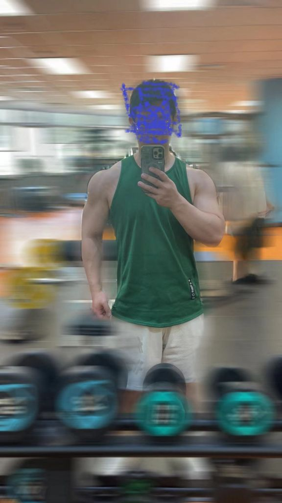
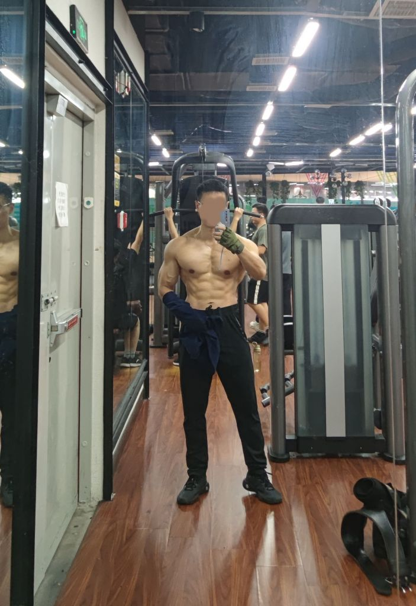
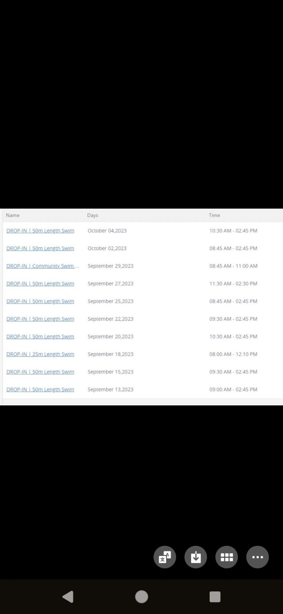
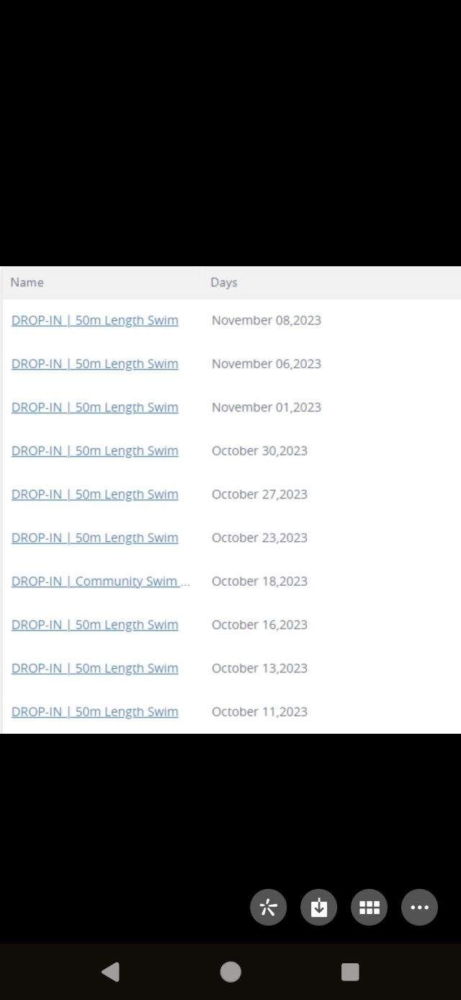
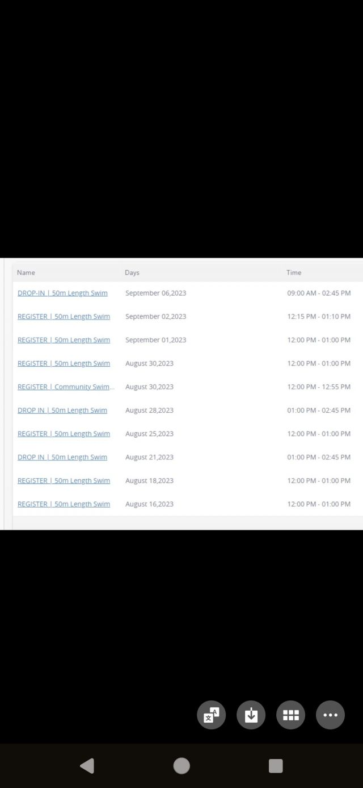
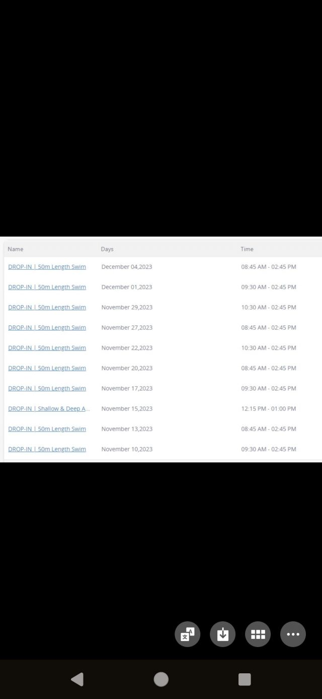

### 健身房练肌肉是不是消费陷阱？

Made by ngapost2md (c) ludoux [GitHub Repo](https://github.com/ludoux/ngapost2md)

----

##### 0.[0] \<pid:0\> 2023-12-05 12:44:56 by kchero\(江苏\)
疫情前练过两年。说实话一般人真的挺难坚持下来的。主要原因其实就是时间。我感觉练肌肉这种健身只适合有大把空闲时间的精英人士。这玩意不是练到某个程度就可以的，而是需要一直练去保持。普通人平常要上班，还要照顾家庭真的很难一直有这么多时间。一旦中途断个一个月，基本就前功尽弃了。
所以以后碰到健身游泳了解一下的小哥，直接拒绝他们就好了。

----

##### 1.[88] \<pid:730666047\> 2023-12-05 12:47:26 by cxrl4792\(上海\)
对

练得好必须有钱有闲还要有毅力

----

##### 2.[126] \<pid:730666062\> 2023-12-05 12:47:32 by 塞纳河畔2078\(江苏\)
健身练肌肉不是消费陷阱，只要坚持下去多少会有进步的，健身房卖课才是陷阱

----

##### 3.[10] \<pid:730666153\> 2023-12-05 12:48:03 by 唱红打黑放心飞\(广东\)
是的 我忙了几个月又白费了

----

##### 4.[0] \<pid:730666195\> 2023-12-05 12:48:20 by LeahpaR\(中国\)
最近刚办
已经后悔了
现在只能当作冬天洗个澡的地方
没事去走两步

----

##### 5.[38] \<pid:730667278\> 2023-12-05 12:54:25 by 文王梦熊\(浙江\)
断了一个月就前功尽弃倒不至于。主要是两个毛病，一是健身房这个行业不安稳，我十几年健身经验，本地做的最久的健身房都不如我健龄大。大多数健身房，平均寿命也就三年，跑路一批又一批。

第二个，很多健身教练，文化水平真的不咋地。健身这个问题，一是练肌肉，二是营养学，他们需要学习的还有很多。虽然偶尔有几个本科学历的健身教练，但大多数教练还是没知识、没文化的状态。

----

##### 6.[16] \<pid:730667336\> 2023-12-05 12:54:44 by ponyoung\(北京\)
说练成大肌霸肯定是陷阱，那种健身博主的身材除非你没啥正经工作、把健身当成班上，不然是练不出来的，吃多少补剂请多少私教都白扯。

但是单纯锻炼还是有用的，提升力量缓解焦虑，而且不断提高提升重量就像你打游戏不断过关一样，本身也是一种正反馈

----

##### 7.[0] \<pid:730667386\> 2023-12-05 12:54:59 by wh238711\(广东\)
是的，想要身体健康身材好，做做俯卧撑引体向上深蹲跑跑步爬爬山就可以了

----

##### 8.[0] \<pid:730667404\> 2023-12-05 12:55:05 by 绯-村\(江苏\)
真去练肌肉啊？
就是去练大点力量

----

##### 9.[0] \<pid:730667438\> 2023-12-05 12:55:16 by 夜梨280DD\(香港\)
健身 这两个字不是 健身房就多多少少已经是 健身教练 绝对是

----

##### 10.[3] \<pid:730667841\> 2023-12-05 12:57:48 by Antoc\(河北\)
俺寻思 有个能做俯卧撑的空间也不是不能练啊

----

##### 11.[7] \<pid:730668036\> 2023-12-05 12:58:55 by yangcncnl\(四川\)
真离家近，一周还是可以抽出时间去的，本来普通人一周2,3次就够了，一次去练个一小时不到就行。
不要光想着去了就是为了练成大块头，想着是去适度练练，增强身体素质就好，特别是喜欢游泳的。
一般来说买一年会员很便宜，只要不买课就行。

----

##### 12.[6] \<pid:730668145\> 2023-12-05 12:59:25 by 奔放大叔\(广东\)
健身房不是，私教课是

----

##### 13.[4] \<pid:730668161\> 2023-12-05 12:59:30 by jax\(澳大利亚\)
你自己管自己撸铁怎么就消费陷阱了？你也没怎么消费啊。。。

----

##### 14.[0] \<pid:730668172\> 2023-12-05 12:59:36 by mildsevenlly1\(上海\)
坚持了2年，因为不想在健身房看到一些人再加上疫情只能放弃了，不过挺怀念了

----

##### 15.[0] \<pid:730668310\> 2023-12-05 13:00:24 by paradise_\(北京\)
没钱没时间的酒别去健身房

----

##### 16.[7] \<pid:730668552\> 2023-12-05 13:01:45 by qzcmx123\(浙江\)
个人觉得盲目追求大重量健身才是，要交钱报课，还容易伤病

中小重量无氧加游泳简直完美，坚持两年了

----

##### 17.[0] \<pid:730668675\> 2023-12-05 13:02:29 by 撕裂的＆天堂\(浙江\)
不算吧，同事一起组团锻炼的，我看坚持1年多了，积极性还巨高。单人锻炼，身边没见过能坚持久的，找到团体一起去，啥理由都不再是借口。

----

##### 18.[0] \<pid:730668854\> 2023-12-05 13:03:28 by 蹦哒的泵泵\(上海\)
健身房要选大学附近的

客源多
稳定不会干几年就跑

----

##### 19.[6] \<pid:730669158\> 2023-12-05 13:05:14 by 滚来回\(江苏\)
中途断一个就前功尽弃了？
有基础恢复很快的，朋友  
把健身当爱好非专业的，一周三四次够够的了，一次不超过一小时

----

##### 20.[0] \<pid:730669177\> 2023-12-05 13:05:20 by 前端还是Python\(四川\)
>[jump](#pid730667278) 文王梦熊(2023-12-05 12:54) 说: 
>
>断了一个月就前功尽弃倒不至于。主要是两个毛病，一是健身房这个行业不安稳，我十几年健身经验，本地做的最久的健身房都不如我健龄大。大多数健身房，平均寿命也就三年，跑路一批又一批。
>
>第二个，很多健身教练，文化水平真的不咋地。健身这个问题，一是练肌肉，二是营养学，他们需要学习的还有很多。虽然偶尔有几个本科学历的健身教练，但大多数教练还是没知识、没文化的状态。

大佬能不能聊聊坚持10多年的心路历程，如何坚持下去的，健身目标等等

----

##### 21.[0] \<pid:730669309\> 2023-12-05 13:06:09 by muxiong\(河南\)
不是特别蛋疼的，跑跑步爬爬楼做有氧挺好。
除了不能给健身房增加收入，其他都是优点。
练的细一点就细一点呗，健康

----

##### 22.[0] \<pid:730669482\> 2023-12-05 13:07:11 by lzlovewow1\(福建\)
其实一周能去那么两次做点有氧，器械玩两下，也是比较健康的生活，就是健身房经常倒闭，有点难搞，不敢办大会员。

----

##### 23.[27] \<pid:730669532\> 2023-12-05 13:07:27 by 伊怡已易\(北京\)
“一旦中途断个一个月，基本就前功尽弃了”

行了知道您没练过了，别自欺欺人了

----

##### 24.[0] \<pid:730669576\> 2023-12-05 13:07:43 by czmxxx\(浙江\)
你想练成大叽霸那肯定是，如果只为保持身体健康机能那就不是

----

##### 25.[0] \<pid:730669707\> 2023-12-05 13:08:31 by 哆利的拥抱\(广东\)
练暂且不提，
配合练的吃和睡普通打工人都很难保证。

----

##### 26.[2] \<pid:730669779\> 2023-12-05 13:08:53 by tiberius\(甘肃\)
这玩意是普通人唯一一个持续付出就绝对有成果的活了，你说陷阱？自己在家练也没问题啊

----

##### 27.[0] \<pid:730669828\> 2023-12-05 13:09:11 by wangdinng\(河南\)
我们这365一年 就算是只去洗澡也都回本了 更何况还能锻炼

----

##### 28.[0] \<pid:730669864\> 2023-12-05 13:09:21 by shiqi1885\(日本\)
那看你咋说了，我一样社畜，但是每天撸铁1个半小时还是能抽出来的
首先你要搞清楚你的目标，你真的想要力量只能去健身房，除非你土豪，大房子
如果你只是想有点肌肉，那在家就可以、因为弹力带啥的都能满足
最后增肌的确很花钱这个倒是真的

----

##### 29.[11] \<pid:730669999\> 2023-12-05 13:10:17 by x黑色大丽花x\(上海\)
>[jump](#pid0) kchero(2023-12-05 12:44) 说: 
>
>一旦中途断个一个月，基本就前功尽弃了。

直接鉴定为云健身好吧

----

##### 30.[0] \<pid:730670133\> 2023-12-05 13:11:02 by ОЦ-14\(上海\)
初学者买两根60磅弹力绳，2个5公斤哑铃，在家都能练，别花冤枉钱，在家坚持不了，就别去健身房了。

----

##### 31.[0] \<pid:730670146\> 2023-12-05 13:11:06 by wws58202\(湖北\)
健身和练肌肉不是，健身房是。

----

##### 32.[0] \<pid:730670708\> 2023-12-05 13:14:33 by 雨夜星辰\(四川\)
有长期健身基础的  哪怕是断了  再找回来也就是一两个月的事情

----

##### 33.[0] \<pid:730670917\> 2023-12-05 13:15:48 by Mororin\(江苏\)
专门的器械能帮助更好的针对训练，加上有教练指导，能避免一些弯路，不算消费陷阱

----

##### 34.[0] \<pid:730671067\> 2023-12-05 13:16:45 by 流美华歌\(贵州\)
健身主要是个习惯，时间多的每天去健身房练完回家，健健康康，打工人如果健身不是爱好的话，去健身房和加班也没啥区别了。

----

##### 35.[0] \<pid:730671460\> 2023-12-05 13:19:17 by Danteror\(安徽\)
两年2000元，我觉得还行吧。每周去个两三次，一次一个半小时。就是让自己不要有个大肚子，看着匀称。

----

##### 36.[0] \<pid:730671645\> 2023-12-05 13:20:31 by 不懂妳的微笑\(浙江\)
三分练七分吃，对于普通人来说饭后能出门散步就算成功

----

##### 37.[0] \<pid:730671923\> 2023-12-05 13:22:22 by feiyuyyy666\(安徽\)
练就有收益,何谈陷阱?
抽不出大量时间,保证不了系统性的训练,就自己在家抽时间撸撸哑铃也行,时间少,就把训练内容细化,分化训练,一次用不了多少时间,当然了,一个正常生活的人,再怎么细化,也肯定要占用出去撸串或者在家吹快乐水上网刷剧玩游戏的时间.

----

##### 38.[2] \<pid:730672971\> 2023-12-05 13:28:34 by lll521bb\(河北\)
大部分人根本不是时间问题，就是没毅力，你要说去健身房领钱，饭不吃了都得去

----

##### 39.[0] \<pid:730673086\> 2023-12-05 13:29:21 by wcngatnn\(广东\)
主要是宿醉后去洗澡很爽

----

##### 40.[10] \<pid:730673680\> 2023-12-05 13:32:58 by 毅碗炸酱面\(北京\)
槽点比较多。。。就拿我举例，我虽然不代表普罗大众，但能说明一定的问题。

    1.我是疫情后开始锻炼的，现在坚持三年了。2.我是上班族，基本保持一周5练没问题。3.我有孩子，现在仍然坚持锻炼，且一周五练。4.去年孩子出生，家里没请任何保姆月嫂，我连着伺候月子，带着疫情隔离，有三个月没练，身材并不会缩水太多，恢复训练一个月力量就全回来了，并没有白练。

    所以说你自己不能坚持，不能保持自律是你自己的问题，不要归结给所谓“消费陷阱”之类的借口。

----

##### 41.[0] \<pid:730674007\> 2023-12-05 13:34:51 by IPIP0727\(北京\)
买哑铃，照着课程在家练练得了。

----

##### 42.[1] \<pid:730674044\> 2023-12-05 13:35:04 by 文王梦熊\(浙江\)
>[jump](#pid730669177) 前端还是Python(2023-12-05 13:05) 说: 
>
>大佬能不能聊聊坚持10多年的心路历程，如何坚持下去的，健身目标等等

没有目标，争取一年比一年更好。除了给老板打工，只要是自己亲自参与的事，都力求做到最好，对得起自己。

----

##### 43.[0] \<pid:730674528\> 2023-12-05 13:37:57 by AobaAoba\(日本\)
>[jump](#pid730667336) ponyoung(2023-12-05 12:54) 说: 
>
>说练成大肌霸肯定是陷阱，那种健身博主的身材除非你没啥正经工作、把健身当成班上，不然是练不出来的，吃多少补剂请多少私教都白扯。
>
>但是单纯锻炼还是有用的，提升力量缓解焦虑，而且不断提高提升重量就像你打游戏不断过关一样，本身也是一种正反馈
>

正反馈是真的
健身增肌两个月搬运重物的时候明显感觉轻松很多

----

##### 44.[0] \<pid:730674675\> 2023-12-05 13:38:50 by 煤球王178号\(湖北\)
>[jump](#pid730673680) 毅碗炸酱面(2023-12-05 13:32) 说: 
>
>槽点比较多。。。就拿我举例，我虽然不代表普罗大众，但能说明一定的问题。
>
>    1.我是疫情后开始锻炼的，现在坚持三年了。2.我是上班族，基本保持一周5练没问题。3.我有孩子，现在仍然坚持锻炼，且一周五练。4.去年孩子出生，家里没请任何保姆月嫂，我连着伺候月子，带着疫情隔离，有三个月没练，身材并不会缩水太多，恢复训练一个月力量就全回来了，并没有白练。
>
>    所以说你自己不能坚持，不能保持自律是你自己的问题，不要归结给所谓“消费陷阱”之类的借口。
>[img]./mon_202312/05/-

感觉练的太壮了点。。瘦一点肯定看起来好看些

----

##### 45.[0] \<pid:730675169\> 2023-12-05 13:41:46 by 月有引力\(四川\)
>[jump](#pid730674675) 煤球王178号(2023-12-05 13:38) 说: 
>
>感觉练的太壮了点。。瘦一点肯定看起来好看些

不算大，xiefa斜方有点大？

----

##### 46.[0] \<pid:730675306\> 2023-12-05 13:42:35 by jsder\(中国\)
现在人对肌肉的看法已经被打药的健美人带歪了
他们的肌肉是自然锻炼很难获得的
自然锻炼的极限可能在外行眼里叫脱衣有肉

----

##### 47.[0] \<pid:730676106\> 2023-12-05 13:47:27 by BloodyTulip\(江苏\)
看目的吧，如果只是追求健康和减肥完全不用去健身房。单纯想活动活动被健身房/网红忽悠办了卡那肯定是掉进陷阱。

----

##### 48.[0] \<pid:730676142\> 2023-12-05 13:47:40 by 澳洲老牛排\(上海\)
我觉得不是，看你以什么目的健身。

我换了工作高强度工作一个月腰酸背痛

请私教去健身房两周活力就恢复了很多。

缺点就是晚上九点开完会出公司拉着教练加班

----

##### 49.[2] \<pid:730676948\> 2023-12-05 13:52:19 by 悸动即逝\(中国\)
>[jump](#pid730673680) 毅碗炸酱面(2023-12-05 13:32) 说: 
>
>槽点比较多。。。就拿我举例，我虽然不代表普罗大众，但能说明一定的问题。
>
>    1.我是疫情后开始锻炼的，现在坚持三年了。2.我是上班族，基本保持一周5练没问题。3.我有孩子，现在仍然坚持锻炼，且一周五练。4.去年孩子出生，家里没请任何保姆月嫂，我连着伺候月子，带着疫情隔离，有三个月没练，身材并不会缩水太多，恢复训练一个月力量就全回来了，并没有白练。
>
>    所以说你自己不能坚持，不能保持自律是你自己的问题，不要归结给所谓“消费陷阱”之类的借口。
>[img]./mon_202312/05/-

没用的老哥，想找借口总有各种各样的借口。你永远叫不醒装睡的人

----

##### 50.[0] \<pid:730677704\> 2023-12-05 13:56:40 by 高级木桩假人\(中国\)
加上换衣服，我是不懂一天一个半小时都拿不出来的人在这诉苦啥况且不一定非要健身房啊，每天在家半小时也可以，不过是自己在找借口罢了

----

##### 51.[5] \<pid:730678103\> 2023-12-05 13:58:48 by 斯文的小野兽\(中国\)
36岁，练了快10年了，中间有间断也很正常，出差经常半个月练不了，疫情3年就更别说了。健身的确花费时间和一些金钱，都是收获更多。

----

##### 52.[0] \<pid:730678663\> 2023-12-05 14:01:55 by 皮卡丘的蛋蛋\(浙江\)
一周三练，年卡也就1500。保持身材挺好的，有肌肉线条，没有大肚子。

----

##### 53.[3] \<pid:730678690\> 2023-12-05 14:02:02 by zjjno12\(江苏\)
肌肉是唯一不会背叛你的东西了

----

##### 54.[0] \<pid:730678888\> 2023-12-05 14:03:06 by 神啊赐个妞吧\(福建\)
坚持健身的是运动成瘾，我深蹲的时候看着杠铃我就开心，不需要坚持，谁运动靠的坚持，健身这东西就是去一次不受伤的情况就是赚一次，没有所谓的之后就没了。腰椎可以靠背部肌肉起到保护和支撑，腿关节也需要肌肉保护，所有打球膝盖出问题的朋友医生给的忠告都是增加腿部肌肉

----

##### 55.[0] \<pid:730679321\> 2023-12-05 14:05:32 by c__c\(广西\)
断一个月怎么可能就前功尽弃

----

##### 56.[0] \<pid:730679542\> 2023-12-05 14:06:50 by kotori_yoshino\(江苏\)
有钱有时间有毅力缺一不可
那些说晚上去的，上一天班下来根本不想出门好吧

----

##### 57.[0] \<pid:730679959\> 2023-12-05 14:09:21 by 无敌的火锅\(中国\)
我寻思健身房练得人也没几个能练出啥明显的肌肉呀。。。。。

----

##### 58.[7] \<pid:730680321\> 2023-12-05 14:11:12 by zhengyu6211\(广东\)
不想练就说不想练，什么中间断了就前功尽弃，你以为是买保险交社保的吗？你这么说练一辈子死之前是不是还有利润返还？
自我训练是这世界上唯一不会骗你的东西，你练一年就有一年的基础和水平，哪怕过了三四年再练也有回报。
再说现在有很多人真的很喜欢找借口，没时间，照顾老婆孩子。不喜欢训练没什么大不了的，但是说自己没时间练不了就是瞎扯淡了。
我有一个远方姐夫是农民+民工，他每天早上5点起来跑10km，在家就弄弄田种种地，务工就去正常打工。跑过不知道几个全马了，你比他还没时间？
健身房有几个哥们，一个是酒吧小弟，每天2点下班，联合好几个哥们让老板开了24h的先例。
还有见过穿着饿了么蓝色衣服的小哥来健身的。
如果有想法，哪里都是你的舞台，永远不要给自己找太多借口。

----

##### 59.[0] \<pid:730680853\> 2023-12-05 14:14:14 by 姜糖\(中国\)
健身非要划分的话可以跟游戏、追剧这类一样归为娱乐项目。

只是为了消磨时间打游戏，可以什么都不用买，想玩得好就会考虑买装备、买皮肤。

单纯为健康的话可以自己在家练、在公园小区练，但追求肌肥大、肌力量就会考虑健身房。

如果认为只有健身房才算健身，那确实有点被洗脑的味道。

记住最初健身的目的，不要因为走得太远而忘了为什么出发。

----

##### 60.[0] \<pid:730680865\> 2023-12-05 14:14:17 by 灵魂深\(上海\)
确实是，，天天顶着个8块腹肌卵用没有

----

##### 61.[0] \<pid:730681014\> 2023-12-05 14:15:09 by kobe88124\(上海\)
一周3-4练，一次算上洗澡和路程2小时。每周有6-8小时出来打游戏，就不能抽这点时间健身是吧。

----

##### 62.[0] \<pid:730681106\> 2023-12-05 14:15:38 by 小可Catkin\(北京\)
主要还是要坚持，只要你能坚持下去的话那办卡确实不算亏的。所以只要健身房不倒闭，亏不亏取决于你自己去的次数。
记得别买课

----

##### 63.[0] \<pid:730681840\> 2023-12-05 14:19:48 by 网不破鱼不死\(陕西\)
是去健身房锻炼一下还是九龙拉棺青草试炼，区别还是挺大的。

----

##### 64.[0] \<pid:730681907\> 2023-12-05 14:20:06 by Silent Void\(福建\)
消费陷阱？

健身房大概率是  私教课百分百是

健身不是

----

##### 65.[0] \<pid:730682119\> 2023-12-05 14:21:20 by FQuartets\(甘肃\)
你自己试试就知道了，你练出来的肌肉就算一段时间不练变小了但是再重新练一两周就能基本恢复

----

##### 66.[0] \<pid:730682182\> 2023-12-05 14:21:44 by 斯文的小野兽\(中国\)
>[jump](#pid730680865) 灵魂深(2023-12-05 14:14) 说: 
>
>确实是，，天天顶着个8块腹肌卵用没有

咋没用，发抖音，朋友圈呀

----

##### 67.[0] \<pid:730682818\> 2023-12-05 14:25:16 by ronnornga\(亚太地区\)
健身房练的是死肉，没有化劲

----

##### 68.[0] \<pid:730682819\> 2023-12-05 14:25:18 by 胖虎的地锅鸡\(加拿大\)
2023年第四季度我游泳的频率；一周三次，一次1200~1500米，50米的泳池，300米休息一分钟，保证50米/55~65秒的自由泳速度；每次都是45分钟左右总运动时间

私以为，达不到类似频次，强度，以及没有50米泳池的健身房，如果劝你游泳办卡上课，那基本上都是想着把你当猪宰

----

##### 69.[0] \<pid:730683098\> 2023-12-05 14:26:50 by 车那塞蒙卡\(四川\)
中国女性的审美就不在乎身材。。

所以练不练无所谓。  

练主要是自己喜欢。

另外力量训练上大重量很容易伤病的。

----

##### 70.[0] \<pid:730684224\> 2023-12-05 14:33:11 by 慢慢变bt\(日本\)
健身15年+，刚开始大概5年一直去健身房。
自从有几次开始外面跑步，外面公园随便找器械锻炼之后就再也没去过健身房，自己家里就一副哑铃，其实靠自体重量就能玩很多花样。
野练是真的爽，特别是跑步，就是夏天热冬天冷，不过习惯就好了。
我目标很明确，不是想练成大肌霸，只是想肌肉线条好看。

----

##### 71.[0] \<pid:730684447\> 2023-12-05 14:34:21 by 風去無影\(江苏\)
对你这种确实算智商税。

----

##### 72.[0] \<pid:730684548\> 2023-12-05 14:34:50 by 灵魂深\(上海\)
>[jump](#pid730684224) 慢慢变bt(2023-12-05 14:33) 说: 
>
>健身15年+，刚开始大概5年一直去健身房，自从有几次开始外面跑步，外面公园随便找器械锻炼之后就再也没去过，自己家里就一副哑铃。
>野练是真的爽，特别是跑步，就是夏天热冬天冷，不过习惯就好了。
>我目标很明确，不是想练成大肌霸，只是想肌肉线条好看。

健身5年，也没去过健身房，也一副哑铃，

----

##### 73.[0] \<pid:730684950\> 2023-12-05 14:37:17 by 風去無影\(江苏\)
>[jump](#pid730678690) zjjno12(2023-12-05 14:02)说:
>肌肉是唯一不会背叛你的东西了

绝对了。
知识和金钱也是。

----

##### 74.[0] \<pid:730685343\> 2023-12-05 14:39:21 by dxlnn1982\(美国\)
消费陷阱...学了个词就往上套...

我年卡800，有泳池有器械，一年去个180次，它套住我啥消费了？

没时间？我也没时间，中午吃饭的时间匀出来练完回去边上班边吃饭。

给自己找借口罢了。

----

##### 75.[0] \<pid:730687294\> 2023-12-05 14:49:58 by 壳之少女\(江苏\)
俺寻思，不是为了看隔壁房间练瑜伽的小少妇，谁那么有闲整天泡健身房里面

----

##### 76.[0] \<pid:730687778\> 2023-12-05 14:52:38 by zhuankirito\(四川\)
懒就别给自己找理由了，什么没时间什么锻炼了一段时间不练了就作废了，你涨肌肉的时候那么慢咋个掉肌肉就快了吗？本来健身时间就是挤出来的，我想练中午一个小时午休我也可以去练，只想下班回去后就躺着的当然没时间了

----

##### 77.[0] \<pid:730688003\> 2023-12-05 14:53:47 by ls2017001\(湖北\)
就每天在家练俯卧撑，深蹲。

----

##### 78.[0] \<pid:730688175\> 2023-12-05 14:54:46 by 放松对方\(湖南\)
请问一下活着是不是消费陷阱啊？死了还有谁能骗我花钱

----

##### 79.[0] \<pid:730688434\> 2023-12-05 14:56:11 by mengyan2014\(江苏\)
LZ别挣扎了，下不了决心可以不去，别骗自己哦。

----

##### 80.[0] \<pid:730688581\> 2023-12-05 14:57:01 by 一夜醉红颜\(浙江\)
>[jump](#pid730673680) 毅碗炸酱面(2023-12-05 13:32) 说: 
>
>槽点比较多。。。就拿我举例，我虽然不代表普罗大众，但能说明一定的问题。
>
>    1.我是疫情后开始锻炼的，现在坚持三年了。2.我是上班族，基本保持一周5练没问题。3.我有孩子，现在仍然坚持锻炼，且一周五练。4.去年孩子出生，家里没请任何保姆月嫂，我连着伺候月子，带着疫情隔离，有三个月没练，身材并不会缩水太多，恢复训练一个月力量就全回来了，并没有白练。
>
>    所以说你自己不能坚持，不能保持自律是你自己的问题，不要归结给所谓“消费陷阱”之类的借口。
>[img]./mon_202312/05/-

三年有这个肩膀多少带点天赋了，我比你多几年，肩膀没有你抛

----

##### 81.[0] \<pid:730692072\> 2023-12-05 15:14:06 by HE_WL\(江苏\)
是，我们这里的银吉姆跑路了。

----

##### 82.[0] \<pid:730693867\> 2023-12-05 15:22:35 by 日月大走\(江苏\)
我现在一年去个五六次，疫情时最长一年多没动
也能维持住啊
水平就是深蹲硬拉两倍体重差点点的水平，也不加重硬上，怕伤了，这水平好几年了

----

##### 83.[0] \<pid:730696007\> 2023-12-05 15:33:14 by ys991263678\(中国\)
练下去真的太难，难在不是每天那两小时，而且饮食的控制，这个真的太难了，国内没有健身配套的环境，饮食全要靠自己来，我是坚持了两年弄不下去了。

----

##### 85.[0] \<pid:730696898\> 2023-12-05 15:37:41 by 殺卐笑里藏刀\(四川\)
1、我每天只睡了5小时左右，有时候只有4小时，我仍然在训练，同时有任何时机我都能补一点瞌睡，例如昨天抓着发烧得朋友去医院，候诊得椅子挺舒服得。
2、健身房是会跑路得，而且要达到我自己使用要求得健身房价格不菲，或者位置太远，所以只要是会点基础锻炼得我都建议居家训练(4个规格得壶铃都可以练到不错，更别说举重台深蹲架等大佬了)
3、要练10年，20年呢，1个月得停练不过是九牛一毛。

----

##### 86.[0] \<pid:730697153\> 2023-12-05 15:38:55 by 轟鳴之雷·古格奈斯\(北京\)
只要你练过，就算断了，再恢复也是比以前快的，不算白费

----

##### 87.[0] \<pid:730697450\> 2023-12-05 15:40:28 by 自引壶觞酌\(浙江\)
我去健身房锻炼被那些“热情”的教练给劝退了

还有傻逼教练在我明确拒绝后还要求我做个小额贷款来买课，向经理投诉都没用

估计是故意放出来恶心人的，光办卡的钱他们看不上眼

----

##### 88.[0] \<pid:730697477\> 2023-12-05 15:40:34 by zjy1992114\(广西\)
在家就能练，并不是非要去健身房，只是初学者没学会动作要领的话建议找人带，免得动作做错受伤，不打比赛在家练完全没问题

----

##### 89.[0] \<pid:730697769\> 2023-12-05 15:41:51 by 青天白满地红\(陕西\)
真练起来了，停个一两年，恢复起来也很快

----

##### 90.[0] \<pid:730697958\> 2023-12-05 15:42:42 by 殺卐笑里藏刀\(四川\)
>[jump](#pid730696007) ys991263678(2023-12-05 15:33)说:
>练下去真的太难，难在不是每天那两小时，而且饮食的控制，这个真的太难了，国内没有健身配套的环境，饮食全要靠自己来，我是坚持了两年弄不下去了。

如果是长时间外出得工作确实不好办，不说吃干净点了，就蛋白质能吃够都是问题。

如果是办公室常驻得工作，建议自己做餐。。我也是从白水鸡胸进化到现在能用鸡胸做麻辣鸡丝和大盘鸡了。。味道和健康，最后平衡到自己能长期坚持吃得水平就行了~咱不是运动员，不参加公斤级竞赛，不用要求那么高。

关于健身得饮食策略可以参考这个：[url](https://blog.sina.com.cn/s/blog_9ebececf0102xctm.html)这个博客里内容蛮多的，都可以参考。

----

##### 91.[0] \<pid:730698175\> 2023-12-05 15:43:48 by 云天鸠神炼\(浙江\)
对啊。

健身最重要的部分，首先是，不能上班。

----

##### 92.[0] \<pid:730698260\> 2023-12-05 15:44:14 by 殺卐笑里藏刀\(四川\)
>[jump](#pid730697153) 轟鳴之雷·古格奈斯(2023-12-05 15:38)说:
>只要你练过，就算断了，再恢复也是比以前快的，不算白费

是的，22年阳了，加上房子装修，我差不多停了半年多，恢复力量水平差不多2周就搞回来了，肌容量才是掉了想回来就漫长了

----

##### 93.[0] \<pid:730712586\> 2023-12-05 16:52:55 by 爱吃肉\(中国\)
>[jump](#pid730696007) ys991263678(2023-12-05 15:33) 说: 
>
>练下去真的太难，难在不是每天那两小时，而且饮食的控制，这个真的太难了，国内没有健身配套的环境，饮食全要靠自己来，我是坚持了两年弄不下去了。

不控制饮食就不能练了？

----

##### 94.[0] \<pid:730712788\> 2023-12-05 16:53:53 by 铁皮憨\(江苏\)
上班族，还健身，你相信吗？上班族也很少能旅游的

----

##### 95.[0] \<pid:730714331\> 2023-12-05 17:01:04 by UID11316125\(欧盟\)
不去健身房，只做俯卧撑，仰卧起坐，深蹲 平板支撑，能练肌肉吗？

----

##### 96.[0] \<pid:730714489\> 2023-12-05 17:01:52 by 赛迪咖啡\(四川\)
网上特有名的一句话：想要健好身第一点就是不要上班！

----

##### 97.[0] \<pid:730714597\> 2023-12-05 17:02:23 by 溜溜球919\(上海\)
中途一个月就前功尽弃？疫情我们中断了这么久呢，还不是接着练，这个又不是想着去打比赛，超越自己就好

----

##### 98.[0] \<pid:730715045\> 2023-12-05 17:04:29 by 吃掉彩虹屁\(湖北\)
三天打鱼两天晒网的只适合按次付费，如果有的话

----

##### 99.[0] \<pid:730715144\> 2023-12-05 17:04:59 by 电臀柯基\(四川\)
>[jump](#pid730674675) 煤球王178号(2023-12-05 13:38) 说: 
>
>感觉练的太壮了点。。瘦一点肯定看起来好看些

你是男的女的？

这个练的不错，但是跟壮没半毛钱关系

我倒是有个男同事觉得练太大不好看，我安慰，你放心，你这个小骨架，你练到退休都没这水平

----

##### 100.[0] \<pid:730715829\> 2023-12-05 17:08:06 by ys991263678\(中国\)
>[jump](#pid730712586) 爱吃肉(2023-12-05 16:52) 说: 
>
>不控制饮食就不能练了？

你只要真的想练，不可能不注意饮食的，喜欢健身的谁不想要饱满的肌肉，一边练一边乱吃的练个毛。

----

##### 101.[2] \<pid:730715961\> 2023-12-05 17:08:47 by kiddly\(中国\)
拿什么有钱有时间才能去练，练不出好看身材，要照顾家庭工作忙当借口的，可以去看看东哥。
[烧毁一切就是美的个人空间-哔哩哔哩] [url](https://b23.tv/fMlBKU7)

社畜 √(人家上的还是倒班)
照顾一个家庭 √
没钱 √
健美比赛冠军 √

----

##### 102.[0] \<pid:730716440\> 2023-12-05 17:11:15 by 佛光初现照我心\(广东\)
只能说运动是习惯

----

##### 103.[0] \<pid:730716502\> 2023-12-05 17:11:31 by 自由狂想曲\(中国\)
兄弟，你不练肌肉，时间拿来打游戏喝酒也不会比现在强！

----

##### 104.[0] \<pid:730716874\> 2023-12-05 17:13:14 by 无敌的火锅\(中国\)
>[jump](#pid730715829) ys991263678(2023-12-05 17:08) 说: 
>
>你只要真的想练，不可能不注意饮食的，喜欢健身的谁不想要饱满的肌肉，一边练一边乱吃的练个毛。

我就无所谓饱满的肌肉，我只想健康的身体，顺便三大项多一点重量，别以为健身就是健美

----

##### 105.[0] \<pid:730717552\> 2023-12-05 17:16:13 by 殺卐笑里藏刀\(四川\)
>[jump](#pid730716874) 无敌的火锅(2023-12-05 17:13)说:
>>[jump](#pid730715829) ys991263678(2023-12-05 17:08) 说: 
>>
>>你只要真的想练，不可能不注意饮食的，喜欢健身的谁不想要饱满的肌肉，一边练一边乱吃的练个毛。
>
>我就无所谓饱满的肌肉，我只想健康的身体，顺便三大项多一点重量，别以为健身就是健美

+1

力量举、硬式壶铃爱好者留

----

##### 106.[0] \<pid:730725702\> 2023-12-05 17:57:43 by 爱吃肉\(中国\)
>[jump](#pid730715829) ys991263678(2023-12-05 17:08) 说: 
>
>你只要真的想练，不可能不注意饮食的，喜欢健身的谁不想要饱满的肌肉，一边练一边乱吃的练个毛。

肉和碳水够，维生素吃复合，还不够你涨肌肉？你要腹肌那更简单，什么都不吃饿着就行。

----

##### 107.[0] \<pid:730727801\> 2023-12-05 18:09:21 by 柜内样刻\(江苏\)
坚持健身没那么难的，下班去就行，至少没结婚不会没那个时间。精英人士996，那才叫没时间 

大多数人去健身房就是增加点消耗，强化下心肺罢了，又不是个个撸铁

----

##### 108.[0] \<pid:730736067\> 2023-12-05 18:57:18 by 牛德德\(江苏\)
大把的人有时间躺在床上刷手机却说自己没空去锻炼。

