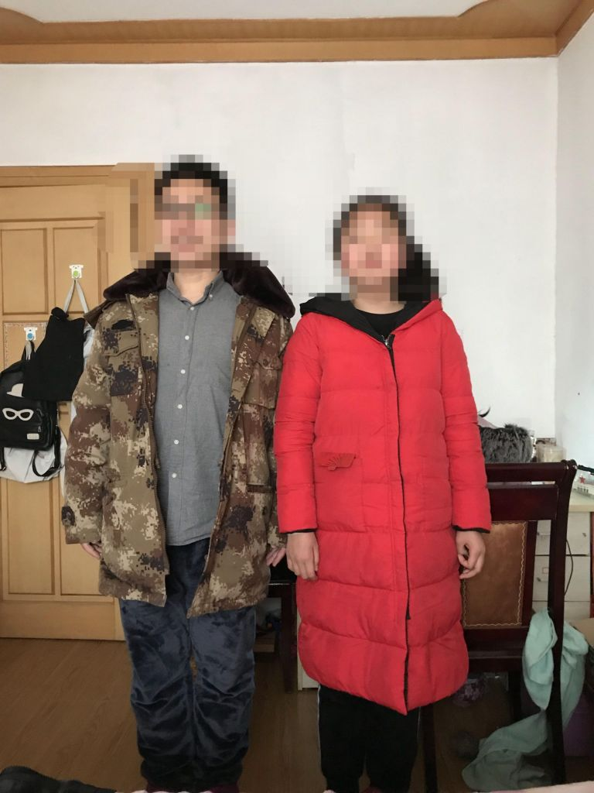
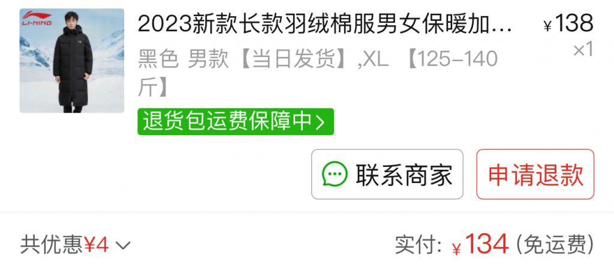
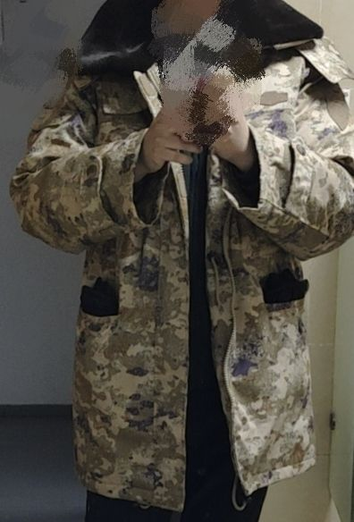

### 军大衣是不是炒作

Made by ngapost2md (c) ludoux [GitHub Repo](https://github.com/ludoux/ngapost2md)

----

##### 0.[0] \<pid:0\> 2023-12-05 16:57:15 by 老狼小k3\(黑龙江\)
现在网上铺天盖地“羽绒服不如军大衣”，是真的还是假的？

----

##### 1.[126] \<pid:730713640\> 2023-12-05 16:57:50 by t3545144\(四川\)
两年前就买了，不上班就穿，确实羽绒服不如军大衣。。

----

##### 2.[351] \<pid:730713771\> 2023-12-05 16:58:26 by 基尔弗莱\(湖北\)
是羽绒服先卖7000的

----

##### 3.[155] \<pid:730713827\> 2023-12-05 16:58:42 by 哑子看见花吕Paul\(浙江\)
100块钱的东西炒作个啥呀

----

##### 4.[41] \<pid:730713828\> 2023-12-05 16:58:42 by 小叁\(浙江\)
应该是炒作吧……突然铺天盖地的……不过确实便宜耐用啊，只要不介意它难看

----

##### 5.[77] \<pid:730713891\> 2023-12-05 16:59:01 by 初级测工刘小帅\(山西\)
一件都不到100块钱，炒啥炒

----

##### 6.[32] \<pid:730713995\> 2023-12-05 16:59:32 by 巳方崔丁卫马
消费降级而已

----

##### 7.[0] \<pid:730714004\> 2023-12-05 16:59:34 by wavebat\(北京\)
军大衣御寒能力并不好，如果觉得羽绒服贵，可以买冲锋衣

----

##### 8.[21] \<pid:730714010\> 2023-12-05 16:59:35 by 風行騅\(山东\)
泰山都淘汰军大衣了

----

##### 9.[7] \<pid:730714015\> 2023-12-05 16:59:36 by 小可129\(贵州\)
价钱拉倒同一档次比就行了

----

##### 10.[9] \<pid:730714037\> 2023-12-05 16:59:41 by 陈雨2015\(河北\)
就是大学生跟风的

----

##### 11.[1] \<pid:730714046\> 2023-12-05 16:59:43 by 66666了\(安徽\)
羽绒服涨价  外加消费降级

----

##### 12.[4] \<pid:730714077\> 2023-12-05 16:59:52 by 不知归路不如归去\(中国\)
为什么买军大衣，作战棉服不香吗？

----

##### 13.[13] \<pid:730714081\> 2023-12-05 16:59:53 by 随风飞翔2019\(湖北\)
真的，现在的羽绒服普遍薄的可怜保温效果是不如正宗棉大衣的，记住是棉花的棉，不是什么丝绵，聚酯棉之类乱七八糟的

----

##### 14.[13] \<pid:730714131\> 2023-12-05 17:00:04 by 伸缩手杖\(中国\)
军大衣要暖和得非常沉才有可能。
羽绒服你得反季节卖，你这天去买可不是买在高点上面。
我们家买羽绒服都是7月份去买的。

----

##### 15.[0] \<pid:730714224\> 2023-12-05 17:00:35 by 黑暗起司猫\(上海\)
有没有一种可能新款军大衣是羽绒内的

----

##### 16.[0] \<pid:730714250\> 2023-12-05 17:00:43 by euuns\(北京\)
>[jump](#pid730714010) 風行騅(2023-12-05 16:59) 说: 
>
>泰山都淘汰军大衣了

现在换什么了？

----

##### 17.[46] \<pid:730714261\> 2023-12-05 17:00:46 by 燊焱炎\(中国\)
我听到的梗是，不是羽绒服买不起，而是军大衣更有性价比。我ppd上一看，军大衣才60块钱，那确实没毛病，

至于你那句话谁跟你说的，你问那人去。

----

##### 18.[1] \<pid:730714290\> 2023-12-05 17:00:54 by gancui7140\(中国\)
主要就是太重了

----

##### 19.[0] \<pid:730714379\> 2023-12-05 17:01:19 by 洋芋淡淡\(广东\)
现实中真有多少人穿军大衣吗？

----

##### 20.[0] \<pid:730714405\> 2023-12-05 17:01:26 by Rallos Zek\(上海\)
跟风，这东西能炒多贵，不嫌复古穿着是很舒服的，比羽绒服暖和那是吹，早些年爬山看日出就是山顶租军大衣那一裹着老暖和了。

----

##### 21.[0] \<pid:730714492\> 2023-12-05 17:01:53 by 猫777\(江苏\)

军大衣就是主打一个性价比呀……

----

##### 22.[0] \<pid:730714497\> 2023-12-05 17:01:54 by crudehhh\(上海\)
我有一件军大衣，是我姐夫还没退伍时候在部队买的

已经穿好多年了，是真的暖和  

附图就是18年春节在家穿军大衣和外甥女的合照

苏北小县城，没开空调没有暖气

----

##### 23.[18] \<pid:730714536\> 2023-12-05 17:02:03 by 大萝卜仙人\(北京\)
网上玩梗罢了

现实里你见几个真穿军大衣的？

另外棉花保暖性在什么时候都比不上羽绒，  你淘宝3、400也可以买到脚踝的长款羽绒服了， 绝对比军大衣暖和

也别提什么军品性能好

都2023年了，你还真心你网上买到的“军大衣”是军品？  这么大规模的倒卖军品，你当你活在缅甸呢？

----

##### 24.[9] \<pid:730714646\> 2023-12-05 17:02:35 by 圣莫洛托夫鸡尾酒\(北京\)
单位重量的保暖能力肯定不如羽绒服，单位金额的保暖能力那薄纱大多数羽绒服太多了，即使是以便宜著称的一些牌子

----

##### 25.[5] \<pid:730714800\> 2023-12-05 17:03:19 by bug又见bug\(福建\)
今年羽绒服价格上天了，特指波司登，基本没少于4位数的，不是羽绒服买不起，而是军大衣更有性价比。谁不想穿轻便点，但是这价格的羽绒服下不去手

----

##### 26.[0] \<pid:730714852\> 2023-12-05 17:03:31 by 蓝色硫酸铜\(上海\)
来个军大衣链接

----

##### 27.[0] \<pid:730714877\> 2023-12-05 17:03:38 by lonelypein\(中国\)
>[jump](#pid730714077) 不知归路不如归去(2023-12-05 16:59) 说: 
>
>为什么买军大衣，作战棉服不香吗？

老哥，多多上面买作战棉服可靠吗

----

##### 28.[0] \<pid:730714901\> 2023-12-05 17:03:45 by hanyue\(上海\)
说真的还不如咸鱼上买东航的

----

##### 29.[0] \<pid:730715021\> 2023-12-05 17:04:22 by 幽绯\(安徽\)
最多就是更风蹭流量

----

##### 30.[0] \<pid:730715028\> 2023-12-05 17:04:25 by guodumushi\(北京\)
我 0几年去网吧 包宿就穿军大衣了。。

----

##### 31.[0] \<pid:730715030\> 2023-12-05 17:04:25 by 索米啦\(湖北\)
军大衣唯一的缺点就是丑

----

##### 32.[0] \<pid:730715068\> 2023-12-05 17:04:34 by 一燕归人未归一\(陕西\)
家里有以前的军大衣，那玩意得有两个羽绒服重

----

##### 33.[0] \<pid:730715124\> 2023-12-05 17:04:54 by moxy1018\(广东\)
我爸朋友送过两套，确实暖，但是穿起来太臃肿了不好看

----

##### 34.[1] \<pid:730715276\> 2023-12-05 17:05:32 by 刺蛇克里斯\(四川\)
>[jump](#pid730715030) 索米啦(2023-12-05 17:04) 说: 
>
>军大衣唯一的缺点就是丑

外加一个重

同质量的保温程度确实没办法和羽绒服比

但是便宜啊

----

##### 35.[0] \<pid:730715368\> 2023-12-05 17:05:55 by 无敌的火锅\(中国\)
我以前有陆军和海军的军大衣各一件。。。。暖和是暖和，就是沉了点

----

##### 36.[0] \<pid:730715407\> 2023-12-05 17:06:07 by mml的萝莉控\(北京\)
南方人，小时候喜欢穿军大衣在沙发上看电视，和盖棉被一样

----

##### 37.[5] \<pid:730715451\> 2023-12-05 17:06:18 by 索米啦\(湖北\)
>[jump](#pid730714536) 大萝卜仙人(2023-12-05 17:02) 说: 
>
>网上玩梗罢了
>
>现实里你见几个真穿军大衣的？
>
>另外棉花保暖性在什么时候都比不上羽绒，  你淘宝3、400也可以买到脚踝的长款羽绒服了， 绝对比军大衣暖和
>
>也别提什么军品性能好
>
>都2023年了，你还真心你网上买到的“军大衣”是军品？  这么大规模的倒卖军品，你当你活在缅甸呢？

问题是军大衣不需要300啊。

----

##### 38.[0] \<pid:730715514\> 2023-12-05 17:06:35 by 甲叉双丙烯酰胺\(江苏\)
看不出是调侃吗？

----

##### 39.[0] \<pid:730715519\> 2023-12-05 17:06:36 by cs125572672\(重庆\)
你坐着不动是军大衣暖和，关键太重了，做事或者走路一会你就满身大汗

----

##### 40.[0] \<pid:730715672\> 2023-12-05 17:07:20 by ℡﹏唥碸祌cんàn栗魡鯖蛙\(浙江\)
10年前就有了

----

##### 41.[1] \<pid:730715680\> 2023-12-05 17:07:22 by 阿牛1985\(湖北\)
不知道你穿没穿过以前部队里的军大衣，超级重，也超级暖和，效果完爆羽绒服，穿身上非常有安全感。我小时候穿过长辈的，现在都还记得

----

##### 42.[1] \<pid:730715733\> 2023-12-05 17:07:41 by 中路杀神赵日天\(江苏\)
>[jump](#pid730714081) 随风飞翔2019(2023-12-05 16:59) 说: 
>真的，现在的羽绒服普遍薄的可怜保温效果是不如正宗棉大衣的，记住是棉花的棉，不是什么丝绵，聚酯棉之类乱七八糟的

你这不是废话，棉花胎多重羽绒多重。

----

##### 43.[0] \<pid:730715766\> 2023-12-05 17:07:50 by yongandexi\(安徽\)
不就是裹床被子在身上？适合北方那种进家就脱出门披上的使用环境。

----

##### 44.[0] \<pid:730715883\> 2023-12-05 17:08:24 by 放开那个箩莉\(重庆\)

我晚上玩游戏的时候就喜欢披军大衣呢。最近火起来了其实也不只有军绿色选择了。也有些其他款式了。

----

##### 45.[0] \<pid:730715939\> 2023-12-05 17:08:40 by 太行青岩\(山西\)
穿军大衣就相当于披着一床棉被，暖和是暖和，但是压得慌。

----

##### 46.[0] \<pid:730715964\> 2023-12-05 17:08:48 by vermissen\(浙江\)
网络热点大部分都是傻逼凑热闹…

----

##### 47.[0] \<pid:730715994\> 2023-12-05 17:08:56 by 请叫我隔壁老宋\(上海\)
>[jump](#pid730714290) gancui7140(2023-12-05 17:00) 说: 
>
>主要就是太重了

重才好
作为前野战部队的 我们那时驻地冬天也有零下十几度，但就一条军被 一个薄床垫 什么空调暖一概没有，军大衣晚上就是用来压在被子上的。

----

##### 48.[0] \<pid:730716126\> 2023-12-05 17:09:38 by evilmeteor\(中国\)
讲道理 鹅绒羽绒服+风衣 不完爆军大衣 
军大衣那个重量，那个造型，除了爷爷辈的 真有人穿吗
几年前火起来的某做睡袋的品牌，700块钱左右，那羽绒服穿上重量和没有一样 ，零下20几度直冒汗，穿了几年也没有衰减，嫌难看外面套个时尚风衣不香吗

----

##### 49.[0] \<pid:730716149\> 2023-12-05 17:09:43 by 冉晶\(北京\)
就军大衣那玩意，炒作能赚几个钱，而且分分钟仿制，没人给别人花钱炒作吧

----

##### 50.[0] \<pid:730716205\> 2023-12-05 17:10:01 by lishengran\(福建\)
我觉得或许是因为东北旅游火了，那福建这来说，几乎我身边所有认识的女生都打算去哈尔滨，延吉旅游。一听我老家东北的，就问我穿什么过去比较好。我说，先搞个厚一点的羽绒服吧，一两千块钱，她们说太贵了，穿一次以后也用不到了啊。想想只能推荐军大衣了。

----

##### 51.[0] \<pid:730716234\> 2023-12-05 17:10:14 by 心若逸尘\(江西\)
学生狗能有几个钱，军大衣便宜、保暖、耐操，对于学生狗而言，性价比完全什么羽绒服……

还要啥自行车

----

##### 52.[0] \<pid:730716346\> 2023-12-05 17:10:44 by 鸟啃池边树\(江苏\)
2020年封城我在街头执勤，就靠单位发的军大衣续命了，暖是真的暖

----

##### 53.[0] \<pid:730716505\> 2023-12-05 17:11:32 by White Rabbit\(四川\)
前段时间江西老表排队买空
还是闲人太多

----

##### 54.[0] \<pid:730716585\> 2023-12-05 17:11:52 by lfffffffffff\(河南\)
军大衣真的很保暖

----

##### 55.[0] \<pid:730716628\> 2023-12-05 17:12:02 by 金属不留痕\(湖南\)
军大衣分好几种。最近21年就出了21式迷彩大衣，羽绒的。还有温区常服大衣和寒区常服大衣。还有旧款的棉迷彩大衣。这几种大衣都是军大衣，保温效果都不一样。

----

##### 56.[0] \<pid:730716648\> 2023-12-05 17:12:10 by xxuan1990\(湖北\)
>[jump](#pid730716126) evilmeteor(2023-12-05 17:09) 说: 
>
>讲道理 鹅绒羽绒服+风衣 不完爆军大衣 
>军大衣那个重量，那个造型，除了爷爷辈的 真有人穿吗
>几年前火起来的某做睡袋的品牌，700块钱左右，那羽绒服穿上重量和没有一样 ，零下20几度直冒汗，穿了几年也没有衰减，嫌难看外面套个时尚风衣不香吗

羽绒服外面套风衣那得肿成什么样

----

##### 57.[0] \<pid:730716655\> 2023-12-05 17:12:12 by 天启圣堂武士\(广东\)
警服冬执勤服也是香到不行。

----

##### 58.[0] \<pid:730716758\> 2023-12-05 17:12:41 by NGA反同性恋协会会长\(湖南\)
90年代末期的时候，我伯伯给了我爸一件空军的夹克。 

现在二十多年了，上面的皮都磨蹭光了，我爸还舍不得扔掉，穿着十分暖和。。。。。我亲自试验了一次确实如此。。。。。这玩意真不是吹的。。。。。。。。。

----

##### 59.[0] \<pid:730716760\> 2023-12-05 17:12:42 by 钢筋点焊机\(山东\)
那种披风式军大衣还好看点。裘式？？军大衣这玩意比一床被子轻不了多少。

----

##### 60.[0] \<pid:730716982\> 2023-12-05 17:13:43 by AgentMing\(广东\)
参考一下美军pcu棉衣L1-L7服装系统，涵盖0-负40度的棉衣，保暖轻便，淘宝的复刻功能性(保暖)不差，富哥可以买原品

----

##### 61.[1] \<pid:730717111\> 2023-12-05 17:14:16 by redsakura\(辽宁\)
军大衣的保暖和重量成正比！羽绒服是价格成正比！说到底是棉花和羊绒的价格差

----

##### 62.[0] \<pid:730717177\> 2023-12-05 17:14:32 by 绅士羊\(中国\)
军大衣就是把被子裹身上，突出一个便宜。

----

##### 63.[0] \<pid:730717194\> 2023-12-05 17:14:36 by Crevasse\(上海\)
>[jump](#pid730714379) 洋芋淡淡(2023-12-05 17:01) 说: 
>
>现实中真有多少人穿军大衣吗？

真有，今天上班在地铁上就看到一个小年轻穿着

----

##### 64.[0] \<pid:730717228\> 2023-12-05 17:14:45 by sikiynight\(上海\)
你去北方零下二三十度的地方看看有几个穿军大衣？
南方0度左右最低也就-10那是比羽绒服强得多啊

----

##### 65.[0] \<pid:730717265\> 2023-12-05 17:14:54 by 要吃就吃小浣熊\(辽宁\)
>[jump](#pid730713640) t3545144(2023-12-05 16:57) 说: 
>
>两年前就买了，不上班就穿，确实羽绒服不如军大衣。。

这玩意太沉了

----

##### 66.[0] \<pid:730717279\> 2023-12-05 17:14:59 by evilmeteor\(中国\)
>[jump](#pid730716648) xxuan1990(2023-12-05 17:12)说:
>>[jump](#pid730716126) evilmeteor(2023-12-05 17:09) 说: 
>>
>>讲道理 鹅绒羽绒服+风衣 不完爆军大衣 
>>军大衣那个重量，那个造型，除了爷爷辈的 真有人穿吗
>>几年前火起来的某做睡袋的品牌，700块钱左右，那羽绒服穿上重量和没有一样 ，零下20几度直冒汗，穿了几年也没有衰减，嫌难看外面套个时尚风衣不香吗
>
>羽绒服外面套风衣那得肿成什么样

~~行吧 我淘宝了一下 你们所谓的“军大衣”只要49.9包邮，是我的问题~~

你咋又编辑了我现在反正出门就是穿他们家背心款套个尼子外套，完全不臃肿，下车就上楼下楼就上车，在室外半小时左右还是扛得住的

----

##### 67.[0] \<pid:730717327\> 2023-12-05 17:15:15 by Hyouception\(上海\)
军大衣不就是棉服吗，丑、重、运动时保暖没羽绒服好，但是便宜

----

##### 68.[0] \<pid:730717351\> 2023-12-05 17:15:21 by 打一枪换个地\(中国\)
军大衣是服装类型，又不是品牌，那抹军绿色也不是只有部队能用，你说炒作，谁能全吃这波销量？

----

##### 69.[0] \<pid:730717422\> 2023-12-05 17:15:41 by mildsevenlly1\(上海\)
看起来很重的样子。。。

----

##### 70.[0] \<pid:730717459\> 2023-12-05 17:15:49 by 卡多雷之见\(北京\)
一帮学生恶搞

----

##### 71.[0] \<pid:730717480\> 2023-12-05 17:15:55 by 洬雪\(陕西\)
假的，军大衣太重了，保暖效果并不好

----

##### 72.[0] \<pid:730717520\> 2023-12-05 17:16:04 by 刘小备01\(广西\)
重的一批，我记得我初中那会，觉得酷，就叫家里买了一件，就穿了几次，又硬又重。

----

##### 73.[0] \<pid:730717522\> 2023-12-05 17:16:06 by 开心快乐就好\(辽宁\)
羽绒服实际一点不贵

前几天买的到小腿的李宁的才100多

非常暖和

----

##### 74.[0] \<pid:730717611\> 2023-12-05 17:16:34 by UID6067025\(广西\)
以前穿过，军大衣确实很暖，又长
但是现在是不是炒作就不知道了

----

##### 75.[0] \<pid:730717729\> 2023-12-05 17:17:07 by 麦基迪\(广东\)
小时候军大衣当被子
还挺暖和，现在的军大衣不知道了
反正感觉很重，很暖，

----

##### 76.[0] \<pid:730717730\> 2023-12-05 17:17:07 by cs5822\(中国\)
羽绒服轻啊，大衣穿着办好多事都不方便

----

##### 77.[0] \<pid:730717751\> 2023-12-05 17:17:14 by 浅夏丨月\(中国\)
主要羽绒现在网络一炒服啥价格了，我们小县城还穿起了那种花棉袄40-60一件，穿一个冬天直接丢都没问题。

----

##### 78.[0] \<pid:730717769\> 2023-12-05 17:17:18 by 刺蛇克里斯\(四川\)
>[jump](#pid730717111) redsakura(2023-12-05 17:14) 说: 
>
>军大衣的保暖和重量成正比！羽绒服是价格成正比！说到底是棉花和羊绒的价格差

不是鹅绒?

----

##### 79.[0] \<pid:730717820\> 2023-12-05 17:17:35 by xxuan1990\(湖北\)
>[jump](#pid730716758) NGA反同性恋协会会长(2023-12-05 17:12) 说: 
>
>90年代末期的时候，我伯伯给了我爸一件空军的夹克。 
>
>现在二十多年了，上面的皮都磨蹭光了，我爸还舍不得扔掉，穿着十分暖和。。。。。我亲自试验了一次确实如此。。。。。这玩意真不是吹的。。。。。。。。。

军品质量确实都杠杠的，参观过本地一家纺织厂，他们家军用的布料感觉比民用的厚5倍

----

##### 80.[0] \<pid:730717852\> 2023-12-05 17:17:43 by hansongj\(山东\)
>[jump](#pid730713771) 基尔弗莱(2023-12-05 16:58)说:
>是羽绒服先卖7000的

700的大把，7000的几个？

----

##### 81.[0] \<pid:730718047\> 2023-12-05 17:18:39 by 经常迷路\(北京\)
军大衣这种纯棉的只能坐静态保暖，湿一点或者一有汗就完蛋。个人静态保暖黑冰，动态macai，完全不同赛道。

----

##### 82.[0] \<pid:730718083\> 2023-12-05 17:18:48 by 刺蛇克里斯\(四川\)
说实话我感觉也就网上在扯这些蛋

什么军大衣什么天价羽绒服，平价的看不到尽钻牛角尖看那些品牌溢价的

我妈昨天买了5件打折羽绒服也就不到1000

----

##### 83.[0] \<pid:730718162\> 2023-12-05 17:19:09 by Canye951220\(浙江\)
军大衣又不卖你好几千炒起来有什么好处

----

##### 84.[0] \<pid:730718190\> 2023-12-05 17:19:21 by xxuan1990\(湖北\)
>[jump](#pid730717279) evilmeteor(2023-12-05 17:14) 说: 
>
>~~行吧 我淘宝了一下 你们所谓的“军大衣”只要49.9包邮，是我的问题~~
>
>你咋又编辑了我现在反正出门就是穿他们家背心款套个尼子外套，完全不臃肿，下车就上楼下楼就上车，在室外半小时左右还是扛得住的

因为我没看到700块，以为说的是加拿大鹅。
编辑后就是为了硬杠了

----

##### 85.[0] \<pid:730718274\> 2023-12-05 17:19:44 by liuqiba2\(四川\)
反正我现实生活没看过年轻人穿

----

##### 86.[1] \<pid:730718513\> 2023-12-05 17:20:54 by Masslin\(山东\)
我现在骑电动还穿这个

----

##### 87.[0] \<pid:730718740\> 2023-12-05 17:22:01 by 我来围观12L的\(上海\)
就羽绒服这几年的价格，拿头和军大衣比。防冻这块，军大衣是有冷库认证的

----

##### 88.[0] \<pid:730718772\> 2023-12-05 17:22:08 by 耶路撒冷面\(四川\)
有没有可能是这玩意太重了，给你累得满头大汗产生的错觉。

----

##### 89.[0] \<pid:730718957\> 2023-12-05 17:22:56 by 洋芋淡淡\(广东\)
>[jump](#pid730717522) 开心快乐就好(2023-12-05 17:16) 说: 
>
>羽绒服实际一点不贵
>
>前几天买的到小腿的李宁的才100多
>
>非常暖和
>
>
>

100多的羽绒服？这假的吧？现实中买绒去定做都是这价格的几倍，李宁怎么可能卖这个价，你这是里面放丝棉的假货吧。

----

##### 90.[1] \<pid:730719087\> 2023-12-05 17:23:29 by 这踏马8岁\(江西\)
>[jump](#pid730714379) 洋芋淡淡(2023-12-05 17:01) 说: 
>
>现实中真有多少人穿军大衣吗？

平时很少，但是当工作服穿的有好多

----

##### 91.[0] \<pid:730719094\> 2023-12-05 17:23:31 by 罐装凉白开\(上海\)
我也想买一件，但是感觉路上没看到人穿，我一个人穿出去太羞耻了。。。。。。

----

##### 92.[0] \<pid:730719217\> 2023-12-05 17:24:11 by 梦幻泡影如露如电\(河南\)
主要是便宜吧

怎么穿也不心疼。

----

##### 93.[0] \<pid:730719487\> 2023-12-05 17:25:25 by 橙子牧\(河北\)
军大衣多重？

----

##### 94.[0] \<pid:730719545\> 2023-12-05 17:25:42 by jimmydkq\(四川\)
你别拿短款羽绒服对比军大衣就行了，这玩意材质上的优势是明显的，无非就是价钱合不合适

----

##### 95.[0] \<pid:730719829\> 2023-12-05 17:26:52 by 不服放学打我呀\(福建\)
互联网早就降级了
PDD、抖音的胜利，就是互联网向社会底层的下沉，受众从受过教育的二三十岁年轻人，向30-60岁的人群下沉

----

##### 96.[0] \<pid:730721049\> 2023-12-05 17:33:03 by 有时候不得不小心\(湖南\)
读大学那会家里没空调，到冬天冻成狗，老爹搞了件军大衣给我，穿上后舒服多了

----

##### 97.[0] \<pid:730721050\> 2023-12-05 17:33:04 by 慕幽丶了了\(福建\)
叫亦凡踩快一点，我也想买军大衣

----

##### 98.[0] \<pid:730721124\> 2023-12-05 17:33:21 by ciciwingou\(湖北\)
军大衣还需要炒作？炒作的都是羽绒服品牌吧？

----

##### 99.[0] \<pid:730721833\> 2023-12-05 17:36:48 by 黑暗起司猫\(上海\)
同事的鹅，气的也弄了一件，外出风大时候谁穿谁知道呢

----

##### 100.[0] \<pid:730721955\> 2023-12-05 17:37:24 by ruipi33\(湖北\)
9几年的时候，家里有件，~~就雷锋那款式的~~，是真的暖和，是真的重。

----

##### 101.[0] \<pid:730722352\> 2023-12-05 17:39:23 by 重铸骷髅党荣光\(江苏\)
最近好像在严查羽绒服合格情况，估计大的要来了

----

##### 102.[0] \<pid:730722362\> 2023-12-05 17:39:26 by val\(广东\)
>[jump](#pid730714004) wavebat(2023-12-05 16:59)说:
>军大衣御寒能力并不好，如果觉得羽绒服贵，可以买冲锋衣

有保暖的冲锋衣推荐吗?感觉冲锋衣不保暖啊

----

##### 103.[0] \<pid:730722641\> 2023-12-05 17:40:51 by minniebb\(浙江\)
>[jump](#pid730716758) NGA反同性恋协会会长(2023-12-05 17:12) 说: 
>
>90年代末期的时候，我伯伯给了我爸一件空军的夹克。 
>
>现在二十多年了，上面的皮都磨蹭光了，我爸还舍不得扔掉，穿着十分暖和。。。。。我亲自试验了一次确实如此。。。。。这玩意真不是吹的。。。。。。。。。

真的军品质量绝对牛逼，只是价格打不过小作坊的残次品，在流通领域被竞争掉了。现在北方的新款军大衣已经不是棉大衣了。

----

##### 104.[0] \<pid:730723082\> 2023-12-05 17:43:13 by minniebb\(浙江\)
>[jump](#pid730722362) val(2023-12-05 17:39) 说: 
>
>有保暖的冲锋衣推荐吗?感觉冲锋衣不保暖啊

闲鱼买际华的金标p棉外套。200左右，军品里的最高品质

----

##### 105.[0] \<pid:730723172\> 2023-12-05 17:43:45 by 超级布偶熊\(上海\)
你要说纯羊毛料内衬加绒的那种将军霓，甚至是隔壁主体将军穿的阅兵的那种，确实吊打羽绒服。蒙克翻平方都没用。如果只是普通军大衣，不如轻便羽绒外套。

----

##### 106.[0] \<pid:730723442\> 2023-12-05 17:45:14 by 战不吻\(重庆\)
我记得我小学初中冬天寒假在家都是穿我爸的军大衣过的

----

##### 107.[0] \<pid:730723892\> 2023-12-05 17:47:43 by 权有市恐无为\(广西\)
有一说一，大学时候就是全宿舍军大衣，14年那会人手一件，百来块钱保暖杠杠的，便宜实惠，本来就是某个比起哄跟着买，最后还把隔壁几个宿舍也带着一起了

----

##### 108.[0] \<pid:730724013\> 2023-12-05 17:48:19 by 老师，我也想当一拳超人！\(北京\)
你就说冬天在北方做外场实验咋办嘛，又要抗风又要保暖还得结实抗造脏了破了不心疼
有一次出差tm下雪天在山里做实验，我舍友没带厚衣服，厂里师傅给了他一件老式的棉军大衣，跟裹条被子差不多 是真的暖

----

##### 109.[0] \<pid:730724364\> 2023-12-05 17:50:19 by ppa747\(湖北\)
一百块的羽绒服保暖能力确实比六十块的军大衣差远了

----

##### 110.[0] \<pid:730724916\> 2023-12-05 17:53:21 by xingzoude100w\(广西\)
>[jump](#pid730714004) wavebat(2023-12-05 16:59) 说: 
>
>军大衣御寒能力并不好，如果觉得羽绒服贵，可以买冲锋衣

静态保暖比什么冲锋衣好多了。

----

##### 111.[0] \<pid:730726910\> 2023-12-05 18:04:03 by 开心快乐就好\(辽宁\)
>[jump](#pid730718957) 洋芋淡淡(2023-12-05 17:22) 说: 
>
>100多的羽绒服？这假的吧？现实中买绒去定做都是这价格的几倍，李宁怎么可能卖这个价，你这是里面放丝棉的假货吧。

现在电商跟过去可不一样

怎么可能敢明牌卖假货

----

##### 112.[0] \<pid:730727155\> 2023-12-05 18:05:23 by 夸特\(北京\)
军大衣厚实，羽绒服轻便

----

##### 113.[0] \<pid:730727337\> 2023-12-05 18:06:31 by Ngbzcs\(云南\)
在北方防寒保暖方面，军大衣性价比还真是想当高的。

----

##### 114.[0] \<pid:730727582\> 2023-12-05 18:08:02 by mowwom007\(广东\)
对炒作，一件卖100，拿西北风炒的。

----

##### 115.[0] \<pid:730727628\> 2023-12-05 18:08:23 by 安杜因洛萨\(重庆\)
哈哈哈，大学时候人手一件，冬天穿着去教室挺合适的。

----

##### 116.[0] \<pid:730727698\> 2023-12-05 18:08:46 by 遥遥领先的狗子\(广东\)
>[jump](#pid730713771) 基尔弗莱(2023-12-05 16:58) 说: 
>
>是羽绒服先卖7000的

穿7000块钱的羽绒服有几个，几百块的羽绒服一大把，也没有涨价，就是背后有人故意带节奏

----

##### 117.[0] \<pid:730728680\> 2023-12-05 18:14:18 by lonelypein\(中国\)
>[jump](#pid730723082) minniebb(2023-12-05 17:43) 说: 
>
>闲鱼买际华的金标p棉外套。200左右，军品里的最高品质

际华的靴子可以买吗

----

##### 118.[0] \<pid:730728917\> 2023-12-05 18:15:41 by blaquite\(湖北\)
我觉得，军大衣至少比老家那边那种穿着上街的睡衣还是好看不少。老家挨着湖南，最近几年湖南省省服传了过来。

----

##### 119.[0] \<pid:730730874\> 2023-12-05 18:27:08 by schwarzes\(河北\)
羽绒服里面套不了外套，军大衣里面可以再套件外套，就花60块钱能多个抗风玩意很香的。冬天长时间在外面，只要刮风被打透是迟早的，只能靠多穿衣服减缓被打透的速度。。。

----

##### 120.[0] \<pid:730730972\> 2023-12-05 18:27:39 by song1234_c\(天津\)
我看你是有点大饼

----

##### 121.[0] \<pid:730731224\> 2023-12-05 18:29:00 by 烤鱿鱼\(山东\)
几年前华仔就穿过了

----

##### 122.[0] \<pid:730731228\> 2023-12-05 18:29:02 by 斯斯文文NGA\(广东\)
炒作也就一两百……算不上智商税吧，几千块的羽绒服先说一下啊

----

##### 123.[0] \<pid:730731292\> 2023-12-05 18:29:24 by cleverfox\(北京\)
>[jump](#pid730714004) wavebat(2023-12-05 16:59) 说: 
>
>军大衣御寒能力并不好，如果觉得羽绒服贵，可以买冲锋衣

军大衣的御寒能力很强，只是太重了
同重量下的保暖能力不如羽绒服，但是同价格下的保暖能力比羽绒服强
另外，冲锋衣是防风防雨用的，本身没有保暖能力，保暖只能靠中间层(内胆)

----

##### 124.[0] \<pid:730731685\> 2023-12-05 18:31:42 by Danielzyq\(德国\)
>[jump](#pid730722362) val(2023-12-05 17:39) 说: 
>
>有保暖的冲锋衣推荐吗?感觉冲锋衣不保暖啊

可以去了解一下分层穿法，冲锋衣本身是防风防雨为主的，在这个基础上要暖活你里面穿保暖层，可以起到1+1大于2的效果。事实上你在的地方风雨不大不多就没必要上冲锋衣

----

##### 125.[0] \<pid:730733745\> 2023-12-05 18:43:35 by minniebb\(浙江\)
>[jump](#pid730728680) lonelypein(2023-12-05 18:14) 说: 
>
>际华的靴子可以买吗

穿的舒服不一定，但是顶级耐操。鞋底都是一体化注塑的，战士关键时刻鞋子不能脱胶。

----

##### 126.[0] \<pid:730734076\> 2023-12-05 18:45:28 by 後入神姬\(山东\)
我有一身部队发的确实不错

----

##### 127.[0] \<pid:730734399\> 2023-12-05 18:47:15 by 舔的你哭嘤嘤嘤\(浙江\)
我在我18岁左右的时候就想买军大衣穿，无奈每一任女友包括现在的老婆都说丑土，

----

##### 128.[0] \<pid:730734695\> 2023-12-05 18:48:58 by 非衣非手非文\(河南\)
觉得军大衣御寒不行是因为填充物是棉花，这玩意儿再干冷的地区是神器，但是一旦到了湿度高的地方会迅速吸收水分变沉不说御寒效果也几近于无

----

##### 129.[0] \<pid:730734748\> 2023-12-05 18:49:15 by 老朱老朱养只小猪\(河南\)
>[jump](#pid730714536) 大萝卜仙人(2023-12-05 17:02) 说: 
>
>网上玩梗罢了
>
>现实里你见几个真穿军大衣的？
>
>另外棉花保暖性在什么时候都比不上羽绒，  你淘宝3、400也可以买到脚踝的长款羽绒服了， 绝对比军大衣暖和
>
>也别提什么军品性能好
>
>都2023年了，你还真心你网上买到的“军大衣”是军品？  这么大规模的倒卖军品，你当你活在缅甸呢？

今天我出去玩还看俩漂亮妹子穿着军大衣，一路上看到好几个大学生在穿，主要是便宜，几千块钱的羽绒服跟宰猪一样坑人

----

##### 130.[0] \<pid:730734963\> 2023-12-05 18:50:38 by 智能荷花\(广西\)
100块不到的东西......炒作
你可以的

----

##### 131.[0] \<pid:730735977\> 2023-12-05 18:56:48 by 9ver\(北京\)
狗屁消费降级，就大学生跟风装b而已，我当时大学时还流行尿素袋呢，后来过几年尿素袋又火了一次。

----

##### 132.[0] \<pid:730736773\> 2023-12-05 19:01:34 by 侵略如火丶不动如山\(中国\)
>[jump](#pid730717751) 浅夏丨月(2023-12-05 17:17) 说: 
>
>主要羽绒现在网络一炒服啥价格了，我们小县城还穿起了那种花棉袄40-60一件，穿一个冬天直接丢都没问题。

那种花棉袄确实挺好看

----

##### 133.[0] \<pid:730736940\> 2023-12-05 19:02:40 by yanjinster810\(陕西\)
>[jump](#pid730714004) wavebat(2023-12-05 16:59) 说: 
>
>军大衣御寒能力并不好，如果觉得羽绒服贵，可以买冲锋衣

100的军大衣御寒约等于7000的羽绒服。~~军大衣就是太重了，里边穿好毛衣或者冲锋衣内胆，外边穿个军大衣，御寒0下20度都没问题，还防风。~~

----

##### 134.[0] \<pid:730737126\> 2023-12-05 19:03:47 by yanjinster810\(陕西\)
>[jump](#pid730736773) 侵略如火丶不动如山(2023-12-05 19:01) 说: 
>
>那种花棉袄确实挺好看

前几天，大街上都能见到穿花袄的，我之前都没讲过那种袄，明显是网上看到的，然后自己买的。

----

##### 135.[0] \<pid:730737223\> 2023-12-05 19:04:23 by xxgzpms\(中国\)
>[jump](#pid730713771) 基尔弗莱(2023-12-05 16:58) 说: 
>
>是羽绒服先卖7000的

你给我500，我送你件全新羽绒服。网友为证

----

##### 136.[0] \<pid:730737446\> 2023-12-05 19:05:49 by 疯狂牌瓷砖\(山东\)
便宜实用，就是不咋好看

----

##### 137.[0] \<pid:730737484\> 2023-12-05 19:06:04 by 悠然晴天\(云南\)
几十块的东西，即便炒作又怎么了

----

##### 138.[0] \<pid:730737657\> 2023-12-05 19:07:22 by ninja_yc\(上海\)
肯定有炒作的成分
但是他便宜啊实用啊

现在什么经济心里没数吗？老百姓哪儿还有钱？钱都被卷走了

----

##### 139.[0] \<pid:730746991\> 2023-12-05 20:06:38 by 浮生港\(北京\)
那种草绿色的军大衣，部队多少年前都已经淘汰了

----

##### 140.[0] \<pid:730747856\> 2023-12-05 20:12:43 by 刷牙不漱口\(江西\)
我喜欢睡衣

----

##### 141.[0] \<pid:730748715\> 2023-12-05 20:18:13 by mly233\(新疆\)
100多的东西炒作啥？现在有7000块的军大衣了吗？现在在炒作的明明是羽绒服结果当你的认知被羽绒服占领之后反而觉得是军大衣在炒作。羽绒服比军大衣强的地方并不是羽绒服保暖性更好而是羽绒服能以更轻的重量做到军大衣的保暖能力。军大衣的优势在于这种御寒产品能在更加恶劣的工况下长久保持它的御寒能力不衰减。而羽绒服无法长时间在恶劣工况下维持它的保暖性不衰减。这里说的工况不是温度而是使用环境油污，抗造，使用时长等。军大衣之所以叫军大衣就是因为哪怕到了现在这玩意依旧是军队在严寒地区使用的防寒衣物。而军队用的东西从来都不是先进性如何如何而是可靠性第一。军大衣这玩意就像泥潭有人说的把被子穿身上了，所以这玩意说白了就是穿在身上是棉衣脱下来就是一床被子。军大衣除了极端实用且可靠之外一无是处。因为他太重了也不好看，既无法防水也无法防油污。

