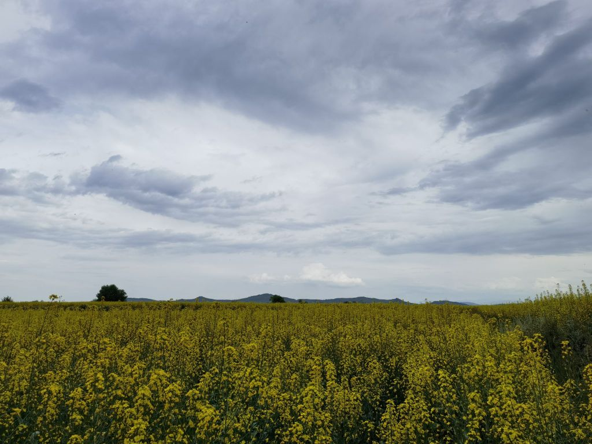
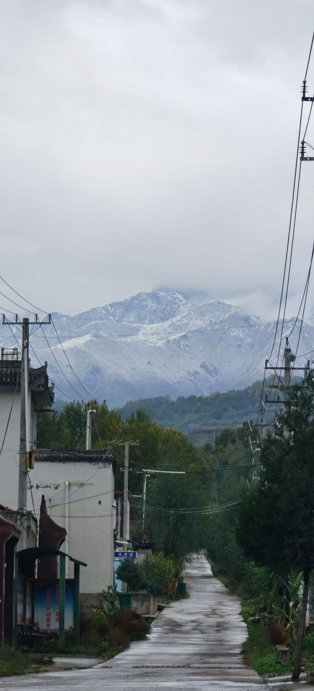

### 凉山真的是这样的嘛？

Made by ngapost2md (c) ludoux [GitHub Repo](https://github.com/ludoux/ngapost2md)

----

##### 0.[0] \<pid:0\> 2023-12-05 17:08:44 by name96487\(广西\)
拉屎拉家里，粪便堆门口

把泥地当饭桌吃饭都是相当讲卫生了

我也不是没去过落后地区，
贫困县，一个村80%脱贫户
至少懂得建厕所，打水洗澡，弄个木桌木板凳坐着吃饭，会种地会贴春联
贫困户只是穷，不是原始人
感觉都不是一个人种了

----

##### 1.[139] \<pid:730716183\> 2023-12-05 17:09:56 by 梅溪烤鸭\(河南\)
你好，蛮荒之地是这个亚子的

----

##### 2.[2] \<pid:730716422\> 2023-12-05 17:11:09 by 神濑枫\(四川\)
没见过这种，再不济的也是木板搭几块石头

----

##### 3.[81] \<pid:730716586\> 2023-12-05 17:11:52 by 摆马亡子\(山东\)
你这一说
感觉不如三哥。。。卫生

----

##### 4.[121] \<pid:730716608\> 2023-12-05 17:11:58 by 堕落、小诸葛\(河南\)
毕竟最穷最懒的地方   发的牲畜都给你吃了

----

##### 5.[106] \<pid:730716656\> 2023-12-05 17:12:13 by 河海之北\(广东\)
从印度半岛跑过来的达利特就这吊样

----

##### 6.[95] \<pid:730716876\> 2023-12-05 17:13:14 by 昆山单身狗\(江苏\)
听说凉山的彝族人直接从奴隶社会进入现代社会

----

##### 7.[48] \<pid:730716904\> 2023-12-05 17:13:23 by deform123\(上海\)
如果是真的，那我只能说还好他们有金钱观念
否则罚款都没意义

----

##### 8.[79] \<pid:730716907\> 2023-12-05 17:13:23 by k2122272\(中国\)
不是说了吗，凉山一部分可以说是直接从部落时代跳到现代，你理解不了很正常

----

##### 9.[47] \<pid:730716908\> 2023-12-05 17:13:23 by 抛物线的三角\(中国\)
拉门口属于素质比较高的了，很多都拉屋里的

----

##### 10.[63] \<pid:730716922\> 2023-12-05 17:13:26 by 哑子看见花吕Paul\(浙江\)
当年有个新闻调查里有幸见识过

刚刚铲过猪粪的铁铲，水一冲，拿来烤土豆，烤完又当盘子，就在铁铲上拿着吃，还招待客人

----

##### 11.[13] \<pid:730717000\> 2023-12-05 17:13:47 by 昆饭\(陕西\)
只能说祖国太大了，人口太多了，各式各样的都在刷新你的认知

----

##### 12.[22] \<pid:730717022\> 2023-12-05 17:13:53 by 愤怒的水烟7695\(陕西\)
因为他们真的把碗放地上，坐在地面上吃饭

----

##### 13.[28] \<pid:730717051\> 2023-12-05 17:14:00 by 緋熠炙\(中国\)
>[jump](#pid730716608) 堕落、小诸葛(2023-12-05 17:11) 说: 
>
>毕竟最穷最懒的地方   发的牲畜都给你吃了

谁说的，凉山的技师还是很勤劳的

----

##### 14.[38] \<pid:730717060\> 2023-12-05 17:14:02 by 伯母您好，我是您儿子的男朋友\(辽宁\)
拉在被窝里我不清楚，但是拉在屋里地上，人和牲口住一起 但是见过不少图片，很多年了  以前贴吧时代看到的

----

##### 15.[2] \<pid:730717142\> 2023-12-05 17:14:22 by 最爱草本枕头\(四川\)
西昌市区不是，其他的不知道

----

##### 16.[59] \<pid:730717147\> 2023-12-05 17:14:23 by 百世经纶一页天书\(广东\)
愿意走出来的都出来了，剩下的都是些什么其实都明白

----

##### 17.[37] \<pid:730717266\> 2023-12-05 17:14:55 by 秋在冬来\(中国\)
你想象成亚马逊原始森林原始人融入现代21世纪社会就行。

----

##### 19.[11] \<pid:730717295\> 2023-12-05 17:15:03 by 刺蛇克里斯\(四川\)
>[jump](#pid730716922) 哑子看见花吕Paul(2023-12-05 17:13) 说: 
>
>当年有个新闻调查里有幸见识过
>
>刚刚铲过猪粪的铁铲，水一冲，拿来烤土豆，烤完又当盘子，就在铁铲上拿着吃，还招待客人

原味凉山汉堡

----

##### 20.[0] \<pid:730717357\> 2023-12-05 17:15:23 by 冬瓜茶不卖\(海南\)
放50年前的海南，确实是这样，感谢祖国地现代化基建。

----

##### 21.[30] \<pid:730717423\> 2023-12-05 17:15:41 by 佐翼沐光\(湖南\)
每次看到这种内容我都感叹一句扶贫干部真不容易

----

##### 22.[26] \<pid:730717502\> 2023-12-05 17:16:00 by 昆饭\(陕西\)
>[jump](#pid730717051) 緋熠炙(2023-12-05 17:14) 说: 
>
>谁说的，凉山的技师还是很勤劳的

微你五块，重点把勤劳的一面展开说说

----

##### 24.[26] \<pid:730717538\> 2023-12-05 17:16:10 by 被嫌弃的鼠鼠一生\(云南\)
凉山之前连封建社会都不是，看过jj上套个套子不穿衣服鼻子上打个环的非洲部落吗，凉山就差不多是这种水平

----

##### 25.[7] \<pid:730717659\> 2023-12-05 17:16:49 by 团子团子团子\(浙江\)
部落

----

##### 26.[27] \<pid:730717783\> 2023-12-05 17:17:21 by yangongzi\(河南\)
~~你来的有点晚 ~~之前我把nga贴子里的部分楼层复制发到了群
现在贴子冲水了我复制给你看
---------------------
赞155
不是原始社会，是奴隶社会
凉山地区1951年还是1952年才解放的，然后1956年才强制废除奴隶制
奴隶你懂的，那时的地位和生活环境就是跟牲口一样，所以很多陋习被当成民族习惯保留多年，当地现在搞移风易俗，这些又难看又招骂政策措施并不是谁拍拍脑门儿就出台的，都是人家基础工作做了多年后总结出来的能有点儿效果的无奈之举。 
--------------------
赞28
百度彝族吧，打开新世界
现在已经删了很多帖子了，以前的那些帖子更牛逼
整天意淫以前哪块哪块地是他们祖上的，他们的文化多牛逼，嘲笑污蔑主体民族和彝族以外的少数民族甚至非凉山彝族，基本都是这些调调 
---------------------------
扶贫发的小猪崽直接被吃掉 

----

##### 27.[2] \<pid:730717939\> 2023-12-05 17:18:08 by euuns\(北京\)
记得是发钱就买酒买毒品，发桌椅板凳当柴烧，发牲畜直接杀了吃了，山下建了新的砖瓦房也不愿意搬下山

这扶贫实在扶不动

----

##### 28.[23] \<pid:730717943\> 2023-12-05 17:18:10 by 罗斯福不喜欢吃炸酱面\(广东\)
我们的吉普赛人

----

##### 30.[47] \<pid:730718088\> 2023-12-05 17:18:49 by 猫777\(江苏\)

之前不是有过去凉山扶贫的老哥吗，他就说三个字:<b>没救了</b>！

上午送的扶贫猪仔小鸡，下午就去变现……

懒，极其的懒……

最大的一个问题，他们还嗑药啊……

----

##### 31.[0] \<pid:730718234\> 2023-12-05 17:19:33 by 丨窗外下着小雨丶\(湖北\)
>[jump](#pid730717051) 緋熠炙(2023-12-05 17:14) 说: 
>
>谁说的，凉山的技师还是很勤劳的

给你5毛，细说

----

##### 32.[22] \<pid:730720740\> 2023-12-05 17:31:22 by Morpheus\(四川\)
屎拉家里不至于，但出了家门随便拉是有的。
十几年前，就凉山州府西昌市最繁华地方，是叫石码子还是什马子，河堤上修得有免费公厕，但屎还是拉得环公厕和河堤上下到处都是。当然现在那里好多了。
还板凳工程也不是笑话，他们真的迷之太太太太太爱蹲地上了！
前段时间不是过彝族年还有马拉松么，这种时候任何地方都要市容市貌焕然一新的吧？然后我正好过去西昌市法院办事，老远就看到门口蹲了一大圈儿人，先以为地上有啥稀奇了，近了一看啥都没有，他们可能在等下午开庭吧，可以看到法院大门的左右明明都有便民的坐椅，空着不坐，就蹲在那儿一整个中午，聊天、大声对着手机讲话……

----

##### 33.[1] \<pid:730720830\> 2023-12-05 17:31:52 by douzibean\(四川\)
我小姨子，凉山邮储的，之前单位下乡扶贫
真屙屎屙家里，下个雨，地上又是屎又是尿的

----

##### 34.[0] \<pid:730721259\> 2023-12-05 17:33:54 by 美丽狐仙在线聊天\(四川\)
凉山是这样的，我大嫂老家就在那边，说是一辈子都不想回去。

----

##### 36.[0] \<pid:730721944\> 2023-12-05 17:37:19 by 金色西瓜\(中国\)
>[jump](#pid730717051) 緋熠炙(2023-12-05 17:14) 说: 
>
>谁说的，凉山的技师还是很勤劳的

啊？居然有技师？

----

##### 37.[12] \<pid:730721986\> 2023-12-05 17:37:34 by 排痰困难_看我头像\(江苏\)
凉山抖音直播=产业诈骗

----

##### 38.[0] \<pid:730722327\> 2023-12-05 17:39:16 by 红茶QQ\(广西\)
活着最重要的是开心，人家也想乐于这样生活呢。
城市白领为生活奔波，每天足够睡觉都是奢求，谁看谁可怜还不一定。

----

##### 39.[0] \<pid:730722346\> 2023-12-05 17:39:21 by zyzhangsha\(四川\)
我没去过凉山那边但是从小听父辈讲到那边都是差不多的

----

##### 40.[1] \<pid:730722370\> 2023-12-05 17:39:30 by 緋熠炙\(中国\)
>[jump](#pid730721944) 金色西瓜(2023-12-05 17:37) 说: 
>
>啊？居然有技师？

其他地方我不知道 阿卡林省蛮多的，各个县都有

----

##### 41.[0] \<pid:730723022\> 2023-12-05 17:42:58 by cxlde00100\(四川\)
….

现在已经好很多了

20年前确实是这样

----

##### 42.[13] \<pid:730723185\> 2023-12-05 17:43:51 by 小旧球\(四川\)

20年前我常驻西昌(呆了快10年才离开).
西昌啊!市区啊都惨不忍睹,走路经常闻到一股无法忍受的恶臭,这是他们身上估计穿上就没洗过的衣服上散发的,起码能顺风飘500米.
如果你坐过那个时候的慢车,火车上的气味能让你绝望到.

然后我那个时候经常去乡下,一般距离市区几十公里的地方,更是见多了奇葩事.

注意,凉山州包括西昌在内的比较繁华的市县等本身是汉人占大多数,占比75%以上的汉人区都这样了.
你去放大胆子想想那些彝族比例极大的山区是什么样!保证你想象的太低端,惊破你眼球.

----

##### 43.[2] \<pid:730723646\> 2023-12-05 17:46:21 by 墓丶色\(山东\)
喝多了还打亲戚。

----

##### 44.[41] \<pid:730723845\> 2023-12-05 17:47:29 by 老兵同志\(湖北\)
>[jump](#pid730722327) 红茶QQ(2023-12-05 17:39) 说: 
>
>活着最重要的是开心，人家也想乐于这样生活呢。
>城市白领为生活奔波，每天足够睡觉都是奢求，谁看谁可怜还不一定。

城市白领就算睡不够也不想睡屎里吧。文明和开不开心能混为一谈吗？

----

##### 46.[0] \<pid:730724186\> 2023-12-05 17:49:10 by yhcdandan\(四川\)
四川人，我自己没去过那边，但从小听大人说基本就是这么个调调，各种刻板印象拉满，在家里长辈说那边如何不文明如何野蛮，在学校还能有老师跟你说那边教育怎么怎么样，没有理科只有文科什么的。

个人倒也接触过那边的人，但没跟他们问过，仅观察他们来说，还是蛮正常的，但是能在这边被我接触到本身就算条件筛选过的了，不能做代表。

终究没去过，没法回答你到底是不是，但作为四川人可以帮你实锤这种刻板印象确实存在。

----

##### 47.[0] \<pid:730724219\> 2023-12-05 17:49:22 by wizard2039\(河南\)
>[jump](#pid730723185) 小旧球(2023-12-05 17:43) 说: 
>
>
>20年前我常驻西昌(呆了快10年才离开).
>西昌啊!市区啊都惨不忍睹,走路经常闻到一股无法忍受的恶臭,这是他们身上估计穿上就没洗过的衣服上散发的,起码能顺风飘500米.
>如果你坐过那个时候的慢车,火车上的气味能让你绝望到.
>
>然后我那个时候经常去乡下,一般距离市区几十公里的地方,更是见多了奇葩事.
>
>注意,凉山州包括西昌在内的比较繁华的市县等本身是汉人占大多数,占比75%以上的汉人区都这样了.
>你去放大胆子想想那些彝族比例极大的山区是什么样!保证你想象的太低端,惊破你眼球

MD我同学就是西昌市的，老婆还是洛阳人跟着过去的，这他老婆竟然能受得了？？？

----

##### 48.[0] \<pid:730724447\> 2023-12-05 17:50:46 by 方方土土方方\(中国\)
我去过普格，虽然有点脏乱差，但是我还这么没看到过什么在家门口拉屎的，蹲地下吃饭的有，但是也不多啊

----

##### 49.[0] \<pid:730724490\> 2023-12-05 17:50:59 by 合成天下一级可口岩\(新疆\)
>[jump](#pid730722327) 红茶QQ(2023-12-05 17:39) 说: 
>
>活着最重要的是开心，人家也想乐于这样生活呢。
>城市白领为生活奔波，每天足够睡觉都是奢求，谁看谁可怜还不一定。

我猜猜，你是不是还觉得朝鲜人民分房子分工作分口粮所以很幸福啊

----

##### 50.[2] \<pid:730725149\> 2023-12-05 17:54:39 by Kiznivel\(云南\)
不是，狗都知道屎尿不拉窝里吧，原始人还不如狗的？

----

##### 51.[1] \<pid:730725517\> 2023-12-05 17:56:41 by 脱脂棉纱布\(中国\)
猫屎尿也会划拉着埋起来呀  这原始人不至于还不如猫吧

----

##### 52.[0] \<pid:730725548\> 2023-12-05 17:56:50 by 二楼不用电梯\(中国\)
额，刚买了10斤凉山丑苹果，还没开封，刚到。

----

##### 53.[1] \<pid:730725629\> 2023-12-05 17:57:16 by 湖南长沙\(中国\)
>[jump](#pid730717051) 緋熠炙(2023-12-05 17:14) 说: 
>
>谁说的，凉山的技师还是很勤劳的

能出来靠双手吃饭的，那多是凉山精英！！！！

我们某年去驻训。。。。一回头。一车的东西不见了。

----

##### 54.[26] \<pid:730725933\> 2023-12-05 17:58:56 by 遥远的圣殿山\(甘肃\)
有幸参与这一人类历史上最大规模的扶贫

在靠近雪山的村子呆过两年多，疫情又是一年

……自以为见多识广，有连触霉头天煞孤星赤贫的，有不思进取懒到家的，不过基本上都还是能扶起来

楼主这个…… 不敢想，太炸裂了

----

##### 55.[13] \<pid:730726510\> 2023-12-05 18:01:55 by 像神一样牛\(江苏\)
我感觉这种拉在家里的，不要扶贫了，上去直接打，一次十棍子，应该能好一点

----

##### 56.[0] \<pid:730726659\> 2023-12-05 18:02:47 by 冒泡的橘子汁\(中国\)
这个……

动物都知道拉屎在外边啊

----

##### 57.[0] \<pid:730727424\> 2023-12-05 18:07:07 by 棋士伊角\(广东\)
看了这个贴真的涨知识了，地大物博

----

##### 58.[21] \<pid:730727466\> 2023-12-05 18:07:23 by 杏子好吃吗\(四川\)
凉山本地人告诉你。确实有，但是少。凉山17个县里面有11个原脱贫攻坚贫困县，安宁河流域西昌、会理等6个县(市)是西康省拆分后与大凉山地区合并的，那里经济条件比较好，这也是凉山全州gdp在全省第9位的主要原因。凉山州腹地昭觉、美姑、布拖等5县(市)经济落后、社会发展粗糙，大多关于凉山的负面消息、陋习风貌都是这几个地区传出来的。目前经过国家帮扶和脱贫攻坚战的胜利，虽然完成了“两不愁三保障”，经济条件不贫困了，但是移风易俗还是面临压力，不过在d的带领下，我觉得过不了多少年，一定会有极大的改观。

----

##### 59.[0] \<pid:730727673\> 2023-12-05 18:08:36 by eclipse。\(湖北\)
>[jump](#pid730716922) 哑子看见花吕Paul(2023-12-05 17:13) 说: 
>
>当年有个新闻调查里有幸见识过
>
>刚刚铲过猪粪的铁铲，水一冲，拿来烤土豆，烤完又当盘子，就在铁铲上拿着吃，还招待客人

干净又卫生嗷兄弟们

----

##### 60.[0] \<pid:730727935\> 2023-12-05 18:10:12 by 美滋滋520\(四川\)
出生洗一次澡，结婚洗一次澡，死了再洗一次澡

----

##### 61.[2] \<pid:730728039\> 2023-12-05 18:10:49 by 裤子都脱了你让我看这个\(上海\)
我只知道上午扶贫猪，中午坨坨肉
坐凳我甚至怀疑他们可能有什么忌讳 原生态还是挺原生态的，而且有点乐在其中的意思

----

##### 62.[0] \<pid:730728417\> 2023-12-05 18:12:48 by CGX电脑我修的\(四川\)
>[jump](#pid730717051) 緋熠炙(2023-12-05 17:14) 说: 
>
>谁说的，凉山的技师还是很勤劳的

勤劳个锤子，我在论坛看的，怡宝是雷点

----

##### 63.[0] \<pid:730728442\> 2023-12-05 18:12:54 by 毁天灭地尤利安\(广东\)
黑可能还好点

----

##### 65.[9] \<pid:730728912\> 2023-12-05 18:15:39 by 就干男人泰凯斯\(河北\)
>[jump](#pid730717051) 緋熠炙(2023-12-05 17:14)说:
>>[jump](#pid730716608) 堕落、小诸葛(2023-12-05 17:11) 说: 
>>
>>毕竟最穷最懒的地方   发的牲畜都给你吃了
>
>谁说的，凉山的技师还是很勤劳的

梁山的技师你都敢找，你是真不怕艾滋。

----

##### 66.[19] \<pid:730729182\> 2023-12-05 18:17:20 by unlimited_blade\(广东\)
这估计就是傻逼文青和白左老外最喜欢的没有被现代社会污染过的原生态了。建议送他们去体验一下。

----

##### 67.[10] \<pid:730729200\> 2023-12-05 18:17:25 by 盖尓加朵\(福建\)
前面那个小严浙飘，回来一趟天天杀猪宰牛而且都是猪仔牛仔都吃饭环境惨不忍睹，绝对比猪窝还脏！有人问她怎么在浙江吃饭不在地上吃啊？直接破防

----

##### 68.[0] \<pid:730729592\> 2023-12-05 18:19:37 by icyphoenix\(山东\)
>[jump](#pid730725933) 遥远的圣殿山(2023-12-05 17:58) 说: 
>
>有幸参与这一人类历史上最大规模的扶贫
>
>在靠近雪山的村子呆过两年多，疫情又是一年
>
>……自以为见多识广，有连触霉头天煞孤星赤贫的，有不思进取懒到家的，不过基本上都还是能扶起来
>
>楼主这个…… 不敢想，太炸裂了
>
>[img]./mon_202312/05/-7Q192-a897K2fT

你这扶贫的地方真的算不错的，都路面硬化了，基建也挺不错。 我媳妇老家是西昌的，她小姨在沐里干扶贫，去村子的路车进不去，都得骑马进去。至少18年是这样的

----

##### 69.[0] \<pid:730729616\> 2023-12-05 18:19:46 by Belldandy123\(山西\)
教育内容是这样，肯定是有这么干的还挺多

----

##### 70.[28] \<pid:730729772\> 2023-12-05 18:20:42 by covedog001\(江西\)

水区去那边扶贫的人拍的，给那边的人发的猪仔，那边的人能养成这样。。

----

##### 71.[0] \<pid:730729873\> 2023-12-05 18:21:18 by UID5481620\(四川\)
现在还是好很多了，国家扶贫 各方面的，加上年轻一代受教育程度的提高

----

##### 72.[12] \<pid:730729971\> 2023-12-05 18:21:57 by 81956679\(江苏\)
>[jump](#pid730729772) covedog001(2023-12-05 18:20) 说: 
>
>
>水区去那边扶贫的人拍的，给那边的人发的猪仔，那边的人能养成这样。。

卧槽。。。猪条。。

----

##### 73.[0] \<pid:730730246\> 2023-12-05 18:23:39 by Tri酱\(北京\)
哪怕古时候都知道猪圈上面盖茅厕，上面拉完，下面猪直接吃，这……属于是拉屎都懒得专门找个地方拉了吧

----

##### 74.[0] \<pid:730730527\> 2023-12-05 18:25:14 by 侵略如火丶不动如山\(中国\)
<b>Reply to [pid=730717783,38600751,2]Reply[/pid] Post by [uid=277765]yangongzi[/uid] (2023-12-05 17:17)搞不好他们是韩国祖宗啊</b>

----

##### 75.[0] \<pid:730730536\> 2023-12-05 18:25:16 by 发飙小蜗牛\(河北\)
我去凉山接亲吃过一次饭。叫啥杀猪饭还是啥？拿东西垫起来铺块板子当桌子了，盛好几盆猪肉一搁，大伙往那一蹲也没凳子关键当时好久没给筷子………………我们都说该不会这边拿手吃吧

----

##### 76.[7] \<pid:730730785\> 2023-12-05 18:26:40 by westgunner\(中国\)
>[jump](#pid730730246) Tri酱(2023-12-05 18:23) 说: 
>
>哪怕古时候都知道猪圈上面盖茅厕，上面拉完，下面猪直接吃，这……属于是拉屎都懒得专门找个地方拉了吧

差不多吧。十多年前，在铁路工作的叔叔告诉我他们在那边雇佣的临时工都必须是工资日结。每天拿到钱就买酒喝，喝到剩下不够买酒的零钱才拿回家养家。

而肯出来当零时工，已经是当地有口皆碑的优质男青年了

----

##### 77.[3] \<pid:730730896\> 2023-12-05 18:27:13 by 瘦虫子\(安徽\)
>[jump](#pid730729772) covedog001(2023-12-05 18:20) 说: 
>
>
>水区去那边扶贫的人拍的，给那边的人发的猪仔，那边的人能养成这样。。

这是给二师兄开瘦身美颜了吗

----

##### 78.[0] \<pid:730730954\> 2023-12-05 18:27:32 by 飞翔的喵星人\(福建\)
很难想象21世纪了还有活的这么原始的人，不说别的，看纪录片，非洲和北极圈的土著也没这样喜欢屎吧

----

##### 79.[1] \<pid:730730976\> 2023-12-05 18:27:40 by 钢铁茄子\(重庆\)
不能直接屙在被子里？ 啊？

----

##### 80.[0] \<pid:730731247\> 2023-12-05 18:29:08 by 红茶QQ\(广西\)
>[jump](#pid730724490) 合成天下一级可口岩(2023-12-05 17:50) 说: 
>
>我猜猜，你是不是还觉得朝鲜人民分房子分工作分口粮所以很幸福啊

我们旁观人觉得有什么用，当事人眼界就这样，所以他们觉得开心就行。

----

##### 81.[8] \<pid:730731327\> 2023-12-05 18:29:35 by 侵略如火丶不动如山\(中国\)
<b>Reply to [pid=730726510,38600751,3]Reply[/pid] Post by [uid=39103486]像神一样牛[/uid] (2023-12-05 18:01)上次罚钱泥潭都喷成啥样了，各种滑坡的，转进的，罕见大团建，你这还敢动手？</b>

----

##### 82.[0] \<pid:730731531\> 2023-12-05 18:30:47 by 有没有想起我\(江苏\)
这些人还养他们干嘛？让他们自生自灭不行吗

----

##### 83.[0] \<pid:730731658\> 2023-12-05 18:31:32 by 红茶QQ\(广西\)
>[jump](#pid730723845) 老兵同志(2023-12-05 17:47) 说: 
>
>城市白领就算睡不够也不想睡屎里吧。文明和开不开心能混为一谈吗？

子非鱼而已

----

##### 84.[0] \<pid:730731799\> 2023-12-05 18:32:26 by 侵略如火丶不动如山\(中国\)
<b>Reply to [pid=730727935,38600751,4]Reply[/pid] Post by [uid=43352492]美滋滋520[/uid] (2023-12-05 18:10)你说的这个是黄土高坡那边吧，而且那边主要是缺水，不是说不爱干净，我记得以前阅读理解做过的一道题就是全村凑水给村里唯一一个大学生上学前洗了个澡</b>

----

##### 85.[3] \<pid:730732114\> 2023-12-05 18:34:04 by 银色黎明执政官\(四川\)
我们区对口帮扶凉山某县，还算是相对不算偏远的县。
免费发给他们鸡苗和饲料养，过了大半年买回来，鸡瘦得只剩鸡架，完全不敢发猪仔，早上发，晚上就变坨坨肉；
技术人员教会他们种苹果、栽土豆胡萝卜，因当地气候环境适宜，品质还挺高，就是不愿意自己找销路，不愿意自己拉出山去卖，每次都是全区各单位出钱全部买回去分。

----

##### 86.[0] \<pid:730732921\> 2023-12-05 18:38:35 by 孑wolf\(河北\)
夷族还有相当数量不懂汉语的呢

会上网都是知识分子了

----

##### 87.[14] \<pid:730733211\> 2023-12-05 18:40:03 by 智能荷花\(广西\)
>[jump](#pid730731531) 有没有想起我(2023-12-05 18:30) 说: 
>
>这些人还养他们干嘛？让他们自生自灭不行吗

只能说party的道德洁癖害了自己，要扶扶不起，放任它们自生自灭嘛随便一个小视频一篇小作文就民不聊生尊严不再生灵涂炭
反观大洋彼岸面最多给你两餐冷冻食品充饥还不一定领得到任其自生自灭，安排专门人员帮扶啥的不存在的，不把它们的“家”给清扫掉算宽宏大量了

----

##### 88.[6] \<pid:730733577\> 2023-12-05 18:42:26 by _tian_shan_\(江苏\)
&quot;免费发的木板凳被当柴烧, 改发钢板凳!&quot;

----

##### 89.[0] \<pid:730734468\> 2023-12-05 18:47:41 by 萌霸天\(福建\)
真的假的，现在很多农村街道卫生之类的做的比城市还严格，

----

##### 90.[0] \<pid:730736293\> 2023-12-05 18:58:38 by 清牙\(广西\)
拉屎拉被子上也太反人类了

----

##### 91.[0] \<pid:730736516\> 2023-12-05 19:00:00 by panelope\(安徽\)
一群键盘侠喷了几层楼也没见一个真照片，全都是人云亦云，跟风起哄。
中国人在外国的刻板印象不也是这么来的吗？
没有调查就没有发言权，有时间去看看，再来键政吧

----

##### 92.[2] \<pid:730737412\> 2023-12-05 19:05:33 by 拉屎难忘吃屎人\(上海\)
抖音刚刚刷到一群人蹲地上吃烤红薯。
一看木材，真TM不是桌子吗？
还有人拿着桌腿扒拉火。

----

##### 93.[3] \<pid:730737864\> 2023-12-05 19:08:35 by skyworld2012\(福建\)
>[jump](#pid730736516) panelope(2023-12-05 19:00) 说: 
>
>一群键盘侠喷了几层楼也没见一个真照片，全都是人云亦云，跟风起哄。
>中国人在外国的刻板印象不也是这么来的吗？
>没有调查就没有发言权，有时间去看看，再来键政吧

要啥图，抖音上多的是，全网喷的玩意你当是NGA一个在喷吗？并且他们中很多人把奴隶社会下的习惯当习俗

----

##### 94.[0] \<pid:730740790\> 2023-12-05 19:26:36 by solarfire2\(中国\)
那地方，我说只能全员移民才有救

----

##### 95.[3] \<pid:730741597\> 2023-12-05 19:31:44 by haozzzzz\(四川\)
这个我有发言权，我弟找了个彝族姑娘，都谈婚论嫁了，结果过去谈彩礼，家里面脏得受不了，我舅甚至都吃不下饭，然后彩礼三十万一分不少，理由是他闺女是大专，按学历给钱都算优惠了，震碎三观  ，回成都直接分手了

----

##### 96.[0] \<pid:730742045\> 2023-12-05 19:34:26 by 小强诶呀\(浙江\)
穷山恶水出叼民。上学时候有个恶心的师兄就是凉山的。虽然我也就认识他一个凉山人，但他足以让我对凉山人产生如此大的敌意

----

##### 97.[1] \<pid:730742083\> 2023-12-05 19:34:40 by 尊嘟假嘟o0O\(江苏\)
你有没有见过国家发每人两头小猪，让你养大了去卖
然后第二天就被吃了的村子
发你树苗 种子让你种，结果一个月后全烂了的村子
死又不能让他们死，授人以渔又救不了人，直接发钱除了这个村，全国都没几个人会同意的
不罚款整治还指望啥

----

##### 98.[0] \<pid:730742638\> 2023-12-05 19:37:56 by 权有市恐无为\(广西\)
>[jump](#pid730718088) 猫777(2023-12-05 17:18) 说: 
>
>
>
>之前不是有过去凉山扶贫的老哥吗，他就说三个字:<b>没救了</b>！
>
>上午送的扶贫猪仔小鸡，下午就去变现……
>
>懒，极其的懒……
>
>最大的一个问题，他们还嗑药啊……

那个地方还买得到dp？

----

##### 99.[0] \<pid:730743104\> 2023-12-05 19:40:55 by 伊丽莎白云\(中国\)
15年去过西昌玩，感觉西昌还是不错的。凉山其他地方不了解，但我们四川这边确实有凉山脏乱差的刻板印象

----

##### 100.[0] \<pid:730743194\> 2023-12-05 19:41:28 by cat086\(浙江\)
>[jump](#pid730742638) 权有市恐无为(2023-12-05 19:37) 说: 
>
>那个地方还买得到dp？

早些年那边毒品泛滥，治安恶劣
大概10来年前，西昌甚至说晚上不能走到灰暗的地方去

----

##### 101.[0] \<pid:730743375\> 2023-12-05 19:42:34 by 不爱吃饭饭桶君\(广东\)
>[jump](#pid730729772) covedog001(2023-12-05 18:20) 说: 
>
>
>水区去那边扶贫的人拍的，给那边的人发的猪仔，那边的人能养成这样。。

老哥，为啥明知道他们会吃，还是年年都发猪崽儿。

----

##### 102.[0] \<pid:730744442\> 2023-12-05 19:49:13 by lhqiau\(中国\)
>[jump](#pid730717783) yangongzi(2023-12-05 17:17)说:
>~~你来的有点晚 ~~之前我把nga贴子里的部分楼层复制发到了群
>现在贴子冲水了我复制给你看
>---------------------
>赞155
>不是原始社会，是奴隶社会
>凉山地区1951年还是1952年才解放的，然后1956年才强制废除奴隶制
>奴隶你懂的，那时的地位和生活环境就是跟牲口一样，所以很多陋习被当成民族习惯保留多年，当地现在搞移风易俗，这些又难看又招骂政策措施并不是谁拍拍脑门儿就出台的，都是人家基础工作做了多年后总结出来的能有点儿效果的无奈之举。 
>--------------------
>赞28
>百度彝族吧，打开新世界
>现在已经删了很多帖子了，以前的那些帖子更牛逼
>整天意淫以前哪块哪块地是他们祖上的，他们的文化多牛逼，嘲笑污蔑主体民族和彝族以外的少数民族甚至非凉山彝族，基本都是这些调调 
>---------------------------
>扶贫发的小猪崽直接被吃掉 
>
>

吃小猪很正常的，这个截图没法看出是扶贫的猪仔吧
去吃西昌烧烤，里面有个特色菜就是烤小猪肉
当地无论是公务员还是普通人，都经常烤小猪来庆祝
另外母猪是真的能生

----

##### 103.[0] \<pid:730744745\> 2023-12-05 19:50:58 by 摸鱼是原动力\(中国\)
可能吸毒的比较多

----

##### 104.[0] \<pid:730748534\> 2023-12-05 20:16:53 by covedog001\(江西\)
>[jump](#pid730743375) 不爱吃饭饭桶君(2023-12-05 19:42) 说: 
>
>老哥，为啥明知道他们会吃，还是年年都发猪崽儿。

这个你要问去发贴的人了，这个图我也是前面水区存的
我记得当时帖子说是懒得喂猪，估计也懒得杀猪。。就这样了

----

##### 105.[1] \<pid:730748880\> 2023-12-05 20:19:23 by 遥远的圣殿山\(甘肃\)
>[jump](#pid730743375) 不爱吃饭饭桶君(2023-12-05 19:42) 说: 
>
>老哥，为啥明知道他们会吃，还是年年都发猪崽儿。

不接地气啦哥们

人均收入是很重要的一环，种植业或者养殖

育肥出栏的话，牲畜的利润就可以计算到收入里了，倒也没啥不合理的

架不住人给吃了啊

不然咋提升收入，土地亩数固定的，不养殖不务工，收入总不会天上掉下来啊

----

##### 106.[0] \<pid:730748920\> 2023-12-05 20:19:37 by 镇鼎猫\(四川\)
阿波波

----

##### 107.[0] \<pid:730749543\> 2023-12-05 20:23:37 by 可达可达\(广西\)
以前的山大王部落。山下的人都是他们奴隶，

----

##### 108.[0] \<pid:730749920\> 2023-12-05 20:26:16 by 不要禁我言\(辽宁\)
>[jump](#pid730729772) covedog001(2023-12-05 18:20) 说: 
>
>
>水区去那边扶贫的人拍的，给那边的人发的猪仔，那边的人能养成这样。。

卧槽，牛皮66666

----

##### 109.[0] \<pid:730750062\> 2023-12-05 20:27:12 by 小猴耳朵\(重庆\)
逼乎看到过一个凉山彝族出来的大学生自述，他们那边的人就是未开化，没接触过外面的世界，他自己再也不会回那个地方去

----

##### 110.[0] \<pid:730750184\> 2023-12-05 20:27:58 by Ghost30\(广东\)
>[jump](#pid730736516) panelope(2023-12-05 19:00) 说: 
>
>一群键盘侠喷了几层楼也没见一个真照片，全都是人云亦云，跟风起哄。
>中国人在外国的刻板印象不也是这么来的吗？
>没有调查就没有发言权，有时间去看看，再来键政吧

----

##### 111.[0] \<pid:730750741\> 2023-12-05 20:31:39 by zhangdaofeng\(黑龙江\)
>[jump](#pid730722327) 红茶QQ(2023-12-05 17:39) 说: 
>
>活着最重要的是开心，人家也想乐于这样生活呢。
>城市白领为生活奔波，每天足够睡觉都是奢求，谁看谁可怜还不一定。

送去凉山住三年，保准你回来加班到猝死都是带着笑死。

----

##### 112.[0] \<pid:730750927\> 2023-12-05 20:33:05 by 不爱吃饭饭桶君\(广东\)
>[jump](#pid730748880) 遥远的圣殿山(2023-12-05 20:19) 说: 
>
>不接地气啦哥们
>
>人均收入是很重要的一环，种植业或者养殖
>
>育肥出栏的话，牲畜的利润就可以计算到收入里了，倒也没啥不合理的
>
>架不住人给吃了啊
>
>不然咋提升收入，土地亩数固定的，不养殖不务工，收入总不会天上掉下来啊

饿着他们呗，肚子饿了不就自己找工作什么的了，无敌了他们

----

##### 113.[0] \<pid:730751516\> 2023-12-05 20:37:20 by terrorcool\(浙江\)
关于凉山的新闻又不是现在才有的，十几年前就有记者采访过为什么那地方怎么扶都扶不起来。

----

##### 114.[0] \<pid:730751603\> 2023-12-05 20:37:56 by fightgo\(四川\)
发展太快了。奴隶制直接跨越到社会主义，建国前都是外来人直接打来当奴隶。非洲大陆现在还有奴隶制吗？

----

##### 115.[0] \<pid:730751653\> 2023-12-05 20:38:20 by 没什么bu好\(福建\)
抖音最近刷到几个集体吃饭的  怎么说呢 屁股都知道坐椅子上 饭菜缺不知道放桌子上

----

##### 116.[0] \<pid:730751791\> 2023-12-05 20:39:19 by 溟溟之晨\(中国\)
不敢想象

----

##### 117.[0] \<pid:730751862\> 2023-12-05 20:39:50 by 小迪凯\(湖北\)
>[jump](#pid730729772) covedog001(2023-12-05 18:20) 说: 
>
>
>水区去那边扶贫的人拍的，给那边的人发的猪仔，那边的人能养成这样。。

这是手机开了瘦脸么？皮包骨了

