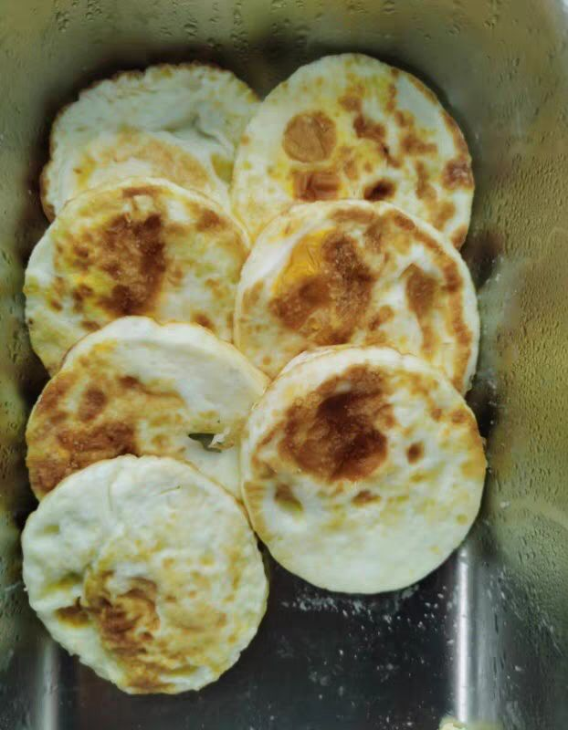
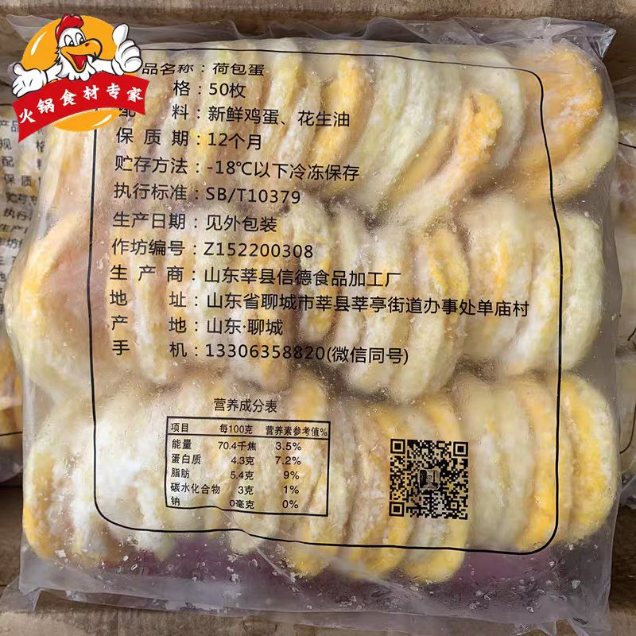
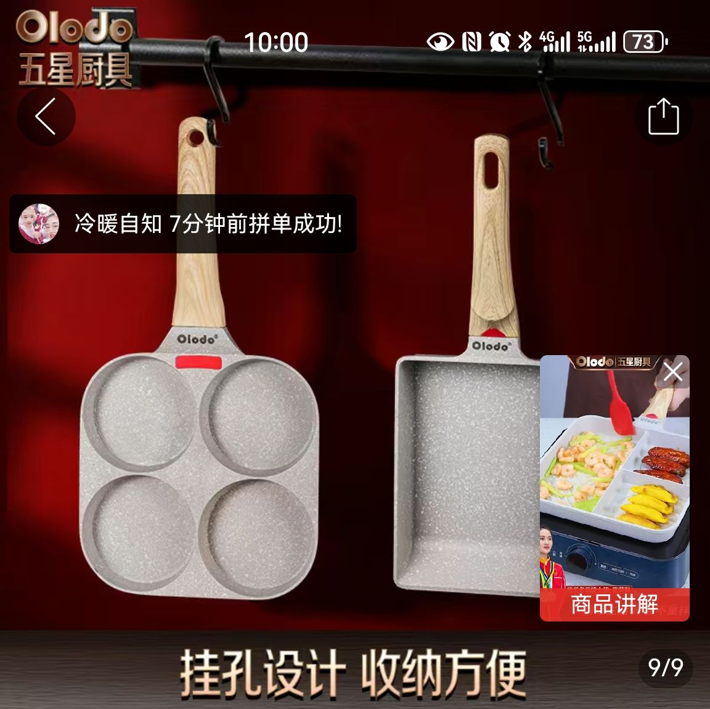

### 卧槽，现在早餐店荷包蛋也是预制菜。。

Made by ngapost2md (c) ludoux [GitHub Repo](https://github.com/ludoux/ngapost2md)

----

##### 0.[0] \<pid:0\> 2023-12-05 09:17:40 by hellofin1024\(广东\)

本来还挺喜欢吃这个荷包蛋，今天来的早，眼睁睁看到老板从冰箱里拿了一袋出来。。这早餐还能不能在外面吃了？

----

##### 1.[267] \<pid:730619556\> 2023-12-05 09:18:48 by 浮生烩\(重庆\)
没说不能吃就是能吃

----

##### 2.[204] \<pid:730619580\> 2023-12-05 09:18:53 by kuma不是熊\(山东\)
包括去吃的各种麻辣烫都是这种的。

----

##### 3.[288] \<pid:730619609\> 2023-12-05 09:19:03 by sssfangzhou\(吉林\)
是的，这种圆圆的都是预制的，那种煎的乱七八糟的很大油的应该不是

----

##### 4.[2] \<pid:730619721\> 2023-12-05 09:19:45 by 银色轨道炮\(广东\)
啊？这也预制

----

##### 5.[218] \<pid:730619744\> 2023-12-05 09:19:53 by Zubenelgenubi\(河北\)
你让老板自己动手煎不见得比这个强

----

##### 6.[76] \<pid:730619747\> 2023-12-05 09:19:54 by 组我准灭团\(江苏\)
还得自己做

----

##### 7.[112] \<pid:730619754\> 2023-12-05 09:19:56 by wlhhy001\(中国\)
这玩意狗都不吃，超级难吃，每次加蛋时我都要盯着老板现煎

----

##### 8.[89] \<pid:730619777\> 2023-12-05 09:20:02 by Lanyangzhi\(河南\)
说明你也吃不出来，建议继续吃

----

##### 9.[48] \<pid:730619785\> 2023-12-05 09:20:04 by 姱姱520\(湖南\)
看配料表也没啥不能吃的啊，不过这种口感完全比不了现煎的。

----

##### 10.[0] \<pid:730619848\> 2023-12-05 09:20:22 by 神啊赐个妞吧\(福建\)
为什么热量变少了，正常一个鸡蛋50g，70-80大卡，这个100g才70千焦

----

##### 11.[38] \<pid:730619852\> 2023-12-05 09:20:23 by sd58203753\(重庆\)
熟食预制菜最大的问题是钠含量超标
普通消费者建议买的预制菜是那种切好洗好，就等你来炒的那种

----

##### 12.[30] \<pid:730619881\> 2023-12-05 09:20:37 by ccsffcscsf。\(山东\)
圆的一模一样不是一眼预制嘛，那种一大堆乱七八糟堆一起的不是

----

##### 13.[0] \<pid:730619898\> 2023-12-05 09:20:42 by 超级机器人大战30\(北京\)
这种很方便，我自己在家泡面就直接上这个的

----

##### 14.[9] \<pid:730619913\> 2023-12-05 09:20:45 by 脱脂棉纱布\(中国\)
这个太漂亮了  所以要买那种丑丑的

----

##### 15.[11] \<pid:730619948\> 2023-12-05 09:21:00 by likunyu12\(河南\)
现在x
早就是了，特别圆的都是这种

----

##### 16.[29] \<pid:730619964\> 2023-12-05 09:21:03 by 此生入戏\(北京\)
>[jump](#pid730619848) 神啊赐个妞吧(2023-12-05 09:20) 说: 
>
>为什么热量变少了，正常一个鸡蛋50g，70-80大卡，这个100g才70千焦

冷藏的啊

----

##### 17.[63] \<pid:730620031\> 2023-12-05 09:21:24 by 记逸\(江苏\)
这种鸡蛋非常不好吃，特别是边缘感觉跟塑料一样咬不动

----

##### 18.[7] \<pid:730620117\> 2023-12-05 09:21:52 by 霸王鱿鱼面\(江西\)
对我来说，早上这碗面的灵魂就是流黄煎蛋

----

##### 19.[2] \<pid:730620132\> 2023-12-05 09:21:56 by lzl2000cc\(上海\)
现在外卖我都不买蛋了

----

##### 20.[12] \<pid:730620153\> 2023-12-05 09:22:01 by 舟源\(广东\)
>[jump](#pid730619747) 组我准灭团(2023-12-05 09:19) 说: 
>还得自己做

非常好的鸡蛋，使我的太极旋转

----

##### 21.[4] \<pid:730620157\> 2023-12-05 09:22:02 by 过去痕迹\(浙江\)
煎蛋你说要流心的   就是现煎的了

----

##### 23.[0] \<pid:730620874\> 2023-12-05 09:25:46 by 皎月零露_1412\(湖北\)
这种一吃就知道不是现煎的，口感和味道就很怪

----

##### 24.[0] \<pid:730621864\> 2023-12-05 09:31:02 by 红烧肉即正义\(江苏\)
还有肠粉也有预制菜

----

##### 25.[0] \<pid:730621865\> 2023-12-05 09:31:02 by maneoh\(广西\)
这种玩意是难吃，有点过这种蛋的外卖，直接再也不点了

----

##### 26.[8] \<pid:730621976\> 2023-12-05 09:31:42 by 枫枫Sama\(浙江\)
>[jump](#pid730619848) 神啊赐个妞吧(2023-12-05 09:20) 说: 
>
>为什么热量变少了，正常一个鸡蛋50g，70-80大卡，这个100g才70千焦

千焦大卡不是等量换算的

----

##### 27.[2] \<pid:730622832\> 2023-12-05 09:36:00 by 前凸后翘的姚姚子\(上海\)
你原本喜欢吃现在不喜欢吃了

----

##### 28.[0] \<pid:730622926\> 2023-12-05 09:36:31 by ninja_yc\(上海\)
>[jump](#pid730619747) 组我准灭团(2023-12-05 09:19) 说: 
>
>还得自己做

太极煎蛋师傅我想学这个

----

##### 29.[0] \<pid:730622993\> 2023-12-05 09:36:51 by 奶猫丶\(湖南\)
啊 卧槽
下次再也不加圆的了 我说怎么冷冷的

----

##### 30.[12] \<pid:730623008\> 2023-12-05 09:36:55 by MISAKI☆\(山东\)
这种鸡蛋巨难吃，像吃塑料橡皮一样，没有鸡蛋的香味

----

##### 31.[0] \<pid:730623036\> 2023-12-05 09:37:03 by 香草猪头肉\(陕西\)
早都是了。。。那种便宜的麻辣烫店也是。

----

##### 32.[0] \<pid:730623039\> 2023-12-05 09:37:04 by 然然的玫瑰花\(山东\)
这个煎蛋的配料表很干净啊。哪不好了

----

##### 33.[1] \<pid:730623100\> 2023-12-05 09:37:20 by 止战之战\(浙江\)
>[jump](#pid730619964) 此生入戏(2023-12-05 09:21)说:
>>[jump](#pid730619848) 神啊赐个妞吧(2023-12-05 09:20) 说: 
>>
>>为什么热量变少了，正常一个鸡蛋50g，70-80大卡，这个100g才70千焦
>
>冷藏的啊

出院！

----

##### 34.[0] \<pid:730623177\> 2023-12-05 09:37:41 by 止战之战\(浙江\)
>[jump](#pid730621976) 枫枫Sama(2023-12-05 09:31)说:
>>[jump](#pid730619848) 神啊赐个妞吧(2023-12-05 09:20) 说: 
>>
>>为什么热量变少了，正常一个鸡蛋50g，70-80大卡，这个100g才70千焦
>
>千焦大卡不是等量换算的

<b>你也给我出院！
</b>

----

##### 35.[0] \<pid:730623250\> 2023-12-05 09:38:08 by mgmrll89\(中国\)
我一度以为这种圆形的是用什么模具现做的

----

##### 36.[0] \<pid:730623272\> 2023-12-05 09:38:14 by 大部分网友\(广东\)
重组蛋，主要是不好吃，安全问题倒是不大。

----

##### 37.[0] \<pid:730623305\> 2023-12-05 09:38:22 by 再吸一口就一口\(吉林\)
这个真不好吃 但是加点番茄酱炖一下还能下咽

----

##### 38.[0] \<pid:730623393\> 2023-12-05 09:38:45 by 神上使\(中国\)
预制菜的速度快啊

----

##### 39.[0] \<pid:730623395\> 2023-12-05 09:38:46 by zippohot\(上海\)
>[jump](#pid730619747) 组我准灭团(2023-12-05 09:19) 说: 
>
>还得自己做

太极蛋nb啊

----

##### 40.[0] \<pid:730623437\> 2023-12-05 09:39:00 by 爱喝冰拿铁\(四川\)
才知道啊，形状都一样

----

##### 41.[0] \<pid:730623495\> 2023-12-05 09:39:21 by 上海ハニー\(上海\)
>[jump](#pid730619852) sd58203753(2023-12-05 09:20) 说: 
>熟食预制菜最大的问题是钠含量超标
>普通消费者建议买的预制菜是那种切好洗好，就等你来炒的那种

这是半成品净菜，没有“预制”

----

##### 42.[0] \<pid:730623569\> 2023-12-05 09:39:46 by Valano\(黑龙江\)
一看就是啊，除非老板有那种荷包蛋造型锅

----

##### 43.[3] \<pid:730623574\> 2023-12-05 09:39:47 by wh238711\(广东\)
>[jump](#pid730619848) 神啊赐个妞吧(2023-12-05 09:20)说:
>为什么热量变少了，正常一个鸡蛋50g，70-80大卡，这个100g才70千焦

说明小厂家胡乱表的，剪过之后水分变少，热量会更高，70千焦才不到20大卡，太假了

----

##### 44.[4] \<pid:730623583\> 2023-12-05 09:39:50 by 芙兰的香蕉\(江苏\)
这种蛋白梗啾啾的  蛋黄又干又沙  泡汤里还行  比现做差太远了

----

##### 45.[0] \<pid:730623622\> 2023-12-05 09:40:00 by sanldafu2\(安徽\)
>[jump](#pid730619848) 神啊赐个妞吧(2023-12-05 09:20) 说: 
>为什么热量变少了，正常一个鸡蛋50g，70-80大卡，这个100g才70千焦

那不是更好了？

----

##### 46.[0] \<pid:730623855\> 2023-12-05 09:41:15 by 若o小雨\(LEVEL3-DNS\)
这种是真的难吃。。

----

##### 47.[0] \<pid:730624184\> 2023-12-05 09:43:05 by fhydl\(中国\)
>[jump](#pid730623039) 然然的玫瑰花(2023-12-05 09:37) 说: 
>
>这个煎蛋的配料表很干净啊。哪不好了

都说了口感不好，难吃。

----

##### 48.[0] \<pid:730624198\> 2023-12-05 09:43:09 by adcchina\(北京\)
我觉得预制菜没啥问题，他要是5毛一个甚至1块一个煎蛋，我也不是不能接受。

----

##### 49.[0] \<pid:730624310\> 2023-12-05 09:43:43 by qvst\(河北\)
这种你去吃个麻辣烫能看见一盒一盒的。
不过我目前吃早餐还是那种眼看着人家打个蛋煎出来的小店，暂时还没吃过预制的。

----

##### 50.[0] \<pid:730624387\> 2023-12-05 09:44:08 by 夺命猎杀\(山东\)
>[jump](#pid730623250) mgmrll89(2023-12-05 09:38) 说: 
>
>我一度以为这种圆形的是用什么模具现做的

一般自助餐不都是用的模具嘛，要不然煎出来不好看

----

##### 51.[0] \<pid:730624424\> 2023-12-05 09:44:18 by 幺肆伍零送亲妈\(广西\)
>[jump](#pid730619848) 神啊赐个妞吧(2023-12-05 09:20) 说: 
>
>为什么热量变少了，正常一个鸡蛋50g，70-80大卡，这个100g才70千焦

因为这种一个最多用了1/3个鸡蛋

----

##### 52.[0] \<pid:730624743\> 2023-12-05 09:45:57 by fff444pd\(北京\)
也有不是成品的，我家楼下的香锅店就是用磨具煎出来的
问题是他一次煎几十个，然后冷藏，最后就和预制的一样了

----

##### 53.[0] \<pid:730624938\> 2023-12-05 09:47:08 by 一位路过的DK\(河北\)
凑合吃吧，麻辣烫常客

----

##### 54.[0] \<pid:730624961\> 2023-12-05 09:47:15 by guoxu1992\(北京\)
吃煎饼 那不是预制

----

##### 55.[0] \<pid:730625166\> 2023-12-05 09:48:14 by 拉起来A掉\(上海\)
盒马我看溏心蛋也有预制的

----

##### 56.[0] \<pid:730625167\> 2023-12-05 09:48:14 by hangzi0113\(北京\)
都没人关注这个荷包蛋保质期12个月么

----

##### 57.[0] \<pid:730625283\> 2023-12-05 09:48:47 by 圣光小熊\(湖南\)
>[jump](#pid730624961) guoxu1992(2023-12-05 09:47) 说: 
>
>吃煎饼 那不是预制

周杰伦代言的那个不就是预制吗？

----

##### 58.[0] \<pid:730625376\> 2023-12-05 09:49:19 by cleverfox\(北京\)
为啥不能吃？只要好吃不就行了？

----

##### 59.[0] \<pid:730625462\> 2023-12-05 09:49:42 by 呜呜呜又被mute\(中国\)
>[jump](#pid730619747) 组我准灭团(2023-12-05 09:19) 说: 
>
>还得自己做

卧槽~~八卦~~阴阳蛋

----

##### 60.[4] \<pid:730625663\> 2023-12-05 09:50:51 by sxzhan\(浙江\)
其实早有了，肯德基早餐早个十几年前就有的太阳蛋，每一个形状大小都是一模一样

----

##### 61.[0] \<pid:730625763\> 2023-12-05 09:51:16 by ОЦ-14\(上海\)
我05年那会楼下的汉堡店就已经用的是这种了

----

##### 62.[1] \<pid:730625985\> 2023-12-05 09:52:22 by 英式红猹\(浙江\)
这种鸡蛋是真的难吃，蛋清像在啃塑料，完全没有现煎的那种蛋清焦脆的口感

----

##### 63.[0] \<pid:730626022\> 2023-12-05 09:52:34 by 逍遥我行007\(中国\)
>[jump](#pid730621864) 红烧肉即正义(2023-12-05 09:31) 说: 
>
>还有肠粉也有预制菜

早餐店的肠粉都是现做，成本低
还能蒸米丝

只是粉浆要求高，
我怀疑90%的肠粉店老板都没吃过自己做的肠粉，真tmd的垃圾。

还不如预制的肠粉。

----

##### 64.[0] \<pid:730626048\> 2023-12-05 09:52:43 by 豆包爱吃猫\(安徽\)
这种蛋真的难吃
有一次吃到真的现炸的荷包蛋，立刻又加了一个…太久没吃到边炸得酥脆的荷包蛋了

----

##### 65.[0] \<pid:730626238\> 2023-12-05 09:53:35 by 子书墨白\(浙江\)
圆的也有用煎蛋锅做的

----

##### 66.[0] \<pid:730626284\> 2023-12-05 09:53:49 by Zubenelgenubi\(河北\)
>[jump](#pid730623495) 上海ハニー(2023-12-05 09:39) 说: 
>这是半成品净菜，没有“预制”

预制菜是一个很大的品类，每回我都说你们想喷的那个应该是料理包

----

##### 67.[0] \<pid:730626401\> 2023-12-05 09:54:22 by 千娇百媚蓝凤凰\(中国\)
是不是鸡蛋还两说呢

----

##### 68.[0] \<pid:730626651\> 2023-12-05 09:55:31 by 便宜烟酒\(中国\)
>[jump](#pid730619848) 神啊赐个妞吧(2023-12-05 09:20) 说: 
>
>为什么热量变少了，正常一个鸡蛋50g，70-80大卡，这个100g才70千焦

温度和油料控制的好，主要是油少吧？

----

##### 69.[1] \<pid:730626803\> 2023-12-05 09:56:22 by 养鸡大王\(河南\)
>[jump](#pid730620117) 霸王鱿鱼面(2023-12-05 09:21) 说: 
>
>对我来说，早上这碗面的灵魂就是流黄煎蛋

鸡蛋还是吃全熟的吧

----

##### 70.[0] \<pid:730626931\> 2023-12-05 09:56:59 by 多多丶良\(江苏\)
>[jump](#pid730619848) 神啊赐个妞吧(2023-12-05 09:20) 说: 
>
>为什么热量变少了，正常一个鸡蛋50g，70-80大卡，这个100g才70千焦

朋友你打字没发现单位不一样吗

----

##### 71.[0] \<pid:730627170\> 2023-12-05 09:58:04 by 枪长\(广东\)
>[jump](#pid730623039) 然然的玫瑰花(2023-12-05 09:37) 说: 
>
>这个煎蛋的配料表很干净啊。哪不好了

因为没放盐

----

##### 72.[0] \<pid:730627192\> 2023-12-05 09:58:12 by 慕容秋枫\(重庆\)
小店的厨房都是透明的，看着弄就行了

----

##### 73.[0] \<pid:730627904\> 2023-12-05 10:01:30 by two_color_win\(广东\)
怎么，老板亲手煎就能保证卫生了吗？

----

##### 74.[0] \<pid:730627945\> 2023-12-05 10:01:43 by zhenyanhui\(上海\)
这种很多年前就是了

----

##### 75.[0] \<pid:730628158\> 2023-12-05 10:02:47 by 惊了这里怎么还有猛男\(中国\)
 有模具的啊，电磁炉都能用甚至不需要开火。我家也用这个，不刷油或者油少煎出来的蛋口感就不好。

----

##### 76.[0] \<pid:730628476\> 2023-12-05 10:04:17 by 不爱吃青菜的陈二狗\(四川\)
>[jump](#pid730625376) cleverfox(2023-12-05 09:49) 说: 
>为啥不能吃？只要好吃不就行了？

这种蛋难吃的要死，一股塑料口感

----

##### 77.[0] \<pid:730628536\> 2023-12-05 10:04:32 by 刺007\(重庆\)
>[jump](#pid730619747) 组我准灭团(2023-12-05 09:19) 说: 
>
>还得自己做

让你煎鸡蛋，谁特么让你打太极了

----

##### 78.[0] \<pid:730628908\> 2023-12-05 10:06:05 by hlove1205\(浙江\)
你看，口感完全不影响吧

----

##### 79.[0] \<pid:730629169\> 2023-12-05 10:07:21 by 漂泊的老麦\(广东\)
不就倒个模里煎好冷冻送店里，你要说那些快餐店煎几十个蛋卖一天的算不算预制吧

----

##### 80.[0] \<pid:730629849\> 2023-12-05 10:10:29 by 月关小超\(中国\)
“本来挺喜欢”，那就继续吃呗，自己能接受就行，管它是不是预制菜去？
我自己都买这种蛋放冰箱里。

----

##### 81.[0] \<pid:730629880\> 2023-12-05 10:10:38 by bbnb2008\(江苏\)
看配料表 没什么问题啊

----

##### 82.[0] \<pid:730630899\> 2023-12-05 10:15:24 by 达尔群星之怒\(广东\)
但凡淘宝搜一下 餐饮 预制 批发  字样，就会看到无穷无尽的各种预制品了。
肉粒肉馅就不提了，什么豆浆油条韭菜盒子煎饺胡辣汤鸡蛋汤，早就预制了。
预制是一种很正常的工业化产品，没什么奇怪的。只不过其中一部分(外卖料理包)太油太咸罢了。

----

##### 83.[0] \<pid:730631565\> 2023-12-05 10:18:20 by Danteror\(安徽\)
>[jump](#pid730619848) 神啊赐个妞吧(2023-12-05 09:20)说:
>为什么热量变少了，正常一个鸡蛋50g，70-80大卡，这个100g才70千焦

记得以前看过，不少厂家这种热量表都是瞎标的，是个意思。之前买的粘豆包，里面黑米，红豆，花生啥的，脂肪含量给你标0，你说你信不信吧

----

##### 84.[0] \<pid:730631891\> 2023-12-05 10:19:49 by 一念の差\(安徽\)
>[jump](#pid730619609) sssfangzhou(2023-12-05 09:19) 说: 
>
>是的，这种圆圆的都是预制的，那种煎的乱七八糟的很大油的应该不是

有次宾馆吃早餐，看到过模组，也是这样圆圆的，不过是现煎

----

##### 85.[1] \<pid:730631990\> 2023-12-05 10:20:12 by johnsmith2016\(广东\)
>[jump](#pid730629880) bbnb2008(2023-12-05 10:10) 说: 
>
>看配料表 没什么问题啊

问题就是难吃

----

##### 86.[0] \<pid:730632110\> 2023-12-05 10:20:40 by timerabbit\(浙江\)
>[jump](#pid730619609) sssfangzhou(2023-12-05 09:19) 说: 
>
>是的，这种圆圆的都是预制的，那种煎的乱七八糟的很大油的应该不是

被你这样一讲感觉还不如预制的

----

##### 87.[0] \<pid:730632424\> 2023-12-05 10:22:04 by chenqi1285\(北京\)
麻辣烫店圆圆的煎鸡蛋就是预制菜

----

##### 88.[0] \<pid:730633000\> 2023-12-05 10:24:35 by 色雨声花\(江西\)
我常去的一家面馆，上个学期蛋还是在店里炸的，现在也变成主楼那种东西了…

----

##### 89.[0] \<pid:730633095\> 2023-12-05 10:25:02 by 荼靡\(上海\)
这玩意吃起来象塑料一样

----

##### 90.[0] \<pid:730633519\> 2023-12-05 10:26:44 by 老shift\(湖北\)
不好吃，太老了，我自己煎糊了都没那么老

----

##### 91.[0] \<pid:730633743\> 2023-12-05 10:27:36 by Constantine_Gr\(云南\)
除了不好吃也没啥，符合食安标准就行了

如果餐馆图省事搞难吃的只能祝他倒闭了

----

##### 92.[0] \<pid:730634613\> 2023-12-05 10:31:12 by MyKongming\(山东\)
>[jump](#pid730619848) 神啊赐个妞吧(2023-12-05 09:20) 说: 
>
>为什么热量变少了，正常一个鸡蛋50g，70-80大卡，这个100g才70千焦

算反了。确实少了，这种蛋用的油少，不知道会不会加大豆蛋白水什么的，一个蛋做好几个

----

##### 93.[0] \<pid:730634921\> 2023-12-05 10:32:23 by tifa4223\(湖南\)
我觉得批判预制菜要和料理包分开来。
预制菜范围太广了，我们有很多传统菜都算预制菜。扣肉就是典型的预制菜。标准再严格一点，卤菜都是预制菜。泡菜也是。

----

##### 94.[0] \<pid:730635262\> 2023-12-05 10:33:41 by かみ。\(浙江\)
>[jump](#pid730623250) mgmrll89(2023-12-05 09:38) 说: 
>
>我一度以为这种圆形的是用什么模具现做的

其实真的有模具，因为我用过

----

##### 95.[0] \<pid:730639500\> 2023-12-05 10:50:29 by a45sd6a4s\(广东\)
>[jump](#pid730629880) bbnb2008(2023-12-05 10:10)说:
>看配料表 没什么问题啊

不是材料有问题，是口感真不好，很像我用不粘锅不放油煎鸡蛋，嚼起来和塑料一样

----

##### 96.[0] \<pid:730640192\> 2023-12-05 10:53:09 by 唐宋大家\(湖南\)
差不多十年前我就看同行业的食堂在用了

----

##### 97.[0] \<pid:730641346\> 2023-12-05 10:57:49 by 苍穹轨迹\(中国\)
这真没放防腐剂吗。没放可以放一年？

----

##### 98.[0] \<pid:730642119\> 2023-12-05 11:00:53 by 真龙虎王\(江苏\)
喜欢吃？？？

这东西又不是有毒有害，有啥不能吃的，大家抵制预制煎蛋是因为这玩意太难吃了，你居然喜欢吃……

----

##### 99.[0] \<pid:730642481\> 2023-12-05 11:02:19 by 真龙虎王\(江苏\)
>[jump](#pid730623250) mgmrll89(2023-12-05 09:38) 说: 
>
>我一度以为这种圆形的是用什么模具现做的

有模具啊，我自己就在用，就是个圆形的铁环，丢平底锅上就能用了

----

##### 100.[0] \<pid:730643272\> 2023-12-05 11:05:16 by yjxwai1314\(安徽\)
你说别的预制菜要各种佐料调味配菜什么的自己买菜做费功夫，煮鸡蛋煎鸡蛋蒸鸡蛋这玩意有火有个小锅就能来，想带点味道加点姜末酱油白糖葱花什么的也容易，哪怕是野营也是最容易做的

----

##### 101.[0] \<pid:730643656\> 2023-12-05 11:06:43 by liangvipsm\(辽宁\)
>[jump](#pid730619747) 组我准灭团(2023-12-05 09:19) 说: 
>
>还得自己做

煎了个八卦出来

----

##### 102.[0] \<pid:730644449\> 2023-12-05 11:09:51 by 漂泊的老麦\(广东\)
>[jump](#pid730639500) a45sd6a4s(2023-12-05 10:50) 说: 
>
>不是材料有问题，是口感真不好，很像我用不粘锅不放油煎鸡蛋，嚼起来和塑料一样

一个是油少一个是堆起来慢煎蛋白质变性更久了，没有大火快煎口感爽滑，实际上材料还是一个鸡蛋就是做法不同

----

##### 103.[0] \<pid:730644918\> 2023-12-05 11:11:37 by 漂泊的老麦\(广东\)
>[jump](#pid730641346) 苍穹轨迹(2023-12-05 10:57) 说: 
>
>这真没放防腐剂吗。没放可以放一年？

鸡蛋才几毛一个，煎鸡蛋卖你3块最多了，还给你吃防腐剂是不是不太划算

----

##### 104.[0] \<pid:730645146\> 2023-12-05 11:12:30 by 叁仟小蒜头\(河北\)
不是整个鸡蛋，是配制过的

----

##### 105.[0] \<pid:730645333\> 2023-12-05 11:13:11 by 怎堪江湖梦已远。\(广东\)
>[jump](#pid730619785) 姱姱520(2023-12-05 09:20) 说: 
>
>看配料表也没啥不能吃的啊，不过这种口感完全比不了现煎的。

这个配料表会不会有问题啊
没有任何添加剂，然后保质期12个月是怎么做到的

----

##### 106.[0] \<pid:730645388\> 2023-12-05 11:13:22 by 从零出发\(广东\)
这种蛋口感是真不行

----

##### 107.[0] \<pid:730645438\> 2023-12-05 11:13:34 by 光之剑客\(福建\)
>[jump](#pid730619744) Zubenelgenubi(2023-12-05 09:19) 说: 
>
>你让老板自己动手煎不见得比这个强

为什么这也能这麽多赞
除非是个完全没去过厨房的老板，不然现煎的怎么都比这个强啊，这个口感超级差的

----

##### 108.[0] \<pid:730645636\> 2023-12-05 11:14:25 by 血法\(山东\)
>[jump](#pid730619744) Zubenelgenubi(2023-12-05 09:19)说:
>你让老板自己动手煎不见得比这个强

大量先煎的话会用一个圆筒，出来的成品也是圆圆的

----

##### 109.[0] \<pid:730645646\> 2023-12-05 11:14:27 by 碱式磷酸钙\(江苏\)
所以你不是很喜欢吃吗？有啥问题吗？为什么看到冰箱里拿出来就不吃了。你没吃过冰箱里的东西吗

----

##### 110.[0] \<pid:730649884\> 2023-12-05 11:31:05 by 苍穹轨迹\(中国\)
>[jump](#pid730644918) 漂泊的老麦(2023-12-05 11:11)说:
>>[jump](#pid730641346) 苍穹轨迹(2023-12-05 10:57) 说: 
>>
>>这真没放防腐剂吗。没放可以放一年？
>
>鸡蛋才几毛一个，煎鸡蛋卖你3块最多了，还给你吃防腐剂是不是不太划算

搜了下防腐剂成本也就几分几毛。熟食不加防腐剂就算真空也放不了一年吧

----

##### 111.[0] \<pid:730650057\> 2023-12-05 11:31:54 by 达斯尤达\(江苏\)
你可以用钱投票

----

##### 112.[0] \<pid:730653314\> 2023-12-05 11:45:20 by q1395009\(浙江\)
>[jump](#pid730649884) 苍穹轨迹(2023-12-05 11:31) 说: 
>
>搜了下防腐剂成本也就几分几毛。熟食不加防腐剂就算真空也放不了一年吧

一个产品多一毛钱成本，卖十万个就是多花10000元，货卖的越多，少赚的越多。更不要说不少食品用防腐剂可不便宜。你看常用的山梨酸钾20g就要三到四块了，给肉用也就几十公斤的量。一点也没你说的那么便宜

----

##### 113.[0] \<pid:730654118\> 2023-12-05 11:48:45 by 修凯\(重庆\)
>[jump](#pid730621865) maneoh(2023-12-05 09:31) 说: 
>
>这种玩意是难吃，有点过这种蛋的外卖，直接再也不点了

我直接看顾客评价，看着像预制餐馆就绝对不点，我花钱又不是吃预制的

----

##### 114.[0] \<pid:730654809\> 2023-12-05 11:51:39 by 009988jk\(中国\)
事后看到后厨或者报道才惊觉是预制菜的，真的有什么所谓吗……

听戏不去后堂，吃饭别看厨房。现炒小馆子的后厨你去看一眼怕你吃不下饭

----

##### 115.[0] \<pid:730655267\> 2023-12-05 11:53:36 by 斯年风烟t\(山东\)
这种还好吧，就是鸡蛋和油

----

##### 116.[0] \<pid:730659893\> 2023-12-05 12:14:40 by 漂泊的老麦\(广东\)
>[jump](#pid730649884) 苍穹轨迹(2023-12-05 11:31) 说: 
>
>搜了下防腐剂成本也就几分几毛。熟食不加防腐剂就算真空也放不了一年吧

有盐环境干燥放到变化石都没问题

----

##### 117.[0] \<pid:730660658\> 2023-12-05 12:18:40 by 特昂躺\(吉林\)
这一个圆饼只是三分之一个蛋~~或者零个蛋~~
看你想不想深究

----

##### 118.[0] \<pid:730660677\> 2023-12-05 12:18:45 by cntw123\(湖北\)
>[jump](#pid730621976) 枫枫Sama(2023-12-05 09:31) 说: 
>
>千焦大卡不是等量换算的

就是不是等量换算才更奇怪，一大卡约等于4千焦，100g是两个鸡蛋的量，结果热量只有1/4个真鸡蛋？

防腐剂和预制菜我根本无所谓，只要食品保证安全就行。但是这个配料表一眼假的，出什么问题都不奇怪。

----

##### 119.[0] \<pid:730661785\> 2023-12-05 12:24:19 by 枫枫Sama\(浙江\)
>[jump](#pid730660677) cntw123(2023-12-05 12:18) 说: 
>
>就是不是等量换算才更奇怪，100g是两个鸡蛋的量，结果热量只有1/4个真鸡蛋

我和要冷藏的老哥是一个路数

----

##### 120.[0] \<pid:730662618\> 2023-12-05 12:28:49 by qweasdzx156\(湖南\)
这种蛋一点都不好吃。

----

##### 121.[0] \<pid:730662680\> 2023-12-05 12:29:10 by robersun\(中国\)
还好还好，重庆这边小面煎蛋都是现煎的

----

##### 122.[0] \<pid:730664019\> 2023-12-05 12:36:18 by 苍穹轨迹\(中国\)
>[jump](#pid730653314) q1395009(2023-12-05 11:45) 说: 
>
>一个产品多一毛钱成本，卖十万个就是多花10000元，货卖的越多，少赚的越多。更不要说不少食品用防腐剂可不便宜。你看常用的山梨酸钾20g就要三到四块了，给肉用也就几十公斤的量。一点也没你说的那么便宜

所以这配料只有蛋和油，怎么能放一年的

----

##### 123.[0] \<pid:730671982\> 2023-12-05 13:22:39 by huosai\(河南\)
>[jump](#pid730625663) sxzhan(2023-12-05 09:50) 说: 
>
>其实早有了，肯德基早餐早个十几年前就有的太阳蛋，每一个形状大小都是一模一样

那个太阳蛋还真不是预制，有模具的…，上学时候在那打工

----

##### 124.[0] \<pid:730672701\> 2023-12-05 13:26:54 by nasal7d\(香港\)
>[jump](#pid730619747) 组我准灭团(2023-12-05 09:19) 说: 
>还得自己做

你这两个蛋煎成太极图了

----

##### 125.[0] \<pid:730673587\> 2023-12-05 13:32:24 by 芝士肉酱薯条\(广东\)
荷包蛋煎好热热就能吃……至于吗

----

##### 126.[0] \<pid:730674291\> 2023-12-05 13:36:32 by 风格mtg\(浙江\)
高邮谣言

----

##### 127.[0] \<pid:730674696\> 2023-12-05 13:38:57 by 夏日冰柠\(湖北\)
>[jump](#pid730619747) 组我准灭团(2023-12-05 09:19) 说: 
>
>还得自己做

好家伙，这是控火真君练技能呢吧，阴阳两极都出来了

----

##### 128.[0] \<pid:730675354\> 2023-12-05 13:42:56 by zyfei1388\(江苏\)
>[jump](#pid730619721) 银色轨道炮(2023-12-05 09:19) 说: 
>
>啊？这也预制

荷包蛋早就预制了你不知道？淘宝上一搜一大堆冰冻的，成本低到你想象，外面卖你少则1.5元，多则3,4块。你现在能吃到的现煎荷包蛋，要么家里自己煎，要么酒店自助早餐

----

##### 129.[0] \<pid:730676659\> 2023-12-05 13:50:41 by JACSAngew\(中国\)
怪不得现在有的酒店早餐荷包蛋是这种圆圆的

----

##### 130.[0] \<pid:730677562\> 2023-12-05 13:55:56 by 永远的菲\(广西\)
讲真，绝大部分人都煎不了这么好看

----

##### 131.[0] \<pid:730678030\> 2023-12-05 13:58:19 by zyfei1388\(江苏\)
>[jump](#pid730676659) JACSAngew(2023-12-05 13:50) 说: 
>
>怪不得现在有的酒店早餐荷包蛋是这种圆圆的

酒店早餐反倒很少用预制荷包蛋，至少我住过的酒店吃早饭都是看着厨师煎蛋的，它那个圆是有模具的，一个不锈钢的圈圈。预制荷包蛋重灾区就是各种外卖

----

##### 132.[0] \<pid:730678135\> 2023-12-05 13:59:00 by 温图拉\(浙江\)
>[jump](#pid730677562) 永远的菲(2023-12-05 13:55) 说: 
>
>讲真，绝大部分人都煎不了这么好看

有模具想煎什么形状都可以

----

##### 133.[0] \<pid:730678254\> 2023-12-05 13:59:35 by MizuKiF\(安徽\)
淘宝京东一堆煎蛋锅都是完美圆形啊，直接圆的模具也有(还有五角星形嘞)，我家里就好几个

----

##### 134.[0] \<pid:730678984\> 2023-12-05 14:03:37 by uukong\(中国\)
早就有了，这种纯圆形一点边都没的一眼预制
好消息是，蛋这点成本不配给你加科技与狠活，只是没有灵魂

----

##### 135.[0] \<pid:730679017\> 2023-12-05 14:03:47 by 毫秒脉冲星\(辽宁\)
这种口感很塑胶一样的煎蛋难道不是预制菜你就愿意吃吗

----

##### 136.[0] \<pid:730680867\> 2023-12-05 14:14:18 by sisenink\(江苏\)
白煮蛋都能预制…

----

##### 137.[0] \<pid:730681778\> 2023-12-05 14:19:25 by 食物链顶端の男人\(广东\)
这个真不好吃，一眼丁真

----

##### 138.[0] \<pid:730682140\> 2023-12-05 14:21:26 by 首领蜂12580\(上海\)
>[jump](#pid730649884) 苍穹轨迹(2023-12-05 11:31) 说: 
>
>搜了下防腐剂成本也就几分几毛。熟食不加防腐剂就算真空也放不了一年吧

这个保存条件是负18摄氏度冷冻保存

