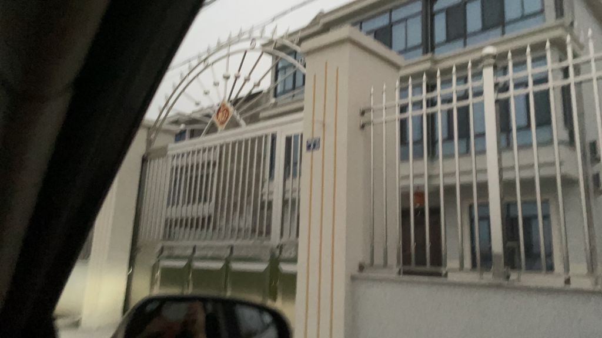
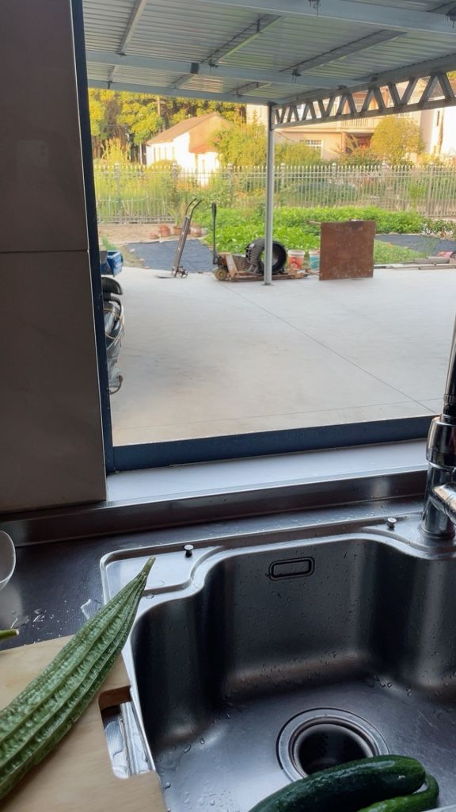
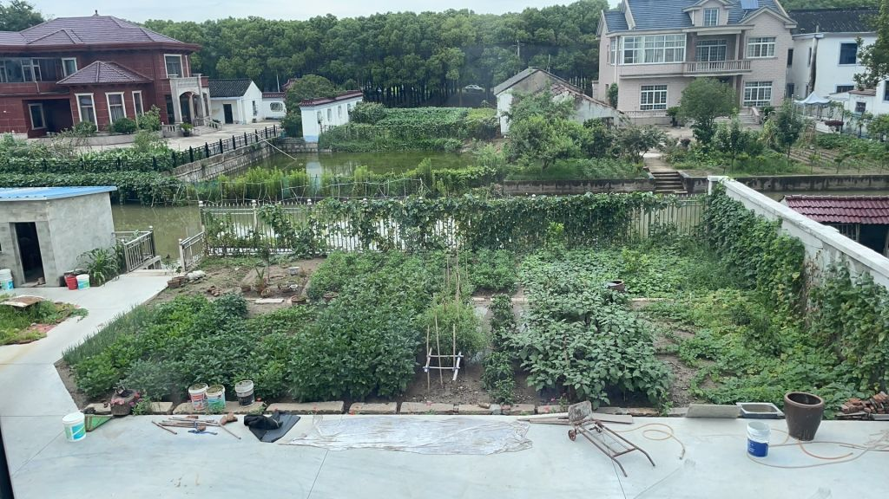
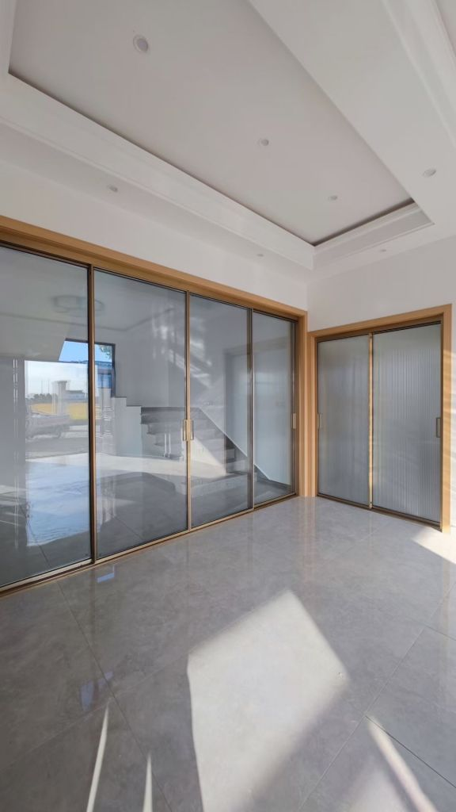

### 大佬们，现在回农村自建房还来得及吗？

Made by ngapost2md (c) ludoux [GitHub Repo](https://github.com/ludoux/ngapost2md)

----

##### 0.[0] \<pid:0\> 2023-12-05 14:54:58 by 文王梦熊\(浙江\)
刚才听两个保安聊天，大致了解了一下，浙江农村，包工包料，做钢筋混凝土永固地下室，上面三层楼，居住面积450平米(不含地下室)，外墙全部贴上瓷砖，里面都搞仿实木地板。再弄个半亩地的院子，院子里搞个游泳池……加在一起还不到100万啊，那人还嫌贵，我心想这都不到我在城里买房的三分之一，关键城里房子还不大！

----

##### 1.[21] \<pid:730688539\> 2023-12-05 14:56:46 by 他妻负我i\(山东\)
分地方。。。

----

##### 2.[78] \<pid:730688632\> 2023-12-05 14:57:14 by 一条小鱼_\(中国\)
没有宅基地搞个锤子

----

##### 3.[10] \<pid:730688667\> 2023-12-05 14:57:25 by 是尾巴先动手的\(中国\)
咋可能这么便宜

----

##### 4.[0] \<pid:730688678\> 2023-12-05 14:57:28 by 天权崩玉\(天津\)
南方说实话是挺合适的，北方不合适，一到冬天交通不方便，导致生活都不会很方便.还有建自建房你得有资格啊.

----

##### 5.[0] \<pid:730688686\> 2023-12-05 14:57:33 by 云云云云灿\(广东\)
有宅基地吗

----

##### 6.[0] \<pid:730688804\> 2023-12-05 14:58:04 by 阿罗拉九尾\(山东\)
城里房子不是地皮贵

----

##### 7.[1] \<pid:730688836\> 2023-12-05 14:58:13 by 组我准灭团\(江苏\)
我村里根本不让新建

----

##### 8.[6] \<pid:730688846\> 2023-12-05 14:58:19 by 教皇本三世\(上海\)
首先，你有宅基地吗？

----

##### 9.[0] \<pid:730688862\> 2023-12-05 14:58:26 by 我就是贰逼\(四川\)
你的地在哪里呢

----

##### 10.[15] \<pid:730688874\> 2023-12-05 14:58:28 by 老板一杯咖啡\(江苏\)
没有宅基地就不要想了，就算有宅基地，现在好像只允许翻新，不允许扩建了

----

##### 11.[0] \<pid:730688878\> 2023-12-05 14:58:30 by 海底捞叶\(广东\)
城里有房可以每天住，农村建房一年住不了几天，也就退休时回去住。  又不都是江浙的农村。

----

##### 12.[3] \<pid:730688911\> 2023-12-05 14:58:39 by 香辣的邂逅\(河北\)
你算过光地上三层装修多少钱么?
地下防水要多少钱?
盖个小别墅百万，装修也要百万。

----

##### 13.[1] \<pid:730688915\> 2023-12-05 14:58:40 by 帅有什么用呢\(四川\)
看地方
这确实贵了
西部省份，光说的这些目测60就能拿下

----

##### 14.[2] \<pid:730688945\> 2023-12-05 14:58:50 by 叶清粥\(浙江\)
关键你得有宅基地，现在我们村里宅基地基本不批了。

----

##### 15.[0] \<pid:730689051\> 2023-12-05 14:59:23 by 陈键锋鸭\(浙江\)
只算建筑成本不算宅基地，跟装修是可以的，但是现在没有宅基地，你搞锤子

----

##### 16.[0] \<pid:730689088\> 2023-12-05 14:59:35 by さくらあやね\(浙江\)
浙江哪里还能建房子？不会是那种山沟沟吧？一百万建一个去个市区得几小时，上海都能开到了

----

##### 17.[0] \<pid:730689110\> 2023-12-05 14:59:40 by 笨狮子马甲\(浙江\)
大哥，你要先有地啊。。。

建筑成本就摆在那里。。。

我记得我第一次接触，好像是低层一平米800块，高层1500，很多年了。。。。

财政局的建经科里面摆着这些书籍资料，无聊翻了看了点。。。。。

----

##### 18.[2] \<pid:730689136\> 2023-12-05 14:59:49 by 陀螺高人\(浙江\)
价格确实差不多，问题是你有宅基地吗？
而且哪怕浙江，农村和农村也不全一个样啊，要是山沟沟里呢
我老家农村，下高速5分钟就到，哪家不是别墅

----

##### 19.[2] \<pid:730689239\> 2023-12-05 15:00:22 by 此生入戏\(北京\)
半亩地的院子，种菜就算了，你还要硬化做游泳池。
占一点耕地分分钟给你推了

----

##### 21.[3] \<pid:730689338\> 2023-12-05 15:00:55 by 文王梦熊\(浙江\)
>[jump](#pid730688945) 叶清粥(2023-12-05 14:58) 说: 
>
>关键你得有宅基地，现在我们村里宅基地基本不批了。

我爸有，说不定我可以拿来折腾折腾。政策不清楚，有空了去问问看

----

##### 22.[10] \<pid:730689913\> 2023-12-05 15:03:48 by 老娘一身仙女味\(中国\)
我家刚造好啊 土建部分144平3层楼就花了45万，外墙喷砂5万，窗子6万，门两万；围墙栏杆3万，院子水泥地9万，三层楼瓷砖贴了10万多；
这些还是基础的，实在没钱豪装了，内装我们房子就弄了简单装修大概也花了100万  

  

----

##### 23.[1] \<pid:730689974\> 2023-12-05 15:04:01 by 我买银鳞胸甲\(浙江\)
我岳母可能以后会留个地基，岳父那边有老宅但是没地基，等以后老了打算跟老婆一起住乡下去。

----

##### 24.[1] \<pid:730690043\> 2023-12-05 15:04:22 by 文王梦熊\(浙江\)
>[jump](#pid730689239) 此生入戏(2023-12-05 15:00) 说: 
>
>半亩地的院子，种菜就算了，你还要硬化做游泳池。
>占一点耕地分分钟给你推了

按保安大叔的说法，一层150平也不合规，好像是说一户只批100平，不过他们还是有办法

----

##### 25.[0] \<pid:730690379\> 2023-12-05 15:05:51 by 文王梦熊\(浙江\)
>[jump](#pid730689913) 老娘一身仙女味(2023-12-05 15:03) 说: 
>
>我家刚造好啊 土建部分144平3层楼就花了45万，外墙喷砂5万，窗子6万，门两万；围墙栏杆3万，院子水泥地9万，三层楼瓷砖贴了10万多  
>
>
>[img]./mon_202312/05/-7Q192-6v0pZhT3cSsg

看上去真舒服啊

----

##### 26.[0] \<pid:730690758\> 2023-12-05 15:07:37 by 仲景德镇\(江苏\)
没有外卖  没有医院  没有学校

----

##### 27.[0] \<pid:730690786\> 2023-12-05 15:07:45 by 叛逆小天\(广西\)
离城区不远的话，还可以的。太远就算了。

----

##### 28.[0] \<pid:730690838\> 2023-12-05 15:08:00 by 黄埔江底娜迦大澡堂\(中国\)
村里不给建，没有地，是真的没有地，前几年有四个违建的村委，被人举报了，到现在还没出来，钱没了，房拆了，虽然蹲里面但至少人还在

----

##### 29.[0] \<pid:730691510\> 2023-12-05 15:11:20 by 老娘一身仙女味\(中国\)
>[jump](#pid730690379) 文王梦熊(2023-12-05 15:05) 说: 
>
>看上去真舒服啊

造房子啥都要花钱，水电啥的都是钱

----

##### 30.[0] \<pid:730691732\> 2023-12-05 15:12:27 by 用户0946933625\(浙江\)
你这100W盖完真的是一点装修都没有的  毛坯你也住？

----

##### 31.[0] \<pid:730691971\> 2023-12-05 15:13:36 by 我的蛋像蛋总\(中国\)
房产证批不出  爽是真的爽。。我三层楼 我直接一层楼直接就是超级大房。。 离市中心最近的村之一。。 周边房价也是本地最高。。

我是巴不得房地产硬着陆。。因为敢涨都敢拆 但是我这没证 最惨的就是啥都不赔还要当违章责令自行拆除。。什么宅基地。。。90后就不存在村里分发的宅基地。。只有父辈继承的那种60年代宅基地

----

##### 32.[0] \<pid:730692003\> 2023-12-05 15:13:43 by Morpheus\(四川\)
首先你要有地，然后要得到批准，浙江不知道，我这农村只有旧房评成危房了，才批准拆了建新的

----

##### 33.[0] \<pid:730692247\> 2023-12-05 15:14:50 by 噶爹咩\(浙江\)
你看村里能不能给你批，地方建委能不能给你批，而且甬台温的话每年都有台风的，你要自己去打理。

----

##### 34.[0] \<pid:730692375\> 2023-12-05 15:15:28 by 小N号123\(广东\)
你搞得下来文件不

----

##### 35.[0] \<pid:730692459\> 2023-12-05 15:15:46 by piaooooooo\(浙江\)
按你这说法，建房+装修100w？

你在做梦

----

##### 36.[0] \<pid:730692567\> 2023-12-05 15:16:17 by 堂堂正正發帖\(四川\)
到时候政策变了，收回去重新拍卖，把你房子推了，也不是没可能啊，要想好，三思而后行。

----

##### 37.[0] \<pid:730692631\> 2023-12-05 15:16:36 by 楓埖\(山东\)
我们这自建房早好几年前就不批了

----

##### 38.[0] \<pid:730692669\> 2023-12-05 15:16:46 by wan464696508\(浙江\)
假的，没那么便宜

----

##### 39.[0] \<pid:730692750\> 2023-12-05 15:17:11 by 天启圣堂武士\(广东\)
我们村一间宅基地35万，你这100万还不够买宅基地的。

----

##### 40.[0] \<pid:730693006\> 2023-12-05 15:18:34 by 没有烦恼呢\(湖南\)
你开玩笑呢，我前几年在钢筋涨价之前才建的。湖南农村，首层270，二楼220，三楼是屋顶。装修非常一般。就这都花了一百一了。
现在想都不敢想

----

##### 41.[0] \<pid:730693063\> 2023-12-05 15:18:50 by mulan14\(上海\)
房子地皮大头，装修小头，土建可以忽略了

----

##### 42.[0] \<pid:730693068\> 2023-12-05 15:18:52 by 这名字真好听\(广东\)
政策变了，旧屋翻新只准建两层，还限占地面积

----

##### 43.[0] \<pid:730693194\> 2023-12-05 15:19:23 by wowdk5920\(湖南\)
>[jump](#pid730690043) 文王梦熊(2023-12-05 15:04) 说: 
>
>按保安大叔的说法，一层150平也不合规，好像是说一户只批100平，不过他们还是有办法

这个倒是看地方，湖南这边能批到160  ，但是院子搞这么大。没点关系和玛尼怕是做梦

----

##### 44.[0] \<pid:730693258\> 2023-12-05 15:19:43 by 山WOW山\(浙江\)
>[jump](#pid730689136) 陀螺高人(2023-12-05 14:59) 说: 
>
>价格确实差不多，问题是你有宅基地吗？
>而且哪怕浙江，农村和农村也不全一个样啊，要是山沟沟里呢
>我老家农村，下高速5分钟就到，哪家不是别墅

是这样的，温州这边我家农村，高速口已经怼到家门口了快

我家门口到上高速，直线距离500m左右

去市区还算方便，在考虑要不要回去住自己建的算了，在市区一年房租一两万

----

##### 45.[1] \<pid:730693272\> 2023-12-05 15:19:46 by hi888\(江苏\)
1，你得有宅基地 
2，你家男人得多，不然村里人直接欺负你
3，医疗是个问题

好处就不说了，多的很

----

##### 46.[0] \<pid:730693431\> 2023-12-05 15:20:27 by 好喝的汽水\(浙江\)
院子里搞游泳池，怕不是乱占耕地。另外村里邻里关系也很复杂，一旦搞不好，怕是住都不想住。现在耕地红线严格控制，宅基地也很多控掉了。

----

##### 47.[0] \<pid:730693460\> 2023-12-05 15:20:34 by 孤单森林\(浙江\)
浙江？完全瞎说，不可能让你自建的，想要去新村点。泳池不存在的，院子也小的可怜

----

##### 48.[0] \<pid:730693757\> 2023-12-05 15:22:01 by 大号又被禁言了\(江苏\)
首先得有宅基地，其次你说的这些100个可能只是个毛坯

----

##### 49.[1] \<pid:730693976\> 2023-12-05 15:23:04 by 百花胜香\(浙江\)
是的，同样一块瓷砖，贴城里房子就是150一块，贴农村自建房就变15一块了，就是这么神奇，楼主快去吧

----

##### 50.[0] \<pid:730694089\> 2023-12-05 15:23:42 by Burden7\(广东\)
东莞这边很多地方都不让建了

----

##### 51.[0] \<pid:730694184\> 2023-12-05 15:24:11 by picxe_px\(广西\)
家里前几年趁着政策没下建好第二栋，前院后院鱼塘菜园五亩多地爽得不行。这三年村里根本不批房子，我大哥有批准，花四十多万建好毛坯房准备当幼儿园照样被推，就因为给市里送礼结果得罪镇上的人了

----

##### 52.[0] \<pid:730694267\> 2023-12-05 15:24:38 by 浅墨痕迹\(北京\)
现在除非危房，不然不批远地基改建，搬到新农村又没什么意思了

----

##### 53.[0] \<pid:730694360\> 2023-12-05 15:25:06 by xdjunjie\(浙江\)
表姐夫在老家盖了个3层小楼60多个

(为了面子,一年也回不了几天)

----

##### 54.[0] \<pid:730694502\> 2023-12-05 15:25:48 by kewowlo\(浙江\)
我在宁波逛了二十个村子，还没见过你说的这么大的

----

##### 55.[0] \<pid:730695149\> 2023-12-05 15:29:01 by 彷徨的幽灵\(浙江\)
看你描述应该是不够的

----

##### 56.[0] \<pid:730695253\> 2023-12-05 15:29:30 by 愚不可及之人\(陕西\)
你有宅基地么。

----

##### 57.[0] \<pid:730695320\> 2023-12-05 15:29:52 by JackBoosY\(上海\)
翻新可以不动墙，剩下就别想了，你敢拆就敢让你住空地

----

##### 58.[0] \<pid:730695470\> 2023-12-05 15:30:36 by springsnow\(福建\)
>[jump](#pid0) 文王梦熊(2023-12-05 14:54) 说: 
>
>刚才听两个保安聊天，大致了解了一下，浙江农村，包工包料，做钢筋混凝土永固地下室，上面三层楼，居住面积450平米(不含地下室)，外墙全部贴上瓷砖，里面都搞仿实木地板。再弄个半亩地的院子，院子里搞个游泳池……加在一起还不到100万啊，那人还嫌贵，我心想这都不到我在城里买房的三分之一，关键城里房子还不大！

我就问你一个问题：你农村有地吗？
如果没有的话，你不会以为你回去他们就会分给你地吧？

----

##### 59.[0] \<pid:730695477\> 2023-12-05 15:30:37 by dt2956\(四川\)
自建房肯定便宜啊，土地不要钱，纯是建筑成本，但是现在四线小城市的城乡结合部都不批宅基地了，离市区远的地方到处都是基本农田，哪还有多少合适的位置建房啊

----

##### 60.[0] \<pid:730695726\> 2023-12-05 15:31:57 by 蕭馨舞\(上海\)
有关部门：你想建就建 你当你是主人翁啊？

----

##### 61.[0] \<pid:730695768\> 2023-12-05 15:32:12 by 相思寄明月\(重庆\)
没这么便宜，房子又不是只要钢筋混凝土，给你参考一个数，3层200～300万(含装修)

----

##### 62.[0] \<pid:730695820\> 2023-12-05 15:32:27 by 白小肖\(河南\)
别说新建了，老房子想拆了建都不让，手续批不下来

----

##### 63.[0] \<pid:730696085\> 2023-12-05 15:33:34 by 老帮帮\(中国\)
上海郊区土著，16年开始建的房子，18年完工住进去的，整个外部建筑加门窗花了65个W，其他内部的装修和电器啥的花了100，这还是一般的装修

----

##### 64.[0] \<pid:730696132\> 2023-12-05 15:33:47 by 高速旋转攻三点\(陕西\)
你有当地农村户口吗？你有宅基地吗？你能让村委会批准你开工建设吗？

----

##### 65.[0] \<pid:730696266\> 2023-12-05 15:34:28 by cqxhxh\(浙江\)
装修都搞好想好看一点至少150以上，这几年老家亲戚发小家都有旧房重建，我也准备不是靠路边的一套房申请危房重建

----

##### 66.[0] \<pid:730696409\> 2023-12-05 15:35:04 by 高速旋转攻三点\(陕西\)
如今村里面想动个土，你以为你有建筑的钱你就能动了？没批条你连挖坟都挖不了

----

##### 67.[0] \<pid:730696568\> 2023-12-05 15:35:48 by chensaber\(浙江\)
你这配置不可能100w的，我家也是150方三层，十几年前就开始建了，4年前只装修了2层就花了35w，而且还只有我房间装了地板，其余都是瓷砖，总共花了也有100w，我爸本身自己还是建筑工人，懂的最低成本买材料和请当地的朋友帮忙一起建。地点是浙江绍兴。

----

##### 68.[1] \<pid:730696798\> 2023-12-05 15:37:03 by Junnass\(浙江\)
为什么老是有人有这种想法，同是浙江农村的。能让你建房的都是前山后水沟的山窝窝村。你以为开车半小时就是市中心？你以后孩子上学再去城里买套房？

----

##### 69.[0] \<pid:730696821\> 2023-12-05 15:37:10 by 风之舞丶\(广东\)
放屁 我福建农村 3层半 最简单的装修 100w 只有正面是瓷砖 其他三面都是直接喷漆 
一个毛坯架子都要50w了 我这个包括挖机填土等一系列工作 还是15还是16建的呢

----

##### 70.[0] \<pid:730697234\> 2023-12-05 15:39:20 by 捍卫之羽\(福建\)
>[jump](#pid730696821) 风之舞丶(2023-12-05 15:37)说:
>放屁 我福建农村 3层半 最简单的装修 100w 只有正面是瓷砖 其他三面都是直接喷漆 
>一个毛坯架子都要50w了 我这个包括挖机填土等一系列工作 还是15还是16建的呢

<b>我老家村里2层，单层100平米，不算装修的钱就土建前后花了近60个。去年刚建好。。
</b>

----

##### 71.[0] \<pid:730697380\> 2023-12-05 15:40:05 by 滑了个稽\(浙江\)
得了吧
我诸暨11年造的房子150平+能3辆悍马进出通顺的院子没装修都花了60个

----

##### 72.[0] \<pid:730697621\> 2023-12-05 15:41:09 by 糟心的事\(山西\)
有宅基地还需要是空着的宅基地，如果宅基地上面有房子拆了重新盖我们这边要花不少钱打点。当然空着的也需要打点花的钱少点。

----

##### 73.[0] \<pid:730697932\> 2023-12-05 15:42:37 by 风之舞丶\(广东\)
>[jump](#pid730697234) 捍卫之羽(2023-12-05 15:39) 说: 
>
><b>我老家村里2层，单层100平米，不算装修的钱就土建前后花了近60个。去年刚建好。。
></b>

差不多这价格 现在砖和水泥钢筋都贵了好多 连他妈一车土都要贵好多

----

##### 74.[0] \<pid:730698104\> 2023-12-05 15:43:29 by liulin2134\(湖北\)
一体浇筑一百万带装修不贵。。放我们湖北还便宜

----

##### 75.[0] \<pid:730698303\> 2023-12-05 15:44:27 by chensaber\(浙江\)
>[jump](#pid730696798) Junnass(2023-12-05 15:37)说:
>为什么老是有人有这种想法，同是浙江农村的。能让你建房的都是前山后水沟的山窝窝村。你以为开车半小时就是市中心？你以后孩子上学再去城里买套房？

那还是有的，只是得很早批的地，后面都不给批了，我家宅基地开车到高铁站，附近人民医院10分钟，到市区15分钟

----

##### 76.[0] \<pid:730698584\> 2023-12-05 15:45:49 by anko77\(山西\)
泳池就算了，这玩意打理很麻烦

----

##### 77.[0] \<pid:730698654\> 2023-12-05 15:46:09 by chensaber\(浙江\)
>[jump](#pid730697380) 滑了个稽(2023-12-05 15:40)说:
>得了吧
>我诸暨11年造的房子150平+能3辆悍马进出通顺的院子没装修都花了60个

是的，我家也是诸暨，就是这个价，而且还是前几年的价格了，随便装修一下就是100以上，楼主的配置起码200了

----

##### 78.[0] \<pid:730698938\> 2023-12-05 15:47:36 by 456syl\(上海\)
现在不给批咯，坐标上海郊区，首先是宅基地，然后得有造房子的许可，规模都有要求，比如以前我作为家里孩子想要搬出去造自己的房子，有宅基地，只要村里给批就行，但这几年都不给了，危房改造，装修都有要求。

----

##### 79.[0] \<pid:730699163\> 2023-12-05 15:48:48 by 看上去好像条狗\(浙江\)
杭州萧山离市区20公里不到的乡镇三层400平毛坯造价100，外立面+内部装修家电家具100,看上去花了200但是比起
萧山市区的房价还是很香的。

----

##### 80.[0] \<pid:730700349\> 2023-12-05 15:54:30 by Junnass\(浙江\)
>[jump](#pid730698303) chensaber(2023-12-05 15:44) 说: 
>
>那还是有的，只是得很早批的地，后面都不给批了，我家宅基地开车到高铁站，附近人民医院10分钟，到市区15分钟

你都说很早了。你咋不说以前市区都是村子

----

##### 81.[0] \<pid:730700741\> 2023-12-05 15:56:27 by Ke3397\(广东\)
老家河南农村，我们那里最多让建2.5分地的房，地下室或者三层楼的很难批下来。
我们宅基地大概半亩多点的地。

----

##### 82.[0] \<pid:730700965\> 2023-12-05 15:57:32 by pchere\(北京\)
住3天你的热乎劲就过去了
住7天你只会想跳脚
除非你在镇上或者带了一个保姆管家厨师医生司机齐全的队伍

----

##### 83.[0] \<pid:730701441\> 2023-12-05 15:59:57 by 枫刀一点红\(北京\)
有宅基地行，没有的话，现在农村基本已经批不出地了，而且也不批了

----

##### 84.[0] \<pid:730715646\> 2023-12-05 17:07:11 by 比巫妖王还要污\(中国\)
首先你要有宅基地
其次你的工作在本地

----

##### 85.[0] \<pid:730716735\> 2023-12-05 17:12:34 by 口口不二君\(广西\)
>[jump](#pid730689913) 老娘一身仙女味(2023-12-05 15:03) 说: 
>
>我家刚造好啊 土建部分144平3层楼就花了45万，外墙喷砂5万，窗子6万，门两万；围墙栏杆3万，院子水泥地9万，三层楼瓷砖贴了10万多；
>这些还是基础的，实在没钱豪装了，内装我们房子就弄了简单装修大概也花了100万  
>
>
>

舒服！看周围环境你们那边都是这样子建的了吧

----

##### 86.[0] \<pid:730716853\> 2023-12-05 17:13:11 by 牛儿Q\(湖北\)
现在农村宅基地基本是没有了，除非你原来在农村本身就有宅基地/你农村的亲戚转让你

----

##### 87.[0] \<pid:730718209\> 2023-12-05 17:19:26 by 老娘一身仙女味\(中国\)
>[jump](#pid730716735) 口口不二君(2023-12-05 17:12) 说: 
>
>舒服！看周围环境你们那边都是这样子建的了吧

对的，太仓的，算是乡下比较偏远的地方，轮不到我们拆迁，所以可以造新房子

----

##### 88.[0] \<pid:730718265\> 2023-12-05 17:19:42 by dxyaizlt\(河南\)
洛阳农村  不批宅基地  老房只让维修  私拆了不让你盖

----

##### 89.[1] \<pid:730718367\> 2023-12-05 17:20:13 by 舍长的173\(江苏\)
半亩地院子你可能要两个宅基地才能搞定，我这边见过一家兄弟两个也就是两个宅基地建在一起的院子估摸半亩地还没呢

----

##### 90.[0] \<pid:730719047\> 2023-12-05 17:23:20 by 默认密码\(江苏\)
>[jump](#pid0) 文王梦熊(2023-12-05 14:54) 说: 
>
>刚才听两个保安聊天，大致了解了一下，浙江农村，包工包料，做钢筋混凝土永固地下室，上面三层楼，居住面积450平米(不含地下室)，外墙全部贴上瓷砖，里面都搞仿实木地板。再弄个半亩地的院子，院子里搞个游泳池……加在一起还不到100万啊，那人还嫌贵，我心想这都不到我在城里买房的三分之一，关键城里房子还不大！

你说建就建了？
土地呢？宅基地呢？老房不是危房，也不会让你造新的，万一造的比原先(隔壁)高那么一丢丢，被举报就是违章建筑了。

----

##### 91.[0] \<pid:730719451\> 2023-12-05 17:25:17 by 失序的时间\(福建\)
用点脑子就知道不可能这价格的

----

##### 92.[0] \<pid:730719568\> 2023-12-05 17:25:46 by 藤咲ウサ\(辽宁\)
你有地吗……我们这买农村房没证，怎么自建

----

##### 93.[0] \<pid:730719788\> 2023-12-05 17:26:41 by qq707148451\(广东\)
你在想屁吃，100万盖地下室和地上三层，还加个游泳池，除非你不装修

----

##### 94.[0] \<pid:730719905\> 2023-12-05 17:27:11 by 小野草。。\(北京\)
农村不让盖二层怎么解决？？？

----

##### 95.[0] \<pid:730720118\> 2023-12-05 17:28:12 by 子不语惊鬼神\(浙江\)
现在已经不批地了，你要买地基都一个个几十万了

----

##### 96.[0] \<pid:730721076\> 2023-12-05 17:33:10 by 我就不改名字\(广西\)
有宅基地也没用吧，印象中某年后就没见过村里盖新房的了，都是以前只起了一层还没起完的继续起，还有盖好的没装修的接着装修

----

##### 97.[0] \<pid:730721994\> 2023-12-05 17:37:35 by 流动性为零\(中国\)
建房子物料费其实也就那样了，贵都是贵到土地上的

----

##### 98.[0] \<pid:730722699\> 2023-12-05 17:41:14 by TMfeixiang\(广东\)
<b>Reply to [pid=730688667,38599251,1]Reply[/pid] Post by [uid=39504192]是尾巴先动手的[/uid] (2023-12-05 14:57)今年我爸搞老家的房子，全部修好，4.5层，宅基地90平，总共花了30万不到，后面的装修是大头，大概要30-40万，看个人需求，贵的可以花100万来装都不够。所以楼主说的这个报价是真实报价，符合实际。</b>

----

##### 99.[0] \<pid:730722816\> 2023-12-05 17:41:47 by 重铸骷髅党荣光\(江苏\)
不算装修和宅基地的话，100个绰绰有余

----

##### 100.[0] \<pid:730722904\> 2023-12-05 17:42:17 by 侏儒马东梅\(上海\)
水泥砖块本来就没多少钱啊

----

##### 101.[0] \<pid:730724180\> 2023-12-05 17:49:08 by xxuan1990\(湖北\)
不说宅基地的事。再过个一二十年，农村全部成荒村了，你还敢去住这一百万的房子吗。

----

##### 102.[0] \<pid:730724710\> 2023-12-05 17:52:12 by radishroo\(湖北\)
没那么便宜

----

##### 103.[0] \<pid:730725542\> 2023-12-05 17:56:49 by 元芳 这件事你怎么看\(北京\)
楼主，中国很大，不是只有江浙沪。

----

##### 104.[0] \<pid:730726837\> 2023-12-05 18:03:44 by 艾萨拉暮光\(广西\)
不是叫宅基地就能建，首先户口要求在本村，并且符合一户一宅，我负责的地区一层不能超过150平，新建、原址翻建要求从09年到22年地类都是建设用地。占用耕地建房下发通知书限期内不拆除的话，法院强制拆除并处罚金(一平1000块)
，重点来了：拿来种菜超过5年有一定几率会强制变为耕地！！！未来有计划建房的千万别拿那块地来种菜，直接硬化或者铺满碎石

----

##### 105.[0] \<pid:730727392\> 2023-12-05 18:06:54 by z1154505909\(广东\)
我在深圳七年，没入深户，为了留着我的农村户口，老家的房子是我最后的倔强

----

##### 106.[0] \<pid:730727914\> 2023-12-05 18:10:05 by 雷麦黛丝33\(天津\)
建个泳池不维护吗，后期维护都是需要钱的

----

##### 107.[0] \<pid:730728006\> 2023-12-05 18:10:36 by z1z2z3z\(广东\)
城里贵的一直是配套设施，

衣食住行，生老病死，教育医疗这些

同事家里分的那几座山头，预见的30年内没什么用，离村子要走半天，村子到乡里摩托车走半天山路，乡里到县城坐车又是半天

----

##### 108.[0] \<pid:730742916\> 2023-12-05 19:39:35 by 谈奘亡法\(广西\)
>[jump](#pid730688678) 天权崩玉(2023-12-05 14:57) 说: 
>
>南方说实话是挺合适的，北方不合适，一到冬天交通不方便，导致生活都不会很方便.还有建自建房你得有资格啊.

有几个有那闲钱去搞这些，又不是经常住，花大几十一百万去弄，图啥

----

##### 109.[0] \<pid:730743622\> 2023-12-05 19:44:06 by 182455920\(四川\)
正好在修自建房。140地平方，4层加天台。主体70万。

----

##### 110.[0] \<pid:730743633\> 2023-12-05 19:44:12 by 飛鳥。\(陕西\)

我们这有个 自己的地，盖了3层，200多万吧，到能入住。

