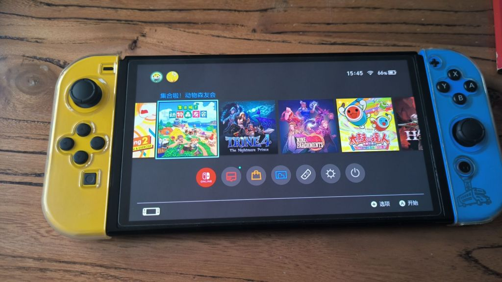

### 有什么电子产品能达到switch的高度吗

Made by ngapost2md (c) ludoux [GitHub Repo](https://github.com/ludoux/ngapost2md)

----

##### 0.[0] \<pid:0\> 2023-12-05 07:25:23 by esra16\(加拿大\)
switch是2017年3月发布的

7年的电子产品，还tm在大卖

这是电子产品啊

----

##### 1.[158] \<pid:730606220\> 2023-12-05 07:26:15 by lincavy\(河南\)
750ti

----

##### 2.[49] \<pid:730606231\> 2023-12-05 07:26:32 by 嘛噶\(浙江\)
游戏倒是有几个，比如gta5

----

##### 3.[3] \<pid:730606252\> 2023-12-05 07:26:48 by 无敌的火锅\(中国\)
昨天研究了一下模拟器。。。发现自己真不行了，寻找资源的能力太差了

----

##### 4.[0] \<pid:730606278\> 2023-12-05 07:27:20 by 不冷~陌\(河南\)
你先问问switch能不能达到psp的高度吧
(不是那个新的psp串流弱智啊)

----

##### 5.[17] \<pid:730606303\> 2023-12-05 07:27:54 by 嗷嗷獒\(上海\)
游戏不是不断在更新  霍格沃兹之遗都上NS了

还有老牌超级马里奥全家桶和宝可梦

----

##### 6.[0] \<pid:730606305\> 2023-12-05 07:27:54 by chtc88168\(浙江\)
iPhone4？我不知道iPhone是几代开始火的，但我身边大规模更新智能手机是4代。。。感觉几个月时间就把诺基亚和摩托罗拉按死了

----

##### 7.[25] \<pid:730606333\> 2023-12-05 07:28:17 by a19900317\(重庆\)
>[jump](#pid730606220) lincavy(2023-12-05 07:26) 说: 
>
>750ti

不如rx580 进矿锻炼都是二进宫了

----

##### 8.[0] \<pid:730606412\> 2023-12-05 07:29:43 by 凯露\(安徽\)
swich开天辟地？

----

##### 9.[83] \<pid:730606442\> 2023-12-05 07:30:21 by 子夜轻寒\(辽宁\)
>[jump](#pid730606278) 不冷~陌(2023-12-05 07:27) 说: 
>
>你先问问switch能不能达到psp的高度吧
>(不是那个新的psp串流弱智啊)

已经秒了。PSP才8253w台，而ns已经1.3亿了。

----

##### 10.[63] \<pid:730606467\> 2023-12-05 07:30:48 by 70599\(湖北\)
>[jump](#pid730606278) 不冷~陌(2023-12-05 07:27) 说: 
>
>你先问问switch能不能达到psp的高度吧
>(不是那个新的psp串流弱智啊)

nds表示你psp算个啥啊？

----

##### 11.[25] \<pid:730606484\> 2023-12-05 07:31:05 by 骡子奋进\(黑龙江\)
>[jump](#pid730606278) 不冷~陌(2023-12-05 07:27) 说: 
>
>你先问问switch能不能达到psp的高度吧
>(不是那个新的psp串流弱智啊)

psp 当年的普及度太低了。。。
当年的 2000 块钱。。。再加点。。。县城能买个小平房了。。。

----

##### 12.[0] \<pid:730606532\> 2023-12-05 07:31:55 by shamanda\(中国\)
这种电子垃圾也能吹嘛？本来自己抱着满屏游戏性玩去无所谓，现在厂商为了全平台动不动把其他平台的画质也给嚯嚯了，就是个害人精。

----

##### 13.[1] \<pid:730606536\> 2023-12-05 07:32:02 by sdf_jkl\(安徽\)
rx580

----

##### 14.[0] \<pid:730606546\> 2023-12-05 07:32:13 by 凯伊`Pleiades\(中国\)
电子产品？
电子垃圾！

----

##### 15.[17] \<pid:730606582\> 2023-12-05 07:32:52 by 子夜轻寒\(辽宁\)
在游戏机界，这不是个很正常的事吗？
Ps2，2000年发售，2013年停产，卖了整整13年，1.5亿。
nds，2004年发售，2014年停产，卖了十年，1.4亿。

----

##### 16.[0] \<pid:730606620\> 2023-12-05 07:33:37 by 不冷~陌\(河南\)
>[jump](#pid730606442) 子夜轻寒(2023-12-05 07:30) 说: 
>
>已经秒了。PSP才8253w台，而ns已经1.3亿了。

我的理解是热度高度
只论销量那switch跟iphone什么的根本比不了

----

##### 17.[33] \<pid:730606681\> 2023-12-05 07:34:41 by 一只猛男\(浙江\)
switch能大卖跟它自己的电子产品属性有啥关系？
它不是电子垃圾？实在是公司给的独占太吊了
你把任天堂游戏做成小霸王独占，小霸王也能大卖

----

##### 18.[1] \<pid:730606776\> 2023-12-05 07:36:07 by 哈哈哈RUA\(北京\)
你直接问还有什么热卖的电子垃圾就行了

----

##### 19.[13] \<pid:730606866\> 2023-12-05 07:37:34 by doudouzbz1\(中国\)
>[jump](#pid730606278) 不冷~陌(2023-12-05 07:27) 说: 
>
>你先问问switch能不能达到psp的高度吧
>(不是那个新的psp串流弱智啊)

杠也是有技术含量的，psp拿头比？

----

##### 20.[0] \<pid:730606890\> 2023-12-05 07:37:59 by lxlxx911\(山东\)
>[jump](#pid730606252) 无敌的火锅(2023-12-05 07:26) 说: 
>
>昨天研究了一下模拟器。。。发现自己真不行了，寻找资源的能力太差了

淘宝
花点吧
也就几块

----

##### 21.[7] \<pid:730606912\> 2023-12-05 07:38:25 by 五更_瑠璃\(吉林\)
>[jump](#pid730606620) 不冷~陌(2023-12-05 07:33) 说: 
>
>我的理解是热度高度
>只论销量那switch跟iphone什么的根本比不了

热度高度psp也没switch火
只是switch很多人放在家里你看不见，psp很多人带到学校玩你看得见

我同事十多个人的switch数量比我高中全班70多个人的的psp数量多，我还是传统行业，不是什么跟游戏互联网相关产业  

switch让很多不玩游戏的人去买了这个机器，实实在在的出圈产品

----

##### 22.[4] \<pid:730606915\> 2023-12-05 07:38:28 by 子夜轻寒\(辽宁\)
>[jump](#pid730606620) 不冷~陌(2023-12-05 07:33) 说: 
>
>我的理解是热度高度
>只论销量那switch跟iphone什么的根本比不了

那是国内的热度，好多国内的人买它只是当MP4罢了。
假如ns在世界热度不高的话，那为啥日本还能每周卖出五万台以上呢？ns年度销量能超过1000万？

----

##### 23.[0] \<pid:730606936\> 2023-12-05 07:38:55 by 瘗鹤铭贴\(江苏\)
>[jump](#pid730606252) 无敌的火锅(2023-12-05 07:26) 说: 
>
>昨天研究了一下模拟器。。。发现自己真不行了，寻找资源的能力太差了

520

----

##### 24.[0] \<pid:730606995\> 2023-12-05 07:39:42 by simbaking\(中国\)
当年的psp

游戏电影音乐电子书

----

##### 25.[8] \<pid:730607042\> 2023-12-05 07:40:32 by wukongcao1984\(浙江\)
>[jump](#pid730606278) 不冷~陌(2023-12-05 07:27) 说: 
>
>你先问问switch能不能达到psp的高度吧
>(不是那个新的psp串流弱智啊)

psp什么高度呀，我太好奇了

----

##### 26.[19] \<pid:730607052\> 2023-12-05 07:40:44 by Cybrepunkill\(上海\)
>[jump](#pid730606278) 不冷~陌(2023-12-05 07:27) 说: 
>你先问问switch能不能达到psp的高度吧
>(不是那个新的psp串流弱智啊)

言论太过逆天以至于像反串

----

##### 27.[0] \<pid:730607090\> 2023-12-05 07:41:21 by 神木Wood\(中国\)
哪有啥高度啊？switch是“掌机”的绝唱和墓志铭

----

##### 28.[0] \<pid:730607222\> 2023-12-05 07:43:06 by dxerath\(河南\)
ipod吧，01年发布，04年之后就没怎么变，14年官方停产，估计到24年都还有人在用。

----

##### 29.[0] \<pid:730607233\> 2023-12-05 07:43:21 by 我是不是药神\(吉林\)
达不到，主播播switch游戏，把switch开着游戏扔一边，然后用模拟器播

当打之年的游戏主机能享受这个待遇的，基本是蝎子拉屎独一份了

----

##### 30.[0] \<pid:730607282\> 2023-12-05 07:44:04 by 正规升半音号\(北京\)
gameboy？这算不算暴露年龄系列

----

##### 31.[0] \<pid:730607598\> 2023-12-05 07:48:37 by 奶中之霸\(浙江\)
有一说一，PSP性能在当时没的说，还能玩各种花样，掌机能超频你能信？sw面世起就是个性能垃圾，完全是靠游戏撑起来的。我王泪空岛过了两个神庙就封盘了，用电脑模拟器通关，2k60帧玩起来秒杀sw

----

##### 32.[0] \<pid:730607649\> 2023-12-05 07:49:13 by mattackerio\(广东\)
有没有可能他现在还能大卖的原因是因为任狗的独占

要不是独占你看他有底气这么多年不更新ns2吗

----

##### 33.[8] \<pid:730607747\> 2023-12-05 07:50:32 by Edsionkk\(天津\)
>[jump](#pid730606681) 一只猛男(2023-12-05 07:34) 说: 
>
>switch能大卖跟它自己的电子产品属性有啥关系？
>它不是电子垃圾？实在是公司给的独占太吊了
>你把任天堂游戏做成小霸王独占，小霸王也能大卖

我赞同
这跟苹果，安卓当初把诺基亚，摩托罗拉干倒一个意思
更多是软件加持
手搓硬件电子设备，华强北年年能设计金奖

----

##### 34.[0] \<pid:730608048\> 2023-12-05 07:54:10 by dinganda1\(上海\)
NS也就老任自己的几个IP独占，但销量就是高，不得不佩服老任。

----

##### 35.[0] \<pid:730608166\> 2023-12-05 07:55:37 by 范阿尔特\(湖北\)
高通680

----

##### 36.[4] \<pid:730608407\> 2023-12-05 07:58:24 by AerialXVX\(上海\)
>[jump](#pid0) esra16(2023-12-05 07:25) 说: 
>
>switch是2017年3月发布的
>
>7年的电子产品，还tm在大卖
>
>这是电子产品啊

ns发布前一年前特斯拉model3刚发布，今年才大改款

----

##### 37.[5] \<pid:730608719\> 2023-12-05 08:01:21 by thatcoolman\(河南\)
一堆人喷switch电子垃圾
游戏好不好玩和性能真没关系
nds 3ds wii都是你们嘴里的电子垃圾，不耽误他们大卖
也不耽误这些平台好游戏不断
张口闭口就是画面，性能，然而玩游戏只看独占和游戏数量

----

##### 38.[0] \<pid:730608805\> 2023-12-05 08:02:23 by 丁拐拐\(内蒙古\)
>[jump](#pid730606278) 不冷~陌(2023-12-05 07:27) 说: 
>
>你先问问switch能不能达到psp的高度吧
>(不是那个新的psp串流弱智啊)

那就要看你怎么定义高度了

----

##### 39.[2] \<pid:730608878\> 2023-12-05 08:03:06 by 无敌的火锅\(中国\)
>[jump](#pid730606936) 瘗鹤铭贴(2023-12-05 07:38) 说: 
>
>520

啥意思？我不是基佬。。。。。

----

##### 40.[0] \<pid:730608904\> 2023-12-05 08:03:24 by 丁拐拐\(内蒙古\)
>[jump](#pid730608719) thatcoolman(2023-12-05 08:01) 说: 
>
>一堆人喷switch电子垃圾
>游戏好不好玩和性能真没关系
>nds 3ds wii都是你们嘴里的电子垃圾，不耽误他们大卖
>也不耽误这些平台好游戏不断
>张口闭口就是画面，性能，然而玩游戏只看独占和游戏数量

这些人大概只玩原神吧

----

##### 41.[0] \<pid:730608987\> 2023-12-05 08:04:06 by 给你换雪碧小号\(中国\)
>[jump](#pid730606484) 骡子奋进(2023-12-05 07:31) 说: 
>
>psp 当年的普及度太低了。。。
>当年的 2000 块钱。。。再加点。。。县城能买个小平房了。。。

啥县城？？

----

##### 42.[0] \<pid:730609015\> 2023-12-05 08:04:29 by 绅士羊\(中国\)
是游戏迁就，而不是电子垃圾牛逼。

----

##### 43.[0] \<pid:730609155\> 2023-12-05 08:06:05 by 孑wolf\(河北\)
Switch迟迟不进行硬件升级
每一个买的人都有责任

----

##### 44.[9] \<pid:730609287\> 2023-12-05 08:07:20 by 再也不胡说了\(天津\)
>[jump](#pid730606620) 不冷~陌(2023-12-05 07:33) 说: 
>
>我的理解是热度高度
>只论销量那switch跟iphone什么的根本比不了

你打滚的样子有些搞笑

----

##### 45.[0] \<pid:730609508\> 2023-12-05 08:09:33 by 爱珍珍的小索索\(广西\)
当然是伟大的苹果手机了
开创引领移动智能时代

----

##### 46.[1] \<pid:730609533\> 2023-12-05 08:09:49 by 子夜轻寒\(辽宁\)
>[jump](#pid730608878) 无敌的火锅(2023-12-05 08:03) 说: 
>
>啥意思？我不是基佬。。。。。

他的意思有个网站叫做switch520

----

##### 47.[7] \<pid:730609819\> 2023-12-05 08:12:29 by 老公快回来了\(浙江\)
到现在还有人吹psp是有点搞笑的

----

##### 48.[0] \<pid:730610165\> 2023-12-05 08:15:41 by 幻想的风\(广东\)
>[jump](#pid730607233) 我是不是药神(2023-12-05 07:43) 说: 
>
>达不到，主播播switch游戏，把switch开着游戏扔一边，然后用模拟器播
>
>当打之年的游戏主机能享受这个待遇的，基本是蝎子拉屎独一份了

我身边也有这样的朋友，手上有ns但是只玩模拟器，机子只是应对pvp环节的道具，原话是“机子可以不玩，但是不能没有”。

----

##### 49.[7] \<pid:730610181\> 2023-12-05 08:15:48 by 灯火之星\(上海\)
>[jump](#pid730606890) lxlxx911(2023-12-05 07:37) 说: 
>
>淘宝
>花点吧
>也就几块

你玩盗版我不说啥。。但是你这玩盗版还给奸商送钱的我就不得不表达一下啥了。。。。

----

##### 50.[0] \<pid:730610702\> 2023-12-05 08:20:42 by 天堂の挽歌\(浙江\)
>[jump](#pid730606278) 不冷~陌(2023-12-05 07:27)说:
>你先问问switch能不能达到psp的高度吧
>(不是那个新的psp串流弱智啊)

悲哀
好多人对于外国的印象只停留在02-12年了

----

##### 51.[0] \<pid:730611078\> 2023-12-05 08:23:50 by lxlxx911\(山东\)
>[jump](#pid730610181) 灯火之星(2023-12-05 08:15) 说: 
>
>你玩盗版我不说啥。。但是你这玩盗版还给奸商送钱的我就不得不表达一下啥了。。。。

主要是百度了半天，发现各种套路
算了懒得找
 直接省心

----

##### 52.[0] \<pid:730611377\> 2023-12-05 08:26:10 by 八云紫\(中国\)
>[jump](#pid730606912) 五更_瑠璃(2023-12-05 07:38) 说: 
>
>热度高度psp也没switch火
>只是switch很多人放在家里你看不见，psp很多人带到学校玩你看得见
>
>我同事十多个人的switch数量比我高中全班70多个人的的psp数量多，我还是传统行业，不是什么跟游戏互联网相关产业  
>
>switch让很多不玩游戏的人去买了这个机器，实实在在的出圈产品

你有没有思考过psp什么年代，switch什么年代？
再找个高中问问高中生自己买switch的比例是不是比你当年高中买psp比例高？

----

##### 53.[0] \<pid:730611931\> 2023-12-05 08:30:35 by 八云紫\(中国\)
>[jump](#pid730608719) thatcoolman(2023-12-05 08:01) 说: 
>
>一堆人喷switch电子垃圾
>游戏好不好玩和性能真没关系
>nds 3ds wii都是你们嘴里的电子垃圾，不耽误他们大卖
>也不耽误这些平台好游戏不断
>张口闭口就是画面，性能，然而玩游戏只看独占和游戏数量

既然没关系，那怎么解释买了正版却要用模拟器玩呢？
这不就说明了在不少人眼中并不是说一个游戏“游戏性高”就能无视其它缺点了。

----

##### 54.[3] \<pid:730611948\> 2023-12-05 08:30:44 by 孤独の橘子\(吉林\)
定位不一样，PSP在当时属于数码产品了，游戏机，电影播放器，电子书。

SWITCH是游戏机。我是都喜欢。但是更粉老任一些，怀念一下童年。

----

##### 55.[5] \<pid:730612651\> 2023-12-05 08:35:53 by UltrarenaNo2\(浙江\)
居然有人拿psp碰瓷，不会是组棒+破解系统玩家吧？

psp要真这么牛逼，umd也不会提前完蛋

----

##### 56.[0] \<pid:730629115\> 2023-12-05 10:07:06 by esra16\(加拿大\)
>[jump](#pid730609155) 孑wolf(2023-12-05 08:06) 说: 
>
>Switch迟迟不进行硬件升级
>每一个买的人都有责任

老任

----

##### 57.[5] \<pid:730630446\> 2023-12-05 10:13:19 by layton123\(中国\)
>[jump](#pid730606620) 不冷~陌(2023-12-05 07:33) 说: 
>
>我的理解是热度高度
>只论销量那switch跟iphone什么的根本比不了

当年双持的玩家路过，你这么尬吹psp我都怀疑你究竟有没有psp

----

##### 58.[0] \<pid:730652588\> 2023-12-05 11:42:16 by 亿万熔岩\(湖北\)
ns熬走了我3个女朋友心情复杂

----

##### 59.[1] \<pid:730652955\> 2023-12-05 11:43:54 by 306306\(广西\)
>[jump](#pid730606278) 不冷~陌(2023-12-05 07:27) 说: 
>
>你先问问switch能不能达到psp的高度吧
>(不是那个新的psp串流弱智啊)

PSP销量才多少？
也好意思碰瓷NS

你这也太井底之蛙了吧

----

##### 60.[5] \<pid:730653119\> 2023-12-05 11:44:32 by 索爾思克\(上海\)
>[jump](#pid730606620) 不冷~陌(2023-12-05 07:33) 说: 
>
>我的理解是热度高度
>只论销量那switch跟iphone什么的根本比不了

psp当年也就在国内比较火
在国外被nds秒了，更别谈switch了

----

##### 61.[3] \<pid:730653507\> 2023-12-05 11:46:10 by 直接夹断\(广东\)
今年花了700买了台2ds，比switch更垃圾的电子垃圾

还是那句话，玩游戏和玩硬件的是两批人，有重合但不多

----

##### 62.[4] \<pid:730654147\> 2023-12-05 11:48:53 by 直接夹断\(广东\)
>[jump](#pid730611931) 八云紫(2023-12-05 08:30)说:
>>[jump](#pid730608719) thatcoolman(2023-12-05 08:01) 说: 
>>
>>一堆人喷switch电子垃圾
>>游戏好不好玩和性能真没关系
>>nds 3ds wii都是你们嘴里的电子垃圾，不耽误他们大卖
>>也不耽误这些平台好游戏不断
>>张口闭口就是画面，性能，然而玩游戏只看独占和游戏数量
>
>既然没关系，那怎么解释买了正版却要用模拟器玩呢？
>这不就说明了在不少人眼中并不是说一个游戏“游戏性高”就能无视其它缺点了。

玩硬件的声音大而已，网上讨论显卡不是30系就是40系，你不会也以为这些是主流吧

玩模拟器的会跳出来说我有机子但是玩模拟器，不玩模拟器的根本不会发声，稍微用脑子想想就能得出的结论

----

##### 63.[0] \<pid:730654212\> 2023-12-05 11:49:14 by ninja_yc\(上海\)
我是不理解宝可梦玩家的。。。2023年了这种冷饭游戏还能大卖。。~~我玩到剑盾才弃坑的~~

----

##### 64.[0] \<pid:730654410\> 2023-12-05 11:50:03 by xiliufox\(山西\)
个人觉得ns不如nds ndsl 3ds那个时代，我真的很喜欢那个时代N系的游戏。

----

##### 65.[2] \<pid:730654843\> 2023-12-05 11:51:48 by graydust\(北京\)
>[jump](#pid730606890) lxlxx911(2023-12-05 07:37) 说: 
>
>淘宝
>花点吧
>也就几块

就是这种想法把举报狗惯出来了资源才越来越难找

----

##### 66.[2] \<pid:730654865\> 2023-12-05 11:51:53 by onlylgb\(山东\)
哪个手机不比它强？还是说手机不算电子产品

----

##### 67.[0] \<pid:730655946\> 2023-12-05 11:56:21 by 感觉还不错\(江苏\)
>[jump](#pid730606912) 五更_瑠璃(2023-12-05 07:38)说:
>>[jump](#pid730606620) 不冷~陌(2023-12-05 07:33) 说: 
>>
>>我的理解是热度高度
>>只论销量那switch跟iphone什么的根本比不了
>
>热度高度psp也没switch火
>只是switch很多人放在家里你看不见，psp很多人带到学校玩你看得见
>
>我同事十多个人的switch数量比我高中全班70多个人的的psp数量多，我还是传统行业，不是什么跟游戏互联网相关产业  
>
>switch让很多不玩游戏的人去买了这个机器，实实在在的出圈产品

出圈还是psp吧，你说的的“出圈”还是至少能分清各种主流游戏机的。很多人眼里中间屏幕两边手柄类型的掌机统称psp。
我爸妈从不玩游戏的，看见我的ns还问我为啥又买了个psp

----

##### 68.[0] \<pid:730656163\> 2023-12-05 11:57:19 by 给你个大b兜\(江苏\)
掌机只剩 NS了 能咋办

----

##### 69.[0] \<pid:730656317\> 2023-12-05 11:57:57 by momo0923\(北京\)
什么高度？不思进取的高度？

----

##### 70.[0] \<pid:730657208\> 2023-12-05 12:01:49 by 感觉还不错\(江苏\)
>[jump](#pid730612651) UltrarenaNo2(2023-12-05 08:35)说:
>居然有人拿psp碰瓷，不会是组棒+破解系统玩家吧？
>
>psp要真这么牛逼，umd也不会提前完蛋

耳熟能详产品向来离不开盗版啊，没啥稀奇的。
小霸王+超级玛丽，盗版红警+海量二创，魔兽争霸+浩方vs。
口碑出去了，制作方没捞到啥好处

----

##### 71.[0] \<pid:730657562\> 2023-12-05 12:03:21 by 八云紫\(中国\)
>[jump](#pid730654147) 直接夹断(2023-12-05 11:48) 说: 
>
>玩硬件的声音大而已，网上讨论显卡不是30系就是40系，你不会也以为这些是主流吧
>
>玩模拟器的会跳出来说我有机子但是玩模拟器，不玩模拟器的根本不会发声，稍微用脑子想想就能得出的结论

那你说的太对了，网上声音大，现实中就相反。
那么网上是吹switch声音大还是黑的声音大呢？

游戏好不好玩确实不可能只看一个指标，但总有人因为某厂商某个指标达不到更高就在评价中降低该指标的权重就很搞笑了。

----

##### 72.[2] \<pid:730658757\> 2023-12-05 12:09:06 by NGA里我最帅\(福建\)
Wii也很出圈，史上销量最高的游戏里，有好几个Wii上面的家庭游戏……

----

##### 73.[0] \<pid:730660998\> 2023-12-05 12:20:21 by rshmdblctzl\(陕西\)
hifi耳机播放器，超过金菊花的播放器至今很少，超过大奥的耳机也很少，好多热门款耳机也很保值

----

##### 74.[0] \<pid:730661817\> 2023-12-05 12:24:29 by 星之期盼\(上海\)
>[jump](#pid730608719) thatcoolman(2023-12-05 08:01) 说: 
>
>一堆人喷switch电子垃圾
>游戏好不好玩和性能真没关系
>nds 3ds wii都是你们嘴里的电子垃圾，不耽误他们大卖
>也不耽误这些平台好游戏不断
>张口闭口就是画面，性能，然而玩游戏只看独占和游戏数量

游戏确实是好不好玩最重要，但是要有个基础的性能吧？
如果性能画面变成能不能玩，你还觉得不重要么？
我玩PS5,XSX接电视使劲玩4,5个小时都没事
就是上半年王国之泪，玩上一个多小时必须休息会，不然玩2个小时必眼睛痛，要不是他是王国之泪，谁愿意受这个罪

----

##### 75.[0] \<pid:730662106\> 2023-12-05 12:26:08 by 红色小虎鲸\(江西\)
>[jump](#pid730611931) 八云紫(2023-12-05 08:30) 说: 
>
>既然没关系，那怎么解释买了正版却要用模拟器玩呢？
>这不就说明了在不少人眼中并不是说一个游戏“游戏性高”就能无视其它缺点了。

那么这个现象多普遍呢 没有数据你能证明什么 我是没用过模拟器也没听过身边人用 是不是又要说一句身边统计学啊

----

##### 76.[0] \<pid:730662458\> 2023-12-05 12:27:57 by silver_bullet\(山东\)
switch还差一个播放器功能，距离电视盒子还有一段路要走。

----

##### 77.[2] \<pid:730662838\> 2023-12-05 12:29:54 by 大表哥很奇怪\(吉林\)
>[jump](#pid730606278) 不冷~陌(2023-12-05 07:27) 说: 
>
>你先问问switch能不能达到psp的高度吧
>(不是那个新的psp串流弱智啊)

热度是超过了很多。高度看你怎么说了。

出圈程度，Switch是目前出圈程度最高的游戏主机。

----

##### 78.[0] \<pid:730663076\> 2023-12-05 12:31:13 by Len_master\(山西\)
>[jump](#pid730654212) ninja_yc(2023-12-05 11:49) 说: 
>
>我是不理解宝可梦玩家的。。。2023年了这种冷饭游戏还能大卖。。~~我玩到剑盾才弃坑的~~

世界第一ip是这样的，下次黑白复刻继续原汁原味，肯定又是千万保底的销量

----

##### 79.[0] \<pid:730663213\> 2023-12-05 12:32:00 by 七条命的猫\(山东\)
Gba和nds能否一战？

----

##### 80.[0] \<pid:730664256\> 2023-12-05 12:37:39 by 时间的朋友\(河北\)
他其实是在告诉你一件事，最近几年电子产品的性能提升其实没那么大，只要游戏出的好，还是有竞争力的。以前提升机能，平面到3D的那种震撼早就不存在了，只是分辨率和帧数有所提升的情况下，游戏内容反而更重要了

----

##### 81.[0] \<pid:730664507\> 2023-12-05 12:38:57 by 凛凛子_\(上海\)
>[jump](#pid730655946) 感觉还不错(2023-12-05 11:56) 说: 
>
>出圈还是psp吧，你说的的“出圈”还是至少能分清各种主流游戏机的。很多人眼里中间屏幕两边手柄类型的掌机统称psp。
>我爸妈从不玩游戏的，看见我的ns还问我为啥又买了个psp

不要身边统计学，
销量说明一切，
NS的普及度更不是其它游戏机能比的。

就说国内，
NS是唯一拥有成规模女性玩家市场的游戏机，
在以女性为主力的线下同人创作圈中，任系游戏有着很广的影响力，
这是其它游戏机没法比的。
主营NS卡带的线下门店数量吊打索软两家，
面向的用户除了一般意义的玩家外，甚至还有想带着孩子玩游戏的家长，
国内不少公众人物都曾公开玩NS，包括林俊杰 蔡依林 张韶涵 刘亦菲……………………还有蔡徐坤

其它游戏机走的是面向核心玩家的游戏平台路线，
但是NS走的是面向普罗大众的电子时尚单品路线，
受众数量不是一个量级。

----

##### 82.[0] \<pid:730666766\> 2023-12-05 12:51:20 by 感觉还不错\(江苏\)
>[jump](#pid730664507) 凛凛子_(2023-12-05 12:38) 说: 
>
>

ns有现在信息技术和网络普及的顺风啊，换20年前这种没广告的产品还得靠口口相传。
再说现在2000出头买个游戏机，家庭稍微不拮据的都可以无压力买，之前快2000买个psp还是个大件，普及率肯定没法比。

ns是现在游戏放开了，大家都有钱了，买一个游戏机玩玩。psp在当年可是集成了看小说，看电影，听歌，打游戏的综合掌上娱乐平台，除了不能打电话，生态位接近今天的智能手机了。

编辑，我表达的可能不好，我去知乎上看正好有个差不多的提问。
[url](https://www.zhihu.com/question/318149773?utm_psn=1715354134952226816)
有个回答说的挺好，大概是：在中国，psp，psv，3ds，wiiu，switch，统称为psp

----

##### 83.[0] \<pid:730670235\> 2023-12-05 13:11:36 by 凛凛子_\(上海\)
>[jump](#pid730666766) 感觉还不错(2023-12-05 12:51) 说: 
>
>ns有现在信息技术和网络普及的顺风啊，换20年前这种没广告的产品还得靠口口相传。
>再说现在2000出头买个游戏机，家庭稍微不拮据的都可以无压力买，之前快2000买个psp还是个大件，普及率肯定没法比。
>
>ns是现在游戏放开了，大家都有钱了，买一个游戏机玩玩。psp在当年可是集成了看小说，看电影，听歌，打游戏的综合掌上娱乐平台，除了不能打电话，生态位接近今天的智能手机了。

谈高度那就单纯比高度呀，
考虑什么时代环境都是空话，
真要那么论，那红白机是不是能暴打psp，
全中国的小霸王都是红白机的崽儿，
中国大众对于家用游戏机的认知基本都是从小霸王开始。

----

##### 84.[0] \<pid:730670804\> 2023-12-05 13:15:07 by E_FrostBlade\(河南\)
mhy愿意给原神适配出掌机的话肯定比switch卖得好吧

----

##### 85.[0] \<pid:730671666\> 2023-12-05 13:20:39 by dove83\(上海\)
>[jump](#pid730664507) 凛凛子_(2023-12-05 12:38) 说: 
>
>不要身边统计学，
>销量说明一切，
>NS的普及度更不是其它游戏机能比的。
>
>就说国内，
>NS是唯一拥有成规模女性玩家市场的游戏机，
>在以女性为主力的线下同人创作圈中，任系游戏有着很广的影响力，
>这是其它游戏机没法比的。
>主营NS卡带的线下门店数量吊打索软两家，
>面向的用户除了一般意义的玩家外，甚至还有想带着孩子玩游戏的家长，
>国内不少公众人物都曾公开玩NS，包括林俊杰 蔡依林 张韶涵 刘亦菲……………………还有蔡徐坤
>
>其它游戏机走的是面向核心玩家的游戏平台路线，
>但是NS走的是

你瞧不起3ds啊，不过我也理解不了，这既然有ns买还能在小红书上炒作3ds的人才，想不通。

----

##### 86.[0] \<pid:730671764\> 2023-12-05 13:21:21 by 感觉还不错\(江苏\)
>[jump](#pid730670235) 凛凛子_(2023-12-05 13:11) 说: 
>
>谈高度那就单纯比高度呀，
>考虑什么时代环境都是空话，
>真要那么论，那红白机是不是能暴打psp，
>全中国的小霸王都是红白机的崽儿，
>中国大众对于家用游戏机的认知基本都是从小霸王开始。

所以“高度”啥概念？
只讨论绝对值的话，掌机销量一拉就完事了，没啥可说的。
但是不考虑时代和环境不谈的话，那腾讯游戏是不是吊打任天堂？小时代是不是比千与千寻强？祖冲之算个pi还没我敲段递归代码精度高。但这都没啥意义啊。

另外，我觉得小霸王打psp没啥毛病，影响了两代人的东西，代表了一个时代。

----

##### 87.[1] \<pid:730672691\> 2023-12-05 13:26:50 by zifengjianlu\(广东\)
>[jump](#pid730607598) 奶中之霸(2023-12-05 07:48) 说: 
>
>有一说一，PSP性能在当时没的说，还能玩各种花样，掌机能超频你能信？sw面世起就是个性能垃圾，完全是靠游戏撑起来的。我王泪空岛过了两个神庙就封盘了，用电脑模拟器通关，2k60帧玩起来秒杀sw

你都说PSP超频了
你不会不知道ns也能超频吧？？？

----

##### 88.[0] \<pid:730676127\> 2023-12-05 13:47:35 by Zubenelgenubi\(河北\)
>[jump](#pid730664507) 凛凛子_(2023-12-05 12:38) 说: 
>不要身边统计学，
>销量说明一切，
>NS的普及度更不是其它游戏机能比的。
>就说国内，
>NS是唯一拥有成规模女性玩家市场的游戏机，
>在以女性为......

林俊杰不是中国人

----

##### 89.[0] \<pid:730677664\> 2023-12-05 13:56:27 by 凛凛子_\(上海\)
>[jump](#pid730671764) 感觉还不错(2023-12-05 13:21) 说: 
>
>所以“高度”啥概念？
>只讨论绝对值的话，掌机销量一拉就完事了，没啥可说的。
>但是不考虑时代和环境不谈的话，那腾讯游戏是不是吊打任天堂？小时代是不是比千与千寻强？祖冲之算个pi还没我敲段递归代码精度高。但这都没啥意义啊。
>
>另外，我觉得小霸王打psp没啥毛病，影响了两代人的东西，代表了一个时代。
>

那我们就从几个角度来看，

销量角度，
NS是本世代销量最高的主机，考虑到它的生命周期尚未结束，
NS甚至有可能成为历史销量最高主机。

普及度角度，
NS的用户群体广这点毫无疑问，除了一般意义的游戏玩家，
还包括数量众多的女性用户 亲子用户 数码潮玩用户等。
这些都是传统游戏机没法去争取的群体，同时这也是NS销量高的原因

技术角度，
NS最大的问题，硬件拉跨。
但从创新性来看，
无论是joycon的使用还是掌主机一体的设计都弥补了硬件本身的孱弱，
索索和软软的技术体现在硬件组合，
任地狱的技术则体现在设计，
不好比优劣。

综合来看，只看游戏机这个领域，NS确实是史上最强的有力竞争者，
psp暂时碰不了，各个维度都是。

----

##### 90.[0] \<pid:730687418\> 2023-12-05 14:50:38 by 感觉还不错\(江苏\)
>[jump](#pid730677664) 凛凛子_(2023-12-05 13:56) 说: 
>
>那我们就从几个角度来看，
>
>销量角度，
>NS是本世代销量最高的主机，考虑到它的生命周期尚未结束，
>NS甚至有可能成为历史销量最高主机。
>
>普及度角度，
>NS的用户群体广这点毫无疑问，除了一般意义的游戏玩家，
>还包括数量众多的女性用户 亲子用户 数码潮玩用户等。
>这些都是传统游戏机没法去争取的群体，同时这也是NS销量高的原因
>
>技术角度，
>NS最大的问题，硬件拉跨。
>但从创新性来看，
>无论是joycon的使用还是掌主机一体的设计都弥补了硬件本身的孱弱，
>索索和软

没毛病

----

##### 91.[0] \<pid:730688662\> 2023-12-05 14:57:24 by mantouc\(湖北\)
>[jump](#pid730606620) 不冷~陌(2023-12-05 07:33) 说: 
>
>我的理解是热度高度
>只论销量那switch跟iphone什么的根本比不了

你这句话有多搞笑你知道吗？

----

##### 92.[0] \<pid:730689075\> 2023-12-05 14:59:32 by B站优雅的老沈\(江苏\)
中国是游戏机禁令了，不然GBA才是最牛的。

----

##### 93.[0] \<pid:730689339\> 2023-12-05 15:00:55 by tt3015805\(江苏\)
电子垃圾罢了，关键是还有一大推人抱着一个电子垃圾优越感满满

----

##### 94.[0] \<pid:730698613\> 2023-12-05 15:45:57 by 白展00000\(辽宁\)
>[jump](#pid730608719) thatcoolman(2023-12-05 08:01) 说: 
>
>一堆人喷switch电子垃圾
>游戏好不好玩和性能真没关系
>nds 3ds wii都是你们嘴里的电子垃圾，不耽误他们大卖
>也不耽误这些平台好游戏不断
>张口闭口就是画面，性能，然而玩游戏只看独占和游戏数量

游戏流畅度 加载时长 帧数也是游戏体验的一部分
很明显ns这个载体的体验可以说是非常差劲的
任豚喷的是switch这个载体不是载体里的游戏
ns在现在这个时间点来看他就是个电子垃圾
(任地狱你赶紧出新机吧别逼俺跪下求你)

----

##### 95.[0] \<pid:730703911\> 2023-12-05 16:12:40 by 瘗鹤铭贴\(江苏\)
>[jump](#pid730608878) 无敌的火锅(2023-12-05 08:03) 说: 
>
>啥意思？我不是基佬。。。。。

免费资源网站！！！我也不是基佬

----

##### 96.[0] \<pid:730704110\> 2023-12-05 16:13:40 by 奶中之霸\(浙江\)
>[jump](#pid730672691) zifengjianlu(2023-12-05 13:26)说:
>>[jump](#pid730607598) 奶中之霸(2023-12-05 07:48) 说: 
>>
>>有一说一，PSP性能在当时没的说，还能玩各种花样，掌机能超频你能信？sw面世起就是个性能垃圾，完全是靠游戏撑起来的。我王泪空岛过了两个神庙就封盘了，用电脑模拟器通关，2k60帧玩起来秒杀sw
>
>你都说PSP超频了
>你不会不知道ns也能超频吧？？？

问题是sw超频了玩游戏也是一坨屎啊，多少好游戏被机器性能限制了

----

##### 97.[0] \<pid:730704329\> 2023-12-05 16:14:50 by 乍见便心欢\(江苏\)
电子产品跌价快是因为更新换代快。
你这不换代的东西说个毛呢

----

##### 98.[0] \<pid:730704677\> 2023-12-05 16:16:29 by 放开那个箩莉\(重庆\)
switch又不因为硬件牛逼。。硬件就是电子垃圾。

----

##### 99.[0] \<pid:730704822\> 2023-12-05 16:17:11 by rakuu\(江苏\)
>[jump](#pid730606484) 骡子奋进(2023-12-05 07:31)说:
>>[jump](#pid730606278) 不冷~陌(2023-12-05 07:27) 说: 
>>
>>你先问问switch能不能达到psp的高度吧
>>(不是那个新的psp串流弱智啊)
>
>psp 当年的普及度太低了。。。
>当年的 2000 块钱。。。再加点。。。县城能买个小平房了。。。

psp06年4000块，2000起码是08年的事了

----

##### 100.[2] \<pid:730704844\> 2023-12-05 16:17:18 by Cybrepunkill\(上海\)
>[jump](#pid730704110) 奶中之霸(2023-12-05 16:13) 说: 
>
>问题是sw超频了玩游戏也是一坨屎啊，多少好游戏被机器性能限制了

老任出个2k60帧续航5小时的掌机卖你6000块钱你买吗？

----

##### 101.[1] \<pid:730706860\> 2023-12-05 16:26:42 by 谁是淡墨\(北京\)
说实话，当年的psp8000万比现在switch1.5亿要难，购买力完全不同，而且psp一度成为了掌机的代称，就像席梦思一样。但让我选的话，当年还是nds玩得多……毕竟两者的基本盘就不一样

----

##### 102.[0] \<pid:730707146\> 2023-12-05 16:27:59 by 陈键锋鸭\(浙江\)
>[jump](#pid730670804) E_FrostBlade(2023-12-05 13:15) 说: 
>
>mhy愿意给原神适配出掌机的话肯定比switch卖得好吧

有没有这么一种可能原神有手机端

----

##### 103.[0] \<pid:730707621\> 2023-12-05 16:29:56 by 奶中之霸\(浙江\)
>[jump](#pid730704844) Cybrepunkill(2023-12-05 16:17)说:
>>[jump](#pid730704110) 奶中之霸(2023-12-05 16:13) 说: 
>>
>>问题是sw超频了玩游戏也是一坨屎啊，多少好游戏被机器性能限制了
>
>老任出个2k60帧续航5小时的掌机卖你6000块钱你买吗？

你发什么颠，ps5，xbx的价格4000以下，都是4k的性能了，你不会真觉得掌机无敌吧，我掌机模式就没玩超过5分钟，旷野之息是用ps4手柄通关的

----

##### 104.[0] \<pid:730707964\> 2023-12-05 16:31:30 by 辛甘牟丙刁周
全世界只有一家的孝子会说玩游戏只看游戏本身不看实际体验
毕竟他们主子是真做不出能用的机器啊
怕被任豚盒了，匿一手

----

##### 105.[0] \<pid:730708158\> 2023-12-05 16:32:17 by ldq120\(四川\)
psp 的目标对象应该是nds 虽然我都很喜欢

----

##### 106.[0] \<pid:730708435\> 2023-12-05 16:33:36 by ldq120\(四川\)
>[jump](#pid730707964) 辛甘牟丙刁周(2023-12-05 16:31) 说: 
>
>全世界只有一家的孝子会说玩游戏只看游戏本身不看实际体验
>毕竟他们主子是真做不出能用的机器啊
>怕被任豚盒了，匿一手

不是10年前了，现在还隔着分派系的不是脑子有病 就是穷逼。

----

##### 107.[0] \<pid:730708564\> 2023-12-05 16:34:11 by TelecasterB-boy\(河南\)
让人不禁想问ns真的很高吗
除非你觉得销量高也算高

----

##### 108.[3] \<pid:730712408\> 2023-12-05 16:52:06 by 一溜小跑\(四川\)
某种程度上讲确实牛逼。
老黄生产的，没人要的手机SOC。
三星库存的720P车载中控屏。
老任收罗了这些垃圾。
然后靠对任系游戏的垄断。
迫使你购买并使用这台满屏狗牙的电子垃圾。
再强调一次，Tegra本是为安卓设计的手机SOC。
畅想一下，你的手机能跑画面表现更好的塞尔达。
你掏出手机就能当水管工。和朋友用手机连合家欢游戏。
而现实是，老任让你用近3K买了台小米6。
然后逼着你用这破配置玩游戏。
是任系游戏牛逼，让你不得不承受这一切。
而不是这台售价3K的小米6有多牛逼。

----

##### 109.[2] \<pid:730713214\> 2023-12-05 16:55:49 by jvozen\(上海\)
switch有啥高度啊，不是游戏带动switch的嘛~~~

----

##### 110.[0] \<pid:730716557\> 2023-12-05 17:11:44 by kytezz\(河南\)
我觉得IPAD可以算
我给老婆买的air2 大概是15年还是14年
用到现在 看剧依然丝滑无比
我的swich也用到现在 不过以后估计不会再买卡带了
这年龄玩儿不动塞尔达 只玩儿FIFA 但掌机的fifa都特么阉割版恶心的要命

----

##### 111.[0] \<pid:730716734\> 2023-12-05 17:12:34 by 木林shadow\(广东\)
>[jump](#pid730606278) 不冷~陌(2023-12-05 07:27) 说: 
>
>你先问问switch能不能达到psp的高度吧
>(不是那个新的psp串流弱智啊)

稍微关注游戏机的都知道PSP当年输得一塌糊涂，更何况是现在的switch？

----

##### 112.[0] \<pid:730718693\> 2023-12-05 17:21:44 by 木林shadow\(广东\)
>[jump](#pid730655946) 感觉还不错(2023-12-05 11:56) 说: 
>
>出圈还是psp吧，你说的的“出圈”还是至少能分清各种主流游戏机的。很多人眼里中间屏幕两边手柄类型的掌机统称psp。
>我爸妈从不玩游戏的，看见我的ns还问我为啥又买了个psp

聚焦效应而已，你这种情况换别人身上可能变成被问是不是gameboy

----

##### 113.[0] \<pid:730719714\> 2023-12-05 17:26:22 by 感觉还不错\(江苏\)
>[jump](#pid730718693) 木林shadow(2023-12-05 17:21) 说: 
>
>聚焦效应而已，你这种情况换别人身上可能变成被问是不是gameboy

不至于，看看别人怎么说？
[url](https://www.zhihu.com/question/318149773?utm_psn=1715421385139105792)

----

##### 114.[0] \<pid:730720358\> 2023-12-05 17:29:23 by 華焔\(陕西\)
你不如说，还有多少公司，能达到任天堂摆烂的高度。
最新型的机器，居然是7年前的。

----

##### 115.[0] \<pid:730724914\> 2023-12-05 17:53:19 by 天気悪散歩\(中国\)
NS就一电子垃圾，它有个屁的高度，高度是任天堂的。
华硕联想steam都出过掌机，一点水花都没，也没见几个人对比性能参数，为什么，一句“你掌机能玩几个游戏啊，为什么不在电脑/手机上玩”就能终结话题，还看个屁的性能参数。
为什么不在电脑/手机上玩。这问题能断绝8成9公司做掌机的想法，剩下1成留给人傻钱多/骗钱跑路的。
也就微软索尼有资格做掌机。微软忙着全平台西瓜皮都上PC了，索尼都已经是限时Only On PlayStation放弃独占了。
NS就一电子垃圾，但能超越它的估计也就任天堂下一代掌机，赛道上都没对手的。

----

##### 116.[0] \<pid:730728241\> 2023-12-05 18:11:52 by yDDope_\(安哥拉\)
>[jump](#pid730606278) 不冷~陌(2023-12-05 07:27) 说: 
>
>你先问问switch能不能达到psp的高度吧
>(不是那个新的psp串流弱智啊)

啊？switch上面现在是nds和ps2，psp是什么弟弟

----

##### 117.[0] \<pid:730728953\> 2023-12-05 18:15:53 by yDDope_\(安哥拉\)
>[jump](#pid730708564) TelecasterB-boy(2023-12-05 16:34) 说: 
>
>让人不禁想问ns真的很高吗
>除非你觉得销量高也算高

那你说个参考标准？还是说你说的才是标准？

----

##### 118.[0] \<pid:730729220\> 2023-12-05 18:17:33 by kyiqejb\(贵州\)
>[jump](#pid730606890) lxlxx911(2023-12-05 07:37) 说: 
>
>淘宝
>花点吧
>也就几块

免费的没了全是淘宝举报的，要钱想多了

----

##### 119.[0] \<pid:730729576\> 2023-12-05 18:19:34 by zj89225\(江苏\)
>[jump](#pid730708564) TelecasterB-boy(2023-12-05 16:34) 说: 
>让人不禁想问ns真的很高吗
>除非你觉得销量高也算高......

销量高当然就是高了
其他东西说的天花乱坠 卖不出去有啥用
psp都说好这么好的东西还活着吗？

----

##### 120.[0] \<pid:730729620\> 2023-12-05 18:19:48 by zj89225\(江苏\)
>[jump](#pid730708564) TelecasterB-boy(2023-12-05 16:34) 说: 
>让人不禁想问ns真的很高吗
>除非你觉得销量高也算高......

销量高当然就是高了
其他东西说的天花乱坠 卖不出去有啥用
psp都说好这么好的东西还活着吗？

----

##### 121.[0] \<pid:730729655\> 2023-12-05 18:19:58 by 柜内样刻\(江苏\)
>[jump](#pid730606620) 不冷~陌(2023-12-05 07:33) 说: 
>
>我的理解是热度高度
>只论销量那switch跟iphone什么的根本比不了

热度也不如啊，当年几个人家里掏得出2000买个游戏机？
还有销量不就是最好的热度体现？不然怎么说，我虽然没有，但是我很喜欢，所以也算个人头？

还有，比游戏机就游戏机，别说不过就拿手机出来抬杠，没用的，你抬起来了说明你就认输了，嘴硬没用的。不知道销量很正常，不是谁都关心的，不知道就不知道无所谓，错了就错了呗，又不是常识。很多网民有个特点，被人反驳了一定要哪里找回场子，我就搞不懂网上人谁都不认识谁，不懂又怎么了，丢谁脸了，谁知道谁是谁啊。

----

##### 122.[0] \<pid:730738955\> 2023-12-05 19:15:30 by Cybrepunkill\(上海\)
>[jump](#pid730707621) 奶中之霸(2023-12-05 16:29) 说: 
>
>你发什么颠，ps5，xbx的价格4000以下，都是4k的性能了，你不会真觉得掌机无敌吧，我掌机模式就没玩超过5分钟，旷野之息是用ps4手柄通关的

绷不住了哈哈，我在这说掌机，你跟我说psxbox，你怎么不说pc呢

----

##### 123.[0] \<pid:730741528\> 2023-12-05 19:31:20 by 时之彼方\(辽宁\)
俄罗斯方块掌机，含国产山寨机

----

##### 124.[0] \<pid:730742201\> 2023-12-05 19:35:26 by 这把我全责\(广东\)
就算有switch，我也得说，这就是一台电子垃圾

