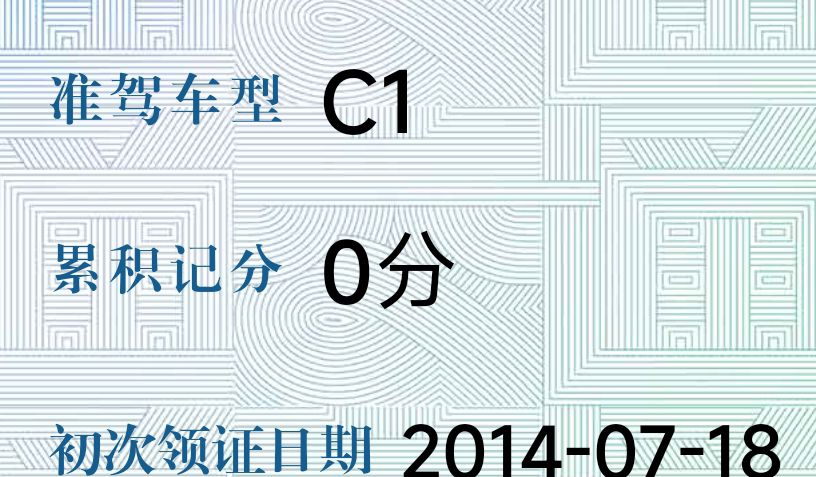

### 现在驾照还考手动挡C1的，真是和自己过不去，货拉拉都是电车了

Made by ngapost2md (c) ludoux [GitHub Repo](https://github.com/ludoux/ngapost2md)

----

##### 0.[0] \<pid:0\> 2023-12-05 12:35:23 by 陈kun盘饭\(中国\)
之前还能安慰自己说考个C1，将来家境落魄了，去开小货车。结果最近搬家发现，现在货拉拉全都是绿牌电车了。。。。

想起单位里有个小伙子，当初不听我们劝，非要考C1，不考C2，觉得考C1才是男人。结果科目二挂了一次，科目三挂了一次，最后花的钱比考C2自动挡还多。。。。

最搞笑的是，后面他又去提了个比亚迪的宋Plus DMI。。。。买电车考个鬼的手动挡啊？现在我们每次唠嗑都打趣他，这小伙子自己也觉得自己亏。。

----

##### 2.[145] \<pid:730664919\> 2023-12-05 12:41:13 by 肉丸团子\(上海\)
我可以不开，但不能不会

----

##### 3.[101] \<pid:730665167\> 2023-12-05 12:42:38 by wjsdhl\(福建\)
别人乐意学c1，就学呗，这有什么好嘲讽的
而且别人不缺时间，多学一项技能又不碍事

----

##### 4.[13] \<pid:730665191\> 2023-12-05 12:42:46 by 我怎么知道叫名字\(甘肃\)
钱都掏了，结果少一项。亏了，必须赚回来

----

##### 5.[116] \<pid:730665344\> 2023-12-05 12:43:40 by 呆毛王我是9s不是naizi\(浙江\)
觉得考c1没用的一般来说都是考不出c1的
就c1这种难度不都是满分一遍过？这还能过不去啊

----

##### 6.[16] \<pid:730665357\> 2023-12-05 12:43:44 by Gondors\(河北\)
C1可能是你为数不多体验手动挡乐趣的时候了

----

##### 7.[10] \<pid:730665405\> 2023-12-05 12:43:59 by 地堡男孩约瑟夫\(陕西\)
开货车养家警告

----

##### 8.[0] \<pid:730665564\> 2023-12-05 12:44:50 by wintermanxp\(安徽\)
我周围还有人去增驾c6照了，实际用不到，

但是有句古话，技多不压身。

----

##### 9.[0] \<pid:730665613\> 2023-12-05 12:45:11 by 丞相抡大锤\(浙江\)
>[jump](#pid730664919) 肉丸团子(2023-12-05 12:41) 说: 
>
>我可以不开，但不能不会

十几年前学的C1驾照，现在可以说完全不会开手动挡了，肯定要重学

----

##### 10.[0] \<pid:730665636\> 2023-12-05 12:45:18 by NiaoH\(福建\)
确实C2速通啊，各城市驾考难度不一样，尤其是科三;科二也因为车型不同，可能难开可能顺的不行，如果挂一次，那时间成本完全亏了

----

##### 11.[2] \<pid:730665756\> 2023-12-05 12:45:54 by 他妻负我i\(山东\)
手动就这么难么？

----

##### 12.[0] \<pid:730665861\> 2023-12-05 12:46:29 by Ros-toc\(中国\)
电动车多钱，二手破面包子多钱。

----

##### 13.[13] \<pid:730665953\> 2023-12-05 12:46:53 by zkgjg2000cn\(中国\)
学个c1不代表会开手动挡。不买个车开两年，等于没学

----

##### 14.[0] \<pid:730666122\> 2023-12-05 12:47:52 by 弦系W心\(北京\)
说个搞笑的，今年学完车，同事问我学车没搞个对象，我说我学的 C1 女的学的少

----

##### 15.[0] \<pid:730666196\> 2023-12-05 12:48:20 by 不黑的乌鸦\(吉林\)
同样的钱，我都是一次过，为什么要学C2？C2能用的场景C1都能用，C2却不能

----

##### 16.[0] \<pid:730666227\> 2023-12-05 12:48:31 by 紫洐环水\(河南\)
可是手动挡驾照便宜一千块钱呢，自动挡3500，手动2500

----

##### 17.[1] \<pid:730666312\> 2023-12-05 12:48:58 by 梦中人\(上海\)
学习能力强的无所谓，反正所有科目都是一把过，没差别。

----

##### 18.[0] \<pid:730666701\> 2023-12-05 12:51:05 by Ros-toc\(中国\)
B站搜索，关键词：

狗子41天考出C1驾照

----

##### 19.[0] \<pid:730666757\> 2023-12-05 12:51:17 by 灼离之魂\(新疆\)
学C1怎么了？

我认为可以不开，但不能不会

再加上，手动挡又不是多难……

----

##### 20.[4] \<pid:730666876\> 2023-12-05 12:52:00 by 灵梦的小茶杯\(黑龙江\)
手动确实是比自动难点，多了个对离合的掌握，坡起也更难，没需求确实可以考C2，但确实有有需求的人，现在是没啥手动挡车了，但二手车市场还是有不少的，省的那点钱可能真的就是很多人过不去的坎，以己度人没有必要。
当然也有我这种手动爱好者，就是觉得好玩，高速我也喜欢自动档开着自适应巡航当甩手掌柜，大堵车也喜欢自动挡的简单操作，但我通勤路上车况还算凑合这种时候我就喜欢开那个手动挡玩，相信也有其他人有这种爱好。
都知道吃鱼最方便是去饭店点，但你也不能说去钓鱼的都是和自己过不去吧？

----

##### 21.[3] \<pid:730666995\> 2023-12-05 12:52:46 by KonoAiluda\(上海\)
C1C2都挺简单的，真有人考不过去甩锅怪“难度高”吗？
_，就多练。

----

##### 22.[0] \<pid:730667212\> 2023-12-05 12:54:01 by BeRunRanRun\(陕西\)
多会一点总不会有坏处

----

##### 23.[1] \<pid:730667363\> 2023-12-05 12:54:52 by Muuse\(江苏\)
我那时候c1便宜啊 反正没啥难度 c2贵但人少 出来的快 10多年过去了 手动完全不会开了

----

##### 24.[0] \<pid:730667370\> 2023-12-05 12:54:54 by 卡克兰德\(山东\)
你觉得C1用不上考个C2我还能理解，觉得C1难考不过是什么心态？
C1都考不过真心还是别开车了 ，开车上路的事情比那点油门离合配合难多了。

----

##### 25.[0] \<pid:730667395\> 2023-12-05 12:55:02 by 李白再无酒醉\(山东\)
毕竟c1便宜有些人还是会省下那一部分费用的

----

##### 26.[3] \<pid:730667549\> 2023-12-05 12:55:56 by 小镇做题员\(中国\)
为将来开跑车打基础

----

##### 27.[0] \<pid:730667554\> 2023-12-05 12:55:58 by valkyrieran\(重庆\)
我也不知道，我学c2驾校就一个教练教，车也只有两台，就因为c1学费便宜几百块？

----

##### 28.[0] \<pid:730667855\> 2023-12-05 12:57:54 by yugoyugo\(北京\)
为啥我这边学驾照，C2比C1便宜

----

##### 29.[0] \<pid:730668332\> 2023-12-05 13:00:29 by 阴阙诗廷\(江苏\)
那些我可以不用，但不能不学的 平时也是开手动挡吗？要是长时间不用，也能立刻就开吗？

----

##### 30.[0] \<pid:730668350\> 2023-12-05 13:00:36 by 雪_夜\(辽宁\)
C1，然而考完驾照后再也没摸到过手动挡。
照这么说，除非以后发大财，上那种超跑扶着没机会摸手动挡了？
~~没看过超跑里面啥样，是手动挡么？不是就当我没说。~~

----

##### 31.[1] \<pid:730668468\> 2023-12-05 13:01:14 by 撒娇特别困难\(北京\)
>[jump](#pid730665613) 丞相抡大锤(2023-12-05 12:45) 说: 
>
>十几年前学的C1驾照，现在可以说完全不会开手动挡了，肯定要重学

我是06年的本，第一辆车是自动挡，后来分别在09年和15年开了几次手动挡，连金杯都开过，只能说驾轻就熟
只要驾校学车的时候不摸鱼不水课时
就跟学会骑自行车一样，不会忘的

----

##### 32.[0] \<pid:730668531\> 2023-12-05 13:01:38 by 前方止步\(安徽\)
>[jump](#pid730665613) 丞相抡大锤(2023-12-05 12:45) 说: 
>
>十几年前学的C1驾照，现在可以说完全不会开手动挡了，肯定要重学

去驾校学？

----

##### 33.[0] \<pid:730668536\> 2023-12-05 13:01:40 by 狩猎狂潮\(浙江\)
杭州几年前是c1便宜一点，现在不知道了

----

##### 34.[0] \<pid:730668888\> 2023-12-05 13:03:46 by 这是第六个号了\(北京\)
我这种恐惧驾驶的人，考科科二，科三手抖发抖最后也都是100分过的。不会挂挡的人反而才不适合开车吧

----

##### 35.[4] \<pid:730668940\> 2023-12-05 13:04:02 by 魈の狗\(江西\)
上网上魔怔了属于，大家伙爱考啥考啥关你屁事

----

##### 36.[0] \<pid:730669460\> 2023-12-05 13:07:02 by 丞相抡大锤\(浙江\)
>[jump](#pid730668531) 前方止步(2023-12-05 13:01) 说: 
>
>去驾校学？

找师傅学啊，学个几堂课，油离配合换挡

----

##### 37.[1] \<pid:730669778\> 2023-12-05 13:08:53 by Danteror\(安徽\)
~~在意大利考驾照，还要学汽修呢。~~
之前，老岳父喝了酒，代驾不会开，只能我开咯。如果我也不会，大家不是大眼瞪小眼？
现在车有啥毛病，也是靠着当年在意大利考驾照时学的那点汽修知识凑合用的。
多个很容易学到技能可能没用，但用到时没有，就很尴尬

----

##### 38.[0] \<pid:730669976\> 2023-12-05 13:10:07 by mar159mot\(浙江\)
无所谓，认识好多人科目三就是最后一次摸方向盘的
拿完驾照就再没开过车的

----

##### 39.[1] \<pid:730669989\> 2023-12-05 13:10:12 by zone5\(广西\)
觉得自己不会开上手动挡选C2很正常，考C1挂了几次后悔不考C2是什么思路？C1科目二科目三我都一把过的，真的很难吗

----

##### 40.[0] \<pid:730670068\> 2023-12-05 13:10:38 by 丞相抡大锤\(浙江\)
>[jump](#pid730668468) 撒娇特别困难(2023-12-05 13:01) 说: 
>
>我是06年的本，第一辆车是自动挡，后来分别在09年和15年开了几次手动挡，连金杯都开过，只能说驾轻就熟
>只要驾校学车的时候不摸鱼不水课时
>就跟学会骑自行车一样，不会忘的

吹吹自己牛逼就行了，别替别人吹，你这学了才3年怎么可能会忘，我刚学了两年还开过我爸厂里的皮卡呢，还学了招三挡起步，现在市场上已经几乎没有手动挡了，你上哪儿开去？又搁这儿什么学的时候没偷懒就肯定会，笑死个人，宛如泥潭某些人认为初中认真上课，就应该课本每一个字都记得

----

##### 41.[0] \<pid:730670478\> 2023-12-05 13:13:09 by qweasdzx156\(湖南\)
练习的车子多。
报名费便宜。
考了c1，可以直接开自动挡。
一次性过。

----

##### 42.[0] \<pid:730670528\> 2023-12-05 13:13:30 by Libra惊雷\(浙江\)
教练车都是电车了

----

##### 43.[0] \<pid:730670746\> 2023-12-05 13:14:48 by 月下の誓い\(浙江\)
c1挺简单的，不过太久没开过手动挡已经不会开了

----

##### 44.[2] \<pid:730671292\> 2023-12-05 13:18:13 by ccsffcscsf？\(山东\)
确实，虽然我是c1，但是平常家用车哪有手动挡的给你开，从考出来就只开自动的。你说大客大货，那得b和a，你c1也开不了。

----

##### 45.[0] \<pid:730671408\> 2023-12-05 13:18:56 by 撒娇特别困难\(北京\)
>[jump](#pid730670068) 丞相抡大锤(2023-12-05 13:10) 说: 
>
>吹吹自己牛逼就行了，别替别人吹，你这学了才3年怎么可能会忘，我刚学了两年还开过我爸厂里的皮卡呢，还学了招三挡起步，现在市场上已经几乎没有手动挡了，你上哪儿开去？又搁这儿什么学的时候没偷懒就肯定会，笑死个人，宛如泥潭某些人认为初中认真上课，就应该课本每一个字都记得

抱歉，现在给我辆手动我还能开
开手动用的是肌肉记忆不是脑子
你这个比喻就有点没脑子

----

##### 46.[0] \<pid:730671690\> 2023-12-05 13:20:51 by 猜火鸡\(广东\)
>[jump](#pid730664919) 肉丸团子(2023-12-05 12:41) 说: 
>
>我可以不开，但不能不会

我学的自动挡，但现在你让我开手动，我不会

----

##### 47.[0] \<pid:730671718\> 2023-12-05 13:21:01 by 奶茶老熊\(中国\)
你要记住布鲁斯学的是c1，再说c1也不难啊

----

##### 48.[0] \<pid:730671849\> 2023-12-05 13:21:51 by zkwcm108\(中国\)

对于有些人来说 C1和C2不存在任何难度差异。我为什么不选择适用面更广的。

----

##### 49.[0] \<pid:730672016\> 2023-12-05 13:22:50 by jj_vjj\(中国\)
我学的c1觉得还挺有意思的，考出来就没开过手动挡了，第一辆车也是自动挡

----

##### 50.[3] \<pid:730672331\> 2023-12-05 13:24:39 by 15704063429a\(湖北\)
嘲讽c1的都是脑子跟手脚不协调自己考不出来的，别人花自己钱爱考啥考啥，你们这些笨b至于一周几个帖子来反复絮絮叨叨为什么有人考c1吗？怎么地？承认自己蠢很难？

----

##### 51.[0] \<pid:730672338\> 2023-12-05 13:24:43 by lll521bb\(河北\)
光论难度来说，c2能比c1简单多少？c1这么简单的东西不是有手就行么

----

##### 52.[0] \<pid:730672385\> 2023-12-05 13:25:01 by 蹦哒的泵泵\(上海\)
手动也不难啊

----

##### 53.[0] \<pid:730672441\> 2023-12-05 13:25:18 by 飘飘去兮\(河南\)
我自己学的c1，但是我已经劝了三个人学c2了，学费一样，学起来轻松加愉快，一个多月驾照到手。就难度来说c2绝对比c1简单的多，而且以后都是自动挡了，学c1还有毛用。

----

##### 54.[0] \<pid:730672560\> 2023-12-05 13:26:03 by 藤咲ウサ\(辽宁\)
我还认识的直接考b2的呢，10年了也没看他用过b2照。。

----

##### 55.[3] \<pid:730673093\> 2023-12-05 13:29:25 by awets\(江西\)
我c1一遍过，但是身边有人要考驾照的我都是推荐考c2因为以后大家买车都是买自动档的，落后的手动档只会越来越少最后彻底淘汰掉

----

##### 56.[0] \<pid:730673954\> 2023-12-05 13:34:35 by 肖鹤云\(上海\)
可能对于你来说C1太难了吧，才会有这么多想法
对于我来说反正都是一遍过，c1便宜一点，适用范围更大，有啥理由要c2的证？

----

##### 57.[1] \<pid:730674056\> 2023-12-05 13:35:08 by sinoiyuki311\(贵州\)
泥潭精英是民航都随便学的，你和他们讲这些

----

##### 58.[0] \<pid:730674180\> 2023-12-05 13:35:53 by 歼殖人\(中国\)
>[jump](#pid730665344) 呆毛王我是9s不是naizi(2023-12-05 12:43) 说: 
>
>觉得考c1没用的一般来说都是考不出c1的
>就c1这种难度不都是满分一遍过？这还能过不去啊

我考的是C1，别人学车我都劝C2，将来你就是逃生都遇不到手动挡老爷车给你开。

----

##### 59.[1] \<pid:730674395\> 2023-12-05 13:37:07 by 宝崽饭二五仔\(浙江\)
这种话题隔几天就要说一次，不过早就有公论啦，现实中越失败的人越喜欢强调c1的重要性

----

##### 60.[1] \<pid:730674570\> 2023-12-05 13:38:13 by 丞相抡大锤\(浙江\)
>[jump](#pid730671408) 撒娇特别困难(2023-12-05 13:18) 说: 
>
>抱歉，现在给我辆手动我还能开
>开手动用的是肌肉记忆不是脑子
>你这个比喻就有点没脑子

你无非就想装个逼，说学了C1十几年了不会开手动的都是当初学的时候摸鱼的？被我点破了就搁这儿骂别人没脑子？素质是真差，人也是真急

----

##### 61.[0] \<pid:730674579\> 2023-12-05 13:38:17 by xiangjiangqiqi\(上海\)
我当时学车报的也是C1，小姐姐可多了，我那个驾校女的比难得多~

----

##### 62.[0] \<pid:730674784\> 2023-12-05 13:39:27 by 此生不换AA\(中国\)
你这就何不食肉糜了，多去小城市看看，甚至大城市手动挡都不少，我之前在重庆呆了一个多月，每天打几次滴滴，每天基本都有一到两辆是手动的

----

##### 63.[0] \<pid:730674833\> 2023-12-05 13:39:46 by 马盖普\(上海\)
我是后悔考c2的，早知道考驾照这么简单我就去考c1了，反正差不多价钱，最多就多学个半个月

----

##### 64.[0] \<pid:730674877\> 2023-12-05 13:40:00 by 老子真的是个小仙女\(澳大利亚\)
如果你只是要驾照，平时开车上下班出去玩做个代步的，那c2最好，因为学习快上手快
你想要驾驶乐趣的，喜欢开车，那就c1

----

##### 65.[1] \<pid:730674939\> 2023-12-05 13:40:22 by 舍长的173\(江苏\)
拿了五六年驾照从没开过手动挡，结果今年公司给配的手动自己拿着车在园区练两小时已经得心应手了

----

##### 66.[0] \<pid:730675109\> 2023-12-05 13:41:24 by Tazdingo\(山东\)
末日情节吧，而且手动档会让司机对车的加减速原理有更深的认识。哪天需要开朋友车、公司车了，也能直接上手。说白了就是从复杂到简单是降维操作，反过来就根本不会。  既然学为啥不一步到位呢，多会点不是坏事

----

##### 67.[0] \<pid:730675359\> 2023-12-05 13:42:58 by 不高兴儿\(上海\)
有没有可能，我可以不用，但是我不能不会？

----

##### 68.[0] \<pid:730675697\> 2023-12-05 13:44:59 by 双刀野风\(河北\)
>[jump](#pid730665344) 呆毛王我是9s不是naizi(2023-12-05 12:43) 说: 
>
>觉得考c1没用的一般来说都是考不出c1的
>就c1这种难度不都是满分一遍过？这还能过不去啊

我当年学的c1，但是我也觉得c1没啥用

----

##### 69.[0] \<pid:730675810\> 2023-12-05 13:45:39 by gfyourself\(广东\)
C1可以帮领导开车

----

##### 70.[1] \<pid:730675868\> 2023-12-05 13:45:57 by 舔舔舔舔舔pr\(江苏\)
现在也没有什么必须开c1的环境了吧

公司的公车都是电车了，我自己的也是电车，我爸的也是油自动，身边一圈亲戚朋友同事都是自动，学c1真的就是安慰自己学得多了

----

##### 71.[0] \<pid:730675919\> 2023-12-05 13:46:17 by 撒娇特别困难\(北京\)
>[jump](#pid730674570) 丞相抡大锤(2023-12-05 13:38) 说: 
>
>你无非就想装个逼，说学了C1十几年了不会开手动的都是当初学的时候摸鱼的？被我点破了就搁这儿骂别人没脑子？素质是真差，人也是真急

看给孩子乐的，你高兴就好

----

##### 72.[0] \<pid:730675978\> 2023-12-05 13:46:39 by 理查德亚雷斯\(浙江\)
不就是你考不过c1只能考c2么，至于这么嘲笑别人，谁说学的东西一定要用的上的，这么功利你学高数干什么，反正生活中也用不上

----

##### 73.[0] \<pid:730676033\> 2023-12-05 13:46:59 by a2534276991\(陕西\)
当年学车时候 C1便宜啊 谁和钱过不去

----

##### 74.[0] \<pid:730676202\> 2023-12-05 13:47:59 by 神秘观察者Xeon\(陕西\)
我不但考c1我还考了d，你气不气。

----

##### 75.[1] \<pid:730676616\> 2023-12-05 13:50:23 by zyfc007\(重庆\)
只为了能开车的话，现在不图省钱的话学C1纯粹是闲的慌。
浪费时间浪费精力。有这时间干点啥不比跟离合较劲舒服。
科技在发展，现在C1是一点用都没有。落后的东西慢慢被淘汰是很正常的。

----

##### 76.[0] \<pid:730676886\> 2023-12-05 13:51:57 by muziyufeng\(山东\)
每个人喜好不一样，只要有手动档车，那c1就有存在的必要。
C2确实省事，根据自己选择。

----

##### 77.[1] \<pid:730676900\> 2023-12-05 13:52:02 by zyfc007\(重庆\)
>[jump](#pid730675978) 理查德亚雷斯(2023-12-05 13:46) 说: 
>
>不就是你考不过c1只能考c2么，至于这么嘲笑别人，谁说学的东西一定要用的上的，这么功利你学高数干什么，反正生活中也用不上

学高数是为了考试拿毕业证。
考试不考高数你看有几个人会学。

----

##### 78.[0] \<pid:730677093\> 2023-12-05 13:53:12 by 不可不信\(浙江\)
套用网上的一句老话:
C1C2都可以，但请记住，布鲁斯考的C1

----

##### 79.[0] \<pid:730677930\> 2023-12-05 13:57:49 by 雪灰尘\(浙江\)
>[jump](#pid730665756) 他妻负我i(2023-12-05 12:45)说:
>手动就这么难么？

只是C1证肯定不难，但是相比C2那肯定是要难一些的毕竟多一个离合

----

##### 80.[0] \<pid:730677990\> 2023-12-05 13:58:06 by yuyinghao6\(广东\)
真的会有新手会去买手动挡的二手车？

----

##### 81.[0] \<pid:730678096\> 2023-12-05 13:58:47 by 顾久01\(浙江\)
考C1更便宜一点，给家里省点钱

----

##### 82.[0] \<pid:730678727\> 2023-12-05 14:02:11 by taitoubiyan1\(广东\)
C2点比C1贵1000
但是c1多学了两天车，考试多排了4个小时…
觉得自己两天半时间值1000的还是选c2吧…c1反正我是一点没用上

----

##### 83.[0] \<pid:730679614\> 2023-12-05 14:07:23 by dingohigh\(中国\)
跟你用自动铅笔或者普通铅笔一样，多大点事

----

##### 84.[0] \<pid:730680212\> 2023-12-05 14:10:38 by 烨空\(辽宁\)
c1怎么了 
我动手能力可以
运动反射神经正常
大学毕业学习能力达标
我爱学啥学啥
我还有摩托票呢
我就爱挂档的感觉怎么了

----

##### 85.[0] \<pid:730680357\> 2023-12-05 14:11:26 by 马瑟伊尔\(四川\)
brz  mx5 不都需要手动

----

##### 86.[0] \<pid:730680619\> 2023-12-05 14:12:51 by 驴驴咪咪哒\(山东\)
现在驾校的车都有电车了。

新能源教练车。

----

##### 87.[0] \<pid:730682275\> 2023-12-05 14:22:14 by 呆毛王我是9s不是naizi\(浙江\)
>[jump](#pid730675697) 双刀野风(2023-12-05 13:44) 说: 
>
>我当年学的c1，但是我也觉得c1没啥用

c1确实没啥用 我c1考出来以后开家里的老手动一年多 然后立刻换自动 轻松程度堪比玩具车
从现在这个电车满地走的版本来看 c1和c2爱考哪个都行 反正一样开
但是觉得考c1是跟自己过不去那种人 多半缺乏点开车水准

----

##### 88.[0] \<pid:730682539\> 2023-12-05 14:23:45 by 亲指亲部\(中国\)
身体健康但C1考不过的都不配开车

----

##### 89.[0] \<pid:730682928\> 2023-12-05 14:25:52 by 艾露恩的和谐\(广东\)
c1又不难顺便考一个怎么了？有总比没有强

----

##### 90.[0] \<pid:730683093\> 2023-12-05 14:26:47 by 水溺的时光\(江西\)
我去考驾照是学新技能的，享受过程，自动哪有手动好玩，当然，要是只为了那个证自己能力不行还是C2吧，毕竟简单

----

##### 91.[0] \<pid:730683331\> 2023-12-05 14:28:08 by 蕭馨舞\(上海\)
十几年前我学的c1 一直开自动挡
现在我要再去学
我也不可能去学c2 我还是毫不犹豫选c1

----

##### 92.[0] \<pid:730684159\> 2023-12-05 14:32:50 by 他妻负我i\(山东\)
>[jump](#pid730677930) 雪灰尘(2023-12-05 13:57) 说: 
>
>只是C1证肯定不难，但是相比C2那肯定是要难一些的毕竟多一个离合

又便宜，又没啥难度，考就完了。。。油离配合，基本上一下午就能练成肌肉记忆

----

##### 93.[0] \<pid:730684539\> 2023-12-05 14:34:47 by 自引壶觞酌\(浙江\)
c2哪里来的脸嘲讽c1

就因为别人没考过多补考了几次，开货拉拉是为了节约用车成本倾向于电车，普通的公司用货车还是选择正常的油车手动挡更皮实耐用

----

##### 94.[0] \<pid:730684769\> 2023-12-05 14:36:12 by 萌萌人2333456\(西藏\)
冷知识，c2属于赛博残疾人证

----

##### 95.[0] \<pid:730685017\> 2023-12-05 14:37:37 by 只喷嘴贱的\(黑龙江\)
>[jump](#pid730669778) Danteror(2023-12-05 13:08) 说: 
>
>~~在意大利考驾照，还要学汽修呢。~~
>之前，老岳父喝了酒，代驾不会开，只能我开咯。如果我也不会，大家不是大眼瞪小眼？
>现在车有啥毛病，也是靠着当年在意大利考驾照时学的那点汽修知识凑合用的。
>多个很容易学到技能可能没用，但用到时没有，就很尴尬

Nga说你那玩意没用，你就别说话，憋着

----

##### 96.[0] \<pid:730685051\> 2023-12-05 14:37:50 by LIANQUKAN\(河南\)
不会吧不会考不过吧考不过还考急了

----

##### 97.[0] \<pid:730685707\> 2023-12-05 14:41:20 by 徒手接激流\(北京\)
我和朋友都学的C1，至今没体会到这万一到底有多难……

----

##### 98.[0] \<pid:730685902\> 2023-12-05 14:42:28 by 鲨鱼不再杀鱼\(浙江\)
不是 自己手脚不协调怪时代是吧

----

##### 99.[0] \<pid:730685981\> 2023-12-05 14:42:56 by %温柔的男人像海洋%\(江苏\)
可是我c1一遍过啊..你不想学那你考c2好了呗..而且学手动挡能够加深理解一些车辆传动系统的知识 我觉得挺好啊..

----

##### 100.[0] \<pid:730686633\> 2023-12-05 14:46:32 by berserker03\(中国\)
>[jump](#pid730668332) 阴阙诗廷(2023-12-05 13:00) 说: 
>
>那些我可以不用，但不能不学的 平时也是开手动挡吗？要是长时间不用，也能立刻就开吗？

完全可以，无缝切换，初期感觉一下离合深度就可以，完全没难度。

----

##### 101.[0] \<pid:730687201\> 2023-12-05 14:49:33 by 一劫倾城\(江苏\)
妈的，怎么隔三差五就他妈有人开贴嘲讽c1？
c1有嘲讽过c2？是不是也得发个帖子嘲讽考c2的是废物？
我想考啥考啥，你不会以为是因为差那点勾八学费才学的c1吧
我他妈10年前考的，大把的手动挡车子等着我开，有问题么？

----

##### 102.[0] \<pid:730687584\> 2023-12-05 14:51:40 by 流言蜚语113\(江苏\)
我们这c1比c2便宜

----

##### 103.[0] \<pid:730687805\> 2023-12-05 14:52:46 by 挥霍彩色的霓虹\(江苏\)
要是f1驾照一两千能考，我还想考呢

----

##### 104.[0] \<pid:730688010\> 2023-12-05 14:53:50 by ratalk1163\(北京\)
一样的时间为什么不考资格更多的

----

##### 105.[1] \<pid:730688313\> 2023-12-05 14:55:29 by 远离战场的咸鱼zZ\(山东\)
布鲁斯考的C1

----

##### 106.[0] \<pid:730688355\> 2023-12-05 14:55:42 by HeyBeeeeeeee\(中国\)
现在考C2的不都是因为C2比C1简单吗?有人以为自己以后用不上就不考C1的?如果C2跟C1难度一样,有人去考C2?

----

##### 107.[0] \<pid:730688443\> 2023-12-05 14:56:14 by 进击的氵瓜包\(北京\)
全都一遍过的，没感觉c1有啥难考的

----

##### 108.[0] \<pid:730688617\> 2023-12-05 14:57:09 by iamy0530\(陕西\)
我考的c1但是现在也不敢开自动挡啊，有啥用。

----

##### 109.[0] \<pid:730688848\> 2023-12-05 14:58:20 by 蝉鸣扉\(江苏\)
很多公司的公务用车还是手动挡，用不上是不存在的。不过还是看费用。

----

##### 110.[0] \<pid:730690134\> 2023-12-05 15:04:44 by 一个都别想跑\(中国\)
>[jump](#pid730674395) 宝崽饭二五仔(2023-12-05 13:37) 说: 
>
>这种话题隔几天就要说一次，不过早就有公论啦，现实中越失败的人越喜欢强调c1的重要性

6,本来不想说话默默的看这个帖子的热闹的。看到你这结论让我觉得你们考C2的不但自我安慰能力强还喜欢活在自己的世界里

----

##### 111.[0] \<pid:730690348\> 2023-12-05 15:05:43 by 劳动都是狗屎\(上海\)
c1d的路过

多覆盖一点有啥不好？

----

##### 112.[0] \<pid:730690716\> 2023-12-05 15:07:27 by 布雷啧啧啧\(广东\)
>[jump](#pid0) 陈kun盘饭(2023-12-05 12:35) 说: 
>
>之前还能安慰自己说考个C1，将来家境落魄了，去开小货车。结果最近搬家发现，现在货拉拉全都是绿牌电车了。。。。
>
>想起单位里有个小伙子，当初不听我们劝，非要考C1，不考C2，觉得考C1才是男人。结果科目二挂了一次，科目三挂了一次，最后花的钱比考C2自动挡还多。。。。
>
>最搞笑的是，后面他又去提了个比亚迪的宋Plus DMI。。。。买电车考个鬼的手动挡啊？现在我们每次唠嗑都打趣他，这小伙子自己也觉得自己亏。。

EPIC我领了150多个游戏，下载的就5个，玩通关的一个没有，但我还是乐此不疲的每周都领，

可以不玩，但不能没有，驾照也是一样，我知道新车手动挡几乎绝迹，但假如我要买二手车呢，二手车市场手动挡还是有很多的，多个选择面嘛

----

##### 113.[0] \<pid:730690917\> 2023-12-05 15:08:22 by 沉默中消逝\(新疆\)
还是有用的，比如单位用车一般都是手动挡，你要从事相关工作那还是C1稳妥。

----

##### 114.[0] \<pid:730691568\> 2023-12-05 15:11:37 by skdom\(北京\)
反正我爸这个超过三十年的老司机表示，现在有病才学C1
我当年还是纠结过一下的，我爸直接否了

----

##### 115.[3] \<pid:730693660\> 2023-12-05 15:21:29 by 绿色子龙\(广东\)

对于大部分人就是没用，杠啥杠

还拿什么单位车只有手动来杠的，我巴不得我开不了不用开呢，傻子才喜欢开单位手动车去工作当司机

----

##### 116.[0] \<pid:730693810\> 2023-12-05 15:22:17 by aim112233\(湖北\)
C1上手挖掘机秒懂。 男人的浪漫！

----

##### 117.[0] \<pid:730704054\> 2023-12-05 16:13:17 by 宝崽饭二五仔\(浙江\)
>[jump](#pid730690134) 一个都别想跑(2023-12-05 15:04)说:
>>[jump](#pid730674395) 宝崽饭二五仔(2023-12-05 13:37) 说: 
>>
>>这种话题隔几天就要说一次，不过早就有公论啦，现实中越失败的人越喜欢强调c1的重要性
>
>6,本来不想说话默默的看这个帖子的热闹的。看到你这结论让我觉得你们考C2的不但自我安慰能力强还喜欢活在自己的世界里

那你可猜错了，我有c1驾照。毕竟我学驾照那会儿家里还是手动挡的车。

我跟你的差别是，我不需要在这种地方找成就感

----

##### 118.[0] \<pid:730722842\> 2023-12-05 17:41:55 by 梦中人\(上海\)
>[jump](#pid730704054) 宝崽饭二五仔(2023-12-05 16:13) 说: 
>
>那你可猜错了，我有c1驾照。毕竟我学驾照那会儿家里还是手动挡的车。
>
>我跟你的差别是，我不需要在这种地方找成就感

有些人C1一把过，有些人C2还要补考……必须承认，人和人之间是有差距的。

----

##### 119.[0] \<pid:730723555\> 2023-12-05 17:45:52 by fl501\(四川\)
C1还行，亲身经历，10月9日考试科目一，今天刚拿的证，新鲜的，所有项目全部一遍过，说没难度有点装，但基本还是不太难的。
对了，我上班族，周末偶尔花时间去练一个小时，平时感冒发烧有事耽搁啥的就没练

----

##### 120.[0] \<pid:730728350\> 2023-12-05 18:12:25 by bigestv\(上海\)
>[jump](#pid730665191) 我怎么知道叫名字(2023-12-05 12:42) 说: 
>
>钱都掏了，结果少一项。亏了，必须赚回来

好像c2还更贵

