### 自从知道了包子大多数都有那种肉之后，生理不适了

Made by ngapost2md (c) ludoux [GitHub Repo](https://github.com/ludoux/ngapost2md)

----

##### 0.[0] \<pid:0\> 2023-12-05 14:17:09 by 你猜我在干嘛\(北京\)
上次吃包子吃的正香，被朋友说你还吃包子呢？都掺血脖子，我还那么血脖子是什么东西，百度完人都不好了。。。
貌似很多自助饺子也都是  

一句大多数都会掺血脖子给论坛包子人柱力急的。谁也没说不能吃，你们觉得没问题你们该吃吃就行了，也不用为自己的嘴巴打call。
还有的扯上经济了，可能泥潭人均上流人士吃的都是80一斤的包子吧

----

##### 1.[449] \<pid:730681803\> 2023-12-05 14:19:35 by 素年已逝\(浙江\)
要不转发点辛圣语录吧

----

##### 2.[0] \<pid:730681974\> 2023-12-05 14:20:28 by 逐风者的骄傲1988\(山东\)
所以我现在想吃啥基本都自己在家里做，网上视频教程一大堆，跟着做就行，如果去外面吃的话，那就啥也不要想，就当他是好食材，吃就行。

----

##### 3.[43] \<pid:730681999\> 2023-12-05 14:20:36 by Rageudream\(广东\)
所以我在外面一般吃馒头，想吃包子了让我爸妈买新鲜肉在家做给我吃，分量巨扎实吃两个就饱了

----

##### 4.[0] \<pid:730682118\> 2023-12-05 14:21:20 by 马策猪\(吉林\)
你可以自己包 
也可以买贵点的包子啊

----

##### 5.[80] \<pid:730682195\> 2023-12-05 14:21:49 by Juice_G\(四川\)
看了人肉叉烧包以后就再也不吃包子了。。。

----

##### 6.[196] \<pid:730682211\> 2023-12-05 14:21:55 by 熊班心\(中国\)
众所周知，一只猪不会只长血脖子

----

##### 7.[0] \<pid:730682252\> 2023-12-05 14:22:07 by fe8923232\(江苏\)
肉馅除非自己买肉做  外面的不敢吃    外面还有句话叫 好肉不做馅

----

##### 8.[0] \<pid:730682344\> 2023-12-05 14:22:40 by 真爱与腰子\(四川\)
我不想搜，能不能简单描述下。

----

##### 9.[6] \<pid:730682408\> 2023-12-05 14:23:04 by UID62523860\(北京\)
不是报纸就不错了

----

##### 10.[203] \<pid:730682466\> 2023-12-05 14:23:24 by 娘希匹114514\(浙江\)
多少只猪的血脖够你一人吃的啊，脑子是个好东西

----

##### 11.[71] \<pid:730682514\> 2023-12-05 14:23:38 by 生产队的驴\(山东\)
大多数干餐饮的进货的价格低廉程度是普通消费者无法想象的

----

##### 12.[2] \<pid:730682517\> 2023-12-05 14:23:39 by PeterRay\(陕西\)
在外面我吃包子只赤素包子

----

##### 13.[45] \<pid:730682570\> 2023-12-05 14:23:54 by 直接夹断\(广东\)
没见过饭店后厨洗碗吧

----

##### 14.[0] \<pid:730682700\> 2023-12-05 14:24:35 by 可达可达\(广西\)
是的，很多包子，混沌，有一些不良商家会去收血脖子，淋巴肉来做馅

----

##### 15.[0] \<pid:730682750\> 2023-12-05 14:24:49 by fe8923232\(江苏\)
>[jump](#pid730682466) 娘希匹114514(2023-12-05 14:23)说:
>多少只猪的血脖够你一人吃的啊，脑子是个好东西

猪肉不是只有用来做馅一个用途  

----

##### 16.[196] \<pid:730682780\> 2023-12-05 14:25:03 by 人活着就是为了大帝\(江苏\)
新版kfc肉鸡八条腿，咸鸭蛋放苏丹红，油条泡明矾？

----

##### 17.[0] \<pid:730682790\> 2023-12-05 14:25:06 by 蝉鸣扉\(江苏\)
产出量真的够消耗量？

----

##### 18.[6] \<pid:730682794\> 2023-12-05 14:25:08 by jokerpagan\(湖北\)
你朋友谁啊，说什么就是什么？

----

##### 19.[0] \<pid:730682850\> 2023-12-05 14:25:28 by 一一一者\(浙江\)
>[jump](#pid730682466) 娘希匹114514(2023-12-05 14:23) 说: 
>
>多少只猪的血脖够你一人吃的啊，脑子是个好东西

脑子是个好东西，不过实践更重要。你最好去实地了解下超市，菜场，和那些卖肉卖菜的商贩打好关系，就能知道那些猪肺，淋巴结最后都让谁买走了，单价2块一斤 平时买他们肉菜多这些垃圾甚至免费送。 你还能马上知道你家附近哪几个饭店的菜是干净卫生的
还有不是很新鲜的水果蔬菜，死鱼死虾等等。反正辣味能掩盖一切 ，喂给爱点外卖的肥宅最好了。
哦，还有某些网红品牌的后厨，哈哈  说难听点，大部分外卖都没肯德基麦当劳干净卫生

----

##### 20.[48] \<pid:730682890\> 2023-12-05 14:25:42 by 文苑南\(安徽\)
你再想想，包包子的手可能刚刚握住勾勾嘘嘘，也有可能刚刚抠过鼻孔。 还有炒菜，厨师可能刚刚亲过老板娘那里，然后一喷嚏全打在锅里

----

##### 21.[3] \<pid:730683087\> 2023-12-05 14:26:44 by 39岁大叔\(上海\)
我没这么多讲究，想吃就吃，不过确实遇到一个同事说不吃碎肉。我觉得可以理解，降低风险也没啥不好的。

----

##### 22.[0] \<pid:730683181\> 2023-12-05 14:27:18 by 蛋糕才不是可爱什么的\(中国\)
我在外包子都是吃素包子的

----

##### 23.[15] \<pid:730683248\> 2023-12-05 14:27:40 by sp2421051\(广西\)
生意好的包子铺，你想吃血脖肉可能都吃不到

现在这个肉价情况下，只能说包子铺用的不是最新鲜的肉 ，建议晚上八九点去菜市场看看猪肉摊，很多来收走的，你能说人家那肉有问题吗。别听风就是雨的，关心包子铺你还不如去关心开在小巷子里专门做外卖业务的外卖店的食材和卫生。

----

##### 24.[10] \<pid:730683281\> 2023-12-05 14:27:51 by 组我准灭团\(江苏\)
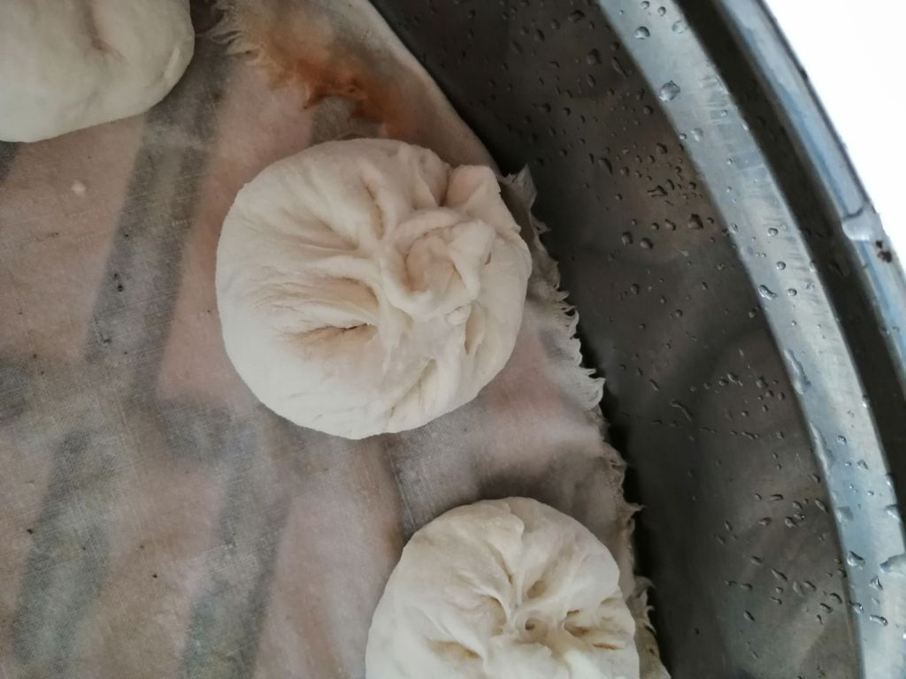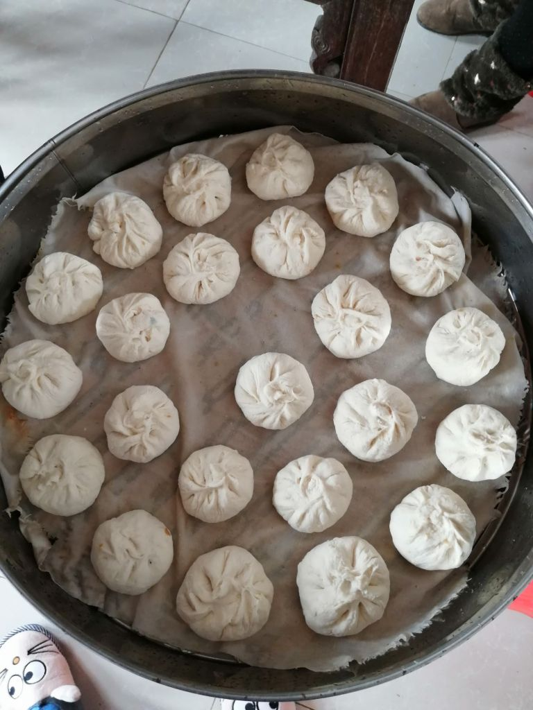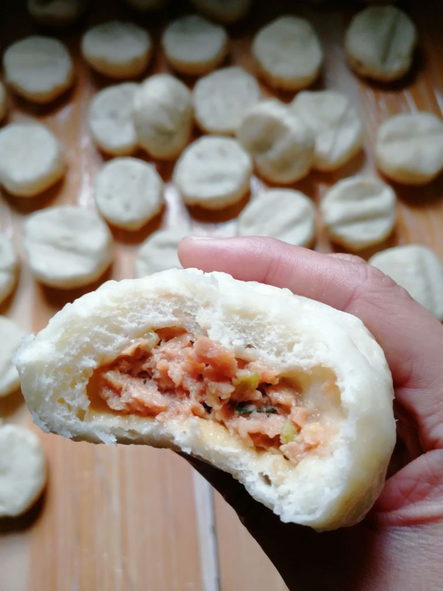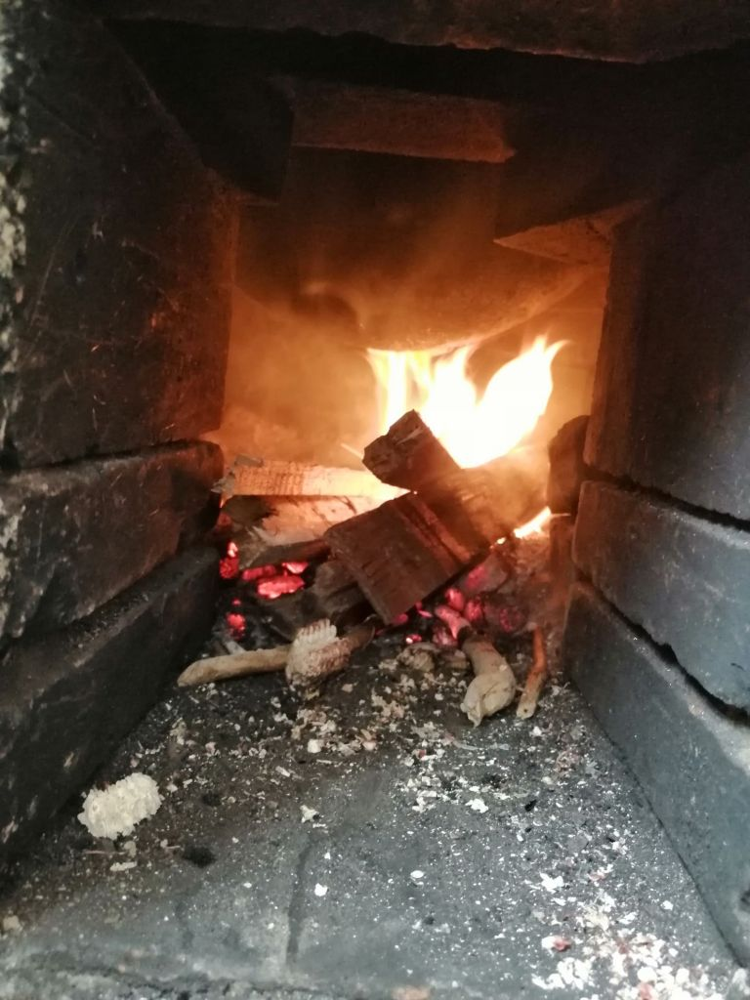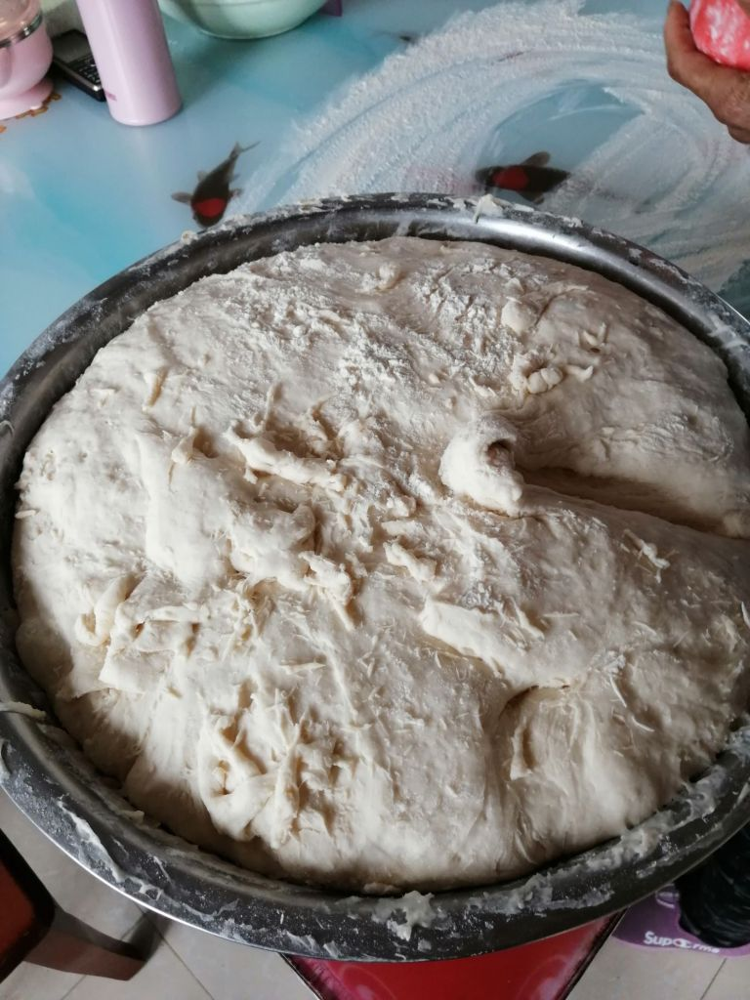肉包我家自己做

----

##### 25.[45] \<pid:730683675\> 2023-12-05 14:30:13 by 昭然若揭71\(浙江\)
建议再加上死老鼠肉，都是血脖子也讲得出口

----

##### 26.[0] \<pid:730683758\> 2023-12-05 14:30:42 by 言过一般形式\(广东\)
做成馅其实还好，只要价格便宜也不是不能买来吃，就怕烂肉卖高价

----

##### 27.[2] \<pid:730683770\> 2023-12-05 14:30:45 by 刘轩的声呐\(北京\)
还好，我吃的包子店老板自己也在吃，我觉得他应该没问题

----

##### 28.[3] \<pid:730683887\> 2023-12-05 14:31:25 by 核桃呵呵呵\(江苏\)
老鼠肉做的

----

##### 29.[0] \<pid:730684070\> 2023-12-05 14:32:24 by Lnnnnnl\(浙江\)
以前是有 现在大家也都知道哪家店好吃肉的口感好  放这种肉的店也就没有市场了

----

##### 30.[0] \<pid:730684228\> 2023-12-05 14:33:12 by qmaru512\(浙江\)
自己家做呗。 

泥潭一般都不信这个 说这些反应很大 因为很多人没时间没精力自己做

两眼一抹黑 吃呗 反正一时半会儿也没啥关系

在意的人 自己做最好

----

##### 31.[15] \<pid:730684450\> 2023-12-05 14:34:21 by 我像只鱼儿在你的核糖\(福建\)
这不挺好嘛，古早时期还有说用纸屑做馅儿呢。

----

##### 32.[18] \<pid:730684484\> 2023-12-05 14:34:28 by 爪子000\(上海\)
就我们公司门口那早餐铺的人数和每天那么多的销量，这种残次品的肉真的够用么？ 然后都开了4-5年了，感觉还不如买点正规点的，反正客源固定，价格又不便宜。 
不懂呢。。 准备干一票跑路，或者就指望不会出大问题。

----

##### 33.[0] \<pid:730684485\> 2023-12-05 14:34:28 by 你猜我在干嘛\(北京\)
>[jump](#pid730682466) 娘希匹114514(2023-12-05 14:23) 说: 
>
>多少只猪的血脖够你一人吃的啊，脑子是个好东西

哥们有脑子你就去后厨看一眼都懂了

----

##### 34.[87] \<pid:730684684\> 2023-12-05 14:35:40 by MMMMMMMTTT\(江苏\)
>[jump](#pid730684485) 你猜我在干嘛(2023-12-05 14:34) 说: 
>
>哥们有脑子你就去后厨看一眼都懂了

你有脑子警告2威望-8？

----

##### 35.[51] \<pid:730685206\> 2023-12-05 14:38:35 by 九散骛人\(陕西\)
打死辛吉飞这种傻逼是真的有必要的…人本来就没脑子，看把人霍霍成什么样子了

----

##### 36.[14] \<pid:730685391\> 2023-12-05 14:39:36 by 雨正前行\(广东\)
你担心这些不如担心后厨卫生，你只要在外面吃东西，就不要考虑这么多，不然五星酒店后厨一堆毛病

----

##### 37.[0] \<pid:730685410\> 2023-12-05 14:39:41 by luke4368\(广东\)
>[jump](#pid730682517) PeterRay(2023-12-05 14:23) 说: 
>
>在外面我吃包子只赤素包子

素包子你以为就安全了？保绿素了解下，没发现包子馅里面的菜都是特别绿的。

----

##### 38.[8] \<pid:730685619\> 2023-12-05 14:40:51 by 奶中之霸\(浙江\)
血脖子不够吃咋办

----

##### 39.[0] \<pid:730685683\> 2023-12-05 14:41:12 by 你猜我在干嘛\(北京\)
>[jump](#pid730684684) MMMMMMMTTT(2023-12-05 14:35) 说: 
>
>你有脑子警告2威望-8？

跟泥潭三观一致的人不会觉得自己有脑子吧？

----

##### 40.[9] \<pid:730686422\> 2023-12-05 14:45:23 by jx372225411\(江苏\)
你说这些肉不能吃，有没有更中医的理论？我只相信中医

----

##### 41.[13] \<pid:730686640\> 2023-12-05 14:46:35 by vijay-l\(上海\)
都是商品肉，不是你想象中开馒头店的需要去乡下收猪，后院宰杀的流程...商品肉都是有合格证的，你怀疑店家用肉不干净，你去举报好了，用烂肉，淋巴肉的生存、销售一条线上的人都去做大牢....

商家要便宜用走私肉就行了...用走私肉安全多了。

----

##### 42.[0] \<pid:730686741\> 2023-12-05 14:47:06 by 你猜我在干嘛\(北京\)
>[jump](#pid730685206) 九散骛人(2023-12-05 14:38) 说: 
>
>打死辛吉飞这种傻逼是真的有必要的…人本来就没脑子，看把人霍霍成什么样子了

你吃我推荐 是我我不吃 没脑子的一般都是先否定再验证吧

----

##### 43.[0] \<pid:730686817\> 2023-12-05 14:47:32 by 你猜我在干嘛\(北京\)
>[jump](#pid730686422) jx372225411(2023-12-05 14:45) 说: 
>
>你说这些肉不能吃，有没有更中医的理论？我只相信中医

谁说不能吃了？

----

##### 44.[30] \<pid:730687128\> 2023-12-05 14:49:11 by 橙子大德鲁伊\(四川\)
>[jump](#pid730685683) 你猜我在干嘛(2023-12-05 14:41)说:
>>[jump](#pid730684684) MMMMMMMTTT(2023-12-05 14:35) 说: 
>>
>>你有脑子警告2威望-8？
>
>跟泥潭三观一致的人不会觉得自己有脑子吧？

那你这人很神奇啊，你还在这论坛混干什么？找刺激哦

----

##### 45.[1] \<pid:730687211\> 2023-12-05 14:49:36 by 笨狮子马甲\(浙江\)
只能说现在食品安全工作还是有待进步。

网上瞎BB的人真的很多，我光是从一个正向UP主这里看到不少(拿瞎BB的开涮

线下实务监管也确实存在很多问题，我自己就是食安办成员之一，过两天又要凑一起开会讨论本县食品安全隐患问题。

----

##### 46.[0] \<pid:730687370\> 2023-12-05 14:50:21 by %温柔的男人像海洋%\(江苏\)
你去逛逛饭店后厨怕是要当场暴毙

----

##### 47.[10] \<pid:730687537\> 2023-12-05 14:51:24 by 休伯特三世\(湖北\)
不愧威望-8

----

##### 48.[0] \<pid:730687595\> 2023-12-05 14:51:44 by 环氧乙烯\(浙江\)
那种街边看着就不太干净的苍蝇早餐铺，就别指望给你用啥好肉了。那种连锁性质的早餐店应该还可以。

----

##### 49.[0] \<pid:730687610\> 2023-12-05 14:51:48 by bz121212\(浙江\)
我这里新开了一家加盟品牌的包子店，叫牛舌安，发面小笼包里面的肉非常少，我觉得应该是有保障的

----

##### 50.[10] \<pid:730687632\> 2023-12-05 14:51:54 by 九散骛人\(陕西\)
>[jump](#pid730686741) 你猜我在干嘛(2023-12-05 14:47) 说: 
>
>你吃我推荐 是我我不吃 没脑子的一般都是先否定再验证吧

看来你是真没脑子…没脑子的都是说啥信啥，还验证？

----

##### 51.[0] \<pid:730687940\> 2023-12-05 14:53:25 by 你猜我在干嘛\(北京\)
>[jump](#pid730687128) 橙子大德鲁伊(2023-12-05 14:49) 说: 
>
>那你这人很神奇啊，你还在这论坛混干什么？找刺激哦

和你们正威望的三观不一致=不能呆？

----

##### 52.[1] \<pid:730687999\> 2023-12-05 14:53:45 by 笨狮子马甲\(浙江\)
市场监管部门对食品安全的监管力度够不够不说，但是力量就这么点。

业务科室就没几个人，下面的站室又不一定拿食品安全当重点。

也就这么回事。。。。。

----

##### 53.[0] \<pid:730688092\> 2023-12-05 14:54:17 by 你猜我在干嘛\(北京\)
>[jump](#pid730687632) 九散骛人(2023-12-05 14:51) 说: 
>
>看来你是真没脑子…没脑子的都是说啥信啥，还验证？

你这id真的属于那种没脑子一挂的，甲流烧的？

----

##### 54.[0] \<pid:730688230\> 2023-12-05 14:55:02 by 你猜我在干嘛\(北京\)
>[jump](#pid730687610) bz121212(2023-12-05 14:51) 说: 
>
>我这里新开了一家加盟品牌的包子店，叫牛舌安，发面小笼包里面的肉非常少，我觉得应该是有保障的

大牌子的肉还是有保障，跟价格也相关

----

##### 55.[0] \<pid:730688382\> 2023-12-05 14:55:52 by 刘小备01\(广西\)
哪有纯肉给你吃啊，肉包子都是淋巴肉加大豆蛋白，问题是还不便宜呢。

----

##### 56.[0] \<pid:730688413\> 2023-12-05 14:56:03 by 他妻负我i\(山东\)
血脖肉？你还不如担心一下猪瘟肉。。。

----

##### 57.[0] \<pid:730688458\> 2023-12-05 14:56:20 by 你猜我在干嘛\(北京\)
>[jump](#pid730687537) 休伯特三世(2023-12-05 14:51) 说: 
>
>不愧威望-8

性别对立然后威望对立？流量你玩明白了，威望正的走路挺胸脯是吧？

----

##### 58.[0] \<pid:730688582\> 2023-12-05 14:57:02 by 笨狮子马甲\(浙江\)
事实上，按道理应该很好查才对。

一产现在不是都搞可追溯吗，后面市场监管不是搞索票索证吗。

就像查税一样，按道理想查都能查。。。。。

可惜可追溯牛皮吹的响当当，索票索证也没搞起来。。。。。

我就吐槽一下，就跟社保一样，大家只知道100块和1万块，然后就没有然后了。。。。

----

##### 59.[14] \<pid:730688638\> 2023-12-05 14:57:15 by 不辞而别凛凛鸦\(山东\)
>[jump](#pid730682850) 一一一者(2023-12-05 14:25) 说: 
>
>脑子是个好东西，不过实践更重要。你最好去实地了解下超市，菜场，和那些卖肉卖菜的商贩打好关系，就能知道那些猪肺，淋巴结最后都让谁买走了，单价2块一斤 平时买他们肉菜多这些垃圾甚至免费送。 你还能马上知道你家附近哪几个饭店的菜是干净卫生的
>还有不是很新鲜的水果蔬菜，死鱼死虾等等。反正辣味能掩盖一切 ，喂给爱点外卖的肥宅最好了。
>哦，还有某些网红品牌的后厨，哈哈  说难听点，大部分外卖都没肯德基麦当劳干净卫生

傻逼，我干过三年雨润销售，你知道啥叫37啥叫55，82吗？看过几个小作文就在这胡扯了。

----

##### 60.[6] \<pid:730688775\> 2023-12-05 14:57:56 by 迪勒卢姆\(江苏\)
带节奏的狗是真的多，是不是好肉一吃就能吃出来，吃不出的话，我只能说下次稍微买好一些的吃吃看。

----

##### 61.[0] \<pid:730688885\> 2023-12-05 14:58:32 by pollyms\(河北\)
顶多是边角料

----

##### 62.[3] \<pid:730688978\> 2023-12-05 14:58:59 by UID5323662\(中国\)
>[jump](#pid730682408) UID62523860(2023-12-05 14:23) 说: 
>
>不是报纸就不错了

利用陈年假新闻，带得一个好节奏

----

##### 63.[13] \<pid:730689065\> 2023-12-05 14:59:29 by 棘になる\(日本\)
你是猪吗 连好肉差肉的区别都吃不出来

----

##### 64.[5] \<pid:730689101\> 2023-12-05 14:59:38 by 臭臭小猫\(中国\)
脑子是个好东西。。。。

你知道肉馅类的食品有多少？？

都是脖子肉？哪来的这么多脖子？？？

只能说，有一部分不良商家做的，可能是用这种不好的肉。

而且你嘴巴用来干嘛的，吃不出来？
如果真吃不出来，那说明其实也没啥大问题。。。

----

##### 65.[0] \<pid:730689260\> 2023-12-05 15:00:28 by auauaust\(辽宁\)
你再想想餐馆的蟑螂、老鼠 是不是觉得又能吃了？

----

##### 66.[1] \<pid:730689793\> 2023-12-05 15:03:12 by 龘～\(中国\)
你朋友是谁啊，他说什么就是什么

----

##### 67.[0] \<pid:730689828\> 2023-12-05 15:03:24 by 你猜我在干嘛\(北京\)
>[jump](#pid730689101) 臭臭小猫(2023-12-05 14:59) 说: 
>
>脑子是个好东西。。。。
>
>你知道肉馅类的食品有多少？？
>
>都是脖子肉？哪来的这么多脖子？？？
>
>只能说，有一部分不良商家做的，可能是用这种不好的肉。
>
>而且你嘴巴用来干嘛的，吃不出来？
>如果真吃不出来，那说明其实也没啥大问题。。。

你脑子吃的出来也不至于当时一起抵制老坛酸菜吧？不愧是泥潭

----

##### 68.[5] \<pid:730689859\> 2023-12-05 15:03:33 by kytezz\(河南\)
扯蛋呢  挑稍微档次好点的包子点
那包子肉吃进嘴里第一口就知道是不是血脖子肉了
因为档次好点的包子店都是用刀切肉馅 不会那么稀碎 进嘴里有口感
如果是血脖子肉你根本嚼不烂的
正常肉粒有颗粒感口感

----

##### 69.[0] \<pid:730689892\> 2023-12-05 15:03:44 by huganggood\(四川\)
不是纸壳子？

----

##### 70.[0] \<pid:730689982\> 2023-12-05 15:04:02 by 你猜我在干嘛\(北京\)
>[jump](#pid730689065) 棘になる(2023-12-05 14:59) 说: 
>
>你是猪吗 连好肉差肉的区别都吃不出来

你是猪吗 连老坛酸菜的酸菜和脚的味道都吃不出来？

----

##### 71.[0] \<pid:730690098\> 2023-12-05 15:04:36 by 笨狮子马甲\(浙江\)
>[jump](#pid730689260) auauaust(2023-12-05 15:00) 说: 
>
>你再想想餐馆的蟑螂、老鼠 是不是觉得又能吃了？

餐馆最基本的三防。。。。老鼠没这么容易出现

----

##### 72.[14] \<pid:730690102\> 2023-12-05 15:04:37 by 阿尔芭\(四川\)
感觉经济上来以后，也有老美那种反智主义的苗头了

别说普通人几乎不讲科学与常识，我老婆生物系毕业、还年年拿奖学金那种，现在都基本没啥理性思维和科学常识
听到风就是雨，一惊一乍的

----

##### 73.[0] \<pid:730690147\> 2023-12-05 15:04:46 by UID6310125\(江苏\)
肉包子的馅百分之八十和包子皮的成分一样，没你们想象得这么可怕。

----

##### 74.[0] \<pid:730690222\> 2023-12-05 15:05:07 by BloodVoodoo\(北京\)
外面少吃肉啊，吃贵的

----

##### 75.[0] \<pid:730690599\> 2023-12-05 15:06:48 by savo1981\(辽宁\)
正规饭店和商超问题倒是不大，我原来就干相关行业，但是肉馅尽量自己买肉自己搅是对的再正规的也不会把最好的肉做肉馅来卖这个你是不用怀疑的，没淋巴没血就很好了

----

##### 76.[3] \<pid:730690620\> 2023-12-05 15:06:55 by 艾瑞阿卡司\(浙江\)
>[jump](#pid730684684) MMMMMMMTTT(2023-12-05 14:35) 说: 
>
>你有脑子警告2威望-8？

也许做包子了？

----

##### 77.[0] \<pid:730690803\> 2023-12-05 15:07:49 by UID61490621\(重庆\)
自己包啊，前一天晚上发面，第二天调下馅包完直接进蒸锅，蒸半小时就出锅了。

----

##### 78.[0] \<pid:730690817\> 2023-12-05 15:07:55 by 我fuze今天要打人质局\(广西\)
我今天中午在外面吃粉，放的也是淋巴肉他剁成肉沫了，有一块没碎就像菜花一样，吃了快一年多，以后准备只吃素包子了

----

##### 80.[1] \<pid:730690874\> 2023-12-05 15:08:11 by workwo\(江西\)
>[jump](#pid730684485) 你猜我在干嘛(2023-12-05 14:34) 说: 
>
>哥们有脑子你就去后厨看一眼都懂了

我们这里的包子铺可以看到后厨…你早上6点去可以看到现场包…

----

##### 81.[9] \<pid:730690908\> 2023-12-05 15:08:20 by 棘になる\(日本\)
>[jump](#pid730689982) 你猜我在干嘛(2023-12-05 15:04) 说: 
>
>你是猪吗 连老坛酸菜的酸菜和脚的味道都吃不出来？

我不吃老坛酸菜 何况酸菜工序有几把口感差别
所以你逻辑水平逆天 消费水平低下 并且确实吃不出来好肉差肉
谢谢你的自我介绍

----

##### 82.[0] \<pid:730691179\> 2023-12-05 15:09:40 by UID62523860\(北京\)
>[jump](#pid730688978) UID5323662(2023-12-05 14:58)说:
>>[jump](#pid730682408) UID62523860(2023-12-05 14:23) 说: 
>>
>>不是报纸就不错了
>
>利用陈年假新闻，带得一个好节奏

大家都是假新闻

----

##### 83.[0] \<pid:730691183\> 2023-12-05 15:09:43 by Valano\(黑龙江\)
>[jump](#pid730682211) 熊班心(2023-12-05 14:21) 说: 
>
>众所周知，一只猪不会只长血脖子

有没有可能其他部位都不给大家吃呢

----

##### 84.[0] \<pid:730691492\> 2023-12-05 15:11:12 by aidsheroin\(北京\)
有些底层人民吃饭省钱，买肉还专挑血脖买呢。亲身经历，2003年的经历，历久弥新。

----

##### 85.[7] \<pid:730691587\> 2023-12-05 15:11:44 by diguo1231\(浙江\)
>[jump](#pid730682252) fe8923232(2023-12-05 14:22) 说: 
>
>肉馅除非自己买肉做  外面的不敢吃    外面还有句话叫 好肉不做馅

瞎几把扯淡，我这很多肉丁馅的包子也是你淋巴肉做的？  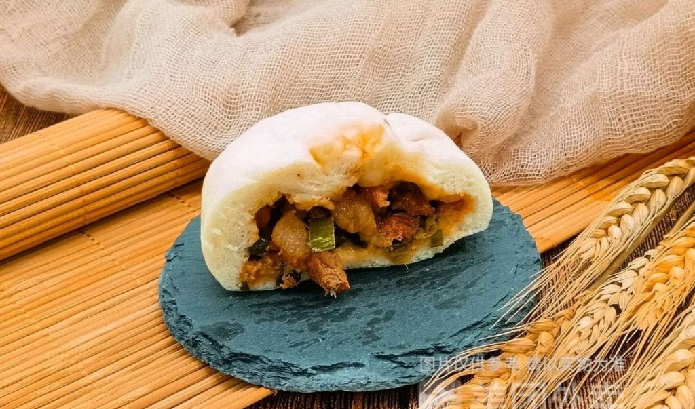

----

##### 86.[10] \<pid:730691619\> 2023-12-05 15:11:56 by 最爱米兰内洛1\(湖北\)
辛吉飞就是个傻逼，为了带货脸都不要了。坏的事情肯定有，但是绝对少数。喜欢犟的有本事全买进口货吧，不要买国内的

----

##### 87.[10] \<pid:730691706\> 2023-12-05 15:12:21 by sikiynight\(上海\)
>[jump](#pid730682850) 一一一者(2023-12-05 14:25)说:
>>[jump](#pid730682466) 娘希匹114514(2023-12-05 14:23) 说: 
>>
>>多少只猪的血脖够你一人吃的啊，脑子是个好东西
>
>脑子是个好东西，不过实践更重要。你最好去实地了解下超市，菜场，和那些卖肉卖菜的商贩打好关系，就能知道那些猪肺，淋巴结最后都让谁买走了，单价2块一斤 平时买他们肉菜多这些垃圾甚至免费送。 你还能马上知道你家附近哪几个饭店的菜是干净卫生的
>还有不是很新鲜的水果蔬菜，死鱼死虾等等。反正辣味能掩盖一切 ，喂给爱点外卖的肥宅最好了。
>哦，还有某些网红品牌的后厨，哈哈  说难听点，大部分外卖都没肯德基麦当劳干净卫生

为什么被你说的好像肯德基麦当劳后厨卫生很差似的...你在外面吃饭，起码90%的馆子后厨没这俩干净
还肉铺...菜场肉摊一天能卖两头猪算生意好的了，能有多少烂肉血脖子卖给包包子的啊？何况肉贩子从屠宰场拿到的就是胴体净肉，你专门买淋巴肉他都不一定有。包包子的放着便宜合法的国库肉不买，满世界找肉摊收罗烂肉是吧...多大瘾啊，费这个劲？
脑子真是个好东西...

----

##### 88.[0] \<pid:730691770\> 2023-12-05 15:12:39 by kotori_yoshino\(江苏\)
只有肉？你以为面就是好面？菜就新鲜？油不是地沟油？盐不是粗盐？水没被污染？有没有加精肉粉？

----

##### 89.[0] \<pid:730691779\> 2023-12-05 15:12:42 by listrey0722\(广东\)
周末自己包了冻起来吧，拿出来蒸也很方便，不想自己做就买大品牌速冻。

----

##### 90.[1] \<pid:730691809\> 2023-12-05 15:12:49 by 昔兰尼的风\(云南\)
辛吉飞你也逛泥潭啊？

----

##### 91.[0] \<pid:730691884\> 2023-12-05 15:13:09 by yelin619\(内蒙古\)
我在外面吃包子现在也试着去点素的了，东北这边很多包子店的素馅都是人工当天做的馅儿(东北的素馅包子确实好吃，花样太多了)。

----

##### 92.[1] \<pid:730691949\> 2023-12-05 15:13:32 by HeyBeeeeeeee\(中国\)
大多数?
你吃了几个包子啊? 你跟你朋友挺合得来的,千万别断了

----

##### 93.[0] \<pid:730692139\> 2023-12-05 15:14:24 by ken-mic\(广东\)
有专门配送这些肉的， 就是打好一包一包，送到包子和小笼包等这样的店。。。

有敢用的， 有不敢用的。

----

##### 94.[0] \<pid:730692420\> 2023-12-05 15:15:37 by wangyp000\(上海\)
肉馒头不安全，菜馒头也不安全。
那豆沙馒头，萝卜丝馒头，黑洋酥馒头呢？

----

##### 95.[0] \<pid:730692675\> 2023-12-05 15:16:47 by hzfyzf\(广东\)
附近市场最大肉摊，一天至少30几只猪，那些很烂的边角料最后都被肠粉铺包子铺收走了，你问我为啥知道，因为我爹和他们家几兄弟很熟，有几次回来顺路还帮送过，所以我爹妈从来不吃外面的肉馅食品

----

##### 96.[1] \<pid:730692745\> 2023-12-05 15:17:09 by 電波中毒ガール\(北京\)
对对对 你飞哥说什么就是什么

----

##### 97.[0] \<pid:730692843\> 2023-12-05 15:17:42 by lvbenan\(重庆\)
亲眼看到过卖包子的商家去买肉，都是没人要的边角料，肉贩子囤积后打包卖的，2块一斤

----

##### 99.[0] \<pid:730693193\> 2023-12-05 15:19:23 by 你猜我在干嘛\(北京\)
>[jump](#pid730690908) 棘になる(2023-12-05 15:08) 说: 
>
>我不吃老坛酸菜 何况酸菜工序有几把口感差别
>所以你逻辑水平逆天 消费水平低下 并且确实吃不出来好肉差肉
>谢谢你的自我介绍

啊？你如果吃过老坛酸菜你死点啥？
工序太多，所以可以无所谓？不愧是你啊，跪的太久起不来了

----

##### 100.[0] \<pid:730693356\> 2023-12-05 15:20:07 by 百花胜香\(浙江\)
不是自己种的菜，不是自己养的家禽的肉，你吃的下去？

----

##### 101.[0] \<pid:730694176\> 2023-12-05 15:24:09 by 你猜我在干嘛\(北京\)
>[jump](#pid730690908) 棘になる(2023-12-05 15:08) 说: 
>
>我不吃老坛酸菜 何况酸菜工序有几把口感差别
>所以你逻辑水平逆天 消费水平低下 并且确实吃不出来好肉差肉
>谢谢你的自我介绍

什么推理大师啊？现实里唯唯诺诺，骑到脸上也不敢反驳一句的爆种，精神却一直在胜利的二次元宅男靠靠边吧，网上装逼真没人爱搭理你

----

##### 102.[0] \<pid:730694289\> 2023-12-05 15:24:48 by 一切只剩下随缘\(湖北\)
>[jump](#pid730692420) wangyp000(2023-12-05 15:15) 说: 
>
>肉馒头不安全，菜馒头也不安全。
>那豆沙馒头，萝卜丝馒头，黑洋酥馒头呢？

也不安全，白面馒头加了漂白剂，萝卜也是臭的烂的菜市场垃圾堆捡的，玉米馒头加了黄色素
这类话我听了30年

----

##### 103.[6] \<pid:730697495\> 2023-12-05 15:40:37 by 棘になる\(日本\)
>[jump](#pid730694176) 你猜我在干嘛(2023-12-05 15:24) 说: 
>
>什么推理大师啊？现实里唯唯诺诺，骑到脸上也不敢反驳一句的爆种，精神却一直在胜利的二次元宅男靠靠边吧，网上装逼真没人爱搭理你

你还在自我介绍呢
怎么不转进一下什么孝急典绷

----

##### 104.[4] \<pid:730697976\> 2023-12-05 15:42:46 by 琥珀琥珀\(广东\)
结论是包子不如吃预制菜的？

----

##### 105.[5] \<pid:730698014\> 2023-12-05 15:42:58 by 棘になる\(日本\)
>[jump](#pid730694176) 你猜我在干嘛(2023-12-05 15:24) 说: 
>
>什么推理大师啊？现实里唯唯诺诺，骑到脸上也不敢反驳一句的爆种，精神却一直在胜利的二次元宅男靠靠边吧，网上装逼真没人爱搭理你

这么现实这么社会 有本事来我面前证明一下呀
这可是你的逻辑哦 不接你可成废物咯

东京大学驹场校区 你别不来嗷

----

##### 106.[0] \<pid:730698231\> 2023-12-05 15:44:08 by 冉晶\(北京\)
正常啊，人家预制菜也要赚钱的。反正僵尸肉也便宜

----

##### 107.[0] \<pid:730698398\> 2023-12-05 15:44:53 by 莔莔的闪闪\(辽宁\)
包子店不都是纸壳剁馅吗

----

##### 108.[2] \<pid:730698697\> 2023-12-05 15:46:21 by 爇尽水沉烟\(河北\)
你这帖子浏览量已经够判你造谣罪了

----

##### 109.[0] \<pid:730699697\> 2023-12-05 15:51:25 by 爱上太阳的月\(中国\)
包子只买菜包……

----

##### 110.[5] \<pid:730700227\> 2023-12-05 15:53:53 by 九散骛人\(陕西\)
>[jump](#pid730688092) 你猜我在干嘛(2023-12-05 14:54) 说: 
>
>你这id真的属于那种没脑子一挂的，甲流烧的？

开始攻击ID了，你有脑子不会连ID都看不懂，纯傻逼，不愧是警告2威望-8，还扯别人对立你？你但凡披着人皮是个人生的也不至于混成这样

----

##### 111.[0] \<pid:730700352\> 2023-12-05 15:54:31 by 熊班心\(中国\)
>[jump](#pid730691183) Valano(2023-12-05 15:09) 说: 
>
>有没有可能其他部位都不给大家吃呢

那你就买不到肉包子了，全中国大大小小的饭店，餐馆，早餐店都要血脖肉，把猪脖子全砍了也来不及

----

##### 112.[0] \<pid:730700490\> 2023-12-05 15:55:13 by goodzrll\(江苏\)
我只吃素包子，肉的都是自己家里做

----

##### 113.[0] \<pid:730700647\> 2023-12-05 15:55:59 by 水水水玖子\(福建\)
无所谓，能活一天是一天

----

##### 114.[6] \<pid:730700748\> 2023-12-05 15:56:29 by 紫狱啊\(江苏\)
这种言论一看就是辛小子

----

##### 115.[0] \<pid:730700861\> 2023-12-05 15:57:04 by w673111061\(北京\)
死猪肉，母猪肉等，包子，饺子，甚至鱼丸里面的馅，就没有好肉。现在有更高端的做法了，买进口冻肉来加工

----

##### 116.[0] \<pid:730701694\> 2023-12-05 16:01:12 by mayiyiyia\(中国\)
说产量跟不上的人没病吧，脑子秀逗了，你们感觉肉类产品里包子啥的占比很多吗？

----

##### 117.[0] \<pid:730701943\> 2023-12-05 16:02:28 by 陈年老冰峰\(山东\)
>[jump](#pid730682211) 熊班心(2023-12-05 14:21) 说: 
>
>众所周知，一只猪不会只长血脖子

众所周知，猪肉也不是只有被小店拿去包包子一个用途。

----

##### 118.[0] \<pid:730703331\> 2023-12-05 16:09:49 by 熊班心\(中国\)
>[jump](#pid730701943) 陈年老冰峰(2023-12-05 16:02) 说: 
>
>众所周知，猪肉也不是只有被小店拿去包包子一个用途。

不太清楚你想表达什么
肉包子馅，70%都是面粉，30%的肉里可能掺杂部分血脖子
既然出去吃，就闭着眼睛吃，想安全就在家吃
五星级酒店的餐具你知道怎么洗的吗？只是有些地方看不到想不到罢了

----

##### 119.[0] \<pid:730703656\> 2023-12-05 16:11:29 by 拉各斯时光\(湖南\)
白天下班去菜市场买菜的时候碰到过楼上说的那种情况

看到老板从台面下面拿出一大袋子一看就是提前准备好的肉卖给顾客

而且自己去某些饺子店和小笼包店吃过那种嚼不烂的肉

好大一坨，肥肉不像肥肉，很克苏鲁的那种小块小块肥肉堆叠在一起

另外呢，其实很多小店每天用肉的量并不多啊

起码我去吃过的店子，老板一天也就那么一小盆肉在那里包饺子包小笼包什么的

而且那一盆里面应该还放了其他配料

----

##### 120.[10] \<pid:730703754\> 2023-12-05 16:11:57 by dige416\(天津\)
你们家门口的包子铺厨房不是敞开的吗？剁肉馅的时候看不到吗？在菜市场买哪个铺面的菜和肉一次都没碰到过吗?
天天搁这听风就是雨呢，有这闲心下楼蹲几次买食材的人不就都知道了。

----

##### 121.[0] \<pid:730703948\> 2023-12-05 16:12:49 by JoyceJodie\(上海\)
可以不吃

----

##### 122.[0] \<pid:730703964\> 2023-12-05 16:12:52 by 半神氏\(中国\)
央视农业和中国食品报联合创作的[动一动餐饮界的奶酪，详解什么是淋巴肉-哔哩哔哩] [url](https://b23.tv/PK3wH7C)

----

##### 123.[0] \<pid:730704292\> 2023-12-05 16:14:34 by 陈年老冰峰\(山东\)
>[jump](#pid730703331) 熊班心(2023-12-05 16:09) 说: 
>
>不太清楚你想表达什么
>肉包子馅，70%都是面粉，30%的肉里可能掺杂部分血脖子
>既然出去吃，就闭着眼睛吃，想安全就在家吃
>五星级酒店的餐具你知道怎么洗的吗？只是有些地方看不到想不到罢了

我也不知道你想表达什么。
人家发帖说小店包子用血脖，你来一句猪身上不只有血脖。
你这脑沟回正常人拐不过来。

----

##### 124.[0] \<pid:730705693\> 2023-12-05 16:21:23 by 烎奣\(河南\)
要不说是条狗都得托生到百京呢

----

##### 125.[1] \<pid:730705726\> 2023-12-05 16:21:33 by 棘になる\(日本\)
>[jump](#pid730704292) 陈年老冰峰(2023-12-05 16:14) 说: 
>
>我也不知道你想表达什么。
>人家发帖说小店包子用血脖，你来一句猪身上不只有血脖。
>你这脑沟回正常人拐不过来。

人家没说小店哦 人家说包子全是淋巴肉

----

##### 126.[0] \<pid:730706254\> 2023-12-05 16:24:07 by 相约去青楼\(北京\)
淋巴肉量少麻烦，狐狸肉量大管够~

----

##### 127.[0] \<pid:730706631\> 2023-12-05 16:25:38 by garybchen\(广东\)
要么就吃叉烧包呗

----

##### 128.[0] \<pid:730707143\> 2023-12-05 16:27:59 by chr5409\(广东\)
额，实话实说，这年头建议自己做吃的，真心完爆外面买的……

但大多数人太懒，无解

----

##### 129.[0] \<pid:730709481\> 2023-12-05 16:38:21 by 抱走loli\(广东\)
>[jump](#pid730706254) 相约去青楼(2023-12-05 16:24)说:
>淋巴肉量少麻烦，狐狸肉量大管够~

又不是只有淋巴，其他切下来的边边角角加起来也不少的，加上其他好肉拌匀搞定，和做包子的做了快30年邻居没买过他家一个肉包

----

##### 130.[0] \<pid:730710461\> 2023-12-05 16:43:08 by 么么么凹\(上海\)
还得是泥潭
前几楼终结比赛 自己做包子 叫家人包包子
各位社会精英敢吃喝嫖赌但是不敢吃外面的包子()
还有“说难听点，大部分外卖都没肯德基麦当劳干净卫生”
说句实话就是几乎没有店比K和M干净呀
多看看什么营养师的视频估计各位精英都要饿死了

----

##### 131.[0] \<pid:730721209\> 2023-12-05 17:33:43 by 你的眼泪背叛了你的心\(广西\)
是的，搞得我也不吃肉包子，怕有淋巴肉

----

##### 132.[0] \<pid:730722746\> 2023-12-05 17:41:30 by xxoo2021\(辽宁\)
这个是真的，我一个朋友家里开饭店，肉馅都是买肉瘤子

----

##### 133.[0] \<pid:730722983\> 2023-12-05 17:42:44 by evilmeteor\(中国\)
我家附近的几家早餐铺
能开20多年不倒
我觉得人家完全不值当用辣鸡肉砸招牌
往纯肉馅里加白菜胡萝卜都比加垃圾肉靠谱

----

##### 134.[0] \<pid:730723230\> 2023-12-05 17:44:06 by 忍者Q太郎\(浙江\)
现在的猪肉很便宜，冻猪肉更便宜。

今天的新闻

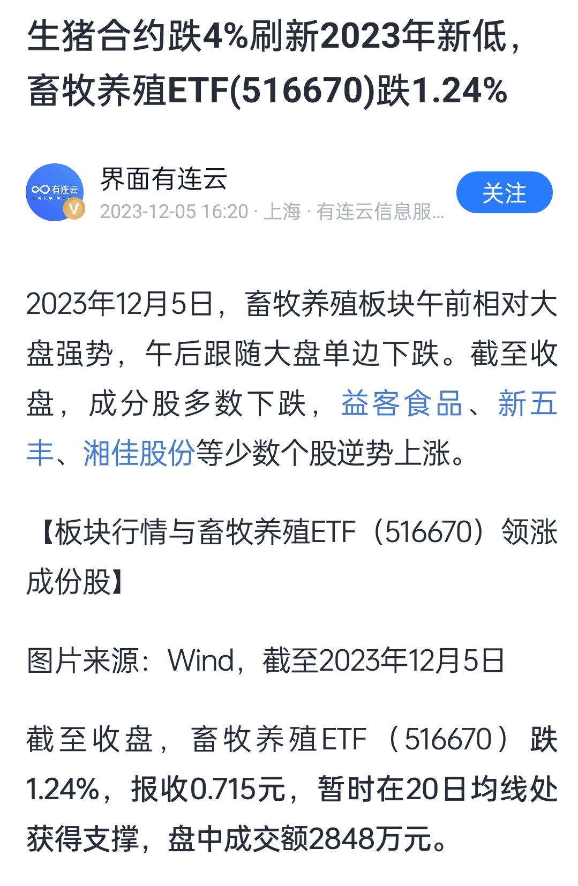

----

##### 135.[0] \<pid:730723334\> 2023-12-05 17:44:40 by CHNZerokiller\(上海\)
一般肉调过色的不吃，大概率有乱七八糟的。

----

##### 136.[0] \<pid:730723465\> 2023-12-05 17:45:20 by 紫月小三\(浙江\)
我外面轻易不吃 带馅的···

----

##### 137.[0] \<pid:730724114\> 2023-12-05 17:48:45 by eleman\(上海\)
带节奏的技术不行啊
“那种肉”

----

##### 138.[0] \<pid:730724207\> 2023-12-05 17:49:17 by 哆利的拥抱\(广东\)
没想到泥潭辛圣教徒这么多。

----

##### 139.[0] \<pid:730724292\> 2023-12-05 17:49:55 by 六锤审判者\(湖南\)
在外一般是吃素包子菜包子

----

##### 140.[0] \<pid:730724657\> 2023-12-05 17:51:56 by 摆马亡子\(山东\)
肉陷问题不评价。当年地沟油的版本肯定不干净，这几年应该也没几家那种专门收下脚料的店了
不过腆个逼脸指责别人吃不出好肉烂肉，这下真是泥潭版本的何不食肉糜了
老痰酸菜这个例子反驳的好，逼得泥潭精英只能“我不吃酸菜”了

----

##### 141.[0] \<pid:730725526\> 2023-12-05 17:56:44 by linghufen\(浙江\)
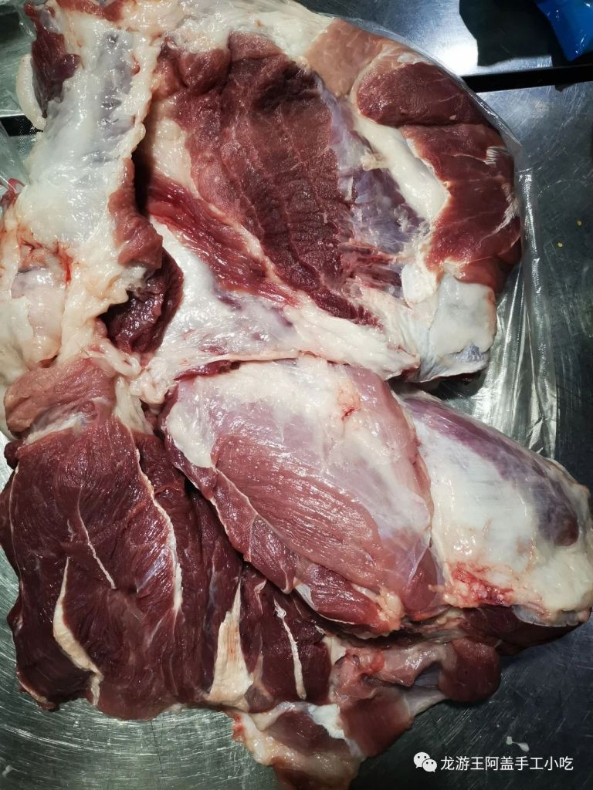
作为餐饮从业者，我们这边只采购整块的猪肉，让卖猪肉的到店里加工。其实好的猪肉还是能吃出来的，肉馅的口感会好很多，然后就是那种调料味很重的包子馅，大部分都是需要用调料去掩盖猪肉本身的味道。

----

##### 142.[1] \<pid:730725732\> 2023-12-05 17:57:54 by L11-123\(海南\)
知道的越多往往不会快乐

----

##### 143.[0] \<pid:730726435\> 2023-12-05 18:01:36 by 猴子蜀黍\(北京\)
主要是现在外面卖的包子也不好吃

自己和面技术还得练 我自己发面发不好

----

##### 144.[1] \<pid:730726934\> 2023-12-05 18:04:11 by mantouc\(湖北\)
自己味觉天生差的是理解不了别人的，据我观察至少有30%的人天生差。
那种肉真给人吃，什么油酱辣都不行的，别说包子了，哪还会再买。
大多数包子铺做熟客生意的。

----

##### 145.[10] \<pid:730727332\> 2023-12-05 18:06:28 by 划水的水牛\(广西\)
什么傻逼玩意，没做过菜还是没出过门？只有包子是用肉馅的？照你的理论来说饺子/馄饨/烧麦/肉丸/馅饼/锅贴这些常见的成品/半成品都是淋巴肉是吧？饭店里面的狮子头/麻婆豆腐/豆腐泡等等常见菜都不能吃了是吧？

楼上有一个算一个信这种谣言的都是傻卵！大家都是做餐饮的商人，怎么就卖包子的最贪心最没下限？卖饺子的人就很有良心用好肉是吧？！

对事不对人都不懂还跳出来当小丑？奸商用烂肉以次充好不奇怪，没人保证市面上所有的肉馅都是好的，但是只盯着包子输出是玩自欺欺人？是不是骂了包子你们就可以安心吃其它肉馅类食物了？

----

##### 146.[0] \<pid:730728089\> 2023-12-05 18:11:02 by BellaClaire\(湖南\)
用血脖肉淋巴肉的口感上明显能尝出来的

有是确实有，我吃到过好几次，但吃到过的店我就再也不会去了。

----

##### 147.[0] \<pid:730728101\> 2023-12-05 18:11:05 by hello小德\(湖北\)
先不说是不是
至少你的味觉不会骗你
好肉坏肉你尝的出来

----

##### 148.[0] \<pid:730728518\> 2023-12-05 18:13:18 by 柳灬梦璃\(北京\)
>[jump](#pid730682466) 娘希匹114514(2023-12-05 14:23)说:
>多少只猪的血脖够你一人吃的啊，脑子是个好东西

这还一大堆人点赞呢？人家不会血脖子做馅，好肉做烤肉？

----

##### 149.[0] \<pid:730729346\> 2023-12-05 18:18:18 by woixiao\(辽宁\)
马桶这里那都是高消费阶层哪吃过苍蝇馆子的包子
反正我是见过包子铺老板去菜市场拿淋巴肉

----

##### 150.[0] \<pid:730730037\> 2023-12-05 18:22:22 by 棘になる\(日本\)
>[jump](#pid730724657) 摆马亡子(2023-12-05 17:51) 说: 
>
>肉陷问题不评价。当年地沟油的版本肯定不干净，这几年应该也没几家那种专门收下脚料的店了
>不过腆个逼脸指责别人吃不出好肉烂肉，这下真是泥潭版本的何不食肉糜了
>老痰酸菜这个例子反驳的好，逼得泥潭精英只能“我不吃酸菜”了

原来老坛酸菜的分辨难度和淋巴肉是一样的哦
那在你嘴里应该生的熟的荤的素的都没啥区别
你都这样了我是得让让你

----

##### 151.[0] \<pid:730732456\> 2023-12-05 18:36:01 by 熊班心\(中国\)
>[jump](#pid730704292) 陈年老冰峰(2023-12-05 16:14) 说: 
>
>我也不知道你想表达什么。
>人家发帖说小店包子用血脖，你来一句猪身上不只有血脖。
>你这脑沟回正常人拐不过来。

啊对对对，点赞的都是脑回沟有问题
开心了吗？

----

##### 152.[2] \<pid:730732976\> 2023-12-05 18:38:51 by 暗黑之雨\(甘肃\)
好赖肉都吃不出来的话已经不是有没有脑子能解释的了

----

##### 153.[0] \<pid:730734688\> 2023-12-05 18:48:55 by maxandwell\(广东\)
超市的肉馅儿也吃不得吗

----

##### 154.[0] \<pid:730735613\> 2023-12-05 18:54:43 by 往生堂二代堂主\(广东\)
死刑处死的人那么多

也没见把你给处死啊

----

##### 155.[0] \<pid:730736257\> 2023-12-05 18:58:24 by fanboshi\(广东\)
那么高要求可以去找那些很多包头鬼佬吃饭的清真饭店，清真肉类标准相当麻烦，违规后果也很麻烦，关键是比较贵。。。
所以拿的出清真进货单的店，食品安全问题一般都比较可信
何况现在很多小餐厅根本就是当着你面包饺子包子的，到底是什么情况只要有心都能看到
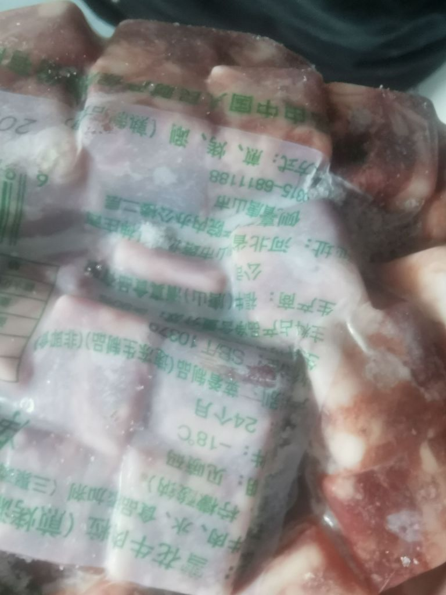

----

##### 156.[0] \<pid:730736564\> 2023-12-05 19:00:18 by maobear008\(广东\)
在外面不太敢吃带馅儿的，除非是老字号

----

##### 157.[0] \<pid:730737542\> 2023-12-05 19:06:29 by 莲花争霸\(辽宁\)
>[jump](#pid730682466) 娘希匹114514(2023-12-05 14:23) 说: 
>
>多少只猪的血脖够你一人吃的啊，脑子是个好东西

我擦 那血脖算好的喽

----

##### 158.[0] \<pid:730739408\> 2023-12-05 19:18:18 by cc11ww22\(河北\)
>[jump](#pid730682466) 娘希匹114514(2023-12-05 14:23) 说: 
>
>多少只猪的血脖够你一人吃的啊，脑子是个好东西

中国的生猪屠宰和存栏量多到你无法想象。
一只猪只有一条尾巴吧，你见断货过吗？

----

##### 159.[0] \<pid:730739848\> 2023-12-05 19:21:05 by 大兴安岭超级绿\(广东\)
自己吃吃不出差异？

----

##### 160.[0] \<pid:730740299\> 2023-12-05 19:23:49 by bws_ne\(福建\)
怎么个大多数法？

----

##### 161.[0] \<pid:730740479\> 2023-12-05 19:24:50 by 别慌冷静\(重庆\)
也有很多包子铺用良心好肉的，一杆子打翻一船人

----

##### 162.[0] \<pid:730741652\> 2023-12-05 19:32:02 by 不爱吃饭饭桶君\(广东\)
五花肉一斤也就十块钱左右。

----

##### 163.[0] \<pid:730742370\> 2023-12-05 19:36:21 by Lonpoo\(广东\)
买菜包花卷馒头就行了

----

##### 164.[0] \<pid:730743383\> 2023-12-05 19:42:38 by 风之舞丶\(广东\)
>[jump](#pid730682850) 一一一者(2023-12-05 14:25) 说: 
>
>脑子是个好东西，不过实践更重要。你最好去实地了解下超市，菜场，和那些卖肉卖菜的商贩打好关系，就能知道那些猪肺，淋巴结最后都让谁买走了，单价2块一斤 平时买他们肉菜多这些垃圾甚至免费送。 你还能马上知道你家附近哪几个饭店的菜是干净卫生的
>还有不是很新鲜的水果蔬菜，死鱼死虾等等。反正辣味能掩盖一切 ，喂给爱点外卖的肥宅最好了。
>哦，还有某些网红品牌的后厨，哈哈  说难听点，大部分外卖都没肯德基麦当劳干净卫生

肯德基一直挺标准的吧

----

##### 165.[0] \<pid:730743458\> 2023-12-05 19:43:11 by 影子朮师\(辽宁\)
我看标题还以为你看的孙二娘呢

----

##### 166.[0] \<pid:730744847\> 2023-12-05 19:51:39 by 溜溜球919\(上海\)
这个人还会满地打滚，你们还这么配合它

----

##### 167.[0] \<pid:730745553\> 2023-12-05 19:56:27 by fenghuanzi01\(湖北\)
>[jump](#pid730682850) 一一一者(2023-12-05 14:25) 说: 
>
>脑子是个好东西，不过实践更重要。你最好去实地了解下超市，菜场，和那些卖肉卖菜的商贩打好关系，就能知道那些猪肺，淋巴结最后都让谁买走了，单价2块一斤 平时买他们肉菜多这些垃圾甚至免费送。 你还能马上知道你家附近哪几个饭店的菜是干净卫生的
>还有不是很新鲜的水果蔬菜，死鱼死虾等等。反正辣味能掩盖一切 ，喂给爱点外卖的肥宅最好了。
>哦，还有某些网红品牌的后厨，哈哈  说难听点，大部分外卖都没肯德基麦当劳干净卫生

    我偷偷告诉你，都被肯德基麦当劳买走了

----

##### 168.[0] \<pid:730745726\> 2023-12-05 19:57:45 by pmljy\(山东\)
很多宝子直接用肉丁的  反正到楼主嘴里就是科技与狠活

----

##### 169.[0] \<pid:730746973\> 2023-12-05 20:06:29 by 感觉还不错\(江苏\)
>[jump](#pid730683281) 组我准灭团(2023-12-05 14:27) 说: 
>
>[img]./mon_202312/05/-7Q192-jenvZdT3

分我点

----

##### 170.[0] \<pid:730747389\> 2023-12-05 20:09:24 by 你需要治疗么\(湖北\)
确实 我也觉得外面的包子虽然不是有问题的肉，但也不会给你用好肉。我去外面早餐吃带馅的一般都是素的，粉条豆腐韭菜的这种。

----

##### 171.[0] \<pid:730747722\> 2023-12-05 20:11:42 by 明天要结婚\(中国\)
也不全是血脖子，包子铺会去市场专门绞肉的地方去买馅，卖肉馅的有良心的就只用现成的37肉或者28肉(肥瘦比例)，这个肉是肉厂做好的一整块，50斤一袋，没良心的会收杀猪佬不要的刀口肉和淋巴肉，直接不洗冻硬绞碎加在肉馅里，有见过执法部门去抓过这类行为，再者就是绞肉房里的卫生，我反正是不吃肉馅包。
  当然也不乏有鲜肉馅的卫生材料都很好的，但是我不想去赌。

----

##### 172.[0] \<pid:730748122\> 2023-12-05 20:14:26 by 回城卷轴\(中国\)
我不爱吃包子，有时候吃个饺子，不过都在外面吃了，啥也不能细想。

----

##### 173.[0] \<pid:730748284\> 2023-12-05 20:15:17 by 鱼缸里的鱼\(广西\)
这帖子竟然有九页。。。 
只要经常买菜做饭的那个没看到餐饮业的人来收边角料。
当一块猪肉上面搭点肥的或者淋巴什么的，那个摊贩不是拿刀一割然后往旁边扔一堆，这些边角碎料被人收回去，因为不好洗，有的洗都不洗，直接搅碎做馅。
在我们这小地方，你要说监管，只要没人举报闹大，呵呵。

----

##### 174.[0] \<pid:730748951\> 2023-12-05 20:19:50 by 你猜我在干嘛\(北京\)
>[jump](#pid730698014) 棘になる(2023-12-05 15:42) 说: 
>
>这么现实这么社会 有本事来我面前证明一下呀
>这可是你的逻辑哦 不接你可成废物咯
>
>东京大学驹场校区 你别不来嗷

北京市朝阳区高碑店广场来吧，不来你是我孙子？

----

##### 175.[0] \<pid:730749043\> 2023-12-05 20:20:21 by 陈年老冰峰\(山东\)
>[jump](#pid730705726) 棘になる(2023-12-05 16:21) 说: 
>
>人家没说小店哦 人家说包子全是淋巴肉

所以你是在杠“全”喽？
啊对对对，你有赞！你真棒！

----

##### 176.[0] \<pid:730749074\> 2023-12-05 20:20:33 by 你猜我在干嘛\(北京\)
>[jump](#pid730698014) 棘になる(2023-12-05 15:42) 说: 
>
>这么现实这么社会 有本事来我面前证明一下呀
>这可是你的逻辑哦 不接你可成废物咯
>
>东京大学驹场校区 你别不来嗷

日本的啊？那没事了，一切都合理起来了

----

##### 177.[0] \<pid:730749137\> 2023-12-05 20:20:55 by 2019年入市\(湖北\)
别犟兄弟们，我看过做包子的后厨，从此只吃素包子

----

##### 178.[0] \<pid:730749157\> 2023-12-05 20:21:03 by asdawdawda\(浙江\)
傻逼也就这样了

----

##### 179.[0] \<pid:730749215\> 2023-12-05 20:21:25 by diablos9\(湖北\)
你找个卖猪肉的聊天问问他们平时下馆子去哪家就知道哪家用料好不好了，基本都是他们送的肉肉包子一般都不建议你吃 都是淋巴肉

----

##### 180.[0] \<pid:730749355\> 2023-12-05 20:22:17 by 你猜我在干嘛\(北京\)
>[jump](#pid730700227) 九散骛人(2023-12-05 15:53) 说: 
>
>开始攻击ID了，你有脑子不会连ID都看不懂，纯傻逼，不愧是警告2威望-8，还扯别人对立你？你但凡披着人皮是个人生的也不至于混成这样

别急啊哥们，设计院的废物找着工作了么

----

##### 181.[0] \<pid:730749474\> 2023-12-05 20:23:06 by 为何心事终虚化\(山东\)
>[jump](#pid730682517) PeterRay(2023-12-05 14:23) 说: 
>
>在外面我吃包子只赤素包子

+1……

----

##### 183.[0] \<pid:730750315\> 2023-12-05 20:28:57 by 你猜我在干嘛\(北京\)
>[jump](#pid730730037) 棘になる(2023-12-05 18:22) 说: 
>
>原来老坛酸菜的分辨难度和淋巴肉是一样的哦
>那在你嘴里应该生的熟的荤的素的都没啥区别
>你都这样了我是得让让你

哥们连老班该不该练的帖子不知道楼主在表达什么一直沉浸在自己的世界里跟别人辩论？被人点破直接不吱声了？
我确实有点被你这种sb拉到一个水平线了…

----

##### 184.[1] \<pid:730750632\> 2023-12-05 20:30:57 by shsjopdia\(河南\)
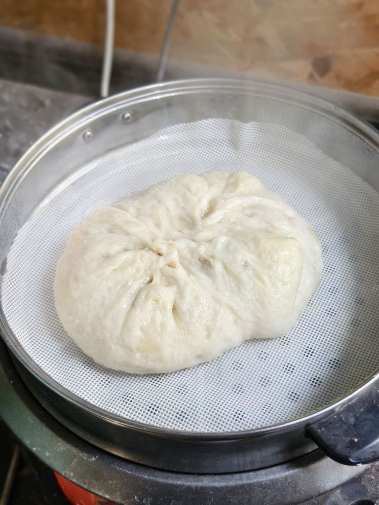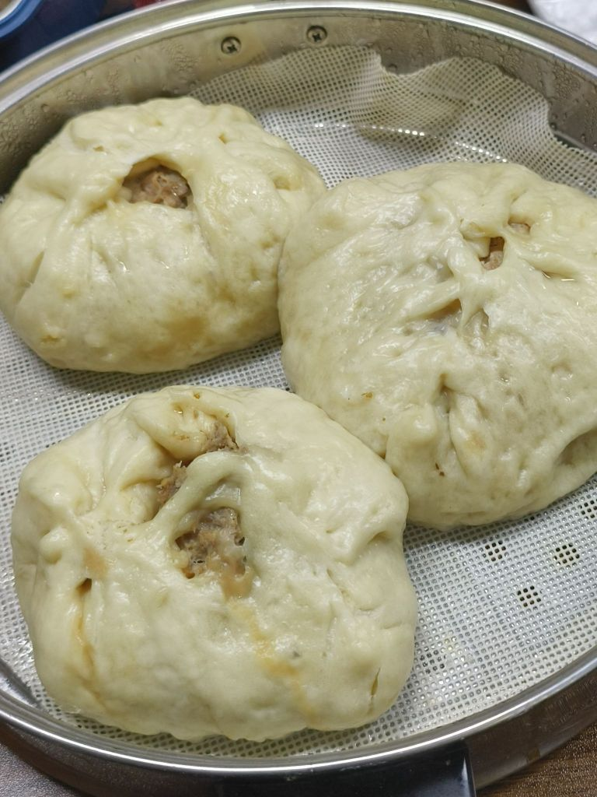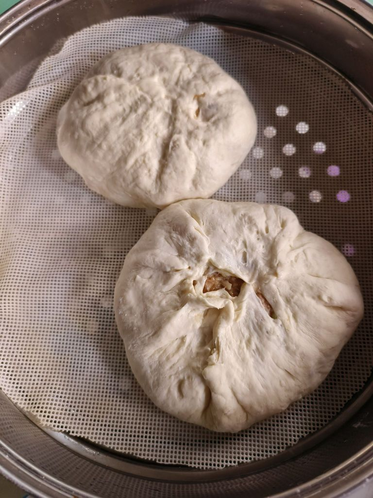自己包  哈哈哈

----

##### 185.[0] \<pid:730750688\> 2023-12-05 20:31:18 by 你猜我在干嘛\(北京\)
>[jump](#pid730697495) 棘になる(2023-12-05 15:40) 说: 
>
>你还在自我介绍呢
>怎么不转进一下什么孝急典绷

确实了，你吃过老坛酸菜死点什么吗日本富哥？不能就别装逼:我真没吃过老坛酸菜。
不过也能理解

----

##### 186.[0] \<pid:730750695\> 2023-12-05 20:31:20 by 十万7777\(山东\)
那你要看到给什么盒马宜家供果汁，给亨氏婴儿果泥代工的食品厂用的是多烂有多少霉点的苹果，那更刺激。

----

##### 187.[0] \<pid:730751745\> 2023-12-05 20:39:01 by 陈年老冰峰\(山东\)
>[jump](#pid730732456) 熊班心(2023-12-05 18:36) 说: 
>
>啊对对对，点赞的都是脑回沟有问题
>开心了吗？

难道你觉得没问题？

----

##### 188.[0] \<pid:730751802\> 2023-12-05 20:39:23 by 你猜我在干嘛\(北京\)
>[jump](#pid730750632) shsjopdia(2023-12-05 20:30) 说: 
>
>自己包  哈哈哈

真香啊看着

----

##### 189.[0] \<pid:730751875\> 2023-12-05 20:39:55 by 没什么bu好\(福建\)
还好我喜欢吃粉丝包 菜包 豆腐包

----

##### 190.[0] \<pid:730751994\> 2023-12-05 20:40:45 by Injune_kira\(广东\)
这玩意儿只有自己包的才敢吃。反正我爸妈从我有记忆开始，就教育我外面卖的包子里的肉馅千万别吃。一直导致我极其爱吃馒头和花卷

----

##### 191.[0] \<pid:730752172\> 2023-12-05 20:42:01 by 六点的彷徨\(四川\)
就跟火腿肠全部是病死猪肉一个道理，没那么多病死猪肉给你做火腿肠

----

##### 192.[0] \<pid:730752251\> 2023-12-05 20:42:36 by 星星到达的地方\(安徽\)
都是淋巴肉

