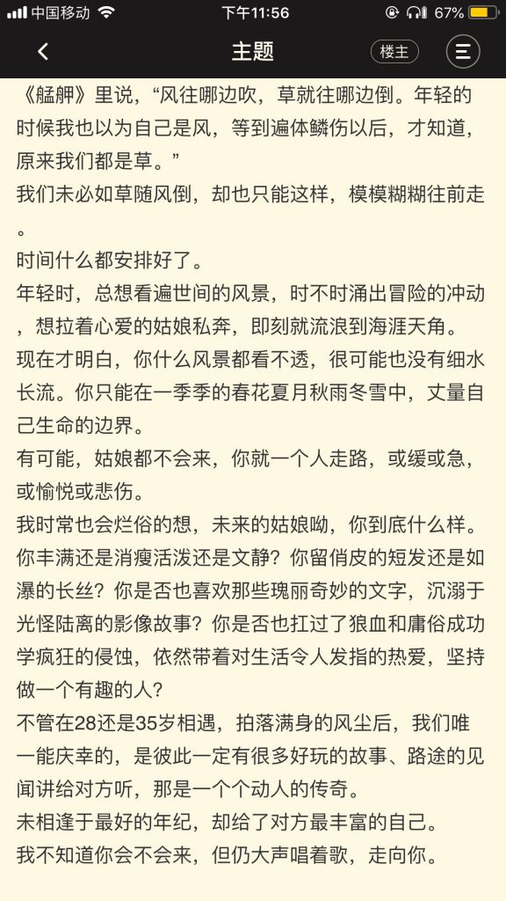
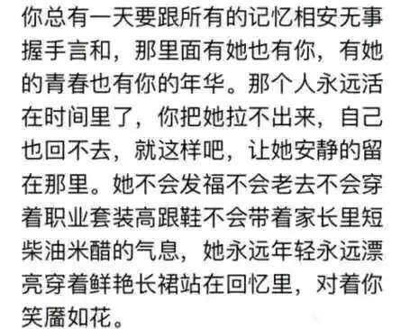
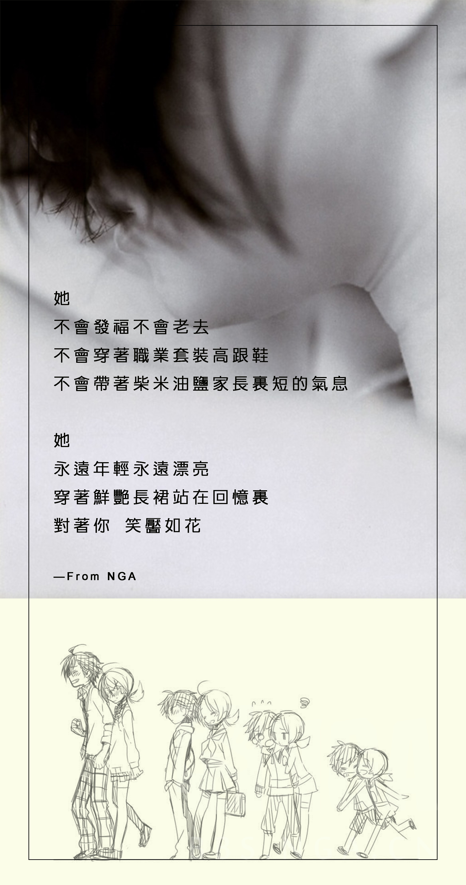
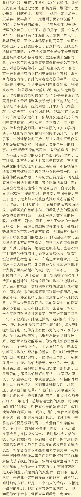
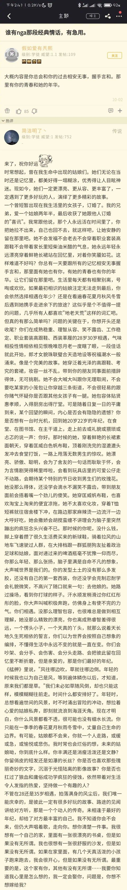
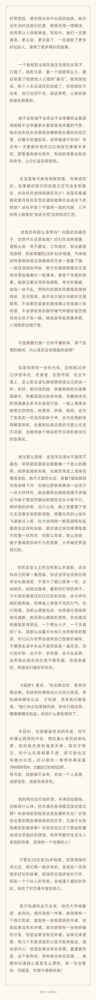
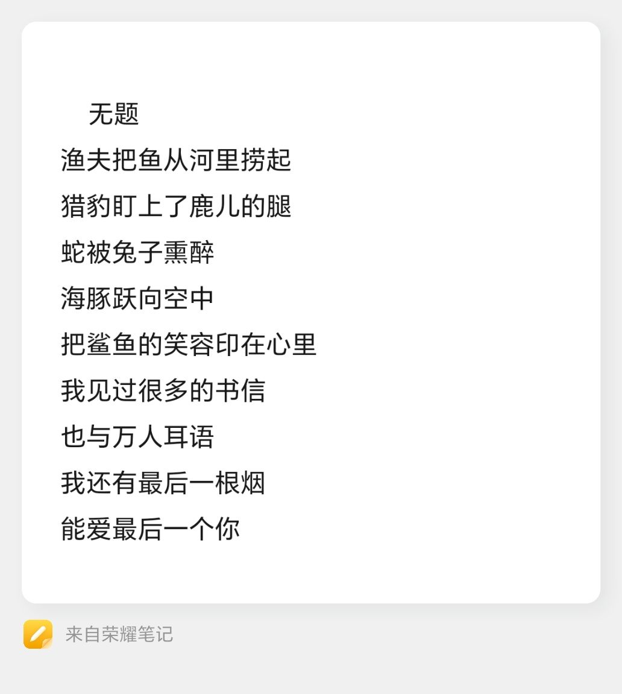
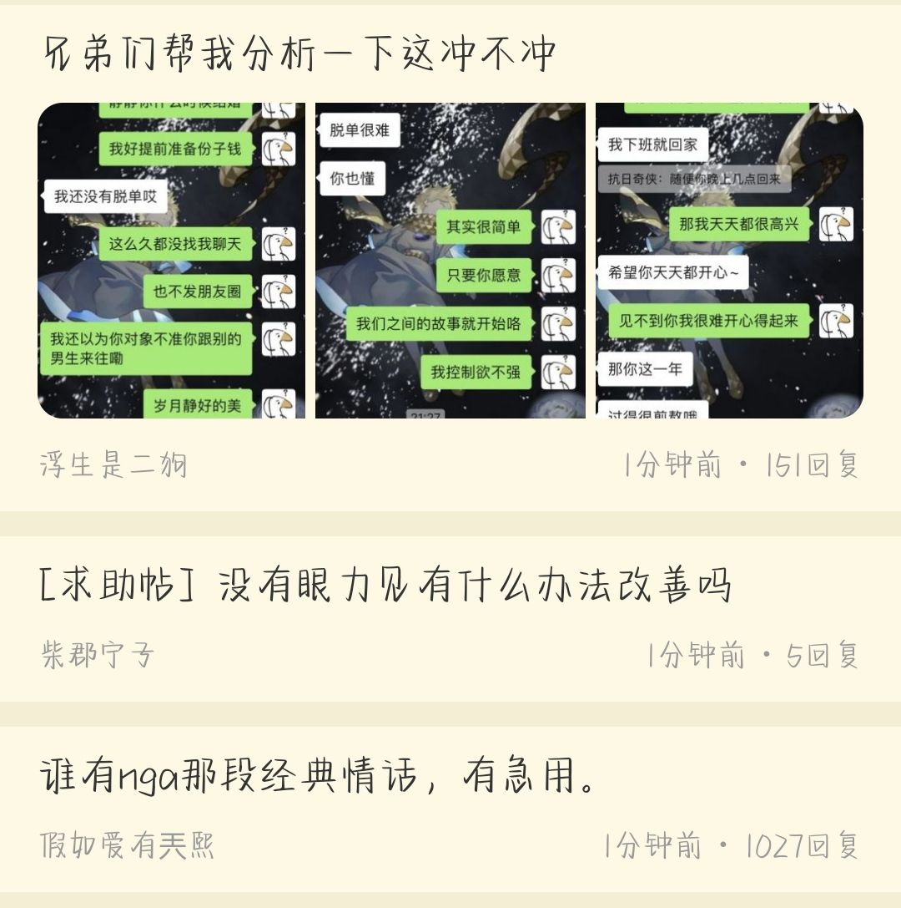

### 谁有nga那段经典情话，有急用。

Made by ngapost2md (c) ludoux [GitHub Repo](https://github.com/ludoux/ngapost2md)

##### 热门回复

- [0楼](#pid555020091): 我想你清楚一件事。我很想有一个自己的家，...
- [1楼](#pid554990743): 来了，祝你好运[s:ac:goodjob...
- [4楼](#pid554991430): 你总有一天要跟所有的记忆相安无事握手言和...

----

##### 0.[381] \<pid:0\> 2021-10-02 22:19:21 by 假如爱有兲熙\(中国\)
大概内容是你总会和你的过去相安无事，握手言和。那里有你的青春和她的年华。

*---下挂评论---*

1.[5] \<pid:581278610\>2022-01-13 15:58:11 by warspting02:
其实我不知道我为什么喜欢你，真的不知道，但是跟你在一起就会莫名的开心。如果我说我喜欢你秀美的样子，那等哪天你成了黄脸婆，我不知道要把你放在哪里。如果我说我喜欢你曼妙的身材，那等哪天你成了水桶腰，我不知道要把你放在哪里。如果我说我喜欢你温婉如水，那等哪天你到了更年期变得喜怒无常，我不知道要把你放在哪里。我真的不知道为什么喜欢你，也许就是因为不知道为什么，我为你做的每一件事才会那么坚定，才会那么义无反顾。如果以后有一天我找到了爱你的原因，我会告诉自己，我没有爱错你，当初的义无反顾也并非心血来潮，我会抱紧你，直到死去。

2.[9] \<pid:612946553\>2022-05-24 16:23:22 by 苏堤春晓zfp:
自古表白多白表，从来情书难书情

3.[0] \<pid:725454447\>2023-11-06 10:42:20 by 4428288:
那必须是呆摩托了

----

##### 1.[5754] \<pid:554990743\> 2021-10-02 22:21:22 by 简洁明了丶\(山东\)
来了，祝你好运
时常想起，曾在我生命中出现的姑娘们。她们无论在当时还是记忆里，都美好得一塌糊涂，优秀得让人目眩神迷。现如今，她们一定更漂亮、更从容、更丰富了，一定遇到了更多好玩的人，演绎了更多精彩的故事。
一个曾短暂出现在我生活里的女孩子，订婚了。我的兄弟，爱一个姑娘两年半，最后收获了她跟他人订婚的&quot;喜讯&quot;。我常跟他说，那个人永远活在时间里了，你把她拉不出来，自己也回不去，就这样吧，让她安静的留在那里吧。她不会发福不会老去不会穿着职业套装高跟鞋不会带着家长里短柴油米醋的气息，她永远年轻永远漂亮穿着鲜艳长裙站在回忆里，对着你笑靥如花。这样难道不好吗？你总有一天要跟所有的记忆相安无事握手言和，那里面有她也有你，有她的青春也有你的年华。让它们留在那里吧。生活里每天都有相聚别离，号啕或欢欣。如果最初相识的姑娘注定无法走到最后，你会依然选择相遇在年少？还是在看遍春花夏月秋风冬雪后遇到她携手走进余下的旅途？这似乎是个不值得一提的问题，几乎所有人都喜欢&quot;地老天荒&quot;这样的词汇吧。但真的有那么简单吗？问题的关键在于，你想开头还是收尾？你们在成熟稳重、理智从容、笑不露齿、工作稳定、职业套装高跟鞋、西装革履的28岁30岁相遇，气味相投性情相依相见恨晚唯怨月老一度瞎了眼，一段佳话就此开始，郎才女貌珠联璧合天造地设等祝福潮水一般涌来。像是个完美的故事。她穿泛着光泽的高跟鞋、考究的套裙，妆容一丝不乱，带到你的朋友同事面前措辞得体，无可挑剔。她不会大喊大叫跟你无理取闹，不会要吃某家的小笼包让你穿越三条街道，不会很轻易的跟你赌气怀疑你是否跟其他女孩子有一腿。她包容体贴贤惠孝顺，入得厨房出得厅堂。可是随着日复一日的平庸到来，某个回望的瞬间，内心是否会有隐隐的遗憾？你是否想有一台时光机，回到她20岁22岁的年纪，在食堂、在图书馆、在主干道上，走上前去或礼貌或猥琐或忐忑的说一声：你好。那时候的她，穿着鲜艳的长裙素面朝天，穿着匡威白色帆布鞋，顶着刚洗完的湿漉漉头发冲去食堂打饭，一路上甩落无数男生的惊叹。她漂亮、骄傲、聪明，会为了舍友的一句话而耿耿于怀，会为言情剧哭得稀里哗啦，会看到玩具店里的可爱公仔走不动路，会期待某个特别的节日收到男生们的玫瑰花。她没那么得体，还没学会滴水不漏笑不露齿，带到朋友面前会捂着嘴一个劲儿的傻笑。她穿匡威帆布鞋，也喜欢淘宝上淘来的便宜凉拖，她不太喜欢化妆，穿着T恤短裤就往宿舍楼下冲，在路边那家麻辣烫一边流汗一边大呼好吃，她会撒娇会胡搅蛮缠不讲理会为脑子里突然蹦出的疯狂念头兴奋不已。那时候的你呢，没什么钱，脚上穿着攒了很久生活费买来的新球鞋，骑着拉风的山地车飞速驶过人群，在大排档跟一群狐朋狗友扯着政治足球和姑娘，面对递过来的啤酒瓶毫不犹豫一仰而尽，你那么年轻、那么张扬，脑子里满是自命不凡的想象，大声喊世界是我们的。你的发型土土的没有那么多发胶，还没有自己的第一套西装，你还没学会克制忍耐学会礼貌微笑，不高兴了随口就来一句：去他娘的。她路过操场，看到你打球的样子。汗水顺发梢滑过你红红彤彤的脸，你大声叫喊积极奔跑，仿佛身上有使不完的力气。你们相遇。没那么理智包容，也很难总是做到相互理解，她没那么精致的漂亮，你也离成熟睿智差得很远，一个愣头小子，一个天真的丫头，就那么说着天长地久生死相依的誓言，你们以为世界会按照自己想象的编排，不懂得生活中永远不变的就是一直在变。你们会吵架、会分手、会伤害、会分头走路、会把彼此留在回忆里不断折磨，但是亲爱的，那是你们最好的年纪。《艋舺》里说，&quot;风往哪边吹，草就往哪边倒。年轻的时候我也以为自己是风，等到遍体鳞伤以后，才知道，原来我们都是草。&quot;我们未必如草随风倒，却也只能这样，模模糊糊往前走。时间什么都安排好了。年轻时，总想看遍世间的风景，时不时涌出冒险的冲动，想拉着心爱的姑娘私奔，即刻就流浪到海涯天角。现在才明白，你什么风景都看不透，很可能也没有细水长流。你只能在一季季的春花夏月秋雨冬雪中，丈量自己生命的边界。有可能，姑娘都不会来，你就一个人走路，或缓或急，或愉悦或悲伤。我时常也会烂俗的想，未来的姑娘呦，你到底什么样。你丰满还是消瘦活泼还是文静？你留俏皮的短发还是如瀑的长丝？你是否也喜欢那些瑰丽奇妙的文字，沉溺于光怪陆离的影像故事？你是否也扛过了狼血和庸俗成功学疯狂的侵蚀，依然带着对生活令人发指的热爱，坚持做一个有趣的人？
不管在28还是35岁相遇，拍落满身的风尘后，我们唯一能庆幸的，是彼此一定有很多好玩的故事、路途的见闻讲给对方听，那是一个个动人的传奇。未相逢于最好的年纪，却给了对方最丰富的自己。我不知道你会不会来，但仍大声唱着歌，走向你。想你清楚一件事。我很想有一个自己的家，里面有一张很漂亮的书桌，但是如果没有无所谓。我也很想有一张很舒服的沙发，但是如果没有无所谓。如果在家里面，有几个天真活泼的小孩子跑来跑去，我会很开心，但是如果没有无所谓。最重要的是，这个家有你，其他有没有无所谓……我要你知道我心里是怎么想的，我一定会娶你，问题是，你想不想嫁给我？

又找了一下，应该是上面这个

其实我不知道我为什么喜欢你，真的不知道，但是跟你在一起就会莫名的开心。如果我说我喜欢你俊美的样子，那等哪天你成了黄脸婆，我不知道要把你放在哪里。如果我说我喜欢你曼妙的身材，那等哪天你成了水桶腰，我不知道要把你放在哪里。如果我说我喜欢你温柔贤惠，那等哪天你到了更年期变得喜怒无常，我不知道要把你放在哪里。我真的不知道为什么喜欢你，也许就是因为不知道为什么，我为你做的每一件事才会那么坚定，才会那么义无反顾。如果以后有一天我找到了爱你的原因，我会告诉自己，我没有爱错你，当初的义无反顾也并非心血来潮，我会抱紧你，直到死去。

你常常抱怨我不懂浪漫，我也从来没送给你过什么像样的东西，所以我时常懊恼觉得自己做得不够。思考良久，最终决定写封情书，当作我们在一起半年我送给你的礼物。
你不要笑。我是个粗人，想不出多少有内涵的东西。我也不是富二代，没法这个世界的富裕都塞给你。我只有一颗真心，一颗爱你的心，只能用情书这么老掉牙的东西作为礼物。所以你要相信，我写的这封情书，它倾注了我对你所有的爱意在上面，这里的每一字每一句，都是我的真情流露。
我时常想，我何其有幸，能在这样的人世间遇见你，并能得你青睐，与你相知相爱并走在一起。但你又何其不幸，遇见我这么一个平凡的普通的人，以至你年老的时候，没有太多惊天动地的故事对你的儿女们言说。所以我对不起你——可我愿意补偿你——补偿在以后狭长的人生轨迹里，陪着你一直走下去，无论是贫穷、困苦或是走投无路。甚至错误，我也愿意陪着你一直承担下去，直到错到了尽头再去寻找，我们到底错在了哪里。
我爱你，真的。这话就像王小波写给李银河的书信一样露骨一样真实，你不要怀疑，也不要否定，这不是你有任何想法就可以动摇得了的，因为它是句真话。我喜欢评价小波情书的那几个字，因为那也可以形容我的这封情书——真话并不肉麻。
我害怕时光的流逝，因为我时常在里面看见年华的蹉跎。但唯独想起你，我宁愿它能过得快一点，再快一点，那样，我们的爱情才会被时间倒映起长长的影子，让我看见我们一路走来的日子——是多么美好。
感情远比我们想象的复杂曲折，这个尘世也比我们想象地吵杂喧闹，愿我们不离不弃，愿我们在蹉跎了岁月褪尽了腻味之后仍能看见这个世界的一切安好。
我还是喜欢这句话，我也愿意将这句话作为我的心声，连同这封情书一并赠送给你——“我把我整个的灵魂都给你，连同它的怪癖，耍小脾气，忽明忽暗，一千八百种坏毛病。它真讨厌，只有一点好，爱你

你，伴随着春天的脚步走向我，使我感受到了春天的到来。
此刻，我相信这个世界上真的有天使的存在。
而那个天使就是你，从你映入我眼帘的那一刻起，你就成为了我的天使。

我喜欢你乌黑的瞳孔，犹如天空中繁星般照耀着我。
我喜欢你甜美的声音，犹如麦当劳薯条般清脆入耳。
我喜欢你飘逸的发梢，犹如清爽的春风划过我耳迹。
我喜欢你樱红色的唇，犹如火焰般灼烧着我的心绪。

认识你的那一刻，我心中千年的冰雪瞬间融化。
那一瞬间感觉到了时间的停止，感觉到了爱的到来。
每个人的心中都有一把锁，千万人之中我找到了那把钥匙。
我会抓住她，抓住那把心灵的钥匙！

我有一个梦，我希望能握住你的手对你说我爱你。让全世界的人羡慕我身边有一个如此美丽的你。
我有一个梦，我希望能牵着你的手在星空下漫步。让繁星见证我们的爱情让我们的爱在黑暗中闪耀。
我有一个梦，我希望能在沙滩上亲吻你樱红的唇。让恒久不变的大海记住我们这段永不变质的情感。
我有一个梦，我希望当世界末日都能紧紧拥住你。让我们在困难面前不低头有你的世界就是天堂！

空中飘荡的云彩，街头嘈杂的人群，地上倾斜的树影，耳边柔和的风声。
这些，都只为你而衬托，衬托这个我爱的你。
那一刻，我突然明白重要的不是我身在何处，而是我身边是否会有你。
你，伴随着春天的脚步向我走来，我感受到了春天，春天真好！

我将我的思绪告诉微风，
你是否听到了我的心声？
你将你的微笑赠予空气，
我已经感到了你的甜美！

我想在月夜下抓住那一瞬间的光辉，
那瞬间的光辉能照亮我心中的阴霾。
我想在酷日下寻找那一小片的树阴，
那小片的树阴能熄灭我心中的烈火。

我常常在想，
如果云彩丢失了翅膀该怎么办？
如果空气失去了重量该怎么办？
如果月亮失去了星星的陪伴该怎么办？
如果我与你擦肩而过该怎么办？
如果，如果。

微风拂过我的脸颊，我感受到了温暖。
抬头看着晴朗的天，我感受到了春天。

*---下挂评论---*

1.[1] \<pid:555155838\>2021-10-03 17:26:42 by Nicaas:
无敌

2.[0] \<pid:555174351\>2021-10-03 18:50:44 by UID42645095:
谢谢老哥，希望以后用得上

3.[0] \<pid:555200705\>2021-10-03 20:44:23 by 剑豪生死斗:
强。

4.[0] \<pid:559639122\>2021-10-19 15:55:09 by Devillzy:
也太强了老哥

5.[0] \<pid:559664371\>2021-10-19 17:14:08 by nhyujmkiolp:
老哥真厉害，我要好好学学

6.[0] \<pid:559692198\>2021-10-19 18:47:20 by 冰霜大领主:
好长

7.[0] \<pid:559861253\>2021-10-20 11:19:07 by zhangjuanzhp:
必须贴

8.[0] \<pid:559987488\>2021-10-20 18:28:54 by 兔子陈:
卧槽！直呼卧槽！

9.[0] \<pid:560580022\>2021-10-22 19:36:27 by 红烧秋刀:
虽然大概率用不上，还是给你贴一个

10.[0] \<pid:560673737\>2021-10-23 09:29:20 by 泥潭需谨慎:
无敌，收藏一下

11.[0] \<pid:560805685\>2021-10-23 21:12:16 by 快上车:
强

12.[0] \<pid:560811942\>2021-10-23 21:44:16 by 最爱紫罗兰:
收藏，以后必有大用

13.[0] \<pid:562682359\>2021-10-31 22:28:21 by 今宵来赏月:
老哥牛逼，以后冲塔成功必有重谢

14.[0] \<pid:581202859\>2022-01-13 11:14:02 by LeeHer0:
绝了

15.[0] \<pid:581258818\>2022-01-13 14:42:04 by M1racleZ:
牛逼！我这种粗人只能说出来这两字了

16.[0] \<pid:581377583\>2022-01-13 23:48:21 by sunce0508:
老哥，很全，可以做成传家情书传下去

17.[0] \<pid:581488556\>2022-01-14 13:09:40 by kookyo2001:
虽然用不到了，但是真的牛(o)哇

18.[0] \<pid:581539667\>2022-01-14 16:31:43 by redog1985:
贴条留作纪念！强！无敌！

19.[0] \<pid:581583797\>2022-01-14 19:40:40 by 拽甲鱼壳:
贴一条贴一条

20.[0] \<pid:582267194\>2022-01-17 19:01:29 by 季风湮灭の季节:
无敌

21.[0] \<pid:583360281\>2022-01-21 21:37:00 by 丿亚丝娜:
学习了，感谢老哥

22.[0] \<pid:583415326\>2022-01-22 03:29:08 by 镜濯z丶:
虽然感觉用不上，但还是贴个条

23.[0] \<pid:583415928\>2022-01-22 03:45:16 by Itfily:
老哥牛逼 贴条

24.[0] \<pid:583419368\>2022-01-22 06:01:19 by YYMCC:
感觉用不上，但还是贴一个

25.[0] \<pid:583419518\>2022-01-22 06:07:32 by 愿风指引你…:
牛逼啊

26.[0] \<pid:583668316\>2022-01-23 10:28:50 by 伴春风而归:
无敌了

27.[0] \<pid:583736738\>2022-01-23 16:24:56 by 蛋肉炒饭:
无敌，插个眼以后用

28.[0] \<pid:584017664\>2022-01-24 18:04:59 by 温润如玉i:
强无敌，已收藏！

29.[0] \<pid:584024859\>2022-01-24 18:35:54 by stomstorm:
老哥，我还是背一段出师表算了。。。

30.[0] \<pid:588370501\>2022-02-12 20:22:21 by 狐狸就狐狸嘛:
牛，老哥，牛

31.[0] \<pid:588615369\>2022-02-13 23:45:34 by 喵团orz:
牛哇

32.[0] \<pid:588649458\>2022-02-14 08:02:15 by laurus0530:
只能贴一个了

33.[0] \<pid:591373439\>2022-02-24 16:38:42 by 风吹过的夏天snow:
厉害了

34.[0] \<pid:591373626\>2022-02-24 16:39:30 by ShiinaYuki:
老哥NB

35.[0] \<pid:591390273\>2022-02-24 17:41:29 by 苏影233:
太强了，留留留，以后用得上

36.[0] \<pid:591399310\>2022-02-24 18:20:49 by hunluan4:
过来补贴条，真的牛啊

37.[0] \<pid:591516283\>2022-02-25 09:30:51 by 最爱fsy的小蠢哈:
老哥牛皮！NGA第一贴给你了

38.[0] \<pid:591543029\>2022-02-25 11:07:03 by 一个人的背包:
希望可以尽快用到

39.[0] \<pid:591569975\>2022-02-25 12:46:06 by JimmyMcGill:
收藏了可以的

40.[0] \<pid:600819246\>2022-04-05 15:23:23 by 黑色丶点点滴滴:
贴一个了只能

41.[0] \<pid:600845937\>2022-04-05 17:49:51 by Greenpainter:
学习了学习了

42.[0] \<pid:612795536\>2022-05-23 23:57:47 by 南山过客:
我也要贴一个

43.[0] \<pid:612800287\>2022-05-24 00:30:02 by CatMasterBQ:
太牛逼了！必须贴条！

44.[0] \<pid:612804538\>2022-05-24 01:01:51 by llllllious91:
牛的

45.[0] \<pid:612806535\>2022-05-24 01:20:33 by 阿轩喝酸奶:
第一次贴就给你了orz

46.[0] \<pid:652287072\>2022-11-11 00:54:16 by 灵魂的歌咏者:
太牛了老哥

47.[0] \<pid:660369622\>2022-12-16 09:41:37 by Rich白:
牛批

48.[0] \<pid:660373301\>2022-12-16 09:58:00 by view87:
收藏了，就给我儿子用，哈哈?

49.[0] \<pid:660436575\>2022-12-16 14:23:26 by 小小苏苏苏:
贴贴

50.[0] \<pid:711349270\>2023-08-25 17:10:13 by Hachi柚子:
666，太顶

51.[0] \<pid:711355481\>2023-08-25 17:39:23 by 那么□请继续:
我就说谁在挖坟，就是你小子!

52.[0] \<pid:711366569\>2023-08-25 18:38:08 by 老实本分的小明:
插个眼插个眼

53.[0] \<pid:711416084\>2023-08-26 00:41:35 by 胸小不想说话:
贴贴贴贴贴！！

54.[0] \<pid:713300075\>2023-09-04 17:20:43 by ______Chidori:
准备用上了，前来贴条

55.[0] \<pid:713355202\>2023-09-04 23:13:15 by 苟富贵，一定忘:
666

56.[0] \<pid:713355902\>2023-09-04 23:18:25 by 落月之汐:
感谢老哥
慢慢用

57.[0] \<pid:717795922\>2023-09-27 12:33:00 by Patiod33pestw:
贴一个

58.[0] \<pid:724589769\>2023-11-02 00:06:54 by 辰未丶:
好好学习下 谢谢老哥

----

##### 2.[66] \<pid:554990967\> 2021-10-02 22:22:40 by 爱吃火锅和日料\(河南\)
写的太好了，看的我起鸡皮疙瘩。

----

##### 3.[22] \<pid:554991131\> 2021-10-02 22:23:38 by 你再卖萌我就报警了\(四川\)
>[jump](#pid554990743) 简洁明了丶(2021-10-02 22:21) 说: 
>来了，祝你好运
>我想你清楚一件事。我很想有一个自己的家，里面有一张很漂亮的书桌，但是如果没有无所谓。我也很想有一张很舒服的沙发，但是如果没有无所谓。如果在家里面，......

天秀

----

##### 4.[996] \<pid:554991430\> 2021-10-02 22:25:13 by 雎灵\(中国\)
你总有一天要跟所有的记忆相安无事握手言和，那里面有她也有你，有她的青春也有你的年华。
那个人永远活在时间里了，你把她拉不出来，自己也回不去，就这样吧，让她安静的留在那里吧。
她不会发福不会老去不会穿着职业套装高跟鞋不会带着家长里短柴油米醋的气息，她永远年轻永远漂亮穿着鲜艳长裙站在回忆里，对着你笑靥如花。
截短version
坦然接受放不下的事实也可以的。

----

##### 5.[0] \<pid:554996450\> 2021-10-02 22:51:21 by 假如爱有兲熙\(中国\)
>[jump](#pid554990743) 简洁明了丶(2021-10-02 22:21)说:
>来了，祝你好运
>时常想起，曾在我生命中出现的姑娘们。她们无论在当时还是记忆里，都美好得一塌糊涂，优秀得让人目眩神迷。现如今，她们一定更漂亮、更从容、更丰富了，一定遇到了更多好玩的人，演绎了更多精彩的故事。
>一个曾短暂出现在我生活里的女孩子，订婚了。我的兄弟，爱一个姑娘两年半，最后收获了她跟他人订婚的&quot;喜讯&quot;。我常跟他说，那个人永远活在时间里了，你把她拉不出来，自己也回不去，就这样吧，让她安静的留在那里吧。她不会发福不会老去不会穿着职业套装高跟鞋不会带着家长里短柴油米醋的气息，她永远年轻永远漂亮穿着鲜艳长裙站在回忆里，对着你笑靥如花。这样难道不好吗？你总有一天要跟所有的记忆相安无事握手言和，那里面有她也有你，有她的青春也有你的年华。让它们留在那里吧。生活里每天都有相聚别离，号啕或欢欣。如果最初相识的姑娘注定无法走到最后，你会依然选择相遇在年少？还是在看遍春花夏月秋风冬雪后遇到她携手走进余下的旅途？这似乎是个不值得一提的问题，几乎所有人都喜欢&quot;地老天荒&quot;这样的词汇吧。但真的有那么简单吗？问题的关键在于，你想开头还是收尾？你们在成熟稳重、理智从容、笑不露齿、工作稳定、职业套装高跟鞋、西装革履的28岁30岁相遇，气味相投性情相依相见恨晚唯怨月老一度瞎了眼，一段佳话就此开始，郎才女貌珠联璧合天造地设等祝福潮水一般涌来。像是个完美的故事。她穿泛着光泽的高跟鞋、考究的套裙，妆容一丝不乱，带到你的朋友同事面前措辞得体，无可挑剔。她不会大喊大叫跟你无理取闹，不会要吃某家的小笼包让你穿越三条街道，不会很轻易的跟你赌气怀疑你是否跟其他女孩子有一腿。她包容体贴贤惠孝顺，入得厨房出得厅堂。可是随着日复一日的平庸到来，某个回望的瞬间，内心是否会有隐隐的遗憾？你是否想有一台时光机，回到她20岁22岁的年纪，在食堂、在图书馆、在主干道上，走上前去或礼貌或猥琐或忐忑的说一声：你好。那时候的她，穿着鲜艳的长裙素面朝天，穿着匡威白色帆布鞋，顶着刚洗完的湿漉漉头发冲去食堂打饭，一路上甩落无数男生的惊叹。她漂亮、骄傲、聪明，会为了舍友的一句话而耿耿于怀，会为言情剧哭得稀里哗啦，会看到玩具店里的可爱公仔走不动路，会期待某个特别的节日收到男生们的玫瑰花。她没那么得体，还没学会滴水不漏笑不露齿，带到朋友面前会捂着嘴一个劲儿的傻笑。她穿匡威帆布鞋，也喜欢淘宝上淘来的便宜凉拖，她不太喜欢化妆，穿着T恤短裤就往宿舍楼下冲，在路边那家麻辣烫一边流汗一边大呼好吃，她会撒娇会胡搅蛮缠不讲理会为脑子里突然蹦出的疯狂念头兴奋不已。那时候的你呢，没什么钱，脚上穿着攒了很久生活费买来的新球鞋，骑着拉风的山地车飞速驶过人群，在大排档跟一群狐朋狗友扯着政治足球和姑娘，面对递过来的啤酒瓶毫不犹豫一仰而尽，你那么年轻、那么张扬，脑子里满是自命不凡的想象，大声喊世界是我们的。你的发型土土的没有那么多发胶，还没有自己的第一套西装，你还没学会克制忍耐学会礼貌微笑，不高兴了随口就来一句：去他娘的。她路过操场，看到你打球的样子。汗水顺发梢滑过你红红彤彤的脸，你大声叫喊积极奔跑，仿佛身上有使不完的力气。你们相遇。没那么理智包容，也很难总是做到相互理解，她没那么精致的漂亮，你也离成熟睿智差得很远，一个愣头小子，一个天真的丫头，就那么说着天长地久生死相依的誓言，你们以为世界会按照自己想象的编排，不懂得生活中永远不变的就是一直在变。你们会吵架、会分手、会伤害、会分头走路、会把彼此留在回忆里不断折磨，但是亲爱的，那是你们最好的年纪。《艋舺》里说，&quot;风往哪边吹，草就往哪边倒。年轻的时候我也以为自己是风，等到遍体鳞伤以后，才知道，原来我们都是草。&quot;我们未必如草随风倒，却也只能这样，模模糊糊往前走。时间什么都安排好了。年轻时，总想看遍世间的风景，时不时涌出冒险的冲动，想拉着心爱的姑娘私奔，即刻就流浪到海涯天角。现在才明白，你什么风景都看不透，很可能也没有细水长流。你只能在一季季的春花夏月秋雨冬雪中，丈量自己生命的边界。有可能，姑娘都不会来，你就一个人走路，或缓或急，或愉悦或悲伤。我时常也会烂俗的想，未来的姑娘呦，你到底什么样。你丰满还是消瘦活泼还是文静？你留俏皮的短发还是如瀑的长丝？你是否也喜欢那些瑰丽奇妙的文字，沉溺于光怪陆离的影像故事？你是否也扛过了狼血和庸俗成功学疯狂的侵蚀，依然带着对生活令人发指的热爱，坚持做一个有趣的人？
>不管在28还是35岁相遇，拍落满身的风尘后，我们唯一能庆幸的，是彼此一定有很多好玩的故事、路途的见闻讲给对方听，那是一个个动人的传奇。未相逢于最好的年纪，却给了对方最丰富的自己。我不知道你会不会来，但仍大声唱着歌，走向你。想你清楚一件事。我很想有一个自己的家，里面有一张很漂亮的书桌，但是如果没有无所谓。我也很想有一张很舒服的沙发，但是如果没有无所谓。如果在家里面，有几个天真活泼的小孩子跑来跑去，我会很开心，但是如果没有无所谓。最重要的是，这个家有你，其他有没有无所谓……我要你知道我心里是怎么想的，我一定会娶你，问题是，你想不想嫁给我？
>
>
>又找了一下，应该是上面这个
>
>
>其实我不知道我为什么喜欢你，真的不知道，但是跟你在一起就会莫名的开心。如果我说我喜欢你俊美的样子，那等哪天你成了黄脸婆，我不知道要把你放在哪里。如果我说我喜欢你曼妙的身材，那等哪天你成了水桶腰，我不知道要把你放在哪里。如果我说我喜欢你温柔贤惠，那等哪天你到了更年期变得喜怒无常，我不知道要把你放在哪里。我真的不知道为什么喜欢你，也许就是因为不知道为什么，我为你做的每一件事才会那么坚定，才会那么义无反顾。如果以后有一天我找到了爱你的原因，我会告诉自己，我没有爱错你，当初的义无反顾也并非心血来潮，我会抱紧你，直到死去。
>
>你常常抱怨我不懂浪漫，我也从来没送给你过什么像样的东西，所以我时常懊恼觉得自己做得不够。思考良久，最终决定写封情书，当作我们在一起半年我送给你的礼物。
>你不要笑。我是个粗人，想不出多少有内涵的东西。我也不是富二代，没法这个世界的富裕都塞给你。我只有一颗真心，一颗爱你的心，只能用情书这么老掉牙的东西作为礼物。所以你要相信，我写的这封情书，它倾注了我对你所有的爱意在上面，这里的每一字每一句，都是我的真情流露。
>我时常想，我何其有幸，能在这样的人世间遇见你，并能得你青睐，与你相知相爱并走在一起。但你又何其不幸，遇见我这么一个平凡的普通的人，以至你年老的时候，没有太多惊天动地的故事对你的儿女们言说。所以我对不起你——可我愿意补偿你——补偿在以后狭长的人生轨迹里，陪着你一直走下去，无论是贫穷、困苦或是走投无路。甚至错误，我也愿意陪着你一直承担下去，直到错到了尽头再去寻找，我们到底错在了哪里。
>我爱你，真的。这话就像王小波写给李银河的书信一样露骨一样真实，你不要怀疑，也不要否定，这不是你有任何想法就可以动摇得了的，因为它是句真话。我喜欢评价小波情书的那几个字，因为那也可以形容我的这封情书——真话并不肉麻。
>我害怕时光的流逝，因为我时常在里面看见年华的蹉跎。但唯独想起你，我宁愿它能过得快一点，再快一点，那样，我们的爱情才会被时间倒映起长长的影子，让我看见我们一路走来的日子——是多么美好。
>感情远比我们想象的复杂曲折，这个尘世也比我们想象地吵杂喧闹，愿我们不离不弃，愿我们在蹉跎了岁月褪尽了腻味之后仍能看见这个世界的一切安好。
>我还是喜欢这句话，我也愿意将这句话作为我的心声，连同这封情书一并赠送给你——“我把我整个的灵魂都给你，连同它的怪癖，耍小脾气，忽明忽暗，一千八百种坏毛病。它真讨厌，只有一点好，爱你
>
>你，伴随着春天的脚步走向我，使我感受到了春天的到来。
>此刻，我相信这个世界上真的有天使的存在。
>而那个天使就是你，从你映入我眼帘的那一刻起，你就成为了我的天使。
>
>我喜欢你乌黑的瞳孔，犹如天空中繁星般照耀着我。
>我喜欢你甜美的声音，犹如麦当劳薯条般清脆入耳。
>我喜欢你飘逸的发梢，犹如清爽的春风划过我耳迹。
>我喜欢你樱红色的唇，犹如火焰般灼烧着我的心绪。
>
>认识你的那一刻，我心中千年的冰雪瞬间融化。
>那一瞬间感觉到了时间的停止，感觉到了爱的到来。
>每个人的心中都有一把锁，千万人之中我找到了那把钥匙。
>我会抓住她，抓住那把心灵的钥匙！
>
>我有一个梦，我希望能握住你的手对你说我爱你。让全世界的人羡慕我身边有一个如此美丽的你。
>我有一个梦，我希望能牵着你的手在星空下漫步。让繁星见证我们的爱情让我们的爱在黑暗中闪耀。
>我有一个梦，我希望能在沙滩上亲吻你樱红的唇。让恒久不变的大海记住我们这段永不变质的情感。
>我有一个梦，我希望当世界末日都能紧紧拥住你。让我们在困难面前不低头有你的世界就是天堂！
>
>空中飘荡的云彩，街头嘈杂的人群，地上倾斜的树影，耳边柔和的风声。
>这些，都只为你而衬托，衬托这个我爱的你。
>那一刻，我突然明白重要的不是我身在何处，而是我身边是否会有你。
>你，伴随着春天的脚步向我走来，我感受到了春天，春天真好！
>
>我将我的思绪告诉微风，
>你是否听到了我的心声？
>你将你的微笑赠予空气，
>我已经感到了你的甜美！
>
>我想在月夜下抓住那一瞬间的光辉，
>那瞬间的光辉能照亮我心中的阴霾。
>我想在酷日下寻找那一小片的树阴，
>那小片的树阴能熄灭我心中的烈火。
>
>我常常在想，
>如果云彩丢失了翅膀该怎么办？
>如果空气失去了重量该怎么办？
>如果月亮失去了星星的陪伴该怎么办？
>如果我与你擦肩而过该怎么办？
>如果，如果。
>
>微风拂过我的脸颊，我感受到了温暖。
>抬头看着晴朗的天，我感受到了春天。

感觉你第一个不是全部啊  跟我的记忆有点偏差

----

##### 6.[10] \<pid:554996959\> 2021-10-02 22:54:00 by 假如爱有兲熙\(中国\)
>[jump](#pid554991430) 雎灵(2021-10-02 22:25)说:
>你总有一天要跟所有的记忆相安无事握手言和，那里面有她也有你，有她的青春也有你的年华。
>那个人永远活在时间里了，你把她拉不出来，自己也回不去，就这样吧，让她安静的留在那里吧。
>她不会发福不会老去不会穿着职业套装高跟鞋不会带着家长里短柴油米醋的气息，她永远年轻永远漂亮穿着鲜艳长裙站在回忆里，对着你笑靥如花。
>截短version
>坦然接受放不下的事实也可以的。

差不多就是个，说到心里去的感觉

----

##### 7.[7] \<pid:554997643\> 2021-10-02 22:57:29 by 简洁明了丶\(山东\)
>[jump](#pid554996450) 假如爱有兲熙(2021-10-02 22:51)说:
>>[jump](#pid554990743) 简洁明了丶(2021-10-02 22:21)说:
>>来了，祝你好运
>>时常想起，曾在我生命中出现的姑娘们。她们无论在当时还是记忆里，都美好得一塌糊涂，优秀得让人目眩神迷。现如今，她们一定更漂亮、更从容、更丰富了，一定遇到了更多好玩的人，演绎了更多精彩的故事。
>>一个曾短暂出现在我生活里的女孩子，订婚了。我的兄弟，爱一个姑娘两年半，最后收获了她跟他人订婚的&quot;喜讯&quot;。我常跟他说，那个人永远活在时间里了，你把她拉不出来，自己也回不去，就这样吧，让她安静的留在那里吧。她不会发福不会老去不会穿着职业套装高跟鞋不会带着家长里短柴油米醋的气息，她永远年轻永远漂亮穿着鲜艳长裙站在回忆里，对着你笑靥如花。这样难道不好吗？你总有一天要跟所有的记忆相安无事握手言和，那里面有她也有你，有她的青春也有你的年华。让它们留在那里吧。生活里每天都有相聚别离，号啕或欢欣。如果最初相识的姑娘注定无法走到最后，你会依然选择相遇在年少？还是在看遍春花夏月秋风冬雪后遇到她携手走进余下的旅途？这似乎是个不值得一提的问题，几乎所有人都喜欢&quot;地老天荒&quot;这样的词汇吧。但真的有那么简单吗？问题的关键在于，你想开头还是收尾？你们在成熟稳重、理智从容、笑不露齿、工作稳定、职业套装高跟鞋、西装革履的28岁30岁相遇，气味相投性情相依相见恨晚唯怨月老一度瞎了眼，一段佳话就此开始，郎才女貌珠联璧合天造地设等祝福潮水一般涌来。像是个完美的故事。她穿泛着光泽的高跟鞋、考究的套裙，妆容一丝不乱，带到你的朋友同事面前措辞得体，无可挑剔。她不会大喊大叫跟你无理取闹，不会要吃某家的小笼包让你穿越三条街道，不会很轻易的跟你赌气怀疑你是否跟其他女孩子有一腿。她包容体贴贤惠孝顺，入得厨房出得厅堂。可是随着日复一日的平庸到来，某个回望的瞬间，内心是否会有隐隐的遗憾？你是否想有一台时光机，回到她20岁22岁的年纪，在食堂、在图书馆、在主干道上，走上前去或礼貌或猥琐或忐忑的说一声：你好。那时候的她，穿着鲜艳的长裙素面朝天，穿着匡威白色帆布鞋，顶着刚洗完的湿漉漉头发冲去食堂打饭，一路上甩落无数男生的惊叹。她漂亮、骄傲、聪明，会为了舍友的一句话而耿耿于怀，会为言情剧哭得稀里哗啦，会看到玩具店里的可爱公仔走不动路，会期待某个特别的节日收到男生们的玫瑰花。她没那么得体，还没学会滴水不漏笑不露齿，带到朋友面前会捂着嘴一个劲儿的傻笑。她穿匡威帆布鞋，也喜欢淘宝上淘来的便宜凉拖，她不太喜欢化妆，穿着T恤短裤就往宿舍楼下冲，在路边那家麻辣烫一边流汗一边大呼好吃，她会撒娇会胡搅蛮缠不讲理会为脑子里突然蹦出的疯狂念头兴奋不已。那时候的你呢，没什么钱，脚上穿着攒了很久生活费买来的新球鞋，骑着拉风的山地车飞速驶过人群，在大排档跟一群狐朋狗友扯着政治足球和姑娘，面对递过来的啤酒瓶毫不犹豫一仰而尽，你那么年轻、那么张扬，脑子里满是自命不凡的想象，大声喊世界是我们的。你的发型土土的没有那么多发胶，还没有自己的第一套西装，你还没学会克制忍耐学会礼貌微笑，不高兴了随口就来一句：去他娘的。她路过操场，看到你打球的样子。汗水顺发梢滑过你红红彤彤的脸，你大声叫喊积极奔跑，仿佛身上有使不完的力气。你们相遇。没那么理智包容，也很难总是做到相互理解，她没那么精致的漂亮，你也离成熟睿智差得很远，一个愣头小子，一个天真的丫头，就那么说着天长地久生死相依的誓言，你们以为世界会按照自己想象的编排，不懂得生活中永远不变的就是一直在变。你们会吵架、会分手、会伤害、会分头走路、会把彼此留在回忆里不断折磨，但是亲爱的，那是你们最好的年纪。《艋舺》里说，&quot;风往哪边吹，草就往哪边倒。年轻的时候我也以为自己是风，等到遍体鳞伤以后，才知道，原来我们都是草。&quot;我们未必如草随风倒，却也只能这样，模模糊糊往前走。时间什么都安排好了。年轻时，总想看遍世间的风景，时不时涌出冒险的冲动，想拉着心爱的姑娘私奔，即刻就流浪到海涯天角。现在才明白，你什么风景都看不透，很可能也没有细水长流。你只能在一季季的春花夏月秋雨冬雪中，丈量自己生命的边界。有可能，姑娘都不会来，你就一个人走路，或缓或急，或愉悦或悲伤。我时常也会烂俗的想，未来的姑娘呦，你到底什么样。你丰满还是消瘦活泼还是文静？你留俏皮的短发还是如瀑的长丝？你是否也喜欢那些瑰丽奇妙的文字，沉溺于光怪陆离的影像故事？你是否也扛过了狼血和庸俗成功学疯狂的侵蚀，依然带着对生活令人发指的热爱，坚持做一个有趣的人？
>>不管在28还是35岁相遇，拍落满身的风尘后，我们唯一能庆幸的，是彼此一定有很多好玩的故事、路途的见闻讲给对方听，那是一个个动人的传奇。未相逢于最好的年纪，却给了对方最丰富的自己。我不知道你会不会来，但仍大声唱着歌，走向你。想你清楚一件事。我很想有一个自己的家，里面有一张很漂亮的书桌，但是如果没有无所谓。我也很想有一张很舒服的沙发，但是如果没有无所谓。如果在家里面，有几个天真活泼的小孩子跑来跑去，我会很开心，但是如果没有无所谓。最重要的是，这个家有你，其他有没有无所谓……我要你知道我心里是怎么想的，我一定会娶你，问题是，你想不想嫁给我？
>>
>>
>>又找了一下，应该是上面这个
>>
>>
>>其实我不知道我为什么喜欢你，真的不知道，但是跟你在一起就会莫名的开心。如果我说我喜欢你俊美的样子，那等哪天你成了黄脸婆，我不知道要把你放在哪里。如果我说我喜欢你曼妙的身材，那等哪天你成了水桶腰，我不知道要把你放在哪里。如果我说我喜欢你温柔贤惠，那等哪天你到了更年期变得喜怒无常，我不知道要把你放在哪里。我真的不知道为什么喜欢你，也许就是因为不知道为什么，我为你做的每一件事才会那么坚定，才会那么义无反顾。如果以后有一天我找到了爱你的原因，我会告诉自己，我没有爱错你，当初的义无反顾也并非心血来潮，我会抱紧你，直到死去。
>>
>>你常常抱怨我不懂浪漫，我也从来没送给你过什么像样的东西，所以我时常懊恼觉得自己做得不够。思考良久，最终决定写封情书，当作我们在一起半年我送给你的礼物。
>>你不要笑。我是个粗人，想不出多少有内涵的东西。我也不是富二代，没法这个世界的富裕都塞给你。我只有一颗真心，一颗爱你的心，只能用情书这么老掉牙的东西作为礼物。所以你要相信，我写的这封情书，它倾注了我对你所有的爱意在上面，这里的每一字每一句，都是我的真情流露。
>>我时常想，我何其有幸，能在这样的人世间遇见你，并能得你青睐，与你相知相爱并走在一起。但你又何其不幸，遇见我这么一个平凡的普通的人，以至你年老的时候，没有太多惊天动地的故事对你的儿女们言说。所以我对不起你——可我愿意补偿你——补偿在以后狭长的人生轨迹里，陪着你一直走下去，无论是贫穷、困苦或是走投无路。甚至错误，我也愿意陪着你一直承担下去，直到错到了尽头再去寻找，我们到底错在了哪里。
>>我爱你，真的。这话就像王小波写给李银河的书信一样露骨一样真实，你不要怀疑，也不要否定，这不是你有任何想法就可以动摇得了的，因为它是句真话。我喜欢评价小波情书的那几个字，因为那也可以形容我的这封情书——真话并不肉麻。
>>我害怕时光的流逝，因为我时常在里面看见年华的蹉跎。但唯独想起你，我宁愿它能过得快一点，再快一点，那样，我们的爱情才会被时间倒映起长长的影子，让我看见我们一路走来的日子——是多么美好。
>>感情远比我们想象的复杂曲折，这个尘世也比我们想象地吵杂喧闹，愿我们不离不弃，愿我们在蹉跎了岁月褪尽了腻味之后仍能看见这个世界的一切安好。
>>我还是喜欢这句话，我也愿意将这句话作为我的心声，连同这封情书一并赠送给你——“我把我整个的灵魂都给你，连同它的怪癖，耍小脾气，忽明忽暗，一千八百种坏毛病。它真讨厌，只有一点好，爱你
>>
>>你，伴随着春天的脚步走向我，使我感受到了春天的到来。
>>此刻，我相信这个世界上真的有天使的存在。
>>而那个天使就是你，从你映入我眼帘的那一刻起，你就成为了我的天使。
>>
>>我喜欢你乌黑的瞳孔，犹如天空中繁星般照耀着我。
>>我喜欢你甜美的声音，犹如麦当劳薯条般清脆入耳。
>>我喜欢你飘逸的发梢，犹如清爽的春风划过我耳迹。
>>我喜欢你樱红色的唇，犹如火焰般灼烧着我的心绪。
>>
>>认识你的那一刻，我心中千年的冰雪瞬间融化。
>>那一瞬间感觉到了时间的停止，感觉到了爱的到来。
>>每个人的心中都有一把锁，千万人之中我找到了那把钥匙。
>>我会抓住她，抓住那把心灵的钥匙！
>>
>>我有一个梦，我希望能握住你的手对你说我爱你。让全世界的人羡慕我身边有一个如此美丽的你。
>>我有一个梦，我希望能牵着你的手在星空下漫步。让繁星见证我们的爱情让我们的爱在黑暗中闪耀。
>>我有一个梦，我希望能在沙滩上亲吻你樱红的唇。让恒久不变的大海记住我们这段永不变质的情感。
>>我有一个梦，我希望当世界末日都能紧紧拥住你。让我们在困难面前不低头有你的世界就是天堂！
>>
>>空中飘荡的云彩，街头嘈杂的人群，地上倾斜的树影，耳边柔和的风声。
>>这些，都只为你而衬托，衬托这个我爱的你。
>>那一刻，我突然明白重要的不是我身在何处，而是我身边是否会有你。
>>你，伴随着春天的脚步向我走来，我感受到了春天，春天真好！
>>
>>我将我的思绪告诉微风，
>>你是否听到了我的心声？
>>你将你的微笑赠予空气，
>>我已经感到了你的甜美！
>>
>>我想在月夜下抓住那一瞬间的光辉，
>>那瞬间的光辉能照亮我心中的阴霾。
>>我想在酷日下寻找那一小片的树阴，
>>那小片的树阴能熄灭我心中的烈火。
>>
>>我常常在想，
>>如果云彩丢失了翅膀该怎么办？
>>如果空气失去了重量该怎么办？
>>如果月亮失去了星星的陪伴该怎么办？
>>如果我与你擦肩而过该怎么办？
>>如果，如果。
>>
>>微风拂过我的脸颊，我感受到了温暖。
>>抬头看着晴朗的天，我感受到了春天。
>
>感觉你第一个不是全部啊  跟我的记忆有点偏差

你没仔细看吧底下这个坛友的是我第一大段里的某一段。

----

##### 8.[1] \<pid:554998047\> 2021-10-02 22:59:45 by 竹千代在本能寺蹦迪\(西藏\)
马克
紫薯布丁

----

##### 9.[1] \<pid:554999351\> 2021-10-02 23:06:18 by 假如爱有兲熙\(中国\)
>[jump](#pid554997643) 简洁明了丶(2021-10-02 22:57) 说: 
>
>你没仔细看吧底下这个坛友的是我第一大段里的某一段。

确实某一段，只是感觉跟我记忆里有点不一样了

----

##### 11.[2] \<pid:555007094\> 2021-10-02 23:47:08 by 你看起来很美味啧啧啧\(重庆\)
收藏一下估计以后用的上

----

##### 12.[2] \<pid:555007315\> 2021-10-02 23:48:19 by kwx569440\(湖北\)
这文采无敌啊

----

##### 13.[8] \<pid:555007875\> 2021-10-02 23:51:20 by asoundplan\(广东\)
>[jump](#pid554990743) 简洁明了丶(2021-10-02 22:21) 说: 
>
>来了，祝你好运
>时常想起，曾在我生命中出现的姑娘们。她们无论在当时还是记忆里，都美好得一塌糊涂，优秀得让人目眩神迷。现如今，她们一定更漂亮、更从容、更丰富了，一定遇到了更多好玩的人，演绎了更多精彩的故事。
>一个曾短暂出现在我生活里的女孩子，订婚了。我的兄弟，爱一个姑娘两年半，最后收获了她跟他人订婚的&quot;喜讯&quot;。我常跟他说，那个人永远活在时间里了，你把她拉不出来，自己也回不去，就这样吧，让她安静的留在那里吧。她不会发福不会老去不会穿着职业套装高跟鞋不会带着家长里短柴油米醋

秀啊老哥

----

##### 14.[0] \<pid:555007903\> 2021-10-02 23:51:30 by ayuSSX\(中国\)
应该开个文学比赛

----

##### 15.[11] \<pid:555008336\> 2021-10-02 23:53:59 by 独自享受深夜\(广东\)
说到心底里去了，那四年我真的好喜欢她啊，有没有好兄弟来个原帖链接

----

##### 16.[2] \<pid:555008471\> 2021-10-02 23:54:47 by 释手洗灬\(浙江\)
666，插个眼

----

##### 17.[1] \<pid:555008606\> 2021-10-02 23:55:32 by vgytvtvtvtvt\(中国\)
插眼

----

##### 18.[1] \<pid:555008734\> 2021-10-02 23:56:15 by 泰图斯波罗\(重庆\)
666，文豪真多

----

##### 20.[10] \<pid:555009029\> 2021-10-02 23:57:54 by 那些花儿z2\(江苏\)
口袋猫点

----

##### 21.[0] \<pid:555009038\> 2021-10-02 23:57:56 by hhy黑白\(福建\)
插眼

----

##### 22.[0] \<pid:555009110\> 2021-10-02 23:58:22 by 妖々夢\(北京\)
cyzsbd

----

##### 23.[21] \<pid:555009212\> 2021-10-02 23:58:58 by Kristina233\(上海\)
每隔一段时间就能看到求这段话的，真好啊

----

##### 24.[15] \<pid:555010143\> 2021-10-03 00:04:05 by yaodn\(江苏\)
大佬们，这段话经常看到，写的真好！！
一直想请教下来源，这是我坛老哥的文笔吗？

----

##### 25.[0] \<pid:555010354\> 2021-10-03 00:05:14 by zy01028\(上海\)
插眼等个原贴

----

##### 26.[0] \<pid:555010470\> 2021-10-03 00:05:52 by 依飞～\(湖北\)
猫大？

----

##### 27.[0] \<pid:555010500\> 2021-10-03 00:06:03 by 摸摸头ouo\(尚无记录\)
插眼zsbd

----

##### 28.[62] \<pid:555010575\> 2021-10-03 00:06:29 by 薄荷薄荷柠檬耶\(天津\)
后天结婚的我 厚颜无耻得抄袭一波

----

##### 29.[0] \<pid:555011379\> 2021-10-03 00:11:13 by 送披萨的土狼\(重庆\)
插zsbddd

----

##### 30.[0] \<pid:555012517\> 2021-10-03 00:17:51 by 阿牛、\(四川\)
等一个原帖

----

##### 32.[46] \<pid:555013734\> 2021-10-03 00:24:29 by tonghuoqiang\(湖南\)
我想你清楚一件事。我很想有一个自己的家，里面有一张很漂亮的书桌，但是如果没有无所谓。我也很想有一张很舒服的沙发，但是如果没有无所谓。如果在家里面，有几个天真活泼的小孩子跑来跑去，我会很开心，但是如果没有无所谓。最重要的是，这个家有你，其他有没有无所谓……我要你知道我心里是怎么想的，我一定会娶你，问题是，你想不想嫁给我？

这一段我求婚时候用上了。婚礼的时候借鉴了洪千辰她老公那段

----

##### 33.[30] \<pid:555014358\> 2021-10-03 00:27:58 by 噗噗嘟与噗噗噜\(广东\)
突然就想到之前在贴子上看到的

----

##### 34.[1] \<pid:555014376\> 2021-10-03 00:28:05 by 未何滴\(安徽\)
有点东西！原作者牛逼啊

----

##### 35.[1] \<pid:555014882\> 2021-10-03 00:31:08 by 卡特琳娜的男朋友\(天津\)
插眼zsbd

----

##### 36.[0] \<pid:555018265\> 2021-10-03 00:52:18 by SliverHand\(云南\)
马克一下

----

##### 37.[1] \<pid:555018390\> 2021-10-03 00:53:08 by 天狐煞月\(重庆\)
cy 情话

----

##### 38.[1] \<pid:555019383\> 2021-10-03 00:59:59 by 非常有趣\(广东\)
破防了，泪目，马克

----

##### 39.[1] \<pid:555019400\> 2021-10-03 01:00:05 by USora\(四川\)
我直接插眼

----

##### 40.[4] \<pid:555019938\> 2021-10-03 01:03:45 by 越力力\(广西\)
呆，摩托！

----

##### 41.[358] \<pid:555020091\> 2021-10-03 01:04:55 by 那你会喜欢我吗\(山西\)
我想你清楚一件事。我很想有一个自己的家，里面有一张很漂亮的书桌，但是如果没有无所谓。我也很想有一张很舒服的沙发，但是如果没有无所谓。如果在家里面，有几个天真活泼的小孩子跑来跑去，我会很开心，但是如果没有无所谓。最重要的是，这个家有你，其他有没有无所谓……我要你知道我心里是怎么想的，我一定会娶你，问题是，你想不想嫁给我？

其实我不知道我为什么喜欢你，真的不知道，但是跟你在一起就会莫名的开心。如果我说我喜欢你俊美的样子，那等哪天你成了黄脸婆，我不知道要把你放在哪里。如果我说我喜欢你曼妙的身材，那等哪天你成了水桶腰，我不知道要把你放在哪里。如果我说我喜欢你温柔贤惠，那等哪天你到了更年期变得喜怒无常，我不知道要把你放在哪里。我真的不知道为什么喜欢你，也许就是因为不知道为什么，我为你做的每一件事才会那么坚定，才会那么义无反顾。如果以后有一天我找到了爱你的原因，我会告诉自己，我没有爱错你，当初的义无反顾也并非心血来潮，我会抱紧你，直到死去。

你常常抱怨我不懂浪漫，我也从来没送给你过什么像样的东西，所以我时常懊恼觉得自己做得不够。思考良久，最终决定写封情书，当作我们在一起半年我送给你的礼物。

你不要笑。我是个粗人，想不出多少有内涵的东西。我也不是富二代，没法这个世界的富裕都塞给你。我只有一颗真心，一颗爱你的心，只能用情书这么老掉牙的东西作为礼物。所以你要相信，我写的这封情书，它倾注了我对你所有的爱意在上面，这里的每一字每一句，都是我的真情流露。

我时常想，我何其有幸，能在这样的人世间遇见你，并能得你青睐，与你相知相爱并走在一起。但你又何其不幸，遇见我这么一个平凡的普通的人，以至你年老的时候，没有太多惊天动地的故事对你的儿女们言说。所以我对不起你——可我愿意补偿你——补偿在以后狭长的人生轨迹里，陪着你一直走下去，无论是贫穷、困苦或是走投无路。甚至错误，我也愿意陪着你一直承担下去，直到错到了尽头再去寻找，我们到底错在了哪里。

我爱你，真的。这话就像王小波写给李银河的书信一样露骨一样真实，你不要怀疑，也不要否定，这不是你有任何想法就可以动摇得了的，因为它是句真话。我喜欢评价小波情书的那几个字，因为那也可以形容我的这封情书——真话并不肉麻。

我害怕时光的流逝，因为我时常在里面看见年华的蹉跎。但唯独想起你，我宁愿它能过得快一点，再快一点，那样，我们的爱情才会被时间倒映起长长的影子，让我看见我们一路走来的日子——是多么美好。

感情远比我们想象的复杂曲折，这个尘世也比我们想象地吵杂喧闹，愿我们不离不弃，愿我们在蹉跎了岁月褪尽了腻味之后仍能看见这个世界的一切安好。

我还是喜欢这句话，我也愿意将这句话作为我的心声，连同这封情书一并赠送给你——“我把我整个的灵魂都给你，连同它的怪癖，耍小脾气，忽明忽暗，一千八百种坏毛病。它真讨厌，只有一点好，爱你

你，伴随着春天的脚步走向我，使我感受到了春天的到来。

此刻，我相信这个世界上真的有天使的存在。

而那个天使就是你，从你映入我眼帘的那一刻起，你就成为了我的天使。

我喜欢你乌黑的瞳孔，犹如天空中繁星般照耀着我。

我喜欢你甜美的声音，犹如麦当劳薯条般清脆入耳。

我喜欢你飘逸的发梢，犹如清爽的春风划过我耳迹。

我喜欢你樱红色的唇，犹如火焰般灼烧着我的心绪。

认识你的那一刻，我心中千年的冰雪瞬间融化。

那一瞬间感觉到了时间的停止，感觉到了爱的到来。

每个人的心中都有一把锁，千万人之中我找到了那把钥匙。

我会抓住她，抓住那把心灵的钥匙！

我有一个梦，我希望能握住你的手对你说我爱你。让全世界的人羡慕我身边有一个如此美丽的你。

我有一个梦，我希望能牵着你的手在星空下漫步。让繁星见证我们的爱情让我们的爱在黑暗中闪耀。

我有一个梦，我希望能在沙滩上亲吻你樱红的唇。让恒久不变的大海记住我们这段永不变质的情感。

我有一个梦，我希望当世界末日都能紧紧拥住你。让我们在困难面前不低头有你的世界就是天堂！

空中飘荡的云彩，街头嘈杂的人群，地上倾斜的树影，耳边柔和的风声。

这些，都只为你而衬托，衬托这个我爱的你。

那一刻，我突然明白重要的不是我身在何处，而是我身边是否会有你。

你，伴随着春天的脚步向我走来，我感受到了春天，春天真好！

我将我的思绪告诉微风，

你是否听到了我的心声？

你将你的微笑赠予空气，

我已经感到了你的甜美！

我想在月夜下抓住那一瞬间的光辉，

那瞬间的光辉能照亮我心中的阴霾。

我想在酷日下寻找那一小片的树阴，

那小片的树阴能熄灭我心中的烈火。

我常常在想，

如果云彩丢失了翅膀该怎么办？

如果空气失去了重量该怎么办？

如果月亮失去了星星的陪伴该怎么办？

如果我与你擦肩而过该怎么办？

如果，如果。

微风拂过我的脸颊，我感受到了温暖。

抬头看着晴朗的天，我感受到了春天。 

你总有一天要跟所有的记忆相安无事握手言和，那里面有她也有你，有她的青春也有你的年华。那个人永远活在时间里了，你把她拉不出来，自己也回不去，就这样吧，让她安静的留在那里吧。她不会发福不会老去不会穿着职业套装高跟鞋不会带着家长里短柴油米醋的气息，她永远年轻永远漂亮穿着鲜艳长裙站在回忆里，对着你笑靥如花。

我时常想起，曾在我生命中出现的姑娘们。

她们无论在当时还是记忆里，都美好得一塌糊涂，优秀得让人目眩神迷。

现如今，她们一定更漂亮、更从容、更丰富了，一定遇到了更多好玩的人，演绎了更多精彩的故事。

一个曾短暂出现在我生活里的女孩子，订婚了。

我的兄弟，爱一个姑娘两年半，最后收获了她跟他人订婚的“喜讯”。

我常跟他说，那个人永远活在时间里了，你把她拉不出来，自己也回不去，就这样吧，让她安静的留在那里吧。

她不会发福不会老去不会穿着职业套装高跟鞋不会带着家长里短柴油米醋的气息，她永远年轻永远漂亮穿着鲜艳长裙站在回忆里，对着你笑靥如花。

这样难道不好吗？

你总有一天要跟所有的记忆相安无事握手言和，那里面有她也有你，有她的青春也有你的年华。

让它们留在那里吧。生活里每天都有相聚别离，号啕或欢欣。

如果最初相识的姑娘注定无法走到最后，你会依然选择相遇在年少？

还是在看遍春花夏月秋风冬雪后遇到她携手走进余下的旅途？这似乎是个不值得一提的问题，几乎所有人都喜欢“地老天荒”这样的词汇吧。

但真的有那么简单吗？问题的关键在于，你想开头还是收尾？

你们在成熟稳重、理智从容、笑不露齿、工作稳定、职业套装高跟鞋、西装革履的28岁30岁相遇，气味相投性情相依相见恨晚唯怨月老一度瞎了眼，一段佳话就此开始，郎才女貌珠联璧合天造地设等祝福潮水一般涌来。像是个完美的故事。

她穿泛着光泽的高跟鞋、考究的套裙，妆容一丝不乱，带到你的朋友同事面前措辞得体，无可挑剔。她不会大喊大叫跟你无理取闹，不会要吃某家的小笼包让你穿越三条街道，不会很轻易的跟你赌气怀疑你是否跟其他女孩子有一腿。她包容体贴贤惠孝顺，入得厨房出得厅堂。

可是随着日复一日的平庸到来，某个回望的瞬间，内心是否会有隐隐的遗憾？

你是否想有一台时光机，回到她20岁22岁的年纪，在食堂、在图书馆、在主干道上，走上前去或礼貌或猥琐或忐忑的说一声：你好

。那时候的她，穿着鲜艳的长裙素面朝天，穿着匡威白色帆布鞋，顶着刚洗完的湿漉漉头发冲去食堂打饭，一路上甩落无数男生的惊叹。

她漂亮、骄傲、聪明，会为了舍友的一句话而耿耿于怀，会为言情剧哭得稀里哗啦，会看到玩具店里的可爱公仔走不动路，会期待某个特别的节日收到男生们的玫瑰花。

她没那么得体，还没学会滴水不漏笑不露齿，带到朋友面前会捂着嘴一个劲儿的傻笑。她穿匡威帆布鞋，也喜欢淘宝上淘来的便宜凉拖，她不太喜欢化妆，穿着T恤短裤就往宿舍楼下冲，在路边那家麻辣烫一边流汗一边大呼好吃，她会撒娇会胡搅蛮缠不讲理会为脑子里突然蹦出的疯狂念头兴奋不已……

那时候的你呢。

没什么钱，脚上穿着攒了很久生活费买来的新球鞋，骑着拉风的山地车飞速驶过人群，在大排档跟一群狐朋狗友扯着政治足球和姑娘，面对递过来的啤酒瓶毫不犹豫一仰而尽，你那么年轻、那么张扬，脑子里满是自命不凡的想象，大声喊世界是我们的。你的发型土土的没有那么多发胶，还没有自己的第一套西装，你还没学会克制忍耐学会礼貌微笑，不高兴了随口就来一句：去他娘的。她路过操场，看到你打球的样子。

汗水顺发梢滑过你红红彤彤的脸，你大声叫喊积极奔跑，仿佛身上有使不完的力气。

你们相遇。没那么理智包容，也很难总是做到相互理解，她没那么精致的漂亮，你也离成熟睿智差得很远，一个愣头小子，一个天真的丫头，就那么说着天长地久生死相依的誓言，你们以为世界会按照自己想象的编排，不懂得生活中永远不变的就是一直在变。你们会吵架、会分手、会伤害、会分头走路、会把彼此留在回忆里不断折磨，但是亲爱的，那是你们最好的年纪。

《艋舺》里说，“风往哪边吹，草就往哪边倒。年轻的时候我也以为自己是风，等到遍体鳞伤以后，才知道，原来我们都是草。”

我们未必如草随风倒，却也只能这样，模模糊糊往前走。

时间什么都安排好了。

年轻时，总想看遍世间的风景，时不时涌出冒险的冲动，想拉着心爱的姑娘私奔，即刻就流浪到海涯天角。

现在才明白，你什么风景都看不透，很可能也没有细水长流。你只能在一季季的春花夏月秋雨冬雪中，丈量自己生命的边界。

有可能，姑娘都不会来，你就一个人走路，或缓或急，或愉悦或悲伤。

我时常也会烂俗的想，未来的姑娘呦，你到底什么样。你丰满还是消瘦活泼还是文静？你留俏皮的短发还是如瀑的长丝？你是否也喜欢那些瑰丽奇妙的文字，沉溺于光怪陆离的影像故事？你是否也扛过了狼血和庸俗成功学疯狂的侵蚀，依然带着对生活令人发指的热爱，坚持做一个有趣的人？

不管在28还是35岁相遇，拍落满身的风尘后，我们唯一能庆幸的，是彼此一定有很多好玩的故事、路途的见闻讲给对方听，那是一个个动人的传奇。

未相逢于最好的年纪，却给了对方最丰富的自己。

我不知道你会不会来，但仍大声唱着歌，走向你。 

祝你好运

*---下挂评论---*

1.[0] \<pid:555025981\>2021-10-03 01:49:58 by wwslwwsl1:
牛批，收藏了

2.[1] \<pid:555029070\>2021-10-03 02:21:52 by NcRance:
这是一篇还是两篇？上面那篇好像是表白，下面那篇好像是纪念初恋？

----

##### 42.[0] \<pid:555020121\> 2021-10-03 01:05:07 by 止戈为梧\(重庆\)
牛啊 

----

##### 43.[0] \<pid:555020192\> 2021-10-03 01:05:37 by 论坛坑得一\(尚无记录\)
微笑着向你走来

----

##### 44.[2] \<pid:555020202\> 2021-10-03 01:05:41 by 加油，物联网人！\(北京\)
Cy插眼

----

##### 45.[1] \<pid:555020231\> 2021-10-03 01:05:53 by oooo6246\(贵州\)
插眼 求原帖

----

##### 46.[0] \<pid:555020349\> 2021-10-03 01:06:36 by 嘴巴选手弗朗嘻嘻\(江苏\)
>[jump](#pid554990743) 简洁明了丶(2021-10-02 22:21) 说: 
>
>来了，祝你好运
>时常想起，曾在我生命中出现的姑娘们。她们无论在当时还是记忆里，都美好得一塌糊涂，优秀得让人目眩神迷。现如今，她们一定更漂亮、更从容、更丰富了，一定遇到了更多好玩的人，演绎了更多精彩的故事。
>一个曾短暂出现在我生活里的女孩子，订婚了。我的兄弟，爱一个姑娘两年半，最后收获了她跟他人订婚的&quot;喜讯&quot;。我常跟他说，那个人永远活在时间里了，你把她拉不出来，自己也回不去，就这样吧，让她安静的留在那里吧。她不会发福不会老去不会穿着职业套装高跟鞋不会带着家长里短柴油米醋

mark

----

##### 48.[3] \<pid:555023253\> 2021-10-03 01:28:03 by risenlin\(上海\)
>[jump](#pid555020091) 那你会喜欢我吗(2021-10-03 01:04) 说: 
>
>我想你清楚一件事。我很想有一个自己的家，里面有一张很漂亮的书桌，但是如果没有无所谓。我也很想有一张很舒服的沙发，但是如果没有无所谓。如果在家里面，有几个天真活泼的小孩子跑来跑去，我会很开心，但是如果没有无所谓。最重要的是，这个家有你，其他有没有无所谓……我要你知道我心里是怎么想的，我一定会娶你，问题是，你想不想嫁给我？
>
>
>
>
>
>其实我不知道我为什么喜欢你，真的不知道，但是跟你在一起就会莫名的开心。如果我说我喜欢你俊美的样子，那等哪天你成了黄脸婆，我不知道要把你放在哪里。如果我说我喜欢你曼妙的身

mark

----

##### 49.[0] \<pid:555023489\> 2021-10-03 01:29:51 by 假如爱有兲熙\(中国\)
>[jump](#pid555013410) 葬爱冰少(2021-10-03 00:22):

对就是你这个

----

##### 50.[5] \<pid:555024727\> 2021-10-03 01:39:37 by 追不到的风筝m\(山东\)
建议熟读并背诵

----

##### 51.[0] \<pid:555025232\> 2021-10-03 01:43:44 by 六杯柠檬茶\(河南\)
mark  

----

##### 52.[0] \<pid:555025434\> 2021-10-03 01:45:30 by 隳夜\(四川\)
插眼插眼

----

##### 53.[0] \<pid:555025583\> 2021-10-03 01:46:46 by 黑暗舞神\(河南\)
mark    好几下

----

##### 54.[0] \<pid:555025600\> 2021-10-03 01:46:53 by Sam58546\(江苏\)
收藏收藏了

----

##### 55.[0] \<pid:555025659\> 2021-10-03 01:47:18 by 北边来的教父\(河北\)
经典咏流传啊

----

##### 56.[0] \<pid:555025981\> 2021-10-03 01:49:58 by wwslwwsl1\(重庆\)
>[jump](#pid555020091) 那你会喜欢我吗(2021-10-03 01:04)说:
>我想你清楚一件事。我很想有一个自己的家，里面有一张很漂亮的书桌，但是如果没有无所谓。我也很想有一张很舒服的沙发，但是如果没有无所谓。如果在家里面，有几个天真活泼的小孩子跑来跑去，我会很开心，但是如果没有无所谓。最重要的是，这个家有你，其他有没有无所谓……我要你知道我心里是怎么想的，我一定会娶你，问题是，你想不想嫁给我？
>
>
>
>
>
>其实我不知道我为什么喜欢你，真的不知道，但是跟你在一起就会莫名的开心。如果我说我喜欢你俊美的样子，那等哪天你成了黄脸婆，我不知道要把你放在哪里。如果我说我喜欢你曼妙的身材，那等哪天你成了水桶腰，我不知道要把你放在哪里。如果我说我喜欢你温柔贤惠，那等哪天你到了更年期变得喜怒无常，我不知道要把你放在哪里。我真的不知道为什么喜欢你，也许就是因为不知道为什么，我为你做的每一件事才会那么坚定，才会那么义无反顾。如果以后有一天我找到了爱你的原因，我会告诉自己，我没有爱错你，当初的义无反顾也并非心血来潮，我会抱紧你，直到死去。
>
>
>
>
>
>你常常抱怨我不懂浪漫，我也从来没送给你过什么像样的东西，所以我时常懊恼觉得自己做得不够。思考良久，最终决定写封情书，当作我们在一起半年我送给你的礼物。
>
>你不要笑。我是个粗人，想不出多少有内涵的东西。我也不是富二代，没法这个世界的富裕都塞给你。我只有一颗真心，一颗爱你的心，只能用情书这么老掉牙的东西作为礼物。所以你要相信，我写的这封情书，它倾注了我对你所有的爱意在上面，这里的每一字每一句，都是我的真情流露。
>
>我时常想，我何其有幸，能在这样的人世间遇见你，并能得你青睐，与你相知相爱并走在一起。但你又何其不幸，遇见我这么一个平凡的普通的人，以至你年老的时候，没有太多惊天动地的故事对你的儿女们言说。所以我对不起你——可我愿意补偿你——补偿在以后狭长的人生轨迹里，陪着你一直走下去，无论是贫穷、困苦或是走投无路。甚至错误，我也愿意陪着你一直承担下去，直到错到了尽头再去寻找，我们到底错在了哪里。
>
>我爱你，真的。这话就像王小波写给李银河的书信一样露骨一样真实，你不要怀疑，也不要否定，这不是你有任何想法就可以动摇得了的，因为它是句真话。我喜欢评价小波情书的那几个字，因为那也可以形容我的这封情书——真话并不肉麻。
>
>我害怕时光的流逝，因为我时常在里面看见年华的蹉跎。但唯独想起你，我宁愿它能过得快一点，再快一点，那样，我们的爱情才会被时间倒映起长长的影子，让我看见我们一路走来的日子——是多么美好。
>
>感情远比我们想象的复杂曲折，这个尘世也比我们想象地吵杂喧闹，愿我们不离不弃，愿我们在蹉跎了岁月褪尽了腻味之后仍能看见这个世界的一切安好。
>
>我还是喜欢这句话，我也愿意将这句话作为我的心声，连同这封情书一并赠送给你——“我把我整个的灵魂都给你，连同它的怪癖，耍小脾气，忽明忽暗，一千八百种坏毛病。它真讨厌，只有一点好，爱你
>
>
>
>你，伴随着春天的脚步走向我，使我感受到了春天的到来。
>
>此刻，我相信这个世界上真的有天使的存在。
>
>而那个天使就是你，从你映入我眼帘的那一刻起，你就成为了我的天使。
>
>
>
>我喜欢你乌黑的瞳孔，犹如天空中繁星般照耀着我。
>
>我喜欢你甜美的声音，犹如麦当劳薯条般清脆入耳。
>
>我喜欢你飘逸的发梢，犹如清爽的春风划过我耳迹。
>
>我喜欢你樱红色的唇，犹如火焰般灼烧着我的心绪。
>
>
>
>认识你的那一刻，我心中千年的冰雪瞬间融化。
>
>那一瞬间感觉到了时间的停止，感觉到了爱的到来。
>
>每个人的心中都有一把锁，千万人之中我找到了那把钥匙。
>
>我会抓住她，抓住那把心灵的钥匙！
>
>
>
>我有一个梦，我希望能握住你的手对你说我爱你。让全世界的人羡慕我身边有一个如此美丽的你。
>
>我有一个梦，我希望能牵着你的手在星空下漫步。让繁星见证我们的爱情让我们的爱在黑暗中闪耀。
>
>我有一个梦，我希望能在沙滩上亲吻你樱红的唇。让恒久不变的大海记住我们这段永不变质的情感。
>
>我有一个梦，我希望当世界末日都能紧紧拥住你。让我们在困难面前不低头有你的世界就是天堂！
>
>
>
>空中飘荡的云彩，街头嘈杂的人群，地上倾斜的树影，耳边柔和的风声。
>
>这些，都只为你而衬托，衬托这个我爱的你。
>
>那一刻，我突然明白重要的不是我身在何处，而是我身边是否会有你。
>
>你，伴随着春天的脚步向我走来，我感受到了春天，春天真好！
>
>
>
>
>
>我将我的思绪告诉微风，
>
>你是否听到了我的心声？
>
>你将你的微笑赠予空气，
>
>我已经感到了你的甜美！
>
>
>
>我想在月夜下抓住那一瞬间的光辉，
>
>那瞬间的光辉能照亮我心中的阴霾。
>
>我想在酷日下寻找那一小片的树阴，
>
>那小片的树阴能熄灭我心中的烈火。
>
>
>
>我常常在想，
>
>如果云彩丢失了翅膀该怎么办？
>
>如果空气失去了重量该怎么办？
>
>如果月亮失去了星星的陪伴该怎么办？
>
>如果我与你擦肩而过该怎么办？
>
>如果，如果。
>
>
>
>微风拂过我的脸颊，我感受到了温暖。
>
>抬头看着晴朗的天，我感受到了春天。 
>
>
>
>你总有一天要跟所有的记忆相安无事握手言和，那里面有她也有你，有她的青春也有你的年华。那个人永远活在时间里了，你把她拉不出来，自己也回不去，就这样吧，让她安静的留在那里吧。她不会发福不会老去不会穿着职业套装高跟鞋不会带着家长里短柴油米醋的气息，她永远年轻永远漂亮穿着鲜艳长裙站在回忆里，对着你笑靥如花。
>
>
>
>
>
>
>
>我时常想起，曾在我生命中出现的姑娘们。
>
>
>
>她们无论在当时还是记忆里，都美好得一塌糊涂，优秀得让人目眩神迷。
>
>
>
>现如今，她们一定更漂亮、更从容、更丰富了，一定遇到了更多好玩的人，演绎了更多精彩的故事。
>
>
>
>一个曾短暂出现在我生活里的女孩子，订婚了。
>
>
>
>我的兄弟，爱一个姑娘两年半，最后收获了她跟他人订婚的“喜讯”。
>
>
>
>我常跟他说，那个人永远活在时间里了，你把她拉不出来，自己也回不去，就这样吧，让她安静的留在那里吧。
>
>
>
>她不会发福不会老去不会穿着职业套装高跟鞋不会带着家长里短柴油米醋的气息，她永远年轻永远漂亮穿着鲜艳长裙站在回忆里，对着你笑靥如花。
>
>
>
>这样难道不好吗？
>
>
>
>你总有一天要跟所有的记忆相安无事握手言和，那里面有她也有你，有她的青春也有你的年华。
>
>
>
>让它们留在那里吧。生活里每天都有相聚别离，号啕或欢欣。
>
>
>
>如果最初相识的姑娘注定无法走到最后，你会依然选择相遇在年少？
>
>
>
>还是在看遍春花夏月秋风冬雪后遇到她携手走进余下的旅途？这似乎是个不值得一提的问题，几乎所有人都喜欢“地老天荒”这样的词汇吧。
>
>
>
>但真的有那么简单吗？问题的关键在于，你想开头还是收尾？
>
>
>
>你们在成熟稳重、理智从容、笑不露齿、工作稳定、职业套装高跟鞋、西装革履的28岁30岁相遇，气味相投性情相依相见恨晚唯怨月老一度瞎了眼，一段佳话就此开始，郎才女貌珠联璧合天造地设等祝福潮水一般涌来。像是个完美的故事。
>
>
>
>她穿泛着光泽的高跟鞋、考究的套裙，妆容一丝不乱，带到你的朋友同事面前措辞得体，无可挑剔。她不会大喊大叫跟你无理取闹，不会要吃某家的小笼包让你穿越三条街道，不会很轻易的跟你赌气怀疑你是否跟其他女孩子有一腿。她包容体贴贤惠孝顺，入得厨房出得厅堂。
>
>
>
>可是随着日复一日的平庸到来，某个回望的瞬间，内心是否会有隐隐的遗憾？
>
>
>
>你是否想有一台时光机，回到她20岁22岁的年纪，在食堂、在图书馆、在主干道上，走上前去或礼貌或猥琐或忐忑的说一声：你好
>
>
>
>。那时候的她，穿着鲜艳的长裙素面朝天，穿着匡威白色帆布鞋，顶着刚洗完的湿漉漉头发冲去食堂打饭，一路上甩落无数男生的惊叹。
>
>
>
>她漂亮、骄傲、聪明，会为了舍友的一句话而耿耿于怀，会为言情剧哭得稀里哗啦，会看到玩具店里的可爱公仔走不动路，会期待某个特别的节日收到男生们的玫瑰花。
>
>
>
>她没那么得体，还没学会滴水不漏笑不露齿，带到朋友面前会捂着嘴一个劲儿的傻笑。她穿匡威帆布鞋，也喜欢淘宝上淘来的便宜凉拖，她不太喜欢化妆，穿着T恤短裤就往宿舍楼下冲，在路边那家麻辣烫一边流汗一边大呼好吃，她会撒娇会胡搅蛮缠不讲理会为脑子里突然蹦出的疯狂念头兴奋不已……
>
>
>
>
>
>那时候的你呢。
>
>
>
>没什么钱，脚上穿着攒了很久生活费买来的新球鞋，骑着拉风的山地车飞速驶过人群，在大排档跟一群狐朋狗友扯着政治足球和姑娘，面对递过来的啤酒瓶毫不犹豫一仰而尽，你那么年轻、那么张扬，脑子里满是自命不凡的想象，大声喊世界是我们的。你的发型土土的没有那么多发胶，还没有自己的第一套西装，你还没学会克制忍耐学会礼貌微笑，不高兴了随口就来一句：去他娘的。她路过操场，看到你打球的样子。
>
>
>
>汗水顺发梢滑过你红红彤彤的脸，你大声叫喊积极奔跑，仿佛身上有使不完的力气。
>
>
>
>你们相遇。没那么理智包容，也很难总是做到相互理解，她没那么精致的漂亮，你也离成熟睿智差得很远，一个愣头小子，一个天真的丫头，就那么说着天长地久生死相依的誓言，你们以为世界会按照自己想象的编排，不懂得生活中永远不变的就是一直在变。你们会吵架、会分手、会伤害、会分头走路、会把彼此留在回忆里不断折磨，但是亲爱的，那是你们最好的年纪。
>
>
>
>《艋舺》里说，“风往哪边吹，草就往哪边倒。年轻的时候我也以为自己是风，等到遍体鳞伤以后，才知道，原来我们都是草。”
>
>
>
>我们未必如草随风倒，却也只能这样，模模糊糊往前走。
>
>
>
>时间什么都安排好了。
>
>
>
>年轻时，总想看遍世间的风景，时不时涌出冒险的冲动，想拉着心爱的姑娘私奔，即刻就流浪到海涯天角。
>
>
>
>现在才明白，你什么风景都看不透，很可能也没有细水长流。你只能在一季季的春花夏月秋雨冬雪中，丈量自己生命的边界。
>
>
>
>有可能，姑娘都不会来，你就一个人走路，或缓或急，或愉悦或悲伤。
>
>
>
>我时常也会烂俗的想，未来的姑娘呦，你到底什么样。你丰满还是消瘦活泼还是文静？你留俏皮的短发还是如瀑的长丝？你是否也喜欢那些瑰丽奇妙的文字，沉溺于光怪陆离的影像故事？你是否也扛过了狼血和庸俗成功学疯狂的侵蚀，依然带着对生活令人发指的热爱，坚持做一个有趣的人？
>
>
>
>不管在28还是35岁相遇，拍落满身的风尘后，我们唯一能庆幸的，是彼此一定有很多好玩的故事、路途的见闻讲给对方听，那是一个个动人的传奇。
>
>
>
>未相逢于最好的年纪，却给了对方最丰富的自己。
>
>
>
>我不知道你会不会来，但仍大声唱着歌，走向你。 
>
>
>
>
>
>
>
>
>
>
>
>
>
>
>
>
>
>
>
>
>
>
>
>
>
>
>
>祝你好运

牛批，收藏了

----

##### 57.[0] \<pid:555027015\> 2021-10-03 01:59:24 by 花下死\(广西\)
学习，mark

----

##### 58.[0] \<pid:555027062\> 2021-10-03 01:59:50 by d87QAQ\(广东\)
>[jump](#pid554990743) 简洁明了丶(2021-10-02 22:21) 说: 
>
>来了，祝你好运
>时常想起，曾在我生命中出现的姑娘们。她们无论在当时还是记忆里，都美好得一塌糊涂，优秀得让人目眩神迷。现如今，她们一定更漂亮、更从容、更丰富了，一定遇到了更多好玩的人，演绎了更多精彩的故事。
>一个曾短暂出现在我生活里的女孩子，订婚了。我的兄弟，爱一个姑娘两年半，最后收获了她跟他人订婚的&quot;喜讯&quot;。我常跟他说，那个人永远活在时间里了，你把她拉不出来，自己也回不去，就这样吧，让她安静的留在那里吧。她不会发福不会老去不会穿着职业套装高跟鞋不会带着家长里短柴油米醋

----

##### 59.[0] \<pid:555027322\> 2021-10-03 02:02:23 by 念着倒会才瓜呆\(江西\)
太牛了

----

##### 60.[0] \<pid:555027429\> 2021-10-03 02:03:29 by 温柔咖啡机\(浙江\)
6666666666

----

##### 61.[0] \<pid:555028458\> 2021-10-03 02:14:23 by 柳迷途\(中国\)
>[jump](#pid554990743) 简洁明了丶(2021-10-02 22:21) 说: 
>
>来了，祝你好运
>时常想起，曾在我生命中出现的姑娘们。她们无论在当时还是记忆里，都美好得一塌糊涂，优秀得让人目眩神迷。现如今，她们一定更漂亮、更从容、更丰富了，一定遇到了更多好玩的人，演绎了更多精彩的故事。
>一个曾短暂出现在我生活里的女孩子，订婚了。我的兄弟，爱一个姑娘两年半，最后收获了她跟他人订婚的&quot;喜讯&quot;。我常跟他说，那个人永远活在时间里了，你把她拉不出来，自己也回不去，就这样吧，让她安静的留在那里吧。她不会发福不会老去不会穿着职业套装高跟鞋不会带着家长里短柴油米醋

牛逼zsbd

----

##### 62.[0] \<pid:555028547\> 2021-10-03 02:15:30 by 淳子\(河北\)
插眼！

----

##### 63.[1] \<pid:555029070\> 2021-10-03 02:21:52 by NcRance\(广西\)
>[jump](#pid555020091) 那你会喜欢我吗(2021-10-03 01:04)说:
>我想你清楚一件事。我很想有一个自己的家，里面有一张很漂亮的书桌，但是如果没有无所谓。我也很想有一张很舒服的沙发，但是如果没有无所谓。如果在家里面，有几个天真活泼的小孩子跑来跑去，我会很开心，但是如果没有无所谓。最重要的是，这个家有你，其他有没有无所谓……我要你知道我心里是怎么想的，我一定会娶你，问题是，你想不想嫁给我？
>
>
>
>
>
>其实我不知道我为什么喜欢你，真的不知道，但是跟你在一起就会莫名的开心。如果我说我喜欢你俊美的样子，那等哪天你成了黄脸婆，我不知道要把你放在哪里。如果我说我喜欢你曼妙的身材，那等哪天你成了水桶腰，我不知道要把你放在哪里。如果我说我喜欢你温柔贤惠，那等哪天你到了更年期变得喜怒无常，我不知道要把你放在哪里。我真的不知道为什么喜欢你，也许就是因为不知道为什么，我为你做的每一件事才会那么坚定，才会那么义无反顾。如果以后有一天我找到了爱你的原因，我会告诉自己，我没有爱错你，当初的义无反顾也并非心血来潮，我会抱紧你，直到死去。
>
>
>
>
>
>你常常抱怨我不懂浪漫，我也从来没送给你过什么像样的东西，所以我时常懊恼觉得自己做得不够。思考良久，最终决定写封情书，当作我们在一起半年我送给你的礼物。
>
>你不要笑。我是个粗人，想不出多少有内涵的东西。我也不是富二代，没法这个世界的富裕都塞给你。我只有一颗真心，一颗爱你的心，只能用情书这么老掉牙的东西作为礼物。所以你要相信，我写的这封情书，它倾注了我对你所有的爱意在上面，这里的每一字每一句，都是我的真情流露。
>
>我时常想，我何其有幸，能在这样的人世间遇见你，并能得你青睐，与你相知相爱并走在一起。但你又何其不幸，遇见我这么一个平凡的普通的人，以至你年老的时候，没有太多惊天动地的故事对你的儿女们言说。所以我对不起你——可我愿意补偿你——补偿在以后狭长的人生轨迹里，陪着你一直走下去，无论是贫穷、困苦或是走投无路。甚至错误，我也愿意陪着你一直承担下去，直到错到了尽头再去寻找，我们到底错在了哪里。
>
>我爱你，真的。这话就像王小波写给李银河的书信一样露骨一样真实，你不要怀疑，也不要否定，这不是你有任何想法就可以动摇得了的，因为它是句真话。我喜欢评价小波情书的那几个字，因为那也可以形容我的这封情书——真话并不肉麻。
>
>我害怕时光的流逝，因为我时常在里面看见年华的蹉跎。但唯独想起你，我宁愿它能过得快一点，再快一点，那样，我们的爱情才会被时间倒映起长长的影子，让我看见我们一路走来的日子——是多么美好。
>
>感情远比我们想象的复杂曲折，这个尘世也比我们想象地吵杂喧闹，愿我们不离不弃，愿我们在蹉跎了岁月褪尽了腻味之后仍能看见这个世界的一切安好。
>
>我还是喜欢这句话，我也愿意将这句话作为我的心声，连同这封情书一并赠送给你——“我把我整个的灵魂都给你，连同它的怪癖，耍小脾气，忽明忽暗，一千八百种坏毛病。它真讨厌，只有一点好，爱你
>
>
>
>你，伴随着春天的脚步走向我，使我感受到了春天的到来。
>
>此刻，我相信这个世界上真的有天使的存在。
>
>而那个天使就是你，从你映入我眼帘的那一刻起，你就成为了我的天使。
>
>
>
>我喜欢你乌黑的瞳孔，犹如天空中繁星般照耀着我。
>
>我喜欢你甜美的声音，犹如麦当劳薯条般清脆入耳。
>
>我喜欢你飘逸的发梢，犹如清爽的春风划过我耳迹。
>
>我喜欢你樱红色的唇，犹如火焰般灼烧着我的心绪。
>
>
>
>认识你的那一刻，我心中千年的冰雪瞬间融化。
>
>那一瞬间感觉到了时间的停止，感觉到了爱的到来。
>
>每个人的心中都有一把锁，千万人之中我找到了那把钥匙。
>
>我会抓住她，抓住那把心灵的钥匙！
>
>
>
>我有一个梦，我希望能握住你的手对你说我爱你。让全世界的人羡慕我身边有一个如此美丽的你。
>
>我有一个梦，我希望能牵着你的手在星空下漫步。让繁星见证我们的爱情让我们的爱在黑暗中闪耀。
>
>我有一个梦，我希望能在沙滩上亲吻你樱红的唇。让恒久不变的大海记住我们这段永不变质的情感。
>
>我有一个梦，我希望当世界末日都能紧紧拥住你。让我们在困难面前不低头有你的世界就是天堂！
>
>
>
>空中飘荡的云彩，街头嘈杂的人群，地上倾斜的树影，耳边柔和的风声。
>
>这些，都只为你而衬托，衬托这个我爱的你。
>
>那一刻，我突然明白重要的不是我身在何处，而是我身边是否会有你。
>
>你，伴随着春天的脚步向我走来，我感受到了春天，春天真好！
>
>
>
>
>
>我将我的思绪告诉微风，
>
>你是否听到了我的心声？
>
>你将你的微笑赠予空气，
>
>我已经感到了你的甜美！
>
>
>
>我想在月夜下抓住那一瞬间的光辉，
>
>那瞬间的光辉能照亮我心中的阴霾。
>
>我想在酷日下寻找那一小片的树阴，
>
>那小片的树阴能熄灭我心中的烈火。
>
>
>
>我常常在想，
>
>如果云彩丢失了翅膀该怎么办？
>
>如果空气失去了重量该怎么办？
>
>如果月亮失去了星星的陪伴该怎么办？
>
>如果我与你擦肩而过该怎么办？
>
>如果，如果。
>
>
>
>微风拂过我的脸颊，我感受到了温暖。
>
>抬头看着晴朗的天，我感受到了春天。 
>
>
>
>你总有一天要跟所有的记忆相安无事握手言和，那里面有她也有你，有她的青春也有你的年华。那个人永远活在时间里了，你把她拉不出来，自己也回不去，就这样吧，让她安静的留在那里吧。她不会发福不会老去不会穿着职业套装高跟鞋不会带着家长里短柴油米醋的气息，她永远年轻永远漂亮穿着鲜艳长裙站在回忆里，对着你笑靥如花。
>
>
>
>
>
>
>
>我时常想起，曾在我生命中出现的姑娘们。
>
>
>
>她们无论在当时还是记忆里，都美好得一塌糊涂，优秀得让人目眩神迷。
>
>
>
>现如今，她们一定更漂亮、更从容、更丰富了，一定遇到了更多好玩的人，演绎了更多精彩的故事。
>
>
>
>一个曾短暂出现在我生活里的女孩子，订婚了。
>
>
>
>我的兄弟，爱一个姑娘两年半，最后收获了她跟他人订婚的“喜讯”。
>
>
>
>我常跟他说，那个人永远活在时间里了，你把她拉不出来，自己也回不去，就这样吧，让她安静的留在那里吧。
>
>
>
>她不会发福不会老去不会穿着职业套装高跟鞋不会带着家长里短柴油米醋的气息，她永远年轻永远漂亮穿着鲜艳长裙站在回忆里，对着你笑靥如花。
>
>
>
>这样难道不好吗？
>
>
>
>你总有一天要跟所有的记忆相安无事握手言和，那里面有她也有你，有她的青春也有你的年华。
>
>
>
>让它们留在那里吧。生活里每天都有相聚别离，号啕或欢欣。
>
>
>
>如果最初相识的姑娘注定无法走到最后，你会依然选择相遇在年少？
>
>
>
>还是在看遍春花夏月秋风冬雪后遇到她携手走进余下的旅途？这似乎是个不值得一提的问题，几乎所有人都喜欢“地老天荒”这样的词汇吧。
>
>
>
>但真的有那么简单吗？问题的关键在于，你想开头还是收尾？
>
>
>
>你们在成熟稳重、理智从容、笑不露齿、工作稳定、职业套装高跟鞋、西装革履的28岁30岁相遇，气味相投性情相依相见恨晚唯怨月老一度瞎了眼，一段佳话就此开始，郎才女貌珠联璧合天造地设等祝福潮水一般涌来。像是个完美的故事。
>
>
>
>她穿泛着光泽的高跟鞋、考究的套裙，妆容一丝不乱，带到你的朋友同事面前措辞得体，无可挑剔。她不会大喊大叫跟你无理取闹，不会要吃某家的小笼包让你穿越三条街道，不会很轻易的跟你赌气怀疑你是否跟其他女孩子有一腿。她包容体贴贤惠孝顺，入得厨房出得厅堂。
>
>
>
>可是随着日复一日的平庸到来，某个回望的瞬间，内心是否会有隐隐的遗憾？
>
>
>
>你是否想有一台时光机，回到她20岁22岁的年纪，在食堂、在图书馆、在主干道上，走上前去或礼貌或猥琐或忐忑的说一声：你好
>
>
>
>。那时候的她，穿着鲜艳的长裙素面朝天，穿着匡威白色帆布鞋，顶着刚洗完的湿漉漉头发冲去食堂打饭，一路上甩落无数男生的惊叹。
>
>
>
>她漂亮、骄傲、聪明，会为了舍友的一句话而耿耿于怀，会为言情剧哭得稀里哗啦，会看到玩具店里的可爱公仔走不动路，会期待某个特别的节日收到男生们的玫瑰花。
>
>
>
>她没那么得体，还没学会滴水不漏笑不露齿，带到朋友面前会捂着嘴一个劲儿的傻笑。她穿匡威帆布鞋，也喜欢淘宝上淘来的便宜凉拖，她不太喜欢化妆，穿着T恤短裤就往宿舍楼下冲，在路边那家麻辣烫一边流汗一边大呼好吃，她会撒娇会胡搅蛮缠不讲理会为脑子里突然蹦出的疯狂念头兴奋不已……
>
>
>
>
>
>那时候的你呢。
>
>
>
>没什么钱，脚上穿着攒了很久生活费买来的新球鞋，骑着拉风的山地车飞速驶过人群，在大排档跟一群狐朋狗友扯着政治足球和姑娘，面对递过来的啤酒瓶毫不犹豫一仰而尽，你那么年轻、那么张扬，脑子里满是自命不凡的想象，大声喊世界是我们的。你的发型土土的没有那么多发胶，还没有自己的第一套西装，你还没学会克制忍耐学会礼貌微笑，不高兴了随口就来一句：去他娘的。她路过操场，看到你打球的样子。
>
>
>
>汗水顺发梢滑过你红红彤彤的脸，你大声叫喊积极奔跑，仿佛身上有使不完的力气。
>
>
>
>你们相遇。没那么理智包容，也很难总是做到相互理解，她没那么精致的漂亮，你也离成熟睿智差得很远，一个愣头小子，一个天真的丫头，就那么说着天长地久生死相依的誓言，你们以为世界会按照自己想象的编排，不懂得生活中永远不变的就是一直在变。你们会吵架、会分手、会伤害、会分头走路、会把彼此留在回忆里不断折磨，但是亲爱的，那是你们最好的年纪。
>
>
>
>《艋舺》里说，“风往哪边吹，草就往哪边倒。年轻的时候我也以为自己是风，等到遍体鳞伤以后，才知道，原来我们都是草。”
>
>
>
>我们未必如草随风倒，却也只能这样，模模糊糊往前走。
>
>
>
>时间什么都安排好了。
>
>
>
>年轻时，总想看遍世间的风景，时不时涌出冒险的冲动，想拉着心爱的姑娘私奔，即刻就流浪到海涯天角。
>
>
>
>现在才明白，你什么风景都看不透，很可能也没有细水长流。你只能在一季季的春花夏月秋雨冬雪中，丈量自己生命的边界。
>
>
>
>有可能，姑娘都不会来，你就一个人走路，或缓或急，或愉悦或悲伤。
>
>
>
>我时常也会烂俗的想，未来的姑娘呦，你到底什么样。你丰满还是消瘦活泼还是文静？你留俏皮的短发还是如瀑的长丝？你是否也喜欢那些瑰丽奇妙的文字，沉溺于光怪陆离的影像故事？你是否也扛过了狼血和庸俗成功学疯狂的侵蚀，依然带着对生活令人发指的热爱，坚持做一个有趣的人？
>
>
>
>不管在28还是35岁相遇，拍落满身的风尘后，我们唯一能庆幸的，是彼此一定有很多好玩的故事、路途的见闻讲给对方听，那是一个个动人的传奇。
>
>
>
>未相逢于最好的年纪，却给了对方最丰富的自己。
>
>
>
>我不知道你会不会来，但仍大声唱着歌，走向你。 
>
>
>
>
>
>
>
>
>
>
>
>
>
>
>
>
>
>
>
>
>
>
>
>
>
>
>
>祝你好运

这是一篇还是两篇？上面那篇好像是表白，下面那篇好像是纪念初恋？

----

##### 64.[4] \<pid:555029828\> 2021-10-03 02:31:22 by PuPc\(中国\)
即刻开始熟读并背诵

----

##### 65.[9] \<pid:555030467\> 2021-10-03 02:39:06 by 火焰猫燐\(江苏\)
她永远年轻永远漂亮穿着鲜艳长裙站在回忆里，对着你笑靥如花。
这句话真的太好了 都能背的下来 有回忆在某些时候真的很好

----

##### 66.[2] \<pid:555031143\> 2021-10-03 02:48:33 by 花鸟鱼虫墨\(广东\)
>[jump](#pid555029070) NcRance(2021-10-03 02:21) 说: 
>
>这是一篇还是两篇？上面那篇好像是表白，下面那篇好像是纪念初恋？

是的，两篇。很经典就是了

----

##### 67.[3] \<pid:555031516\> 2021-10-03 02:54:05 by WeiYeh\(四川\)
Mark了，多年之后再拿出来用

----

##### 68.[0] \<pid:555031749\> 2021-10-03 02:57:54 by 花鸟鱼虫墨\(广东\)
>[jump](#pid555020091) 那你会喜欢我吗(2021-10-03 01:04) 说: 
>
>我想你清楚一件事。我很想有一个自己的家，里面有一张很漂亮的书桌，但是如果没有无所谓。我也很想有一张很舒服的沙发，但是如果没有无所谓。如果在家里面，有几个天真活泼的小孩子跑来跑去，我会很开心，但是如果没有无所谓。最重要的是，这个家有你，其他有没有无所谓……我要你知道我心里是怎么想的，我一定会娶你，问题是，你想不想嫁给我？
>
>
>
>
>
>其实我不知道我为什么喜欢你，真的不知道，但是跟你在一起就会莫名的开心。如果我说我喜欢你俊美的样子，那等哪天你成了黄脸婆，我不知道要把你放在哪里。如果我说我喜欢你曼妙的身

收藏了

----

##### 69.[0] \<pid:555031804\> 2021-10-03 02:58:43 by 复合结构分化\(陕西\)
cy

----

##### 70.[0] \<pid:555031997\> 2021-10-03 03:01:52 by 千年的的千年\(广西\)
那个仁兄被企鹅砍死没

----

##### 71.[0] \<pid:555032259\> 2021-10-03 03:06:36 by 农夫山泉有丶咸\(广东\)
老实说，太长了没看完马克一下以后看

----

##### 72.[1] \<pid:555032297\> 2021-10-03 03:07:19 by 抗元奇侠境井仁\(尚无记录\)
die mortal

----

##### 73.[0] \<pid:555032352\> 2021-10-03 03:08:14 by 先给自己打个气\(广西\)
看完了，太牛逼了，已收藏

----

##### 74.[0] \<pid:555032827\> 2021-10-03 03:17:36 by 我养了一只鸡\(广西\)
啊，文笔真好

----

##### 75.[1] \<pid:555032828\> 2021-10-03 03:17:36 by 我心动如初\(上海\)
smdsfy

----

##### 76.[0] \<pid:555033595\> 2021-10-03 03:33:39 by 百合三枪必爆头\(广东\)
插眼插眼，顺便求下作者

----

##### 77.[0] \<pid:555033766\> 2021-10-03 03:37:49 by 九黎部落萨满\(广东\)
我直接一个收藏以备不时之需

----

##### 78.[0] \<pid:555034047\> 2021-10-03 03:44:51 by 狂徒李二狗\(云南\)
插眼666

----

##### 79.[0] \<pid:555034304\> 2021-10-03 03:52:17 by aahhoonn\(加拿大\)
好眼我插

----

##### 80.[0] \<pid:555036505\> 2021-10-03 05:09:30 by 如约而至雅俗共赏\(湖南\)
我直接收藏

----

##### 81.[0] \<pid:555039499\> 2021-10-03 06:53:07 by bihuzaimanbu\(尚无记录\)
马克吐温

----

##### 82.[1] \<pid:555041194\> 2021-10-03 07:25:37 by DrawSimple\(瑞典\)
祝福nga的所有老哥好帖子

----

##### 83.[0] \<pid:555041458\> 2021-10-03 07:29:31 by 万呃的bug\(天津\)
收藏了，最近准备冲锋了，就是感觉用不上

----

##### 84.[1] \<pid:555041703\> 2021-10-03 07:33:10 by A.H.Deemo\(浙江\)
cy 顺便求原帖

----

##### 85.[1] \<pid:555042030\> 2021-10-03 07:37:56 by 微风翎233\(江西\)
是真的六

----

##### 86.[0] \<pid:555042812\> 2021-10-03 07:47:48 by 寒夜将至\(江苏\)
在最好的年纪遇到最好的你，真好

----

##### 87.[0] \<pid:555047199\> 2021-10-03 08:28:10 by 血色螺旋\(广东\)
mark，坛友牛逼

----

##### 88.[0] \<pid:555047607\> 2021-10-03 08:31:39 by 浮生丿未歇…\(陕西\)
好家伙，插眼看文豪

----

##### 89.[0] \<pid:555048159\> 2021-10-03 08:35:29 by 一顿操作猛如虎嗅蔷薇\(中国\)
骚话真多啊

----

##### 90.[0] \<pid:555051360\> 2021-10-03 08:58:07 by 是时候被重拳出击了\(中国\)
绝了 文豪啊这

----

##### 91.[0] \<pid:555054178\> 2021-10-03 09:15:18 by 我是张继科的张\(山东\)
插眼学习

----

##### 92.[0] \<pid:555054335\> 2021-10-03 09:16:13 by Qwd0919\(上海\)
mark一记

----

##### 93.[0] \<pid:555056950\> 2021-10-03 09:31:12 by 必以剑终\(江西\)
收藏了

----

##### 94.[0] \<pid:555057246\> 2021-10-03 09:32:53 by 不标准秦吹\(江西\)
插眼

----

##### 95.[21] \<pid:555060589\> 2021-10-03 09:50:52 by 八月旅人\(吉林\)
最近刚和喜欢了6年的女生分手，莫名其妙的看到这个帖子，突然有些释怀了，谢谢老哥们让我看到这段话。

----

##### 96.[4] \<pid:555060640\> 2021-10-03 09:51:10 by xiangcxzq\(江苏\)
未相逢于最好的年纪，却给了对方最丰富的自己。

文豪啊！我直接收藏

----

##### 97.[6] \<pid:555062992\> 2021-10-03 10:03:19 by kennyssssssplus\(广东\)
歪个楼，楼主或许用的到

在爱你之前，世界由等候的空气组成

改自聂鲁达(智利)的《在爱你之前》

----

##### 98.[0] \<pid:555063453\> 2021-10-03 10:05:51 by 普通旁观者\(安徽\)
为自己干涩的文笔汗颜好文笔藏了

----

##### 99.[0] \<pid:555064351\> 2021-10-03 10:10:43 by 埃里克·拉梅拉\(天津\)
这段话的出处，居然是nga嘛

----

##### 100.[0] \<pid:555066582\> 2021-10-03 10:22:20 by X1017976089\(广东\)
是个大文豪啊

----

##### 101.[1] \<pid:555067889\> 2021-10-03 10:28:39 by 搬砖男孩\(上海\)
>[jump](#pid555020091) 那你会喜欢我吗(2021-10-03 01:04) 说: 
>
>我想你清楚一件事。我很想有一个自己的家，里面有一张很漂亮的书桌，但是如果没有无所谓。我也很想有一张很舒服的沙发，但是如果没有无所谓。如果在家里面，有几个天真活泼的小孩子跑来跑去，我会很开心，但是如果没有无所谓。最重要的是，这个家有你，其他有没有无所谓……我要你知道我心里是怎么想的，我一定会娶你，问题是，你想不想嫁给我？
>
>
>
>
>
>其实我不知道我为什么喜欢你，真的不知道，但是跟你在一起就会莫名的开心。如果我说我喜欢你俊美的样子，那等哪天你成了黄脸婆，我不知道要把你放在哪里。如果我说我喜欢你曼妙的身

马克马克马克！写的真好！

----

##### 102.[0] \<pid:555069327\> 2021-10-03 10:35:30 by 寂灭风暴\(安徽\)
这文采飞扬

----

##### 103.[0] \<pid:555069865\> 2021-10-03 10:38:07 by 玩一游戏\(广东\)
码一下

----

##### 104.[0] \<pid:555070131\> 2021-10-03 10:39:18 by 紫虚弟子\(海南\)
收了虽然并没有要说的人

----

##### 105.[0] \<pid:555070223\> 2021-10-03 10:39:46 by 一般路过芬芳少女\(上海\)
好家伙 这贴

----

##### 106.[0] \<pid:555070417\> 2021-10-03 10:40:43 by 玉某某\(吉林\)
>[jump](#pid554990743) 简洁明了丶(2021-10-02 22:21) 说: 
>
>来了，祝你好运
>时常想起，曾在我生命中出现的姑娘们。她们无论在当时还是记忆里，都美好得一塌糊涂，优秀得让人目眩神迷。现如今，她们一定更漂亮、更从容、更丰富了，一定遇到了更多好玩的人，演绎了更多精彩的故事。
>一个曾短暂出现在我生活里的女孩子，订婚了。我的兄弟，爱一个姑娘两年半，最后收获了她跟他人订婚的&quot;喜讯&quot;。我常跟他说，那个人永远活在时间里了，你把她拉不出来，自己也回不去，就这样吧，让她安静的留在那里吧。她不会发福不会老去不会穿着职业套装高跟鞋不会带着家长里短柴油米醋

收藏了，牛逼了我的老哥

----

##### 107.[0] \<pid:555070580\> 2021-10-03 10:41:39 by qianwenxing223x\(江西\)
这是情话吗？

----

##### 108.[0] \<pid:555070788\> 2021-10-03 10:42:45 by taoqt\(浙江\)
收藏了

----

##### 109.[0] \<pid:555070815\> 2021-10-03 10:42:53 by UID63405729
666666

----

##### 110.[0] \<pid:555071747\> 2021-10-03 10:47:30 by 半山1103\(英国\)
马可波罗

----

##### 111.[0] \<pid:555071817\> 2021-10-03 10:47:47 by 武陵布衣\(山东\)
经典啊  插眼

----

##### 112.[0] \<pid:555071974\> 2021-10-03 10:48:30 by QuBing\(中国\)
>[jump](#pid554990743) 简洁明了丶(2021-10-02 22:21) 说: 
>来了，祝你好运
>时常想起，曾在我生命中出现的姑娘们。她们无论在当时还是记忆里，都美好得一塌糊涂，优秀得让人目眩神迷。现如今，她们一定更漂亮、更从容、更丰富了，一定......

什么大文豪+情圣啊，老哥有原帖吗

----

##### 113.[48] \<pid:555072190\> 2021-10-03 10:49:30 by 芬鸽\(重庆\)
我想你清楚一件事。我很想有一个自己的家，里面有一张很漂亮的书桌，但是如果没有无所谓。我也很想有一张很舒服的沙发，但是如果没有无所谓。如果在家里面，有几个天真活泼的小孩子跑来跑去，我会很开心，但是如果没有无所谓。最重要的是，这个家有你，其他有没有无所谓……我要你知道我心里是怎么想的，我一定会娶你，问题是，你想不想嫁给我？

其实我不知道我为什么喜欢你，真的不知道，但是跟你在一起就会莫名的开心。如果我说我喜欢你俊美的样子，那等哪天你成了黄脸婆，我不知道要把你放在哪里。如果我说我喜欢你曼妙的身材，那等哪天你成了水桶腰，我不知道要把你放在哪里。如果我说我喜欢你温柔贤惠，那等哪天你到了更年期变得喜怒无常，我不知道要把你放在哪里。我真的不知道为什么喜欢你，也许就是因为不知道为什么，我为你做的每一件事才会那么坚定，才会那么义无反顾。如果以后有一天我找到了爱你的原因，我会告诉自己，我没有爱错你，当初的义无反顾也并非心血来潮，我会抱紧你，直到死去。

你常常抱怨我不懂浪漫，我也从来没送给你过什么像样的东西，所以我时常懊恼觉得自己做得不够。思考良久，最终决定写封情书，当作我们在一起半年我送给你的礼物。
你不要笑。我是个粗人，想不出多少有内涵的东西。我也不是富二代，没法这个世界的富裕都塞给你。我只有一颗真心，一颗爱你的心，只能用情书这么老掉牙的东西作为礼物。所以你要相信，我写的这封情书，它倾注了我对你所有的爱意在上面，这里的每一字每一句，都是我的真情流露。
我时常想，我何其有幸，能在这样的人世间遇见你，并能得你青睐，与你相知相爱并走在一起。但你又何其不幸，遇见我这么一个平凡的普通的人，以至你年老的时候，没有太多惊天动地的故事对你的儿女们言说。所以我对不起你——可我愿意补偿你——补偿在以后狭长的人生轨迹里，陪着你一直走下去，无论是贫穷、困苦或是走投无路。甚至错误，我也愿意陪着你一直承担下去，直到错到了尽头再去寻找，我们到底错在了哪里。
我爱你，真的。这话就像王小波写给李银河的书信一样露骨一样真实，你不要怀疑，也不要否定，这不是你有任何想法就可以动摇得了的，因为它是句真话。我喜欢评价小波情书的那几个字，因为那也可以形容我的这封情书——真话并不肉麻。

取谭用谭

----

##### 114.[0] \<pid:555073209\> 2021-10-03 10:54:28 by Exodus.\(江西\)
mark，牛逼

----

##### 115.[0] \<pid:555074806\> 2021-10-03 11:02:12 by 大厦已倒\(上海\)
收藏了

----

##### 116.[1] \<pid:555075261\> 2021-10-03 11:04:21 by dmkls\(山东\)
看着上面的话，我竟然想起了方彤彤

----

##### 117.[0] \<pid:555076573\> 2021-10-03 11:10:33 by 猫薄荷阿\(尚无记录\)
插眼情书必备

----

##### 118.[2] \<pid:555077444\> 2021-10-03 11:14:37 by 纯银之城\(安徽\)
那个人永远活在时间里了，你把她拉不出来，自己也回不去，就这样吧，让她安静的留在那里吧。她不会发福不会老去不会穿着职业套装高跟鞋不会带着家长里短柴油米醋的气息，她永远年轻永远漂亮穿着鲜艳长裙站在回忆里，对着你笑靥如花。

----

##### 119.[0] \<pid:555078894\> 2021-10-03 11:21:27 by 梦中还有梦中梦\(中国\)
一定是个有故事的人

----

##### 120.[0] \<pid:555081026\> 2021-10-03 11:31:22 by waiwai1819\(广东\)
马上就能用到了，多谢老哥

----

##### 121.[0] \<pid:555081219\> 2021-10-03 11:32:14 by WRSY\(河南\)
……也太长了吧

----

##### 122.[0] \<pid:555081285\> 2021-10-03 11:32:35 by 张又又是个怪人咯\(山东\)
收藏一下下虽然可能没什么用

----

##### 123.[0] \<pid:555082349\> 2021-10-03 11:37:38 by 大中型兔\(广东\)
我真的看哭了。

----

##### 124.[5] \<pid:555082639\> 2021-10-03 11:38:58 by 豪饮酒醉日狗\(浙江\)
我他妈反复看了快一个小时

----

##### 125.[0] \<pid:555084826\> 2021-10-03 11:49:06 by wuchang18shi\(广东\)
没看完，点个赞

----

##### 126.[0] \<pid:555085399\> 2021-10-03 11:51:43 by mysa_9594\(中国\)
马住 等一份原帖

----

##### 127.[0] \<pid:555085713\> 2021-10-03 11:53:10 by 兵库北的笑23333\(湖北\)
插眼，nga文豪牛批

----

##### 128.[1] \<pid:555087351\> 2021-10-03 12:00:43 by 流光VICKI\(广东\)
插眼

----

##### 129.[0] \<pid:555087363\> 2021-10-03 12:00:46 by 无法理解的感情\(湖南\)
这下不得不mark了

----

##### 130.[0] \<pid:555087795\> 2021-10-03 12:02:43 by 曲有误，周郎顾\(新疆\)
真了不起，佩服，真透彻啊

----

##### 131.[0] \<pid:555087966\> 2021-10-03 12:03:32 by 凹和东瓜\(湖南\)
马克一下

----

##### 132.[0] \<pid:555090173\> 2021-10-03 12:13:43 by 徕卡好好学习\(河南\)
插个眼。。

----

##### 133.[0] \<pid:555090964\> 2021-10-03 12:17:12 by 好多好多只\(广东\)
带文豪啊?

----

##### 134.[2] \<pid:555092083\> 2021-10-03 12:22:13 by paran0ia\(北京\)
nga所有的浪漫都在这楼里了

----

##### 135.[0] \<pid:555092526\> 2021-10-03 12:24:01 by 281954168\(新疆\)
现在真有人会看真么长的东西吗？绝对是真爱

----

##### 136.[0] \<pid:555092678\> 2021-10-03 12:24:37 by 欧er格尼\(尚无记录\)
坛友是真的人才

----

##### 137.[0] \<pid:555092682\> 2021-10-03 12:24:37 by 我绝对不咕\(中国\)
好家伙

----

##### 138.[0] \<pid:555092794\> 2021-10-03 12:25:09 by 无罔事\(江苏\)
马克

----

##### 139.[3] \<pid:555093101\> 2021-10-03 12:26:29 by 发光的小溪\(广东\)
这副盔甲还是不顶用啊，一下就破防了

----

##### 140.[0] \<pid:555093565\> 2021-10-03 12:28:38 by 凶残小公牛\(江苏\)
>[jump](#pid554991430) 雎灵(2021-10-02 22:25) 说: 
>
>你总有一天要跟所有的记忆相安无事握手言和，那里面有她也有你，有她的青春也有你的年华。
>那个人永远活在时间里了，你把她拉不出来，自己也回不去，就这样吧，让她安静的留在那里吧。
>她不会发福不会老去不会穿着职业套装高跟鞋不会带着家长里短柴油米醋的气息，她永远年轻永远漂亮穿着鲜艳长裙站在回忆里，对着你笑靥如花。
>截短version
>坦然接受放不下的事实也可以的。

cyzsbd

----

##### 141.[0] \<pid:555096350\> 2021-10-03 12:41:15 by 零点丶寂\(广东\)
人才潭友，马克学习下

----

##### 142.[0] \<pid:555096663\> 2021-10-03 12:42:49 by 暗色光\(中国\)
太强了

----

##### 143.[0] \<pid:555096788\> 2021-10-03 12:43:25 by Chestburster\(中国\)
什么插眼地狱
我也插眼

----

##### 144.[0] \<pid:555098280\> 2021-10-03 12:49:31 by Dwstorm\(陕西\)
马zsbdd

----

##### 145.[0] \<pid:555099151\> 2021-10-03 12:53:15 by 爻丶\(江苏\)
战略性马克

----

##### 146.[0] \<pid:555101079\> 2021-10-03 13:01:25 by 哼哼啊啊啊啊啊aa\(中国\)
收藏了

----

##### 147.[0] \<pid:555101593\> 2021-10-03 13:03:40 by UID62556921
插眼性收藏

----

##### 148.[0] \<pid:555101652\> 2021-10-03 13:03:57 by 丶丶道友请留步\(重庆\)
看不得这些文字，扎心啊

----

##### 149.[1] \<pid:555102209\> 2021-10-03 13:06:21 by Stalker翰林\(四川\)
>[jump](#pid554990743) 简洁明了丶(2021-10-02 22:21) 说: 
>
>来了，祝你好运
>时常想起，曾在我生命中出现的姑娘们。她们无论在当时还是记忆里，都美好得一塌糊涂，优秀得让人目眩神迷。现如今，她们一定更漂亮、更从容、更丰富了，一定遇到了更多好玩的人，演绎了更多精彩的故事。
>一个曾短暂出现在我生活里的女孩子，订婚了。我的兄弟，爱一个姑娘两年半，最后收获了她跟他人订婚的&quot;喜讯&quot;。我常跟他说，那个人永远活在时间里了，你把她拉不出来，自己也回不去，就这样吧，让她安静的留在那里吧。她不会发福不会老去不会穿着职业套装高跟鞋不会带着家长里短柴油米醋

马住

----

##### 150.[0] \<pid:555102493\> 2021-10-03 13:07:33 by 耐萨里奥灬\(江苏\)
战略性收藏！

----

##### 151.[0] \<pid:555104435\> 2021-10-03 13:16:07 by 羽月鸣丶\(北京\)
收藏了泥潭水友都是人才

----

##### 152.[2] \<pid:555104982\> 2021-10-03 13:18:42 by Assassin、l\(四川\)

----

##### 153.[0] \<pid:555105090\> 2021-10-03 13:19:14 by HuoMOoO\(北京\)
顶级文豪加情圣我直接马克吐温了

----

##### 154.[0] \<pid:555106824\> 2021-10-03 13:27:07 by LOMO都有人取\(中国\)
看完这么曼妙的文笔之后，感觉爱情里我还很遥远

----

##### 155.[0] \<pid:555107346\> 2021-10-03 13:29:28 by asdfmxm123\(广西\)
虽然我有那张图片，但楼上老哥们已经发出来了

----

##### 156.[2] \<pid:555107645\> 2021-10-03 13:30:47 by Cas·Lee\(陕西\)
插个眼

----

##### 157.[5] \<pid:555108891\> 2021-10-03 13:36:23 by 德纳修斯\(宁夏\)
如今我已双刀在手，而你早已天下无敌

----

##### 158.[0] \<pid:555109311\> 2021-10-03 13:38:12 by 泠泠三三酱\(湖南\)
6666669

----

##### 159.[0] \<pid:555110156\> 2021-10-03 13:41:51 by 洛天星\(湖北\)
已收藏

----

##### 160.[0] \<pid:555110506\> 2021-10-03 13:43:19 by 啦啦啦约德尔人\(广东\)
插眼紫薯布丁

----

##### 161.[0] \<pid:555112140\> 2021-10-03 13:50:42 by 我住隔壁我姓王。\(湖北\)
插个眼以后给儿砸抄作业

----

##### 162.[0] \<pid:555113707\> 2021-10-03 13:58:09 by 我是你的master啊\(湖南\)
唉，我记得无数情话，可是没有女生需要我的情话。

----

##### 163.[0] \<pid:555114141\> 2021-10-03 14:00:04 by 夜雨乄破灭\(中国\)
mark，虽然不知道用不用得上

----

##### 164.[0] \<pid:555118546\> 2021-10-03 14:21:25 by 热飞er\(江苏\)
>[jump](#pid555108891) 德纳修斯(2021-10-03 13:36) 说: 
>
>如今我已双刀在手，而你早已天下无敌

满满都是回忆

----

##### 165.[0] \<pid:555118907\> 2021-10-03 14:23:10 by 共产战士燕双鹰\(广东\)
收藏了以备不时之需

----

##### 166.[0] \<pid:555119164\> 2021-10-03 14:24:34 by EternalEnvy666\(北京\)
文豪了属于是

----

##### 167.[0] \<pid:555120277\> 2021-10-03 14:30:28 by 乔达摩悉达多！\(中国\)
就这文采，得倾倒多少无知的妹儿

----

##### 168.[2] \<pid:555120357\> 2021-10-03 14:30:55 by 夹心酱飞踢\(中国\)
牛逼啊

----

##### 169.[0] \<pid:555120869\> 2021-10-03 14:33:43 by Asymptot\(广东\)
插眼

----

##### 170.[0] \<pid:555121950\> 2021-10-03 14:39:25 by 怕杰瑞的汤姆猫\(上海\)
cy

----

##### 171.[0] \<pid:555122893\> 2021-10-03 14:44:16 by genie1985\(云南\)
哈？有没有女生版的

----

##### 172.[0] \<pid:555123957\> 2021-10-03 14:49:39 by Crazy乄Tyrant\(上海\)
插眼zsbd 留着绝对用得上。

----

##### 173.[1] \<pid:555124450\> 2021-10-03 14:52:21 by scarecrow3\(河南\)
cy zsbd

----

##### 174.[0] \<pid:555124689\> 2021-10-03 14:53:28 by bb455927570\(湖南\)
插眼了

----

##### 175.[1] \<pid:555125497\> 2021-10-03 14:57:16 by VICの悲伤\(重庆\)
收藏啦！

----

##### 176.[0] \<pid:555126904\> 2021-10-03 15:04:47 by 星空银雪ovo\(山东\)
mark一下，希望未来有一天我能用的到

----

##### 177.[0] \<pid:555128696\> 2021-10-03 15:14:30 by ylrackw\(广西\)
收藏了，以后有用

----

##### 178.[0] \<pid:555133397\> 2021-10-03 15:37:53 by 罡风旋律\(江西\)
插个眼，大佬牛逼

----

##### 179.[1] \<pid:555134368\> 2021-10-03 15:42:31 by jacky8222\(内蒙古\)
我就是个弟弟

----

##### 180.[0] \<pid:555135400\> 2021-10-03 15:47:37 by leben8\(浙江\)
一个个的都是大文豪

----

##### 181.[0] \<pid:555136919\> 2021-10-03 15:54:51 by fbbfsak1314\(中国\)
看的心酸。

----

##### 182.[0] \<pid:555139374\> 2021-10-03 16:06:56 by 秦泠羽\(上海\)
cy高作

----

##### 183.[0] \<pid:555140347\> 2021-10-03 16:11:48 by shinodaxx\(广东\)
写得真好

----

##### 184.[0] \<pid:555140510\> 2021-10-03 16:12:37 by 无奈随风而去\(湖南\)
战略性马克

----

##### 185.[0] \<pid:555141670\> 2021-10-03 16:18:13 by 咸湿怪蜀黍\(河北\)
>[jump](#pid554990743) 简洁明了丶(2021-10-02 22:21)说:
>来了，祝你好运
>时常想起，曾在我生命中出现的姑娘们。她们无论在当时还是记忆里，都美好得一塌糊涂，优秀得让人目眩神迷。现如今，她们一定更漂亮、更从容、更丰富了，一定遇到了更多好玩的人，演绎了更多精彩的故事。
>一个曾短暂出现在我生活里的女孩子，订婚了。我的兄弟，爱一个姑娘两年半，最后收获了她跟他人订婚的&quot;喜讯&quot;。我常跟他说，那个人永远活在时间里了，你把她拉不出来，自己也回不去，就这样吧，让她安静的留在那里吧。她不会发福不会老去不会穿着职业套装高跟鞋不会带着家长里短柴油米醋的气息，她永远年轻永远漂亮穿着鲜艳长裙站在回忆里，对着你笑靥如花。这样难道不好吗？你总有一天要跟所有的记忆相安无事握手言和，那里面有她也有你，有她的青春也有你的年华。让它们留在那里吧。生活里每天都有相聚别离，号啕或欢欣。如果最初相识的姑娘注定无法走到最后，你会依然选择相遇在年少？还是在看遍春花夏月秋风冬雪后遇到她携手走进余下的旅途？这似乎是个不值得一提的问题，几乎所有人都喜欢&quot;地老天荒&quot;这样的词汇吧。但真的有那么简单吗？问题的关键在于，你想开头还是收尾？你们在成熟稳重、理智从容、笑不露齿、工作稳定、职业套装高跟鞋、西装革履的28岁30岁相遇，气味相投性情相依相见恨晚唯怨月老一度瞎了眼，一段佳话就此开始，郎才女貌珠联璧合天造地设等祝福潮水一般涌来。像是个完美的故事。她穿泛着光泽的高跟鞋、考究的套裙，妆容一丝不乱，带到你的朋友同事面前措辞得体，无可挑剔。她不会大喊大叫跟你无理取闹，不会要吃某家的小笼包让你穿越三条街道，不会很轻易的跟你赌气怀疑你是否跟其他女孩子有一腿。她包容体贴贤惠孝顺，入得厨房出得厅堂。可是随着日复一日的平庸到来，某个回望的瞬间，内心是否会有隐隐的遗憾？你是否想有一台时光机，回到她20岁22岁的年纪，在食堂、在图书馆、在主干道上，走上前去或礼貌或猥琐或忐忑的说一声：你好。那时候的她，穿着鲜艳的长裙素面朝天，穿着匡威白色帆布鞋，顶着刚洗完的湿漉漉头发冲去食堂打饭，一路上甩落无数男生的惊叹。她漂亮、骄傲、聪明，会为了舍友的一句话而耿耿于怀，会为言情剧哭得稀里哗啦，会看到玩具店里的可爱公仔走不动路，会期待某个特别的节日收到男生们的玫瑰花。她没那么得体，还没学会滴水不漏笑不露齿，带到朋友面前会捂着嘴一个劲儿的傻笑。她穿匡威帆布鞋，也喜欢淘宝上淘来的便宜凉拖，她不太喜欢化妆，穿着T恤短裤就往宿舍楼下冲，在路边那家麻辣烫一边流汗一边大呼好吃，她会撒娇会胡搅蛮缠不讲理会为脑子里突然蹦出的疯狂念头兴奋不已。那时候的你呢，没什么钱，脚上穿着攒了很久生活费买来的新球鞋，骑着拉风的山地车飞速驶过人群，在大排档跟一群狐朋狗友扯着政治足球和姑娘，面对递过来的啤酒瓶毫不犹豫一仰而尽，你那么年轻、那么张扬，脑子里满是自命不凡的想象，大声喊世界是我们的。你的发型土土的没有那么多发胶，还没有自己的第一套西装，你还没学会克制忍耐学会礼貌微笑，不高兴了随口就来一句：去他娘的。她路过操场，看到你打球的样子。汗水顺发梢滑过你红红彤彤的脸，你大声叫喊积极奔跑，仿佛身上有使不完的力气。你们相遇。没那么理智包容，也很难总是做到相互理解，她没那么精致的漂亮，你也离成熟睿智差得很远，一个愣头小子，一个天真的丫头，就那么说着天长地久生死相依的誓言，你们以为世界会按照自己想象的编排，不懂得生活中永远不变的就是一直在变。你们会吵架、会分手、会伤害、会分头走路、会把彼此留在回忆里不断折磨，但是亲爱的，那是你们最好的年纪。《艋舺》里说，&quot;风往哪边吹，草就往哪边倒。年轻的时候我也以为自己是风，等到遍体鳞伤以后，才知道，原来我们都是草。&quot;我们未必如草随风倒，却也只能这样，模模糊糊往前走。时间什么都安排好了。年轻时，总想看遍世间的风景，时不时涌出冒险的冲动，想拉着心爱的姑娘私奔，即刻就流浪到海涯天角。现在才明白，你什么风景都看不透，很可能也没有细水长流。你只能在一季季的春花夏月秋雨冬雪中，丈量自己生命的边界。有可能，姑娘都不会来，你就一个人走路，或缓或急，或愉悦或悲伤。我时常也会烂俗的想，未来的姑娘呦，你到底什么样。你丰满还是消瘦活泼还是文静？你留俏皮的短发还是如瀑的长丝？你是否也喜欢那些瑰丽奇妙的文字，沉溺于光怪陆离的影像故事？你是否也扛过了狼血和庸俗成功学疯狂的侵蚀，依然带着对生活令人发指的热爱，坚持做一个有趣的人？
>不管在28还是35岁相遇，拍落满身的风尘后，我们唯一能庆幸的，是彼此一定有很多好玩的故事、路途的见闻讲给对方听，那是一个个动人的传奇。未相逢于最好的年纪，却给了对方最丰富的自己。我不知道你会不会来，但仍大声唱着歌，走向你。想你清楚一件事。我很想有一个自己的家，里面有一张很漂亮的书桌，但是如果没有无所谓。我也很想有一张很舒服的沙发，但是如果没有无所谓。如果在家里面，有几个天真活泼的小孩子跑来跑去，我会很开心，但是如果没有无所谓。最重要的是，这个家有你，其他有没有无所谓……我要你知道我心里是怎么想的，我一定会娶你，问题是，你想不想嫁给我？
>
>
>又找了一下，应该是上面这个
>
>
>其实我不知道我为什么喜欢你，真的不知道，但是跟你在一起就会莫名的开心。如果我说我喜欢你俊美的样子，那等哪天你成了黄脸婆，我不知道要把你放在哪里。如果我说我喜欢你曼妙的身材，那等哪天你成了水桶腰，我不知道要把你放在哪里。如果我说我喜欢你温柔贤惠，那等哪天你到了更年期变得喜怒无常，我不知道要把你放在哪里。我真的不知道为什么喜欢你，也许就是因为不知道为什么，我为你做的每一件事才会那么坚定，才会那么义无反顾。如果以后有一天我找到了爱你的原因，我会告诉自己，我没有爱错你，当初的义无反顾也并非心血来潮，我会抱紧你，直到死去。
>
>你常常抱怨我不懂浪漫，我也从来没送给你过什么像样的东西，所以我时常懊恼觉得自己做得不够。思考良久，最终决定写封情书，当作我们在一起半年我送给你的礼物。
>你不要笑。我是个粗人，想不出多少有内涵的东西。我也不是富二代，没法这个世界的富裕都塞给你。我只有一颗真心，一颗爱你的心，只能用情书这么老掉牙的东西作为礼物。所以你要相信，我写的这封情书，它倾注了我对你所有的爱意在上面，这里的每一字每一句，都是我的真情流露。
>我时常想，我何其有幸，能在这样的人世间遇见你，并能得你青睐，与你相知相爱并走在一起。但你又何其不幸，遇见我这么一个平凡的普通的人，以至你年老的时候，没有太多惊天动地的故事对你的儿女们言说。所以我对不起你——可我愿意补偿你——补偿在以后狭长的人生轨迹里，陪着你一直走下去，无论是贫穷、困苦或是走投无路。甚至错误，我也愿意陪着你一直承担下去，直到错到了尽头再去寻找，我们到底错在了哪里。
>我爱你，真的。这话就像王小波写给李银河的书信一样露骨一样真实，你不要怀疑，也不要否定，这不是你有任何想法就可以动摇得了的，因为它是句真话。我喜欢评价小波情书的那几个字，因为那也可以形容我的这封情书——真话并不肉麻。
>我害怕时光的流逝，因为我时常在里面看见年华的蹉跎。但唯独想起你，我宁愿它能过得快一点，再快一点，那样，我们的爱情才会被时间倒映起长长的影子，让我看见我们一路走来的日子——是多么美好。
>感情远比我们想象的复杂曲折，这个尘世也比我们想象地吵杂喧闹，愿我们不离不弃，愿我们在蹉跎了岁月褪尽了腻味之后仍能看见这个世界的一切安好。
>我还是喜欢这句话，我也愿意将这句话作为我的心声，连同这封情书一并赠送给你——“我把我整个的灵魂都给你，连同它的怪癖，耍小脾气，忽明忽暗，一千八百种坏毛病。它真讨厌，只有一点好，爱你
>
>你，伴随着春天的脚步走向我，使我感受到了春天的到来。
>此刻，我相信这个世界上真的有天使的存在。
>而那个天使就是你，从你映入我眼帘的那一刻起，你就成为了我的天使。
>
>我喜欢你乌黑的瞳孔，犹如天空中繁星般照耀着我。
>我喜欢你甜美的声音，犹如麦当劳薯条般清脆入耳。
>我喜欢你飘逸的发梢，犹如清爽的春风划过我耳迹。
>我喜欢你樱红色的唇，犹如火焰般灼烧着我的心绪。
>
>认识你的那一刻，我心中千年的冰雪瞬间融化。
>那一瞬间感觉到了时间的停止，感觉到了爱的到来。
>每个人的心中都有一把锁，千万人之中我找到了那把钥匙。
>我会抓住她，抓住那把心灵的钥匙！
>
>我有一个梦，我希望能握住你的手对你说我爱你。让全世界的人羡慕我身边有一个如此美丽的你。
>我有一个梦，我希望能牵着你的手在星空下漫步。让繁星见证我们的爱情让我们的爱在黑暗中闪耀。
>我有一个梦，我希望能在沙滩上亲吻你樱红的唇。让恒久不变的大海记住我们这段永不变质的情感。
>我有一个梦，我希望当世界末日都能紧紧拥住你。让我们在困难面前不低头有你的世界就是天堂！
>
>空中飘荡的云彩，街头嘈杂的人群，地上倾斜的树影，耳边柔和的风声。
>这些，都只为你而衬托，衬托这个我爱的你。
>那一刻，我突然明白重要的不是我身在何处，而是我身边是否会有你。
>你，伴随着春天的脚步向我走来，我感受到了春天，春天真好！
>
>我将我的思绪告诉微风，
>你是否听到了我的心声？
>你将你的微笑赠予空气，
>我已经感到了你的甜美！
>
>我想在月夜下抓住那一瞬间的光辉，
>那瞬间的光辉能照亮我心中的阴霾。
>我想在酷日下寻找那一小片的树阴，
>那小片的树阴能熄灭我心中的烈火。
>
>我常常在想，
>如果云彩丢失了翅膀该怎么办？
>如果空气失去了重量该怎么办？
>如果月亮失去了星星的陪伴该怎么办？
>如果我与你擦肩而过该怎么办？
>如果，如果。
>
>微风拂过我的脸颊，我感受到了温暖。
>抬头看着晴朗的天，我感受到了春天。

哭了

----

##### 186.[0] \<pid:555143102\> 2021-10-03 16:25:14 by 包子Strelitzia\(湖南\)
写得真的太好了
深情不作OrzOrz

----

##### 187.[0] \<pid:555145421\> 2021-10-03 16:36:11 by 不贰大大\(浙江\)
插眼zsbd

----

##### 188.[0] \<pid:555145665\> 2021-10-03 16:37:39 by 雪迟111\(尚无记录\)
紫薯布丁丁丁

----

##### 189.[0] \<pid:555146886\> 2021-10-03 16:44:05 by lhy251803473\(重庆\)
>[jump](#pid554990743) 简洁明了丶(2021-10-02 22:21) 说: 
>
>来了，祝你好运
>时常想起，曾在我生命中出现的姑娘们。她们无论在当时还是记忆里，都美好得一塌糊涂，优秀得让人目眩神迷。现如今，她们一定更漂亮、更从容、更丰富了，一定遇到了更多好玩的人，演绎了更多精彩的故事。
>一个曾短暂出现在我生活里的女孩子，订婚了。我的兄弟，爱一个姑娘两年半，最后收获了她跟他人订婚的&quot;喜讯&quot;。我常跟他说，那个人永远活在时间里了，你把她拉不出来，自己也回不去，就这样吧，让她安静的留在那里吧。她不会发福不会老去不会穿着职业套装高跟鞋不会带着家长里短柴油米醋

强的批爆，和我的文采鲜明对比

----

##### 190.[0] \<pid:555148180\> 2021-10-03 16:50:41 by fengrui1210\(辽宁\)
插眼

----

##### 191.[0] \<pid:555150367\> 2021-10-03 17:01:07 by 梦中不知身是客\(福建\)
插眼zsbd

----

##### 192.[24] \<pid:555151000\> 2021-10-03 17:04:09 by FGO萌新瑟瑟发抖中\(吉林\)
我想你清楚一件事。我很想有一个自己的家，里面有一张很漂亮的书桌，但是如果没有无所谓。我也很想有一张很舒服的沙发，但是如果没有无所谓。如果在家里面，有几个天真活泼的小孩子跑来跑去，我会很开心，但是如果没有无所谓。最重要的是，这个家有你，其他有没有无所谓……我要你知道我心里是怎么想的，我一定会娶你，问题是，你想不想嫁给我？?
其实我不知道我为什么喜欢你，真的不知道，但是跟你在一起就会莫名的开心。如果我说我喜欢你俊美的样子，那等哪天你成了黄脸婆，我不知道要把你放在哪里。如果我说我喜欢你曼妙的身材，那等哪天你成了水桶腰，我不知道要把你放在哪里。如果我说我喜欢你温柔贤惠，那等哪天你到了更年期变得喜怒无常，我不知道要把你放在哪里。我真的不知道为什么喜欢你，也许就是因为不知道为什么，我为你做的每一件事才会那么坚定，才会那么义无反顾。如果以后有一天我找到了爱你的原因，我会告诉自己，我没有爱错你，当初的义无反顾也并非心血来潮，我会抱紧你，直到死去。
你常常抱怨我不懂浪漫，我也从来没送给你过什么像样的东西，所以我时常懊恼觉得自己做得不够。思考良久，最终决定写封情书，当作我们在一起半年我送给你的礼物。
你不要笑。我是个粗人，想不出多少有内涵的东西。我也不是富二代，没法这个世界的富裕都塞给你。我只有一颗真心，一颗爱你的心，只能用情书这么老掉牙的东西作为礼物。所以你要相信，我写的这封情书，它倾注了我对你所有的爱意在上面，这里的每一字每一句，都是我的真情流露。
我时常想，我何其有幸，能在这样的人世间遇见你，并能得你青睐，与你相知相爱并走在一起。但你又何其不幸，遇见我这么一个平凡的普通的人，以至你年老的时候，没有太多惊天动地的故事对你的儿女们言说。所以我对不起你——可我愿意补偿你——补偿在以后狭长的人生轨迹里，陪着你一直走下去，无论是贫穷、困苦或是走投无路。甚至错误，我也愿意陪着你一直承担下去，直到错到了尽头再去寻找，我们到底错在了哪里。
我爱你，真的。这话就像王小波写给李银河的书信一样露骨一样真实，你不要怀疑，也不要否定，这不是你有任何想法就可以动摇得了的，因为它是句真话。我喜欢评价小波情书的那几个字，因为那也可以形容我的这封情书——真话并不肉麻。
我害怕时光的流逝，因为我时常在里面看见年华的蹉跎。但唯独想起你，我宁愿它能过得快一点，再快一点，那样，我们的爱情才会被时间倒映起长长的影子，让我看见我们一路走来的日子——是多么美好。
感情远比我们想象的复杂曲折，这个尘世也比我们想象地吵杂喧闹，愿我们不离不弃，愿我们在蹉跎了岁月褪尽了腻味之后仍能看见这个世界的一切安好。
我还是喜欢这句话，我也愿意将这句话作为我的心声，连同这封情书一并赠送给你——“我把我整个的灵魂都给你，连同它的怪癖，耍小脾气，忽明忽暗，一千八百种坏毛病。它真讨厌，只有一点好，爱你
你，伴随着春天的脚步走向我，使我感受到了春天的到来。
此刻，我相信这个世界上真的有天使的存在。
而那个天使就是你，从你映入我眼帘的那一刻起，你就成为了我的天使。
我喜欢你乌黑的瞳孔，犹如天空中繁星般照耀着我。
我喜欢你甜美的声音，犹如麦当劳薯条般清脆入耳。
我喜欢你飘逸的发梢，犹如清爽的春风划过我耳迹。
我喜欢你樱红色的唇，犹如火焰般灼烧着我的心绪。
认识你的那一刻，我心中千年的冰雪瞬间融化。
那一瞬间感觉到了时间的停止，感觉到了爱的到来。
每个人的心中都有一把锁，千万人之中我找到了那把钥匙。
我会抓住她，抓住那把心灵的钥匙！
我有一个梦，我希望能握住你的手对你说我爱你。让全世界的人羡慕我身边有一个如此美丽的你。
我有一个梦，我希望能牵着你的手在星空下漫步。让繁星见证我们的爱情让我们的爱在黑暗中闪耀。
我有一个梦，我希望能在沙滩上亲吻你樱红的唇。让恒久不变的大海记住我们这段永不变质的情感。
我有一个梦，我希望当世界末日都能紧紧拥住你。让我们在困难面前不低头有你的世界就是天堂！
空中飘荡的云彩，街头嘈杂的人群，地上倾斜的树影，耳边柔和的风声。
这些，都只为你而衬托，衬托这个我爱的你。
那一刻，我突然明白重要的不是我身在何处，而是我身边是否会有你。
你，伴随着春天的脚步向我走来，我感受到了春天，春天真好！
我将我的思绪告诉微风，
你是否听到了我的心声？
你将你的微笑赠予空气，
我已经感到了你的甜美！
我想在月夜下抓住那一瞬间的光辉，
那瞬间的光辉能照亮我心中的阴霾。
我想在酷日下寻找那一小片的树阴，
那小片的树阴能熄灭我心中的烈火。
我常常在想，
如果云彩丢失了翅膀该怎么办？
如果空气失去了重量该怎么办？
如果月亮失去了星星的陪伴该怎么办？
如果我与你擦肩而过该怎么办？
如果，如果。
微风拂过我的脸颊，我感受到了温暖。
抬头看着晴朗的天，我感受到了春天。

----

##### 193.[0] \<pid:555153469\> 2021-10-03 17:15:56 by 有山名曰最上川\(中国\)
看不过来，先马克

----

##### 194.[5] \<pid:555154276\> 2021-10-03 17:19:36 by BlstC\(陕西\)
“Marriage is scary. You&#39;re scared, I&#39;m scared. But it doesn&#39;t make me not want to do it. It...it just...makes me want to hold your hand and do it with you.”&amp;#10084;&amp;#65039;
发一段生活大爆炸的

----

##### 195.[1] \<pid:555155838\> 2021-10-03 17:26:42 by Nicaas\(尚无记录\)
>[jump](#pid554990743) 简洁明了丶(2021-10-02 22:21)说:
>来了，祝你好运
>时常想起，曾在我生命中出现的姑娘们。她们无论在当时还是记忆里，都美好得一塌糊涂，优秀得让人目眩神迷。现如今，她们一定更漂亮、更从容、更丰富了，一定遇到了更多好玩的人，演绎了更多精彩的故事。
>一个曾短暂出现在我生活里的女孩子，订婚了。我的兄弟，爱一个姑娘两年半，最后收获了她跟他人订婚的&quot;喜讯&quot;。我常跟他说，那个人永远活在时间里了，你把她拉不出来，自己也回不去，就这样吧，让她安静的留在那里吧。她不会发福不会老去不会穿着职业套装高跟鞋不会带着家长里短柴油米醋的气息，她永远年轻永远漂亮穿着鲜艳长裙站在回忆里，对着你笑靥如花。这样难道不好吗？你总有一天要跟所有的记忆相安无事握手言和，那里面有她也有你，有她的青春也有你的年华。让它们留在那里吧。生活里每天都有相聚别离，号啕或欢欣。如果最初相识的姑娘注定无法走到最后，你会依然选择相遇在年少？还是在看遍春花夏月秋风冬雪后遇到她携手走进余下的旅途？这似乎是个不值得一提的问题，几乎所有人都喜欢&quot;地老天荒&quot;这样的词汇吧。但真的有那么简单吗？问题的关键在于，你想开头还是收尾？你们在成熟稳重、理智从容、笑不露齿、工作稳定、职业套装高跟鞋、西装革履的28岁30岁相遇，气味相投性情相依相见恨晚唯怨月老一度瞎了眼，一段佳话就此开始，郎才女貌珠联璧合天造地设等祝福潮水一般涌来。像是个完美的故事。她穿泛着光泽的高跟鞋、考究的套裙，妆容一丝不乱，带到你的朋友同事面前措辞得体，无可挑剔。她不会大喊大叫跟你无理取闹，不会要吃某家的小笼包让你穿越三条街道，不会很轻易的跟你赌气怀疑你是否跟其他女孩子有一腿。她包容体贴贤惠孝顺，入得厨房出得厅堂。可是随着日复一日的平庸到来，某个回望的瞬间，内心是否会有隐隐的遗憾？你是否想有一台时光机，回到她20岁22岁的年纪，在食堂、在图书馆、在主干道上，走上前去或礼貌或猥琐或忐忑的说一声：你好。那时候的她，穿着鲜艳的长裙素面朝天，穿着匡威白色帆布鞋，顶着刚洗完的湿漉漉头发冲去食堂打饭，一路上甩落无数男生的惊叹。她漂亮、骄傲、聪明，会为了舍友的一句话而耿耿于怀，会为言情剧哭得稀里哗啦，会看到玩具店里的可爱公仔走不动路，会期待某个特别的节日收到男生们的玫瑰花。她没那么得体，还没学会滴水不漏笑不露齿，带到朋友面前会捂着嘴一个劲儿的傻笑。她穿匡威帆布鞋，也喜欢淘宝上淘来的便宜凉拖，她不太喜欢化妆，穿着T恤短裤就往宿舍楼下冲，在路边那家麻辣烫一边流汗一边大呼好吃，她会撒娇会胡搅蛮缠不讲理会为脑子里突然蹦出的疯狂念头兴奋不已。那时候的你呢，没什么钱，脚上穿着攒了很久生活费买来的新球鞋，骑着拉风的山地车飞速驶过人群，在大排档跟一群狐朋狗友扯着政治足球和姑娘，面对递过来的啤酒瓶毫不犹豫一仰而尽，你那么年轻、那么张扬，脑子里满是自命不凡的想象，大声喊世界是我们的。你的发型土土的没有那么多发胶，还没有自己的第一套西装，你还没学会克制忍耐学会礼貌微笑，不高兴了随口就来一句：去他娘的。她路过操场，看到你打球的样子。汗水顺发梢滑过你红红彤彤的脸，你大声叫喊积极奔跑，仿佛身上有使不完的力气。你们相遇。没那么理智包容，也很难总是做到相互理解，她没那么精致的漂亮，你也离成熟睿智差得很远，一个愣头小子，一个天真的丫头，就那么说着天长地久生死相依的誓言，你们以为世界会按照自己想象的编排，不懂得生活中永远不变的就是一直在变。你们会吵架、会分手、会伤害、会分头走路、会把彼此留在回忆里不断折磨，但是亲爱的，那是你们最好的年纪。《艋舺》里说，&quot;风往哪边吹，草就往哪边倒。年轻的时候我也以为自己是风，等到遍体鳞伤以后，才知道，原来我们都是草。&quot;我们未必如草随风倒，却也只能这样，模模糊糊往前走。时间什么都安排好了。年轻时，总想看遍世间的风景，时不时涌出冒险的冲动，想拉着心爱的姑娘私奔，即刻就流浪到海涯天角。现在才明白，你什么风景都看不透，很可能也没有细水长流。你只能在一季季的春花夏月秋雨冬雪中，丈量自己生命的边界。有可能，姑娘都不会来，你就一个人走路，或缓或急，或愉悦或悲伤。我时常也会烂俗的想，未来的姑娘呦，你到底什么样。你丰满还是消瘦活泼还是文静？你留俏皮的短发还是如瀑的长丝？你是否也喜欢那些瑰丽奇妙的文字，沉溺于光怪陆离的影像故事？你是否也扛过了狼血和庸俗成功学疯狂的侵蚀，依然带着对生活令人发指的热爱，坚持做一个有趣的人？
>不管在28还是35岁相遇，拍落满身的风尘后，我们唯一能庆幸的，是彼此一定有很多好玩的故事、路途的见闻讲给对方听，那是一个个动人的传奇。未相逢于最好的年纪，却给了对方最丰富的自己。我不知道你会不会来，但仍大声唱着歌，走向你。想你清楚一件事。我很想有一个自己的家，里面有一张很漂亮的书桌，但是如果没有无所谓。我也很想有一张很舒服的沙发，但是如果没有无所谓。如果在家里面，有几个天真活泼的小孩子跑来跑去，我会很开心，但是如果没有无所谓。最重要的是，这个家有你，其他有没有无所谓……我要你知道我心里是怎么想的，我一定会娶你，问题是，你想不想嫁给我？
>
>
>又找了一下，应该是上面这个
>
>
>其实我不知道我为什么喜欢你，真的不知道，但是跟你在一起就会莫名的开心。如果我说我喜欢你俊美的样子，那等哪天你成了黄脸婆，我不知道要把你放在哪里。如果我说我喜欢你曼妙的身材，那等哪天你成了水桶腰，我不知道要把你放在哪里。如果我说我喜欢你温柔贤惠，那等哪天你到了更年期变得喜怒无常，我不知道要把你放在哪里。我真的不知道为什么喜欢你，也许就是因为不知道为什么，我为你做的每一件事才会那么坚定，才会那么义无反顾。如果以后有一天我找到了爱你的原因，我会告诉自己，我没有爱错你，当初的义无反顾也并非心血来潮，我会抱紧你，直到死去。
>
>你常常抱怨我不懂浪漫，我也从来没送给你过什么像样的东西，所以我时常懊恼觉得自己做得不够。思考良久，最终决定写封情书，当作我们在一起半年我送给你的礼物。
>你不要笑。我是个粗人，想不出多少有内涵的东西。我也不是富二代，没法这个世界的富裕都塞给你。我只有一颗真心，一颗爱你的心，只能用情书这么老掉牙的东西作为礼物。所以你要相信，我写的这封情书，它倾注了我对你所有的爱意在上面，这里的每一字每一句，都是我的真情流露。
>我时常想，我何其有幸，能在这样的人世间遇见你，并能得你青睐，与你相知相爱并走在一起。但你又何其不幸，遇见我这么一个平凡的普通的人，以至你年老的时候，没有太多惊天动地的故事对你的儿女们言说。所以我对不起你——可我愿意补偿你——补偿在以后狭长的人生轨迹里，陪着你一直走下去，无论是贫穷、困苦或是走投无路。甚至错误，我也愿意陪着你一直承担下去，直到错到了尽头再去寻找，我们到底错在了哪里。
>我爱你，真的。这话就像王小波写给李银河的书信一样露骨一样真实，你不要怀疑，也不要否定，这不是你有任何想法就可以动摇得了的，因为它是句真话。我喜欢评价小波情书的那几个字，因为那也可以形容我的这封情书——真话并不肉麻。
>我害怕时光的流逝，因为我时常在里面看见年华的蹉跎。但唯独想起你，我宁愿它能过得快一点，再快一点，那样，我们的爱情才会被时间倒映起长长的影子，让我看见我们一路走来的日子——是多么美好。
>感情远比我们想象的复杂曲折，这个尘世也比我们想象地吵杂喧闹，愿我们不离不弃，愿我们在蹉跎了岁月褪尽了腻味之后仍能看见这个世界的一切安好。
>我还是喜欢这句话，我也愿意将这句话作为我的心声，连同这封情书一并赠送给你——“我把我整个的灵魂都给你，连同它的怪癖，耍小脾气，忽明忽暗，一千八百种坏毛病。它真讨厌，只有一点好，爱你
>
>你，伴随着春天的脚步走向我，使我感受到了春天的到来。
>此刻，我相信这个世界上真的有天使的存在。
>而那个天使就是你，从你映入我眼帘的那一刻起，你就成为了我的天使。
>
>我喜欢你乌黑的瞳孔，犹如天空中繁星般照耀着我。
>我喜欢你甜美的声音，犹如麦当劳薯条般清脆入耳。
>我喜欢你飘逸的发梢，犹如清爽的春风划过我耳迹。
>我喜欢你樱红色的唇，犹如火焰般灼烧着我的心绪。
>
>认识你的那一刻，我心中千年的冰雪瞬间融化。
>那一瞬间感觉到了时间的停止，感觉到了爱的到来。
>每个人的心中都有一把锁，千万人之中我找到了那把钥匙。
>我会抓住她，抓住那把心灵的钥匙！
>
>我有一个梦，我希望能握住你的手对你说我爱你。让全世界的人羡慕我身边有一个如此美丽的你。
>我有一个梦，我希望能牵着你的手在星空下漫步。让繁星见证我们的爱情让我们的爱在黑暗中闪耀。
>我有一个梦，我希望能在沙滩上亲吻你樱红的唇。让恒久不变的大海记住我们这段永不变质的情感。
>我有一个梦，我希望当世界末日都能紧紧拥住你。让我们在困难面前不低头有你的世界就是天堂！
>
>空中飘荡的云彩，街头嘈杂的人群，地上倾斜的树影，耳边柔和的风声。
>这些，都只为你而衬托，衬托这个我爱的你。
>那一刻，我突然明白重要的不是我身在何处，而是我身边是否会有你。
>你，伴随着春天的脚步向我走来，我感受到了春天，春天真好！
>
>我将我的思绪告诉微风，
>你是否听到了我的心声？
>你将你的微笑赠予空气，
>我已经感到了你的甜美！
>
>我想在月夜下抓住那一瞬间的光辉，
>那瞬间的光辉能照亮我心中的阴霾。
>我想在酷日下寻找那一小片的树阴，
>那小片的树阴能熄灭我心中的烈火。
>
>我常常在想，
>如果云彩丢失了翅膀该怎么办？
>如果空气失去了重量该怎么办？
>如果月亮失去了星星的陪伴该怎么办？
>如果我与你擦肩而过该怎么办？
>如果，如果。
>
>微风拂过我的脸颊，我感受到了温暖。
>抬头看着晴朗的天，我感受到了春天。

无敌

----

##### 196.[0] \<pid:555156228\> 2021-10-03 17:28:39 by 我姓王，我爱你\(辽宁\)
c y，牛逼啊

----

##### 197.[0] \<pid:555158952\> 2021-10-03 17:41:25 by 七之永恒\(山东\)
>[jump](#pid554990743) 简洁明了丶(2021-10-02 22:21) 说: 
>
>来了，祝你好运
>时常想起，曾在我生命中出现的姑娘们。她们无论在当时还是记忆里，都美好得一塌糊涂，优秀得让人目眩神迷。现如今，她们一定更漂亮、更从容、更丰富了，一定遇到了更多好玩的人，演绎了更多精彩的故事。
>一个曾短暂出现在我生活里的女孩子，订婚了。我的兄弟，爱一个姑娘两年半，最后收获了她跟他人订婚的&quot;喜讯&quot;。我常跟他说，那个人永远活在时间里了，你把她拉不出来，自己也回不去，就这样吧，让她安静的留在那里吧。她不会发福不会老去不会穿着职业套装高跟鞋不会带着家长里短柴油米醋

牛逼

----

##### 198.[0] \<pid:555159152\> 2021-10-03 17:42:18 by 知晓天空之蓝的人啊\(北京\)
牛逼，插眼zs

----

##### 199.[0] \<pid:555159445\> 2021-10-03 17:43:50 by Neeeeeed\(江苏\)
>[jump](#pid554990743) 简洁明了丶(2021-10-02 22:21) 说: 
>
>来了，祝你好运
>时常想起，曾在我生命中出现的姑娘们。她们无论在当时还是记忆里，都美好得一塌糊涂，优秀得让人目眩神迷。现如今，她们一定更漂亮、更从容、更丰富了，一定遇到了更多好玩的人，演绎了更多精彩的故事。
>一个曾短暂出现在我生活里的女孩子，订婚了。我的兄弟，爱一个姑娘两年半，最后收获了她跟他人订婚的&quot;喜讯&quot;。我常跟他说，那个人永远活在时间里了，你把她拉不出来，自己也回不去，就这样吧，让她安静的留在那里吧。她不会发福不会老去不会穿着职业套装高跟鞋不会带着家长里短柴油米醋

太牛了 mk一下

----

##### 200.[0] \<pid:555160455\> 2021-10-03 17:48:32 by KaranoKyokai\(山西\)
马克马克

----

##### 201.[0] \<pid:555164599\> 2021-10-03 18:07:22 by 猫耳灵梦\(广东\)
破防了

----

##### 202.[0] \<pid:555167308\> 2021-10-03 18:19:39 by 一纸蓝衫\(尚无记录\)
码住收藏zsbd

----

##### 203.[0] \<pid:555168183\> 2021-10-03 18:23:32 by XZbetty\(江苏\)
>[jump](#pid554990743) 简洁明了丶(2021-10-02 22:21) 说: 
>来了，祝你好运
>时常想起，曾在我生命中出现的姑娘们。她们无论在当时还是记忆里，都美好得一塌糊涂，优秀得让人目眩神迷。现如今，她们一定更漂亮、更从容、更丰富了，一定......

收藏了，永远滴神

----

##### 204.[0] \<pid:555168647\> 2021-10-03 18:25:42 by 良弦\(黑龙江\)
插眼。。。

----

##### 205.[0] \<pid:555169849\> 2021-10-03 18:30:54 by ！不要放肆！\(湖北\)
太秀了

----

##### 206.[0] \<pid:555170430\> 2021-10-03 18:33:28 by 凌霄未央\(河北\)
马克收藏。nga卧虎藏龙啊

----

##### 207.[0] \<pid:555170753\> 2021-10-03 18:34:55 by 聍听雨声\(北京\)
老哥好文笔

----

##### 208.[0] \<pid:555171219\> 2021-10-03 18:36:57 by 萌新自由\(黑龙江\)
插眼

----

##### 209.[0] \<pid:555171856\> 2021-10-03 18:39:41 by 偷偷抱走gakki\(江苏\)
插眼插眼

----

##### 210.[0] \<pid:555173095\> 2021-10-03 18:45:24 by 秉烛加餐\(北京\)
插眼，希望不会冲水

----

##### 212.[0] \<pid:555173476\> 2021-10-03 18:46:57 by 凤年。\(中国\)
收藏了

----

##### 213.[0] \<pid:555174175\> 2021-10-03 18:50:00 by zi-ran\(天津\)
太强了，收藏收藏

----

##### 214.[0] \<pid:555174214\> 2021-10-03 18:50:12 by 我真不会起名了\(山东\)
战术插眼
太强了

----

##### 215.[0] \<pid:555174276\> 2021-10-03 18:50:25 by wingedyu\(中国\)
泥潭文豪太多了，服了。。

----

##### 216.[0] \<pid:555174351\> 2021-10-03 18:50:44 by UID42645095\(浙江\)
>[jump](#pid554990743) 简洁明了丶(2021-10-02 22:21)说:
>来了，祝你好运
>时常想起，曾在我生命中出现的姑娘们。她们无论在当时还是记忆里，都美好得一塌糊涂，优秀得让人目眩神迷。现如今，她们一定更漂亮、更从容、更丰富了，一定遇到了更多好玩的人，演绎了更多精彩的故事。
>一个曾短暂出现在我生活里的女孩子，订婚了。我的兄弟，爱一个姑娘两年半，最后收获了她跟他人订婚的&quot;喜讯&quot;。我常跟他说，那个人永远活在时间里了，你把她拉不出来，自己也回不去，就这样吧，让她安静的留在那里吧。她不会发福不会老去不会穿着职业套装高跟鞋不会带着家长里短柴油米醋的气息，她永远年轻永远漂亮穿着鲜艳长裙站在回忆里，对着你笑靥如花。这样难道不好吗？你总有一天要跟所有的记忆相安无事握手言和，那里面有她也有你，有她的青春也有你的年华。让它们留在那里吧。生活里每天都有相聚别离，号啕或欢欣。如果最初相识的姑娘注定无法走到最后，你会依然选择相遇在年少？还是在看遍春花夏月秋风冬雪后遇到她携手走进余下的旅途？这似乎是个不值得一提的问题，几乎所有人都喜欢&quot;地老天荒&quot;这样的词汇吧。但真的有那么简单吗？问题的关键在于，你想开头还是收尾？你们在成熟稳重、理智从容、笑不露齿、工作稳定、职业套装高跟鞋、西装革履的28岁30岁相遇，气味相投性情相依相见恨晚唯怨月老一度瞎了眼，一段佳话就此开始，郎才女貌珠联璧合天造地设等祝福潮水一般涌来。像是个完美的故事。她穿泛着光泽的高跟鞋、考究的套裙，妆容一丝不乱，带到你的朋友同事面前措辞得体，无可挑剔。她不会大喊大叫跟你无理取闹，不会要吃某家的小笼包让你穿越三条街道，不会很轻易的跟你赌气怀疑你是否跟其他女孩子有一腿。她包容体贴贤惠孝顺，入得厨房出得厅堂。可是随着日复一日的平庸到来，某个回望的瞬间，内心是否会有隐隐的遗憾？你是否想有一台时光机，回到她20岁22岁的年纪，在食堂、在图书馆、在主干道上，走上前去或礼貌或猥琐或忐忑的说一声：你好。那时候的她，穿着鲜艳的长裙素面朝天，穿着匡威白色帆布鞋，顶着刚洗完的湿漉漉头发冲去食堂打饭，一路上甩落无数男生的惊叹。她漂亮、骄傲、聪明，会为了舍友的一句话而耿耿于怀，会为言情剧哭得稀里哗啦，会看到玩具店里的可爱公仔走不动路，会期待某个特别的节日收到男生们的玫瑰花。她没那么得体，还没学会滴水不漏笑不露齿，带到朋友面前会捂着嘴一个劲儿的傻笑。她穿匡威帆布鞋，也喜欢淘宝上淘来的便宜凉拖，她不太喜欢化妆，穿着T恤短裤就往宿舍楼下冲，在路边那家麻辣烫一边流汗一边大呼好吃，她会撒娇会胡搅蛮缠不讲理会为脑子里突然蹦出的疯狂念头兴奋不已。那时候的你呢，没什么钱，脚上穿着攒了很久生活费买来的新球鞋，骑着拉风的山地车飞速驶过人群，在大排档跟一群狐朋狗友扯着政治足球和姑娘，面对递过来的啤酒瓶毫不犹豫一仰而尽，你那么年轻、那么张扬，脑子里满是自命不凡的想象，大声喊世界是我们的。你的发型土土的没有那么多发胶，还没有自己的第一套西装，你还没学会克制忍耐学会礼貌微笑，不高兴了随口就来一句：去他娘的。她路过操场，看到你打球的样子。汗水顺发梢滑过你红红彤彤的脸，你大声叫喊积极奔跑，仿佛身上有使不完的力气。你们相遇。没那么理智包容，也很难总是做到相互理解，她没那么精致的漂亮，你也离成熟睿智差得很远，一个愣头小子，一个天真的丫头，就那么说着天长地久生死相依的誓言，你们以为世界会按照自己想象的编排，不懂得生活中永远不变的就是一直在变。你们会吵架、会分手、会伤害、会分头走路、会把彼此留在回忆里不断折磨，但是亲爱的，那是你们最好的年纪。《艋舺》里说，&quot;风往哪边吹，草就往哪边倒。年轻的时候我也以为自己是风，等到遍体鳞伤以后，才知道，原来我们都是草。&quot;我们未必如草随风倒，却也只能这样，模模糊糊往前走。时间什么都安排好了。年轻时，总想看遍世间的风景，时不时涌出冒险的冲动，想拉着心爱的姑娘私奔，即刻就流浪到海涯天角。现在才明白，你什么风景都看不透，很可能也没有细水长流。你只能在一季季的春花夏月秋雨冬雪中，丈量自己生命的边界。有可能，姑娘都不会来，你就一个人走路，或缓或急，或愉悦或悲伤。我时常也会烂俗的想，未来的姑娘呦，你到底什么样。你丰满还是消瘦活泼还是文静？你留俏皮的短发还是如瀑的长丝？你是否也喜欢那些瑰丽奇妙的文字，沉溺于光怪陆离的影像故事？你是否也扛过了狼血和庸俗成功学疯狂的侵蚀，依然带着对生活令人发指的热爱，坚持做一个有趣的人？
>不管在28还是35岁相遇，拍落满身的风尘后，我们唯一能庆幸的，是彼此一定有很多好玩的故事、路途的见闻讲给对方听，那是一个个动人的传奇。未相逢于最好的年纪，却给了对方最丰富的自己。我不知道你会不会来，但仍大声唱着歌，走向你。想你清楚一件事。我很想有一个自己的家，里面有一张很漂亮的书桌，但是如果没有无所谓。我也很想有一张很舒服的沙发，但是如果没有无所谓。如果在家里面，有几个天真活泼的小孩子跑来跑去，我会很开心，但是如果没有无所谓。最重要的是，这个家有你，其他有没有无所谓……我要你知道我心里是怎么想的，我一定会娶你，问题是，你想不想嫁给我？
>
>
>又找了一下，应该是上面这个
>
>
>其实我不知道我为什么喜欢你，真的不知道，但是跟你在一起就会莫名的开心。如果我说我喜欢你俊美的样子，那等哪天你成了黄脸婆，我不知道要把你放在哪里。如果我说我喜欢你曼妙的身材，那等哪天你成了水桶腰，我不知道要把你放在哪里。如果我说我喜欢你温柔贤惠，那等哪天你到了更年期变得喜怒无常，我不知道要把你放在哪里。我真的不知道为什么喜欢你，也许就是因为不知道为什么，我为你做的每一件事才会那么坚定，才会那么义无反顾。如果以后有一天我找到了爱你的原因，我会告诉自己，我没有爱错你，当初的义无反顾也并非心血来潮，我会抱紧你，直到死去。
>
>你常常抱怨我不懂浪漫，我也从来没送给你过什么像样的东西，所以我时常懊恼觉得自己做得不够。思考良久，最终决定写封情书，当作我们在一起半年我送给你的礼物。
>你不要笑。我是个粗人，想不出多少有内涵的东西。我也不是富二代，没法这个世界的富裕都塞给你。我只有一颗真心，一颗爱你的心，只能用情书这么老掉牙的东西作为礼物。所以你要相信，我写的这封情书，它倾注了我对你所有的爱意在上面，这里的每一字每一句，都是我的真情流露。
>我时常想，我何其有幸，能在这样的人世间遇见你，并能得你青睐，与你相知相爱并走在一起。但你又何其不幸，遇见我这么一个平凡的普通的人，以至你年老的时候，没有太多惊天动地的故事对你的儿女们言说。所以我对不起你——可我愿意补偿你——补偿在以后狭长的人生轨迹里，陪着你一直走下去，无论是贫穷、困苦或是走投无路。甚至错误，我也愿意陪着你一直承担下去，直到错到了尽头再去寻找，我们到底错在了哪里。
>我爱你，真的。这话就像王小波写给李银河的书信一样露骨一样真实，你不要怀疑，也不要否定，这不是你有任何想法就可以动摇得了的，因为它是句真话。我喜欢评价小波情书的那几个字，因为那也可以形容我的这封情书——真话并不肉麻。
>我害怕时光的流逝，因为我时常在里面看见年华的蹉跎。但唯独想起你，我宁愿它能过得快一点，再快一点，那样，我们的爱情才会被时间倒映起长长的影子，让我看见我们一路走来的日子——是多么美好。
>感情远比我们想象的复杂曲折，这个尘世也比我们想象地吵杂喧闹，愿我们不离不弃，愿我们在蹉跎了岁月褪尽了腻味之后仍能看见这个世界的一切安好。
>我还是喜欢这句话，我也愿意将这句话作为我的心声，连同这封情书一并赠送给你——“我把我整个的灵魂都给你，连同它的怪癖，耍小脾气，忽明忽暗，一千八百种坏毛病。它真讨厌，只有一点好，爱你
>
>你，伴随着春天的脚步走向我，使我感受到了春天的到来。
>此刻，我相信这个世界上真的有天使的存在。
>而那个天使就是你，从你映入我眼帘的那一刻起，你就成为了我的天使。
>
>我喜欢你乌黑的瞳孔，犹如天空中繁星般照耀着我。
>我喜欢你甜美的声音，犹如麦当劳薯条般清脆入耳。
>我喜欢你飘逸的发梢，犹如清爽的春风划过我耳迹。
>我喜欢你樱红色的唇，犹如火焰般灼烧着我的心绪。
>
>认识你的那一刻，我心中千年的冰雪瞬间融化。
>那一瞬间感觉到了时间的停止，感觉到了爱的到来。
>每个人的心中都有一把锁，千万人之中我找到了那把钥匙。
>我会抓住她，抓住那把心灵的钥匙！
>
>我有一个梦，我希望能握住你的手对你说我爱你。让全世界的人羡慕我身边有一个如此美丽的你。
>我有一个梦，我希望能牵着你的手在星空下漫步。让繁星见证我们的爱情让我们的爱在黑暗中闪耀。
>我有一个梦，我希望能在沙滩上亲吻你樱红的唇。让恒久不变的大海记住我们这段永不变质的情感。
>我有一个梦，我希望当世界末日都能紧紧拥住你。让我们在困难面前不低头有你的世界就是天堂！
>
>空中飘荡的云彩，街头嘈杂的人群，地上倾斜的树影，耳边柔和的风声。
>这些，都只为你而衬托，衬托这个我爱的你。
>那一刻，我突然明白重要的不是我身在何处，而是我身边是否会有你。
>你，伴随着春天的脚步向我走来，我感受到了春天，春天真好！
>
>我将我的思绪告诉微风，
>你是否听到了我的心声？
>你将你的微笑赠予空气，
>我已经感到了你的甜美！
>
>我想在月夜下抓住那一瞬间的光辉，
>那瞬间的光辉能照亮我心中的阴霾。
>我想在酷日下寻找那一小片的树阴，
>那小片的树阴能熄灭我心中的烈火。
>
>我常常在想，
>如果云彩丢失了翅膀该怎么办？
>如果空气失去了重量该怎么办？
>如果月亮失去了星星的陪伴该怎么办？
>如果我与你擦肩而过该怎么办？
>如果，如果。
>
>微风拂过我的脸颊，我感受到了温暖。
>抬头看着晴朗的天，我感受到了春天。

谢谢老哥，希望以后用得上

----

##### 217.[0] \<pid:555174969\> 2021-10-03 18:53:26 by flash123123\(广东\)
抄走留着

----

##### 218.[0] \<pid:555175092\> 2021-10-03 18:53:57 by 我的剑叫孤鸾\(西藏\)
插眼

----

##### 219.[0] \<pid:555175984\> 2021-10-03 18:57:53 by imitator2020\(广东\)
每次看都觉得百万文案

----

##### 220.[0] \<pid:555178654\> 2021-10-03 19:10:11 by 我想断个幺九\(广西\)
画面感太强了，老哥牛啊

----

##### 221.[0] \<pid:555180067\> 2021-10-03 19:16:45 by blaquite\(湖北\)
求个原帖去参观参观

----

##### 222.[0] \<pid:555182246\> 2021-10-03 19:26:45 by 斬空夜之星\(江苏\)
6666，带文豪谭友，收藏了，蹲个链接去考古下

----

##### 223.[0] \<pid:555188861\> 2021-10-03 19:56:33 by 克里奥奥\(广东\)
经典放送

----

##### 224.[0] \<pid:555192486\> 2021-10-03 20:12:46 by Araneid1\(山东\)
>[jump](#pid554990743) 简洁明了丶(2021-10-02 22:21) 说: 
>
>来了，祝你好运
>时常想起，曾在我生命中出现的姑娘们。她们无论在当时还是记忆里，都美好得一塌糊涂，优秀得让人目眩神迷。现如今，她们一定更漂亮、更从容、更丰富了，一定遇到了更多好玩的人，演绎了更多精彩的故事。
>一个曾短暂出现在我生活里的女孩子，订婚了。我的兄弟，爱一个姑娘两年半，最后收获了她跟他人订婚的&quot;喜讯&quot;。我常跟他说，那个人永远活在时间里了，你把她拉不出来，自己也回不去，就这样吧，让她安静的留在那里吧。她不会发福不会老去不会穿着职业套装高跟鞋不会带着家长里短柴油米醋

太牛了老哥

----

##### 225.[0] \<pid:555192668\> 2021-10-03 20:13:26 by 人活着就是为了尤朵拉\(辽宁\)
>[jump](#pid554990743) 简洁明了丶(2021-10-02 22:21) 说: 
>
>来了，祝你好运
>时常想起，曾在我生命中出现的姑娘们。她们无论在当时还是记忆里，都美好得一塌糊涂，优秀得让人目眩神迷。现如今，她们一定更漂亮、更从容、更丰富了，一定遇到了更多好玩的人，演绎了更多精彩的故事。
>一个曾短暂出现在我生活里的女孩子，订婚了。我的兄弟，爱一个姑娘两年半，最后收获了她跟他人订婚的&quot;喜讯&quot;。我常跟他说，那个人永远活在时间里了，你把她拉不出来，自己也回不去，就这样吧，让她安静的留在那里吧。她不会发福不会老去不会穿着职业套装高跟鞋不会带着家长里短柴油米醋

吴迪了

----

##### 226.[0] \<pid:555193660\> 2021-10-03 20:17:37 by 看少年漫画的笨蛋\(上海\)
>[jump](#pid555008838) Lcwcw(2021-10-02 23:56) 说: 
>
>等一个原贴

直接一个大收藏

----

##### 227.[0] \<pid:555193985\> 2021-10-03 20:18:59 by 别世半年\(湖北\)
插眼插眼

----

##### 228.[0] \<pid:555194907\> 2021-10-03 20:22:57 by 浪费人生中\(福建\)
大型情书定型文

----

##### 229.[1] \<pid:555195885\> 2021-10-03 20:26:51 by 疯子狂疯\(北京\)
呆！摩托！

----

##### 230.[0] \<pid:555196015\> 2021-10-03 20:27:27 by Soul灬简单\(广东\)
>[jump](#pid554990743) 简洁明了丶(2021-10-02 22:21) 说: 
>
>来了，祝你好运
>时常想起，曾在我生命中出现的姑娘们。她们无论在当时还是记忆里，都美好得一塌糊涂，优秀得让人目眩神迷。现如今，她们一定更漂亮、更从容、更丰富了，一定遇到了更多好玩的人，演绎了更多精彩的故事。
>一个曾短暂出现在我生活里的女孩子，订婚了。我的兄弟，爱一个姑娘两年半，最后收获了她跟他人订婚的&quot;喜讯&quot;。我常跟他说，那个人永远活在时间里了，你把她拉不出来，自己也回不去，就这样吧，让她安静的留在那里吧。她不会发福不会老去不会穿着职业套装高跟鞋不会带着家长里短柴油米醋

无敌

----

##### 231.[0] \<pid:555200705\> 2021-10-03 20:44:23 by 剑豪生死斗\(尚无记录\)
>[jump](#pid554990743) 简洁明了丶(2021-10-02 22:21)说:
>来了，祝你好运
>时常想起，曾在我生命中出现的姑娘们。她们无论在当时还是记忆里，都美好得一塌糊涂，优秀得让人目眩神迷。现如今，她们一定更漂亮、更从容、更丰富了，一定遇到了更多好玩的人，演绎了更多精彩的故事。
>一个曾短暂出现在我生活里的女孩子，订婚了。我的兄弟，爱一个姑娘两年半，最后收获了她跟他人订婚的&quot;喜讯&quot;。我常跟他说，那个人永远活在时间里了，你把她拉不出来，自己也回不去，就这样吧，让她安静的留在那里吧。她不会发福不会老去不会穿着职业套装高跟鞋不会带着家长里短柴油米醋的气息，她永远年轻永远漂亮穿着鲜艳长裙站在回忆里，对着你笑靥如花。这样难道不好吗？你总有一天要跟所有的记忆相安无事握手言和，那里面有她也有你，有她的青春也有你的年华。让它们留在那里吧。生活里每天都有相聚别离，号啕或欢欣。如果最初相识的姑娘注定无法走到最后，你会依然选择相遇在年少？还是在看遍春花夏月秋风冬雪后遇到她携手走进余下的旅途？这似乎是个不值得一提的问题，几乎所有人都喜欢&quot;地老天荒&quot;这样的词汇吧。但真的有那么简单吗？问题的关键在于，你想开头还是收尾？你们在成熟稳重、理智从容、笑不露齿、工作稳定、职业套装高跟鞋、西装革履的28岁30岁相遇，气味相投性情相依相见恨晚唯怨月老一度瞎了眼，一段佳话就此开始，郎才女貌珠联璧合天造地设等祝福潮水一般涌来。像是个完美的故事。她穿泛着光泽的高跟鞋、考究的套裙，妆容一丝不乱，带到你的朋友同事面前措辞得体，无可挑剔。她不会大喊大叫跟你无理取闹，不会要吃某家的小笼包让你穿越三条街道，不会很轻易的跟你赌气怀疑你是否跟其他女孩子有一腿。她包容体贴贤惠孝顺，入得厨房出得厅堂。可是随着日复一日的平庸到来，某个回望的瞬间，内心是否会有隐隐的遗憾？你是否想有一台时光机，回到她20岁22岁的年纪，在食堂、在图书馆、在主干道上，走上前去或礼貌或猥琐或忐忑的说一声：你好。那时候的她，穿着鲜艳的长裙素面朝天，穿着匡威白色帆布鞋，顶着刚洗完的湿漉漉头发冲去食堂打饭，一路上甩落无数男生的惊叹。她漂亮、骄傲、聪明，会为了舍友的一句话而耿耿于怀，会为言情剧哭得稀里哗啦，会看到玩具店里的可爱公仔走不动路，会期待某个特别的节日收到男生们的玫瑰花。她没那么得体，还没学会滴水不漏笑不露齿，带到朋友面前会捂着嘴一个劲儿的傻笑。她穿匡威帆布鞋，也喜欢淘宝上淘来的便宜凉拖，她不太喜欢化妆，穿着T恤短裤就往宿舍楼下冲，在路边那家麻辣烫一边流汗一边大呼好吃，她会撒娇会胡搅蛮缠不讲理会为脑子里突然蹦出的疯狂念头兴奋不已。那时候的你呢，没什么钱，脚上穿着攒了很久生活费买来的新球鞋，骑着拉风的山地车飞速驶过人群，在大排档跟一群狐朋狗友扯着政治足球和姑娘，面对递过来的啤酒瓶毫不犹豫一仰而尽，你那么年轻、那么张扬，脑子里满是自命不凡的想象，大声喊世界是我们的。你的发型土土的没有那么多发胶，还没有自己的第一套西装，你还没学会克制忍耐学会礼貌微笑，不高兴了随口就来一句：去他娘的。她路过操场，看到你打球的样子。汗水顺发梢滑过你红红彤彤的脸，你大声叫喊积极奔跑，仿佛身上有使不完的力气。你们相遇。没那么理智包容，也很难总是做到相互理解，她没那么精致的漂亮，你也离成熟睿智差得很远，一个愣头小子，一个天真的丫头，就那么说着天长地久生死相依的誓言，你们以为世界会按照自己想象的编排，不懂得生活中永远不变的就是一直在变。你们会吵架、会分手、会伤害、会分头走路、会把彼此留在回忆里不断折磨，但是亲爱的，那是你们最好的年纪。《艋舺》里说，&quot;风往哪边吹，草就往哪边倒。年轻的时候我也以为自己是风，等到遍体鳞伤以后，才知道，原来我们都是草。&quot;我们未必如草随风倒，却也只能这样，模模糊糊往前走。时间什么都安排好了。年轻时，总想看遍世间的风景，时不时涌出冒险的冲动，想拉着心爱的姑娘私奔，即刻就流浪到海涯天角。现在才明白，你什么风景都看不透，很可能也没有细水长流。你只能在一季季的春花夏月秋雨冬雪中，丈量自己生命的边界。有可能，姑娘都不会来，你就一个人走路，或缓或急，或愉悦或悲伤。我时常也会烂俗的想，未来的姑娘呦，你到底什么样。你丰满还是消瘦活泼还是文静？你留俏皮的短发还是如瀑的长丝？你是否也喜欢那些瑰丽奇妙的文字，沉溺于光怪陆离的影像故事？你是否也扛过了狼血和庸俗成功学疯狂的侵蚀，依然带着对生活令人发指的热爱，坚持做一个有趣的人？
>不管在28还是35岁相遇，拍落满身的风尘后，我们唯一能庆幸的，是彼此一定有很多好玩的故事、路途的见闻讲给对方听，那是一个个动人的传奇。未相逢于最好的年纪，却给了对方最丰富的自己。我不知道你会不会来，但仍大声唱着歌，走向你。想你清楚一件事。我很想有一个自己的家，里面有一张很漂亮的书桌，但是如果没有无所谓。我也很想有一张很舒服的沙发，但是如果没有无所谓。如果在家里面，有几个天真活泼的小孩子跑来跑去，我会很开心，但是如果没有无所谓。最重要的是，这个家有你，其他有没有无所谓……我要你知道我心里是怎么想的，我一定会娶你，问题是，你想不想嫁给我？
>
>
>又找了一下，应该是上面这个
>
>
>其实我不知道我为什么喜欢你，真的不知道，但是跟你在一起就会莫名的开心。如果我说我喜欢你俊美的样子，那等哪天你成了黄脸婆，我不知道要把你放在哪里。如果我说我喜欢你曼妙的身材，那等哪天你成了水桶腰，我不知道要把你放在哪里。如果我说我喜欢你温柔贤惠，那等哪天你到了更年期变得喜怒无常，我不知道要把你放在哪里。我真的不知道为什么喜欢你，也许就是因为不知道为什么，我为你做的每一件事才会那么坚定，才会那么义无反顾。如果以后有一天我找到了爱你的原因，我会告诉自己，我没有爱错你，当初的义无反顾也并非心血来潮，我会抱紧你，直到死去。
>
>你常常抱怨我不懂浪漫，我也从来没送给你过什么像样的东西，所以我时常懊恼觉得自己做得不够。思考良久，最终决定写封情书，当作我们在一起半年我送给你的礼物。
>你不要笑。我是个粗人，想不出多少有内涵的东西。我也不是富二代，没法这个世界的富裕都塞给你。我只有一颗真心，一颗爱你的心，只能用情书这么老掉牙的东西作为礼物。所以你要相信，我写的这封情书，它倾注了我对你所有的爱意在上面，这里的每一字每一句，都是我的真情流露。
>我时常想，我何其有幸，能在这样的人世间遇见你，并能得你青睐，与你相知相爱并走在一起。但你又何其不幸，遇见我这么一个平凡的普通的人，以至你年老的时候，没有太多惊天动地的故事对你的儿女们言说。所以我对不起你——可我愿意补偿你——补偿在以后狭长的人生轨迹里，陪着你一直走下去，无论是贫穷、困苦或是走投无路。甚至错误，我也愿意陪着你一直承担下去，直到错到了尽头再去寻找，我们到底错在了哪里。
>我爱你，真的。这话就像王小波写给李银河的书信一样露骨一样真实，你不要怀疑，也不要否定，这不是你有任何想法就可以动摇得了的，因为它是句真话。我喜欢评价小波情书的那几个字，因为那也可以形容我的这封情书——真话并不肉麻。
>我害怕时光的流逝，因为我时常在里面看见年华的蹉跎。但唯独想起你，我宁愿它能过得快一点，再快一点，那样，我们的爱情才会被时间倒映起长长的影子，让我看见我们一路走来的日子——是多么美好。
>感情远比我们想象的复杂曲折，这个尘世也比我们想象地吵杂喧闹，愿我们不离不弃，愿我们在蹉跎了岁月褪尽了腻味之后仍能看见这个世界的一切安好。
>我还是喜欢这句话，我也愿意将这句话作为我的心声，连同这封情书一并赠送给你——“我把我整个的灵魂都给你，连同它的怪癖，耍小脾气，忽明忽暗，一千八百种坏毛病。它真讨厌，只有一点好，爱你
>
>你，伴随着春天的脚步走向我，使我感受到了春天的到来。
>此刻，我相信这个世界上真的有天使的存在。
>而那个天使就是你，从你映入我眼帘的那一刻起，你就成为了我的天使。
>
>我喜欢你乌黑的瞳孔，犹如天空中繁星般照耀着我。
>我喜欢你甜美的声音，犹如麦当劳薯条般清脆入耳。
>我喜欢你飘逸的发梢，犹如清爽的春风划过我耳迹。
>我喜欢你樱红色的唇，犹如火焰般灼烧着我的心绪。
>
>认识你的那一刻，我心中千年的冰雪瞬间融化。
>那一瞬间感觉到了时间的停止，感觉到了爱的到来。
>每个人的心中都有一把锁，千万人之中我找到了那把钥匙。
>我会抓住她，抓住那把心灵的钥匙！
>
>我有一个梦，我希望能握住你的手对你说我爱你。让全世界的人羡慕我身边有一个如此美丽的你。
>我有一个梦，我希望能牵着你的手在星空下漫步。让繁星见证我们的爱情让我们的爱在黑暗中闪耀。
>我有一个梦，我希望能在沙滩上亲吻你樱红的唇。让恒久不变的大海记住我们这段永不变质的情感。
>我有一个梦，我希望当世界末日都能紧紧拥住你。让我们在困难面前不低头有你的世界就是天堂！
>
>空中飘荡的云彩，街头嘈杂的人群，地上倾斜的树影，耳边柔和的风声。
>这些，都只为你而衬托，衬托这个我爱的你。
>那一刻，我突然明白重要的不是我身在何处，而是我身边是否会有你。
>你，伴随着春天的脚步向我走来，我感受到了春天，春天真好！
>
>我将我的思绪告诉微风，
>你是否听到了我的心声？
>你将你的微笑赠予空气，
>我已经感到了你的甜美！
>
>我想在月夜下抓住那一瞬间的光辉，
>那瞬间的光辉能照亮我心中的阴霾。
>我想在酷日下寻找那一小片的树阴，
>那小片的树阴能熄灭我心中的烈火。
>
>我常常在想，
>如果云彩丢失了翅膀该怎么办？
>如果空气失去了重量该怎么办？
>如果月亮失去了星星的陪伴该怎么办？
>如果我与你擦肩而过该怎么办？
>如果，如果。
>
>微风拂过我的脸颊，我感受到了温暖。
>抬头看着晴朗的天，我感受到了春天。

强。

----

##### 232.[0] \<pid:555202069\> 2021-10-03 20:49:22 by 陆陆续续下\(浙江\)
我怎么就写不出来

----

##### 233.[0] \<pid:555209959\> 2021-10-03 21:17:36 by 艾尔达无敌\(四川\)
太强了

----

##### 234.[1] \<pid:555212004\> 2021-10-03 21:24:58 by 蜗牛san\(福建\)
>[jump](#pid554990743) 简洁明了丶(2021-10-02 22:21) 说: 
>
>来了，祝你好运
>时常想起，曾在我生命中出现的姑娘们。她们无论在当时还是记忆里，都美好得一塌糊涂，优秀得让人目眩神迷。现如今，她们一定更漂亮、更从容、更丰富了，一定遇到了更多好玩的人，演绎了更多精彩的故事。
>一个曾短暂出现在我生活里的女孩子，订婚了。我的兄弟，爱一个姑娘两年半，最后收获了她跟他人订婚的&quot;喜讯&quot;。我常跟他说，那个人永远活在时间里了，你把她拉不出来，自己也回不去，就这样吧，让她安静的留在那里吧。她不会发福不会老去不会穿着职业套装高跟鞋不会带着家长里短柴油米醋

tql学到了学到了( ?? ?)

----

##### 235.[0] \<pid:555222908\> 2021-10-03 22:05:58 by 坤茂\(广东\)
请容我说一句卧槽！
太牛了

----

##### 236.[0] \<pid:555247483\> 2021-10-03 23:53:53 by 你微笑时NaBi很美\(辽宁\)
值得插个眼

----

##### 237.[0] \<pid:555249363\> 2021-10-04 00:02:50 by cosmonaut_1\(广东\)
淦 看破防了

----

##### 238.[0] \<pid:555250313\> 2021-10-04 00:07:31 by 见异思迁。\(湖北\)
无敌。建议全文背诵。

----

##### 239.[0] \<pid:555253044\> 2021-10-04 00:21:31 by 于是乎#51715\(天津\)
nb，插?

----

##### 240.[0] \<pid:555253788\> 2021-10-04 00:25:18 by dentusor\(辽宁\)
cy流传

----

##### 241.[2] \<pid:555257902\> 2021-10-04 00:49:17 by evabrea\(湖南\)
>[jump](#pid554990743) 简洁明了丶(2021-10-02 22:21) 说: 
>来了，祝你好运
>时常想起，曾在我生命中出现的姑娘们。她们无论在当时还是记忆里，都美好得一塌糊涂，优秀得让人目眩神迷。现如今，她们一定更漂亮、更从容、更丰富了，一定......

看得有些难过

----

##### 242.[0] \<pid:555258559\> 2021-10-04 00:53:29 by 假如爱有兲熙\(中国\)
>[jump](#pid555257902) evabrea(2021-10-04 00:49) 说: 
>
>看得有些难过

看了不是应该释怀么

----

##### 243.[2] \<pid:555260977\> 2021-10-04 01:09:04 by 不想出miss的kbz\(江西\)
我尼玛在我媳妇怀里哭死了

----

##### 244.[14] \<pid:559597647\> 2021-10-19 13:29:56 by 各种星雨\(云南\)
当我18岁的身体成长到28岁，略微开始发胖，明媚的眸子里光芒开始内敛，我开始变得犹豫不决，懦弱胆小，不再像同你在一起时那样天真烂漫，轻狂自大，我失去了当年的热血，转而面对每天的工作，日常琐事。只是在偶尔的恍惚间记起那个柔弱的女孩，尽管时光将她冲的模糊不清，但那依旧是我18岁的梦想。

----

##### 245.[0] \<pid:559603896\> 2021-10-19 13:54:30 by 我那么高冷\(辽宁\)
果断收藏！ 哄老婆利器啊！

----

##### 246.[0] \<pid:559604991\> 2021-10-19 13:59:02 by 雪莉莉莉\(陕西\)
收藏一下，大文豪

----

##### 247.[0] \<pid:559608318\> 2021-10-19 14:11:47 by 温柔善良你兔爷\(江苏\)
带文豪，牛逼

----

##### 248.[0] \<pid:559613631\> 2021-10-19 14:31:06 by 暗影赤忱\(安徽\)
>[jump](#pid554990743) 简洁明了丶(2021-10-02 22:21) 说: 
>
>来了，祝你好运
>时常想起，曾在我生命中出现的姑娘们。她们无论在当时还是记忆里，都美好得一塌糊涂，优秀得让人目眩神迷。现如今，她们一定更漂亮、更从容、更丰富了，一定遇到了更多好玩的人，演绎了更多精彩的故事。
>一个曾短暂出现在我生活里的女孩子，订婚了。我的兄弟，爱一个姑娘两年半，最后收获了她跟他人订婚的&quot;喜讯&quot;。我常跟他说，那个人永远活在时间里了，你把她拉不出来，自己也回不去，就这样吧，让她安静的留在那里吧。她不会发福不会老去不会穿着职业套装高跟鞋不会带着家长里短柴油米醋

mark情话

----

##### 249.[3] \<pid:559614531\> 2021-10-19 14:34:24 by mazukamiu\(吉林\)
我很想有一个自己的家，里面有一张很漂亮的书桌，但是如果没有无所谓。我也很想有一张很舒服的沙发，但是如果没有无所谓。如果在家里面，有几个天真活泼的小孩子跑来跑去，我会很开心，但是如果没有无所谓。最重要的是，这个家有你，其他有没有无所谓……我要你知道我心里是怎么想的，我一定会娶你，问题是，你想不想嫁给我？
这段话，算NGA文学史的巅峰了。

----

##### 250.[0] \<pid:559615798\> 2021-10-19 14:39:05 by yhx19880628\(浙江\)
厉害，为了回复而插眼，不时回来看看，学习收藏

----

##### 251.[1] \<pid:559616604\> 2021-10-19 14:42:03 by 影子~\(浙江\)
呆摩托！！！

----

##### 252.[0] \<pid:559618190\> 2021-10-19 14:47:28 by paoctoly\(福建\)
好多大文豪啊.....只能说666了

----

##### 253.[0] \<pid:559618386\> 2021-10-19 14:48:08 by AKA逍遥仙\(广东\)
cyzsbd

----

##### 254.[0] \<pid:559618420\> 2021-10-19 14:48:15 by zicking\(上海\)
带文豪真多。

----

##### 255.[0] \<pid:559618816\> 2021-10-19 14:49:45 by 你家森哥er\(广东\)
占坑??，以后看有没有机会用到

----

##### 256.[0] \<pid:559619329\> 2021-10-19 14:51:38 by 孤独时代的舞者\(河南\)
我直接mark

----

##### 257.[0] \<pid:559620394\> 2021-10-19 14:55:17 by KaranoKyokai\(山西\)
直接复制粘贴了

----

##### 258.[0] \<pid:559620930\> 2021-10-19 14:57:09 by 玩泥巴的小孩子\(浙江\)
建议通读并背诵

----

##### 259.[0] \<pid:559622231\> 2021-10-19 15:01:40 by Alex丶Morningstar\(陕西\)
这是真的好文采

----

##### 260.[0] \<pid:559623967\> 2021-10-19 15:07:15 by 黑夜愁\(广东\)
有发现了宝藏

----

##### 262.[0] \<pid:559625037\> 2021-10-19 15:10:41 by 有无长短虚实\(浙江\)
牛啊，大文豪

----

##### 263.[0] \<pid:559627227\> 2021-10-19 15:17:39 by wzq378038245\(湖北\)
收藏了 
，

----

##### 264.[0] \<pid:559628489\> 2021-10-19 15:21:36 by 冬半啦\(浙江\)
插眼(情话)

----

##### 265.[0] \<pid:559632101\> 2021-10-19 15:33:11 by 夏夜行光\(福建\)
插眼，真是大文豪

----

##### 266.[3] \<pid:559637964\> 2021-10-19 15:51:20 by UID39652676\(广东\)
原来水区老哥除了怼穿肠还能写出优美的言情散文

----

##### 267.[0] \<pid:559638733\> 2021-10-19 15:53:54 by twzj123\(马来西亚\)
666666

----

##### 268.[0] \<pid:559639122\> 2021-10-19 15:55:09 by Devillzy\(北京\)
>[jump](#pid554990743) 简洁明了丶(2021-10-02 22:21)说:
>来了，祝你好运
>时常想起，曾在我生命中出现的姑娘们。她们无论在当时还是记忆里，都美好得一塌糊涂，优秀得让人目眩神迷。现如今，她们一定更漂亮、更从容、更丰富了，一定遇到了更多好玩的人，演绎了更多精彩的故事。
>一个曾短暂出现在我生活里的女孩子，订婚了。我的兄弟，爱一个姑娘两年半，最后收获了她跟他人订婚的&quot;喜讯&quot;。我常跟他说，那个人永远活在时间里了，你把她拉不出来，自己也回不去，就这样吧，让她安静的留在那里吧。她不会发福不会老去不会穿着职业套装高跟鞋不会带着家长里短柴油米醋的气息，她永远年轻永远漂亮穿着鲜艳长裙站在回忆里，对着你笑靥如花。这样难道不好吗？你总有一天要跟所有的记忆相安无事握手言和，那里面有她也有你，有她的青春也有你的年华。让它们留在那里吧。生活里每天都有相聚别离，号啕或欢欣。如果最初相识的姑娘注定无法走到最后，你会依然选择相遇在年少？还是在看遍春花夏月秋风冬雪后遇到她携手走进余下的旅途？这似乎是个不值得一提的问题，几乎所有人都喜欢&quot;地老天荒&quot;这样的词汇吧。但真的有那么简单吗？问题的关键在于，你想开头还是收尾？你们在成熟稳重、理智从容、笑不露齿、工作稳定、职业套装高跟鞋、西装革履的28岁30岁相遇，气味相投性情相依相见恨晚唯怨月老一度瞎了眼，一段佳话就此开始，郎才女貌珠联璧合天造地设等祝福潮水一般涌来。像是个完美的故事。她穿泛着光泽的高跟鞋、考究的套裙，妆容一丝不乱，带到你的朋友同事面前措辞得体，无可挑剔。她不会大喊大叫跟你无理取闹，不会要吃某家的小笼包让你穿越三条街道，不会很轻易的跟你赌气怀疑你是否跟其他女孩子有一腿。她包容体贴贤惠孝顺，入得厨房出得厅堂。可是随着日复一日的平庸到来，某个回望的瞬间，内心是否会有隐隐的遗憾？你是否想有一台时光机，回到她20岁22岁的年纪，在食堂、在图书馆、在主干道上，走上前去或礼貌或猥琐或忐忑的说一声：你好。那时候的她，穿着鲜艳的长裙素面朝天，穿着匡威白色帆布鞋，顶着刚洗完的湿漉漉头发冲去食堂打饭，一路上甩落无数男生的惊叹。她漂亮、骄傲、聪明，会为了舍友的一句话而耿耿于怀，会为言情剧哭得稀里哗啦，会看到玩具店里的可爱公仔走不动路，会期待某个特别的节日收到男生们的玫瑰花。她没那么得体，还没学会滴水不漏笑不露齿，带到朋友面前会捂着嘴一个劲儿的傻笑。她穿匡威帆布鞋，也喜欢淘宝上淘来的便宜凉拖，她不太喜欢化妆，穿着T恤短裤就往宿舍楼下冲，在路边那家麻辣烫一边流汗一边大呼好吃，她会撒娇会胡搅蛮缠不讲理会为脑子里突然蹦出的疯狂念头兴奋不已。那时候的你呢，没什么钱，脚上穿着攒了很久生活费买来的新球鞋，骑着拉风的山地车飞速驶过人群，在大排档跟一群狐朋狗友扯着政治足球和姑娘，面对递过来的啤酒瓶毫不犹豫一仰而尽，你那么年轻、那么张扬，脑子里满是自命不凡的想象，大声喊世界是我们的。你的发型土土的没有那么多发胶，还没有自己的第一套西装，你还没学会克制忍耐学会礼貌微笑，不高兴了随口就来一句：去他娘的。她路过操场，看到你打球的样子。汗水顺发梢滑过你红红彤彤的脸，你大声叫喊积极奔跑，仿佛身上有使不完的力气。你们相遇。没那么理智包容，也很难总是做到相互理解，她没那么精致的漂亮，你也离成熟睿智差得很远，一个愣头小子，一个天真的丫头，就那么说着天长地久生死相依的誓言，你们以为世界会按照自己想象的编排，不懂得生活中永远不变的就是一直在变。你们会吵架、会分手、会伤害、会分头走路、会把彼此留在回忆里不断折磨，但是亲爱的，那是你们最好的年纪。《艋舺》里说，&quot;风往哪边吹，草就往哪边倒。年轻的时候我也以为自己是风，等到遍体鳞伤以后，才知道，原来我们都是草。&quot;我们未必如草随风倒，却也只能这样，模模糊糊往前走。时间什么都安排好了。年轻时，总想看遍世间的风景，时不时涌出冒险的冲动，想拉着心爱的姑娘私奔，即刻就流浪到海涯天角。现在才明白，你什么风景都看不透，很可能也没有细水长流。你只能在一季季的春花夏月秋雨冬雪中，丈量自己生命的边界。有可能，姑娘都不会来，你就一个人走路，或缓或急，或愉悦或悲伤。我时常也会烂俗的想，未来的姑娘呦，你到底什么样。你丰满还是消瘦活泼还是文静？你留俏皮的短发还是如瀑的长丝？你是否也喜欢那些瑰丽奇妙的文字，沉溺于光怪陆离的影像故事？你是否也扛过了狼血和庸俗成功学疯狂的侵蚀，依然带着对生活令人发指的热爱，坚持做一个有趣的人？
>不管在28还是35岁相遇，拍落满身的风尘后，我们唯一能庆幸的，是彼此一定有很多好玩的故事、路途的见闻讲给对方听，那是一个个动人的传奇。未相逢于最好的年纪，却给了对方最丰富的自己。我不知道你会不会来，但仍大声唱着歌，走向你。想你清楚一件事。我很想有一个自己的家，里面有一张很漂亮的书桌，但是如果没有无所谓。我也很想有一张很舒服的沙发，但是如果没有无所谓。如果在家里面，有几个天真活泼的小孩子跑来跑去，我会很开心，但是如果没有无所谓。最重要的是，这个家有你，其他有没有无所谓……我要你知道我心里是怎么想的，我一定会娶你，问题是，你想不想嫁给我？
>
>
>又找了一下，应该是上面这个
>
>
>其实我不知道我为什么喜欢你，真的不知道，但是跟你在一起就会莫名的开心。如果我说我喜欢你俊美的样子，那等哪天你成了黄脸婆，我不知道要把你放在哪里。如果我说我喜欢你曼妙的身材，那等哪天你成了水桶腰，我不知道要把你放在哪里。如果我说我喜欢你温柔贤惠，那等哪天你到了更年期变得喜怒无常，我不知道要把你放在哪里。我真的不知道为什么喜欢你，也许就是因为不知道为什么，我为你做的每一件事才会那么坚定，才会那么义无反顾。如果以后有一天我找到了爱你的原因，我会告诉自己，我没有爱错你，当初的义无反顾也并非心血来潮，我会抱紧你，直到死去。
>
>你常常抱怨我不懂浪漫，我也从来没送给你过什么像样的东西，所以我时常懊恼觉得自己做得不够。思考良久，最终决定写封情书，当作我们在一起半年我送给你的礼物。
>你不要笑。我是个粗人，想不出多少有内涵的东西。我也不是富二代，没法这个世界的富裕都塞给你。我只有一颗真心，一颗爱你的心，只能用情书这么老掉牙的东西作为礼物。所以你要相信，我写的这封情书，它倾注了我对你所有的爱意在上面，这里的每一字每一句，都是我的真情流露。
>我时常想，我何其有幸，能在这样的人世间遇见你，并能得你青睐，与你相知相爱并走在一起。但你又何其不幸，遇见我这么一个平凡的普通的人，以至你年老的时候，没有太多惊天动地的故事对你的儿女们言说。所以我对不起你——可我愿意补偿你——补偿在以后狭长的人生轨迹里，陪着你一直走下去，无论是贫穷、困苦或是走投无路。甚至错误，我也愿意陪着你一直承担下去，直到错到了尽头再去寻找，我们到底错在了哪里。
>我爱你，真的。这话就像王小波写给李银河的书信一样露骨一样真实，你不要怀疑，也不要否定，这不是你有任何想法就可以动摇得了的，因为它是句真话。我喜欢评价小波情书的那几个字，因为那也可以形容我的这封情书——真话并不肉麻。
>我害怕时光的流逝，因为我时常在里面看见年华的蹉跎。但唯独想起你，我宁愿它能过得快一点，再快一点，那样，我们的爱情才会被时间倒映起长长的影子，让我看见我们一路走来的日子——是多么美好。
>感情远比我们想象的复杂曲折，这个尘世也比我们想象地吵杂喧闹，愿我们不离不弃，愿我们在蹉跎了岁月褪尽了腻味之后仍能看见这个世界的一切安好。
>我还是喜欢这句话，我也愿意将这句话作为我的心声，连同这封情书一并赠送给你——“我把我整个的灵魂都给你，连同它的怪癖，耍小脾气，忽明忽暗，一千八百种坏毛病。它真讨厌，只有一点好，爱你
>
>你，伴随着春天的脚步走向我，使我感受到了春天的到来。
>此刻，我相信这个世界上真的有天使的存在。
>而那个天使就是你，从你映入我眼帘的那一刻起，你就成为了我的天使。
>
>我喜欢你乌黑的瞳孔，犹如天空中繁星般照耀着我。
>我喜欢你甜美的声音，犹如麦当劳薯条般清脆入耳。
>我喜欢你飘逸的发梢，犹如清爽的春风划过我耳迹。
>我喜欢你樱红色的唇，犹如火焰般灼烧着我的心绪。
>
>认识你的那一刻，我心中千年的冰雪瞬间融化。
>那一瞬间感觉到了时间的停止，感觉到了爱的到来。
>每个人的心中都有一把锁，千万人之中我找到了那把钥匙。
>我会抓住她，抓住那把心灵的钥匙！
>
>我有一个梦，我希望能握住你的手对你说我爱你。让全世界的人羡慕我身边有一个如此美丽的你。
>我有一个梦，我希望能牵着你的手在星空下漫步。让繁星见证我们的爱情让我们的爱在黑暗中闪耀。
>我有一个梦，我希望能在沙滩上亲吻你樱红的唇。让恒久不变的大海记住我们这段永不变质的情感。
>我有一个梦，我希望当世界末日都能紧紧拥住你。让我们在困难面前不低头有你的世界就是天堂！
>
>空中飘荡的云彩，街头嘈杂的人群，地上倾斜的树影，耳边柔和的风声。
>这些，都只为你而衬托，衬托这个我爱的你。
>那一刻，我突然明白重要的不是我身在何处，而是我身边是否会有你。
>你，伴随着春天的脚步向我走来，我感受到了春天，春天真好！
>
>我将我的思绪告诉微风，
>你是否听到了我的心声？
>你将你的微笑赠予空气，
>我已经感到了你的甜美！
>
>我想在月夜下抓住那一瞬间的光辉，
>那瞬间的光辉能照亮我心中的阴霾。
>我想在酷日下寻找那一小片的树阴，
>那小片的树阴能熄灭我心中的烈火。
>
>我常常在想，
>如果云彩丢失了翅膀该怎么办？
>如果空气失去了重量该怎么办？
>如果月亮失去了星星的陪伴该怎么办？
>如果我与你擦肩而过该怎么办？
>如果，如果。
>
>微风拂过我的脸颊，我感受到了温暖。
>抬头看着晴朗的天，我感受到了春天。

也太强了老哥

----

##### 269.[0] \<pid:559641859\> 2021-10-19 16:04:00 by 八级的狂风\(四川\)
我很想有一个自己的家，里面有一张很漂亮的书桌，但是如果没有无所谓。
我也很想有一张很舒服的沙发，但是如果没有无所谓。
如果在家里面，有几个天真活泼的小孩子跑来跑去，我会很开心，但是如果没有无所谓。
最重要的是，这个家有你，其他有没有无所谓……
我要你知道我心里是怎么想的，我一定会娶你，问题是，你想不想嫁给我？

真好。

----

##### 270.[0] \<pid:559646190\> 2021-10-19 16:17:53 by 迈克尔丶冠希\(重庆\)
牛皮，马克一下！大佬永远都是大佬！看得我一身鸡皮疙瘩。

----

##### 271.[0] \<pid:559648002\> 2021-10-19 16:23:42 by d_gemini\(陕西\)
插眼学习

----

##### 272.[0] \<pid:559648504\> 2021-10-19 16:25:22 by Manich丶\(北京\)
插眼紫薯布丁

----

##### 273.[0] \<pid:559652655\> 2021-10-19 16:38:30 by _Amiya\(尚无记录\)
mark  无敌了

----

##### 274.[0] \<pid:559655756\> 2021-10-19 16:47:57 by aprilele\(湖北\)
>[jump](#pid555008734) 泰图斯波罗(2021-10-02 23:56) 说: 
>
>666，文豪真多

卧槽，这必须插眼

----

##### 275.[0] \<pid:559657005\> 2021-10-19 16:51:54 by x514873135\(广东\)
真是文豪，插眼

----

##### 276.[0] \<pid:559658837\> 2021-10-19 16:57:24 by bibigigigi\(山东\)
插眼zsbd

----

##### 277.[0] \<pid:559659388\> 2021-10-19 16:59:15 by 老耄驾到\(中国\)
>[jump](#pid554990743) 简洁明了丶(2021-10-02 22:21) 说: 
>
>来了，祝你好运
>时常想起，曾在我生命中出现的姑娘们。她们无论在当时还是记忆里，都美好得一塌糊涂，优秀得让人目眩神迷。现如今，她们一定更漂亮、更从容、更丰富了，一定遇到了更多好玩的人，演绎了更多精彩的故事。
>一个曾短暂出现在我生活里的女孩子，订婚了。我的兄弟，爱一个姑娘两年半，最后收获了她跟他人订婚的&quot;喜讯&quot;。我常跟他说，那个人永远活在时间里了，你把她拉不出来，自己也回不去，就这样吧，让她安静的留在那里吧。她不会发福不会老去不会穿着职业套装高跟鞋不会带着家长里短柴油米醋

瑞思拜

----

##### 278.[0] \<pid:559661705\> 2021-10-19 17:06:19 by 休眠火山╮\(广东\)
cy论坛经典语录

----

##### 279.[0] \<pid:559662228\> 2021-10-19 17:07:51 by 龍战于野\(尚无记录\)
插眼学习

----

##### 280.[0] \<pid:559663086\> 2021-10-19 17:10:26 by 永远的朝天辫\(广东\)
1楼的去背下来求婚用

----

##### 281.[0] \<pid:559664371\> 2021-10-19 17:14:08 by nhyujmkiolp\(上海\)
>[jump](#pid554990743) 简洁明了丶(2021-10-02 22:21)说:
>来了，祝你好运
>时常想起，曾在我生命中出现的姑娘们。她们无论在当时还是记忆里，都美好得一塌糊涂，优秀得让人目眩神迷。现如今，她们一定更漂亮、更从容、更丰富了，一定遇到了更多好玩的人，演绎了更多精彩的故事。
>一个曾短暂出现在我生活里的女孩子，订婚了。我的兄弟，爱一个姑娘两年半，最后收获了她跟他人订婚的&quot;喜讯&quot;。我常跟他说，那个人永远活在时间里了，你把她拉不出来，自己也回不去，就这样吧，让她安静的留在那里吧。她不会发福不会老去不会穿着职业套装高跟鞋不会带着家长里短柴油米醋的气息，她永远年轻永远漂亮穿着鲜艳长裙站在回忆里，对着你笑靥如花。这样难道不好吗？你总有一天要跟所有的记忆相安无事握手言和，那里面有她也有你，有她的青春也有你的年华。让它们留在那里吧。生活里每天都有相聚别离，号啕或欢欣。如果最初相识的姑娘注定无法走到最后，你会依然选择相遇在年少？还是在看遍春花夏月秋风冬雪后遇到她携手走进余下的旅途？这似乎是个不值得一提的问题，几乎所有人都喜欢&quot;地老天荒&quot;这样的词汇吧。但真的有那么简单吗？问题的关键在于，你想开头还是收尾？你们在成熟稳重、理智从容、笑不露齿、工作稳定、职业套装高跟鞋、西装革履的28岁30岁相遇，气味相投性情相依相见恨晚唯怨月老一度瞎了眼，一段佳话就此开始，郎才女貌珠联璧合天造地设等祝福潮水一般涌来。像是个完美的故事。她穿泛着光泽的高跟鞋、考究的套裙，妆容一丝不乱，带到你的朋友同事面前措辞得体，无可挑剔。她不会大喊大叫跟你无理取闹，不会要吃某家的小笼包让你穿越三条街道，不会很轻易的跟你赌气怀疑你是否跟其他女孩子有一腿。她包容体贴贤惠孝顺，入得厨房出得厅堂。可是随着日复一日的平庸到来，某个回望的瞬间，内心是否会有隐隐的遗憾？你是否想有一台时光机，回到她20岁22岁的年纪，在食堂、在图书馆、在主干道上，走上前去或礼貌或猥琐或忐忑的说一声：你好。那时候的她，穿着鲜艳的长裙素面朝天，穿着匡威白色帆布鞋，顶着刚洗完的湿漉漉头发冲去食堂打饭，一路上甩落无数男生的惊叹。她漂亮、骄傲、聪明，会为了舍友的一句话而耿耿于怀，会为言情剧哭得稀里哗啦，会看到玩具店里的可爱公仔走不动路，会期待某个特别的节日收到男生们的玫瑰花。她没那么得体，还没学会滴水不漏笑不露齿，带到朋友面前会捂着嘴一个劲儿的傻笑。她穿匡威帆布鞋，也喜欢淘宝上淘来的便宜凉拖，她不太喜欢化妆，穿着T恤短裤就往宿舍楼下冲，在路边那家麻辣烫一边流汗一边大呼好吃，她会撒娇会胡搅蛮缠不讲理会为脑子里突然蹦出的疯狂念头兴奋不已。那时候的你呢，没什么钱，脚上穿着攒了很久生活费买来的新球鞋，骑着拉风的山地车飞速驶过人群，在大排档跟一群狐朋狗友扯着政治足球和姑娘，面对递过来的啤酒瓶毫不犹豫一仰而尽，你那么年轻、那么张扬，脑子里满是自命不凡的想象，大声喊世界是我们的。你的发型土土的没有那么多发胶，还没有自己的第一套西装，你还没学会克制忍耐学会礼貌微笑，不高兴了随口就来一句：去他娘的。她路过操场，看到你打球的样子。汗水顺发梢滑过你红红彤彤的脸，你大声叫喊积极奔跑，仿佛身上有使不完的力气。你们相遇。没那么理智包容，也很难总是做到相互理解，她没那么精致的漂亮，你也离成熟睿智差得很远，一个愣头小子，一个天真的丫头，就那么说着天长地久生死相依的誓言，你们以为世界会按照自己想象的编排，不懂得生活中永远不变的就是一直在变。你们会吵架、会分手、会伤害、会分头走路、会把彼此留在回忆里不断折磨，但是亲爱的，那是你们最好的年纪。《艋舺》里说，&quot;风往哪边吹，草就往哪边倒。年轻的时候我也以为自己是风，等到遍体鳞伤以后，才知道，原来我们都是草。&quot;我们未必如草随风倒，却也只能这样，模模糊糊往前走。时间什么都安排好了。年轻时，总想看遍世间的风景，时不时涌出冒险的冲动，想拉着心爱的姑娘私奔，即刻就流浪到海涯天角。现在才明白，你什么风景都看不透，很可能也没有细水长流。你只能在一季季的春花夏月秋雨冬雪中，丈量自己生命的边界。有可能，姑娘都不会来，你就一个人走路，或缓或急，或愉悦或悲伤。我时常也会烂俗的想，未来的姑娘呦，你到底什么样。你丰满还是消瘦活泼还是文静？你留俏皮的短发还是如瀑的长丝？你是否也喜欢那些瑰丽奇妙的文字，沉溺于光怪陆离的影像故事？你是否也扛过了狼血和庸俗成功学疯狂的侵蚀，依然带着对生活令人发指的热爱，坚持做一个有趣的人？
>不管在28还是35岁相遇，拍落满身的风尘后，我们唯一能庆幸的，是彼此一定有很多好玩的故事、路途的见闻讲给对方听，那是一个个动人的传奇。未相逢于最好的年纪，却给了对方最丰富的自己。我不知道你会不会来，但仍大声唱着歌，走向你。想你清楚一件事。我很想有一个自己的家，里面有一张很漂亮的书桌，但是如果没有无所谓。我也很想有一张很舒服的沙发，但是如果没有无所谓。如果在家里面，有几个天真活泼的小孩子跑来跑去，我会很开心，但是如果没有无所谓。最重要的是，这个家有你，其他有没有无所谓……我要你知道我心里是怎么想的，我一定会娶你，问题是，你想不想嫁给我？
>
>
>又找了一下，应该是上面这个
>
>
>其实我不知道我为什么喜欢你，真的不知道，但是跟你在一起就会莫名的开心。如果我说我喜欢你俊美的样子，那等哪天你成了黄脸婆，我不知道要把你放在哪里。如果我说我喜欢你曼妙的身材，那等哪天你成了水桶腰，我不知道要把你放在哪里。如果我说我喜欢你温柔贤惠，那等哪天你到了更年期变得喜怒无常，我不知道要把你放在哪里。我真的不知道为什么喜欢你，也许就是因为不知道为什么，我为你做的每一件事才会那么坚定，才会那么义无反顾。如果以后有一天我找到了爱你的原因，我会告诉自己，我没有爱错你，当初的义无反顾也并非心血来潮，我会抱紧你，直到死去。
>
>你常常抱怨我不懂浪漫，我也从来没送给你过什么像样的东西，所以我时常懊恼觉得自己做得不够。思考良久，最终决定写封情书，当作我们在一起半年我送给你的礼物。
>你不要笑。我是个粗人，想不出多少有内涵的东西。我也不是富二代，没法这个世界的富裕都塞给你。我只有一颗真心，一颗爱你的心，只能用情书这么老掉牙的东西作为礼物。所以你要相信，我写的这封情书，它倾注了我对你所有的爱意在上面，这里的每一字每一句，都是我的真情流露。
>我时常想，我何其有幸，能在这样的人世间遇见你，并能得你青睐，与你相知相爱并走在一起。但你又何其不幸，遇见我这么一个平凡的普通的人，以至你年老的时候，没有太多惊天动地的故事对你的儿女们言说。所以我对不起你——可我愿意补偿你——补偿在以后狭长的人生轨迹里，陪着你一直走下去，无论是贫穷、困苦或是走投无路。甚至错误，我也愿意陪着你一直承担下去，直到错到了尽头再去寻找，我们到底错在了哪里。
>我爱你，真的。这话就像王小波写给李银河的书信一样露骨一样真实，你不要怀疑，也不要否定，这不是你有任何想法就可以动摇得了的，因为它是句真话。我喜欢评价小波情书的那几个字，因为那也可以形容我的这封情书——真话并不肉麻。
>我害怕时光的流逝，因为我时常在里面看见年华的蹉跎。但唯独想起你，我宁愿它能过得快一点，再快一点，那样，我们的爱情才会被时间倒映起长长的影子，让我看见我们一路走来的日子——是多么美好。
>感情远比我们想象的复杂曲折，这个尘世也比我们想象地吵杂喧闹，愿我们不离不弃，愿我们在蹉跎了岁月褪尽了腻味之后仍能看见这个世界的一切安好。
>我还是喜欢这句话，我也愿意将这句话作为我的心声，连同这封情书一并赠送给你——“我把我整个的灵魂都给你，连同它的怪癖，耍小脾气，忽明忽暗，一千八百种坏毛病。它真讨厌，只有一点好，爱你
>
>你，伴随着春天的脚步走向我，使我感受到了春天的到来。
>此刻，我相信这个世界上真的有天使的存在。
>而那个天使就是你，从你映入我眼帘的那一刻起，你就成为了我的天使。
>
>我喜欢你乌黑的瞳孔，犹如天空中繁星般照耀着我。
>我喜欢你甜美的声音，犹如麦当劳薯条般清脆入耳。
>我喜欢你飘逸的发梢，犹如清爽的春风划过我耳迹。
>我喜欢你樱红色的唇，犹如火焰般灼烧着我的心绪。
>
>认识你的那一刻，我心中千年的冰雪瞬间融化。
>那一瞬间感觉到了时间的停止，感觉到了爱的到来。
>每个人的心中都有一把锁，千万人之中我找到了那把钥匙。
>我会抓住她，抓住那把心灵的钥匙！
>
>我有一个梦，我希望能握住你的手对你说我爱你。让全世界的人羡慕我身边有一个如此美丽的你。
>我有一个梦，我希望能牵着你的手在星空下漫步。让繁星见证我们的爱情让我们的爱在黑暗中闪耀。
>我有一个梦，我希望能在沙滩上亲吻你樱红的唇。让恒久不变的大海记住我们这段永不变质的情感。
>我有一个梦，我希望当世界末日都能紧紧拥住你。让我们在困难面前不低头有你的世界就是天堂！
>
>空中飘荡的云彩，街头嘈杂的人群，地上倾斜的树影，耳边柔和的风声。
>这些，都只为你而衬托，衬托这个我爱的你。
>那一刻，我突然明白重要的不是我身在何处，而是我身边是否会有你。
>你，伴随着春天的脚步向我走来，我感受到了春天，春天真好！
>
>我将我的思绪告诉微风，
>你是否听到了我的心声？
>你将你的微笑赠予空气，
>我已经感到了你的甜美！
>
>我想在月夜下抓住那一瞬间的光辉，
>那瞬间的光辉能照亮我心中的阴霾。
>我想在酷日下寻找那一小片的树阴，
>那小片的树阴能熄灭我心中的烈火。
>
>我常常在想，
>如果云彩丢失了翅膀该怎么办？
>如果空气失去了重量该怎么办？
>如果月亮失去了星星的陪伴该怎么办？
>如果我与你擦肩而过该怎么办？
>如果，如果。
>
>微风拂过我的脸颊，我感受到了温暖。
>抬头看着晴朗的天，我感受到了春天。

老哥真厉害，我要好好学学

----

##### 282.[0] \<pid:559665623\> 2021-10-19 17:17:55 by Tomyo\(重庆\)
插眼，情话

----

##### 283.[0] \<pid:559666190\> 2021-10-19 17:19:32 by 啊昂啊\(浙江\)
>[jump](#pid554996450) 假如爱有兲熙(2021-10-02 22:51)说:
>>[jump](#pid554990743) 简洁明了丶(2021-10-02 22:21)说:
>>来了，祝你好运
>>时常想起，曾在我生命中出现的姑娘们。她们无论在当时还是记忆里，都美好得一塌糊涂，优秀得让人目眩神迷。现如今，她们一定更漂亮、更从容、更丰富了，一定遇到了更多好玩的人，演绎了更多精彩的故事。
>>一个曾短暂出现在我生活里的女孩子，订婚了。我的兄弟，爱一个姑娘两年半，最后收获了她跟他人订婚的&quot;喜讯&quot;。我常跟他说，那个人永远活在时间里了，你把她拉不出来，自己也回不去，就这样吧，让她安静的留在那里吧。她不会发福不会老去不会穿着职业套装高跟鞋不会带着家长里短柴油米醋的气息，她永远年轻永远漂亮穿着鲜艳长裙站在回忆里，对着你笑靥如花。这样难道不好吗？你总有一天要跟所有的记忆相安无事握手言和，那里面有她也有你，有她的青春也有你的年华。让它们留在那里吧。生活里每天都有相聚别离，号啕或欢欣。如果最初相识的姑娘注定无法走到最后，你会依然选择相遇在年少？还是在看遍春花夏月秋风冬雪后遇到她携手走进余下的旅途？这似乎是个不值得一提的问题，几乎所有人都喜欢&quot;地老天荒&quot;这样的词汇吧。但真的有那么简单吗？问题的关键在于，你想开头还是收尾？你们在成熟稳重、理智从容、笑不露齿、工作稳定、职业套装高跟鞋、西装革履的28岁30岁相遇，气味相投性情相依相见恨晚唯怨月老一度瞎了眼，一段佳话就此开始，郎才女貌珠联璧合天造地设等祝福潮水一般涌来。像是个完美的故事。她穿泛着光泽的高跟鞋、考究的套裙，妆容一丝不乱，带到你的朋友同事面前措辞得体，无可挑剔。她不会大喊大叫跟你无理取闹，不会要吃某家的小笼包让你穿越三条街道，不会很轻易的跟你赌气怀疑你是否跟其他女孩子有一腿。她包容体贴贤惠孝顺，入得厨房出得厅堂。可是随着日复一日的平庸到来，某个回望的瞬间，内心是否会有隐隐的遗憾？你是否想有一台时光机，回到她20岁22岁的年纪，在食堂、在图书馆、在主干道上，走上前去或礼貌或猥琐或忐忑的说一声：你好。那时候的她，穿着鲜艳的长裙素面朝天，穿着匡威白色帆布鞋，顶着刚洗完的湿漉漉头发冲去食堂打饭，一路上甩落无数男生的惊叹。她漂亮、骄傲、聪明，会为了舍友的一句话而耿耿于怀，会为言情剧哭得稀里哗啦，会看到玩具店里的可爱公仔走不动路，会期待某个特别的节日收到男生们的玫瑰花。她没那么得体，还没学会滴水不漏笑不露齿，带到朋友面前会捂着嘴一个劲儿的傻笑。她穿匡威帆布鞋，也喜欢淘宝上淘来的便宜凉拖，她不太喜欢化妆，穿着T恤短裤就往宿舍楼下冲，在路边那家麻辣烫一边流汗一边大呼好吃，她会撒娇会胡搅蛮缠不讲理会为脑子里突然蹦出的疯狂念头兴奋不已。那时候的你呢，没什么钱，脚上穿着攒了很久生活费买来的新球鞋，骑着拉风的山地车飞速驶过人群，在大排档跟一群狐朋狗友扯着政治足球和姑娘，面对递过来的啤酒瓶毫不犹豫一仰而尽，你那么年轻、那么张扬，脑子里满是自命不凡的想象，大声喊世界是我们的。你的发型土土的没有那么多发胶，还没有自己的第一套西装，你还没学会克制忍耐学会礼貌微笑，不高兴了随口就来一句：去他娘的。她路过操场，看到你打球的样子。汗水顺发梢滑过你红红彤彤的脸，你大声叫喊积极奔跑，仿佛身上有使不完的力气。你们相遇。没那么理智包容，也很难总是做到相互理解，她没那么精致的漂亮，你也离成熟睿智差得很远，一个愣头小子，一个天真的丫头，就那么说着天长地久生死相依的誓言，你们以为世界会按照自己想象的编排，不懂得生活中永远不变的就是一直在变。你们会吵架、会分手、会伤害、会分头走路、会把彼此留在回忆里不断折磨，但是亲爱的，那是你们最好的年纪。《艋舺》里说，&quot;风往哪边吹，草就往哪边倒。年轻的时候我也以为自己是风，等到遍体鳞伤以后，才知道，原来我们都是草。&quot;我们未必如草随风倒，却也只能这样，模模糊糊往前走。时间什么都安排好了。年轻时，总想看遍世间的风景，时不时涌出冒险的冲动，想拉着心爱的姑娘私奔，即刻就流浪到海涯天角。现在才明白，你什么风景都看不透，很可能也没有细水长流。你只能在一季季的春花夏月秋雨冬雪中，丈量自己生命的边界。有可能，姑娘都不会来，你就一个人走路，或缓或急，或愉悦或悲伤。我时常也会烂俗的想，未来的姑娘呦，你到底什么样。你丰满还是消瘦活泼还是文静？你留俏皮的短发还是如瀑的长丝？你是否也喜欢那些瑰丽奇妙的文字，沉溺于光怪陆离的影像故事？你是否也扛过了狼血和庸俗成功学疯狂的侵蚀，依然带着对生活令人发指的热爱，坚持做一个有趣的人？
>>不管在28还是35岁相遇，拍落满身的风尘后，我们唯一能庆幸的，是彼此一定有很多好玩的故事、路途的见闻讲给对方听，那是一个个动人的传奇。未相逢于最好的年纪，却给了对方最丰富的自己。我不知道你会不会来，但仍大声唱着歌，走向你。想你清楚一件事。我很想有一个自己的家，里面有一张很漂亮的书桌，但是如果没有无所谓。我也很想有一张很舒服的沙发，但是如果没有无所谓。如果在家里面，有几个天真活泼的小孩子跑来跑去，我会很开心，但是如果没有无所谓。最重要的是，这个家有你，其他有没有无所谓……我要你知道我心里是怎么想的，我一定会娶你，问题是，你想不想嫁给我？
>>
>>
>>又找了一下，应该是上面这个
>>
>>
>>其实我不知道我为什么喜欢你，真的不知道，但是跟你在一起就会莫名的开心。如果我说我喜欢你俊美的样子，那等哪天你成了黄脸婆，我不知道要把你放在哪里。如果我说我喜欢你曼妙的身材，那等哪天你成了水桶腰，我不知道要把你放在哪里。如果我说我喜欢你温柔贤惠，那等哪天你到了更年期变得喜怒无常，我不知道要把你放在哪里。我真的不知道为什么喜欢你，也许就是因为不知道为什么，我为你做的每一件事才会那么坚定，才会那么义无反顾。如果以后有一天我找到了爱你的原因，我会告诉自己，我没有爱错你，当初的义无反顾也并非心血来潮，我会抱紧你，直到死去。
>>
>>你常常抱怨我不懂浪漫，我也从来没送给你过什么像样的东西，所以我时常懊恼觉得自己做得不够。思考良久，最终决定写封情书，当作我们在一起半年我送给你的礼物。
>>你不要笑。我是个粗人，想不出多少有内涵的东西。我也不是富二代，没法这个世界的富裕都塞给你。我只有一颗真心，一颗爱你的心，只能用情书这么老掉牙的东西作为礼物。所以你要相信，我写的这封情书，它倾注了我对你所有的爱意在上面，这里的每一字每一句，都是我的真情流露。
>>我时常想，我何其有幸，能在这样的人世间遇见你，并能得你青睐，与你相知相爱并走在一起。但你又何其不幸，遇见我这么一个平凡的普通的人，以至你年老的时候，没有太多惊天动地的故事对你的儿女们言说。所以我对不起你——可我愿意补偿你——补偿在以后狭长的人生轨迹里，陪着你一直走下去，无论是贫穷、困苦或是走投无路。甚至错误，我也愿意陪着你一直承担下去，直到错到了尽头再去寻找，我们到底错在了哪里。
>>我爱你，真的。这话就像王小波写给李银河的书信一样露骨一样真实，你不要怀疑，也不要否定，这不是你有任何想法就可以动摇得了的，因为它是句真话。我喜欢评价小波情书的那几个字，因为那也可以形容我的这封情书——真话并不肉麻。
>>我害怕时光的流逝，因为我时常在里面看见年华的蹉跎。但唯独想起你，我宁愿它能过得快一点，再快一点，那样，我们的爱情才会被时间倒映起长长的影子，让我看见我们一路走来的日子——是多么美好。
>>感情远比我们想象的复杂曲折，这个尘世也比我们想象地吵杂喧闹，愿我们不离不弃，愿我们在蹉跎了岁月褪尽了腻味之后仍能看见这个世界的一切安好。
>>我还是喜欢这句话，我也愿意将这句话作为我的心声，连同这封情书一并赠送给你——“我把我整个的灵魂都给你，连同它的怪癖，耍小脾气，忽明忽暗，一千八百种坏毛病。它真讨厌，只有一点好，爱你
>>
>>你，伴随着春天的脚步走向我，使我感受到了春天的到来。
>>此刻，我相信这个世界上真的有天使的存在。
>>而那个天使就是你，从你映入我眼帘的那一刻起，你就成为了我的天使。
>>
>>我喜欢你乌黑的瞳孔，犹如天空中繁星般照耀着我。
>>我喜欢你甜美的声音，犹如麦当劳薯条般清脆入耳。
>>我喜欢你飘逸的发梢，犹如清爽的春风划过我耳迹。
>>我喜欢你樱红色的唇，犹如火焰般灼烧着我的心绪。
>>
>>认识你的那一刻，我心中千年的冰雪瞬间融化。
>>那一瞬间感觉到了时间的停止，感觉到了爱的到来。
>>每个人的心中都有一把锁，千万人之中我找到了那把钥匙。
>>我会抓住她，抓住那把心灵的钥匙！
>>
>>我有一个梦，我希望能握住你的手对你说我爱你。让全世界的人羡慕我身边有一个如此美丽的你。
>>我有一个梦，我希望能牵着你的手在星空下漫步。让繁星见证我们的爱情让我们的爱在黑暗中闪耀。
>>我有一个梦，我希望能在沙滩上亲吻你樱红的唇。让恒久不变的大海记住我们这段永不变质的情感。
>>我有一个梦，我希望当世界末日都能紧紧拥住你。让我们在困难面前不低头有你的世界就是天堂！
>>
>>空中飘荡的云彩，街头嘈杂的人群，地上倾斜的树影，耳边柔和的风声。
>>这些，都只为你而衬托，衬托这个我爱的你。
>>那一刻，我突然明白重要的不是我身在何处，而是我身边是否会有你。
>>你，伴随着春天的脚步向我走来，我感受到了春天，春天真好！
>>
>>我将我的思绪告诉微风，
>>你是否听到了我的心声？
>>你将你的微笑赠予空气，
>>我已经感到了你的甜美！
>>
>>我想在月夜下抓住那一瞬间的光辉，
>>那瞬间的光辉能照亮我心中的阴霾。
>>我想在酷日下寻找那一小片的树阴，
>>那小片的树阴能熄灭我心中的烈火。
>>
>>我常常在想，
>>如果云彩丢失了翅膀该怎么办？
>>如果空气失去了重量该怎么办？
>>如果月亮失去了星星的陪伴该怎么办？
>>如果我与你擦肩而过该怎么办？
>>如果，如果。
>>
>>微风拂过我的脸颊，我感受到了温暖。
>>抬头看着晴朗的天，我感受到了春天。
>
>感觉你第一个不是全部啊  跟我的记忆有点偏差

这段是来自江南小说，此间的少年里的。你可以翻翻原文

----

##### 284.[0] \<pid:559667668\> 2021-10-19 17:24:04 by 立派绅士\(广东\)
好。ZSBD

----

##### 285.[0] \<pid:559672154\> 2021-10-19 17:38:09 by 13089095wf\(河南\)
插眼学习

----

##### 286.[0] \<pid:559672826\> 2021-10-19 17:40:14 by MF8401\(四川\)
马克，待会回去复制

----

##### 287.[0] \<pid:559673951\> 2021-10-19 17:43:53 by 果冻点点点\(四川\)
必须马克

----

##### 288.[0] \<pid:559674449\> 2021-10-19 17:45:25 by Asuka丨\(广东\)
看哭了

----

##### 289.[0] \<pid:559674468\> 2021-10-19 17:45:28 by nick9\(黑龙江\)
呆！摩托！

----

##### 290.[0] \<pid:559675275\> 2021-10-19 17:48:07 by nick9\(黑龙江\)
你总有一天要跟所有的记忆相安无事握手言和，那里面有她也有你，有她的青春也有你的年华。那个人永远活在时间里了，你把她拉不出来，自己也回不去，就这样吧，让她安静的留在那里吧。她不会发福不会老去不会穿着职业套装高跟鞋不会带着家长里短柴油米醋的气息，她永远年轻永远漂亮穿着鲜艳长裙站在回忆里，对着你笑靥如花。

----

##### 291.[0] \<pid:559675979\> 2021-10-19 17:50:22 by 嘉利_Goli\(广东\)
牛逼，读着想起高中看意林那些短篇文章的时候...很久没看过这么有文采的，哭了

----

##### 292.[0] \<pid:559676868\> 2021-10-19 17:53:18 by hahannkz6\(陕西\)
也太强了 不得不留言佩服

----

##### 293.[0] \<pid:559677315\> 2021-10-19 17:54:49 by 键盘车神来了\(四川\)
插个眼

----

##### 294.[0] \<pid:559677662\> 2021-10-19 17:55:56 by 阳春雪岚\(湖北\)
哭唧唧

----

##### 295.[0] \<pid:559679149\> 2021-10-19 18:00:53 by dreamer79\(尚无记录\)
>[jump](#pid554990743) 简洁明了丶(2021-10-02 22:21) 说: 
>
>来了，祝你好运
>时常想起，曾在我生命中出现的姑娘们。她们无论在当时还是记忆里，都美好得一塌糊涂，优秀得让人目眩神迷。现如今，她们一定更漂亮、更从容、更丰富了，一定遇到了更多好玩的人，演绎了更多精彩的故事。
>一个曾短暂出现在我生活里的女孩子，订婚了。我的兄弟，爱一个姑娘两年半，最后收获了她跟他人订婚的&quot;喜讯&quot;。我常跟他说，那个人永远活在时间里了，你把她拉不出来，自己也回不去，就这样吧，让她安静的留在那里吧。她不会发福不会老去不会穿着职业套装高跟鞋不会带着家长里短柴油米醋

插眼

----

##### 296.[0] \<pid:559692198\> 2021-10-19 18:47:20 by 冰霜大领主\(广东\)
>[jump](#pid554990743) 简洁明了丶(2021-10-02 22:21)说:
>来了，祝你好运
>时常想起，曾在我生命中出现的姑娘们。她们无论在当时还是记忆里，都美好得一塌糊涂，优秀得让人目眩神迷。现如今，她们一定更漂亮、更从容、更丰富了，一定遇到了更多好玩的人，演绎了更多精彩的故事。
>一个曾短暂出现在我生活里的女孩子，订婚了。我的兄弟，爱一个姑娘两年半，最后收获了她跟他人订婚的&quot;喜讯&quot;。我常跟他说，那个人永远活在时间里了，你把她拉不出来，自己也回不去，就这样吧，让她安静的留在那里吧。她不会发福不会老去不会穿着职业套装高跟鞋不会带着家长里短柴油米醋的气息，她永远年轻永远漂亮穿着鲜艳长裙站在回忆里，对着你笑靥如花。这样难道不好吗？你总有一天要跟所有的记忆相安无事握手言和，那里面有她也有你，有她的青春也有你的年华。让它们留在那里吧。生活里每天都有相聚别离，号啕或欢欣。如果最初相识的姑娘注定无法走到最后，你会依然选择相遇在年少？还是在看遍春花夏月秋风冬雪后遇到她携手走进余下的旅途？这似乎是个不值得一提的问题，几乎所有人都喜欢&quot;地老天荒&quot;这样的词汇吧。但真的有那么简单吗？问题的关键在于，你想开头还是收尾？你们在成熟稳重、理智从容、笑不露齿、工作稳定、职业套装高跟鞋、西装革履的28岁30岁相遇，气味相投性情相依相见恨晚唯怨月老一度瞎了眼，一段佳话就此开始，郎才女貌珠联璧合天造地设等祝福潮水一般涌来。像是个完美的故事。她穿泛着光泽的高跟鞋、考究的套裙，妆容一丝不乱，带到你的朋友同事面前措辞得体，无可挑剔。她不会大喊大叫跟你无理取闹，不会要吃某家的小笼包让你穿越三条街道，不会很轻易的跟你赌气怀疑你是否跟其他女孩子有一腿。她包容体贴贤惠孝顺，入得厨房出得厅堂。可是随着日复一日的平庸到来，某个回望的瞬间，内心是否会有隐隐的遗憾？你是否想有一台时光机，回到她20岁22岁的年纪，在食堂、在图书馆、在主干道上，走上前去或礼貌或猥琐或忐忑的说一声：你好。那时候的她，穿着鲜艳的长裙素面朝天，穿着匡威白色帆布鞋，顶着刚洗完的湿漉漉头发冲去食堂打饭，一路上甩落无数男生的惊叹。她漂亮、骄傲、聪明，会为了舍友的一句话而耿耿于怀，会为言情剧哭得稀里哗啦，会看到玩具店里的可爱公仔走不动路，会期待某个特别的节日收到男生们的玫瑰花。她没那么得体，还没学会滴水不漏笑不露齿，带到朋友面前会捂着嘴一个劲儿的傻笑。她穿匡威帆布鞋，也喜欢淘宝上淘来的便宜凉拖，她不太喜欢化妆，穿着T恤短裤就往宿舍楼下冲，在路边那家麻辣烫一边流汗一边大呼好吃，她会撒娇会胡搅蛮缠不讲理会为脑子里突然蹦出的疯狂念头兴奋不已。那时候的你呢，没什么钱，脚上穿着攒了很久生活费买来的新球鞋，骑着拉风的山地车飞速驶过人群，在大排档跟一群狐朋狗友扯着政治足球和姑娘，面对递过来的啤酒瓶毫不犹豫一仰而尽，你那么年轻、那么张扬，脑子里满是自命不凡的想象，大声喊世界是我们的。你的发型土土的没有那么多发胶，还没有自己的第一套西装，你还没学会克制忍耐学会礼貌微笑，不高兴了随口就来一句：去他娘的。她路过操场，看到你打球的样子。汗水顺发梢滑过你红红彤彤的脸，你大声叫喊积极奔跑，仿佛身上有使不完的力气。你们相遇。没那么理智包容，也很难总是做到相互理解，她没那么精致的漂亮，你也离成熟睿智差得很远，一个愣头小子，一个天真的丫头，就那么说着天长地久生死相依的誓言，你们以为世界会按照自己想象的编排，不懂得生活中永远不变的就是一直在变。你们会吵架、会分手、会伤害、会分头走路、会把彼此留在回忆里不断折磨，但是亲爱的，那是你们最好的年纪。《艋舺》里说，&quot;风往哪边吹，草就往哪边倒。年轻的时候我也以为自己是风，等到遍体鳞伤以后，才知道，原来我们都是草。&quot;我们未必如草随风倒，却也只能这样，模模糊糊往前走。时间什么都安排好了。年轻时，总想看遍世间的风景，时不时涌出冒险的冲动，想拉着心爱的姑娘私奔，即刻就流浪到海涯天角。现在才明白，你什么风景都看不透，很可能也没有细水长流。你只能在一季季的春花夏月秋雨冬雪中，丈量自己生命的边界。有可能，姑娘都不会来，你就一个人走路，或缓或急，或愉悦或悲伤。我时常也会烂俗的想，未来的姑娘呦，你到底什么样。你丰满还是消瘦活泼还是文静？你留俏皮的短发还是如瀑的长丝？你是否也喜欢那些瑰丽奇妙的文字，沉溺于光怪陆离的影像故事？你是否也扛过了狼血和庸俗成功学疯狂的侵蚀，依然带着对生活令人发指的热爱，坚持做一个有趣的人？
>不管在28还是35岁相遇，拍落满身的风尘后，我们唯一能庆幸的，是彼此一定有很多好玩的故事、路途的见闻讲给对方听，那是一个个动人的传奇。未相逢于最好的年纪，却给了对方最丰富的自己。我不知道你会不会来，但仍大声唱着歌，走向你。想你清楚一件事。我很想有一个自己的家，里面有一张很漂亮的书桌，但是如果没有无所谓。我也很想有一张很舒服的沙发，但是如果没有无所谓。如果在家里面，有几个天真活泼的小孩子跑来跑去，我会很开心，但是如果没有无所谓。最重要的是，这个家有你，其他有没有无所谓……我要你知道我心里是怎么想的，我一定会娶你，问题是，你想不想嫁给我？
>
>
>又找了一下，应该是上面这个
>
>
>其实我不知道我为什么喜欢你，真的不知道，但是跟你在一起就会莫名的开心。如果我说我喜欢你俊美的样子，那等哪天你成了黄脸婆，我不知道要把你放在哪里。如果我说我喜欢你曼妙的身材，那等哪天你成了水桶腰，我不知道要把你放在哪里。如果我说我喜欢你温柔贤惠，那等哪天你到了更年期变得喜怒无常，我不知道要把你放在哪里。我真的不知道为什么喜欢你，也许就是因为不知道为什么，我为你做的每一件事才会那么坚定，才会那么义无反顾。如果以后有一天我找到了爱你的原因，我会告诉自己，我没有爱错你，当初的义无反顾也并非心血来潮，我会抱紧你，直到死去。
>
>你常常抱怨我不懂浪漫，我也从来没送给你过什么像样的东西，所以我时常懊恼觉得自己做得不够。思考良久，最终决定写封情书，当作我们在一起半年我送给你的礼物。
>你不要笑。我是个粗人，想不出多少有内涵的东西。我也不是富二代，没法这个世界的富裕都塞给你。我只有一颗真心，一颗爱你的心，只能用情书这么老掉牙的东西作为礼物。所以你要相信，我写的这封情书，它倾注了我对你所有的爱意在上面，这里的每一字每一句，都是我的真情流露。
>我时常想，我何其有幸，能在这样的人世间遇见你，并能得你青睐，与你相知相爱并走在一起。但你又何其不幸，遇见我这么一个平凡的普通的人，以至你年老的时候，没有太多惊天动地的故事对你的儿女们言说。所以我对不起你——可我愿意补偿你——补偿在以后狭长的人生轨迹里，陪着你一直走下去，无论是贫穷、困苦或是走投无路。甚至错误，我也愿意陪着你一直承担下去，直到错到了尽头再去寻找，我们到底错在了哪里。
>我爱你，真的。这话就像王小波写给李银河的书信一样露骨一样真实，你不要怀疑，也不要否定，这不是你有任何想法就可以动摇得了的，因为它是句真话。我喜欢评价小波情书的那几个字，因为那也可以形容我的这封情书——真话并不肉麻。
>我害怕时光的流逝，因为我时常在里面看见年华的蹉跎。但唯独想起你，我宁愿它能过得快一点，再快一点，那样，我们的爱情才会被时间倒映起长长的影子，让我看见我们一路走来的日子——是多么美好。
>感情远比我们想象的复杂曲折，这个尘世也比我们想象地吵杂喧闹，愿我们不离不弃，愿我们在蹉跎了岁月褪尽了腻味之后仍能看见这个世界的一切安好。
>我还是喜欢这句话，我也愿意将这句话作为我的心声，连同这封情书一并赠送给你——“我把我整个的灵魂都给你，连同它的怪癖，耍小脾气，忽明忽暗，一千八百种坏毛病。它真讨厌，只有一点好，爱你
>
>你，伴随着春天的脚步走向我，使我感受到了春天的到来。
>此刻，我相信这个世界上真的有天使的存在。
>而那个天使就是你，从你映入我眼帘的那一刻起，你就成为了我的天使。
>
>我喜欢你乌黑的瞳孔，犹如天空中繁星般照耀着我。
>我喜欢你甜美的声音，犹如麦当劳薯条般清脆入耳。
>我喜欢你飘逸的发梢，犹如清爽的春风划过我耳迹。
>我喜欢你樱红色的唇，犹如火焰般灼烧着我的心绪。
>
>认识你的那一刻，我心中千年的冰雪瞬间融化。
>那一瞬间感觉到了时间的停止，感觉到了爱的到来。
>每个人的心中都有一把锁，千万人之中我找到了那把钥匙。
>我会抓住她，抓住那把心灵的钥匙！
>
>我有一个梦，我希望能握住你的手对你说我爱你。让全世界的人羡慕我身边有一个如此美丽的你。
>我有一个梦，我希望能牵着你的手在星空下漫步。让繁星见证我们的爱情让我们的爱在黑暗中闪耀。
>我有一个梦，我希望能在沙滩上亲吻你樱红的唇。让恒久不变的大海记住我们这段永不变质的情感。
>我有一个梦，我希望当世界末日都能紧紧拥住你。让我们在困难面前不低头有你的世界就是天堂！
>
>空中飘荡的云彩，街头嘈杂的人群，地上倾斜的树影，耳边柔和的风声。
>这些，都只为你而衬托，衬托这个我爱的你。
>那一刻，我突然明白重要的不是我身在何处，而是我身边是否会有你。
>你，伴随着春天的脚步向我走来，我感受到了春天，春天真好！
>
>我将我的思绪告诉微风，
>你是否听到了我的心声？
>你将你的微笑赠予空气，
>我已经感到了你的甜美！
>
>我想在月夜下抓住那一瞬间的光辉，
>那瞬间的光辉能照亮我心中的阴霾。
>我想在酷日下寻找那一小片的树阴，
>那小片的树阴能熄灭我心中的烈火。
>
>我常常在想，
>如果云彩丢失了翅膀该怎么办？
>如果空气失去了重量该怎么办？
>如果月亮失去了星星的陪伴该怎么办？
>如果我与你擦肩而过该怎么办？
>如果，如果。
>
>微风拂过我的脸颊，我感受到了温暖。
>抬头看着晴朗的天，我感受到了春天。

好长

----

##### 297.[0] \<pid:559693621\> 2021-10-19 18:52:27 by 囧snow雪\(中国\)
收藏了

----

##### 298.[0] \<pid:559694495\> 2021-10-19 18:55:43 by 雨中诗音\(广东\)
插眼

----

##### 299.[0] \<pid:559694962\> 2021-10-19 18:57:29 by 歌动\(尚无记录\)
情诗眼

----

##### 300.[1] \<pid:559698831\> 2021-10-19 19:12:28 by Loxdjve\(湖北\)
插眼，村里面不会冲水吧

----

##### 301.[0] \<pid:559700298\> 2021-10-19 19:18:13 by 。？！md\(重庆\)
太强了，插眼

----

##### 302.[0] \<pid:559703704\> 2021-10-19 19:31:41 by 老衲法号乱来吧\(上海\)
插个眼mark

----

##### 303.[0] \<pid:559705880\> 2021-10-19 19:40:45 by shi5885782\(江苏\)
插眼 Mark一下

----

##### 304.[0] \<pid:559706988\> 2021-10-19 19:45:02 by 看！这是大会员\(上海\)
生活很苦，偶然翻看这些却会感到温暖

----

##### 305.[0] \<pid:559718083\> 2021-10-19 20:29:30 by DailingXX\(广东\)
牛哇，插个眼，以后指不定什么时候会用的上

----

##### 306.[0] \<pid:559854581\> 2021-10-20 10:59:17 by 吾妻彩伽\(中国\)
感谢老哥

----

##### 307.[0] \<pid:559856002\> 2021-10-20 11:03:34 by Heryoare\(江西\)
草 到底是哪个啊

----

##### 308.[0] \<pid:559861253\> 2021-10-20 11:19:07 by zhangjuanzhp\(山东\)
>[jump](#pid554990743) 简洁明了丶(2021-10-02 22:21)说:
>来了，祝你好运
>时常想起，曾在我生命中出现的姑娘们。她们无论在当时还是记忆里，都美好得一塌糊涂，优秀得让人目眩神迷。现如今，她们一定更漂亮、更从容、更丰富了，一定遇到了更多好玩的人，演绎了更多精彩的故事。
>一个曾短暂出现在我生活里的女孩子，订婚了。我的兄弟，爱一个姑娘两年半，最后收获了她跟他人订婚的&quot;喜讯&quot;。我常跟他说，那个人永远活在时间里了，你把她拉不出来，自己也回不去，就这样吧，让她安静的留在那里吧。她不会发福不会老去不会穿着职业套装高跟鞋不会带着家长里短柴油米醋的气息，她永远年轻永远漂亮穿着鲜艳长裙站在回忆里，对着你笑靥如花。这样难道不好吗？你总有一天要跟所有的记忆相安无事握手言和，那里面有她也有你，有她的青春也有你的年华。让它们留在那里吧。生活里每天都有相聚别离，号啕或欢欣。如果最初相识的姑娘注定无法走到最后，你会依然选择相遇在年少？还是在看遍春花夏月秋风冬雪后遇到她携手走进余下的旅途？这似乎是个不值得一提的问题，几乎所有人都喜欢&quot;地老天荒&quot;这样的词汇吧。但真的有那么简单吗？问题的关键在于，你想开头还是收尾？你们在成熟稳重、理智从容、笑不露齿、工作稳定、职业套装高跟鞋、西装革履的28岁30岁相遇，气味相投性情相依相见恨晚唯怨月老一度瞎了眼，一段佳话就此开始，郎才女貌珠联璧合天造地设等祝福潮水一般涌来。像是个完美的故事。她穿泛着光泽的高跟鞋、考究的套裙，妆容一丝不乱，带到你的朋友同事面前措辞得体，无可挑剔。她不会大喊大叫跟你无理取闹，不会要吃某家的小笼包让你穿越三条街道，不会很轻易的跟你赌气怀疑你是否跟其他女孩子有一腿。她包容体贴贤惠孝顺，入得厨房出得厅堂。可是随着日复一日的平庸到来，某个回望的瞬间，内心是否会有隐隐的遗憾？你是否想有一台时光机，回到她20岁22岁的年纪，在食堂、在图书馆、在主干道上，走上前去或礼貌或猥琐或忐忑的说一声：你好。那时候的她，穿着鲜艳的长裙素面朝天，穿着匡威白色帆布鞋，顶着刚洗完的湿漉漉头发冲去食堂打饭，一路上甩落无数男生的惊叹。她漂亮、骄傲、聪明，会为了舍友的一句话而耿耿于怀，会为言情剧哭得稀里哗啦，会看到玩具店里的可爱公仔走不动路，会期待某个特别的节日收到男生们的玫瑰花。她没那么得体，还没学会滴水不漏笑不露齿，带到朋友面前会捂着嘴一个劲儿的傻笑。她穿匡威帆布鞋，也喜欢淘宝上淘来的便宜凉拖，她不太喜欢化妆，穿着T恤短裤就往宿舍楼下冲，在路边那家麻辣烫一边流汗一边大呼好吃，她会撒娇会胡搅蛮缠不讲理会为脑子里突然蹦出的疯狂念头兴奋不已。那时候的你呢，没什么钱，脚上穿着攒了很久生活费买来的新球鞋，骑着拉风的山地车飞速驶过人群，在大排档跟一群狐朋狗友扯着政治足球和姑娘，面对递过来的啤酒瓶毫不犹豫一仰而尽，你那么年轻、那么张扬，脑子里满是自命不凡的想象，大声喊世界是我们的。你的发型土土的没有那么多发胶，还没有自己的第一套西装，你还没学会克制忍耐学会礼貌微笑，不高兴了随口就来一句：去他娘的。她路过操场，看到你打球的样子。汗水顺发梢滑过你红红彤彤的脸，你大声叫喊积极奔跑，仿佛身上有使不完的力气。你们相遇。没那么理智包容，也很难总是做到相互理解，她没那么精致的漂亮，你也离成熟睿智差得很远，一个愣头小子，一个天真的丫头，就那么说着天长地久生死相依的誓言，你们以为世界会按照自己想象的编排，不懂得生活中永远不变的就是一直在变。你们会吵架、会分手、会伤害、会分头走路、会把彼此留在回忆里不断折磨，但是亲爱的，那是你们最好的年纪。《艋舺》里说，&quot;风往哪边吹，草就往哪边倒。年轻的时候我也以为自己是风，等到遍体鳞伤以后，才知道，原来我们都是草。&quot;我们未必如草随风倒，却也只能这样，模模糊糊往前走。时间什么都安排好了。年轻时，总想看遍世间的风景，时不时涌出冒险的冲动，想拉着心爱的姑娘私奔，即刻就流浪到海涯天角。现在才明白，你什么风景都看不透，很可能也没有细水长流。你只能在一季季的春花夏月秋雨冬雪中，丈量自己生命的边界。有可能，姑娘都不会来，你就一个人走路，或缓或急，或愉悦或悲伤。我时常也会烂俗的想，未来的姑娘呦，你到底什么样。你丰满还是消瘦活泼还是文静？你留俏皮的短发还是如瀑的长丝？你是否也喜欢那些瑰丽奇妙的文字，沉溺于光怪陆离的影像故事？你是否也扛过了狼血和庸俗成功学疯狂的侵蚀，依然带着对生活令人发指的热爱，坚持做一个有趣的人？
>不管在28还是35岁相遇，拍落满身的风尘后，我们唯一能庆幸的，是彼此一定有很多好玩的故事、路途的见闻讲给对方听，那是一个个动人的传奇。未相逢于最好的年纪，却给了对方最丰富的自己。我不知道你会不会来，但仍大声唱着歌，走向你。想你清楚一件事。我很想有一个自己的家，里面有一张很漂亮的书桌，但是如果没有无所谓。我也很想有一张很舒服的沙发，但是如果没有无所谓。如果在家里面，有几个天真活泼的小孩子跑来跑去，我会很开心，但是如果没有无所谓。最重要的是，这个家有你，其他有没有无所谓……我要你知道我心里是怎么想的，我一定会娶你，问题是，你想不想嫁给我？
>
>
>又找了一下，应该是上面这个
>
>
>其实我不知道我为什么喜欢你，真的不知道，但是跟你在一起就会莫名的开心。如果我说我喜欢你俊美的样子，那等哪天你成了黄脸婆，我不知道要把你放在哪里。如果我说我喜欢你曼妙的身材，那等哪天你成了水桶腰，我不知道要把你放在哪里。如果我说我喜欢你温柔贤惠，那等哪天你到了更年期变得喜怒无常，我不知道要把你放在哪里。我真的不知道为什么喜欢你，也许就是因为不知道为什么，我为你做的每一件事才会那么坚定，才会那么义无反顾。如果以后有一天我找到了爱你的原因，我会告诉自己，我没有爱错你，当初的义无反顾也并非心血来潮，我会抱紧你，直到死去。
>
>你常常抱怨我不懂浪漫，我也从来没送给你过什么像样的东西，所以我时常懊恼觉得自己做得不够。思考良久，最终决定写封情书，当作我们在一起半年我送给你的礼物。
>你不要笑。我是个粗人，想不出多少有内涵的东西。我也不是富二代，没法这个世界的富裕都塞给你。我只有一颗真心，一颗爱你的心，只能用情书这么老掉牙的东西作为礼物。所以你要相信，我写的这封情书，它倾注了我对你所有的爱意在上面，这里的每一字每一句，都是我的真情流露。
>我时常想，我何其有幸，能在这样的人世间遇见你，并能得你青睐，与你相知相爱并走在一起。但你又何其不幸，遇见我这么一个平凡的普通的人，以至你年老的时候，没有太多惊天动地的故事对你的儿女们言说。所以我对不起你——可我愿意补偿你——补偿在以后狭长的人生轨迹里，陪着你一直走下去，无论是贫穷、困苦或是走投无路。甚至错误，我也愿意陪着你一直承担下去，直到错到了尽头再去寻找，我们到底错在了哪里。
>我爱你，真的。这话就像王小波写给李银河的书信一样露骨一样真实，你不要怀疑，也不要否定，这不是你有任何想法就可以动摇得了的，因为它是句真话。我喜欢评价小波情书的那几个字，因为那也可以形容我的这封情书——真话并不肉麻。
>我害怕时光的流逝，因为我时常在里面看见年华的蹉跎。但唯独想起你，我宁愿它能过得快一点，再快一点，那样，我们的爱情才会被时间倒映起长长的影子，让我看见我们一路走来的日子——是多么美好。
>感情远比我们想象的复杂曲折，这个尘世也比我们想象地吵杂喧闹，愿我们不离不弃，愿我们在蹉跎了岁月褪尽了腻味之后仍能看见这个世界的一切安好。
>我还是喜欢这句话，我也愿意将这句话作为我的心声，连同这封情书一并赠送给你——“我把我整个的灵魂都给你，连同它的怪癖，耍小脾气，忽明忽暗，一千八百种坏毛病。它真讨厌，只有一点好，爱你
>
>你，伴随着春天的脚步走向我，使我感受到了春天的到来。
>此刻，我相信这个世界上真的有天使的存在。
>而那个天使就是你，从你映入我眼帘的那一刻起，你就成为了我的天使。
>
>我喜欢你乌黑的瞳孔，犹如天空中繁星般照耀着我。
>我喜欢你甜美的声音，犹如麦当劳薯条般清脆入耳。
>我喜欢你飘逸的发梢，犹如清爽的春风划过我耳迹。
>我喜欢你樱红色的唇，犹如火焰般灼烧着我的心绪。
>
>认识你的那一刻，我心中千年的冰雪瞬间融化。
>那一瞬间感觉到了时间的停止，感觉到了爱的到来。
>每个人的心中都有一把锁，千万人之中我找到了那把钥匙。
>我会抓住她，抓住那把心灵的钥匙！
>
>我有一个梦，我希望能握住你的手对你说我爱你。让全世界的人羡慕我身边有一个如此美丽的你。
>我有一个梦，我希望能牵着你的手在星空下漫步。让繁星见证我们的爱情让我们的爱在黑暗中闪耀。
>我有一个梦，我希望能在沙滩上亲吻你樱红的唇。让恒久不变的大海记住我们这段永不变质的情感。
>我有一个梦，我希望当世界末日都能紧紧拥住你。让我们在困难面前不低头有你的世界就是天堂！
>
>空中飘荡的云彩，街头嘈杂的人群，地上倾斜的树影，耳边柔和的风声。
>这些，都只为你而衬托，衬托这个我爱的你。
>那一刻，我突然明白重要的不是我身在何处，而是我身边是否会有你。
>你，伴随着春天的脚步向我走来，我感受到了春天，春天真好！
>
>我将我的思绪告诉微风，
>你是否听到了我的心声？
>你将你的微笑赠予空气，
>我已经感到了你的甜美！
>
>我想在月夜下抓住那一瞬间的光辉，
>那瞬间的光辉能照亮我心中的阴霾。
>我想在酷日下寻找那一小片的树阴，
>那小片的树阴能熄灭我心中的烈火。
>
>我常常在想，
>如果云彩丢失了翅膀该怎么办？
>如果空气失去了重量该怎么办？
>如果月亮失去了星星的陪伴该怎么办？
>如果我与你擦肩而过该怎么办？
>如果，如果。
>
>微风拂过我的脸颊，我感受到了温暖。
>抬头看着晴朗的天，我感受到了春天。

必须贴

----

##### 309.[0] \<pid:559862372\> 2021-10-20 11:22:18 by 贤者模式的大闲者\(安徽\)
>[jump](#pid554990743) 简洁明了丶(2021-10-02 22:21) 说: 
>
>来了，祝你好运
>时常想起，曾在我生命中出现的姑娘们。她们无论在当时还是记忆里，都美好得一塌糊涂，优秀得让人目眩神迷。现如今，她们一定更漂亮、更从容、更丰富了，一定遇到了更多好玩的人，演绎了更多精彩的故事。
>一个曾短暂出现在我生活里的女孩子，订婚了。我的兄弟，爱一个姑娘两年半，最后收获了她跟他人订婚的&quot;喜讯&quot;。我常跟他说，那个人永远活在时间里了，你把她拉不出来，自己也回不去，就这样吧，让她安静的留在那里吧。她不会发福不会老去不会穿着职业套装高跟鞋不会带着家长里短柴油米醋

强啊老哥

----

##### 310.[4] \<pid:559865880\> 2021-10-20 11:32:12 by Petrichorx\(宁夏\)
nmb带着看乐子心态点进来的，看了两段破防了眼泪根本忍不住。25岁的大男生在异乡出差的酒店房间里哭成狗

----

##### 311.[0] \<pid:559866468\> 2021-10-20 11:34:02 by 李晓梦梦\(中国\)
>[jump](#pid554990743) 简洁明了丶(2021-10-02 22:21) 说: 
>
>来了，祝你好运
>时常想起，曾在我生命中出现的姑娘们。她们无论在当时还是记忆里，都美好得一塌糊涂，优秀得让人目眩神迷。现如今，她们一定更漂亮、更从容、更丰富了，一定遇到了更多好玩的人，演绎了更多精彩的故事。
>一个曾短暂出现在我生活里的女孩子，订婚了。我的兄弟，爱一个姑娘两年半，最后收获了她跟他人订婚的&quot;喜讯&quot;。我常跟他说，那个人永远活在时间里了，你把她拉不出来，自己也回不去，就这样吧，让她安静的留在那里吧。她不会发福不会老去不会穿着职业套装高跟鞋不会带着家长里短柴油米醋

强啊，老哥

----

##### 312.[0] \<pid:559867092\> 2021-10-20 11:35:52 by UID60388551
真眼zsbd

----

##### 314.[0] \<pid:559867416\> 2021-10-20 11:36:48 by kof7755\(广西\)
看来很多人收藏

----

##### 315.[1] \<pid:559867676\> 2021-10-20 11:37:29 by pinkpiggy0925\(浙江\)
真话并不肉麻

----

##### 316.[0] \<pid:559867867\> 2021-10-20 11:38:07 by 无名雷的护命匣\(黑龙江\)
初见口，婚不动

----

##### 317.[0] \<pid:559873633\> 2021-10-20 11:55:41 by 牛修。\(广东\)
马克一下，扎心了

----

##### 318.[0] \<pid:559897808\> 2021-10-20 13:20:29 by upupoobin\(广东\)

----

##### 319.[0] \<pid:559898669\> 2021-10-20 13:23:45 by 红烧鸡块\(广东\)
厉害了，先记下来

----

##### 320.[0] \<pid:559898804\> 2021-10-20 13:24:14 by zhu999999丶\(北京\)
插个眼

----

##### 321.[0] \<pid:559901408\> 2021-10-20 13:34:04 by 真姬的小宝宝\(河南\)
啊啊啊啊啊

----

##### 322.[0] \<pid:559902549\> 2021-10-20 13:38:16 by tcwgy\(中国\)
都是湿圣啊！

----

##### 323.[0] \<pid:559902721\> 2021-10-20 13:39:00 by 玲珑骰子是我的\(北京\)
情书 插眼

----

##### 324.[0] \<pid:559903968\> 2021-10-20 13:44:09 by CallitMagic\(尚无记录\)
马克 文豪 zsbd

----

##### 325.[0] \<pid:559904121\> 2021-10-20 13:44:47 by 玛德西亚万岁\(上海\)
希望以后用的上

----

##### 326.[0] \<pid:559905069\> 2021-10-20 13:48:29 by 彩色哥9527\(湖北\)
打卡留名嘎嘎嘎

----

##### 327.[1] \<pid:559907367\> 2021-10-20 13:56:58 by 丶九初\(广东\)
无敌，插眼就完事了

----

##### 328.[0] \<pid:559914910\> 2021-10-20 14:23:48 by uidd2321\(安徽\)
插眼马克一下

----

##### 329.[0] \<pid:559917184\> 2021-10-20 14:31:05 by 非专业科研选手\(江苏\)
这尼玛还有模板的

----

##### 330.[2] \<pid:559920112\> 2021-10-20 14:40:58 by MrPacman\(广东\)
泥潭新人 第一次读 给我读破防了

----

##### 331.[1] \<pid:559920550\> 2021-10-20 14:42:31 by MrPacman\(广东\)
>[jump](#pid559865880) Petrichorx(2021-10-20 11:32) 说: 
>
>nmb带着看乐子心态点进来的，看了两段破防了眼泪根本忍不住。25岁的大男生在异乡出差的酒店房间里哭成狗

要是可以的话，谁还想做乐子人啊

----

##### 332.[0] \<pid:559941108\> 2021-10-20 15:51:11 by 那年小樽的雪\(河南\)
太强了

----

##### 333.[1] \<pid:559945272\> 2021-10-20 16:04:52 by 注你马呢\(江苏\)
哎，30岁再看，一声感慨。

----

##### 334.[0] \<pid:559949870\> 2021-10-20 16:20:05 by forwhattobe\(上海\)
cy

----

##### 335.[0] \<pid:559950145\> 2021-10-20 16:20:56 by 悠空桑\(湖南\)
>[jump](#pid554990743) 简洁明了丶(2021-10-02 22:21) 说: 
>
>来了，祝你好运
>时常想起，曾在我生命中出现的姑娘们。她们无论在当时还是记忆里，都美好得一塌糊涂，优秀得让人目眩神迷。现如今，她们一定更漂亮、更从容、更丰富了，一定遇到了更多好玩的人，演绎了更多精彩的故事。
>一个曾短暂出现在我生活里的女孩子，订婚了。我的兄弟，爱一个姑娘两年半，最后收获了她跟他人订婚的&quot;喜讯&quot;。我常跟他说，那个人永远活在时间里了，你把她拉不出来，自己也回不去，就这样吧，让她安静的留在那里吧。她不会发福不会老去不会穿着职业套装高跟鞋不会带着家长里短柴油米醋

老哥强

----

##### 336.[0] \<pid:559951419\> 2021-10-20 16:25:00 by Justice2333\(辽宁\)
已保存，老哥牛！

----

##### 337.[0] \<pid:559951969\> 2021-10-20 16:26:49 by 落银之水\(江苏\)
谢谢老哥，就怕那天能用上

----

##### 338.[0] \<pid:559952504\> 2021-10-20 16:28:41 by smilem85741\(广东\)
>[jump](#pid554991430) 雎灵(2021-10-02 22:25)说:
>你总有一天要跟所有的记忆相安无事握手言和，那里面有她也有你，有她的青春也有你的年华。
>那个人永远活在时间里了，你把她拉不出来，自己也回不去，就这样吧，让她安静的留在那里吧。
>她不会发福不会老去不会穿着职业套装高跟鞋不会带着家长里短柴油米醋的气息，她永远年轻永远漂亮穿着鲜艳长裙站在回忆里，对着你笑靥如花。
>截短version
>坦然接受放不下的事实也可以的。

最精华就是这部分了，让人生的遗憾可以释怀。

----

##### 339.[0] \<pid:559955102\> 2021-10-20 16:37:23 by sq夜皇后\(山西\)
插眼      zsbd

----

##### 340.[0] \<pid:559958037\> 2021-10-20 16:46:41 by 遥我远丶\(江苏\)
我的签名取水用水 zsbd

----

##### 341.[0] \<pid:559958652\> 2021-10-20 16:48:40 by wap666\(河北\)
一个大男人谁会闲的没事记录那么多肉麻的情话？？

----

##### 342.[0] \<pid:559980521\> 2021-10-20 18:02:28 by 爱吃火锅和日料\(河南\)
写的真好啊。

----

##### 343.[1] \<pid:559981732\> 2021-10-20 18:07:00 by 向阳猫\(山东\)
恋人絮语
罗兰巴特写的关于恋爱的书，不是小说
书的内容是关于恋爱中一些心思，写的非常详细，书里的一些内容当情话用没啥问题
都不知道是怎么写出来的，大神就是大神啊

----

##### 344.[0] \<pid:559982017\> 2021-10-20 18:08:08 by 平漠北\(陕西\)
想看原贴

----

##### 345.[0] \<pid:559982164\> 2021-10-20 18:08:44 by 暗影之拥\(四川\)
泥潭老哥六啊

----

##### 346.[0] \<pid:559982615\> 2021-10-20 18:10:27 by 今天也是有点醉\(尚无记录\)
反手一个收藏本帖

----

##### 347.[0] \<pid:559983962\> 2021-10-20 18:15:32 by koshihae\(上海\)
2000多点赞的那个，真牛啊

----

##### 348.[0] \<pid:559986520\> 2021-10-20 18:25:01 by 李奶奶对不起zz\(尚无记录\)
马一下
以后万一有用呢

----

##### 349.[0] \<pid:559987314\> 2021-10-20 18:28:14 by 楠船信笺\(河南\)
高作啊

----

##### 350.[0] \<pid:559987378\> 2021-10-20 18:28:32 by 追梦者圆木\(上海\)
太秀了吧，插眼，zsbd

----

##### 351.[0] \<pid:559987488\> 2021-10-20 18:28:54 by 兔子陈\(甘肃\)
>[jump](#pid554990743) 简洁明了丶(2021-10-02 22:21)说:
>来了，祝你好运
>时常想起，曾在我生命中出现的姑娘们。她们无论在当时还是记忆里，都美好得一塌糊涂，优秀得让人目眩神迷。现如今，她们一定更漂亮、更从容、更丰富了，一定遇到了更多好玩的人，演绎了更多精彩的故事。
>一个曾短暂出现在我生活里的女孩子，订婚了。我的兄弟，爱一个姑娘两年半，最后收获了她跟他人订婚的&quot;喜讯&quot;。我常跟他说，那个人永远活在时间里了，你把她拉不出来，自己也回不去，就这样吧，让她安静的留在那里吧。她不会发福不会老去不会穿着职业套装高跟鞋不会带着家长里短柴油米醋的气息，她永远年轻永远漂亮穿着鲜艳长裙站在回忆里，对着你笑靥如花。这样难道不好吗？你总有一天要跟所有的记忆相安无事握手言和，那里面有她也有你，有她的青春也有你的年华。让它们留在那里吧。生活里每天都有相聚别离，号啕或欢欣。如果最初相识的姑娘注定无法走到最后，你会依然选择相遇在年少？还是在看遍春花夏月秋风冬雪后遇到她携手走进余下的旅途？这似乎是个不值得一提的问题，几乎所有人都喜欢&quot;地老天荒&quot;这样的词汇吧。但真的有那么简单吗？问题的关键在于，你想开头还是收尾？你们在成熟稳重、理智从容、笑不露齿、工作稳定、职业套装高跟鞋、西装革履的28岁30岁相遇，气味相投性情相依相见恨晚唯怨月老一度瞎了眼，一段佳话就此开始，郎才女貌珠联璧合天造地设等祝福潮水一般涌来。像是个完美的故事。她穿泛着光泽的高跟鞋、考究的套裙，妆容一丝不乱，带到你的朋友同事面前措辞得体，无可挑剔。她不会大喊大叫跟你无理取闹，不会要吃某家的小笼包让你穿越三条街道，不会很轻易的跟你赌气怀疑你是否跟其他女孩子有一腿。她包容体贴贤惠孝顺，入得厨房出得厅堂。可是随着日复一日的平庸到来，某个回望的瞬间，内心是否会有隐隐的遗憾？你是否想有一台时光机，回到她20岁22岁的年纪，在食堂、在图书馆、在主干道上，走上前去或礼貌或猥琐或忐忑的说一声：你好。那时候的她，穿着鲜艳的长裙素面朝天，穿着匡威白色帆布鞋，顶着刚洗完的湿漉漉头发冲去食堂打饭，一路上甩落无数男生的惊叹。她漂亮、骄傲、聪明，会为了舍友的一句话而耿耿于怀，会为言情剧哭得稀里哗啦，会看到玩具店里的可爱公仔走不动路，会期待某个特别的节日收到男生们的玫瑰花。她没那么得体，还没学会滴水不漏笑不露齿，带到朋友面前会捂着嘴一个劲儿的傻笑。她穿匡威帆布鞋，也喜欢淘宝上淘来的便宜凉拖，她不太喜欢化妆，穿着T恤短裤就往宿舍楼下冲，在路边那家麻辣烫一边流汗一边大呼好吃，她会撒娇会胡搅蛮缠不讲理会为脑子里突然蹦出的疯狂念头兴奋不已。那时候的你呢，没什么钱，脚上穿着攒了很久生活费买来的新球鞋，骑着拉风的山地车飞速驶过人群，在大排档跟一群狐朋狗友扯着政治足球和姑娘，面对递过来的啤酒瓶毫不犹豫一仰而尽，你那么年轻、那么张扬，脑子里满是自命不凡的想象，大声喊世界是我们的。你的发型土土的没有那么多发胶，还没有自己的第一套西装，你还没学会克制忍耐学会礼貌微笑，不高兴了随口就来一句：去他娘的。她路过操场，看到你打球的样子。汗水顺发梢滑过你红红彤彤的脸，你大声叫喊积极奔跑，仿佛身上有使不完的力气。你们相遇。没那么理智包容，也很难总是做到相互理解，她没那么精致的漂亮，你也离成熟睿智差得很远，一个愣头小子，一个天真的丫头，就那么说着天长地久生死相依的誓言，你们以为世界会按照自己想象的编排，不懂得生活中永远不变的就是一直在变。你们会吵架、会分手、会伤害、会分头走路、会把彼此留在回忆里不断折磨，但是亲爱的，那是你们最好的年纪。《艋舺》里说，&quot;风往哪边吹，草就往哪边倒。年轻的时候我也以为自己是风，等到遍体鳞伤以后，才知道，原来我们都是草。&quot;我们未必如草随风倒，却也只能这样，模模糊糊往前走。时间什么都安排好了。年轻时，总想看遍世间的风景，时不时涌出冒险的冲动，想拉着心爱的姑娘私奔，即刻就流浪到海涯天角。现在才明白，你什么风景都看不透，很可能也没有细水长流。你只能在一季季的春花夏月秋雨冬雪中，丈量自己生命的边界。有可能，姑娘都不会来，你就一个人走路，或缓或急，或愉悦或悲伤。我时常也会烂俗的想，未来的姑娘呦，你到底什么样。你丰满还是消瘦活泼还是文静？你留俏皮的短发还是如瀑的长丝？你是否也喜欢那些瑰丽奇妙的文字，沉溺于光怪陆离的影像故事？你是否也扛过了狼血和庸俗成功学疯狂的侵蚀，依然带着对生活令人发指的热爱，坚持做一个有趣的人？
>不管在28还是35岁相遇，拍落满身的风尘后，我们唯一能庆幸的，是彼此一定有很多好玩的故事、路途的见闻讲给对方听，那是一个个动人的传奇。未相逢于最好的年纪，却给了对方最丰富的自己。我不知道你会不会来，但仍大声唱着歌，走向你。想你清楚一件事。我很想有一个自己的家，里面有一张很漂亮的书桌，但是如果没有无所谓。我也很想有一张很舒服的沙发，但是如果没有无所谓。如果在家里面，有几个天真活泼的小孩子跑来跑去，我会很开心，但是如果没有无所谓。最重要的是，这个家有你，其他有没有无所谓……我要你知道我心里是怎么想的，我一定会娶你，问题是，你想不想嫁给我？
>
>
>又找了一下，应该是上面这个
>
>
>其实我不知道我为什么喜欢你，真的不知道，但是跟你在一起就会莫名的开心。如果我说我喜欢你俊美的样子，那等哪天你成了黄脸婆，我不知道要把你放在哪里。如果我说我喜欢你曼妙的身材，那等哪天你成了水桶腰，我不知道要把你放在哪里。如果我说我喜欢你温柔贤惠，那等哪天你到了更年期变得喜怒无常，我不知道要把你放在哪里。我真的不知道为什么喜欢你，也许就是因为不知道为什么，我为你做的每一件事才会那么坚定，才会那么义无反顾。如果以后有一天我找到了爱你的原因，我会告诉自己，我没有爱错你，当初的义无反顾也并非心血来潮，我会抱紧你，直到死去。
>
>你常常抱怨我不懂浪漫，我也从来没送给你过什么像样的东西，所以我时常懊恼觉得自己做得不够。思考良久，最终决定写封情书，当作我们在一起半年我送给你的礼物。
>你不要笑。我是个粗人，想不出多少有内涵的东西。我也不是富二代，没法这个世界的富裕都塞给你。我只有一颗真心，一颗爱你的心，只能用情书这么老掉牙的东西作为礼物。所以你要相信，我写的这封情书，它倾注了我对你所有的爱意在上面，这里的每一字每一句，都是我的真情流露。
>我时常想，我何其有幸，能在这样的人世间遇见你，并能得你青睐，与你相知相爱并走在一起。但你又何其不幸，遇见我这么一个平凡的普通的人，以至你年老的时候，没有太多惊天动地的故事对你的儿女们言说。所以我对不起你——可我愿意补偿你——补偿在以后狭长的人生轨迹里，陪着你一直走下去，无论是贫穷、困苦或是走投无路。甚至错误，我也愿意陪着你一直承担下去，直到错到了尽头再去寻找，我们到底错在了哪里。
>我爱你，真的。这话就像王小波写给李银河的书信一样露骨一样真实，你不要怀疑，也不要否定，这不是你有任何想法就可以动摇得了的，因为它是句真话。我喜欢评价小波情书的那几个字，因为那也可以形容我的这封情书——真话并不肉麻。
>我害怕时光的流逝，因为我时常在里面看见年华的蹉跎。但唯独想起你，我宁愿它能过得快一点，再快一点，那样，我们的爱情才会被时间倒映起长长的影子，让我看见我们一路走来的日子——是多么美好。
>感情远比我们想象的复杂曲折，这个尘世也比我们想象地吵杂喧闹，愿我们不离不弃，愿我们在蹉跎了岁月褪尽了腻味之后仍能看见这个世界的一切安好。
>我还是喜欢这句话，我也愿意将这句话作为我的心声，连同这封情书一并赠送给你——“我把我整个的灵魂都给你，连同它的怪癖，耍小脾气，忽明忽暗，一千八百种坏毛病。它真讨厌，只有一点好，爱你
>
>你，伴随着春天的脚步走向我，使我感受到了春天的到来。
>此刻，我相信这个世界上真的有天使的存在。
>而那个天使就是你，从你映入我眼帘的那一刻起，你就成为了我的天使。
>
>我喜欢你乌黑的瞳孔，犹如天空中繁星般照耀着我。
>我喜欢你甜美的声音，犹如麦当劳薯条般清脆入耳。
>我喜欢你飘逸的发梢，犹如清爽的春风划过我耳迹。
>我喜欢你樱红色的唇，犹如火焰般灼烧着我的心绪。
>
>认识你的那一刻，我心中千年的冰雪瞬间融化。
>那一瞬间感觉到了时间的停止，感觉到了爱的到来。
>每个人的心中都有一把锁，千万人之中我找到了那把钥匙。
>我会抓住她，抓住那把心灵的钥匙！
>
>我有一个梦，我希望能握住你的手对你说我爱你。让全世界的人羡慕我身边有一个如此美丽的你。
>我有一个梦，我希望能牵着你的手在星空下漫步。让繁星见证我们的爱情让我们的爱在黑暗中闪耀。
>我有一个梦，我希望能在沙滩上亲吻你樱红的唇。让恒久不变的大海记住我们这段永不变质的情感。
>我有一个梦，我希望当世界末日都能紧紧拥住你。让我们在困难面前不低头有你的世界就是天堂！
>
>空中飘荡的云彩，街头嘈杂的人群，地上倾斜的树影，耳边柔和的风声。
>这些，都只为你而衬托，衬托这个我爱的你。
>那一刻，我突然明白重要的不是我身在何处，而是我身边是否会有你。
>你，伴随着春天的脚步向我走来，我感受到了春天，春天真好！
>
>我将我的思绪告诉微风，
>你是否听到了我的心声？
>你将你的微笑赠予空气，
>我已经感到了你的甜美！
>
>我想在月夜下抓住那一瞬间的光辉，
>那瞬间的光辉能照亮我心中的阴霾。
>我想在酷日下寻找那一小片的树阴，
>那小片的树阴能熄灭我心中的烈火。
>
>我常常在想，
>如果云彩丢失了翅膀该怎么办？
>如果空气失去了重量该怎么办？
>如果月亮失去了星星的陪伴该怎么办？
>如果我与你擦肩而过该怎么办？
>如果，如果。
>
>微风拂过我的脸颊，我感受到了温暖。
>抬头看着晴朗的天，我感受到了春天。

卧槽！直呼卧槽！

----

##### 352.[0] \<pid:560000788\> 2021-10-20 19:18:58 by 阿里木阿姆罗\(湖北\)
插眼

----

##### 353.[0] \<pid:560002014\> 2021-10-20 19:23:41 by yueyetutu\(中国\)
插个眼

----

##### 354.[0] \<pid:560002729\> 2021-10-20 19:26:15 by 他的助手\(广东\)
我的天

----

##### 355.[0] \<pid:560008553\> 2021-10-20 19:48:56 by 角角豆的象鼻兽\(广西\)
这帖子正正的学习感

----

##### 357.[7] \<pid:560009766\> 2021-10-20 19:53:46 by 大部分人\(浙江\)
还有一段适合情话失败的

如果你喜欢一只蝴蝶，
千万不要去追，
因为你追不上。
你应该去种花种草。
等待春暖花开的时候，
等到草长莺飞的时候，
蝴蝶自然会飞回来。
如果你喜欢的那只蝴蝶没回来，
怎么办？
你有了花，
有了草，
有了阳光和雨露，
有了特殊的魅力。
那只蝴蝶没有来，
其他的蝴蝶会飞回来，
比它更好的会来。
这就叫花开蝶自来。
别怕你以后遇不到更好的，
其实更好的永远存在。
大多数时候，
只是一个选择罢了，
你不选择我，
我没什么好抱怨的，
没有规定别人一定要以我为中心的。
所以你不爱我，
我不怪你。
能做的最好的挽回，
便是坚定的转身。

----

##### 358.[0] \<pid:560013387\> 2021-10-20 20:08:53 by 0616D\(中国\)
>[jump](#pid559981732) 向阳猫(2021-10-20 18:07)说:
>恋人絮语
>罗兰巴特写的关于恋爱的书，不是小说
>书的内容是关于恋爱中一些心思，写的非常详细，书里的一些内容当情话用没啥问题
>都不知道是怎么写出来的，大神就是大神啊

谢谢老哥的推荐

----

##### 359.[0] \<pid:560013691\> 2021-10-20 20:10:11 by spig懒洋洋\(广东\)
你总有一天要跟所有的记忆相安无事握手言和，那里面有她也有你，有她的青春也有你的年华。
那个人永远活在时间里了，你把她拉不出来，自己也回不去，就这样吧，让她安静的留在那里吧。
她不会发福不会老去不会穿着职业套装高跟鞋不会带着家长里短柴油米醋的气息，她永远年轻永远漂亮穿着鲜艳长裙站在回忆里，对着你笑靥如花。
就到这里吧 

----

##### 360.[0] \<pid:560019778\> 2021-10-20 20:36:22 by skydance＝_＝\(中国\)
艹写的真好啊，我看的人都要晕了

----

##### 361.[0] \<pid:560023800\> 2021-10-20 20:53:22 by 人可司南\(江苏\)
插眼收藏

----

##### 362.[0] \<pid:560024163\> 2021-10-20 20:55:01 by 胖鱼1253\(陕西\)
龟龟，一个个的也太秀了

----

##### 363.[0] \<pid:560024603\> 2021-10-20 20:56:55 by 拒绝的天平\(浙江\)
先收藏了，慢慢学

----

##### 364.[0] \<pid:560024667\> 2021-10-20 20:57:09 by 祖安赊刀人\(浙江\)
>[jump](#pid554990743) 简洁明了丶(2021-10-02 22:21) 说: 
>
>来了，祝你好运
>时常想起，曾在我生命中出现的姑娘们。她们无论在当时还是记忆里，都美好得一塌糊涂，优秀得让人目眩神迷。现如今，她们一定更漂亮、更从容、更丰富了，一定遇到了更多好玩的人，演绎了更多精彩的故事。
>一个曾短暂出现在我生活里的女孩子，订婚了。我的兄弟，爱一个姑娘两年半，最后收获了她跟他人订婚的&quot;喜讯&quot;。我常跟他说，那个人永远活在时间里了，你把她拉不出来，自己也回不去，就这样吧，让她安静的留在那里吧。她不会发福不会老去不会穿着职业套装高跟鞋不会带着家长里短柴油米醋

卧槽 我愿称你为nga情话保管员

----

##### 365.[0] \<pid:560024958\> 2021-10-20 20:58:33 by 丶达闻西\(尚无记录\)
>[jump](#pid554990743) 简洁明了丶(2021-10-02 22:21) 说: 
>
>来了，祝你好运
>时常想起，曾在我生命中出现的姑娘们。她们无论在当时还是记忆里，都美好得一塌糊涂，优秀得让人目眩神迷。现如今，她们一定更漂亮、更从容、更丰富了，一定遇到了更多好玩的人，演绎了更多精彩的故事。
>一个曾短暂出现在我生活里的女孩子，订婚了。我的兄弟，爱一个姑娘两年半，最后收获了她跟他人订婚的&quot;喜讯&quot;。我常跟他说，那个人永远活在时间里了，你把她拉不出来，自己也回不去，就这样吧，让她安静的留在那里吧。她不会发福不会老去不会穿着职业套装高跟鞋不会带着家长里短柴油米醋

以后留着用

----

##### 366.[0] \<pid:560025530\> 2021-10-20 21:01:11 by 想要爆炒空空子\(尚无记录\)
好家伙，绝了

----

##### 367.[0] \<pid:560051454\> 2021-10-20 22:58:12 by WTFTESLA\(上海\)
唉  回不去了

----

##### 368.[1] \<pid:560133764\> 2021-10-21 10:00:20 by MiSerY1112\(中国\)
带文豪，收藏了

----

##### 369.[0] \<pid:560506079\> 2021-10-22 14:52:37 by 冬月丶\(新疆\)
无敌zsbd

----

##### 370.[0] \<pid:560519919\> 2021-10-22 15:43:43 by 阿克斯Axe\(浙江\)
?zsbdd

----

##### 371.[0] \<pid:560524418\> 2021-10-22 15:59:38 by 等1份外卖\(江苏\)
唉，写的真好

----

##### 372.[0] \<pid:560525384\> 2021-10-22 16:02:47 by 我还提拉米苏\(河北\)
cy，带文豪

----

##### 373.[0] \<pid:560556271\> 2021-10-22 17:52:19 by 请君倾耳听\(浙江\)
真好啊真好啊爱情真好啊

----

##### 374.[0] \<pid:560568238\> 2021-10-22 18:41:26 by MoYu陌羽\(尚无记录\)
插个眼

----

##### 375.[0] \<pid:560576739\> 2021-10-22 19:21:06 by 神马不是马神\(四川\)
cyzsbd

----

##### 376.[0] \<pid:560577071\> 2021-10-22 19:22:49 by 乡村教师小田\(德国\)
哥哥们，别用长难段。。。读着很累的啊
不要用固定搭配，要现场即兴啊。。。不然很尴的

----

##### 377.[0] \<pid:560580022\> 2021-10-22 19:36:27 by 红烧秋刀\(浙江\)
>[jump](#pid554990743) 简洁明了丶(2021-10-02 22:21)说:
>来了，祝你好运
>时常想起，曾在我生命中出现的姑娘们。她们无论在当时还是记忆里，都美好得一塌糊涂，优秀得让人目眩神迷。现如今，她们一定更漂亮、更从容、更丰富了，一定遇到了更多好玩的人，演绎了更多精彩的故事。
>一个曾短暂出现在我生活里的女孩子，订婚了。我的兄弟，爱一个姑娘两年半，最后收获了她跟他人订婚的&quot;喜讯&quot;。我常跟他说，那个人永远活在时间里了，你把她拉不出来，自己也回不去，就这样吧，让她安静的留在那里吧。她不会发福不会老去不会穿着职业套装高跟鞋不会带着家长里短柴油米醋的气息，她永远年轻永远漂亮穿着鲜艳长裙站在回忆里，对着你笑靥如花。这样难道不好吗？你总有一天要跟所有的记忆相安无事握手言和，那里面有她也有你，有她的青春也有你的年华。让它们留在那里吧。生活里每天都有相聚别离，号啕或欢欣。如果最初相识的姑娘注定无法走到最后，你会依然选择相遇在年少？还是在看遍春花夏月秋风冬雪后遇到她携手走进余下的旅途？这似乎是个不值得一提的问题，几乎所有人都喜欢&quot;地老天荒&quot;这样的词汇吧。但真的有那么简单吗？问题的关键在于，你想开头还是收尾？你们在成熟稳重、理智从容、笑不露齿、工作稳定、职业套装高跟鞋、西装革履的28岁30岁相遇，气味相投性情相依相见恨晚唯怨月老一度瞎了眼，一段佳话就此开始，郎才女貌珠联璧合天造地设等祝福潮水一般涌来。像是个完美的故事。她穿泛着光泽的高跟鞋、考究的套裙，妆容一丝不乱，带到你的朋友同事面前措辞得体，无可挑剔。她不会大喊大叫跟你无理取闹，不会要吃某家的小笼包让你穿越三条街道，不会很轻易的跟你赌气怀疑你是否跟其他女孩子有一腿。她包容体贴贤惠孝顺，入得厨房出得厅堂。可是随着日复一日的平庸到来，某个回望的瞬间，内心是否会有隐隐的遗憾？你是否想有一台时光机，回到她20岁22岁的年纪，在食堂、在图书馆、在主干道上，走上前去或礼貌或猥琐或忐忑的说一声：你好。那时候的她，穿着鲜艳的长裙素面朝天，穿着匡威白色帆布鞋，顶着刚洗完的湿漉漉头发冲去食堂打饭，一路上甩落无数男生的惊叹。她漂亮、骄傲、聪明，会为了舍友的一句话而耿耿于怀，会为言情剧哭得稀里哗啦，会看到玩具店里的可爱公仔走不动路，会期待某个特别的节日收到男生们的玫瑰花。她没那么得体，还没学会滴水不漏笑不露齿，带到朋友面前会捂着嘴一个劲儿的傻笑。她穿匡威帆布鞋，也喜欢淘宝上淘来的便宜凉拖，她不太喜欢化妆，穿着T恤短裤就往宿舍楼下冲，在路边那家麻辣烫一边流汗一边大呼好吃，她会撒娇会胡搅蛮缠不讲理会为脑子里突然蹦出的疯狂念头兴奋不已。那时候的你呢，没什么钱，脚上穿着攒了很久生活费买来的新球鞋，骑着拉风的山地车飞速驶过人群，在大排档跟一群狐朋狗友扯着政治足球和姑娘，面对递过来的啤酒瓶毫不犹豫一仰而尽，你那么年轻、那么张扬，脑子里满是自命不凡的想象，大声喊世界是我们的。你的发型土土的没有那么多发胶，还没有自己的第一套西装，你还没学会克制忍耐学会礼貌微笑，不高兴了随口就来一句：去他娘的。她路过操场，看到你打球的样子。汗水顺发梢滑过你红红彤彤的脸，你大声叫喊积极奔跑，仿佛身上有使不完的力气。你们相遇。没那么理智包容，也很难总是做到相互理解，她没那么精致的漂亮，你也离成熟睿智差得很远，一个愣头小子，一个天真的丫头，就那么说着天长地久生死相依的誓言，你们以为世界会按照自己想象的编排，不懂得生活中永远不变的就是一直在变。你们会吵架、会分手、会伤害、会分头走路、会把彼此留在回忆里不断折磨，但是亲爱的，那是你们最好的年纪。《艋舺》里说，&quot;风往哪边吹，草就往哪边倒。年轻的时候我也以为自己是风，等到遍体鳞伤以后，才知道，原来我们都是草。&quot;我们未必如草随风倒，却也只能这样，模模糊糊往前走。时间什么都安排好了。年轻时，总想看遍世间的风景，时不时涌出冒险的冲动，想拉着心爱的姑娘私奔，即刻就流浪到海涯天角。现在才明白，你什么风景都看不透，很可能也没有细水长流。你只能在一季季的春花夏月秋雨冬雪中，丈量自己生命的边界。有可能，姑娘都不会来，你就一个人走路，或缓或急，或愉悦或悲伤。我时常也会烂俗的想，未来的姑娘呦，你到底什么样。你丰满还是消瘦活泼还是文静？你留俏皮的短发还是如瀑的长丝？你是否也喜欢那些瑰丽奇妙的文字，沉溺于光怪陆离的影像故事？你是否也扛过了狼血和庸俗成功学疯狂的侵蚀，依然带着对生活令人发指的热爱，坚持做一个有趣的人？
>不管在28还是35岁相遇，拍落满身的风尘后，我们唯一能庆幸的，是彼此一定有很多好玩的故事、路途的见闻讲给对方听，那是一个个动人的传奇。未相逢于最好的年纪，却给了对方最丰富的自己。我不知道你会不会来，但仍大声唱着歌，走向你。想你清楚一件事。我很想有一个自己的家，里面有一张很漂亮的书桌，但是如果没有无所谓。我也很想有一张很舒服的沙发，但是如果没有无所谓。如果在家里面，有几个天真活泼的小孩子跑来跑去，我会很开心，但是如果没有无所谓。最重要的是，这个家有你，其他有没有无所谓……我要你知道我心里是怎么想的，我一定会娶你，问题是，你想不想嫁给我？
>
>
>又找了一下，应该是上面这个
>
>
>其实我不知道我为什么喜欢你，真的不知道，但是跟你在一起就会莫名的开心。如果我说我喜欢你俊美的样子，那等哪天你成了黄脸婆，我不知道要把你放在哪里。如果我说我喜欢你曼妙的身材，那等哪天你成了水桶腰，我不知道要把你放在哪里。如果我说我喜欢你温柔贤惠，那等哪天你到了更年期变得喜怒无常，我不知道要把你放在哪里。我真的不知道为什么喜欢你，也许就是因为不知道为什么，我为你做的每一件事才会那么坚定，才会那么义无反顾。如果以后有一天我找到了爱你的原因，我会告诉自己，我没有爱错你，当初的义无反顾也并非心血来潮，我会抱紧你，直到死去。
>
>你常常抱怨我不懂浪漫，我也从来没送给你过什么像样的东西，所以我时常懊恼觉得自己做得不够。思考良久，最终决定写封情书，当作我们在一起半年我送给你的礼物。
>你不要笑。我是个粗人，想不出多少有内涵的东西。我也不是富二代，没法这个世界的富裕都塞给你。我只有一颗真心，一颗爱你的心，只能用情书这么老掉牙的东西作为礼物。所以你要相信，我写的这封情书，它倾注了我对你所有的爱意在上面，这里的每一字每一句，都是我的真情流露。
>我时常想，我何其有幸，能在这样的人世间遇见你，并能得你青睐，与你相知相爱并走在一起。但你又何其不幸，遇见我这么一个平凡的普通的人，以至你年老的时候，没有太多惊天动地的故事对你的儿女们言说。所以我对不起你——可我愿意补偿你——补偿在以后狭长的人生轨迹里，陪着你一直走下去，无论是贫穷、困苦或是走投无路。甚至错误，我也愿意陪着你一直承担下去，直到错到了尽头再去寻找，我们到底错在了哪里。
>我爱你，真的。这话就像王小波写给李银河的书信一样露骨一样真实，你不要怀疑，也不要否定，这不是你有任何想法就可以动摇得了的，因为它是句真话。我喜欢评价小波情书的那几个字，因为那也可以形容我的这封情书——真话并不肉麻。
>我害怕时光的流逝，因为我时常在里面看见年华的蹉跎。但唯独想起你，我宁愿它能过得快一点，再快一点，那样，我们的爱情才会被时间倒映起长长的影子，让我看见我们一路走来的日子——是多么美好。
>感情远比我们想象的复杂曲折，这个尘世也比我们想象地吵杂喧闹，愿我们不离不弃，愿我们在蹉跎了岁月褪尽了腻味之后仍能看见这个世界的一切安好。
>我还是喜欢这句话，我也愿意将这句话作为我的心声，连同这封情书一并赠送给你——“我把我整个的灵魂都给你，连同它的怪癖，耍小脾气，忽明忽暗，一千八百种坏毛病。它真讨厌，只有一点好，爱你
>
>你，伴随着春天的脚步走向我，使我感受到了春天的到来。
>此刻，我相信这个世界上真的有天使的存在。
>而那个天使就是你，从你映入我眼帘的那一刻起，你就成为了我的天使。
>
>我喜欢你乌黑的瞳孔，犹如天空中繁星般照耀着我。
>我喜欢你甜美的声音，犹如麦当劳薯条般清脆入耳。
>我喜欢你飘逸的发梢，犹如清爽的春风划过我耳迹。
>我喜欢你樱红色的唇，犹如火焰般灼烧着我的心绪。
>
>认识你的那一刻，我心中千年的冰雪瞬间融化。
>那一瞬间感觉到了时间的停止，感觉到了爱的到来。
>每个人的心中都有一把锁，千万人之中我找到了那把钥匙。
>我会抓住她，抓住那把心灵的钥匙！
>
>我有一个梦，我希望能握住你的手对你说我爱你。让全世界的人羡慕我身边有一个如此美丽的你。
>我有一个梦，我希望能牵着你的手在星空下漫步。让繁星见证我们的爱情让我们的爱在黑暗中闪耀。
>我有一个梦，我希望能在沙滩上亲吻你樱红的唇。让恒久不变的大海记住我们这段永不变质的情感。
>我有一个梦，我希望当世界末日都能紧紧拥住你。让我们在困难面前不低头有你的世界就是天堂！
>
>空中飘荡的云彩，街头嘈杂的人群，地上倾斜的树影，耳边柔和的风声。
>这些，都只为你而衬托，衬托这个我爱的你。
>那一刻，我突然明白重要的不是我身在何处，而是我身边是否会有你。
>你，伴随着春天的脚步向我走来，我感受到了春天，春天真好！
>
>我将我的思绪告诉微风，
>你是否听到了我的心声？
>你将你的微笑赠予空气，
>我已经感到了你的甜美！
>
>我想在月夜下抓住那一瞬间的光辉，
>那瞬间的光辉能照亮我心中的阴霾。
>我想在酷日下寻找那一小片的树阴，
>那小片的树阴能熄灭我心中的烈火。
>
>我常常在想，
>如果云彩丢失了翅膀该怎么办？
>如果空气失去了重量该怎么办？
>如果月亮失去了星星的陪伴该怎么办？
>如果我与你擦肩而过该怎么办？
>如果，如果。
>
>微风拂过我的脸颊，我感受到了温暖。
>抬头看着晴朗的天，我感受到了春天。

虽然大概率用不上，还是给你贴一个

----

##### 378.[0] \<pid:560580945\> 2021-10-22 19:40:29 by 剑舞邪魔\(广东\)
马克

----

##### 379.[0] \<pid:560582721\> 2021-10-22 19:49:15 by 水三千AD\(广东\)
>[jump](#pid554990743) 简洁明了丶(2021-10-02 22:21) 说: 
>
>来了，祝你好运
>时常想起，曾在我生命中出现的姑娘们。她们无论在当时还是记忆里，都美好得一塌糊涂，优秀得让人目眩神迷。现如今，她们一定更漂亮、更从容、更丰富了，一定遇到了更多好玩的人，演绎了更多精彩的故事。
>一个曾短暂出现在我生活里的女孩子，订婚了。我的兄弟，爱一个姑娘两年半，最后收获了她跟他人订婚的&quot;喜讯&quot;。我常跟他说，那个人永远活在时间里了，你把她拉不出来，自己也回不去，就这样吧，让她安静的留在那里吧。她不会发福不会老去不会穿着职业套装高跟鞋不会带着家长里短柴油米醋

贴条收藏。

----

##### 380.[0] \<pid:560583317\> 2021-10-22 19:52:17 by 孤独时代的舞者\(河南\)
mark

----

##### 381.[0] \<pid:560625196\> 2021-10-22 23:24:32 by 呵哦吼\(山东\)
插眼

----

##### 382.[0] \<pid:560627375\> 2021-10-22 23:35:49 by FJZDXXY\(湖北\)
老哥们牛呀

----

##### 383.[0] \<pid:560635355\> 2021-10-23 00:23:44 by 等待戈多……\(浙江\)
必须收藏！！！！

----

##### 384.[0] \<pid:560636411\> 2021-10-23 00:30:00 by 合成小cj\(尚无记录\)
zzzzzz

----

##### 385.[0] \<pid:560654761\> 2021-10-23 05:06:50 by 我都傻了……\(广东\)
马克！希望有用得到的一天

----

##### 386.[0] \<pid:560654851\> 2021-10-23 05:11:29 by Yasuraoka_\(加拿大\)
>[jump](#pid554990743) 简洁明了丶(2021-10-02 22:21) 说: 
>
>来了，祝你好运
>时常想起，曾在我生命中出现的姑娘们。她们无论在当时还是记忆里，都美好得一塌糊涂，优秀得让人目眩神迷。现如今，她们一定更漂亮、更从容、更丰富了，一定遇到了更多好玩的人，演绎了更多精彩的故事。
>一个曾短暂出现在我生活里的女孩子，订婚了。我的兄弟，爱一个姑娘两年半，最后收获了她跟他人订婚的&quot;喜讯&quot;。我常跟他说，那个人永远活在时间里了，你把她拉不出来，自己也回不去，就这样吧，让她安静的留在那里吧。她不会发福不会老去不会穿着职业套装高跟鞋不会带着家长里短柴油米醋

老哥好文笔，牛皮

----

##### 387.[0] \<pid:560659147\> 2021-10-23 07:29:13 by 举杯邀饮\(安徽\)
看了很久

----

##### 388.[0] \<pid:560672760\> 2021-10-23 09:23:52 by UID61852224
太秀了吧

----

##### 389.[0] \<pid:560673068\> 2021-10-23 09:25:29 by 无恶不作orz\(江苏\)
插眼情话真好

----

##### 390.[0] \<pid:560673224\> 2021-10-23 09:26:22 by msgs\(安徽\)
插眼插眼

----

##### 391.[0] \<pid:560673609\> 2021-10-23 09:28:32 by EnochDing\(中国\)
发长文，你就输了

----

##### 392.[0] \<pid:560673737\> 2021-10-23 09:29:20 by 泥潭需谨慎\(北京\)
>[jump](#pid554990743) 简洁明了丶(2021-10-02 22:21)说:
>来了，祝你好运
>时常想起，曾在我生命中出现的姑娘们。她们无论在当时还是记忆里，都美好得一塌糊涂，优秀得让人目眩神迷。现如今，她们一定更漂亮、更从容、更丰富了，一定遇到了更多好玩的人，演绎了更多精彩的故事。
>一个曾短暂出现在我生活里的女孩子，订婚了。我的兄弟，爱一个姑娘两年半，最后收获了她跟他人订婚的&quot;喜讯&quot;。我常跟他说，那个人永远活在时间里了，你把她拉不出来，自己也回不去，就这样吧，让她安静的留在那里吧。她不会发福不会老去不会穿着职业套装高跟鞋不会带着家长里短柴油米醋的气息，她永远年轻永远漂亮穿着鲜艳长裙站在回忆里，对着你笑靥如花。这样难道不好吗？你总有一天要跟所有的记忆相安无事握手言和，那里面有她也有你，有她的青春也有你的年华。让它们留在那里吧。生活里每天都有相聚别离，号啕或欢欣。如果最初相识的姑娘注定无法走到最后，你会依然选择相遇在年少？还是在看遍春花夏月秋风冬雪后遇到她携手走进余下的旅途？这似乎是个不值得一提的问题，几乎所有人都喜欢&quot;地老天荒&quot;这样的词汇吧。但真的有那么简单吗？问题的关键在于，你想开头还是收尾？你们在成熟稳重、理智从容、笑不露齿、工作稳定、职业套装高跟鞋、西装革履的28岁30岁相遇，气味相投性情相依相见恨晚唯怨月老一度瞎了眼，一段佳话就此开始，郎才女貌珠联璧合天造地设等祝福潮水一般涌来。像是个完美的故事。她穿泛着光泽的高跟鞋、考究的套裙，妆容一丝不乱，带到你的朋友同事面前措辞得体，无可挑剔。她不会大喊大叫跟你无理取闹，不会要吃某家的小笼包让你穿越三条街道，不会很轻易的跟你赌气怀疑你是否跟其他女孩子有一腿。她包容体贴贤惠孝顺，入得厨房出得厅堂。可是随着日复一日的平庸到来，某个回望的瞬间，内心是否会有隐隐的遗憾？你是否想有一台时光机，回到她20岁22岁的年纪，在食堂、在图书馆、在主干道上，走上前去或礼貌或猥琐或忐忑的说一声：你好。那时候的她，穿着鲜艳的长裙素面朝天，穿着匡威白色帆布鞋，顶着刚洗完的湿漉漉头发冲去食堂打饭，一路上甩落无数男生的惊叹。她漂亮、骄傲、聪明，会为了舍友的一句话而耿耿于怀，会为言情剧哭得稀里哗啦，会看到玩具店里的可爱公仔走不动路，会期待某个特别的节日收到男生们的玫瑰花。她没那么得体，还没学会滴水不漏笑不露齿，带到朋友面前会捂着嘴一个劲儿的傻笑。她穿匡威帆布鞋，也喜欢淘宝上淘来的便宜凉拖，她不太喜欢化妆，穿着T恤短裤就往宿舍楼下冲，在路边那家麻辣烫一边流汗一边大呼好吃，她会撒娇会胡搅蛮缠不讲理会为脑子里突然蹦出的疯狂念头兴奋不已。那时候的你呢，没什么钱，脚上穿着攒了很久生活费买来的新球鞋，骑着拉风的山地车飞速驶过人群，在大排档跟一群狐朋狗友扯着政治足球和姑娘，面对递过来的啤酒瓶毫不犹豫一仰而尽，你那么年轻、那么张扬，脑子里满是自命不凡的想象，大声喊世界是我们的。你的发型土土的没有那么多发胶，还没有自己的第一套西装，你还没学会克制忍耐学会礼貌微笑，不高兴了随口就来一句：去他娘的。她路过操场，看到你打球的样子。汗水顺发梢滑过你红红彤彤的脸，你大声叫喊积极奔跑，仿佛身上有使不完的力气。你们相遇。没那么理智包容，也很难总是做到相互理解，她没那么精致的漂亮，你也离成熟睿智差得很远，一个愣头小子，一个天真的丫头，就那么说着天长地久生死相依的誓言，你们以为世界会按照自己想象的编排，不懂得生活中永远不变的就是一直在变。你们会吵架、会分手、会伤害、会分头走路、会把彼此留在回忆里不断折磨，但是亲爱的，那是你们最好的年纪。《艋舺》里说，&quot;风往哪边吹，草就往哪边倒。年轻的时候我也以为自己是风，等到遍体鳞伤以后，才知道，原来我们都是草。&quot;我们未必如草随风倒，却也只能这样，模模糊糊往前走。时间什么都安排好了。年轻时，总想看遍世间的风景，时不时涌出冒险的冲动，想拉着心爱的姑娘私奔，即刻就流浪到海涯天角。现在才明白，你什么风景都看不透，很可能也没有细水长流。你只能在一季季的春花夏月秋雨冬雪中，丈量自己生命的边界。有可能，姑娘都不会来，你就一个人走路，或缓或急，或愉悦或悲伤。我时常也会烂俗的想，未来的姑娘呦，你到底什么样。你丰满还是消瘦活泼还是文静？你留俏皮的短发还是如瀑的长丝？你是否也喜欢那些瑰丽奇妙的文字，沉溺于光怪陆离的影像故事？你是否也扛过了狼血和庸俗成功学疯狂的侵蚀，依然带着对生活令人发指的热爱，坚持做一个有趣的人？
>不管在28还是35岁相遇，拍落满身的风尘后，我们唯一能庆幸的，是彼此一定有很多好玩的故事、路途的见闻讲给对方听，那是一个个动人的传奇。未相逢于最好的年纪，却给了对方最丰富的自己。我不知道你会不会来，但仍大声唱着歌，走向你。想你清楚一件事。我很想有一个自己的家，里面有一张很漂亮的书桌，但是如果没有无所谓。我也很想有一张很舒服的沙发，但是如果没有无所谓。如果在家里面，有几个天真活泼的小孩子跑来跑去，我会很开心，但是如果没有无所谓。最重要的是，这个家有你，其他有没有无所谓……我要你知道我心里是怎么想的，我一定会娶你，问题是，你想不想嫁给我？
>
>
>又找了一下，应该是上面这个
>
>
>其实我不知道我为什么喜欢你，真的不知道，但是跟你在一起就会莫名的开心。如果我说我喜欢你俊美的样子，那等哪天你成了黄脸婆，我不知道要把你放在哪里。如果我说我喜欢你曼妙的身材，那等哪天你成了水桶腰，我不知道要把你放在哪里。如果我说我喜欢你温柔贤惠，那等哪天你到了更年期变得喜怒无常，我不知道要把你放在哪里。我真的不知道为什么喜欢你，也许就是因为不知道为什么，我为你做的每一件事才会那么坚定，才会那么义无反顾。如果以后有一天我找到了爱你的原因，我会告诉自己，我没有爱错你，当初的义无反顾也并非心血来潮，我会抱紧你，直到死去。
>
>你常常抱怨我不懂浪漫，我也从来没送给你过什么像样的东西，所以我时常懊恼觉得自己做得不够。思考良久，最终决定写封情书，当作我们在一起半年我送给你的礼物。
>你不要笑。我是个粗人，想不出多少有内涵的东西。我也不是富二代，没法这个世界的富裕都塞给你。我只有一颗真心，一颗爱你的心，只能用情书这么老掉牙的东西作为礼物。所以你要相信，我写的这封情书，它倾注了我对你所有的爱意在上面，这里的每一字每一句，都是我的真情流露。
>我时常想，我何其有幸，能在这样的人世间遇见你，并能得你青睐，与你相知相爱并走在一起。但你又何其不幸，遇见我这么一个平凡的普通的人，以至你年老的时候，没有太多惊天动地的故事对你的儿女们言说。所以我对不起你——可我愿意补偿你——补偿在以后狭长的人生轨迹里，陪着你一直走下去，无论是贫穷、困苦或是走投无路。甚至错误，我也愿意陪着你一直承担下去，直到错到了尽头再去寻找，我们到底错在了哪里。
>我爱你，真的。这话就像王小波写给李银河的书信一样露骨一样真实，你不要怀疑，也不要否定，这不是你有任何想法就可以动摇得了的，因为它是句真话。我喜欢评价小波情书的那几个字，因为那也可以形容我的这封情书——真话并不肉麻。
>我害怕时光的流逝，因为我时常在里面看见年华的蹉跎。但唯独想起你，我宁愿它能过得快一点，再快一点，那样，我们的爱情才会被时间倒映起长长的影子，让我看见我们一路走来的日子——是多么美好。
>感情远比我们想象的复杂曲折，这个尘世也比我们想象地吵杂喧闹，愿我们不离不弃，愿我们在蹉跎了岁月褪尽了腻味之后仍能看见这个世界的一切安好。
>我还是喜欢这句话，我也愿意将这句话作为我的心声，连同这封情书一并赠送给你——“我把我整个的灵魂都给你，连同它的怪癖，耍小脾气，忽明忽暗，一千八百种坏毛病。它真讨厌，只有一点好，爱你
>
>你，伴随着春天的脚步走向我，使我感受到了春天的到来。
>此刻，我相信这个世界上真的有天使的存在。
>而那个天使就是你，从你映入我眼帘的那一刻起，你就成为了我的天使。
>
>我喜欢你乌黑的瞳孔，犹如天空中繁星般照耀着我。
>我喜欢你甜美的声音，犹如麦当劳薯条般清脆入耳。
>我喜欢你飘逸的发梢，犹如清爽的春风划过我耳迹。
>我喜欢你樱红色的唇，犹如火焰般灼烧着我的心绪。
>
>认识你的那一刻，我心中千年的冰雪瞬间融化。
>那一瞬间感觉到了时间的停止，感觉到了爱的到来。
>每个人的心中都有一把锁，千万人之中我找到了那把钥匙。
>我会抓住她，抓住那把心灵的钥匙！
>
>我有一个梦，我希望能握住你的手对你说我爱你。让全世界的人羡慕我身边有一个如此美丽的你。
>我有一个梦，我希望能牵着你的手在星空下漫步。让繁星见证我们的爱情让我们的爱在黑暗中闪耀。
>我有一个梦，我希望能在沙滩上亲吻你樱红的唇。让恒久不变的大海记住我们这段永不变质的情感。
>我有一个梦，我希望当世界末日都能紧紧拥住你。让我们在困难面前不低头有你的世界就是天堂！
>
>空中飘荡的云彩，街头嘈杂的人群，地上倾斜的树影，耳边柔和的风声。
>这些，都只为你而衬托，衬托这个我爱的你。
>那一刻，我突然明白重要的不是我身在何处，而是我身边是否会有你。
>你，伴随着春天的脚步向我走来，我感受到了春天，春天真好！
>
>我将我的思绪告诉微风，
>你是否听到了我的心声？
>你将你的微笑赠予空气，
>我已经感到了你的甜美！
>
>我想在月夜下抓住那一瞬间的光辉，
>那瞬间的光辉能照亮我心中的阴霾。
>我想在酷日下寻找那一小片的树阴，
>那小片的树阴能熄灭我心中的烈火。
>
>我常常在想，
>如果云彩丢失了翅膀该怎么办？
>如果空气失去了重量该怎么办？
>如果月亮失去了星星的陪伴该怎么办？
>如果我与你擦肩而过该怎么办？
>如果，如果。
>
>微风拂过我的脸颊，我感受到了温暖。
>抬头看着晴朗的天，我感受到了春天。

无敌，收藏一下

----

##### 393.[0] \<pid:560716014\> 2021-10-23 12:53:53 by 谣兑鬼尘\(北京\)
>[jump](#pid555060589) 八月旅人(2021-10-03 09:50) 说: 
>
>最近刚和喜欢了6年的女生分手，莫名其妙的看到这个帖子，突然有些释怀了，谢谢老哥们让我看到这段话。

同释怀，老哥，第一段文字看了真释怀，我直接卧薪尝胆

----

##### 394.[0] \<pid:560735332\> 2021-10-23 14:42:38 by 幼丨小妖\(广西\)
插眼

----

##### 395.[0] \<pid:560742056\> 2021-10-23 15:23:28 by 爱睡觉的Mashiro\(黑龙江\)
插眼

----

##### 396.[1] \<pid:560786506\> 2021-10-23 19:31:36 by 隔壁王粑粑\(尚无记录\)
mark zsbd

----

##### 397.[0] \<pid:560804042\> 2021-10-23 21:03:46 by kabk\(尚无记录\)
收藏收藏

----

##### 398.[0] \<pid:560805685\> 2021-10-23 21:12:16 by 快上车\(福建\)
>[jump](#pid554990743) 简洁明了丶(2021-10-02 22:21)说:
>来了，祝你好运
>时常想起，曾在我生命中出现的姑娘们。她们无论在当时还是记忆里，都美好得一塌糊涂，优秀得让人目眩神迷。现如今，她们一定更漂亮、更从容、更丰富了，一定遇到了更多好玩的人，演绎了更多精彩的故事。
>一个曾短暂出现在我生活里的女孩子，订婚了。我的兄弟，爱一个姑娘两年半，最后收获了她跟他人订婚的&quot;喜讯&quot;。我常跟他说，那个人永远活在时间里了，你把她拉不出来，自己也回不去，就这样吧，让她安静的留在那里吧。她不会发福不会老去不会穿着职业套装高跟鞋不会带着家长里短柴油米醋的气息，她永远年轻永远漂亮穿着鲜艳长裙站在回忆里，对着你笑靥如花。这样难道不好吗？你总有一天要跟所有的记忆相安无事握手言和，那里面有她也有你，有她的青春也有你的年华。让它们留在那里吧。生活里每天都有相聚别离，号啕或欢欣。如果最初相识的姑娘注定无法走到最后，你会依然选择相遇在年少？还是在看遍春花夏月秋风冬雪后遇到她携手走进余下的旅途？这似乎是个不值得一提的问题，几乎所有人都喜欢&quot;地老天荒&quot;这样的词汇吧。但真的有那么简单吗？问题的关键在于，你想开头还是收尾？你们在成熟稳重、理智从容、笑不露齿、工作稳定、职业套装高跟鞋、西装革履的28岁30岁相遇，气味相投性情相依相见恨晚唯怨月老一度瞎了眼，一段佳话就此开始，郎才女貌珠联璧合天造地设等祝福潮水一般涌来。像是个完美的故事。她穿泛着光泽的高跟鞋、考究的套裙，妆容一丝不乱，带到你的朋友同事面前措辞得体，无可挑剔。她不会大喊大叫跟你无理取闹，不会要吃某家的小笼包让你穿越三条街道，不会很轻易的跟你赌气怀疑你是否跟其他女孩子有一腿。她包容体贴贤惠孝顺，入得厨房出得厅堂。可是随着日复一日的平庸到来，某个回望的瞬间，内心是否会有隐隐的遗憾？你是否想有一台时光机，回到她20岁22岁的年纪，在食堂、在图书馆、在主干道上，走上前去或礼貌或猥琐或忐忑的说一声：你好。那时候的她，穿着鲜艳的长裙素面朝天，穿着匡威白色帆布鞋，顶着刚洗完的湿漉漉头发冲去食堂打饭，一路上甩落无数男生的惊叹。她漂亮、骄傲、聪明，会为了舍友的一句话而耿耿于怀，会为言情剧哭得稀里哗啦，会看到玩具店里的可爱公仔走不动路，会期待某个特别的节日收到男生们的玫瑰花。她没那么得体，还没学会滴水不漏笑不露齿，带到朋友面前会捂着嘴一个劲儿的傻笑。她穿匡威帆布鞋，也喜欢淘宝上淘来的便宜凉拖，她不太喜欢化妆，穿着T恤短裤就往宿舍楼下冲，在路边那家麻辣烫一边流汗一边大呼好吃，她会撒娇会胡搅蛮缠不讲理会为脑子里突然蹦出的疯狂念头兴奋不已。那时候的你呢，没什么钱，脚上穿着攒了很久生活费买来的新球鞋，骑着拉风的山地车飞速驶过人群，在大排档跟一群狐朋狗友扯着政治足球和姑娘，面对递过来的啤酒瓶毫不犹豫一仰而尽，你那么年轻、那么张扬，脑子里满是自命不凡的想象，大声喊世界是我们的。你的发型土土的没有那么多发胶，还没有自己的第一套西装，你还没学会克制忍耐学会礼貌微笑，不高兴了随口就来一句：去他娘的。她路过操场，看到你打球的样子。汗水顺发梢滑过你红红彤彤的脸，你大声叫喊积极奔跑，仿佛身上有使不完的力气。你们相遇。没那么理智包容，也很难总是做到相互理解，她没那么精致的漂亮，你也离成熟睿智差得很远，一个愣头小子，一个天真的丫头，就那么说着天长地久生死相依的誓言，你们以为世界会按照自己想象的编排，不懂得生活中永远不变的就是一直在变。你们会吵架、会分手、会伤害、会分头走路、会把彼此留在回忆里不断折磨，但是亲爱的，那是你们最好的年纪。《艋舺》里说，&quot;风往哪边吹，草就往哪边倒。年轻的时候我也以为自己是风，等到遍体鳞伤以后，才知道，原来我们都是草。&quot;我们未必如草随风倒，却也只能这样，模模糊糊往前走。时间什么都安排好了。年轻时，总想看遍世间的风景，时不时涌出冒险的冲动，想拉着心爱的姑娘私奔，即刻就流浪到海涯天角。现在才明白，你什么风景都看不透，很可能也没有细水长流。你只能在一季季的春花夏月秋雨冬雪中，丈量自己生命的边界。有可能，姑娘都不会来，你就一个人走路，或缓或急，或愉悦或悲伤。我时常也会烂俗的想，未来的姑娘呦，你到底什么样。你丰满还是消瘦活泼还是文静？你留俏皮的短发还是如瀑的长丝？你是否也喜欢那些瑰丽奇妙的文字，沉溺于光怪陆离的影像故事？你是否也扛过了狼血和庸俗成功学疯狂的侵蚀，依然带着对生活令人发指的热爱，坚持做一个有趣的人？
>不管在28还是35岁相遇，拍落满身的风尘后，我们唯一能庆幸的，是彼此一定有很多好玩的故事、路途的见闻讲给对方听，那是一个个动人的传奇。未相逢于最好的年纪，却给了对方最丰富的自己。我不知道你会不会来，但仍大声唱着歌，走向你。想你清楚一件事。我很想有一个自己的家，里面有一张很漂亮的书桌，但是如果没有无所谓。我也很想有一张很舒服的沙发，但是如果没有无所谓。如果在家里面，有几个天真活泼的小孩子跑来跑去，我会很开心，但是如果没有无所谓。最重要的是，这个家有你，其他有没有无所谓……我要你知道我心里是怎么想的，我一定会娶你，问题是，你想不想嫁给我？
>
>
>又找了一下，应该是上面这个
>
>
>其实我不知道我为什么喜欢你，真的不知道，但是跟你在一起就会莫名的开心。如果我说我喜欢你俊美的样子，那等哪天你成了黄脸婆，我不知道要把你放在哪里。如果我说我喜欢你曼妙的身材，那等哪天你成了水桶腰，我不知道要把你放在哪里。如果我说我喜欢你温柔贤惠，那等哪天你到了更年期变得喜怒无常，我不知道要把你放在哪里。我真的不知道为什么喜欢你，也许就是因为不知道为什么，我为你做的每一件事才会那么坚定，才会那么义无反顾。如果以后有一天我找到了爱你的原因，我会告诉自己，我没有爱错你，当初的义无反顾也并非心血来潮，我会抱紧你，直到死去。
>
>你常常抱怨我不懂浪漫，我也从来没送给你过什么像样的东西，所以我时常懊恼觉得自己做得不够。思考良久，最终决定写封情书，当作我们在一起半年我送给你的礼物。
>你不要笑。我是个粗人，想不出多少有内涵的东西。我也不是富二代，没法这个世界的富裕都塞给你。我只有一颗真心，一颗爱你的心，只能用情书这么老掉牙的东西作为礼物。所以你要相信，我写的这封情书，它倾注了我对你所有的爱意在上面，这里的每一字每一句，都是我的真情流露。
>我时常想，我何其有幸，能在这样的人世间遇见你，并能得你青睐，与你相知相爱并走在一起。但你又何其不幸，遇见我这么一个平凡的普通的人，以至你年老的时候，没有太多惊天动地的故事对你的儿女们言说。所以我对不起你——可我愿意补偿你——补偿在以后狭长的人生轨迹里，陪着你一直走下去，无论是贫穷、困苦或是走投无路。甚至错误，我也愿意陪着你一直承担下去，直到错到了尽头再去寻找，我们到底错在了哪里。
>我爱你，真的。这话就像王小波写给李银河的书信一样露骨一样真实，你不要怀疑，也不要否定，这不是你有任何想法就可以动摇得了的，因为它是句真话。我喜欢评价小波情书的那几个字，因为那也可以形容我的这封情书——真话并不肉麻。
>我害怕时光的流逝，因为我时常在里面看见年华的蹉跎。但唯独想起你，我宁愿它能过得快一点，再快一点，那样，我们的爱情才会被时间倒映起长长的影子，让我看见我们一路走来的日子——是多么美好。
>感情远比我们想象的复杂曲折，这个尘世也比我们想象地吵杂喧闹，愿我们不离不弃，愿我们在蹉跎了岁月褪尽了腻味之后仍能看见这个世界的一切安好。
>我还是喜欢这句话，我也愿意将这句话作为我的心声，连同这封情书一并赠送给你——“我把我整个的灵魂都给你，连同它的怪癖，耍小脾气，忽明忽暗，一千八百种坏毛病。它真讨厌，只有一点好，爱你
>
>你，伴随着春天的脚步走向我，使我感受到了春天的到来。
>此刻，我相信这个世界上真的有天使的存在。
>而那个天使就是你，从你映入我眼帘的那一刻起，你就成为了我的天使。
>
>我喜欢你乌黑的瞳孔，犹如天空中繁星般照耀着我。
>我喜欢你甜美的声音，犹如麦当劳薯条般清脆入耳。
>我喜欢你飘逸的发梢，犹如清爽的春风划过我耳迹。
>我喜欢你樱红色的唇，犹如火焰般灼烧着我的心绪。
>
>认识你的那一刻，我心中千年的冰雪瞬间融化。
>那一瞬间感觉到了时间的停止，感觉到了爱的到来。
>每个人的心中都有一把锁，千万人之中我找到了那把钥匙。
>我会抓住她，抓住那把心灵的钥匙！
>
>我有一个梦，我希望能握住你的手对你说我爱你。让全世界的人羡慕我身边有一个如此美丽的你。
>我有一个梦，我希望能牵着你的手在星空下漫步。让繁星见证我们的爱情让我们的爱在黑暗中闪耀。
>我有一个梦，我希望能在沙滩上亲吻你樱红的唇。让恒久不变的大海记住我们这段永不变质的情感。
>我有一个梦，我希望当世界末日都能紧紧拥住你。让我们在困难面前不低头有你的世界就是天堂！
>
>空中飘荡的云彩，街头嘈杂的人群，地上倾斜的树影，耳边柔和的风声。
>这些，都只为你而衬托，衬托这个我爱的你。
>那一刻，我突然明白重要的不是我身在何处，而是我身边是否会有你。
>你，伴随着春天的脚步向我走来，我感受到了春天，春天真好！
>
>我将我的思绪告诉微风，
>你是否听到了我的心声？
>你将你的微笑赠予空气，
>我已经感到了你的甜美！
>
>我想在月夜下抓住那一瞬间的光辉，
>那瞬间的光辉能照亮我心中的阴霾。
>我想在酷日下寻找那一小片的树阴，
>那小片的树阴能熄灭我心中的烈火。
>
>我常常在想，
>如果云彩丢失了翅膀该怎么办？
>如果空气失去了重量该怎么办？
>如果月亮失去了星星的陪伴该怎么办？
>如果我与你擦肩而过该怎么办？
>如果，如果。
>
>微风拂过我的脸颊，我感受到了温暖。
>抬头看着晴朗的天，我感受到了春天。

强

----

##### 399.[0] \<pid:560806990\> 2021-10-23 21:19:47 by 喵喵喵gy\(广东\)
好烦每次看到都破防一次

----

##### 400.[0] \<pid:560811942\> 2021-10-23 21:44:16 by 最爱紫罗兰\(尚无记录\)
>[jump](#pid554990743) 简洁明了丶(2021-10-02 22:21)说:
>来了，祝你好运
>时常想起，曾在我生命中出现的姑娘们。她们无论在当时还是记忆里，都美好得一塌糊涂，优秀得让人目眩神迷。现如今，她们一定更漂亮、更从容、更丰富了，一定遇到了更多好玩的人，演绎了更多精彩的故事。
>一个曾短暂出现在我生活里的女孩子，订婚了。我的兄弟，爱一个姑娘两年半，最后收获了她跟他人订婚的&quot;喜讯&quot;。我常跟他说，那个人永远活在时间里了，你把她拉不出来，自己也回不去，就这样吧，让她安静的留在那里吧。她不会发福不会老去不会穿着职业套装高跟鞋不会带着家长里短柴油米醋的气息，她永远年轻永远漂亮穿着鲜艳长裙站在回忆里，对着你笑靥如花。这样难道不好吗？你总有一天要跟所有的记忆相安无事握手言和，那里面有她也有你，有她的青春也有你的年华。让它们留在那里吧。生活里每天都有相聚别离，号啕或欢欣。如果最初相识的姑娘注定无法走到最后，你会依然选择相遇在年少？还是在看遍春花夏月秋风冬雪后遇到她携手走进余下的旅途？这似乎是个不值得一提的问题，几乎所有人都喜欢&quot;地老天荒&quot;这样的词汇吧。但真的有那么简单吗？问题的关键在于，你想开头还是收尾？你们在成熟稳重、理智从容、笑不露齿、工作稳定、职业套装高跟鞋、西装革履的28岁30岁相遇，气味相投性情相依相见恨晚唯怨月老一度瞎了眼，一段佳话就此开始，郎才女貌珠联璧合天造地设等祝福潮水一般涌来。像是个完美的故事。她穿泛着光泽的高跟鞋、考究的套裙，妆容一丝不乱，带到你的朋友同事面前措辞得体，无可挑剔。她不会大喊大叫跟你无理取闹，不会要吃某家的小笼包让你穿越三条街道，不会很轻易的跟你赌气怀疑你是否跟其他女孩子有一腿。她包容体贴贤惠孝顺，入得厨房出得厅堂。可是随着日复一日的平庸到来，某个回望的瞬间，内心是否会有隐隐的遗憾？你是否想有一台时光机，回到她20岁22岁的年纪，在食堂、在图书馆、在主干道上，走上前去或礼貌或猥琐或忐忑的说一声：你好。那时候的她，穿着鲜艳的长裙素面朝天，穿着匡威白色帆布鞋，顶着刚洗完的湿漉漉头发冲去食堂打饭，一路上甩落无数男生的惊叹。她漂亮、骄傲、聪明，会为了舍友的一句话而耿耿于怀，会为言情剧哭得稀里哗啦，会看到玩具店里的可爱公仔走不动路，会期待某个特别的节日收到男生们的玫瑰花。她没那么得体，还没学会滴水不漏笑不露齿，带到朋友面前会捂着嘴一个劲儿的傻笑。她穿匡威帆布鞋，也喜欢淘宝上淘来的便宜凉拖，她不太喜欢化妆，穿着T恤短裤就往宿舍楼下冲，在路边那家麻辣烫一边流汗一边大呼好吃，她会撒娇会胡搅蛮缠不讲理会为脑子里突然蹦出的疯狂念头兴奋不已。那时候的你呢，没什么钱，脚上穿着攒了很久生活费买来的新球鞋，骑着拉风的山地车飞速驶过人群，在大排档跟一群狐朋狗友扯着政治足球和姑娘，面对递过来的啤酒瓶毫不犹豫一仰而尽，你那么年轻、那么张扬，脑子里满是自命不凡的想象，大声喊世界是我们的。你的发型土土的没有那么多发胶，还没有自己的第一套西装，你还没学会克制忍耐学会礼貌微笑，不高兴了随口就来一句：去他娘的。她路过操场，看到你打球的样子。汗水顺发梢滑过你红红彤彤的脸，你大声叫喊积极奔跑，仿佛身上有使不完的力气。你们相遇。没那么理智包容，也很难总是做到相互理解，她没那么精致的漂亮，你也离成熟睿智差得很远，一个愣头小子，一个天真的丫头，就那么说着天长地久生死相依的誓言，你们以为世界会按照自己想象的编排，不懂得生活中永远不变的就是一直在变。你们会吵架、会分手、会伤害、会分头走路、会把彼此留在回忆里不断折磨，但是亲爱的，那是你们最好的年纪。《艋舺》里说，&quot;风往哪边吹，草就往哪边倒。年轻的时候我也以为自己是风，等到遍体鳞伤以后，才知道，原来我们都是草。&quot;我们未必如草随风倒，却也只能这样，模模糊糊往前走。时间什么都安排好了。年轻时，总想看遍世间的风景，时不时涌出冒险的冲动，想拉着心爱的姑娘私奔，即刻就流浪到海涯天角。现在才明白，你什么风景都看不透，很可能也没有细水长流。你只能在一季季的春花夏月秋雨冬雪中，丈量自己生命的边界。有可能，姑娘都不会来，你就一个人走路，或缓或急，或愉悦或悲伤。我时常也会烂俗的想，未来的姑娘呦，你到底什么样。你丰满还是消瘦活泼还是文静？你留俏皮的短发还是如瀑的长丝？你是否也喜欢那些瑰丽奇妙的文字，沉溺于光怪陆离的影像故事？你是否也扛过了狼血和庸俗成功学疯狂的侵蚀，依然带着对生活令人发指的热爱，坚持做一个有趣的人？
>不管在28还是35岁相遇，拍落满身的风尘后，我们唯一能庆幸的，是彼此一定有很多好玩的故事、路途的见闻讲给对方听，那是一个个动人的传奇。未相逢于最好的年纪，却给了对方最丰富的自己。我不知道你会不会来，但仍大声唱着歌，走向你。想你清楚一件事。我很想有一个自己的家，里面有一张很漂亮的书桌，但是如果没有无所谓。我也很想有一张很舒服的沙发，但是如果没有无所谓。如果在家里面，有几个天真活泼的小孩子跑来跑去，我会很开心，但是如果没有无所谓。最重要的是，这个家有你，其他有没有无所谓……我要你知道我心里是怎么想的，我一定会娶你，问题是，你想不想嫁给我？
>
>
>又找了一下，应该是上面这个
>
>
>其实我不知道我为什么喜欢你，真的不知道，但是跟你在一起就会莫名的开心。如果我说我喜欢你俊美的样子，那等哪天你成了黄脸婆，我不知道要把你放在哪里。如果我说我喜欢你曼妙的身材，那等哪天你成了水桶腰，我不知道要把你放在哪里。如果我说我喜欢你温柔贤惠，那等哪天你到了更年期变得喜怒无常，我不知道要把你放在哪里。我真的不知道为什么喜欢你，也许就是因为不知道为什么，我为你做的每一件事才会那么坚定，才会那么义无反顾。如果以后有一天我找到了爱你的原因，我会告诉自己，我没有爱错你，当初的义无反顾也并非心血来潮，我会抱紧你，直到死去。
>
>你常常抱怨我不懂浪漫，我也从来没送给你过什么像样的东西，所以我时常懊恼觉得自己做得不够。思考良久，最终决定写封情书，当作我们在一起半年我送给你的礼物。
>你不要笑。我是个粗人，想不出多少有内涵的东西。我也不是富二代，没法这个世界的富裕都塞给你。我只有一颗真心，一颗爱你的心，只能用情书这么老掉牙的东西作为礼物。所以你要相信，我写的这封情书，它倾注了我对你所有的爱意在上面，这里的每一字每一句，都是我的真情流露。
>我时常想，我何其有幸，能在这样的人世间遇见你，并能得你青睐，与你相知相爱并走在一起。但你又何其不幸，遇见我这么一个平凡的普通的人，以至你年老的时候，没有太多惊天动地的故事对你的儿女们言说。所以我对不起你——可我愿意补偿你——补偿在以后狭长的人生轨迹里，陪着你一直走下去，无论是贫穷、困苦或是走投无路。甚至错误，我也愿意陪着你一直承担下去，直到错到了尽头再去寻找，我们到底错在了哪里。
>我爱你，真的。这话就像王小波写给李银河的书信一样露骨一样真实，你不要怀疑，也不要否定，这不是你有任何想法就可以动摇得了的，因为它是句真话。我喜欢评价小波情书的那几个字，因为那也可以形容我的这封情书——真话并不肉麻。
>我害怕时光的流逝，因为我时常在里面看见年华的蹉跎。但唯独想起你，我宁愿它能过得快一点，再快一点，那样，我们的爱情才会被时间倒映起长长的影子，让我看见我们一路走来的日子——是多么美好。
>感情远比我们想象的复杂曲折，这个尘世也比我们想象地吵杂喧闹，愿我们不离不弃，愿我们在蹉跎了岁月褪尽了腻味之后仍能看见这个世界的一切安好。
>我还是喜欢这句话，我也愿意将这句话作为我的心声，连同这封情书一并赠送给你——“我把我整个的灵魂都给你，连同它的怪癖，耍小脾气，忽明忽暗，一千八百种坏毛病。它真讨厌，只有一点好，爱你
>
>你，伴随着春天的脚步走向我，使我感受到了春天的到来。
>此刻，我相信这个世界上真的有天使的存在。
>而那个天使就是你，从你映入我眼帘的那一刻起，你就成为了我的天使。
>
>我喜欢你乌黑的瞳孔，犹如天空中繁星般照耀着我。
>我喜欢你甜美的声音，犹如麦当劳薯条般清脆入耳。
>我喜欢你飘逸的发梢，犹如清爽的春风划过我耳迹。
>我喜欢你樱红色的唇，犹如火焰般灼烧着我的心绪。
>
>认识你的那一刻，我心中千年的冰雪瞬间融化。
>那一瞬间感觉到了时间的停止，感觉到了爱的到来。
>每个人的心中都有一把锁，千万人之中我找到了那把钥匙。
>我会抓住她，抓住那把心灵的钥匙！
>
>我有一个梦，我希望能握住你的手对你说我爱你。让全世界的人羡慕我身边有一个如此美丽的你。
>我有一个梦，我希望能牵着你的手在星空下漫步。让繁星见证我们的爱情让我们的爱在黑暗中闪耀。
>我有一个梦，我希望能在沙滩上亲吻你樱红的唇。让恒久不变的大海记住我们这段永不变质的情感。
>我有一个梦，我希望当世界末日都能紧紧拥住你。让我们在困难面前不低头有你的世界就是天堂！
>
>空中飘荡的云彩，街头嘈杂的人群，地上倾斜的树影，耳边柔和的风声。
>这些，都只为你而衬托，衬托这个我爱的你。
>那一刻，我突然明白重要的不是我身在何处，而是我身边是否会有你。
>你，伴随着春天的脚步向我走来，我感受到了春天，春天真好！
>
>我将我的思绪告诉微风，
>你是否听到了我的心声？
>你将你的微笑赠予空气，
>我已经感到了你的甜美！
>
>我想在月夜下抓住那一瞬间的光辉，
>那瞬间的光辉能照亮我心中的阴霾。
>我想在酷日下寻找那一小片的树阴，
>那小片的树阴能熄灭我心中的烈火。
>
>我常常在想，
>如果云彩丢失了翅膀该怎么办？
>如果空气失去了重量该怎么办？
>如果月亮失去了星星的陪伴该怎么办？
>如果我与你擦肩而过该怎么办？
>如果，如果。
>
>微风拂过我的脸颊，我感受到了温暖。
>抬头看着晴朗的天，我感受到了春天。

收藏，以后必有大用

----

##### 401.[0] \<pid:560814151\> 2021-10-23 21:54:33 by fhhvhj\(浙江\)
王小波写情书是专业的，写的真的好

----

##### 402.[0] \<pid:560833420\> 2021-10-23 23:36:23 by 融丶GAMR\(四川\)
马一下

----

##### 403.[0] \<pid:562237652\> 2021-10-29 19:37:27 by 珩！\(江苏\)
插眼插眼

----

##### 404.[0] \<pid:562240787\> 2021-10-29 19:54:15 by 向往雨的那边\(陕西\)
>[jump](#pid554990743) 简洁明了丶(2021-10-02 22:21) 说: 
>
>来了，祝你好运
>时常想起，曾在我生命中出现的姑娘们。她们无论在当时还是记忆里，都美好得一塌糊涂，优秀得让人目眩神迷。现如今，她们一定更漂亮、更从容、更丰富了，一定遇到了更多好玩的人，演绎了更多精彩的故事。
>一个曾短暂出现在我生活里的女孩子，订婚了。我的兄弟，爱一个姑娘两年半，最后收获了她跟他人订婚的&quot;喜讯&quot;。我常跟他说，那个人永远活在时间里了，你把她拉不出来，自己也回不去，就这样吧，让她安静的留在那里吧。她不会发福不会老去不会穿着职业套装高跟鞋不会带着家长里短柴油米醋

马克一下感谢，希望能用上

----

##### 405.[0] \<pid:562241319\> 2021-10-29 19:57:12 by 油菜很价\(尚无记录\)
mark
学习了

----

##### 406.[0] \<pid:562244938\> 2021-10-29 20:15:57 by karly1943\(江苏\)
从前的日子里，车马慢，书信远，但是字字如风，又如刀啊。

----

##### 407.[0] \<pid:562248401\> 2021-10-29 20:34:17 by MrK30\(广东\)
插个眼

----

##### 408.[0] \<pid:562250128\> 2021-10-29 20:43:26 by 微澜之间\(安徽\)
插个眼，这简直太牛逼了

----

##### 409.[0] \<pid:562251243\> 2021-10-29 20:49:26 by 唯美花匠\(江苏\)
>[jump](#pid554990743) 简洁明了丶(2021-10-02 22:21) 说: 
>
>来了，祝你好运
>时常想起，曾在我生命中出现的姑娘们。她们无论在当时还是记忆里，都美好得一塌糊涂，优秀得让人目眩神迷。现如今，她们一定更漂亮、更从容、更丰富了，一定遇到了更多好玩的人，演绎了更多精彩的故事。
>一个曾短暂出现在我生活里的女孩子，订婚了。我的兄弟，爱一个姑娘两年半，最后收获了她跟他人订婚的&quot;喜讯&quot;。我常跟他说，那个人永远活在时间里了，你把她拉不出来，自己也回不去，就这样吧，让她安静的留在那里吧。她不会发福不会老去不会穿着职业套装高跟鞋不会带着家长里短柴油米醋

留个名～

----

##### 410.[0] \<pid:562253729\> 2021-10-29 21:02:30 by somnusmaybe1997\(北京\)
cy这个太有用了

----

##### 411.[0] \<pid:562263467\> 2021-10-29 21:56:51 by 悠着飞\(中国\)
经典情话！gkd

----

##### 412.[0] \<pid:562272018\> 2021-10-29 22:45:13 by M3-10K\(尚无记录\)
>[jump](#pid554990743) 简洁明了丶(2021-10-02 22:21) 说: 
>
>来了，祝你好运
>时常想起，曾在我生命中出现的姑娘们。她们无论在当时还是记忆里，都美好得一塌糊涂，优秀得让人目眩神迷。现如今，她们一定更漂亮、更从容、更丰富了，一定遇到了更多好玩的人，演绎了更多精彩的故事。
>一个曾短暂出现在我生活里的女孩子，订婚了。我的兄弟，爱一个姑娘两年半，最后收获了她跟他人订婚的&quot;喜讯&quot;。我常跟他说，那个人永远活在时间里了，你把她拉不出来，自己也回不去，就这样吧，让她安静的留在那里吧。她不会发福不会老去不会穿着职业套装高跟鞋不会带着家长里短柴油米醋

老哥牛逼有这理论知识估计实践经验也不会贫乏吧

----

##### 413.[0] \<pid:562272647\> 2021-10-29 22:48:41 by (￣(エ)￣)\(重庆\)
扎心

----

##### 414.[0] \<pid:562310741\> 2021-10-30 07:08:32 by Giotto_eu\(法国\)
插眼。。字数

----

##### 415.[0] \<pid:562311152\> 2021-10-30 07:16:27 by 阿软。\(辽宁\)
插眼

----

##### 416.[0] \<pid:562328226\> 2021-10-30 09:37:11 by herakles215\(上海\)
写的不错。。。。

----

##### 417.[0] \<pid:562330012\> 2021-10-30 09:47:34 by 德川家喵\(江西\)
>[jump](#pid554990743) 简洁明了丶(2021-10-02 22:21) 说: 
>
>来了，祝你好运
>时常想起，曾在我生命中出现的姑娘们。她们无论在当时还是记忆里，都美好得一塌糊涂，优秀得让人目眩神迷。现如今，她们一定更漂亮、更从容、更丰富了，一定遇到了更多好玩的人，演绎了更多精彩的故事。
>一个曾短暂出现在我生活里的女孩子，订婚了。我的兄弟，爱一个姑娘两年半，最后收获了她跟他人订婚的&quot;喜讯&quot;。我常跟他说，那个人永远活在时间里了，你把她拉不出来，自己也回不去，就这样吧，让她安静的留在那里吧。她不会发福不会老去不会穿着职业套装高跟鞋不会带着家长里短柴油米醋

好话我抄

----

##### 418.[0] \<pid:562336635\> 2021-10-30 10:24:17 by 末日`小战士\(湖北\)
心酸了，有温度有感情。想转载想下算了，还得搬砖，谁看我动态呢！

----

##### 419.[0] \<pid:562338395\> 2021-10-30 10:33:45 by Xiao1409\(北京\)
妈的，写的真好

----

##### 420.[0] \<pid:562340646\> 2021-10-30 10:45:59 by 热诚的阿石\(湖南\)
插眼

----

##### 421.[0] \<pid:562341184\> 2021-10-30 10:48:52 by 那年小樽的雪\(河南\)
我哭的好大声

----

##### 422.[0] \<pid:562341835\> 2021-10-30 10:52:33 by 讷讷讷呐\(北京\)
cy情话大全

----

##### 423.[0] \<pid:562342097\> 2021-10-30 10:53:54 by 雅丽玛斯呢\(尚无记录\)
总之先收藏了

----

##### 425.[0] \<pid:562342310\> 2021-10-30 10:55:12 by 就先用cling吧\(江苏\)
卧槽，nga代文豪

----

##### 426.[0] \<pid:562342659\> 2021-10-30 10:57:00 by 猩猩啊啊\(尚无记录\)
插眼 希望以后用得上

----

##### 427.[0] \<pid:562345798\> 2021-10-30 11:14:06 by yz-boat\(中国\)
卧槽，复制粘贴都要3次，赶紧收藏了学习

----

##### 428.[0] \<pid:562345877\> 2021-10-30 11:14:34 by hqxc\(广东\)
收藏收藏，虽然不知道什么时候才能用上

----

##### 429.[0] \<pid:562349523\> 2021-10-30 11:34:02 by 如火流年\(尚无记录\)
收藏了，虽然也许这辈子都用不上

----

##### 430.[0] \<pid:562350515\> 2021-10-30 11:39:04 by peterfredpan\(广东\)
>[jump](#pid554990743) 简洁明了丶(2021-10-02 22:21) 说: 
>
>来了，祝你好运
>时常想起，曾在我生命中出现的姑娘们。她们无论在当时还是记忆里，都美好得一塌糊涂，优秀得让人目眩神迷。现如今，她们一定更漂亮、更从容、更丰富了，一定遇到了更多好玩的人，演绎了更多精彩的故事。
>一个曾短暂出现在我生活里的女孩子，订婚了。我的兄弟，爱一个姑娘两年半，最后收获了她跟他人订婚的&quot;喜讯&quot;。我常跟他说，那个人永远活在时间里了，你把她拉不出来，自己也回不去，就这样吧，让她安静的留在那里吧。她不会发福不会老去不会穿着职业套装高跟鞋不会带着家长里短柴油米醋

插眼了

----

##### 431.[0] \<pid:562350691\> 2021-10-30 11:39:56 by Eons9\(江苏\)
md天天在首页看到这帖子，不回不行了

----

##### 432.[0] \<pid:562365876\> 2021-10-30 13:00:01 by 说好的盒饭呢\(广东\)
插个眼，以后用

----

##### 434.[0] \<pid:562384335\> 2021-10-30 14:46:26 by gastutu\(云南\)
谁有那段描述厂妹的

----

##### 435.[0] \<pid:562389186\> 2021-10-30 15:17:31 by guntong\(安徽\)
想多了，三十了初恋还没有呢

----

##### 436.[0] \<pid:562389434\> 2021-10-30 15:19:06 by 海神降临\(江苏\)
带文豪了

----

##### 437.[0] \<pid:562390347\> 2021-10-30 15:24:55 by 我是好人0215\(广东\)
卧槽，复制粘贴都要3次

----

##### 438.[0] \<pid:562395651\> 2021-10-30 15:57:46 by 开心钞人\(尚无记录\)
我直接整个贴收藏

----

##### 439.[0] \<pid:562429584\> 2021-10-30 19:07:15 by 放下品如的衣柜\(江苏\)
太长了，现在人心浮躁，谁有空看这种矫揉造作的长文

----

##### 440.[0] \<pid:562441492\> 2021-10-30 20:11:19 by coolgwza\(中国\)
>[jump](#pid554990743) 简洁明了丶(2021-10-02 22:21)说:
>来了，祝你好运
>时常想起，曾在我生命中出现的姑娘们。她们无论在当时还是记忆里，都美好得一塌糊涂，优秀得让人目眩神迷。现如今，她们一定更漂亮、更从容、更丰富了，一定遇到了更多好玩的人，演绎了更多精彩的故事。
>一个曾短暂出现在我生活里的女孩子，订婚了。我的兄弟，爱一个姑娘两年半，最后收获了她跟他人订婚的&quot;喜讯&quot;。我常跟他说，那个人永远活在时间里了，你把她拉不出来，自己也回不去，就这样吧，让她安静的留在那里吧。她不会发福不会老去不会穿着职业套装高跟鞋不会带着家长里短柴油米醋的气息，她永远年轻永远漂亮穿着鲜艳长裙站在回忆里，对着你笑靥如花。这样难道不好吗？你总有一天要跟所有的记忆相安无事握手言和，那里面有她也有你，有她的青春也有你的年华。让它们留在那里吧。生活里每天都有相聚别离，号啕或欢欣。如果最初相识的姑娘注定无法走到最后，你会依然选择相遇在年少？还是在看遍春花夏月秋风冬雪后遇到她携手走进余下的旅途？这似乎是个不值得一提的问题，几乎所有人都喜欢&quot;地老天荒&quot;这样的词汇吧。但真的有那么简单吗？问题的关键在于，你想开头还是收尾？你们在成熟稳重、理智从容、笑不露齿、工作稳定、职业套装高跟鞋、西装革履的28岁30岁相遇，气味相投性情相依相见恨晚唯怨月老一度瞎了眼，一段佳话就此开始，郎才女貌珠联璧合天造地设等祝福潮水一般涌来。像是个完美的故事。她穿泛着光泽的高跟鞋、考究的套裙，妆容一丝不乱，带到你的朋友同事面前措辞得体，无可挑剔。她不会大喊大叫跟你无理取闹，不会要吃某家的小笼包让你穿越三条街道，不会很轻易的跟你赌气怀疑你是否跟其他女孩子有一腿。她包容体贴贤惠孝顺，入得厨房出得厅堂。可是随着日复一日的平庸到来，某个回望的瞬间，内心是否会有隐隐的遗憾？你是否想有一台时光机，回到她20岁22岁的年纪，在食堂、在图书馆、在主干道上，走上前去或礼貌或猥琐或忐忑的说一声：你好。那时候的她，穿着鲜艳的长裙素面朝天，穿着匡威白色帆布鞋，顶着刚洗完的湿漉漉头发冲去食堂打饭，一路上甩落无数男生的惊叹。她漂亮、骄傲、聪明，会为了舍友的一句话而耿耿于怀，会为言情剧哭得稀里哗啦，会看到玩具店里的可爱公仔走不动路，会期待某个特别的节日收到男生们的玫瑰花。她没那么得体，还没学会滴水不漏笑不露齿，带到朋友面前会捂着嘴一个劲儿的傻笑。她穿匡威帆布鞋，也喜欢淘宝上淘来的便宜凉拖，她不太喜欢化妆，穿着T恤短裤就往宿舍楼下冲，在路边那家麻辣烫一边流汗一边大呼好吃，她会撒娇会胡搅蛮缠不讲理会为脑子里突然蹦出的疯狂念头兴奋不已。那时候的你呢，没什么钱，脚上穿着攒了很久生活费买来的新球鞋，骑着拉风的山地车飞速驶过人群，在大排档跟一群狐朋狗友扯着政治足球和姑娘，面对递过来的啤酒瓶毫不犹豫一仰而尽，你那么年轻、那么张扬，脑子里满是自命不凡的想象，大声喊世界是我们的。你的发型土土的没有那么多发胶，还没有自己的第一套西装，你还没学会克制忍耐学会礼貌微笑，不高兴了随口就来一句：去他娘的。她路过操场，看到你打球的样子。汗水顺发梢滑过你红红彤彤的脸，你大声叫喊积极奔跑，仿佛身上有使不完的力气。你们相遇。没那么理智包容，也很难总是做到相互理解，她没那么精致的漂亮，你也离成熟睿智差得很远，一个愣头小子，一个天真的丫头，就那么说着天长地久生死相依的誓言，你们以为世界会按照自己想象的编排，不懂得生活中永远不变的就是一直在变。你们会吵架、会分手、会伤害、会分头走路、会把彼此留在回忆里不断折磨，但是亲爱的，那是你们最好的年纪。《艋舺》里说，&quot;风往哪边吹，草就往哪边倒。年轻的时候我也以为自己是风，等到遍体鳞伤以后，才知道，原来我们都是草。&quot;我们未必如草随风倒，却也只能这样，模模糊糊往前走。时间什么都安排好了。年轻时，总想看遍世间的风景，时不时涌出冒险的冲动，想拉着心爱的姑娘私奔，即刻就流浪到海涯天角。现在才明白，你什么风景都看不透，很可能也没有细水长流。你只能在一季季的春花夏月秋雨冬雪中，丈量自己生命的边界。有可能，姑娘都不会来，你就一个人走路，或缓或急，或愉悦或悲伤。我时常也会烂俗的想，未来的姑娘呦，你到底什么样。你丰满还是消瘦活泼还是文静？你留俏皮的短发还是如瀑的长丝？你是否也喜欢那些瑰丽奇妙的文字，沉溺于光怪陆离的影像故事？你是否也扛过了狼血和庸俗成功学疯狂的侵蚀，依然带着对生活令人发指的热爱，坚持做一个有趣的人？
>不管在28还是35岁相遇，拍落满身的风尘后，我们唯一能庆幸的，是彼此一定有很多好玩的故事、路途的见闻讲给对方听，那是一个个动人的传奇。未相逢于最好的年纪，却给了对方最丰富的自己。我不知道你会不会来，但仍大声唱着歌，走向你。想你清楚一件事。我很想有一个自己的家，里面有一张很漂亮的书桌，但是如果没有无所谓。我也很想有一张很舒服的沙发，但是如果没有无所谓。如果在家里面，有几个天真活泼的小孩子跑来跑去，我会很开心，但是如果没有无所谓。最重要的是，这个家有你，其他有没有无所谓……我要你知道我心里是怎么想的，我一定会娶你，问题是，你想不想嫁给我？
>
>
>又找了一下，应该是上面这个
>
>
>其实我不知道我为什么喜欢你，真的不知道，但是跟你在一起就会莫名的开心。如果我说我喜欢你俊美的样子，那等哪天你成了黄脸婆，我不知道要把你放在哪里。如果我说我喜欢你曼妙的身材，那等哪天你成了水桶腰，我不知道要把你放在哪里。如果我说我喜欢你温柔贤惠，那等哪天你到了更年期变得喜怒无常，我不知道要把你放在哪里。我真的不知道为什么喜欢你，也许就是因为不知道为什么，我为你做的每一件事才会那么坚定，才会那么义无反顾。如果以后有一天我找到了爱你的原因，我会告诉自己，我没有爱错你，当初的义无反顾也并非心血来潮，我会抱紧你，直到死去。
>
>你常常抱怨我不懂浪漫，我也从来没送给你过什么像样的东西，所以我时常懊恼觉得自己做得不够。思考良久，最终决定写封情书，当作我们在一起半年我送给你的礼物。
>你不要笑。我是个粗人，想不出多少有内涵的东西。我也不是富二代，没法这个世界的富裕都塞给你。我只有一颗真心，一颗爱你的心，只能用情书这么老掉牙的东西作为礼物。所以你要相信，我写的这封情书，它倾注了我对你所有的爱意在上面，这里的每一字每一句，都是我的真情流露。
>我时常想，我何其有幸，能在这样的人世间遇见你，并能得你青睐，与你相知相爱并走在一起。但你又何其不幸，遇见我这么一个平凡的普通的人，以至你年老的时候，没有太多惊天动地的故事对你的儿女们言说。所以我对不起你——可我愿意补偿你——补偿在以后狭长的人生轨迹里，陪着你一直走下去，无论是贫穷、困苦或是走投无路。甚至错误，我也愿意陪着你一直承担下去，直到错到了尽头再去寻找，我们到底错在了哪里。
>我爱你，真的。这话就像王小波写给李银河的书信一样露骨一样真实，你不要怀疑，也不要否定，这不是你有任何想法就可以动摇得了的，因为它是句真话。我喜欢评价小波情书的那几个字，因为那也可以形容我的这封情书——真话并不肉麻。
>我害怕时光的流逝，因为我时常在里面看见年华的蹉跎。但唯独想起你，我宁愿它能过得快一点，再快一点，那样，我们的爱情才会被时间倒映起长长的影子，让我看见我们一路走来的日子——是多么美好。
>感情远比我们想象的复杂曲折，这个尘世也比我们想象地吵杂喧闹，愿我们不离不弃，愿我们在蹉跎了岁月褪尽了腻味之后仍能看见这个世界的一切安好。
>我还是喜欢这句话，我也愿意将这句话作为我的心声，连同这封情书一并赠送给你——“我把我整个的灵魂都给你，连同它的怪癖，耍小脾气，忽明忽暗，一千八百种坏毛病。它真讨厌，只有一点好，爱你
>
>你，伴随着春天的脚步走向我，使我感受到了春天的到来。
>此刻，我相信这个世界上真的有天使的存在。
>而那个天使就是你，从你映入我眼帘的那一刻起，你就成为了我的天使。
>
>我喜欢你乌黑的瞳孔，犹如天空中繁星般照耀着我。
>我喜欢你甜美的声音，犹如麦当劳薯条般清脆入耳。
>我喜欢你飘逸的发梢，犹如清爽的春风划过我耳迹。
>我喜欢你樱红色的唇，犹如火焰般灼烧着我的心绪。
>
>认识你的那一刻，我心中千年的冰雪瞬间融化。
>那一瞬间感觉到了时间的停止，感觉到了爱的到来。
>每个人的心中都有一把锁，千万人之中我找到了那把钥匙。
>我会抓住她，抓住那把心灵的钥匙！
>
>我有一个梦，我希望能握住你的手对你说我爱你。让全世界的人羡慕我身边有一个如此美丽的你。
>我有一个梦，我希望能牵着你的手在星空下漫步。让繁星见证我们的爱情让我们的爱在黑暗中闪耀。
>我有一个梦，我希望能在沙滩上亲吻你樱红的唇。让恒久不变的大海记住我们这段永不变质的情感。
>我有一个梦，我希望当世界末日都能紧紧拥住你。让我们在困难面前不低头有你的世界就是天堂！
>
>空中飘荡的云彩，街头嘈杂的人群，地上倾斜的树影，耳边柔和的风声。
>这些，都只为你而衬托，衬托这个我爱的你。
>那一刻，我突然明白重要的不是我身在何处，而是我身边是否会有你。
>你，伴随着春天的脚步向我走来，我感受到了春天，春天真好！
>
>我将我的思绪告诉微风，
>你是否听到了我的心声？
>你将你的微笑赠予空气，
>我已经感到了你的甜美！
>
>我想在月夜下抓住那一瞬间的光辉，
>那瞬间的光辉能照亮我心中的阴霾。
>我想在酷日下寻找那一小片的树阴，
>那小片的树阴能熄灭我心中的烈火。
>
>我常常在想，
>如果云彩丢失了翅膀该怎么办？
>如果空气失去了重量该怎么办？
>如果月亮失去了星星的陪伴该怎么办？
>如果我与你擦肩而过该怎么办？
>如果，如果。
>
>微风拂过我的脸颊，我感受到了温暖。
>抬头看着晴朗的天，我感受到了春天。

无敌！！

----

##### 441.[0] \<pid:562442148\> 2021-10-30 20:14:44 by 门钥匙\(上海\)
感觉结婚结早了啊，没用上

----

##### 442.[0] \<pid:562442332\> 2021-10-30 20:15:45 by 我是大傻逼14号\(广东\)
插眼……

----

##### 443.[0] \<pid:562451317\> 2021-10-30 21:00:31 by UltAshe\(福建\)
插眼紫薯布丁

----

##### 444.[0] \<pid:562451894\> 2021-10-30 21:03:25 by tiktokyy\(广东\)
>[jump](#pid554990743) 简洁明了丶(2021-10-02 22:21) 说: 
>
>来了，祝你好运
>时常想起，曾在我生命中出现的姑娘们。她们无论在当时还是记忆里，都美好得一塌糊涂，优秀得让人目眩神迷。现如今，她们一定更漂亮、更从容、更丰富了，一定遇到了更多好玩的人，演绎了更多精彩的故事。
>一个曾短暂出现在我生活里的女孩子，订婚了。我的兄弟，爱一个姑娘两年半，最后收获了她跟他人订婚的&quot;喜讯&quot;。我常跟他说，那个人永远活在时间里了，你把她拉不出来，自己也回不去，就这样吧，让她安静的留在那里吧。她不会发福不会老去不会穿着职业套装高跟鞋不会带着家长里短柴油米醋

说到心里去了

----

##### 445.[0] \<pid:562547234\> 2021-10-31 10:36:43 by 月夜的黑猫骑士\(美国\)
插眼zsbd

----

##### 446.[0] \<pid:562549530\> 2021-10-31 10:49:12 by 昨晚打老虎CV\(湖南\)
插眼，虽然可能感觉用不上的样子

----

##### 447.[0] \<pid:562554950\> 2021-10-31 11:16:58 by 盐可颂\(广东\)
>[jump](#pid554990743) 简洁明了丶(2021-10-02 22:21) 说: 
>
>来了，祝你好运
>时常想起，曾在我生命中出现的姑娘们。她们无论在当时还是记忆里，都美好得一塌糊涂，优秀得让人目眩神迷。现如今，她们一定更漂亮、更从容、更丰富了，一定遇到了更多好玩的人，演绎了更多精彩的故事。
>一个曾短暂出现在我生活里的女孩子，订婚了。我的兄弟，爱一个姑娘两年半，最后收获了她跟他人订婚的&quot;喜讯&quot;。我常跟他说，那个人永远活在时间里了，你把她拉不出来，自己也回不去，就这样吧，让她安静的留在那里吧。她不会发福不会老去不会穿着职业套装高跟鞋不会带着家长里短柴油米醋

无敌

----

##### 448.[0] \<pid:562557458\> 2021-10-31 11:29:30 by 潜行且珍惜\(中国\)
马克回头再看

----

##### 449.[0] \<pid:562560814\> 2021-10-31 11:46:23 by 魂飞折戟\(四川\)
哇好美好啊，如果我找到一个我喜欢的女生，我也一定要写封情书。

----

##### 450.[0] \<pid:562564452\> 2021-10-31 12:04:31 by 清欢路丶\(福建\)
插眼，希望有一天能对她用出来

----

##### 451.[0] \<pid:562630982\> 2021-10-31 18:08:56 by 可曾记得_爱\(重庆\)
插眼等用到的那一天

----

##### 452.[0] \<pid:562682359\> 2021-10-31 22:28:21 by 今宵来赏月\(天津\)
>[jump](#pid554990743) 简洁明了丶(2021-10-02 22:21)说:
>来了，祝你好运
>时常想起，曾在我生命中出现的姑娘们。她们无论在当时还是记忆里，都美好得一塌糊涂，优秀得让人目眩神迷。现如今，她们一定更漂亮、更从容、更丰富了，一定遇到了更多好玩的人，演绎了更多精彩的故事。
>一个曾短暂出现在我生活里的女孩子，订婚了。我的兄弟，爱一个姑娘两年半，最后收获了她跟他人订婚的&quot;喜讯&quot;。我常跟他说，那个人永远活在时间里了，你把她拉不出来，自己也回不去，就这样吧，让她安静的留在那里吧。她不会发福不会老去不会穿着职业套装高跟鞋不会带着家长里短柴油米醋的气息，她永远年轻永远漂亮穿着鲜艳长裙站在回忆里，对着你笑靥如花。这样难道不好吗？你总有一天要跟所有的记忆相安无事握手言和，那里面有她也有你，有她的青春也有你的年华。让它们留在那里吧。生活里每天都有相聚别离，号啕或欢欣。如果最初相识的姑娘注定无法走到最后，你会依然选择相遇在年少？还是在看遍春花夏月秋风冬雪后遇到她携手走进余下的旅途？这似乎是个不值得一提的问题，几乎所有人都喜欢&quot;地老天荒&quot;这样的词汇吧。但真的有那么简单吗？问题的关键在于，你想开头还是收尾？你们在成熟稳重、理智从容、笑不露齿、工作稳定、职业套装高跟鞋、西装革履的28岁30岁相遇，气味相投性情相依相见恨晚唯怨月老一度瞎了眼，一段佳话就此开始，郎才女貌珠联璧合天造地设等祝福潮水一般涌来。像是个完美的故事。她穿泛着光泽的高跟鞋、考究的套裙，妆容一丝不乱，带到你的朋友同事面前措辞得体，无可挑剔。她不会大喊大叫跟你无理取闹，不会要吃某家的小笼包让你穿越三条街道，不会很轻易的跟你赌气怀疑你是否跟其他女孩子有一腿。她包容体贴贤惠孝顺，入得厨房出得厅堂。可是随着日复一日的平庸到来，某个回望的瞬间，内心是否会有隐隐的遗憾？你是否想有一台时光机，回到她20岁22岁的年纪，在食堂、在图书馆、在主干道上，走上前去或礼貌或猥琐或忐忑的说一声：你好。那时候的她，穿着鲜艳的长裙素面朝天，穿着匡威白色帆布鞋，顶着刚洗完的湿漉漉头发冲去食堂打饭，一路上甩落无数男生的惊叹。她漂亮、骄傲、聪明，会为了舍友的一句话而耿耿于怀，会为言情剧哭得稀里哗啦，会看到玩具店里的可爱公仔走不动路，会期待某个特别的节日收到男生们的玫瑰花。她没那么得体，还没学会滴水不漏笑不露齿，带到朋友面前会捂着嘴一个劲儿的傻笑。她穿匡威帆布鞋，也喜欢淘宝上淘来的便宜凉拖，她不太喜欢化妆，穿着T恤短裤就往宿舍楼下冲，在路边那家麻辣烫一边流汗一边大呼好吃，她会撒娇会胡搅蛮缠不讲理会为脑子里突然蹦出的疯狂念头兴奋不已。那时候的你呢，没什么钱，脚上穿着攒了很久生活费买来的新球鞋，骑着拉风的山地车飞速驶过人群，在大排档跟一群狐朋狗友扯着政治足球和姑娘，面对递过来的啤酒瓶毫不犹豫一仰而尽，你那么年轻、那么张扬，脑子里满是自命不凡的想象，大声喊世界是我们的。你的发型土土的没有那么多发胶，还没有自己的第一套西装，你还没学会克制忍耐学会礼貌微笑，不高兴了随口就来一句：去他娘的。她路过操场，看到你打球的样子。汗水顺发梢滑过你红红彤彤的脸，你大声叫喊积极奔跑，仿佛身上有使不完的力气。你们相遇。没那么理智包容，也很难总是做到相互理解，她没那么精致的漂亮，你也离成熟睿智差得很远，一个愣头小子，一个天真的丫头，就那么说着天长地久生死相依的誓言，你们以为世界会按照自己想象的编排，不懂得生活中永远不变的就是一直在变。你们会吵架、会分手、会伤害、会分头走路、会把彼此留在回忆里不断折磨，但是亲爱的，那是你们最好的年纪。《艋舺》里说，&quot;风往哪边吹，草就往哪边倒。年轻的时候我也以为自己是风，等到遍体鳞伤以后，才知道，原来我们都是草。&quot;我们未必如草随风倒，却也只能这样，模模糊糊往前走。时间什么都安排好了。年轻时，总想看遍世间的风景，时不时涌出冒险的冲动，想拉着心爱的姑娘私奔，即刻就流浪到海涯天角。现在才明白，你什么风景都看不透，很可能也没有细水长流。你只能在一季季的春花夏月秋雨冬雪中，丈量自己生命的边界。有可能，姑娘都不会来，你就一个人走路，或缓或急，或愉悦或悲伤。我时常也会烂俗的想，未来的姑娘呦，你到底什么样。你丰满还是消瘦活泼还是文静？你留俏皮的短发还是如瀑的长丝？你是否也喜欢那些瑰丽奇妙的文字，沉溺于光怪陆离的影像故事？你是否也扛过了狼血和庸俗成功学疯狂的侵蚀，依然带着对生活令人发指的热爱，坚持做一个有趣的人？
>不管在28还是35岁相遇，拍落满身的风尘后，我们唯一能庆幸的，是彼此一定有很多好玩的故事、路途的见闻讲给对方听，那是一个个动人的传奇。未相逢于最好的年纪，却给了对方最丰富的自己。我不知道你会不会来，但仍大声唱着歌，走向你。想你清楚一件事。我很想有一个自己的家，里面有一张很漂亮的书桌，但是如果没有无所谓。我也很想有一张很舒服的沙发，但是如果没有无所谓。如果在家里面，有几个天真活泼的小孩子跑来跑去，我会很开心，但是如果没有无所谓。最重要的是，这个家有你，其他有没有无所谓……我要你知道我心里是怎么想的，我一定会娶你，问题是，你想不想嫁给我？
>
>
>又找了一下，应该是上面这个
>
>
>其实我不知道我为什么喜欢你，真的不知道，但是跟你在一起就会莫名的开心。如果我说我喜欢你俊美的样子，那等哪天你成了黄脸婆，我不知道要把你放在哪里。如果我说我喜欢你曼妙的身材，那等哪天你成了水桶腰，我不知道要把你放在哪里。如果我说我喜欢你温柔贤惠，那等哪天你到了更年期变得喜怒无常，我不知道要把你放在哪里。我真的不知道为什么喜欢你，也许就是因为不知道为什么，我为你做的每一件事才会那么坚定，才会那么义无反顾。如果以后有一天我找到了爱你的原因，我会告诉自己，我没有爱错你，当初的义无反顾也并非心血来潮，我会抱紧你，直到死去。
>
>你常常抱怨我不懂浪漫，我也从来没送给你过什么像样的东西，所以我时常懊恼觉得自己做得不够。思考良久，最终决定写封情书，当作我们在一起半年我送给你的礼物。
>你不要笑。我是个粗人，想不出多少有内涵的东西。我也不是富二代，没法这个世界的富裕都塞给你。我只有一颗真心，一颗爱你的心，只能用情书这么老掉牙的东西作为礼物。所以你要相信，我写的这封情书，它倾注了我对你所有的爱意在上面，这里的每一字每一句，都是我的真情流露。
>我时常想，我何其有幸，能在这样的人世间遇见你，并能得你青睐，与你相知相爱并走在一起。但你又何其不幸，遇见我这么一个平凡的普通的人，以至你年老的时候，没有太多惊天动地的故事对你的儿女们言说。所以我对不起你——可我愿意补偿你——补偿在以后狭长的人生轨迹里，陪着你一直走下去，无论是贫穷、困苦或是走投无路。甚至错误，我也愿意陪着你一直承担下去，直到错到了尽头再去寻找，我们到底错在了哪里。
>我爱你，真的。这话就像王小波写给李银河的书信一样露骨一样真实，你不要怀疑，也不要否定，这不是你有任何想法就可以动摇得了的，因为它是句真话。我喜欢评价小波情书的那几个字，因为那也可以形容我的这封情书——真话并不肉麻。
>我害怕时光的流逝，因为我时常在里面看见年华的蹉跎。但唯独想起你，我宁愿它能过得快一点，再快一点，那样，我们的爱情才会被时间倒映起长长的影子，让我看见我们一路走来的日子——是多么美好。
>感情远比我们想象的复杂曲折，这个尘世也比我们想象地吵杂喧闹，愿我们不离不弃，愿我们在蹉跎了岁月褪尽了腻味之后仍能看见这个世界的一切安好。
>我还是喜欢这句话，我也愿意将这句话作为我的心声，连同这封情书一并赠送给你——“我把我整个的灵魂都给你，连同它的怪癖，耍小脾气，忽明忽暗，一千八百种坏毛病。它真讨厌，只有一点好，爱你
>
>你，伴随着春天的脚步走向我，使我感受到了春天的到来。
>此刻，我相信这个世界上真的有天使的存在。
>而那个天使就是你，从你映入我眼帘的那一刻起，你就成为了我的天使。
>
>我喜欢你乌黑的瞳孔，犹如天空中繁星般照耀着我。
>我喜欢你甜美的声音，犹如麦当劳薯条般清脆入耳。
>我喜欢你飘逸的发梢，犹如清爽的春风划过我耳迹。
>我喜欢你樱红色的唇，犹如火焰般灼烧着我的心绪。
>
>认识你的那一刻，我心中千年的冰雪瞬间融化。
>那一瞬间感觉到了时间的停止，感觉到了爱的到来。
>每个人的心中都有一把锁，千万人之中我找到了那把钥匙。
>我会抓住她，抓住那把心灵的钥匙！
>
>我有一个梦，我希望能握住你的手对你说我爱你。让全世界的人羡慕我身边有一个如此美丽的你。
>我有一个梦，我希望能牵着你的手在星空下漫步。让繁星见证我们的爱情让我们的爱在黑暗中闪耀。
>我有一个梦，我希望能在沙滩上亲吻你樱红的唇。让恒久不变的大海记住我们这段永不变质的情感。
>我有一个梦，我希望当世界末日都能紧紧拥住你。让我们在困难面前不低头有你的世界就是天堂！
>
>空中飘荡的云彩，街头嘈杂的人群，地上倾斜的树影，耳边柔和的风声。
>这些，都只为你而衬托，衬托这个我爱的你。
>那一刻，我突然明白重要的不是我身在何处，而是我身边是否会有你。
>你，伴随着春天的脚步向我走来，我感受到了春天，春天真好！
>
>我将我的思绪告诉微风，
>你是否听到了我的心声？
>你将你的微笑赠予空气，
>我已经感到了你的甜美！
>
>我想在月夜下抓住那一瞬间的光辉，
>那瞬间的光辉能照亮我心中的阴霾。
>我想在酷日下寻找那一小片的树阴，
>那小片的树阴能熄灭我心中的烈火。
>
>我常常在想，
>如果云彩丢失了翅膀该怎么办？
>如果空气失去了重量该怎么办？
>如果月亮失去了星星的陪伴该怎么办？
>如果我与你擦肩而过该怎么办？
>如果，如果。
>
>微风拂过我的脸颊，我感受到了温暖。
>抬头看着晴朗的天，我感受到了春天。

老哥牛逼，以后冲塔成功必有重谢

----

##### 453.[0] \<pid:562688184\> 2021-10-31 22:55:23 by 今宵来赏月\(天津\)
插眼收藏，我尼玛都快哭了

----

##### 454.[0] \<pid:581200879\> 2022-01-13 11:07:37 by 甲乙丁0\(河南\)
收藏

----

##### 455.[0] \<pid:581201838\> 2022-01-13 11:10:42 by wampion\(陕西\)
太酸了…
建议看李云龙表白田雨。

----

##### 456.[0] \<pid:581202859\> 2022-01-13 11:14:02 by LeeHer0\(中国\)
>[jump](#pid554990743) 简洁明了丶(2021-10-02 22:21)说:
>来了，祝你好运
>时常想起，曾在我生命中出现的姑娘们。她们无论在当时还是记忆里，都美好得一塌糊涂，优秀得让人目眩神迷。现如今，她们一定更漂亮、更从容、更丰富了，一定遇到了更多好玩的人，演绎了更多精彩的故事。
>一个曾短暂出现在我生活里的女孩子，订婚了。我的兄弟，爱一个姑娘两年半，最后收获了她跟他人订婚的&quot;喜讯&quot;。我常跟他说，那个人永远活在时间里了，你把她拉不出来，自己也回不去，就这样吧，让她安静的留在那里吧。她不会发福不会老去不会穿着职业套装高跟鞋不会带着家长里短柴油米醋的气息，她永远年轻永远漂亮穿着鲜艳长裙站在回忆里，对着你笑靥如花。这样难道不好吗？你总有一天要跟所有的记忆相安无事握手言和，那里面有她也有你，有她的青春也有你的年华。让它们留在那里吧。生活里每天都有相聚别离，号啕或欢欣。如果最初相识的姑娘注定无法走到最后，你会依然选择相遇在年少？还是在看遍春花夏月秋风冬雪后遇到她携手走进余下的旅途？这似乎是个不值得一提的问题，几乎所有人都喜欢&quot;地老天荒&quot;这样的词汇吧。但真的有那么简单吗？问题的关键在于，你想开头还是收尾？你们在成熟稳重、理智从容、笑不露齿、工作稳定、职业套装高跟鞋、西装革履的28岁30岁相遇，气味相投性情相依相见恨晚唯怨月老一度瞎了眼，一段佳话就此开始，郎才女貌珠联璧合天造地设等祝福潮水一般涌来。像是个完美的故事。她穿泛着光泽的高跟鞋、考究的套裙，妆容一丝不乱，带到你的朋友同事面前措辞得体，无可挑剔。她不会大喊大叫跟你无理取闹，不会要吃某家的小笼包让你穿越三条街道，不会很轻易的跟你赌气怀疑你是否跟其他女孩子有一腿。她包容体贴贤惠孝顺，入得厨房出得厅堂。可是随着日复一日的平庸到来，某个回望的瞬间，内心是否会有隐隐的遗憾？你是否想有一台时光机，回到她20岁22岁的年纪，在食堂、在图书馆、在主干道上，走上前去或礼貌或猥琐或忐忑的说一声：你好。那时候的她，穿着鲜艳的长裙素面朝天，穿着匡威白色帆布鞋，顶着刚洗完的湿漉漉头发冲去食堂打饭，一路上甩落无数男生的惊叹。她漂亮、骄傲、聪明，会为了舍友的一句话而耿耿于怀，会为言情剧哭得稀里哗啦，会看到玩具店里的可爱公仔走不动路，会期待某个特别的节日收到男生们的玫瑰花。她没那么得体，还没学会滴水不漏笑不露齿，带到朋友面前会捂着嘴一个劲儿的傻笑。她穿匡威帆布鞋，也喜欢淘宝上淘来的便宜凉拖，她不太喜欢化妆，穿着T恤短裤就往宿舍楼下冲，在路边那家麻辣烫一边流汗一边大呼好吃，她会撒娇会胡搅蛮缠不讲理会为脑子里突然蹦出的疯狂念头兴奋不已。那时候的你呢，没什么钱，脚上穿着攒了很久生活费买来的新球鞋，骑着拉风的山地车飞速驶过人群，在大排档跟一群狐朋狗友扯着政治足球和姑娘，面对递过来的啤酒瓶毫不犹豫一仰而尽，你那么年轻、那么张扬，脑子里满是自命不凡的想象，大声喊世界是我们的。你的发型土土的没有那么多发胶，还没有自己的第一套西装，你还没学会克制忍耐学会礼貌微笑，不高兴了随口就来一句：去他娘的。她路过操场，看到你打球的样子。汗水顺发梢滑过你红红彤彤的脸，你大声叫喊积极奔跑，仿佛身上有使不完的力气。你们相遇。没那么理智包容，也很难总是做到相互理解，她没那么精致的漂亮，你也离成熟睿智差得很远，一个愣头小子，一个天真的丫头，就那么说着天长地久生死相依的誓言，你们以为世界会按照自己想象的编排，不懂得生活中永远不变的就是一直在变。你们会吵架、会分手、会伤害、会分头走路、会把彼此留在回忆里不断折磨，但是亲爱的，那是你们最好的年纪。《艋舺》里说，&quot;风往哪边吹，草就往哪边倒。年轻的时候我也以为自己是风，等到遍体鳞伤以后，才知道，原来我们都是草。&quot;我们未必如草随风倒，却也只能这样，模模糊糊往前走。时间什么都安排好了。年轻时，总想看遍世间的风景，时不时涌出冒险的冲动，想拉着心爱的姑娘私奔，即刻就流浪到海涯天角。现在才明白，你什么风景都看不透，很可能也没有细水长流。你只能在一季季的春花夏月秋雨冬雪中，丈量自己生命的边界。有可能，姑娘都不会来，你就一个人走路，或缓或急，或愉悦或悲伤。我时常也会烂俗的想，未来的姑娘呦，你到底什么样。你丰满还是消瘦活泼还是文静？你留俏皮的短发还是如瀑的长丝？你是否也喜欢那些瑰丽奇妙的文字，沉溺于光怪陆离的影像故事？你是否也扛过了狼血和庸俗成功学疯狂的侵蚀，依然带着对生活令人发指的热爱，坚持做一个有趣的人？
>不管在28还是35岁相遇，拍落满身的风尘后，我们唯一能庆幸的，是彼此一定有很多好玩的故事、路途的见闻讲给对方听，那是一个个动人的传奇。未相逢于最好的年纪，却给了对方最丰富的自己。我不知道你会不会来，但仍大声唱着歌，走向你。想你清楚一件事。我很想有一个自己的家，里面有一张很漂亮的书桌，但是如果没有无所谓。我也很想有一张很舒服的沙发，但是如果没有无所谓。如果在家里面，有几个天真活泼的小孩子跑来跑去，我会很开心，但是如果没有无所谓。最重要的是，这个家有你，其他有没有无所谓……我要你知道我心里是怎么想的，我一定会娶你，问题是，你想不想嫁给我？
>
>
>又找了一下，应该是上面这个
>
>
>其实我不知道我为什么喜欢你，真的不知道，但是跟你在一起就会莫名的开心。如果我说我喜欢你俊美的样子，那等哪天你成了黄脸婆，我不知道要把你放在哪里。如果我说我喜欢你曼妙的身材，那等哪天你成了水桶腰，我不知道要把你放在哪里。如果我说我喜欢你温柔贤惠，那等哪天你到了更年期变得喜怒无常，我不知道要把你放在哪里。我真的不知道为什么喜欢你，也许就是因为不知道为什么，我为你做的每一件事才会那么坚定，才会那么义无反顾。如果以后有一天我找到了爱你的原因，我会告诉自己，我没有爱错你，当初的义无反顾也并非心血来潮，我会抱紧你，直到死去。
>
>你常常抱怨我不懂浪漫，我也从来没送给你过什么像样的东西，所以我时常懊恼觉得自己做得不够。思考良久，最终决定写封情书，当作我们在一起半年我送给你的礼物。
>你不要笑。我是个粗人，想不出多少有内涵的东西。我也不是富二代，没法这个世界的富裕都塞给你。我只有一颗真心，一颗爱你的心，只能用情书这么老掉牙的东西作为礼物。所以你要相信，我写的这封情书，它倾注了我对你所有的爱意在上面，这里的每一字每一句，都是我的真情流露。
>我时常想，我何其有幸，能在这样的人世间遇见你，并能得你青睐，与你相知相爱并走在一起。但你又何其不幸，遇见我这么一个平凡的普通的人，以至你年老的时候，没有太多惊天动地的故事对你的儿女们言说。所以我对不起你——可我愿意补偿你——补偿在以后狭长的人生轨迹里，陪着你一直走下去，无论是贫穷、困苦或是走投无路。甚至错误，我也愿意陪着你一直承担下去，直到错到了尽头再去寻找，我们到底错在了哪里。
>我爱你，真的。这话就像王小波写给李银河的书信一样露骨一样真实，你不要怀疑，也不要否定，这不是你有任何想法就可以动摇得了的，因为它是句真话。我喜欢评价小波情书的那几个字，因为那也可以形容我的这封情书——真话并不肉麻。
>我害怕时光的流逝，因为我时常在里面看见年华的蹉跎。但唯独想起你，我宁愿它能过得快一点，再快一点，那样，我们的爱情才会被时间倒映起长长的影子，让我看见我们一路走来的日子——是多么美好。
>感情远比我们想象的复杂曲折，这个尘世也比我们想象地吵杂喧闹，愿我们不离不弃，愿我们在蹉跎了岁月褪尽了腻味之后仍能看见这个世界的一切安好。
>我还是喜欢这句话，我也愿意将这句话作为我的心声，连同这封情书一并赠送给你——“我把我整个的灵魂都给你，连同它的怪癖，耍小脾气，忽明忽暗，一千八百种坏毛病。它真讨厌，只有一点好，爱你
>
>你，伴随着春天的脚步走向我，使我感受到了春天的到来。
>此刻，我相信这个世界上真的有天使的存在。
>而那个天使就是你，从你映入我眼帘的那一刻起，你就成为了我的天使。
>
>我喜欢你乌黑的瞳孔，犹如天空中繁星般照耀着我。
>我喜欢你甜美的声音，犹如麦当劳薯条般清脆入耳。
>我喜欢你飘逸的发梢，犹如清爽的春风划过我耳迹。
>我喜欢你樱红色的唇，犹如火焰般灼烧着我的心绪。
>
>认识你的那一刻，我心中千年的冰雪瞬间融化。
>那一瞬间感觉到了时间的停止，感觉到了爱的到来。
>每个人的心中都有一把锁，千万人之中我找到了那把钥匙。
>我会抓住她，抓住那把心灵的钥匙！
>
>我有一个梦，我希望能握住你的手对你说我爱你。让全世界的人羡慕我身边有一个如此美丽的你。
>我有一个梦，我希望能牵着你的手在星空下漫步。让繁星见证我们的爱情让我们的爱在黑暗中闪耀。
>我有一个梦，我希望能在沙滩上亲吻你樱红的唇。让恒久不变的大海记住我们这段永不变质的情感。
>我有一个梦，我希望当世界末日都能紧紧拥住你。让我们在困难面前不低头有你的世界就是天堂！
>
>空中飘荡的云彩，街头嘈杂的人群，地上倾斜的树影，耳边柔和的风声。
>这些，都只为你而衬托，衬托这个我爱的你。
>那一刻，我突然明白重要的不是我身在何处，而是我身边是否会有你。
>你，伴随着春天的脚步向我走来，我感受到了春天，春天真好！
>
>我将我的思绪告诉微风，
>你是否听到了我的心声？
>你将你的微笑赠予空气，
>我已经感到了你的甜美！
>
>我想在月夜下抓住那一瞬间的光辉，
>那瞬间的光辉能照亮我心中的阴霾。
>我想在酷日下寻找那一小片的树阴，
>那小片的树阴能熄灭我心中的烈火。
>
>我常常在想，
>如果云彩丢失了翅膀该怎么办？
>如果空气失去了重量该怎么办？
>如果月亮失去了星星的陪伴该怎么办？
>如果我与你擦肩而过该怎么办？
>如果，如果。
>
>微风拂过我的脸颊，我感受到了温暖。
>抬头看着晴朗的天，我感受到了春天。

绝了

----

##### 457.[0] \<pid:581206000\> 2022-01-13 11:24:21 by PocketZN\(北京\)
>[jump](#pid581200879) 甲乙丁0(2022-01-13 11:07)说:
>收藏

好一把洛阳铲

----

##### 458.[0] \<pid:581228519\> 2022-01-13 12:41:47 by emdooln\(上海\)
文字真的是有力量的

----

##### 459.[0] \<pid:581230093\> 2022-01-13 12:47:46 by 夜泷寒\(江苏\)
食我洛阳铲

----

##### 460.[0] \<pid:581232468\> 2022-01-13 12:57:02 by 喵，勒个丶去\(安徽\)
插眼

----

##### 461.[0] \<pid:581236127\> 2022-01-13 13:11:44 by 卍星坠卐\(河北\)
插个眼，希望将来有一天能用上。

----

##### 462.[0] \<pid:581253195\> 2022-01-13 14:19:45 by domoalto\(湖北\)
cy 文字的力量

----

##### 463.[0] \<pid:581253526\> 2022-01-13 14:21:10 by 阿坎德奥康达\(尚无记录\)
插眼

----

##### 464.[0] \<pid:581254289\> 2022-01-13 14:24:15 by 無情哥\(江苏\)
过于经典

----

##### 465.[0] \<pid:581254368\> 2022-01-13 14:24:35 by pancakedidi\(广东\)
插眼zsbd

----

##### 466.[0] \<pid:581254632\> 2022-01-13 14:25:29 by 战海狼\(广东\)
插眼学习

----

##### 467.[0] \<pid:581254650\> 2022-01-13 14:25:34 by 心缘咖啡\(中国\)
Mark 收藏

----

##### 468.[0] \<pid:581254906\> 2022-01-13 14:26:41 by 恩静0729\(广东\)
cyyyy

----

##### 469.[0] \<pid:581255257\> 2022-01-13 14:28:09 by shinjiikari1012\(江苏\)
>[jump](#pid554990743) 简洁明了丶(2021-10-02 22:21) 说: 
>
>来了，祝你好运
>时常想起，曾在我生命中出现的姑娘们。她们无论在当时还是记忆里，都美好得一塌糊涂，优秀得让人目眩神迷。现如今，她们一定更漂亮、更从容、更丰富了，一定遇到了更多好玩的人，演绎了更多精彩的故事。
>一个曾短暂出现在我生活里的女孩子，订婚了。我的兄弟，爱一个姑娘两年半，最后收获了她跟他人订婚的&quot;喜讯&quot;。我常跟他说，那个人永远活在时间里了，你把她拉不出来，自己也回不去，就这样吧，让她安静的留在那里吧。她不会发福不会老去不会穿着职业套装高跟鞋不会带着家长里短柴油米醋

强。好的文字确实能触及人心

----

##### 470.[0] \<pid:581255547\> 2022-01-13 14:29:13 by hyqhyqhyqhyq\(中国\)
马克，有空看看

----

##### 471.[0] \<pid:581255639\> 2022-01-13 14:29:36 by 五星秘书\(广东\)

----

##### 472.[0] \<pid:581256183\> 2022-01-13 14:31:46 by olblow\(重庆\)
cy cy

----

##### 473.[0] \<pid:581256409\> 2022-01-13 14:32:41 by ybmqwan\(尚无记录\)
>[jump](#pid0) 假如爱有兲熙(2021-10-02 22:19) 说: 
>
>大概内容是你总会和你的过去相安无事，握手言和。那里有你的青春和她的年华。

----

##### 474.[0] \<pid:581256619\> 2022-01-13 14:33:33 by 清风拂面丶\(安徽\)
原来我之前看的是截取部分

----

##### 475.[1] \<pid:581256960\> 2022-01-13 14:34:46 by Ushiohui\(上海\)
其实我不知道我为什么喜欢你，真的不知道，但是跟你在一起就会莫名的开心。如果我说我喜欢你俊美的样子，那等哪天你成了黄脸婆，我不知道要把你放在哪里。如果我说我喜欢你曼妙的身材，那等哪天你成了水桶腰，我不知道要把你放在哪里。如果我说我喜欢你温柔贤惠，那等哪天你到了更年期变得喜怒无常，我不知道要把你放在哪里。我真的不知道为什么喜欢你，也许就是因为不知道为什么，我为你做的每一件事才会那么坚定，才会那么义无反顾。如果以后有一天我找到了爱你的原因，我会告诉自己，我没有爱错你，当初的义无反顾也并非心血来潮，我会抱紧你，直到死去。

你常常抱怨我不懂浪漫，我也从来没送给你过什么像样的东西，所以我时常懊恼觉得自己做得不够。思考良久，最终决定写封情书，当作我们在一起半年我送给你的礼物。
你不要笑。我是个粗人，想不出多少有内涵的东西。我也不是富二代，没法这个世界的富裕都塞给你。我只有一颗真心，一颗爱你的心，只能用情书这么老掉牙的东西作为礼物。所以你要相信，我写的这封情书，它倾注了我对你所有的爱意在上面，这里的每一字每一句，都是我的真情流露。
我时常想，我何其有幸，能在这样的人世间遇见你，并能得你青睐，与你相知相爱并走在一起。但你又何其不幸，遇见我这么一个平凡的普通的人，以至你年老的时候，没有太多惊天动地的故事对你的儿女们言说。所以我对不起你——可我愿意补偿你——补偿在以后狭长的人生轨迹里，陪着你一直走下去，无论是贫穷、困苦或是走投无路。甚至错误，我也愿意陪着你一直承担下去，直到错到了尽头再去寻找，我们到底错在了哪里。
我爱你，真的。这话就像王小波写给李银河的书信一样露骨一样真实，你不要怀疑，也不要否定，这不是你有任何想法就可以动摇得了的，因为它是句真话。我喜欢评价小波情书的那几个字，因为那也可以形容我的这封情书——真话并不肉麻。
我害怕时光的流逝，因为我时常在里面看见年华的蹉跎。但唯独想起你，我宁愿它能过得快一点，再快一点，那样，我们的爱情才会被时间倒映起长长的影子，让我看见我们一路走来的日子——是多么美好。
感情远比我们想象的复杂曲折，这个尘世也比我们想象地吵杂喧闹，愿我们不离不弃，愿我们在蹉跎了岁月褪尽了腻味之后仍能看见这个世界的一切安好。
我还是喜欢这句话，我也愿意将这句话作为我的心声，连同这封情书一并赠送给你——“我把我整个的灵魂都给你，连同它的怪癖，耍小脾气，忽明忽暗，一千八百种坏毛病。它真讨厌，只有一点好，爱你

你，伴随着春天的脚步走向我，使我感受到了春天的到来。
此刻，我相信这个世界上真的有天使的存在。
而那个天使就是你，从你映入我眼帘的那一刻起，你就成为了我的天使。

我喜欢你乌黑的瞳孔，犹如天空中繁星般照耀着我。
我喜欢你甜美的声音，犹如麦当劳薯条般清脆入耳。
我喜欢你飘逸的发梢，犹如清爽的春风划过我耳迹。
我喜欢你樱红色的唇，犹如火焰般灼烧着我的心绪。

认识你的那一刻，我心中千年的冰雪瞬间融化。
那一瞬间感觉到了时间的停止，感觉到了爱的到来。
每个人的心中都有一把锁，千万人之中我找到了那把钥匙。
我会抓住她，抓住那把心灵的钥匙！

我有一个梦，我希望能握住你的手对你说我爱你。让全世界的人羡慕我身边有一个如此美丽的你。
我有一个梦，我希望能牵着你的手在星空下漫步。让繁星见证我们的爱情让我们的爱在黑暗中闪耀。
我有一个梦，我希望能在沙滩上亲吻你樱红的唇。让恒久不变的大海记住我们这段永不变质的情感。
我有一个梦，我希望当世界末日都能紧紧拥住你。让我们在困难面前不低头有你的世界就是天堂！

空中飘荡的云彩，街头嘈杂的人群，地上倾斜的树影，耳边柔和的风声。
这些，都只为你而衬托，衬托这个我爱的你。
那一刻，我突然明白重要的不是我身在何处，而是我身边是否会有你。
你，伴随着春天的脚步向我走来，我感受到了春天，春天真好！

我将我的思绪告诉微风，
你是否听到了我的心声？
你将你的微笑赠予空气，
我已经感到了你的甜美！

我想在月夜下抓住那一瞬间的光辉，
那瞬间的光辉能照亮我心中的阴霾。
我想在酷日下寻找那一小片的树阴，
那小片的树阴能熄灭我心中的烈火。

我常常在想，
如果云彩丢失了翅膀该怎么办？
如果空气失去了重量该怎么办？
如果月亮失去了星星的陪伴该怎么办？
如果我与你擦肩而过该怎么办？
如果，如果。

微风拂过我的脸颊，我感受到了温暖。
抬头看着晴朗的天，我感受到了春天。

----

##### 476.[0] \<pid:581257004\> 2022-01-13 14:34:55 by snakemfl\(尚无记录\)
我看看我这号解封了没

----

##### 477.[0] \<pid:581257109\> 2022-01-13 14:35:15 by UID63440011\(湖北\)
马克了

----

##### 478.[0] \<pid:581257499\> 2022-01-13 14:36:49 by taoataoa\(湖北\)
沃日....在办公室直接看哭了

----

##### 479.[0] \<pid:581258466\> 2022-01-13 14:40:38 by qcl5201314\(浙江\)
文豪，太精彩了

----

##### 480.[0] \<pid:581258818\> 2022-01-13 14:42:04 by M1racleZ\(四川\)
>[jump](#pid554990743) 简洁明了丶(2021-10-02 22:21)说:
>来了，祝你好运
>时常想起，曾在我生命中出现的姑娘们。她们无论在当时还是记忆里，都美好得一塌糊涂，优秀得让人目眩神迷。现如今，她们一定更漂亮、更从容、更丰富了，一定遇到了更多好玩的人，演绎了更多精彩的故事。
>一个曾短暂出现在我生活里的女孩子，订婚了。我的兄弟，爱一个姑娘两年半，最后收获了她跟他人订婚的&quot;喜讯&quot;。我常跟他说，那个人永远活在时间里了，你把她拉不出来，自己也回不去，就这样吧，让她安静的留在那里吧。她不会发福不会老去不会穿着职业套装高跟鞋不会带着家长里短柴油米醋的气息，她永远年轻永远漂亮穿着鲜艳长裙站在回忆里，对着你笑靥如花。这样难道不好吗？你总有一天要跟所有的记忆相安无事握手言和，那里面有她也有你，有她的青春也有你的年华。让它们留在那里吧。生活里每天都有相聚别离，号啕或欢欣。如果最初相识的姑娘注定无法走到最后，你会依然选择相遇在年少？还是在看遍春花夏月秋风冬雪后遇到她携手走进余下的旅途？这似乎是个不值得一提的问题，几乎所有人都喜欢&quot;地老天荒&quot;这样的词汇吧。但真的有那么简单吗？问题的关键在于，你想开头还是收尾？你们在成熟稳重、理智从容、笑不露齿、工作稳定、职业套装高跟鞋、西装革履的28岁30岁相遇，气味相投性情相依相见恨晚唯怨月老一度瞎了眼，一段佳话就此开始，郎才女貌珠联璧合天造地设等祝福潮水一般涌来。像是个完美的故事。她穿泛着光泽的高跟鞋、考究的套裙，妆容一丝不乱，带到你的朋友同事面前措辞得体，无可挑剔。她不会大喊大叫跟你无理取闹，不会要吃某家的小笼包让你穿越三条街道，不会很轻易的跟你赌气怀疑你是否跟其他女孩子有一腿。她包容体贴贤惠孝顺，入得厨房出得厅堂。可是随着日复一日的平庸到来，某个回望的瞬间，内心是否会有隐隐的遗憾？你是否想有一台时光机，回到她20岁22岁的年纪，在食堂、在图书馆、在主干道上，走上前去或礼貌或猥琐或忐忑的说一声：你好。那时候的她，穿着鲜艳的长裙素面朝天，穿着匡威白色帆布鞋，顶着刚洗完的湿漉漉头发冲去食堂打饭，一路上甩落无数男生的惊叹。她漂亮、骄傲、聪明，会为了舍友的一句话而耿耿于怀，会为言情剧哭得稀里哗啦，会看到玩具店里的可爱公仔走不动路，会期待某个特别的节日收到男生们的玫瑰花。她没那么得体，还没学会滴水不漏笑不露齿，带到朋友面前会捂着嘴一个劲儿的傻笑。她穿匡威帆布鞋，也喜欢淘宝上淘来的便宜凉拖，她不太喜欢化妆，穿着T恤短裤就往宿舍楼下冲，在路边那家麻辣烫一边流汗一边大呼好吃，她会撒娇会胡搅蛮缠不讲理会为脑子里突然蹦出的疯狂念头兴奋不已。那时候的你呢，没什么钱，脚上穿着攒了很久生活费买来的新球鞋，骑着拉风的山地车飞速驶过人群，在大排档跟一群狐朋狗友扯着政治足球和姑娘，面对递过来的啤酒瓶毫不犹豫一仰而尽，你那么年轻、那么张扬，脑子里满是自命不凡的想象，大声喊世界是我们的。你的发型土土的没有那么多发胶，还没有自己的第一套西装，你还没学会克制忍耐学会礼貌微笑，不高兴了随口就来一句：去他娘的。她路过操场，看到你打球的样子。汗水顺发梢滑过你红红彤彤的脸，你大声叫喊积极奔跑，仿佛身上有使不完的力气。你们相遇。没那么理智包容，也很难总是做到相互理解，她没那么精致的漂亮，你也离成熟睿智差得很远，一个愣头小子，一个天真的丫头，就那么说着天长地久生死相依的誓言，你们以为世界会按照自己想象的编排，不懂得生活中永远不变的就是一直在变。你们会吵架、会分手、会伤害、会分头走路、会把彼此留在回忆里不断折磨，但是亲爱的，那是你们最好的年纪。《艋舺》里说，&quot;风往哪边吹，草就往哪边倒。年轻的时候我也以为自己是风，等到遍体鳞伤以后，才知道，原来我们都是草。&quot;我们未必如草随风倒，却也只能这样，模模糊糊往前走。时间什么都安排好了。年轻时，总想看遍世间的风景，时不时涌出冒险的冲动，想拉着心爱的姑娘私奔，即刻就流浪到海涯天角。现在才明白，你什么风景都看不透，很可能也没有细水长流。你只能在一季季的春花夏月秋雨冬雪中，丈量自己生命的边界。有可能，姑娘都不会来，你就一个人走路，或缓或急，或愉悦或悲伤。我时常也会烂俗的想，未来的姑娘呦，你到底什么样。你丰满还是消瘦活泼还是文静？你留俏皮的短发还是如瀑的长丝？你是否也喜欢那些瑰丽奇妙的文字，沉溺于光怪陆离的影像故事？你是否也扛过了狼血和庸俗成功学疯狂的侵蚀，依然带着对生活令人发指的热爱，坚持做一个有趣的人？
>不管在28还是35岁相遇，拍落满身的风尘后，我们唯一能庆幸的，是彼此一定有很多好玩的故事、路途的见闻讲给对方听，那是一个个动人的传奇。未相逢于最好的年纪，却给了对方最丰富的自己。我不知道你会不会来，但仍大声唱着歌，走向你。想你清楚一件事。我很想有一个自己的家，里面有一张很漂亮的书桌，但是如果没有无所谓。我也很想有一张很舒服的沙发，但是如果没有无所谓。如果在家里面，有几个天真活泼的小孩子跑来跑去，我会很开心，但是如果没有无所谓。最重要的是，这个家有你，其他有没有无所谓……我要你知道我心里是怎么想的，我一定会娶你，问题是，你想不想嫁给我？
>
>
>又找了一下，应该是上面这个
>
>
>其实我不知道我为什么喜欢你，真的不知道，但是跟你在一起就会莫名的开心。如果我说我喜欢你俊美的样子，那等哪天你成了黄脸婆，我不知道要把你放在哪里。如果我说我喜欢你曼妙的身材，那等哪天你成了水桶腰，我不知道要把你放在哪里。如果我说我喜欢你温柔贤惠，那等哪天你到了更年期变得喜怒无常，我不知道要把你放在哪里。我真的不知道为什么喜欢你，也许就是因为不知道为什么，我为你做的每一件事才会那么坚定，才会那么义无反顾。如果以后有一天我找到了爱你的原因，我会告诉自己，我没有爱错你，当初的义无反顾也并非心血来潮，我会抱紧你，直到死去。
>
>你常常抱怨我不懂浪漫，我也从来没送给你过什么像样的东西，所以我时常懊恼觉得自己做得不够。思考良久，最终决定写封情书，当作我们在一起半年我送给你的礼物。
>你不要笑。我是个粗人，想不出多少有内涵的东西。我也不是富二代，没法这个世界的富裕都塞给你。我只有一颗真心，一颗爱你的心，只能用情书这么老掉牙的东西作为礼物。所以你要相信，我写的这封情书，它倾注了我对你所有的爱意在上面，这里的每一字每一句，都是我的真情流露。
>我时常想，我何其有幸，能在这样的人世间遇见你，并能得你青睐，与你相知相爱并走在一起。但你又何其不幸，遇见我这么一个平凡的普通的人，以至你年老的时候，没有太多惊天动地的故事对你的儿女们言说。所以我对不起你——可我愿意补偿你——补偿在以后狭长的人生轨迹里，陪着你一直走下去，无论是贫穷、困苦或是走投无路。甚至错误，我也愿意陪着你一直承担下去，直到错到了尽头再去寻找，我们到底错在了哪里。
>我爱你，真的。这话就像王小波写给李银河的书信一样露骨一样真实，你不要怀疑，也不要否定，这不是你有任何想法就可以动摇得了的，因为它是句真话。我喜欢评价小波情书的那几个字，因为那也可以形容我的这封情书——真话并不肉麻。
>我害怕时光的流逝，因为我时常在里面看见年华的蹉跎。但唯独想起你，我宁愿它能过得快一点，再快一点，那样，我们的爱情才会被时间倒映起长长的影子，让我看见我们一路走来的日子——是多么美好。
>感情远比我们想象的复杂曲折，这个尘世也比我们想象地吵杂喧闹，愿我们不离不弃，愿我们在蹉跎了岁月褪尽了腻味之后仍能看见这个世界的一切安好。
>我还是喜欢这句话，我也愿意将这句话作为我的心声，连同这封情书一并赠送给你——“我把我整个的灵魂都给你，连同它的怪癖，耍小脾气，忽明忽暗，一千八百种坏毛病。它真讨厌，只有一点好，爱你
>
>你，伴随着春天的脚步走向我，使我感受到了春天的到来。
>此刻，我相信这个世界上真的有天使的存在。
>而那个天使就是你，从你映入我眼帘的那一刻起，你就成为了我的天使。
>
>我喜欢你乌黑的瞳孔，犹如天空中繁星般照耀着我。
>我喜欢你甜美的声音，犹如麦当劳薯条般清脆入耳。
>我喜欢你飘逸的发梢，犹如清爽的春风划过我耳迹。
>我喜欢你樱红色的唇，犹如火焰般灼烧着我的心绪。
>
>认识你的那一刻，我心中千年的冰雪瞬间融化。
>那一瞬间感觉到了时间的停止，感觉到了爱的到来。
>每个人的心中都有一把锁，千万人之中我找到了那把钥匙。
>我会抓住她，抓住那把心灵的钥匙！
>
>我有一个梦，我希望能握住你的手对你说我爱你。让全世界的人羡慕我身边有一个如此美丽的你。
>我有一个梦，我希望能牵着你的手在星空下漫步。让繁星见证我们的爱情让我们的爱在黑暗中闪耀。
>我有一个梦，我希望能在沙滩上亲吻你樱红的唇。让恒久不变的大海记住我们这段永不变质的情感。
>我有一个梦，我希望当世界末日都能紧紧拥住你。让我们在困难面前不低头有你的世界就是天堂！
>
>空中飘荡的云彩，街头嘈杂的人群，地上倾斜的树影，耳边柔和的风声。
>这些，都只为你而衬托，衬托这个我爱的你。
>那一刻，我突然明白重要的不是我身在何处，而是我身边是否会有你。
>你，伴随着春天的脚步向我走来，我感受到了春天，春天真好！
>
>我将我的思绪告诉微风，
>你是否听到了我的心声？
>你将你的微笑赠予空气，
>我已经感到了你的甜美！
>
>我想在月夜下抓住那一瞬间的光辉，
>那瞬间的光辉能照亮我心中的阴霾。
>我想在酷日下寻找那一小片的树阴，
>那小片的树阴能熄灭我心中的烈火。
>
>我常常在想，
>如果云彩丢失了翅膀该怎么办？
>如果空气失去了重量该怎么办？
>如果月亮失去了星星的陪伴该怎么办？
>如果我与你擦肩而过该怎么办？
>如果，如果。
>
>微风拂过我的脸颊，我感受到了温暖。
>抬头看着晴朗的天，我感受到了春天。

牛逼！我这种粗人只能说出来这两字了

----

##### 481.[0] \<pid:581259231\> 2022-01-13 14:43:34 by qwertyyp\(四川\)
情话  插眼

----

##### 482.[0] \<pid:581259495\> 2022-01-13 14:44:30 by 蜀山杨超越\(尚无记录\)
插眼，牛逼呀老哥

----

##### 483.[0] \<pid:581261256\> 2022-01-13 14:51:11 by UmikoYa\(福建\)
>[jump](#pid554990743) 简洁明了丶(2021-10-02 22:21) 说: 
>
>来了，祝你好运
>时常想起，曾在我生命中出现的姑娘们。她们无论在当时还是记忆里，都美好得一塌糊涂，优秀得让人目眩神迷。现如今，她们一定更漂亮、更从容、更丰富了，一定遇到了更多好玩的人，演绎了更多精彩的故事。
>一个曾短暂出现在我生活里的女孩子，订婚了。我的兄弟，爱一个姑娘两年半，最后收获了她跟他人订婚的&quot;喜讯&quot;。我常跟他说，那个人永远活在时间里了，你把她拉不出来，自己也回不去，就这样吧，让她安静的留在那里吧。她不会发福不会老去不会穿着职业套装高跟鞋不会带着家长里短柴油米醋

厉害zsbd

----

##### 484.[1] \<pid:581268163\> 2022-01-13 15:16:49 by 淮河以北\(江西\)
cy  zsbd

----

##### 485.[0] \<pid:581268230\> 2022-01-13 15:17:02 by razermike\(贵州\)
马克，真是神作

----

##### 486.[0] \<pid:581268632\> 2022-01-13 15:18:25 by Rex_Tang\(北京\)
>[jump](#pid554990743) 简洁明了丶(2021-10-02 22:21) 说: 
>
>来了，祝你好运
>时常想起，曾在我生命中出现的姑娘们。她们无论在当时还是记忆里，都美好得一塌糊涂，优秀得让人目眩神迷。现如今，她们一定更漂亮、更从容、更丰富了，一定遇到了更多好玩的人，演绎了更多精彩的故事。
>一个曾短暂出现在我生活里的女孩子，订婚了。我的兄弟，爱一个姑娘两年半，最后收获了她跟他人订婚的&quot;喜讯&quot;。我常跟他说，那个人永远活在时间里了，你把她拉不出来，自己也回不去，就这样吧，让她安静的留在那里吧。她不会发福不会老去不会穿着职业套装高跟鞋不会带着家长里短柴油米醋

好长啊

----

##### 487.[1] \<pid:581270572\> 2022-01-13 15:26:09 by 不可见者\(重庆\)
真好，我不加思索地收藏了这个帖子，突然想起什么又觉得可笑，要这么多甜言蜜语有什么意义呢

----

##### 488.[0] \<pid:581272261\> 2022-01-13 15:33:02 by 品JJ\(中国\)
我想你清楚一件事。我很想有一个自己的家，里面有一张很漂亮的书桌，但是如果没有无所谓。我也很想有一张很舒服的沙发，但是如果没有无所谓。如果在家里面，有几个天真活泼的小孩子跑来跑去，我会很开心，但是如果没有无所谓。最重要的是，这个家有你，其他有没有无所谓……我要你知道我心里是怎么想的，我一定会娶你，问题是，你想不想嫁给我？

----

##### 489.[0] \<pid:581272539\> 2022-01-13 15:34:18 by CQ丶Kennys\(新疆\)
>[jump](#pid554990743) 简洁明了丶(2021-10-02 22:21)说:
>来了，祝你好运
>时常想起，曾在我生命中出现的姑娘们。她们无论在当时还是记忆里，都美好得一塌糊涂，优秀得让人目眩神迷。现如今，她们一定更漂亮、更从容、更丰富了，一定遇到了更多好玩的人，演绎了更多精彩的故事。
>一个曾短暂出现在我生活里的女孩子，订婚了。我的兄弟，爱一个姑娘两年半，最后收获了她跟他人订婚的&quot;喜讯&quot;。我常跟他说，那个人永远活在时间里了，你把她拉不出来，自己也回不去，就这样吧，让她安静的留在那里吧。她不会发福不会老去不会穿着职业套装高跟鞋不会带着家长里短柴油米醋的气息，她永远年轻永远漂亮穿着鲜艳长裙站在回忆里，对着你笑靥如花。这样难道不好吗？你总有一天要跟所有的记忆相安无事握手言和，那里面有她也有你，有她的青春也有你的年华。让它们留在那里吧。生活里每天都有相聚别离，号啕或欢欣。如果最初相识的姑娘注定无法走到最后，你会依然选择相遇在年少？还是在看遍春花夏月秋风冬雪后遇到她携手走进余下的旅途？这似乎是个不值得一提的问题，几乎所有人都喜欢&quot;地老天荒&quot;这样的词汇吧。但真的有那么简单吗？问题的关键在于，你想开头还是收尾？你们在成熟稳重、理智从容、笑不露齿、工作稳定、职业套装高跟鞋、西装革履的28岁30岁相遇，气味相投性情相依相见恨晚唯怨月老一度瞎了眼，一段佳话就此开始，郎才女貌珠联璧合天造地设等祝福潮水一般涌来。像是个完美的故事。她穿泛着光泽的高跟鞋、考究的套裙，妆容一丝不乱，带到你的朋友同事面前措辞得体，无可挑剔。她不会大喊大叫跟你无理取闹，不会要吃某家的小笼包让你穿越三条街道，不会很轻易的跟你赌气怀疑你是否跟其他女孩子有一腿。她包容体贴贤惠孝顺，入得厨房出得厅堂。可是随着日复一日的平庸到来，某个回望的瞬间，内心是否会有隐隐的遗憾？你是否想有一台时光机，回到她20岁22岁的年纪，在食堂、在图书馆、在主干道上，走上前去或礼貌或猥琐或忐忑的说一声：你好。那时候的她，穿着鲜艳的长裙素面朝天，穿着匡威白色帆布鞋，顶着刚洗完的湿漉漉头发冲去食堂打饭，一路上甩落无数男生的惊叹。她漂亮、骄傲、聪明，会为了舍友的一句话而耿耿于怀，会为言情剧哭得稀里哗啦，会看到玩具店里的可爱公仔走不动路，会期待某个特别的节日收到男生们的玫瑰花。她没那么得体，还没学会滴水不漏笑不露齿，带到朋友面前会捂着嘴一个劲儿的傻笑。她穿匡威帆布鞋，也喜欢淘宝上淘来的便宜凉拖，她不太喜欢化妆，穿着T恤短裤就往宿舍楼下冲，在路边那家麻辣烫一边流汗一边大呼好吃，她会撒娇会胡搅蛮缠不讲理会为脑子里突然蹦出的疯狂念头兴奋不已。那时候的你呢，没什么钱，脚上穿着攒了很久生活费买来的新球鞋，骑着拉风的山地车飞速驶过人群，在大排档跟一群狐朋狗友扯着政治足球和姑娘，面对递过来的啤酒瓶毫不犹豫一仰而尽，你那么年轻、那么张扬，脑子里满是自命不凡的想象，大声喊世界是我们的。你的发型土土的没有那么多发胶，还没有自己的第一套西装，你还没学会克制忍耐学会礼貌微笑，不高兴了随口就来一句：去他娘的。她路过操场，看到你打球的样子。汗水顺发梢滑过你红红彤彤的脸，你大声叫喊积极奔跑，仿佛身上有使不完的力气。你们相遇。没那么理智包容，也很难总是做到相互理解，她没那么精致的漂亮，你也离成熟睿智差得很远，一个愣头小子，一个天真的丫头，就那么说着天长地久生死相依的誓言，你们以为世界会按照自己想象的编排，不懂得生活中永远不变的就是一直在变。你们会吵架、会分手、会伤害、会分头走路、会把彼此留在回忆里不断折磨，但是亲爱的，那是你们最好的年纪。《艋舺》里说，&quot;风往哪边吹，草就往哪边倒。年轻的时候我也以为自己是风，等到遍体鳞伤以后，才知道，原来我们都是草。&quot;我们未必如草随风倒，却也只能这样，模模糊糊往前走。时间什么都安排好了。年轻时，总想看遍世间的风景，时不时涌出冒险的冲动，想拉着心爱的姑娘私奔，即刻就流浪到海涯天角。现在才明白，你什么风景都看不透，很可能也没有细水长流。你只能在一季季的春花夏月秋雨冬雪中，丈量自己生命的边界。有可能，姑娘都不会来，你就一个人走路，或缓或急，或愉悦或悲伤。我时常也会烂俗的想，未来的姑娘呦，你到底什么样。你丰满还是消瘦活泼还是文静？你留俏皮的短发还是如瀑的长丝？你是否也喜欢那些瑰丽奇妙的文字，沉溺于光怪陆离的影像故事？你是否也扛过了狼血和庸俗成功学疯狂的侵蚀，依然带着对生活令人发指的热爱，坚持做一个有趣的人？
>不管在28还是35岁相遇，拍落满身的风尘后，我们唯一能庆幸的，是彼此一定有很多好玩的故事、路途的见闻讲给对方听，那是一个个动人的传奇。未相逢于最好的年纪，却给了对方最丰富的自己。我不知道你会不会来，但仍大声唱着歌，走向你。想你清楚一件事。我很想有一个自己的家，里面有一张很漂亮的书桌，但是如果没有无所谓。我也很想有一张很舒服的沙发，但是如果没有无所谓。如果在家里面，有几个天真活泼的小孩子跑来跑去，我会很开心，但是如果没有无所谓。最重要的是，这个家有你，其他有没有无所谓……我要你知道我心里是怎么想的，我一定会娶你，问题是，你想不想嫁给我？
>
>
>又找了一下，应该是上面这个
>
>
>其实我不知道我为什么喜欢你，真的不知道，但是跟你在一起就会莫名的开心。如果我说我喜欢你俊美的样子，那等哪天你成了黄脸婆，我不知道要把你放在哪里。如果我说我喜欢你曼妙的身材，那等哪天你成了水桶腰，我不知道要把你放在哪里。如果我说我喜欢你温柔贤惠，那等哪天你到了更年期变得喜怒无常，我不知道要把你放在哪里。我真的不知道为什么喜欢你，也许就是因为不知道为什么，我为你做的每一件事才会那么坚定，才会那么义无反顾。如果以后有一天我找到了爱你的原因，我会告诉自己，我没有爱错你，当初的义无反顾也并非心血来潮，我会抱紧你，直到死去。
>
>你常常抱怨我不懂浪漫，我也从来没送给你过什么像样的东西，所以我时常懊恼觉得自己做得不够。思考良久，最终决定写封情书，当作我们在一起半年我送给你的礼物。
>你不要笑。我是个粗人，想不出多少有内涵的东西。我也不是富二代，没法这个世界的富裕都塞给你。我只有一颗真心，一颗爱你的心，只能用情书这么老掉牙的东西作为礼物。所以你要相信，我写的这封情书，它倾注了我对你所有的爱意在上面，这里的每一字每一句，都是我的真情流露。
>我时常想，我何其有幸，能在这样的人世间遇见你，并能得你青睐，与你相知相爱并走在一起。但你又何其不幸，遇见我这么一个平凡的普通的人，以至你年老的时候，没有太多惊天动地的故事对你的儿女们言说。所以我对不起你——可我愿意补偿你——补偿在以后狭长的人生轨迹里，陪着你一直走下去，无论是贫穷、困苦或是走投无路。甚至错误，我也愿意陪着你一直承担下去，直到错到了尽头再去寻找，我们到底错在了哪里。
>我爱你，真的。这话就像王小波写给李银河的书信一样露骨一样真实，你不要怀疑，也不要否定，这不是你有任何想法就可以动摇得了的，因为它是句真话。我喜欢评价小波情书的那几个字，因为那也可以形容我的这封情书——真话并不肉麻。
>我害怕时光的流逝，因为我时常在里面看见年华的蹉跎。但唯独想起你，我宁愿它能过得快一点，再快一点，那样，我们的爱情才会被时间倒映起长长的影子，让我看见我们一路走来的日子——是多么美好。
>感情远比我们想象的复杂曲折，这个尘世也比我们想象地吵杂喧闹，愿我们不离不弃，愿我们在蹉跎了岁月褪尽了腻味之后仍能看见这个世界的一切安好。
>我还是喜欢这句话，我也愿意将这句话作为我的心声，连同这封情书一并赠送给你——“我把我整个的灵魂都给你，连同它的怪癖，耍小脾气，忽明忽暗，一千八百种坏毛病。它真讨厌，只有一点好，爱你
>
>你，伴随着春天的脚步走向我，使我感受到了春天的到来。
>此刻，我相信这个世界上真的有天使的存在。
>而那个天使就是你，从你映入我眼帘的那一刻起，你就成为了我的天使。
>
>我喜欢你乌黑的瞳孔，犹如天空中繁星般照耀着我。
>我喜欢你甜美的声音，犹如麦当劳薯条般清脆入耳。
>我喜欢你飘逸的发梢，犹如清爽的春风划过我耳迹。
>我喜欢你樱红色的唇，犹如火焰般灼烧着我的心绪。
>
>认识你的那一刻，我心中千年的冰雪瞬间融化。
>那一瞬间感觉到了时间的停止，感觉到了爱的到来。
>每个人的心中都有一把锁，千万人之中我找到了那把钥匙。
>我会抓住她，抓住那把心灵的钥匙！
>
>我有一个梦，我希望能握住你的手对你说我爱你。让全世界的人羡慕我身边有一个如此美丽的你。
>我有一个梦，我希望能牵着你的手在星空下漫步。让繁星见证我们的爱情让我们的爱在黑暗中闪耀。
>我有一个梦，我希望能在沙滩上亲吻你樱红的唇。让恒久不变的大海记住我们这段永不变质的情感。
>我有一个梦，我希望当世界末日都能紧紧拥住你。让我们在困难面前不低头有你的世界就是天堂！
>
>空中飘荡的云彩，街头嘈杂的人群，地上倾斜的树影，耳边柔和的风声。
>这些，都只为你而衬托，衬托这个我爱的你。
>那一刻，我突然明白重要的不是我身在何处，而是我身边是否会有你。
>你，伴随着春天的脚步向我走来，我感受到了春天，春天真好！
>
>我将我的思绪告诉微风，
>你是否听到了我的心声？
>你将你的微笑赠予空气，
>我已经感到了你的甜美！
>
>我想在月夜下抓住那一瞬间的光辉，
>那瞬间的光辉能照亮我心中的阴霾。
>我想在酷日下寻找那一小片的树阴，
>那小片的树阴能熄灭我心中的烈火。
>
>我常常在想，
>如果云彩丢失了翅膀该怎么办？
>如果空气失去了重量该怎么办？
>如果月亮失去了星星的陪伴该怎么办？
>如果我与你擦肩而过该怎么办？
>如果，如果。
>
>微风拂过我的脸颊，我感受到了温暖。
>抬头看着晴朗的天，我感受到了春天。

头皮发麻，太顶了

----

##### 490.[0] \<pid:581272692\> 2022-01-13 15:34:55 by UID25493686
腻没有朋友吗？

----

##### 491.[0] \<pid:581273912\> 2022-01-13 15:40:01 by 橘子会暴富\(辽宁\)
mark一下

----

##### 492.[0] \<pid:581274113\> 2022-01-13 15:40:48 by 丨七彩丶凌霄\(河南\)
牛批啊，收藏一下说不定哪天用得上

----

##### 493.[0] \<pid:581274271\> 2022-01-13 15:41:30 by 咸鱼吃饼\(江西\)
收藏了收藏了

----

##### 494.[0] \<pid:581275248\> 2022-01-13 15:45:19 by 李三一.\(贵州\)
我尼玛  NGA最牌面的 情感文学 今天又重见天日了

----

##### 495.[0] \<pid:581276056\> 2022-01-13 15:48:25 by 血色白楼\(北京\)
相信我，字数太多不会认真看的

----

##### 496.[0] \<pid:581276509\> 2022-01-13 15:50:14 by ts113csd\(浙江\)
make了

----

##### 497.[5] \<pid:581278610\> 2022-01-13 15:58:11 by warspting02\(四川\)
>[jump](#pid0) 假如爱有兲熙(2021-10-02 22:19):

其实我不知道我为什么喜欢你，真的不知道，但是跟你在一起就会莫名的开心。如果我说我喜欢你秀美的样子，那等哪天你成了黄脸婆，我不知道要把你放在哪里。如果我说我喜欢你曼妙的身材，那等哪天你成了水桶腰，我不知道要把你放在哪里。如果我说我喜欢你温婉如水，那等哪天你到了更年期变得喜怒无常，我不知道要把你放在哪里。我真的不知道为什么喜欢你，也许就是因为不知道为什么，我为你做的每一件事才会那么坚定，才会那么义无反顾。如果以后有一天我找到了爱你的原因，我会告诉自己，我没有爱错你，当初的义无反顾也并非心血来潮，我会抱紧你，直到死去。

----

##### 498.[6] \<pid:581279919\> 2022-01-13 16:03:10 by insoniaands\(山东\)
我时常想起，曾在我生命中出现的姑娘们。
她们无论在当时还是记忆里，都美好得一塌糊涂，优秀得让人目眩神迷。
现如今，她们一定更漂亮、更从容、更丰富了，一定遇到了更多好玩的人，演绎了更多精彩的故事。
一个曾短暂出现在我生活里的女孩子，订婚了。
我的兄弟，爱一个姑娘两年半，最后收获了她跟他人订婚的“喜讯”。
我常跟他说，那个人永远活在时间里了，你把她拉不出来，自己也回不去，就这样吧，让她安静的留在那里吧。
她不会发福不会老去不会穿着职业套装高跟鞋不会带着家长里短柴油米醋的气息，她永远年轻永远漂亮穿着鲜艳长裙站在回忆里，对着你笑靥如花。
这样难道不好吗？
你总有一天要跟所有的记忆相安无事握手言和，那里面有她也有你，有她的青春也有你的年华。
让它们留在那里吧。生活里每天都有相聚别离，号啕或欢欣。
如果最初相识的姑娘注定无法走到最后，你会依然选择相遇在年少？
还是在看遍春花夏月秋风冬雪后遇到她携手走进余下的旅途？这似乎是个不值得一提的问题，几乎所有人都喜欢“地老天荒”这样的词汇吧。
但真的有那么简单吗？问题的关键在于，你想开头还是收尾？
你们在成熟稳重、理智从容、笑不露齿、工作稳定、职业套装高跟鞋、西装革履的28岁30岁相遇，气味相投性情相依相见恨晚唯怨月老一度瞎了眼，一段佳话就此开始，郎才女貌珠联璧合天造地设等祝福潮水一般涌来。像是个完美的故事。
她穿泛着光泽的高跟鞋、考究的套裙，妆容一丝不乱，带到你的朋友同事面前措辞得体，无可挑剔。她不会大喊大叫跟你无理取闹，不会要吃某家的小笼包让你穿越三条街道，不会很轻易的跟你赌气怀疑你是否跟其他女孩子有一腿。她包容体贴贤惠孝顺，入得厨房出得厅堂。
可是随着日复一日的平庸到来，某个回望的瞬间，内心是否会有隐隐的遗憾？
你是否想有一台时光机，回到她20岁22岁的年纪，在食堂、在图书馆、在主干道上，走上前去或礼貌或猥琐或忐忑的说一声：你好
。那时候的她，穿着鲜艳的长裙素面朝天，穿着匡威白色帆布鞋，顶着刚洗完的湿漉漉头发冲去食堂打饭，一路上甩落无数男生的惊叹。
她漂亮、骄傲、聪明，会为了舍友的一句话而耿耿于怀，会为言情剧哭得稀里哗啦，会看到玩具店里的可爱公仔走不动路，会期待某个特别的节日收到男生们的玫瑰花。
她没那么得体，还没学会滴水不漏笑不露齿，带到朋友面前会捂着嘴一个劲儿的傻笑。她穿匡威帆布鞋，也喜欢淘宝上淘来的便宜凉拖，她不太喜欢化妆，穿着T恤短裤就往宿舍楼下冲，在路边那家麻辣烫一边流汗一边大呼好吃，她会撒娇会胡搅蛮缠不讲理会为脑子里突然蹦出的疯狂念头兴奋不已……
那时候的你呢。
没什么钱，脚上穿着攒了很久生活费买来的新球鞋，骑着拉风的山地车飞速驶过人群，在大排档跟一群狐朋狗友扯着政治足球和姑娘，面对递过来的啤酒瓶毫不犹豫一仰而尽，你那么年轻、那么张扬，脑子里满是自命不凡的想象，大声喊世界是我们的。你的发型土土的没有那么多发胶，还没有自己的第一套西装，你还没学会克制忍耐学会礼貌微笑，不高兴了随口就来一句：去他娘的。她路过操场，看到你打球的样子。
汗水顺发梢滑过你红红彤彤的脸，你大声叫喊积极奔跑，仿佛身上有使不完的力气。
你们相遇。没那么理智包容，也很难总是做到相互理解，她没那么精致的漂亮，你也离成熟睿智差得很远，一个愣头小子，一个天真的丫头，就那么说着天长地久生死相依的誓言，你们以为世界会按照自己想象的编排，不懂得生活中永远不变的就是一直在变。你们会吵架、会分手、会伤害、会分头走路、会把彼此留在回忆里不断折磨，但是亲爱的，那是你们最好的年纪。
《艋舺》里说，“风往哪边吹，草就往哪边倒。年轻的时候我也以为自己是风，等到遍体鳞伤以后，才知道，原来我们都是草。”
我们未必如草随风倒，却也只能这样，模模糊糊往前走。
时间什么都安排好了。
年轻时，总想看遍世间的风景，时不时涌出冒险的冲动，想拉着心爱的姑娘私奔，即刻就流浪到海涯天角。
现在才明白，你什么风景都看不透，很可能也没有细水长流。你只能在一季季的春花夏月秋雨冬雪中，丈量自己生命的边界。
有可能，姑娘都不会来，你就一个人走路，或缓或急，或愉悦或悲伤。
我时常也会烂俗的想，未来的姑娘呦，你到底什么样。你丰满还是消瘦活泼还是文静？你留俏皮的短发还是如瀑的长丝？你是否也喜欢那些瑰丽奇妙的文字，沉溺于光怪陆离的影像故事？你是否也扛过了狼血和庸俗成功学疯狂的侵蚀，依然带着对生活令人发指的热爱，坚持做一个有趣的人？
不管在28还是35岁相遇，拍落满身的风尘后，我们唯一能庆幸的，是彼此一定有很多好玩的故事、路途的见闻讲给对方听，那是一个个动人的传奇。
未相逢于最好的年纪，却给了对方最丰富的自己。
我不知道你会不会来，但仍大声唱着歌，走向你。

我想你清楚一件事。我很想有一个自己的家，里面有一张很漂亮的书桌，但是如果没有无所谓。我也很想有一张很舒服的沙发，但是如果没有无所谓。如果在家里面，有几个天真活泼的小孩子跑来跑去，我会很开心，但是如果没有无所谓。最重要的是，这个家有你，其他有没有无所谓……我要你知道我心里是怎么想的，我一定会娶你，问题是，你想不想嫁给我？

其实我不知道我为什么喜欢你，真的不知道，但是跟你在一起就会莫名的开心。如果我说我喜欢你俊美的样子，那等哪天你成了黄脸婆，我不知道要把你放在哪里。如果我说我喜欢你曼妙的身材，那等哪天你成了水桶腰，我不知道要把你放在哪里。如果我说我喜欢你温柔贤惠，那等哪天你到了更年期变得喜怒无常，我不知道要把你放在哪里。我真的不知道为什么喜欢你，也许就是因为不知道为什么，我为你做的每一件事才会那么坚定，才会那么义无反顾。如果以后有一天我找到了爱你的原因，我会告诉自己，我没有爱错你，当初的义无反顾也并非心血来潮，我会抱紧你，直到死去。

你常常抱怨我不懂浪漫，我也从来没送给你过什么像样的东西，所以我时常懊恼觉得自己做得不够。思考良久，最终决定写封情书，当作我们在一起半年我送给你的礼物。
你不要笑。我是个粗人，想不出多少有内涵的东西。我也不是富二代，没法这个世界的富裕都塞给你。我只有一颗真心，一颗爱你的心，只能用情书这么老掉牙的东西作为礼物。所以你要相信，我写的这封情书，它倾注了我对你所有的爱意在上面，这里的每一字每一句，都是我的真情流露。
我时常想，我何其有幸，能在这样的人世间遇见你，并能得你青睐，与你相知相爱并走在一起。但你又何其不幸，遇见我这么一个平凡的普通的人，以至你年老的时候，没有太多惊天动地的故事对你的儿女们言说。所以我对不起你——可我愿意补偿你——补偿在以后狭长的人生轨迹里，陪着你一直走下去，无论是贫穷、困苦或是走投无路。甚至错误，我也愿意陪着你一直承担下去，直到错到了尽头再去寻找，我们到底错在了哪里。
我爱你，真的。这话就像王小波写给李银河的书信一样露骨一样真实，你不要怀疑，也不要否定，这不是你有任何想法就可以动摇得了的，因为它是句真话。我喜欢评价小波情书的那几个字，因为那也可以形容我的这封情书——真话并不肉麻。
我害怕时光的流逝，因为我时常在里面看见年华的蹉跎。但唯独想起你，我宁愿它能过得快一点，再快一点，那样，我们的爱情才会被时间倒映起长长的影子，让我看见我们一路走来的日子——是多么美好。
感情远比我们想象的复杂曲折，这个尘世也比我们想象地吵杂喧闹，愿我们不离不弃，愿我们在蹉跎了岁月褪尽了腻味之后仍能看见这个世界的一切安好。
我还是喜欢这句话，我也愿意将这句话作为我的心声，连同这封情书一并赠送给你——“我把我整个的灵魂都给你，连同它的怪癖，耍小脾气，忽明忽暗，一千八百种坏毛病。它真讨厌，只有一点好，爱你

你，伴随着春天的脚步走向我，使我感受到了春天的到来。
此刻，我相信这个世界上真的有天使的存在。
而那个天使就是你，从你映入我眼帘的那一刻起，你就成为了我的天使。

我喜欢你乌黑的瞳孔，犹如天空中繁星般照耀着我。
我喜欢你甜美的声音，犹如麦当劳薯条般清脆入耳。
我喜欢你飘逸的发梢，犹如清爽的春风划过我耳迹。
我喜欢你樱红色的唇，犹如火焰般灼烧着我的心绪。

认识你的那一刻，我心中千年的冰雪瞬间融化。
那一瞬间感觉到了时间的停止，感觉到了爱的到来。
每个人的心中都有一把锁，千万人之中我找到了那把钥匙。
我会抓住她，抓住那把心灵的钥匙！

我有一个梦，我希望能握住你的手对你说我爱你。让全世界的人羡慕我身边有一个如此美丽的你。
我有一个梦，我希望能牵着你的手在星空下漫步。让繁星见证我们的爱情让我们的爱在黑暗中闪耀。
我有一个梦，我希望能在沙滩上亲吻你樱红的唇。让恒久不变的大海记住我们这段永不变质的情感。
我有一个梦，我希望当世界末日都能紧紧拥住你。让我们在困难面前不低头有你的世界就是天堂！

空中飘荡的云彩，街头嘈杂的人群，地上倾斜的树影，耳边柔和的风声。
这些，都只为你而衬托，衬托这个我爱的你。
那一刻，我突然明白重要的不是我身在何处，而是我身边是否会有你。
你，伴随着春天的脚步向我走来，我感受到了春天，春天真好！

我将我的思绪告诉微风，
你是否听到了我的心声？
你将你的微笑赠予空气，
我已经感到了你的甜美！

我想在月夜下抓住那一瞬间的光辉，
那瞬间的光辉能照亮我心中的阴霾。
我想在酷日下寻找那一小片的树阴，
那小片的树阴能熄灭我心中的烈火。

我常常在想，
如果云彩丢失了翅膀该怎么办？
如果空气失去了重量该怎么办？
如果月亮失去了星星的陪伴该怎么办？
如果我与你擦肩而过该怎么办？
如果，如果。

微风拂过我的脸颊，我感受到了温暖。
抬头看着晴朗的天，我感受到了春天。

----

##### 499.[0] \<pid:581279922\> 2022-01-13 16:03:12 by 朴素妍圆\(中国\)
插个眼 希望用得上

----

##### 500.[0] \<pid:581280750\> 2022-01-13 16:06:25 by incpid\(江苏\)
>[jump](#pid554990743) 简洁明了丶(2021-10-02 22:21) 说: 
>
>来了，祝你好运
>时常想起，曾在我生命中出现的姑娘们。她们无论在当时还是记忆里，都美好得一塌糊涂，优秀得让人目眩神迷。现如今，她们一定更漂亮、更从容、更丰富了，一定遇到了更多好玩的人，演绎了更多精彩的故事。
>一个曾短暂出现在我生活里的女孩子，订婚了。我的兄弟，爱一个姑娘两年半，最后收获了她跟他人订婚的&quot;喜讯&quot;。我常跟他说，那个人永远活在时间里了，你把她拉不出来，自己也回不去，就这样吧，让她安静的留在那里吧。她不会发福不会老去不会穿着职业套装高跟鞋不会带着家长里短柴油米醋

???????????

----

##### 501.[0] \<pid:581281577\> 2022-01-13 16:09:33 by 热情丶\(湖北\)
插眼

----

##### 502.[0] \<pid:581282849\> 2022-01-13 16:14:33 by teddyzyh\(海南\)
本来以为会有用，结果真是有点用

----

##### 503.[0] \<pid:581282955\> 2022-01-13 16:14:59 by aprilele\(湖北\)
插个眼，以后CTRL+C CTRL+V用。

----

##### 504.[0] \<pid:581283406\> 2022-01-13 16:16:47 by 宫角徽商入耳\(河南\)
@血牙酱 建议进博物馆，别冲水了！

----

##### 505.[0] \<pid:581284187\> 2022-01-13 16:19:47 by Kev1nnnnn\(中国\)
cyzsbd  太牛了

----

##### 506.[0] \<pid:581303887\> 2022-01-13 17:35:56 by 祁城山\(广东\)
写的真好啊

----

##### 507.[0] \<pid:581311215\> 2022-01-13 18:05:33 by butonghx\(上海\)
插眼
zsbd

----

##### 508.[0] \<pid:581350196\> 2022-01-13 21:11:12 by 笑浮一白\(中国\)
插眼 都是文豪

----

##### 509.[1] \<pid:581372991\> 2022-01-13 23:22:01 by 吉良吉影ゴ\(江苏\)
>[jump](#pid554990743) 简洁明了丶(2021-10-02 22:21) 说: 
>
>来了，祝你好运
>时常想起，曾在我生命中出现的姑娘们。她们无论在当时还是记忆里，都美好得一塌糊涂，优秀得让人目眩神迷。现如今，她们一定更漂亮、更从容、更丰富了，一定遇到了更多好玩的人，演绎了更多精彩的故事。
>一个曾短暂出现在我生活里的女孩子，订婚了。我的兄弟，爱一个姑娘两年半，最后收获了她跟他人订婚的&quot;喜讯&quot;。我常跟他说，那个人永远活在时间里了，你把她拉不出来，自己也回不去，就这样吧，让她安静的留在那里吧。她不会发福不会老去不会穿着职业套装高跟鞋不会带着家长里短柴油米醋

爱了爱了zsbd

----

##### 510.[0] \<pid:581373322\> 2022-01-13 23:23:51 by 北叨叨叨\(湖南\)
茶颜

----

##### 511.[0] \<pid:581375263\> 2022-01-13 23:34:22 by 狼的第二春\(湖北\)
牛批收藏了

----

##### 512.[0] \<pid:581376628\> 2022-01-13 23:42:22 by 堕落泥瓦匠言\(上海\)
>[jump](#pid554990743) 简洁明了丶(2021-10-02 22:21) 说: 
>
>来了，祝你好运
>时常想起，曾在我生命中出现的姑娘们。她们无论在当时还是记忆里，都美好得一塌糊涂，优秀得让人目眩神迷。现如今，她们一定更漂亮、更从容、更丰富了，一定遇到了更多好玩的人，演绎了更多精彩的故事。
>一个曾短暂出现在我生活里的女孩子，订婚了。我的兄弟，爱一个姑娘两年半，最后收获了她跟他人订婚的&quot;喜讯&quot;。我常跟他说，那个人永远活在时间里了，你把她拉不出来，自己也回不去，就这样吧，让她安静的留在那里吧。她不会发福不会老去不会穿着职业套装高跟鞋不会带着家长里短柴油米醋

Mark一下，zsbd

----

##### 513.[0] \<pid:581377306\> 2022-01-13 23:46:35 by imitator2020\(广东\)
算是年经贴了，老哥们还是牛的

----

##### 514.[0] \<pid:581377583\> 2022-01-13 23:48:21 by sunce0508\(浙江\)
>[jump](#pid554990743) 简洁明了丶(2021-10-02 22:21)说:
>来了，祝你好运
>时常想起，曾在我生命中出现的姑娘们。她们无论在当时还是记忆里，都美好得一塌糊涂，优秀得让人目眩神迷。现如今，她们一定更漂亮、更从容、更丰富了，一定遇到了更多好玩的人，演绎了更多精彩的故事。
>一个曾短暂出现在我生活里的女孩子，订婚了。我的兄弟，爱一个姑娘两年半，最后收获了她跟他人订婚的&quot;喜讯&quot;。我常跟他说，那个人永远活在时间里了，你把她拉不出来，自己也回不去，就这样吧，让她安静的留在那里吧。她不会发福不会老去不会穿着职业套装高跟鞋不会带着家长里短柴油米醋的气息，她永远年轻永远漂亮穿着鲜艳长裙站在回忆里，对着你笑靥如花。这样难道不好吗？你总有一天要跟所有的记忆相安无事握手言和，那里面有她也有你，有她的青春也有你的年华。让它们留在那里吧。生活里每天都有相聚别离，号啕或欢欣。如果最初相识的姑娘注定无法走到最后，你会依然选择相遇在年少？还是在看遍春花夏月秋风冬雪后遇到她携手走进余下的旅途？这似乎是个不值得一提的问题，几乎所有人都喜欢&quot;地老天荒&quot;这样的词汇吧。但真的有那么简单吗？问题的关键在于，你想开头还是收尾？你们在成熟稳重、理智从容、笑不露齿、工作稳定、职业套装高跟鞋、西装革履的28岁30岁相遇，气味相投性情相依相见恨晚唯怨月老一度瞎了眼，一段佳话就此开始，郎才女貌珠联璧合天造地设等祝福潮水一般涌来。像是个完美的故事。她穿泛着光泽的高跟鞋、考究的套裙，妆容一丝不乱，带到你的朋友同事面前措辞得体，无可挑剔。她不会大喊大叫跟你无理取闹，不会要吃某家的小笼包让你穿越三条街道，不会很轻易的跟你赌气怀疑你是否跟其他女孩子有一腿。她包容体贴贤惠孝顺，入得厨房出得厅堂。可是随着日复一日的平庸到来，某个回望的瞬间，内心是否会有隐隐的遗憾？你是否想有一台时光机，回到她20岁22岁的年纪，在食堂、在图书馆、在主干道上，走上前去或礼貌或猥琐或忐忑的说一声：你好。那时候的她，穿着鲜艳的长裙素面朝天，穿着匡威白色帆布鞋，顶着刚洗完的湿漉漉头发冲去食堂打饭，一路上甩落无数男生的惊叹。她漂亮、骄傲、聪明，会为了舍友的一句话而耿耿于怀，会为言情剧哭得稀里哗啦，会看到玩具店里的可爱公仔走不动路，会期待某个特别的节日收到男生们的玫瑰花。她没那么得体，还没学会滴水不漏笑不露齿，带到朋友面前会捂着嘴一个劲儿的傻笑。她穿匡威帆布鞋，也喜欢淘宝上淘来的便宜凉拖，她不太喜欢化妆，穿着T恤短裤就往宿舍楼下冲，在路边那家麻辣烫一边流汗一边大呼好吃，她会撒娇会胡搅蛮缠不讲理会为脑子里突然蹦出的疯狂念头兴奋不已。那时候的你呢，没什么钱，脚上穿着攒了很久生活费买来的新球鞋，骑着拉风的山地车飞速驶过人群，在大排档跟一群狐朋狗友扯着政治足球和姑娘，面对递过来的啤酒瓶毫不犹豫一仰而尽，你那么年轻、那么张扬，脑子里满是自命不凡的想象，大声喊世界是我们的。你的发型土土的没有那么多发胶，还没有自己的第一套西装，你还没学会克制忍耐学会礼貌微笑，不高兴了随口就来一句：去他娘的。她路过操场，看到你打球的样子。汗水顺发梢滑过你红红彤彤的脸，你大声叫喊积极奔跑，仿佛身上有使不完的力气。你们相遇。没那么理智包容，也很难总是做到相互理解，她没那么精致的漂亮，你也离成熟睿智差得很远，一个愣头小子，一个天真的丫头，就那么说着天长地久生死相依的誓言，你们以为世界会按照自己想象的编排，不懂得生活中永远不变的就是一直在变。你们会吵架、会分手、会伤害、会分头走路、会把彼此留在回忆里不断折磨，但是亲爱的，那是你们最好的年纪。《艋舺》里说，&quot;风往哪边吹，草就往哪边倒。年轻的时候我也以为自己是风，等到遍体鳞伤以后，才知道，原来我们都是草。&quot;我们未必如草随风倒，却也只能这样，模模糊糊往前走。时间什么都安排好了。年轻时，总想看遍世间的风景，时不时涌出冒险的冲动，想拉着心爱的姑娘私奔，即刻就流浪到海涯天角。现在才明白，你什么风景都看不透，很可能也没有细水长流。你只能在一季季的春花夏月秋雨冬雪中，丈量自己生命的边界。有可能，姑娘都不会来，你就一个人走路，或缓或急，或愉悦或悲伤。我时常也会烂俗的想，未来的姑娘呦，你到底什么样。你丰满还是消瘦活泼还是文静？你留俏皮的短发还是如瀑的长丝？你是否也喜欢那些瑰丽奇妙的文字，沉溺于光怪陆离的影像故事？你是否也扛过了狼血和庸俗成功学疯狂的侵蚀，依然带着对生活令人发指的热爱，坚持做一个有趣的人？
>不管在28还是35岁相遇，拍落满身的风尘后，我们唯一能庆幸的，是彼此一定有很多好玩的故事、路途的见闻讲给对方听，那是一个个动人的传奇。未相逢于最好的年纪，却给了对方最丰富的自己。我不知道你会不会来，但仍大声唱着歌，走向你。想你清楚一件事。我很想有一个自己的家，里面有一张很漂亮的书桌，但是如果没有无所谓。我也很想有一张很舒服的沙发，但是如果没有无所谓。如果在家里面，有几个天真活泼的小孩子跑来跑去，我会很开心，但是如果没有无所谓。最重要的是，这个家有你，其他有没有无所谓……我要你知道我心里是怎么想的，我一定会娶你，问题是，你想不想嫁给我？
>
>
>又找了一下，应该是上面这个
>
>
>其实我不知道我为什么喜欢你，真的不知道，但是跟你在一起就会莫名的开心。如果我说我喜欢你俊美的样子，那等哪天你成了黄脸婆，我不知道要把你放在哪里。如果我说我喜欢你曼妙的身材，那等哪天你成了水桶腰，我不知道要把你放在哪里。如果我说我喜欢你温柔贤惠，那等哪天你到了更年期变得喜怒无常，我不知道要把你放在哪里。我真的不知道为什么喜欢你，也许就是因为不知道为什么，我为你做的每一件事才会那么坚定，才会那么义无反顾。如果以后有一天我找到了爱你的原因，我会告诉自己，我没有爱错你，当初的义无反顾也并非心血来潮，我会抱紧你，直到死去。
>
>你常常抱怨我不懂浪漫，我也从来没送给你过什么像样的东西，所以我时常懊恼觉得自己做得不够。思考良久，最终决定写封情书，当作我们在一起半年我送给你的礼物。
>你不要笑。我是个粗人，想不出多少有内涵的东西。我也不是富二代，没法这个世界的富裕都塞给你。我只有一颗真心，一颗爱你的心，只能用情书这么老掉牙的东西作为礼物。所以你要相信，我写的这封情书，它倾注了我对你所有的爱意在上面，这里的每一字每一句，都是我的真情流露。
>我时常想，我何其有幸，能在这样的人世间遇见你，并能得你青睐，与你相知相爱并走在一起。但你又何其不幸，遇见我这么一个平凡的普通的人，以至你年老的时候，没有太多惊天动地的故事对你的儿女们言说。所以我对不起你——可我愿意补偿你——补偿在以后狭长的人生轨迹里，陪着你一直走下去，无论是贫穷、困苦或是走投无路。甚至错误，我也愿意陪着你一直承担下去，直到错到了尽头再去寻找，我们到底错在了哪里。
>我爱你，真的。这话就像王小波写给李银河的书信一样露骨一样真实，你不要怀疑，也不要否定，这不是你有任何想法就可以动摇得了的，因为它是句真话。我喜欢评价小波情书的那几个字，因为那也可以形容我的这封情书——真话并不肉麻。
>我害怕时光的流逝，因为我时常在里面看见年华的蹉跎。但唯独想起你，我宁愿它能过得快一点，再快一点，那样，我们的爱情才会被时间倒映起长长的影子，让我看见我们一路走来的日子——是多么美好。
>感情远比我们想象的复杂曲折，这个尘世也比我们想象地吵杂喧闹，愿我们不离不弃，愿我们在蹉跎了岁月褪尽了腻味之后仍能看见这个世界的一切安好。
>我还是喜欢这句话，我也愿意将这句话作为我的心声，连同这封情书一并赠送给你——“我把我整个的灵魂都给你，连同它的怪癖，耍小脾气，忽明忽暗，一千八百种坏毛病。它真讨厌，只有一点好，爱你
>
>你，伴随着春天的脚步走向我，使我感受到了春天的到来。
>此刻，我相信这个世界上真的有天使的存在。
>而那个天使就是你，从你映入我眼帘的那一刻起，你就成为了我的天使。
>
>我喜欢你乌黑的瞳孔，犹如天空中繁星般照耀着我。
>我喜欢你甜美的声音，犹如麦当劳薯条般清脆入耳。
>我喜欢你飘逸的发梢，犹如清爽的春风划过我耳迹。
>我喜欢你樱红色的唇，犹如火焰般灼烧着我的心绪。
>
>认识你的那一刻，我心中千年的冰雪瞬间融化。
>那一瞬间感觉到了时间的停止，感觉到了爱的到来。
>每个人的心中都有一把锁，千万人之中我找到了那把钥匙。
>我会抓住她，抓住那把心灵的钥匙！
>
>我有一个梦，我希望能握住你的手对你说我爱你。让全世界的人羡慕我身边有一个如此美丽的你。
>我有一个梦，我希望能牵着你的手在星空下漫步。让繁星见证我们的爱情让我们的爱在黑暗中闪耀。
>我有一个梦，我希望能在沙滩上亲吻你樱红的唇。让恒久不变的大海记住我们这段永不变质的情感。
>我有一个梦，我希望当世界末日都能紧紧拥住你。让我们在困难面前不低头有你的世界就是天堂！
>
>空中飘荡的云彩，街头嘈杂的人群，地上倾斜的树影，耳边柔和的风声。
>这些，都只为你而衬托，衬托这个我爱的你。
>那一刻，我突然明白重要的不是我身在何处，而是我身边是否会有你。
>你，伴随着春天的脚步向我走来，我感受到了春天，春天真好！
>
>我将我的思绪告诉微风，
>你是否听到了我的心声？
>你将你的微笑赠予空气，
>我已经感到了你的甜美！
>
>我想在月夜下抓住那一瞬间的光辉，
>那瞬间的光辉能照亮我心中的阴霾。
>我想在酷日下寻找那一小片的树阴，
>那小片的树阴能熄灭我心中的烈火。
>
>我常常在想，
>如果云彩丢失了翅膀该怎么办？
>如果空气失去了重量该怎么办？
>如果月亮失去了星星的陪伴该怎么办？
>如果我与你擦肩而过该怎么办？
>如果，如果。
>
>微风拂过我的脸颊，我感受到了温暖。
>抬头看着晴朗的天，我感受到了春天。

老哥，很全，可以做成传家情书传下去

----

##### 515.[0] \<pid:581377976\> 2022-01-13 23:50:58 by 风起惊鸿\(江苏\)
插眼，真牛皮

----

##### 516.[0] \<pid:581390661\> 2022-01-14 01:25:52 by 得得夏夏\(广东\)
牛逼啊，码住，6666

----

##### 517.[0] \<pid:581392875\> 2022-01-14 01:50:14 by 菐口\(广东\)
插眼zsbd

----

##### 518.[0] \<pid:581464377\> 2022-01-14 11:40:16 by 迪卢木多E\(内蒙古\)
泥潭大文豪

----

##### 519.[0] \<pid:581464833\> 2022-01-14 11:41:46 by 空调救我\(山东\)
帖子谁敢冲谁我跟谁急

----

##### 520.[0] \<pid:581480979\> 2022-01-14 12:38:53 by Lucifeal\(贵州\)
完了，作为42我居然就一个想法:
太长不看。

----

##### 521.[0] \<pid:581484811\> 2022-01-14 12:54:11 by Scv1122\(浙江\)
>[jump](#pid554990743) 简洁明了丶(2021-10-02 22:21) 说: 
>
>来了，祝你好运
>时常想起，曾在我生命中出现的姑娘们。她们无论在当时还是记忆里，都美好得一塌糊涂，优秀得让人目眩神迷。现如今，她们一定更漂亮、更从容、更丰富了，一定遇到了更多好玩的人，演绎了更多精彩的故事。
>一个曾短暂出现在我生活里的女孩子，订婚了。我的兄弟，爱一个姑娘两年半，最后收获了她跟他人订婚的&quot;喜讯&quot;。我常跟他说，那个人永远活在时间里了，你把她拉不出来，自己也回不去，就这样吧，让她安静的留在那里吧。她不会发福不会老去不会穿着职业套装高跟鞋不会带着家长里短柴油米醋

收藏

----

##### 522.[0] \<pid:581485985\> 2022-01-14 12:58:56 by 耐打的小提莫\(上海\)
这文采绝了，出处是哪里啊？

----

##### 523.[0] \<pid:581487526\> 2022-01-14 13:05:15 by mikexxxd\(江苏\)
这必须点一手收藏

----

##### 524.[0] \<pid:581488212\> 2022-01-14 13:08:09 by 为骂腾讯而来\(江苏\)
>[jump](#pid554990743) 简洁明了丶(2021-10-02 22:21)说:
>来了，祝你好运
>时常想起，曾在我生命中出现的姑娘们。她们无论在当时还是记忆里，都美好得一塌糊涂，优秀得让人目眩神迷。现如今，她们一定更漂亮、更从容、更丰富了，一定遇到了更多好玩的人，演绎了更多精彩的故事。
>一个曾短暂出现在我生活里的女孩子，订婚了。我的兄弟，爱一个姑娘两年半，最后收获了她跟他人订婚的&quot;喜讯&quot;。我常跟他说，那个人永远活在时间里了，你把她拉不出来，自己也回不去，就这样吧，让她安静的留在那里吧。她不会发福不会老去不会穿着职业套装高跟鞋不会带着家长里短柴油米醋的气息，她永远年轻永远漂亮穿着鲜艳长裙站在回忆里，对着你笑靥如花。这样难道不好吗？你总有一天要跟所有的记忆相安无事握手言和，那里面有她也有你，有她的青春也有你的年华。让它们留在那里吧。生活里每天都有相聚别离，号啕或欢欣。如果最初相识的姑娘注定无法走到最后，你会依然选择相遇在年少？还是在看遍春花夏月秋风冬雪后遇到她携手走进余下的旅途？这似乎是个不值得一提的问题，几乎所有人都喜欢&quot;地老天荒&quot;这样的词汇吧。但真的有那么简单吗？问题的关键在于，你想开头还是收尾？你们在成熟稳重、理智从容、笑不露齿、工作稳定、职业套装高跟鞋、西装革履的28岁30岁相遇，气味相投性情相依相见恨晚唯怨月老一度瞎了眼，一段佳话就此开始，郎才女貌珠联璧合天造地设等祝福潮水一般涌来。像是个完美的故事。她穿泛着光泽的高跟鞋、考究的套裙，妆容一丝不乱，带到你的朋友同事面前措辞得体，无可挑剔。她不会大喊大叫跟你无理取闹，不会要吃某家的小笼包让你穿越三条街道，不会很轻易的跟你赌气怀疑你是否跟其他女孩子有一腿。她包容体贴贤惠孝顺，入得厨房出得厅堂。可是随着日复一日的平庸到来，某个回望的瞬间，内心是否会有隐隐的遗憾？你是否想有一台时光机，回到她20岁22岁的年纪，在食堂、在图书馆、在主干道上，走上前去或礼貌或猥琐或忐忑的说一声：你好。那时候的她，穿着鲜艳的长裙素面朝天，穿着匡威白色帆布鞋，顶着刚洗完的湿漉漉头发冲去食堂打饭，一路上甩落无数男生的惊叹。她漂亮、骄傲、聪明，会为了舍友的一句话而耿耿于怀，会为言情剧哭得稀里哗啦，会看到玩具店里的可爱公仔走不动路，会期待某个特别的节日收到男生们的玫瑰花。她没那么得体，还没学会滴水不漏笑不露齿，带到朋友面前会捂着嘴一个劲儿的傻笑。她穿匡威帆布鞋，也喜欢淘宝上淘来的便宜凉拖，她不太喜欢化妆，穿着T恤短裤就往宿舍楼下冲，在路边那家麻辣烫一边流汗一边大呼好吃，她会撒娇会胡搅蛮缠不讲理会为脑子里突然蹦出的疯狂念头兴奋不已。那时候的你呢，没什么钱，脚上穿着攒了很久生活费买来的新球鞋，骑着拉风的山地车飞速驶过人群，在大排档跟一群狐朋狗友扯着政治足球和姑娘，面对递过来的啤酒瓶毫不犹豫一仰而尽，你那么年轻、那么张扬，脑子里满是自命不凡的想象，大声喊世界是我们的。你的发型土土的没有那么多发胶，还没有自己的第一套西装，你还没学会克制忍耐学会礼貌微笑，不高兴了随口就来一句：去他娘的。她路过操场，看到你打球的样子。汗水顺发梢滑过你红红彤彤的脸，你大声叫喊积极奔跑，仿佛身上有使不完的力气。你们相遇。没那么理智包容，也很难总是做到相互理解，她没那么精致的漂亮，你也离成熟睿智差得很远，一个愣头小子，一个天真的丫头，就那么说着天长地久生死相依的誓言，你们以为世界会按照自己想象的编排，不懂得生活中永远不变的就是一直在变。你们会吵架、会分手、会伤害、会分头走路、会把彼此留在回忆里不断折磨，但是亲爱的，那是你们最好的年纪。《艋舺》里说，&quot;风往哪边吹，草就往哪边倒。年轻的时候我也以为自己是风，等到遍体鳞伤以后，才知道，原来我们都是草。&quot;我们未必如草随风倒，却也只能这样，模模糊糊往前走。时间什么都安排好了。年轻时，总想看遍世间的风景，时不时涌出冒险的冲动，想拉着心爱的姑娘私奔，即刻就流浪到海涯天角。现在才明白，你什么风景都看不透，很可能也没有细水长流。你只能在一季季的春花夏月秋雨冬雪中，丈量自己生命的边界。有可能，姑娘都不会来，你就一个人走路，或缓或急，或愉悦或悲伤。我时常也会烂俗的想，未来的姑娘呦，你到底什么样。你丰满还是消瘦活泼还是文静？你留俏皮的短发还是如瀑的长丝？你是否也喜欢那些瑰丽奇妙的文字，沉溺于光怪陆离的影像故事？你是否也扛过了狼血和庸俗成功学疯狂的侵蚀，依然带着对生活令人发指的热爱，坚持做一个有趣的人？
>不管在28还是35岁相遇，拍落满身的风尘后，我们唯一能庆幸的，是彼此一定有很多好玩的故事、路途的见闻讲给对方听，那是一个个动人的传奇。未相逢于最好的年纪，却给了对方最丰富的自己。我不知道你会不会来，但仍大声唱着歌，走向你。想你清楚一件事。我很想有一个自己的家，里面有一张很漂亮的书桌，但是如果没有无所谓。我也很想有一张很舒服的沙发，但是如果没有无所谓。如果在家里面，有几个天真活泼的小孩子跑来跑去，我会很开心，但是如果没有无所谓。最重要的是，这个家有你，其他有没有无所谓……我要你知道我心里是怎么想的，我一定会娶你，问题是，你想不想嫁给我？
>
>
>又找了一下，应该是上面这个
>
>
>其实我不知道我为什么喜欢你，真的不知道，但是跟你在一起就会莫名的开心。如果我说我喜欢你俊美的样子，那等哪天你成了黄脸婆，我不知道要把你放在哪里。如果我说我喜欢你曼妙的身材，那等哪天你成了水桶腰，我不知道要把你放在哪里。如果我说我喜欢你温柔贤惠，那等哪天你到了更年期变得喜怒无常，我不知道要把你放在哪里。我真的不知道为什么喜欢你，也许就是因为不知道为什么，我为你做的每一件事才会那么坚定，才会那么义无反顾。如果以后有一天我找到了爱你的原因，我会告诉自己，我没有爱错你，当初的义无反顾也并非心血来潮，我会抱紧你，直到死去。
>
>你常常抱怨我不懂浪漫，我也从来没送给你过什么像样的东西，所以我时常懊恼觉得自己做得不够。思考良久，最终决定写封情书，当作我们在一起半年我送给你的礼物。
>你不要笑。我是个粗人，想不出多少有内涵的东西。我也不是富二代，没法这个世界的富裕都塞给你。我只有一颗真心，一颗爱你的心，只能用情书这么老掉牙的东西作为礼物。所以你要相信，我写的这封情书，它倾注了我对你所有的爱意在上面，这里的每一字每一句，都是我的真情流露。
>我时常想，我何其有幸，能在这样的人世间遇见你，并能得你青睐，与你相知相爱并走在一起。但你又何其不幸，遇见我这么一个平凡的普通的人，以至你年老的时候，没有太多惊天动地的故事对你的儿女们言说。所以我对不起你——可我愿意补偿你——补偿在以后狭长的人生轨迹里，陪着你一直走下去，无论是贫穷、困苦或是走投无路。甚至错误，我也愿意陪着你一直承担下去，直到错到了尽头再去寻找，我们到底错在了哪里。
>我爱你，真的。这话就像王小波写给李银河的书信一样露骨一样真实，你不要怀疑，也不要否定，这不是你有任何想法就可以动摇得了的，因为它是句真话。我喜欢评价小波情书的那几个字，因为那也可以形容我的这封情书——真话并不肉麻。
>我害怕时光的流逝，因为我时常在里面看见年华的蹉跎。但唯独想起你，我宁愿它能过得快一点，再快一点，那样，我们的爱情才会被时间倒映起长长的影子，让我看见我们一路走来的日子——是多么美好。
>感情远比我们想象的复杂曲折，这个尘世也比我们想象地吵杂喧闹，愿我们不离不弃，愿我们在蹉跎了岁月褪尽了腻味之后仍能看见这个世界的一切安好。
>我还是喜欢这句话，我也愿意将这句话作为我的心声，连同这封情书一并赠送给你——“我把我整个的灵魂都给你，连同它的怪癖，耍小脾气，忽明忽暗，一千八百种坏毛病。它真讨厌，只有一点好，爱你
>
>你，伴随着春天的脚步走向我，使我感受到了春天的到来。
>此刻，我相信这个世界上真的有天使的存在。
>而那个天使就是你，从你映入我眼帘的那一刻起，你就成为了我的天使。
>
>我喜欢你乌黑的瞳孔，犹如天空中繁星般照耀着我。
>我喜欢你甜美的声音，犹如麦当劳薯条般清脆入耳。
>我喜欢你飘逸的发梢，犹如清爽的春风划过我耳迹。
>我喜欢你樱红色的唇，犹如火焰般灼烧着我的心绪。
>
>认识你的那一刻，我心中千年的冰雪瞬间融化。
>那一瞬间感觉到了时间的停止，感觉到了爱的到来。
>每个人的心中都有一把锁，千万人之中我找到了那把钥匙。
>我会抓住她，抓住那把心灵的钥匙！
>
>我有一个梦，我希望能握住你的手对你说我爱你。让全世界的人羡慕我身边有一个如此美丽的你。
>我有一个梦，我希望能牵着你的手在星空下漫步。让繁星见证我们的爱情让我们的爱在黑暗中闪耀。
>我有一个梦，我希望能在沙滩上亲吻你樱红的唇。让恒久不变的大海记住我们这段永不变质的情感。
>我有一个梦，我希望当世界末日都能紧紧拥住你。让我们在困难面前不低头有你的世界就是天堂！
>
>空中飘荡的云彩，街头嘈杂的人群，地上倾斜的树影，耳边柔和的风声。
>这些，都只为你而衬托，衬托这个我爱的你。
>那一刻，我突然明白重要的不是我身在何处，而是我身边是否会有你。
>你，伴随着春天的脚步向我走来，我感受到了春天，春天真好！
>
>我将我的思绪告诉微风，
>你是否听到了我的心声？
>你将你的微笑赠予空气，
>我已经感到了你的甜美！
>
>我想在月夜下抓住那一瞬间的光辉，
>那瞬间的光辉能照亮我心中的阴霾。
>我想在酷日下寻找那一小片的树阴，
>那小片的树阴能熄灭我心中的烈火。
>
>我常常在想，
>如果云彩丢失了翅膀该怎么办？
>如果空气失去了重量该怎么办？
>如果月亮失去了星星的陪伴该怎么办？
>如果我与你擦肩而过该怎么办？
>如果，如果。
>
>微风拂过我的脸颊，我感受到了温暖。
>抬头看着晴朗的天，我感受到了春天。

属实是天秀啊

----

##### 525.[0] \<pid:581488556\> 2022-01-14 13:09:40 by kookyo2001\(上海\)
>[jump](#pid554990743) 简洁明了丶(2021-10-02 22:21)说:
>来了，祝你好运
>时常想起，曾在我生命中出现的姑娘们。她们无论在当时还是记忆里，都美好得一塌糊涂，优秀得让人目眩神迷。现如今，她们一定更漂亮、更从容、更丰富了，一定遇到了更多好玩的人，演绎了更多精彩的故事。
>一个曾短暂出现在我生活里的女孩子，订婚了。我的兄弟，爱一个姑娘两年半，最后收获了她跟他人订婚的&quot;喜讯&quot;。我常跟他说，那个人永远活在时间里了，你把她拉不出来，自己也回不去，就这样吧，让她安静的留在那里吧。她不会发福不会老去不会穿着职业套装高跟鞋不会带着家长里短柴油米醋的气息，她永远年轻永远漂亮穿着鲜艳长裙站在回忆里，对着你笑靥如花。这样难道不好吗？你总有一天要跟所有的记忆相安无事握手言和，那里面有她也有你，有她的青春也有你的年华。让它们留在那里吧。生活里每天都有相聚别离，号啕或欢欣。如果最初相识的姑娘注定无法走到最后，你会依然选择相遇在年少？还是在看遍春花夏月秋风冬雪后遇到她携手走进余下的旅途？这似乎是个不值得一提的问题，几乎所有人都喜欢&quot;地老天荒&quot;这样的词汇吧。但真的有那么简单吗？问题的关键在于，你想开头还是收尾？你们在成熟稳重、理智从容、笑不露齿、工作稳定、职业套装高跟鞋、西装革履的28岁30岁相遇，气味相投性情相依相见恨晚唯怨月老一度瞎了眼，一段佳话就此开始，郎才女貌珠联璧合天造地设等祝福潮水一般涌来。像是个完美的故事。她穿泛着光泽的高跟鞋、考究的套裙，妆容一丝不乱，带到你的朋友同事面前措辞得体，无可挑剔。她不会大喊大叫跟你无理取闹，不会要吃某家的小笼包让你穿越三条街道，不会很轻易的跟你赌气怀疑你是否跟其他女孩子有一腿。她包容体贴贤惠孝顺，入得厨房出得厅堂。可是随着日复一日的平庸到来，某个回望的瞬间，内心是否会有隐隐的遗憾？你是否想有一台时光机，回到她20岁22岁的年纪，在食堂、在图书馆、在主干道上，走上前去或礼貌或猥琐或忐忑的说一声：你好。那时候的她，穿着鲜艳的长裙素面朝天，穿着匡威白色帆布鞋，顶着刚洗完的湿漉漉头发冲去食堂打饭，一路上甩落无数男生的惊叹。她漂亮、骄傲、聪明，会为了舍友的一句话而耿耿于怀，会为言情剧哭得稀里哗啦，会看到玩具店里的可爱公仔走不动路，会期待某个特别的节日收到男生们的玫瑰花。她没那么得体，还没学会滴水不漏笑不露齿，带到朋友面前会捂着嘴一个劲儿的傻笑。她穿匡威帆布鞋，也喜欢淘宝上淘来的便宜凉拖，她不太喜欢化妆，穿着T恤短裤就往宿舍楼下冲，在路边那家麻辣烫一边流汗一边大呼好吃，她会撒娇会胡搅蛮缠不讲理会为脑子里突然蹦出的疯狂念头兴奋不已。那时候的你呢，没什么钱，脚上穿着攒了很久生活费买来的新球鞋，骑着拉风的山地车飞速驶过人群，在大排档跟一群狐朋狗友扯着政治足球和姑娘，面对递过来的啤酒瓶毫不犹豫一仰而尽，你那么年轻、那么张扬，脑子里满是自命不凡的想象，大声喊世界是我们的。你的发型土土的没有那么多发胶，还没有自己的第一套西装，你还没学会克制忍耐学会礼貌微笑，不高兴了随口就来一句：去他娘的。她路过操场，看到你打球的样子。汗水顺发梢滑过你红红彤彤的脸，你大声叫喊积极奔跑，仿佛身上有使不完的力气。你们相遇。没那么理智包容，也很难总是做到相互理解，她没那么精致的漂亮，你也离成熟睿智差得很远，一个愣头小子，一个天真的丫头，就那么说着天长地久生死相依的誓言，你们以为世界会按照自己想象的编排，不懂得生活中永远不变的就是一直在变。你们会吵架、会分手、会伤害、会分头走路、会把彼此留在回忆里不断折磨，但是亲爱的，那是你们最好的年纪。《艋舺》里说，&quot;风往哪边吹，草就往哪边倒。年轻的时候我也以为自己是风，等到遍体鳞伤以后，才知道，原来我们都是草。&quot;我们未必如草随风倒，却也只能这样，模模糊糊往前走。时间什么都安排好了。年轻时，总想看遍世间的风景，时不时涌出冒险的冲动，想拉着心爱的姑娘私奔，即刻就流浪到海涯天角。现在才明白，你什么风景都看不透，很可能也没有细水长流。你只能在一季季的春花夏月秋雨冬雪中，丈量自己生命的边界。有可能，姑娘都不会来，你就一个人走路，或缓或急，或愉悦或悲伤。我时常也会烂俗的想，未来的姑娘呦，你到底什么样。你丰满还是消瘦活泼还是文静？你留俏皮的短发还是如瀑的长丝？你是否也喜欢那些瑰丽奇妙的文字，沉溺于光怪陆离的影像故事？你是否也扛过了狼血和庸俗成功学疯狂的侵蚀，依然带着对生活令人发指的热爱，坚持做一个有趣的人？
>不管在28还是35岁相遇，拍落满身的风尘后，我们唯一能庆幸的，是彼此一定有很多好玩的故事、路途的见闻讲给对方听，那是一个个动人的传奇。未相逢于最好的年纪，却给了对方最丰富的自己。我不知道你会不会来，但仍大声唱着歌，走向你。想你清楚一件事。我很想有一个自己的家，里面有一张很漂亮的书桌，但是如果没有无所谓。我也很想有一张很舒服的沙发，但是如果没有无所谓。如果在家里面，有几个天真活泼的小孩子跑来跑去，我会很开心，但是如果没有无所谓。最重要的是，这个家有你，其他有没有无所谓……我要你知道我心里是怎么想的，我一定会娶你，问题是，你想不想嫁给我？
>
>
>又找了一下，应该是上面这个
>
>
>其实我不知道我为什么喜欢你，真的不知道，但是跟你在一起就会莫名的开心。如果我说我喜欢你俊美的样子，那等哪天你成了黄脸婆，我不知道要把你放在哪里。如果我说我喜欢你曼妙的身材，那等哪天你成了水桶腰，我不知道要把你放在哪里。如果我说我喜欢你温柔贤惠，那等哪天你到了更年期变得喜怒无常，我不知道要把你放在哪里。我真的不知道为什么喜欢你，也许就是因为不知道为什么，我为你做的每一件事才会那么坚定，才会那么义无反顾。如果以后有一天我找到了爱你的原因，我会告诉自己，我没有爱错你，当初的义无反顾也并非心血来潮，我会抱紧你，直到死去。
>
>你常常抱怨我不懂浪漫，我也从来没送给你过什么像样的东西，所以我时常懊恼觉得自己做得不够。思考良久，最终决定写封情书，当作我们在一起半年我送给你的礼物。
>你不要笑。我是个粗人，想不出多少有内涵的东西。我也不是富二代，没法这个世界的富裕都塞给你。我只有一颗真心，一颗爱你的心，只能用情书这么老掉牙的东西作为礼物。所以你要相信，我写的这封情书，它倾注了我对你所有的爱意在上面，这里的每一字每一句，都是我的真情流露。
>我时常想，我何其有幸，能在这样的人世间遇见你，并能得你青睐，与你相知相爱并走在一起。但你又何其不幸，遇见我这么一个平凡的普通的人，以至你年老的时候，没有太多惊天动地的故事对你的儿女们言说。所以我对不起你——可我愿意补偿你——补偿在以后狭长的人生轨迹里，陪着你一直走下去，无论是贫穷、困苦或是走投无路。甚至错误，我也愿意陪着你一直承担下去，直到错到了尽头再去寻找，我们到底错在了哪里。
>我爱你，真的。这话就像王小波写给李银河的书信一样露骨一样真实，你不要怀疑，也不要否定，这不是你有任何想法就可以动摇得了的，因为它是句真话。我喜欢评价小波情书的那几个字，因为那也可以形容我的这封情书——真话并不肉麻。
>我害怕时光的流逝，因为我时常在里面看见年华的蹉跎。但唯独想起你，我宁愿它能过得快一点，再快一点，那样，我们的爱情才会被时间倒映起长长的影子，让我看见我们一路走来的日子——是多么美好。
>感情远比我们想象的复杂曲折，这个尘世也比我们想象地吵杂喧闹，愿我们不离不弃，愿我们在蹉跎了岁月褪尽了腻味之后仍能看见这个世界的一切安好。
>我还是喜欢这句话，我也愿意将这句话作为我的心声，连同这封情书一并赠送给你——“我把我整个的灵魂都给你，连同它的怪癖，耍小脾气，忽明忽暗，一千八百种坏毛病。它真讨厌，只有一点好，爱你
>
>你，伴随着春天的脚步走向我，使我感受到了春天的到来。
>此刻，我相信这个世界上真的有天使的存在。
>而那个天使就是你，从你映入我眼帘的那一刻起，你就成为了我的天使。
>
>我喜欢你乌黑的瞳孔，犹如天空中繁星般照耀着我。
>我喜欢你甜美的声音，犹如麦当劳薯条般清脆入耳。
>我喜欢你飘逸的发梢，犹如清爽的春风划过我耳迹。
>我喜欢你樱红色的唇，犹如火焰般灼烧着我的心绪。
>
>认识你的那一刻，我心中千年的冰雪瞬间融化。
>那一瞬间感觉到了时间的停止，感觉到了爱的到来。
>每个人的心中都有一把锁，千万人之中我找到了那把钥匙。
>我会抓住她，抓住那把心灵的钥匙！
>
>我有一个梦，我希望能握住你的手对你说我爱你。让全世界的人羡慕我身边有一个如此美丽的你。
>我有一个梦，我希望能牵着你的手在星空下漫步。让繁星见证我们的爱情让我们的爱在黑暗中闪耀。
>我有一个梦，我希望能在沙滩上亲吻你樱红的唇。让恒久不变的大海记住我们这段永不变质的情感。
>我有一个梦，我希望当世界末日都能紧紧拥住你。让我们在困难面前不低头有你的世界就是天堂！
>
>空中飘荡的云彩，街头嘈杂的人群，地上倾斜的树影，耳边柔和的风声。
>这些，都只为你而衬托，衬托这个我爱的你。
>那一刻，我突然明白重要的不是我身在何处，而是我身边是否会有你。
>你，伴随着春天的脚步向我走来，我感受到了春天，春天真好！
>
>我将我的思绪告诉微风，
>你是否听到了我的心声？
>你将你的微笑赠予空气，
>我已经感到了你的甜美！
>
>我想在月夜下抓住那一瞬间的光辉，
>那瞬间的光辉能照亮我心中的阴霾。
>我想在酷日下寻找那一小片的树阴，
>那小片的树阴能熄灭我心中的烈火。
>
>我常常在想，
>如果云彩丢失了翅膀该怎么办？
>如果空气失去了重量该怎么办？
>如果月亮失去了星星的陪伴该怎么办？
>如果我与你擦肩而过该怎么办？
>如果，如果。
>
>微风拂过我的脸颊，我感受到了温暖。
>抬头看着晴朗的天，我感受到了春天。

虽然用不到了，但是真的牛(o)哇

----

##### 526.[0] \<pid:581488977\> 2022-01-14 13:11:25 by 理想的冬天\(江苏\)
这谁的洛阳铲？

----

##### 527.[0] \<pid:581489504\> 2022-01-14 13:13:40 by 晃雨间\(尚无记录\)
这种鬼情话没用的，别再自我感动了

----

##### 528.[0] \<pid:581489991\> 2022-01-14 13:15:57 by shp12316\(河北\)
>[jump](#pid554990743) 简洁明了丶(2021-10-02 22:21) 说: 
>
>来了，祝你好运
>时常想起，曾在我生命中出现的姑娘们。她们无论在当时还是记忆里，都美好得一塌糊涂，优秀得让人目眩神迷。现如今，她们一定更漂亮、更从容、更丰富了，一定遇到了更多好玩的人，演绎了更多精彩的故事。
>一个曾短暂出现在我生活里的女孩子，订婚了。我的兄弟，爱一个姑娘两年半，最后收获了她跟他人订婚的&quot;喜讯&quot;。我常跟他说，那个人永远活在时间里了，你把她拉不出来，自己也回不去，就这样吧，让她安静的留在那里吧。她不会发福不会老去不会穿着职业套装高跟鞋不会带着家长里短柴油米醋

强

----

##### 529.[0] \<pid:581490378\> 2022-01-14 13:17:35 by Teer_\(浙江\)
mark一下

----

##### 530.[0] \<pid:581490645\> 2022-01-14 13:18:39 by 炜煌\(江苏\)
好多新司机啊
看来人是越来越多了

----

##### 531.[0] \<pid:581491423\> 2022-01-14 13:21:51 by Tag77777\(中国\)

----

##### 532.[0] \<pid:581491902\> 2022-01-14 13:23:56 by 天桥夜风\(陕西\)
楼主用完效果咋样

----

##### 533.[0] \<pid:581493179\> 2022-01-14 13:29:21 by 朝阳sigema\(山东\)
牛逼啊收藏哄小姑娘去了

----

##### 534.[0] \<pid:581496179\> 2022-01-14 13:41:38 by mjwudian\(日本\)
插个眼zsbd

----

##### 535.[0] \<pid:581497274\> 2022-01-14 13:46:14 by 一只汪汪汪\(中国\)
>[jump](#pid554991430) 雎灵(2021-10-02 22:25)说:
>你总有一天要跟所有的记忆相安无事握手言和，那里面有她也有你，有她的青春也有你的年华。
>那个人永远活在时间里了，你把她拉不出来，自己也回不去，就这样吧，让她安静的留在那里吧。
>她不会发福不会老去不会穿着职业套装高跟鞋不会带着家长里短柴油米醋的气息，她永远年轻永远漂亮穿着鲜艳长裙站在回忆里，对着你笑靥如花。
>截短version
>坦然接受放不下的事实也可以的。

我去 我看这句话超级有感触。。

----

##### 536.[0] \<pid:581526509\> 2022-01-14 15:41:22 by Takoff\(广东\)
>[jump](#pid554990743) 简洁明了丶(2021-10-02 22:21) 说: 
>
>来了，祝你好运
>时常想起，曾在我生命中出现的姑娘们。她们无论在当时还是记忆里，都美好得一塌糊涂，优秀得让人目眩神迷。现如今，她们一定更漂亮、更从容、更丰富了，一定遇到了更多好玩的人，演绎了更多精彩的故事。
>一个曾短暂出现在我生活里的女孩子，订婚了。我的兄弟，爱一个姑娘两年半，最后收获了她跟他人订婚的&quot;喜讯&quot;。我常跟他说，那个人永远活在时间里了，你把她拉不出来，自己也回不去，就这样吧，让她安静的留在那里吧。她不会发福不会老去不会穿着职业套装高跟鞋不会带着家长里短柴油米醋

狠狠地插眼zsbd

----

##### 537.[0] \<pid:581531915\> 2022-01-14 16:02:38 by 时间多情似故人\(四川\)
Mark Mark

----

##### 538.[0] \<pid:581536057\> 2022-01-14 16:18:29 by SpringSecurity\(尚无记录\)
我了个去。真牛逼

----

##### 539.[0] \<pid:581537352\> 2022-01-14 16:23:14 by 莫逆之交两三人\(中国\)
我去，收藏了

----

##### 540.[0] \<pid:581539426\> 2022-01-14 16:30:54 by aa1437\(湖南\)
晴风村会不会冲水

----

##### 541.[0] \<pid:581539667\> 2022-01-14 16:31:43 by redog1985\(广东\)
>[jump](#pid554990743) 简洁明了丶(2021-10-02 22:21)说:
>来了，祝你好运
>时常想起，曾在我生命中出现的姑娘们。她们无论在当时还是记忆里，都美好得一塌糊涂，优秀得让人目眩神迷。现如今，她们一定更漂亮、更从容、更丰富了，一定遇到了更多好玩的人，演绎了更多精彩的故事。
>一个曾短暂出现在我生活里的女孩子，订婚了。我的兄弟，爱一个姑娘两年半，最后收获了她跟他人订婚的&quot;喜讯&quot;。我常跟他说，那个人永远活在时间里了，你把她拉不出来，自己也回不去，就这样吧，让她安静的留在那里吧。她不会发福不会老去不会穿着职业套装高跟鞋不会带着家长里短柴油米醋的气息，她永远年轻永远漂亮穿着鲜艳长裙站在回忆里，对着你笑靥如花。这样难道不好吗？你总有一天要跟所有的记忆相安无事握手言和，那里面有她也有你，有她的青春也有你的年华。让它们留在那里吧。生活里每天都有相聚别离，号啕或欢欣。如果最初相识的姑娘注定无法走到最后，你会依然选择相遇在年少？还是在看遍春花夏月秋风冬雪后遇到她携手走进余下的旅途？这似乎是个不值得一提的问题，几乎所有人都喜欢&quot;地老天荒&quot;这样的词汇吧。但真的有那么简单吗？问题的关键在于，你想开头还是收尾？你们在成熟稳重、理智从容、笑不露齿、工作稳定、职业套装高跟鞋、西装革履的28岁30岁相遇，气味相投性情相依相见恨晚唯怨月老一度瞎了眼，一段佳话就此开始，郎才女貌珠联璧合天造地设等祝福潮水一般涌来。像是个完美的故事。她穿泛着光泽的高跟鞋、考究的套裙，妆容一丝不乱，带到你的朋友同事面前措辞得体，无可挑剔。她不会大喊大叫跟你无理取闹，不会要吃某家的小笼包让你穿越三条街道，不会很轻易的跟你赌气怀疑你是否跟其他女孩子有一腿。她包容体贴贤惠孝顺，入得厨房出得厅堂。可是随着日复一日的平庸到来，某个回望的瞬间，内心是否会有隐隐的遗憾？你是否想有一台时光机，回到她20岁22岁的年纪，在食堂、在图书馆、在主干道上，走上前去或礼貌或猥琐或忐忑的说一声：你好。那时候的她，穿着鲜艳的长裙素面朝天，穿着匡威白色帆布鞋，顶着刚洗完的湿漉漉头发冲去食堂打饭，一路上甩落无数男生的惊叹。她漂亮、骄傲、聪明，会为了舍友的一句话而耿耿于怀，会为言情剧哭得稀里哗啦，会看到玩具店里的可爱公仔走不动路，会期待某个特别的节日收到男生们的玫瑰花。她没那么得体，还没学会滴水不漏笑不露齿，带到朋友面前会捂着嘴一个劲儿的傻笑。她穿匡威帆布鞋，也喜欢淘宝上淘来的便宜凉拖，她不太喜欢化妆，穿着T恤短裤就往宿舍楼下冲，在路边那家麻辣烫一边流汗一边大呼好吃，她会撒娇会胡搅蛮缠不讲理会为脑子里突然蹦出的疯狂念头兴奋不已。那时候的你呢，没什么钱，脚上穿着攒了很久生活费买来的新球鞋，骑着拉风的山地车飞速驶过人群，在大排档跟一群狐朋狗友扯着政治足球和姑娘，面对递过来的啤酒瓶毫不犹豫一仰而尽，你那么年轻、那么张扬，脑子里满是自命不凡的想象，大声喊世界是我们的。你的发型土土的没有那么多发胶，还没有自己的第一套西装，你还没学会克制忍耐学会礼貌微笑，不高兴了随口就来一句：去他娘的。她路过操场，看到你打球的样子。汗水顺发梢滑过你红红彤彤的脸，你大声叫喊积极奔跑，仿佛身上有使不完的力气。你们相遇。没那么理智包容，也很难总是做到相互理解，她没那么精致的漂亮，你也离成熟睿智差得很远，一个愣头小子，一个天真的丫头，就那么说着天长地久生死相依的誓言，你们以为世界会按照自己想象的编排，不懂得生活中永远不变的就是一直在变。你们会吵架、会分手、会伤害、会分头走路、会把彼此留在回忆里不断折磨，但是亲爱的，那是你们最好的年纪。《艋舺》里说，&quot;风往哪边吹，草就往哪边倒。年轻的时候我也以为自己是风，等到遍体鳞伤以后，才知道，原来我们都是草。&quot;我们未必如草随风倒，却也只能这样，模模糊糊往前走。时间什么都安排好了。年轻时，总想看遍世间的风景，时不时涌出冒险的冲动，想拉着心爱的姑娘私奔，即刻就流浪到海涯天角。现在才明白，你什么风景都看不透，很可能也没有细水长流。你只能在一季季的春花夏月秋雨冬雪中，丈量自己生命的边界。有可能，姑娘都不会来，你就一个人走路，或缓或急，或愉悦或悲伤。我时常也会烂俗的想，未来的姑娘呦，你到底什么样。你丰满还是消瘦活泼还是文静？你留俏皮的短发还是如瀑的长丝？你是否也喜欢那些瑰丽奇妙的文字，沉溺于光怪陆离的影像故事？你是否也扛过了狼血和庸俗成功学疯狂的侵蚀，依然带着对生活令人发指的热爱，坚持做一个有趣的人？
>不管在28还是35岁相遇，拍落满身的风尘后，我们唯一能庆幸的，是彼此一定有很多好玩的故事、路途的见闻讲给对方听，那是一个个动人的传奇。未相逢于最好的年纪，却给了对方最丰富的自己。我不知道你会不会来，但仍大声唱着歌，走向你。想你清楚一件事。我很想有一个自己的家，里面有一张很漂亮的书桌，但是如果没有无所谓。我也很想有一张很舒服的沙发，但是如果没有无所谓。如果在家里面，有几个天真活泼的小孩子跑来跑去，我会很开心，但是如果没有无所谓。最重要的是，这个家有你，其他有没有无所谓……我要你知道我心里是怎么想的，我一定会娶你，问题是，你想不想嫁给我？
>
>
>又找了一下，应该是上面这个
>
>
>其实我不知道我为什么喜欢你，真的不知道，但是跟你在一起就会莫名的开心。如果我说我喜欢你俊美的样子，那等哪天你成了黄脸婆，我不知道要把你放在哪里。如果我说我喜欢你曼妙的身材，那等哪天你成了水桶腰，我不知道要把你放在哪里。如果我说我喜欢你温柔贤惠，那等哪天你到了更年期变得喜怒无常，我不知道要把你放在哪里。我真的不知道为什么喜欢你，也许就是因为不知道为什么，我为你做的每一件事才会那么坚定，才会那么义无反顾。如果以后有一天我找到了爱你的原因，我会告诉自己，我没有爱错你，当初的义无反顾也并非心血来潮，我会抱紧你，直到死去。
>
>你常常抱怨我不懂浪漫，我也从来没送给你过什么像样的东西，所以我时常懊恼觉得自己做得不够。思考良久，最终决定写封情书，当作我们在一起半年我送给你的礼物。
>你不要笑。我是个粗人，想不出多少有内涵的东西。我也不是富二代，没法这个世界的富裕都塞给你。我只有一颗真心，一颗爱你的心，只能用情书这么老掉牙的东西作为礼物。所以你要相信，我写的这封情书，它倾注了我对你所有的爱意在上面，这里的每一字每一句，都是我的真情流露。
>我时常想，我何其有幸，能在这样的人世间遇见你，并能得你青睐，与你相知相爱并走在一起。但你又何其不幸，遇见我这么一个平凡的普通的人，以至你年老的时候，没有太多惊天动地的故事对你的儿女们言说。所以我对不起你——可我愿意补偿你——补偿在以后狭长的人生轨迹里，陪着你一直走下去，无论是贫穷、困苦或是走投无路。甚至错误，我也愿意陪着你一直承担下去，直到错到了尽头再去寻找，我们到底错在了哪里。
>我爱你，真的。这话就像王小波写给李银河的书信一样露骨一样真实，你不要怀疑，也不要否定，这不是你有任何想法就可以动摇得了的，因为它是句真话。我喜欢评价小波情书的那几个字，因为那也可以形容我的这封情书——真话并不肉麻。
>我害怕时光的流逝，因为我时常在里面看见年华的蹉跎。但唯独想起你，我宁愿它能过得快一点，再快一点，那样，我们的爱情才会被时间倒映起长长的影子，让我看见我们一路走来的日子——是多么美好。
>感情远比我们想象的复杂曲折，这个尘世也比我们想象地吵杂喧闹，愿我们不离不弃，愿我们在蹉跎了岁月褪尽了腻味之后仍能看见这个世界的一切安好。
>我还是喜欢这句话，我也愿意将这句话作为我的心声，连同这封情书一并赠送给你——“我把我整个的灵魂都给你，连同它的怪癖，耍小脾气，忽明忽暗，一千八百种坏毛病。它真讨厌，只有一点好，爱你
>
>你，伴随着春天的脚步走向我，使我感受到了春天的到来。
>此刻，我相信这个世界上真的有天使的存在。
>而那个天使就是你，从你映入我眼帘的那一刻起，你就成为了我的天使。
>
>我喜欢你乌黑的瞳孔，犹如天空中繁星般照耀着我。
>我喜欢你甜美的声音，犹如麦当劳薯条般清脆入耳。
>我喜欢你飘逸的发梢，犹如清爽的春风划过我耳迹。
>我喜欢你樱红色的唇，犹如火焰般灼烧着我的心绪。
>
>认识你的那一刻，我心中千年的冰雪瞬间融化。
>那一瞬间感觉到了时间的停止，感觉到了爱的到来。
>每个人的心中都有一把锁，千万人之中我找到了那把钥匙。
>我会抓住她，抓住那把心灵的钥匙！
>
>我有一个梦，我希望能握住你的手对你说我爱你。让全世界的人羡慕我身边有一个如此美丽的你。
>我有一个梦，我希望能牵着你的手在星空下漫步。让繁星见证我们的爱情让我们的爱在黑暗中闪耀。
>我有一个梦，我希望能在沙滩上亲吻你樱红的唇。让恒久不变的大海记住我们这段永不变质的情感。
>我有一个梦，我希望当世界末日都能紧紧拥住你。让我们在困难面前不低头有你的世界就是天堂！
>
>空中飘荡的云彩，街头嘈杂的人群，地上倾斜的树影，耳边柔和的风声。
>这些，都只为你而衬托，衬托这个我爱的你。
>那一刻，我突然明白重要的不是我身在何处，而是我身边是否会有你。
>你，伴随着春天的脚步向我走来，我感受到了春天，春天真好！
>
>我将我的思绪告诉微风，
>你是否听到了我的心声？
>你将你的微笑赠予空气，
>我已经感到了你的甜美！
>
>我想在月夜下抓住那一瞬间的光辉，
>那瞬间的光辉能照亮我心中的阴霾。
>我想在酷日下寻找那一小片的树阴，
>那小片的树阴能熄灭我心中的烈火。
>
>我常常在想，
>如果云彩丢失了翅膀该怎么办？
>如果空气失去了重量该怎么办？
>如果月亮失去了星星的陪伴该怎么办？
>如果我与你擦肩而过该怎么办？
>如果，如果。
>
>微风拂过我的脸颊，我感受到了温暖。
>抬头看着晴朗的天，我感受到了春天。

贴条留作纪念！强！无敌！

----

##### 542.[0] \<pid:581539984\> 2022-01-14 16:32:54 by qq251786359\(北京\)
插眼
希望能用的上

----

##### 543.[0] \<pid:581540685\> 2022-01-14 16:35:27 by 游戏王子123\(江苏\)
牛 逼  啊  ！！！

----

##### 544.[0] \<pid:581548937\> 2022-01-14 17:06:18 by ID、Monet\(尚无记录\)
老哥 nb

----

##### 545.[0] \<pid:581549391\> 2022-01-14 17:08:02 by cqxhxh\(广东\)
一群直男自我感动。。。

----

##### 546.[0] \<pid:581551112\> 2022-01-14 17:14:42 by rorre404\(浙江\)
Cy,情话

----

##### 547.[0] \<pid:581551154\> 2022-01-14 17:14:52 by AlucardQVQ\(山东\)
血牙酱来个文豪大赛

----

##### 548.[0] \<pid:581552106\> 2022-01-14 17:18:40 by 依然六十\(浙江\)
>[jump](#pid554990743) 简洁明了丶(2021-10-02 22:21) 说: 
>
>来了，祝你好运
>时常想起，曾在我生命中出现的姑娘们。她们无论在当时还是记忆里，都美好得一塌糊涂，优秀得让人目眩神迷。现如今，她们一定更漂亮、更从容、更丰富了，一定遇到了更多好玩的人，演绎了更多精彩的故事。
>一个曾短暂出现在我生活里的女孩子，订婚了。我的兄弟，爱一个姑娘两年半，最后收获了她跟他人订婚的&quot;喜讯&quot;。我常跟他说，那个人永远活在时间里了，你把她拉不出来，自己也回不去，就这样吧，让她安静的留在那里吧。她不会发福不会老去不会穿着职业套装高跟鞋不会带着家长里短柴油米醋

优秀

----

##### 549.[0] \<pid:581556455\> 2022-01-14 17:37:05 by usernameJZY\(山西\)
插眼

----

##### 550.[0] \<pid:581556482\> 2022-01-14 17:37:15 by 章鱼叉烧肉\(河南\)
>[jump](#pid555013734) tonghuoqiang(2021-10-03 00:24) 说: 
>
>我想你清楚一件事。我很想有一个自己的家，里面有一张很漂亮的书桌，但是如果没有无所谓。我也很想有一张很舒服的沙发，但是如果没有无所谓。如果在家里面，有几个天真活泼的小孩子跑来跑去，我会很开心，但是如果没有无所谓。最重要的是，这个家有你，其他有没有无所谓……我要你知道我心里是怎么想的，我一定会娶你，问题是，你想不想嫁给我？
>
>
>这一段我求婚时候用上了。婚礼的时候借鉴了洪千辰她老公那段

求洪千辰她老公那段

----

##### 551.[0] \<pid:581563273\> 2022-01-14 18:05:23 by 迈克尔丶冠希\(重庆\)
谁又把这个挖出来了
每次看都很感动

----

##### 552.[0] \<pid:581563824\> 2022-01-14 18:07:55 by 天狐煞月\(重庆\)
mark 情话

----

##### 553.[0] \<pid:581573792\> 2022-01-14 18:50:48 by tonghuoqiang\(湖南\)
>[jump](#pid581556482) 章鱼叉烧肉(2022-01-14 17:37) 说: 
>
>求洪千辰她老公那段

B站洪千辰她的视频可以找到呀

----

##### 554.[0] \<pid:581575256\> 2022-01-14 18:57:28 by 阿鲁亚克\(湖南\)
看着这些文字，真好啊

----

##### 555.[0] \<pid:581575583\> 2022-01-14 18:58:57 by 丧病涔涔没有错\(江苏\)
留名以后用，但是我觉得可能没机会用啊

----

##### 556.[0] \<pid:581576371\> 2022-01-14 19:02:29 by 卡克兰德\(山东\)
>[jump](#pid554990743) 简洁明了丶(2021-10-02 22:21) 说: 
>
>来了，祝你好运
>时常想起，曾在我生命中出现的姑娘们。她们无论在当时还是记忆里，都美好得一塌糊涂，优秀得让人目眩神迷。现如今，她们一定更漂亮、更从容、更丰富了，一定遇到了更多好玩的人，演绎了更多精彩的故事。
>一个曾短暂出现在我生活里的女孩子，订婚了。我的兄弟，爱一个姑娘两年半，最后收获了她跟他人订婚的&quot;喜讯&quot;。我常跟他说，那个人永远活在时间里了，你把她拉不出来，自己也回不去，就这样吧，让她安静的留在那里吧。她不会发福不会老去不会穿着职业套装高跟鞋不会带着家长里短柴油米醋

插眼老哥

----

##### 557.[0] \<pid:581577273\> 2022-01-14 19:06:45 by 深海贝壳\(广东\)
太牛了，留个眼

----

##### 558.[0] \<pid:581583797\> 2022-01-14 19:40:40 by 拽甲鱼壳\(湖北\)
>[jump](#pid554990743) 简洁明了丶(2021-10-02 22:21)说:
>来了，祝你好运
>时常想起，曾在我生命中出现的姑娘们。她们无论在当时还是记忆里，都美好得一塌糊涂，优秀得让人目眩神迷。现如今，她们一定更漂亮、更从容、更丰富了，一定遇到了更多好玩的人，演绎了更多精彩的故事。
>一个曾短暂出现在我生活里的女孩子，订婚了。我的兄弟，爱一个姑娘两年半，最后收获了她跟他人订婚的&quot;喜讯&quot;。我常跟他说，那个人永远活在时间里了，你把她拉不出来，自己也回不去，就这样吧，让她安静的留在那里吧。她不会发福不会老去不会穿着职业套装高跟鞋不会带着家长里短柴油米醋的气息，她永远年轻永远漂亮穿着鲜艳长裙站在回忆里，对着你笑靥如花。这样难道不好吗？你总有一天要跟所有的记忆相安无事握手言和，那里面有她也有你，有她的青春也有你的年华。让它们留在那里吧。生活里每天都有相聚别离，号啕或欢欣。如果最初相识的姑娘注定无法走到最后，你会依然选择相遇在年少？还是在看遍春花夏月秋风冬雪后遇到她携手走进余下的旅途？这似乎是个不值得一提的问题，几乎所有人都喜欢&quot;地老天荒&quot;这样的词汇吧。但真的有那么简单吗？问题的关键在于，你想开头还是收尾？你们在成熟稳重、理智从容、笑不露齿、工作稳定、职业套装高跟鞋、西装革履的28岁30岁相遇，气味相投性情相依相见恨晚唯怨月老一度瞎了眼，一段佳话就此开始，郎才女貌珠联璧合天造地设等祝福潮水一般涌来。像是个完美的故事。她穿泛着光泽的高跟鞋、考究的套裙，妆容一丝不乱，带到你的朋友同事面前措辞得体，无可挑剔。她不会大喊大叫跟你无理取闹，不会要吃某家的小笼包让你穿越三条街道，不会很轻易的跟你赌气怀疑你是否跟其他女孩子有一腿。她包容体贴贤惠孝顺，入得厨房出得厅堂。可是随着日复一日的平庸到来，某个回望的瞬间，内心是否会有隐隐的遗憾？你是否想有一台时光机，回到她20岁22岁的年纪，在食堂、在图书馆、在主干道上，走上前去或礼貌或猥琐或忐忑的说一声：你好。那时候的她，穿着鲜艳的长裙素面朝天，穿着匡威白色帆布鞋，顶着刚洗完的湿漉漉头发冲去食堂打饭，一路上甩落无数男生的惊叹。她漂亮、骄傲、聪明，会为了舍友的一句话而耿耿于怀，会为言情剧哭得稀里哗啦，会看到玩具店里的可爱公仔走不动路，会期待某个特别的节日收到男生们的玫瑰花。她没那么得体，还没学会滴水不漏笑不露齿，带到朋友面前会捂着嘴一个劲儿的傻笑。她穿匡威帆布鞋，也喜欢淘宝上淘来的便宜凉拖，她不太喜欢化妆，穿着T恤短裤就往宿舍楼下冲，在路边那家麻辣烫一边流汗一边大呼好吃，她会撒娇会胡搅蛮缠不讲理会为脑子里突然蹦出的疯狂念头兴奋不已。那时候的你呢，没什么钱，脚上穿着攒了很久生活费买来的新球鞋，骑着拉风的山地车飞速驶过人群，在大排档跟一群狐朋狗友扯着政治足球和姑娘，面对递过来的啤酒瓶毫不犹豫一仰而尽，你那么年轻、那么张扬，脑子里满是自命不凡的想象，大声喊世界是我们的。你的发型土土的没有那么多发胶，还没有自己的第一套西装，你还没学会克制忍耐学会礼貌微笑，不高兴了随口就来一句：去他娘的。她路过操场，看到你打球的样子。汗水顺发梢滑过你红红彤彤的脸，你大声叫喊积极奔跑，仿佛身上有使不完的力气。你们相遇。没那么理智包容，也很难总是做到相互理解，她没那么精致的漂亮，你也离成熟睿智差得很远，一个愣头小子，一个天真的丫头，就那么说着天长地久生死相依的誓言，你们以为世界会按照自己想象的编排，不懂得生活中永远不变的就是一直在变。你们会吵架、会分手、会伤害、会分头走路、会把彼此留在回忆里不断折磨，但是亲爱的，那是你们最好的年纪。《艋舺》里说，&quot;风往哪边吹，草就往哪边倒。年轻的时候我也以为自己是风，等到遍体鳞伤以后，才知道，原来我们都是草。&quot;我们未必如草随风倒，却也只能这样，模模糊糊往前走。时间什么都安排好了。年轻时，总想看遍世间的风景，时不时涌出冒险的冲动，想拉着心爱的姑娘私奔，即刻就流浪到海涯天角。现在才明白，你什么风景都看不透，很可能也没有细水长流。你只能在一季季的春花夏月秋雨冬雪中，丈量自己生命的边界。有可能，姑娘都不会来，你就一个人走路，或缓或急，或愉悦或悲伤。我时常也会烂俗的想，未来的姑娘呦，你到底什么样。你丰满还是消瘦活泼还是文静？你留俏皮的短发还是如瀑的长丝？你是否也喜欢那些瑰丽奇妙的文字，沉溺于光怪陆离的影像故事？你是否也扛过了狼血和庸俗成功学疯狂的侵蚀，依然带着对生活令人发指的热爱，坚持做一个有趣的人？
>不管在28还是35岁相遇，拍落满身的风尘后，我们唯一能庆幸的，是彼此一定有很多好玩的故事、路途的见闻讲给对方听，那是一个个动人的传奇。未相逢于最好的年纪，却给了对方最丰富的自己。我不知道你会不会来，但仍大声唱着歌，走向你。想你清楚一件事。我很想有一个自己的家，里面有一张很漂亮的书桌，但是如果没有无所谓。我也很想有一张很舒服的沙发，但是如果没有无所谓。如果在家里面，有几个天真活泼的小孩子跑来跑去，我会很开心，但是如果没有无所谓。最重要的是，这个家有你，其他有没有无所谓……我要你知道我心里是怎么想的，我一定会娶你，问题是，你想不想嫁给我？
>
>
>又找了一下，应该是上面这个
>
>
>其实我不知道我为什么喜欢你，真的不知道，但是跟你在一起就会莫名的开心。如果我说我喜欢你俊美的样子，那等哪天你成了黄脸婆，我不知道要把你放在哪里。如果我说我喜欢你曼妙的身材，那等哪天你成了水桶腰，我不知道要把你放在哪里。如果我说我喜欢你温柔贤惠，那等哪天你到了更年期变得喜怒无常，我不知道要把你放在哪里。我真的不知道为什么喜欢你，也许就是因为不知道为什么，我为你做的每一件事才会那么坚定，才会那么义无反顾。如果以后有一天我找到了爱你的原因，我会告诉自己，我没有爱错你，当初的义无反顾也并非心血来潮，我会抱紧你，直到死去。
>
>你常常抱怨我不懂浪漫，我也从来没送给你过什么像样的东西，所以我时常懊恼觉得自己做得不够。思考良久，最终决定写封情书，当作我们在一起半年我送给你的礼物。
>你不要笑。我是个粗人，想不出多少有内涵的东西。我也不是富二代，没法这个世界的富裕都塞给你。我只有一颗真心，一颗爱你的心，只能用情书这么老掉牙的东西作为礼物。所以你要相信，我写的这封情书，它倾注了我对你所有的爱意在上面，这里的每一字每一句，都是我的真情流露。
>我时常想，我何其有幸，能在这样的人世间遇见你，并能得你青睐，与你相知相爱并走在一起。但你又何其不幸，遇见我这么一个平凡的普通的人，以至你年老的时候，没有太多惊天动地的故事对你的儿女们言说。所以我对不起你——可我愿意补偿你——补偿在以后狭长的人生轨迹里，陪着你一直走下去，无论是贫穷、困苦或是走投无路。甚至错误，我也愿意陪着你一直承担下去，直到错到了尽头再去寻找，我们到底错在了哪里。
>我爱你，真的。这话就像王小波写给李银河的书信一样露骨一样真实，你不要怀疑，也不要否定，这不是你有任何想法就可以动摇得了的，因为它是句真话。我喜欢评价小波情书的那几个字，因为那也可以形容我的这封情书——真话并不肉麻。
>我害怕时光的流逝，因为我时常在里面看见年华的蹉跎。但唯独想起你，我宁愿它能过得快一点，再快一点，那样，我们的爱情才会被时间倒映起长长的影子，让我看见我们一路走来的日子——是多么美好。
>感情远比我们想象的复杂曲折，这个尘世也比我们想象地吵杂喧闹，愿我们不离不弃，愿我们在蹉跎了岁月褪尽了腻味之后仍能看见这个世界的一切安好。
>我还是喜欢这句话，我也愿意将这句话作为我的心声，连同这封情书一并赠送给你——“我把我整个的灵魂都给你，连同它的怪癖，耍小脾气，忽明忽暗，一千八百种坏毛病。它真讨厌，只有一点好，爱你
>
>你，伴随着春天的脚步走向我，使我感受到了春天的到来。
>此刻，我相信这个世界上真的有天使的存在。
>而那个天使就是你，从你映入我眼帘的那一刻起，你就成为了我的天使。
>
>我喜欢你乌黑的瞳孔，犹如天空中繁星般照耀着我。
>我喜欢你甜美的声音，犹如麦当劳薯条般清脆入耳。
>我喜欢你飘逸的发梢，犹如清爽的春风划过我耳迹。
>我喜欢你樱红色的唇，犹如火焰般灼烧着我的心绪。
>
>认识你的那一刻，我心中千年的冰雪瞬间融化。
>那一瞬间感觉到了时间的停止，感觉到了爱的到来。
>每个人的心中都有一把锁，千万人之中我找到了那把钥匙。
>我会抓住她，抓住那把心灵的钥匙！
>
>我有一个梦，我希望能握住你的手对你说我爱你。让全世界的人羡慕我身边有一个如此美丽的你。
>我有一个梦，我希望能牵着你的手在星空下漫步。让繁星见证我们的爱情让我们的爱在黑暗中闪耀。
>我有一个梦，我希望能在沙滩上亲吻你樱红的唇。让恒久不变的大海记住我们这段永不变质的情感。
>我有一个梦，我希望当世界末日都能紧紧拥住你。让我们在困难面前不低头有你的世界就是天堂！
>
>空中飘荡的云彩，街头嘈杂的人群，地上倾斜的树影，耳边柔和的风声。
>这些，都只为你而衬托，衬托这个我爱的你。
>那一刻，我突然明白重要的不是我身在何处，而是我身边是否会有你。
>你，伴随着春天的脚步向我走来，我感受到了春天，春天真好！
>
>我将我的思绪告诉微风，
>你是否听到了我的心声？
>你将你的微笑赠予空气，
>我已经感到了你的甜美！
>
>我想在月夜下抓住那一瞬间的光辉，
>那瞬间的光辉能照亮我心中的阴霾。
>我想在酷日下寻找那一小片的树阴，
>那小片的树阴能熄灭我心中的烈火。
>
>我常常在想，
>如果云彩丢失了翅膀该怎么办？
>如果空气失去了重量该怎么办？
>如果月亮失去了星星的陪伴该怎么办？
>如果我与你擦肩而过该怎么办？
>如果，如果。
>
>微风拂过我的脸颊，我感受到了温暖。
>抬头看着晴朗的天，我感受到了春天。

贴一条贴一条

----

##### 559.[0] \<pid:581672589\> 2022-01-15 09:28:41 by 僵蚕death\(天津\)
插眼收藏

----

##### 560.[0] \<pid:581674208\> 2022-01-15 09:38:45 by 阴阳烛\(江苏\)
插眼，唉

----

##### 561.[0] \<pid:581679401\> 2022-01-15 10:08:43 by 璇玑如画\(四川\)
码住，以后改一改可以用

----

##### 562.[0] \<pid:581680377\> 2022-01-15 10:14:31 by zsz2460660\(中国\)
太会了学习学习

----

##### 563.[0] \<pid:581680626\> 2022-01-15 10:15:46 by 宫森葵\(浙江\)
马克

----

##### 564.[0] \<pid:582238963\> 2022-01-17 17:06:35 by 画眉丸\(湖北\)
直接鸡皮疙瘩跳起来了

----

##### 565.[0] \<pid:582265014\> 2022-01-17 18:51:45 by 卖蟹老板的蟹黄堡\(浙江\)
收藏了，

----

##### 566.[1] \<pid:582265457\> 2022-01-17 18:53:49 by 月半Ocean\(北京\)
我以为是初见口，婚不动～

----

##### 567.[0] \<pid:582267194\> 2022-01-17 19:01:29 by 季风湮灭の季节\(云南\)
>[jump](#pid554990743) 简洁明了丶(2021-10-02 22:21)说:
>来了，祝你好运
>时常想起，曾在我生命中出现的姑娘们。她们无论在当时还是记忆里，都美好得一塌糊涂，优秀得让人目眩神迷。现如今，她们一定更漂亮、更从容、更丰富了，一定遇到了更多好玩的人，演绎了更多精彩的故事。
>一个曾短暂出现在我生活里的女孩子，订婚了。我的兄弟，爱一个姑娘两年半，最后收获了她跟他人订婚的&quot;喜讯&quot;。我常跟他说，那个人永远活在时间里了，你把她拉不出来，自己也回不去，就这样吧，让她安静的留在那里吧。她不会发福不会老去不会穿着职业套装高跟鞋不会带着家长里短柴油米醋的气息，她永远年轻永远漂亮穿着鲜艳长裙站在回忆里，对着你笑靥如花。这样难道不好吗？你总有一天要跟所有的记忆相安无事握手言和，那里面有她也有你，有她的青春也有你的年华。让它们留在那里吧。生活里每天都有相聚别离，号啕或欢欣。如果最初相识的姑娘注定无法走到最后，你会依然选择相遇在年少？还是在看遍春花夏月秋风冬雪后遇到她携手走进余下的旅途？这似乎是个不值得一提的问题，几乎所有人都喜欢&quot;地老天荒&quot;这样的词汇吧。但真的有那么简单吗？问题的关键在于，你想开头还是收尾？你们在成熟稳重、理智从容、笑不露齿、工作稳定、职业套装高跟鞋、西装革履的28岁30岁相遇，气味相投性情相依相见恨晚唯怨月老一度瞎了眼，一段佳话就此开始，郎才女貌珠联璧合天造地设等祝福潮水一般涌来。像是个完美的故事。她穿泛着光泽的高跟鞋、考究的套裙，妆容一丝不乱，带到你的朋友同事面前措辞得体，无可挑剔。她不会大喊大叫跟你无理取闹，不会要吃某家的小笼包让你穿越三条街道，不会很轻易的跟你赌气怀疑你是否跟其他女孩子有一腿。她包容体贴贤惠孝顺，入得厨房出得厅堂。可是随着日复一日的平庸到来，某个回望的瞬间，内心是否会有隐隐的遗憾？你是否想有一台时光机，回到她20岁22岁的年纪，在食堂、在图书馆、在主干道上，走上前去或礼貌或猥琐或忐忑的说一声：你好。那时候的她，穿着鲜艳的长裙素面朝天，穿着匡威白色帆布鞋，顶着刚洗完的湿漉漉头发冲去食堂打饭，一路上甩落无数男生的惊叹。她漂亮、骄傲、聪明，会为了舍友的一句话而耿耿于怀，会为言情剧哭得稀里哗啦，会看到玩具店里的可爱公仔走不动路，会期待某个特别的节日收到男生们的玫瑰花。她没那么得体，还没学会滴水不漏笑不露齿，带到朋友面前会捂着嘴一个劲儿的傻笑。她穿匡威帆布鞋，也喜欢淘宝上淘来的便宜凉拖，她不太喜欢化妆，穿着T恤短裤就往宿舍楼下冲，在路边那家麻辣烫一边流汗一边大呼好吃，她会撒娇会胡搅蛮缠不讲理会为脑子里突然蹦出的疯狂念头兴奋不已。那时候的你呢，没什么钱，脚上穿着攒了很久生活费买来的新球鞋，骑着拉风的山地车飞速驶过人群，在大排档跟一群狐朋狗友扯着政治足球和姑娘，面对递过来的啤酒瓶毫不犹豫一仰而尽，你那么年轻、那么张扬，脑子里满是自命不凡的想象，大声喊世界是我们的。你的发型土土的没有那么多发胶，还没有自己的第一套西装，你还没学会克制忍耐学会礼貌微笑，不高兴了随口就来一句：去他娘的。她路过操场，看到你打球的样子。汗水顺发梢滑过你红红彤彤的脸，你大声叫喊积极奔跑，仿佛身上有使不完的力气。你们相遇。没那么理智包容，也很难总是做到相互理解，她没那么精致的漂亮，你也离成熟睿智差得很远，一个愣头小子，一个天真的丫头，就那么说着天长地久生死相依的誓言，你们以为世界会按照自己想象的编排，不懂得生活中永远不变的就是一直在变。你们会吵架、会分手、会伤害、会分头走路、会把彼此留在回忆里不断折磨，但是亲爱的，那是你们最好的年纪。《艋舺》里说，&quot;风往哪边吹，草就往哪边倒。年轻的时候我也以为自己是风，等到遍体鳞伤以后，才知道，原来我们都是草。&quot;我们未必如草随风倒，却也只能这样，模模糊糊往前走。时间什么都安排好了。年轻时，总想看遍世间的风景，时不时涌出冒险的冲动，想拉着心爱的姑娘私奔，即刻就流浪到海涯天角。现在才明白，你什么风景都看不透，很可能也没有细水长流。你只能在一季季的春花夏月秋雨冬雪中，丈量自己生命的边界。有可能，姑娘都不会来，你就一个人走路，或缓或急，或愉悦或悲伤。我时常也会烂俗的想，未来的姑娘呦，你到底什么样。你丰满还是消瘦活泼还是文静？你留俏皮的短发还是如瀑的长丝？你是否也喜欢那些瑰丽奇妙的文字，沉溺于光怪陆离的影像故事？你是否也扛过了狼血和庸俗成功学疯狂的侵蚀，依然带着对生活令人发指的热爱，坚持做一个有趣的人？
>不管在28还是35岁相遇，拍落满身的风尘后，我们唯一能庆幸的，是彼此一定有很多好玩的故事、路途的见闻讲给对方听，那是一个个动人的传奇。未相逢于最好的年纪，却给了对方最丰富的自己。我不知道你会不会来，但仍大声唱着歌，走向你。想你清楚一件事。我很想有一个自己的家，里面有一张很漂亮的书桌，但是如果没有无所谓。我也很想有一张很舒服的沙发，但是如果没有无所谓。如果在家里面，有几个天真活泼的小孩子跑来跑去，我会很开心，但是如果没有无所谓。最重要的是，这个家有你，其他有没有无所谓……我要你知道我心里是怎么想的，我一定会娶你，问题是，你想不想嫁给我？
>
>
>又找了一下，应该是上面这个
>
>
>其实我不知道我为什么喜欢你，真的不知道，但是跟你在一起就会莫名的开心。如果我说我喜欢你俊美的样子，那等哪天你成了黄脸婆，我不知道要把你放在哪里。如果我说我喜欢你曼妙的身材，那等哪天你成了水桶腰，我不知道要把你放在哪里。如果我说我喜欢你温柔贤惠，那等哪天你到了更年期变得喜怒无常，我不知道要把你放在哪里。我真的不知道为什么喜欢你，也许就是因为不知道为什么，我为你做的每一件事才会那么坚定，才会那么义无反顾。如果以后有一天我找到了爱你的原因，我会告诉自己，我没有爱错你，当初的义无反顾也并非心血来潮，我会抱紧你，直到死去。
>
>你常常抱怨我不懂浪漫，我也从来没送给你过什么像样的东西，所以我时常懊恼觉得自己做得不够。思考良久，最终决定写封情书，当作我们在一起半年我送给你的礼物。
>你不要笑。我是个粗人，想不出多少有内涵的东西。我也不是富二代，没法这个世界的富裕都塞给你。我只有一颗真心，一颗爱你的心，只能用情书这么老掉牙的东西作为礼物。所以你要相信，我写的这封情书，它倾注了我对你所有的爱意在上面，这里的每一字每一句，都是我的真情流露。
>我时常想，我何其有幸，能在这样的人世间遇见你，并能得你青睐，与你相知相爱并走在一起。但你又何其不幸，遇见我这么一个平凡的普通的人，以至你年老的时候，没有太多惊天动地的故事对你的儿女们言说。所以我对不起你——可我愿意补偿你——补偿在以后狭长的人生轨迹里，陪着你一直走下去，无论是贫穷、困苦或是走投无路。甚至错误，我也愿意陪着你一直承担下去，直到错到了尽头再去寻找，我们到底错在了哪里。
>我爱你，真的。这话就像王小波写给李银河的书信一样露骨一样真实，你不要怀疑，也不要否定，这不是你有任何想法就可以动摇得了的，因为它是句真话。我喜欢评价小波情书的那几个字，因为那也可以形容我的这封情书——真话并不肉麻。
>我害怕时光的流逝，因为我时常在里面看见年华的蹉跎。但唯独想起你，我宁愿它能过得快一点，再快一点，那样，我们的爱情才会被时间倒映起长长的影子，让我看见我们一路走来的日子——是多么美好。
>感情远比我们想象的复杂曲折，这个尘世也比我们想象地吵杂喧闹，愿我们不离不弃，愿我们在蹉跎了岁月褪尽了腻味之后仍能看见这个世界的一切安好。
>我还是喜欢这句话，我也愿意将这句话作为我的心声，连同这封情书一并赠送给你——“我把我整个的灵魂都给你，连同它的怪癖，耍小脾气，忽明忽暗，一千八百种坏毛病。它真讨厌，只有一点好，爱你
>
>你，伴随着春天的脚步走向我，使我感受到了春天的到来。
>此刻，我相信这个世界上真的有天使的存在。
>而那个天使就是你，从你映入我眼帘的那一刻起，你就成为了我的天使。
>
>我喜欢你乌黑的瞳孔，犹如天空中繁星般照耀着我。
>我喜欢你甜美的声音，犹如麦当劳薯条般清脆入耳。
>我喜欢你飘逸的发梢，犹如清爽的春风划过我耳迹。
>我喜欢你樱红色的唇，犹如火焰般灼烧着我的心绪。
>
>认识你的那一刻，我心中千年的冰雪瞬间融化。
>那一瞬间感觉到了时间的停止，感觉到了爱的到来。
>每个人的心中都有一把锁，千万人之中我找到了那把钥匙。
>我会抓住她，抓住那把心灵的钥匙！
>
>我有一个梦，我希望能握住你的手对你说我爱你。让全世界的人羡慕我身边有一个如此美丽的你。
>我有一个梦，我希望能牵着你的手在星空下漫步。让繁星见证我们的爱情让我们的爱在黑暗中闪耀。
>我有一个梦，我希望能在沙滩上亲吻你樱红的唇。让恒久不变的大海记住我们这段永不变质的情感。
>我有一个梦，我希望当世界末日都能紧紧拥住你。让我们在困难面前不低头有你的世界就是天堂！
>
>空中飘荡的云彩，街头嘈杂的人群，地上倾斜的树影，耳边柔和的风声。
>这些，都只为你而衬托，衬托这个我爱的你。
>那一刻，我突然明白重要的不是我身在何处，而是我身边是否会有你。
>你，伴随着春天的脚步向我走来，我感受到了春天，春天真好！
>
>我将我的思绪告诉微风，
>你是否听到了我的心声？
>你将你的微笑赠予空气，
>我已经感到了你的甜美！
>
>我想在月夜下抓住那一瞬间的光辉，
>那瞬间的光辉能照亮我心中的阴霾。
>我想在酷日下寻找那一小片的树阴，
>那小片的树阴能熄灭我心中的烈火。
>
>我常常在想，
>如果云彩丢失了翅膀该怎么办？
>如果空气失去了重量该怎么办？
>如果月亮失去了星星的陪伴该怎么办？
>如果我与你擦肩而过该怎么办？
>如果，如果。
>
>微风拂过我的脸颊，我感受到了温暖。
>抬头看着晴朗的天，我感受到了春天。

无敌

----

##### 568.[0] \<pid:583360281\> 2022-01-21 21:37:00 by 丿亚丝娜\(北京\)
>[jump](#pid554990743) 简洁明了丶(2021-10-02 22:21)说:
>来了，祝你好运
>时常想起，曾在我生命中出现的姑娘们。她们无论在当时还是记忆里，都美好得一塌糊涂，优秀得让人目眩神迷。现如今，她们一定更漂亮、更从容、更丰富了，一定遇到了更多好玩的人，演绎了更多精彩的故事。
>一个曾短暂出现在我生活里的女孩子，订婚了。我的兄弟，爱一个姑娘两年半，最后收获了她跟他人订婚的&quot;喜讯&quot;。我常跟他说，那个人永远活在时间里了，你把她拉不出来，自己也回不去，就这样吧，让她安静的留在那里吧。她不会发福不会老去不会穿着职业套装高跟鞋不会带着家长里短柴油米醋的气息，她永远年轻永远漂亮穿着鲜艳长裙站在回忆里，对着你笑靥如花。这样难道不好吗？你总有一天要跟所有的记忆相安无事握手言和，那里面有她也有你，有她的青春也有你的年华。让它们留在那里吧。生活里每天都有相聚别离，号啕或欢欣。如果最初相识的姑娘注定无法走到最后，你会依然选择相遇在年少？还是在看遍春花夏月秋风冬雪后遇到她携手走进余下的旅途？这似乎是个不值得一提的问题，几乎所有人都喜欢&quot;地老天荒&quot;这样的词汇吧。但真的有那么简单吗？问题的关键在于，你想开头还是收尾？你们在成熟稳重、理智从容、笑不露齿、工作稳定、职业套装高跟鞋、西装革履的28岁30岁相遇，气味相投性情相依相见恨晚唯怨月老一度瞎了眼，一段佳话就此开始，郎才女貌珠联璧合天造地设等祝福潮水一般涌来。像是个完美的故事。她穿泛着光泽的高跟鞋、考究的套裙，妆容一丝不乱，带到你的朋友同事面前措辞得体，无可挑剔。她不会大喊大叫跟你无理取闹，不会要吃某家的小笼包让你穿越三条街道，不会很轻易的跟你赌气怀疑你是否跟其他女孩子有一腿。她包容体贴贤惠孝顺，入得厨房出得厅堂。可是随着日复一日的平庸到来，某个回望的瞬间，内心是否会有隐隐的遗憾？你是否想有一台时光机，回到她20岁22岁的年纪，在食堂、在图书馆、在主干道上，走上前去或礼貌或猥琐或忐忑的说一声：你好。那时候的她，穿着鲜艳的长裙素面朝天，穿着匡威白色帆布鞋，顶着刚洗完的湿漉漉头发冲去食堂打饭，一路上甩落无数男生的惊叹。她漂亮、骄傲、聪明，会为了舍友的一句话而耿耿于怀，会为言情剧哭得稀里哗啦，会看到玩具店里的可爱公仔走不动路，会期待某个特别的节日收到男生们的玫瑰花。她没那么得体，还没学会滴水不漏笑不露齿，带到朋友面前会捂着嘴一个劲儿的傻笑。她穿匡威帆布鞋，也喜欢淘宝上淘来的便宜凉拖，她不太喜欢化妆，穿着T恤短裤就往宿舍楼下冲，在路边那家麻辣烫一边流汗一边大呼好吃，她会撒娇会胡搅蛮缠不讲理会为脑子里突然蹦出的疯狂念头兴奋不已。那时候的你呢，没什么钱，脚上穿着攒了很久生活费买来的新球鞋，骑着拉风的山地车飞速驶过人群，在大排档跟一群狐朋狗友扯着政治足球和姑娘，面对递过来的啤酒瓶毫不犹豫一仰而尽，你那么年轻、那么张扬，脑子里满是自命不凡的想象，大声喊世界是我们的。你的发型土土的没有那么多发胶，还没有自己的第一套西装，你还没学会克制忍耐学会礼貌微笑，不高兴了随口就来一句：去他娘的。她路过操场，看到你打球的样子。汗水顺发梢滑过你红红彤彤的脸，你大声叫喊积极奔跑，仿佛身上有使不完的力气。你们相遇。没那么理智包容，也很难总是做到相互理解，她没那么精致的漂亮，你也离成熟睿智差得很远，一个愣头小子，一个天真的丫头，就那么说着天长地久生死相依的誓言，你们以为世界会按照自己想象的编排，不懂得生活中永远不变的就是一直在变。你们会吵架、会分手、会伤害、会分头走路、会把彼此留在回忆里不断折磨，但是亲爱的，那是你们最好的年纪。《艋舺》里说，&quot;风往哪边吹，草就往哪边倒。年轻的时候我也以为自己是风，等到遍体鳞伤以后，才知道，原来我们都是草。&quot;我们未必如草随风倒，却也只能这样，模模糊糊往前走。时间什么都安排好了。年轻时，总想看遍世间的风景，时不时涌出冒险的冲动，想拉着心爱的姑娘私奔，即刻就流浪到海涯天角。现在才明白，你什么风景都看不透，很可能也没有细水长流。你只能在一季季的春花夏月秋雨冬雪中，丈量自己生命的边界。有可能，姑娘都不会来，你就一个人走路，或缓或急，或愉悦或悲伤。我时常也会烂俗的想，未来的姑娘呦，你到底什么样。你丰满还是消瘦活泼还是文静？你留俏皮的短发还是如瀑的长丝？你是否也喜欢那些瑰丽奇妙的文字，沉溺于光怪陆离的影像故事？你是否也扛过了狼血和庸俗成功学疯狂的侵蚀，依然带着对生活令人发指的热爱，坚持做一个有趣的人？
>不管在28还是35岁相遇，拍落满身的风尘后，我们唯一能庆幸的，是彼此一定有很多好玩的故事、路途的见闻讲给对方听，那是一个个动人的传奇。未相逢于最好的年纪，却给了对方最丰富的自己。我不知道你会不会来，但仍大声唱着歌，走向你。想你清楚一件事。我很想有一个自己的家，里面有一张很漂亮的书桌，但是如果没有无所谓。我也很想有一张很舒服的沙发，但是如果没有无所谓。如果在家里面，有几个天真活泼的小孩子跑来跑去，我会很开心，但是如果没有无所谓。最重要的是，这个家有你，其他有没有无所谓……我要你知道我心里是怎么想的，我一定会娶你，问题是，你想不想嫁给我？
>
>
>又找了一下，应该是上面这个
>
>
>其实我不知道我为什么喜欢你，真的不知道，但是跟你在一起就会莫名的开心。如果我说我喜欢你俊美的样子，那等哪天你成了黄脸婆，我不知道要把你放在哪里。如果我说我喜欢你曼妙的身材，那等哪天你成了水桶腰，我不知道要把你放在哪里。如果我说我喜欢你温柔贤惠，那等哪天你到了更年期变得喜怒无常，我不知道要把你放在哪里。我真的不知道为什么喜欢你，也许就是因为不知道为什么，我为你做的每一件事才会那么坚定，才会那么义无反顾。如果以后有一天我找到了爱你的原因，我会告诉自己，我没有爱错你，当初的义无反顾也并非心血来潮，我会抱紧你，直到死去。
>
>你常常抱怨我不懂浪漫，我也从来没送给你过什么像样的东西，所以我时常懊恼觉得自己做得不够。思考良久，最终决定写封情书，当作我们在一起半年我送给你的礼物。
>你不要笑。我是个粗人，想不出多少有内涵的东西。我也不是富二代，没法这个世界的富裕都塞给你。我只有一颗真心，一颗爱你的心，只能用情书这么老掉牙的东西作为礼物。所以你要相信，我写的这封情书，它倾注了我对你所有的爱意在上面，这里的每一字每一句，都是我的真情流露。
>我时常想，我何其有幸，能在这样的人世间遇见你，并能得你青睐，与你相知相爱并走在一起。但你又何其不幸，遇见我这么一个平凡的普通的人，以至你年老的时候，没有太多惊天动地的故事对你的儿女们言说。所以我对不起你——可我愿意补偿你——补偿在以后狭长的人生轨迹里，陪着你一直走下去，无论是贫穷、困苦或是走投无路。甚至错误，我也愿意陪着你一直承担下去，直到错到了尽头再去寻找，我们到底错在了哪里。
>我爱你，真的。这话就像王小波写给李银河的书信一样露骨一样真实，你不要怀疑，也不要否定，这不是你有任何想法就可以动摇得了的，因为它是句真话。我喜欢评价小波情书的那几个字，因为那也可以形容我的这封情书——真话并不肉麻。
>我害怕时光的流逝，因为我时常在里面看见年华的蹉跎。但唯独想起你，我宁愿它能过得快一点，再快一点，那样，我们的爱情才会被时间倒映起长长的影子，让我看见我们一路走来的日子——是多么美好。
>感情远比我们想象的复杂曲折，这个尘世也比我们想象地吵杂喧闹，愿我们不离不弃，愿我们在蹉跎了岁月褪尽了腻味之后仍能看见这个世界的一切安好。
>我还是喜欢这句话，我也愿意将这句话作为我的心声，连同这封情书一并赠送给你——“我把我整个的灵魂都给你，连同它的怪癖，耍小脾气，忽明忽暗，一千八百种坏毛病。它真讨厌，只有一点好，爱你
>
>你，伴随着春天的脚步走向我，使我感受到了春天的到来。
>此刻，我相信这个世界上真的有天使的存在。
>而那个天使就是你，从你映入我眼帘的那一刻起，你就成为了我的天使。
>
>我喜欢你乌黑的瞳孔，犹如天空中繁星般照耀着我。
>我喜欢你甜美的声音，犹如麦当劳薯条般清脆入耳。
>我喜欢你飘逸的发梢，犹如清爽的春风划过我耳迹。
>我喜欢你樱红色的唇，犹如火焰般灼烧着我的心绪。
>
>认识你的那一刻，我心中千年的冰雪瞬间融化。
>那一瞬间感觉到了时间的停止，感觉到了爱的到来。
>每个人的心中都有一把锁，千万人之中我找到了那把钥匙。
>我会抓住她，抓住那把心灵的钥匙！
>
>我有一个梦，我希望能握住你的手对你说我爱你。让全世界的人羡慕我身边有一个如此美丽的你。
>我有一个梦，我希望能牵着你的手在星空下漫步。让繁星见证我们的爱情让我们的爱在黑暗中闪耀。
>我有一个梦，我希望能在沙滩上亲吻你樱红的唇。让恒久不变的大海记住我们这段永不变质的情感。
>我有一个梦，我希望当世界末日都能紧紧拥住你。让我们在困难面前不低头有你的世界就是天堂！
>
>空中飘荡的云彩，街头嘈杂的人群，地上倾斜的树影，耳边柔和的风声。
>这些，都只为你而衬托，衬托这个我爱的你。
>那一刻，我突然明白重要的不是我身在何处，而是我身边是否会有你。
>你，伴随着春天的脚步向我走来，我感受到了春天，春天真好！
>
>我将我的思绪告诉微风，
>你是否听到了我的心声？
>你将你的微笑赠予空气，
>我已经感到了你的甜美！
>
>我想在月夜下抓住那一瞬间的光辉，
>那瞬间的光辉能照亮我心中的阴霾。
>我想在酷日下寻找那一小片的树阴，
>那小片的树阴能熄灭我心中的烈火。
>
>我常常在想，
>如果云彩丢失了翅膀该怎么办？
>如果空气失去了重量该怎么办？
>如果月亮失去了星星的陪伴该怎么办？
>如果我与你擦肩而过该怎么办？
>如果，如果。
>
>微风拂过我的脸颊，我感受到了温暖。
>抬头看着晴朗的天，我感受到了春天。

学习了，感谢老哥

----

##### 569.[0] \<pid:583362911\> 2022-01-21 21:47:35 by 拥抱总是太慢\(河南\)
插眼 老哥牛逼

----

##### 570.[0] \<pid:583392712\> 2022-01-22 00:02:32 by 神秘的咸鱼\(北京\)
插眼，zsbd

----

##### 571.[0] \<pid:583413637\> 2022-01-22 02:54:48 by 洛斯里克的薪王\(中国\)
好帖，收藏了

----

##### 572.[0] \<pid:583414631\> 2022-01-22 03:13:41 by 风夜9527\(广东\)
码一下

----

##### 573.[3] \<pid:583415131\> 2022-01-22 03:24:23 by 悉人之情\(北京\)
潭我不豪 大佬就是大佬啊 

----

##### 574.[0] \<pid:583415198\> 2022-01-22 03:25:53 by creamie\(美国\)
呆摩托的那段吗？

----

##### 575.[0] \<pid:583415326\> 2022-01-22 03:29:08 by 镜濯z丶\(四川\)
>[jump](#pid554990743) 简洁明了丶(2021-10-02 22:21)说:
>来了，祝你好运
>时常想起，曾在我生命中出现的姑娘们。她们无论在当时还是记忆里，都美好得一塌糊涂，优秀得让人目眩神迷。现如今，她们一定更漂亮、更从容、更丰富了，一定遇到了更多好玩的人，演绎了更多精彩的故事。
>一个曾短暂出现在我生活里的女孩子，订婚了。我的兄弟，爱一个姑娘两年半，最后收获了她跟他人订婚的&quot;喜讯&quot;。我常跟他说，那个人永远活在时间里了，你把她拉不出来，自己也回不去，就这样吧，让她安静的留在那里吧。她不会发福不会老去不会穿着职业套装高跟鞋不会带着家长里短柴油米醋的气息，她永远年轻永远漂亮穿着鲜艳长裙站在回忆里，对着你笑靥如花。这样难道不好吗？你总有一天要跟所有的记忆相安无事握手言和，那里面有她也有你，有她的青春也有你的年华。让它们留在那里吧。生活里每天都有相聚别离，号啕或欢欣。如果最初相识的姑娘注定无法走到最后，你会依然选择相遇在年少？还是在看遍春花夏月秋风冬雪后遇到她携手走进余下的旅途？这似乎是个不值得一提的问题，几乎所有人都喜欢&quot;地老天荒&quot;这样的词汇吧。但真的有那么简单吗？问题的关键在于，你想开头还是收尾？你们在成熟稳重、理智从容、笑不露齿、工作稳定、职业套装高跟鞋、西装革履的28岁30岁相遇，气味相投性情相依相见恨晚唯怨月老一度瞎了眼，一段佳话就此开始，郎才女貌珠联璧合天造地设等祝福潮水一般涌来。像是个完美的故事。她穿泛着光泽的高跟鞋、考究的套裙，妆容一丝不乱，带到你的朋友同事面前措辞得体，无可挑剔。她不会大喊大叫跟你无理取闹，不会要吃某家的小笼包让你穿越三条街道，不会很轻易的跟你赌气怀疑你是否跟其他女孩子有一腿。她包容体贴贤惠孝顺，入得厨房出得厅堂。可是随着日复一日的平庸到来，某个回望的瞬间，内心是否会有隐隐的遗憾？你是否想有一台时光机，回到她20岁22岁的年纪，在食堂、在图书馆、在主干道上，走上前去或礼貌或猥琐或忐忑的说一声：你好。那时候的她，穿着鲜艳的长裙素面朝天，穿着匡威白色帆布鞋，顶着刚洗完的湿漉漉头发冲去食堂打饭，一路上甩落无数男生的惊叹。她漂亮、骄傲、聪明，会为了舍友的一句话而耿耿于怀，会为言情剧哭得稀里哗啦，会看到玩具店里的可爱公仔走不动路，会期待某个特别的节日收到男生们的玫瑰花。她没那么得体，还没学会滴水不漏笑不露齿，带到朋友面前会捂着嘴一个劲儿的傻笑。她穿匡威帆布鞋，也喜欢淘宝上淘来的便宜凉拖，她不太喜欢化妆，穿着T恤短裤就往宿舍楼下冲，在路边那家麻辣烫一边流汗一边大呼好吃，她会撒娇会胡搅蛮缠不讲理会为脑子里突然蹦出的疯狂念头兴奋不已。那时候的你呢，没什么钱，脚上穿着攒了很久生活费买来的新球鞋，骑着拉风的山地车飞速驶过人群，在大排档跟一群狐朋狗友扯着政治足球和姑娘，面对递过来的啤酒瓶毫不犹豫一仰而尽，你那么年轻、那么张扬，脑子里满是自命不凡的想象，大声喊世界是我们的。你的发型土土的没有那么多发胶，还没有自己的第一套西装，你还没学会克制忍耐学会礼貌微笑，不高兴了随口就来一句：去他娘的。她路过操场，看到你打球的样子。汗水顺发梢滑过你红红彤彤的脸，你大声叫喊积极奔跑，仿佛身上有使不完的力气。你们相遇。没那么理智包容，也很难总是做到相互理解，她没那么精致的漂亮，你也离成熟睿智差得很远，一个愣头小子，一个天真的丫头，就那么说着天长地久生死相依的誓言，你们以为世界会按照自己想象的编排，不懂得生活中永远不变的就是一直在变。你们会吵架、会分手、会伤害、会分头走路、会把彼此留在回忆里不断折磨，但是亲爱的，那是你们最好的年纪。《艋舺》里说，&quot;风往哪边吹，草就往哪边倒。年轻的时候我也以为自己是风，等到遍体鳞伤以后，才知道，原来我们都是草。&quot;我们未必如草随风倒，却也只能这样，模模糊糊往前走。时间什么都安排好了。年轻时，总想看遍世间的风景，时不时涌出冒险的冲动，想拉着心爱的姑娘私奔，即刻就流浪到海涯天角。现在才明白，你什么风景都看不透，很可能也没有细水长流。你只能在一季季的春花夏月秋雨冬雪中，丈量自己生命的边界。有可能，姑娘都不会来，你就一个人走路，或缓或急，或愉悦或悲伤。我时常也会烂俗的想，未来的姑娘呦，你到底什么样。你丰满还是消瘦活泼还是文静？你留俏皮的短发还是如瀑的长丝？你是否也喜欢那些瑰丽奇妙的文字，沉溺于光怪陆离的影像故事？你是否也扛过了狼血和庸俗成功学疯狂的侵蚀，依然带着对生活令人发指的热爱，坚持做一个有趣的人？
>不管在28还是35岁相遇，拍落满身的风尘后，我们唯一能庆幸的，是彼此一定有很多好玩的故事、路途的见闻讲给对方听，那是一个个动人的传奇。未相逢于最好的年纪，却给了对方最丰富的自己。我不知道你会不会来，但仍大声唱着歌，走向你。想你清楚一件事。我很想有一个自己的家，里面有一张很漂亮的书桌，但是如果没有无所谓。我也很想有一张很舒服的沙发，但是如果没有无所谓。如果在家里面，有几个天真活泼的小孩子跑来跑去，我会很开心，但是如果没有无所谓。最重要的是，这个家有你，其他有没有无所谓……我要你知道我心里是怎么想的，我一定会娶你，问题是，你想不想嫁给我？
>
>
>又找了一下，应该是上面这个
>
>
>其实我不知道我为什么喜欢你，真的不知道，但是跟你在一起就会莫名的开心。如果我说我喜欢你俊美的样子，那等哪天你成了黄脸婆，我不知道要把你放在哪里。如果我说我喜欢你曼妙的身材，那等哪天你成了水桶腰，我不知道要把你放在哪里。如果我说我喜欢你温柔贤惠，那等哪天你到了更年期变得喜怒无常，我不知道要把你放在哪里。我真的不知道为什么喜欢你，也许就是因为不知道为什么，我为你做的每一件事才会那么坚定，才会那么义无反顾。如果以后有一天我找到了爱你的原因，我会告诉自己，我没有爱错你，当初的义无反顾也并非心血来潮，我会抱紧你，直到死去。
>
>你常常抱怨我不懂浪漫，我也从来没送给你过什么像样的东西，所以我时常懊恼觉得自己做得不够。思考良久，最终决定写封情书，当作我们在一起半年我送给你的礼物。
>你不要笑。我是个粗人，想不出多少有内涵的东西。我也不是富二代，没法这个世界的富裕都塞给你。我只有一颗真心，一颗爱你的心，只能用情书这么老掉牙的东西作为礼物。所以你要相信，我写的这封情书，它倾注了我对你所有的爱意在上面，这里的每一字每一句，都是我的真情流露。
>我时常想，我何其有幸，能在这样的人世间遇见你，并能得你青睐，与你相知相爱并走在一起。但你又何其不幸，遇见我这么一个平凡的普通的人，以至你年老的时候，没有太多惊天动地的故事对你的儿女们言说。所以我对不起你——可我愿意补偿你——补偿在以后狭长的人生轨迹里，陪着你一直走下去，无论是贫穷、困苦或是走投无路。甚至错误，我也愿意陪着你一直承担下去，直到错到了尽头再去寻找，我们到底错在了哪里。
>我爱你，真的。这话就像王小波写给李银河的书信一样露骨一样真实，你不要怀疑，也不要否定，这不是你有任何想法就可以动摇得了的，因为它是句真话。我喜欢评价小波情书的那几个字，因为那也可以形容我的这封情书——真话并不肉麻。
>我害怕时光的流逝，因为我时常在里面看见年华的蹉跎。但唯独想起你，我宁愿它能过得快一点，再快一点，那样，我们的爱情才会被时间倒映起长长的影子，让我看见我们一路走来的日子——是多么美好。
>感情远比我们想象的复杂曲折，这个尘世也比我们想象地吵杂喧闹，愿我们不离不弃，愿我们在蹉跎了岁月褪尽了腻味之后仍能看见这个世界的一切安好。
>我还是喜欢这句话，我也愿意将这句话作为我的心声，连同这封情书一并赠送给你——“我把我整个的灵魂都给你，连同它的怪癖，耍小脾气，忽明忽暗，一千八百种坏毛病。它真讨厌，只有一点好，爱你
>
>你，伴随着春天的脚步走向我，使我感受到了春天的到来。
>此刻，我相信这个世界上真的有天使的存在。
>而那个天使就是你，从你映入我眼帘的那一刻起，你就成为了我的天使。
>
>我喜欢你乌黑的瞳孔，犹如天空中繁星般照耀着我。
>我喜欢你甜美的声音，犹如麦当劳薯条般清脆入耳。
>我喜欢你飘逸的发梢，犹如清爽的春风划过我耳迹。
>我喜欢你樱红色的唇，犹如火焰般灼烧着我的心绪。
>
>认识你的那一刻，我心中千年的冰雪瞬间融化。
>那一瞬间感觉到了时间的停止，感觉到了爱的到来。
>每个人的心中都有一把锁，千万人之中我找到了那把钥匙。
>我会抓住她，抓住那把心灵的钥匙！
>
>我有一个梦，我希望能握住你的手对你说我爱你。让全世界的人羡慕我身边有一个如此美丽的你。
>我有一个梦，我希望能牵着你的手在星空下漫步。让繁星见证我们的爱情让我们的爱在黑暗中闪耀。
>我有一个梦，我希望能在沙滩上亲吻你樱红的唇。让恒久不变的大海记住我们这段永不变质的情感。
>我有一个梦，我希望当世界末日都能紧紧拥住你。让我们在困难面前不低头有你的世界就是天堂！
>
>空中飘荡的云彩，街头嘈杂的人群，地上倾斜的树影，耳边柔和的风声。
>这些，都只为你而衬托，衬托这个我爱的你。
>那一刻，我突然明白重要的不是我身在何处，而是我身边是否会有你。
>你，伴随着春天的脚步向我走来，我感受到了春天，春天真好！
>
>我将我的思绪告诉微风，
>你是否听到了我的心声？
>你将你的微笑赠予空气，
>我已经感到了你的甜美！
>
>我想在月夜下抓住那一瞬间的光辉，
>那瞬间的光辉能照亮我心中的阴霾。
>我想在酷日下寻找那一小片的树阴，
>那小片的树阴能熄灭我心中的烈火。
>
>我常常在想，
>如果云彩丢失了翅膀该怎么办？
>如果空气失去了重量该怎么办？
>如果月亮失去了星星的陪伴该怎么办？
>如果我与你擦肩而过该怎么办？
>如果，如果。
>
>微风拂过我的脸颊，我感受到了温暖。
>抬头看着晴朗的天，我感受到了春天。

虽然感觉用不上，但还是贴个条

----

##### 576.[1] \<pid:583415363\> 2022-01-22 03:29:55 by 裤链卡到蛋\(中国\)
你不主动,我不主动,然后我们的关系就慢慢消失了,人与人之间没有谁离不开谁,只有谁不珍惜谁,一个转身,二个世界。世界上不是所有人都可以掏心掏肺互诉衷肠。路过的都是缘,擦肩而过的都是客。很幸运上天能让我遇到你，这是我的缘，但是代价却是这份缘不能圆满。

对一个男人来说，最无能为力的事就是在最没有能力的年纪，碰见了最想照顾一生的姑娘。最不能接受的事情，就是在你最潦倒的时候，邂逅了你最放不下心的那个人。

----

##### 577.[0] \<pid:583415518\> 2022-01-22 03:34:23 by yhcjtc\(浙江\)
先插眼收藏看看

----

##### 578.[0] \<pid:583415581\> 2022-01-22 03:36:10 by 炉中人\(山东\)
虽然感觉用不上，但还是贴个条

----

##### 579.[0] \<pid:583415624\> 2022-01-22 03:37:13 by 朝秦暮楚楚\(尚无记录\)
高手在民间

----

##### 580.[0] \<pid:583415928\> 2022-01-22 03:45:16 by Itfily\(尚无记录\)
>[jump](#pid554990743) 简洁明了丶(2021-10-02 22:21)说:
>来了，祝你好运
>时常想起，曾在我生命中出现的姑娘们。她们无论在当时还是记忆里，都美好得一塌糊涂，优秀得让人目眩神迷。现如今，她们一定更漂亮、更从容、更丰富了，一定遇到了更多好玩的人，演绎了更多精彩的故事。
>一个曾短暂出现在我生活里的女孩子，订婚了。我的兄弟，爱一个姑娘两年半，最后收获了她跟他人订婚的&quot;喜讯&quot;。我常跟他说，那个人永远活在时间里了，你把她拉不出来，自己也回不去，就这样吧，让她安静的留在那里吧。她不会发福不会老去不会穿着职业套装高跟鞋不会带着家长里短柴油米醋的气息，她永远年轻永远漂亮穿着鲜艳长裙站在回忆里，对着你笑靥如花。这样难道不好吗？你总有一天要跟所有的记忆相安无事握手言和，那里面有她也有你，有她的青春也有你的年华。让它们留在那里吧。生活里每天都有相聚别离，号啕或欢欣。如果最初相识的姑娘注定无法走到最后，你会依然选择相遇在年少？还是在看遍春花夏月秋风冬雪后遇到她携手走进余下的旅途？这似乎是个不值得一提的问题，几乎所有人都喜欢&quot;地老天荒&quot;这样的词汇吧。但真的有那么简单吗？问题的关键在于，你想开头还是收尾？你们在成熟稳重、理智从容、笑不露齿、工作稳定、职业套装高跟鞋、西装革履的28岁30岁相遇，气味相投性情相依相见恨晚唯怨月老一度瞎了眼，一段佳话就此开始，郎才女貌珠联璧合天造地设等祝福潮水一般涌来。像是个完美的故事。她穿泛着光泽的高跟鞋、考究的套裙，妆容一丝不乱，带到你的朋友同事面前措辞得体，无可挑剔。她不会大喊大叫跟你无理取闹，不会要吃某家的小笼包让你穿越三条街道，不会很轻易的跟你赌气怀疑你是否跟其他女孩子有一腿。她包容体贴贤惠孝顺，入得厨房出得厅堂。可是随着日复一日的平庸到来，某个回望的瞬间，内心是否会有隐隐的遗憾？你是否想有一台时光机，回到她20岁22岁的年纪，在食堂、在图书馆、在主干道上，走上前去或礼貌或猥琐或忐忑的说一声：你好。那时候的她，穿着鲜艳的长裙素面朝天，穿着匡威白色帆布鞋，顶着刚洗完的湿漉漉头发冲去食堂打饭，一路上甩落无数男生的惊叹。她漂亮、骄傲、聪明，会为了舍友的一句话而耿耿于怀，会为言情剧哭得稀里哗啦，会看到玩具店里的可爱公仔走不动路，会期待某个特别的节日收到男生们的玫瑰花。她没那么得体，还没学会滴水不漏笑不露齿，带到朋友面前会捂着嘴一个劲儿的傻笑。她穿匡威帆布鞋，也喜欢淘宝上淘来的便宜凉拖，她不太喜欢化妆，穿着T恤短裤就往宿舍楼下冲，在路边那家麻辣烫一边流汗一边大呼好吃，她会撒娇会胡搅蛮缠不讲理会为脑子里突然蹦出的疯狂念头兴奋不已。那时候的你呢，没什么钱，脚上穿着攒了很久生活费买来的新球鞋，骑着拉风的山地车飞速驶过人群，在大排档跟一群狐朋狗友扯着政治足球和姑娘，面对递过来的啤酒瓶毫不犹豫一仰而尽，你那么年轻、那么张扬，脑子里满是自命不凡的想象，大声喊世界是我们的。你的发型土土的没有那么多发胶，还没有自己的第一套西装，你还没学会克制忍耐学会礼貌微笑，不高兴了随口就来一句：去他娘的。她路过操场，看到你打球的样子。汗水顺发梢滑过你红红彤彤的脸，你大声叫喊积极奔跑，仿佛身上有使不完的力气。你们相遇。没那么理智包容，也很难总是做到相互理解，她没那么精致的漂亮，你也离成熟睿智差得很远，一个愣头小子，一个天真的丫头，就那么说着天长地久生死相依的誓言，你们以为世界会按照自己想象的编排，不懂得生活中永远不变的就是一直在变。你们会吵架、会分手、会伤害、会分头走路、会把彼此留在回忆里不断折磨，但是亲爱的，那是你们最好的年纪。《艋舺》里说，&quot;风往哪边吹，草就往哪边倒。年轻的时候我也以为自己是风，等到遍体鳞伤以后，才知道，原来我们都是草。&quot;我们未必如草随风倒，却也只能这样，模模糊糊往前走。时间什么都安排好了。年轻时，总想看遍世间的风景，时不时涌出冒险的冲动，想拉着心爱的姑娘私奔，即刻就流浪到海涯天角。现在才明白，你什么风景都看不透，很可能也没有细水长流。你只能在一季季的春花夏月秋雨冬雪中，丈量自己生命的边界。有可能，姑娘都不会来，你就一个人走路，或缓或急，或愉悦或悲伤。我时常也会烂俗的想，未来的姑娘呦，你到底什么样。你丰满还是消瘦活泼还是文静？你留俏皮的短发还是如瀑的长丝？你是否也喜欢那些瑰丽奇妙的文字，沉溺于光怪陆离的影像故事？你是否也扛过了狼血和庸俗成功学疯狂的侵蚀，依然带着对生活令人发指的热爱，坚持做一个有趣的人？
>不管在28还是35岁相遇，拍落满身的风尘后，我们唯一能庆幸的，是彼此一定有很多好玩的故事、路途的见闻讲给对方听，那是一个个动人的传奇。未相逢于最好的年纪，却给了对方最丰富的自己。我不知道你会不会来，但仍大声唱着歌，走向你。想你清楚一件事。我很想有一个自己的家，里面有一张很漂亮的书桌，但是如果没有无所谓。我也很想有一张很舒服的沙发，但是如果没有无所谓。如果在家里面，有几个天真活泼的小孩子跑来跑去，我会很开心，但是如果没有无所谓。最重要的是，这个家有你，其他有没有无所谓……我要你知道我心里是怎么想的，我一定会娶你，问题是，你想不想嫁给我？
>
>
>又找了一下，应该是上面这个
>
>
>其实我不知道我为什么喜欢你，真的不知道，但是跟你在一起就会莫名的开心。如果我说我喜欢你俊美的样子，那等哪天你成了黄脸婆，我不知道要把你放在哪里。如果我说我喜欢你曼妙的身材，那等哪天你成了水桶腰，我不知道要把你放在哪里。如果我说我喜欢你温柔贤惠，那等哪天你到了更年期变得喜怒无常，我不知道要把你放在哪里。我真的不知道为什么喜欢你，也许就是因为不知道为什么，我为你做的每一件事才会那么坚定，才会那么义无反顾。如果以后有一天我找到了爱你的原因，我会告诉自己，我没有爱错你，当初的义无反顾也并非心血来潮，我会抱紧你，直到死去。
>
>你常常抱怨我不懂浪漫，我也从来没送给你过什么像样的东西，所以我时常懊恼觉得自己做得不够。思考良久，最终决定写封情书，当作我们在一起半年我送给你的礼物。
>你不要笑。我是个粗人，想不出多少有内涵的东西。我也不是富二代，没法这个世界的富裕都塞给你。我只有一颗真心，一颗爱你的心，只能用情书这么老掉牙的东西作为礼物。所以你要相信，我写的这封情书，它倾注了我对你所有的爱意在上面，这里的每一字每一句，都是我的真情流露。
>我时常想，我何其有幸，能在这样的人世间遇见你，并能得你青睐，与你相知相爱并走在一起。但你又何其不幸，遇见我这么一个平凡的普通的人，以至你年老的时候，没有太多惊天动地的故事对你的儿女们言说。所以我对不起你——可我愿意补偿你——补偿在以后狭长的人生轨迹里，陪着你一直走下去，无论是贫穷、困苦或是走投无路。甚至错误，我也愿意陪着你一直承担下去，直到错到了尽头再去寻找，我们到底错在了哪里。
>我爱你，真的。这话就像王小波写给李银河的书信一样露骨一样真实，你不要怀疑，也不要否定，这不是你有任何想法就可以动摇得了的，因为它是句真话。我喜欢评价小波情书的那几个字，因为那也可以形容我的这封情书——真话并不肉麻。
>我害怕时光的流逝，因为我时常在里面看见年华的蹉跎。但唯独想起你，我宁愿它能过得快一点，再快一点，那样，我们的爱情才会被时间倒映起长长的影子，让我看见我们一路走来的日子——是多么美好。
>感情远比我们想象的复杂曲折，这个尘世也比我们想象地吵杂喧闹，愿我们不离不弃，愿我们在蹉跎了岁月褪尽了腻味之后仍能看见这个世界的一切安好。
>我还是喜欢这句话，我也愿意将这句话作为我的心声，连同这封情书一并赠送给你——“我把我整个的灵魂都给你，连同它的怪癖，耍小脾气，忽明忽暗，一千八百种坏毛病。它真讨厌，只有一点好，爱你
>
>你，伴随着春天的脚步走向我，使我感受到了春天的到来。
>此刻，我相信这个世界上真的有天使的存在。
>而那个天使就是你，从你映入我眼帘的那一刻起，你就成为了我的天使。
>
>我喜欢你乌黑的瞳孔，犹如天空中繁星般照耀着我。
>我喜欢你甜美的声音，犹如麦当劳薯条般清脆入耳。
>我喜欢你飘逸的发梢，犹如清爽的春风划过我耳迹。
>我喜欢你樱红色的唇，犹如火焰般灼烧着我的心绪。
>
>认识你的那一刻，我心中千年的冰雪瞬间融化。
>那一瞬间感觉到了时间的停止，感觉到了爱的到来。
>每个人的心中都有一把锁，千万人之中我找到了那把钥匙。
>我会抓住她，抓住那把心灵的钥匙！
>
>我有一个梦，我希望能握住你的手对你说我爱你。让全世界的人羡慕我身边有一个如此美丽的你。
>我有一个梦，我希望能牵着你的手在星空下漫步。让繁星见证我们的爱情让我们的爱在黑暗中闪耀。
>我有一个梦，我希望能在沙滩上亲吻你樱红的唇。让恒久不变的大海记住我们这段永不变质的情感。
>我有一个梦，我希望当世界末日都能紧紧拥住你。让我们在困难面前不低头有你的世界就是天堂！
>
>空中飘荡的云彩，街头嘈杂的人群，地上倾斜的树影，耳边柔和的风声。
>这些，都只为你而衬托，衬托这个我爱的你。
>那一刻，我突然明白重要的不是我身在何处，而是我身边是否会有你。
>你，伴随着春天的脚步向我走来，我感受到了春天，春天真好！
>
>我将我的思绪告诉微风，
>你是否听到了我的心声？
>你将你的微笑赠予空气，
>我已经感到了你的甜美！
>
>我想在月夜下抓住那一瞬间的光辉，
>那瞬间的光辉能照亮我心中的阴霾。
>我想在酷日下寻找那一小片的树阴，
>那小片的树阴能熄灭我心中的烈火。
>
>我常常在想，
>如果云彩丢失了翅膀该怎么办？
>如果空气失去了重量该怎么办？
>如果月亮失去了星星的陪伴该怎么办？
>如果我与你擦肩而过该怎么办？
>如果，如果。
>
>微风拂过我的脸颊，我感受到了温暖。
>抬头看着晴朗的天，我感受到了春天。

老哥牛逼 贴条

----

##### 581.[0] \<pid:583416354\> 2022-01-22 03:57:03 by 宝宝丶宝宝\(内蒙古\)
插眼zsbd

----

##### 582.[0] \<pid:583419368\> 2022-01-22 06:01:19 by YYMCC\(广西\)
>[jump](#pid554990743) 简洁明了丶(2021-10-02 22:21)说:
>来了，祝你好运
>时常想起，曾在我生命中出现的姑娘们。她们无论在当时还是记忆里，都美好得一塌糊涂，优秀得让人目眩神迷。现如今，她们一定更漂亮、更从容、更丰富了，一定遇到了更多好玩的人，演绎了更多精彩的故事。
>一个曾短暂出现在我生活里的女孩子，订婚了。我的兄弟，爱一个姑娘两年半，最后收获了她跟他人订婚的&quot;喜讯&quot;。我常跟他说，那个人永远活在时间里了，你把她拉不出来，自己也回不去，就这样吧，让她安静的留在那里吧。她不会发福不会老去不会穿着职业套装高跟鞋不会带着家长里短柴油米醋的气息，她永远年轻永远漂亮穿着鲜艳长裙站在回忆里，对着你笑靥如花。这样难道不好吗？你总有一天要跟所有的记忆相安无事握手言和，那里面有她也有你，有她的青春也有你的年华。让它们留在那里吧。生活里每天都有相聚别离，号啕或欢欣。如果最初相识的姑娘注定无法走到最后，你会依然选择相遇在年少？还是在看遍春花夏月秋风冬雪后遇到她携手走进余下的旅途？这似乎是个不值得一提的问题，几乎所有人都喜欢&quot;地老天荒&quot;这样的词汇吧。但真的有那么简单吗？问题的关键在于，你想开头还是收尾？你们在成熟稳重、理智从容、笑不露齿、工作稳定、职业套装高跟鞋、西装革履的28岁30岁相遇，气味相投性情相依相见恨晚唯怨月老一度瞎了眼，一段佳话就此开始，郎才女貌珠联璧合天造地设等祝福潮水一般涌来。像是个完美的故事。她穿泛着光泽的高跟鞋、考究的套裙，妆容一丝不乱，带到你的朋友同事面前措辞得体，无可挑剔。她不会大喊大叫跟你无理取闹，不会要吃某家的小笼包让你穿越三条街道，不会很轻易的跟你赌气怀疑你是否跟其他女孩子有一腿。她包容体贴贤惠孝顺，入得厨房出得厅堂。可是随着日复一日的平庸到来，某个回望的瞬间，内心是否会有隐隐的遗憾？你是否想有一台时光机，回到她20岁22岁的年纪，在食堂、在图书馆、在主干道上，走上前去或礼貌或猥琐或忐忑的说一声：你好。那时候的她，穿着鲜艳的长裙素面朝天，穿着匡威白色帆布鞋，顶着刚洗完的湿漉漉头发冲去食堂打饭，一路上甩落无数男生的惊叹。她漂亮、骄傲、聪明，会为了舍友的一句话而耿耿于怀，会为言情剧哭得稀里哗啦，会看到玩具店里的可爱公仔走不动路，会期待某个特别的节日收到男生们的玫瑰花。她没那么得体，还没学会滴水不漏笑不露齿，带到朋友面前会捂着嘴一个劲儿的傻笑。她穿匡威帆布鞋，也喜欢淘宝上淘来的便宜凉拖，她不太喜欢化妆，穿着T恤短裤就往宿舍楼下冲，在路边那家麻辣烫一边流汗一边大呼好吃，她会撒娇会胡搅蛮缠不讲理会为脑子里突然蹦出的疯狂念头兴奋不已。那时候的你呢，没什么钱，脚上穿着攒了很久生活费买来的新球鞋，骑着拉风的山地车飞速驶过人群，在大排档跟一群狐朋狗友扯着政治足球和姑娘，面对递过来的啤酒瓶毫不犹豫一仰而尽，你那么年轻、那么张扬，脑子里满是自命不凡的想象，大声喊世界是我们的。你的发型土土的没有那么多发胶，还没有自己的第一套西装，你还没学会克制忍耐学会礼貌微笑，不高兴了随口就来一句：去他娘的。她路过操场，看到你打球的样子。汗水顺发梢滑过你红红彤彤的脸，你大声叫喊积极奔跑，仿佛身上有使不完的力气。你们相遇。没那么理智包容，也很难总是做到相互理解，她没那么精致的漂亮，你也离成熟睿智差得很远，一个愣头小子，一个天真的丫头，就那么说着天长地久生死相依的誓言，你们以为世界会按照自己想象的编排，不懂得生活中永远不变的就是一直在变。你们会吵架、会分手、会伤害、会分头走路、会把彼此留在回忆里不断折磨，但是亲爱的，那是你们最好的年纪。《艋舺》里说，&quot;风往哪边吹，草就往哪边倒。年轻的时候我也以为自己是风，等到遍体鳞伤以后，才知道，原来我们都是草。&quot;我们未必如草随风倒，却也只能这样，模模糊糊往前走。时间什么都安排好了。年轻时，总想看遍世间的风景，时不时涌出冒险的冲动，想拉着心爱的姑娘私奔，即刻就流浪到海涯天角。现在才明白，你什么风景都看不透，很可能也没有细水长流。你只能在一季季的春花夏月秋雨冬雪中，丈量自己生命的边界。有可能，姑娘都不会来，你就一个人走路，或缓或急，或愉悦或悲伤。我时常也会烂俗的想，未来的姑娘呦，你到底什么样。你丰满还是消瘦活泼还是文静？你留俏皮的短发还是如瀑的长丝？你是否也喜欢那些瑰丽奇妙的文字，沉溺于光怪陆离的影像故事？你是否也扛过了狼血和庸俗成功学疯狂的侵蚀，依然带着对生活令人发指的热爱，坚持做一个有趣的人？
>不管在28还是35岁相遇，拍落满身的风尘后，我们唯一能庆幸的，是彼此一定有很多好玩的故事、路途的见闻讲给对方听，那是一个个动人的传奇。未相逢于最好的年纪，却给了对方最丰富的自己。我不知道你会不会来，但仍大声唱着歌，走向你。想你清楚一件事。我很想有一个自己的家，里面有一张很漂亮的书桌，但是如果没有无所谓。我也很想有一张很舒服的沙发，但是如果没有无所谓。如果在家里面，有几个天真活泼的小孩子跑来跑去，我会很开心，但是如果没有无所谓。最重要的是，这个家有你，其他有没有无所谓……我要你知道我心里是怎么想的，我一定会娶你，问题是，你想不想嫁给我？
>
>
>又找了一下，应该是上面这个
>
>
>其实我不知道我为什么喜欢你，真的不知道，但是跟你在一起就会莫名的开心。如果我说我喜欢你俊美的样子，那等哪天你成了黄脸婆，我不知道要把你放在哪里。如果我说我喜欢你曼妙的身材，那等哪天你成了水桶腰，我不知道要把你放在哪里。如果我说我喜欢你温柔贤惠，那等哪天你到了更年期变得喜怒无常，我不知道要把你放在哪里。我真的不知道为什么喜欢你，也许就是因为不知道为什么，我为你做的每一件事才会那么坚定，才会那么义无反顾。如果以后有一天我找到了爱你的原因，我会告诉自己，我没有爱错你，当初的义无反顾也并非心血来潮，我会抱紧你，直到死去。
>
>你常常抱怨我不懂浪漫，我也从来没送给你过什么像样的东西，所以我时常懊恼觉得自己做得不够。思考良久，最终决定写封情书，当作我们在一起半年我送给你的礼物。
>你不要笑。我是个粗人，想不出多少有内涵的东西。我也不是富二代，没法这个世界的富裕都塞给你。我只有一颗真心，一颗爱你的心，只能用情书这么老掉牙的东西作为礼物。所以你要相信，我写的这封情书，它倾注了我对你所有的爱意在上面，这里的每一字每一句，都是我的真情流露。
>我时常想，我何其有幸，能在这样的人世间遇见你，并能得你青睐，与你相知相爱并走在一起。但你又何其不幸，遇见我这么一个平凡的普通的人，以至你年老的时候，没有太多惊天动地的故事对你的儿女们言说。所以我对不起你——可我愿意补偿你——补偿在以后狭长的人生轨迹里，陪着你一直走下去，无论是贫穷、困苦或是走投无路。甚至错误，我也愿意陪着你一直承担下去，直到错到了尽头再去寻找，我们到底错在了哪里。
>我爱你，真的。这话就像王小波写给李银河的书信一样露骨一样真实，你不要怀疑，也不要否定，这不是你有任何想法就可以动摇得了的，因为它是句真话。我喜欢评价小波情书的那几个字，因为那也可以形容我的这封情书——真话并不肉麻。
>我害怕时光的流逝，因为我时常在里面看见年华的蹉跎。但唯独想起你，我宁愿它能过得快一点，再快一点，那样，我们的爱情才会被时间倒映起长长的影子，让我看见我们一路走来的日子——是多么美好。
>感情远比我们想象的复杂曲折，这个尘世也比我们想象地吵杂喧闹，愿我们不离不弃，愿我们在蹉跎了岁月褪尽了腻味之后仍能看见这个世界的一切安好。
>我还是喜欢这句话，我也愿意将这句话作为我的心声，连同这封情书一并赠送给你——“我把我整个的灵魂都给你，连同它的怪癖，耍小脾气，忽明忽暗，一千八百种坏毛病。它真讨厌，只有一点好，爱你
>
>你，伴随着春天的脚步走向我，使我感受到了春天的到来。
>此刻，我相信这个世界上真的有天使的存在。
>而那个天使就是你，从你映入我眼帘的那一刻起，你就成为了我的天使。
>
>我喜欢你乌黑的瞳孔，犹如天空中繁星般照耀着我。
>我喜欢你甜美的声音，犹如麦当劳薯条般清脆入耳。
>我喜欢你飘逸的发梢，犹如清爽的春风划过我耳迹。
>我喜欢你樱红色的唇，犹如火焰般灼烧着我的心绪。
>
>认识你的那一刻，我心中千年的冰雪瞬间融化。
>那一瞬间感觉到了时间的停止，感觉到了爱的到来。
>每个人的心中都有一把锁，千万人之中我找到了那把钥匙。
>我会抓住她，抓住那把心灵的钥匙！
>
>我有一个梦，我希望能握住你的手对你说我爱你。让全世界的人羡慕我身边有一个如此美丽的你。
>我有一个梦，我希望能牵着你的手在星空下漫步。让繁星见证我们的爱情让我们的爱在黑暗中闪耀。
>我有一个梦，我希望能在沙滩上亲吻你樱红的唇。让恒久不变的大海记住我们这段永不变质的情感。
>我有一个梦，我希望当世界末日都能紧紧拥住你。让我们在困难面前不低头有你的世界就是天堂！
>
>空中飘荡的云彩，街头嘈杂的人群，地上倾斜的树影，耳边柔和的风声。
>这些，都只为你而衬托，衬托这个我爱的你。
>那一刻，我突然明白重要的不是我身在何处，而是我身边是否会有你。
>你，伴随着春天的脚步向我走来，我感受到了春天，春天真好！
>
>我将我的思绪告诉微风，
>你是否听到了我的心声？
>你将你的微笑赠予空气，
>我已经感到了你的甜美！
>
>我想在月夜下抓住那一瞬间的光辉，
>那瞬间的光辉能照亮我心中的阴霾。
>我想在酷日下寻找那一小片的树阴，
>那小片的树阴能熄灭我心中的烈火。
>
>我常常在想，
>如果云彩丢失了翅膀该怎么办？
>如果空气失去了重量该怎么办？
>如果月亮失去了星星的陪伴该怎么办？
>如果我与你擦肩而过该怎么办？
>如果，如果。
>
>微风拂过我的脸颊，我感受到了温暖。
>抬头看着晴朗的天，我感受到了春天。

感觉用不上，但还是贴一个

----

##### 583.[0] \<pid:583419518\> 2022-01-22 06:07:32 by 愿风指引你…\(山东\)
>[jump](#pid554990743) 简洁明了丶(2021-10-02 22:21)说:
>来了，祝你好运
>时常想起，曾在我生命中出现的姑娘们。她们无论在当时还是记忆里，都美好得一塌糊涂，优秀得让人目眩神迷。现如今，她们一定更漂亮、更从容、更丰富了，一定遇到了更多好玩的人，演绎了更多精彩的故事。
>一个曾短暂出现在我生活里的女孩子，订婚了。我的兄弟，爱一个姑娘两年半，最后收获了她跟他人订婚的&quot;喜讯&quot;。我常跟他说，那个人永远活在时间里了，你把她拉不出来，自己也回不去，就这样吧，让她安静的留在那里吧。她不会发福不会老去不会穿着职业套装高跟鞋不会带着家长里短柴油米醋的气息，她永远年轻永远漂亮穿着鲜艳长裙站在回忆里，对着你笑靥如花。这样难道不好吗？你总有一天要跟所有的记忆相安无事握手言和，那里面有她也有你，有她的青春也有你的年华。让它们留在那里吧。生活里每天都有相聚别离，号啕或欢欣。如果最初相识的姑娘注定无法走到最后，你会依然选择相遇在年少？还是在看遍春花夏月秋风冬雪后遇到她携手走进余下的旅途？这似乎是个不值得一提的问题，几乎所有人都喜欢&quot;地老天荒&quot;这样的词汇吧。但真的有那么简单吗？问题的关键在于，你想开头还是收尾？你们在成熟稳重、理智从容、笑不露齿、工作稳定、职业套装高跟鞋、西装革履的28岁30岁相遇，气味相投性情相依相见恨晚唯怨月老一度瞎了眼，一段佳话就此开始，郎才女貌珠联璧合天造地设等祝福潮水一般涌来。像是个完美的故事。她穿泛着光泽的高跟鞋、考究的套裙，妆容一丝不乱，带到你的朋友同事面前措辞得体，无可挑剔。她不会大喊大叫跟你无理取闹，不会要吃某家的小笼包让你穿越三条街道，不会很轻易的跟你赌气怀疑你是否跟其他女孩子有一腿。她包容体贴贤惠孝顺，入得厨房出得厅堂。可是随着日复一日的平庸到来，某个回望的瞬间，内心是否会有隐隐的遗憾？你是否想有一台时光机，回到她20岁22岁的年纪，在食堂、在图书馆、在主干道上，走上前去或礼貌或猥琐或忐忑的说一声：你好。那时候的她，穿着鲜艳的长裙素面朝天，穿着匡威白色帆布鞋，顶着刚洗完的湿漉漉头发冲去食堂打饭，一路上甩落无数男生的惊叹。她漂亮、骄傲、聪明，会为了舍友的一句话而耿耿于怀，会为言情剧哭得稀里哗啦，会看到玩具店里的可爱公仔走不动路，会期待某个特别的节日收到男生们的玫瑰花。她没那么得体，还没学会滴水不漏笑不露齿，带到朋友面前会捂着嘴一个劲儿的傻笑。她穿匡威帆布鞋，也喜欢淘宝上淘来的便宜凉拖，她不太喜欢化妆，穿着T恤短裤就往宿舍楼下冲，在路边那家麻辣烫一边流汗一边大呼好吃，她会撒娇会胡搅蛮缠不讲理会为脑子里突然蹦出的疯狂念头兴奋不已。那时候的你呢，没什么钱，脚上穿着攒了很久生活费买来的新球鞋，骑着拉风的山地车飞速驶过人群，在大排档跟一群狐朋狗友扯着政治足球和姑娘，面对递过来的啤酒瓶毫不犹豫一仰而尽，你那么年轻、那么张扬，脑子里满是自命不凡的想象，大声喊世界是我们的。你的发型土土的没有那么多发胶，还没有自己的第一套西装，你还没学会克制忍耐学会礼貌微笑，不高兴了随口就来一句：去他娘的。她路过操场，看到你打球的样子。汗水顺发梢滑过你红红彤彤的脸，你大声叫喊积极奔跑，仿佛身上有使不完的力气。你们相遇。没那么理智包容，也很难总是做到相互理解，她没那么精致的漂亮，你也离成熟睿智差得很远，一个愣头小子，一个天真的丫头，就那么说着天长地久生死相依的誓言，你们以为世界会按照自己想象的编排，不懂得生活中永远不变的就是一直在变。你们会吵架、会分手、会伤害、会分头走路、会把彼此留在回忆里不断折磨，但是亲爱的，那是你们最好的年纪。《艋舺》里说，&quot;风往哪边吹，草就往哪边倒。年轻的时候我也以为自己是风，等到遍体鳞伤以后，才知道，原来我们都是草。&quot;我们未必如草随风倒，却也只能这样，模模糊糊往前走。时间什么都安排好了。年轻时，总想看遍世间的风景，时不时涌出冒险的冲动，想拉着心爱的姑娘私奔，即刻就流浪到海涯天角。现在才明白，你什么风景都看不透，很可能也没有细水长流。你只能在一季季的春花夏月秋雨冬雪中，丈量自己生命的边界。有可能，姑娘都不会来，你就一个人走路，或缓或急，或愉悦或悲伤。我时常也会烂俗的想，未来的姑娘呦，你到底什么样。你丰满还是消瘦活泼还是文静？你留俏皮的短发还是如瀑的长丝？你是否也喜欢那些瑰丽奇妙的文字，沉溺于光怪陆离的影像故事？你是否也扛过了狼血和庸俗成功学疯狂的侵蚀，依然带着对生活令人发指的热爱，坚持做一个有趣的人？
>不管在28还是35岁相遇，拍落满身的风尘后，我们唯一能庆幸的，是彼此一定有很多好玩的故事、路途的见闻讲给对方听，那是一个个动人的传奇。未相逢于最好的年纪，却给了对方最丰富的自己。我不知道你会不会来，但仍大声唱着歌，走向你。想你清楚一件事。我很想有一个自己的家，里面有一张很漂亮的书桌，但是如果没有无所谓。我也很想有一张很舒服的沙发，但是如果没有无所谓。如果在家里面，有几个天真活泼的小孩子跑来跑去，我会很开心，但是如果没有无所谓。最重要的是，这个家有你，其他有没有无所谓……我要你知道我心里是怎么想的，我一定会娶你，问题是，你想不想嫁给我？
>
>
>又找了一下，应该是上面这个
>
>
>其实我不知道我为什么喜欢你，真的不知道，但是跟你在一起就会莫名的开心。如果我说我喜欢你俊美的样子，那等哪天你成了黄脸婆，我不知道要把你放在哪里。如果我说我喜欢你曼妙的身材，那等哪天你成了水桶腰，我不知道要把你放在哪里。如果我说我喜欢你温柔贤惠，那等哪天你到了更年期变得喜怒无常，我不知道要把你放在哪里。我真的不知道为什么喜欢你，也许就是因为不知道为什么，我为你做的每一件事才会那么坚定，才会那么义无反顾。如果以后有一天我找到了爱你的原因，我会告诉自己，我没有爱错你，当初的义无反顾也并非心血来潮，我会抱紧你，直到死去。
>
>你常常抱怨我不懂浪漫，我也从来没送给你过什么像样的东西，所以我时常懊恼觉得自己做得不够。思考良久，最终决定写封情书，当作我们在一起半年我送给你的礼物。
>你不要笑。我是个粗人，想不出多少有内涵的东西。我也不是富二代，没法这个世界的富裕都塞给你。我只有一颗真心，一颗爱你的心，只能用情书这么老掉牙的东西作为礼物。所以你要相信，我写的这封情书，它倾注了我对你所有的爱意在上面，这里的每一字每一句，都是我的真情流露。
>我时常想，我何其有幸，能在这样的人世间遇见你，并能得你青睐，与你相知相爱并走在一起。但你又何其不幸，遇见我这么一个平凡的普通的人，以至你年老的时候，没有太多惊天动地的故事对你的儿女们言说。所以我对不起你——可我愿意补偿你——补偿在以后狭长的人生轨迹里，陪着你一直走下去，无论是贫穷、困苦或是走投无路。甚至错误，我也愿意陪着你一直承担下去，直到错到了尽头再去寻找，我们到底错在了哪里。
>我爱你，真的。这话就像王小波写给李银河的书信一样露骨一样真实，你不要怀疑，也不要否定，这不是你有任何想法就可以动摇得了的，因为它是句真话。我喜欢评价小波情书的那几个字，因为那也可以形容我的这封情书——真话并不肉麻。
>我害怕时光的流逝，因为我时常在里面看见年华的蹉跎。但唯独想起你，我宁愿它能过得快一点，再快一点，那样，我们的爱情才会被时间倒映起长长的影子，让我看见我们一路走来的日子——是多么美好。
>感情远比我们想象的复杂曲折，这个尘世也比我们想象地吵杂喧闹，愿我们不离不弃，愿我们在蹉跎了岁月褪尽了腻味之后仍能看见这个世界的一切安好。
>我还是喜欢这句话，我也愿意将这句话作为我的心声，连同这封情书一并赠送给你——“我把我整个的灵魂都给你，连同它的怪癖，耍小脾气，忽明忽暗，一千八百种坏毛病。它真讨厌，只有一点好，爱你
>
>你，伴随着春天的脚步走向我，使我感受到了春天的到来。
>此刻，我相信这个世界上真的有天使的存在。
>而那个天使就是你，从你映入我眼帘的那一刻起，你就成为了我的天使。
>
>我喜欢你乌黑的瞳孔，犹如天空中繁星般照耀着我。
>我喜欢你甜美的声音，犹如麦当劳薯条般清脆入耳。
>我喜欢你飘逸的发梢，犹如清爽的春风划过我耳迹。
>我喜欢你樱红色的唇，犹如火焰般灼烧着我的心绪。
>
>认识你的那一刻，我心中千年的冰雪瞬间融化。
>那一瞬间感觉到了时间的停止，感觉到了爱的到来。
>每个人的心中都有一把锁，千万人之中我找到了那把钥匙。
>我会抓住她，抓住那把心灵的钥匙！
>
>我有一个梦，我希望能握住你的手对你说我爱你。让全世界的人羡慕我身边有一个如此美丽的你。
>我有一个梦，我希望能牵着你的手在星空下漫步。让繁星见证我们的爱情让我们的爱在黑暗中闪耀。
>我有一个梦，我希望能在沙滩上亲吻你樱红的唇。让恒久不变的大海记住我们这段永不变质的情感。
>我有一个梦，我希望当世界末日都能紧紧拥住你。让我们在困难面前不低头有你的世界就是天堂！
>
>空中飘荡的云彩，街头嘈杂的人群，地上倾斜的树影，耳边柔和的风声。
>这些，都只为你而衬托，衬托这个我爱的你。
>那一刻，我突然明白重要的不是我身在何处，而是我身边是否会有你。
>你，伴随着春天的脚步向我走来，我感受到了春天，春天真好！
>
>我将我的思绪告诉微风，
>你是否听到了我的心声？
>你将你的微笑赠予空气，
>我已经感到了你的甜美！
>
>我想在月夜下抓住那一瞬间的光辉，
>那瞬间的光辉能照亮我心中的阴霾。
>我想在酷日下寻找那一小片的树阴，
>那小片的树阴能熄灭我心中的烈火。
>
>我常常在想，
>如果云彩丢失了翅膀该怎么办？
>如果空气失去了重量该怎么办？
>如果月亮失去了星星的陪伴该怎么办？
>如果我与你擦肩而过该怎么办？
>如果，如果。
>
>微风拂过我的脸颊，我感受到了温暖。
>抬头看着晴朗的天，我感受到了春天。

牛逼啊

----

##### 584.[0] \<pid:583443342\> 2022-01-22 09:58:47 by 请君倾耳听\(浙江\)
又成热帖了果然大家都想恋爱

----

##### 585.[0] \<pid:583449590\> 2022-01-22 10:29:55 by top_fisher\(江苏\)
潭里都是大文豪啊，cy

----

##### 586.[0] \<pid:583472381\> 2022-01-22 12:16:25 by Eric丶S\(河南\)
>[jump](#pid554990743) 简洁明了丶(2021-10-02 22:21) 说: 
>
>来了，祝你好运
>时常想起，曾在我生命中出现的姑娘们。她们无论在当时还是记忆里，都美好得一塌糊涂，优秀得让人目眩神迷。现如今，她们一定更漂亮、更从容、更丰富了，一定遇到了更多好玩的人，演绎了更多精彩的故事。
>一个曾短暂出现在我生活里的女孩子，订婚了。我的兄弟，爱一个姑娘两年半，最后收获了她跟他人订婚的&quot;喜讯&quot;。我常跟他说，那个人永远活在时间里了，你把她拉不出来，自己也回不去，就这样吧，让她安静的留在那里吧。她不会发福不会老去不会穿着职业套装高跟鞋不会带着家长里短柴油米醋

感谢老哥！

----

##### 587.[0] \<pid:583472659\> 2022-01-22 12:17:46 by 尘封梓\(江西\)
>[jump](#pid554990743) 简洁明了丶(2021-10-02 22:21) 说: 
>
>来了，祝你好运
>时常想起，曾在我生命中出现的姑娘们。她们无论在当时还是记忆里，都美好得一塌糊涂，优秀得让人目眩神迷。现如今，她们一定更漂亮、更从容、更丰富了，一定遇到了更多好玩的人，演绎了更多精彩的故事。
>一个曾短暂出现在我生活里的女孩子，订婚了。我的兄弟，爱一个姑娘两年半，最后收获了她跟他人订婚的&quot;喜讯&quot;。我常跟他说，那个人永远活在时间里了，你把她拉不出来，自己也回不去，就这样吧，让她安静的留在那里吧。她不会发福不会老去不会穿着职业套装高跟鞋不会带着家长里短柴油米醋

牛哇牛哇

----

##### 588.[0] \<pid:583549016\> 2022-01-22 18:36:30 by 灼落月\(山东\)
中间有一段话，看得emo了
文字的力量

----

##### 589.[0] \<pid:583667878\> 2022-01-23 10:26:27 by 丸子君77\(中国\)
太牛了，cycy，坛友无敌

----

##### 590.[0] \<pid:583668316\> 2022-01-23 10:28:50 by 伴春风而归\(北京\)
>[jump](#pid554990743) 简洁明了丶(2021-10-02 22:21)说:
>来了，祝你好运
>时常想起，曾在我生命中出现的姑娘们。她们无论在当时还是记忆里，都美好得一塌糊涂，优秀得让人目眩神迷。现如今，她们一定更漂亮、更从容、更丰富了，一定遇到了更多好玩的人，演绎了更多精彩的故事。
>一个曾短暂出现在我生活里的女孩子，订婚了。我的兄弟，爱一个姑娘两年半，最后收获了她跟他人订婚的&quot;喜讯&quot;。我常跟他说，那个人永远活在时间里了，你把她拉不出来，自己也回不去，就这样吧，让她安静的留在那里吧。她不会发福不会老去不会穿着职业套装高跟鞋不会带着家长里短柴油米醋的气息，她永远年轻永远漂亮穿着鲜艳长裙站在回忆里，对着你笑靥如花。这样难道不好吗？你总有一天要跟所有的记忆相安无事握手言和，那里面有她也有你，有她的青春也有你的年华。让它们留在那里吧。生活里每天都有相聚别离，号啕或欢欣。如果最初相识的姑娘注定无法走到最后，你会依然选择相遇在年少？还是在看遍春花夏月秋风冬雪后遇到她携手走进余下的旅途？这似乎是个不值得一提的问题，几乎所有人都喜欢&quot;地老天荒&quot;这样的词汇吧。但真的有那么简单吗？问题的关键在于，你想开头还是收尾？你们在成熟稳重、理智从容、笑不露齿、工作稳定、职业套装高跟鞋、西装革履的28岁30岁相遇，气味相投性情相依相见恨晚唯怨月老一度瞎了眼，一段佳话就此开始，郎才女貌珠联璧合天造地设等祝福潮水一般涌来。像是个完美的故事。她穿泛着光泽的高跟鞋、考究的套裙，妆容一丝不乱，带到你的朋友同事面前措辞得体，无可挑剔。她不会大喊大叫跟你无理取闹，不会要吃某家的小笼包让你穿越三条街道，不会很轻易的跟你赌气怀疑你是否跟其他女孩子有一腿。她包容体贴贤惠孝顺，入得厨房出得厅堂。可是随着日复一日的平庸到来，某个回望的瞬间，内心是否会有隐隐的遗憾？你是否想有一台时光机，回到她20岁22岁的年纪，在食堂、在图书馆、在主干道上，走上前去或礼貌或猥琐或忐忑的说一声：你好。那时候的她，穿着鲜艳的长裙素面朝天，穿着匡威白色帆布鞋，顶着刚洗完的湿漉漉头发冲去食堂打饭，一路上甩落无数男生的惊叹。她漂亮、骄傲、聪明，会为了舍友的一句话而耿耿于怀，会为言情剧哭得稀里哗啦，会看到玩具店里的可爱公仔走不动路，会期待某个特别的节日收到男生们的玫瑰花。她没那么得体，还没学会滴水不漏笑不露齿，带到朋友面前会捂着嘴一个劲儿的傻笑。她穿匡威帆布鞋，也喜欢淘宝上淘来的便宜凉拖，她不太喜欢化妆，穿着T恤短裤就往宿舍楼下冲，在路边那家麻辣烫一边流汗一边大呼好吃，她会撒娇会胡搅蛮缠不讲理会为脑子里突然蹦出的疯狂念头兴奋不已。那时候的你呢，没什么钱，脚上穿着攒了很久生活费买来的新球鞋，骑着拉风的山地车飞速驶过人群，在大排档跟一群狐朋狗友扯着政治足球和姑娘，面对递过来的啤酒瓶毫不犹豫一仰而尽，你那么年轻、那么张扬，脑子里满是自命不凡的想象，大声喊世界是我们的。你的发型土土的没有那么多发胶，还没有自己的第一套西装，你还没学会克制忍耐学会礼貌微笑，不高兴了随口就来一句：去他娘的。她路过操场，看到你打球的样子。汗水顺发梢滑过你红红彤彤的脸，你大声叫喊积极奔跑，仿佛身上有使不完的力气。你们相遇。没那么理智包容，也很难总是做到相互理解，她没那么精致的漂亮，你也离成熟睿智差得很远，一个愣头小子，一个天真的丫头，就那么说着天长地久生死相依的誓言，你们以为世界会按照自己想象的编排，不懂得生活中永远不变的就是一直在变。你们会吵架、会分手、会伤害、会分头走路、会把彼此留在回忆里不断折磨，但是亲爱的，那是你们最好的年纪。《艋舺》里说，&quot;风往哪边吹，草就往哪边倒。年轻的时候我也以为自己是风，等到遍体鳞伤以后，才知道，原来我们都是草。&quot;我们未必如草随风倒，却也只能这样，模模糊糊往前走。时间什么都安排好了。年轻时，总想看遍世间的风景，时不时涌出冒险的冲动，想拉着心爱的姑娘私奔，即刻就流浪到海涯天角。现在才明白，你什么风景都看不透，很可能也没有细水长流。你只能在一季季的春花夏月秋雨冬雪中，丈量自己生命的边界。有可能，姑娘都不会来，你就一个人走路，或缓或急，或愉悦或悲伤。我时常也会烂俗的想，未来的姑娘呦，你到底什么样。你丰满还是消瘦活泼还是文静？你留俏皮的短发还是如瀑的长丝？你是否也喜欢那些瑰丽奇妙的文字，沉溺于光怪陆离的影像故事？你是否也扛过了狼血和庸俗成功学疯狂的侵蚀，依然带着对生活令人发指的热爱，坚持做一个有趣的人？
>不管在28还是35岁相遇，拍落满身的风尘后，我们唯一能庆幸的，是彼此一定有很多好玩的故事、路途的见闻讲给对方听，那是一个个动人的传奇。未相逢于最好的年纪，却给了对方最丰富的自己。我不知道你会不会来，但仍大声唱着歌，走向你。想你清楚一件事。我很想有一个自己的家，里面有一张很漂亮的书桌，但是如果没有无所谓。我也很想有一张很舒服的沙发，但是如果没有无所谓。如果在家里面，有几个天真活泼的小孩子跑来跑去，我会很开心，但是如果没有无所谓。最重要的是，这个家有你，其他有没有无所谓……我要你知道我心里是怎么想的，我一定会娶你，问题是，你想不想嫁给我？
>
>
>又找了一下，应该是上面这个
>
>
>其实我不知道我为什么喜欢你，真的不知道，但是跟你在一起就会莫名的开心。如果我说我喜欢你俊美的样子，那等哪天你成了黄脸婆，我不知道要把你放在哪里。如果我说我喜欢你曼妙的身材，那等哪天你成了水桶腰，我不知道要把你放在哪里。如果我说我喜欢你温柔贤惠，那等哪天你到了更年期变得喜怒无常，我不知道要把你放在哪里。我真的不知道为什么喜欢你，也许就是因为不知道为什么，我为你做的每一件事才会那么坚定，才会那么义无反顾。如果以后有一天我找到了爱你的原因，我会告诉自己，我没有爱错你，当初的义无反顾也并非心血来潮，我会抱紧你，直到死去。
>
>你常常抱怨我不懂浪漫，我也从来没送给你过什么像样的东西，所以我时常懊恼觉得自己做得不够。思考良久，最终决定写封情书，当作我们在一起半年我送给你的礼物。
>你不要笑。我是个粗人，想不出多少有内涵的东西。我也不是富二代，没法这个世界的富裕都塞给你。我只有一颗真心，一颗爱你的心，只能用情书这么老掉牙的东西作为礼物。所以你要相信，我写的这封情书，它倾注了我对你所有的爱意在上面，这里的每一字每一句，都是我的真情流露。
>我时常想，我何其有幸，能在这样的人世间遇见你，并能得你青睐，与你相知相爱并走在一起。但你又何其不幸，遇见我这么一个平凡的普通的人，以至你年老的时候，没有太多惊天动地的故事对你的儿女们言说。所以我对不起你——可我愿意补偿你——补偿在以后狭长的人生轨迹里，陪着你一直走下去，无论是贫穷、困苦或是走投无路。甚至错误，我也愿意陪着你一直承担下去，直到错到了尽头再去寻找，我们到底错在了哪里。
>我爱你，真的。这话就像王小波写给李银河的书信一样露骨一样真实，你不要怀疑，也不要否定，这不是你有任何想法就可以动摇得了的，因为它是句真话。我喜欢评价小波情书的那几个字，因为那也可以形容我的这封情书——真话并不肉麻。
>我害怕时光的流逝，因为我时常在里面看见年华的蹉跎。但唯独想起你，我宁愿它能过得快一点，再快一点，那样，我们的爱情才会被时间倒映起长长的影子，让我看见我们一路走来的日子——是多么美好。
>感情远比我们想象的复杂曲折，这个尘世也比我们想象地吵杂喧闹，愿我们不离不弃，愿我们在蹉跎了岁月褪尽了腻味之后仍能看见这个世界的一切安好。
>我还是喜欢这句话，我也愿意将这句话作为我的心声，连同这封情书一并赠送给你——“我把我整个的灵魂都给你，连同它的怪癖，耍小脾气，忽明忽暗，一千八百种坏毛病。它真讨厌，只有一点好，爱你
>
>你，伴随着春天的脚步走向我，使我感受到了春天的到来。
>此刻，我相信这个世界上真的有天使的存在。
>而那个天使就是你，从你映入我眼帘的那一刻起，你就成为了我的天使。
>
>我喜欢你乌黑的瞳孔，犹如天空中繁星般照耀着我。
>我喜欢你甜美的声音，犹如麦当劳薯条般清脆入耳。
>我喜欢你飘逸的发梢，犹如清爽的春风划过我耳迹。
>我喜欢你樱红色的唇，犹如火焰般灼烧着我的心绪。
>
>认识你的那一刻，我心中千年的冰雪瞬间融化。
>那一瞬间感觉到了时间的停止，感觉到了爱的到来。
>每个人的心中都有一把锁，千万人之中我找到了那把钥匙。
>我会抓住她，抓住那把心灵的钥匙！
>
>我有一个梦，我希望能握住你的手对你说我爱你。让全世界的人羡慕我身边有一个如此美丽的你。
>我有一个梦，我希望能牵着你的手在星空下漫步。让繁星见证我们的爱情让我们的爱在黑暗中闪耀。
>我有一个梦，我希望能在沙滩上亲吻你樱红的唇。让恒久不变的大海记住我们这段永不变质的情感。
>我有一个梦，我希望当世界末日都能紧紧拥住你。让我们在困难面前不低头有你的世界就是天堂！
>
>空中飘荡的云彩，街头嘈杂的人群，地上倾斜的树影，耳边柔和的风声。
>这些，都只为你而衬托，衬托这个我爱的你。
>那一刻，我突然明白重要的不是我身在何处，而是我身边是否会有你。
>你，伴随着春天的脚步向我走来，我感受到了春天，春天真好！
>
>我将我的思绪告诉微风，
>你是否听到了我的心声？
>你将你的微笑赠予空气，
>我已经感到了你的甜美！
>
>我想在月夜下抓住那一瞬间的光辉，
>那瞬间的光辉能照亮我心中的阴霾。
>我想在酷日下寻找那一小片的树阴，
>那小片的树阴能熄灭我心中的烈火。
>
>我常常在想，
>如果云彩丢失了翅膀该怎么办？
>如果空气失去了重量该怎么办？
>如果月亮失去了星星的陪伴该怎么办？
>如果我与你擦肩而过该怎么办？
>如果，如果。
>
>微风拂过我的脸颊，我感受到了温暖。
>抬头看着晴朗的天，我感受到了春天。

无敌了

----

##### 591.[0] \<pid:583670437\> 2022-01-23 10:39:22 by 鱼刺儿17\(北京\)
强zsbd

----

##### 592.[0] \<pid:583712881\> 2022-01-23 14:08:54 by A滴滴子\(尚无记录\)
牛的

----

##### 593.[0] \<pid:583718971\> 2022-01-23 14:42:50 by 今天的我七岁了\(广东\)
插眼估计很快会用上

----

##### 594.[0] \<pid:583736738\> 2022-01-23 16:24:56 by 蛋肉炒饭\(广东\)
>[jump](#pid554990743) 简洁明了丶(2021-10-02 22:21)说:
>来了，祝你好运
>时常想起，曾在我生命中出现的姑娘们。她们无论在当时还是记忆里，都美好得一塌糊涂，优秀得让人目眩神迷。现如今，她们一定更漂亮、更从容、更丰富了，一定遇到了更多好玩的人，演绎了更多精彩的故事。
>一个曾短暂出现在我生活里的女孩子，订婚了。我的兄弟，爱一个姑娘两年半，最后收获了她跟他人订婚的&quot;喜讯&quot;。我常跟他说，那个人永远活在时间里了，你把她拉不出来，自己也回不去，就这样吧，让她安静的留在那里吧。她不会发福不会老去不会穿着职业套装高跟鞋不会带着家长里短柴油米醋的气息，她永远年轻永远漂亮穿着鲜艳长裙站在回忆里，对着你笑靥如花。这样难道不好吗？你总有一天要跟所有的记忆相安无事握手言和，那里面有她也有你，有她的青春也有你的年华。让它们留在那里吧。生活里每天都有相聚别离，号啕或欢欣。如果最初相识的姑娘注定无法走到最后，你会依然选择相遇在年少？还是在看遍春花夏月秋风冬雪后遇到她携手走进余下的旅途？这似乎是个不值得一提的问题，几乎所有人都喜欢&quot;地老天荒&quot;这样的词汇吧。但真的有那么简单吗？问题的关键在于，你想开头还是收尾？你们在成熟稳重、理智从容、笑不露齿、工作稳定、职业套装高跟鞋、西装革履的28岁30岁相遇，气味相投性情相依相见恨晚唯怨月老一度瞎了眼，一段佳话就此开始，郎才女貌珠联璧合天造地设等祝福潮水一般涌来。像是个完美的故事。她穿泛着光泽的高跟鞋、考究的套裙，妆容一丝不乱，带到你的朋友同事面前措辞得体，无可挑剔。她不会大喊大叫跟你无理取闹，不会要吃某家的小笼包让你穿越三条街道，不会很轻易的跟你赌气怀疑你是否跟其他女孩子有一腿。她包容体贴贤惠孝顺，入得厨房出得厅堂。可是随着日复一日的平庸到来，某个回望的瞬间，内心是否会有隐隐的遗憾？你是否想有一台时光机，回到她20岁22岁的年纪，在食堂、在图书馆、在主干道上，走上前去或礼貌或猥琐或忐忑的说一声：你好。那时候的她，穿着鲜艳的长裙素面朝天，穿着匡威白色帆布鞋，顶着刚洗完的湿漉漉头发冲去食堂打饭，一路上甩落无数男生的惊叹。她漂亮、骄傲、聪明，会为了舍友的一句话而耿耿于怀，会为言情剧哭得稀里哗啦，会看到玩具店里的可爱公仔走不动路，会期待某个特别的节日收到男生们的玫瑰花。她没那么得体，还没学会滴水不漏笑不露齿，带到朋友面前会捂着嘴一个劲儿的傻笑。她穿匡威帆布鞋，也喜欢淘宝上淘来的便宜凉拖，她不太喜欢化妆，穿着T恤短裤就往宿舍楼下冲，在路边那家麻辣烫一边流汗一边大呼好吃，她会撒娇会胡搅蛮缠不讲理会为脑子里突然蹦出的疯狂念头兴奋不已。那时候的你呢，没什么钱，脚上穿着攒了很久生活费买来的新球鞋，骑着拉风的山地车飞速驶过人群，在大排档跟一群狐朋狗友扯着政治足球和姑娘，面对递过来的啤酒瓶毫不犹豫一仰而尽，你那么年轻、那么张扬，脑子里满是自命不凡的想象，大声喊世界是我们的。你的发型土土的没有那么多发胶，还没有自己的第一套西装，你还没学会克制忍耐学会礼貌微笑，不高兴了随口就来一句：去他娘的。她路过操场，看到你打球的样子。汗水顺发梢滑过你红红彤彤的脸，你大声叫喊积极奔跑，仿佛身上有使不完的力气。你们相遇。没那么理智包容，也很难总是做到相互理解，她没那么精致的漂亮，你也离成熟睿智差得很远，一个愣头小子，一个天真的丫头，就那么说着天长地久生死相依的誓言，你们以为世界会按照自己想象的编排，不懂得生活中永远不变的就是一直在变。你们会吵架、会分手、会伤害、会分头走路、会把彼此留在回忆里不断折磨，但是亲爱的，那是你们最好的年纪。《艋舺》里说，&quot;风往哪边吹，草就往哪边倒。年轻的时候我也以为自己是风，等到遍体鳞伤以后，才知道，原来我们都是草。&quot;我们未必如草随风倒，却也只能这样，模模糊糊往前走。时间什么都安排好了。年轻时，总想看遍世间的风景，时不时涌出冒险的冲动，想拉着心爱的姑娘私奔，即刻就流浪到海涯天角。现在才明白，你什么风景都看不透，很可能也没有细水长流。你只能在一季季的春花夏月秋雨冬雪中，丈量自己生命的边界。有可能，姑娘都不会来，你就一个人走路，或缓或急，或愉悦或悲伤。我时常也会烂俗的想，未来的姑娘呦，你到底什么样。你丰满还是消瘦活泼还是文静？你留俏皮的短发还是如瀑的长丝？你是否也喜欢那些瑰丽奇妙的文字，沉溺于光怪陆离的影像故事？你是否也扛过了狼血和庸俗成功学疯狂的侵蚀，依然带着对生活令人发指的热爱，坚持做一个有趣的人？
>不管在28还是35岁相遇，拍落满身的风尘后，我们唯一能庆幸的，是彼此一定有很多好玩的故事、路途的见闻讲给对方听，那是一个个动人的传奇。未相逢于最好的年纪，却给了对方最丰富的自己。我不知道你会不会来，但仍大声唱着歌，走向你。想你清楚一件事。我很想有一个自己的家，里面有一张很漂亮的书桌，但是如果没有无所谓。我也很想有一张很舒服的沙发，但是如果没有无所谓。如果在家里面，有几个天真活泼的小孩子跑来跑去，我会很开心，但是如果没有无所谓。最重要的是，这个家有你，其他有没有无所谓……我要你知道我心里是怎么想的，我一定会娶你，问题是，你想不想嫁给我？
>
>
>又找了一下，应该是上面这个
>
>
>其实我不知道我为什么喜欢你，真的不知道，但是跟你在一起就会莫名的开心。如果我说我喜欢你俊美的样子，那等哪天你成了黄脸婆，我不知道要把你放在哪里。如果我说我喜欢你曼妙的身材，那等哪天你成了水桶腰，我不知道要把你放在哪里。如果我说我喜欢你温柔贤惠，那等哪天你到了更年期变得喜怒无常，我不知道要把你放在哪里。我真的不知道为什么喜欢你，也许就是因为不知道为什么，我为你做的每一件事才会那么坚定，才会那么义无反顾。如果以后有一天我找到了爱你的原因，我会告诉自己，我没有爱错你，当初的义无反顾也并非心血来潮，我会抱紧你，直到死去。
>
>你常常抱怨我不懂浪漫，我也从来没送给你过什么像样的东西，所以我时常懊恼觉得自己做得不够。思考良久，最终决定写封情书，当作我们在一起半年我送给你的礼物。
>你不要笑。我是个粗人，想不出多少有内涵的东西。我也不是富二代，没法这个世界的富裕都塞给你。我只有一颗真心，一颗爱你的心，只能用情书这么老掉牙的东西作为礼物。所以你要相信，我写的这封情书，它倾注了我对你所有的爱意在上面，这里的每一字每一句，都是我的真情流露。
>我时常想，我何其有幸，能在这样的人世间遇见你，并能得你青睐，与你相知相爱并走在一起。但你又何其不幸，遇见我这么一个平凡的普通的人，以至你年老的时候，没有太多惊天动地的故事对你的儿女们言说。所以我对不起你——可我愿意补偿你——补偿在以后狭长的人生轨迹里，陪着你一直走下去，无论是贫穷、困苦或是走投无路。甚至错误，我也愿意陪着你一直承担下去，直到错到了尽头再去寻找，我们到底错在了哪里。
>我爱你，真的。这话就像王小波写给李银河的书信一样露骨一样真实，你不要怀疑，也不要否定，这不是你有任何想法就可以动摇得了的，因为它是句真话。我喜欢评价小波情书的那几个字，因为那也可以形容我的这封情书——真话并不肉麻。
>我害怕时光的流逝，因为我时常在里面看见年华的蹉跎。但唯独想起你，我宁愿它能过得快一点，再快一点，那样，我们的爱情才会被时间倒映起长长的影子，让我看见我们一路走来的日子——是多么美好。
>感情远比我们想象的复杂曲折，这个尘世也比我们想象地吵杂喧闹，愿我们不离不弃，愿我们在蹉跎了岁月褪尽了腻味之后仍能看见这个世界的一切安好。
>我还是喜欢这句话，我也愿意将这句话作为我的心声，连同这封情书一并赠送给你——“我把我整个的灵魂都给你，连同它的怪癖，耍小脾气，忽明忽暗，一千八百种坏毛病。它真讨厌，只有一点好，爱你
>
>你，伴随着春天的脚步走向我，使我感受到了春天的到来。
>此刻，我相信这个世界上真的有天使的存在。
>而那个天使就是你，从你映入我眼帘的那一刻起，你就成为了我的天使。
>
>我喜欢你乌黑的瞳孔，犹如天空中繁星般照耀着我。
>我喜欢你甜美的声音，犹如麦当劳薯条般清脆入耳。
>我喜欢你飘逸的发梢，犹如清爽的春风划过我耳迹。
>我喜欢你樱红色的唇，犹如火焰般灼烧着我的心绪。
>
>认识你的那一刻，我心中千年的冰雪瞬间融化。
>那一瞬间感觉到了时间的停止，感觉到了爱的到来。
>每个人的心中都有一把锁，千万人之中我找到了那把钥匙。
>我会抓住她，抓住那把心灵的钥匙！
>
>我有一个梦，我希望能握住你的手对你说我爱你。让全世界的人羡慕我身边有一个如此美丽的你。
>我有一个梦，我希望能牵着你的手在星空下漫步。让繁星见证我们的爱情让我们的爱在黑暗中闪耀。
>我有一个梦，我希望能在沙滩上亲吻你樱红的唇。让恒久不变的大海记住我们这段永不变质的情感。
>我有一个梦，我希望当世界末日都能紧紧拥住你。让我们在困难面前不低头有你的世界就是天堂！
>
>空中飘荡的云彩，街头嘈杂的人群，地上倾斜的树影，耳边柔和的风声。
>这些，都只为你而衬托，衬托这个我爱的你。
>那一刻，我突然明白重要的不是我身在何处，而是我身边是否会有你。
>你，伴随着春天的脚步向我走来，我感受到了春天，春天真好！
>
>我将我的思绪告诉微风，
>你是否听到了我的心声？
>你将你的微笑赠予空气，
>我已经感到了你的甜美！
>
>我想在月夜下抓住那一瞬间的光辉，
>那瞬间的光辉能照亮我心中的阴霾。
>我想在酷日下寻找那一小片的树阴，
>那小片的树阴能熄灭我心中的烈火。
>
>我常常在想，
>如果云彩丢失了翅膀该怎么办？
>如果空气失去了重量该怎么办？
>如果月亮失去了星星的陪伴该怎么办？
>如果我与你擦肩而过该怎么办？
>如果，如果。
>
>微风拂过我的脸颊，我感受到了温暖。
>抬头看着晴朗的天，我感受到了春天。

无敌，插个眼以后用

----

##### 595.[0] \<pid:583746079\> 2022-01-23 17:14:35 by 江津guo\(山东\)
卧槽，我坛文豪，恐怖如斯！

----

##### 596.[0] \<pid:583749006\> 2022-01-23 17:29:58 by 七七见奈波\(香港\)
真好啊真好啊

----

##### 597.[0] \<pid:583871400\> 2022-01-24 09:10:48 by li749000572\(北京\)
6666，带文学家

----

##### 598.[0] \<pid:583872167\> 2022-01-24 09:14:04 by EnigmaC\(尚无记录\)
666666666666

----

##### 599.[0] \<pid:583874357\> 2022-01-24 09:23:32 by 唯S毒尊\(委内瑞拉\)
>[jump](#pid554990743) 简洁明了丶(2021-10-02 22:21)说:
>来了，祝你好运
>时常想起，曾在我生命中出现的姑娘们。她们无论在当时还是记忆里，都美好得一塌糊涂，优秀得让人目眩神迷。现如今，她们一定更漂亮、更从容、更丰富了，一定遇到了更多好玩的人，演绎了更多精彩的故事。
>一个曾短暂出现在我生活里的女孩子，订婚了。我的兄弟，爱一个姑娘两年半，最后收获了她跟他人订婚的&quot;喜讯&quot;。我常跟他说，那个人永远活在时间里了，你把她拉不出来，自己也回不去，就这样吧，让她安静的留在那里吧。她不会发福不会老去不会穿着职业套装高跟鞋不会带着家长里短柴油米醋的气息，她永远年轻永远漂亮穿着鲜艳长裙站在回忆里，对着你笑靥如花。这样难道不好吗？你总有一天要跟所有的记忆相安无事握手言和，那里面有她也有你，有她的青春也有你的年华。让它们留在那里吧。生活里每天都有相聚别离，号啕或欢欣。如果最初相识的姑娘注定无法走到最后，你会依然选择相遇在年少？还是在看遍春花夏月秋风冬雪后遇到她携手走进余下的旅途？这似乎是个不值得一提的问题，几乎所有人都喜欢&quot;地老天荒&quot;这样的词汇吧。但真的有那么简单吗？问题的关键在于，你想开头还是收尾？你们在成熟稳重、理智从容、笑不露齿、工作稳定、职业套装高跟鞋、西装革履的28岁30岁相遇，气味相投性情相依相见恨晚唯怨月老一度瞎了眼，一段佳话就此开始，郎才女貌珠联璧合天造地设等祝福潮水一般涌来。像是个完美的故事。她穿泛着光泽的高跟鞋、考究的套裙，妆容一丝不乱，带到你的朋友同事面前措辞得体，无可挑剔。她不会大喊大叫跟你无理取闹，不会要吃某家的小笼包让你穿越三条街道，不会很轻易的跟你赌气怀疑你是否跟其他女孩子有一腿。她包容体贴贤惠孝顺，入得厨房出得厅堂。可是随着日复一日的平庸到来，某个回望的瞬间，内心是否会有隐隐的遗憾？你是否想有一台时光机，回到她20岁22岁的年纪，在食堂、在图书馆、在主干道上，走上前去或礼貌或猥琐或忐忑的说一声：你好。那时候的她，穿着鲜艳的长裙素面朝天，穿着匡威白色帆布鞋，顶着刚洗完的湿漉漉头发冲去食堂打饭，一路上甩落无数男生的惊叹。她漂亮、骄傲、聪明，会为了舍友的一句话而耿耿于怀，会为言情剧哭得稀里哗啦，会看到玩具店里的可爱公仔走不动路，会期待某个特别的节日收到男生们的玫瑰花。她没那么得体，还没学会滴水不漏笑不露齿，带到朋友面前会捂着嘴一个劲儿的傻笑。她穿匡威帆布鞋，也喜欢淘宝上淘来的便宜凉拖，她不太喜欢化妆，穿着T恤短裤就往宿舍楼下冲，在路边那家麻辣烫一边流汗一边大呼好吃，她会撒娇会胡搅蛮缠不讲理会为脑子里突然蹦出的疯狂念头兴奋不已。那时候的你呢，没什么钱，脚上穿着攒了很久生活费买来的新球鞋，骑着拉风的山地车飞速驶过人群，在大排档跟一群狐朋狗友扯着政治足球和姑娘，面对递过来的啤酒瓶毫不犹豫一仰而尽，你那么年轻、那么张扬，脑子里满是自命不凡的想象，大声喊世界是我们的。你的发型土土的没有那么多发胶，还没有自己的第一套西装，你还没学会克制忍耐学会礼貌微笑，不高兴了随口就来一句：去他娘的。她路过操场，看到你打球的样子。汗水顺发梢滑过你红红彤彤的脸，你大声叫喊积极奔跑，仿佛身上有使不完的力气。你们相遇。没那么理智包容，也很难总是做到相互理解，她没那么精致的漂亮，你也离成熟睿智差得很远，一个愣头小子，一个天真的丫头，就那么说着天长地久生死相依的誓言，你们以为世界会按照自己想象的编排，不懂得生活中永远不变的就是一直在变。你们会吵架、会分手、会伤害、会分头走路、会把彼此留在回忆里不断折磨，但是亲爱的，那是你们最好的年纪。《艋舺》里说，&quot;风往哪边吹，草就往哪边倒。年轻的时候我也以为自己是风，等到遍体鳞伤以后，才知道，原来我们都是草。&quot;我们未必如草随风倒，却也只能这样，模模糊糊往前走。时间什么都安排好了。年轻时，总想看遍世间的风景，时不时涌出冒险的冲动，想拉着心爱的姑娘私奔，即刻就流浪到海涯天角。现在才明白，你什么风景都看不透，很可能也没有细水长流。你只能在一季季的春花夏月秋雨冬雪中，丈量自己生命的边界。有可能，姑娘都不会来，你就一个人走路，或缓或急，或愉悦或悲伤。我时常也会烂俗的想，未来的姑娘呦，你到底什么样。你丰满还是消瘦活泼还是文静？你留俏皮的短发还是如瀑的长丝？你是否也喜欢那些瑰丽奇妙的文字，沉溺于光怪陆离的影像故事？你是否也扛过了狼血和庸俗成功学疯狂的侵蚀，依然带着对生活令人发指的热爱，坚持做一个有趣的人？
>不管在28还是35岁相遇，拍落满身的风尘后，我们唯一能庆幸的，是彼此一定有很多好玩的故事、路途的见闻讲给对方听，那是一个个动人的传奇。未相逢于最好的年纪，却给了对方最丰富的自己。我不知道你会不会来，但仍大声唱着歌，走向你。想你清楚一件事。我很想有一个自己的家，里面有一张很漂亮的书桌，但是如果没有无所谓。我也很想有一张很舒服的沙发，但是如果没有无所谓。如果在家里面，有几个天真活泼的小孩子跑来跑去，我会很开心，但是如果没有无所谓。最重要的是，这个家有你，其他有没有无所谓……我要你知道我心里是怎么想的，我一定会娶你，问题是，你想不想嫁给我？
>
>
>又找了一下，应该是上面这个
>
>
>其实我不知道我为什么喜欢你，真的不知道，但是跟你在一起就会莫名的开心。如果我说我喜欢你俊美的样子，那等哪天你成了黄脸婆，我不知道要把你放在哪里。如果我说我喜欢你曼妙的身材，那等哪天你成了水桶腰，我不知道要把你放在哪里。如果我说我喜欢你温柔贤惠，那等哪天你到了更年期变得喜怒无常，我不知道要把你放在哪里。我真的不知道为什么喜欢你，也许就是因为不知道为什么，我为你做的每一件事才会那么坚定，才会那么义无反顾。如果以后有一天我找到了爱你的原因，我会告诉自己，我没有爱错你，当初的义无反顾也并非心血来潮，我会抱紧你，直到死去。
>
>你常常抱怨我不懂浪漫，我也从来没送给你过什么像样的东西，所以我时常懊恼觉得自己做得不够。思考良久，最终决定写封情书，当作我们在一起半年我送给你的礼物。
>你不要笑。我是个粗人，想不出多少有内涵的东西。我也不是富二代，没法这个世界的富裕都塞给你。我只有一颗真心，一颗爱你的心，只能用情书这么老掉牙的东西作为礼物。所以你要相信，我写的这封情书，它倾注了我对你所有的爱意在上面，这里的每一字每一句，都是我的真情流露。
>我时常想，我何其有幸，能在这样的人世间遇见你，并能得你青睐，与你相知相爱并走在一起。但你又何其不幸，遇见我这么一个平凡的普通的人，以至你年老的时候，没有太多惊天动地的故事对你的儿女们言说。所以我对不起你——可我愿意补偿你——补偿在以后狭长的人生轨迹里，陪着你一直走下去，无论是贫穷、困苦或是走投无路。甚至错误，我也愿意陪着你一直承担下去，直到错到了尽头再去寻找，我们到底错在了哪里。
>我爱你，真的。这话就像王小波写给李银河的书信一样露骨一样真实，你不要怀疑，也不要否定，这不是你有任何想法就可以动摇得了的，因为它是句真话。我喜欢评价小波情书的那几个字，因为那也可以形容我的这封情书——真话并不肉麻。
>我害怕时光的流逝，因为我时常在里面看见年华的蹉跎。但唯独想起你，我宁愿它能过得快一点，再快一点，那样，我们的爱情才会被时间倒映起长长的影子，让我看见我们一路走来的日子——是多么美好。
>感情远比我们想象的复杂曲折，这个尘世也比我们想象地吵杂喧闹，愿我们不离不弃，愿我们在蹉跎了岁月褪尽了腻味之后仍能看见这个世界的一切安好。
>我还是喜欢这句话，我也愿意将这句话作为我的心声，连同这封情书一并赠送给你——“我把我整个的灵魂都给你，连同它的怪癖，耍小脾气，忽明忽暗，一千八百种坏毛病。它真讨厌，只有一点好，爱你
>
>你，伴随着春天的脚步走向我，使我感受到了春天的到来。
>此刻，我相信这个世界上真的有天使的存在。
>而那个天使就是你，从你映入我眼帘的那一刻起，你就成为了我的天使。
>
>我喜欢你乌黑的瞳孔，犹如天空中繁星般照耀着我。
>我喜欢你甜美的声音，犹如麦当劳薯条般清脆入耳。
>我喜欢你飘逸的发梢，犹如清爽的春风划过我耳迹。
>我喜欢你樱红色的唇，犹如火焰般灼烧着我的心绪。
>
>认识你的那一刻，我心中千年的冰雪瞬间融化。
>那一瞬间感觉到了时间的停止，感觉到了爱的到来。
>每个人的心中都有一把锁，千万人之中我找到了那把钥匙。
>我会抓住她，抓住那把心灵的钥匙！
>
>我有一个梦，我希望能握住你的手对你说我爱你。让全世界的人羡慕我身边有一个如此美丽的你。
>我有一个梦，我希望能牵着你的手在星空下漫步。让繁星见证我们的爱情让我们的爱在黑暗中闪耀。
>我有一个梦，我希望能在沙滩上亲吻你樱红的唇。让恒久不变的大海记住我们这段永不变质的情感。
>我有一个梦，我希望当世界末日都能紧紧拥住你。让我们在困难面前不低头有你的世界就是天堂！
>
>空中飘荡的云彩，街头嘈杂的人群，地上倾斜的树影，耳边柔和的风声。
>这些，都只为你而衬托，衬托这个我爱的你。
>那一刻，我突然明白重要的不是我身在何处，而是我身边是否会有你。
>你，伴随着春天的脚步向我走来，我感受到了春天，春天真好！
>
>我将我的思绪告诉微风，
>你是否听到了我的心声？
>你将你的微笑赠予空气，
>我已经感到了你的甜美！
>
>我想在月夜下抓住那一瞬间的光辉，
>那瞬间的光辉能照亮我心中的阴霾。
>我想在酷日下寻找那一小片的树阴，
>那小片的树阴能熄灭我心中的烈火。
>
>我常常在想，
>如果云彩丢失了翅膀该怎么办？
>如果空气失去了重量该怎么办？
>如果月亮失去了星星的陪伴该怎么办？
>如果我与你擦肩而过该怎么办？
>如果，如果。
>
>微风拂过我的脸颊，我感受到了温暖。
>抬头看着晴朗的天，我感受到了春天。

mark

----

##### 600.[0] \<pid:583971479\> 2022-01-24 15:19:48 by 努力的马甲君\(江苏\)
>[jump](#pid554990743) 简洁明了丶(2021-10-02 22:21)说:
>来了，祝你好运
>时常想起，曾在我生命中出现的姑娘们。她们无论在当时还是记忆里，都美好得一塌糊涂，优秀得让人目眩神迷。现如今，她们一定更漂亮、更从容、更丰富了，一定遇到了更多好玩的人，演绎了更多精彩的故事。
>一个曾短暂出现在我生活里的女孩子，订婚了。我的兄弟，爱一个姑娘两年半，最后收获了她跟他人订婚的&quot;喜讯&quot;。我常跟他说，那个人永远活在时间里了，你把她拉不出来，自己也回不去，就这样吧，让她安静的留在那里吧。她不会发福不会老去不会穿着职业套装高跟鞋不会带着家长里短柴油米醋的气息，她永远年轻永远漂亮穿着鲜艳长裙站在回忆里，对着你笑靥如花。这样难道不好吗？你总有一天要跟所有的记忆相安无事握手言和，那里面有她也有你，有她的青春也有你的年华。让它们留在那里吧。生活里每天都有相聚别离，号啕或欢欣。如果最初相识的姑娘注定无法走到最后，你会依然选择相遇在年少？还是在看遍春花夏月秋风冬雪后遇到她携手走进余下的旅途？这似乎是个不值得一提的问题，几乎所有人都喜欢&quot;地老天荒&quot;这样的词汇吧。但真的有那么简单吗？问题的关键在于，你想开头还是收尾？你们在成熟稳重、理智从容、笑不露齿、工作稳定、职业套装高跟鞋、西装革履的28岁30岁相遇，气味相投性情相依相见恨晚唯怨月老一度瞎了眼，一段佳话就此开始，郎才女貌珠联璧合天造地设等祝福潮水一般涌来。像是个完美的故事。她穿泛着光泽的高跟鞋、考究的套裙，妆容一丝不乱，带到你的朋友同事面前措辞得体，无可挑剔。她不会大喊大叫跟你无理取闹，不会要吃某家的小笼包让你穿越三条街道，不会很轻易的跟你赌气怀疑你是否跟其他女孩子有一腿。她包容体贴贤惠孝顺，入得厨房出得厅堂。可是随着日复一日的平庸到来，某个回望的瞬间，内心是否会有隐隐的遗憾？你是否想有一台时光机，回到她20岁22岁的年纪，在食堂、在图书馆、在主干道上，走上前去或礼貌或猥琐或忐忑的说一声：你好。那时候的她，穿着鲜艳的长裙素面朝天，穿着匡威白色帆布鞋，顶着刚洗完的湿漉漉头发冲去食堂打饭，一路上甩落无数男生的惊叹。她漂亮、骄傲、聪明，会为了舍友的一句话而耿耿于怀，会为言情剧哭得稀里哗啦，会看到玩具店里的可爱公仔走不动路，会期待某个特别的节日收到男生们的玫瑰花。她没那么得体，还没学会滴水不漏笑不露齿，带到朋友面前会捂着嘴一个劲儿的傻笑。她穿匡威帆布鞋，也喜欢淘宝上淘来的便宜凉拖，她不太喜欢化妆，穿着T恤短裤就往宿舍楼下冲，在路边那家麻辣烫一边流汗一边大呼好吃，她会撒娇会胡搅蛮缠不讲理会为脑子里突然蹦出的疯狂念头兴奋不已。那时候的你呢，没什么钱，脚上穿着攒了很久生活费买来的新球鞋，骑着拉风的山地车飞速驶过人群，在大排档跟一群狐朋狗友扯着政治足球和姑娘，面对递过来的啤酒瓶毫不犹豫一仰而尽，你那么年轻、那么张扬，脑子里满是自命不凡的想象，大声喊世界是我们的。你的发型土土的没有那么多发胶，还没有自己的第一套西装，你还没学会克制忍耐学会礼貌微笑，不高兴了随口就来一句：去他娘的。她路过操场，看到你打球的样子。汗水顺发梢滑过你红红彤彤的脸，你大声叫喊积极奔跑，仿佛身上有使不完的力气。你们相遇。没那么理智包容，也很难总是做到相互理解，她没那么精致的漂亮，你也离成熟睿智差得很远，一个愣头小子，一个天真的丫头，就那么说着天长地久生死相依的誓言，你们以为世界会按照自己想象的编排，不懂得生活中永远不变的就是一直在变。你们会吵架、会分手、会伤害、会分头走路、会把彼此留在回忆里不断折磨，但是亲爱的，那是你们最好的年纪。《艋舺》里说，&quot;风往哪边吹，草就往哪边倒。年轻的时候我也以为自己是风，等到遍体鳞伤以后，才知道，原来我们都是草。&quot;我们未必如草随风倒，却也只能这样，模模糊糊往前走。时间什么都安排好了。年轻时，总想看遍世间的风景，时不时涌出冒险的冲动，想拉着心爱的姑娘私奔，即刻就流浪到海涯天角。现在才明白，你什么风景都看不透，很可能也没有细水长流。你只能在一季季的春花夏月秋雨冬雪中，丈量自己生命的边界。有可能，姑娘都不会来，你就一个人走路，或缓或急，或愉悦或悲伤。我时常也会烂俗的想，未来的姑娘呦，你到底什么样。你丰满还是消瘦活泼还是文静？你留俏皮的短发还是如瀑的长丝？你是否也喜欢那些瑰丽奇妙的文字，沉溺于光怪陆离的影像故事？你是否也扛过了狼血和庸俗成功学疯狂的侵蚀，依然带着对生活令人发指的热爱，坚持做一个有趣的人？
>不管在28还是35岁相遇，拍落满身的风尘后，我们唯一能庆幸的，是彼此一定有很多好玩的故事、路途的见闻讲给对方听，那是一个个动人的传奇。未相逢于最好的年纪，却给了对方最丰富的自己。我不知道你会不会来，但仍大声唱着歌，走向你。想你清楚一件事。我很想有一个自己的家，里面有一张很漂亮的书桌，但是如果没有无所谓。我也很想有一张很舒服的沙发，但是如果没有无所谓。如果在家里面，有几个天真活泼的小孩子跑来跑去，我会很开心，但是如果没有无所谓。最重要的是，这个家有你，其他有没有无所谓……我要你知道我心里是怎么想的，我一定会娶你，问题是，你想不想嫁给我？
>
>
>又找了一下，应该是上面这个
>
>
>其实我不知道我为什么喜欢你，真的不知道，但是跟你在一起就会莫名的开心。如果我说我喜欢你俊美的样子，那等哪天你成了黄脸婆，我不知道要把你放在哪里。如果我说我喜欢你曼妙的身材，那等哪天你成了水桶腰，我不知道要把你放在哪里。如果我说我喜欢你温柔贤惠，那等哪天你到了更年期变得喜怒无常，我不知道要把你放在哪里。我真的不知道为什么喜欢你，也许就是因为不知道为什么，我为你做的每一件事才会那么坚定，才会那么义无反顾。如果以后有一天我找到了爱你的原因，我会告诉自己，我没有爱错你，当初的义无反顾也并非心血来潮，我会抱紧你，直到死去。
>
>你常常抱怨我不懂浪漫，我也从来没送给你过什么像样的东西，所以我时常懊恼觉得自己做得不够。思考良久，最终决定写封情书，当作我们在一起半年我送给你的礼物。
>你不要笑。我是个粗人，想不出多少有内涵的东西。我也不是富二代，没法这个世界的富裕都塞给你。我只有一颗真心，一颗爱你的心，只能用情书这么老掉牙的东西作为礼物。所以你要相信，我写的这封情书，它倾注了我对你所有的爱意在上面，这里的每一字每一句，都是我的真情流露。
>我时常想，我何其有幸，能在这样的人世间遇见你，并能得你青睐，与你相知相爱并走在一起。但你又何其不幸，遇见我这么一个平凡的普通的人，以至你年老的时候，没有太多惊天动地的故事对你的儿女们言说。所以我对不起你——可我愿意补偿你——补偿在以后狭长的人生轨迹里，陪着你一直走下去，无论是贫穷、困苦或是走投无路。甚至错误，我也愿意陪着你一直承担下去，直到错到了尽头再去寻找，我们到底错在了哪里。
>我爱你，真的。这话就像王小波写给李银河的书信一样露骨一样真实，你不要怀疑，也不要否定，这不是你有任何想法就可以动摇得了的，因为它是句真话。我喜欢评价小波情书的那几个字，因为那也可以形容我的这封情书——真话并不肉麻。
>我害怕时光的流逝，因为我时常在里面看见年华的蹉跎。但唯独想起你，我宁愿它能过得快一点，再快一点，那样，我们的爱情才会被时间倒映起长长的影子，让我看见我们一路走来的日子——是多么美好。
>感情远比我们想象的复杂曲折，这个尘世也比我们想象地吵杂喧闹，愿我们不离不弃，愿我们在蹉跎了岁月褪尽了腻味之后仍能看见这个世界的一切安好。
>我还是喜欢这句话，我也愿意将这句话作为我的心声，连同这封情书一并赠送给你——“我把我整个的灵魂都给你，连同它的怪癖，耍小脾气，忽明忽暗，一千八百种坏毛病。它真讨厌，只有一点好，爱你
>
>你，伴随着春天的脚步走向我，使我感受到了春天的到来。
>此刻，我相信这个世界上真的有天使的存在。
>而那个天使就是你，从你映入我眼帘的那一刻起，你就成为了我的天使。
>
>我喜欢你乌黑的瞳孔，犹如天空中繁星般照耀着我。
>我喜欢你甜美的声音，犹如麦当劳薯条般清脆入耳。
>我喜欢你飘逸的发梢，犹如清爽的春风划过我耳迹。
>我喜欢你樱红色的唇，犹如火焰般灼烧着我的心绪。
>
>认识你的那一刻，我心中千年的冰雪瞬间融化。
>那一瞬间感觉到了时间的停止，感觉到了爱的到来。
>每个人的心中都有一把锁，千万人之中我找到了那把钥匙。
>我会抓住她，抓住那把心灵的钥匙！
>
>我有一个梦，我希望能握住你的手对你说我爱你。让全世界的人羡慕我身边有一个如此美丽的你。
>我有一个梦，我希望能牵着你的手在星空下漫步。让繁星见证我们的爱情让我们的爱在黑暗中闪耀。
>我有一个梦，我希望能在沙滩上亲吻你樱红的唇。让恒久不变的大海记住我们这段永不变质的情感。
>我有一个梦，我希望当世界末日都能紧紧拥住你。让我们在困难面前不低头有你的世界就是天堂！
>
>空中飘荡的云彩，街头嘈杂的人群，地上倾斜的树影，耳边柔和的风声。
>这些，都只为你而衬托，衬托这个我爱的你。
>那一刻，我突然明白重要的不是我身在何处，而是我身边是否会有你。
>你，伴随着春天的脚步向我走来，我感受到了春天，春天真好！
>
>我将我的思绪告诉微风，
>你是否听到了我的心声？
>你将你的微笑赠予空气，
>我已经感到了你的甜美！
>
>我想在月夜下抓住那一瞬间的光辉，
>那瞬间的光辉能照亮我心中的阴霾。
>我想在酷日下寻找那一小片的树阴，
>那小片的树阴能熄灭我心中的烈火。
>
>我常常在想，
>如果云彩丢失了翅膀该怎么办？
>如果空气失去了重量该怎么办？
>如果月亮失去了星星的陪伴该怎么办？
>如果我与你擦肩而过该怎么办？
>如果，如果。
>
>微风拂过我的脸颊，我感受到了温暖。
>抬头看着晴朗的天，我感受到了春天。

插眼备用

----

##### 601.[0] \<pid:583972224\> 2022-01-24 15:22:12 by WS怒拳\(湖北\)
我先插个眼

----

##### 602.[0] \<pid:583990039\> 2022-01-24 16:25:20 by 小马终究没过河\(尚无记录\)
>[jump](#pid554990743) 简洁明了丶(2021-10-02 22:21) 说: 
>
>来了，祝你好运
>时常想起，曾在我生命中出现的姑娘们。她们无论在当时还是记忆里，都美好得一塌糊涂，优秀得让人目眩神迷。现如今，她们一定更漂亮、更从容、更丰富了，一定遇到了更多好玩的人，演绎了更多精彩的故事。
>一个曾短暂出现在我生活里的女孩子，订婚了。我的兄弟，爱一个姑娘两年半，最后收获了她跟他人订婚的&quot;喜讯&quot;。我常跟他说，那个人永远活在时间里了，你把她拉不出来，自己也回不去，就这样吧，让她安静的留在那里吧。她不会发福不会老去不会穿着职业套装高跟鞋不会带着家长里短柴油米醋

牛的

----

##### 603.[0] \<pid:584016586\> 2022-01-24 18:00:29 by 鱼鱼喁喁\(江苏\)
牛逼，直接进行一个藏的收

----

##### 604.[0] \<pid:584017664\> 2022-01-24 18:04:59 by 温润如玉i\(广东\)
>[jump](#pid554990743) 简洁明了丶(2021-10-02 22:21)说:
>来了，祝你好运
>时常想起，曾在我生命中出现的姑娘们。她们无论在当时还是记忆里，都美好得一塌糊涂，优秀得让人目眩神迷。现如今，她们一定更漂亮、更从容、更丰富了，一定遇到了更多好玩的人，演绎了更多精彩的故事。
>一个曾短暂出现在我生活里的女孩子，订婚了。我的兄弟，爱一个姑娘两年半，最后收获了她跟他人订婚的&quot;喜讯&quot;。我常跟他说，那个人永远活在时间里了，你把她拉不出来，自己也回不去，就这样吧，让她安静的留在那里吧。她不会发福不会老去不会穿着职业套装高跟鞋不会带着家长里短柴油米醋的气息，她永远年轻永远漂亮穿着鲜艳长裙站在回忆里，对着你笑靥如花。这样难道不好吗？你总有一天要跟所有的记忆相安无事握手言和，那里面有她也有你，有她的青春也有你的年华。让它们留在那里吧。生活里每天都有相聚别离，号啕或欢欣。如果最初相识的姑娘注定无法走到最后，你会依然选择相遇在年少？还是在看遍春花夏月秋风冬雪后遇到她携手走进余下的旅途？这似乎是个不值得一提的问题，几乎所有人都喜欢&quot;地老天荒&quot;这样的词汇吧。但真的有那么简单吗？问题的关键在于，你想开头还是收尾？你们在成熟稳重、理智从容、笑不露齿、工作稳定、职业套装高跟鞋、西装革履的28岁30岁相遇，气味相投性情相依相见恨晚唯怨月老一度瞎了眼，一段佳话就此开始，郎才女貌珠联璧合天造地设等祝福潮水一般涌来。像是个完美的故事。她穿泛着光泽的高跟鞋、考究的套裙，妆容一丝不乱，带到你的朋友同事面前措辞得体，无可挑剔。她不会大喊大叫跟你无理取闹，不会要吃某家的小笼包让你穿越三条街道，不会很轻易的跟你赌气怀疑你是否跟其他女孩子有一腿。她包容体贴贤惠孝顺，入得厨房出得厅堂。可是随着日复一日的平庸到来，某个回望的瞬间，内心是否会有隐隐的遗憾？你是否想有一台时光机，回到她20岁22岁的年纪，在食堂、在图书馆、在主干道上，走上前去或礼貌或猥琐或忐忑的说一声：你好。那时候的她，穿着鲜艳的长裙素面朝天，穿着匡威白色帆布鞋，顶着刚洗完的湿漉漉头发冲去食堂打饭，一路上甩落无数男生的惊叹。她漂亮、骄傲、聪明，会为了舍友的一句话而耿耿于怀，会为言情剧哭得稀里哗啦，会看到玩具店里的可爱公仔走不动路，会期待某个特别的节日收到男生们的玫瑰花。她没那么得体，还没学会滴水不漏笑不露齿，带到朋友面前会捂着嘴一个劲儿的傻笑。她穿匡威帆布鞋，也喜欢淘宝上淘来的便宜凉拖，她不太喜欢化妆，穿着T恤短裤就往宿舍楼下冲，在路边那家麻辣烫一边流汗一边大呼好吃，她会撒娇会胡搅蛮缠不讲理会为脑子里突然蹦出的疯狂念头兴奋不已。那时候的你呢，没什么钱，脚上穿着攒了很久生活费买来的新球鞋，骑着拉风的山地车飞速驶过人群，在大排档跟一群狐朋狗友扯着政治足球和姑娘，面对递过来的啤酒瓶毫不犹豫一仰而尽，你那么年轻、那么张扬，脑子里满是自命不凡的想象，大声喊世界是我们的。你的发型土土的没有那么多发胶，还没有自己的第一套西装，你还没学会克制忍耐学会礼貌微笑，不高兴了随口就来一句：去他娘的。她路过操场，看到你打球的样子。汗水顺发梢滑过你红红彤彤的脸，你大声叫喊积极奔跑，仿佛身上有使不完的力气。你们相遇。没那么理智包容，也很难总是做到相互理解，她没那么精致的漂亮，你也离成熟睿智差得很远，一个愣头小子，一个天真的丫头，就那么说着天长地久生死相依的誓言，你们以为世界会按照自己想象的编排，不懂得生活中永远不变的就是一直在变。你们会吵架、会分手、会伤害、会分头走路、会把彼此留在回忆里不断折磨，但是亲爱的，那是你们最好的年纪。《艋舺》里说，&quot;风往哪边吹，草就往哪边倒。年轻的时候我也以为自己是风，等到遍体鳞伤以后，才知道，原来我们都是草。&quot;我们未必如草随风倒，却也只能这样，模模糊糊往前走。时间什么都安排好了。年轻时，总想看遍世间的风景，时不时涌出冒险的冲动，想拉着心爱的姑娘私奔，即刻就流浪到海涯天角。现在才明白，你什么风景都看不透，很可能也没有细水长流。你只能在一季季的春花夏月秋雨冬雪中，丈量自己生命的边界。有可能，姑娘都不会来，你就一个人走路，或缓或急，或愉悦或悲伤。我时常也会烂俗的想，未来的姑娘呦，你到底什么样。你丰满还是消瘦活泼还是文静？你留俏皮的短发还是如瀑的长丝？你是否也喜欢那些瑰丽奇妙的文字，沉溺于光怪陆离的影像故事？你是否也扛过了狼血和庸俗成功学疯狂的侵蚀，依然带着对生活令人发指的热爱，坚持做一个有趣的人？
>不管在28还是35岁相遇，拍落满身的风尘后，我们唯一能庆幸的，是彼此一定有很多好玩的故事、路途的见闻讲给对方听，那是一个个动人的传奇。未相逢于最好的年纪，却给了对方最丰富的自己。我不知道你会不会来，但仍大声唱着歌，走向你。想你清楚一件事。我很想有一个自己的家，里面有一张很漂亮的书桌，但是如果没有无所谓。我也很想有一张很舒服的沙发，但是如果没有无所谓。如果在家里面，有几个天真活泼的小孩子跑来跑去，我会很开心，但是如果没有无所谓。最重要的是，这个家有你，其他有没有无所谓……我要你知道我心里是怎么想的，我一定会娶你，问题是，你想不想嫁给我？
>
>
>又找了一下，应该是上面这个
>
>
>其实我不知道我为什么喜欢你，真的不知道，但是跟你在一起就会莫名的开心。如果我说我喜欢你俊美的样子，那等哪天你成了黄脸婆，我不知道要把你放在哪里。如果我说我喜欢你曼妙的身材，那等哪天你成了水桶腰，我不知道要把你放在哪里。如果我说我喜欢你温柔贤惠，那等哪天你到了更年期变得喜怒无常，我不知道要把你放在哪里。我真的不知道为什么喜欢你，也许就是因为不知道为什么，我为你做的每一件事才会那么坚定，才会那么义无反顾。如果以后有一天我找到了爱你的原因，我会告诉自己，我没有爱错你，当初的义无反顾也并非心血来潮，我会抱紧你，直到死去。
>
>你常常抱怨我不懂浪漫，我也从来没送给你过什么像样的东西，所以我时常懊恼觉得自己做得不够。思考良久，最终决定写封情书，当作我们在一起半年我送给你的礼物。
>你不要笑。我是个粗人，想不出多少有内涵的东西。我也不是富二代，没法这个世界的富裕都塞给你。我只有一颗真心，一颗爱你的心，只能用情书这么老掉牙的东西作为礼物。所以你要相信，我写的这封情书，它倾注了我对你所有的爱意在上面，这里的每一字每一句，都是我的真情流露。
>我时常想，我何其有幸，能在这样的人世间遇见你，并能得你青睐，与你相知相爱并走在一起。但你又何其不幸，遇见我这么一个平凡的普通的人，以至你年老的时候，没有太多惊天动地的故事对你的儿女们言说。所以我对不起你——可我愿意补偿你——补偿在以后狭长的人生轨迹里，陪着你一直走下去，无论是贫穷、困苦或是走投无路。甚至错误，我也愿意陪着你一直承担下去，直到错到了尽头再去寻找，我们到底错在了哪里。
>我爱你，真的。这话就像王小波写给李银河的书信一样露骨一样真实，你不要怀疑，也不要否定，这不是你有任何想法就可以动摇得了的，因为它是句真话。我喜欢评价小波情书的那几个字，因为那也可以形容我的这封情书——真话并不肉麻。
>我害怕时光的流逝，因为我时常在里面看见年华的蹉跎。但唯独想起你，我宁愿它能过得快一点，再快一点，那样，我们的爱情才会被时间倒映起长长的影子，让我看见我们一路走来的日子——是多么美好。
>感情远比我们想象的复杂曲折，这个尘世也比我们想象地吵杂喧闹，愿我们不离不弃，愿我们在蹉跎了岁月褪尽了腻味之后仍能看见这个世界的一切安好。
>我还是喜欢这句话，我也愿意将这句话作为我的心声，连同这封情书一并赠送给你——“我把我整个的灵魂都给你，连同它的怪癖，耍小脾气，忽明忽暗，一千八百种坏毛病。它真讨厌，只有一点好，爱你
>
>你，伴随着春天的脚步走向我，使我感受到了春天的到来。
>此刻，我相信这个世界上真的有天使的存在。
>而那个天使就是你，从你映入我眼帘的那一刻起，你就成为了我的天使。
>
>我喜欢你乌黑的瞳孔，犹如天空中繁星般照耀着我。
>我喜欢你甜美的声音，犹如麦当劳薯条般清脆入耳。
>我喜欢你飘逸的发梢，犹如清爽的春风划过我耳迹。
>我喜欢你樱红色的唇，犹如火焰般灼烧着我的心绪。
>
>认识你的那一刻，我心中千年的冰雪瞬间融化。
>那一瞬间感觉到了时间的停止，感觉到了爱的到来。
>每个人的心中都有一把锁，千万人之中我找到了那把钥匙。
>我会抓住她，抓住那把心灵的钥匙！
>
>我有一个梦，我希望能握住你的手对你说我爱你。让全世界的人羡慕我身边有一个如此美丽的你。
>我有一个梦，我希望能牵着你的手在星空下漫步。让繁星见证我们的爱情让我们的爱在黑暗中闪耀。
>我有一个梦，我希望能在沙滩上亲吻你樱红的唇。让恒久不变的大海记住我们这段永不变质的情感。
>我有一个梦，我希望当世界末日都能紧紧拥住你。让我们在困难面前不低头有你的世界就是天堂！
>
>空中飘荡的云彩，街头嘈杂的人群，地上倾斜的树影，耳边柔和的风声。
>这些，都只为你而衬托，衬托这个我爱的你。
>那一刻，我突然明白重要的不是我身在何处，而是我身边是否会有你。
>你，伴随着春天的脚步向我走来，我感受到了春天，春天真好！
>
>我将我的思绪告诉微风，
>你是否听到了我的心声？
>你将你的微笑赠予空气，
>我已经感到了你的甜美！
>
>我想在月夜下抓住那一瞬间的光辉，
>那瞬间的光辉能照亮我心中的阴霾。
>我想在酷日下寻找那一小片的树阴，
>那小片的树阴能熄灭我心中的烈火。
>
>我常常在想，
>如果云彩丢失了翅膀该怎么办？
>如果空气失去了重量该怎么办？
>如果月亮失去了星星的陪伴该怎么办？
>如果我与你擦肩而过该怎么办？
>如果，如果。
>
>微风拂过我的脸颊，我感受到了温暖。
>抬头看着晴朗的天，我感受到了春天。

强无敌，已收藏！

----

##### 605.[0] \<pid:584021240\> 2022-01-24 18:19:53 by 哈姆梦\(浙江\)
你们一股脑发出来女的上网一搜全搜到了

----

##### 606.[0] \<pid:584021676\> 2022-01-24 18:21:44 by 摇滚的神父\(浙江\)
马克

----

##### 607.[0] \<pid:584021913\> 2022-01-24 18:22:38 by 谚无言\(天津\)
有几句话说的真的很神，收藏一波。

----

##### 608.[0] \<pid:584022435\> 2022-01-24 18:24:57 by 咕咕咕噜噜噜噜咕咕\(江西\)
插眼

----

##### 609.[0] \<pid:584022890\> 2022-01-24 18:27:01 by 石璞玉\(甘肃\)
都是一群老男人再看

----

##### 610.[0] \<pid:584023985\> 2022-01-24 18:32:02 by ccpo2002\(中国\)
土尬馊专门贴。

----

##### 611.[0] \<pid:584024859\> 2022-01-24 18:35:54 by stomstorm\(天津\)
>[jump](#pid554990743) 简洁明了丶(2021-10-02 22:21)说:
>来了，祝你好运
>时常想起，曾在我生命中出现的姑娘们。她们无论在当时还是记忆里，都美好得一塌糊涂，优秀得让人目眩神迷。现如今，她们一定更漂亮、更从容、更丰富了，一定遇到了更多好玩的人，演绎了更多精彩的故事。
>一个曾短暂出现在我生活里的女孩子，订婚了。我的兄弟，爱一个姑娘两年半，最后收获了她跟他人订婚的&quot;喜讯&quot;。我常跟他说，那个人永远活在时间里了，你把她拉不出来，自己也回不去，就这样吧，让她安静的留在那里吧。她不会发福不会老去不会穿着职业套装高跟鞋不会带着家长里短柴油米醋的气息，她永远年轻永远漂亮穿着鲜艳长裙站在回忆里，对着你笑靥如花。这样难道不好吗？你总有一天要跟所有的记忆相安无事握手言和，那里面有她也有你，有她的青春也有你的年华。让它们留在那里吧。生活里每天都有相聚别离，号啕或欢欣。如果最初相识的姑娘注定无法走到最后，你会依然选择相遇在年少？还是在看遍春花夏月秋风冬雪后遇到她携手走进余下的旅途？这似乎是个不值得一提的问题，几乎所有人都喜欢&quot;地老天荒&quot;这样的词汇吧。但真的有那么简单吗？问题的关键在于，你想开头还是收尾？你们在成熟稳重、理智从容、笑不露齿、工作稳定、职业套装高跟鞋、西装革履的28岁30岁相遇，气味相投性情相依相见恨晚唯怨月老一度瞎了眼，一段佳话就此开始，郎才女貌珠联璧合天造地设等祝福潮水一般涌来。像是个完美的故事。她穿泛着光泽的高跟鞋、考究的套裙，妆容一丝不乱，带到你的朋友同事面前措辞得体，无可挑剔。她不会大喊大叫跟你无理取闹，不会要吃某家的小笼包让你穿越三条街道，不会很轻易的跟你赌气怀疑你是否跟其他女孩子有一腿。她包容体贴贤惠孝顺，入得厨房出得厅堂。可是随着日复一日的平庸到来，某个回望的瞬间，内心是否会有隐隐的遗憾？你是否想有一台时光机，回到她20岁22岁的年纪，在食堂、在图书馆、在主干道上，走上前去或礼貌或猥琐或忐忑的说一声：你好。那时候的她，穿着鲜艳的长裙素面朝天，穿着匡威白色帆布鞋，顶着刚洗完的湿漉漉头发冲去食堂打饭，一路上甩落无数男生的惊叹。她漂亮、骄傲、聪明，会为了舍友的一句话而耿耿于怀，会为言情剧哭得稀里哗啦，会看到玩具店里的可爱公仔走不动路，会期待某个特别的节日收到男生们的玫瑰花。她没那么得体，还没学会滴水不漏笑不露齿，带到朋友面前会捂着嘴一个劲儿的傻笑。她穿匡威帆布鞋，也喜欢淘宝上淘来的便宜凉拖，她不太喜欢化妆，穿着T恤短裤就往宿舍楼下冲，在路边那家麻辣烫一边流汗一边大呼好吃，她会撒娇会胡搅蛮缠不讲理会为脑子里突然蹦出的疯狂念头兴奋不已。那时候的你呢，没什么钱，脚上穿着攒了很久生活费买来的新球鞋，骑着拉风的山地车飞速驶过人群，在大排档跟一群狐朋狗友扯着政治足球和姑娘，面对递过来的啤酒瓶毫不犹豫一仰而尽，你那么年轻、那么张扬，脑子里满是自命不凡的想象，大声喊世界是我们的。你的发型土土的没有那么多发胶，还没有自己的第一套西装，你还没学会克制忍耐学会礼貌微笑，不高兴了随口就来一句：去他娘的。她路过操场，看到你打球的样子。汗水顺发梢滑过你红红彤彤的脸，你大声叫喊积极奔跑，仿佛身上有使不完的力气。你们相遇。没那么理智包容，也很难总是做到相互理解，她没那么精致的漂亮，你也离成熟睿智差得很远，一个愣头小子，一个天真的丫头，就那么说着天长地久生死相依的誓言，你们以为世界会按照自己想象的编排，不懂得生活中永远不变的就是一直在变。你们会吵架、会分手、会伤害、会分头走路、会把彼此留在回忆里不断折磨，但是亲爱的，那是你们最好的年纪。《艋舺》里说，&quot;风往哪边吹，草就往哪边倒。年轻的时候我也以为自己是风，等到遍体鳞伤以后，才知道，原来我们都是草。&quot;我们未必如草随风倒，却也只能这样，模模糊糊往前走。时间什么都安排好了。年轻时，总想看遍世间的风景，时不时涌出冒险的冲动，想拉着心爱的姑娘私奔，即刻就流浪到海涯天角。现在才明白，你什么风景都看不透，很可能也没有细水长流。你只能在一季季的春花夏月秋雨冬雪中，丈量自己生命的边界。有可能，姑娘都不会来，你就一个人走路，或缓或急，或愉悦或悲伤。我时常也会烂俗的想，未来的姑娘呦，你到底什么样。你丰满还是消瘦活泼还是文静？你留俏皮的短发还是如瀑的长丝？你是否也喜欢那些瑰丽奇妙的文字，沉溺于光怪陆离的影像故事？你是否也扛过了狼血和庸俗成功学疯狂的侵蚀，依然带着对生活令人发指的热爱，坚持做一个有趣的人？
>不管在28还是35岁相遇，拍落满身的风尘后，我们唯一能庆幸的，是彼此一定有很多好玩的故事、路途的见闻讲给对方听，那是一个个动人的传奇。未相逢于最好的年纪，却给了对方最丰富的自己。我不知道你会不会来，但仍大声唱着歌，走向你。想你清楚一件事。我很想有一个自己的家，里面有一张很漂亮的书桌，但是如果没有无所谓。我也很想有一张很舒服的沙发，但是如果没有无所谓。如果在家里面，有几个天真活泼的小孩子跑来跑去，我会很开心，但是如果没有无所谓。最重要的是，这个家有你，其他有没有无所谓……我要你知道我心里是怎么想的，我一定会娶你，问题是，你想不想嫁给我？
>
>
>又找了一下，应该是上面这个
>
>
>其实我不知道我为什么喜欢你，真的不知道，但是跟你在一起就会莫名的开心。如果我说我喜欢你俊美的样子，那等哪天你成了黄脸婆，我不知道要把你放在哪里。如果我说我喜欢你曼妙的身材，那等哪天你成了水桶腰，我不知道要把你放在哪里。如果我说我喜欢你温柔贤惠，那等哪天你到了更年期变得喜怒无常，我不知道要把你放在哪里。我真的不知道为什么喜欢你，也许就是因为不知道为什么，我为你做的每一件事才会那么坚定，才会那么义无反顾。如果以后有一天我找到了爱你的原因，我会告诉自己，我没有爱错你，当初的义无反顾也并非心血来潮，我会抱紧你，直到死去。
>
>你常常抱怨我不懂浪漫，我也从来没送给你过什么像样的东西，所以我时常懊恼觉得自己做得不够。思考良久，最终决定写封情书，当作我们在一起半年我送给你的礼物。
>你不要笑。我是个粗人，想不出多少有内涵的东西。我也不是富二代，没法这个世界的富裕都塞给你。我只有一颗真心，一颗爱你的心，只能用情书这么老掉牙的东西作为礼物。所以你要相信，我写的这封情书，它倾注了我对你所有的爱意在上面，这里的每一字每一句，都是我的真情流露。
>我时常想，我何其有幸，能在这样的人世间遇见你，并能得你青睐，与你相知相爱并走在一起。但你又何其不幸，遇见我这么一个平凡的普通的人，以至你年老的时候，没有太多惊天动地的故事对你的儿女们言说。所以我对不起你——可我愿意补偿你——补偿在以后狭长的人生轨迹里，陪着你一直走下去，无论是贫穷、困苦或是走投无路。甚至错误，我也愿意陪着你一直承担下去，直到错到了尽头再去寻找，我们到底错在了哪里。
>我爱你，真的。这话就像王小波写给李银河的书信一样露骨一样真实，你不要怀疑，也不要否定，这不是你有任何想法就可以动摇得了的，因为它是句真话。我喜欢评价小波情书的那几个字，因为那也可以形容我的这封情书——真话并不肉麻。
>我害怕时光的流逝，因为我时常在里面看见年华的蹉跎。但唯独想起你，我宁愿它能过得快一点，再快一点，那样，我们的爱情才会被时间倒映起长长的影子，让我看见我们一路走来的日子——是多么美好。
>感情远比我们想象的复杂曲折，这个尘世也比我们想象地吵杂喧闹，愿我们不离不弃，愿我们在蹉跎了岁月褪尽了腻味之后仍能看见这个世界的一切安好。
>我还是喜欢这句话，我也愿意将这句话作为我的心声，连同这封情书一并赠送给你——“我把我整个的灵魂都给你，连同它的怪癖，耍小脾气，忽明忽暗，一千八百种坏毛病。它真讨厌，只有一点好，爱你
>
>你，伴随着春天的脚步走向我，使我感受到了春天的到来。
>此刻，我相信这个世界上真的有天使的存在。
>而那个天使就是你，从你映入我眼帘的那一刻起，你就成为了我的天使。
>
>我喜欢你乌黑的瞳孔，犹如天空中繁星般照耀着我。
>我喜欢你甜美的声音，犹如麦当劳薯条般清脆入耳。
>我喜欢你飘逸的发梢，犹如清爽的春风划过我耳迹。
>我喜欢你樱红色的唇，犹如火焰般灼烧着我的心绪。
>
>认识你的那一刻，我心中千年的冰雪瞬间融化。
>那一瞬间感觉到了时间的停止，感觉到了爱的到来。
>每个人的心中都有一把锁，千万人之中我找到了那把钥匙。
>我会抓住她，抓住那把心灵的钥匙！
>
>我有一个梦，我希望能握住你的手对你说我爱你。让全世界的人羡慕我身边有一个如此美丽的你。
>我有一个梦，我希望能牵着你的手在星空下漫步。让繁星见证我们的爱情让我们的爱在黑暗中闪耀。
>我有一个梦，我希望能在沙滩上亲吻你樱红的唇。让恒久不变的大海记住我们这段永不变质的情感。
>我有一个梦，我希望当世界末日都能紧紧拥住你。让我们在困难面前不低头有你的世界就是天堂！
>
>空中飘荡的云彩，街头嘈杂的人群，地上倾斜的树影，耳边柔和的风声。
>这些，都只为你而衬托，衬托这个我爱的你。
>那一刻，我突然明白重要的不是我身在何处，而是我身边是否会有你。
>你，伴随着春天的脚步向我走来，我感受到了春天，春天真好！
>
>我将我的思绪告诉微风，
>你是否听到了我的心声？
>你将你的微笑赠予空气，
>我已经感到了你的甜美！
>
>我想在月夜下抓住那一瞬间的光辉，
>那瞬间的光辉能照亮我心中的阴霾。
>我想在酷日下寻找那一小片的树阴，
>那小片的树阴能熄灭我心中的烈火。
>
>我常常在想，
>如果云彩丢失了翅膀该怎么办？
>如果空气失去了重量该怎么办？
>如果月亮失去了星星的陪伴该怎么办？
>如果我与你擦肩而过该怎么办？
>如果，如果。
>
>微风拂过我的脸颊，我感受到了温暖。
>抬头看着晴朗的天，我感受到了春天。

老哥，我还是背一段出师表算了。。。

----

##### 612.[1] \<pid:584033834\> 2022-01-24 19:16:47 by CSG1126\(安徽\)
情话和情诗是有差别的，前者要用心准备，后者复制粘贴就好。
本身一个土味的凡人突然妙语连珠，真的很尬。

----

##### 613.[0] \<pid:584263551\> 2022-01-25 16:36:32 by 猫的世界只有喵_\(浙江\)
先插个眼，指不定以后能用上呢

----

##### 614.[0] \<pid:584264646\> 2022-01-25 16:39:43 by Nuts丶\(浙江\)
>[jump](#pid554990743) 简洁明了丶(2021-10-02 22:21) 说: 
>
>来了，祝你好运
>时常想起，曾在我生命中出现的姑娘们。她们无论在当时还是记忆里，都美好得一塌糊涂，优秀得让人目眩神迷。现如今，她们一定更漂亮、更从容、更丰富了，一定遇到了更多好玩的人，演绎了更多精彩的故事。
>一个曾短暂出现在我生活里的女孩子，订婚了。我的兄弟，爱一个姑娘两年半，最后收获了她跟他人订婚的&quot;喜讯&quot;。我常跟他说，那个人永远活在时间里了，你把她拉不出来，自己也回不去，就这样吧，让她安静的留在那里吧。她不会发福不会老去不会穿着职业套装高跟鞋不会带着家长里短柴油米醋

理科生看了直呼牛逼

----

##### 615.[0] \<pid:584266494\> 2022-01-25 16:45:46 by 静静的梦醒了\(北京\)
>[jump](#pid554990743) 简洁明了丶(2021-10-02 22:21) 说: 
>
>来了，祝你好运
>时常想起，曾在我生命中出现的姑娘们。她们无论在当时还是记忆里，都美好得一塌糊涂，优秀得让人目眩神迷。现如今，她们一定更漂亮、更从容、更丰富了，一定遇到了更多好玩的人，演绎了更多精彩的故事。
>一个曾短暂出现在我生活里的女孩子，订婚了。我的兄弟，爱一个姑娘两年半，最后收获了她跟他人订婚的&quot;喜讯&quot;。我常跟他说，那个人永远活在时间里了，你把她拉不出来，自己也回不去，就这样吧，让她安静的留在那里吧。她不会发福不会老去不会穿着职业套装高跟鞋不会带着家长里短柴油米醋

牛逼，大文豪
保存了

----

##### 616.[0] \<pid:584278138\> 2022-01-25 17:23:14 by ______Chidori\(广西\)
破防了敖，家人们。文豪的文字太生猛深刻了

----

##### 617.[0] \<pid:584281022\> 2022-01-25 17:33:16 by 青椒Taylor\(广东\)
这年头还有人写这种情话的吗

----

##### 618.[4] \<pid:584285926\> 2022-01-25 17:52:18 by 屿北\(中国\)
情话，我倒是想起来在其他板块看到的一句话。

吵着闹着要走的人是不会真正的离开，真正要离开的人，会在一个风和日丽的下午，带上帽子，轻轻掩上门，就这样悄无声息的消失在人海里。

----

##### 619.[0] \<pid:588261074\> 2022-02-12 11:00:01 by 如真，如假\(江苏\)
插个眼，万一有用呢

----

##### 620.[0] \<pid:588262403\> 2022-02-12 11:06:41 by 百色巨塔\(广东\)
快要交作业了，借我抄一下

----

##### 621.[0] \<pid:588265793\> 2022-02-12 11:22:37 by 凤凰之神落花如雪\(广西\)
好长啊。。。。没看完。。

----

##### 622.[0] \<pid:588277288\> 2022-02-12 12:15:15 by 不爱吃西蓝花\(尚无记录\)
插眼

----

##### 623.[0] \<pid:588369508\> 2022-02-12 20:17:01 by 小戴2333\(四川\)
插眼

----

##### 624.[0] \<pid:588370501\> 2022-02-12 20:22:21 by 狐狸就狐狸嘛\(中国\)
>[jump](#pid554990743) 简洁明了丶(2021-10-02 22:21)说:
>来了，祝你好运
>时常想起，曾在我生命中出现的姑娘们。她们无论在当时还是记忆里，都美好得一塌糊涂，优秀得让人目眩神迷。现如今，她们一定更漂亮、更从容、更丰富了，一定遇到了更多好玩的人，演绎了更多精彩的故事。
>一个曾短暂出现在我生活里的女孩子，订婚了。我的兄弟，爱一个姑娘两年半，最后收获了她跟他人订婚的&quot;喜讯&quot;。我常跟他说，那个人永远活在时间里了，你把她拉不出来，自己也回不去，就这样吧，让她安静的留在那里吧。她不会发福不会老去不会穿着职业套装高跟鞋不会带着家长里短柴油米醋的气息，她永远年轻永远漂亮穿着鲜艳长裙站在回忆里，对着你笑靥如花。这样难道不好吗？你总有一天要跟所有的记忆相安无事握手言和，那里面有她也有你，有她的青春也有你的年华。让它们留在那里吧。生活里每天都有相聚别离，号啕或欢欣。如果最初相识的姑娘注定无法走到最后，你会依然选择相遇在年少？还是在看遍春花夏月秋风冬雪后遇到她携手走进余下的旅途？这似乎是个不值得一提的问题，几乎所有人都喜欢&quot;地老天荒&quot;这样的词汇吧。但真的有那么简单吗？问题的关键在于，你想开头还是收尾？你们在成熟稳重、理智从容、笑不露齿、工作稳定、职业套装高跟鞋、西装革履的28岁30岁相遇，气味相投性情相依相见恨晚唯怨月老一度瞎了眼，一段佳话就此开始，郎才女貌珠联璧合天造地设等祝福潮水一般涌来。像是个完美的故事。她穿泛着光泽的高跟鞋、考究的套裙，妆容一丝不乱，带到你的朋友同事面前措辞得体，无可挑剔。她不会大喊大叫跟你无理取闹，不会要吃某家的小笼包让你穿越三条街道，不会很轻易的跟你赌气怀疑你是否跟其他女孩子有一腿。她包容体贴贤惠孝顺，入得厨房出得厅堂。可是随着日复一日的平庸到来，某个回望的瞬间，内心是否会有隐隐的遗憾？你是否想有一台时光机，回到她20岁22岁的年纪，在食堂、在图书馆、在主干道上，走上前去或礼貌或猥琐或忐忑的说一声：你好。那时候的她，穿着鲜艳的长裙素面朝天，穿着匡威白色帆布鞋，顶着刚洗完的湿漉漉头发冲去食堂打饭，一路上甩落无数男生的惊叹。她漂亮、骄傲、聪明，会为了舍友的一句话而耿耿于怀，会为言情剧哭得稀里哗啦，会看到玩具店里的可爱公仔走不动路，会期待某个特别的节日收到男生们的玫瑰花。她没那么得体，还没学会滴水不漏笑不露齿，带到朋友面前会捂着嘴一个劲儿的傻笑。她穿匡威帆布鞋，也喜欢淘宝上淘来的便宜凉拖，她不太喜欢化妆，穿着T恤短裤就往宿舍楼下冲，在路边那家麻辣烫一边流汗一边大呼好吃，她会撒娇会胡搅蛮缠不讲理会为脑子里突然蹦出的疯狂念头兴奋不已。那时候的你呢，没什么钱，脚上穿着攒了很久生活费买来的新球鞋，骑着拉风的山地车飞速驶过人群，在大排档跟一群狐朋狗友扯着政治足球和姑娘，面对递过来的啤酒瓶毫不犹豫一仰而尽，你那么年轻、那么张扬，脑子里满是自命不凡的想象，大声喊世界是我们的。你的发型土土的没有那么多发胶，还没有自己的第一套西装，你还没学会克制忍耐学会礼貌微笑，不高兴了随口就来一句：去他娘的。她路过操场，看到你打球的样子。汗水顺发梢滑过你红红彤彤的脸，你大声叫喊积极奔跑，仿佛身上有使不完的力气。你们相遇。没那么理智包容，也很难总是做到相互理解，她没那么精致的漂亮，你也离成熟睿智差得很远，一个愣头小子，一个天真的丫头，就那么说着天长地久生死相依的誓言，你们以为世界会按照自己想象的编排，不懂得生活中永远不变的就是一直在变。你们会吵架、会分手、会伤害、会分头走路、会把彼此留在回忆里不断折磨，但是亲爱的，那是你们最好的年纪。《艋舺》里说，&quot;风往哪边吹，草就往哪边倒。年轻的时候我也以为自己是风，等到遍体鳞伤以后，才知道，原来我们都是草。&quot;我们未必如草随风倒，却也只能这样，模模糊糊往前走。时间什么都安排好了。年轻时，总想看遍世间的风景，时不时涌出冒险的冲动，想拉着心爱的姑娘私奔，即刻就流浪到海涯天角。现在才明白，你什么风景都看不透，很可能也没有细水长流。你只能在一季季的春花夏月秋雨冬雪中，丈量自己生命的边界。有可能，姑娘都不会来，你就一个人走路，或缓或急，或愉悦或悲伤。我时常也会烂俗的想，未来的姑娘呦，你到底什么样。你丰满还是消瘦活泼还是文静？你留俏皮的短发还是如瀑的长丝？你是否也喜欢那些瑰丽奇妙的文字，沉溺于光怪陆离的影像故事？你是否也扛过了狼血和庸俗成功学疯狂的侵蚀，依然带着对生活令人发指的热爱，坚持做一个有趣的人？
>不管在28还是35岁相遇，拍落满身的风尘后，我们唯一能庆幸的，是彼此一定有很多好玩的故事、路途的见闻讲给对方听，那是一个个动人的传奇。未相逢于最好的年纪，却给了对方最丰富的自己。我不知道你会不会来，但仍大声唱着歌，走向你。想你清楚一件事。我很想有一个自己的家，里面有一张很漂亮的书桌，但是如果没有无所谓。我也很想有一张很舒服的沙发，但是如果没有无所谓。如果在家里面，有几个天真活泼的小孩子跑来跑去，我会很开心，但是如果没有无所谓。最重要的是，这个家有你，其他有没有无所谓……我要你知道我心里是怎么想的，我一定会娶你，问题是，你想不想嫁给我？
>
>
>又找了一下，应该是上面这个
>
>
>其实我不知道我为什么喜欢你，真的不知道，但是跟你在一起就会莫名的开心。如果我说我喜欢你俊美的样子，那等哪天你成了黄脸婆，我不知道要把你放在哪里。如果我说我喜欢你曼妙的身材，那等哪天你成了水桶腰，我不知道要把你放在哪里。如果我说我喜欢你温柔贤惠，那等哪天你到了更年期变得喜怒无常，我不知道要把你放在哪里。我真的不知道为什么喜欢你，也许就是因为不知道为什么，我为你做的每一件事才会那么坚定，才会那么义无反顾。如果以后有一天我找到了爱你的原因，我会告诉自己，我没有爱错你，当初的义无反顾也并非心血来潮，我会抱紧你，直到死去。
>
>你常常抱怨我不懂浪漫，我也从来没送给你过什么像样的东西，所以我时常懊恼觉得自己做得不够。思考良久，最终决定写封情书，当作我们在一起半年我送给你的礼物。
>你不要笑。我是个粗人，想不出多少有内涵的东西。我也不是富二代，没法这个世界的富裕都塞给你。我只有一颗真心，一颗爱你的心，只能用情书这么老掉牙的东西作为礼物。所以你要相信，我写的这封情书，它倾注了我对你所有的爱意在上面，这里的每一字每一句，都是我的真情流露。
>我时常想，我何其有幸，能在这样的人世间遇见你，并能得你青睐，与你相知相爱并走在一起。但你又何其不幸，遇见我这么一个平凡的普通的人，以至你年老的时候，没有太多惊天动地的故事对你的儿女们言说。所以我对不起你——可我愿意补偿你——补偿在以后狭长的人生轨迹里，陪着你一直走下去，无论是贫穷、困苦或是走投无路。甚至错误，我也愿意陪着你一直承担下去，直到错到了尽头再去寻找，我们到底错在了哪里。
>我爱你，真的。这话就像王小波写给李银河的书信一样露骨一样真实，你不要怀疑，也不要否定，这不是你有任何想法就可以动摇得了的，因为它是句真话。我喜欢评价小波情书的那几个字，因为那也可以形容我的这封情书——真话并不肉麻。
>我害怕时光的流逝，因为我时常在里面看见年华的蹉跎。但唯独想起你，我宁愿它能过得快一点，再快一点，那样，我们的爱情才会被时间倒映起长长的影子，让我看见我们一路走来的日子——是多么美好。
>感情远比我们想象的复杂曲折，这个尘世也比我们想象地吵杂喧闹，愿我们不离不弃，愿我们在蹉跎了岁月褪尽了腻味之后仍能看见这个世界的一切安好。
>我还是喜欢这句话，我也愿意将这句话作为我的心声，连同这封情书一并赠送给你——“我把我整个的灵魂都给你，连同它的怪癖，耍小脾气，忽明忽暗，一千八百种坏毛病。它真讨厌，只有一点好，爱你
>
>你，伴随着春天的脚步走向我，使我感受到了春天的到来。
>此刻，我相信这个世界上真的有天使的存在。
>而那个天使就是你，从你映入我眼帘的那一刻起，你就成为了我的天使。
>
>我喜欢你乌黑的瞳孔，犹如天空中繁星般照耀着我。
>我喜欢你甜美的声音，犹如麦当劳薯条般清脆入耳。
>我喜欢你飘逸的发梢，犹如清爽的春风划过我耳迹。
>我喜欢你樱红色的唇，犹如火焰般灼烧着我的心绪。
>
>认识你的那一刻，我心中千年的冰雪瞬间融化。
>那一瞬间感觉到了时间的停止，感觉到了爱的到来。
>每个人的心中都有一把锁，千万人之中我找到了那把钥匙。
>我会抓住她，抓住那把心灵的钥匙！
>
>我有一个梦，我希望能握住你的手对你说我爱你。让全世界的人羡慕我身边有一个如此美丽的你。
>我有一个梦，我希望能牵着你的手在星空下漫步。让繁星见证我们的爱情让我们的爱在黑暗中闪耀。
>我有一个梦，我希望能在沙滩上亲吻你樱红的唇。让恒久不变的大海记住我们这段永不变质的情感。
>我有一个梦，我希望当世界末日都能紧紧拥住你。让我们在困难面前不低头有你的世界就是天堂！
>
>空中飘荡的云彩，街头嘈杂的人群，地上倾斜的树影，耳边柔和的风声。
>这些，都只为你而衬托，衬托这个我爱的你。
>那一刻，我突然明白重要的不是我身在何处，而是我身边是否会有你。
>你，伴随着春天的脚步向我走来，我感受到了春天，春天真好！
>
>我将我的思绪告诉微风，
>你是否听到了我的心声？
>你将你的微笑赠予空气，
>我已经感到了你的甜美！
>
>我想在月夜下抓住那一瞬间的光辉，
>那瞬间的光辉能照亮我心中的阴霾。
>我想在酷日下寻找那一小片的树阴，
>那小片的树阴能熄灭我心中的烈火。
>
>我常常在想，
>如果云彩丢失了翅膀该怎么办？
>如果空气失去了重量该怎么办？
>如果月亮失去了星星的陪伴该怎么办？
>如果我与你擦肩而过该怎么办？
>如果，如果。
>
>微风拂过我的脸颊，我感受到了温暖。
>抬头看着晴朗的天，我感受到了春天。

牛，老哥，牛

----

##### 625.[0] \<pid:588370640\> 2022-02-12 20:23:11 by 一剑涴春霞秋雨\(浙江\)
插眼

----

##### 626.[0] \<pid:588394103\> 2022-02-12 22:21:58 by UID61986081
插眼

----

##### 627.[0] \<pid:588394542\> 2022-02-12 22:24:00 by oohoooh\(北京\)
这帖子以前是被冲水了吧？

----

##### 628.[0] \<pid:588395032\> 2022-02-12 22:26:11 by FFFFFFisHHH\(上海\)
马克

----

##### 629.[0] \<pid:588395856\> 2022-02-12 22:30:05 by 半邊ｄē懮傷\(湖南\)
现在回头看真是尬的抠脚趾

----

##### 630.[0] \<pid:588399338\> 2022-02-12 22:46:09 by ppa747\(湖北\)
md，一个破文，一年发几次为啥还这么多点赞的!~~写的是真好!~~

----

##### 631.[0] \<pid:588399926\> 2022-02-12 22:49:01 by ppa747\(湖北\)
>[jump](#pid555085399) mysa_9594(2021-10-03 11:51) 说: 
>马住 等一份原帖

十几年前的帖子了，估计早就成灰了

----

##### 632.[0] \<pid:588523926\> 2022-02-13 15:51:33 by lj553585207\(浙江\)
cy，希望自己能有用上的一天，一定要有呀，哪怕自己已不再年轻，追求所爱之人与爱我之人的决心永不变！

----

##### 633.[0] \<pid:588534957\> 2022-02-13 16:53:07 by Lxtf\(海南\)
Mark

----

##### 634.[0] \<pid:588536670\> 2022-02-13 17:01:46 by 大佬你也带带我\(浙江\)
>[jump](#pid554990743) 简洁明了丶(2021-10-02 22:21) 说: 
>
>来了，祝你好运
>时常想起，曾在我生命中出现的姑娘们。她们无论在当时还是记忆里，都美好得一塌糊涂，优秀得让人目眩神迷。现如今，她们一定更漂亮、更从容、更丰富了，一定遇到了更多好玩的人，演绎了更多精彩的故事。
>一个曾短暂出现在我生活里的女孩子，订婚了。我的兄弟，爱一个姑娘两年半，最后收获了她跟他人订婚的&quot;喜讯&quot;。我常跟他说，那个人永远活在时间里了，你把她拉不出来，自己也回不去，就这样吧，让她安静的留在那里吧。她不会发福不会老去不会穿着职业套装高跟鞋不会带着家长里短柴油米醋

太强了太强了

----

##### 635.[0] \<pid:588537401\> 2022-02-13 17:05:33 by 魏姜\(贵州\)
插眼zbsd

----

##### 636.[0] \<pid:588537970\> 2022-02-13 17:08:42 by 等秋风尽兴收场\(尚无记录\)
好文笔好文笔，老哥们个个大文豪啊

----

##### 637.[0] \<pid:588540770\> 2022-02-13 17:23:50 by hjio996\(重庆\)
牛啊，学习

----

##### 638.[0] \<pid:588541833\> 2022-02-13 17:29:43 by 雨落何处是\(中国\)
cy，zsbd

----

##### 639.[0] \<pid:588572823\> 2022-02-13 20:05:15 by 江鹰胡蝶君\(江苏\)
记得最早一六年在微信公众号里看过一模一样的

----

##### 640.[0] \<pid:588575334\> 2022-02-13 20:17:00 by 为之一动\(湖北\)
马克，收藏，点赞三连

----

##### 641.[0] \<pid:588585716\> 2022-02-13 21:08:30 by 人间有味是清欢o\(福建\)
插个眼

----

##### 642.[0] \<pid:588607215\> 2022-02-13 23:02:28 by 时雨羽衣゜\(辽宁\)
太牛了，我决定背下来，说不定以后哪天能用上

----

##### 643.[0] \<pid:588608160\> 2022-02-13 23:07:22 by 蜀山之南\(天津\)
文采插眼

----

##### 644.[2] \<pid:588608938\> 2022-02-13 23:11:11 by 暗辰#5896\(江西\)
我想你清楚一件事。我很想有一个自己的家，里面有一张很漂亮的书桌，但是如果没有无所谓。我也很想有一张很舒服的沙发，但是如果没有无所谓。如果在家里面，有几个天真活泼的小孩子跑来跑去，我会很开心，但是如果没有无所谓。最重要的是，这个家有你，其他有没有无所谓……我要你知道我心里是怎么想的，我一定会娶你，问题是，你想不想嫁给我？
其实我不知道我为什么喜欢你，真的不知道，但是跟你在一起就会莫名的开心。
如果我说我喜欢你俊美的样子，那等哪天你成了黄脸婆，我不知道要把你放在哪里。
如果我说我喜欢你曼妙的身材，那等哪天你成了水桶腰，我不知道要把你放在哪里。
如果我说我喜欢你温柔贤惠，那等哪天你到了更年期变得喜怒无常，我不知道要把你放在哪里。
我真的不知道为什么喜欢你，也许就是因为不知道为什么，我为你做的每一件事才会那么坚定，才会那么义无反顾。
如果以后有一天我找到了爱你的原因，我会告诉自己，我没有爱错你，当初的义无反顾也并非心血来潮，我会抱紧你，直到死去。
你不要笑。我是个粗人，想不出多少有内涵的东西。我也不是富二代，没法这个世界的富裕都塞给你。我只有一颗真心，一颗爱你的心，只能用情书这么老掉牙的东西作为礼物。所以你要相信，我写的这封情书，它倾注了我对你所有的爱意在上面，这里的每一字每一句，都是我的真情流露。
我爱你，真的。这话就像王小波写给李银河的书信一样露骨一样真实，你不要怀疑，也不要否定，这不是你有任何想法就可以动摇得了的，因为它是句真话。我喜欢评价小波情书的那几个字，因为那也可以形容我的这封情书——真话并不肉麻。
我害怕时光的流逝，因为我时常在里面看见年华的蹉跎。但唯独想起你，我宁愿它能过得快一点，再快一点，那样，我们的爱情才会被时间倒映起长长的影子，让我看见我们一路走来的日子——是多么美好。
感情远比我们想象的复杂曲折，这个尘世也比我们想象地吵杂喧闹，愿我们不离不弃，愿我们在蹉跎了岁月褪尽了腻味之后仍能看见这个世界的一切安好。
我还是喜欢这句话，我也愿意将这句话作为我的心声，连同这封情书一并赠送给你——“我把我整个的灵魂都给你，连同它的怪癖，耍小脾气，忽明忽暗，一千八百种坏毛病。它真讨厌，只有一点好，爱你，伴随着春天的脚步走向我，使我感受到了春天的到来。此刻，我相信这个世界上真的有天使的存在。而那个天使就是你，从你映入我眼帘的那一刻起，你就成为了我的天使。
我喜欢你乌黑的瞳孔，犹如天空中繁星般照耀着我。
我喜欢你甜美的声音，犹如麦当劳薯条般清脆入耳。
我喜欢你飘逸的发梢，犹如清爽的春风划过我耳迹。
我喜欢你樱红色的唇，犹如火焰般灼烧着我的心绪。
认识你的那一刻，我心中千年的冰雪瞬间融化。那一瞬间感觉到了时间的停止，感觉到了爱的到来。
每个人的心中都有一把锁，千万人之中我找到了那把钥匙。我会抓住她，抓住那把心灵的钥匙！
我有一个梦，我希望能握住你的手对你说我爱你。让全世界的人羡慕我身边有一个如此美丽的你。
我有一个梦，我希望能牵着你的手在星空下漫步。让繁星见证我们的爱情让我们的爱在黑暗中闪耀。
我有一个梦，我希望能在沙滩上亲吻你樱红的唇。让恒久不变的大海记住我们这段永不变质的情感。
我有一个梦，我希望当世界末日都能紧紧拥住你。让我们在困难面前不低头有你的世界就是天堂！
空中飘荡的云彩，街头嘈杂的人群，地上倾斜的树影，耳边柔和的风声。这些，都只为你而衬托，衬托这个我爱的你。
那一刻，我突然明白重要的不是我身在何处，而是我身边是否会有你。
你，伴随着春天的脚步向我走来，我感受到了春天，春天真好！

----

##### 645.[0] \<pid:588609070\> 2022-02-13 23:11:54 by tt2333\(广东\)
插眼zsbd

----

##### 646.[0] \<pid:588609798\> 2022-02-13 23:15:56 by kuruizai\(安徽\)
战略性马克！希望用得着

----

##### 647.[0] \<pid:588610642\> 2022-02-13 23:20:14 by ludov1co\(美国\)
笑死我了 好文

----

##### 648.[0] \<pid:588613343\> 2022-02-13 23:34:26 by 钅失憨憨\(山东\)
插眼，希望今年能用上

----

##### 649.[0] \<pid:588614806\> 2022-02-13 23:42:24 by 隔壁的老王888\(上海\)
战略性点赞留名

----

##### 650.[0] \<pid:588615369\> 2022-02-13 23:45:34 by 喵团orz\(安徽\)
>[jump](#pid554990743) 简洁明了丶(2021-10-02 22:21)说:
>来了，祝你好运
>时常想起，曾在我生命中出现的姑娘们。她们无论在当时还是记忆里，都美好得一塌糊涂，优秀得让人目眩神迷。现如今，她们一定更漂亮、更从容、更丰富了，一定遇到了更多好玩的人，演绎了更多精彩的故事。
>一个曾短暂出现在我生活里的女孩子，订婚了。我的兄弟，爱一个姑娘两年半，最后收获了她跟他人订婚的&quot;喜讯&quot;。我常跟他说，那个人永远活在时间里了，你把她拉不出来，自己也回不去，就这样吧，让她安静的留在那里吧。她不会发福不会老去不会穿着职业套装高跟鞋不会带着家长里短柴油米醋的气息，她永远年轻永远漂亮穿着鲜艳长裙站在回忆里，对着你笑靥如花。这样难道不好吗？你总有一天要跟所有的记忆相安无事握手言和，那里面有她也有你，有她的青春也有你的年华。让它们留在那里吧。生活里每天都有相聚别离，号啕或欢欣。如果最初相识的姑娘注定无法走到最后，你会依然选择相遇在年少？还是在看遍春花夏月秋风冬雪后遇到她携手走进余下的旅途？这似乎是个不值得一提的问题，几乎所有人都喜欢&quot;地老天荒&quot;这样的词汇吧。但真的有那么简单吗？问题的关键在于，你想开头还是收尾？你们在成熟稳重、理智从容、笑不露齿、工作稳定、职业套装高跟鞋、西装革履的28岁30岁相遇，气味相投性情相依相见恨晚唯怨月老一度瞎了眼，一段佳话就此开始，郎才女貌珠联璧合天造地设等祝福潮水一般涌来。像是个完美的故事。她穿泛着光泽的高跟鞋、考究的套裙，妆容一丝不乱，带到你的朋友同事面前措辞得体，无可挑剔。她不会大喊大叫跟你无理取闹，不会要吃某家的小笼包让你穿越三条街道，不会很轻易的跟你赌气怀疑你是否跟其他女孩子有一腿。她包容体贴贤惠孝顺，入得厨房出得厅堂。可是随着日复一日的平庸到来，某个回望的瞬间，内心是否会有隐隐的遗憾？你是否想有一台时光机，回到她20岁22岁的年纪，在食堂、在图书馆、在主干道上，走上前去或礼貌或猥琐或忐忑的说一声：你好。那时候的她，穿着鲜艳的长裙素面朝天，穿着匡威白色帆布鞋，顶着刚洗完的湿漉漉头发冲去食堂打饭，一路上甩落无数男生的惊叹。她漂亮、骄傲、聪明，会为了舍友的一句话而耿耿于怀，会为言情剧哭得稀里哗啦，会看到玩具店里的可爱公仔走不动路，会期待某个特别的节日收到男生们的玫瑰花。她没那么得体，还没学会滴水不漏笑不露齿，带到朋友面前会捂着嘴一个劲儿的傻笑。她穿匡威帆布鞋，也喜欢淘宝上淘来的便宜凉拖，她不太喜欢化妆，穿着T恤短裤就往宿舍楼下冲，在路边那家麻辣烫一边流汗一边大呼好吃，她会撒娇会胡搅蛮缠不讲理会为脑子里突然蹦出的疯狂念头兴奋不已。那时候的你呢，没什么钱，脚上穿着攒了很久生活费买来的新球鞋，骑着拉风的山地车飞速驶过人群，在大排档跟一群狐朋狗友扯着政治足球和姑娘，面对递过来的啤酒瓶毫不犹豫一仰而尽，你那么年轻、那么张扬，脑子里满是自命不凡的想象，大声喊世界是我们的。你的发型土土的没有那么多发胶，还没有自己的第一套西装，你还没学会克制忍耐学会礼貌微笑，不高兴了随口就来一句：去他娘的。她路过操场，看到你打球的样子。汗水顺发梢滑过你红红彤彤的脸，你大声叫喊积极奔跑，仿佛身上有使不完的力气。你们相遇。没那么理智包容，也很难总是做到相互理解，她没那么精致的漂亮，你也离成熟睿智差得很远，一个愣头小子，一个天真的丫头，就那么说着天长地久生死相依的誓言，你们以为世界会按照自己想象的编排，不懂得生活中永远不变的就是一直在变。你们会吵架、会分手、会伤害、会分头走路、会把彼此留在回忆里不断折磨，但是亲爱的，那是你们最好的年纪。《艋舺》里说，&quot;风往哪边吹，草就往哪边倒。年轻的时候我也以为自己是风，等到遍体鳞伤以后，才知道，原来我们都是草。&quot;我们未必如草随风倒，却也只能这样，模模糊糊往前走。时间什么都安排好了。年轻时，总想看遍世间的风景，时不时涌出冒险的冲动，想拉着心爱的姑娘私奔，即刻就流浪到海涯天角。现在才明白，你什么风景都看不透，很可能也没有细水长流。你只能在一季季的春花夏月秋雨冬雪中，丈量自己生命的边界。有可能，姑娘都不会来，你就一个人走路，或缓或急，或愉悦或悲伤。我时常也会烂俗的想，未来的姑娘呦，你到底什么样。你丰满还是消瘦活泼还是文静？你留俏皮的短发还是如瀑的长丝？你是否也喜欢那些瑰丽奇妙的文字，沉溺于光怪陆离的影像故事？你是否也扛过了狼血和庸俗成功学疯狂的侵蚀，依然带着对生活令人发指的热爱，坚持做一个有趣的人？
>不管在28还是35岁相遇，拍落满身的风尘后，我们唯一能庆幸的，是彼此一定有很多好玩的故事、路途的见闻讲给对方听，那是一个个动人的传奇。未相逢于最好的年纪，却给了对方最丰富的自己。我不知道你会不会来，但仍大声唱着歌，走向你。想你清楚一件事。我很想有一个自己的家，里面有一张很漂亮的书桌，但是如果没有无所谓。我也很想有一张很舒服的沙发，但是如果没有无所谓。如果在家里面，有几个天真活泼的小孩子跑来跑去，我会很开心，但是如果没有无所谓。最重要的是，这个家有你，其他有没有无所谓……我要你知道我心里是怎么想的，我一定会娶你，问题是，你想不想嫁给我？
>
>
>又找了一下，应该是上面这个
>
>
>其实我不知道我为什么喜欢你，真的不知道，但是跟你在一起就会莫名的开心。如果我说我喜欢你俊美的样子，那等哪天你成了黄脸婆，我不知道要把你放在哪里。如果我说我喜欢你曼妙的身材，那等哪天你成了水桶腰，我不知道要把你放在哪里。如果我说我喜欢你温柔贤惠，那等哪天你到了更年期变得喜怒无常，我不知道要把你放在哪里。我真的不知道为什么喜欢你，也许就是因为不知道为什么，我为你做的每一件事才会那么坚定，才会那么义无反顾。如果以后有一天我找到了爱你的原因，我会告诉自己，我没有爱错你，当初的义无反顾也并非心血来潮，我会抱紧你，直到死去。
>
>你常常抱怨我不懂浪漫，我也从来没送给你过什么像样的东西，所以我时常懊恼觉得自己做得不够。思考良久，最终决定写封情书，当作我们在一起半年我送给你的礼物。
>你不要笑。我是个粗人，想不出多少有内涵的东西。我也不是富二代，没法这个世界的富裕都塞给你。我只有一颗真心，一颗爱你的心，只能用情书这么老掉牙的东西作为礼物。所以你要相信，我写的这封情书，它倾注了我对你所有的爱意在上面，这里的每一字每一句，都是我的真情流露。
>我时常想，我何其有幸，能在这样的人世间遇见你，并能得你青睐，与你相知相爱并走在一起。但你又何其不幸，遇见我这么一个平凡的普通的人，以至你年老的时候，没有太多惊天动地的故事对你的儿女们言说。所以我对不起你——可我愿意补偿你——补偿在以后狭长的人生轨迹里，陪着你一直走下去，无论是贫穷、困苦或是走投无路。甚至错误，我也愿意陪着你一直承担下去，直到错到了尽头再去寻找，我们到底错在了哪里。
>我爱你，真的。这话就像王小波写给李银河的书信一样露骨一样真实，你不要怀疑，也不要否定，这不是你有任何想法就可以动摇得了的，因为它是句真话。我喜欢评价小波情书的那几个字，因为那也可以形容我的这封情书——真话并不肉麻。
>我害怕时光的流逝，因为我时常在里面看见年华的蹉跎。但唯独想起你，我宁愿它能过得快一点，再快一点，那样，我们的爱情才会被时间倒映起长长的影子，让我看见我们一路走来的日子——是多么美好。
>感情远比我们想象的复杂曲折，这个尘世也比我们想象地吵杂喧闹，愿我们不离不弃，愿我们在蹉跎了岁月褪尽了腻味之后仍能看见这个世界的一切安好。
>我还是喜欢这句话，我也愿意将这句话作为我的心声，连同这封情书一并赠送给你——“我把我整个的灵魂都给你，连同它的怪癖，耍小脾气，忽明忽暗，一千八百种坏毛病。它真讨厌，只有一点好，爱你
>
>你，伴随着春天的脚步走向我，使我感受到了春天的到来。
>此刻，我相信这个世界上真的有天使的存在。
>而那个天使就是你，从你映入我眼帘的那一刻起，你就成为了我的天使。
>
>我喜欢你乌黑的瞳孔，犹如天空中繁星般照耀着我。
>我喜欢你甜美的声音，犹如麦当劳薯条般清脆入耳。
>我喜欢你飘逸的发梢，犹如清爽的春风划过我耳迹。
>我喜欢你樱红色的唇，犹如火焰般灼烧着我的心绪。
>
>认识你的那一刻，我心中千年的冰雪瞬间融化。
>那一瞬间感觉到了时间的停止，感觉到了爱的到来。
>每个人的心中都有一把锁，千万人之中我找到了那把钥匙。
>我会抓住她，抓住那把心灵的钥匙！
>
>我有一个梦，我希望能握住你的手对你说我爱你。让全世界的人羡慕我身边有一个如此美丽的你。
>我有一个梦，我希望能牵着你的手在星空下漫步。让繁星见证我们的爱情让我们的爱在黑暗中闪耀。
>我有一个梦，我希望能在沙滩上亲吻你樱红的唇。让恒久不变的大海记住我们这段永不变质的情感。
>我有一个梦，我希望当世界末日都能紧紧拥住你。让我们在困难面前不低头有你的世界就是天堂！
>
>空中飘荡的云彩，街头嘈杂的人群，地上倾斜的树影，耳边柔和的风声。
>这些，都只为你而衬托，衬托这个我爱的你。
>那一刻，我突然明白重要的不是我身在何处，而是我身边是否会有你。
>你，伴随着春天的脚步向我走来，我感受到了春天，春天真好！
>
>我将我的思绪告诉微风，
>你是否听到了我的心声？
>你将你的微笑赠予空气，
>我已经感到了你的甜美！
>
>我想在月夜下抓住那一瞬间的光辉，
>那瞬间的光辉能照亮我心中的阴霾。
>我想在酷日下寻找那一小片的树阴，
>那小片的树阴能熄灭我心中的烈火。
>
>我常常在想，
>如果云彩丢失了翅膀该怎么办？
>如果空气失去了重量该怎么办？
>如果月亮失去了星星的陪伴该怎么办？
>如果我与你擦肩而过该怎么办？
>如果，如果。
>
>微风拂过我的脸颊，我感受到了温暖。
>抬头看着晴朗的天，我感受到了春天。

牛哇

----

##### 651.[0] \<pid:588616815\> 2022-02-13 23:53:37 by ZAQ1LOP90\(广东\)
口袋猫

----

##### 652.[0] \<pid:588617710\> 2022-02-13 23:58:36 by a-yang\(中国\)
文笔真好啊

----

##### 653.[0] \<pid:588618093\> 2022-02-14 00:00:50 by 三十五分钟十三刀\(江苏\)
查完，学习

----

##### 654.[0] \<pid:588639724\> 2022-02-14 03:29:15 by 含蓄一点\(浙江\)
太牛了

----

##### 655.[0] \<pid:588641161\> 2022-02-14 04:10:35 by hhh凤凰院凶真\(安徽\)
谈恋爱 她妈的 能不能 动动脑子

----

##### 656.[0] \<pid:588645198\> 2022-02-14 06:56:48 by PikuNpi\(中国\)
cy查验

----

##### 657.[0] \<pid:588645360\> 2022-02-14 07:00:42 by このdioだ\(山东\)
插眼

----

##### 658.[0] \<pid:588646061\> 2022-02-14 07:15:59 by 共产战士燕双鹰\(广东\)
收藏了！以后说不定用的上

----

##### 659.[0] \<pid:588649458\> 2022-02-14 08:02:15 by laurus0530\(中国\)
>[jump](#pid554990743) 简洁明了丶(2021-10-02 22:21)说:
>来了，祝你好运
>时常想起，曾在我生命中出现的姑娘们。她们无论在当时还是记忆里，都美好得一塌糊涂，优秀得让人目眩神迷。现如今，她们一定更漂亮、更从容、更丰富了，一定遇到了更多好玩的人，演绎了更多精彩的故事。
>一个曾短暂出现在我生活里的女孩子，订婚了。我的兄弟，爱一个姑娘两年半，最后收获了她跟他人订婚的&quot;喜讯&quot;。我常跟他说，那个人永远活在时间里了，你把她拉不出来，自己也回不去，就这样吧，让她安静的留在那里吧。她不会发福不会老去不会穿着职业套装高跟鞋不会带着家长里短柴油米醋的气息，她永远年轻永远漂亮穿着鲜艳长裙站在回忆里，对着你笑靥如花。这样难道不好吗？你总有一天要跟所有的记忆相安无事握手言和，那里面有她也有你，有她的青春也有你的年华。让它们留在那里吧。生活里每天都有相聚别离，号啕或欢欣。如果最初相识的姑娘注定无法走到最后，你会依然选择相遇在年少？还是在看遍春花夏月秋风冬雪后遇到她携手走进余下的旅途？这似乎是个不值得一提的问题，几乎所有人都喜欢&quot;地老天荒&quot;这样的词汇吧。但真的有那么简单吗？问题的关键在于，你想开头还是收尾？你们在成熟稳重、理智从容、笑不露齿、工作稳定、职业套装高跟鞋、西装革履的28岁30岁相遇，气味相投性情相依相见恨晚唯怨月老一度瞎了眼，一段佳话就此开始，郎才女貌珠联璧合天造地设等祝福潮水一般涌来。像是个完美的故事。她穿泛着光泽的高跟鞋、考究的套裙，妆容一丝不乱，带到你的朋友同事面前措辞得体，无可挑剔。她不会大喊大叫跟你无理取闹，不会要吃某家的小笼包让你穿越三条街道，不会很轻易的跟你赌气怀疑你是否跟其他女孩子有一腿。她包容体贴贤惠孝顺，入得厨房出得厅堂。可是随着日复一日的平庸到来，某个回望的瞬间，内心是否会有隐隐的遗憾？你是否想有一台时光机，回到她20岁22岁的年纪，在食堂、在图书馆、在主干道上，走上前去或礼貌或猥琐或忐忑的说一声：你好。那时候的她，穿着鲜艳的长裙素面朝天，穿着匡威白色帆布鞋，顶着刚洗完的湿漉漉头发冲去食堂打饭，一路上甩落无数男生的惊叹。她漂亮、骄傲、聪明，会为了舍友的一句话而耿耿于怀，会为言情剧哭得稀里哗啦，会看到玩具店里的可爱公仔走不动路，会期待某个特别的节日收到男生们的玫瑰花。她没那么得体，还没学会滴水不漏笑不露齿，带到朋友面前会捂着嘴一个劲儿的傻笑。她穿匡威帆布鞋，也喜欢淘宝上淘来的便宜凉拖，她不太喜欢化妆，穿着T恤短裤就往宿舍楼下冲，在路边那家麻辣烫一边流汗一边大呼好吃，她会撒娇会胡搅蛮缠不讲理会为脑子里突然蹦出的疯狂念头兴奋不已。那时候的你呢，没什么钱，脚上穿着攒了很久生活费买来的新球鞋，骑着拉风的山地车飞速驶过人群，在大排档跟一群狐朋狗友扯着政治足球和姑娘，面对递过来的啤酒瓶毫不犹豫一仰而尽，你那么年轻、那么张扬，脑子里满是自命不凡的想象，大声喊世界是我们的。你的发型土土的没有那么多发胶，还没有自己的第一套西装，你还没学会克制忍耐学会礼貌微笑，不高兴了随口就来一句：去他娘的。她路过操场，看到你打球的样子。汗水顺发梢滑过你红红彤彤的脸，你大声叫喊积极奔跑，仿佛身上有使不完的力气。你们相遇。没那么理智包容，也很难总是做到相互理解，她没那么精致的漂亮，你也离成熟睿智差得很远，一个愣头小子，一个天真的丫头，就那么说着天长地久生死相依的誓言，你们以为世界会按照自己想象的编排，不懂得生活中永远不变的就是一直在变。你们会吵架、会分手、会伤害、会分头走路、会把彼此留在回忆里不断折磨，但是亲爱的，那是你们最好的年纪。《艋舺》里说，&quot;风往哪边吹，草就往哪边倒。年轻的时候我也以为自己是风，等到遍体鳞伤以后，才知道，原来我们都是草。&quot;我们未必如草随风倒，却也只能这样，模模糊糊往前走。时间什么都安排好了。年轻时，总想看遍世间的风景，时不时涌出冒险的冲动，想拉着心爱的姑娘私奔，即刻就流浪到海涯天角。现在才明白，你什么风景都看不透，很可能也没有细水长流。你只能在一季季的春花夏月秋雨冬雪中，丈量自己生命的边界。有可能，姑娘都不会来，你就一个人走路，或缓或急，或愉悦或悲伤。我时常也会烂俗的想，未来的姑娘呦，你到底什么样。你丰满还是消瘦活泼还是文静？你留俏皮的短发还是如瀑的长丝？你是否也喜欢那些瑰丽奇妙的文字，沉溺于光怪陆离的影像故事？你是否也扛过了狼血和庸俗成功学疯狂的侵蚀，依然带着对生活令人发指的热爱，坚持做一个有趣的人？
>不管在28还是35岁相遇，拍落满身的风尘后，我们唯一能庆幸的，是彼此一定有很多好玩的故事、路途的见闻讲给对方听，那是一个个动人的传奇。未相逢于最好的年纪，却给了对方最丰富的自己。我不知道你会不会来，但仍大声唱着歌，走向你。想你清楚一件事。我很想有一个自己的家，里面有一张很漂亮的书桌，但是如果没有无所谓。我也很想有一张很舒服的沙发，但是如果没有无所谓。如果在家里面，有几个天真活泼的小孩子跑来跑去，我会很开心，但是如果没有无所谓。最重要的是，这个家有你，其他有没有无所谓……我要你知道我心里是怎么想的，我一定会娶你，问题是，你想不想嫁给我？
>
>
>又找了一下，应该是上面这个
>
>
>其实我不知道我为什么喜欢你，真的不知道，但是跟你在一起就会莫名的开心。如果我说我喜欢你俊美的样子，那等哪天你成了黄脸婆，我不知道要把你放在哪里。如果我说我喜欢你曼妙的身材，那等哪天你成了水桶腰，我不知道要把你放在哪里。如果我说我喜欢你温柔贤惠，那等哪天你到了更年期变得喜怒无常，我不知道要把你放在哪里。我真的不知道为什么喜欢你，也许就是因为不知道为什么，我为你做的每一件事才会那么坚定，才会那么义无反顾。如果以后有一天我找到了爱你的原因，我会告诉自己，我没有爱错你，当初的义无反顾也并非心血来潮，我会抱紧你，直到死去。
>
>你常常抱怨我不懂浪漫，我也从来没送给你过什么像样的东西，所以我时常懊恼觉得自己做得不够。思考良久，最终决定写封情书，当作我们在一起半年我送给你的礼物。
>你不要笑。我是个粗人，想不出多少有内涵的东西。我也不是富二代，没法这个世界的富裕都塞给你。我只有一颗真心，一颗爱你的心，只能用情书这么老掉牙的东西作为礼物。所以你要相信，我写的这封情书，它倾注了我对你所有的爱意在上面，这里的每一字每一句，都是我的真情流露。
>我时常想，我何其有幸，能在这样的人世间遇见你，并能得你青睐，与你相知相爱并走在一起。但你又何其不幸，遇见我这么一个平凡的普通的人，以至你年老的时候，没有太多惊天动地的故事对你的儿女们言说。所以我对不起你——可我愿意补偿你——补偿在以后狭长的人生轨迹里，陪着你一直走下去，无论是贫穷、困苦或是走投无路。甚至错误，我也愿意陪着你一直承担下去，直到错到了尽头再去寻找，我们到底错在了哪里。
>我爱你，真的。这话就像王小波写给李银河的书信一样露骨一样真实，你不要怀疑，也不要否定，这不是你有任何想法就可以动摇得了的，因为它是句真话。我喜欢评价小波情书的那几个字，因为那也可以形容我的这封情书——真话并不肉麻。
>我害怕时光的流逝，因为我时常在里面看见年华的蹉跎。但唯独想起你，我宁愿它能过得快一点，再快一点，那样，我们的爱情才会被时间倒映起长长的影子，让我看见我们一路走来的日子——是多么美好。
>感情远比我们想象的复杂曲折，这个尘世也比我们想象地吵杂喧闹，愿我们不离不弃，愿我们在蹉跎了岁月褪尽了腻味之后仍能看见这个世界的一切安好。
>我还是喜欢这句话，我也愿意将这句话作为我的心声，连同这封情书一并赠送给你——“我把我整个的灵魂都给你，连同它的怪癖，耍小脾气，忽明忽暗，一千八百种坏毛病。它真讨厌，只有一点好，爱你
>
>你，伴随着春天的脚步走向我，使我感受到了春天的到来。
>此刻，我相信这个世界上真的有天使的存在。
>而那个天使就是你，从你映入我眼帘的那一刻起，你就成为了我的天使。
>
>我喜欢你乌黑的瞳孔，犹如天空中繁星般照耀着我。
>我喜欢你甜美的声音，犹如麦当劳薯条般清脆入耳。
>我喜欢你飘逸的发梢，犹如清爽的春风划过我耳迹。
>我喜欢你樱红色的唇，犹如火焰般灼烧着我的心绪。
>
>认识你的那一刻，我心中千年的冰雪瞬间融化。
>那一瞬间感觉到了时间的停止，感觉到了爱的到来。
>每个人的心中都有一把锁，千万人之中我找到了那把钥匙。
>我会抓住她，抓住那把心灵的钥匙！
>
>我有一个梦，我希望能握住你的手对你说我爱你。让全世界的人羡慕我身边有一个如此美丽的你。
>我有一个梦，我希望能牵着你的手在星空下漫步。让繁星见证我们的爱情让我们的爱在黑暗中闪耀。
>我有一个梦，我希望能在沙滩上亲吻你樱红的唇。让恒久不变的大海记住我们这段永不变质的情感。
>我有一个梦，我希望当世界末日都能紧紧拥住你。让我们在困难面前不低头有你的世界就是天堂！
>
>空中飘荡的云彩，街头嘈杂的人群，地上倾斜的树影，耳边柔和的风声。
>这些，都只为你而衬托，衬托这个我爱的你。
>那一刻，我突然明白重要的不是我身在何处，而是我身边是否会有你。
>你，伴随着春天的脚步向我走来，我感受到了春天，春天真好！
>
>我将我的思绪告诉微风，
>你是否听到了我的心声？
>你将你的微笑赠予空气，
>我已经感到了你的甜美！
>
>我想在月夜下抓住那一瞬间的光辉，
>那瞬间的光辉能照亮我心中的阴霾。
>我想在酷日下寻找那一小片的树阴，
>那小片的树阴能熄灭我心中的烈火。
>
>我常常在想，
>如果云彩丢失了翅膀该怎么办？
>如果空气失去了重量该怎么办？
>如果月亮失去了星星的陪伴该怎么办？
>如果我与你擦肩而过该怎么办？
>如果，如果。
>
>微风拂过我的脸颊，我感受到了温暖。
>抬头看着晴朗的天，我感受到了春天。

只能贴一个了

----

##### 660.[0] \<pid:588652817\> 2022-02-14 08:28:18 by UID5276515\(广东\)
马克下，不知道以后用不用得到

----

##### 661.[0] \<pid:588656428\> 2022-02-14 08:49:13 by PoneryRosser\(江苏\)
这看上去好，但是从42视角来看大概率是男人的自我感动，慎用，已经在一起的另说

----

##### 662.[0] \<pid:588659282\> 2022-02-14 09:03:31 by 毛栗子姐夫\(陕西\)

----

##### 663.[0] \<pid:588660531\> 2022-02-14 09:09:19 by 癸边袁戊裴詹
>[jump](#pid554990743) 简洁明了丶(2021-10-02 22:21) 说: 
>
>来了，祝你好运
>时常想起，曾在我生命中出现的姑娘们。她们无论在当时还是记忆里，都美好得一塌糊涂，优秀得让人目眩神迷。现如今，她们一定更漂亮、更从容、更丰富了，一定遇到了更多好玩的人，演绎了更多精彩的故事。
>一个曾短暂出现在我生活里的女孩子，订婚了。我的兄弟，爱一个姑娘两年半，最后收获了她跟他人订婚的&quot;喜讯&quot;。我常跟他说，那个人永远活在时间里了，你把她拉不出来，自己也回不去，就这样吧，让她安静的留在那里吧。她不会发福不会老去不会穿着职业套装高跟鞋不会带着家长里短柴油米醋

老哥nb

----

##### 664.[0] \<pid:588660694\> 2022-02-14 09:10:03 by Ikazuchiii\(广东\)
马克

----

##### 665.[0] \<pid:588661981\> 2022-02-14 09:15:43 by chenjiaqi112\(浙江\)
大佬牛啊

----

##### 666.[0] \<pid:588663018\> 2022-02-14 09:20:16 by hellyoo\(河南\)
>[jump](#pid554990743) 简洁明了丶(2021-10-02 22:21)说:
>来了，祝你好运
>时常想起，曾在我生命中出现的姑娘们。她们无论在当时还是记忆里，都美好得一塌糊涂，优秀得让人目眩神迷。现如今，她们一定更漂亮、更从容、更丰富了，一定遇到了更多好玩的人，演绎了更多精彩的故事。
>一个曾短暂出现在我生活里的女孩子，订婚了。我的兄弟，爱一个姑娘两年半，最后收获了她跟他人订婚的&quot;喜讯&quot;。我常跟他说，那个人永远活在时间里了，你把她拉不出来，自己也回不去，就这样吧，让她安静的留在那里吧。她不会发福不会老去不会穿着职业套装高跟鞋不会带着家长里短柴油米醋的气息，她永远年轻永远漂亮穿着鲜艳长裙站在回忆里，对着你笑靥如花。这样难道不好吗？你总有一天要跟所有的记忆相安无事握手言和，那里面有她也有你，有她的青春也有你的年华。让它们留在那里吧。生活里每天都有相聚别离，号啕或欢欣。如果最初相识的姑娘注定无法走到最后，你会依然选择相遇在年少？还是在看遍春花夏月秋风冬雪后遇到她携手走进余下的旅途？这似乎是个不值得一提的问题，几乎所有人都喜欢&quot;地老天荒&quot;这样的词汇吧。但真的有那么简单吗？问题的关键在于，你想开头还是收尾？你们在成熟稳重、理智从容、笑不露齿、工作稳定、职业套装高跟鞋、西装革履的28岁30岁相遇，气味相投性情相依相见恨晚唯怨月老一度瞎了眼，一段佳话就此开始，郎才女貌珠联璧合天造地设等祝福潮水一般涌来。像是个完美的故事。她穿泛着光泽的高跟鞋、考究的套裙，妆容一丝不乱，带到你的朋友同事面前措辞得体，无可挑剔。她不会大喊大叫跟你无理取闹，不会要吃某家的小笼包让你穿越三条街道，不会很轻易的跟你赌气怀疑你是否跟其他女孩子有一腿。她包容体贴贤惠孝顺，入得厨房出得厅堂。可是随着日复一日的平庸到来，某个回望的瞬间，内心是否会有隐隐的遗憾？你是否想有一台时光机，回到她20岁22岁的年纪，在食堂、在图书馆、在主干道上，走上前去或礼貌或猥琐或忐忑的说一声：你好。那时候的她，穿着鲜艳的长裙素面朝天，穿着匡威白色帆布鞋，顶着刚洗完的湿漉漉头发冲去食堂打饭，一路上甩落无数男生的惊叹。她漂亮、骄傲、聪明，会为了舍友的一句话而耿耿于怀，会为言情剧哭得稀里哗啦，会看到玩具店里的可爱公仔走不动路，会期待某个特别的节日收到男生们的玫瑰花。她没那么得体，还没学会滴水不漏笑不露齿，带到朋友面前会捂着嘴一个劲儿的傻笑。她穿匡威帆布鞋，也喜欢淘宝上淘来的便宜凉拖，她不太喜欢化妆，穿着T恤短裤就往宿舍楼下冲，在路边那家麻辣烫一边流汗一边大呼好吃，她会撒娇会胡搅蛮缠不讲理会为脑子里突然蹦出的疯狂念头兴奋不已。那时候的你呢，没什么钱，脚上穿着攒了很久生活费买来的新球鞋，骑着拉风的山地车飞速驶过人群，在大排档跟一群狐朋狗友扯着政治足球和姑娘，面对递过来的啤酒瓶毫不犹豫一仰而尽，你那么年轻、那么张扬，脑子里满是自命不凡的想象，大声喊世界是我们的。你的发型土土的没有那么多发胶，还没有自己的第一套西装，你还没学会克制忍耐学会礼貌微笑，不高兴了随口就来一句：去他娘的。她路过操场，看到你打球的样子。汗水顺发梢滑过你红红彤彤的脸，你大声叫喊积极奔跑，仿佛身上有使不完的力气。你们相遇。没那么理智包容，也很难总是做到相互理解，她没那么精致的漂亮，你也离成熟睿智差得很远，一个愣头小子，一个天真的丫头，就那么说着天长地久生死相依的誓言，你们以为世界会按照自己想象的编排，不懂得生活中永远不变的就是一直在变。你们会吵架、会分手、会伤害、会分头走路、会把彼此留在回忆里不断折磨，但是亲爱的，那是你们最好的年纪。《艋舺》里说，&quot;风往哪边吹，草就往哪边倒。年轻的时候我也以为自己是风，等到遍体鳞伤以后，才知道，原来我们都是草。&quot;我们未必如草随风倒，却也只能这样，模模糊糊往前走。时间什么都安排好了。年轻时，总想看遍世间的风景，时不时涌出冒险的冲动，想拉着心爱的姑娘私奔，即刻就流浪到海涯天角。现在才明白，你什么风景都看不透，很可能也没有细水长流。你只能在一季季的春花夏月秋雨冬雪中，丈量自己生命的边界。有可能，姑娘都不会来，你就一个人走路，或缓或急，或愉悦或悲伤。我时常也会烂俗的想，未来的姑娘呦，你到底什么样。你丰满还是消瘦活泼还是文静？你留俏皮的短发还是如瀑的长丝？你是否也喜欢那些瑰丽奇妙的文字，沉溺于光怪陆离的影像故事？你是否也扛过了狼血和庸俗成功学疯狂的侵蚀，依然带着对生活令人发指的热爱，坚持做一个有趣的人？
>不管在28还是35岁相遇，拍落满身的风尘后，我们唯一能庆幸的，是彼此一定有很多好玩的故事、路途的见闻讲给对方听，那是一个个动人的传奇。未相逢于最好的年纪，却给了对方最丰富的自己。我不知道你会不会来，但仍大声唱着歌，走向你。想你清楚一件事。我很想有一个自己的家，里面有一张很漂亮的书桌，但是如果没有无所谓。我也很想有一张很舒服的沙发，但是如果没有无所谓。如果在家里面，有几个天真活泼的小孩子跑来跑去，我会很开心，但是如果没有无所谓。最重要的是，这个家有你，其他有没有无所谓……我要你知道我心里是怎么想的，我一定会娶你，问题是，你想不想嫁给我？
>
>
>又找了一下，应该是上面这个
>
>
>其实我不知道我为什么喜欢你，真的不知道，但是跟你在一起就会莫名的开心。如果我说我喜欢你俊美的样子，那等哪天你成了黄脸婆，我不知道要把你放在哪里。如果我说我喜欢你曼妙的身材，那等哪天你成了水桶腰，我不知道要把你放在哪里。如果我说我喜欢你温柔贤惠，那等哪天你到了更年期变得喜怒无常，我不知道要把你放在哪里。我真的不知道为什么喜欢你，也许就是因为不知道为什么，我为你做的每一件事才会那么坚定，才会那么义无反顾。如果以后有一天我找到了爱你的原因，我会告诉自己，我没有爱错你，当初的义无反顾也并非心血来潮，我会抱紧你，直到死去。
>
>你常常抱怨我不懂浪漫，我也从来没送给你过什么像样的东西，所以我时常懊恼觉得自己做得不够。思考良久，最终决定写封情书，当作我们在一起半年我送给你的礼物。
>你不要笑。我是个粗人，想不出多少有内涵的东西。我也不是富二代，没法这个世界的富裕都塞给你。我只有一颗真心，一颗爱你的心，只能用情书这么老掉牙的东西作为礼物。所以你要相信，我写的这封情书，它倾注了我对你所有的爱意在上面，这里的每一字每一句，都是我的真情流露。
>我时常想，我何其有幸，能在这样的人世间遇见你，并能得你青睐，与你相知相爱并走在一起。但你又何其不幸，遇见我这么一个平凡的普通的人，以至你年老的时候，没有太多惊天动地的故事对你的儿女们言说。所以我对不起你——可我愿意补偿你——补偿在以后狭长的人生轨迹里，陪着你一直走下去，无论是贫穷、困苦或是走投无路。甚至错误，我也愿意陪着你一直承担下去，直到错到了尽头再去寻找，我们到底错在了哪里。
>我爱你，真的。这话就像王小波写给李银河的书信一样露骨一样真实，你不要怀疑，也不要否定，这不是你有任何想法就可以动摇得了的，因为它是句真话。我喜欢评价小波情书的那几个字，因为那也可以形容我的这封情书——真话并不肉麻。
>我害怕时光的流逝，因为我时常在里面看见年华的蹉跎。但唯独想起你，我宁愿它能过得快一点，再快一点，那样，我们的爱情才会被时间倒映起长长的影子，让我看见我们一路走来的日子——是多么美好。
>感情远比我们想象的复杂曲折，这个尘世也比我们想象地吵杂喧闹，愿我们不离不弃，愿我们在蹉跎了岁月褪尽了腻味之后仍能看见这个世界的一切安好。
>我还是喜欢这句话，我也愿意将这句话作为我的心声，连同这封情书一并赠送给你——“我把我整个的灵魂都给你，连同它的怪癖，耍小脾气，忽明忽暗，一千八百种坏毛病。它真讨厌，只有一点好，爱你
>
>你，伴随着春天的脚步走向我，使我感受到了春天的到来。
>此刻，我相信这个世界上真的有天使的存在。
>而那个天使就是你，从你映入我眼帘的那一刻起，你就成为了我的天使。
>
>我喜欢你乌黑的瞳孔，犹如天空中繁星般照耀着我。
>我喜欢你甜美的声音，犹如麦当劳薯条般清脆入耳。
>我喜欢你飘逸的发梢，犹如清爽的春风划过我耳迹。
>我喜欢你樱红色的唇，犹如火焰般灼烧着我的心绪。
>
>认识你的那一刻，我心中千年的冰雪瞬间融化。
>那一瞬间感觉到了时间的停止，感觉到了爱的到来。
>每个人的心中都有一把锁，千万人之中我找到了那把钥匙。
>我会抓住她，抓住那把心灵的钥匙！
>
>我有一个梦，我希望能握住你的手对你说我爱你。让全世界的人羡慕我身边有一个如此美丽的你。
>我有一个梦，我希望能牵着你的手在星空下漫步。让繁星见证我们的爱情让我们的爱在黑暗中闪耀。
>我有一个梦，我希望能在沙滩上亲吻你樱红的唇。让恒久不变的大海记住我们这段永不变质的情感。
>我有一个梦，我希望当世界末日都能紧紧拥住你。让我们在困难面前不低头有你的世界就是天堂！
>
>空中飘荡的云彩，街头嘈杂的人群，地上倾斜的树影，耳边柔和的风声。
>这些，都只为你而衬托，衬托这个我爱的你。
>那一刻，我突然明白重要的不是我身在何处，而是我身边是否会有你。
>你，伴随着春天的脚步向我走来，我感受到了春天，春天真好！
>
>我将我的思绪告诉微风，
>你是否听到了我的心声？
>你将你的微笑赠予空气，
>我已经感到了你的甜美！
>
>我想在月夜下抓住那一瞬间的光辉，
>那瞬间的光辉能照亮我心中的阴霾。
>我想在酷日下寻找那一小片的树阴，
>那小片的树阴能熄灭我心中的烈火。
>
>我常常在想，
>如果云彩丢失了翅膀该怎么办？
>如果空气失去了重量该怎么办？
>如果月亮失去了星星的陪伴该怎么办？
>如果我与你擦肩而过该怎么办？
>如果，如果。
>
>微风拂过我的脸颊，我感受到了温暖。
>抬头看着晴朗的天，我感受到了春天。

牛逼

----

##### 667.[0] \<pid:588663950\> 2022-02-14 09:24:21 by JXJC508\(江西\)
>[jump](#pid554990743) 简洁明了丶(2021-10-02 22:21) 说: 
>
>来了，祝你好运
>时常想起，曾在我生命中出现的姑娘们。她们无论在当时还是记忆里，都美好得一塌糊涂，优秀得让人目眩神迷。现如今，她们一定更漂亮、更从容、更丰富了，一定遇到了更多好玩的人，演绎了更多精彩的故事。
>一个曾短暂出现在我生活里的女孩子，订婚了。我的兄弟，爱一个姑娘两年半，最后收获了她跟他人订婚的&quot;喜讯&quot;。我常跟他说，那个人永远活在时间里了，你把她拉不出来，自己也回不去，就这样吧，让她安静的留在那里吧。她不会发福不会老去不会穿着职业套装高跟鞋不会带着家长里短柴油米醋

故事还在继续，却只剩我一个人在走，时不时回头看看，你还是那么美得不可方物，让人着迷。

----

##### 668.[0] \<pid:588667368\> 2022-02-14 09:38:32 by 阿尔卑斯的二哈\(浙江\)
就离谱

----

##### 669.[0] \<pid:588667581\> 2022-02-14 09:39:29 by shy奇迹\(陕西\)
make紫薯布丁

----

##### 670.[0] \<pid:588669931\> 2022-02-14 09:48:54 by 哇黑哇黑的\(中国\)
女性真的喜欢看这么一长串的字么

----

##### 671.[0] \<pid:590156030\> 2022-02-19 18:33:16 by 尘封梓\(江西\)
马克 zsbd

----

##### 672.[0] \<pid:590159356\> 2022-02-19 18:51:16 by zhizhuzhentan\(江苏\)
看破防了，哎，到底是感性动物

----

##### 673.[0] \<pid:590161548\> 2022-02-19 19:01:56 by Golgotha_Virus蛇喰\(中国\)
久违了，熟读并背诵！

----

##### 674.[0] \<pid:590164136\> 2022-02-19 19:16:06 by vickydd\(中国\)
>[jump](#pid554990743) 简洁明了丶(2021-10-02 22:21) 说: 
>
>来了，祝你好运
>时常想起，曾在我生命中出现的姑娘们。她们无论在当时还是记忆里，都美好得一塌糊涂，优秀得让人目眩神迷。现如今，她们一定更漂亮、更从容、更丰富了，一定遇到了更多好玩的人，演绎了更多精彩的故事。
>一个曾短暂出现在我生活里的女孩子，订婚了。我的兄弟，爱一个姑娘两年半，最后收获了她跟他人订婚的&quot;喜讯&quot;。我常跟他说，那个人永远活在时间里了，你把她拉不出来，自己也回不去，就这样吧，让她安静的留在那里吧。她不会发福不会老去不会穿着职业套装高跟鞋不会带着家长里短柴油米醋

膜拜大佬，收藏了

----

##### 675.[0] \<pid:591368051\> 2022-02-24 16:17:50 by UID28230339
终于找到这个帖子了

----

##### 676.[0] \<pid:591373439\> 2022-02-24 16:38:42 by 风吹过的夏天snow\(江苏\)
>[jump](#pid554990743) 简洁明了丶(2021-10-02 22:21)说:
>来了，祝你好运
>时常想起，曾在我生命中出现的姑娘们。她们无论在当时还是记忆里，都美好得一塌糊涂，优秀得让人目眩神迷。现如今，她们一定更漂亮、更从容、更丰富了，一定遇到了更多好玩的人，演绎了更多精彩的故事。
>一个曾短暂出现在我生活里的女孩子，订婚了。我的兄弟，爱一个姑娘两年半，最后收获了她跟他人订婚的&quot;喜讯&quot;。我常跟他说，那个人永远活在时间里了，你把她拉不出来，自己也回不去，就这样吧，让她安静的留在那里吧。她不会发福不会老去不会穿着职业套装高跟鞋不会带着家长里短柴油米醋的气息，她永远年轻永远漂亮穿着鲜艳长裙站在回忆里，对着你笑靥如花。这样难道不好吗？你总有一天要跟所有的记忆相安无事握手言和，那里面有她也有你，有她的青春也有你的年华。让它们留在那里吧。生活里每天都有相聚别离，号啕或欢欣。如果最初相识的姑娘注定无法走到最后，你会依然选择相遇在年少？还是在看遍春花夏月秋风冬雪后遇到她携手走进余下的旅途？这似乎是个不值得一提的问题，几乎所有人都喜欢&quot;地老天荒&quot;这样的词汇吧。但真的有那么简单吗？问题的关键在于，你想开头还是收尾？你们在成熟稳重、理智从容、笑不露齿、工作稳定、职业套装高跟鞋、西装革履的28岁30岁相遇，气味相投性情相依相见恨晚唯怨月老一度瞎了眼，一段佳话就此开始，郎才女貌珠联璧合天造地设等祝福潮水一般涌来。像是个完美的故事。她穿泛着光泽的高跟鞋、考究的套裙，妆容一丝不乱，带到你的朋友同事面前措辞得体，无可挑剔。她不会大喊大叫跟你无理取闹，不会要吃某家的小笼包让你穿越三条街道，不会很轻易的跟你赌气怀疑你是否跟其他女孩子有一腿。她包容体贴贤惠孝顺，入得厨房出得厅堂。可是随着日复一日的平庸到来，某个回望的瞬间，内心是否会有隐隐的遗憾？你是否想有一台时光机，回到她20岁22岁的年纪，在食堂、在图书馆、在主干道上，走上前去或礼貌或猥琐或忐忑的说一声：你好。那时候的她，穿着鲜艳的长裙素面朝天，穿着匡威白色帆布鞋，顶着刚洗完的湿漉漉头发冲去食堂打饭，一路上甩落无数男生的惊叹。她漂亮、骄傲、聪明，会为了舍友的一句话而耿耿于怀，会为言情剧哭得稀里哗啦，会看到玩具店里的可爱公仔走不动路，会期待某个特别的节日收到男生们的玫瑰花。她没那么得体，还没学会滴水不漏笑不露齿，带到朋友面前会捂着嘴一个劲儿的傻笑。她穿匡威帆布鞋，也喜欢淘宝上淘来的便宜凉拖，她不太喜欢化妆，穿着T恤短裤就往宿舍楼下冲，在路边那家麻辣烫一边流汗一边大呼好吃，她会撒娇会胡搅蛮缠不讲理会为脑子里突然蹦出的疯狂念头兴奋不已。那时候的你呢，没什么钱，脚上穿着攒了很久生活费买来的新球鞋，骑着拉风的山地车飞速驶过人群，在大排档跟一群狐朋狗友扯着政治足球和姑娘，面对递过来的啤酒瓶毫不犹豫一仰而尽，你那么年轻、那么张扬，脑子里满是自命不凡的想象，大声喊世界是我们的。你的发型土土的没有那么多发胶，还没有自己的第一套西装，你还没学会克制忍耐学会礼貌微笑，不高兴了随口就来一句：去他娘的。她路过操场，看到你打球的样子。汗水顺发梢滑过你红红彤彤的脸，你大声叫喊积极奔跑，仿佛身上有使不完的力气。你们相遇。没那么理智包容，也很难总是做到相互理解，她没那么精致的漂亮，你也离成熟睿智差得很远，一个愣头小子，一个天真的丫头，就那么说着天长地久生死相依的誓言，你们以为世界会按照自己想象的编排，不懂得生活中永远不变的就是一直在变。你们会吵架、会分手、会伤害、会分头走路、会把彼此留在回忆里不断折磨，但是亲爱的，那是你们最好的年纪。《艋舺》里说，&quot;风往哪边吹，草就往哪边倒。年轻的时候我也以为自己是风，等到遍体鳞伤以后，才知道，原来我们都是草。&quot;我们未必如草随风倒，却也只能这样，模模糊糊往前走。时间什么都安排好了。年轻时，总想看遍世间的风景，时不时涌出冒险的冲动，想拉着心爱的姑娘私奔，即刻就流浪到海涯天角。现在才明白，你什么风景都看不透，很可能也没有细水长流。你只能在一季季的春花夏月秋雨冬雪中，丈量自己生命的边界。有可能，姑娘都不会来，你就一个人走路，或缓或急，或愉悦或悲伤。我时常也会烂俗的想，未来的姑娘呦，你到底什么样。你丰满还是消瘦活泼还是文静？你留俏皮的短发还是如瀑的长丝？你是否也喜欢那些瑰丽奇妙的文字，沉溺于光怪陆离的影像故事？你是否也扛过了狼血和庸俗成功学疯狂的侵蚀，依然带着对生活令人发指的热爱，坚持做一个有趣的人？
>不管在28还是35岁相遇，拍落满身的风尘后，我们唯一能庆幸的，是彼此一定有很多好玩的故事、路途的见闻讲给对方听，那是一个个动人的传奇。未相逢于最好的年纪，却给了对方最丰富的自己。我不知道你会不会来，但仍大声唱着歌，走向你。想你清楚一件事。我很想有一个自己的家，里面有一张很漂亮的书桌，但是如果没有无所谓。我也很想有一张很舒服的沙发，但是如果没有无所谓。如果在家里面，有几个天真活泼的小孩子跑来跑去，我会很开心，但是如果没有无所谓。最重要的是，这个家有你，其他有没有无所谓……我要你知道我心里是怎么想的，我一定会娶你，问题是，你想不想嫁给我？
>
>
>又找了一下，应该是上面这个
>
>
>其实我不知道我为什么喜欢你，真的不知道，但是跟你在一起就会莫名的开心。如果我说我喜欢你俊美的样子，那等哪天你成了黄脸婆，我不知道要把你放在哪里。如果我说我喜欢你曼妙的身材，那等哪天你成了水桶腰，我不知道要把你放在哪里。如果我说我喜欢你温柔贤惠，那等哪天你到了更年期变得喜怒无常，我不知道要把你放在哪里。我真的不知道为什么喜欢你，也许就是因为不知道为什么，我为你做的每一件事才会那么坚定，才会那么义无反顾。如果以后有一天我找到了爱你的原因，我会告诉自己，我没有爱错你，当初的义无反顾也并非心血来潮，我会抱紧你，直到死去。
>
>你常常抱怨我不懂浪漫，我也从来没送给你过什么像样的东西，所以我时常懊恼觉得自己做得不够。思考良久，最终决定写封情书，当作我们在一起半年我送给你的礼物。
>你不要笑。我是个粗人，想不出多少有内涵的东西。我也不是富二代，没法这个世界的富裕都塞给你。我只有一颗真心，一颗爱你的心，只能用情书这么老掉牙的东西作为礼物。所以你要相信，我写的这封情书，它倾注了我对你所有的爱意在上面，这里的每一字每一句，都是我的真情流露。
>我时常想，我何其有幸，能在这样的人世间遇见你，并能得你青睐，与你相知相爱并走在一起。但你又何其不幸，遇见我这么一个平凡的普通的人，以至你年老的时候，没有太多惊天动地的故事对你的儿女们言说。所以我对不起你——可我愿意补偿你——补偿在以后狭长的人生轨迹里，陪着你一直走下去，无论是贫穷、困苦或是走投无路。甚至错误，我也愿意陪着你一直承担下去，直到错到了尽头再去寻找，我们到底错在了哪里。
>我爱你，真的。这话就像王小波写给李银河的书信一样露骨一样真实，你不要怀疑，也不要否定，这不是你有任何想法就可以动摇得了的，因为它是句真话。我喜欢评价小波情书的那几个字，因为那也可以形容我的这封情书——真话并不肉麻。
>我害怕时光的流逝，因为我时常在里面看见年华的蹉跎。但唯独想起你，我宁愿它能过得快一点，再快一点，那样，我们的爱情才会被时间倒映起长长的影子，让我看见我们一路走来的日子——是多么美好。
>感情远比我们想象的复杂曲折，这个尘世也比我们想象地吵杂喧闹，愿我们不离不弃，愿我们在蹉跎了岁月褪尽了腻味之后仍能看见这个世界的一切安好。
>我还是喜欢这句话，我也愿意将这句话作为我的心声，连同这封情书一并赠送给你——“我把我整个的灵魂都给你，连同它的怪癖，耍小脾气，忽明忽暗，一千八百种坏毛病。它真讨厌，只有一点好，爱你
>
>你，伴随着春天的脚步走向我，使我感受到了春天的到来。
>此刻，我相信这个世界上真的有天使的存在。
>而那个天使就是你，从你映入我眼帘的那一刻起，你就成为了我的天使。
>
>我喜欢你乌黑的瞳孔，犹如天空中繁星般照耀着我。
>我喜欢你甜美的声音，犹如麦当劳薯条般清脆入耳。
>我喜欢你飘逸的发梢，犹如清爽的春风划过我耳迹。
>我喜欢你樱红色的唇，犹如火焰般灼烧着我的心绪。
>
>认识你的那一刻，我心中千年的冰雪瞬间融化。
>那一瞬间感觉到了时间的停止，感觉到了爱的到来。
>每个人的心中都有一把锁，千万人之中我找到了那把钥匙。
>我会抓住她，抓住那把心灵的钥匙！
>
>我有一个梦，我希望能握住你的手对你说我爱你。让全世界的人羡慕我身边有一个如此美丽的你。
>我有一个梦，我希望能牵着你的手在星空下漫步。让繁星见证我们的爱情让我们的爱在黑暗中闪耀。
>我有一个梦，我希望能在沙滩上亲吻你樱红的唇。让恒久不变的大海记住我们这段永不变质的情感。
>我有一个梦，我希望当世界末日都能紧紧拥住你。让我们在困难面前不低头有你的世界就是天堂！
>
>空中飘荡的云彩，街头嘈杂的人群，地上倾斜的树影，耳边柔和的风声。
>这些，都只为你而衬托，衬托这个我爱的你。
>那一刻，我突然明白重要的不是我身在何处，而是我身边是否会有你。
>你，伴随着春天的脚步向我走来，我感受到了春天，春天真好！
>
>我将我的思绪告诉微风，
>你是否听到了我的心声？
>你将你的微笑赠予空气，
>我已经感到了你的甜美！
>
>我想在月夜下抓住那一瞬间的光辉，
>那瞬间的光辉能照亮我心中的阴霾。
>我想在酷日下寻找那一小片的树阴，
>那小片的树阴能熄灭我心中的烈火。
>
>我常常在想，
>如果云彩丢失了翅膀该怎么办？
>如果空气失去了重量该怎么办？
>如果月亮失去了星星的陪伴该怎么办？
>如果我与你擦肩而过该怎么办？
>如果，如果。
>
>微风拂过我的脸颊，我感受到了温暖。
>抬头看着晴朗的天，我感受到了春天。

厉害了

----

##### 677.[0] \<pid:591373626\> 2022-02-24 16:39:30 by ShiinaYuki\(北京\)
>[jump](#pid554990743) 简洁明了丶(2021-10-02 22:21)说:
>来了，祝你好运
>时常想起，曾在我生命中出现的姑娘们。她们无论在当时还是记忆里，都美好得一塌糊涂，优秀得让人目眩神迷。现如今，她们一定更漂亮、更从容、更丰富了，一定遇到了更多好玩的人，演绎了更多精彩的故事。
>一个曾短暂出现在我生活里的女孩子，订婚了。我的兄弟，爱一个姑娘两年半，最后收获了她跟他人订婚的&quot;喜讯&quot;。我常跟他说，那个人永远活在时间里了，你把她拉不出来，自己也回不去，就这样吧，让她安静的留在那里吧。她不会发福不会老去不会穿着职业套装高跟鞋不会带着家长里短柴油米醋的气息，她永远年轻永远漂亮穿着鲜艳长裙站在回忆里，对着你笑靥如花。这样难道不好吗？你总有一天要跟所有的记忆相安无事握手言和，那里面有她也有你，有她的青春也有你的年华。让它们留在那里吧。生活里每天都有相聚别离，号啕或欢欣。如果最初相识的姑娘注定无法走到最后，你会依然选择相遇在年少？还是在看遍春花夏月秋风冬雪后遇到她携手走进余下的旅途？这似乎是个不值得一提的问题，几乎所有人都喜欢&quot;地老天荒&quot;这样的词汇吧。但真的有那么简单吗？问题的关键在于，你想开头还是收尾？你们在成熟稳重、理智从容、笑不露齿、工作稳定、职业套装高跟鞋、西装革履的28岁30岁相遇，气味相投性情相依相见恨晚唯怨月老一度瞎了眼，一段佳话就此开始，郎才女貌珠联璧合天造地设等祝福潮水一般涌来。像是个完美的故事。她穿泛着光泽的高跟鞋、考究的套裙，妆容一丝不乱，带到你的朋友同事面前措辞得体，无可挑剔。她不会大喊大叫跟你无理取闹，不会要吃某家的小笼包让你穿越三条街道，不会很轻易的跟你赌气怀疑你是否跟其他女孩子有一腿。她包容体贴贤惠孝顺，入得厨房出得厅堂。可是随着日复一日的平庸到来，某个回望的瞬间，内心是否会有隐隐的遗憾？你是否想有一台时光机，回到她20岁22岁的年纪，在食堂、在图书馆、在主干道上，走上前去或礼貌或猥琐或忐忑的说一声：你好。那时候的她，穿着鲜艳的长裙素面朝天，穿着匡威白色帆布鞋，顶着刚洗完的湿漉漉头发冲去食堂打饭，一路上甩落无数男生的惊叹。她漂亮、骄傲、聪明，会为了舍友的一句话而耿耿于怀，会为言情剧哭得稀里哗啦，会看到玩具店里的可爱公仔走不动路，会期待某个特别的节日收到男生们的玫瑰花。她没那么得体，还没学会滴水不漏笑不露齿，带到朋友面前会捂着嘴一个劲儿的傻笑。她穿匡威帆布鞋，也喜欢淘宝上淘来的便宜凉拖，她不太喜欢化妆，穿着T恤短裤就往宿舍楼下冲，在路边那家麻辣烫一边流汗一边大呼好吃，她会撒娇会胡搅蛮缠不讲理会为脑子里突然蹦出的疯狂念头兴奋不已。那时候的你呢，没什么钱，脚上穿着攒了很久生活费买来的新球鞋，骑着拉风的山地车飞速驶过人群，在大排档跟一群狐朋狗友扯着政治足球和姑娘，面对递过来的啤酒瓶毫不犹豫一仰而尽，你那么年轻、那么张扬，脑子里满是自命不凡的想象，大声喊世界是我们的。你的发型土土的没有那么多发胶，还没有自己的第一套西装，你还没学会克制忍耐学会礼貌微笑，不高兴了随口就来一句：去他娘的。她路过操场，看到你打球的样子。汗水顺发梢滑过你红红彤彤的脸，你大声叫喊积极奔跑，仿佛身上有使不完的力气。你们相遇。没那么理智包容，也很难总是做到相互理解，她没那么精致的漂亮，你也离成熟睿智差得很远，一个愣头小子，一个天真的丫头，就那么说着天长地久生死相依的誓言，你们以为世界会按照自己想象的编排，不懂得生活中永远不变的就是一直在变。你们会吵架、会分手、会伤害、会分头走路、会把彼此留在回忆里不断折磨，但是亲爱的，那是你们最好的年纪。《艋舺》里说，&quot;风往哪边吹，草就往哪边倒。年轻的时候我也以为自己是风，等到遍体鳞伤以后，才知道，原来我们都是草。&quot;我们未必如草随风倒，却也只能这样，模模糊糊往前走。时间什么都安排好了。年轻时，总想看遍世间的风景，时不时涌出冒险的冲动，想拉着心爱的姑娘私奔，即刻就流浪到海涯天角。现在才明白，你什么风景都看不透，很可能也没有细水长流。你只能在一季季的春花夏月秋雨冬雪中，丈量自己生命的边界。有可能，姑娘都不会来，你就一个人走路，或缓或急，或愉悦或悲伤。我时常也会烂俗的想，未来的姑娘呦，你到底什么样。你丰满还是消瘦活泼还是文静？你留俏皮的短发还是如瀑的长丝？你是否也喜欢那些瑰丽奇妙的文字，沉溺于光怪陆离的影像故事？你是否也扛过了狼血和庸俗成功学疯狂的侵蚀，依然带着对生活令人发指的热爱，坚持做一个有趣的人？
>不管在28还是35岁相遇，拍落满身的风尘后，我们唯一能庆幸的，是彼此一定有很多好玩的故事、路途的见闻讲给对方听，那是一个个动人的传奇。未相逢于最好的年纪，却给了对方最丰富的自己。我不知道你会不会来，但仍大声唱着歌，走向你。想你清楚一件事。我很想有一个自己的家，里面有一张很漂亮的书桌，但是如果没有无所谓。我也很想有一张很舒服的沙发，但是如果没有无所谓。如果在家里面，有几个天真活泼的小孩子跑来跑去，我会很开心，但是如果没有无所谓。最重要的是，这个家有你，其他有没有无所谓……我要你知道我心里是怎么想的，我一定会娶你，问题是，你想不想嫁给我？
>
>
>又找了一下，应该是上面这个
>
>
>其实我不知道我为什么喜欢你，真的不知道，但是跟你在一起就会莫名的开心。如果我说我喜欢你俊美的样子，那等哪天你成了黄脸婆，我不知道要把你放在哪里。如果我说我喜欢你曼妙的身材，那等哪天你成了水桶腰，我不知道要把你放在哪里。如果我说我喜欢你温柔贤惠，那等哪天你到了更年期变得喜怒无常，我不知道要把你放在哪里。我真的不知道为什么喜欢你，也许就是因为不知道为什么，我为你做的每一件事才会那么坚定，才会那么义无反顾。如果以后有一天我找到了爱你的原因，我会告诉自己，我没有爱错你，当初的义无反顾也并非心血来潮，我会抱紧你，直到死去。
>
>你常常抱怨我不懂浪漫，我也从来没送给你过什么像样的东西，所以我时常懊恼觉得自己做得不够。思考良久，最终决定写封情书，当作我们在一起半年我送给你的礼物。
>你不要笑。我是个粗人，想不出多少有内涵的东西。我也不是富二代，没法这个世界的富裕都塞给你。我只有一颗真心，一颗爱你的心，只能用情书这么老掉牙的东西作为礼物。所以你要相信，我写的这封情书，它倾注了我对你所有的爱意在上面，这里的每一字每一句，都是我的真情流露。
>我时常想，我何其有幸，能在这样的人世间遇见你，并能得你青睐，与你相知相爱并走在一起。但你又何其不幸，遇见我这么一个平凡的普通的人，以至你年老的时候，没有太多惊天动地的故事对你的儿女们言说。所以我对不起你——可我愿意补偿你——补偿在以后狭长的人生轨迹里，陪着你一直走下去，无论是贫穷、困苦或是走投无路。甚至错误，我也愿意陪着你一直承担下去，直到错到了尽头再去寻找，我们到底错在了哪里。
>我爱你，真的。这话就像王小波写给李银河的书信一样露骨一样真实，你不要怀疑，也不要否定，这不是你有任何想法就可以动摇得了的，因为它是句真话。我喜欢评价小波情书的那几个字，因为那也可以形容我的这封情书——真话并不肉麻。
>我害怕时光的流逝，因为我时常在里面看见年华的蹉跎。但唯独想起你，我宁愿它能过得快一点，再快一点，那样，我们的爱情才会被时间倒映起长长的影子，让我看见我们一路走来的日子——是多么美好。
>感情远比我们想象的复杂曲折，这个尘世也比我们想象地吵杂喧闹，愿我们不离不弃，愿我们在蹉跎了岁月褪尽了腻味之后仍能看见这个世界的一切安好。
>我还是喜欢这句话，我也愿意将这句话作为我的心声，连同这封情书一并赠送给你——“我把我整个的灵魂都给你，连同它的怪癖，耍小脾气，忽明忽暗，一千八百种坏毛病。它真讨厌，只有一点好，爱你
>
>你，伴随着春天的脚步走向我，使我感受到了春天的到来。
>此刻，我相信这个世界上真的有天使的存在。
>而那个天使就是你，从你映入我眼帘的那一刻起，你就成为了我的天使。
>
>我喜欢你乌黑的瞳孔，犹如天空中繁星般照耀着我。
>我喜欢你甜美的声音，犹如麦当劳薯条般清脆入耳。
>我喜欢你飘逸的发梢，犹如清爽的春风划过我耳迹。
>我喜欢你樱红色的唇，犹如火焰般灼烧着我的心绪。
>
>认识你的那一刻，我心中千年的冰雪瞬间融化。
>那一瞬间感觉到了时间的停止，感觉到了爱的到来。
>每个人的心中都有一把锁，千万人之中我找到了那把钥匙。
>我会抓住她，抓住那把心灵的钥匙！
>
>我有一个梦，我希望能握住你的手对你说我爱你。让全世界的人羡慕我身边有一个如此美丽的你。
>我有一个梦，我希望能牵着你的手在星空下漫步。让繁星见证我们的爱情让我们的爱在黑暗中闪耀。
>我有一个梦，我希望能在沙滩上亲吻你樱红的唇。让恒久不变的大海记住我们这段永不变质的情感。
>我有一个梦，我希望当世界末日都能紧紧拥住你。让我们在困难面前不低头有你的世界就是天堂！
>
>空中飘荡的云彩，街头嘈杂的人群，地上倾斜的树影，耳边柔和的风声。
>这些，都只为你而衬托，衬托这个我爱的你。
>那一刻，我突然明白重要的不是我身在何处，而是我身边是否会有你。
>你，伴随着春天的脚步向我走来，我感受到了春天，春天真好！
>
>我将我的思绪告诉微风，
>你是否听到了我的心声？
>你将你的微笑赠予空气，
>我已经感到了你的甜美！
>
>我想在月夜下抓住那一瞬间的光辉，
>那瞬间的光辉能照亮我心中的阴霾。
>我想在酷日下寻找那一小片的树阴，
>那小片的树阴能熄灭我心中的烈火。
>
>我常常在想，
>如果云彩丢失了翅膀该怎么办？
>如果空气失去了重量该怎么办？
>如果月亮失去了星星的陪伴该怎么办？
>如果我与你擦肩而过该怎么办？
>如果，如果。
>
>微风拂过我的脸颊，我感受到了温暖。
>抬头看着晴朗的天，我感受到了春天。

老哥NB

----

##### 678.[0] \<pid:591373686\> 2022-02-24 16:39:48 by tiansuozia\(河北\)
占用马克

----

##### 679.[0] \<pid:591383647\> 2022-02-24 17:15:41 by 云深何知处\(湖北\)
>[jump](#pid554990743) 简洁明了丶(2021-10-02 22:21) 说: 
>
>来了，祝你好运
>时常想起，曾在我生命中出现的姑娘们。她们无论在当时还是记忆里，都美好得一塌糊涂，优秀得让人目眩神迷。现如今，她们一定更漂亮、更从容、更丰富了，一定遇到了更多好玩的人，演绎了更多精彩的故事。
>一个曾短暂出现在我生活里的女孩子，订婚了。我的兄弟，爱一个姑娘两年半，最后收获了她跟他人订婚的&quot;喜讯&quot;。我常跟他说，那个人永远活在时间里了，你把她拉不出来，自己也回不去，就这样吧，让她安静的留在那里吧。她不会发福不会老去不会穿着职业套装高跟鞋不会带着家长里短柴油米醋

无敌

----

##### 680.[0] \<pid:591387667\> 2022-02-24 17:30:53 by 真麻烦压\(湖北\)
>[jump](#pid554990743) 简洁明了丶(2021-10-02 22:21)说:
>来了，祝你好运
>时常想起，曾在我生命中出现的姑娘们。她们无论在当时还是记忆里，都美好得一塌糊涂，优秀得让人目眩神迷。现如今，她们一定更漂亮、更从容、更丰富了，一定遇到了更多好玩的人，演绎了更多精彩的故事。
>一个曾短暂出现在我生活里的女孩子，订婚了。我的兄弟，爱一个姑娘两年半，最后收获了她跟他人订婚的&quot;喜讯&quot;。我常跟他说，那个人永远活在时间里了，你把她拉不出来，自己也回不去，就这样吧，让她安静的留在那里吧。她不会发福不会老去不会穿着职业套装高跟鞋不会带着家长里短柴油米醋的气息，她永远年轻永远漂亮穿着鲜艳长裙站在回忆里，对着你笑靥如花。这样难道不好吗？你总有一天要跟所有的记忆相安无事握手言和，那里面有她也有你，有她的青春也有你的年华。让它们留在那里吧。生活里每天都有相聚别离，号啕或欢欣。如果最初相识的姑娘注定无法走到最后，你会依然选择相遇在年少？还是在看遍春花夏月秋风冬雪后遇到她携手走进余下的旅途？这似乎是个不值得一提的问题，几乎所有人都喜欢&quot;地老天荒&quot;这样的词汇吧。但真的有那么简单吗？问题的关键在于，你想开头还是收尾？你们在成熟稳重、理智从容、笑不露齿、工作稳定、职业套装高跟鞋、西装革履的28岁30岁相遇，气味相投性情相依相见恨晚唯怨月老一度瞎了眼，一段佳话就此开始，郎才女貌珠联璧合天造地设等祝福潮水一般涌来。像是个完美的故事。她穿泛着光泽的高跟鞋、考究的套裙，妆容一丝不乱，带到你的朋友同事面前措辞得体，无可挑剔。她不会大喊大叫跟你无理取闹，不会要吃某家的小笼包让你穿越三条街道，不会很轻易的跟你赌气怀疑你是否跟其他女孩子有一腿。她包容体贴贤惠孝顺，入得厨房出得厅堂。可是随着日复一日的平庸到来，某个回望的瞬间，内心是否会有隐隐的遗憾？你是否想有一台时光机，回到她20岁22岁的年纪，在食堂、在图书馆、在主干道上，走上前去或礼貌或猥琐或忐忑的说一声：你好。那时候的她，穿着鲜艳的长裙素面朝天，穿着匡威白色帆布鞋，顶着刚洗完的湿漉漉头发冲去食堂打饭，一路上甩落无数男生的惊叹。她漂亮、骄傲、聪明，会为了舍友的一句话而耿耿于怀，会为言情剧哭得稀里哗啦，会看到玩具店里的可爱公仔走不动路，会期待某个特别的节日收到男生们的玫瑰花。她没那么得体，还没学会滴水不漏笑不露齿，带到朋友面前会捂着嘴一个劲儿的傻笑。她穿匡威帆布鞋，也喜欢淘宝上淘来的便宜凉拖，她不太喜欢化妆，穿着T恤短裤就往宿舍楼下冲，在路边那家麻辣烫一边流汗一边大呼好吃，她会撒娇会胡搅蛮缠不讲理会为脑子里突然蹦出的疯狂念头兴奋不已。那时候的你呢，没什么钱，脚上穿着攒了很久生活费买来的新球鞋，骑着拉风的山地车飞速驶过人群，在大排档跟一群狐朋狗友扯着政治足球和姑娘，面对递过来的啤酒瓶毫不犹豫一仰而尽，你那么年轻、那么张扬，脑子里满是自命不凡的想象，大声喊世界是我们的。你的发型土土的没有那么多发胶，还没有自己的第一套西装，你还没学会克制忍耐学会礼貌微笑，不高兴了随口就来一句：去他娘的。她路过操场，看到你打球的样子。汗水顺发梢滑过你红红彤彤的脸，你大声叫喊积极奔跑，仿佛身上有使不完的力气。你们相遇。没那么理智包容，也很难总是做到相互理解，她没那么精致的漂亮，你也离成熟睿智差得很远，一个愣头小子，一个天真的丫头，就那么说着天长地久生死相依的誓言，你们以为世界会按照自己想象的编排，不懂得生活中永远不变的就是一直在变。你们会吵架、会分手、会伤害、会分头走路、会把彼此留在回忆里不断折磨，但是亲爱的，那是你们最好的年纪。《艋舺》里说，&quot;风往哪边吹，草就往哪边倒。年轻的时候我也以为自己是风，等到遍体鳞伤以后，才知道，原来我们都是草。&quot;我们未必如草随风倒，却也只能这样，模模糊糊往前走。时间什么都安排好了。年轻时，总想看遍世间的风景，时不时涌出冒险的冲动，想拉着心爱的姑娘私奔，即刻就流浪到海涯天角。现在才明白，你什么风景都看不透，很可能也没有细水长流。你只能在一季季的春花夏月秋雨冬雪中，丈量自己生命的边界。有可能，姑娘都不会来，你就一个人走路，或缓或急，或愉悦或悲伤。我时常也会烂俗的想，未来的姑娘呦，你到底什么样。你丰满还是消瘦活泼还是文静？你留俏皮的短发还是如瀑的长丝？你是否也喜欢那些瑰丽奇妙的文字，沉溺于光怪陆离的影像故事？你是否也扛过了狼血和庸俗成功学疯狂的侵蚀，依然带着对生活令人发指的热爱，坚持做一个有趣的人？
>不管在28还是35岁相遇，拍落满身的风尘后，我们唯一能庆幸的，是彼此一定有很多好玩的故事、路途的见闻讲给对方听，那是一个个动人的传奇。未相逢于最好的年纪，却给了对方最丰富的自己。我不知道你会不会来，但仍大声唱着歌，走向你。想你清楚一件事。我很想有一个自己的家，里面有一张很漂亮的书桌，但是如果没有无所谓。我也很想有一张很舒服的沙发，但是如果没有无所谓。如果在家里面，有几个天真活泼的小孩子跑来跑去，我会很开心，但是如果没有无所谓。最重要的是，这个家有你，其他有没有无所谓……我要你知道我心里是怎么想的，我一定会娶你，问题是，你想不想嫁给我？
>
>
>又找了一下，应该是上面这个
>
>
>其实我不知道我为什么喜欢你，真的不知道，但是跟你在一起就会莫名的开心。如果我说我喜欢你俊美的样子，那等哪天你成了黄脸婆，我不知道要把你放在哪里。如果我说我喜欢你曼妙的身材，那等哪天你成了水桶腰，我不知道要把你放在哪里。如果我说我喜欢你温柔贤惠，那等哪天你到了更年期变得喜怒无常，我不知道要把你放在哪里。我真的不知道为什么喜欢你，也许就是因为不知道为什么，我为你做的每一件事才会那么坚定，才会那么义无反顾。如果以后有一天我找到了爱你的原因，我会告诉自己，我没有爱错你，当初的义无反顾也并非心血来潮，我会抱紧你，直到死去。
>
>你常常抱怨我不懂浪漫，我也从来没送给你过什么像样的东西，所以我时常懊恼觉得自己做得不够。思考良久，最终决定写封情书，当作我们在一起半年我送给你的礼物。
>你不要笑。我是个粗人，想不出多少有内涵的东西。我也不是富二代，没法这个世界的富裕都塞给你。我只有一颗真心，一颗爱你的心，只能用情书这么老掉牙的东西作为礼物。所以你要相信，我写的这封情书，它倾注了我对你所有的爱意在上面，这里的每一字每一句，都是我的真情流露。
>我时常想，我何其有幸，能在这样的人世间遇见你，并能得你青睐，与你相知相爱并走在一起。但你又何其不幸，遇见我这么一个平凡的普通的人，以至你年老的时候，没有太多惊天动地的故事对你的儿女们言说。所以我对不起你——可我愿意补偿你——补偿在以后狭长的人生轨迹里，陪着你一直走下去，无论是贫穷、困苦或是走投无路。甚至错误，我也愿意陪着你一直承担下去，直到错到了尽头再去寻找，我们到底错在了哪里。
>我爱你，真的。这话就像王小波写给李银河的书信一样露骨一样真实，你不要怀疑，也不要否定，这不是你有任何想法就可以动摇得了的，因为它是句真话。我喜欢评价小波情书的那几个字，因为那也可以形容我的这封情书——真话并不肉麻。
>我害怕时光的流逝，因为我时常在里面看见年华的蹉跎。但唯独想起你，我宁愿它能过得快一点，再快一点，那样，我们的爱情才会被时间倒映起长长的影子，让我看见我们一路走来的日子——是多么美好。
>感情远比我们想象的复杂曲折，这个尘世也比我们想象地吵杂喧闹，愿我们不离不弃，愿我们在蹉跎了岁月褪尽了腻味之后仍能看见这个世界的一切安好。
>我还是喜欢这句话，我也愿意将这句话作为我的心声，连同这封情书一并赠送给你——“我把我整个的灵魂都给你，连同它的怪癖，耍小脾气，忽明忽暗，一千八百种坏毛病。它真讨厌，只有一点好，爱你
>
>你，伴随着春天的脚步走向我，使我感受到了春天的到来。
>此刻，我相信这个世界上真的有天使的存在。
>而那个天使就是你，从你映入我眼帘的那一刻起，你就成为了我的天使。
>
>我喜欢你乌黑的瞳孔，犹如天空中繁星般照耀着我。
>我喜欢你甜美的声音，犹如麦当劳薯条般清脆入耳。
>我喜欢你飘逸的发梢，犹如清爽的春风划过我耳迹。
>我喜欢你樱红色的唇，犹如火焰般灼烧着我的心绪。
>
>认识你的那一刻，我心中千年的冰雪瞬间融化。
>那一瞬间感觉到了时间的停止，感觉到了爱的到来。
>每个人的心中都有一把锁，千万人之中我找到了那把钥匙。
>我会抓住她，抓住那把心灵的钥匙！
>
>我有一个梦，我希望能握住你的手对你说我爱你。让全世界的人羡慕我身边有一个如此美丽的你。
>我有一个梦，我希望能牵着你的手在星空下漫步。让繁星见证我们的爱情让我们的爱在黑暗中闪耀。
>我有一个梦，我希望能在沙滩上亲吻你樱红的唇。让恒久不变的大海记住我们这段永不变质的情感。
>我有一个梦，我希望当世界末日都能紧紧拥住你。让我们在困难面前不低头有你的世界就是天堂！
>
>空中飘荡的云彩，街头嘈杂的人群，地上倾斜的树影，耳边柔和的风声。
>这些，都只为你而衬托，衬托这个我爱的你。
>那一刻，我突然明白重要的不是我身在何处，而是我身边是否会有你。
>你，伴随着春天的脚步向我走来，我感受到了春天，春天真好！
>
>我将我的思绪告诉微风，
>你是否听到了我的心声？
>你将你的微笑赠予空气，
>我已经感到了你的甜美！
>
>我想在月夜下抓住那一瞬间的光辉，
>那瞬间的光辉能照亮我心中的阴霾。
>我想在酷日下寻找那一小片的树阴，
>那小片的树阴能熄灭我心中的烈火。
>
>我常常在想，
>如果云彩丢失了翅膀该怎么办？
>如果空气失去了重量该怎么办？
>如果月亮失去了星星的陪伴该怎么办？
>如果我与你擦肩而过该怎么办？
>如果，如果。
>
>微风拂过我的脸颊，我感受到了温暖。
>抬头看着晴朗的天，我感受到了春天。

比小四写的还踏马有范儿     简直梦回小时代      巨冷艹

----

##### 681.[0] \<pid:591390273\> 2022-02-24 17:41:29 by 苏影233\(中国\)
>[jump](#pid554990743) 简洁明了丶(2021-10-02 22:21)说:
>来了，祝你好运
>时常想起，曾在我生命中出现的姑娘们。她们无论在当时还是记忆里，都美好得一塌糊涂，优秀得让人目眩神迷。现如今，她们一定更漂亮、更从容、更丰富了，一定遇到了更多好玩的人，演绎了更多精彩的故事。
>一个曾短暂出现在我生活里的女孩子，订婚了。我的兄弟，爱一个姑娘两年半，最后收获了她跟他人订婚的&quot;喜讯&quot;。我常跟他说，那个人永远活在时间里了，你把她拉不出来，自己也回不去，就这样吧，让她安静的留在那里吧。她不会发福不会老去不会穿着职业套装高跟鞋不会带着家长里短柴油米醋的气息，她永远年轻永远漂亮穿着鲜艳长裙站在回忆里，对着你笑靥如花。这样难道不好吗？你总有一天要跟所有的记忆相安无事握手言和，那里面有她也有你，有她的青春也有你的年华。让它们留在那里吧。生活里每天都有相聚别离，号啕或欢欣。如果最初相识的姑娘注定无法走到最后，你会依然选择相遇在年少？还是在看遍春花夏月秋风冬雪后遇到她携手走进余下的旅途？这似乎是个不值得一提的问题，几乎所有人都喜欢&quot;地老天荒&quot;这样的词汇吧。但真的有那么简单吗？问题的关键在于，你想开头还是收尾？你们在成熟稳重、理智从容、笑不露齿、工作稳定、职业套装高跟鞋、西装革履的28岁30岁相遇，气味相投性情相依相见恨晚唯怨月老一度瞎了眼，一段佳话就此开始，郎才女貌珠联璧合天造地设等祝福潮水一般涌来。像是个完美的故事。她穿泛着光泽的高跟鞋、考究的套裙，妆容一丝不乱，带到你的朋友同事面前措辞得体，无可挑剔。她不会大喊大叫跟你无理取闹，不会要吃某家的小笼包让你穿越三条街道，不会很轻易的跟你赌气怀疑你是否跟其他女孩子有一腿。她包容体贴贤惠孝顺，入得厨房出得厅堂。可是随着日复一日的平庸到来，某个回望的瞬间，内心是否会有隐隐的遗憾？你是否想有一台时光机，回到她20岁22岁的年纪，在食堂、在图书馆、在主干道上，走上前去或礼貌或猥琐或忐忑的说一声：你好。那时候的她，穿着鲜艳的长裙素面朝天，穿着匡威白色帆布鞋，顶着刚洗完的湿漉漉头发冲去食堂打饭，一路上甩落无数男生的惊叹。她漂亮、骄傲、聪明，会为了舍友的一句话而耿耿于怀，会为言情剧哭得稀里哗啦，会看到玩具店里的可爱公仔走不动路，会期待某个特别的节日收到男生们的玫瑰花。她没那么得体，还没学会滴水不漏笑不露齿，带到朋友面前会捂着嘴一个劲儿的傻笑。她穿匡威帆布鞋，也喜欢淘宝上淘来的便宜凉拖，她不太喜欢化妆，穿着T恤短裤就往宿舍楼下冲，在路边那家麻辣烫一边流汗一边大呼好吃，她会撒娇会胡搅蛮缠不讲理会为脑子里突然蹦出的疯狂念头兴奋不已。那时候的你呢，没什么钱，脚上穿着攒了很久生活费买来的新球鞋，骑着拉风的山地车飞速驶过人群，在大排档跟一群狐朋狗友扯着政治足球和姑娘，面对递过来的啤酒瓶毫不犹豫一仰而尽，你那么年轻、那么张扬，脑子里满是自命不凡的想象，大声喊世界是我们的。你的发型土土的没有那么多发胶，还没有自己的第一套西装，你还没学会克制忍耐学会礼貌微笑，不高兴了随口就来一句：去他娘的。她路过操场，看到你打球的样子。汗水顺发梢滑过你红红彤彤的脸，你大声叫喊积极奔跑，仿佛身上有使不完的力气。你们相遇。没那么理智包容，也很难总是做到相互理解，她没那么精致的漂亮，你也离成熟睿智差得很远，一个愣头小子，一个天真的丫头，就那么说着天长地久生死相依的誓言，你们以为世界会按照自己想象的编排，不懂得生活中永远不变的就是一直在变。你们会吵架、会分手、会伤害、会分头走路、会把彼此留在回忆里不断折磨，但是亲爱的，那是你们最好的年纪。《艋舺》里说，&quot;风往哪边吹，草就往哪边倒。年轻的时候我也以为自己是风，等到遍体鳞伤以后，才知道，原来我们都是草。&quot;我们未必如草随风倒，却也只能这样，模模糊糊往前走。时间什么都安排好了。年轻时，总想看遍世间的风景，时不时涌出冒险的冲动，想拉着心爱的姑娘私奔，即刻就流浪到海涯天角。现在才明白，你什么风景都看不透，很可能也没有细水长流。你只能在一季季的春花夏月秋雨冬雪中，丈量自己生命的边界。有可能，姑娘都不会来，你就一个人走路，或缓或急，或愉悦或悲伤。我时常也会烂俗的想，未来的姑娘呦，你到底什么样。你丰满还是消瘦活泼还是文静？你留俏皮的短发还是如瀑的长丝？你是否也喜欢那些瑰丽奇妙的文字，沉溺于光怪陆离的影像故事？你是否也扛过了狼血和庸俗成功学疯狂的侵蚀，依然带着对生活令人发指的热爱，坚持做一个有趣的人？
>不管在28还是35岁相遇，拍落满身的风尘后，我们唯一能庆幸的，是彼此一定有很多好玩的故事、路途的见闻讲给对方听，那是一个个动人的传奇。未相逢于最好的年纪，却给了对方最丰富的自己。我不知道你会不会来，但仍大声唱着歌，走向你。想你清楚一件事。我很想有一个自己的家，里面有一张很漂亮的书桌，但是如果没有无所谓。我也很想有一张很舒服的沙发，但是如果没有无所谓。如果在家里面，有几个天真活泼的小孩子跑来跑去，我会很开心，但是如果没有无所谓。最重要的是，这个家有你，其他有没有无所谓……我要你知道我心里是怎么想的，我一定会娶你，问题是，你想不想嫁给我？
>
>
>又找了一下，应该是上面这个
>
>
>其实我不知道我为什么喜欢你，真的不知道，但是跟你在一起就会莫名的开心。如果我说我喜欢你俊美的样子，那等哪天你成了黄脸婆，我不知道要把你放在哪里。如果我说我喜欢你曼妙的身材，那等哪天你成了水桶腰，我不知道要把你放在哪里。如果我说我喜欢你温柔贤惠，那等哪天你到了更年期变得喜怒无常，我不知道要把你放在哪里。我真的不知道为什么喜欢你，也许就是因为不知道为什么，我为你做的每一件事才会那么坚定，才会那么义无反顾。如果以后有一天我找到了爱你的原因，我会告诉自己，我没有爱错你，当初的义无反顾也并非心血来潮，我会抱紧你，直到死去。
>
>你常常抱怨我不懂浪漫，我也从来没送给你过什么像样的东西，所以我时常懊恼觉得自己做得不够。思考良久，最终决定写封情书，当作我们在一起半年我送给你的礼物。
>你不要笑。我是个粗人，想不出多少有内涵的东西。我也不是富二代，没法这个世界的富裕都塞给你。我只有一颗真心，一颗爱你的心，只能用情书这么老掉牙的东西作为礼物。所以你要相信，我写的这封情书，它倾注了我对你所有的爱意在上面，这里的每一字每一句，都是我的真情流露。
>我时常想，我何其有幸，能在这样的人世间遇见你，并能得你青睐，与你相知相爱并走在一起。但你又何其不幸，遇见我这么一个平凡的普通的人，以至你年老的时候，没有太多惊天动地的故事对你的儿女们言说。所以我对不起你——可我愿意补偿你——补偿在以后狭长的人生轨迹里，陪着你一直走下去，无论是贫穷、困苦或是走投无路。甚至错误，我也愿意陪着你一直承担下去，直到错到了尽头再去寻找，我们到底错在了哪里。
>我爱你，真的。这话就像王小波写给李银河的书信一样露骨一样真实，你不要怀疑，也不要否定，这不是你有任何想法就可以动摇得了的，因为它是句真话。我喜欢评价小波情书的那几个字，因为那也可以形容我的这封情书——真话并不肉麻。
>我害怕时光的流逝，因为我时常在里面看见年华的蹉跎。但唯独想起你，我宁愿它能过得快一点，再快一点，那样，我们的爱情才会被时间倒映起长长的影子，让我看见我们一路走来的日子——是多么美好。
>感情远比我们想象的复杂曲折，这个尘世也比我们想象地吵杂喧闹，愿我们不离不弃，愿我们在蹉跎了岁月褪尽了腻味之后仍能看见这个世界的一切安好。
>我还是喜欢这句话，我也愿意将这句话作为我的心声，连同这封情书一并赠送给你——“我把我整个的灵魂都给你，连同它的怪癖，耍小脾气，忽明忽暗，一千八百种坏毛病。它真讨厌，只有一点好，爱你
>
>你，伴随着春天的脚步走向我，使我感受到了春天的到来。
>此刻，我相信这个世界上真的有天使的存在。
>而那个天使就是你，从你映入我眼帘的那一刻起，你就成为了我的天使。
>
>我喜欢你乌黑的瞳孔，犹如天空中繁星般照耀着我。
>我喜欢你甜美的声音，犹如麦当劳薯条般清脆入耳。
>我喜欢你飘逸的发梢，犹如清爽的春风划过我耳迹。
>我喜欢你樱红色的唇，犹如火焰般灼烧着我的心绪。
>
>认识你的那一刻，我心中千年的冰雪瞬间融化。
>那一瞬间感觉到了时间的停止，感觉到了爱的到来。
>每个人的心中都有一把锁，千万人之中我找到了那把钥匙。
>我会抓住她，抓住那把心灵的钥匙！
>
>我有一个梦，我希望能握住你的手对你说我爱你。让全世界的人羡慕我身边有一个如此美丽的你。
>我有一个梦，我希望能牵着你的手在星空下漫步。让繁星见证我们的爱情让我们的爱在黑暗中闪耀。
>我有一个梦，我希望能在沙滩上亲吻你樱红的唇。让恒久不变的大海记住我们这段永不变质的情感。
>我有一个梦，我希望当世界末日都能紧紧拥住你。让我们在困难面前不低头有你的世界就是天堂！
>
>空中飘荡的云彩，街头嘈杂的人群，地上倾斜的树影，耳边柔和的风声。
>这些，都只为你而衬托，衬托这个我爱的你。
>那一刻，我突然明白重要的不是我身在何处，而是我身边是否会有你。
>你，伴随着春天的脚步向我走来，我感受到了春天，春天真好！
>
>我将我的思绪告诉微风，
>你是否听到了我的心声？
>你将你的微笑赠予空气，
>我已经感到了你的甜美！
>
>我想在月夜下抓住那一瞬间的光辉，
>那瞬间的光辉能照亮我心中的阴霾。
>我想在酷日下寻找那一小片的树阴，
>那小片的树阴能熄灭我心中的烈火。
>
>我常常在想，
>如果云彩丢失了翅膀该怎么办？
>如果空气失去了重量该怎么办？
>如果月亮失去了星星的陪伴该怎么办？
>如果我与你擦肩而过该怎么办？
>如果，如果。
>
>微风拂过我的脸颊，我感受到了温暖。
>抬头看着晴朗的天，我感受到了春天。

太强了，留留留，以后用得上

----

##### 682.[0] \<pid:591392610\> 2022-02-24 17:51:09 by 风格格格\(广东\)
插眼

----

##### 683.[0] \<pid:591392658\> 2022-02-24 17:51:19 by C9sccc\(湖南\)
我直接插眼，写的真好

----

##### 684.[0] \<pid:591393965\> 2022-02-24 17:57:02 by UID62530870
什么典故，求解释

----

##### 685.[0] \<pid:591399310\> 2022-02-24 18:20:49 by hunluan4\(山东\)
>[jump](#pid554990743) 简洁明了丶(2021-10-02 22:21)说:
>来了，祝你好运
>时常想起，曾在我生命中出现的姑娘们。她们无论在当时还是记忆里，都美好得一塌糊涂，优秀得让人目眩神迷。现如今，她们一定更漂亮、更从容、更丰富了，一定遇到了更多好玩的人，演绎了更多精彩的故事。
>一个曾短暂出现在我生活里的女孩子，订婚了。我的兄弟，爱一个姑娘两年半，最后收获了她跟他人订婚的&quot;喜讯&quot;。我常跟他说，那个人永远活在时间里了，你把她拉不出来，自己也回不去，就这样吧，让她安静的留在那里吧。她不会发福不会老去不会穿着职业套装高跟鞋不会带着家长里短柴油米醋的气息，她永远年轻永远漂亮穿着鲜艳长裙站在回忆里，对着你笑靥如花。这样难道不好吗？你总有一天要跟所有的记忆相安无事握手言和，那里面有她也有你，有她的青春也有你的年华。让它们留在那里吧。生活里每天都有相聚别离，号啕或欢欣。如果最初相识的姑娘注定无法走到最后，你会依然选择相遇在年少？还是在看遍春花夏月秋风冬雪后遇到她携手走进余下的旅途？这似乎是个不值得一提的问题，几乎所有人都喜欢&quot;地老天荒&quot;这样的词汇吧。但真的有那么简单吗？问题的关键在于，你想开头还是收尾？你们在成熟稳重、理智从容、笑不露齿、工作稳定、职业套装高跟鞋、西装革履的28岁30岁相遇，气味相投性情相依相见恨晚唯怨月老一度瞎了眼，一段佳话就此开始，郎才女貌珠联璧合天造地设等祝福潮水一般涌来。像是个完美的故事。她穿泛着光泽的高跟鞋、考究的套裙，妆容一丝不乱，带到你的朋友同事面前措辞得体，无可挑剔。她不会大喊大叫跟你无理取闹，不会要吃某家的小笼包让你穿越三条街道，不会很轻易的跟你赌气怀疑你是否跟其他女孩子有一腿。她包容体贴贤惠孝顺，入得厨房出得厅堂。可是随着日复一日的平庸到来，某个回望的瞬间，内心是否会有隐隐的遗憾？你是否想有一台时光机，回到她20岁22岁的年纪，在食堂、在图书馆、在主干道上，走上前去或礼貌或猥琐或忐忑的说一声：你好。那时候的她，穿着鲜艳的长裙素面朝天，穿着匡威白色帆布鞋，顶着刚洗完的湿漉漉头发冲去食堂打饭，一路上甩落无数男生的惊叹。她漂亮、骄傲、聪明，会为了舍友的一句话而耿耿于怀，会为言情剧哭得稀里哗啦，会看到玩具店里的可爱公仔走不动路，会期待某个特别的节日收到男生们的玫瑰花。她没那么得体，还没学会滴水不漏笑不露齿，带到朋友面前会捂着嘴一个劲儿的傻笑。她穿匡威帆布鞋，也喜欢淘宝上淘来的便宜凉拖，她不太喜欢化妆，穿着T恤短裤就往宿舍楼下冲，在路边那家麻辣烫一边流汗一边大呼好吃，她会撒娇会胡搅蛮缠不讲理会为脑子里突然蹦出的疯狂念头兴奋不已。那时候的你呢，没什么钱，脚上穿着攒了很久生活费买来的新球鞋，骑着拉风的山地车飞速驶过人群，在大排档跟一群狐朋狗友扯着政治足球和姑娘，面对递过来的啤酒瓶毫不犹豫一仰而尽，你那么年轻、那么张扬，脑子里满是自命不凡的想象，大声喊世界是我们的。你的发型土土的没有那么多发胶，还没有自己的第一套西装，你还没学会克制忍耐学会礼貌微笑，不高兴了随口就来一句：去他娘的。她路过操场，看到你打球的样子。汗水顺发梢滑过你红红彤彤的脸，你大声叫喊积极奔跑，仿佛身上有使不完的力气。你们相遇。没那么理智包容，也很难总是做到相互理解，她没那么精致的漂亮，你也离成熟睿智差得很远，一个愣头小子，一个天真的丫头，就那么说着天长地久生死相依的誓言，你们以为世界会按照自己想象的编排，不懂得生活中永远不变的就是一直在变。你们会吵架、会分手、会伤害、会分头走路、会把彼此留在回忆里不断折磨，但是亲爱的，那是你们最好的年纪。《艋舺》里说，&quot;风往哪边吹，草就往哪边倒。年轻的时候我也以为自己是风，等到遍体鳞伤以后，才知道，原来我们都是草。&quot;我们未必如草随风倒，却也只能这样，模模糊糊往前走。时间什么都安排好了。年轻时，总想看遍世间的风景，时不时涌出冒险的冲动，想拉着心爱的姑娘私奔，即刻就流浪到海涯天角。现在才明白，你什么风景都看不透，很可能也没有细水长流。你只能在一季季的春花夏月秋雨冬雪中，丈量自己生命的边界。有可能，姑娘都不会来，你就一个人走路，或缓或急，或愉悦或悲伤。我时常也会烂俗的想，未来的姑娘呦，你到底什么样。你丰满还是消瘦活泼还是文静？你留俏皮的短发还是如瀑的长丝？你是否也喜欢那些瑰丽奇妙的文字，沉溺于光怪陆离的影像故事？你是否也扛过了狼血和庸俗成功学疯狂的侵蚀，依然带着对生活令人发指的热爱，坚持做一个有趣的人？
>不管在28还是35岁相遇，拍落满身的风尘后，我们唯一能庆幸的，是彼此一定有很多好玩的故事、路途的见闻讲给对方听，那是一个个动人的传奇。未相逢于最好的年纪，却给了对方最丰富的自己。我不知道你会不会来，但仍大声唱着歌，走向你。想你清楚一件事。我很想有一个自己的家，里面有一张很漂亮的书桌，但是如果没有无所谓。我也很想有一张很舒服的沙发，但是如果没有无所谓。如果在家里面，有几个天真活泼的小孩子跑来跑去，我会很开心，但是如果没有无所谓。最重要的是，这个家有你，其他有没有无所谓……我要你知道我心里是怎么想的，我一定会娶你，问题是，你想不想嫁给我？
>
>
>又找了一下，应该是上面这个
>
>
>其实我不知道我为什么喜欢你，真的不知道，但是跟你在一起就会莫名的开心。如果我说我喜欢你俊美的样子，那等哪天你成了黄脸婆，我不知道要把你放在哪里。如果我说我喜欢你曼妙的身材，那等哪天你成了水桶腰，我不知道要把你放在哪里。如果我说我喜欢你温柔贤惠，那等哪天你到了更年期变得喜怒无常，我不知道要把你放在哪里。我真的不知道为什么喜欢你，也许就是因为不知道为什么，我为你做的每一件事才会那么坚定，才会那么义无反顾。如果以后有一天我找到了爱你的原因，我会告诉自己，我没有爱错你，当初的义无反顾也并非心血来潮，我会抱紧你，直到死去。
>
>你常常抱怨我不懂浪漫，我也从来没送给你过什么像样的东西，所以我时常懊恼觉得自己做得不够。思考良久，最终决定写封情书，当作我们在一起半年我送给你的礼物。
>你不要笑。我是个粗人，想不出多少有内涵的东西。我也不是富二代，没法这个世界的富裕都塞给你。我只有一颗真心，一颗爱你的心，只能用情书这么老掉牙的东西作为礼物。所以你要相信，我写的这封情书，它倾注了我对你所有的爱意在上面，这里的每一字每一句，都是我的真情流露。
>我时常想，我何其有幸，能在这样的人世间遇见你，并能得你青睐，与你相知相爱并走在一起。但你又何其不幸，遇见我这么一个平凡的普通的人，以至你年老的时候，没有太多惊天动地的故事对你的儿女们言说。所以我对不起你——可我愿意补偿你——补偿在以后狭长的人生轨迹里，陪着你一直走下去，无论是贫穷、困苦或是走投无路。甚至错误，我也愿意陪着你一直承担下去，直到错到了尽头再去寻找，我们到底错在了哪里。
>我爱你，真的。这话就像王小波写给李银河的书信一样露骨一样真实，你不要怀疑，也不要否定，这不是你有任何想法就可以动摇得了的，因为它是句真话。我喜欢评价小波情书的那几个字，因为那也可以形容我的这封情书——真话并不肉麻。
>我害怕时光的流逝，因为我时常在里面看见年华的蹉跎。但唯独想起你，我宁愿它能过得快一点，再快一点，那样，我们的爱情才会被时间倒映起长长的影子，让我看见我们一路走来的日子——是多么美好。
>感情远比我们想象的复杂曲折，这个尘世也比我们想象地吵杂喧闹，愿我们不离不弃，愿我们在蹉跎了岁月褪尽了腻味之后仍能看见这个世界的一切安好。
>我还是喜欢这句话，我也愿意将这句话作为我的心声，连同这封情书一并赠送给你——“我把我整个的灵魂都给你，连同它的怪癖，耍小脾气，忽明忽暗，一千八百种坏毛病。它真讨厌，只有一点好，爱你
>
>你，伴随着春天的脚步走向我，使我感受到了春天的到来。
>此刻，我相信这个世界上真的有天使的存在。
>而那个天使就是你，从你映入我眼帘的那一刻起，你就成为了我的天使。
>
>我喜欢你乌黑的瞳孔，犹如天空中繁星般照耀着我。
>我喜欢你甜美的声音，犹如麦当劳薯条般清脆入耳。
>我喜欢你飘逸的发梢，犹如清爽的春风划过我耳迹。
>我喜欢你樱红色的唇，犹如火焰般灼烧着我的心绪。
>
>认识你的那一刻，我心中千年的冰雪瞬间融化。
>那一瞬间感觉到了时间的停止，感觉到了爱的到来。
>每个人的心中都有一把锁，千万人之中我找到了那把钥匙。
>我会抓住她，抓住那把心灵的钥匙！
>
>我有一个梦，我希望能握住你的手对你说我爱你。让全世界的人羡慕我身边有一个如此美丽的你。
>我有一个梦，我希望能牵着你的手在星空下漫步。让繁星见证我们的爱情让我们的爱在黑暗中闪耀。
>我有一个梦，我希望能在沙滩上亲吻你樱红的唇。让恒久不变的大海记住我们这段永不变质的情感。
>我有一个梦，我希望当世界末日都能紧紧拥住你。让我们在困难面前不低头有你的世界就是天堂！
>
>空中飘荡的云彩，街头嘈杂的人群，地上倾斜的树影，耳边柔和的风声。
>这些，都只为你而衬托，衬托这个我爱的你。
>那一刻，我突然明白重要的不是我身在何处，而是我身边是否会有你。
>你，伴随着春天的脚步向我走来，我感受到了春天，春天真好！
>
>我将我的思绪告诉微风，
>你是否听到了我的心声？
>你将你的微笑赠予空气，
>我已经感到了你的甜美！
>
>我想在月夜下抓住那一瞬间的光辉，
>那瞬间的光辉能照亮我心中的阴霾。
>我想在酷日下寻找那一小片的树阴，
>那小片的树阴能熄灭我心中的烈火。
>
>我常常在想，
>如果云彩丢失了翅膀该怎么办？
>如果空气失去了重量该怎么办？
>如果月亮失去了星星的陪伴该怎么办？
>如果我与你擦肩而过该怎么办？
>如果，如果。
>
>微风拂过我的脸颊，我感受到了温暖。
>抬头看着晴朗的天，我感受到了春天。

过来补贴条，真的牛啊

----

##### 686.[0] \<pid:591510900\> 2022-02-25 09:08:58 by 非凡猪猪怪\(宁夏\)
>[jump](#pid554990743) 简洁明了丶(2021-10-02 22:21) 说: 
>
>来了，祝你好运
>时常想起，曾在我生命中出现的姑娘们。她们无论在当时还是记忆里，都美好得一塌糊涂，优秀得让人目眩神迷。现如今，她们一定更漂亮、更从容、更丰富了，一定遇到了更多好玩的人，演绎了更多精彩的故事。
>一个曾短暂出现在我生活里的女孩子，订婚了。我的兄弟，爱一个姑娘两年半，最后收获了她跟他人订婚的&quot;喜讯&quot;。我常跟他说，那个人永远活在时间里了，你把她拉不出来，自己也回不去，就这样吧，让她安静的留在那里吧。她不会发福不会老去不会穿着职业套装高跟鞋不会带着家长里短柴油米醋

卧槽，课代表

----

##### 687.[0] \<pid:591516283\> 2022-02-25 09:30:51 by 最爱fsy的小蠢哈\(浙江\)
>[jump](#pid554990743) 简洁明了丶(2021-10-02 22:21)说:
>来了，祝你好运
>时常想起，曾在我生命中出现的姑娘们。她们无论在当时还是记忆里，都美好得一塌糊涂，优秀得让人目眩神迷。现如今，她们一定更漂亮、更从容、更丰富了，一定遇到了更多好玩的人，演绎了更多精彩的故事。
>一个曾短暂出现在我生活里的女孩子，订婚了。我的兄弟，爱一个姑娘两年半，最后收获了她跟他人订婚的&quot;喜讯&quot;。我常跟他说，那个人永远活在时间里了，你把她拉不出来，自己也回不去，就这样吧，让她安静的留在那里吧。她不会发福不会老去不会穿着职业套装高跟鞋不会带着家长里短柴油米醋的气息，她永远年轻永远漂亮穿着鲜艳长裙站在回忆里，对着你笑靥如花。这样难道不好吗？你总有一天要跟所有的记忆相安无事握手言和，那里面有她也有你，有她的青春也有你的年华。让它们留在那里吧。生活里每天都有相聚别离，号啕或欢欣。如果最初相识的姑娘注定无法走到最后，你会依然选择相遇在年少？还是在看遍春花夏月秋风冬雪后遇到她携手走进余下的旅途？这似乎是个不值得一提的问题，几乎所有人都喜欢&quot;地老天荒&quot;这样的词汇吧。但真的有那么简单吗？问题的关键在于，你想开头还是收尾？你们在成熟稳重、理智从容、笑不露齿、工作稳定、职业套装高跟鞋、西装革履的28岁30岁相遇，气味相投性情相依相见恨晚唯怨月老一度瞎了眼，一段佳话就此开始，郎才女貌珠联璧合天造地设等祝福潮水一般涌来。像是个完美的故事。她穿泛着光泽的高跟鞋、考究的套裙，妆容一丝不乱，带到你的朋友同事面前措辞得体，无可挑剔。她不会大喊大叫跟你无理取闹，不会要吃某家的小笼包让你穿越三条街道，不会很轻易的跟你赌气怀疑你是否跟其他女孩子有一腿。她包容体贴贤惠孝顺，入得厨房出得厅堂。可是随着日复一日的平庸到来，某个回望的瞬间，内心是否会有隐隐的遗憾？你是否想有一台时光机，回到她20岁22岁的年纪，在食堂、在图书馆、在主干道上，走上前去或礼貌或猥琐或忐忑的说一声：你好。那时候的她，穿着鲜艳的长裙素面朝天，穿着匡威白色帆布鞋，顶着刚洗完的湿漉漉头发冲去食堂打饭，一路上甩落无数男生的惊叹。她漂亮、骄傲、聪明，会为了舍友的一句话而耿耿于怀，会为言情剧哭得稀里哗啦，会看到玩具店里的可爱公仔走不动路，会期待某个特别的节日收到男生们的玫瑰花。她没那么得体，还没学会滴水不漏笑不露齿，带到朋友面前会捂着嘴一个劲儿的傻笑。她穿匡威帆布鞋，也喜欢淘宝上淘来的便宜凉拖，她不太喜欢化妆，穿着T恤短裤就往宿舍楼下冲，在路边那家麻辣烫一边流汗一边大呼好吃，她会撒娇会胡搅蛮缠不讲理会为脑子里突然蹦出的疯狂念头兴奋不已。那时候的你呢，没什么钱，脚上穿着攒了很久生活费买来的新球鞋，骑着拉风的山地车飞速驶过人群，在大排档跟一群狐朋狗友扯着政治足球和姑娘，面对递过来的啤酒瓶毫不犹豫一仰而尽，你那么年轻、那么张扬，脑子里满是自命不凡的想象，大声喊世界是我们的。你的发型土土的没有那么多发胶，还没有自己的第一套西装，你还没学会克制忍耐学会礼貌微笑，不高兴了随口就来一句：去他娘的。她路过操场，看到你打球的样子。汗水顺发梢滑过你红红彤彤的脸，你大声叫喊积极奔跑，仿佛身上有使不完的力气。你们相遇。没那么理智包容，也很难总是做到相互理解，她没那么精致的漂亮，你也离成熟睿智差得很远，一个愣头小子，一个天真的丫头，就那么说着天长地久生死相依的誓言，你们以为世界会按照自己想象的编排，不懂得生活中永远不变的就是一直在变。你们会吵架、会分手、会伤害、会分头走路、会把彼此留在回忆里不断折磨，但是亲爱的，那是你们最好的年纪。《艋舺》里说，&quot;风往哪边吹，草就往哪边倒。年轻的时候我也以为自己是风，等到遍体鳞伤以后，才知道，原来我们都是草。&quot;我们未必如草随风倒，却也只能这样，模模糊糊往前走。时间什么都安排好了。年轻时，总想看遍世间的风景，时不时涌出冒险的冲动，想拉着心爱的姑娘私奔，即刻就流浪到海涯天角。现在才明白，你什么风景都看不透，很可能也没有细水长流。你只能在一季季的春花夏月秋雨冬雪中，丈量自己生命的边界。有可能，姑娘都不会来，你就一个人走路，或缓或急，或愉悦或悲伤。我时常也会烂俗的想，未来的姑娘呦，你到底什么样。你丰满还是消瘦活泼还是文静？你留俏皮的短发还是如瀑的长丝？你是否也喜欢那些瑰丽奇妙的文字，沉溺于光怪陆离的影像故事？你是否也扛过了狼血和庸俗成功学疯狂的侵蚀，依然带着对生活令人发指的热爱，坚持做一个有趣的人？
>不管在28还是35岁相遇，拍落满身的风尘后，我们唯一能庆幸的，是彼此一定有很多好玩的故事、路途的见闻讲给对方听，那是一个个动人的传奇。未相逢于最好的年纪，却给了对方最丰富的自己。我不知道你会不会来，但仍大声唱着歌，走向你。想你清楚一件事。我很想有一个自己的家，里面有一张很漂亮的书桌，但是如果没有无所谓。我也很想有一张很舒服的沙发，但是如果没有无所谓。如果在家里面，有几个天真活泼的小孩子跑来跑去，我会很开心，但是如果没有无所谓。最重要的是，这个家有你，其他有没有无所谓……我要你知道我心里是怎么想的，我一定会娶你，问题是，你想不想嫁给我？
>
>
>又找了一下，应该是上面这个
>
>
>其实我不知道我为什么喜欢你，真的不知道，但是跟你在一起就会莫名的开心。如果我说我喜欢你俊美的样子，那等哪天你成了黄脸婆，我不知道要把你放在哪里。如果我说我喜欢你曼妙的身材，那等哪天你成了水桶腰，我不知道要把你放在哪里。如果我说我喜欢你温柔贤惠，那等哪天你到了更年期变得喜怒无常，我不知道要把你放在哪里。我真的不知道为什么喜欢你，也许就是因为不知道为什么，我为你做的每一件事才会那么坚定，才会那么义无反顾。如果以后有一天我找到了爱你的原因，我会告诉自己，我没有爱错你，当初的义无反顾也并非心血来潮，我会抱紧你，直到死去。
>
>你常常抱怨我不懂浪漫，我也从来没送给你过什么像样的东西，所以我时常懊恼觉得自己做得不够。思考良久，最终决定写封情书，当作我们在一起半年我送给你的礼物。
>你不要笑。我是个粗人，想不出多少有内涵的东西。我也不是富二代，没法这个世界的富裕都塞给你。我只有一颗真心，一颗爱你的心，只能用情书这么老掉牙的东西作为礼物。所以你要相信，我写的这封情书，它倾注了我对你所有的爱意在上面，这里的每一字每一句，都是我的真情流露。
>我时常想，我何其有幸，能在这样的人世间遇见你，并能得你青睐，与你相知相爱并走在一起。但你又何其不幸，遇见我这么一个平凡的普通的人，以至你年老的时候，没有太多惊天动地的故事对你的儿女们言说。所以我对不起你——可我愿意补偿你——补偿在以后狭长的人生轨迹里，陪着你一直走下去，无论是贫穷、困苦或是走投无路。甚至错误，我也愿意陪着你一直承担下去，直到错到了尽头再去寻找，我们到底错在了哪里。
>我爱你，真的。这话就像王小波写给李银河的书信一样露骨一样真实，你不要怀疑，也不要否定，这不是你有任何想法就可以动摇得了的，因为它是句真话。我喜欢评价小波情书的那几个字，因为那也可以形容我的这封情书——真话并不肉麻。
>我害怕时光的流逝，因为我时常在里面看见年华的蹉跎。但唯独想起你，我宁愿它能过得快一点，再快一点，那样，我们的爱情才会被时间倒映起长长的影子，让我看见我们一路走来的日子——是多么美好。
>感情远比我们想象的复杂曲折，这个尘世也比我们想象地吵杂喧闹，愿我们不离不弃，愿我们在蹉跎了岁月褪尽了腻味之后仍能看见这个世界的一切安好。
>我还是喜欢这句话，我也愿意将这句话作为我的心声，连同这封情书一并赠送给你——“我把我整个的灵魂都给你，连同它的怪癖，耍小脾气，忽明忽暗，一千八百种坏毛病。它真讨厌，只有一点好，爱你
>
>你，伴随着春天的脚步走向我，使我感受到了春天的到来。
>此刻，我相信这个世界上真的有天使的存在。
>而那个天使就是你，从你映入我眼帘的那一刻起，你就成为了我的天使。
>
>我喜欢你乌黑的瞳孔，犹如天空中繁星般照耀着我。
>我喜欢你甜美的声音，犹如麦当劳薯条般清脆入耳。
>我喜欢你飘逸的发梢，犹如清爽的春风划过我耳迹。
>我喜欢你樱红色的唇，犹如火焰般灼烧着我的心绪。
>
>认识你的那一刻，我心中千年的冰雪瞬间融化。
>那一瞬间感觉到了时间的停止，感觉到了爱的到来。
>每个人的心中都有一把锁，千万人之中我找到了那把钥匙。
>我会抓住她，抓住那把心灵的钥匙！
>
>我有一个梦，我希望能握住你的手对你说我爱你。让全世界的人羡慕我身边有一个如此美丽的你。
>我有一个梦，我希望能牵着你的手在星空下漫步。让繁星见证我们的爱情让我们的爱在黑暗中闪耀。
>我有一个梦，我希望能在沙滩上亲吻你樱红的唇。让恒久不变的大海记住我们这段永不变质的情感。
>我有一个梦，我希望当世界末日都能紧紧拥住你。让我们在困难面前不低头有你的世界就是天堂！
>
>空中飘荡的云彩，街头嘈杂的人群，地上倾斜的树影，耳边柔和的风声。
>这些，都只为你而衬托，衬托这个我爱的你。
>那一刻，我突然明白重要的不是我身在何处，而是我身边是否会有你。
>你，伴随着春天的脚步向我走来，我感受到了春天，春天真好！
>
>我将我的思绪告诉微风，
>你是否听到了我的心声？
>你将你的微笑赠予空气，
>我已经感到了你的甜美！
>
>我想在月夜下抓住那一瞬间的光辉，
>那瞬间的光辉能照亮我心中的阴霾。
>我想在酷日下寻找那一小片的树阴，
>那小片的树阴能熄灭我心中的烈火。
>
>我常常在想，
>如果云彩丢失了翅膀该怎么办？
>如果空气失去了重量该怎么办？
>如果月亮失去了星星的陪伴该怎么办？
>如果我与你擦肩而过该怎么办？
>如果，如果。
>
>微风拂过我的脸颊，我感受到了温暖。
>抬头看着晴朗的天，我感受到了春天。

老哥牛皮！NGA第一贴给你了

----

##### 688.[0] \<pid:591517491\> 2022-02-25 09:35:43 by Anolige\(江苏\)
cy  

----

##### 689.[0] \<pid:591542464\> 2022-02-25 11:05:05 by 莉莉安11\(中国\)
66666666

----

##### 690.[0] \<pid:591543029\> 2022-02-25 11:07:03 by 一个人的背包\(安徽\)
>[jump](#pid554990743) 简洁明了丶(2021-10-02 22:21)说:
>来了，祝你好运
>时常想起，曾在我生命中出现的姑娘们。她们无论在当时还是记忆里，都美好得一塌糊涂，优秀得让人目眩神迷。现如今，她们一定更漂亮、更从容、更丰富了，一定遇到了更多好玩的人，演绎了更多精彩的故事。
>一个曾短暂出现在我生活里的女孩子，订婚了。我的兄弟，爱一个姑娘两年半，最后收获了她跟他人订婚的&quot;喜讯&quot;。我常跟他说，那个人永远活在时间里了，你把她拉不出来，自己也回不去，就这样吧，让她安静的留在那里吧。她不会发福不会老去不会穿着职业套装高跟鞋不会带着家长里短柴油米醋的气息，她永远年轻永远漂亮穿着鲜艳长裙站在回忆里，对着你笑靥如花。这样难道不好吗？你总有一天要跟所有的记忆相安无事握手言和，那里面有她也有你，有她的青春也有你的年华。让它们留在那里吧。生活里每天都有相聚别离，号啕或欢欣。如果最初相识的姑娘注定无法走到最后，你会依然选择相遇在年少？还是在看遍春花夏月秋风冬雪后遇到她携手走进余下的旅途？这似乎是个不值得一提的问题，几乎所有人都喜欢&quot;地老天荒&quot;这样的词汇吧。但真的有那么简单吗？问题的关键在于，你想开头还是收尾？你们在成熟稳重、理智从容、笑不露齿、工作稳定、职业套装高跟鞋、西装革履的28岁30岁相遇，气味相投性情相依相见恨晚唯怨月老一度瞎了眼，一段佳话就此开始，郎才女貌珠联璧合天造地设等祝福潮水一般涌来。像是个完美的故事。她穿泛着光泽的高跟鞋、考究的套裙，妆容一丝不乱，带到你的朋友同事面前措辞得体，无可挑剔。她不会大喊大叫跟你无理取闹，不会要吃某家的小笼包让你穿越三条街道，不会很轻易的跟你赌气怀疑你是否跟其他女孩子有一腿。她包容体贴贤惠孝顺，入得厨房出得厅堂。可是随着日复一日的平庸到来，某个回望的瞬间，内心是否会有隐隐的遗憾？你是否想有一台时光机，回到她20岁22岁的年纪，在食堂、在图书馆、在主干道上，走上前去或礼貌或猥琐或忐忑的说一声：你好。那时候的她，穿着鲜艳的长裙素面朝天，穿着匡威白色帆布鞋，顶着刚洗完的湿漉漉头发冲去食堂打饭，一路上甩落无数男生的惊叹。她漂亮、骄傲、聪明，会为了舍友的一句话而耿耿于怀，会为言情剧哭得稀里哗啦，会看到玩具店里的可爱公仔走不动路，会期待某个特别的节日收到男生们的玫瑰花。她没那么得体，还没学会滴水不漏笑不露齿，带到朋友面前会捂着嘴一个劲儿的傻笑。她穿匡威帆布鞋，也喜欢淘宝上淘来的便宜凉拖，她不太喜欢化妆，穿着T恤短裤就往宿舍楼下冲，在路边那家麻辣烫一边流汗一边大呼好吃，她会撒娇会胡搅蛮缠不讲理会为脑子里突然蹦出的疯狂念头兴奋不已。那时候的你呢，没什么钱，脚上穿着攒了很久生活费买来的新球鞋，骑着拉风的山地车飞速驶过人群，在大排档跟一群狐朋狗友扯着政治足球和姑娘，面对递过来的啤酒瓶毫不犹豫一仰而尽，你那么年轻、那么张扬，脑子里满是自命不凡的想象，大声喊世界是我们的。你的发型土土的没有那么多发胶，还没有自己的第一套西装，你还没学会克制忍耐学会礼貌微笑，不高兴了随口就来一句：去他娘的。她路过操场，看到你打球的样子。汗水顺发梢滑过你红红彤彤的脸，你大声叫喊积极奔跑，仿佛身上有使不完的力气。你们相遇。没那么理智包容，也很难总是做到相互理解，她没那么精致的漂亮，你也离成熟睿智差得很远，一个愣头小子，一个天真的丫头，就那么说着天长地久生死相依的誓言，你们以为世界会按照自己想象的编排，不懂得生活中永远不变的就是一直在变。你们会吵架、会分手、会伤害、会分头走路、会把彼此留在回忆里不断折磨，但是亲爱的，那是你们最好的年纪。《艋舺》里说，&quot;风往哪边吹，草就往哪边倒。年轻的时候我也以为自己是风，等到遍体鳞伤以后，才知道，原来我们都是草。&quot;我们未必如草随风倒，却也只能这样，模模糊糊往前走。时间什么都安排好了。年轻时，总想看遍世间的风景，时不时涌出冒险的冲动，想拉着心爱的姑娘私奔，即刻就流浪到海涯天角。现在才明白，你什么风景都看不透，很可能也没有细水长流。你只能在一季季的春花夏月秋雨冬雪中，丈量自己生命的边界。有可能，姑娘都不会来，你就一个人走路，或缓或急，或愉悦或悲伤。我时常也会烂俗的想，未来的姑娘呦，你到底什么样。你丰满还是消瘦活泼还是文静？你留俏皮的短发还是如瀑的长丝？你是否也喜欢那些瑰丽奇妙的文字，沉溺于光怪陆离的影像故事？你是否也扛过了狼血和庸俗成功学疯狂的侵蚀，依然带着对生活令人发指的热爱，坚持做一个有趣的人？
>不管在28还是35岁相遇，拍落满身的风尘后，我们唯一能庆幸的，是彼此一定有很多好玩的故事、路途的见闻讲给对方听，那是一个个动人的传奇。未相逢于最好的年纪，却给了对方最丰富的自己。我不知道你会不会来，但仍大声唱着歌，走向你。想你清楚一件事。我很想有一个自己的家，里面有一张很漂亮的书桌，但是如果没有无所谓。我也很想有一张很舒服的沙发，但是如果没有无所谓。如果在家里面，有几个天真活泼的小孩子跑来跑去，我会很开心，但是如果没有无所谓。最重要的是，这个家有你，其他有没有无所谓……我要你知道我心里是怎么想的，我一定会娶你，问题是，你想不想嫁给我？
>
>
>又找了一下，应该是上面这个
>
>
>其实我不知道我为什么喜欢你，真的不知道，但是跟你在一起就会莫名的开心。如果我说我喜欢你俊美的样子，那等哪天你成了黄脸婆，我不知道要把你放在哪里。如果我说我喜欢你曼妙的身材，那等哪天你成了水桶腰，我不知道要把你放在哪里。如果我说我喜欢你温柔贤惠，那等哪天你到了更年期变得喜怒无常，我不知道要把你放在哪里。我真的不知道为什么喜欢你，也许就是因为不知道为什么，我为你做的每一件事才会那么坚定，才会那么义无反顾。如果以后有一天我找到了爱你的原因，我会告诉自己，我没有爱错你，当初的义无反顾也并非心血来潮，我会抱紧你，直到死去。
>
>你常常抱怨我不懂浪漫，我也从来没送给你过什么像样的东西，所以我时常懊恼觉得自己做得不够。思考良久，最终决定写封情书，当作我们在一起半年我送给你的礼物。
>你不要笑。我是个粗人，想不出多少有内涵的东西。我也不是富二代，没法这个世界的富裕都塞给你。我只有一颗真心，一颗爱你的心，只能用情书这么老掉牙的东西作为礼物。所以你要相信，我写的这封情书，它倾注了我对你所有的爱意在上面，这里的每一字每一句，都是我的真情流露。
>我时常想，我何其有幸，能在这样的人世间遇见你，并能得你青睐，与你相知相爱并走在一起。但你又何其不幸，遇见我这么一个平凡的普通的人，以至你年老的时候，没有太多惊天动地的故事对你的儿女们言说。所以我对不起你——可我愿意补偿你——补偿在以后狭长的人生轨迹里，陪着你一直走下去，无论是贫穷、困苦或是走投无路。甚至错误，我也愿意陪着你一直承担下去，直到错到了尽头再去寻找，我们到底错在了哪里。
>我爱你，真的。这话就像王小波写给李银河的书信一样露骨一样真实，你不要怀疑，也不要否定，这不是你有任何想法就可以动摇得了的，因为它是句真话。我喜欢评价小波情书的那几个字，因为那也可以形容我的这封情书——真话并不肉麻。
>我害怕时光的流逝，因为我时常在里面看见年华的蹉跎。但唯独想起你，我宁愿它能过得快一点，再快一点，那样，我们的爱情才会被时间倒映起长长的影子，让我看见我们一路走来的日子——是多么美好。
>感情远比我们想象的复杂曲折，这个尘世也比我们想象地吵杂喧闹，愿我们不离不弃，愿我们在蹉跎了岁月褪尽了腻味之后仍能看见这个世界的一切安好。
>我还是喜欢这句话，我也愿意将这句话作为我的心声，连同这封情书一并赠送给你——“我把我整个的灵魂都给你，连同它的怪癖，耍小脾气，忽明忽暗，一千八百种坏毛病。它真讨厌，只有一点好，爱你
>
>你，伴随着春天的脚步走向我，使我感受到了春天的到来。
>此刻，我相信这个世界上真的有天使的存在。
>而那个天使就是你，从你映入我眼帘的那一刻起，你就成为了我的天使。
>
>我喜欢你乌黑的瞳孔，犹如天空中繁星般照耀着我。
>我喜欢你甜美的声音，犹如麦当劳薯条般清脆入耳。
>我喜欢你飘逸的发梢，犹如清爽的春风划过我耳迹。
>我喜欢你樱红色的唇，犹如火焰般灼烧着我的心绪。
>
>认识你的那一刻，我心中千年的冰雪瞬间融化。
>那一瞬间感觉到了时间的停止，感觉到了爱的到来。
>每个人的心中都有一把锁，千万人之中我找到了那把钥匙。
>我会抓住她，抓住那把心灵的钥匙！
>
>我有一个梦，我希望能握住你的手对你说我爱你。让全世界的人羡慕我身边有一个如此美丽的你。
>我有一个梦，我希望能牵着你的手在星空下漫步。让繁星见证我们的爱情让我们的爱在黑暗中闪耀。
>我有一个梦，我希望能在沙滩上亲吻你樱红的唇。让恒久不变的大海记住我们这段永不变质的情感。
>我有一个梦，我希望当世界末日都能紧紧拥住你。让我们在困难面前不低头有你的世界就是天堂！
>
>空中飘荡的云彩，街头嘈杂的人群，地上倾斜的树影，耳边柔和的风声。
>这些，都只为你而衬托，衬托这个我爱的你。
>那一刻，我突然明白重要的不是我身在何处，而是我身边是否会有你。
>你，伴随着春天的脚步向我走来，我感受到了春天，春天真好！
>
>我将我的思绪告诉微风，
>你是否听到了我的心声？
>你将你的微笑赠予空气，
>我已经感到了你的甜美！
>
>我想在月夜下抓住那一瞬间的光辉，
>那瞬间的光辉能照亮我心中的阴霾。
>我想在酷日下寻找那一小片的树阴，
>那小片的树阴能熄灭我心中的烈火。
>
>我常常在想，
>如果云彩丢失了翅膀该怎么办？
>如果空气失去了重量该怎么办？
>如果月亮失去了星星的陪伴该怎么办？
>如果我与你擦肩而过该怎么办？
>如果，如果。
>
>微风拂过我的脸颊，我感受到了温暖。
>抬头看着晴朗的天，我感受到了春天。

希望可以尽快用到

----

##### 691.[0] \<pid:591544259\> 2022-02-25 11:11:08 by 极幻梦灵\(安徽\)
眼

----

##### 692.[0] \<pid:591547925\> 2022-02-25 11:23:34 by 宋南柯\(安徽\)
好贴好贴 实在是太好了 5555不知怎的今天就觉得说的又有滋味又好听

----

##### 694.[0] \<pid:591569277\> 2022-02-25 12:42:53 by SelfboMb\(湖南\)
太会了，收藏

----

##### 695.[0] \<pid:591569975\> 2022-02-25 12:46:06 by JimmyMcGill\(尚无记录\)
>[jump](#pid554990743) 简洁明了丶(2021-10-02 22:21)说:
>来了，祝你好运
>时常想起，曾在我生命中出现的姑娘们。她们无论在当时还是记忆里，都美好得一塌糊涂，优秀得让人目眩神迷。现如今，她们一定更漂亮、更从容、更丰富了，一定遇到了更多好玩的人，演绎了更多精彩的故事。
>一个曾短暂出现在我生活里的女孩子，订婚了。我的兄弟，爱一个姑娘两年半，最后收获了她跟他人订婚的&quot;喜讯&quot;。我常跟他说，那个人永远活在时间里了，你把她拉不出来，自己也回不去，就这样吧，让她安静的留在那里吧。她不会发福不会老去不会穿着职业套装高跟鞋不会带着家长里短柴油米醋的气息，她永远年轻永远漂亮穿着鲜艳长裙站在回忆里，对着你笑靥如花。这样难道不好吗？你总有一天要跟所有的记忆相安无事握手言和，那里面有她也有你，有她的青春也有你的年华。让它们留在那里吧。生活里每天都有相聚别离，号啕或欢欣。如果最初相识的姑娘注定无法走到最后，你会依然选择相遇在年少？还是在看遍春花夏月秋风冬雪后遇到她携手走进余下的旅途？这似乎是个不值得一提的问题，几乎所有人都喜欢&quot;地老天荒&quot;这样的词汇吧。但真的有那么简单吗？问题的关键在于，你想开头还是收尾？你们在成熟稳重、理智从容、笑不露齿、工作稳定、职业套装高跟鞋、西装革履的28岁30岁相遇，气味相投性情相依相见恨晚唯怨月老一度瞎了眼，一段佳话就此开始，郎才女貌珠联璧合天造地设等祝福潮水一般涌来。像是个完美的故事。她穿泛着光泽的高跟鞋、考究的套裙，妆容一丝不乱，带到你的朋友同事面前措辞得体，无可挑剔。她不会大喊大叫跟你无理取闹，不会要吃某家的小笼包让你穿越三条街道，不会很轻易的跟你赌气怀疑你是否跟其他女孩子有一腿。她包容体贴贤惠孝顺，入得厨房出得厅堂。可是随着日复一日的平庸到来，某个回望的瞬间，内心是否会有隐隐的遗憾？你是否想有一台时光机，回到她20岁22岁的年纪，在食堂、在图书馆、在主干道上，走上前去或礼貌或猥琐或忐忑的说一声：你好。那时候的她，穿着鲜艳的长裙素面朝天，穿着匡威白色帆布鞋，顶着刚洗完的湿漉漉头发冲去食堂打饭，一路上甩落无数男生的惊叹。她漂亮、骄傲、聪明，会为了舍友的一句话而耿耿于怀，会为言情剧哭得稀里哗啦，会看到玩具店里的可爱公仔走不动路，会期待某个特别的节日收到男生们的玫瑰花。她没那么得体，还没学会滴水不漏笑不露齿，带到朋友面前会捂着嘴一个劲儿的傻笑。她穿匡威帆布鞋，也喜欢淘宝上淘来的便宜凉拖，她不太喜欢化妆，穿着T恤短裤就往宿舍楼下冲，在路边那家麻辣烫一边流汗一边大呼好吃，她会撒娇会胡搅蛮缠不讲理会为脑子里突然蹦出的疯狂念头兴奋不已。那时候的你呢，没什么钱，脚上穿着攒了很久生活费买来的新球鞋，骑着拉风的山地车飞速驶过人群，在大排档跟一群狐朋狗友扯着政治足球和姑娘，面对递过来的啤酒瓶毫不犹豫一仰而尽，你那么年轻、那么张扬，脑子里满是自命不凡的想象，大声喊世界是我们的。你的发型土土的没有那么多发胶，还没有自己的第一套西装，你还没学会克制忍耐学会礼貌微笑，不高兴了随口就来一句：去他娘的。她路过操场，看到你打球的样子。汗水顺发梢滑过你红红彤彤的脸，你大声叫喊积极奔跑，仿佛身上有使不完的力气。你们相遇。没那么理智包容，也很难总是做到相互理解，她没那么精致的漂亮，你也离成熟睿智差得很远，一个愣头小子，一个天真的丫头，就那么说着天长地久生死相依的誓言，你们以为世界会按照自己想象的编排，不懂得生活中永远不变的就是一直在变。你们会吵架、会分手、会伤害、会分头走路、会把彼此留在回忆里不断折磨，但是亲爱的，那是你们最好的年纪。《艋舺》里说，&quot;风往哪边吹，草就往哪边倒。年轻的时候我也以为自己是风，等到遍体鳞伤以后，才知道，原来我们都是草。&quot;我们未必如草随风倒，却也只能这样，模模糊糊往前走。时间什么都安排好了。年轻时，总想看遍世间的风景，时不时涌出冒险的冲动，想拉着心爱的姑娘私奔，即刻就流浪到海涯天角。现在才明白，你什么风景都看不透，很可能也没有细水长流。你只能在一季季的春花夏月秋雨冬雪中，丈量自己生命的边界。有可能，姑娘都不会来，你就一个人走路，或缓或急，或愉悦或悲伤。我时常也会烂俗的想，未来的姑娘呦，你到底什么样。你丰满还是消瘦活泼还是文静？你留俏皮的短发还是如瀑的长丝？你是否也喜欢那些瑰丽奇妙的文字，沉溺于光怪陆离的影像故事？你是否也扛过了狼血和庸俗成功学疯狂的侵蚀，依然带着对生活令人发指的热爱，坚持做一个有趣的人？
>不管在28还是35岁相遇，拍落满身的风尘后，我们唯一能庆幸的，是彼此一定有很多好玩的故事、路途的见闻讲给对方听，那是一个个动人的传奇。未相逢于最好的年纪，却给了对方最丰富的自己。我不知道你会不会来，但仍大声唱着歌，走向你。想你清楚一件事。我很想有一个自己的家，里面有一张很漂亮的书桌，但是如果没有无所谓。我也很想有一张很舒服的沙发，但是如果没有无所谓。如果在家里面，有几个天真活泼的小孩子跑来跑去，我会很开心，但是如果没有无所谓。最重要的是，这个家有你，其他有没有无所谓……我要你知道我心里是怎么想的，我一定会娶你，问题是，你想不想嫁给我？
>
>
>又找了一下，应该是上面这个
>
>
>其实我不知道我为什么喜欢你，真的不知道，但是跟你在一起就会莫名的开心。如果我说我喜欢你俊美的样子，那等哪天你成了黄脸婆，我不知道要把你放在哪里。如果我说我喜欢你曼妙的身材，那等哪天你成了水桶腰，我不知道要把你放在哪里。如果我说我喜欢你温柔贤惠，那等哪天你到了更年期变得喜怒无常，我不知道要把你放在哪里。我真的不知道为什么喜欢你，也许就是因为不知道为什么，我为你做的每一件事才会那么坚定，才会那么义无反顾。如果以后有一天我找到了爱你的原因，我会告诉自己，我没有爱错你，当初的义无反顾也并非心血来潮，我会抱紧你，直到死去。
>
>你常常抱怨我不懂浪漫，我也从来没送给你过什么像样的东西，所以我时常懊恼觉得自己做得不够。思考良久，最终决定写封情书，当作我们在一起半年我送给你的礼物。
>你不要笑。我是个粗人，想不出多少有内涵的东西。我也不是富二代，没法这个世界的富裕都塞给你。我只有一颗真心，一颗爱你的心，只能用情书这么老掉牙的东西作为礼物。所以你要相信，我写的这封情书，它倾注了我对你所有的爱意在上面，这里的每一字每一句，都是我的真情流露。
>我时常想，我何其有幸，能在这样的人世间遇见你，并能得你青睐，与你相知相爱并走在一起。但你又何其不幸，遇见我这么一个平凡的普通的人，以至你年老的时候，没有太多惊天动地的故事对你的儿女们言说。所以我对不起你——可我愿意补偿你——补偿在以后狭长的人生轨迹里，陪着你一直走下去，无论是贫穷、困苦或是走投无路。甚至错误，我也愿意陪着你一直承担下去，直到错到了尽头再去寻找，我们到底错在了哪里。
>我爱你，真的。这话就像王小波写给李银河的书信一样露骨一样真实，你不要怀疑，也不要否定，这不是你有任何想法就可以动摇得了的，因为它是句真话。我喜欢评价小波情书的那几个字，因为那也可以形容我的这封情书——真话并不肉麻。
>我害怕时光的流逝，因为我时常在里面看见年华的蹉跎。但唯独想起你，我宁愿它能过得快一点，再快一点，那样，我们的爱情才会被时间倒映起长长的影子，让我看见我们一路走来的日子——是多么美好。
>感情远比我们想象的复杂曲折，这个尘世也比我们想象地吵杂喧闹，愿我们不离不弃，愿我们在蹉跎了岁月褪尽了腻味之后仍能看见这个世界的一切安好。
>我还是喜欢这句话，我也愿意将这句话作为我的心声，连同这封情书一并赠送给你——“我把我整个的灵魂都给你，连同它的怪癖，耍小脾气，忽明忽暗，一千八百种坏毛病。它真讨厌，只有一点好，爱你
>
>你，伴随着春天的脚步走向我，使我感受到了春天的到来。
>此刻，我相信这个世界上真的有天使的存在。
>而那个天使就是你，从你映入我眼帘的那一刻起，你就成为了我的天使。
>
>我喜欢你乌黑的瞳孔，犹如天空中繁星般照耀着我。
>我喜欢你甜美的声音，犹如麦当劳薯条般清脆入耳。
>我喜欢你飘逸的发梢，犹如清爽的春风划过我耳迹。
>我喜欢你樱红色的唇，犹如火焰般灼烧着我的心绪。
>
>认识你的那一刻，我心中千年的冰雪瞬间融化。
>那一瞬间感觉到了时间的停止，感觉到了爱的到来。
>每个人的心中都有一把锁，千万人之中我找到了那把钥匙。
>我会抓住她，抓住那把心灵的钥匙！
>
>我有一个梦，我希望能握住你的手对你说我爱你。让全世界的人羡慕我身边有一个如此美丽的你。
>我有一个梦，我希望能牵着你的手在星空下漫步。让繁星见证我们的爱情让我们的爱在黑暗中闪耀。
>我有一个梦，我希望能在沙滩上亲吻你樱红的唇。让恒久不变的大海记住我们这段永不变质的情感。
>我有一个梦，我希望当世界末日都能紧紧拥住你。让我们在困难面前不低头有你的世界就是天堂！
>
>空中飘荡的云彩，街头嘈杂的人群，地上倾斜的树影，耳边柔和的风声。
>这些，都只为你而衬托，衬托这个我爱的你。
>那一刻，我突然明白重要的不是我身在何处，而是我身边是否会有你。
>你，伴随着春天的脚步向我走来，我感受到了春天，春天真好！
>
>我将我的思绪告诉微风，
>你是否听到了我的心声？
>你将你的微笑赠予空气，
>我已经感到了你的甜美！
>
>我想在月夜下抓住那一瞬间的光辉，
>那瞬间的光辉能照亮我心中的阴霾。
>我想在酷日下寻找那一小片的树阴，
>那小片的树阴能熄灭我心中的烈火。
>
>我常常在想，
>如果云彩丢失了翅膀该怎么办？
>如果空气失去了重量该怎么办？
>如果月亮失去了星星的陪伴该怎么办？
>如果我与你擦肩而过该怎么办？
>如果，如果。
>
>微风拂过我的脸颊，我感受到了温暖。
>抬头看着晴朗的天，我感受到了春天。

收藏了可以的

----

##### 696.[0] \<pid:591631543\> 2022-02-25 16:59:48 by 培提尔其乌丝.马丁司空提\(山东\)
牛啊！！还是泥潭 文豪多

----

##### 697.[0] \<pid:591672453\> 2022-02-25 20:01:15 by 定罪\(上海\)
插眼，留着以后用

----

##### 698.[0] \<pid:591673799\> 2022-02-25 20:08:34 by 喜欢蜜饼的小刻\(广东\)
好帖，马克了

----

##### 699.[0] \<pid:591680708\> 2022-02-25 20:46:27 by 望云听雨\(中国\)
cy

----

##### 700.[0] \<pid:600729780\> 2022-04-05 03:49:55 by 年轻艺术家\(云南\)
>[jump](#pid554990743) 简洁明了丶(2021-10-02 22:21) 说: 
>
>来了，祝你好运
>时常想起，曾在我生命中出现的姑娘们。她们无论在当时还是记忆里，都美好得一塌糊涂，优秀得让人目眩神迷。现如今，她们一定更漂亮、更从容、更丰富了，一定遇到了更多好玩的人，演绎了更多精彩的故事。
>一个曾短暂出现在我生活里的女孩子，订婚了。我的兄弟，爱一个姑娘两年半，最后收获了她跟他人订婚的&quot;喜讯&quot;。我常跟他说，那个人永远活在时间里了，你把她拉不出来，自己也回不去，就这样吧，让她安静的留在那里吧。她不会发福不会老去不会穿着职业套装高跟鞋不会带着家长里短柴油米醋

天花板，绝对天花板

----

##### 701.[0] \<pid:600730387\> 2022-04-05 04:06:43 by 匪帮当道\(中国\)
马克一下

----

##### 702.[0] \<pid:600730458\> 2022-04-05 04:09:07 by UID62681221
这要是另一方一百度就搜了出来，那岂不是很尴尬？

----

##### 703.[0] \<pid:600730663\> 2022-04-05 04:16:42 by 伊始梦寐\(福建\)
666插个眼

----

##### 704.[0] \<pid:600748676\> 2022-04-05 09:19:02 by ALittleFive\(河南\)
牛批牛批

----

##### 705.[0] \<pid:600750768\> 2022-04-05 09:32:22 by 大年初五\(中国\)
马克马克马克

----

##### 706.[0] \<pid:600752446\> 2022-04-05 09:42:20 by 延绪_\(中国\)
插眼，好多大佬

----

##### 707.[0] \<pid:600759552\> 2022-04-05 10:21:56 by 眼中再无星辰\(尚无记录\)
>[jump](#pid554990743) 简洁明了丶(2021-10-02 22:21) 说: 
>
>来了，祝你好运
>时常想起，曾在我生命中出现的姑娘们。她们无论在当时还是记忆里，都美好得一塌糊涂，优秀得让人目眩神迷。现如今，她们一定更漂亮、更从容、更丰富了，一定遇到了更多好玩的人，演绎了更多精彩的故事。
>一个曾短暂出现在我生活里的女孩子，订婚了。我的兄弟，爱一个姑娘两年半，最后收获了她跟他人订婚的&quot;喜讯&quot;。我常跟他说，那个人永远活在时间里了，你把她拉不出来，自己也回不去，就这样吧，让她安静的留在那里吧。她不会发福不会老去不会穿着职业套装高跟鞋不会带着家长里短柴油米醋

厉害?

----

##### 708.[0] \<pid:600759706\> 2022-04-05 10:22:49 by dream200855\(中国\)
文豪6666

----

##### 709.[0] \<pid:600760384\> 2022-04-05 10:26:17 by 朝雾时雨\(江苏\)
>[jump](#pid554990743) 简洁明了丶(2021-10-02 22:21) 说: 
>
>来了，祝你好运
>时常想起，曾在我生命中出现的姑娘们。她们无论在当时还是记忆里，都美好得一塌糊涂，优秀得让人目眩神迷。现如今，她们一定更漂亮、更从容、更丰富了，一定遇到了更多好玩的人，演绎了更多精彩的故事。
>一个曾短暂出现在我生活里的女孩子，订婚了。我的兄弟，爱一个姑娘两年半，最后收获了她跟他人订婚的&quot;喜讯&quot;。我常跟他说，那个人永远活在时间里了，你把她拉不出来，自己也回不去，就这样吧，让她安静的留在那里吧。她不会发福不会老去不会穿着职业套装高跟鞋不会带着家长里短柴油米醋

牛哇

----

##### 710.[0] \<pid:600761053\> 2022-04-05 10:29:28 by 盐焗利子\(广东\)
>[jump](#pid554990743) 简洁明了丶(2021-10-02 22:21)说:
>来了，祝你好运
>时常想起，曾在我生命中出现的姑娘们。她们无论在当时还是记忆里，都美好得一塌糊涂，优秀得让人目眩神迷。现如今，她们一定更漂亮、更从容、更丰富了，一定遇到了更多好玩的人，演绎了更多精彩的故事。
>一个曾短暂出现在我生活里的女孩子，订婚了。我的兄弟，爱一个姑娘两年半，最后收获了她跟他人订婚的&quot;喜讯&quot;。我常跟他说，那个人永远活在时间里了，你把她拉不出来，自己也回不去，就这样吧，让她安静的留在那里吧。她不会发福不会老去不会穿着职业套装高跟鞋不会带着家长里短柴油米醋的气息，她永远年轻永远漂亮穿着鲜艳长裙站在回忆里，对着你笑靥如花。这样难道不好吗？你总有一天要跟所有的记忆相安无事握手言和，那里面有她也有你，有她的青春也有你的年华。让它们留在那里吧。生活里每天都有相聚别离，号啕或欢欣。如果最初相识的姑娘注定无法走到最后，你会依然选择相遇在年少？还是在看遍春花夏月秋风冬雪后遇到她携手走进余下的旅途？这似乎是个不值得一提的问题，几乎所有人都喜欢&quot;地老天荒&quot;这样的词汇吧。但真的有那么简单吗？问题的关键在于，你想开头还是收尾？你们在成熟稳重、理智从容、笑不露齿、工作稳定、职业套装高跟鞋、西装革履的28岁30岁相遇，气味相投性情相依相见恨晚唯怨月老一度瞎了眼，一段佳话就此开始，郎才女貌珠联璧合天造地设等祝福潮水一般涌来。像是个完美的故事。她穿泛着光泽的高跟鞋、考究的套裙，妆容一丝不乱，带到你的朋友同事面前措辞得体，无可挑剔。她不会大喊大叫跟你无理取闹，不会要吃某家的小笼包让你穿越三条街道，不会很轻易的跟你赌气怀疑你是否跟其他女孩子有一腿。她包容体贴贤惠孝顺，入得厨房出得厅堂。可是随着日复一日的平庸到来，某个回望的瞬间，内心是否会有隐隐的遗憾？你是否想有一台时光机，回到她20岁22岁的年纪，在食堂、在图书馆、在主干道上，走上前去或礼貌或猥琐或忐忑的说一声：你好。那时候的她，穿着鲜艳的长裙素面朝天，穿着匡威白色帆布鞋，顶着刚洗完的湿漉漉头发冲去食堂打饭，一路上甩落无数男生的惊叹。她漂亮、骄傲、聪明，会为了舍友的一句话而耿耿于怀，会为言情剧哭得稀里哗啦，会看到玩具店里的可爱公仔走不动路，会期待某个特别的节日收到男生们的玫瑰花。她没那么得体，还没学会滴水不漏笑不露齿，带到朋友面前会捂着嘴一个劲儿的傻笑。她穿匡威帆布鞋，也喜欢淘宝上淘来的便宜凉拖，她不太喜欢化妆，穿着T恤短裤就往宿舍楼下冲，在路边那家麻辣烫一边流汗一边大呼好吃，她会撒娇会胡搅蛮缠不讲理会为脑子里突然蹦出的疯狂念头兴奋不已。那时候的你呢，没什么钱，脚上穿着攒了很久生活费买来的新球鞋，骑着拉风的山地车飞速驶过人群，在大排档跟一群狐朋狗友扯着政治足球和姑娘，面对递过来的啤酒瓶毫不犹豫一仰而尽，你那么年轻、那么张扬，脑子里满是自命不凡的想象，大声喊世界是我们的。你的发型土土的没有那么多发胶，还没有自己的第一套西装，你还没学会克制忍耐学会礼貌微笑，不高兴了随口就来一句：去他娘的。她路过操场，看到你打球的样子。汗水顺发梢滑过你红红彤彤的脸，你大声叫喊积极奔跑，仿佛身上有使不完的力气。你们相遇。没那么理智包容，也很难总是做到相互理解，她没那么精致的漂亮，你也离成熟睿智差得很远，一个愣头小子，一个天真的丫头，就那么说着天长地久生死相依的誓言，你们以为世界会按照自己想象的编排，不懂得生活中永远不变的就是一直在变。你们会吵架、会分手、会伤害、会分头走路、会把彼此留在回忆里不断折磨，但是亲爱的，那是你们最好的年纪。《艋舺》里说，&quot;风往哪边吹，草就往哪边倒。年轻的时候我也以为自己是风，等到遍体鳞伤以后，才知道，原来我们都是草。&quot;我们未必如草随风倒，却也只能这样，模模糊糊往前走。时间什么都安排好了。年轻时，总想看遍世间的风景，时不时涌出冒险的冲动，想拉着心爱的姑娘私奔，即刻就流浪到海涯天角。现在才明白，你什么风景都看不透，很可能也没有细水长流。你只能在一季季的春花夏月秋雨冬雪中，丈量自己生命的边界。有可能，姑娘都不会来，你就一个人走路，或缓或急，或愉悦或悲伤。我时常也会烂俗的想，未来的姑娘呦，你到底什么样。你丰满还是消瘦活泼还是文静？你留俏皮的短发还是如瀑的长丝？你是否也喜欢那些瑰丽奇妙的文字，沉溺于光怪陆离的影像故事？你是否也扛过了狼血和庸俗成功学疯狂的侵蚀，依然带着对生活令人发指的热爱，坚持做一个有趣的人？
>不管在28还是35岁相遇，拍落满身的风尘后，我们唯一能庆幸的，是彼此一定有很多好玩的故事、路途的见闻讲给对方听，那是一个个动人的传奇。未相逢于最好的年纪，却给了对方最丰富的自己。我不知道你会不会来，但仍大声唱着歌，走向你。想你清楚一件事。我很想有一个自己的家，里面有一张很漂亮的书桌，但是如果没有无所谓。我也很想有一张很舒服的沙发，但是如果没有无所谓。如果在家里面，有几个天真活泼的小孩子跑来跑去，我会很开心，但是如果没有无所谓。最重要的是，这个家有你，其他有没有无所谓……我要你知道我心里是怎么想的，我一定会娶你，问题是，你想不想嫁给我？
>
>
>又找了一下，应该是上面这个
>
>
>其实我不知道我为什么喜欢你，真的不知道，但是跟你在一起就会莫名的开心。如果我说我喜欢你俊美的样子，那等哪天你成了黄脸婆，我不知道要把你放在哪里。如果我说我喜欢你曼妙的身材，那等哪天你成了水桶腰，我不知道要把你放在哪里。如果我说我喜欢你温柔贤惠，那等哪天你到了更年期变得喜怒无常，我不知道要把你放在哪里。我真的不知道为什么喜欢你，也许就是因为不知道为什么，我为你做的每一件事才会那么坚定，才会那么义无反顾。如果以后有一天我找到了爱你的原因，我会告诉自己，我没有爱错你，当初的义无反顾也并非心血来潮，我会抱紧你，直到死去。
>
>你常常抱怨我不懂浪漫，我也从来没送给你过什么像样的东西，所以我时常懊恼觉得自己做得不够。思考良久，最终决定写封情书，当作我们在一起半年我送给你的礼物。
>你不要笑。我是个粗人，想不出多少有内涵的东西。我也不是富二代，没法这个世界的富裕都塞给你。我只有一颗真心，一颗爱你的心，只能用情书这么老掉牙的东西作为礼物。所以你要相信，我写的这封情书，它倾注了我对你所有的爱意在上面，这里的每一字每一句，都是我的真情流露。
>我时常想，我何其有幸，能在这样的人世间遇见你，并能得你青睐，与你相知相爱并走在一起。但你又何其不幸，遇见我这么一个平凡的普通的人，以至你年老的时候，没有太多惊天动地的故事对你的儿女们言说。所以我对不起你——可我愿意补偿你——补偿在以后狭长的人生轨迹里，陪着你一直走下去，无论是贫穷、困苦或是走投无路。甚至错误，我也愿意陪着你一直承担下去，直到错到了尽头再去寻找，我们到底错在了哪里。
>我爱你，真的。这话就像王小波写给李银河的书信一样露骨一样真实，你不要怀疑，也不要否定，这不是你有任何想法就可以动摇得了的，因为它是句真话。我喜欢评价小波情书的那几个字，因为那也可以形容我的这封情书——真话并不肉麻。
>我害怕时光的流逝，因为我时常在里面看见年华的蹉跎。但唯独想起你，我宁愿它能过得快一点，再快一点，那样，我们的爱情才会被时间倒映起长长的影子，让我看见我们一路走来的日子——是多么美好。
>感情远比我们想象的复杂曲折，这个尘世也比我们想象地吵杂喧闹，愿我们不离不弃，愿我们在蹉跎了岁月褪尽了腻味之后仍能看见这个世界的一切安好。
>我还是喜欢这句话，我也愿意将这句话作为我的心声，连同这封情书一并赠送给你——“我把我整个的灵魂都给你，连同它的怪癖，耍小脾气，忽明忽暗，一千八百种坏毛病。它真讨厌，只有一点好，爱你
>
>你，伴随着春天的脚步走向我，使我感受到了春天的到来。
>此刻，我相信这个世界上真的有天使的存在。
>而那个天使就是你，从你映入我眼帘的那一刻起，你就成为了我的天使。
>
>我喜欢你乌黑的瞳孔，犹如天空中繁星般照耀着我。
>我喜欢你甜美的声音，犹如麦当劳薯条般清脆入耳。
>我喜欢你飘逸的发梢，犹如清爽的春风划过我耳迹。
>我喜欢你樱红色的唇，犹如火焰般灼烧着我的心绪。
>
>认识你的那一刻，我心中千年的冰雪瞬间融化。
>那一瞬间感觉到了时间的停止，感觉到了爱的到来。
>每个人的心中都有一把锁，千万人之中我找到了那把钥匙。
>我会抓住她，抓住那把心灵的钥匙！
>
>我有一个梦，我希望能握住你的手对你说我爱你。让全世界的人羡慕我身边有一个如此美丽的你。
>我有一个梦，我希望能牵着你的手在星空下漫步。让繁星见证我们的爱情让我们的爱在黑暗中闪耀。
>我有一个梦，我希望能在沙滩上亲吻你樱红的唇。让恒久不变的大海记住我们这段永不变质的情感。
>我有一个梦，我希望当世界末日都能紧紧拥住你。让我们在困难面前不低头有你的世界就是天堂！
>
>空中飘荡的云彩，街头嘈杂的人群，地上倾斜的树影，耳边柔和的风声。
>这些，都只为你而衬托，衬托这个我爱的你。
>那一刻，我突然明白重要的不是我身在何处，而是我身边是否会有你。
>你，伴随着春天的脚步向我走来，我感受到了春天，春天真好！
>
>我将我的思绪告诉微风，
>你是否听到了我的心声？
>你将你的微笑赠予空气，
>我已经感到了你的甜美！
>
>我想在月夜下抓住那一瞬间的光辉，
>那瞬间的光辉能照亮我心中的阴霾。
>我想在酷日下寻找那一小片的树阴，
>那小片的树阴能熄灭我心中的烈火。
>
>我常常在想，
>如果云彩丢失了翅膀该怎么办？
>如果空气失去了重量该怎么办？
>如果月亮失去了星星的陪伴该怎么办？
>如果我与你擦肩而过该怎么办？
>如果，如果。
>
>微风拂过我的脸颊，我感受到了温暖。
>抬头看着晴朗的天，我感受到了春天。

强强强

----

##### 711.[0] \<pid:600806717\> 2022-04-05 14:11:41 by 昕白呀\(江西\)
背诵全文是吧

----

##### 712.[0] \<pid:600819246\> 2022-04-05 15:23:23 by 黑色丶点点滴滴\(江西\)
>[jump](#pid554990743) 简洁明了丶(2021-10-02 22:21)说:
>来了，祝你好运
>时常想起，曾在我生命中出现的姑娘们。她们无论在当时还是记忆里，都美好得一塌糊涂，优秀得让人目眩神迷。现如今，她们一定更漂亮、更从容、更丰富了，一定遇到了更多好玩的人，演绎了更多精彩的故事。
>一个曾短暂出现在我生活里的女孩子，订婚了。我的兄弟，爱一个姑娘两年半，最后收获了她跟他人订婚的&quot;喜讯&quot;。我常跟他说，那个人永远活在时间里了，你把她拉不出来，自己也回不去，就这样吧，让她安静的留在那里吧。她不会发福不会老去不会穿着职业套装高跟鞋不会带着家长里短柴油米醋的气息，她永远年轻永远漂亮穿着鲜艳长裙站在回忆里，对着你笑靥如花。这样难道不好吗？你总有一天要跟所有的记忆相安无事握手言和，那里面有她也有你，有她的青春也有你的年华。让它们留在那里吧。生活里每天都有相聚别离，号啕或欢欣。如果最初相识的姑娘注定无法走到最后，你会依然选择相遇在年少？还是在看遍春花夏月秋风冬雪后遇到她携手走进余下的旅途？这似乎是个不值得一提的问题，几乎所有人都喜欢&quot;地老天荒&quot;这样的词汇吧。但真的有那么简单吗？问题的关键在于，你想开头还是收尾？你们在成熟稳重、理智从容、笑不露齿、工作稳定、职业套装高跟鞋、西装革履的28岁30岁相遇，气味相投性情相依相见恨晚唯怨月老一度瞎了眼，一段佳话就此开始，郎才女貌珠联璧合天造地设等祝福潮水一般涌来。像是个完美的故事。她穿泛着光泽的高跟鞋、考究的套裙，妆容一丝不乱，带到你的朋友同事面前措辞得体，无可挑剔。她不会大喊大叫跟你无理取闹，不会要吃某家的小笼包让你穿越三条街道，不会很轻易的跟你赌气怀疑你是否跟其他女孩子有一腿。她包容体贴贤惠孝顺，入得厨房出得厅堂。可是随着日复一日的平庸到来，某个回望的瞬间，内心是否会有隐隐的遗憾？你是否想有一台时光机，回到她20岁22岁的年纪，在食堂、在图书馆、在主干道上，走上前去或礼貌或猥琐或忐忑的说一声：你好。那时候的她，穿着鲜艳的长裙素面朝天，穿着匡威白色帆布鞋，顶着刚洗完的湿漉漉头发冲去食堂打饭，一路上甩落无数男生的惊叹。她漂亮、骄傲、聪明，会为了舍友的一句话而耿耿于怀，会为言情剧哭得稀里哗啦，会看到玩具店里的可爱公仔走不动路，会期待某个特别的节日收到男生们的玫瑰花。她没那么得体，还没学会滴水不漏笑不露齿，带到朋友面前会捂着嘴一个劲儿的傻笑。她穿匡威帆布鞋，也喜欢淘宝上淘来的便宜凉拖，她不太喜欢化妆，穿着T恤短裤就往宿舍楼下冲，在路边那家麻辣烫一边流汗一边大呼好吃，她会撒娇会胡搅蛮缠不讲理会为脑子里突然蹦出的疯狂念头兴奋不已。那时候的你呢，没什么钱，脚上穿着攒了很久生活费买来的新球鞋，骑着拉风的山地车飞速驶过人群，在大排档跟一群狐朋狗友扯着政治足球和姑娘，面对递过来的啤酒瓶毫不犹豫一仰而尽，你那么年轻、那么张扬，脑子里满是自命不凡的想象，大声喊世界是我们的。你的发型土土的没有那么多发胶，还没有自己的第一套西装，你还没学会克制忍耐学会礼貌微笑，不高兴了随口就来一句：去他娘的。她路过操场，看到你打球的样子。汗水顺发梢滑过你红红彤彤的脸，你大声叫喊积极奔跑，仿佛身上有使不完的力气。你们相遇。没那么理智包容，也很难总是做到相互理解，她没那么精致的漂亮，你也离成熟睿智差得很远，一个愣头小子，一个天真的丫头，就那么说着天长地久生死相依的誓言，你们以为世界会按照自己想象的编排，不懂得生活中永远不变的就是一直在变。你们会吵架、会分手、会伤害、会分头走路、会把彼此留在回忆里不断折磨，但是亲爱的，那是你们最好的年纪。《艋舺》里说，&quot;风往哪边吹，草就往哪边倒。年轻的时候我也以为自己是风，等到遍体鳞伤以后，才知道，原来我们都是草。&quot;我们未必如草随风倒，却也只能这样，模模糊糊往前走。时间什么都安排好了。年轻时，总想看遍世间的风景，时不时涌出冒险的冲动，想拉着心爱的姑娘私奔，即刻就流浪到海涯天角。现在才明白，你什么风景都看不透，很可能也没有细水长流。你只能在一季季的春花夏月秋雨冬雪中，丈量自己生命的边界。有可能，姑娘都不会来，你就一个人走路，或缓或急，或愉悦或悲伤。我时常也会烂俗的想，未来的姑娘呦，你到底什么样。你丰满还是消瘦活泼还是文静？你留俏皮的短发还是如瀑的长丝？你是否也喜欢那些瑰丽奇妙的文字，沉溺于光怪陆离的影像故事？你是否也扛过了狼血和庸俗成功学疯狂的侵蚀，依然带着对生活令人发指的热爱，坚持做一个有趣的人？
>不管在28还是35岁相遇，拍落满身的风尘后，我们唯一能庆幸的，是彼此一定有很多好玩的故事、路途的见闻讲给对方听，那是一个个动人的传奇。未相逢于最好的年纪，却给了对方最丰富的自己。我不知道你会不会来，但仍大声唱着歌，走向你。想你清楚一件事。我很想有一个自己的家，里面有一张很漂亮的书桌，但是如果没有无所谓。我也很想有一张很舒服的沙发，但是如果没有无所谓。如果在家里面，有几个天真活泼的小孩子跑来跑去，我会很开心，但是如果没有无所谓。最重要的是，这个家有你，其他有没有无所谓……我要你知道我心里是怎么想的，我一定会娶你，问题是，你想不想嫁给我？
>
>
>又找了一下，应该是上面这个
>
>
>其实我不知道我为什么喜欢你，真的不知道，但是跟你在一起就会莫名的开心。如果我说我喜欢你俊美的样子，那等哪天你成了黄脸婆，我不知道要把你放在哪里。如果我说我喜欢你曼妙的身材，那等哪天你成了水桶腰，我不知道要把你放在哪里。如果我说我喜欢你温柔贤惠，那等哪天你到了更年期变得喜怒无常，我不知道要把你放在哪里。我真的不知道为什么喜欢你，也许就是因为不知道为什么，我为你做的每一件事才会那么坚定，才会那么义无反顾。如果以后有一天我找到了爱你的原因，我会告诉自己，我没有爱错你，当初的义无反顾也并非心血来潮，我会抱紧你，直到死去。
>
>你常常抱怨我不懂浪漫，我也从来没送给你过什么像样的东西，所以我时常懊恼觉得自己做得不够。思考良久，最终决定写封情书，当作我们在一起半年我送给你的礼物。
>你不要笑。我是个粗人，想不出多少有内涵的东西。我也不是富二代，没法这个世界的富裕都塞给你。我只有一颗真心，一颗爱你的心，只能用情书这么老掉牙的东西作为礼物。所以你要相信，我写的这封情书，它倾注了我对你所有的爱意在上面，这里的每一字每一句，都是我的真情流露。
>我时常想，我何其有幸，能在这样的人世间遇见你，并能得你青睐，与你相知相爱并走在一起。但你又何其不幸，遇见我这么一个平凡的普通的人，以至你年老的时候，没有太多惊天动地的故事对你的儿女们言说。所以我对不起你——可我愿意补偿你——补偿在以后狭长的人生轨迹里，陪着你一直走下去，无论是贫穷、困苦或是走投无路。甚至错误，我也愿意陪着你一直承担下去，直到错到了尽头再去寻找，我们到底错在了哪里。
>我爱你，真的。这话就像王小波写给李银河的书信一样露骨一样真实，你不要怀疑，也不要否定，这不是你有任何想法就可以动摇得了的，因为它是句真话。我喜欢评价小波情书的那几个字，因为那也可以形容我的这封情书——真话并不肉麻。
>我害怕时光的流逝，因为我时常在里面看见年华的蹉跎。但唯独想起你，我宁愿它能过得快一点，再快一点，那样，我们的爱情才会被时间倒映起长长的影子，让我看见我们一路走来的日子——是多么美好。
>感情远比我们想象的复杂曲折，这个尘世也比我们想象地吵杂喧闹，愿我们不离不弃，愿我们在蹉跎了岁月褪尽了腻味之后仍能看见这个世界的一切安好。
>我还是喜欢这句话，我也愿意将这句话作为我的心声，连同这封情书一并赠送给你——“我把我整个的灵魂都给你，连同它的怪癖，耍小脾气，忽明忽暗，一千八百种坏毛病。它真讨厌，只有一点好，爱你
>
>你，伴随着春天的脚步走向我，使我感受到了春天的到来。
>此刻，我相信这个世界上真的有天使的存在。
>而那个天使就是你，从你映入我眼帘的那一刻起，你就成为了我的天使。
>
>我喜欢你乌黑的瞳孔，犹如天空中繁星般照耀着我。
>我喜欢你甜美的声音，犹如麦当劳薯条般清脆入耳。
>我喜欢你飘逸的发梢，犹如清爽的春风划过我耳迹。
>我喜欢你樱红色的唇，犹如火焰般灼烧着我的心绪。
>
>认识你的那一刻，我心中千年的冰雪瞬间融化。
>那一瞬间感觉到了时间的停止，感觉到了爱的到来。
>每个人的心中都有一把锁，千万人之中我找到了那把钥匙。
>我会抓住她，抓住那把心灵的钥匙！
>
>我有一个梦，我希望能握住你的手对你说我爱你。让全世界的人羡慕我身边有一个如此美丽的你。
>我有一个梦，我希望能牵着你的手在星空下漫步。让繁星见证我们的爱情让我们的爱在黑暗中闪耀。
>我有一个梦，我希望能在沙滩上亲吻你樱红的唇。让恒久不变的大海记住我们这段永不变质的情感。
>我有一个梦，我希望当世界末日都能紧紧拥住你。让我们在困难面前不低头有你的世界就是天堂！
>
>空中飘荡的云彩，街头嘈杂的人群，地上倾斜的树影，耳边柔和的风声。
>这些，都只为你而衬托，衬托这个我爱的你。
>那一刻，我突然明白重要的不是我身在何处，而是我身边是否会有你。
>你，伴随着春天的脚步向我走来，我感受到了春天，春天真好！
>
>我将我的思绪告诉微风，
>你是否听到了我的心声？
>你将你的微笑赠予空气，
>我已经感到了你的甜美！
>
>我想在月夜下抓住那一瞬间的光辉，
>那瞬间的光辉能照亮我心中的阴霾。
>我想在酷日下寻找那一小片的树阴，
>那小片的树阴能熄灭我心中的烈火。
>
>我常常在想，
>如果云彩丢失了翅膀该怎么办？
>如果空气失去了重量该怎么办？
>如果月亮失去了星星的陪伴该怎么办？
>如果我与你擦肩而过该怎么办？
>如果，如果。
>
>微风拂过我的脸颊，我感受到了温暖。
>抬头看着晴朗的天，我感受到了春天。

贴一个了只能

----

##### 713.[0] \<pid:600836173\> 2022-04-05 16:57:26 by Deemonkey\(山东\)
马克

----

##### 714.[0] \<pid:600836728\> 2022-04-05 17:00:21 by WYG997\(四川\)
牛哇牛哇

----

##### 715.[0] \<pid:600844030\> 2022-04-05 17:39:41 by 灵界打鸡\(河南\)
>[jump](#pid554990743) 简洁明了丶(2021-10-02 22:21)说:
>来了，祝你好运
>时常想起，曾在我生命中出现的姑娘们。她们无论在当时还是记忆里，都美好得一塌糊涂，优秀得让人目眩神迷。现如今，她们一定更漂亮、更从容、更丰富了，一定遇到了更多好玩的人，演绎了更多精彩的故事。
>一个曾短暂出现在我生活里的女孩子，订婚了。我的兄弟，爱一个姑娘两年半，最后收获了她跟他人订婚的&quot;喜讯&quot;。我常跟他说，那个人永远活在时间里了，你把她拉不出来，自己也回不去，就这样吧，让她安静的留在那里吧。她不会发福不会老去不会穿着职业套装高跟鞋不会带着家长里短柴油米醋的气息，她永远年轻永远漂亮穿着鲜艳长裙站在回忆里，对着你笑靥如花。这样难道不好吗？你总有一天要跟所有的记忆相安无事握手言和，那里面有她也有你，有她的青春也有你的年华。让它们留在那里吧。生活里每天都有相聚别离，号啕或欢欣。如果最初相识的姑娘注定无法走到最后，你会依然选择相遇在年少？还是在看遍春花夏月秋风冬雪后遇到她携手走进余下的旅途？这似乎是个不值得一提的问题，几乎所有人都喜欢&quot;地老天荒&quot;这样的词汇吧。但真的有那么简单吗？问题的关键在于，你想开头还是收尾？你们在成熟稳重、理智从容、笑不露齿、工作稳定、职业套装高跟鞋、西装革履的28岁30岁相遇，气味相投性情相依相见恨晚唯怨月老一度瞎了眼，一段佳话就此开始，郎才女貌珠联璧合天造地设等祝福潮水一般涌来。像是个完美的故事。她穿泛着光泽的高跟鞋、考究的套裙，妆容一丝不乱，带到你的朋友同事面前措辞得体，无可挑剔。她不会大喊大叫跟你无理取闹，不会要吃某家的小笼包让你穿越三条街道，不会很轻易的跟你赌气怀疑你是否跟其他女孩子有一腿。她包容体贴贤惠孝顺，入得厨房出得厅堂。可是随着日复一日的平庸到来，某个回望的瞬间，内心是否会有隐隐的遗憾？你是否想有一台时光机，回到她20岁22岁的年纪，在食堂、在图书馆、在主干道上，走上前去或礼貌或猥琐或忐忑的说一声：你好。那时候的她，穿着鲜艳的长裙素面朝天，穿着匡威白色帆布鞋，顶着刚洗完的湿漉漉头发冲去食堂打饭，一路上甩落无数男生的惊叹。她漂亮、骄傲、聪明，会为了舍友的一句话而耿耿于怀，会为言情剧哭得稀里哗啦，会看到玩具店里的可爱公仔走不动路，会期待某个特别的节日收到男生们的玫瑰花。她没那么得体，还没学会滴水不漏笑不露齿，带到朋友面前会捂着嘴一个劲儿的傻笑。她穿匡威帆布鞋，也喜欢淘宝上淘来的便宜凉拖，她不太喜欢化妆，穿着T恤短裤就往宿舍楼下冲，在路边那家麻辣烫一边流汗一边大呼好吃，她会撒娇会胡搅蛮缠不讲理会为脑子里突然蹦出的疯狂念头兴奋不已。那时候的你呢，没什么钱，脚上穿着攒了很久生活费买来的新球鞋，骑着拉风的山地车飞速驶过人群，在大排档跟一群狐朋狗友扯着政治足球和姑娘，面对递过来的啤酒瓶毫不犹豫一仰而尽，你那么年轻、那么张扬，脑子里满是自命不凡的想象，大声喊世界是我们的。你的发型土土的没有那么多发胶，还没有自己的第一套西装，你还没学会克制忍耐学会礼貌微笑，不高兴了随口就来一句：去他娘的。她路过操场，看到你打球的样子。汗水顺发梢滑过你红红彤彤的脸，你大声叫喊积极奔跑，仿佛身上有使不完的力气。你们相遇。没那么理智包容，也很难总是做到相互理解，她没那么精致的漂亮，你也离成熟睿智差得很远，一个愣头小子，一个天真的丫头，就那么说着天长地久生死相依的誓言，你们以为世界会按照自己想象的编排，不懂得生活中永远不变的就是一直在变。你们会吵架、会分手、会伤害、会分头走路、会把彼此留在回忆里不断折磨，但是亲爱的，那是你们最好的年纪。《艋舺》里说，&quot;风往哪边吹，草就往哪边倒。年轻的时候我也以为自己是风，等到遍体鳞伤以后，才知道，原来我们都是草。&quot;我们未必如草随风倒，却也只能这样，模模糊糊往前走。时间什么都安排好了。年轻时，总想看遍世间的风景，时不时涌出冒险的冲动，想拉着心爱的姑娘私奔，即刻就流浪到海涯天角。现在才明白，你什么风景都看不透，很可能也没有细水长流。你只能在一季季的春花夏月秋雨冬雪中，丈量自己生命的边界。有可能，姑娘都不会来，你就一个人走路，或缓或急，或愉悦或悲伤。我时常也会烂俗的想，未来的姑娘呦，你到底什么样。你丰满还是消瘦活泼还是文静？你留俏皮的短发还是如瀑的长丝？你是否也喜欢那些瑰丽奇妙的文字，沉溺于光怪陆离的影像故事？你是否也扛过了狼血和庸俗成功学疯狂的侵蚀，依然带着对生活令人发指的热爱，坚持做一个有趣的人？
>不管在28还是35岁相遇，拍落满身的风尘后，我们唯一能庆幸的，是彼此一定有很多好玩的故事、路途的见闻讲给对方听，那是一个个动人的传奇。未相逢于最好的年纪，却给了对方最丰富的自己。我不知道你会不会来，但仍大声唱着歌，走向你。想你清楚一件事。我很想有一个自己的家，里面有一张很漂亮的书桌，但是如果没有无所谓。我也很想有一张很舒服的沙发，但是如果没有无所谓。如果在家里面，有几个天真活泼的小孩子跑来跑去，我会很开心，但是如果没有无所谓。最重要的是，这个家有你，其他有没有无所谓……我要你知道我心里是怎么想的，我一定会娶你，问题是，你想不想嫁给我？
>
>
>又找了一下，应该是上面这个
>
>
>其实我不知道我为什么喜欢你，真的不知道，但是跟你在一起就会莫名的开心。如果我说我喜欢你俊美的样子，那等哪天你成了黄脸婆，我不知道要把你放在哪里。如果我说我喜欢你曼妙的身材，那等哪天你成了水桶腰，我不知道要把你放在哪里。如果我说我喜欢你温柔贤惠，那等哪天你到了更年期变得喜怒无常，我不知道要把你放在哪里。我真的不知道为什么喜欢你，也许就是因为不知道为什么，我为你做的每一件事才会那么坚定，才会那么义无反顾。如果以后有一天我找到了爱你的原因，我会告诉自己，我没有爱错你，当初的义无反顾也并非心血来潮，我会抱紧你，直到死去。
>
>你常常抱怨我不懂浪漫，我也从来没送给你过什么像样的东西，所以我时常懊恼觉得自己做得不够。思考良久，最终决定写封情书，当作我们在一起半年我送给你的礼物。
>你不要笑。我是个粗人，想不出多少有内涵的东西。我也不是富二代，没法这个世界的富裕都塞给你。我只有一颗真心，一颗爱你的心，只能用情书这么老掉牙的东西作为礼物。所以你要相信，我写的这封情书，它倾注了我对你所有的爱意在上面，这里的每一字每一句，都是我的真情流露。
>我时常想，我何其有幸，能在这样的人世间遇见你，并能得你青睐，与你相知相爱并走在一起。但你又何其不幸，遇见我这么一个平凡的普通的人，以至你年老的时候，没有太多惊天动地的故事对你的儿女们言说。所以我对不起你——可我愿意补偿你——补偿在以后狭长的人生轨迹里，陪着你一直走下去，无论是贫穷、困苦或是走投无路。甚至错误，我也愿意陪着你一直承担下去，直到错到了尽头再去寻找，我们到底错在了哪里。
>我爱你，真的。这话就像王小波写给李银河的书信一样露骨一样真实，你不要怀疑，也不要否定，这不是你有任何想法就可以动摇得了的，因为它是句真话。我喜欢评价小波情书的那几个字，因为那也可以形容我的这封情书——真话并不肉麻。
>我害怕时光的流逝，因为我时常在里面看见年华的蹉跎。但唯独想起你，我宁愿它能过得快一点，再快一点，那样，我们的爱情才会被时间倒映起长长的影子，让我看见我们一路走来的日子——是多么美好。
>感情远比我们想象的复杂曲折，这个尘世也比我们想象地吵杂喧闹，愿我们不离不弃，愿我们在蹉跎了岁月褪尽了腻味之后仍能看见这个世界的一切安好。
>我还是喜欢这句话，我也愿意将这句话作为我的心声，连同这封情书一并赠送给你——“我把我整个的灵魂都给你，连同它的怪癖，耍小脾气，忽明忽暗，一千八百种坏毛病。它真讨厌，只有一点好，爱你
>
>你，伴随着春天的脚步走向我，使我感受到了春天的到来。
>此刻，我相信这个世界上真的有天使的存在。
>而那个天使就是你，从你映入我眼帘的那一刻起，你就成为了我的天使。
>
>我喜欢你乌黑的瞳孔，犹如天空中繁星般照耀着我。
>我喜欢你甜美的声音，犹如麦当劳薯条般清脆入耳。
>我喜欢你飘逸的发梢，犹如清爽的春风划过我耳迹。
>我喜欢你樱红色的唇，犹如火焰般灼烧着我的心绪。
>
>认识你的那一刻，我心中千年的冰雪瞬间融化。
>那一瞬间感觉到了时间的停止，感觉到了爱的到来。
>每个人的心中都有一把锁，千万人之中我找到了那把钥匙。
>我会抓住她，抓住那把心灵的钥匙！
>
>我有一个梦，我希望能握住你的手对你说我爱你。让全世界的人羡慕我身边有一个如此美丽的你。
>我有一个梦，我希望能牵着你的手在星空下漫步。让繁星见证我们的爱情让我们的爱在黑暗中闪耀。
>我有一个梦，我希望能在沙滩上亲吻你樱红的唇。让恒久不变的大海记住我们这段永不变质的情感。
>我有一个梦，我希望当世界末日都能紧紧拥住你。让我们在困难面前不低头有你的世界就是天堂！
>
>空中飘荡的云彩，街头嘈杂的人群，地上倾斜的树影，耳边柔和的风声。
>这些，都只为你而衬托，衬托这个我爱的你。
>那一刻，我突然明白重要的不是我身在何处，而是我身边是否会有你。
>你，伴随着春天的脚步向我走来，我感受到了春天，春天真好！
>
>我将我的思绪告诉微风，
>你是否听到了我的心声？
>你将你的微笑赠予空气，
>我已经感到了你的甜美！
>
>我想在月夜下抓住那一瞬间的光辉，
>那瞬间的光辉能照亮我心中的阴霾。
>我想在酷日下寻找那一小片的树阴，
>那小片的树阴能熄灭我心中的烈火。
>
>我常常在想，
>如果云彩丢失了翅膀该怎么办？
>如果空气失去了重量该怎么办？
>如果月亮失去了星星的陪伴该怎么办？
>如果我与你擦肩而过该怎么办？
>如果，如果。
>
>微风拂过我的脸颊，我感受到了温暖。
>抬头看着晴朗的天，我感受到了春天。

牛逼老哥

----

##### 716.[0] \<pid:600845937\> 2022-04-05 17:49:51 by Greenpainter\(福建\)
>[jump](#pid554990743) 简洁明了丶(2021-10-02 22:21)说:
>来了，祝你好运
>时常想起，曾在我生命中出现的姑娘们。她们无论在当时还是记忆里，都美好得一塌糊涂，优秀得让人目眩神迷。现如今，她们一定更漂亮、更从容、更丰富了，一定遇到了更多好玩的人，演绎了更多精彩的故事。
>一个曾短暂出现在我生活里的女孩子，订婚了。我的兄弟，爱一个姑娘两年半，最后收获了她跟他人订婚的&quot;喜讯&quot;。我常跟他说，那个人永远活在时间里了，你把她拉不出来，自己也回不去，就这样吧，让她安静的留在那里吧。她不会发福不会老去不会穿着职业套装高跟鞋不会带着家长里短柴油米醋的气息，她永远年轻永远漂亮穿着鲜艳长裙站在回忆里，对着你笑靥如花。这样难道不好吗？你总有一天要跟所有的记忆相安无事握手言和，那里面有她也有你，有她的青春也有你的年华。让它们留在那里吧。生活里每天都有相聚别离，号啕或欢欣。如果最初相识的姑娘注定无法走到最后，你会依然选择相遇在年少？还是在看遍春花夏月秋风冬雪后遇到她携手走进余下的旅途？这似乎是个不值得一提的问题，几乎所有人都喜欢&quot;地老天荒&quot;这样的词汇吧。但真的有那么简单吗？问题的关键在于，你想开头还是收尾？你们在成熟稳重、理智从容、笑不露齿、工作稳定、职业套装高跟鞋、西装革履的28岁30岁相遇，气味相投性情相依相见恨晚唯怨月老一度瞎了眼，一段佳话就此开始，郎才女貌珠联璧合天造地设等祝福潮水一般涌来。像是个完美的故事。她穿泛着光泽的高跟鞋、考究的套裙，妆容一丝不乱，带到你的朋友同事面前措辞得体，无可挑剔。她不会大喊大叫跟你无理取闹，不会要吃某家的小笼包让你穿越三条街道，不会很轻易的跟你赌气怀疑你是否跟其他女孩子有一腿。她包容体贴贤惠孝顺，入得厨房出得厅堂。可是随着日复一日的平庸到来，某个回望的瞬间，内心是否会有隐隐的遗憾？你是否想有一台时光机，回到她20岁22岁的年纪，在食堂、在图书馆、在主干道上，走上前去或礼貌或猥琐或忐忑的说一声：你好。那时候的她，穿着鲜艳的长裙素面朝天，穿着匡威白色帆布鞋，顶着刚洗完的湿漉漉头发冲去食堂打饭，一路上甩落无数男生的惊叹。她漂亮、骄傲、聪明，会为了舍友的一句话而耿耿于怀，会为言情剧哭得稀里哗啦，会看到玩具店里的可爱公仔走不动路，会期待某个特别的节日收到男生们的玫瑰花。她没那么得体，还没学会滴水不漏笑不露齿，带到朋友面前会捂着嘴一个劲儿的傻笑。她穿匡威帆布鞋，也喜欢淘宝上淘来的便宜凉拖，她不太喜欢化妆，穿着T恤短裤就往宿舍楼下冲，在路边那家麻辣烫一边流汗一边大呼好吃，她会撒娇会胡搅蛮缠不讲理会为脑子里突然蹦出的疯狂念头兴奋不已。那时候的你呢，没什么钱，脚上穿着攒了很久生活费买来的新球鞋，骑着拉风的山地车飞速驶过人群，在大排档跟一群狐朋狗友扯着政治足球和姑娘，面对递过来的啤酒瓶毫不犹豫一仰而尽，你那么年轻、那么张扬，脑子里满是自命不凡的想象，大声喊世界是我们的。你的发型土土的没有那么多发胶，还没有自己的第一套西装，你还没学会克制忍耐学会礼貌微笑，不高兴了随口就来一句：去他娘的。她路过操场，看到你打球的样子。汗水顺发梢滑过你红红彤彤的脸，你大声叫喊积极奔跑，仿佛身上有使不完的力气。你们相遇。没那么理智包容，也很难总是做到相互理解，她没那么精致的漂亮，你也离成熟睿智差得很远，一个愣头小子，一个天真的丫头，就那么说着天长地久生死相依的誓言，你们以为世界会按照自己想象的编排，不懂得生活中永远不变的就是一直在变。你们会吵架、会分手、会伤害、会分头走路、会把彼此留在回忆里不断折磨，但是亲爱的，那是你们最好的年纪。《艋舺》里说，&quot;风往哪边吹，草就往哪边倒。年轻的时候我也以为自己是风，等到遍体鳞伤以后，才知道，原来我们都是草。&quot;我们未必如草随风倒，却也只能这样，模模糊糊往前走。时间什么都安排好了。年轻时，总想看遍世间的风景，时不时涌出冒险的冲动，想拉着心爱的姑娘私奔，即刻就流浪到海涯天角。现在才明白，你什么风景都看不透，很可能也没有细水长流。你只能在一季季的春花夏月秋雨冬雪中，丈量自己生命的边界。有可能，姑娘都不会来，你就一个人走路，或缓或急，或愉悦或悲伤。我时常也会烂俗的想，未来的姑娘呦，你到底什么样。你丰满还是消瘦活泼还是文静？你留俏皮的短发还是如瀑的长丝？你是否也喜欢那些瑰丽奇妙的文字，沉溺于光怪陆离的影像故事？你是否也扛过了狼血和庸俗成功学疯狂的侵蚀，依然带着对生活令人发指的热爱，坚持做一个有趣的人？
>不管在28还是35岁相遇，拍落满身的风尘后，我们唯一能庆幸的，是彼此一定有很多好玩的故事、路途的见闻讲给对方听，那是一个个动人的传奇。未相逢于最好的年纪，却给了对方最丰富的自己。我不知道你会不会来，但仍大声唱着歌，走向你。想你清楚一件事。我很想有一个自己的家，里面有一张很漂亮的书桌，但是如果没有无所谓。我也很想有一张很舒服的沙发，但是如果没有无所谓。如果在家里面，有几个天真活泼的小孩子跑来跑去，我会很开心，但是如果没有无所谓。最重要的是，这个家有你，其他有没有无所谓……我要你知道我心里是怎么想的，我一定会娶你，问题是，你想不想嫁给我？
>
>
>又找了一下，应该是上面这个
>
>
>其实我不知道我为什么喜欢你，真的不知道，但是跟你在一起就会莫名的开心。如果我说我喜欢你俊美的样子，那等哪天你成了黄脸婆，我不知道要把你放在哪里。如果我说我喜欢你曼妙的身材，那等哪天你成了水桶腰，我不知道要把你放在哪里。如果我说我喜欢你温柔贤惠，那等哪天你到了更年期变得喜怒无常，我不知道要把你放在哪里。我真的不知道为什么喜欢你，也许就是因为不知道为什么，我为你做的每一件事才会那么坚定，才会那么义无反顾。如果以后有一天我找到了爱你的原因，我会告诉自己，我没有爱错你，当初的义无反顾也并非心血来潮，我会抱紧你，直到死去。
>
>你常常抱怨我不懂浪漫，我也从来没送给你过什么像样的东西，所以我时常懊恼觉得自己做得不够。思考良久，最终决定写封情书，当作我们在一起半年我送给你的礼物。
>你不要笑。我是个粗人，想不出多少有内涵的东西。我也不是富二代，没法这个世界的富裕都塞给你。我只有一颗真心，一颗爱你的心，只能用情书这么老掉牙的东西作为礼物。所以你要相信，我写的这封情书，它倾注了我对你所有的爱意在上面，这里的每一字每一句，都是我的真情流露。
>我时常想，我何其有幸，能在这样的人世间遇见你，并能得你青睐，与你相知相爱并走在一起。但你又何其不幸，遇见我这么一个平凡的普通的人，以至你年老的时候，没有太多惊天动地的故事对你的儿女们言说。所以我对不起你——可我愿意补偿你——补偿在以后狭长的人生轨迹里，陪着你一直走下去，无论是贫穷、困苦或是走投无路。甚至错误，我也愿意陪着你一直承担下去，直到错到了尽头再去寻找，我们到底错在了哪里。
>我爱你，真的。这话就像王小波写给李银河的书信一样露骨一样真实，你不要怀疑，也不要否定，这不是你有任何想法就可以动摇得了的，因为它是句真话。我喜欢评价小波情书的那几个字，因为那也可以形容我的这封情书——真话并不肉麻。
>我害怕时光的流逝，因为我时常在里面看见年华的蹉跎。但唯独想起你，我宁愿它能过得快一点，再快一点，那样，我们的爱情才会被时间倒映起长长的影子，让我看见我们一路走来的日子——是多么美好。
>感情远比我们想象的复杂曲折，这个尘世也比我们想象地吵杂喧闹，愿我们不离不弃，愿我们在蹉跎了岁月褪尽了腻味之后仍能看见这个世界的一切安好。
>我还是喜欢这句话，我也愿意将这句话作为我的心声，连同这封情书一并赠送给你——“我把我整个的灵魂都给你，连同它的怪癖，耍小脾气，忽明忽暗，一千八百种坏毛病。它真讨厌，只有一点好，爱你
>
>你，伴随着春天的脚步走向我，使我感受到了春天的到来。
>此刻，我相信这个世界上真的有天使的存在。
>而那个天使就是你，从你映入我眼帘的那一刻起，你就成为了我的天使。
>
>我喜欢你乌黑的瞳孔，犹如天空中繁星般照耀着我。
>我喜欢你甜美的声音，犹如麦当劳薯条般清脆入耳。
>我喜欢你飘逸的发梢，犹如清爽的春风划过我耳迹。
>我喜欢你樱红色的唇，犹如火焰般灼烧着我的心绪。
>
>认识你的那一刻，我心中千年的冰雪瞬间融化。
>那一瞬间感觉到了时间的停止，感觉到了爱的到来。
>每个人的心中都有一把锁，千万人之中我找到了那把钥匙。
>我会抓住她，抓住那把心灵的钥匙！
>
>我有一个梦，我希望能握住你的手对你说我爱你。让全世界的人羡慕我身边有一个如此美丽的你。
>我有一个梦，我希望能牵着你的手在星空下漫步。让繁星见证我们的爱情让我们的爱在黑暗中闪耀。
>我有一个梦，我希望能在沙滩上亲吻你樱红的唇。让恒久不变的大海记住我们这段永不变质的情感。
>我有一个梦，我希望当世界末日都能紧紧拥住你。让我们在困难面前不低头有你的世界就是天堂！
>
>空中飘荡的云彩，街头嘈杂的人群，地上倾斜的树影，耳边柔和的风声。
>这些，都只为你而衬托，衬托这个我爱的你。
>那一刻，我突然明白重要的不是我身在何处，而是我身边是否会有你。
>你，伴随着春天的脚步向我走来，我感受到了春天，春天真好！
>
>我将我的思绪告诉微风，
>你是否听到了我的心声？
>你将你的微笑赠予空气，
>我已经感到了你的甜美！
>
>我想在月夜下抓住那一瞬间的光辉，
>那瞬间的光辉能照亮我心中的阴霾。
>我想在酷日下寻找那一小片的树阴，
>那小片的树阴能熄灭我心中的烈火。
>
>我常常在想，
>如果云彩丢失了翅膀该怎么办？
>如果空气失去了重量该怎么办？
>如果月亮失去了星星的陪伴该怎么办？
>如果我与你擦肩而过该怎么办？
>如果，如果。
>
>微风拂过我的脸颊，我感受到了温暖。
>抬头看着晴朗的天，我感受到了春天。

学习了学习了

----

##### 717.[0] \<pid:600846346\> 2022-04-05 17:52:16 by Anotonialol\(江西\)
>[jump](#pid554990743) 简洁明了丶(2021-10-02 22:21) 说: 
>
>来了，祝你好运
>时常想起，曾在我生命中出现的姑娘们。她们无论在当时还是记忆里，都美好得一塌糊涂，优秀得让人目眩神迷。现如今，她们一定更漂亮、更从容、更丰富了，一定遇到了更多好玩的人，演绎了更多精彩的故事。
>一个曾短暂出现在我生活里的女孩子，订婚了。我的兄弟，爱一个姑娘两年半，最后收获了她跟他人订婚的&quot;喜讯&quot;。我常跟他说，那个人永远活在时间里了，你把她拉不出来，自己也回不去，就这样吧，让她安静的留在那里吧。她不会发福不会老去不会穿着职业套装高跟鞋不会带着家长里短柴油米醋

哥，我叫你哥了

----

##### 718.[0] \<pid:612430057\> 2022-05-22 14:10:24 by 我可是三分纳什米麒麟\(湖北\)
6666666666

----

##### 719.[0] \<pid:612432660\> 2022-05-22 14:26:10 by 极夜姬\(浙江\)
战略性插眼一下

----

##### 720.[0] \<pid:612433311\> 2022-05-22 14:30:05 by 天狐煞月\(重庆\)
cy情话

----

##### 721.[0] \<pid:612433944\> 2022-05-22 14:34:05 by damaoshao\(上海\)
查验记录一下，老哥们太流弊了

----

##### 722.[0] \<pid:612434875\> 2022-05-22 14:39:55 by 日月水九木\(江苏\)
cy zsbd

----

##### 723.[0] \<pid:612434954\> 2022-05-22 14:40:18 by klienz\(安徽\)
>[jump](#pid554990743) 简洁明了丶(2021-10-02 22:21)说:
>来了，祝你好运
>时常想起，曾在我生命中出现的姑娘们。她们无论在当时还是记忆里，都美好得一塌糊涂，优秀得让人目眩神迷。现如今，她们一定更漂亮、更从容、更丰富了，一定遇到了更多好玩的人，演绎了更多精彩的故事。
>一个曾短暂出现在我生活里的女孩子，订婚了。我的兄弟，爱一个姑娘两年半，最后收获了她跟他人订婚的&quot;喜讯&quot;。我常跟他说，那个人永远活在时间里了，你把她拉不出来，自己也回不去，就这样吧，让她安静的留在那里吧。她不会发福不会老去不会穿着职业套装高跟鞋不会带着家长里短柴油米醋的气息，她永远年轻永远漂亮穿着鲜艳长裙站在回忆里，对着你笑靥如花。这样难道不好吗？你总有一天要跟所有的记忆相安无事握手言和，那里面有她也有你，有她的青春也有你的年华。让它们留在那里吧。生活里每天都有相聚别离，号啕或欢欣。如果最初相识的姑娘注定无法走到最后，你会依然选择相遇在年少？还是在看遍春花夏月秋风冬雪后遇到她携手走进余下的旅途？这似乎是个不值得一提的问题，几乎所有人都喜欢&quot;地老天荒&quot;这样的词汇吧。但真的有那么简单吗？问题的关键在于，你想开头还是收尾？你们在成熟稳重、理智从容、笑不露齿、工作稳定、职业套装高跟鞋、西装革履的28岁30岁相遇，气味相投性情相依相见恨晚唯怨月老一度瞎了眼，一段佳话就此开始，郎才女貌珠联璧合天造地设等祝福潮水一般涌来。像是个完美的故事。她穿泛着光泽的高跟鞋、考究的套裙，妆容一丝不乱，带到你的朋友同事面前措辞得体，无可挑剔。她不会大喊大叫跟你无理取闹，不会要吃某家的小笼包让你穿越三条街道，不会很轻易的跟你赌气怀疑你是否跟其他女孩子有一腿。她包容体贴贤惠孝顺，入得厨房出得厅堂。可是随着日复一日的平庸到来，某个回望的瞬间，内心是否会有隐隐的遗憾？你是否想有一台时光机，回到她20岁22岁的年纪，在食堂、在图书馆、在主干道上，走上前去或礼貌或猥琐或忐忑的说一声：你好。那时候的她，穿着鲜艳的长裙素面朝天，穿着匡威白色帆布鞋，顶着刚洗完的湿漉漉头发冲去食堂打饭，一路上甩落无数男生的惊叹。她漂亮、骄傲、聪明，会为了舍友的一句话而耿耿于怀，会为言情剧哭得稀里哗啦，会看到玩具店里的可爱公仔走不动路，会期待某个特别的节日收到男生们的玫瑰花。她没那么得体，还没学会滴水不漏笑不露齿，带到朋友面前会捂着嘴一个劲儿的傻笑。她穿匡威帆布鞋，也喜欢淘宝上淘来的便宜凉拖，她不太喜欢化妆，穿着T恤短裤就往宿舍楼下冲，在路边那家麻辣烫一边流汗一边大呼好吃，她会撒娇会胡搅蛮缠不讲理会为脑子里突然蹦出的疯狂念头兴奋不已。那时候的你呢，没什么钱，脚上穿着攒了很久生活费买来的新球鞋，骑着拉风的山地车飞速驶过人群，在大排档跟一群狐朋狗友扯着政治足球和姑娘，面对递过来的啤酒瓶毫不犹豫一仰而尽，你那么年轻、那么张扬，脑子里满是自命不凡的想象，大声喊世界是我们的。你的发型土土的没有那么多发胶，还没有自己的第一套西装，你还没学会克制忍耐学会礼貌微笑，不高兴了随口就来一句：去他娘的。她路过操场，看到你打球的样子。汗水顺发梢滑过你红红彤彤的脸，你大声叫喊积极奔跑，仿佛身上有使不完的力气。你们相遇。没那么理智包容，也很难总是做到相互理解，她没那么精致的漂亮，你也离成熟睿智差得很远，一个愣头小子，一个天真的丫头，就那么说着天长地久生死相依的誓言，你们以为世界会按照自己想象的编排，不懂得生活中永远不变的就是一直在变。你们会吵架、会分手、会伤害、会分头走路、会把彼此留在回忆里不断折磨，但是亲爱的，那是你们最好的年纪。《艋舺》里说，&quot;风往哪边吹，草就往哪边倒。年轻的时候我也以为自己是风，等到遍体鳞伤以后，才知道，原来我们都是草。&quot;我们未必如草随风倒，却也只能这样，模模糊糊往前走。时间什么都安排好了。年轻时，总想看遍世间的风景，时不时涌出冒险的冲动，想拉着心爱的姑娘私奔，即刻就流浪到海涯天角。现在才明白，你什么风景都看不透，很可能也没有细水长流。你只能在一季季的春花夏月秋雨冬雪中，丈量自己生命的边界。有可能，姑娘都不会来，你就一个人走路，或缓或急，或愉悦或悲伤。我时常也会烂俗的想，未来的姑娘呦，你到底什么样。你丰满还是消瘦活泼还是文静？你留俏皮的短发还是如瀑的长丝？你是否也喜欢那些瑰丽奇妙的文字，沉溺于光怪陆离的影像故事？你是否也扛过了狼血和庸俗成功学疯狂的侵蚀，依然带着对生活令人发指的热爱，坚持做一个有趣的人？
>不管在28还是35岁相遇，拍落满身的风尘后，我们唯一能庆幸的，是彼此一定有很多好玩的故事、路途的见闻讲给对方听，那是一个个动人的传奇。未相逢于最好的年纪，却给了对方最丰富的自己。我不知道你会不会来，但仍大声唱着歌，走向你。想你清楚一件事。我很想有一个自己的家，里面有一张很漂亮的书桌，但是如果没有无所谓。我也很想有一张很舒服的沙发，但是如果没有无所谓。如果在家里面，有几个天真活泼的小孩子跑来跑去，我会很开心，但是如果没有无所谓。最重要的是，这个家有你，其他有没有无所谓……我要你知道我心里是怎么想的，我一定会娶你，问题是，你想不想嫁给我？
>
>
>又找了一下，应该是上面这个
>
>
>其实我不知道我为什么喜欢你，真的不知道，但是跟你在一起就会莫名的开心。如果我说我喜欢你俊美的样子，那等哪天你成了黄脸婆，我不知道要把你放在哪里。如果我说我喜欢你曼妙的身材，那等哪天你成了水桶腰，我不知道要把你放在哪里。如果我说我喜欢你温柔贤惠，那等哪天你到了更年期变得喜怒无常，我不知道要把你放在哪里。我真的不知道为什么喜欢你，也许就是因为不知道为什么，我为你做的每一件事才会那么坚定，才会那么义无反顾。如果以后有一天我找到了爱你的原因，我会告诉自己，我没有爱错你，当初的义无反顾也并非心血来潮，我会抱紧你，直到死去。
>
>你常常抱怨我不懂浪漫，我也从来没送给你过什么像样的东西，所以我时常懊恼觉得自己做得不够。思考良久，最终决定写封情书，当作我们在一起半年我送给你的礼物。
>你不要笑。我是个粗人，想不出多少有内涵的东西。我也不是富二代，没法这个世界的富裕都塞给你。我只有一颗真心，一颗爱你的心，只能用情书这么老掉牙的东西作为礼物。所以你要相信，我写的这封情书，它倾注了我对你所有的爱意在上面，这里的每一字每一句，都是我的真情流露。
>我时常想，我何其有幸，能在这样的人世间遇见你，并能得你青睐，与你相知相爱并走在一起。但你又何其不幸，遇见我这么一个平凡的普通的人，以至你年老的时候，没有太多惊天动地的故事对你的儿女们言说。所以我对不起你——可我愿意补偿你——补偿在以后狭长的人生轨迹里，陪着你一直走下去，无论是贫穷、困苦或是走投无路。甚至错误，我也愿意陪着你一直承担下去，直到错到了尽头再去寻找，我们到底错在了哪里。
>我爱你，真的。这话就像王小波写给李银河的书信一样露骨一样真实，你不要怀疑，也不要否定，这不是你有任何想法就可以动摇得了的，因为它是句真话。我喜欢评价小波情书的那几个字，因为那也可以形容我的这封情书——真话并不肉麻。
>我害怕时光的流逝，因为我时常在里面看见年华的蹉跎。但唯独想起你，我宁愿它能过得快一点，再快一点，那样，我们的爱情才会被时间倒映起长长的影子，让我看见我们一路走来的日子——是多么美好。
>感情远比我们想象的复杂曲折，这个尘世也比我们想象地吵杂喧闹，愿我们不离不弃，愿我们在蹉跎了岁月褪尽了腻味之后仍能看见这个世界的一切安好。
>我还是喜欢这句话，我也愿意将这句话作为我的心声，连同这封情书一并赠送给你——“我把我整个的灵魂都给你，连同它的怪癖，耍小脾气，忽明忽暗，一千八百种坏毛病。它真讨厌，只有一点好，爱你
>
>你，伴随着春天的脚步走向我，使我感受到了春天的到来。
>此刻，我相信这个世界上真的有天使的存在。
>而那个天使就是你，从你映入我眼帘的那一刻起，你就成为了我的天使。
>
>我喜欢你乌黑的瞳孔，犹如天空中繁星般照耀着我。
>我喜欢你甜美的声音，犹如麦当劳薯条般清脆入耳。
>我喜欢你飘逸的发梢，犹如清爽的春风划过我耳迹。
>我喜欢你樱红色的唇，犹如火焰般灼烧着我的心绪。
>
>认识你的那一刻，我心中千年的冰雪瞬间融化。
>那一瞬间感觉到了时间的停止，感觉到了爱的到来。
>每个人的心中都有一把锁，千万人之中我找到了那把钥匙。
>我会抓住她，抓住那把心灵的钥匙！
>
>我有一个梦，我希望能握住你的手对你说我爱你。让全世界的人羡慕我身边有一个如此美丽的你。
>我有一个梦，我希望能牵着你的手在星空下漫步。让繁星见证我们的爱情让我们的爱在黑暗中闪耀。
>我有一个梦，我希望能在沙滩上亲吻你樱红的唇。让恒久不变的大海记住我们这段永不变质的情感。
>我有一个梦，我希望当世界末日都能紧紧拥住你。让我们在困难面前不低头有你的世界就是天堂！
>
>空中飘荡的云彩，街头嘈杂的人群，地上倾斜的树影，耳边柔和的风声。
>这些，都只为你而衬托，衬托这个我爱的你。
>那一刻，我突然明白重要的不是我身在何处，而是我身边是否会有你。
>你，伴随着春天的脚步向我走来，我感受到了春天，春天真好！
>
>我将我的思绪告诉微风，
>你是否听到了我的心声？
>你将你的微笑赠予空气，
>我已经感到了你的甜美！
>
>我想在月夜下抓住那一瞬间的光辉，
>那瞬间的光辉能照亮我心中的阴霾。
>我想在酷日下寻找那一小片的树阴，
>那小片的树阴能熄灭我心中的烈火。
>
>我常常在想，
>如果云彩丢失了翅膀该怎么办？
>如果空气失去了重量该怎么办？
>如果月亮失去了星星的陪伴该怎么办？
>如果我与你擦肩而过该怎么办？
>如果，如果。
>
>微风拂过我的脸颊，我感受到了温暖。
>抬头看着晴朗的天，我感受到了春天。

像是看透了人生，让我豁然开朗又悔恨不已

----

##### 724.[0] \<pid:612435027\> 2022-05-22 14:40:43 by 铜爵\(中国\)
好屌，老年人进来学习学习

----

##### 725.[0] \<pid:612435409\> 2022-05-22 14:42:55 by Devil路鸣泽\(尚无记录\)
带文豪家，我直接插眼

----

##### 726.[0] \<pid:612437833\> 2022-05-22 14:58:32 by 乳来神涨\(广西\)
文豪太多了

----

##### 727.[0] \<pid:612441754\> 2022-05-22 15:21:51 by 蓝蓝全宇宙最可爱\(湖北\)
插眼zsbd

----

##### 728.[0] \<pid:612680316\> 2022-05-23 15:10:51 by wqwqwq000\(重庆\)
插眼

----

##### 729.[0] \<pid:612689094\> 2022-05-23 15:45:12 by 安琪儿sakura\(北京\)
>[jump](#pid554990743) 简洁明了丶(2021-10-02 22:21) 说: 
>
>来了，祝你好运
>时常想起，曾在我生命中出现的姑娘们。她们无论在当时还是记忆里，都美好得一塌糊涂，优秀得让人目眩神迷。现如今，她们一定更漂亮、更从容、更丰富了，一定遇到了更多好玩的人，演绎了更多精彩的故事。
>一个曾短暂出现在我生活里的女孩子，订婚了。我的兄弟，爱一个姑娘两年半，最后收获了她跟他人订婚的&quot;喜讯&quot;。我常跟他说，那个人永远活在时间里了，你把她拉不出来，自己也回不去，就这样吧，让她安静的留在那里吧。她不会发福不会老去不会穿着职业套装高跟鞋不会带着家长里短柴油米醋

无敌谢谢老哥

----

##### 730.[0] \<pid:612792518\> 2022-05-23 23:38:14 by 爱吃火锅和日料\(河南\)
再开一遍，再次上头。

----

##### 731.[0] \<pid:612793380\> 2022-05-23 23:43:38 by urglyfly\(广东\)
妈的，都是受过9年义务教育的人，你们怎么可以这么秀

----

##### 732.[0] \<pid:612793437\> 2022-05-23 23:43:55 by UID64026942
太甜了

----

##### 733.[0] \<pid:612793637\> 2022-05-23 23:45:09 by 0oDonaldo0\(贵州\)
收藏。插眼zb

----

##### 734.[0] \<pid:612793910\> 2022-05-23 23:47:01 by 林静语\(四川\)
插眼收藏

----

##### 735.[0] \<pid:612794150\> 2022-05-23 23:48:27 by IlIllIlll\(辽宁\)
情书大全，插眼

----

##### 736.[0] \<pid:612795536\> 2022-05-23 23:57:47 by 南山过客\(尚无记录\)
>[jump](#pid554990743) 简洁明了丶(2021-10-02 22:21)说:
>来了，祝你好运
>时常想起，曾在我生命中出现的姑娘们。她们无论在当时还是记忆里，都美好得一塌糊涂，优秀得让人目眩神迷。现如今，她们一定更漂亮、更从容、更丰富了，一定遇到了更多好玩的人，演绎了更多精彩的故事。
>一个曾短暂出现在我生活里的女孩子，订婚了。我的兄弟，爱一个姑娘两年半，最后收获了她跟他人订婚的&quot;喜讯&quot;。我常跟他说，那个人永远活在时间里了，你把她拉不出来，自己也回不去，就这样吧，让她安静的留在那里吧。她不会发福不会老去不会穿着职业套装高跟鞋不会带着家长里短柴油米醋的气息，她永远年轻永远漂亮穿着鲜艳长裙站在回忆里，对着你笑靥如花。这样难道不好吗？你总有一天要跟所有的记忆相安无事握手言和，那里面有她也有你，有她的青春也有你的年华。让它们留在那里吧。生活里每天都有相聚别离，号啕或欢欣。如果最初相识的姑娘注定无法走到最后，你会依然选择相遇在年少？还是在看遍春花夏月秋风冬雪后遇到她携手走进余下的旅途？这似乎是个不值得一提的问题，几乎所有人都喜欢&quot;地老天荒&quot;这样的词汇吧。但真的有那么简单吗？问题的关键在于，你想开头还是收尾？你们在成熟稳重、理智从容、笑不露齿、工作稳定、职业套装高跟鞋、西装革履的28岁30岁相遇，气味相投性情相依相见恨晚唯怨月老一度瞎了眼，一段佳话就此开始，郎才女貌珠联璧合天造地设等祝福潮水一般涌来。像是个完美的故事。她穿泛着光泽的高跟鞋、考究的套裙，妆容一丝不乱，带到你的朋友同事面前措辞得体，无可挑剔。她不会大喊大叫跟你无理取闹，不会要吃某家的小笼包让你穿越三条街道，不会很轻易的跟你赌气怀疑你是否跟其他女孩子有一腿。她包容体贴贤惠孝顺，入得厨房出得厅堂。可是随着日复一日的平庸到来，某个回望的瞬间，内心是否会有隐隐的遗憾？你是否想有一台时光机，回到她20岁22岁的年纪，在食堂、在图书馆、在主干道上，走上前去或礼貌或猥琐或忐忑的说一声：你好。那时候的她，穿着鲜艳的长裙素面朝天，穿着匡威白色帆布鞋，顶着刚洗完的湿漉漉头发冲去食堂打饭，一路上甩落无数男生的惊叹。她漂亮、骄傲、聪明，会为了舍友的一句话而耿耿于怀，会为言情剧哭得稀里哗啦，会看到玩具店里的可爱公仔走不动路，会期待某个特别的节日收到男生们的玫瑰花。她没那么得体，还没学会滴水不漏笑不露齿，带到朋友面前会捂着嘴一个劲儿的傻笑。她穿匡威帆布鞋，也喜欢淘宝上淘来的便宜凉拖，她不太喜欢化妆，穿着T恤短裤就往宿舍楼下冲，在路边那家麻辣烫一边流汗一边大呼好吃，她会撒娇会胡搅蛮缠不讲理会为脑子里突然蹦出的疯狂念头兴奋不已。那时候的你呢，没什么钱，脚上穿着攒了很久生活费买来的新球鞋，骑着拉风的山地车飞速驶过人群，在大排档跟一群狐朋狗友扯着政治足球和姑娘，面对递过来的啤酒瓶毫不犹豫一仰而尽，你那么年轻、那么张扬，脑子里满是自命不凡的想象，大声喊世界是我们的。你的发型土土的没有那么多发胶，还没有自己的第一套西装，你还没学会克制忍耐学会礼貌微笑，不高兴了随口就来一句：去他娘的。她路过操场，看到你打球的样子。汗水顺发梢滑过你红红彤彤的脸，你大声叫喊积极奔跑，仿佛身上有使不完的力气。你们相遇。没那么理智包容，也很难总是做到相互理解，她没那么精致的漂亮，你也离成熟睿智差得很远，一个愣头小子，一个天真的丫头，就那么说着天长地久生死相依的誓言，你们以为世界会按照自己想象的编排，不懂得生活中永远不变的就是一直在变。你们会吵架、会分手、会伤害、会分头走路、会把彼此留在回忆里不断折磨，但是亲爱的，那是你们最好的年纪。《艋舺》里说，&quot;风往哪边吹，草就往哪边倒。年轻的时候我也以为自己是风，等到遍体鳞伤以后，才知道，原来我们都是草。&quot;我们未必如草随风倒，却也只能这样，模模糊糊往前走。时间什么都安排好了。年轻时，总想看遍世间的风景，时不时涌出冒险的冲动，想拉着心爱的姑娘私奔，即刻就流浪到海涯天角。现在才明白，你什么风景都看不透，很可能也没有细水长流。你只能在一季季的春花夏月秋雨冬雪中，丈量自己生命的边界。有可能，姑娘都不会来，你就一个人走路，或缓或急，或愉悦或悲伤。我时常也会烂俗的想，未来的姑娘呦，你到底什么样。你丰满还是消瘦活泼还是文静？你留俏皮的短发还是如瀑的长丝？你是否也喜欢那些瑰丽奇妙的文字，沉溺于光怪陆离的影像故事？你是否也扛过了狼血和庸俗成功学疯狂的侵蚀，依然带着对生活令人发指的热爱，坚持做一个有趣的人？
>不管在28还是35岁相遇，拍落满身的风尘后，我们唯一能庆幸的，是彼此一定有很多好玩的故事、路途的见闻讲给对方听，那是一个个动人的传奇。未相逢于最好的年纪，却给了对方最丰富的自己。我不知道你会不会来，但仍大声唱着歌，走向你。想你清楚一件事。我很想有一个自己的家，里面有一张很漂亮的书桌，但是如果没有无所谓。我也很想有一张很舒服的沙发，但是如果没有无所谓。如果在家里面，有几个天真活泼的小孩子跑来跑去，我会很开心，但是如果没有无所谓。最重要的是，这个家有你，其他有没有无所谓……我要你知道我心里是怎么想的，我一定会娶你，问题是，你想不想嫁给我？
>
>
>又找了一下，应该是上面这个
>
>
>其实我不知道我为什么喜欢你，真的不知道，但是跟你在一起就会莫名的开心。如果我说我喜欢你俊美的样子，那等哪天你成了黄脸婆，我不知道要把你放在哪里。如果我说我喜欢你曼妙的身材，那等哪天你成了水桶腰，我不知道要把你放在哪里。如果我说我喜欢你温柔贤惠，那等哪天你到了更年期变得喜怒无常，我不知道要把你放在哪里。我真的不知道为什么喜欢你，也许就是因为不知道为什么，我为你做的每一件事才会那么坚定，才会那么义无反顾。如果以后有一天我找到了爱你的原因，我会告诉自己，我没有爱错你，当初的义无反顾也并非心血来潮，我会抱紧你，直到死去。
>
>你常常抱怨我不懂浪漫，我也从来没送给你过什么像样的东西，所以我时常懊恼觉得自己做得不够。思考良久，最终决定写封情书，当作我们在一起半年我送给你的礼物。
>你不要笑。我是个粗人，想不出多少有内涵的东西。我也不是富二代，没法这个世界的富裕都塞给你。我只有一颗真心，一颗爱你的心，只能用情书这么老掉牙的东西作为礼物。所以你要相信，我写的这封情书，它倾注了我对你所有的爱意在上面，这里的每一字每一句，都是我的真情流露。
>我时常想，我何其有幸，能在这样的人世间遇见你，并能得你青睐，与你相知相爱并走在一起。但你又何其不幸，遇见我这么一个平凡的普通的人，以至你年老的时候，没有太多惊天动地的故事对你的儿女们言说。所以我对不起你——可我愿意补偿你——补偿在以后狭长的人生轨迹里，陪着你一直走下去，无论是贫穷、困苦或是走投无路。甚至错误，我也愿意陪着你一直承担下去，直到错到了尽头再去寻找，我们到底错在了哪里。
>我爱你，真的。这话就像王小波写给李银河的书信一样露骨一样真实，你不要怀疑，也不要否定，这不是你有任何想法就可以动摇得了的，因为它是句真话。我喜欢评价小波情书的那几个字，因为那也可以形容我的这封情书——真话并不肉麻。
>我害怕时光的流逝，因为我时常在里面看见年华的蹉跎。但唯独想起你，我宁愿它能过得快一点，再快一点，那样，我们的爱情才会被时间倒映起长长的影子，让我看见我们一路走来的日子——是多么美好。
>感情远比我们想象的复杂曲折，这个尘世也比我们想象地吵杂喧闹，愿我们不离不弃，愿我们在蹉跎了岁月褪尽了腻味之后仍能看见这个世界的一切安好。
>我还是喜欢这句话，我也愿意将这句话作为我的心声，连同这封情书一并赠送给你——“我把我整个的灵魂都给你，连同它的怪癖，耍小脾气，忽明忽暗，一千八百种坏毛病。它真讨厌，只有一点好，爱你
>
>你，伴随着春天的脚步走向我，使我感受到了春天的到来。
>此刻，我相信这个世界上真的有天使的存在。
>而那个天使就是你，从你映入我眼帘的那一刻起，你就成为了我的天使。
>
>我喜欢你乌黑的瞳孔，犹如天空中繁星般照耀着我。
>我喜欢你甜美的声音，犹如麦当劳薯条般清脆入耳。
>我喜欢你飘逸的发梢，犹如清爽的春风划过我耳迹。
>我喜欢你樱红色的唇，犹如火焰般灼烧着我的心绪。
>
>认识你的那一刻，我心中千年的冰雪瞬间融化。
>那一瞬间感觉到了时间的停止，感觉到了爱的到来。
>每个人的心中都有一把锁，千万人之中我找到了那把钥匙。
>我会抓住她，抓住那把心灵的钥匙！
>
>我有一个梦，我希望能握住你的手对你说我爱你。让全世界的人羡慕我身边有一个如此美丽的你。
>我有一个梦，我希望能牵着你的手在星空下漫步。让繁星见证我们的爱情让我们的爱在黑暗中闪耀。
>我有一个梦，我希望能在沙滩上亲吻你樱红的唇。让恒久不变的大海记住我们这段永不变质的情感。
>我有一个梦，我希望当世界末日都能紧紧拥住你。让我们在困难面前不低头有你的世界就是天堂！
>
>空中飘荡的云彩，街头嘈杂的人群，地上倾斜的树影，耳边柔和的风声。
>这些，都只为你而衬托，衬托这个我爱的你。
>那一刻，我突然明白重要的不是我身在何处，而是我身边是否会有你。
>你，伴随着春天的脚步向我走来，我感受到了春天，春天真好！
>
>我将我的思绪告诉微风，
>你是否听到了我的心声？
>你将你的微笑赠予空气，
>我已经感到了你的甜美！
>
>我想在月夜下抓住那一瞬间的光辉，
>那瞬间的光辉能照亮我心中的阴霾。
>我想在酷日下寻找那一小片的树阴，
>那小片的树阴能熄灭我心中的烈火。
>
>我常常在想，
>如果云彩丢失了翅膀该怎么办？
>如果空气失去了重量该怎么办？
>如果月亮失去了星星的陪伴该怎么办？
>如果我与你擦肩而过该怎么办？
>如果，如果。
>
>微风拂过我的脸颊，我感受到了温暖。
>抬头看着晴朗的天，我感受到了春天。

我也要贴一个

----

##### 737.[0] \<pid:612798105\> 2022-05-24 00:15:06 by csgo-扶苏\(中国\)
插眼情话

----

##### 738.[0] \<pid:612798190\> 2022-05-24 00:15:42 by 聍听雨声\(北京\)
又看到了，

----

##### 739.[0] \<pid:612798605\> 2022-05-24 00:18:33 by 黑化的留白君\(广东\)
Mark一下

----

##### 740.[0] \<pid:612799852\> 2022-05-24 00:27:10 by xxlad\(尚无记录\)
Mark一下

----

##### 741.[0] \<pid:612800287\> 2022-05-24 00:30:02 by CatMasterBQ\(广东\)
>[jump](#pid554990743) 简洁明了丶(2021-10-02 22:21)说:
>来了，祝你好运
>时常想起，曾在我生命中出现的姑娘们。她们无论在当时还是记忆里，都美好得一塌糊涂，优秀得让人目眩神迷。现如今，她们一定更漂亮、更从容、更丰富了，一定遇到了更多好玩的人，演绎了更多精彩的故事。
>一个曾短暂出现在我生活里的女孩子，订婚了。我的兄弟，爱一个姑娘两年半，最后收获了她跟他人订婚的&quot;喜讯&quot;。我常跟他说，那个人永远活在时间里了，你把她拉不出来，自己也回不去，就这样吧，让她安静的留在那里吧。她不会发福不会老去不会穿着职业套装高跟鞋不会带着家长里短柴油米醋的气息，她永远年轻永远漂亮穿着鲜艳长裙站在回忆里，对着你笑靥如花。这样难道不好吗？你总有一天要跟所有的记忆相安无事握手言和，那里面有她也有你，有她的青春也有你的年华。让它们留在那里吧。生活里每天都有相聚别离，号啕或欢欣。如果最初相识的姑娘注定无法走到最后，你会依然选择相遇在年少？还是在看遍春花夏月秋风冬雪后遇到她携手走进余下的旅途？这似乎是个不值得一提的问题，几乎所有人都喜欢&quot;地老天荒&quot;这样的词汇吧。但真的有那么简单吗？问题的关键在于，你想开头还是收尾？你们在成熟稳重、理智从容、笑不露齿、工作稳定、职业套装高跟鞋、西装革履的28岁30岁相遇，气味相投性情相依相见恨晚唯怨月老一度瞎了眼，一段佳话就此开始，郎才女貌珠联璧合天造地设等祝福潮水一般涌来。像是个完美的故事。她穿泛着光泽的高跟鞋、考究的套裙，妆容一丝不乱，带到你的朋友同事面前措辞得体，无可挑剔。她不会大喊大叫跟你无理取闹，不会要吃某家的小笼包让你穿越三条街道，不会很轻易的跟你赌气怀疑你是否跟其他女孩子有一腿。她包容体贴贤惠孝顺，入得厨房出得厅堂。可是随着日复一日的平庸到来，某个回望的瞬间，内心是否会有隐隐的遗憾？你是否想有一台时光机，回到她20岁22岁的年纪，在食堂、在图书馆、在主干道上，走上前去或礼貌或猥琐或忐忑的说一声：你好。那时候的她，穿着鲜艳的长裙素面朝天，穿着匡威白色帆布鞋，顶着刚洗完的湿漉漉头发冲去食堂打饭，一路上甩落无数男生的惊叹。她漂亮、骄傲、聪明，会为了舍友的一句话而耿耿于怀，会为言情剧哭得稀里哗啦，会看到玩具店里的可爱公仔走不动路，会期待某个特别的节日收到男生们的玫瑰花。她没那么得体，还没学会滴水不漏笑不露齿，带到朋友面前会捂着嘴一个劲儿的傻笑。她穿匡威帆布鞋，也喜欢淘宝上淘来的便宜凉拖，她不太喜欢化妆，穿着T恤短裤就往宿舍楼下冲，在路边那家麻辣烫一边流汗一边大呼好吃，她会撒娇会胡搅蛮缠不讲理会为脑子里突然蹦出的疯狂念头兴奋不已。那时候的你呢，没什么钱，脚上穿着攒了很久生活费买来的新球鞋，骑着拉风的山地车飞速驶过人群，在大排档跟一群狐朋狗友扯着政治足球和姑娘，面对递过来的啤酒瓶毫不犹豫一仰而尽，你那么年轻、那么张扬，脑子里满是自命不凡的想象，大声喊世界是我们的。你的发型土土的没有那么多发胶，还没有自己的第一套西装，你还没学会克制忍耐学会礼貌微笑，不高兴了随口就来一句：去他娘的。她路过操场，看到你打球的样子。汗水顺发梢滑过你红红彤彤的脸，你大声叫喊积极奔跑，仿佛身上有使不完的力气。你们相遇。没那么理智包容，也很难总是做到相互理解，她没那么精致的漂亮，你也离成熟睿智差得很远，一个愣头小子，一个天真的丫头，就那么说着天长地久生死相依的誓言，你们以为世界会按照自己想象的编排，不懂得生活中永远不变的就是一直在变。你们会吵架、会分手、会伤害、会分头走路、会把彼此留在回忆里不断折磨，但是亲爱的，那是你们最好的年纪。《艋舺》里说，&quot;风往哪边吹，草就往哪边倒。年轻的时候我也以为自己是风，等到遍体鳞伤以后，才知道，原来我们都是草。&quot;我们未必如草随风倒，却也只能这样，模模糊糊往前走。时间什么都安排好了。年轻时，总想看遍世间的风景，时不时涌出冒险的冲动，想拉着心爱的姑娘私奔，即刻就流浪到海涯天角。现在才明白，你什么风景都看不透，很可能也没有细水长流。你只能在一季季的春花夏月秋雨冬雪中，丈量自己生命的边界。有可能，姑娘都不会来，你就一个人走路，或缓或急，或愉悦或悲伤。我时常也会烂俗的想，未来的姑娘呦，你到底什么样。你丰满还是消瘦活泼还是文静？你留俏皮的短发还是如瀑的长丝？你是否也喜欢那些瑰丽奇妙的文字，沉溺于光怪陆离的影像故事？你是否也扛过了狼血和庸俗成功学疯狂的侵蚀，依然带着对生活令人发指的热爱，坚持做一个有趣的人？
>不管在28还是35岁相遇，拍落满身的风尘后，我们唯一能庆幸的，是彼此一定有很多好玩的故事、路途的见闻讲给对方听，那是一个个动人的传奇。未相逢于最好的年纪，却给了对方最丰富的自己。我不知道你会不会来，但仍大声唱着歌，走向你。想你清楚一件事。我很想有一个自己的家，里面有一张很漂亮的书桌，但是如果没有无所谓。我也很想有一张很舒服的沙发，但是如果没有无所谓。如果在家里面，有几个天真活泼的小孩子跑来跑去，我会很开心，但是如果没有无所谓。最重要的是，这个家有你，其他有没有无所谓……我要你知道我心里是怎么想的，我一定会娶你，问题是，你想不想嫁给我？
>
>
>又找了一下，应该是上面这个
>
>
>其实我不知道我为什么喜欢你，真的不知道，但是跟你在一起就会莫名的开心。如果我说我喜欢你俊美的样子，那等哪天你成了黄脸婆，我不知道要把你放在哪里。如果我说我喜欢你曼妙的身材，那等哪天你成了水桶腰，我不知道要把你放在哪里。如果我说我喜欢你温柔贤惠，那等哪天你到了更年期变得喜怒无常，我不知道要把你放在哪里。我真的不知道为什么喜欢你，也许就是因为不知道为什么，我为你做的每一件事才会那么坚定，才会那么义无反顾。如果以后有一天我找到了爱你的原因，我会告诉自己，我没有爱错你，当初的义无反顾也并非心血来潮，我会抱紧你，直到死去。
>
>你常常抱怨我不懂浪漫，我也从来没送给你过什么像样的东西，所以我时常懊恼觉得自己做得不够。思考良久，最终决定写封情书，当作我们在一起半年我送给你的礼物。
>你不要笑。我是个粗人，想不出多少有内涵的东西。我也不是富二代，没法这个世界的富裕都塞给你。我只有一颗真心，一颗爱你的心，只能用情书这么老掉牙的东西作为礼物。所以你要相信，我写的这封情书，它倾注了我对你所有的爱意在上面，这里的每一字每一句，都是我的真情流露。
>我时常想，我何其有幸，能在这样的人世间遇见你，并能得你青睐，与你相知相爱并走在一起。但你又何其不幸，遇见我这么一个平凡的普通的人，以至你年老的时候，没有太多惊天动地的故事对你的儿女们言说。所以我对不起你——可我愿意补偿你——补偿在以后狭长的人生轨迹里，陪着你一直走下去，无论是贫穷、困苦或是走投无路。甚至错误，我也愿意陪着你一直承担下去，直到错到了尽头再去寻找，我们到底错在了哪里。
>我爱你，真的。这话就像王小波写给李银河的书信一样露骨一样真实，你不要怀疑，也不要否定，这不是你有任何想法就可以动摇得了的，因为它是句真话。我喜欢评价小波情书的那几个字，因为那也可以形容我的这封情书——真话并不肉麻。
>我害怕时光的流逝，因为我时常在里面看见年华的蹉跎。但唯独想起你，我宁愿它能过得快一点，再快一点，那样，我们的爱情才会被时间倒映起长长的影子，让我看见我们一路走来的日子——是多么美好。
>感情远比我们想象的复杂曲折，这个尘世也比我们想象地吵杂喧闹，愿我们不离不弃，愿我们在蹉跎了岁月褪尽了腻味之后仍能看见这个世界的一切安好。
>我还是喜欢这句话，我也愿意将这句话作为我的心声，连同这封情书一并赠送给你——“我把我整个的灵魂都给你，连同它的怪癖，耍小脾气，忽明忽暗，一千八百种坏毛病。它真讨厌，只有一点好，爱你
>
>你，伴随着春天的脚步走向我，使我感受到了春天的到来。
>此刻，我相信这个世界上真的有天使的存在。
>而那个天使就是你，从你映入我眼帘的那一刻起，你就成为了我的天使。
>
>我喜欢你乌黑的瞳孔，犹如天空中繁星般照耀着我。
>我喜欢你甜美的声音，犹如麦当劳薯条般清脆入耳。
>我喜欢你飘逸的发梢，犹如清爽的春风划过我耳迹。
>我喜欢你樱红色的唇，犹如火焰般灼烧着我的心绪。
>
>认识你的那一刻，我心中千年的冰雪瞬间融化。
>那一瞬间感觉到了时间的停止，感觉到了爱的到来。
>每个人的心中都有一把锁，千万人之中我找到了那把钥匙。
>我会抓住她，抓住那把心灵的钥匙！
>
>我有一个梦，我希望能握住你的手对你说我爱你。让全世界的人羡慕我身边有一个如此美丽的你。
>我有一个梦，我希望能牵着你的手在星空下漫步。让繁星见证我们的爱情让我们的爱在黑暗中闪耀。
>我有一个梦，我希望能在沙滩上亲吻你樱红的唇。让恒久不变的大海记住我们这段永不变质的情感。
>我有一个梦，我希望当世界末日都能紧紧拥住你。让我们在困难面前不低头有你的世界就是天堂！
>
>空中飘荡的云彩，街头嘈杂的人群，地上倾斜的树影，耳边柔和的风声。
>这些，都只为你而衬托，衬托这个我爱的你。
>那一刻，我突然明白重要的不是我身在何处，而是我身边是否会有你。
>你，伴随着春天的脚步向我走来，我感受到了春天，春天真好！
>
>我将我的思绪告诉微风，
>你是否听到了我的心声？
>你将你的微笑赠予空气，
>我已经感到了你的甜美！
>
>我想在月夜下抓住那一瞬间的光辉，
>那瞬间的光辉能照亮我心中的阴霾。
>我想在酷日下寻找那一小片的树阴，
>那小片的树阴能熄灭我心中的烈火。
>
>我常常在想，
>如果云彩丢失了翅膀该怎么办？
>如果空气失去了重量该怎么办？
>如果月亮失去了星星的陪伴该怎么办？
>如果我与你擦肩而过该怎么办？
>如果，如果。
>
>微风拂过我的脸颊，我感受到了温暖。
>抬头看着晴朗的天，我感受到了春天。

太牛逼了！必须贴条！

----

##### 742.[0] \<pid:612800320\> 2022-05-24 00:30:12 by UID2009924\(上海\)
mark
zsbd

----

##### 743.[0] \<pid:612803957\> 2022-05-24 00:56:47 by q_4478\(海南\)
文豪牛啊

----

##### 744.[0] \<pid:612804538\> 2022-05-24 01:01:51 by llllllious91\(江西\)
>[jump](#pid554990743) 简洁明了丶(2021-10-02 22:21)说:
>来了，祝你好运
>时常想起，曾在我生命中出现的姑娘们。她们无论在当时还是记忆里，都美好得一塌糊涂，优秀得让人目眩神迷。现如今，她们一定更漂亮、更从容、更丰富了，一定遇到了更多好玩的人，演绎了更多精彩的故事。
>一个曾短暂出现在我生活里的女孩子，订婚了。我的兄弟，爱一个姑娘两年半，最后收获了她跟他人订婚的&quot;喜讯&quot;。我常跟他说，那个人永远活在时间里了，你把她拉不出来，自己也回不去，就这样吧，让她安静的留在那里吧。她不会发福不会老去不会穿着职业套装高跟鞋不会带着家长里短柴油米醋的气息，她永远年轻永远漂亮穿着鲜艳长裙站在回忆里，对着你笑靥如花。这样难道不好吗？你总有一天要跟所有的记忆相安无事握手言和，那里面有她也有你，有她的青春也有你的年华。让它们留在那里吧。生活里每天都有相聚别离，号啕或欢欣。如果最初相识的姑娘注定无法走到最后，你会依然选择相遇在年少？还是在看遍春花夏月秋风冬雪后遇到她携手走进余下的旅途？这似乎是个不值得一提的问题，几乎所有人都喜欢&quot;地老天荒&quot;这样的词汇吧。但真的有那么简单吗？问题的关键在于，你想开头还是收尾？你们在成熟稳重、理智从容、笑不露齿、工作稳定、职业套装高跟鞋、西装革履的28岁30岁相遇，气味相投性情相依相见恨晚唯怨月老一度瞎了眼，一段佳话就此开始，郎才女貌珠联璧合天造地设等祝福潮水一般涌来。像是个完美的故事。她穿泛着光泽的高跟鞋、考究的套裙，妆容一丝不乱，带到你的朋友同事面前措辞得体，无可挑剔。她不会大喊大叫跟你无理取闹，不会要吃某家的小笼包让你穿越三条街道，不会很轻易的跟你赌气怀疑你是否跟其他女孩子有一腿。她包容体贴贤惠孝顺，入得厨房出得厅堂。可是随着日复一日的平庸到来，某个回望的瞬间，内心是否会有隐隐的遗憾？你是否想有一台时光机，回到她20岁22岁的年纪，在食堂、在图书馆、在主干道上，走上前去或礼貌或猥琐或忐忑的说一声：你好。那时候的她，穿着鲜艳的长裙素面朝天，穿着匡威白色帆布鞋，顶着刚洗完的湿漉漉头发冲去食堂打饭，一路上甩落无数男生的惊叹。她漂亮、骄傲、聪明，会为了舍友的一句话而耿耿于怀，会为言情剧哭得稀里哗啦，会看到玩具店里的可爱公仔走不动路，会期待某个特别的节日收到男生们的玫瑰花。她没那么得体，还没学会滴水不漏笑不露齿，带到朋友面前会捂着嘴一个劲儿的傻笑。她穿匡威帆布鞋，也喜欢淘宝上淘来的便宜凉拖，她不太喜欢化妆，穿着T恤短裤就往宿舍楼下冲，在路边那家麻辣烫一边流汗一边大呼好吃，她会撒娇会胡搅蛮缠不讲理会为脑子里突然蹦出的疯狂念头兴奋不已。那时候的你呢，没什么钱，脚上穿着攒了很久生活费买来的新球鞋，骑着拉风的山地车飞速驶过人群，在大排档跟一群狐朋狗友扯着政治足球和姑娘，面对递过来的啤酒瓶毫不犹豫一仰而尽，你那么年轻、那么张扬，脑子里满是自命不凡的想象，大声喊世界是我们的。你的发型土土的没有那么多发胶，还没有自己的第一套西装，你还没学会克制忍耐学会礼貌微笑，不高兴了随口就来一句：去他娘的。她路过操场，看到你打球的样子。汗水顺发梢滑过你红红彤彤的脸，你大声叫喊积极奔跑，仿佛身上有使不完的力气。你们相遇。没那么理智包容，也很难总是做到相互理解，她没那么精致的漂亮，你也离成熟睿智差得很远，一个愣头小子，一个天真的丫头，就那么说着天长地久生死相依的誓言，你们以为世界会按照自己想象的编排，不懂得生活中永远不变的就是一直在变。你们会吵架、会分手、会伤害、会分头走路、会把彼此留在回忆里不断折磨，但是亲爱的，那是你们最好的年纪。《艋舺》里说，&quot;风往哪边吹，草就往哪边倒。年轻的时候我也以为自己是风，等到遍体鳞伤以后，才知道，原来我们都是草。&quot;我们未必如草随风倒，却也只能这样，模模糊糊往前走。时间什么都安排好了。年轻时，总想看遍世间的风景，时不时涌出冒险的冲动，想拉着心爱的姑娘私奔，即刻就流浪到海涯天角。现在才明白，你什么风景都看不透，很可能也没有细水长流。你只能在一季季的春花夏月秋雨冬雪中，丈量自己生命的边界。有可能，姑娘都不会来，你就一个人走路，或缓或急，或愉悦或悲伤。我时常也会烂俗的想，未来的姑娘呦，你到底什么样。你丰满还是消瘦活泼还是文静？你留俏皮的短发还是如瀑的长丝？你是否也喜欢那些瑰丽奇妙的文字，沉溺于光怪陆离的影像故事？你是否也扛过了狼血和庸俗成功学疯狂的侵蚀，依然带着对生活令人发指的热爱，坚持做一个有趣的人？
>不管在28还是35岁相遇，拍落满身的风尘后，我们唯一能庆幸的，是彼此一定有很多好玩的故事、路途的见闻讲给对方听，那是一个个动人的传奇。未相逢于最好的年纪，却给了对方最丰富的自己。我不知道你会不会来，但仍大声唱着歌，走向你。想你清楚一件事。我很想有一个自己的家，里面有一张很漂亮的书桌，但是如果没有无所谓。我也很想有一张很舒服的沙发，但是如果没有无所谓。如果在家里面，有几个天真活泼的小孩子跑来跑去，我会很开心，但是如果没有无所谓。最重要的是，这个家有你，其他有没有无所谓……我要你知道我心里是怎么想的，我一定会娶你，问题是，你想不想嫁给我？
>
>
>又找了一下，应该是上面这个
>
>
>其实我不知道我为什么喜欢你，真的不知道，但是跟你在一起就会莫名的开心。如果我说我喜欢你俊美的样子，那等哪天你成了黄脸婆，我不知道要把你放在哪里。如果我说我喜欢你曼妙的身材，那等哪天你成了水桶腰，我不知道要把你放在哪里。如果我说我喜欢你温柔贤惠，那等哪天你到了更年期变得喜怒无常，我不知道要把你放在哪里。我真的不知道为什么喜欢你，也许就是因为不知道为什么，我为你做的每一件事才会那么坚定，才会那么义无反顾。如果以后有一天我找到了爱你的原因，我会告诉自己，我没有爱错你，当初的义无反顾也并非心血来潮，我会抱紧你，直到死去。
>
>你常常抱怨我不懂浪漫，我也从来没送给你过什么像样的东西，所以我时常懊恼觉得自己做得不够。思考良久，最终决定写封情书，当作我们在一起半年我送给你的礼物。
>你不要笑。我是个粗人，想不出多少有内涵的东西。我也不是富二代，没法这个世界的富裕都塞给你。我只有一颗真心，一颗爱你的心，只能用情书这么老掉牙的东西作为礼物。所以你要相信，我写的这封情书，它倾注了我对你所有的爱意在上面，这里的每一字每一句，都是我的真情流露。
>我时常想，我何其有幸，能在这样的人世间遇见你，并能得你青睐，与你相知相爱并走在一起。但你又何其不幸，遇见我这么一个平凡的普通的人，以至你年老的时候，没有太多惊天动地的故事对你的儿女们言说。所以我对不起你——可我愿意补偿你——补偿在以后狭长的人生轨迹里，陪着你一直走下去，无论是贫穷、困苦或是走投无路。甚至错误，我也愿意陪着你一直承担下去，直到错到了尽头再去寻找，我们到底错在了哪里。
>我爱你，真的。这话就像王小波写给李银河的书信一样露骨一样真实，你不要怀疑，也不要否定，这不是你有任何想法就可以动摇得了的，因为它是句真话。我喜欢评价小波情书的那几个字，因为那也可以形容我的这封情书——真话并不肉麻。
>我害怕时光的流逝，因为我时常在里面看见年华的蹉跎。但唯独想起你，我宁愿它能过得快一点，再快一点，那样，我们的爱情才会被时间倒映起长长的影子，让我看见我们一路走来的日子——是多么美好。
>感情远比我们想象的复杂曲折，这个尘世也比我们想象地吵杂喧闹，愿我们不离不弃，愿我们在蹉跎了岁月褪尽了腻味之后仍能看见这个世界的一切安好。
>我还是喜欢这句话，我也愿意将这句话作为我的心声，连同这封情书一并赠送给你——“我把我整个的灵魂都给你，连同它的怪癖，耍小脾气，忽明忽暗，一千八百种坏毛病。它真讨厌，只有一点好，爱你
>
>你，伴随着春天的脚步走向我，使我感受到了春天的到来。
>此刻，我相信这个世界上真的有天使的存在。
>而那个天使就是你，从你映入我眼帘的那一刻起，你就成为了我的天使。
>
>我喜欢你乌黑的瞳孔，犹如天空中繁星般照耀着我。
>我喜欢你甜美的声音，犹如麦当劳薯条般清脆入耳。
>我喜欢你飘逸的发梢，犹如清爽的春风划过我耳迹。
>我喜欢你樱红色的唇，犹如火焰般灼烧着我的心绪。
>
>认识你的那一刻，我心中千年的冰雪瞬间融化。
>那一瞬间感觉到了时间的停止，感觉到了爱的到来。
>每个人的心中都有一把锁，千万人之中我找到了那把钥匙。
>我会抓住她，抓住那把心灵的钥匙！
>
>我有一个梦，我希望能握住你的手对你说我爱你。让全世界的人羡慕我身边有一个如此美丽的你。
>我有一个梦，我希望能牵着你的手在星空下漫步。让繁星见证我们的爱情让我们的爱在黑暗中闪耀。
>我有一个梦，我希望能在沙滩上亲吻你樱红的唇。让恒久不变的大海记住我们这段永不变质的情感。
>我有一个梦，我希望当世界末日都能紧紧拥住你。让我们在困难面前不低头有你的世界就是天堂！
>
>空中飘荡的云彩，街头嘈杂的人群，地上倾斜的树影，耳边柔和的风声。
>这些，都只为你而衬托，衬托这个我爱的你。
>那一刻，我突然明白重要的不是我身在何处，而是我身边是否会有你。
>你，伴随着春天的脚步向我走来，我感受到了春天，春天真好！
>
>我将我的思绪告诉微风，
>你是否听到了我的心声？
>你将你的微笑赠予空气，
>我已经感到了你的甜美！
>
>我想在月夜下抓住那一瞬间的光辉，
>那瞬间的光辉能照亮我心中的阴霾。
>我想在酷日下寻找那一小片的树阴，
>那小片的树阴能熄灭我心中的烈火。
>
>我常常在想，
>如果云彩丢失了翅膀该怎么办？
>如果空气失去了重量该怎么办？
>如果月亮失去了星星的陪伴该怎么办？
>如果我与你擦肩而过该怎么办？
>如果，如果。
>
>微风拂过我的脸颊，我感受到了温暖。
>抬头看着晴朗的天，我感受到了春天。

牛的

----

##### 745.[0] \<pid:612806168\> 2022-05-24 01:16:57 by FoRDbMen9\(河北\)
cyzsbd

----

##### 746.[0] \<pid:612806535\> 2022-05-24 01:20:33 by 阿轩喝酸奶\(河北\)
>[jump](#pid554990743) 简洁明了丶(2021-10-02 22:21)说:
>来了，祝你好运
>时常想起，曾在我生命中出现的姑娘们。她们无论在当时还是记忆里，都美好得一塌糊涂，优秀得让人目眩神迷。现如今，她们一定更漂亮、更从容、更丰富了，一定遇到了更多好玩的人，演绎了更多精彩的故事。
>一个曾短暂出现在我生活里的女孩子，订婚了。我的兄弟，爱一个姑娘两年半，最后收获了她跟他人订婚的&quot;喜讯&quot;。我常跟他说，那个人永远活在时间里了，你把她拉不出来，自己也回不去，就这样吧，让她安静的留在那里吧。她不会发福不会老去不会穿着职业套装高跟鞋不会带着家长里短柴油米醋的气息，她永远年轻永远漂亮穿着鲜艳长裙站在回忆里，对着你笑靥如花。这样难道不好吗？你总有一天要跟所有的记忆相安无事握手言和，那里面有她也有你，有她的青春也有你的年华。让它们留在那里吧。生活里每天都有相聚别离，号啕或欢欣。如果最初相识的姑娘注定无法走到最后，你会依然选择相遇在年少？还是在看遍春花夏月秋风冬雪后遇到她携手走进余下的旅途？这似乎是个不值得一提的问题，几乎所有人都喜欢&quot;地老天荒&quot;这样的词汇吧。但真的有那么简单吗？问题的关键在于，你想开头还是收尾？你们在成熟稳重、理智从容、笑不露齿、工作稳定、职业套装高跟鞋、西装革履的28岁30岁相遇，气味相投性情相依相见恨晚唯怨月老一度瞎了眼，一段佳话就此开始，郎才女貌珠联璧合天造地设等祝福潮水一般涌来。像是个完美的故事。她穿泛着光泽的高跟鞋、考究的套裙，妆容一丝不乱，带到你的朋友同事面前措辞得体，无可挑剔。她不会大喊大叫跟你无理取闹，不会要吃某家的小笼包让你穿越三条街道，不会很轻易的跟你赌气怀疑你是否跟其他女孩子有一腿。她包容体贴贤惠孝顺，入得厨房出得厅堂。可是随着日复一日的平庸到来，某个回望的瞬间，内心是否会有隐隐的遗憾？你是否想有一台时光机，回到她20岁22岁的年纪，在食堂、在图书馆、在主干道上，走上前去或礼貌或猥琐或忐忑的说一声：你好。那时候的她，穿着鲜艳的长裙素面朝天，穿着匡威白色帆布鞋，顶着刚洗完的湿漉漉头发冲去食堂打饭，一路上甩落无数男生的惊叹。她漂亮、骄傲、聪明，会为了舍友的一句话而耿耿于怀，会为言情剧哭得稀里哗啦，会看到玩具店里的可爱公仔走不动路，会期待某个特别的节日收到男生们的玫瑰花。她没那么得体，还没学会滴水不漏笑不露齿，带到朋友面前会捂着嘴一个劲儿的傻笑。她穿匡威帆布鞋，也喜欢淘宝上淘来的便宜凉拖，她不太喜欢化妆，穿着T恤短裤就往宿舍楼下冲，在路边那家麻辣烫一边流汗一边大呼好吃，她会撒娇会胡搅蛮缠不讲理会为脑子里突然蹦出的疯狂念头兴奋不已。那时候的你呢，没什么钱，脚上穿着攒了很久生活费买来的新球鞋，骑着拉风的山地车飞速驶过人群，在大排档跟一群狐朋狗友扯着政治足球和姑娘，面对递过来的啤酒瓶毫不犹豫一仰而尽，你那么年轻、那么张扬，脑子里满是自命不凡的想象，大声喊世界是我们的。你的发型土土的没有那么多发胶，还没有自己的第一套西装，你还没学会克制忍耐学会礼貌微笑，不高兴了随口就来一句：去他娘的。她路过操场，看到你打球的样子。汗水顺发梢滑过你红红彤彤的脸，你大声叫喊积极奔跑，仿佛身上有使不完的力气。你们相遇。没那么理智包容，也很难总是做到相互理解，她没那么精致的漂亮，你也离成熟睿智差得很远，一个愣头小子，一个天真的丫头，就那么说着天长地久生死相依的誓言，你们以为世界会按照自己想象的编排，不懂得生活中永远不变的就是一直在变。你们会吵架、会分手、会伤害、会分头走路、会把彼此留在回忆里不断折磨，但是亲爱的，那是你们最好的年纪。《艋舺》里说，&quot;风往哪边吹，草就往哪边倒。年轻的时候我也以为自己是风，等到遍体鳞伤以后，才知道，原来我们都是草。&quot;我们未必如草随风倒，却也只能这样，模模糊糊往前走。时间什么都安排好了。年轻时，总想看遍世间的风景，时不时涌出冒险的冲动，想拉着心爱的姑娘私奔，即刻就流浪到海涯天角。现在才明白，你什么风景都看不透，很可能也没有细水长流。你只能在一季季的春花夏月秋雨冬雪中，丈量自己生命的边界。有可能，姑娘都不会来，你就一个人走路，或缓或急，或愉悦或悲伤。我时常也会烂俗的想，未来的姑娘呦，你到底什么样。你丰满还是消瘦活泼还是文静？你留俏皮的短发还是如瀑的长丝？你是否也喜欢那些瑰丽奇妙的文字，沉溺于光怪陆离的影像故事？你是否也扛过了狼血和庸俗成功学疯狂的侵蚀，依然带着对生活令人发指的热爱，坚持做一个有趣的人？
>不管在28还是35岁相遇，拍落满身的风尘后，我们唯一能庆幸的，是彼此一定有很多好玩的故事、路途的见闻讲给对方听，那是一个个动人的传奇。未相逢于最好的年纪，却给了对方最丰富的自己。我不知道你会不会来，但仍大声唱着歌，走向你。想你清楚一件事。我很想有一个自己的家，里面有一张很漂亮的书桌，但是如果没有无所谓。我也很想有一张很舒服的沙发，但是如果没有无所谓。如果在家里面，有几个天真活泼的小孩子跑来跑去，我会很开心，但是如果没有无所谓。最重要的是，这个家有你，其他有没有无所谓……我要你知道我心里是怎么想的，我一定会娶你，问题是，你想不想嫁给我？
>
>
>又找了一下，应该是上面这个
>
>
>其实我不知道我为什么喜欢你，真的不知道，但是跟你在一起就会莫名的开心。如果我说我喜欢你俊美的样子，那等哪天你成了黄脸婆，我不知道要把你放在哪里。如果我说我喜欢你曼妙的身材，那等哪天你成了水桶腰，我不知道要把你放在哪里。如果我说我喜欢你温柔贤惠，那等哪天你到了更年期变得喜怒无常，我不知道要把你放在哪里。我真的不知道为什么喜欢你，也许就是因为不知道为什么，我为你做的每一件事才会那么坚定，才会那么义无反顾。如果以后有一天我找到了爱你的原因，我会告诉自己，我没有爱错你，当初的义无反顾也并非心血来潮，我会抱紧你，直到死去。
>
>你常常抱怨我不懂浪漫，我也从来没送给你过什么像样的东西，所以我时常懊恼觉得自己做得不够。思考良久，最终决定写封情书，当作我们在一起半年我送给你的礼物。
>你不要笑。我是个粗人，想不出多少有内涵的东西。我也不是富二代，没法这个世界的富裕都塞给你。我只有一颗真心，一颗爱你的心，只能用情书这么老掉牙的东西作为礼物。所以你要相信，我写的这封情书，它倾注了我对你所有的爱意在上面，这里的每一字每一句，都是我的真情流露。
>我时常想，我何其有幸，能在这样的人世间遇见你，并能得你青睐，与你相知相爱并走在一起。但你又何其不幸，遇见我这么一个平凡的普通的人，以至你年老的时候，没有太多惊天动地的故事对你的儿女们言说。所以我对不起你——可我愿意补偿你——补偿在以后狭长的人生轨迹里，陪着你一直走下去，无论是贫穷、困苦或是走投无路。甚至错误，我也愿意陪着你一直承担下去，直到错到了尽头再去寻找，我们到底错在了哪里。
>我爱你，真的。这话就像王小波写给李银河的书信一样露骨一样真实，你不要怀疑，也不要否定，这不是你有任何想法就可以动摇得了的，因为它是句真话。我喜欢评价小波情书的那几个字，因为那也可以形容我的这封情书——真话并不肉麻。
>我害怕时光的流逝，因为我时常在里面看见年华的蹉跎。但唯独想起你，我宁愿它能过得快一点，再快一点，那样，我们的爱情才会被时间倒映起长长的影子，让我看见我们一路走来的日子——是多么美好。
>感情远比我们想象的复杂曲折，这个尘世也比我们想象地吵杂喧闹，愿我们不离不弃，愿我们在蹉跎了岁月褪尽了腻味之后仍能看见这个世界的一切安好。
>我还是喜欢这句话，我也愿意将这句话作为我的心声，连同这封情书一并赠送给你——“我把我整个的灵魂都给你，连同它的怪癖，耍小脾气，忽明忽暗，一千八百种坏毛病。它真讨厌，只有一点好，爱你
>
>你，伴随着春天的脚步走向我，使我感受到了春天的到来。
>此刻，我相信这个世界上真的有天使的存在。
>而那个天使就是你，从你映入我眼帘的那一刻起，你就成为了我的天使。
>
>我喜欢你乌黑的瞳孔，犹如天空中繁星般照耀着我。
>我喜欢你甜美的声音，犹如麦当劳薯条般清脆入耳。
>我喜欢你飘逸的发梢，犹如清爽的春风划过我耳迹。
>我喜欢你樱红色的唇，犹如火焰般灼烧着我的心绪。
>
>认识你的那一刻，我心中千年的冰雪瞬间融化。
>那一瞬间感觉到了时间的停止，感觉到了爱的到来。
>每个人的心中都有一把锁，千万人之中我找到了那把钥匙。
>我会抓住她，抓住那把心灵的钥匙！
>
>我有一个梦，我希望能握住你的手对你说我爱你。让全世界的人羡慕我身边有一个如此美丽的你。
>我有一个梦，我希望能牵着你的手在星空下漫步。让繁星见证我们的爱情让我们的爱在黑暗中闪耀。
>我有一个梦，我希望能在沙滩上亲吻你樱红的唇。让恒久不变的大海记住我们这段永不变质的情感。
>我有一个梦，我希望当世界末日都能紧紧拥住你。让我们在困难面前不低头有你的世界就是天堂！
>
>空中飘荡的云彩，街头嘈杂的人群，地上倾斜的树影，耳边柔和的风声。
>这些，都只为你而衬托，衬托这个我爱的你。
>那一刻，我突然明白重要的不是我身在何处，而是我身边是否会有你。
>你，伴随着春天的脚步向我走来，我感受到了春天，春天真好！
>
>我将我的思绪告诉微风，
>你是否听到了我的心声？
>你将你的微笑赠予空气，
>我已经感到了你的甜美！
>
>我想在月夜下抓住那一瞬间的光辉，
>那瞬间的光辉能照亮我心中的阴霾。
>我想在酷日下寻找那一小片的树阴，
>那小片的树阴能熄灭我心中的烈火。
>
>我常常在想，
>如果云彩丢失了翅膀该怎么办？
>如果空气失去了重量该怎么办？
>如果月亮失去了星星的陪伴该怎么办？
>如果我与你擦肩而过该怎么办？
>如果，如果。
>
>微风拂过我的脸颊，我感受到了温暖。
>抬头看着晴朗的天，我感受到了春天。

第一次贴就给你了orz

----

##### 747.[0] \<pid:612807052\> 2022-05-24 01:25:22 by 最是无情时光里\(河南\)
插眼备用写的不错

----

##### 748.[0] \<pid:612807055\> 2022-05-24 01:25:22 by 宫叶\(浙江\)
>[jump](#pid554990743) 简洁明了丶(2021-10-02 22:21) 说: 
>
>来了，祝你好运
>时常想起，曾在我生命中出现的姑娘们。她们无论在当时还是记忆里，都美好得一塌糊涂，优秀得让人目眩神迷。现如今，她们一定更漂亮、更从容、更丰富了，一定遇到了更多好玩的人，演绎了更多精彩的故事。
>一个曾短暂出现在我生活里的女孩子，订婚了。我的兄弟，爱一个姑娘两年半，最后收获了她跟他人订婚的&quot;喜讯&quot;。我常跟他说，那个人永远活在时间里了，你把她拉不出来，自己也回不去，就这样吧，让她安静的留在那里吧。她不会发福不会老去不会穿着职业套装高跟鞋不会带着家长里短柴油米醋

无敌的你!

----

##### 749.[0] \<pid:612809476\> 2022-05-24 01:52:34 by 行客。\(中国\)
战术性Mark

----

##### 750.[0] \<pid:612817973\> 2022-05-24 05:59:53 by 噬月无声BKK\(江苏\)
秀啊，简直无敌了

----

##### 752.[0] \<pid:612818355\> 2022-05-24 06:14:56 by 妖华红莲\(福建\)
戏真多

----

##### 753.[0] \<pid:612825117\> 2022-05-24 07:58:33 by 胖中瘦\(尚无记录\)
mark一下

----

##### 754.[0] \<pid:612836780\> 2022-05-24 08:59:40 by 赖皮之眼\(广西\)
mark

----

##### 755.[0] \<pid:612840433\> 2022-05-24 09:15:12 by lx6259\(湖南\)
>[jump](#pid555020091) 那你会喜欢我吗(2021-10-03 01:04) 说: 
>
>我想你清楚一件事。我很想有一个自己的家，里面有一张很漂亮的书桌，但是如果没有无所谓。我也很想有一张很舒服的沙发，但是如果没有无所谓。如果在家里面，有几个天真活泼的小孩子跑来跑去，我会很开心，但是如果没有无所谓。最重要的是，这个家有你，其他有没有无所谓……我要你知道我心里是怎么想的，我一定会娶你，问题是，你想不想嫁给我？
>
>
>
>
>
>其实我不知道我为什么喜欢你，真的不知道，但是跟你在一起就会莫名的开心。如果我说我喜欢你俊美的样子，那等哪天你成了黄脸婆，我不知道要把你放在哪里。如果我说我喜欢你曼妙的身

我艹，老哥?啊

----

##### 756.[0] \<pid:612840892\> 2022-05-24 09:17:07 by 看什么看想死吗\(浙江\)
插眼马克

----

##### 757.[0] \<pid:612841833\> 2022-05-24 09:20:45 by 瞬息即灭\(广西\)
插眼

----

##### 758.[0] \<pid:612847034\> 2022-05-24 09:41:06 by 鄢雨\(广东\)
收藏了，收藏了

----

##### 759.[0] \<pid:612848474\> 2022-05-24 09:46:34 by 忍者猫の阳光\(辽宁\)
插眼记录

----

##### 760.[0] \<pid:612851765\> 2022-05-24 09:59:27 by QuinceyWu\(江苏\)
>[jump](#pid554990743) 简洁明了丶(2021-10-02 22:21)说:
>来了，祝你好运
>时常想起，曾在我生命中出现的姑娘们。她们无论在当时还是记忆里，都美好得一塌糊涂，优秀得让人目眩神迷。现如今，她们一定更漂亮、更从容、更丰富了，一定遇到了更多好玩的人，演绎了更多精彩的故事。
>一个曾短暂出现在我生活里的女孩子，订婚了。我的兄弟，爱一个姑娘两年半，最后收获了她跟他人订婚的&quot;喜讯&quot;。我常跟他说，那个人永远活在时间里了，你把她拉不出来，自己也回不去，就这样吧，让她安静的留在那里吧。她不会发福不会老去不会穿着职业套装高跟鞋不会带着家长里短柴油米醋的气息，她永远年轻永远漂亮穿着鲜艳长裙站在回忆里，对着你笑靥如花。这样难道不好吗？你总有一天要跟所有的记忆相安无事握手言和，那里面有她也有你，有她的青春也有你的年华。让它们留在那里吧。生活里每天都有相聚别离，号啕或欢欣。如果最初相识的姑娘注定无法走到最后，你会依然选择相遇在年少？还是在看遍春花夏月秋风冬雪后遇到她携手走进余下的旅途？这似乎是个不值得一提的问题，几乎所有人都喜欢&quot;地老天荒&quot;这样的词汇吧。但真的有那么简单吗？问题的关键在于，你想开头还是收尾？你们在成熟稳重、理智从容、笑不露齿、工作稳定、职业套装高跟鞋、西装革履的28岁30岁相遇，气味相投性情相依相见恨晚唯怨月老一度瞎了眼，一段佳话就此开始，郎才女貌珠联璧合天造地设等祝福潮水一般涌来。像是个完美的故事。她穿泛着光泽的高跟鞋、考究的套裙，妆容一丝不乱，带到你的朋友同事面前措辞得体，无可挑剔。她不会大喊大叫跟你无理取闹，不会要吃某家的小笼包让你穿越三条街道，不会很轻易的跟你赌气怀疑你是否跟其他女孩子有一腿。她包容体贴贤惠孝顺，入得厨房出得厅堂。可是随着日复一日的平庸到来，某个回望的瞬间，内心是否会有隐隐的遗憾？你是否想有一台时光机，回到她20岁22岁的年纪，在食堂、在图书馆、在主干道上，走上前去或礼貌或猥琐或忐忑的说一声：你好。那时候的她，穿着鲜艳的长裙素面朝天，穿着匡威白色帆布鞋，顶着刚洗完的湿漉漉头发冲去食堂打饭，一路上甩落无数男生的惊叹。她漂亮、骄傲、聪明，会为了舍友的一句话而耿耿于怀，会为言情剧哭得稀里哗啦，会看到玩具店里的可爱公仔走不动路，会期待某个特别的节日收到男生们的玫瑰花。她没那么得体，还没学会滴水不漏笑不露齿，带到朋友面前会捂着嘴一个劲儿的傻笑。她穿匡威帆布鞋，也喜欢淘宝上淘来的便宜凉拖，她不太喜欢化妆，穿着T恤短裤就往宿舍楼下冲，在路边那家麻辣烫一边流汗一边大呼好吃，她会撒娇会胡搅蛮缠不讲理会为脑子里突然蹦出的疯狂念头兴奋不已。那时候的你呢，没什么钱，脚上穿着攒了很久生活费买来的新球鞋，骑着拉风的山地车飞速驶过人群，在大排档跟一群狐朋狗友扯着政治足球和姑娘，面对递过来的啤酒瓶毫不犹豫一仰而尽，你那么年轻、那么张扬，脑子里满是自命不凡的想象，大声喊世界是我们的。你的发型土土的没有那么多发胶，还没有自己的第一套西装，你还没学会克制忍耐学会礼貌微笑，不高兴了随口就来一句：去他娘的。她路过操场，看到你打球的样子。汗水顺发梢滑过你红红彤彤的脸，你大声叫喊积极奔跑，仿佛身上有使不完的力气。你们相遇。没那么理智包容，也很难总是做到相互理解，她没那么精致的漂亮，你也离成熟睿智差得很远，一个愣头小子，一个天真的丫头，就那么说着天长地久生死相依的誓言，你们以为世界会按照自己想象的编排，不懂得生活中永远不变的就是一直在变。你们会吵架、会分手、会伤害、会分头走路、会把彼此留在回忆里不断折磨，但是亲爱的，那是你们最好的年纪。《艋舺》里说，&quot;风往哪边吹，草就往哪边倒。年轻的时候我也以为自己是风，等到遍体鳞伤以后，才知道，原来我们都是草。&quot;我们未必如草随风倒，却也只能这样，模模糊糊往前走。时间什么都安排好了。年轻时，总想看遍世间的风景，时不时涌出冒险的冲动，想拉着心爱的姑娘私奔，即刻就流浪到海涯天角。现在才明白，你什么风景都看不透，很可能也没有细水长流。你只能在一季季的春花夏月秋雨冬雪中，丈量自己生命的边界。有可能，姑娘都不会来，你就一个人走路，或缓或急，或愉悦或悲伤。我时常也会烂俗的想，未来的姑娘呦，你到底什么样。你丰满还是消瘦活泼还是文静？你留俏皮的短发还是如瀑的长丝？你是否也喜欢那些瑰丽奇妙的文字，沉溺于光怪陆离的影像故事？你是否也扛过了狼血和庸俗成功学疯狂的侵蚀，依然带着对生活令人发指的热爱，坚持做一个有趣的人？
>不管在28还是35岁相遇，拍落满身的风尘后，我们唯一能庆幸的，是彼此一定有很多好玩的故事、路途的见闻讲给对方听，那是一个个动人的传奇。未相逢于最好的年纪，却给了对方最丰富的自己。我不知道你会不会来，但仍大声唱着歌，走向你。想你清楚一件事。我很想有一个自己的家，里面有一张很漂亮的书桌，但是如果没有无所谓。我也很想有一张很舒服的沙发，但是如果没有无所谓。如果在家里面，有几个天真活泼的小孩子跑来跑去，我会很开心，但是如果没有无所谓。最重要的是，这个家有你，其他有没有无所谓……我要你知道我心里是怎么想的，我一定会娶你，问题是，你想不想嫁给我？
>
>
>又找了一下，应该是上面这个
>
>
>其实我不知道我为什么喜欢你，真的不知道，但是跟你在一起就会莫名的开心。如果我说我喜欢你俊美的样子，那等哪天你成了黄脸婆，我不知道要把你放在哪里。如果我说我喜欢你曼妙的身材，那等哪天你成了水桶腰，我不知道要把你放在哪里。如果我说我喜欢你温柔贤惠，那等哪天你到了更年期变得喜怒无常，我不知道要把你放在哪里。我真的不知道为什么喜欢你，也许就是因为不知道为什么，我为你做的每一件事才会那么坚定，才会那么义无反顾。如果以后有一天我找到了爱你的原因，我会告诉自己，我没有爱错你，当初的义无反顾也并非心血来潮，我会抱紧你，直到死去。
>
>你常常抱怨我不懂浪漫，我也从来没送给你过什么像样的东西，所以我时常懊恼觉得自己做得不够。思考良久，最终决定写封情书，当作我们在一起半年我送给你的礼物。
>你不要笑。我是个粗人，想不出多少有内涵的东西。我也不是富二代，没法这个世界的富裕都塞给你。我只有一颗真心，一颗爱你的心，只能用情书这么老掉牙的东西作为礼物。所以你要相信，我写的这封情书，它倾注了我对你所有的爱意在上面，这里的每一字每一句，都是我的真情流露。
>我时常想，我何其有幸，能在这样的人世间遇见你，并能得你青睐，与你相知相爱并走在一起。但你又何其不幸，遇见我这么一个平凡的普通的人，以至你年老的时候，没有太多惊天动地的故事对你的儿女们言说。所以我对不起你——可我愿意补偿你——补偿在以后狭长的人生轨迹里，陪着你一直走下去，无论是贫穷、困苦或是走投无路。甚至错误，我也愿意陪着你一直承担下去，直到错到了尽头再去寻找，我们到底错在了哪里。
>我爱你，真的。这话就像王小波写给李银河的书信一样露骨一样真实，你不要怀疑，也不要否定，这不是你有任何想法就可以动摇得了的，因为它是句真话。我喜欢评价小波情书的那几个字，因为那也可以形容我的这封情书——真话并不肉麻。
>我害怕时光的流逝，因为我时常在里面看见年华的蹉跎。但唯独想起你，我宁愿它能过得快一点，再快一点，那样，我们的爱情才会被时间倒映起长长的影子，让我看见我们一路走来的日子——是多么美好。
>感情远比我们想象的复杂曲折，这个尘世也比我们想象地吵杂喧闹，愿我们不离不弃，愿我们在蹉跎了岁月褪尽了腻味之后仍能看见这个世界的一切安好。
>我还是喜欢这句话，我也愿意将这句话作为我的心声，连同这封情书一并赠送给你——“我把我整个的灵魂都给你，连同它的怪癖，耍小脾气，忽明忽暗，一千八百种坏毛病。它真讨厌，只有一点好，爱你
>
>你，伴随着春天的脚步走向我，使我感受到了春天的到来。
>此刻，我相信这个世界上真的有天使的存在。
>而那个天使就是你，从你映入我眼帘的那一刻起，你就成为了我的天使。
>
>我喜欢你乌黑的瞳孔，犹如天空中繁星般照耀着我。
>我喜欢你甜美的声音，犹如麦当劳薯条般清脆入耳。
>我喜欢你飘逸的发梢，犹如清爽的春风划过我耳迹。
>我喜欢你樱红色的唇，犹如火焰般灼烧着我的心绪。
>
>认识你的那一刻，我心中千年的冰雪瞬间融化。
>那一瞬间感觉到了时间的停止，感觉到了爱的到来。
>每个人的心中都有一把锁，千万人之中我找到了那把钥匙。
>我会抓住她，抓住那把心灵的钥匙！
>
>我有一个梦，我希望能握住你的手对你说我爱你。让全世界的人羡慕我身边有一个如此美丽的你。
>我有一个梦，我希望能牵着你的手在星空下漫步。让繁星见证我们的爱情让我们的爱在黑暗中闪耀。
>我有一个梦，我希望能在沙滩上亲吻你樱红的唇。让恒久不变的大海记住我们这段永不变质的情感。
>我有一个梦，我希望当世界末日都能紧紧拥住你。让我们在困难面前不低头有你的世界就是天堂！
>
>空中飘荡的云彩，街头嘈杂的人群，地上倾斜的树影，耳边柔和的风声。
>这些，都只为你而衬托，衬托这个我爱的你。
>那一刻，我突然明白重要的不是我身在何处，而是我身边是否会有你。
>你，伴随着春天的脚步向我走来，我感受到了春天，春天真好！
>
>我将我的思绪告诉微风，
>你是否听到了我的心声？
>你将你的微笑赠予空气，
>我已经感到了你的甜美！
>
>我想在月夜下抓住那一瞬间的光辉，
>那瞬间的光辉能照亮我心中的阴霾。
>我想在酷日下寻找那一小片的树阴，
>那小片的树阴能熄灭我心中的烈火。
>
>我常常在想，
>如果云彩丢失了翅膀该怎么办？
>如果空气失去了重量该怎么办？
>如果月亮失去了星星的陪伴该怎么办？
>如果我与你擦肩而过该怎么办？
>如果，如果。
>
>微风拂过我的脸颊，我感受到了温暖。
>抬头看着晴朗的天，我感受到了春天。

真视守卫

----

##### 761.[0] \<pid:612861198\> 2022-05-24 10:33:50 by 小型水力机组\(湖北\)
不是，真的有人有耐心把他看完吗？

----

##### 762.[0] \<pid:612861625\> 2022-05-24 10:35:23 by ojj700\(湖北\)
插眼

----

##### 763.[0] \<pid:612867887\> 2022-05-24 10:57:18 by 凛鼕\(中国\)
插个眼，万一用到呢

----

##### 764.[0] \<pid:612869682\> 2022-05-24 11:03:23 by UID1632520\(贵州\)
插眼

----

##### 765.[0] \<pid:612870112\> 2022-05-24 11:04:50 by 某白氏\(中国\)
太强了啊

----

##### 766.[0] \<pid:612871952\> 2022-05-24 11:11:20 by 马甲喔丶\(广东\)
建议永久存留！

----

##### 767.[0] \<pid:612878039\> 2022-05-24 11:32:15 by 崩坏之源\(广东\)
太牛了，准备供起来

----

##### 768.[0] \<pid:612888254\> 2022-05-24 12:09:55 by 幻想边缘\(广东\)
收藏一下

----

##### 769.[0] \<pid:612889194\> 2022-05-24 12:13:50 by inane1997\(江苏\)
插眼zsbd，希望今年能用上

----

##### 770.[0] \<pid:612890291\> 2022-05-24 12:18:00 by soumons\(湖北\)
收藏一下。

----

##### 771.[0] \<pid:612891630\> 2022-05-24 12:23:22 by 明月轻挥\(广东\)
希望以后能用得上

----

##### 772.[0] \<pid:612892984\> 2022-05-24 12:28:44 by 病娇的妹控\(湖南\)
文采真好

----

##### 773.[0] \<pid:612900386\> 2022-05-24 13:00:48 by 小河马dxy\(黑龙江\)
牛，cy了

----

##### 774.[0] \<pid:612908933\> 2022-05-24 13:40:38 by 终不还\(尚无记录\)
刚才的全文被吞了？

----

##### 775.[0] \<pid:612916897\> 2022-05-24 14:17:27 by UID62586880
牛啊牛啊，记录一下

----

##### 776.[0] \<pid:612918588\> 2022-05-24 14:25:32 by 空条☆徐伦\(中国\)
插眼

----

##### 777.[0] \<pid:612922315\> 2022-05-24 14:42:26 by cqdx02\(江苏\)
>[jump](#pid560009572) 大部分人(2021-10-20 19:52) 说: 
>
>我时常想起，曾在我生命中出现的姑娘们。
>她们无论在当时还是记忆里，都美好得一塌糊涂，优秀得让人目眩神迷。
>现如今，她们一定更漂亮、更从容、更丰富了，一定遇到了更多好玩的人，演绎了更多精彩的故事。
>一个曾短暂出现在我生活里的女孩子，订婚了。
>我的兄弟，爱一个姑娘两年半，最后收获了她跟他人订婚的“喜讯”。
>我常跟他说，那个人永远活在时间里了，你把她拉不出来，自己也回不去，就这样吧，让她安静的留在那里吧。
>她不会发福不会老去不会穿着职业套装高跟鞋不会带着家长里短柴油米醋的气息，她永远年轻永远漂亮穿着鲜

长篇收藏

----

##### 778.[0] \<pid:612922616\> 2022-05-24 14:43:43 by applesun2018\(福建\)
以后会用到的

----

##### 779.[0] \<pid:612923131\> 2022-05-24 14:45:59 by Mr暗影\(江苏\)
有过去才会有回忆

----

##### 780.[0] \<pid:612923609\> 2022-05-24 14:47:54 by 沙奈朵的黑色长裙\(北京\)

----

##### 781.[0] \<pid:612929535\> 2022-05-24 15:12:20 by YouKnowUNo\(北京\)
就让一切美好都锁定在过去吧

----

##### 782.[0] \<pid:612934576\> 2022-05-24 15:33:55 by null--delete\(尚无记录\)
我的过去又在攻击我了

----

##### 783.[0] \<pid:612943097\> 2022-05-24 16:09:03 by 草生貌\(云南\)
插个眼zsbd

----

##### 784.[0] \<pid:612944435\> 2022-05-24 16:14:40 by bqw20021168\(广西\)
这感觉都快进入周常了

----

##### 785.[0] \<pid:612945736\> 2022-05-24 16:20:08 by 带电体忄\(广东\)
插个眼

----

##### 786.[0] \<pid:612945877\> 2022-05-24 16:20:43 by 抹茶冻芝士\(广东\)
>[jump](#pid555013734) tonghuoqiang(2021-10-03 00:24)说:
>我想你清楚一件事。我很想有一个自己的家，里面有一张很漂亮的书桌，但是如果没有无所谓。我也很想有一张很舒服的沙发，但是如果没有无所谓。如果在家里面，有几个天真活泼的小孩子跑来跑去，我会很开心，但是如果没有无所谓。最重要的是，这个家有你，其他有没有无所谓……我要你知道我心里是怎么想的，我一定会娶你，问题是，你想不想嫁给我？
>
>
>这一段我求婚时候用上了。婚礼的时候借鉴了洪千辰她老公那段

配合着签名档食用，眼泪都要biu出来了

----

##### 787.[9] \<pid:612946553\> 2022-05-24 16:23:22 by 苏堤春晓zfp\(广东\)
>[jump](#pid0) 假如爱有兲熙(2021-10-02 22:19):

自古表白多白表，从来情书难书情

----

##### 788.[0] \<pid:612948204\> 2022-05-24 16:29:47 by bailiyue2\(广东\)
666，插眼

----

##### 789.[0] \<pid:612950643\> 2022-05-24 16:39:00 by 黄昏以后了\(浙江\)
>[jump](#pid555072190) 芬鸽(2021-10-03 10:49) 说: 
>
>我想你清楚一件事。我很想有一个自己的家，里面有一张很漂亮的书桌，但是如果没有无所谓。我也很想有一张很舒服的沙发，但是如果没有无所谓。如果在家里面，有几个天真活泼的小孩子跑来跑去，我会很开心，但是如果没有无所谓。最重要的是，这个家有你，其他有没有无所谓……我要你知道我心里是怎么想的，我一定会娶你，问题是，你想不想嫁给我？
>
>其实我不知道我为什么喜欢你，真的不知道，但是跟你在一起就会莫名的开心。如果我说我喜欢你俊美的样子，那等哪天你成了黄脸婆，我不知道要把你放在哪里。如果我说我喜欢你曼妙的身材，那等

太牛啦，马可

----

##### 790.[0] \<pid:612951140\> 2022-05-24 16:40:54 by 德彪不如我们重新来过\(江西\)
你们初高中没看过萌芽吗

----

##### 791.[0] \<pid:612952488\> 2022-05-24 16:46:09 by 黄昏以后了\(浙江\)
>[jump](#pid560009572) 大部分人(2021-10-20 19:52) 说: 
>
>我时常想起，曾在我生命中出现的姑娘们。
>她们无论在当时还是记忆里，都美好得一塌糊涂，优秀得让人目眩神迷。
>现如今，她们一定更漂亮、更从容、更丰富了，一定遇到了更多好玩的人，演绎了更多精彩的故事。
>一个曾短暂出现在我生活里的女孩子，订婚了。
>我的兄弟，爱一个姑娘两年半，最后收获了她跟他人订婚的“喜讯”。
>我常跟他说，那个人永远活在时间里了，你把她拉不出来，自己也回不去，就这样吧，让她安静的留在那里吧。
>她不会发福不会老去不会穿着职业套装高跟鞋不会带着家长里短柴油米醋的气息，她永远年轻永远漂亮穿着鲜

马?马

----

##### 792.[0] \<pid:612953191\> 2022-05-24 16:48:56 by skewed7\(云南\)
[url](https://bbs.nga.cn/read.php?tid=28779318&amp;fav=a45efbe0)

----

##### 793.[0] \<pid:612955575\> 2022-05-24 16:58:21 by algolzhang\(尚无记录\)
太腻害了。

----

##### 794.[0] \<pid:612956184\> 2022-05-24 17:00:49 by 终于能改名了\(辽宁\)
插眼留着以后用

----

##### 795.[0] \<pid:612967408\> 2022-05-24 17:41:37 by o0鹤别空山0o\(浙江\)
>[jump](#pid560009572) 大部分人(2021-10-20 19:52) 说: 
>
>我时常想起，曾在我生命中出现的姑娘们。
>她们无论在当时还是记忆里，都美好得一塌糊涂，优秀得让人目眩神迷。
>现如今，她们一定更漂亮、更从容、更丰富了，一定遇到了更多好玩的人，演绎了更多精彩的故事。
>一个曾短暂出现在我生活里的女孩子，订婚了。
>我的兄弟，爱一个姑娘两年半，最后收获了她跟他人订婚的“喜讯”。
>我常跟他说，那个人永远活在时间里了，你把她拉不出来，自己也回不去，就这样吧，让她安静的留在那里吧。
>她不会发福不会老去不会穿着职业套装高跟鞋不会带着家长里短柴油米醋的气息，她永远年轻永远漂亮穿着鲜

mark一下

----

##### 796.[0] \<pid:612967544\> 2022-05-24 17:42:12 by 逝水同学\(重庆\)
插眼 方便以后传送

----

##### 797.[0] \<pid:612968906\> 2022-05-24 17:47:26 by bigcat大狗\(中国\)
我咋看不见一楼啊

----

##### 798.[0] \<pid:612969358\> 2022-05-24 17:49:21 by 玄妙观的豪杰\(四川\)
好了兄弟们，我收藏了，妹子也在我谭就麻瓜了

----

##### 799.[0] \<pid:612971680\> 2022-05-24 17:58:40 by tonghuoqiang\(湖南\)
>[jump](#pid612945877) 抹茶冻芝士(2022-05-24 16:20) 说: 
>
>配合着签名档食用，眼泪都要biu出来了

我又看了一下签名，大兄弟不是想到给猫猫铲屎被熏出眼泪的吧

----

##### 800.[0] \<pid:612972192\> 2022-05-24 18:00:31 by Muuuuzi\(尚无记录\)
学习，mark

----

##### 801.[0] \<pid:612977036\> 2022-05-24 18:21:22 by 双眼皮的鱼\(美国\)
楼主能不能把楼层里的情话全部汇总下放在主楼？

----

##### 802.[0] \<pid:612977828\> 2022-05-24 18:24:36 by 无语哥007\(广东\)
>[jump](#pid554991430) 雎灵(2021-10-02 22:25) 说: 
>
>你总有一天要跟所有的记忆相安无事握手言和，那里面有她也有你，有她的青春也有你的年华。
>那个人永远活在时间里了，你把她拉不出来，自己也回不去，就这样吧，让她安静的留在那里吧。
>她不会发福不会老去不会穿着职业套装高跟鞋不会带着家长里短柴油米醋的气息，她永远年轻永远漂亮穿着鲜艳长裙站在回忆里，对着你笑靥如花。
>截短version
>坦然接受放不下的事实也可以的。

哭了，刚刚分手

----

##### 803.[0] \<pid:612982775\> 2022-05-24 18:46:47 by 碎城琉璃心2\(安徽\)
插眼，查看各路文学大神

----

##### 804.[0] \<pid:612998602\> 2022-05-24 19:55:01 by 有点傻夕夕\(浙江\)
必须插眼，怎么这么秀啊，老哥们

----

##### 805.[0] \<pid:613002306\> 2022-05-24 20:13:32 by azsz123\(安徽\)
马克了

----

##### 806.[11] \<pid:613019012\> 2022-05-24 21:38:03 by -个鬼-\(江苏\)
来了，祝你好运，当初我也是村里模板借鉴了的

时常想起，曾在我生命中出现的姑娘们。她们无论在当时还是记忆里，都美好得一塌糊涂，优秀得让人目眩神迷。现如今，她们一定更漂亮、更从容、更丰富了，一定遇到了更多好玩的人，演绎了更多精彩的故事。
一个曾短暂出现在我生活里的女孩子，订婚了。我的兄弟，爱一个姑娘两年半，最后收获了她跟他人订婚的&quot;喜讯&quot;。我常跟他说，那个人永远活在时间里了，你把她拉不出来，自己也回不去，就这样吧，让她安静的留在那里吧。她不会发福不会老去不会穿着职业套装高跟鞋不会带着家长里短柴油米醋的气息，她永远年轻永远漂亮穿着鲜艳长裙站在回忆里，对着你笑靥如花。这样难道不好吗？你总有一天要跟所有的记忆相安无事握手言和，那里面有她也有你，有她的青春也有你的年华。让它们留在那里吧。生活里每天都有相聚别离，号啕或欢欣。如果最初相识的姑娘注定无法走到最后，你会依然选择相遇在年少？还是在看遍春花夏月秋风冬雪后遇到她携手走进余下的旅途？这似乎是个不值得一提的问题，几乎所有人都喜欢&quot;地老天荒&quot;这样的词汇吧。但真的有那么简单吗？问题的关键在于，你想开头还是收尾？你们在成熟稳重、理智从容、笑不露齿、工作稳定、职业套装高跟鞋、西装革履的28岁30岁相遇，气味相投性情相依相见恨晚唯怨月老一度瞎了眼，一段佳话就此开始，郎才女貌珠联璧合天造地设等祝福潮水一般涌来。像是个完美的故事。她穿泛着光泽的高跟鞋、考究的套裙，妆容一丝不乱，带到你的朋友同事面前措辞得体，无可挑剔。她不会大喊大叫跟你无理取闹，不会要吃某家的小笼包让你穿越三条街道，不会很轻易的跟你赌气怀疑你是否跟其他女孩子有一腿。她包容体贴贤惠孝顺，入得厨房出得厅堂。可是随着日复一日的平庸到来，某个回望的瞬间，内心是否会有隐隐的遗憾？你是否想有一台时光机，回到她20岁22岁的年纪，在食堂、在图书馆、在主干道上，走上前去或礼貌或猥琐或忐忑的说一声：你好。那时候的她，穿着鲜艳的长裙素面朝天，穿着匡威白色帆布鞋，顶着刚洗完的湿漉漉头发冲去食堂打饭，一路上甩落无数男生的惊叹。她漂亮、骄傲、聪明，会为了舍友的一句话而耿耿于怀，会为言情剧哭得稀里哗啦，会看到玩具店里的可爱公仔走不动路，会期待某个特别的节日收到男生们的玫瑰花。她没那么得体，还没学会滴水不漏笑不露齿，带到朋友面前会捂着嘴一个劲儿的傻笑。她穿匡威帆布鞋，也喜欢淘宝上淘来的便宜凉拖，她不太喜欢化妆，穿着T恤短裤就往宿舍楼下冲，在路边那家麻辣烫一边流汗一边大呼好吃，她会撒娇会胡搅蛮缠不讲理会为脑子里突然蹦出的疯狂念头兴奋不已。那时候的你呢，没什么钱，脚上穿着攒了很久生活费买来的新球鞋，骑着拉风的山地车飞速驶过人群，在大排档跟一群狐朋狗友扯着政治足球和姑娘，面对递过来的啤酒瓶毫不犹豫一仰而尽，你那么年轻、那么张扬，脑子里满是自命不凡的想象，大声喊世界是我们的。你的发型土土的没有那么多发胶，还没有自己的第一套西装，你还没学会克制忍耐学会礼貌微笑，不高兴了随口就来一句：去他娘的。她路过操场，看到你打球的样子。汗水顺发梢滑过你红红彤彤的脸，你大声叫喊积极奔跑，仿佛身上有使不完的力气。你们相遇。没那么理智包容，也很难总是做到相互理解，她没那么精致的漂亮，你也离成熟睿智差得很远，一个愣头小子，一个天真的丫头，就那么说着天长地久生死相依的誓言，你们以为世界会按照自己想象的编排，不懂得生活中永远不变的就是一直在变。你们会吵架、会分手、会伤害、会分头走路、会把彼此留在回忆里不断折磨，但是亲爱的，那是你们最好的年纪。《艋舺》里说，&quot;风往哪边吹，草就往哪边倒。年轻的时候我也以为自己是风，等到遍体鳞伤以后，才知道，原来我们都是草。&quot;我们未必如草随风倒，却也只能这样，模模糊糊往前走。时间什么都安排好了。年轻时，总想看遍世间的风景，时不时涌出冒险的冲动，想拉着心爱的姑娘私奔，即刻就流浪到海涯天角。现在才明白，你什么风景都看不透，很可能也没有细水长流。你只能在一季季的春花夏月秋雨冬雪中，丈量自己生命的边界。有可能，姑娘都不会来，你就一个人走路，或缓或急，或愉悦或悲伤。我时常也会烂俗的想，未来的姑娘呦，你到底什么样。你丰满还是消瘦活泼还是文静？你留俏皮的短发还是如瀑的长丝？你是否也喜欢那些瑰丽奇妙的文字，沉溺于光怪陆离的影像故事？你是否也扛过了狼血和庸俗成功学疯狂的侵蚀，依然带着对生活令人发指的热爱，坚持做一个有趣的人？
不管在28还是35岁相遇，拍落满身的风尘后，我们唯一能庆幸的，是彼此一定有很多好玩的故事、路途的见闻讲给对方听，那是一个个动人的传奇。未相逢于最好的年纪，却给了对方最丰富的自己。我不知道你会不会来，但仍大声唱着歌，走向你。想你清楚一件事。我很想有一个自己的家，里面有一张很漂亮的书桌，但是如果没有无所谓。我也很想有一张很舒服的沙发，但是如果没有无所谓。如果在家里面，有几个天真活泼的小孩子跑来跑去，我会很开心，但是如果没有无所谓。最重要的是，这个家有你，其他有没有无所谓……我要你知道我心里是怎么想的，我一定会娶你，问题是，你想不想嫁给我？

又找了一下，应该是上面这个

其实我不知道我为什么喜欢你，真的不知道，但是跟你在一起就会莫名的开心。如果我说我喜欢你俊美的样子，那等哪天你成了黄脸婆，我不知道要把你放在哪里。如果我说我喜欢你曼妙的身材，那等哪天你成了水桶腰，我不知道要把你放在哪里。如果我说我喜欢你温柔贤惠，那等哪天你到了更年期变得喜怒无常，我不知道要把你放在哪里。我真的不知道为什么喜欢你，也许就是因为不知道为什么，我为你做的每一件事才会那么坚定，才会那么义无反顾。如果以后有一天我找到了爱你的原因，我会告诉自己，我没有爱错你，当初的义无反顾也并非心血来潮，我会抱紧你，直到死去。

你常常抱怨我不懂浪漫，我也从来没送给你过什么像样的东西，所以我时常懊恼觉得自己做得不够。思考良久，最终决定写封情书，当作我们在一起半年我送给你的礼物。
你不要笑。我是个粗人，想不出多少有内涵的东西。我也不是富二代，没法这个世界的富裕都塞给你。我只有一颗真心，一颗爱你的心，只能用情书这么老掉牙的东西作为礼物。所以你要相信，我写的这封情书，它倾注了我对你所有的爱意在上面，这里的每一字每一句，都是我的真情流露。
我时常想，我何其有幸，能在这样的人世间遇见你，并能得你青睐，与你相知相爱并走在一起。但你又何其不幸，遇见我这么一个平凡的普通的人，以至你年老的时候，没有太多惊天动地的故事对你的儿女们言说。所以我对不起你——可我愿意补偿你——补偿在以后狭长的人生轨迹里，陪着你一直走下去，无论是贫穷、困苦或是走投无路。甚至错误，我也愿意陪着你一直承担下去，直到错到了尽头再去寻找，我们到底错在了哪里。
我爱你，真的。这话就像王小波写给李银河的书信一样露骨一样真实，你不要怀疑，也不要否定，这不是你有任何想法就可以动摇得了的，因为它是句真话。我喜欢评价小波情书的那几个字，因为那也可以形容我的这封情书——真话并不肉麻。
我害怕时光的流逝，因为我时常在里面看见年华的蹉跎。但唯独想起你，我宁愿它能过得快一点，再快一点，那样，我们的爱情才会被时间倒映起长长的影子，让我看见我们一路走来的日子——是多么美好。
感情远比我们想象的复杂曲折，这个尘世也比我们想象地吵杂喧闹，愿我们不离不弃，愿我们在蹉跎了岁月褪尽了腻味之后仍能看见这个世界的一切安好。
我还是喜欢这句话，我也愿意将这句话作为我的心声，连同这封情书一并赠送给你——“我把我整个的灵魂都给你，连同它的怪癖，耍小脾气，忽明忽暗，一千八百种坏毛病。它真讨厌，只有一点好，爱你

你，伴随着春天的脚步走向我，使我感受到了春天的到来。
此刻，我相信这个世界上真的有天使的存在。
而那个天使就是你，从你映入我眼帘的那一刻起，你就成为了我的天使。

我喜欢你乌黑的瞳孔，犹如天空中繁星般照耀着我。
我喜欢你甜美的声音，犹如麦当劳薯条般清脆入耳。
我喜欢你飘逸的发梢，犹如清爽的春风划过我耳迹。
我喜欢你樱红色的唇，犹如火焰般灼烧着我的心绪。

认识你的那一刻，我心中千年的冰雪瞬间融化。
那一瞬间感觉到了时间的停止，感觉到了爱的到来。
每个人的心中都有一把锁，千万人之中我找到了那把钥匙。
我会抓住她，抓住那把心灵的钥匙！

我有一个梦，我希望能握住你的手对你说我爱你。让全世界的人羡慕我身边有一个如此美丽的你。
我有一个梦，我希望能牵着你的手在星空下漫步。让繁星见证我们的爱情让我们的爱在黑暗中闪耀。
我有一个梦，我希望能在沙滩上亲吻你樱红的唇。让恒久不变的大海记住我们这段永不变质的情感。
我有一个梦，我希望当世界末日都能紧紧拥住你。让我们在困难面前不低头有你的世界就是天堂！

空中飘荡的云彩，街头嘈杂的人群，地上倾斜的树影，耳边柔和的风声。
这些，都只为你而衬托，衬托这个我爱的你。
那一刻，我突然明白重要的不是我身在何处，而是我身边是否会有你。
你，伴随着春天的脚步向我走来，我感受到了春天，春天真好！

我将我的思绪告诉微风，
你是否听到了我的心声？
你将你的微笑赠予空气，
我已经感到了你的甜美！

我想在月夜下抓住那一瞬间的光辉，
那瞬间的光辉能照亮我心中的阴霾。
我想在酷日下寻找那一小片的树阴，
那小片的树阴能熄灭我心中的烈火。

我常常在想，
如果云彩丢失了翅膀该怎么办？
如果空气失去了重量该怎么办？
如果月亮失去了星星的陪伴该怎么办？
如果我与你擦肩而过该怎么办？
如果，如果。

微风拂过我的脸颊，我感受到了温暖。
抬头看着晴朗的天，我感受到了春天。

----

##### 807.[0] \<pid:613041526\> 2022-05-24 23:33:07 by 钻石半岛\(江苏\)
泥潭的第一次回复用于这个帖子了，认认真真的看完了每一段文字，老泪纵横啊！

----

##### 808.[0] \<pid:613041670\> 2022-05-24 23:33:57 by poipoim\(江苏\)
一眼万年

----

##### 809.[3] \<pid:613043596\> 2022-05-24 23:44:30 by UID1417793\(广西\)
你总有一天要跟所有的记忆相安无事握手言和，那里面有她也有你，有她的青春也有你的年华。那个人永远活在时间里了，你把她拉不出来，自己也回不去，就这样吧，让她安静的留在那里吧。她不会发福不会老去不会穿着职业套装高跟鞋不会带着家长里短柴油米醋的气息，她永远年轻永远漂亮穿着鲜艳长裙站在回忆里，对着你笑靥如花。

我时常想起，曾在我生命中出现的姑娘们。

她们无论在当时还是记忆里，都美好得一塌糊涂，优秀得让人目眩神迷。

现如今，她们一定更漂亮、更从容、更丰富了，一定遇到了更多好玩的人，演绎了更多精彩的故事。

一个曾短暂出现在我生活里的女孩子，订婚了。

我的兄弟，爱一个姑娘两年半，最后收获了她跟他人订婚的“喜讯”。

我常跟他说，那个人永远活在时间里了，你把她拉不出来，自己也回不去，就这样吧，让她安静的留在那里吧。

她不会发福不会老去不会穿着职业套装高跟鞋不会带着家长里短柴油米醋的气息，她永远年轻永远漂亮穿着鲜艳长裙站在回忆里，对着你笑靥如花。

这样难道不好吗？

你总有一天要跟所有的记忆相安无事握手言和，那里面有她也有你，有她的青春也有你的年华。

让它们留在那里吧。生活里每天都有相聚别离，号啕或欢欣。

如果最初相识的姑娘注定无法走到最后，你会依然选择相遇在年少？

还是在看遍春花夏月秋风冬雪后遇到她携手走进余下的旅途？这似乎是个不值得一提的问题，几乎所有人都喜欢“地老天荒”这样的词汇吧。

但真的有那么简单吗？问题的关键在于，你想开头还是收尾？

你们在成熟稳重、理智从容、笑不露齿、工作稳定、职业套装高跟鞋、西装革履的28岁30岁相遇，气味相投性情相依相见恨晚唯怨月老一度瞎了眼，一段佳话就此开始，郎才女貌珠联璧合天造地设等祝福潮水一般涌来。像是个完美的故事。

她穿泛着光泽的高跟鞋、考究的套裙，妆容一丝不乱，带到你的朋友同事面前措辞得体，无可挑剔。她不会大喊大叫跟你无理取闹，不会要吃某家的小笼包让你穿越三条街道，不会很轻易的跟你赌气怀疑你是否跟其他女孩子有一腿。她包容体贴贤惠孝顺，入得厨房出得厅堂。

可是随着日复一日的平庸到来，某个回望的瞬间，内心是否会有隐隐的遗憾？

你是否想有一台时光机，回到她20岁22岁的年纪，在食堂、在图书馆、在主干道上，走上前去或礼貌或猥琐或忐忑的说一声：你好

。那时候的她，穿着鲜艳的长裙素面朝天，穿着匡威白色帆布鞋，顶着刚洗完的湿漉漉头发冲去食堂打饭，一路上甩落无数男生的惊叹。

她漂亮、骄傲、聪明，会为了舍友的一句话而耿耿于怀，会为言情剧哭得稀里哗啦，会看到玩具店里的可爱公仔走不动路，会期待某个特别的节日收到男生们的玫瑰花。

她没那么得体，还没学会滴水不漏笑不露齿，带到朋友面前会捂着嘴一个劲儿的傻笑。她穿匡威帆布鞋，也喜欢淘宝上淘来的便宜凉拖，她不太喜欢化妆，穿着T恤短裤就往宿舍楼下冲，在路边那家麻辣烫一边流汗一边大呼好吃，她会撒娇会胡搅蛮缠不讲理会为脑子里突然蹦出的疯狂念头兴奋不已……

那时候的你呢。

没什么钱，脚上穿着攒了很久生活费买来的新球鞋，骑着拉风的山地车飞速驶过人群，在大排档跟一群狐朋狗友扯着政治足球和姑娘，面对递过来的啤酒瓶毫不犹豫一仰而尽，你那么年轻、那么张扬，脑子里满是自命不凡的想象，大声喊世界是我们的。你的发型土土的没有那么多发胶，还没有自己的第一套西装，你还没学会克制忍耐学会礼貌微笑，不高兴了随口就来一句：去他娘的。她路过操场，看到你打球的样子。

汗水顺发梢滑过你红红彤彤的脸，你大声叫喊积极奔跑，仿佛身上有使不完的力气。

你们相遇。没那么理智包容，也很难总是做到相互理解，她没那么精致的漂亮，你也离成熟睿智差得很远，一个愣头小子，一个天真的丫头，就那么说着天长地久生死相依的誓言，你们以为世界会按照自己想象的编排，不懂得生活中永远不变的就是一直在变。你们会吵架、会分手、会伤害、会分头走路、会把彼此留在回忆里不断折磨，但是亲爱的，那是你们最好的年纪。

《艋舺》里说，“风往哪边吹，草就往哪边倒。年轻的时候我也以为自己是风，等到遍体鳞伤以后，才知道，原来我们都是草。”

我们未必如草随风倒，却也只能这样，模模糊糊往前走。

时间什么都安排好了。

年轻时，总想看遍世间的风景，时不时涌出冒险的冲动，想拉着心爱的姑娘私奔，即刻就流浪到海涯天角。

现在才明白，你什么风景都看不透，很可能也没有细水长流。你只能在一季季的春花夏月秋雨冬雪中，丈量自己生命的边界。

有可能，姑娘都不会来，你就一个人走路，或缓或急，或愉悦或悲伤。

我时常也会烂俗的想，未来的姑娘呦，你到底什么样。你丰满还是消瘦活泼还是文静？你留俏皮的短发还是如瀑的长丝？你是否也喜欢那些瑰丽奇妙的文字，沉溺于光怪陆离的影像故事？你是否也扛过了狼血和庸俗成功学疯狂的侵蚀，依然带着对生活令人发指的热爱，坚持做一个有趣的人？

不管在28还是35岁相遇，拍落满身的风尘后，我们唯一能庆幸的，是彼此一定有很多好玩的故事、路途的见闻讲给对方听，那是一个个动人的传奇。

未相逢于最好的年纪，却给了对方最丰富的自己。

我不知道你会不会来，但仍大声唱着歌，走向你。

----

##### 810.[1] \<pid:613044716\> 2022-05-24 23:50:34 by 污染者基尔加丹\(湖南\)
总有一天要和所有的记忆相安无事握手言和 那里面有她也有你 有她的青春也有你的年华

我时常想起，曾在我生命中出现的姑娘们。

她们无论在当时还是记忆里，都美好得一塌糊涂，优秀得让人目眩神迷。

现如今，她们一定更漂亮、更从容、更丰富了，一定遇到了更多好玩的人，演绎了更多精彩的故事。

一个曾短暂出现在我生活里的女孩子，订婚了。

我的兄弟，爱一个姑娘两年半，最后收获了她跟他人订婚的“喜讯”。

我常跟他说，那个人永远活在时间里了，你把她拉不出来，自己也回不去，就这样吧，让她安静的留在那里吧。

她不会发福不会老去不会穿着职业套装高跟鞋不会带着家长里短柴油米醋的气息，她永远年轻永远漂亮穿着鲜艳长裙站在回忆里，对着你笑靥如花。

这样难道不好吗？

你总有一天要跟所有的记忆相安无事握手言和，那里面有她也有你，有她的青春也有你的年华。

让它们留在那里吧。生活里每天都有相聚别离，号啕或欢欣。

如果最初相识的姑娘注定无法走到最后，你会依然选择相遇在年少？

还是在看遍春花夏月秋风冬雪后遇到她携手走进余下的旅途？这似乎是个不值得一提的问题，几乎所有人都喜欢“地老天荒”这样的词汇吧。

但真的有那么简单吗？问题的关键在于，你想开头还是收尾？

你们在成熟稳重、理智从容、笑不露齿、工作稳定、职业套装高跟鞋、西装革履的28岁30岁相遇，气味相投性情相依相见恨晚唯怨月老一度瞎了眼，一段佳话就此开始，郎才女貌珠联璧合天造地设等祝福潮水一般涌来。像是个完美的故事。

她穿泛着光泽的高跟鞋、考究的套裙，妆容一丝不乱，带到你的朋友同事面前措辞得体，无可挑剔。她不会大喊大叫跟你无理取闹，不会要吃某家的小笼包让你穿越三条街道，不会很轻易的跟你赌气怀疑你是否跟其他女孩子有一腿。她包容体贴贤惠孝顺，入得厨房出得厅堂。

可是随着日复一日的平庸到来，某个回望的瞬间，内心是否会有隐隐的遗憾？

你是否想有一台时光机，回到她20岁22岁的年纪，在食堂、在图书馆、在主干道上，走上前去或礼貌或猥琐或忐忑的说一声：你好

。那时候的她，穿着鲜艳的长裙素面朝天，穿着匡威白色帆布鞋，顶着刚洗完的湿漉漉头发冲去食堂打饭，一路上甩落无数男生的惊叹。

她漂亮、骄傲、聪明，会为了舍友的一句话而耿耿于怀，会为言情剧哭得稀里哗啦，会看到玩具店里的可爱公仔走不动路，会期待某个特别的节日收到男生们的玫瑰花。

她没那么得体，还没学会滴水不漏笑不露齿，带到朋友面前会捂着嘴一个劲儿的傻笑。她穿匡威帆布鞋，也喜欢淘宝上淘来的便宜凉拖，她不太喜欢化妆，穿着T恤短裤就往宿舍楼下冲，在路边那家麻辣烫一边流汗一边大呼好吃，她会撒娇会胡搅蛮缠不讲理会为脑子里突然蹦出的疯狂念头兴奋不已……

那时候的你呢。

没什么钱，脚上穿着攒了很久生活费买来的新球鞋，骑着拉风的山地车飞速驶过人群，在大排档跟一群狐朋狗友扯着政治足球和姑娘，面对递过来的啤酒瓶毫不犹豫一仰而尽，你那么年轻、那么张扬，脑子里满是自命不凡的想象，大声喊世界是我们的。你的发型土土的没有那么多发胶，还没有自己的第一套西装，你还没学会克制忍耐学会礼貌微笑，不高兴了随口就来一句：去他娘的。她路过操场，看到你打球的样子。

汗水顺发梢滑过你红红彤彤的脸，你大声叫喊积极奔跑，仿佛身上有使不完的力气。

你们相遇。没那么理智包容，也很难总是做到相互理解，她没那么精致的漂亮，你也离成熟睿智差得很远，一个愣头小子，一个天真的丫头，就那么说着天长地久生死相依的誓言，你们以为世界会按照自己想象的编排，不懂得生活中永远不变的就是一直在变。你们会吵架、会分手、会伤害、会分头走路、会把彼此留在回忆里不断折磨，但是亲爱的，那是你们最好的年纪。

《艋舺》里说，“风往哪边吹，草就往哪边倒。年轻的时候我也以为自己是风，等到遍体鳞伤以后，才知道，原来我们都是草。”

我们未必如草随风倒，却也只能这样，模模糊糊往前走。

时间什么都安排好了。

年轻时，总想看遍世间的风景，时不时涌出冒险的冲动，想拉着心爱的姑娘私奔，即刻就流浪到海涯天角。

现在才明白，你什么风景都看不透，很可能也没有细水长流。你只能在一季季的春花夏月秋雨冬雪中，丈量自己生命的边界。

有可能，姑娘都不会来，你就一个人走路，或缓或急，或愉悦或悲伤。

我时常也会烂俗的想，未来的姑娘呦，你到底什么样。你丰满还是消瘦活泼还是文静？你留俏皮的短发还是如瀑的长丝？你是否也喜欢那些瑰丽奇妙的文字，沉溺于光怪陆离的影像故事？你是否也扛过了狼血和庸俗成功学疯狂的侵蚀，依然带着对生活令人发指的热爱，坚持做一个有趣的人？

不管在28还是35岁相遇，拍落满身的风尘后，我们唯一能庆幸的，是彼此一定有很多好玩的故事、路途的见闻讲给对方听，那是一个个动人的传奇。

未相逢于最好的年纪，却给了对方最丰富的自己。

我不知道你会不会来，但仍大声唱着歌，走向你。

----

##### 811.[1] \<pid:613097157\> 2022-05-25 09:23:22 by 无头蘑菇\(山西\)

你们说的是这个？

----

##### 812.[0] \<pid:613148053\> 2022-05-25 12:30:58 by 迷語\(陕西\)
插眼学习，朗读并背诵全文

----

##### 813.[0] \<pid:613173986\> 2022-05-25 14:27:02 by 水中萧\(浙江\)
可以啊老哥们，谁来个完整版

----

##### 814.[0] \<pid:613187296\> 2022-05-25 15:21:30 by 一只汪汪汪\(中国\)
>[jump](#pid554991430) 雎灵(2021-10-02 22:25)说:
>你总有一天要跟所有的记忆相安无事握手言和，那里面有她也有你，有她的青春也有你的年华。
>那个人永远活在时间里了，你把她拉不出来，自己也回不去，就这样吧，让她安静的留在那里吧。
>她不会发福不会老去不会穿着职业套装高跟鞋不会带着家长里短柴油米醋的气息，她永远年轻永远漂亮穿着鲜艳长裙站在回忆里，对着你笑靥如花。
>截短version
>坦然接受放不下的事实也可以的。

这段话我找了好久，想发给我以前的朋友，告诉她我现在不想冰释前嫌了。我只想她能好好的。

----

##### 815.[0] \<pid:613190400\> 2022-05-25 15:33:37 by 愿丶君\(尚无记录\)
>[jump](#pid555007875) asoundplan(2021-10-02 23:51) 说: 
>
>秀啊老哥

哥，求

----

##### 816.[1] \<pid:613192219\> 2022-05-25 15:40:32 by べ夏倾\(河南\)
时常想起，曾在我生命中出现的姑娘们。她们无论在当时还是记忆里，都美好得一塌糊涂，优秀得让人目眩神迷。现如今，她们一定更漂亮、更从容、更丰富了，一定遇到了更多好玩的人，演绎了更多精彩的故事。
一个曾短暂出现在我生活里的女孩子，订婚了。我的兄弟，爱一个姑娘两年半，最后收获了她跟他人订婚的&quot;喜讯&quot;。我常跟他说，那个人永远活在时间里了，你把她拉不出来，自己也回不去，就这样吧，让她安静的留在那里吧。她不会发福不会老去不会穿着职业套装高跟鞋不会带着家长里短柴油米醋的气息，她永远年轻永远漂亮穿着鲜艳长裙站在回忆里，对着你笑靥如花。这样难道不好吗？你总有一天要跟所有的记忆相安无事握手言和，那里面有她也有你，有她的青春也有你的年华。让它们留在那里吧。生活里每天都有相聚别离，号啕或欢欣。如果最初相识的姑娘注定无法走到最后，你会依然选择相遇在年少？还是在看遍春花夏月秋风冬雪后遇到她携手走进余下的旅途？这似乎是个不值得一提的问题，几乎所有人都喜欢&quot;地老天荒&quot;这样的词汇吧。但真的有那么简单吗？问题的关键在于，你想开头还是收尾？你们在成熟稳重、理智从容、笑不露齿、工作稳定、职业套装高跟鞋、西装革履的28岁30岁相遇，气味相投性情相依相见恨晚唯怨月老一度瞎了眼，一段佳话就此开始，郎才女貌珠联璧合天造地设等祝福潮水一般涌来。像是个完美的故事。她穿泛着光泽的高跟鞋、考究的套裙，妆容一丝不乱，带到你的朋友同事面前措辞得体，无可挑剔。她不会大喊大叫跟你无理取闹，不会要吃某家的小笼包让你穿越三条街道，不会很轻易的跟你赌气怀疑你是否跟其他女孩子有一腿。她包容体贴贤惠孝顺，入得厨房出得厅堂。可是随着日复一日的平庸到来，某个回望的瞬间，内心是否会有隐隐的遗憾？你是否想有一台时光机，回到她20岁22岁的年纪，在食堂、在图书馆、在主干道上，走上前去或礼貌或猥琐或忐忑的说一声：你好。那时候的她，穿着鲜艳的长裙素面朝天，穿着匡威白色帆布鞋，顶着刚洗完的湿漉漉头发冲去食堂打饭，一路上甩落无数男生的惊叹。她漂亮、骄傲、聪明，会为了舍友的一句话而耿耿于怀，会为言情剧哭得稀里哗啦，会看到玩具店里的可爱公仔走不动路，会期待某个特别的节日收到男生们的玫瑰花。她没那么得体，还没学会滴水不漏笑不露齿，带到朋友面前会捂着嘴一个劲儿的傻笑。她穿匡威帆布鞋，也喜欢淘宝上淘来的便宜凉拖，她不太喜欢化妆，穿着T恤短裤就往宿舍楼下冲，在路边那家麻辣烫一边流汗一边大呼好吃，她会撒娇会胡搅蛮缠不讲理会为脑子里突然蹦出的疯狂念头兴奋不已。那时候的你呢，没什么钱，脚上穿着攒了很久生活费买来的新球鞋，骑着拉风的山地车飞速驶过人群，在大排档跟一群狐朋狗友扯着政治足球和姑娘，面对递过来的啤酒瓶毫不犹豫一仰而尽，你那么年轻、那么张扬，脑子里满是自命不凡的想象，大声喊世界是我们的。你的发型土土的没有那么多发胶，还没有自己的第一套西装，你还没学会克制忍耐学会礼貌微笑，不高兴了随口就来一句：去他娘的。她路过操场，看到你打球的样子。汗水顺发梢滑过你红红彤彤的脸，你大声叫喊积极奔跑，仿佛身上有使不完的力气。你们相遇。没那么理智包容，也很难总是做到相互理解，她没那么精致的漂亮，你也离成熟睿智差得很远，一个愣头小子，一个天真的丫头，就那么说着天长地久生死相依的誓言，你们以为世界会按照自己想象的编排，不懂得生活中永远不变的就是一直在变。你们会吵架、会分手、会伤害、会分头走路、会把彼此留在回忆里不断折磨，但是亲爱的，那是你们最好的年纪。《艋舺》里说，&quot;风往哪边吹，草就往哪边倒。年轻的时候我也以为自己是风，等到遍体鳞伤以后，才知道，原来我们都是草。&quot;我们未必如草随风倒，却也只能这样，模模糊糊往前走。时间什么都安排好了。年轻时，总想看遍世间的风景，时不时涌出冒险的冲动，想拉着心爱的姑娘私奔，即刻就流浪到海涯天角。现在才明白，你什么风景都看不透，很可能也没有细水长流。你只能在一季季的春花夏月秋雨冬雪中，丈量自己生命的边界。有可能，姑娘都不会来，你就一个人走路，或缓或急，或愉悦或悲伤。我时常也会烂俗的想，未来的姑娘呦，你到底什么样。你丰满还是消瘦活泼还是文静？你留俏皮的短发还是如瀑的长丝？你是否也喜欢那些瑰丽奇妙的文字，沉溺于光怪陆离的影像故事？你是否也扛过了狼血和庸俗成功学疯狂的侵蚀，依然带着对生活令人发指的热爱，坚持做一个有趣的人？
不管在28还是35岁相遇，拍落满身的风尘后，我们唯一能庆幸的，是彼此一定有很多好玩的故事、路途的见闻讲给对方听，那是一个个动人的传奇。未相逢于最好的年纪，却给了对方最丰富的自己。我不知道你会不会来，但仍大声唱着歌，走向你。想你清楚一件事。我很想有一个自己的家，里面有一张很漂亮的书桌，但是如果没有无所谓。我也很想有一张很舒服的沙发，但是如果没有无所谓。如果在家里面，有几个天真活泼的小孩子跑来跑去，我会很开心，但是如果没有无所谓。最重要的是，这个家有你，其他有没有无所谓……我要你知道我心里是怎么想的，我一定会娶你，问题是，你想不想嫁给我？

又找了一下，应该是上面这个?

其实我不知道我为什么喜欢你，真的不知道，但是跟你在一起就会莫名的开心。如果我说我喜欢你俊美的样子，那等哪天你成了黄脸婆，我不知道要把你放在哪里。如果我说我喜欢你曼妙的身材，那等哪天你成了水桶腰，我不知道要把你放在哪里。如果我说我喜欢你温柔贤惠，那等哪天你到了更年期变得喜怒无常，我不知道要把你放在哪里。我真的不知道为什么喜欢你，也许就是因为不知道为什么，我为你做的每一件事才会那么坚定，才会那么义无反顾。如果以后有一天我找到了爱你的原因，我会告诉自己，我没有爱错你，当初的义无反顾也并非心血来潮，我会抱紧你，直到死去。

你常常抱怨我不懂浪漫，我也从来没送给你过什么像样的东西，所以我时常懊恼觉得自己做得不够。思考良久，最终决定写封情书，当作我们在一起半年我送给你的礼物。
你不要笑。我是个粗人，想不出多少有内涵的东西。我也不是富二代，没法这个世界的富裕都塞给你。我只有一颗真心，一颗爱你的心，只能用情书这么老掉牙的东西作为礼物。所以你要相信，我写的这封情书，它倾注了我对你所有的爱意在上面，这里的每一字每一句，都是我的真情流露。
我时常想，我何其有幸，能在这样的人世间遇见你，并能得你青睐，与你相知相爱并走在一起。但你又何其不幸，遇见我这么一个平凡的普通的人，以至你年老的时候，没有太多惊天动地的故事对你的儿女们言说。所以我对不起你——可我愿意补偿你——补偿在以后狭长的人生轨迹里，陪着你一直走下去，无论是贫穷、困苦或是走投无路。甚至错误，我也愿意陪着你一直承担下去，直到错到了尽头再去寻找，我们到底错在了哪里。
我爱你，真的。这话就像王小波写给李银河的书信一样露骨一样真实，你不要怀疑，也不要否定，这不是你有任何想法就可以动摇得了的，因为它是句真话。我喜欢评价小波情书的那几个字，因为那也可以形容我的这封情书——真话并不肉麻。
我害怕时光的流逝，因为我时常在里面看见年华的蹉跎。但唯独想起你，我宁愿它能过得快一点，再快一点，那样，我们的爱情才会被时间倒映起长长的影子，让我看见我们一路走来的日子——是多么美好。
感情远比我们想象的复杂曲折，这个尘世也比我们想象地吵杂喧闹，愿我们不离不弃，愿我们在蹉跎了岁月褪尽了腻味之后仍能看见这个世界的一切安好。
我还是喜欢这句话，我也愿意将这句话作为我的心声，连同这封情书一并赠送给你——“我把我整个的灵魂都给你，连同它的怪癖，耍小脾气，忽明忽暗，一千八百种坏毛病。它真讨厌，只有一点好，爱你

你，伴随着春天的脚步走向我，使我感受到了春天的到来。
此刻，我相信这个世界上真的有天使的存在。
而那个天使就是你，从你映入我眼帘的那一刻起，你就成为了我的天使。

我喜欢你乌黑的瞳孔，犹如天空中繁星般照耀着我。
我喜欢你甜美的声音，犹如麦当劳薯条般清脆入耳。
我喜欢你飘逸的发梢，犹如清爽的春风划过我耳迹。
我喜欢你樱红色的唇，犹如火焰般灼烧着我的心绪。

认识你的那一刻，我心中千年的冰雪瞬间融化。
那一瞬间感觉到了时间的停止，感觉到了爱的到来。
每个人的心中都有一把锁，千万人之中我找到了那把钥匙。
我会抓住她，抓住那把心灵的钥匙！

我有一个梦，我希望能握住你的手对你说我爱你。让全世界的人羡慕我身边有一个如此美丽的你。
我有一个梦，我希望能牵着你的手在星空下漫步。让繁星见证我们的爱情让我们的爱在黑暗中闪耀。
我有一个梦，我希望能在沙滩上亲吻你樱红的唇。让恒久不变的大海记住我们这段永不变质的情感。
我有一个梦，我希望当世界末日都能紧紧拥住你。让我们在困难面前不低头有你的世界就是天堂！

空中飘荡的云彩，街头嘈杂的人群，地上倾斜的树影，耳边柔和的风声。
这些，都只为你而衬托，衬托这个我爱的你。
那一刻，我突然明白重要的不是我身在何处，而是我身边是否会有你。
你，伴随着春天的脚步向我走来，我感受到了春天，春天真好！

我将我的思绪告诉微风，
你是否听到了我的心声？
你将你的微笑赠予空气，
我已经感到了你的甜美！

我想在月夜下抓住那一瞬间的光辉，
那瞬间的光辉能照亮我心中的阴霾。
我想在酷日下寻找那一小片的树阴，
那小片的树阴能熄灭我心中的烈火。

我常常在想，
如果云彩丢失了翅膀该怎么办？
如果空气失去了重量该怎么办？
如果月亮失去了星星的陪伴该怎么办？
如果我与你擦肩而过该怎么办？
如果，如果。

微风拂过我的脸颊，我感受到了温暖。
抬头看着晴朗的天，我感受到了春天。

----

##### 817.[0] \<pid:616790482\> 2022-06-09 01:50:46 by z460505116\(宁夏\)
泪目了

----

##### 818.[0] \<pid:616797090\> 2022-06-09 03:44:00 by 亲爱的秦鸽鸽\(四川\)
洛阳铲！

----

##### 819.[0] \<pid:616797540\> 2022-06-09 03:58:38 by 悬挂手雷\(江苏\)
>[jump](#pid616790482) z460505116(2022-06-09 01:50) 说: 
>
>泪目了

摸金校尉泪目了

----

##### 820.[0] \<pid:616801845\> 2022-06-09 06:45:11 by ft236\(湖北\)
插眼，文豪太多了

----

##### 821.[0] \<pid:616802699\> 2022-06-09 07:03:03 by 假如没如果1\(江苏\)
马一下，厉害

----

##### 822.[0] \<pid:616919131\> 2022-06-09 14:33:14 by 闲人4519\(尚无记录\)
战术cy 方便日后TP

----

##### 823.[0] \<pid:616920590\> 2022-06-09 14:39:11 by laoshidunhouga\(福建\)
cyzsbd

----

##### 824.[0] \<pid:616920815\> 2022-06-09 14:39:58 by 阿坚在吗？\(广东\)
我一个老牡丹 居然泪目了？ 收藏一下，村里太多大文豪 

----

##### 825.[0] \<pid:616921005\> 2022-06-09 14:40:36 by 坂田`银时\(江苏\)
哈哈哈，留个标记，以后会用到的

----

##### 826.[0] \<pid:616923433\> 2022-06-09 14:49:26 by 白囧\(中国\)
cyzsbd

----

##### 827.[0] \<pid:616927633\> 2022-06-09 15:04:12 by 萌白丶\(江苏\)
mark 素材收藏

----

##### 828.[0] \<pid:616931823\> 2022-06-09 15:18:54 by zkzlzkzl\(四川\)
>[jump](#pid554991430) 雎灵(2021-10-02 22:25) 说: 
>
>你总有一天要跟所有的记忆相安无事握手言和，那里面有她也有你，有她的青春也有你的年华。
>那个人永远活在时间里了，你把她拉不出来，自己也回不去，就这样吧，让她安静的留在那里吧。
>她不会发福不会老去不会穿着职业套装高跟鞋不会带着家长里短柴油米醋的气息，她永远年轻永远漂亮穿着鲜艳长裙站在回忆里，对着你笑靥如花。
>截短version
>坦然接受放不下的事实也可以的。

----

##### 829.[0] \<pid:616938700\> 2022-06-09 15:43:10 by UID61391065
>[jump](#pid581256960) Ushiohui(2022-01-13 14:34) 说: 
>
>其实我不知道我为什么喜欢你，真的不知道，但是跟你在一起就会莫名的开心。如果我说我喜欢你俊美的样子，那等哪天你成了黄脸婆，我不知道要把你放在哪里。如果我说我喜欢你曼妙的身材，那等哪天你成了水桶腰，我不知道要把你放在哪里。如果我说我喜欢你温柔贤惠，那等哪天你到了更年期变得喜怒无常，我不知道要把你放在哪里。我真的不知道为什么喜欢你，也许就是因为不知道为什么，我为你做的每一件事才会那么坚定，才会那么义无反顾。如果以后有一天我找到了爱你的原因，我会告诉自己，我没有爱错你，当初的义无反顾也并非心血来潮，我会

插眼

----

##### 830.[1] \<pid:616954139\> 2022-06-09 16:41:16 by 天天睡不醒66\(浙江\)
卧槽，看的我起鸡皮疙瘩

----

##### 831.[0] \<pid:628432271\> 2022-07-29 10:56:21 by 空空欧尼酱\(广东\)
多情自古空余恨，此恨绵绵无绝期

----

##### 832.[0] \<pid:628434550\> 2022-07-29 11:04:18 by 嘿！大星！\(河南\)
呜呜呜

----

##### 833.[0] \<pid:628435163\> 2022-07-29 11:06:31 by FFFFFFisHHH\(上海\)
插眼记录

----

##### 834.[1] \<pid:628435671\> 2022-07-29 11:08:10 by 地穴狩猎者\(陕西\)
我时常想起，曾在我生命中出现的姑娘们。
她们无论在当时还是记忆里，都美好得一塌糊涂，优秀得让人目眩神迷。
现如今，她们一定更漂亮、更从容、更丰富了，一定遇到了更多好玩的人，演绎了更多精彩的故事。
一个曾短暂出现在我生活里的女孩子，订婚了。
我的兄弟，爱一个姑娘两年半，最后收获了她跟他人订婚的“喜讯”。
我常跟他说，那个人永远活在时间里了，你把她拉不出来，自己也回不去，就这样吧，让她安静的留在那里吧。
她不会发福不会老去不会穿着职业套装高跟鞋不会带着家长里短柴油米醋的气息，她永远年轻永远漂亮穿着鲜艳长裙站在回忆里，对着你笑靥如花。
这样难道不好吗？
你总有一天要跟所有的记忆相安无事握手言和，那里面有她也有你，有她的青春也有你的年华。
让它们留在那里吧。生活里每天都有相聚别离，号啕或欢欣。
如果最初相识的姑娘注定无法走到最后，你会依然选择相遇在年少？
还是在看遍春花夏月秋风冬雪后遇到她携手走进余下的旅途？这似乎是个不值得一提的问题，几乎所有人都喜欢“地老天荒”这样的词汇吧。
但真的有那么简单吗？问题的关键在于，你想开头还是收尾？
你们在成熟稳重、理智从容、笑不露齿、工作稳定、职业套装高跟鞋、西装革履的28岁30岁相遇，气味相投性情相依相见恨晚唯怨月老一度瞎了眼，一段佳话就此开始，郎才女貌珠联璧合天造地设等祝福潮水一般涌来。像是个完美的故事。
她穿泛着光泽的高跟鞋、考究的套裙，妆容一丝不乱，带到你的朋友同事面前措辞得体，无可挑剔。她不会大喊大叫跟你无理取闹，不会要吃某家的小笼包让你穿越三条街道，不会很轻易的跟你赌气怀疑你是否跟其他女孩子有一腿。她包容体贴贤惠孝顺，入得厨房出得厅堂。
可是随着日复一日的平庸到来，某个回望的瞬间，内心是否会有隐隐的遗憾？
你是否想有一台时光机，回到她20岁22岁的年纪，在食堂、在图书馆、在主干道上，走上前去或礼貌或猥琐或忐忑的说一声：你好
。那时候的她，穿着鲜艳的长裙素面朝天，穿着匡威白色帆布鞋，顶着刚洗完的湿漉漉头发冲去食堂打饭，一路上甩落无数男生的惊叹。
她漂亮、骄傲、聪明，会为了舍友的一句话而耿耿于怀，会为言情剧哭得稀里哗啦，会看到玩具店里的可爱公仔走不动路，会期待某个特别的节日收到男生们的玫瑰花。
她没那么得体，还没学会滴水不漏笑不露齿，带到朋友面前会捂着嘴一个劲儿的傻笑。她穿匡威帆布鞋，也喜欢淘宝上淘来的便宜凉拖，她不太喜欢化妆，穿着T恤短裤就往宿舍楼下冲，在路边那家麻辣烫一边流汗一边大呼好吃，她会撒娇会胡搅蛮缠不讲理会为脑子里突然蹦出的疯狂念头兴奋不已……
那时候的你呢。
没什么钱，脚上穿着攒了很久生活费买来的新球鞋，骑着拉风的山地车飞速驶过人群，在大排档跟一群狐朋狗友扯着政治足球和姑娘，面对递过来的啤酒瓶毫不犹豫一仰而尽，你那么年轻、那么张扬，脑子里满是自命不凡的想象，大声喊世界是我们的。你的发型土土的没有那么多发胶，还没有自己的第一套西装，你还没学会克制忍耐学会礼貌微笑，不高兴了随口就来一句：去他娘的。她路过操场，看到你打球的样子。
汗水顺发梢滑过你红红彤彤的脸，你大声叫喊积极奔跑，仿佛身上有使不完的力气。
你们相遇。没那么理智包容，也很难总是做到相互理解，她没那么精致的漂亮，你也离成熟睿智差得很远，一个愣头小子，一个天真的丫头，就那么说着天长地久生死相依的誓言，你们以为世界会按照自己想象的编排，不懂得生活中永远不变的就是一直在变。你们会吵架、会分手、会伤害、会分头走路、会把彼此留在回忆里不断折磨，但是亲爱的，那是你们最好的年纪。
《艋舺》里说，“风往哪边吹，草就往哪边倒。年轻的时候我也以为自己是风，等到遍体鳞伤以后，才知道，原来我们都是草。”
我们未必如草随风倒，却也只能这样，模模糊糊往前走。
时间什么都安排好了。
年轻时，总想看遍世间的风景，时不时涌出冒险的冲动，想拉着心爱的姑娘私奔，即刻就流浪到海涯天角。
现在才明白，你什么风景都看不透，很可能也没有细水长流。你只能在一季季的春花夏月秋雨冬雪中，丈量自己生命的边界。
有可能，姑娘都不会来，你就一个人走路，或缓或急，或愉悦或悲伤。
我时常也会烂俗的想，未来的姑娘呦，你到底什么样。你丰满还是消瘦活泼还是文静？你留俏皮的短发还是如瀑的长丝？你是否也喜欢那些瑰丽奇妙的文字，沉溺于光怪陆离的影像故事？你是否也扛过了狼血和庸俗成功学疯狂的侵蚀，依然带着对生活令人发指的热爱，坚持做一个有趣的人？
不管在28还是35岁相遇，拍落满身的风尘后，我们唯一能庆幸的，是彼此一定有很多好玩的故事、路途的见闻讲给对方听，那是一个个动人的传奇。
未相逢于最好的年纪，却给了对方最丰富的自己。
我不知道你会不会来，但仍大声唱着歌，走向你。

我想你清楚一件事。我很想有一个自己的家，里面有一张很漂亮的书桌，但是如果没有无所谓。我也很想有一张很舒服的沙发，但是如果没有无所谓。如果在家里面，有几个天真活泼的小孩子跑来跑去，我会很开心，但是如果没有无所谓。最重要的是，这个家有你，其他有没有无所谓……我要你知道我心里是怎么想的，我一定会娶你，问题是，你想不想嫁给我？

其实我不知道我为什么喜欢你，真的不知道，但是跟你在一起就会莫名的开心。如果我说我喜欢你俊美的样子，那等哪天你成了黄脸婆，我不知道要把你放在哪里。如果我说我喜欢你曼妙的身材，那等哪天你成了水桶腰，我不知道要把你放在哪里。如果我说我喜欢你温柔贤惠，那等哪天你到了更年期变得喜怒无常，我不知道要把你放在哪里。我真的不知道为什么喜欢你，也许就是因为不知道为什么，我为你做的每一件事才会那么坚定，才会那么义无反顾。如果以后有一天我找到了爱你的原因，我会告诉自己，我没有爱错你，当初的义无反顾也并非心血来潮，我会抱紧你，直到死去。

你常常抱怨我不懂浪漫，我也从来没送给你过什么像样的东西，所以我时常懊恼觉得自己做得不够。思考良久，最终决定写封情书，当作我们在一起半年我送给你的礼物。
你不要笑。我是个粗人，想不出多少有内涵的东西。我也不是富二代，没法这个世界的富裕都塞给你。我只有一颗真心，一颗爱你的心，只能用情书这么老掉牙的东西作为礼物。所以你要相信，我写的这封情书，它倾注了我对你所有的爱意在上面，这里的每一字每一句，都是我的真情流露。
我时常想，我何其有幸，能在这样的人世间遇见你，并能得你青睐，与你相知相爱并走在一起。但你又何其不幸，遇见我这么一个平凡的普通的人，以至你年老的时候，没有太多惊天动地的故事对你的儿女们言说。所以我对不起你——可我愿意补偿你——补偿在以后狭长的人生轨迹里，陪着你一直走下去，无论是贫穷、困苦或是走投无路。甚至错误，我也愿意陪着你一直承担下去，直到错到了尽头再去寻找，我们到底错在了哪里。
我爱你，真的。这话就像王小波写给李银河的书信一样露骨一样真实，你不要怀疑，也不要否定，这不是你有任何想法就可以动摇得了的，因为它是句真话。我喜欢评价小波情书的那几个字，因为那也可以形容我的这封情书——真话并不肉麻。
我害怕时光的流逝，因为我时常在里面看见年华的蹉跎。但唯独想起你，我宁愿它能过得快一点，再快一点，那样，我们的爱情才会被时间倒映起长长的影子，让我看见我们一路走来的日子——是多么美好。
感情远比我们想象的复杂曲折，这个尘世也比我们想象地吵杂喧闹，愿我们不离不弃，愿我们在蹉跎了岁月褪尽了腻味之后仍能看见这个世界的一切安好。
我还是喜欢这句话，我也愿意将这句话作为我的心声，连同这封情书一并赠送给你——“我把我整个的灵魂都给你，连同它的怪癖，耍小脾气，忽明忽暗，一千八百种坏毛病。它真讨厌，只有一点好，爱你

你，伴随着春天的脚步走向我，使我感受到了春天的到来。
此刻，我相信这个世界上真的有天使的存在。
而那个天使就是你，从你映入我眼帘的那一刻起，你就成为了我的天使。

我喜欢你乌黑的瞳孔，犹如天空中繁星般照耀着我。
我喜欢你甜美的声音，犹如麦当劳薯条般清脆入耳。
我喜欢你飘逸的发梢，犹如清爽的春风划过我耳迹。
我喜欢你樱红色的唇，犹如火焰般灼烧着我的心绪。

认识你的那一刻，我心中千年的冰雪瞬间融化。
那一瞬间感觉到了时间的停止，感觉到了爱的到来。
每个人的心中都有一把锁，千万人之中我找到了那把钥匙。
我会抓住她，抓住那把心灵的钥匙！

我有一个梦，我希望能握住你的手对你说我爱你。让全世界的人羡慕我身边有一个如此美丽的你。
我有一个梦，我希望能牵着你的手在星空下漫步。让繁星见证我们的爱情让我们的爱在黑暗中闪耀。
我有一个梦，我希望能在沙滩上亲吻你樱红的唇。让恒久不变的大海记住我们这段永不变质的情感。
我有一个梦，我希望当世界末日都能紧紧拥住你。让我们在困难面前不低头有你的世界就是天堂！

空中飘荡的云彩，街头嘈杂的人群，地上倾斜的树影，耳边柔和的风声。
这些，都只为你而衬托，衬托这个我爱的你。
那一刻，我突然明白重要的不是我身在何处，而是我身边是否会有你。
你，伴随着春天的脚步向我走来，我感受到了春天，春天真好！

我将我的思绪告诉微风，
你是否听到了我的心声？
你将你的微笑赠予空气，
我已经感到了你的甜美！

我想在月夜下抓住那一瞬间的光辉，
那瞬间的光辉能照亮我心中的阴霾。
我想在酷日下寻找那一小片的树阴，
那小片的树阴能熄灭我心中的烈火。

我常常在想，
如果云彩丢失了翅膀该怎么办？
如果空气失去了重量该怎么办？
如果月亮失去了星星的陪伴该怎么办？
如果我与你擦肩而过该怎么办？
如果，如果。

微风拂过我的脸颊，我感受到了温暖。
抬头看着晴朗的天，我感受到了春天。

<h4 class='subtitle'></h4>
之前存了文档

----

##### 835.[0] \<pid:628436487\> 2022-07-29 11:11:01 by 夏晗影\(山东\)
插眼 ZSBD

----

##### 836.[0] \<pid:628438922\> 2022-07-29 11:19:47 by NIGHTEve\(重庆\)
怎么又顶上来了
来个老哥放原版传送门呀

----

##### 837.[0] \<pid:628439402\> 2022-07-29 11:21:27 by 隽永诗\(上海\)
收藏了

----

##### 838.[0] \<pid:628439582\> 2022-07-29 11:22:01 by 兽兽就是受\(江苏\)
原版

我时常想起,曾在我生命中出现的姑娘们。
她们无论在当时还是记忆里,都美好得一塌糊涂,优秀得让人目眩神迷。现如今,她们一定更漂亮、更从容、更丰富了,一定遇到了更多好玩的人,演绎了更多精彩的故事。
一个曾短暂出现在我生活里的女孩子,订婚了。我的兄弟,爱一个姑娘两年半,最后收获了她跟他人订婚的“喜讯”。我常跟他说,那个人永远活在时间里了,你把她拉不出来,自己也回不去,就这样吧,让她安静的留在那里吧。她不会发福不会老去不会穿着职业套装高跟鞋不会带着家长里短柴油米醋的气息,她永远年轻永远漂亮穿着鲜艳长裙站在回忆里,对着你笑靥如花。这样难道不好吗?你总有一天要跟所有的记忆相安无事握手言和,那里面有她也有你,有她的青春也有你的年华。
让它们留在那里吧。生活里每天都有相聚别离,号啕或欢欣。
如果最初相识的姑娘注定无法走到最后,你会依然选择相遇在年少?还是在看遍春花夏月秋风冬雪后遇到她携手走进余下的旅途?这似乎是个不值得一提的问题,几乎所有人都喜欢“地老天荒”这样的词汇吧。
但真的有那么简单吗?
问题的关键在于,你想开头还是收尾?
你们在成熟稳重、理智从容、笑不露齿、工作稳定、职业套装高跟鞋、西装革履的28岁30岁相遇,气味相投性情相依相见恨晚唯怨月老一度瞎了眼,一段佳话就此开始,郎才女貌珠联璧合天造地设等祝福潮水一般涌来。像是个完美的故事。
她穿泛着光泽的高跟鞋、考究的套裙,妆容一丝不乱,带到你的朋友同事面前措辞得体,无可挑剔。她不会大喊大叫跟你无理取闹,不会要吃某家的小笼包让你穿越三条街道,不会很轻易的跟你赌气怀疑你是否跟其他女孩子有一腿。她包容体贴贤惠孝顺,入得厨房出得厅堂。
可是随着日复一日的平庸到来,某个回望的瞬间,内心是否会有隐隐的遗憾? 
你是否想有一台时光机，回到她20岁22岁的年纪，在食堂、在图书馆、在主干道上，走上前去或礼貌或猥琐或忐忑的说一声：你好。那时候的她，穿着鲜艳的长裙素面朝天，穿着匡威白色帆布鞋，顶着刚洗完的湿漉漉头发冲去食堂打饭，一路上甩落无数男生的惊叹。
她漂亮、骄傲、聪明，会为了舍友的一句话而耿耿于怀，会为言情剧哭得稀里哗啦，会看到玩具店里的可爱公仔走不动路，会期待某个特别的节日收到男生们的玫瑰花。
她没那么得体，还没学会滴水不漏笑不露齿，带到朋友面前会捂着嘴一个劲儿的傻笑。她穿匡威帆布鞋，也喜欢淘宝上淘来的便宜凉拖，她不太喜欢化妆，穿着T恤短裤就往宿舍楼下冲，在路边那家麻辣烫一边流汗一边大呼好吃，她会撒娇会胡搅蛮缠不讲理会为脑子里突然蹦出的疯狂念头兴奋不已……
那时候的你呢。
没什么钱，脚上穿着攒了很久生活费买来的新球鞋，骑着拉风的山地车飞速驶过人群，在大排档跟一群狐朋狗友扯着政治足球和姑娘，面对递过来的啤酒瓶毫不犹豫一仰而尽，你那么年轻、那么张扬，脑子里满是自命不凡的想象，大声喊世界是我们的。你的发型土土的没有那么多发胶，还没有自己的第一套西装，你还没学会克制忍耐学会礼貌微笑，不高兴了随口就来一句：去他娘的。她路过操场，看到你打球的样子。
汗水顺发梢滑过你红红彤彤的脸，你大声叫喊积极奔跑，仿佛身上有使不完的力气。
你们相遇。没那么理智包容，也很难总是做到相互理解，她没那么精致的漂亮，你也离成熟睿智差得很远，一个愣头小子，一个天真的丫头，就那么说着天长地久生死相依的誓言，你们以为世界会按照自己想象的编排，不懂得生活中永远不变的就是一直在变。你们会吵架、会分手、会伤害、会分头走路、会把彼此留在回忆里不断折磨，但是亲爱的，那是你们最好的年纪。
《艋舺》里说，“风往哪边吹，草就往哪边倒。年轻的时候我也以为自己是风，等到遍体鳞伤以后，才知道，原来我们都是草。”
我们未必如草随风倒，却也只能这样，模模糊糊往前走。
时间什么都安排好了。
年轻时，总想看遍世间的风景，时不时涌出冒险的冲动，想拉着心爱的姑娘私奔，即刻就流浪到海涯天角。
现在才明白，你什么风景都看不透，很可能也没有细水长流。你只能在一季季的春花夏月秋雨冬雪中，丈量自己生命的边界。
有可能，姑娘都不会来，你就一个人走路，或缓或急，或愉悦或悲伤。
我时常也会烂俗的想，未来的姑娘呦，你到底什么样。你丰满还是消瘦活泼还是文静？你留俏皮的短发还是如瀑的长丝？你是否也喜欢那些瑰丽奇妙的文字，沉溺于光怪陆离的影像故事？你是否也扛过了狼血和庸俗成功学疯狂的侵蚀，依然带着对生活令人发指的热爱，坚持做一个有趣的人？
不管在28还是35岁相遇，拍落满身的风尘后，我们唯一能庆幸的，是彼此一定有很多好玩的故事、路途的见闻讲给对方听，那是一个个动人的传奇。
未相逢于最好的年纪，却给了对方最丰富的自己。
我不知道你会不会来，但仍大声唱着歌，走向你。

----

##### 839.[0] \<pid:628442982\> 2022-07-29 11:33:48 by amberfox\(山东\)
马克一下

----

##### 840.[0] \<pid:628444495\> 2022-07-29 11:39:23 by 猎烈劣\(黑龙江\)
插眼

----

##### 841.[6] \<pid:628446293\> 2022-07-29 11:45:54 by 缺丁少角\(北京\)
我时常想起,曾在我生命中出现的姑娘们。

她们无论在当时还是记忆里,都美好得一塌糊涂,优秀得让人目眩神迷。现如今,她们一定更漂亮、更从容、更丰富了,一定遇到了更多好玩的人,演绎了更多精彩的故事。
一个曾短暂出现在我生活里的女孩子,订婚了。我的兄弟,爱一个姑娘两年半,最后收获了她跟他人订婚的“喜讯”。我常跟他说,那个人永远活在时间里了,你把她拉不出来,自己也回不去,就这样吧,让她安静的留在那里吧。她不会发福不会老去不会穿着职业套装高跟鞋不会带着家长里短柴油米醋的气息,她永远年轻永远漂亮穿着鲜艳长裙站在回忆里,对着你笑靥如花。这样难道不好吗?你总有一天要跟所有的记忆相安无事握手言和,那里面有她也有你,有她的青春也有你的年华。

让它们留在那里吧。生活里每天都有相聚别离,号啕或欢欣。

如果最初相识的姑娘注定无法走到最后,你会依然选择相遇在年少?还是在看遍春花夏月秋风冬雪后遇到她携手走进余下的旅途?这似乎是个不值得一提的问题,几乎所有人都喜欢“地老天荒”这样的词汇吧。

但真的有那么简单吗?
问题的关键在于,你想开头还是收尾?

你们在成熟稳重、理智从容、笑不露齿、工作稳定、职业套装高跟鞋、西装革履的28岁30岁相遇,气味相投性情相依相见恨晚唯怨月老一度瞎了眼,一段佳话就此开始,郎才女貌珠联璧合天造地设等祝福潮水一般涌来。像是个完美的故事。
她穿泛着光泽的高跟鞋、考究的套裙,妆容一丝不乱,带到你的朋友同事面前措辞得体,无可挑剔。她不会大喊大叫跟你无理取闹,不会要吃某家的小笼包让你穿越三条街道,不会很轻易的跟你赌气怀疑你是否跟其他女孩子有一腿。她包容体贴贤惠孝顺,入得厨房出得厅堂。
可是随着日复一日的平庸到来,某个回望的瞬间,内心是否会有隐隐的遗憾?

不管在28还是35岁相遇，拍落满身的风尘后，

我们唯一能庆幸的，是彼此一定有很多好玩的故事、路途的见闻讲给对方听，
那是一个个动人的传奇。

未相逢于最好的年纪，却给了对方最丰富的自己。
我不知道你会不会来，但仍大声唱着歌，走向你。

----

##### 842.[0] \<pid:628446619\> 2022-07-29 11:47:05 by touchlance\(福建\)
你对象回复你“查重率伯分之伯”

----

##### 843.[0] \<pid:628450619\> 2022-07-29 12:02:06 by QT队长前来觐见\(浙江\)
插言cycy

----

##### 844.[0] \<pid:628451661\> 2022-07-29 12:06:35 by 终于能改名了\(辽宁\)
收藏了

----

##### 845.[0] \<pid:628451780\> 2022-07-29 12:07:04 by 多喝热水开水矿泉水\(福建\)
都是带文豪

----

##### 846.[0] \<pid:628452382\> 2022-07-29 12:09:15 by 黑楼黑旗黑暗剑\(上海\)
暂时用不上但是先cy

----

##### 847.[0] \<pid:628453616\> 2022-07-29 12:13:47 by Apple之之\(中国\)
谢谢，我直接泪目，收藏了

----

##### 848.[0] \<pid:628530767\> 2022-07-29 17:03:22 by iamzuncle\(四川\)
我他妈直接插眼

----

##### 849.[0] \<pid:628533015\> 2022-07-29 17:11:45 by 有素质的野德\(湖南\)
牛逼 技能循环不重样的

----

##### 850.[0] \<pid:628534854\> 2022-07-29 17:18:18 by 吻の612\(山东\)
标记了，好贴

----

##### 851.[0] \<pid:628535021\> 2022-07-29 17:18:58 by 4titude\(重庆\)
哪一段啊？被企鹅呆摩托那段吗

----

##### 852.[0] \<pid:628545862\> 2022-07-29 17:59:55 by 初初风流\(中国\)
cy

----

##### 853.[0] \<pid:628586481\> 2022-07-29 21:08:01 by 萝卜会脸红\(上海\)
>[jump](#pid555151000) UID:42654827(2021-10-03 17:04)说:
>我想你清楚一件事。我很想有一个自己的家，里面有一张很漂亮的书桌，但是如果没有无所谓。我也很想有一张很舒服的沙发，但是如果没有无所谓。如果在家里面，有几个天真活泼的小孩子跑来跑去，我会很开心，但是如果没有无所谓。最重要的是，这个家有你，其他有没有无所谓……我要你知道我心里是怎么想的，我一定会娶你，问题是，你想不想嫁给我？?
>其实我不知道我为什么喜欢你，真的不知道，但是跟你在一起就会莫名的开心。如果我说我喜欢你俊美的样子，那等哪天你成了黄脸婆，我不知道要把你放在哪里。如果我说我喜欢你曼妙的身材，那等哪天你成了水桶腰，我不知道要把你放在哪里。如果我说我喜欢你温柔贤惠，那等哪天你到了更年期变得喜怒无常，我不知道要把你放在哪里。我真的不知道为什么喜欢你，也许就是因为不知道为什么，我为你做的每一件事才会那么坚定，才会那么义无反顾。如果以后有一天我找到了爱你的原因，我会告诉自己，我没有爱错你，当初的义无反顾也并非心血来潮，我会抱紧你，直到死去。
>你常常抱怨我不懂浪漫，我也从来没送给你过什么像样的东西，所以我时常懊恼觉得自己做得不够。思考良久，最终决定写封情书，当作我们在一起半年我送给你的礼物。
>你不要笑。我是个粗人，想不出多少有内涵的东西。我也不是富二代，没法这个世界的富裕都塞给你。我只有一颗真心，一颗爱你的心，只能用情书这么老掉牙的东西作为礼物。所以你要相信，我写的这封情书，它倾注了我对你所有的爱意在上面，这里的每一字每一句，都是我的真情流露。
>我时常想，我何其有幸，能在这样的人世间遇见你，并能得你青睐，与你相知相爱并走在一起。但你又何其不幸，遇见我这么一个平凡的普通的人，以至你年老的时候，没有太多惊天动地的故事对你的儿女们言说。所以我对不起你——可我愿意补偿你——补偿在以后狭长的人生轨迹里，陪着你一直走下去，无论是贫穷、困苦或是走投无路。甚至错误，我也愿意陪着你一直承担下去，直到错到了尽头再去寻找，我们到底错在了哪里。
>我爱你，真的。这话就像王小波写给李银河的书信一样露骨一样真实，你不要怀疑，也不要否定，这不是你有任何想法就可以动摇得了的，因为它是句真话。我喜欢评价小波情书的那几个字，因为那也可以形容我的这封情书——真话并不肉麻。
>我害怕时光的流逝，因为我时常在里面看见年华的蹉跎。但唯独想起你，我宁愿它能过得快一点，再快一点，那样，我们的爱情才会被时间倒映起长长的影子，让我看见我们一路走来的日子——是多么美好。
>感情远比我们想象的复杂曲折，这个尘世也比我们想象地吵杂喧闹，愿我们不离不弃，愿我们在蹉跎了岁月褪尽了腻味之后仍能看见这个世界的一切安好。
>我还是喜欢这句话，我也愿意将这句话作为我的心声，连同这封情书一并赠送给你——“我把我整个的灵魂都给你，连同它的怪癖，耍小脾气，忽明忽暗，一千八百种坏毛病。它真讨厌，只有一点好，爱你
>你，伴随着春天的脚步走向我，使我感受到了春天的到来。
>此刻，我相信这个世界上真的有天使的存在。
>而那个天使就是你，从你映入我眼帘的那一刻起，你就成为了我的天使。
>我喜欢你乌黑的瞳孔，犹如天空中繁星般照耀着我。
>我喜欢你甜美的声音，犹如麦当劳薯条般清脆入耳。
>我喜欢你飘逸的发梢，犹如清爽的春风划过我耳迹。
>我喜欢你樱红色的唇，犹如火焰般灼烧着我的心绪。
>认识你的那一刻，我心中千年的冰雪瞬间融化。
>那一瞬间感觉到了时间的停止，感觉到了爱的到来。
>每个人的心中都有一把锁，千万人之中我找到了那把钥匙。
>我会抓住她，抓住那把心灵的钥匙！
>我有一个梦，我希望能握住你的手对你说我爱你。让全世界的人羡慕我身边有一个如此美丽的你。
>我有一个梦，我希望能牵着你的手在星空下漫步。让繁星见证我们的爱情让我们的爱在黑暗中闪耀。
>我有一个梦，我希望能在沙滩上亲吻你樱红的唇。让恒久不变的大海记住我们这段永不变质的情感。
>我有一个梦，我希望当世界末日都能紧紧拥住你。让我们在困难面前不低头有你的世界就是天堂！
>空中飘荡的云彩，街头嘈杂的人群，地上倾斜的树影，耳边柔和的风声。
>这些，都只为你而衬托，衬托这个我爱的你。
>那一刻，我突然明白重要的不是我身在何处，而是我身边是否会有你。
>你，伴随着春天的脚步向我走来，我感受到了春天，春天真好！
>我将我的思绪告诉微风，
>你是否听到了我的心声？
>你将你的微笑赠予空气，
>我已经感到了你的甜美！
>我想在月夜下抓住那一瞬间的光辉，
>那瞬间的光辉能照亮我心中的阴霾。
>我想在酷日下寻找那一小片的树阴，
>那小片的树阴能熄灭我心中的烈火。
>我常常在想，
>如果云彩丢失了翅膀该怎么办？
>如果空气失去了重量该怎么办？
>如果月亮失去了星星的陪伴该怎么办？
>如果我与你擦肩而过该怎么办？
>如果，如果。
>微风拂过我的脸颊，我感受到了温暖。
>抬头看着晴朗的天，我感受到了春天。

码住

----

##### 854.[0] \<pid:628593210\> 2022-07-29 21:44:05 by v592752180\(中国\)
希望我不会用得到

----

##### 855.[0] \<pid:628594238\> 2022-07-29 21:49:52 by 守矢の風祝\(河南\)
插眼 这情话写的太牛逼了

----

##### 856.[0] \<pid:629764529\> 2022-08-04 10:04:09 by 冬月丶\(新疆\)
七夕了 前来重温一遍

----

##### 857.[0] \<pid:629784061\> 2022-08-04 11:31:39 by Dahke\(中国\)
MARK zsbd

----

##### 858.[0] \<pid:632054462\> 2022-08-13 18:30:11 by 红色黑猫\(广东\)
情书眼

----

##### 859.[0] \<pid:632061502\> 2022-08-13 19:03:18 by 7XY42C\(中国\)
cy?，应该以后有用

----

##### 860.[0] \<pid:632062580\> 2022-08-13 19:08:30 by 吃好喝好躺好\(浙江\)
羡慕0.0

----

##### 861.[0] \<pid:632076429\> 2022-08-13 20:11:59 by 青冥如画\(四川\)
>[jump](#pid555072190) 芬鸽(2021-10-03 10:49) 说: 
>
>我想你清楚一件事。我很想有一个自己的家，里面有一张很漂亮的书桌，但是如果没有无所谓。我也很想有一张很舒服的沙发，但是如果没有无所谓。如果在家里面，有几个天真活泼的小孩子跑来跑去，我会很开心，但是如果没有无所谓。最重要的是，这个家有你，其他有没有无所谓……我要你知道我心里是怎么想的，我一定会娶你，问题是，你想不想嫁给我？
>
>其实我不知道我为什么喜欢你，真的不知道，但是跟你在一起就会莫名的开心。如果我说我喜欢你俊美的样子，那等哪天你成了黄脸婆，我不知道要把你放在哪里。如果我说我喜欢你曼妙的身材，那等

----

##### 862.[1] \<pid:632081780\> 2022-08-13 20:35:24 by 微风彼岸\(山东\)
全文如下

总有一天要跟所有的记忆相安无事握手言和,那里面有她也有你,有她的青春也有你的年华

我时常想起,曾在我生命中出现的姑娘们。
她们无论在当时还是记忆里,都美好得一塌糊涂,优秀得让人目眩神迷。现如今,她们一定更漂亮、更从容、更丰富了,一定遇到了更多好玩的人,演绎了更多精彩的故事。
一个曾短暂出现在我生活里的女孩子,订婚了。我的兄弟,爱一个姑娘两年半,最后收获了她跟他人订婚的“喜讯”。我常跟他说,那个人永远活在时间里了,你把她拉不出来,自己也回不去,就这样吧,让她安静的留在那里吧。她不会发福不会老去不会穿着职业套装高跟鞋不会带着家长里短柴油米醋的气息,她永远年轻永远漂亮穿着鲜艳长裙站在回忆里,对着你笑靥如花。这样难道不好吗?你总有一天要跟所有的记忆相安无事握手言和,那里面有她也有你,有她的青春也有你的年华。

让它们留在那里吧。生活里每天都有相聚别离,号啕或欢欣。

如果最初相识的姑娘注定无法走到最后,你会依然选择相遇在年少?还是在看遍春花夏月秋风冬雪后遇到她携手走进余下的旅途?这似乎是个不值得一提的问题,几乎所有人都喜欢“地老天荒”这样的词汇吧。

但真的有那么简单吗?
问题的关键在于,你想开头还是收尾?

你们在成熟稳重、理智从容、笑不露齿、工作稳定、职业套装高跟鞋、西装革履的28岁30岁相遇,气味相投性情相依相见恨晚唯怨月老一度瞎了眼,一段佳话就此开始,郎才女貌珠联璧合天造地设等祝福潮水一般涌来。像是个完美的故事。
她穿泛着光泽的高跟鞋、考究的套裙,妆容一丝不乱,带到你的朋友同事面前措辞得体,无可挑剔。她不会大喊大叫跟你无理取闹,不会要吃某家的小笼包让你穿越三条街道,不会很轻易的跟你赌气怀疑你是否跟其他女孩子有一腿。她包容体贴贤惠孝顺,入得厨房出得厅堂。
可是随着日复一日的平庸到来,某个回望的瞬间,内心是否会有隐隐的遗憾?

你是否想有一台时光机,回到她20岁22岁的年纪,在食堂、在图书馆、在主干道上,走上前去或礼貌或猥琐或忐忑的说一声:你好。那时候的她,穿着鲜艳的长裙素面朝天,穿着匡威白色帆布鞋,顶着刚洗完的湿漉漉头发冲去食堂打饭,一路上甩落无数男生的惊叹。她漂亮、骄傲、聪明,会为了舍友的一句话而耿耿于怀,会为言情剧哭得稀里哗啦,会看到玩具店里的可爱公仔走不动路,会期待某个特别的节日收到男生们的玫瑰花。她没那么得体,还没学会滴水不漏笑不露齿,带到朋友面前会捂着嘴一个劲儿的傻笑。她穿匡威帆布鞋,也喜欢淘宝上淘来的便宜凉拖,她不太喜欢化妆,穿着T恤短裤就往宿舍楼下冲,在路边那家麻辣烫一边流汗一边大呼好吃,她会撒娇会胡搅蛮缠不讲理会为脑子里突然蹦出的疯狂念头兴奋不已……

那时候的你呢。没什么钱,脚上穿着攒了很久生活费买来的新球鞋,骑着拉风的山地车飞速驶过人群,在大排档跟一群狐朋狗友扯着政治足球和姑娘,面对递过来的啤酒瓶毫不犹豫一仰而尽,你那么年轻、那么张扬,脑子里满是自命不凡的想象,大声喊世界是我们的。你的发型土土的没有那么多发胶,还没有自己的第一套西装,你还没学会克制忍耐学会礼貌微笑,不高兴了随口就来一句:去他娘的。她路过操场,看到你打球的样子。汗水顺发梢滑过你红红彤彤的脸,你大声叫喊积极奔跑,仿佛身上有使不完的力气。
你们相遇。没那么理智包容,也很难总是做到相互理解,她没那么精致的漂亮,你也离成熟睿智差得很远,一个愣头小子,一个天真的丫头,就那么说着天长地久生死相依的誓言,你们以为世界会按照自己想象的编排,不懂得生活中永远不变的就是一直在变。你们会吵架、会分手、会伤害、会分头走路、会把彼此留在回忆里不断折磨,但是亲爱的,那是你们最好的年纪。

《艋舺》里说,“风往哪边吹,草就往哪边倒。年轻的时候我也以为自己是风,等到遍体鳞伤以后,才知道,原来我们都是草。”
我们未必如草随风倒,却也只能这样,模模糊糊往前走。
时间什么都安排好了。

年轻时,总想看遍世间的风景,时不时涌出冒险的冲动,想拉着心爱的姑娘私奔,即刻就流浪到海涯天角。现在才明白,你什么风景都看不透,很可能也没有细水长流。你只能在一季季的春花夏月秋雨冬雪中,丈量自己生命的边界。

有可能,姑娘都不会来,你就一个人走路,或缓或急,或愉悦或悲伤。

我时常也会烂俗的想,未来的姑娘呦,你到底什么样。你丰满还是消瘦活泼还是文静?你留俏皮的短发还是如瀑的长丝?你是否也喜欢那些瑰丽奇妙的文字,沉溺于光怪陆离的影像故事?你是否也扛过了狼血和庸俗成功学疯狂的侵蚀,依然带着对生活令人发指的热爱,坚持做一个有趣的人?

不管在28还是35岁相遇,拍落满身的风尘后,我们唯一能庆幸的,是彼此一定有很多好玩的故事、路途的见闻讲给对方听,那是一个个动人的传奇。

未相逢于最好的年纪,却给了对方最丰富的自己。
我不知道你会不会来,但仍大声唱着歌,走向你。

这个吗？ 原贴不知道冲没冲水

----

##### 863.[0] \<pid:646568696\> 2022-10-16 17:38:19 by 神崎艾莎\(上海\)
文豪啊，牛的mark一下

----

##### 864.[0] \<pid:646569093\> 2022-10-16 17:40:45 by 桐斗\(河南\)
cy，zsbd

----

##### 865.[0] \<pid:646580278\> 2022-10-16 18:38:10 by 绮栎吖\(天津\)
我直接熟读并背诵

----

##### 866.[0] \<pid:646583015\> 2022-10-16 18:54:16 by Jacooo\(北京\)
插眼

----

##### 867.[0] \<pid:646583381\> 2022-10-16 18:56:37 by hehu8203\(河南\)
原来是挖坟贴

----

##### 868.[0] \<pid:646586442\> 2022-10-16 19:13:14 by pcsj\(安徽\)
插眼，情话

----

##### 869.[0] \<pid:646587857\> 2022-10-16 19:19:50 by Lobster114514\(天津\)
cy

----

##### 870.[0] \<pid:646608128\> 2022-10-16 21:18:53 by 达尔文不吃素\(中国\)
>[jump](#pid554991430) 雎灵(2021-10-02 22:25) 说: 
>
>你总有一天要跟所有的记忆相安无事握手言和，那里面有她也有你，有她的青春也有你的年华。
>那个人永远活在时间里了，你把她拉不出来，自己也回不去，就这样吧，让她安静的留在那里吧。
>她不会发福不会老去不会穿着职业套装高跟鞋不会带着家长里短柴油米醋的气息，她永远年轻永远漂亮穿着鲜艳长裙站在回忆里，对着你笑靥如花。
>截短version
>坦然接受放不下的事实也可以的。

插眼

----

##### 871.[0] \<pid:652094663\> 2022-11-10 09:59:15 by 请君倾耳听\(浙江\)
回头来找，发现怎么没了，我来补上

----

##### 872.[0] \<pid:652096876\> 2022-11-10 10:08:22 by 梅林小魔仙\(河南\)
时常想起，曾在我生命中出现的姑娘们。她们无论在当时还是记忆里，都美好得一塌糊涂，优秀得让人目眩神迷。现如今，她们一定更漂亮、更从容、更丰富了，一定遇到了更多好玩的人，演绎了更多精彩的故事。
一个曾短暂出现在我生活里的女孩子，订婚了。我的兄弟，爱一个姑娘两年半，最后收获了她跟他人订婚的&quot;喜讯&quot;。我常跟他说，那个人永远活在时间里了，你把她拉不出来，自己也回不去，就这样吧，让她安静的留在那里吧。她不会发福不会老去不会穿着职业套装高跟鞋不会带着家长里短柴油米醋的气息，她永远年轻永远漂亮穿着鲜艳长裙站在回忆里，对着你笑靥如花。这样难道不好吗？你总有一天要跟所有的记忆相安无事握手言和，那里面有她也有你，有她的青春也有你的年华。让它们留在那里吧。生活里每天都有相聚别离，号啕或欢欣。如果最初相识的姑娘注定无法走到最后，你会依然选择相遇在年少？还是在看遍春花夏月秋风冬雪后遇到她携手走进余下的旅途？这似乎是个不值得一提的问题，几乎所有人都喜欢&quot;地老天荒&quot;这样的词汇吧。但真的有那么简单吗？问题的关键在于，你想开头还是收尾？你们在成熟稳重、理智从容、笑不露齿、工作稳定、职业套装高跟鞋、西装革履的28岁30岁相遇，气味相投性情相依相见恨晚唯怨月老一度瞎了眼，一段佳话就此开始，郎才女貌珠联璧合天造地设等祝福潮水一般涌来。像是个完美的故事。她穿泛着光泽的高跟鞋、考究的套裙，妆容一丝不乱，带到你的朋友同事面前措辞得体，无可挑剔。她不会大喊大叫跟你无理取闹，不会要吃某家的小笼包让你穿越三条街道，不会很轻易的跟你赌气怀疑你是否跟其他女孩子有一腿。她包容体贴贤惠孝顺，入得厨房出得厅堂。可是随着日复一日的平庸到来，某个回望的瞬间，内心是否会有隐隐的遗憾？你是否想有一台时光机，回到她20岁22岁的年纪，在食堂、在图书馆、在主干道上，走上前去或礼貌或猥琐或忐忑的说一声：你好。那时候的她，穿着鲜艳的长裙素面朝天，穿着匡威白色帆布鞋，顶着刚洗完的湿漉漉头发冲去食堂打饭，一路上甩落无数男生的惊叹。她漂亮、骄傲、聪明，会为了舍友的一句话而耿耿于怀，会为言情剧哭得稀里哗啦，会看到玩具店里的可爱公仔走不动路，会期待某个特别的节日收到男生们的玫瑰花。她没那么得体，还没学会滴水不漏笑不露齿，带到朋友面前会捂着嘴一个劲儿的傻笑。她穿匡威帆布鞋，也喜欢淘宝上淘来的便宜凉拖，她不太喜欢化妆，穿着T恤短裤就往宿舍楼下冲，在路边那家麻辣烫一边流汗一边大呼好吃，她会撒娇会胡搅蛮缠不讲理会为脑子里突然蹦出的疯狂念头兴奋不已。那时候的你呢，没什么钱，脚上穿着攒了很久生活费买来的新球鞋，骑着拉风的山地车飞速驶过人群，在大排档跟一群狐朋狗友扯着政治足球和姑娘，面对递过来的啤酒瓶毫不犹豫一仰而尽，你那么年轻、那么张扬，脑子里满是自命不凡的想象，大声喊世界是我们的。你的发型土土的没有那么多发胶，还没有自己的第一套西装，你还没学会克制忍耐学会礼貌微笑，不高兴了随口就来一句：去他娘的。她路过操场，看到你打球的样子。汗水顺发梢滑过你红红彤彤的脸，你大声叫喊积极奔跑，仿佛身上有使不完的力气。你们相遇。没那么理智包容，也很难总是做到相互理解，她没那么精致的漂亮，你也离成熟睿智差得很远，一个愣头小子，一个天真的丫头，就那么说着天长地久生死相依的誓言，你们以为世界会按照自己想象的编排，不懂得生活中永远不变的就是一直在变。你们会吵架、会分手、会伤害、会分头走路、会把彼此留在回忆里不断折磨，但是亲爱的，那是你们最好的年纪。《艋舺》里说，&quot;风往哪边吹，草就往哪边倒。年轻的时候我也以为自己是风，等到遍体鳞伤以后，才知道，原来我们都是草。&quot;我们未必如草随风倒，却也只能这样，模模糊糊往前走。时间什么都安排好了。年轻时，总想看遍世间的风景，时不时涌出冒险的冲动，想拉着心爱的姑娘私奔，即刻就流浪到海涯天角。现在才明白，你什么风景都看不透，很可能也没有细水长流。你只能在一季季的春花夏月秋雨冬雪中，丈量自己生命的边界。有可能，姑娘都不会来，你就一个人走路，或缓或急，或愉悦或悲伤。我时常也会烂俗的想，未来的姑娘呦，你到底什么样。你丰满还是消瘦活泼还是文静？你留俏皮的短发还是如瀑的长丝？你是否也喜欢那些瑰丽奇妙的文字，沉溺于光怪陆离的影像故事？你是否也扛过了狼血和庸俗成功学疯狂的侵蚀，依然带着对生活令人发指的热爱，坚持做一个有趣的人？
不管在28还是35岁相遇，拍落满身的风尘后，我们唯一能庆幸的，是彼此一定有很多好玩的故事、路途的见闻讲给对方听，那是一个个动人的传奇。未相逢于最好的年纪，却给了对方最丰富的自己。我不知道你会不会来，但仍大声唱着歌，走向你。想你清楚一件事。我很想有一个自己的家，里面有一张很漂亮的书桌，但是如果没有无所谓。我也很想有一张很舒服的沙发，但是如果没有无所谓。如果在家里面，有几个天真活泼的小孩子跑来跑去，我会很开心，但是如果没有无所谓。最重要的是，这个家有你，其他有没有无所谓……我要你知道我心里是怎么想的，我一定会娶你，问题是，你想不想嫁给我？

其实我不知道我为什么喜欢你，真的不知道，但是跟你在一起就会莫名的开心。如果我说我喜欢你俊美的样子，那等哪天你成了黄脸婆，我不知道要把你放在哪里。如果我说我喜欢你曼妙的身材，那等哪天你成了水桶腰，我不知道要把你放在哪里。如果我说我喜欢你温柔贤惠，那等哪天你到了更年期变得喜怒无常，我不知道要把你放在哪里。我真的不知道为什么喜欢你，也许就是因为不知道为什么，我为你做的每一件事才会那么坚定，才会那么义无反顾。如果以后有一天我找到了爱你的原因，我会告诉自己，我没有爱错你，当初的义无反顾也并非心血来潮，我会抱紧你，直到死去。

你常常抱怨我不懂浪漫，我也从来没送给你过什么像样的东西，所以我时常懊恼觉得自己做得不够。思考良久，最终决定写封情书，当作我们在一起半年我送给你的礼物。
你不要笑。我是个粗人，想不出多少有内涵的东西。我也不是富二代，没法这个世界的富裕都塞给你。我只有一颗真心，一颗爱你的心，只能用情书这么老掉牙的东西作为礼物。所以你要相信，我写的这封情书，它倾注了我对你所有的爱意在上面，这里的每一字每一句，都是我的真情流露。
我时常想，我何其有幸，能在这样的人世间遇见你，并能得你青睐，与你相知相爱并走在一起。但你又何其不幸，遇见我这么一个平凡的普通的人，以至你年老的时候，没有太多惊天动地的故事对你的儿女们言说。所以我对不起你——可我愿意补偿你——补偿在以后狭长的人生轨迹里，陪着你一直走下去，无论是贫穷、困苦或是走投无路。甚至错误，我也愿意陪着你一直承担下去，直到错到了尽头再去寻找，我们到底错在了哪里。
我爱你，真的。这话就像王小波写给李银河的书信一样露骨一样真实，你不要怀疑，也不要否定，这不是你有任何想法就可以动摇得了的，因为它是句真话。我喜欢评价小波情书的那几个字，因为那也可以形容我的这封情书——真话并不肉麻。
我害怕时光的流逝，因为我时常在里面看见年华的蹉跎。但唯独想起你，我宁愿它能过得快一点，再快一点，那样，我们的爱情才会被时间倒映起长长的影子，让我看见我们一路走来的日子——是多么美好。
感情远比我们想象的复杂曲折，这个尘世也比我们想象地吵杂喧闹，愿我们不离不弃，愿我们在蹉跎了岁月褪尽了腻味之后仍能看见这个世界的一切安好。
我还是喜欢这句话，我也愿意将这句话作为我的心声，连同这封情书一并赠送给你——“我把我整个的灵魂都给你，连同它的怪癖，耍小脾气，忽明忽暗，一千八百种坏毛病。它真讨厌，只有一点好，爱你

你，伴随着春天的脚步走向我，使我感受到了春天的到来。
此刻，我相信这个世界上真的有天使的存在。
而那个天使就是你，从你映入我眼帘的那一刻起，你就成为了我的天使。

我喜欢你乌黑的瞳孔，犹如天空中繁星般照耀着我。
我喜欢你甜美的声音，犹如麦当劳薯条般清脆入耳。
我喜欢你飘逸的发梢，犹如清爽的春风划过我耳迹。
我喜欢你樱红色的唇，犹如火焰般灼烧着我的心绪。

认识你的那一刻，我心中千年的冰雪瞬间融化。
那一瞬间感觉到了时间的停止，感觉到了爱的到来。
每个人的心中都有一把锁，千万人之中我找到了那把钥匙。
我会抓住她，抓住那把心灵的钥匙！

我有一个梦，我希望能握住你的手对你说我爱你。让全世界的人羡慕我身边有一个如此美丽的你。
我有一个梦，我希望能牵着你的手在星空下漫步。让繁星见证我们的爱情让我们的爱在黑暗中闪耀。
我有一个梦，我希望能在沙滩上亲吻你樱红的唇。让恒久不变的大海记住我们这段永不变质的情感。
我有一个梦，我希望当世界末日都能紧紧拥住你。让我们在困难面前不低头有你的世界就是天堂！

空中飘荡的云彩，街头嘈杂的人群，地上倾斜的树影，耳边柔和的风声。
这些，都只为你而衬托，衬托这个我爱的你。
那一刻，我突然明白重要的不是我身在何处，而是我身边是否会有你。
你，伴随着春天的脚步向我走来，我感受到了春天，春天真好！

我将我的思绪告诉微风，
你是否听到了我的心声？
你将你的微笑赠予空气，
我已经感到了你的甜美！

我想在月夜下抓住那一瞬间的光辉，
那瞬间的光辉能照亮我心中的阴霾。
我想在酷日下寻找那一小片的树阴，
那小片的树阴能熄灭我心中的烈火。

我常常在想，
如果云彩丢失了翅膀该怎么办？
如果空气失去了重量该怎么办？
如果月亮失去了星星的陪伴该怎么办？
如果我与你擦肩而过该怎么办？
如果，如果。

微风拂过我的脸颊，我感受到了温暖。
抬头看着晴朗的天，我感受到了春天。

----

##### 873.[0] \<pid:652101249\> 2022-11-10 10:25:55 by 生活啊！\(浙江\)
>[jump](#pid555072190) 芬鸽(2021-10-03 10:49) 说: 
>
>我想你清楚一件事。我很想有一个自己的家，里面有一张很漂亮的书桌，但是如果没有无所谓。我也很想有一张很舒服的沙发，但是如果没有无所谓。如果在家里面，有几个天真活泼的小孩子跑来跑去，我会很开心，但是如果没有无所谓。最重要的是，这个家有你，其他有没有无所谓……我要你知道我心里是怎么想的，我一定会娶你，问题是，你想不想嫁给我？
>
>其实我不知道我为什么喜欢你，真的不知道，但是跟你在一起就会莫名的开心。如果我说我喜欢你俊美的样子，那等哪天你成了黄脸婆，我不知道要把你放在哪里。如果我说我喜欢你曼妙的身材，那等

mark

----

##### 874.[0] \<pid:652104166\> 2022-11-10 10:37:15 by 一只大丧居\(四川\)
马克，快要用到了

----

##### 875.[0] \<pid:652105971\> 2022-11-10 10:44:03 by ︴because\(上海\)
cycycy

----

##### 876.[0] \<pid:652106096\> 2022-11-10 10:44:32 by Hagikaze3675\(山东\)
收藏了收藏了

----

##### 877.[0] \<pid:652106128\> 2022-11-10 10:44:40 by 四光年之外去流浪\(上海\)
是不是这个
时常想起，曾在我生命中出现的姑娘们。她们无论在当时还是记忆里，都美好得一塌糊涂，优秀得让人目眩神迷。现如今，她们一定更漂亮、更从容、更丰富了，一定遇到了更多好玩的人，演绎了更多精彩的故事。
一个曾短暂出现在我生活里的女孩子，订婚了。我的兄弟，爱一个姑娘两年半，最后收获了她跟他人订婚的&quot;喜讯&quot;。我常跟他说，那个人永远活在时间里了，你把她拉不出来，自己也回不去，就这样吧，让她安静的留在那里吧。她不会发福不会老去不会穿着职业套装高跟鞋不会带着家长里短柴油米醋的气息，她永远年轻永远漂亮穿着鲜艳长裙站在回忆里，对着你笑靥如花。这样难道不好吗？你总有一天要跟所有的记忆相安无事握手言和，那里面有她也有你，有她的青春也有你的年华。让它们留在那里吧。生活里每天都有相聚别离，号啕或欢欣。如果最初相识的姑娘注定无法走到最后，你会依然选择相遇在年少？还是在看遍春花夏月秋风冬雪后遇到她携手走进余下的旅途？这似乎是个不值得一提的问题，几乎所有人都喜欢&quot;地老天荒&quot;这样的词汇吧。但真的有那么简单吗？问题的关键在于，你想开头还是收尾？你们在成熟稳重、理智从容、笑不露齿、工作稳定、职业套装高跟鞋、西装革履的28岁30岁相遇，气味相投性情相依相见恨晚唯怨月老一度瞎了眼，一段佳话就此开始，郎才女貌珠联璧合天造地设等祝福潮水一般涌来。像是个完美的故事。她穿泛着光泽的高跟鞋、考究的套裙，妆容一丝不乱，带到你的朋友同事面前措辞得体，无可挑剔。她不会大喊大叫跟你无理取闹，不会要吃某家的小笼包让你穿越三条街道，不会很轻易的跟你赌气怀疑你是否跟其他女孩子有一腿。她包容体贴贤惠孝顺，入得厨房出得厅堂。可是随着日复一日的平庸到来，某个回望的瞬间，内心是否会有隐隐的遗憾？你是否想有一台时光机，回到她20岁22岁的年纪，在食堂、在图书馆、在主干道上，走上前去或礼貌或猥琐或忐忑的说一声：你好。那时候的她，穿着鲜艳的长裙素面朝天，穿着匡威白色帆布鞋，顶着刚洗完的湿漉漉头发冲去食堂打饭，一路上甩落无数男生的惊叹。她漂亮、骄傲、聪明，会为了舍友的一句话而耿耿于怀，会为言情剧哭得稀里哗啦，会看到玩具店里的可爱公仔走不动路，会期待某个特别的节日收到男生们的玫瑰花。她没那么得体，还没学会滴水不漏笑不露齿，带到朋友面前会捂着嘴一个劲儿的傻笑。她穿匡威帆布鞋，也喜欢淘宝上淘来的便宜凉拖，她不太喜欢化妆，穿着T恤短裤就往宿舍楼下冲，在路边那家麻辣烫一边流汗一边大呼好吃，她会撒娇会胡搅蛮缠不讲理会为脑子里突然蹦出的疯狂念头兴奋不已。那时候的你呢，没什么钱，脚上穿着攒了很久生活费买来的新球鞋，骑着拉风的山地车飞速驶过人群，在大排档跟一群狐朋狗友扯着政治足球和姑娘，面对递过来的啤酒瓶毫不犹豫一仰而尽，你那么年轻、那么张扬，脑子里满是自命不凡的想象，大声喊世界是我们的。你的发型土土的没有那么多发胶，还没有自己的第一套西装，你还没学会克制忍耐学会礼貌微笑，不高兴了随口就来一句：去他娘的。她路过操场，看到你打球的样子。汗水顺发梢滑过你红红彤彤的脸，你大声叫喊积极奔跑，仿佛身上有使不完的力气。你们相遇。没那么理智包容，也很难总是做到相互理解，她没那么精致的漂亮，你也离成熟睿智差得很远，一个愣头小子，一个天真的丫头，就那么说着天长地久生死相依的誓言，你们以为世界会按照自己想象的编排，不懂得生活中永远不变的就是一直在变。你们会吵架、会分手、会伤害、会分头走路、会把彼此留在回忆里不断折磨，但是亲爱的，那是你们最好的年纪。《艋舺》里说，&quot;风往哪边吹，草就往哪边倒。年轻的时候我也以为自己是风，等到遍体鳞伤以后，才知道，原来我们都是草。&quot;我们未必如草随风倒，却也只能这样，模模糊糊往前走。时间什么都安排好了。年轻时，总想看遍世间的风景，时不时涌出冒险的冲动，想拉着心爱的姑娘私奔，即刻就流浪到海涯天角。现在才明白，你什么风景都看不透，很可能也没有细水长流。你只能在一季季的春花夏月秋雨冬雪中，丈量自己生命的边界。有可能，姑娘都不会来，你就一个人走路，或缓或急，或愉悦或悲伤。我时常也会烂俗的想，未来的姑娘呦，你到底什么样。你丰满还是消瘦活泼还是文静？你留俏皮的短发还是如瀑的长丝？你是否也喜欢那些瑰丽奇妙的文字，沉溺于光怪陆离的影像故事？你是否也扛过了狼血和庸俗成功学疯狂的侵蚀，依然带着对生活令人发指的热爱，坚持做一个有趣的人？
不管在28还是35岁相遇，拍落满身的风尘后，我们唯一能庆幸的，是彼此一定有很多好玩的故事、路途的见闻讲给对方听，那是一个个动人的传奇。未相逢于最好的年纪，却给了对方最丰富的自己。我不知道你会不会来，但仍大声唱着歌，走向你。想你清楚一件事。我很想有一个自己的家，里面有一张很漂亮的书桌，但是如果没有无所谓。我也很想有一张很舒服的沙发，但是如果没有无所谓。如果在家里面，有几个天真活泼的小孩子跑来跑去，我会很开心，但是如果没有无所谓。最重要的是，这个家有你，其他有没有无所谓……我要你知道我心里是怎么想的，我一定会娶你，问题是，你想不想嫁给我？

----

##### 878.[0] \<pid:652108875\> 2022-11-10 10:55:06 by 人间一蜉蝣\(中国\)
我好像有收藏，总会和过去握手言和什么的

----

##### 879.[0] \<pid:652109549\> 2022-11-10 10:57:27 by Kud丶\(江苏\)
收藏了

----

##### 880.[0] \<pid:652110192\> 2022-11-10 10:59:39 by 柒月_淑er\(天津\)
Cyzsbd

----

##### 881.[0] \<pid:652115812\> 2022-11-10 11:20:45 by 烧墨鱼\(陕西\)

----

##### 882.[0] \<pid:652116144\> 2022-11-10 11:21:56 by 我是属兔的\(河南\)
原文太长了，抄了一段
你，伴随着春天的脚步走向我，使我感受到了春天的到来。
此刻，我相信这个世界上真的有天使的存在。
而那个天使就是你，从你映入我眼帘的那一刻起，你就成为了我的天使。
我喜欢你乌黑的瞳孔，犹如天空中繁星般照耀着我。
我喜欢你甜美的声音，犹如麦当劳薯条般清脆入耳。
我喜欢你飘逸的发梢，犹如清爽的春风划过我耳迹。
我喜欢你樱红色的唇，犹如火焰般灼烧着我的心绪。

认识你的那一刻，我心中千年的冰雪瞬间融化。
那一瞬间感觉到了时间的停止，感觉到了爱的到来。
每个人的心中都有一把锁，千万人之中我找到了那把钥匙。
我会抓住她，抓住那把心灵的钥匙！

----

##### 883.[0] \<pid:652117348\> 2022-11-10 11:26:13 by 少少灰机\(中国\)
插眼     .....紫薯

----

##### 884.[0] \<pid:652117557\> 2022-11-10 11:26:54 by 正在空城旧梦中\(安徽\)

----

##### 885.[0] \<pid:652119272\> 2022-11-10 11:33:03 by 一场杳杳的旅途\(湖北\)
插眼 关键时刻准备着

----

##### 886.[0] \<pid:652121894\> 2022-11-10 11:43:00 by 阴阳怪气功师\(江苏\)
取谭用谭  翻了几页 把看到的另一段补一补  可能抄的不太全 

其实我不知道我为什么喜欢你，真的不知道，但是跟你在一起就会莫名的开心。如果我说我喜欢你俊美的样子，那等哪天你成了黄脸婆，我不知道要把你放在哪里。如果我说我喜欢你曼妙的身材，那等哪天你成了水桶腰，我不知道要把你放在哪里。如果我说我喜欢你温柔贤惠，那等哪天你到了更年期变得喜怒无常，我不知道要把你放在哪里。我真的不知道为什么喜欢你，也许就是因为不知道为什么，我为你做的每一件事才会那么坚定，才会那么义无反顾。如果以后有一天我找到了爱你的原因，我会告诉自己，我没有爱错你，当初的义无反顾也并非心血来潮，我会抱紧你，直到死去。
你常常抱怨我不懂浪漫，我也从来没送给你过什么像样的东西，所以我时常懊恼觉得自己做得不够。思考良久，最终决定写封情书，当作我们在一起半年我送给你的礼物。
你不要笑。我是个粗人，想不出多少有内涵的东西。我也不是富二代，没法这个世界的富裕都塞给你。我只有一颗真心，一颗爱你的心，只能用情书这么老掉牙的东西作为礼物。所以你要相信，我写的这封情书，它倾注了我对你所有的爱意在上面，这里的每一字每一句，都是我的真情流露。
我时常想，我何其有幸，能在这样的人世间遇见你，并能得你青睐，与你相知相爱并走在一起。但你又何其不幸，遇见我这么一个平凡的普通的人，以至你年老的时候，没有太多惊天动地的故事对你的儿女们言说。所以我对不起你——可我愿意补偿你——补偿在以后狭长的人生轨迹里，陪着你一直走下去，无论是贫穷、困苦或是走投无路。甚至错误，我也愿意陪着你一直承担下去，直到错到了尽头再去寻找，我们到底错在了哪里。
我爱你，真的。这话就像王小波写给李银河的书信一样露骨一样真实，你不要怀疑，也不要否定，这不是你有任何想法就可以动摇得了的，因为它是句真话。我喜欢评价小波情书的那几个字，因为那也可以形容我的这封情书——真话并不肉麻。
我害怕时光的流逝，因为我时常在里面看见年华的蹉跎。但唯独想起你，我宁愿它能过得快一点，再快一点，那样，我们的爱情才会被时间倒映起长长的影子，让我看见我们一路走来的日子——是多么美好。
感情远比我们想象的复杂曲折，这个尘世也比我们想象地吵杂喧闹，愿我们不离不弃，愿我们在蹉跎了岁月褪尽了腻味之后仍能看见这个世界的一切安好。

----

##### 887.[0] \<pid:652168266\> 2022-11-10 15:06:34 by 分一丁目赠我21\(山东\)
>[jump](#pid555072190) 芬鸽(2021-10-03 10:49) 说: 
>
>我想你清楚一件事。我很想有一个自己的家，里面有一张很漂亮的书桌，但是如果没有无所谓。我也很想有一张很舒服的沙发，但是如果没有无所谓。如果在家里面，有几个天真活泼的小孩子跑来跑去，我会很开心，但是如果没有无所谓。最重要的是，这个家有你，其他有没有无所谓……我要你知道我心里是怎么想的，我一定会娶你，问题是，你想不想嫁给我？
>
>其实我不知道我为什么喜欢你，真的不知道，但是跟你在一起就会莫名的开心。如果我说我喜欢你俊美的样子，那等哪天你成了黄脸婆，我不知道要把你放在哪里。如果我说我喜欢你曼妙的身材，那等

mark，留着以后用

----

##### 888.[0] \<pid:652236443\> 2022-11-10 20:20:39 by 生活啊！\(浙江\)
>[jump](#pid554990743) 简洁明了丶(2021-10-02 22:21) 说: 
>
>来了，祝你好运
>时常想起，曾在我生命中出现的姑娘们。她们无论在当时还是记忆里，都美好得一塌糊涂，优秀得让人目眩神迷。现如今，她们一定更漂亮、更从容、更丰富了，一定遇到了更多好玩的人，演绎了更多精彩的故事。
>一个曾短暂出现在我生活里的女孩子，订婚了。我的兄弟，爱一个姑娘两年半，最后收获了她跟他人订婚的&quot;喜讯&quot;。我常跟他说，那个人永远活在时间里了，你把她拉不出来，自己也回不去，就这样吧，让她安静的留在那里吧。她不会发福不会老去不会穿着职业套装高跟鞋不会带着家长里短柴油米醋

全文背诵

----

##### 889.[0] \<pid:652240654\> 2022-11-10 20:41:40 by 山风点烟\(湖北\)
文豪真多！！

----

##### 890.[0] \<pid:652242235\> 2022-11-10 20:49:22 by 万象余音\(山西\)
cyzsbd

----

##### 891.[0] \<pid:652245991\> 2022-11-10 21:09:11 by xwdd\(广西\)
插眼zsbd

----

##### 892.[0] \<pid:652247327\> 2022-11-10 21:16:19 by 蜻蜓停青亭\(江苏\)
后来啊，见过许多女孩，有高挑的，有可爱的，有清纯的，也妩媚的……嗯！她们都很好，只是清风吹起时，想到的是你，只是她们都没你特别。

----

##### 893.[0] \<pid:652285664\> 2022-11-11 00:44:46 by 超级无敌宇宙暴龙战士\(江苏\)
cycycy

----

##### 894.[0] \<pid:652287072\> 2022-11-11 00:54:16 by 灵魂的歌咏者\(中国\)
>[jump](#pid554990743) 简洁明了丶(2021-10-02 22:21)说:
>来了，祝你好运
>时常想起，曾在我生命中出现的姑娘们。她们无论在当时还是记忆里，都美好得一塌糊涂，优秀得让人目眩神迷。现如今，她们一定更漂亮、更从容、更丰富了，一定遇到了更多好玩的人，演绎了更多精彩的故事。
>一个曾短暂出现在我生活里的女孩子，订婚了。我的兄弟，爱一个姑娘两年半，最后收获了她跟他人订婚的&quot;喜讯&quot;。我常跟他说，那个人永远活在时间里了，你把她拉不出来，自己也回不去，就这样吧，让她安静的留在那里吧。她不会发福不会老去不会穿着职业套装高跟鞋不会带着家长里短柴油米醋的气息，她永远年轻永远漂亮穿着鲜艳长裙站在回忆里，对着你笑靥如花。这样难道不好吗？你总有一天要跟所有的记忆相安无事握手言和，那里面有她也有你，有她的青春也有你的年华。让它们留在那里吧。生活里每天都有相聚别离，号啕或欢欣。如果最初相识的姑娘注定无法走到最后，你会依然选择相遇在年少？还是在看遍春花夏月秋风冬雪后遇到她携手走进余下的旅途？这似乎是个不值得一提的问题，几乎所有人都喜欢&quot;地老天荒&quot;这样的词汇吧。但真的有那么简单吗？问题的关键在于，你想开头还是收尾？你们在成熟稳重、理智从容、笑不露齿、工作稳定、职业套装高跟鞋、西装革履的28岁30岁相遇，气味相投性情相依相见恨晚唯怨月老一度瞎了眼，一段佳话就此开始，郎才女貌珠联璧合天造地设等祝福潮水一般涌来。像是个完美的故事。她穿泛着光泽的高跟鞋、考究的套裙，妆容一丝不乱，带到你的朋友同事面前措辞得体，无可挑剔。她不会大喊大叫跟你无理取闹，不会要吃某家的小笼包让你穿越三条街道，不会很轻易的跟你赌气怀疑你是否跟其他女孩子有一腿。她包容体贴贤惠孝顺，入得厨房出得厅堂。可是随着日复一日的平庸到来，某个回望的瞬间，内心是否会有隐隐的遗憾？你是否想有一台时光机，回到她20岁22岁的年纪，在食堂、在图书馆、在主干道上，走上前去或礼貌或猥琐或忐忑的说一声：你好。那时候的她，穿着鲜艳的长裙素面朝天，穿着匡威白色帆布鞋，顶着刚洗完的湿漉漉头发冲去食堂打饭，一路上甩落无数男生的惊叹。她漂亮、骄傲、聪明，会为了舍友的一句话而耿耿于怀，会为言情剧哭得稀里哗啦，会看到玩具店里的可爱公仔走不动路，会期待某个特别的节日收到男生们的玫瑰花。她没那么得体，还没学会滴水不漏笑不露齿，带到朋友面前会捂着嘴一个劲儿的傻笑。她穿匡威帆布鞋，也喜欢淘宝上淘来的便宜凉拖，她不太喜欢化妆，穿着T恤短裤就往宿舍楼下冲，在路边那家麻辣烫一边流汗一边大呼好吃，她会撒娇会胡搅蛮缠不讲理会为脑子里突然蹦出的疯狂念头兴奋不已。那时候的你呢，没什么钱，脚上穿着攒了很久生活费买来的新球鞋，骑着拉风的山地车飞速驶过人群，在大排档跟一群狐朋狗友扯着政治足球和姑娘，面对递过来的啤酒瓶毫不犹豫一仰而尽，你那么年轻、那么张扬，脑子里满是自命不凡的想象，大声喊世界是我们的。你的发型土土的没有那么多发胶，还没有自己的第一套西装，你还没学会克制忍耐学会礼貌微笑，不高兴了随口就来一句：去他娘的。她路过操场，看到你打球的样子。汗水顺发梢滑过你红红彤彤的脸，你大声叫喊积极奔跑，仿佛身上有使不完的力气。你们相遇。没那么理智包容，也很难总是做到相互理解，她没那么精致的漂亮，你也离成熟睿智差得很远，一个愣头小子，一个天真的丫头，就那么说着天长地久生死相依的誓言，你们以为世界会按照自己想象的编排，不懂得生活中永远不变的就是一直在变。你们会吵架、会分手、会伤害、会分头走路、会把彼此留在回忆里不断折磨，但是亲爱的，那是你们最好的年纪。《艋舺》里说，&quot;风往哪边吹，草就往哪边倒。年轻的时候我也以为自己是风，等到遍体鳞伤以后，才知道，原来我们都是草。&quot;我们未必如草随风倒，却也只能这样，模模糊糊往前走。时间什么都安排好了。年轻时，总想看遍世间的风景，时不时涌出冒险的冲动，想拉着心爱的姑娘私奔，即刻就流浪到海涯天角。现在才明白，你什么风景都看不透，很可能也没有细水长流。你只能在一季季的春花夏月秋雨冬雪中，丈量自己生命的边界。有可能，姑娘都不会来，你就一个人走路，或缓或急，或愉悦或悲伤。我时常也会烂俗的想，未来的姑娘呦，你到底什么样。你丰满还是消瘦活泼还是文静？你留俏皮的短发还是如瀑的长丝？你是否也喜欢那些瑰丽奇妙的文字，沉溺于光怪陆离的影像故事？你是否也扛过了狼血和庸俗成功学疯狂的侵蚀，依然带着对生活令人发指的热爱，坚持做一个有趣的人？
>不管在28还是35岁相遇，拍落满身的风尘后，我们唯一能庆幸的，是彼此一定有很多好玩的故事、路途的见闻讲给对方听，那是一个个动人的传奇。未相逢于最好的年纪，却给了对方最丰富的自己。我不知道你会不会来，但仍大声唱着歌，走向你。想你清楚一件事。我很想有一个自己的家，里面有一张很漂亮的书桌，但是如果没有无所谓。我也很想有一张很舒服的沙发，但是如果没有无所谓。如果在家里面，有几个天真活泼的小孩子跑来跑去，我会很开心，但是如果没有无所谓。最重要的是，这个家有你，其他有没有无所谓……我要你知道我心里是怎么想的，我一定会娶你，问题是，你想不想嫁给我？
>
>
>又找了一下，应该是上面这个
>
>
>其实我不知道我为什么喜欢你，真的不知道，但是跟你在一起就会莫名的开心。如果我说我喜欢你俊美的样子，那等哪天你成了黄脸婆，我不知道要把你放在哪里。如果我说我喜欢你曼妙的身材，那等哪天你成了水桶腰，我不知道要把你放在哪里。如果我说我喜欢你温柔贤惠，那等哪天你到了更年期变得喜怒无常，我不知道要把你放在哪里。我真的不知道为什么喜欢你，也许就是因为不知道为什么，我为你做的每一件事才会那么坚定，才会那么义无反顾。如果以后有一天我找到了爱你的原因，我会告诉自己，我没有爱错你，当初的义无反顾也并非心血来潮，我会抱紧你，直到死去。
>
>你常常抱怨我不懂浪漫，我也从来没送给你过什么像样的东西，所以我时常懊恼觉得自己做得不够。思考良久，最终决定写封情书，当作我们在一起半年我送给你的礼物。
>你不要笑。我是个粗人，想不出多少有内涵的东西。我也不是富二代，没法这个世界的富裕都塞给你。我只有一颗真心，一颗爱你的心，只能用情书这么老掉牙的东西作为礼物。所以你要相信，我写的这封情书，它倾注了我对你所有的爱意在上面，这里的每一字每一句，都是我的真情流露。
>我时常想，我何其有幸，能在这样的人世间遇见你，并能得你青睐，与你相知相爱并走在一起。但你又何其不幸，遇见我这么一个平凡的普通的人，以至你年老的时候，没有太多惊天动地的故事对你的儿女们言说。所以我对不起你——可我愿意补偿你——补偿在以后狭长的人生轨迹里，陪着你一直走下去，无论是贫穷、困苦或是走投无路。甚至错误，我也愿意陪着你一直承担下去，直到错到了尽头再去寻找，我们到底错在了哪里。
>我爱你，真的。这话就像王小波写给李银河的书信一样露骨一样真实，你不要怀疑，也不要否定，这不是你有任何想法就可以动摇得了的，因为它是句真话。我喜欢评价小波情书的那几个字，因为那也可以形容我的这封情书——真话并不肉麻。
>我害怕时光的流逝，因为我时常在里面看见年华的蹉跎。但唯独想起你，我宁愿它能过得快一点，再快一点，那样，我们的爱情才会被时间倒映起长长的影子，让我看见我们一路走来的日子——是多么美好。
>感情远比我们想象的复杂曲折，这个尘世也比我们想象地吵杂喧闹，愿我们不离不弃，愿我们在蹉跎了岁月褪尽了腻味之后仍能看见这个世界的一切安好。
>我还是喜欢这句话，我也愿意将这句话作为我的心声，连同这封情书一并赠送给你——“我把我整个的灵魂都给你，连同它的怪癖，耍小脾气，忽明忽暗，一千八百种坏毛病。它真讨厌，只有一点好，爱你
>
>你，伴随着春天的脚步走向我，使我感受到了春天的到来。
>此刻，我相信这个世界上真的有天使的存在。
>而那个天使就是你，从你映入我眼帘的那一刻起，你就成为了我的天使。
>
>我喜欢你乌黑的瞳孔，犹如天空中繁星般照耀着我。
>我喜欢你甜美的声音，犹如麦当劳薯条般清脆入耳。
>我喜欢你飘逸的发梢，犹如清爽的春风划过我耳迹。
>我喜欢你樱红色的唇，犹如火焰般灼烧着我的心绪。
>
>认识你的那一刻，我心中千年的冰雪瞬间融化。
>那一瞬间感觉到了时间的停止，感觉到了爱的到来。
>每个人的心中都有一把锁，千万人之中我找到了那把钥匙。
>我会抓住她，抓住那把心灵的钥匙！
>
>我有一个梦，我希望能握住你的手对你说我爱你。让全世界的人羡慕我身边有一个如此美丽的你。
>我有一个梦，我希望能牵着你的手在星空下漫步。让繁星见证我们的爱情让我们的爱在黑暗中闪耀。
>我有一个梦，我希望能在沙滩上亲吻你樱红的唇。让恒久不变的大海记住我们这段永不变质的情感。
>我有一个梦，我希望当世界末日都能紧紧拥住你。让我们在困难面前不低头有你的世界就是天堂！
>
>空中飘荡的云彩，街头嘈杂的人群，地上倾斜的树影，耳边柔和的风声。
>这些，都只为你而衬托，衬托这个我爱的你。
>那一刻，我突然明白重要的不是我身在何处，而是我身边是否会有你。
>你，伴随着春天的脚步向我走来，我感受到了春天，春天真好！
>
>我将我的思绪告诉微风，
>你是否听到了我的心声？
>你将你的微笑赠予空气，
>我已经感到了你的甜美！
>
>我想在月夜下抓住那一瞬间的光辉，
>那瞬间的光辉能照亮我心中的阴霾。
>我想在酷日下寻找那一小片的树阴，
>那小片的树阴能熄灭我心中的烈火。
>
>我常常在想，
>如果云彩丢失了翅膀该怎么办？
>如果空气失去了重量该怎么办？
>如果月亮失去了星星的陪伴该怎么办？
>如果我与你擦肩而过该怎么办？
>如果，如果。
>
>微风拂过我的脸颊，我感受到了温暖。
>抬头看着晴朗的天，我感受到了春天。

太牛了老哥

----

##### 895.[0] \<pid:652291850\> 2022-11-11 01:31:53 by 落枫哭秋\(湖北\)
强！老哥收集这么多，不易呀。

----

##### 896.[0] \<pid:652294014\> 2022-11-11 01:53:02 by 半个闲人\(宁夏\)
牛逼

----

##### 897.[0] \<pid:652302276\> 2022-11-11 04:36:02 by 跟影子说晚安\(中国\)
插眼

----

##### 898.[0] \<pid:652302421\> 2022-11-11 04:44:02 by rongbingmu\(美国\)
>[jump](#pid554990743) 简洁明了丶(2021-10-02 22:21) 说: 
>
>来了，祝你好运
>时常想起，曾在我生命中出现的姑娘们。她们无论在当时还是记忆里，都美好得一塌糊涂，优秀得让人目眩神迷。现如今，她们一定更漂亮、更从容、更丰富了，一定遇到了更多好玩的人，演绎了更多精彩的故事。
>一个曾短暂出现在我生活里的女孩子，订婚了。我的兄弟，爱一个姑娘两年半，最后收获了她跟他人订婚的&quot;喜讯&quot;。我常跟他说，那个人永远活在时间里了，你把她拉不出来，自己也回不去，就这样吧，让她安静的留在那里吧。她不会发福不会老去不会穿着职业套装高跟鞋不会带着家长里短柴油米醋

牛的 真的牛哇

----

##### 899.[0] \<pid:652311717\> 2022-11-11 08:04:27 by 彼之岸忘川\(中国\)
查查zsbd

----

##### 900.[0] \<pid:652391754\> 2022-11-11 13:44:57 by SaI211130\(香港\)
>[jump](#pid554990743) 简洁明了丶(2021-10-02 22:21) 说: 
>
>来了，祝你好运
>时常想起，曾在我生命中出现的姑娘们。她们无论在当时还是记忆里，都美好得一塌糊涂，优秀得让人目眩神迷。现如今，她们一定更漂亮、更从容、更丰富了，一定遇到了更多好玩的人，演绎了更多精彩的故事。
>一个曾短暂出现在我生活里的女孩子，订婚了。我的兄弟，爱一个姑娘两年半，最后收获了她跟他人订婚的&quot;喜讯&quot;。我常跟他说，那个人永远活在时间里了，你把她拉不出来，自己也回不去，就这样吧，让她安静的留在那里吧。她不会发福不会老去不会穿着职业套装高跟鞋不会带着家长里短柴油米醋

牛逼

----

##### 901.[0] \<pid:652393038\> 2022-11-11 13:50:41 by killender\(加拿大\)
书到用时方恨少啊

----

##### 902.[1] \<pid:652398093\> 2022-11-11 14:12:58 by 僵蚕death\(天津\)

存好久了

----

##### 903.[0] \<pid:652584887\> 2022-11-12 11:12:14 by jolinsongq00\(广东\)
插眼个李继明

----

##### 904.[0] \<pid:652929648\> 2022-11-14 01:14:47 by 随XIN走\(山西\)
cy情话

----

##### 905.[0] \<pid:652930337\> 2022-11-14 01:21:11 by vvvvvvj\(福建\)
我要收藏这贴

----

##### 906.[0] \<pid:652930873\> 2022-11-14 01:26:17 by 永不坠落的星光\(上海\)
马， 希望以后用得上

----

##### 907.[0] \<pid:652967673\> 2022-11-14 09:49:43 by 派大星的老年生活\(广东\)
插眼

----

##### 908.[0] \<pid:652998974\> 2022-11-14 11:51:59 by tiara932\(上海\)
没想到男的写小作文也是一套一套的

----

##### 909.[0] \<pid:653009057\> 2022-11-14 12:34:47 by 沉迷男色不可自拔\(湖北\)
真牛呀

----

##### 910.[0] \<pid:653033121\> 2022-11-14 14:30:12 by ze95716381\(广东\)
>[jump](#pid554990743) 简洁明了丶(2021-10-02 22:21) 说: 
>
>来了，祝你好运
>时常想起，曾在我生命中出现的姑娘们。她们无论在当时还是记忆里，都美好得一塌糊涂，优秀得让人目眩神迷。现如今，她们一定更漂亮、更从容、更丰富了，一定遇到了更多好玩的人，演绎了更多精彩的故事。
>一个曾短暂出现在我生活里的女孩子，订婚了。我的兄弟，爱一个姑娘两年半，最后收获了她跟他人订婚的&quot;喜讯&quot;。我常跟他说，那个人永远活在时间里了，你把她拉不出来，自己也回不去，就这样吧，让她安静的留在那里吧。她不会发福不会老去不会穿着职业套装高跟鞋不会带着家长里短柴油米醋

老哥真强

----

##### 911.[0] \<pid:653033691\> 2022-11-14 14:32:40 by 这凨真大\(江苏\)
cyzsbd

----

##### 912.[0] \<pid:653034667\> 2022-11-14 14:37:10 by 凤凰之神落花如雪\(广西\)
>[jump](#pid554990743) 简洁明了丶(2021-10-02 22:21) 说: 
>
>来了，祝你好运
>时常想起，曾在我生命中出现的姑娘们。她们无论在当时还是记忆里，都美好得一塌糊涂，优秀得让人目眩神迷。现如今，她们一定更漂亮、更从容、更丰富了，一定遇到了更多好玩的人，演绎了更多精彩的故事。
>一个曾短暂出现在我生活里的女孩子，订婚了。我的兄弟，爱一个姑娘两年半，最后收获了她跟他人订婚的&quot;喜讯&quot;。我常跟他说，那个人永远活在时间里了，你把她拉不出来，自己也回不去，就这样吧，让她安静的留在那里吧。她不会发福不会老去不会穿着职业套装高跟鞋不会带着家长里短柴油米醋

好长

----

##### 913.[0] \<pid:653051216\> 2022-11-14 15:51:00 by 我和柯莱贴贴\(山东\)
写得太好了

----

##### 914.[0] \<pid:653052406\> 2022-11-14 15:56:16 by 克总的比格沃斯\(山东\)

----

##### 915.[0] \<pid:653052948\> 2022-11-14 15:58:39 by 合肥财经职业学院\(安徽\)
收藏了。 
别冲水

----

##### 916.[0] \<pid:660217092\> 2022-12-15 15:41:54 by voyez\(江苏\)
cy学习一下

----

##### 917.[0] \<pid:660217961\> 2022-12-15 15:45:41 by Ly92\(重庆\)
>[jump](#pid554990743) 简洁明了丶(2021-10-02 22:21)说:
>来了，祝你好运
>时常想起，曾在我生命中出现的姑娘们。她们无论在当时还是记忆里，都美好得一塌糊涂，优秀得让人目眩神迷。现如今，她们一定更漂亮、更从容、更丰富了，一定遇到了更多好玩的人，演绎了更多精彩的故事。
>一个曾短暂出现在我生活里的女孩子，订婚了。我的兄弟，爱一个姑娘两年半，最后收获了她跟他人订婚的&quot;喜讯&quot;。我常跟他说，那个人永远活在时间里了，你把她拉不出来，自己也回不去，就这样吧，让她安静的留在那里吧。她不会发福不会老去不会穿着职业套装高跟鞋不会带着家长里短柴油米醋的气息，她永远年轻永远漂亮穿着鲜艳长裙站在回忆里，对着你笑靥如花。这样难道不好吗？你总有一天要跟所有的记忆相安无事握手言和，那里面有她也有你，有她的青春也有你的年华。让它们留在那里吧。生活里每天都有相聚别离，号啕或欢欣。如果最初相识的姑娘注定无法走到最后，你会依然选择相遇在年少？还是在看遍春花夏月秋风冬雪后遇到她携手走进余下的旅途？这似乎是个不值得一提的问题，几乎所有人都喜欢&quot;地老天荒&quot;这样的词汇吧。但真的有那么简单吗？问题的关键在于，你想开头还是收尾？你们在成熟稳重、理智从容、笑不露齿、工作稳定、职业套装高跟鞋、西装革履的28岁30岁相遇，气味相投性情相依相见恨晚唯怨月老一度瞎了眼，一段佳话就此开始，郎才女貌珠联璧合天造地设等祝福潮水一般涌来。像是个完美的故事。她穿泛着光泽的高跟鞋、考究的套裙，妆容一丝不乱，带到你的朋友同事面前措辞得体，无可挑剔。她不会大喊大叫跟你无理取闹，不会要吃某家的小笼包让你穿越三条街道，不会很轻易的跟你赌气怀疑你是否跟其他女孩子有一腿。她包容体贴贤惠孝顺，入得厨房出得厅堂。可是随着日复一日的平庸到来，某个回望的瞬间，内心是否会有隐隐的遗憾？你是否想有一台时光机，回到她20岁22岁的年纪，在食堂、在图书馆、在主干道上，走上前去或礼貌或猥琐或忐忑的说一声：你好。那时候的她，穿着鲜艳的长裙素面朝天，穿着匡威白色帆布鞋，顶着刚洗完的湿漉漉头发冲去食堂打饭，一路上甩落无数男生的惊叹。她漂亮、骄傲、聪明，会为了舍友的一句话而耿耿于怀，会为言情剧哭得稀里哗啦，会看到玩具店里的可爱公仔走不动路，会期待某个特别的节日收到男生们的玫瑰花。她没那么得体，还没学会滴水不漏笑不露齿，带到朋友面前会捂着嘴一个劲儿的傻笑。她穿匡威帆布鞋，也喜欢淘宝上淘来的便宜凉拖，她不太喜欢化妆，穿着T恤短裤就往宿舍楼下冲，在路边那家麻辣烫一边流汗一边大呼好吃，她会撒娇会胡搅蛮缠不讲理会为脑子里突然蹦出的疯狂念头兴奋不已。那时候的你呢，没什么钱，脚上穿着攒了很久生活费买来的新球鞋，骑着拉风的山地车飞速驶过人群，在大排档跟一群狐朋狗友扯着政治足球和姑娘，面对递过来的啤酒瓶毫不犹豫一仰而尽，你那么年轻、那么张扬，脑子里满是自命不凡的想象，大声喊世界是我们的。你的发型土土的没有那么多发胶，还没有自己的第一套西装，你还没学会克制忍耐学会礼貌微笑，不高兴了随口就来一句：去他娘的。她路过操场，看到你打球的样子。汗水顺发梢滑过你红红彤彤的脸，你大声叫喊积极奔跑，仿佛身上有使不完的力气。你们相遇。没那么理智包容，也很难总是做到相互理解，她没那么精致的漂亮，你也离成熟睿智差得很远，一个愣头小子，一个天真的丫头，就那么说着天长地久生死相依的誓言，你们以为世界会按照自己想象的编排，不懂得生活中永远不变的就是一直在变。你们会吵架、会分手、会伤害、会分头走路、会把彼此留在回忆里不断折磨，但是亲爱的，那是你们最好的年纪。《艋舺》里说，&quot;风往哪边吹，草就往哪边倒。年轻的时候我也以为自己是风，等到遍体鳞伤以后，才知道，原来我们都是草。&quot;我们未必如草随风倒，却也只能这样，模模糊糊往前走。时间什么都安排好了。年轻时，总想看遍世间的风景，时不时涌出冒险的冲动，想拉着心爱的姑娘私奔，即刻就流浪到海涯天角。现在才明白，你什么风景都看不透，很可能也没有细水长流。你只能在一季季的春花夏月秋雨冬雪中，丈量自己生命的边界。有可能，姑娘都不会来，你就一个人走路，或缓或急，或愉悦或悲伤。我时常也会烂俗的想，未来的姑娘呦，你到底什么样。你丰满还是消瘦活泼还是文静？你留俏皮的短发还是如瀑的长丝？你是否也喜欢那些瑰丽奇妙的文字，沉溺于光怪陆离的影像故事？你是否也扛过了狼血和庸俗成功学疯狂的侵蚀，依然带着对生活令人发指的热爱，坚持做一个有趣的人？
>不管在28还是35岁相遇，拍落满身的风尘后，我们唯一能庆幸的，是彼此一定有很多好玩的故事、路途的见闻讲给对方听，那是一个个动人的传奇。未相逢于最好的年纪，却给了对方最丰富的自己。我不知道你会不会来，但仍大声唱着歌，走向你。想你清楚一件事。我很想有一个自己的家，里面有一张很漂亮的书桌，但是如果没有无所谓。我也很想有一张很舒服的沙发，但是如果没有无所谓。如果在家里面，有几个天真活泼的小孩子跑来跑去，我会很开心，但是如果没有无所谓。最重要的是，这个家有你，其他有没有无所谓……我要你知道我心里是怎么想的，我一定会娶你，问题是，你想不想嫁给我？
>
>
>又找了一下，应该是上面这个
>
>
>其实我不知道我为什么喜欢你，真的不知道，但是跟你在一起就会莫名的开心。如果我说我喜欢你俊美的样子，那等哪天你成了黄脸婆，我不知道要把你放在哪里。如果我说我喜欢你曼妙的身材，那等哪天你成了水桶腰，我不知道要把你放在哪里。如果我说我喜欢你温柔贤惠，那等哪天你到了更年期变得喜怒无常，我不知道要把你放在哪里。我真的不知道为什么喜欢你，也许就是因为不知道为什么，我为你做的每一件事才会那么坚定，才会那么义无反顾。如果以后有一天我找到了爱你的原因，我会告诉自己，我没有爱错你，当初的义无反顾也并非心血来潮，我会抱紧你，直到死去。
>
>你常常抱怨我不懂浪漫，我也从来没送给你过什么像样的东西，所以我时常懊恼觉得自己做得不够。思考良久，最终决定写封情书，当作我们在一起半年我送给你的礼物。
>你不要笑。我是个粗人，想不出多少有内涵的东西。我也不是富二代，没法这个世界的富裕都塞给你。我只有一颗真心，一颗爱你的心，只能用情书这么老掉牙的东西作为礼物。所以你要相信，我写的这封情书，它倾注了我对你所有的爱意在上面，这里的每一字每一句，都是我的真情流露。
>我时常想，我何其有幸，能在这样的人世间遇见你，并能得你青睐，与你相知相爱并走在一起。但你又何其不幸，遇见我这么一个平凡的普通的人，以至你年老的时候，没有太多惊天动地的故事对你的儿女们言说。所以我对不起你——可我愿意补偿你——补偿在以后狭长的人生轨迹里，陪着你一直走下去，无论是贫穷、困苦或是走投无路。甚至错误，我也愿意陪着你一直承担下去，直到错到了尽头再去寻找，我们到底错在了哪里。
>我爱你，真的。这话就像王小波写给李银河的书信一样露骨一样真实，你不要怀疑，也不要否定，这不是你有任何想法就可以动摇得了的，因为它是句真话。我喜欢评价小波情书的那几个字，因为那也可以形容我的这封情书——真话并不肉麻。
>我害怕时光的流逝，因为我时常在里面看见年华的蹉跎。但唯独想起你，我宁愿它能过得快一点，再快一点，那样，我们的爱情才会被时间倒映起长长的影子，让我看见我们一路走来的日子——是多么美好。
>感情远比我们想象的复杂曲折，这个尘世也比我们想象地吵杂喧闹，愿我们不离不弃，愿我们在蹉跎了岁月褪尽了腻味之后仍能看见这个世界的一切安好。
>我还是喜欢这句话，我也愿意将这句话作为我的心声，连同这封情书一并赠送给你——“我把我整个的灵魂都给你，连同它的怪癖，耍小脾气，忽明忽暗，一千八百种坏毛病。它真讨厌，只有一点好，爱你
>
>你，伴随着春天的脚步走向我，使我感受到了春天的到来。
>此刻，我相信这个世界上真的有天使的存在。
>而那个天使就是你，从你映入我眼帘的那一刻起，你就成为了我的天使。
>
>我喜欢你乌黑的瞳孔，犹如天空中繁星般照耀着我。
>我喜欢你甜美的声音，犹如麦当劳薯条般清脆入耳。
>我喜欢你飘逸的发梢，犹如清爽的春风划过我耳迹。
>我喜欢你樱红色的唇，犹如火焰般灼烧着我的心绪。
>
>认识你的那一刻，我心中千年的冰雪瞬间融化。
>那一瞬间感觉到了时间的停止，感觉到了爱的到来。
>每个人的心中都有一把锁，千万人之中我找到了那把钥匙。
>我会抓住她，抓住那把心灵的钥匙！
>
>我有一个梦，我希望能握住你的手对你说我爱你。让全世界的人羡慕我身边有一个如此美丽的你。
>我有一个梦，我希望能牵着你的手在星空下漫步。让繁星见证我们的爱情让我们的爱在黑暗中闪耀。
>我有一个梦，我希望能在沙滩上亲吻你樱红的唇。让恒久不变的大海记住我们这段永不变质的情感。
>我有一个梦，我希望当世界末日都能紧紧拥住你。让我们在困难面前不低头有你的世界就是天堂！
>
>空中飘荡的云彩，街头嘈杂的人群，地上倾斜的树影，耳边柔和的风声。
>这些，都只为你而衬托，衬托这个我爱的你。
>那一刻，我突然明白重要的不是我身在何处，而是我身边是否会有你。
>你，伴随着春天的脚步向我走来，我感受到了春天，春天真好！
>
>我将我的思绪告诉微风，
>你是否听到了我的心声？
>你将你的微笑赠予空气，
>我已经感到了你的甜美！
>
>我想在月夜下抓住那一瞬间的光辉，
>那瞬间的光辉能照亮我心中的阴霾。
>我想在酷日下寻找那一小片的树阴，
>那小片的树阴能熄灭我心中的烈火。
>
>我常常在想，
>如果云彩丢失了翅膀该怎么办？
>如果空气失去了重量该怎么办？
>如果月亮失去了星星的陪伴该怎么办？
>如果我与你擦肩而过该怎么办？
>如果，如果。
>
>微风拂过我的脸颊，我感受到了温暖。
>抬头看着晴朗的天，我感受到了春天。

----

##### 918.[0] \<pid:660220931\> 2022-12-15 15:58:39 by 爱吃兔子的大叔\(新疆\)
牛的牛的

----

##### 919.[0] \<pid:660224955\> 2022-12-15 16:15:59 by zzzyn1\(黑龙江\)
cycycy

----

##### 920.[0] \<pid:660226415\> 2022-12-15 16:21:55 by ddd9790\(江苏\)
查验情话

----

##### 921.[0] \<pid:660228203\> 2022-12-15 16:29:02 by -1111\(四川\)
插眼

----

##### 922.[0] \<pid:660295109\> 2022-12-15 21:44:19 by best382339866\(北京\)
cyzsbd

----

##### 923.[0] \<pid:660295444\> 2022-12-15 21:46:05 by 四氧化三凸\(四川\)
牛的

----

##### 924.[0] \<pid:660298405\> 2022-12-15 22:01:40 by 我是你的master啊\(湖南\)
这个确实有用

----

##### 925.[0] \<pid:660326030\> 2022-12-16 00:32:22 by 氯雷他定2\(浙江\)
无敌

----

##### 926.[0] \<pid:660327577\> 2022-12-16 00:43:32 by chengjianyc\(天津\)
>[jump](#pid0) 假如爱有兲熙(2021-10-02 22:19) 说: 
>
>大概内容是你总会和你的过去相安无事，握手言和。那里有你的青春和她的年华。

文豪论坛，，，。

----

##### 927.[0] \<pid:660327962\> 2022-12-16 00:46:21 by az124\(广西\)
直接一个插眼

----

##### 928.[0] \<pid:660328236\> 2022-12-16 00:48:11 by 你是D啦\(广东\)
牛逼啊

----

##### 929.[0] \<pid:660367901\> 2022-12-16 09:33:57 by 冷漠土狗\(甘肃\)
cy，我直接copy！

----

##### 930.[0] \<pid:660369502\> 2022-12-16 09:41:07 by Rich白\(云南\)
>[jump](#pid554990743) 简洁明了丶(2021-10-02 22:21) 说: 
>
>来了，祝你好运
>时常想起，曾在我生命中出现的姑娘们。她们无论在当时还是记忆里，都美好得一塌糊涂，优秀得让人目眩神迷。现如今，她们一定更漂亮、更从容、更丰富了，一定遇到了更多好玩的人，演绎了更多精彩的故事。
>一个曾短暂出现在我生活里的女孩子，订婚了。我的兄弟，爱一个姑娘两年半，最后收获了她跟他人订婚的&quot;喜讯&quot;。我常跟他说，那个人永远活在时间里了，你把她拉不出来，自己也回不去，就这样吧，让她安静的留在那里吧。她不会发福不会老去不会穿着职业套装高跟鞋不会带着家长里短柴油米醋

?哇

----

##### 931.[0] \<pid:660369622\> 2022-12-16 09:41:37 by Rich白\(云南\)
>[jump](#pid554990743) 简洁明了丶(2021-10-02 22:21)说:
>来了，祝你好运
>时常想起，曾在我生命中出现的姑娘们。她们无论在当时还是记忆里，都美好得一塌糊涂，优秀得让人目眩神迷。现如今，她们一定更漂亮、更从容、更丰富了，一定遇到了更多好玩的人，演绎了更多精彩的故事。
>一个曾短暂出现在我生活里的女孩子，订婚了。我的兄弟，爱一个姑娘两年半，最后收获了她跟他人订婚的&quot;喜讯&quot;。我常跟他说，那个人永远活在时间里了，你把她拉不出来，自己也回不去，就这样吧，让她安静的留在那里吧。她不会发福不会老去不会穿着职业套装高跟鞋不会带着家长里短柴油米醋的气息，她永远年轻永远漂亮穿着鲜艳长裙站在回忆里，对着你笑靥如花。这样难道不好吗？你总有一天要跟所有的记忆相安无事握手言和，那里面有她也有你，有她的青春也有你的年华。让它们留在那里吧。生活里每天都有相聚别离，号啕或欢欣。如果最初相识的姑娘注定无法走到最后，你会依然选择相遇在年少？还是在看遍春花夏月秋风冬雪后遇到她携手走进余下的旅途？这似乎是个不值得一提的问题，几乎所有人都喜欢&quot;地老天荒&quot;这样的词汇吧。但真的有那么简单吗？问题的关键在于，你想开头还是收尾？你们在成熟稳重、理智从容、笑不露齿、工作稳定、职业套装高跟鞋、西装革履的28岁30岁相遇，气味相投性情相依相见恨晚唯怨月老一度瞎了眼，一段佳话就此开始，郎才女貌珠联璧合天造地设等祝福潮水一般涌来。像是个完美的故事。她穿泛着光泽的高跟鞋、考究的套裙，妆容一丝不乱，带到你的朋友同事面前措辞得体，无可挑剔。她不会大喊大叫跟你无理取闹，不会要吃某家的小笼包让你穿越三条街道，不会很轻易的跟你赌气怀疑你是否跟其他女孩子有一腿。她包容体贴贤惠孝顺，入得厨房出得厅堂。可是随着日复一日的平庸到来，某个回望的瞬间，内心是否会有隐隐的遗憾？你是否想有一台时光机，回到她20岁22岁的年纪，在食堂、在图书馆、在主干道上，走上前去或礼貌或猥琐或忐忑的说一声：你好。那时候的她，穿着鲜艳的长裙素面朝天，穿着匡威白色帆布鞋，顶着刚洗完的湿漉漉头发冲去食堂打饭，一路上甩落无数男生的惊叹。她漂亮、骄傲、聪明，会为了舍友的一句话而耿耿于怀，会为言情剧哭得稀里哗啦，会看到玩具店里的可爱公仔走不动路，会期待某个特别的节日收到男生们的玫瑰花。她没那么得体，还没学会滴水不漏笑不露齿，带到朋友面前会捂着嘴一个劲儿的傻笑。她穿匡威帆布鞋，也喜欢淘宝上淘来的便宜凉拖，她不太喜欢化妆，穿着T恤短裤就往宿舍楼下冲，在路边那家麻辣烫一边流汗一边大呼好吃，她会撒娇会胡搅蛮缠不讲理会为脑子里突然蹦出的疯狂念头兴奋不已。那时候的你呢，没什么钱，脚上穿着攒了很久生活费买来的新球鞋，骑着拉风的山地车飞速驶过人群，在大排档跟一群狐朋狗友扯着政治足球和姑娘，面对递过来的啤酒瓶毫不犹豫一仰而尽，你那么年轻、那么张扬，脑子里满是自命不凡的想象，大声喊世界是我们的。你的发型土土的没有那么多发胶，还没有自己的第一套西装，你还没学会克制忍耐学会礼貌微笑，不高兴了随口就来一句：去他娘的。她路过操场，看到你打球的样子。汗水顺发梢滑过你红红彤彤的脸，你大声叫喊积极奔跑，仿佛身上有使不完的力气。你们相遇。没那么理智包容，也很难总是做到相互理解，她没那么精致的漂亮，你也离成熟睿智差得很远，一个愣头小子，一个天真的丫头，就那么说着天长地久生死相依的誓言，你们以为世界会按照自己想象的编排，不懂得生活中永远不变的就是一直在变。你们会吵架、会分手、会伤害、会分头走路、会把彼此留在回忆里不断折磨，但是亲爱的，那是你们最好的年纪。《艋舺》里说，&quot;风往哪边吹，草就往哪边倒。年轻的时候我也以为自己是风，等到遍体鳞伤以后，才知道，原来我们都是草。&quot;我们未必如草随风倒，却也只能这样，模模糊糊往前走。时间什么都安排好了。年轻时，总想看遍世间的风景，时不时涌出冒险的冲动，想拉着心爱的姑娘私奔，即刻就流浪到海涯天角。现在才明白，你什么风景都看不透，很可能也没有细水长流。你只能在一季季的春花夏月秋雨冬雪中，丈量自己生命的边界。有可能，姑娘都不会来，你就一个人走路，或缓或急，或愉悦或悲伤。我时常也会烂俗的想，未来的姑娘呦，你到底什么样。你丰满还是消瘦活泼还是文静？你留俏皮的短发还是如瀑的长丝？你是否也喜欢那些瑰丽奇妙的文字，沉溺于光怪陆离的影像故事？你是否也扛过了狼血和庸俗成功学疯狂的侵蚀，依然带着对生活令人发指的热爱，坚持做一个有趣的人？
>不管在28还是35岁相遇，拍落满身的风尘后，我们唯一能庆幸的，是彼此一定有很多好玩的故事、路途的见闻讲给对方听，那是一个个动人的传奇。未相逢于最好的年纪，却给了对方最丰富的自己。我不知道你会不会来，但仍大声唱着歌，走向你。想你清楚一件事。我很想有一个自己的家，里面有一张很漂亮的书桌，但是如果没有无所谓。我也很想有一张很舒服的沙发，但是如果没有无所谓。如果在家里面，有几个天真活泼的小孩子跑来跑去，我会很开心，但是如果没有无所谓。最重要的是，这个家有你，其他有没有无所谓……我要你知道我心里是怎么想的，我一定会娶你，问题是，你想不想嫁给我？
>
>
>又找了一下，应该是上面这个
>
>
>其实我不知道我为什么喜欢你，真的不知道，但是跟你在一起就会莫名的开心。如果我说我喜欢你俊美的样子，那等哪天你成了黄脸婆，我不知道要把你放在哪里。如果我说我喜欢你曼妙的身材，那等哪天你成了水桶腰，我不知道要把你放在哪里。如果我说我喜欢你温柔贤惠，那等哪天你到了更年期变得喜怒无常，我不知道要把你放在哪里。我真的不知道为什么喜欢你，也许就是因为不知道为什么，我为你做的每一件事才会那么坚定，才会那么义无反顾。如果以后有一天我找到了爱你的原因，我会告诉自己，我没有爱错你，当初的义无反顾也并非心血来潮，我会抱紧你，直到死去。
>
>你常常抱怨我不懂浪漫，我也从来没送给你过什么像样的东西，所以我时常懊恼觉得自己做得不够。思考良久，最终决定写封情书，当作我们在一起半年我送给你的礼物。
>你不要笑。我是个粗人，想不出多少有内涵的东西。我也不是富二代，没法这个世界的富裕都塞给你。我只有一颗真心，一颗爱你的心，只能用情书这么老掉牙的东西作为礼物。所以你要相信，我写的这封情书，它倾注了我对你所有的爱意在上面，这里的每一字每一句，都是我的真情流露。
>我时常想，我何其有幸，能在这样的人世间遇见你，并能得你青睐，与你相知相爱并走在一起。但你又何其不幸，遇见我这么一个平凡的普通的人，以至你年老的时候，没有太多惊天动地的故事对你的儿女们言说。所以我对不起你——可我愿意补偿你——补偿在以后狭长的人生轨迹里，陪着你一直走下去，无论是贫穷、困苦或是走投无路。甚至错误，我也愿意陪着你一直承担下去，直到错到了尽头再去寻找，我们到底错在了哪里。
>我爱你，真的。这话就像王小波写给李银河的书信一样露骨一样真实，你不要怀疑，也不要否定，这不是你有任何想法就可以动摇得了的，因为它是句真话。我喜欢评价小波情书的那几个字，因为那也可以形容我的这封情书——真话并不肉麻。
>我害怕时光的流逝，因为我时常在里面看见年华的蹉跎。但唯独想起你，我宁愿它能过得快一点，再快一点，那样，我们的爱情才会被时间倒映起长长的影子，让我看见我们一路走来的日子——是多么美好。
>感情远比我们想象的复杂曲折，这个尘世也比我们想象地吵杂喧闹，愿我们不离不弃，愿我们在蹉跎了岁月褪尽了腻味之后仍能看见这个世界的一切安好。
>我还是喜欢这句话，我也愿意将这句话作为我的心声，连同这封情书一并赠送给你——“我把我整个的灵魂都给你，连同它的怪癖，耍小脾气，忽明忽暗，一千八百种坏毛病。它真讨厌，只有一点好，爱你
>
>你，伴随着春天的脚步走向我，使我感受到了春天的到来。
>此刻，我相信这个世界上真的有天使的存在。
>而那个天使就是你，从你映入我眼帘的那一刻起，你就成为了我的天使。
>
>我喜欢你乌黑的瞳孔，犹如天空中繁星般照耀着我。
>我喜欢你甜美的声音，犹如麦当劳薯条般清脆入耳。
>我喜欢你飘逸的发梢，犹如清爽的春风划过我耳迹。
>我喜欢你樱红色的唇，犹如火焰般灼烧着我的心绪。
>
>认识你的那一刻，我心中千年的冰雪瞬间融化。
>那一瞬间感觉到了时间的停止，感觉到了爱的到来。
>每个人的心中都有一把锁，千万人之中我找到了那把钥匙。
>我会抓住她，抓住那把心灵的钥匙！
>
>我有一个梦，我希望能握住你的手对你说我爱你。让全世界的人羡慕我身边有一个如此美丽的你。
>我有一个梦，我希望能牵着你的手在星空下漫步。让繁星见证我们的爱情让我们的爱在黑暗中闪耀。
>我有一个梦，我希望能在沙滩上亲吻你樱红的唇。让恒久不变的大海记住我们这段永不变质的情感。
>我有一个梦，我希望当世界末日都能紧紧拥住你。让我们在困难面前不低头有你的世界就是天堂！
>
>空中飘荡的云彩，街头嘈杂的人群，地上倾斜的树影，耳边柔和的风声。
>这些，都只为你而衬托，衬托这个我爱的你。
>那一刻，我突然明白重要的不是我身在何处，而是我身边是否会有你。
>你，伴随着春天的脚步向我走来，我感受到了春天，春天真好！
>
>我将我的思绪告诉微风，
>你是否听到了我的心声？
>你将你的微笑赠予空气，
>我已经感到了你的甜美！
>
>我想在月夜下抓住那一瞬间的光辉，
>那瞬间的光辉能照亮我心中的阴霾。
>我想在酷日下寻找那一小片的树阴，
>那小片的树阴能熄灭我心中的烈火。
>
>我常常在想，
>如果云彩丢失了翅膀该怎么办？
>如果空气失去了重量该怎么办？
>如果月亮失去了星星的陪伴该怎么办？
>如果我与你擦肩而过该怎么办？
>如果，如果。
>
>微风拂过我的脸颊，我感受到了温暖。
>抬头看着晴朗的天，我感受到了春天。

牛批

----

##### 932.[0] \<pid:660370414\> 2022-12-16 09:45:19 by 月夜凝霜\(江苏\)
早上八点

----

##### 933.[0] \<pid:660370707\> 2022-12-16 09:46:33 by oo00wei\(广东\)
又翻到一个好帖~收藏了~哈哈哈哈

----

##### 934.[0] \<pid:660371733\> 2022-12-16 09:51:01 by 悠羽悠鱼\(中国\)
插眼

----

##### 935.[0] \<pid:660371879\> 2022-12-16 09:51:42 by FrankeLi\(广东\)
插眼 zsbd

----

##### 936.[0] \<pid:660373301\> 2022-12-16 09:58:00 by view87\(上海\)
>[jump](#pid554990743) 简洁明了丶(2021-10-02 22:21)说:
>来了，祝你好运
>时常想起，曾在我生命中出现的姑娘们。她们无论在当时还是记忆里，都美好得一塌糊涂，优秀得让人目眩神迷。现如今，她们一定更漂亮、更从容、更丰富了，一定遇到了更多好玩的人，演绎了更多精彩的故事。
>一个曾短暂出现在我生活里的女孩子，订婚了。我的兄弟，爱一个姑娘两年半，最后收获了她跟他人订婚的&quot;喜讯&quot;。我常跟他说，那个人永远活在时间里了，你把她拉不出来，自己也回不去，就这样吧，让她安静的留在那里吧。她不会发福不会老去不会穿着职业套装高跟鞋不会带着家长里短柴油米醋的气息，她永远年轻永远漂亮穿着鲜艳长裙站在回忆里，对着你笑靥如花。这样难道不好吗？你总有一天要跟所有的记忆相安无事握手言和，那里面有她也有你，有她的青春也有你的年华。让它们留在那里吧。生活里每天都有相聚别离，号啕或欢欣。如果最初相识的姑娘注定无法走到最后，你会依然选择相遇在年少？还是在看遍春花夏月秋风冬雪后遇到她携手走进余下的旅途？这似乎是个不值得一提的问题，几乎所有人都喜欢&quot;地老天荒&quot;这样的词汇吧。但真的有那么简单吗？问题的关键在于，你想开头还是收尾？你们在成熟稳重、理智从容、笑不露齿、工作稳定、职业套装高跟鞋、西装革履的28岁30岁相遇，气味相投性情相依相见恨晚唯怨月老一度瞎了眼，一段佳话就此开始，郎才女貌珠联璧合天造地设等祝福潮水一般涌来。像是个完美的故事。她穿泛着光泽的高跟鞋、考究的套裙，妆容一丝不乱，带到你的朋友同事面前措辞得体，无可挑剔。她不会大喊大叫跟你无理取闹，不会要吃某家的小笼包让你穿越三条街道，不会很轻易的跟你赌气怀疑你是否跟其他女孩子有一腿。她包容体贴贤惠孝顺，入得厨房出得厅堂。可是随着日复一日的平庸到来，某个回望的瞬间，内心是否会有隐隐的遗憾？你是否想有一台时光机，回到她20岁22岁的年纪，在食堂、在图书馆、在主干道上，走上前去或礼貌或猥琐或忐忑的说一声：你好。那时候的她，穿着鲜艳的长裙素面朝天，穿着匡威白色帆布鞋，顶着刚洗完的湿漉漉头发冲去食堂打饭，一路上甩落无数男生的惊叹。她漂亮、骄傲、聪明，会为了舍友的一句话而耿耿于怀，会为言情剧哭得稀里哗啦，会看到玩具店里的可爱公仔走不动路，会期待某个特别的节日收到男生们的玫瑰花。她没那么得体，还没学会滴水不漏笑不露齿，带到朋友面前会捂着嘴一个劲儿的傻笑。她穿匡威帆布鞋，也喜欢淘宝上淘来的便宜凉拖，她不太喜欢化妆，穿着T恤短裤就往宿舍楼下冲，在路边那家麻辣烫一边流汗一边大呼好吃，她会撒娇会胡搅蛮缠不讲理会为脑子里突然蹦出的疯狂念头兴奋不已。那时候的你呢，没什么钱，脚上穿着攒了很久生活费买来的新球鞋，骑着拉风的山地车飞速驶过人群，在大排档跟一群狐朋狗友扯着政治足球和姑娘，面对递过来的啤酒瓶毫不犹豫一仰而尽，你那么年轻、那么张扬，脑子里满是自命不凡的想象，大声喊世界是我们的。你的发型土土的没有那么多发胶，还没有自己的第一套西装，你还没学会克制忍耐学会礼貌微笑，不高兴了随口就来一句：去他娘的。她路过操场，看到你打球的样子。汗水顺发梢滑过你红红彤彤的脸，你大声叫喊积极奔跑，仿佛身上有使不完的力气。你们相遇。没那么理智包容，也很难总是做到相互理解，她没那么精致的漂亮，你也离成熟睿智差得很远，一个愣头小子，一个天真的丫头，就那么说着天长地久生死相依的誓言，你们以为世界会按照自己想象的编排，不懂得生活中永远不变的就是一直在变。你们会吵架、会分手、会伤害、会分头走路、会把彼此留在回忆里不断折磨，但是亲爱的，那是你们最好的年纪。《艋舺》里说，&quot;风往哪边吹，草就往哪边倒。年轻的时候我也以为自己是风，等到遍体鳞伤以后，才知道，原来我们都是草。&quot;我们未必如草随风倒，却也只能这样，模模糊糊往前走。时间什么都安排好了。年轻时，总想看遍世间的风景，时不时涌出冒险的冲动，想拉着心爱的姑娘私奔，即刻就流浪到海涯天角。现在才明白，你什么风景都看不透，很可能也没有细水长流。你只能在一季季的春花夏月秋雨冬雪中，丈量自己生命的边界。有可能，姑娘都不会来，你就一个人走路，或缓或急，或愉悦或悲伤。我时常也会烂俗的想，未来的姑娘呦，你到底什么样。你丰满还是消瘦活泼还是文静？你留俏皮的短发还是如瀑的长丝？你是否也喜欢那些瑰丽奇妙的文字，沉溺于光怪陆离的影像故事？你是否也扛过了狼血和庸俗成功学疯狂的侵蚀，依然带着对生活令人发指的热爱，坚持做一个有趣的人？
>不管在28还是35岁相遇，拍落满身的风尘后，我们唯一能庆幸的，是彼此一定有很多好玩的故事、路途的见闻讲给对方听，那是一个个动人的传奇。未相逢于最好的年纪，却给了对方最丰富的自己。我不知道你会不会来，但仍大声唱着歌，走向你。想你清楚一件事。我很想有一个自己的家，里面有一张很漂亮的书桌，但是如果没有无所谓。我也很想有一张很舒服的沙发，但是如果没有无所谓。如果在家里面，有几个天真活泼的小孩子跑来跑去，我会很开心，但是如果没有无所谓。最重要的是，这个家有你，其他有没有无所谓……我要你知道我心里是怎么想的，我一定会娶你，问题是，你想不想嫁给我？
>
>
>又找了一下，应该是上面这个
>
>
>其实我不知道我为什么喜欢你，真的不知道，但是跟你在一起就会莫名的开心。如果我说我喜欢你俊美的样子，那等哪天你成了黄脸婆，我不知道要把你放在哪里。如果我说我喜欢你曼妙的身材，那等哪天你成了水桶腰，我不知道要把你放在哪里。如果我说我喜欢你温柔贤惠，那等哪天你到了更年期变得喜怒无常，我不知道要把你放在哪里。我真的不知道为什么喜欢你，也许就是因为不知道为什么，我为你做的每一件事才会那么坚定，才会那么义无反顾。如果以后有一天我找到了爱你的原因，我会告诉自己，我没有爱错你，当初的义无反顾也并非心血来潮，我会抱紧你，直到死去。
>
>你常常抱怨我不懂浪漫，我也从来没送给你过什么像样的东西，所以我时常懊恼觉得自己做得不够。思考良久，最终决定写封情书，当作我们在一起半年我送给你的礼物。
>你不要笑。我是个粗人，想不出多少有内涵的东西。我也不是富二代，没法这个世界的富裕都塞给你。我只有一颗真心，一颗爱你的心，只能用情书这么老掉牙的东西作为礼物。所以你要相信，我写的这封情书，它倾注了我对你所有的爱意在上面，这里的每一字每一句，都是我的真情流露。
>我时常想，我何其有幸，能在这样的人世间遇见你，并能得你青睐，与你相知相爱并走在一起。但你又何其不幸，遇见我这么一个平凡的普通的人，以至你年老的时候，没有太多惊天动地的故事对你的儿女们言说。所以我对不起你——可我愿意补偿你——补偿在以后狭长的人生轨迹里，陪着你一直走下去，无论是贫穷、困苦或是走投无路。甚至错误，我也愿意陪着你一直承担下去，直到错到了尽头再去寻找，我们到底错在了哪里。
>我爱你，真的。这话就像王小波写给李银河的书信一样露骨一样真实，你不要怀疑，也不要否定，这不是你有任何想法就可以动摇得了的，因为它是句真话。我喜欢评价小波情书的那几个字，因为那也可以形容我的这封情书——真话并不肉麻。
>我害怕时光的流逝，因为我时常在里面看见年华的蹉跎。但唯独想起你，我宁愿它能过得快一点，再快一点，那样，我们的爱情才会被时间倒映起长长的影子，让我看见我们一路走来的日子——是多么美好。
>感情远比我们想象的复杂曲折，这个尘世也比我们想象地吵杂喧闹，愿我们不离不弃，愿我们在蹉跎了岁月褪尽了腻味之后仍能看见这个世界的一切安好。
>我还是喜欢这句话，我也愿意将这句话作为我的心声，连同这封情书一并赠送给你——“我把我整个的灵魂都给你，连同它的怪癖，耍小脾气，忽明忽暗，一千八百种坏毛病。它真讨厌，只有一点好，爱你
>
>你，伴随着春天的脚步走向我，使我感受到了春天的到来。
>此刻，我相信这个世界上真的有天使的存在。
>而那个天使就是你，从你映入我眼帘的那一刻起，你就成为了我的天使。
>
>我喜欢你乌黑的瞳孔，犹如天空中繁星般照耀着我。
>我喜欢你甜美的声音，犹如麦当劳薯条般清脆入耳。
>我喜欢你飘逸的发梢，犹如清爽的春风划过我耳迹。
>我喜欢你樱红色的唇，犹如火焰般灼烧着我的心绪。
>
>认识你的那一刻，我心中千年的冰雪瞬间融化。
>那一瞬间感觉到了时间的停止，感觉到了爱的到来。
>每个人的心中都有一把锁，千万人之中我找到了那把钥匙。
>我会抓住她，抓住那把心灵的钥匙！
>
>我有一个梦，我希望能握住你的手对你说我爱你。让全世界的人羡慕我身边有一个如此美丽的你。
>我有一个梦，我希望能牵着你的手在星空下漫步。让繁星见证我们的爱情让我们的爱在黑暗中闪耀。
>我有一个梦，我希望能在沙滩上亲吻你樱红的唇。让恒久不变的大海记住我们这段永不变质的情感。
>我有一个梦，我希望当世界末日都能紧紧拥住你。让我们在困难面前不低头有你的世界就是天堂！
>
>空中飘荡的云彩，街头嘈杂的人群，地上倾斜的树影，耳边柔和的风声。
>这些，都只为你而衬托，衬托这个我爱的你。
>那一刻，我突然明白重要的不是我身在何处，而是我身边是否会有你。
>你，伴随着春天的脚步向我走来，我感受到了春天，春天真好！
>
>我将我的思绪告诉微风，
>你是否听到了我的心声？
>你将你的微笑赠予空气，
>我已经感到了你的甜美！
>
>我想在月夜下抓住那一瞬间的光辉，
>那瞬间的光辉能照亮我心中的阴霾。
>我想在酷日下寻找那一小片的树阴，
>那小片的树阴能熄灭我心中的烈火。
>
>我常常在想，
>如果云彩丢失了翅膀该怎么办？
>如果空气失去了重量该怎么办？
>如果月亮失去了星星的陪伴该怎么办？
>如果我与你擦肩而过该怎么办？
>如果，如果。
>
>微风拂过我的脸颊，我感受到了温暖。
>抬头看着晴朗的天，我感受到了春天。

收藏了，就给我儿子用，哈哈?

----

##### 937.[0] \<pid:660374869\> 2022-12-16 10:04:42 by 巨大化之死亡之翼\(上海\)
这个文采无敌了

----

##### 938.[0] \<pid:660374897\> 2022-12-16 10:04:49 by 俾斯麦不是猫\(浙江\)
cy zsbd

----

##### 939.[0] \<pid:660383583\> 2022-12-16 10:40:05 by XiaoSS1996\(广西\)
MARK~~

----

##### 940.[0] \<pid:660384436\> 2022-12-16 10:43:34 by 走屋檐的黑猫\(湖北\)
>[jump](#pid554990743) 简洁明了丶(2021-10-02 22:21) 说: 
>
>来了，祝你好运
>时常想起，曾在我生命中出现的姑娘们。她们无论在当时还是记忆里，都美好得一塌糊涂，优秀得让人目眩神迷。现如今，她们一定更漂亮、更从容、更丰富了，一定遇到了更多好玩的人，演绎了更多精彩的故事。
>一个曾短暂出现在我生活里的女孩子，订婚了。我的兄弟，爱一个姑娘两年半，最后收获了她跟他人订婚的&quot;喜讯&quot;。我常跟他说，那个人永远活在时间里了，你把她拉不出来，自己也回不去，就这样吧，让她安静的留在那里吧。她不会发福不会老去不会穿着职业套装高跟鞋不会带着家长里短柴油米醋

好长

----

##### 941.[0] \<pid:660384996\> 2022-12-16 10:45:45 by inboker1993\(中国\)
>[jump](#pid554990743) 简洁明了丶(2021-10-02 22:21) 说: 
>
>来了，祝你好运
>时常想起，曾在我生命中出现的姑娘们。她们无论在当时还是记忆里，都美好得一塌糊涂，优秀得让人目眩神迷。现如今，她们一定更漂亮、更从容、更丰富了，一定遇到了更多好玩的人，演绎了更多精彩的故事。
>一个曾短暂出现在我生活里的女孩子，订婚了。我的兄弟，爱一个姑娘两年半，最后收获了她跟他人订婚的&quot;喜讯&quot;。我常跟他说，那个人永远活在时间里了，你把她拉不出来，自己也回不去，就这样吧，让她安静的留在那里吧。她不会发福不会老去不会穿着职业套装高跟鞋不会带着家长里短柴油米醋

牛

----

##### 942.[0] \<pid:660386465\> 2022-12-16 10:51:11 by ssru\(广西\)
插眼zsbd

----

##### 943.[0] \<pid:660388844\> 2022-12-16 11:00:17 by _1839\(黑龙江\)
nga情圣聚集地

----

##### 944.[0] \<pid:660399451\> 2022-12-16 11:42:05 by 这个古董有点笨\(北京\)
zsbdcycy

----

##### 945.[0] \<pid:660400459\> 2022-12-16 11:46:06 by 大部分人\(浙江\)
>[jump](#pid555029070) NcRance(2021-10-03 02:21) 说: 
>
>这是一篇还是两篇？上面那篇好像是表白，下面那篇好像是纪念初恋？

里面至少三篇

----

##### 946.[0] \<pid:660400588\> 2022-12-16 11:46:36 by gstc\(江苏\)
插眼cy

----

##### 947.[0] \<pid:660401208\> 2022-12-16 11:48:53 by 大部分人\(浙江\)
>[jump](#pid653052406) 克总的比格沃斯(2022-11-14 15:56) 说: 
>
>

你这最后一段 想你开始 是另外一篇
是某人表白哈娜的

----

##### 948.[0] \<pid:660401479\> 2022-12-16 11:49:58 by CCRP\(上海\)
插眼cy.

----

##### 949.[0] \<pid:660402385\> 2022-12-16 11:53:29 by 大部分人\(浙江\)
如果楼主失败了 我这还有段可以安慰你的话

如果你喜欢一只蝴蝶，
千万不要去追，
因为你追不上。
你应该去种花种草。
等待春暖花开的时候，
等到草长莺飞的时候，
蝴蝶自然会飞回来。
如果你喜欢的那只蝴蝶没回来，
怎么办？
你有了花，
有了草，
有了阳光和雨露，
有了特殊的魅力。
那只蝴蝶没有来，
其他的蝴蝶会飞回来，
比它更好的会来。
这就叫花开蝶自来。
别怕你以后遇不到更好的，
其实更好的永远存在。
大多数时候，
只是一个选择罢了，
你不选择我，
我没什么好抱怨的，
没有规定别人一定要以我为中心的。
所以你不爱我，
我不怪你。
能做的最好的挽回，
便是坚定的转身。

----

##### 950.[1] \<pid:660402719\> 2022-12-16 11:54:53 by 两脚离合\(广西\)
呆！摩托！

----

##### 951.[0] \<pid:660403138\> 2022-12-16 11:56:29 by 一半春秋\(河南\)
刘明刘明

----

##### 952.[0] \<pid:660404232\> 2022-12-16 12:00:46 by fishdreams\(浙江\)
cycycycy

----

##### 953.[0] \<pid:660430605\> 2022-12-16 13:55:29 by 封建余毒\(福建\)
>[jump](#pid554990743) 简洁明了丶(2021-10-02 22:21) 说: 
>
>来了，祝你好运
>时常想起，曾在我生命中出现的姑娘们。她们无论在当时还是记忆里，都美好得一塌糊涂，优秀得让人目眩神迷。现如今，她们一定更漂亮、更从容、更丰富了，一定遇到了更多好玩的人，演绎了更多精彩的故事。
>一个曾短暂出现在我生活里的女孩子，订婚了。我的兄弟，爱一个姑娘两年半，最后收获了她跟他人订婚的&quot;喜讯&quot;。我常跟他说，那个人永远活在时间里了，你把她拉不出来，自己也回不去，就这样吧，让她安静的留在那里吧。她不会发福不会老去不会穿着职业套装高跟鞋不会带着家长里短柴油米醋

情书插眼

----

##### 954.[0] \<pid:660433136\> 2022-12-16 14:07:16 by 小羊火锅\(江苏\)
ZSBD 插眼

----

##### 955.[0] \<pid:660433600\> 2022-12-16 14:09:26 by zhangthis91\(湖南\)
>[jump](#pid554990967) 爱吃火锅和日料(2021-10-02 22:22)说:
>写的太好了，看的我起鸡皮疙瘩。

 太厉害了

----

##### 956.[0] \<pid:660436166\> 2022-12-16 14:21:31 by 尊、魔主归来\(河北\)
>[jump](#pid554990743) 简洁明了丶(2021-10-02 22:21) 说: 
>
>来了，祝你好运
>时常想起，曾在我生命中出现的姑娘们。她们无论在当时还是记忆里，都美好得一塌糊涂，优秀得让人目眩神迷。现如今，她们一定更漂亮、更从容、更丰富了，一定遇到了更多好玩的人，演绎了更多精彩的故事。
>一个曾短暂出现在我生活里的女孩子，订婚了。我的兄弟，爱一个姑娘两年半，最后收获了她跟他人订婚的&quot;喜讯&quot;。我常跟他说，那个人永远活在时间里了，你把她拉不出来，自己也回不去，就这样吧，让她安静的留在那里吧。她不会发福不会老去不会穿着职业套装高跟鞋不会带着家长里短柴油米醋

无敌！

----

##### 957.[0] \<pid:660436575\> 2022-12-16 14:23:26 by 小小苏苏苏\(中国\)
>[jump](#pid554990743) 简洁明了丶(2021-10-02 22:21)说:
>来了，祝你好运
>时常想起，曾在我生命中出现的姑娘们。她们无论在当时还是记忆里，都美好得一塌糊涂，优秀得让人目眩神迷。现如今，她们一定更漂亮、更从容、更丰富了，一定遇到了更多好玩的人，演绎了更多精彩的故事。
>一个曾短暂出现在我生活里的女孩子，订婚了。我的兄弟，爱一个姑娘两年半，最后收获了她跟他人订婚的&quot;喜讯&quot;。我常跟他说，那个人永远活在时间里了，你把她拉不出来，自己也回不去，就这样吧，让她安静的留在那里吧。她不会发福不会老去不会穿着职业套装高跟鞋不会带着家长里短柴油米醋的气息，她永远年轻永远漂亮穿着鲜艳长裙站在回忆里，对着你笑靥如花。这样难道不好吗？你总有一天要跟所有的记忆相安无事握手言和，那里面有她也有你，有她的青春也有你的年华。让它们留在那里吧。生活里每天都有相聚别离，号啕或欢欣。如果最初相识的姑娘注定无法走到最后，你会依然选择相遇在年少？还是在看遍春花夏月秋风冬雪后遇到她携手走进余下的旅途？这似乎是个不值得一提的问题，几乎所有人都喜欢&quot;地老天荒&quot;这样的词汇吧。但真的有那么简单吗？问题的关键在于，你想开头还是收尾？你们在成熟稳重、理智从容、笑不露齿、工作稳定、职业套装高跟鞋、西装革履的28岁30岁相遇，气味相投性情相依相见恨晚唯怨月老一度瞎了眼，一段佳话就此开始，郎才女貌珠联璧合天造地设等祝福潮水一般涌来。像是个完美的故事。她穿泛着光泽的高跟鞋、考究的套裙，妆容一丝不乱，带到你的朋友同事面前措辞得体，无可挑剔。她不会大喊大叫跟你无理取闹，不会要吃某家的小笼包让你穿越三条街道，不会很轻易的跟你赌气怀疑你是否跟其他女孩子有一腿。她包容体贴贤惠孝顺，入得厨房出得厅堂。可是随着日复一日的平庸到来，某个回望的瞬间，内心是否会有隐隐的遗憾？你是否想有一台时光机，回到她20岁22岁的年纪，在食堂、在图书馆、在主干道上，走上前去或礼貌或猥琐或忐忑的说一声：你好。那时候的她，穿着鲜艳的长裙素面朝天，穿着匡威白色帆布鞋，顶着刚洗完的湿漉漉头发冲去食堂打饭，一路上甩落无数男生的惊叹。她漂亮、骄傲、聪明，会为了舍友的一句话而耿耿于怀，会为言情剧哭得稀里哗啦，会看到玩具店里的可爱公仔走不动路，会期待某个特别的节日收到男生们的玫瑰花。她没那么得体，还没学会滴水不漏笑不露齿，带到朋友面前会捂着嘴一个劲儿的傻笑。她穿匡威帆布鞋，也喜欢淘宝上淘来的便宜凉拖，她不太喜欢化妆，穿着T恤短裤就往宿舍楼下冲，在路边那家麻辣烫一边流汗一边大呼好吃，她会撒娇会胡搅蛮缠不讲理会为脑子里突然蹦出的疯狂念头兴奋不已。那时候的你呢，没什么钱，脚上穿着攒了很久生活费买来的新球鞋，骑着拉风的山地车飞速驶过人群，在大排档跟一群狐朋狗友扯着政治足球和姑娘，面对递过来的啤酒瓶毫不犹豫一仰而尽，你那么年轻、那么张扬，脑子里满是自命不凡的想象，大声喊世界是我们的。你的发型土土的没有那么多发胶，还没有自己的第一套西装，你还没学会克制忍耐学会礼貌微笑，不高兴了随口就来一句：去他娘的。她路过操场，看到你打球的样子。汗水顺发梢滑过你红红彤彤的脸，你大声叫喊积极奔跑，仿佛身上有使不完的力气。你们相遇。没那么理智包容，也很难总是做到相互理解，她没那么精致的漂亮，你也离成熟睿智差得很远，一个愣头小子，一个天真的丫头，就那么说着天长地久生死相依的誓言，你们以为世界会按照自己想象的编排，不懂得生活中永远不变的就是一直在变。你们会吵架、会分手、会伤害、会分头走路、会把彼此留在回忆里不断折磨，但是亲爱的，那是你们最好的年纪。《艋舺》里说，&quot;风往哪边吹，草就往哪边倒。年轻的时候我也以为自己是风，等到遍体鳞伤以后，才知道，原来我们都是草。&quot;我们未必如草随风倒，却也只能这样，模模糊糊往前走。时间什么都安排好了。年轻时，总想看遍世间的风景，时不时涌出冒险的冲动，想拉着心爱的姑娘私奔，即刻就流浪到海涯天角。现在才明白，你什么风景都看不透，很可能也没有细水长流。你只能在一季季的春花夏月秋雨冬雪中，丈量自己生命的边界。有可能，姑娘都不会来，你就一个人走路，或缓或急，或愉悦或悲伤。我时常也会烂俗的想，未来的姑娘呦，你到底什么样。你丰满还是消瘦活泼还是文静？你留俏皮的短发还是如瀑的长丝？你是否也喜欢那些瑰丽奇妙的文字，沉溺于光怪陆离的影像故事？你是否也扛过了狼血和庸俗成功学疯狂的侵蚀，依然带着对生活令人发指的热爱，坚持做一个有趣的人？
>不管在28还是35岁相遇，拍落满身的风尘后，我们唯一能庆幸的，是彼此一定有很多好玩的故事、路途的见闻讲给对方听，那是一个个动人的传奇。未相逢于最好的年纪，却给了对方最丰富的自己。我不知道你会不会来，但仍大声唱着歌，走向你。想你清楚一件事。我很想有一个自己的家，里面有一张很漂亮的书桌，但是如果没有无所谓。我也很想有一张很舒服的沙发，但是如果没有无所谓。如果在家里面，有几个天真活泼的小孩子跑来跑去，我会很开心，但是如果没有无所谓。最重要的是，这个家有你，其他有没有无所谓……我要你知道我心里是怎么想的，我一定会娶你，问题是，你想不想嫁给我？
>
>
>又找了一下，应该是上面这个
>
>
>其实我不知道我为什么喜欢你，真的不知道，但是跟你在一起就会莫名的开心。如果我说我喜欢你俊美的样子，那等哪天你成了黄脸婆，我不知道要把你放在哪里。如果我说我喜欢你曼妙的身材，那等哪天你成了水桶腰，我不知道要把你放在哪里。如果我说我喜欢你温柔贤惠，那等哪天你到了更年期变得喜怒无常，我不知道要把你放在哪里。我真的不知道为什么喜欢你，也许就是因为不知道为什么，我为你做的每一件事才会那么坚定，才会那么义无反顾。如果以后有一天我找到了爱你的原因，我会告诉自己，我没有爱错你，当初的义无反顾也并非心血来潮，我会抱紧你，直到死去。
>
>你常常抱怨我不懂浪漫，我也从来没送给你过什么像样的东西，所以我时常懊恼觉得自己做得不够。思考良久，最终决定写封情书，当作我们在一起半年我送给你的礼物。
>你不要笑。我是个粗人，想不出多少有内涵的东西。我也不是富二代，没法这个世界的富裕都塞给你。我只有一颗真心，一颗爱你的心，只能用情书这么老掉牙的东西作为礼物。所以你要相信，我写的这封情书，它倾注了我对你所有的爱意在上面，这里的每一字每一句，都是我的真情流露。
>我时常想，我何其有幸，能在这样的人世间遇见你，并能得你青睐，与你相知相爱并走在一起。但你又何其不幸，遇见我这么一个平凡的普通的人，以至你年老的时候，没有太多惊天动地的故事对你的儿女们言说。所以我对不起你——可我愿意补偿你——补偿在以后狭长的人生轨迹里，陪着你一直走下去，无论是贫穷、困苦或是走投无路。甚至错误，我也愿意陪着你一直承担下去，直到错到了尽头再去寻找，我们到底错在了哪里。
>我爱你，真的。这话就像王小波写给李银河的书信一样露骨一样真实，你不要怀疑，也不要否定，这不是你有任何想法就可以动摇得了的，因为它是句真话。我喜欢评价小波情书的那几个字，因为那也可以形容我的这封情书——真话并不肉麻。
>我害怕时光的流逝，因为我时常在里面看见年华的蹉跎。但唯独想起你，我宁愿它能过得快一点，再快一点，那样，我们的爱情才会被时间倒映起长长的影子，让我看见我们一路走来的日子——是多么美好。
>感情远比我们想象的复杂曲折，这个尘世也比我们想象地吵杂喧闹，愿我们不离不弃，愿我们在蹉跎了岁月褪尽了腻味之后仍能看见这个世界的一切安好。
>我还是喜欢这句话，我也愿意将这句话作为我的心声，连同这封情书一并赠送给你——“我把我整个的灵魂都给你，连同它的怪癖，耍小脾气，忽明忽暗，一千八百种坏毛病。它真讨厌，只有一点好，爱你
>
>你，伴随着春天的脚步走向我，使我感受到了春天的到来。
>此刻，我相信这个世界上真的有天使的存在。
>而那个天使就是你，从你映入我眼帘的那一刻起，你就成为了我的天使。
>
>我喜欢你乌黑的瞳孔，犹如天空中繁星般照耀着我。
>我喜欢你甜美的声音，犹如麦当劳薯条般清脆入耳。
>我喜欢你飘逸的发梢，犹如清爽的春风划过我耳迹。
>我喜欢你樱红色的唇，犹如火焰般灼烧着我的心绪。
>
>认识你的那一刻，我心中千年的冰雪瞬间融化。
>那一瞬间感觉到了时间的停止，感觉到了爱的到来。
>每个人的心中都有一把锁，千万人之中我找到了那把钥匙。
>我会抓住她，抓住那把心灵的钥匙！
>
>我有一个梦，我希望能握住你的手对你说我爱你。让全世界的人羡慕我身边有一个如此美丽的你。
>我有一个梦，我希望能牵着你的手在星空下漫步。让繁星见证我们的爱情让我们的爱在黑暗中闪耀。
>我有一个梦，我希望能在沙滩上亲吻你樱红的唇。让恒久不变的大海记住我们这段永不变质的情感。
>我有一个梦，我希望当世界末日都能紧紧拥住你。让我们在困难面前不低头有你的世界就是天堂！
>
>空中飘荡的云彩，街头嘈杂的人群，地上倾斜的树影，耳边柔和的风声。
>这些，都只为你而衬托，衬托这个我爱的你。
>那一刻，我突然明白重要的不是我身在何处，而是我身边是否会有你。
>你，伴随着春天的脚步向我走来，我感受到了春天，春天真好！
>
>我将我的思绪告诉微风，
>你是否听到了我的心声？
>你将你的微笑赠予空气，
>我已经感到了你的甜美！
>
>我想在月夜下抓住那一瞬间的光辉，
>那瞬间的光辉能照亮我心中的阴霾。
>我想在酷日下寻找那一小片的树阴，
>那小片的树阴能熄灭我心中的烈火。
>
>我常常在想，
>如果云彩丢失了翅膀该怎么办？
>如果空气失去了重量该怎么办？
>如果月亮失去了星星的陪伴该怎么办？
>如果我与你擦肩而过该怎么办？
>如果，如果。
>
>微风拂过我的脸颊，我感受到了温暖。
>抬头看着晴朗的天，我感受到了春天。

贴贴

----

##### 958.[0] \<pid:660437641\> 2022-12-16 14:28:09 by 默默逗\(江苏\)
>[jump](#pid554990743) 简洁明了丶(2021-10-02 22:21)说:
>来了，祝你好运
>时常想起，曾在我生命中出现的姑娘们。她们无论在当时还是记忆里，都美好得一塌糊涂，优秀得让人目眩神迷。现如今，她们一定更漂亮、更从容、更丰富了，一定遇到了更多好玩的人，演绎了更多精彩的故事。
>一个曾短暂出现在我生活里的女孩子，订婚了。我的兄弟，爱一个姑娘两年半，最后收获了她跟他人订婚的&quot;喜讯&quot;。我常跟他说，那个人永远活在时间里了，你把她拉不出来，自己也回不去，就这样吧，让她安静的留在那里吧。她不会发福不会老去不会穿着职业套装高跟鞋不会带着家长里短柴油米醋的气息，她永远年轻永远漂亮穿着鲜艳长裙站在回忆里，对着你笑靥如花。这样难道不好吗？你总有一天要跟所有的记忆相安无事握手言和，那里面有她也有你，有她的青春也有你的年华。让它们留在那里吧。生活里每天都有相聚别离，号啕或欢欣。如果最初相识的姑娘注定无法走到最后，你会依然选择相遇在年少？还是在看遍春花夏月秋风冬雪后遇到她携手走进余下的旅途？这似乎是个不值得一提的问题，几乎所有人都喜欢&quot;地老天荒&quot;这样的词汇吧。但真的有那么简单吗？问题的关键在于，你想开头还是收尾？你们在成熟稳重、理智从容、笑不露齿、工作稳定、职业套装高跟鞋、西装革履的28岁30岁相遇，气味相投性情相依相见恨晚唯怨月老一度瞎了眼，一段佳话就此开始，郎才女貌珠联璧合天造地设等祝福潮水一般涌来。像是个完美的故事。她穿泛着光泽的高跟鞋、考究的套裙，妆容一丝不乱，带到你的朋友同事面前措辞得体，无可挑剔。她不会大喊大叫跟你无理取闹，不会要吃某家的小笼包让你穿越三条街道，不会很轻易的跟你赌气怀疑你是否跟其他女孩子有一腿。她包容体贴贤惠孝顺，入得厨房出得厅堂。可是随着日复一日的平庸到来，某个回望的瞬间，内心是否会有隐隐的遗憾？你是否想有一台时光机，回到她20岁22岁的年纪，在食堂、在图书馆、在主干道上，走上前去或礼貌或猥琐或忐忑的说一声：你好。那时候的她，穿着鲜艳的长裙素面朝天，穿着匡威白色帆布鞋，顶着刚洗完的湿漉漉头发冲去食堂打饭，一路上甩落无数男生的惊叹。她漂亮、骄傲、聪明，会为了舍友的一句话而耿耿于怀，会为言情剧哭得稀里哗啦，会看到玩具店里的可爱公仔走不动路，会期待某个特别的节日收到男生们的玫瑰花。她没那么得体，还没学会滴水不漏笑不露齿，带到朋友面前会捂着嘴一个劲儿的傻笑。她穿匡威帆布鞋，也喜欢淘宝上淘来的便宜凉拖，她不太喜欢化妆，穿着T恤短裤就往宿舍楼下冲，在路边那家麻辣烫一边流汗一边大呼好吃，她会撒娇会胡搅蛮缠不讲理会为脑子里突然蹦出的疯狂念头兴奋不已。那时候的你呢，没什么钱，脚上穿着攒了很久生活费买来的新球鞋，骑着拉风的山地车飞速驶过人群，在大排档跟一群狐朋狗友扯着政治足球和姑娘，面对递过来的啤酒瓶毫不犹豫一仰而尽，你那么年轻、那么张扬，脑子里满是自命不凡的想象，大声喊世界是我们的。你的发型土土的没有那么多发胶，还没有自己的第一套西装，你还没学会克制忍耐学会礼貌微笑，不高兴了随口就来一句：去他娘的。她路过操场，看到你打球的样子。汗水顺发梢滑过你红红彤彤的脸，你大声叫喊积极奔跑，仿佛身上有使不完的力气。你们相遇。没那么理智包容，也很难总是做到相互理解，她没那么精致的漂亮，你也离成熟睿智差得很远，一个愣头小子，一个天真的丫头，就那么说着天长地久生死相依的誓言，你们以为世界会按照自己想象的编排，不懂得生活中永远不变的就是一直在变。你们会吵架、会分手、会伤害、会分头走路、会把彼此留在回忆里不断折磨，但是亲爱的，那是你们最好的年纪。《艋舺》里说，&quot;风往哪边吹，草就往哪边倒。年轻的时候我也以为自己是风，等到遍体鳞伤以后，才知道，原来我们都是草。&quot;我们未必如草随风倒，却也只能这样，模模糊糊往前走。时间什么都安排好了。年轻时，总想看遍世间的风景，时不时涌出冒险的冲动，想拉着心爱的姑娘私奔，即刻就流浪到海涯天角。现在才明白，你什么风景都看不透，很可能也没有细水长流。你只能在一季季的春花夏月秋雨冬雪中，丈量自己生命的边界。有可能，姑娘都不会来，你就一个人走路，或缓或急，或愉悦或悲伤。我时常也会烂俗的想，未来的姑娘呦，你到底什么样。你丰满还是消瘦活泼还是文静？你留俏皮的短发还是如瀑的长丝？你是否也喜欢那些瑰丽奇妙的文字，沉溺于光怪陆离的影像故事？你是否也扛过了狼血和庸俗成功学疯狂的侵蚀，依然带着对生活令人发指的热爱，坚持做一个有趣的人？
>不管在28还是35岁相遇，拍落满身的风尘后，我们唯一能庆幸的，是彼此一定有很多好玩的故事、路途的见闻讲给对方听，那是一个个动人的传奇。未相逢于最好的年纪，却给了对方最丰富的自己。我不知道你会不会来，但仍大声唱着歌，走向你。想你清楚一件事。我很想有一个自己的家，里面有一张很漂亮的书桌，但是如果没有无所谓。我也很想有一张很舒服的沙发，但是如果没有无所谓。如果在家里面，有几个天真活泼的小孩子跑来跑去，我会很开心，但是如果没有无所谓。最重要的是，这个家有你，其他有没有无所谓……我要你知道我心里是怎么想的，我一定会娶你，问题是，你想不想嫁给我？
>
>
>又找了一下，应该是上面这个
>
>
>其实我不知道我为什么喜欢你，真的不知道，但是跟你在一起就会莫名的开心。如果我说我喜欢你俊美的样子，那等哪天你成了黄脸婆，我不知道要把你放在哪里。如果我说我喜欢你曼妙的身材，那等哪天你成了水桶腰，我不知道要把你放在哪里。如果我说我喜欢你温柔贤惠，那等哪天你到了更年期变得喜怒无常，我不知道要把你放在哪里。我真的不知道为什么喜欢你，也许就是因为不知道为什么，我为你做的每一件事才会那么坚定，才会那么义无反顾。如果以后有一天我找到了爱你的原因，我会告诉自己，我没有爱错你，当初的义无反顾也并非心血来潮，我会抱紧你，直到死去。
>
>你常常抱怨我不懂浪漫，我也从来没送给你过什么像样的东西，所以我时常懊恼觉得自己做得不够。思考良久，最终决定写封情书，当作我们在一起半年我送给你的礼物。
>你不要笑。我是个粗人，想不出多少有内涵的东西。我也不是富二代，没法这个世界的富裕都塞给你。我只有一颗真心，一颗爱你的心，只能用情书这么老掉牙的东西作为礼物。所以你要相信，我写的这封情书，它倾注了我对你所有的爱意在上面，这里的每一字每一句，都是我的真情流露。
>我时常想，我何其有幸，能在这样的人世间遇见你，并能得你青睐，与你相知相爱并走在一起。但你又何其不幸，遇见我这么一个平凡的普通的人，以至你年老的时候，没有太多惊天动地的故事对你的儿女们言说。所以我对不起你——可我愿意补偿你——补偿在以后狭长的人生轨迹里，陪着你一直走下去，无论是贫穷、困苦或是走投无路。甚至错误，我也愿意陪着你一直承担下去，直到错到了尽头再去寻找，我们到底错在了哪里。
>我爱你，真的。这话就像王小波写给李银河的书信一样露骨一样真实，你不要怀疑，也不要否定，这不是你有任何想法就可以动摇得了的，因为它是句真话。我喜欢评价小波情书的那几个字，因为那也可以形容我的这封情书——真话并不肉麻。
>我害怕时光的流逝，因为我时常在里面看见年华的蹉跎。但唯独想起你，我宁愿它能过得快一点，再快一点，那样，我们的爱情才会被时间倒映起长长的影子，让我看见我们一路走来的日子——是多么美好。
>感情远比我们想象的复杂曲折，这个尘世也比我们想象地吵杂喧闹，愿我们不离不弃，愿我们在蹉跎了岁月褪尽了腻味之后仍能看见这个世界的一切安好。
>我还是喜欢这句话，我也愿意将这句话作为我的心声，连同这封情书一并赠送给你——“我把我整个的灵魂都给你，连同它的怪癖，耍小脾气，忽明忽暗，一千八百种坏毛病。它真讨厌，只有一点好，爱你
>
>你，伴随着春天的脚步走向我，使我感受到了春天的到来。
>此刻，我相信这个世界上真的有天使的存在。
>而那个天使就是你，从你映入我眼帘的那一刻起，你就成为了我的天使。
>
>我喜欢你乌黑的瞳孔，犹如天空中繁星般照耀着我。
>我喜欢你甜美的声音，犹如麦当劳薯条般清脆入耳。
>我喜欢你飘逸的发梢，犹如清爽的春风划过我耳迹。
>我喜欢你樱红色的唇，犹如火焰般灼烧着我的心绪。
>
>认识你的那一刻，我心中千年的冰雪瞬间融化。
>那一瞬间感觉到了时间的停止，感觉到了爱的到来。
>每个人的心中都有一把锁，千万人之中我找到了那把钥匙。
>我会抓住她，抓住那把心灵的钥匙！
>
>我有一个梦，我希望能握住你的手对你说我爱你。让全世界的人羡慕我身边有一个如此美丽的你。
>我有一个梦，我希望能牵着你的手在星空下漫步。让繁星见证我们的爱情让我们的爱在黑暗中闪耀。
>我有一个梦，我希望能在沙滩上亲吻你樱红的唇。让恒久不变的大海记住我们这段永不变质的情感。
>我有一个梦，我希望当世界末日都能紧紧拥住你。让我们在困难面前不低头有你的世界就是天堂！
>
>空中飘荡的云彩，街头嘈杂的人群，地上倾斜的树影，耳边柔和的风声。
>这些，都只为你而衬托，衬托这个我爱的你。
>那一刻，我突然明白重要的不是我身在何处，而是我身边是否会有你。
>你，伴随着春天的脚步向我走来，我感受到了春天，春天真好！
>
>我将我的思绪告诉微风，
>你是否听到了我的心声？
>你将你的微笑赠予空气，
>我已经感到了你的甜美！
>
>我想在月夜下抓住那一瞬间的光辉，
>那瞬间的光辉能照亮我心中的阴霾。
>我想在酷日下寻找那一小片的树阴，
>那小片的树阴能熄灭我心中的烈火。
>
>我常常在想，
>如果云彩丢失了翅膀该怎么办？
>如果空气失去了重量该怎么办？
>如果月亮失去了星星的陪伴该怎么办？
>如果我与你擦肩而过该怎么办？
>如果，如果。
>
>微风拂过我的脸颊，我感受到了温暖。
>抬头看着晴朗的天，我感受到了春天。

牛的牛的

----

##### 959.[0] \<pid:660438050\> 2022-12-16 14:29:51 by 丨逍遥丨\(四川\)
好多淫才

----

##### 960.[0] \<pid:660438094\> 2022-12-16 14:30:01 by Castina\(广东\)
插个眼，万一用到了呢

----

##### 961.[0] \<pid:660441071\> 2022-12-16 14:43:12 by 空白Aris\(江苏\)
cy

----

##### 962.[0] \<pid:660461136\> 2022-12-16 16:14:20 by wuwomieyu\(福建\)
这应该是完整版了，老哥NB

----

##### 963.[0] \<pid:660467312\> 2022-12-16 16:41:54 by l奇变偶不变\(江苏\)
插眼插眼

----

##### 964.[0] \<pid:660577943\> 2022-12-17 02:57:45 by huaji2486\(陕西\)
插个眼，老哥们牛逼

----

##### 965.[0] \<pid:662092619\> 2022-12-24 15:33:52 by Ncyou\(浙江\)

----

##### 966.[0] \<pid:667259778\> 2023-01-18 12:37:40 by 我是萌萌德\(中国\)
牛皮啊

----

##### 967.[0] \<pid:707024687\> 2023-08-05 00:01:42 by 42柴郡猫\(广东\)
插眼

----

##### 968.[0] \<pid:707036823\> 2023-08-05 01:41:01 by 贼猎贼猎\(四川\)
cy备用

----

##### 969.[0] \<pid:707037030\> 2023-08-05 01:43:29 by 假装是鸽子的白色乌鸦\(安徽\)
学到了

----

##### 970.[0] \<pid:711323024\> 2023-08-25 15:04:56 by a945836672\(中国\)
cyzsbd

----

##### 971.[0] \<pid:711329192\> 2023-08-25 15:33:47 by sinian1130\(山东\)
太强了，我收藏用

----

##### 972.[0] \<pid:711349116\> 2023-08-25 17:09:34 by shady00018\(中国\)
>[jump](#pid554990743) 简洁明了丶(2021-10-02 22:21) 说: 
>
>来了，祝你好运
>时常想起，曾在我生命中出现的姑娘们。她们无论在当时还是记忆里，都美好得一塌糊涂，优秀得让人目眩神迷。现如今，她们一定更漂亮、更从容、更丰富了，一定遇到了更多好玩的人，演绎了更多精彩的故事。
>一个曾短暂出现在我生活里的女孩子，订婚了。我的兄弟，爱一个姑娘两年半，最后收获了她跟他人订婚的&quot;喜讯&quot;。我常跟他说，那个人永远活在时间里了，你把她拉不出来，自己也回不去，就这样吧，让她安静的留在那里吧。她不会发福不会老去不会穿着职业套装高跟鞋不会带着家长里短柴油米醋

牛，贴条了

----

##### 973.[0] \<pid:711349270\> 2023-08-25 17:10:13 by Hachi柚子\(上海\)
>[jump](#pid554990743) 简洁明了丶(2021-10-02 22:21)说:
>来了，祝你好运
>时常想起，曾在我生命中出现的姑娘们。她们无论在当时还是记忆里，都美好得一塌糊涂，优秀得让人目眩神迷。现如今，她们一定更漂亮、更从容、更丰富了，一定遇到了更多好玩的人，演绎了更多精彩的故事。
>一个曾短暂出现在我生活里的女孩子，订婚了。我的兄弟，爱一个姑娘两年半，最后收获了她跟他人订婚的&quot;喜讯&quot;。我常跟他说，那个人永远活在时间里了，你把她拉不出来，自己也回不去，就这样吧，让她安静的留在那里吧。她不会发福不会老去不会穿着职业套装高跟鞋不会带着家长里短柴油米醋的气息，她永远年轻永远漂亮穿着鲜艳长裙站在回忆里，对着你笑靥如花。这样难道不好吗？你总有一天要跟所有的记忆相安无事握手言和，那里面有她也有你，有她的青春也有你的年华。让它们留在那里吧。生活里每天都有相聚别离，号啕或欢欣。如果最初相识的姑娘注定无法走到最后，你会依然选择相遇在年少？还是在看遍春花夏月秋风冬雪后遇到她携手走进余下的旅途？这似乎是个不值得一提的问题，几乎所有人都喜欢&quot;地老天荒&quot;这样的词汇吧。但真的有那么简单吗？问题的关键在于，你想开头还是收尾？你们在成熟稳重、理智从容、笑不露齿、工作稳定、职业套装高跟鞋、西装革履的28岁30岁相遇，气味相投性情相依相见恨晚唯怨月老一度瞎了眼，一段佳话就此开始，郎才女貌珠联璧合天造地设等祝福潮水一般涌来。像是个完美的故事。她穿泛着光泽的高跟鞋、考究的套裙，妆容一丝不乱，带到你的朋友同事面前措辞得体，无可挑剔。她不会大喊大叫跟你无理取闹，不会要吃某家的小笼包让你穿越三条街道，不会很轻易的跟你赌气怀疑你是否跟其他女孩子有一腿。她包容体贴贤惠孝顺，入得厨房出得厅堂。可是随着日复一日的平庸到来，某个回望的瞬间，内心是否会有隐隐的遗憾？你是否想有一台时光机，回到她20岁22岁的年纪，在食堂、在图书馆、在主干道上，走上前去或礼貌或猥琐或忐忑的说一声：你好。那时候的她，穿着鲜艳的长裙素面朝天，穿着匡威白色帆布鞋，顶着刚洗完的湿漉漉头发冲去食堂打饭，一路上甩落无数男生的惊叹。她漂亮、骄傲、聪明，会为了舍友的一句话而耿耿于怀，会为言情剧哭得稀里哗啦，会看到玩具店里的可爱公仔走不动路，会期待某个特别的节日收到男生们的玫瑰花。她没那么得体，还没学会滴水不漏笑不露齿，带到朋友面前会捂着嘴一个劲儿的傻笑。她穿匡威帆布鞋，也喜欢淘宝上淘来的便宜凉拖，她不太喜欢化妆，穿着T恤短裤就往宿舍楼下冲，在路边那家麻辣烫一边流汗一边大呼好吃，她会撒娇会胡搅蛮缠不讲理会为脑子里突然蹦出的疯狂念头兴奋不已。那时候的你呢，没什么钱，脚上穿着攒了很久生活费买来的新球鞋，骑着拉风的山地车飞速驶过人群，在大排档跟一群狐朋狗友扯着政治足球和姑娘，面对递过来的啤酒瓶毫不犹豫一仰而尽，你那么年轻、那么张扬，脑子里满是自命不凡的想象，大声喊世界是我们的。你的发型土土的没有那么多发胶，还没有自己的第一套西装，你还没学会克制忍耐学会礼貌微笑，不高兴了随口就来一句：去他娘的。她路过操场，看到你打球的样子。汗水顺发梢滑过你红红彤彤的脸，你大声叫喊积极奔跑，仿佛身上有使不完的力气。你们相遇。没那么理智包容，也很难总是做到相互理解，她没那么精致的漂亮，你也离成熟睿智差得很远，一个愣头小子，一个天真的丫头，就那么说着天长地久生死相依的誓言，你们以为世界会按照自己想象的编排，不懂得生活中永远不变的就是一直在变。你们会吵架、会分手、会伤害、会分头走路、会把彼此留在回忆里不断折磨，但是亲爱的，那是你们最好的年纪。《艋舺》里说，&quot;风往哪边吹，草就往哪边倒。年轻的时候我也以为自己是风，等到遍体鳞伤以后，才知道，原来我们都是草。&quot;我们未必如草随风倒，却也只能这样，模模糊糊往前走。时间什么都安排好了。年轻时，总想看遍世间的风景，时不时涌出冒险的冲动，想拉着心爱的姑娘私奔，即刻就流浪到海涯天角。现在才明白，你什么风景都看不透，很可能也没有细水长流。你只能在一季季的春花夏月秋雨冬雪中，丈量自己生命的边界。有可能，姑娘都不会来，你就一个人走路，或缓或急，或愉悦或悲伤。我时常也会烂俗的想，未来的姑娘呦，你到底什么样。你丰满还是消瘦活泼还是文静？你留俏皮的短发还是如瀑的长丝？你是否也喜欢那些瑰丽奇妙的文字，沉溺于光怪陆离的影像故事？你是否也扛过了狼血和庸俗成功学疯狂的侵蚀，依然带着对生活令人发指的热爱，坚持做一个有趣的人？
>不管在28还是35岁相遇，拍落满身的风尘后，我们唯一能庆幸的，是彼此一定有很多好玩的故事、路途的见闻讲给对方听，那是一个个动人的传奇。未相逢于最好的年纪，却给了对方最丰富的自己。我不知道你会不会来，但仍大声唱着歌，走向你。想你清楚一件事。我很想有一个自己的家，里面有一张很漂亮的书桌，但是如果没有无所谓。我也很想有一张很舒服的沙发，但是如果没有无所谓。如果在家里面，有几个天真活泼的小孩子跑来跑去，我会很开心，但是如果没有无所谓。最重要的是，这个家有你，其他有没有无所谓……我要你知道我心里是怎么想的，我一定会娶你，问题是，你想不想嫁给我？
>
>
>又找了一下，应该是上面这个
>
>
>其实我不知道我为什么喜欢你，真的不知道，但是跟你在一起就会莫名的开心。如果我说我喜欢你俊美的样子，那等哪天你成了黄脸婆，我不知道要把你放在哪里。如果我说我喜欢你曼妙的身材，那等哪天你成了水桶腰，我不知道要把你放在哪里。如果我说我喜欢你温柔贤惠，那等哪天你到了更年期变得喜怒无常，我不知道要把你放在哪里。我真的不知道为什么喜欢你，也许就是因为不知道为什么，我为你做的每一件事才会那么坚定，才会那么义无反顾。如果以后有一天我找到了爱你的原因，我会告诉自己，我没有爱错你，当初的义无反顾也并非心血来潮，我会抱紧你，直到死去。
>
>你常常抱怨我不懂浪漫，我也从来没送给你过什么像样的东西，所以我时常懊恼觉得自己做得不够。思考良久，最终决定写封情书，当作我们在一起半年我送给你的礼物。
>你不要笑。我是个粗人，想不出多少有内涵的东西。我也不是富二代，没法这个世界的富裕都塞给你。我只有一颗真心，一颗爱你的心，只能用情书这么老掉牙的东西作为礼物。所以你要相信，我写的这封情书，它倾注了我对你所有的爱意在上面，这里的每一字每一句，都是我的真情流露。
>我时常想，我何其有幸，能在这样的人世间遇见你，并能得你青睐，与你相知相爱并走在一起。但你又何其不幸，遇见我这么一个平凡的普通的人，以至你年老的时候，没有太多惊天动地的故事对你的儿女们言说。所以我对不起你——可我愿意补偿你——补偿在以后狭长的人生轨迹里，陪着你一直走下去，无论是贫穷、困苦或是走投无路。甚至错误，我也愿意陪着你一直承担下去，直到错到了尽头再去寻找，我们到底错在了哪里。
>我爱你，真的。这话就像王小波写给李银河的书信一样露骨一样真实，你不要怀疑，也不要否定，这不是你有任何想法就可以动摇得了的，因为它是句真话。我喜欢评价小波情书的那几个字，因为那也可以形容我的这封情书——真话并不肉麻。
>我害怕时光的流逝，因为我时常在里面看见年华的蹉跎。但唯独想起你，我宁愿它能过得快一点，再快一点，那样，我们的爱情才会被时间倒映起长长的影子，让我看见我们一路走来的日子——是多么美好。
>感情远比我们想象的复杂曲折，这个尘世也比我们想象地吵杂喧闹，愿我们不离不弃，愿我们在蹉跎了岁月褪尽了腻味之后仍能看见这个世界的一切安好。
>我还是喜欢这句话，我也愿意将这句话作为我的心声，连同这封情书一并赠送给你——“我把我整个的灵魂都给你，连同它的怪癖，耍小脾气，忽明忽暗，一千八百种坏毛病。它真讨厌，只有一点好，爱你
>
>你，伴随着春天的脚步走向我，使我感受到了春天的到来。
>此刻，我相信这个世界上真的有天使的存在。
>而那个天使就是你，从你映入我眼帘的那一刻起，你就成为了我的天使。
>
>我喜欢你乌黑的瞳孔，犹如天空中繁星般照耀着我。
>我喜欢你甜美的声音，犹如麦当劳薯条般清脆入耳。
>我喜欢你飘逸的发梢，犹如清爽的春风划过我耳迹。
>我喜欢你樱红色的唇，犹如火焰般灼烧着我的心绪。
>
>认识你的那一刻，我心中千年的冰雪瞬间融化。
>那一瞬间感觉到了时间的停止，感觉到了爱的到来。
>每个人的心中都有一把锁，千万人之中我找到了那把钥匙。
>我会抓住她，抓住那把心灵的钥匙！
>
>我有一个梦，我希望能握住你的手对你说我爱你。让全世界的人羡慕我身边有一个如此美丽的你。
>我有一个梦，我希望能牵着你的手在星空下漫步。让繁星见证我们的爱情让我们的爱在黑暗中闪耀。
>我有一个梦，我希望能在沙滩上亲吻你樱红的唇。让恒久不变的大海记住我们这段永不变质的情感。
>我有一个梦，我希望当世界末日都能紧紧拥住你。让我们在困难面前不低头有你的世界就是天堂！
>
>空中飘荡的云彩，街头嘈杂的人群，地上倾斜的树影，耳边柔和的风声。
>这些，都只为你而衬托，衬托这个我爱的你。
>那一刻，我突然明白重要的不是我身在何处，而是我身边是否会有你。
>你，伴随着春天的脚步向我走来，我感受到了春天，春天真好！
>
>我将我的思绪告诉微风，
>你是否听到了我的心声？
>你将你的微笑赠予空气，
>我已经感到了你的甜美！
>
>我想在月夜下抓住那一瞬间的光辉，
>那瞬间的光辉能照亮我心中的阴霾。
>我想在酷日下寻找那一小片的树阴，
>那小片的树阴能熄灭我心中的烈火。
>
>我常常在想，
>如果云彩丢失了翅膀该怎么办？
>如果空气失去了重量该怎么办？
>如果月亮失去了星星的陪伴该怎么办？
>如果我与你擦肩而过该怎么办？
>如果，如果。
>
>微风拂过我的脸颊，我感受到了温暖。
>抬头看着晴朗的天，我感受到了春天。

666，太顶

----

##### 974.[0] \<pid:711351056\> 2023-08-25 17:18:40 by 抱抱欣欣\(中国\)
收藏收藏

----

##### 975.[0] \<pid:711352170\> 2023-08-25 17:23:35 by Sh18a\(福建\)
cy紫薯布丁

----

##### 976.[0] \<pid:711353373\> 2023-08-25 17:29:31 by 穿小裙子的大光头\(湖北\)
cycycy

----

##### 977.[0] \<pid:711354072\> 2023-08-25 17:32:50 by 樱祭の十\(山西\)
这个帖子又上来了

----

##### 978.[0] \<pid:711355481\> 2023-08-25 17:39:23 by 那么□请继续\(中国\)
>[jump](#pid554990743) 简洁明了丶(2021-10-02 22:21)说:
>来了，祝你好运
>时常想起，曾在我生命中出现的姑娘们。她们无论在当时还是记忆里，都美好得一塌糊涂，优秀得让人目眩神迷。现如今，她们一定更漂亮、更从容、更丰富了，一定遇到了更多好玩的人，演绎了更多精彩的故事。
>一个曾短暂出现在我生活里的女孩子，订婚了。我的兄弟，爱一个姑娘两年半，最后收获了她跟他人订婚的&quot;喜讯&quot;。我常跟他说，那个人永远活在时间里了，你把她拉不出来，自己也回不去，就这样吧，让她安静的留在那里吧。她不会发福不会老去不会穿着职业套装高跟鞋不会带着家长里短柴油米醋的气息，她永远年轻永远漂亮穿着鲜艳长裙站在回忆里，对着你笑靥如花。这样难道不好吗？你总有一天要跟所有的记忆相安无事握手言和，那里面有她也有你，有她的青春也有你的年华。让它们留在那里吧。生活里每天都有相聚别离，号啕或欢欣。如果最初相识的姑娘注定无法走到最后，你会依然选择相遇在年少？还是在看遍春花夏月秋风冬雪后遇到她携手走进余下的旅途？这似乎是个不值得一提的问题，几乎所有人都喜欢&quot;地老天荒&quot;这样的词汇吧。但真的有那么简单吗？问题的关键在于，你想开头还是收尾？你们在成熟稳重、理智从容、笑不露齿、工作稳定、职业套装高跟鞋、西装革履的28岁30岁相遇，气味相投性情相依相见恨晚唯怨月老一度瞎了眼，一段佳话就此开始，郎才女貌珠联璧合天造地设等祝福潮水一般涌来。像是个完美的故事。她穿泛着光泽的高跟鞋、考究的套裙，妆容一丝不乱，带到你的朋友同事面前措辞得体，无可挑剔。她不会大喊大叫跟你无理取闹，不会要吃某家的小笼包让你穿越三条街道，不会很轻易的跟你赌气怀疑你是否跟其他女孩子有一腿。她包容体贴贤惠孝顺，入得厨房出得厅堂。可是随着日复一日的平庸到来，某个回望的瞬间，内心是否会有隐隐的遗憾？你是否想有一台时光机，回到她20岁22岁的年纪，在食堂、在图书馆、在主干道上，走上前去或礼貌或猥琐或忐忑的说一声：你好。那时候的她，穿着鲜艳的长裙素面朝天，穿着匡威白色帆布鞋，顶着刚洗完的湿漉漉头发冲去食堂打饭，一路上甩落无数男生的惊叹。她漂亮、骄傲、聪明，会为了舍友的一句话而耿耿于怀，会为言情剧哭得稀里哗啦，会看到玩具店里的可爱公仔走不动路，会期待某个特别的节日收到男生们的玫瑰花。她没那么得体，还没学会滴水不漏笑不露齿，带到朋友面前会捂着嘴一个劲儿的傻笑。她穿匡威帆布鞋，也喜欢淘宝上淘来的便宜凉拖，她不太喜欢化妆，穿着T恤短裤就往宿舍楼下冲，在路边那家麻辣烫一边流汗一边大呼好吃，她会撒娇会胡搅蛮缠不讲理会为脑子里突然蹦出的疯狂念头兴奋不已。那时候的你呢，没什么钱，脚上穿着攒了很久生活费买来的新球鞋，骑着拉风的山地车飞速驶过人群，在大排档跟一群狐朋狗友扯着政治足球和姑娘，面对递过来的啤酒瓶毫不犹豫一仰而尽，你那么年轻、那么张扬，脑子里满是自命不凡的想象，大声喊世界是我们的。你的发型土土的没有那么多发胶，还没有自己的第一套西装，你还没学会克制忍耐学会礼貌微笑，不高兴了随口就来一句：去他娘的。她路过操场，看到你打球的样子。汗水顺发梢滑过你红红彤彤的脸，你大声叫喊积极奔跑，仿佛身上有使不完的力气。你们相遇。没那么理智包容，也很难总是做到相互理解，她没那么精致的漂亮，你也离成熟睿智差得很远，一个愣头小子，一个天真的丫头，就那么说着天长地久生死相依的誓言，你们以为世界会按照自己想象的编排，不懂得生活中永远不变的就是一直在变。你们会吵架、会分手、会伤害、会分头走路、会把彼此留在回忆里不断折磨，但是亲爱的，那是你们最好的年纪。《艋舺》里说，&quot;风往哪边吹，草就往哪边倒。年轻的时候我也以为自己是风，等到遍体鳞伤以后，才知道，原来我们都是草。&quot;我们未必如草随风倒，却也只能这样，模模糊糊往前走。时间什么都安排好了。年轻时，总想看遍世间的风景，时不时涌出冒险的冲动，想拉着心爱的姑娘私奔，即刻就流浪到海涯天角。现在才明白，你什么风景都看不透，很可能也没有细水长流。你只能在一季季的春花夏月秋雨冬雪中，丈量自己生命的边界。有可能，姑娘都不会来，你就一个人走路，或缓或急，或愉悦或悲伤。我时常也会烂俗的想，未来的姑娘呦，你到底什么样。你丰满还是消瘦活泼还是文静？你留俏皮的短发还是如瀑的长丝？你是否也喜欢那些瑰丽奇妙的文字，沉溺于光怪陆离的影像故事？你是否也扛过了狼血和庸俗成功学疯狂的侵蚀，依然带着对生活令人发指的热爱，坚持做一个有趣的人？
>不管在28还是35岁相遇，拍落满身的风尘后，我们唯一能庆幸的，是彼此一定有很多好玩的故事、路途的见闻讲给对方听，那是一个个动人的传奇。未相逢于最好的年纪，却给了对方最丰富的自己。我不知道你会不会来，但仍大声唱着歌，走向你。想你清楚一件事。我很想有一个自己的家，里面有一张很漂亮的书桌，但是如果没有无所谓。我也很想有一张很舒服的沙发，但是如果没有无所谓。如果在家里面，有几个天真活泼的小孩子跑来跑去，我会很开心，但是如果没有无所谓。最重要的是，这个家有你，其他有没有无所谓……我要你知道我心里是怎么想的，我一定会娶你，问题是，你想不想嫁给我？
>
>
>又找了一下，应该是上面这个
>
>
>其实我不知道我为什么喜欢你，真的不知道，但是跟你在一起就会莫名的开心。如果我说我喜欢你俊美的样子，那等哪天你成了黄脸婆，我不知道要把你放在哪里。如果我说我喜欢你曼妙的身材，那等哪天你成了水桶腰，我不知道要把你放在哪里。如果我说我喜欢你温柔贤惠，那等哪天你到了更年期变得喜怒无常，我不知道要把你放在哪里。我真的不知道为什么喜欢你，也许就是因为不知道为什么，我为你做的每一件事才会那么坚定，才会那么义无反顾。如果以后有一天我找到了爱你的原因，我会告诉自己，我没有爱错你，当初的义无反顾也并非心血来潮，我会抱紧你，直到死去。
>
>你常常抱怨我不懂浪漫，我也从来没送给你过什么像样的东西，所以我时常懊恼觉得自己做得不够。思考良久，最终决定写封情书，当作我们在一起半年我送给你的礼物。
>你不要笑。我是个粗人，想不出多少有内涵的东西。我也不是富二代，没法这个世界的富裕都塞给你。我只有一颗真心，一颗爱你的心，只能用情书这么老掉牙的东西作为礼物。所以你要相信，我写的这封情书，它倾注了我对你所有的爱意在上面，这里的每一字每一句，都是我的真情流露。
>我时常想，我何其有幸，能在这样的人世间遇见你，并能得你青睐，与你相知相爱并走在一起。但你又何其不幸，遇见我这么一个平凡的普通的人，以至你年老的时候，没有太多惊天动地的故事对你的儿女们言说。所以我对不起你——可我愿意补偿你——补偿在以后狭长的人生轨迹里，陪着你一直走下去，无论是贫穷、困苦或是走投无路。甚至错误，我也愿意陪着你一直承担下去，直到错到了尽头再去寻找，我们到底错在了哪里。
>我爱你，真的。这话就像王小波写给李银河的书信一样露骨一样真实，你不要怀疑，也不要否定，这不是你有任何想法就可以动摇得了的，因为它是句真话。我喜欢评价小波情书的那几个字，因为那也可以形容我的这封情书——真话并不肉麻。
>我害怕时光的流逝，因为我时常在里面看见年华的蹉跎。但唯独想起你，我宁愿它能过得快一点，再快一点，那样，我们的爱情才会被时间倒映起长长的影子，让我看见我们一路走来的日子——是多么美好。
>感情远比我们想象的复杂曲折，这个尘世也比我们想象地吵杂喧闹，愿我们不离不弃，愿我们在蹉跎了岁月褪尽了腻味之后仍能看见这个世界的一切安好。
>我还是喜欢这句话，我也愿意将这句话作为我的心声，连同这封情书一并赠送给你——“我把我整个的灵魂都给你，连同它的怪癖，耍小脾气，忽明忽暗，一千八百种坏毛病。它真讨厌，只有一点好，爱你
>
>你，伴随着春天的脚步走向我，使我感受到了春天的到来。
>此刻，我相信这个世界上真的有天使的存在。
>而那个天使就是你，从你映入我眼帘的那一刻起，你就成为了我的天使。
>
>我喜欢你乌黑的瞳孔，犹如天空中繁星般照耀着我。
>我喜欢你甜美的声音，犹如麦当劳薯条般清脆入耳。
>我喜欢你飘逸的发梢，犹如清爽的春风划过我耳迹。
>我喜欢你樱红色的唇，犹如火焰般灼烧着我的心绪。
>
>认识你的那一刻，我心中千年的冰雪瞬间融化。
>那一瞬间感觉到了时间的停止，感觉到了爱的到来。
>每个人的心中都有一把锁，千万人之中我找到了那把钥匙。
>我会抓住她，抓住那把心灵的钥匙！
>
>我有一个梦，我希望能握住你的手对你说我爱你。让全世界的人羡慕我身边有一个如此美丽的你。
>我有一个梦，我希望能牵着你的手在星空下漫步。让繁星见证我们的爱情让我们的爱在黑暗中闪耀。
>我有一个梦，我希望能在沙滩上亲吻你樱红的唇。让恒久不变的大海记住我们这段永不变质的情感。
>我有一个梦，我希望当世界末日都能紧紧拥住你。让我们在困难面前不低头有你的世界就是天堂！
>
>空中飘荡的云彩，街头嘈杂的人群，地上倾斜的树影，耳边柔和的风声。
>这些，都只为你而衬托，衬托这个我爱的你。
>那一刻，我突然明白重要的不是我身在何处，而是我身边是否会有你。
>你，伴随着春天的脚步向我走来，我感受到了春天，春天真好！
>
>我将我的思绪告诉微风，
>你是否听到了我的心声？
>你将你的微笑赠予空气，
>我已经感到了你的甜美！
>
>我想在月夜下抓住那一瞬间的光辉，
>那瞬间的光辉能照亮我心中的阴霾。
>我想在酷日下寻找那一小片的树阴，
>那小片的树阴能熄灭我心中的烈火。
>
>我常常在想，
>如果云彩丢失了翅膀该怎么办？
>如果空气失去了重量该怎么办？
>如果月亮失去了星星的陪伴该怎么办？
>如果我与你擦肩而过该怎么办？
>如果，如果。
>
>微风拂过我的脸颊，我感受到了温暖。
>抬头看着晴朗的天，我感受到了春天。

我就说谁在挖坟，就是你小子!

----

##### 979.[0] \<pid:711363157\> 2023-08-25 18:19:30 by K975708699\(广东\)
希望有一天我能够用上

----

##### 980.[0] \<pid:711366569\> 2023-08-25 18:38:08 by 老实本分的小明\(中国\)
>[jump](#pid554990743) 简洁明了丶(2021-10-02 22:21)说:
>来了，祝你好运
>时常想起，曾在我生命中出现的姑娘们。她们无论在当时还是记忆里，都美好得一塌糊涂，优秀得让人目眩神迷。现如今，她们一定更漂亮、更从容、更丰富了，一定遇到了更多好玩的人，演绎了更多精彩的故事。
>一个曾短暂出现在我生活里的女孩子，订婚了。我的兄弟，爱一个姑娘两年半，最后收获了她跟他人订婚的&quot;喜讯&quot;。我常跟他说，那个人永远活在时间里了，你把她拉不出来，自己也回不去，就这样吧，让她安静的留在那里吧。她不会发福不会老去不会穿着职业套装高跟鞋不会带着家长里短柴油米醋的气息，她永远年轻永远漂亮穿着鲜艳长裙站在回忆里，对着你笑靥如花。这样难道不好吗？你总有一天要跟所有的记忆相安无事握手言和，那里面有她也有你，有她的青春也有你的年华。让它们留在那里吧。生活里每天都有相聚别离，号啕或欢欣。如果最初相识的姑娘注定无法走到最后，你会依然选择相遇在年少？还是在看遍春花夏月秋风冬雪后遇到她携手走进余下的旅途？这似乎是个不值得一提的问题，几乎所有人都喜欢&quot;地老天荒&quot;这样的词汇吧。但真的有那么简单吗？问题的关键在于，你想开头还是收尾？你们在成熟稳重、理智从容、笑不露齿、工作稳定、职业套装高跟鞋、西装革履的28岁30岁相遇，气味相投性情相依相见恨晚唯怨月老一度瞎了眼，一段佳话就此开始，郎才女貌珠联璧合天造地设等祝福潮水一般涌来。像是个完美的故事。她穿泛着光泽的高跟鞋、考究的套裙，妆容一丝不乱，带到你的朋友同事面前措辞得体，无可挑剔。她不会大喊大叫跟你无理取闹，不会要吃某家的小笼包让你穿越三条街道，不会很轻易的跟你赌气怀疑你是否跟其他女孩子有一腿。她包容体贴贤惠孝顺，入得厨房出得厅堂。可是随着日复一日的平庸到来，某个回望的瞬间，内心是否会有隐隐的遗憾？你是否想有一台时光机，回到她20岁22岁的年纪，在食堂、在图书馆、在主干道上，走上前去或礼貌或猥琐或忐忑的说一声：你好。那时候的她，穿着鲜艳的长裙素面朝天，穿着匡威白色帆布鞋，顶着刚洗完的湿漉漉头发冲去食堂打饭，一路上甩落无数男生的惊叹。她漂亮、骄傲、聪明，会为了舍友的一句话而耿耿于怀，会为言情剧哭得稀里哗啦，会看到玩具店里的可爱公仔走不动路，会期待某个特别的节日收到男生们的玫瑰花。她没那么得体，还没学会滴水不漏笑不露齿，带到朋友面前会捂着嘴一个劲儿的傻笑。她穿匡威帆布鞋，也喜欢淘宝上淘来的便宜凉拖，她不太喜欢化妆，穿着T恤短裤就往宿舍楼下冲，在路边那家麻辣烫一边流汗一边大呼好吃，她会撒娇会胡搅蛮缠不讲理会为脑子里突然蹦出的疯狂念头兴奋不已。那时候的你呢，没什么钱，脚上穿着攒了很久生活费买来的新球鞋，骑着拉风的山地车飞速驶过人群，在大排档跟一群狐朋狗友扯着政治足球和姑娘，面对递过来的啤酒瓶毫不犹豫一仰而尽，你那么年轻、那么张扬，脑子里满是自命不凡的想象，大声喊世界是我们的。你的发型土土的没有那么多发胶，还没有自己的第一套西装，你还没学会克制忍耐学会礼貌微笑，不高兴了随口就来一句：去他娘的。她路过操场，看到你打球的样子。汗水顺发梢滑过你红红彤彤的脸，你大声叫喊积极奔跑，仿佛身上有使不完的力气。你们相遇。没那么理智包容，也很难总是做到相互理解，她没那么精致的漂亮，你也离成熟睿智差得很远，一个愣头小子，一个天真的丫头，就那么说着天长地久生死相依的誓言，你们以为世界会按照自己想象的编排，不懂得生活中永远不变的就是一直在变。你们会吵架、会分手、会伤害、会分头走路、会把彼此留在回忆里不断折磨，但是亲爱的，那是你们最好的年纪。《艋舺》里说，&quot;风往哪边吹，草就往哪边倒。年轻的时候我也以为自己是风，等到遍体鳞伤以后，才知道，原来我们都是草。&quot;我们未必如草随风倒，却也只能这样，模模糊糊往前走。时间什么都安排好了。年轻时，总想看遍世间的风景，时不时涌出冒险的冲动，想拉着心爱的姑娘私奔，即刻就流浪到海涯天角。现在才明白，你什么风景都看不透，很可能也没有细水长流。你只能在一季季的春花夏月秋雨冬雪中，丈量自己生命的边界。有可能，姑娘都不会来，你就一个人走路，或缓或急，或愉悦或悲伤。我时常也会烂俗的想，未来的姑娘呦，你到底什么样。你丰满还是消瘦活泼还是文静？你留俏皮的短发还是如瀑的长丝？你是否也喜欢那些瑰丽奇妙的文字，沉溺于光怪陆离的影像故事？你是否也扛过了狼血和庸俗成功学疯狂的侵蚀，依然带着对生活令人发指的热爱，坚持做一个有趣的人？
>不管在28还是35岁相遇，拍落满身的风尘后，我们唯一能庆幸的，是彼此一定有很多好玩的故事、路途的见闻讲给对方听，那是一个个动人的传奇。未相逢于最好的年纪，却给了对方最丰富的自己。我不知道你会不会来，但仍大声唱着歌，走向你。想你清楚一件事。我很想有一个自己的家，里面有一张很漂亮的书桌，但是如果没有无所谓。我也很想有一张很舒服的沙发，但是如果没有无所谓。如果在家里面，有几个天真活泼的小孩子跑来跑去，我会很开心，但是如果没有无所谓。最重要的是，这个家有你，其他有没有无所谓……我要你知道我心里是怎么想的，我一定会娶你，问题是，你想不想嫁给我？
>
>
>又找了一下，应该是上面这个
>
>
>其实我不知道我为什么喜欢你，真的不知道，但是跟你在一起就会莫名的开心。如果我说我喜欢你俊美的样子，那等哪天你成了黄脸婆，我不知道要把你放在哪里。如果我说我喜欢你曼妙的身材，那等哪天你成了水桶腰，我不知道要把你放在哪里。如果我说我喜欢你温柔贤惠，那等哪天你到了更年期变得喜怒无常，我不知道要把你放在哪里。我真的不知道为什么喜欢你，也许就是因为不知道为什么，我为你做的每一件事才会那么坚定，才会那么义无反顾。如果以后有一天我找到了爱你的原因，我会告诉自己，我没有爱错你，当初的义无反顾也并非心血来潮，我会抱紧你，直到死去。
>
>你常常抱怨我不懂浪漫，我也从来没送给你过什么像样的东西，所以我时常懊恼觉得自己做得不够。思考良久，最终决定写封情书，当作我们在一起半年我送给你的礼物。
>你不要笑。我是个粗人，想不出多少有内涵的东西。我也不是富二代，没法这个世界的富裕都塞给你。我只有一颗真心，一颗爱你的心，只能用情书这么老掉牙的东西作为礼物。所以你要相信，我写的这封情书，它倾注了我对你所有的爱意在上面，这里的每一字每一句，都是我的真情流露。
>我时常想，我何其有幸，能在这样的人世间遇见你，并能得你青睐，与你相知相爱并走在一起。但你又何其不幸，遇见我这么一个平凡的普通的人，以至你年老的时候，没有太多惊天动地的故事对你的儿女们言说。所以我对不起你——可我愿意补偿你——补偿在以后狭长的人生轨迹里，陪着你一直走下去，无论是贫穷、困苦或是走投无路。甚至错误，我也愿意陪着你一直承担下去，直到错到了尽头再去寻找，我们到底错在了哪里。
>我爱你，真的。这话就像王小波写给李银河的书信一样露骨一样真实，你不要怀疑，也不要否定，这不是你有任何想法就可以动摇得了的，因为它是句真话。我喜欢评价小波情书的那几个字，因为那也可以形容我的这封情书——真话并不肉麻。
>我害怕时光的流逝，因为我时常在里面看见年华的蹉跎。但唯独想起你，我宁愿它能过得快一点，再快一点，那样，我们的爱情才会被时间倒映起长长的影子，让我看见我们一路走来的日子——是多么美好。
>感情远比我们想象的复杂曲折，这个尘世也比我们想象地吵杂喧闹，愿我们不离不弃，愿我们在蹉跎了岁月褪尽了腻味之后仍能看见这个世界的一切安好。
>我还是喜欢这句话，我也愿意将这句话作为我的心声，连同这封情书一并赠送给你——“我把我整个的灵魂都给你，连同它的怪癖，耍小脾气，忽明忽暗，一千八百种坏毛病。它真讨厌，只有一点好，爱你
>
>你，伴随着春天的脚步走向我，使我感受到了春天的到来。
>此刻，我相信这个世界上真的有天使的存在。
>而那个天使就是你，从你映入我眼帘的那一刻起，你就成为了我的天使。
>
>我喜欢你乌黑的瞳孔，犹如天空中繁星般照耀着我。
>我喜欢你甜美的声音，犹如麦当劳薯条般清脆入耳。
>我喜欢你飘逸的发梢，犹如清爽的春风划过我耳迹。
>我喜欢你樱红色的唇，犹如火焰般灼烧着我的心绪。
>
>认识你的那一刻，我心中千年的冰雪瞬间融化。
>那一瞬间感觉到了时间的停止，感觉到了爱的到来。
>每个人的心中都有一把锁，千万人之中我找到了那把钥匙。
>我会抓住她，抓住那把心灵的钥匙！
>
>我有一个梦，我希望能握住你的手对你说我爱你。让全世界的人羡慕我身边有一个如此美丽的你。
>我有一个梦，我希望能牵着你的手在星空下漫步。让繁星见证我们的爱情让我们的爱在黑暗中闪耀。
>我有一个梦，我希望能在沙滩上亲吻你樱红的唇。让恒久不变的大海记住我们这段永不变质的情感。
>我有一个梦，我希望当世界末日都能紧紧拥住你。让我们在困难面前不低头有你的世界就是天堂！
>
>空中飘荡的云彩，街头嘈杂的人群，地上倾斜的树影，耳边柔和的风声。
>这些，都只为你而衬托，衬托这个我爱的你。
>那一刻，我突然明白重要的不是我身在何处，而是我身边是否会有你。
>你，伴随着春天的脚步向我走来，我感受到了春天，春天真好！
>
>我将我的思绪告诉微风，
>你是否听到了我的心声？
>你将你的微笑赠予空气，
>我已经感到了你的甜美！
>
>我想在月夜下抓住那一瞬间的光辉，
>那瞬间的光辉能照亮我心中的阴霾。
>我想在酷日下寻找那一小片的树阴，
>那小片的树阴能熄灭我心中的烈火。
>
>我常常在想，
>如果云彩丢失了翅膀该怎么办？
>如果空气失去了重量该怎么办？
>如果月亮失去了星星的陪伴该怎么办？
>如果我与你擦肩而过该怎么办？
>如果，如果。
>
>微风拂过我的脸颊，我感受到了温暖。
>抬头看着晴朗的天，我感受到了春天。

插个眼插个眼

----

##### 981.[0] \<pid:711372707\> 2023-08-25 19:14:57 by 风雨谁行\(中国\)

----

##### 982.[0] \<pid:711375437\> 2023-08-25 19:32:01 by UID62317431
Marksman

----

##### 983.[0] \<pid:711416084\> 2023-08-26 00:41:35 by 胸小不想说话\(上海\)
>[jump](#pid554990743) 简洁明了丶(2021-10-02 22:21)说:
>来了，祝你好运
>时常想起，曾在我生命中出现的姑娘们。她们无论在当时还是记忆里，都美好得一塌糊涂，优秀得让人目眩神迷。现如今，她们一定更漂亮、更从容、更丰富了，一定遇到了更多好玩的人，演绎了更多精彩的故事。
>一个曾短暂出现在我生活里的女孩子，订婚了。我的兄弟，爱一个姑娘两年半，最后收获了她跟他人订婚的&quot;喜讯&quot;。我常跟他说，那个人永远活在时间里了，你把她拉不出来，自己也回不去，就这样吧，让她安静的留在那里吧。她不会发福不会老去不会穿着职业套装高跟鞋不会带着家长里短柴油米醋的气息，她永远年轻永远漂亮穿着鲜艳长裙站在回忆里，对着你笑靥如花。这样难道不好吗？你总有一天要跟所有的记忆相安无事握手言和，那里面有她也有你，有她的青春也有你的年华。让它们留在那里吧。生活里每天都有相聚别离，号啕或欢欣。如果最初相识的姑娘注定无法走到最后，你会依然选择相遇在年少？还是在看遍春花夏月秋风冬雪后遇到她携手走进余下的旅途？这似乎是个不值得一提的问题，几乎所有人都喜欢&quot;地老天荒&quot;这样的词汇吧。但真的有那么简单吗？问题的关键在于，你想开头还是收尾？你们在成熟稳重、理智从容、笑不露齿、工作稳定、职业套装高跟鞋、西装革履的28岁30岁相遇，气味相投性情相依相见恨晚唯怨月老一度瞎了眼，一段佳话就此开始，郎才女貌珠联璧合天造地设等祝福潮水一般涌来。像是个完美的故事。她穿泛着光泽的高跟鞋、考究的套裙，妆容一丝不乱，带到你的朋友同事面前措辞得体，无可挑剔。她不会大喊大叫跟你无理取闹，不会要吃某家的小笼包让你穿越三条街道，不会很轻易的跟你赌气怀疑你是否跟其他女孩子有一腿。她包容体贴贤惠孝顺，入得厨房出得厅堂。可是随着日复一日的平庸到来，某个回望的瞬间，内心是否会有隐隐的遗憾？你是否想有一台时光机，回到她20岁22岁的年纪，在食堂、在图书馆、在主干道上，走上前去或礼貌或猥琐或忐忑的说一声：你好。那时候的她，穿着鲜艳的长裙素面朝天，穿着匡威白色帆布鞋，顶着刚洗完的湿漉漉头发冲去食堂打饭，一路上甩落无数男生的惊叹。她漂亮、骄傲、聪明，会为了舍友的一句话而耿耿于怀，会为言情剧哭得稀里哗啦，会看到玩具店里的可爱公仔走不动路，会期待某个特别的节日收到男生们的玫瑰花。她没那么得体，还没学会滴水不漏笑不露齿，带到朋友面前会捂着嘴一个劲儿的傻笑。她穿匡威帆布鞋，也喜欢淘宝上淘来的便宜凉拖，她不太喜欢化妆，穿着T恤短裤就往宿舍楼下冲，在路边那家麻辣烫一边流汗一边大呼好吃，她会撒娇会胡搅蛮缠不讲理会为脑子里突然蹦出的疯狂念头兴奋不已。那时候的你呢，没什么钱，脚上穿着攒了很久生活费买来的新球鞋，骑着拉风的山地车飞速驶过人群，在大排档跟一群狐朋狗友扯着政治足球和姑娘，面对递过来的啤酒瓶毫不犹豫一仰而尽，你那么年轻、那么张扬，脑子里满是自命不凡的想象，大声喊世界是我们的。你的发型土土的没有那么多发胶，还没有自己的第一套西装，你还没学会克制忍耐学会礼貌微笑，不高兴了随口就来一句：去他娘的。她路过操场，看到你打球的样子。汗水顺发梢滑过你红红彤彤的脸，你大声叫喊积极奔跑，仿佛身上有使不完的力气。你们相遇。没那么理智包容，也很难总是做到相互理解，她没那么精致的漂亮，你也离成熟睿智差得很远，一个愣头小子，一个天真的丫头，就那么说着天长地久生死相依的誓言，你们以为世界会按照自己想象的编排，不懂得生活中永远不变的就是一直在变。你们会吵架、会分手、会伤害、会分头走路、会把彼此留在回忆里不断折磨，但是亲爱的，那是你们最好的年纪。《艋舺》里说，&quot;风往哪边吹，草就往哪边倒。年轻的时候我也以为自己是风，等到遍体鳞伤以后，才知道，原来我们都是草。&quot;我们未必如草随风倒，却也只能这样，模模糊糊往前走。时间什么都安排好了。年轻时，总想看遍世间的风景，时不时涌出冒险的冲动，想拉着心爱的姑娘私奔，即刻就流浪到海涯天角。现在才明白，你什么风景都看不透，很可能也没有细水长流。你只能在一季季的春花夏月秋雨冬雪中，丈量自己生命的边界。有可能，姑娘都不会来，你就一个人走路，或缓或急，或愉悦或悲伤。我时常也会烂俗的想，未来的姑娘呦，你到底什么样。你丰满还是消瘦活泼还是文静？你留俏皮的短发还是如瀑的长丝？你是否也喜欢那些瑰丽奇妙的文字，沉溺于光怪陆离的影像故事？你是否也扛过了狼血和庸俗成功学疯狂的侵蚀，依然带着对生活令人发指的热爱，坚持做一个有趣的人？
>不管在28还是35岁相遇，拍落满身的风尘后，我们唯一能庆幸的，是彼此一定有很多好玩的故事、路途的见闻讲给对方听，那是一个个动人的传奇。未相逢于最好的年纪，却给了对方最丰富的自己。我不知道你会不会来，但仍大声唱着歌，走向你。想你清楚一件事。我很想有一个自己的家，里面有一张很漂亮的书桌，但是如果没有无所谓。我也很想有一张很舒服的沙发，但是如果没有无所谓。如果在家里面，有几个天真活泼的小孩子跑来跑去，我会很开心，但是如果没有无所谓。最重要的是，这个家有你，其他有没有无所谓……我要你知道我心里是怎么想的，我一定会娶你，问题是，你想不想嫁给我？
>
>
>又找了一下，应该是上面这个
>
>
>其实我不知道我为什么喜欢你，真的不知道，但是跟你在一起就会莫名的开心。如果我说我喜欢你俊美的样子，那等哪天你成了黄脸婆，我不知道要把你放在哪里。如果我说我喜欢你曼妙的身材，那等哪天你成了水桶腰，我不知道要把你放在哪里。如果我说我喜欢你温柔贤惠，那等哪天你到了更年期变得喜怒无常，我不知道要把你放在哪里。我真的不知道为什么喜欢你，也许就是因为不知道为什么，我为你做的每一件事才会那么坚定，才会那么义无反顾。如果以后有一天我找到了爱你的原因，我会告诉自己，我没有爱错你，当初的义无反顾也并非心血来潮，我会抱紧你，直到死去。
>
>你常常抱怨我不懂浪漫，我也从来没送给你过什么像样的东西，所以我时常懊恼觉得自己做得不够。思考良久，最终决定写封情书，当作我们在一起半年我送给你的礼物。
>你不要笑。我是个粗人，想不出多少有内涵的东西。我也不是富二代，没法这个世界的富裕都塞给你。我只有一颗真心，一颗爱你的心，只能用情书这么老掉牙的东西作为礼物。所以你要相信，我写的这封情书，它倾注了我对你所有的爱意在上面，这里的每一字每一句，都是我的真情流露。
>我时常想，我何其有幸，能在这样的人世间遇见你，并能得你青睐，与你相知相爱并走在一起。但你又何其不幸，遇见我这么一个平凡的普通的人，以至你年老的时候，没有太多惊天动地的故事对你的儿女们言说。所以我对不起你——可我愿意补偿你——补偿在以后狭长的人生轨迹里，陪着你一直走下去，无论是贫穷、困苦或是走投无路。甚至错误，我也愿意陪着你一直承担下去，直到错到了尽头再去寻找，我们到底错在了哪里。
>我爱你，真的。这话就像王小波写给李银河的书信一样露骨一样真实，你不要怀疑，也不要否定，这不是你有任何想法就可以动摇得了的，因为它是句真话。我喜欢评价小波情书的那几个字，因为那也可以形容我的这封情书——真话并不肉麻。
>我害怕时光的流逝，因为我时常在里面看见年华的蹉跎。但唯独想起你，我宁愿它能过得快一点，再快一点，那样，我们的爱情才会被时间倒映起长长的影子，让我看见我们一路走来的日子——是多么美好。
>感情远比我们想象的复杂曲折，这个尘世也比我们想象地吵杂喧闹，愿我们不离不弃，愿我们在蹉跎了岁月褪尽了腻味之后仍能看见这个世界的一切安好。
>我还是喜欢这句话，我也愿意将这句话作为我的心声，连同这封情书一并赠送给你——“我把我整个的灵魂都给你，连同它的怪癖，耍小脾气，忽明忽暗，一千八百种坏毛病。它真讨厌，只有一点好，爱你
>
>你，伴随着春天的脚步走向我，使我感受到了春天的到来。
>此刻，我相信这个世界上真的有天使的存在。
>而那个天使就是你，从你映入我眼帘的那一刻起，你就成为了我的天使。
>
>我喜欢你乌黑的瞳孔，犹如天空中繁星般照耀着我。
>我喜欢你甜美的声音，犹如麦当劳薯条般清脆入耳。
>我喜欢你飘逸的发梢，犹如清爽的春风划过我耳迹。
>我喜欢你樱红色的唇，犹如火焰般灼烧着我的心绪。
>
>认识你的那一刻，我心中千年的冰雪瞬间融化。
>那一瞬间感觉到了时间的停止，感觉到了爱的到来。
>每个人的心中都有一把锁，千万人之中我找到了那把钥匙。
>我会抓住她，抓住那把心灵的钥匙！
>
>我有一个梦，我希望能握住你的手对你说我爱你。让全世界的人羡慕我身边有一个如此美丽的你。
>我有一个梦，我希望能牵着你的手在星空下漫步。让繁星见证我们的爱情让我们的爱在黑暗中闪耀。
>我有一个梦，我希望能在沙滩上亲吻你樱红的唇。让恒久不变的大海记住我们这段永不变质的情感。
>我有一个梦，我希望当世界末日都能紧紧拥住你。让我们在困难面前不低头有你的世界就是天堂！
>
>空中飘荡的云彩，街头嘈杂的人群，地上倾斜的树影，耳边柔和的风声。
>这些，都只为你而衬托，衬托这个我爱的你。
>那一刻，我突然明白重要的不是我身在何处，而是我身边是否会有你。
>你，伴随着春天的脚步向我走来，我感受到了春天，春天真好！
>
>我将我的思绪告诉微风，
>你是否听到了我的心声？
>你将你的微笑赠予空气，
>我已经感到了你的甜美！
>
>我想在月夜下抓住那一瞬间的光辉，
>那瞬间的光辉能照亮我心中的阴霾。
>我想在酷日下寻找那一小片的树阴，
>那小片的树阴能熄灭我心中的烈火。
>
>我常常在想，
>如果云彩丢失了翅膀该怎么办？
>如果空气失去了重量该怎么办？
>如果月亮失去了星星的陪伴该怎么办？
>如果我与你擦肩而过该怎么办？
>如果，如果。
>
>微风拂过我的脸颊，我感受到了温暖。
>抬头看着晴朗的天，我感受到了春天。

贴贴贴贴贴！！

----

##### 984.[0] \<pid:711419113\> 2023-08-26 01:13:36 by 可惜我不温柔\(四川\)
>[jump](#pid554990743) 简洁明了丶(2021-10-02 22:21) 说: 
>
>来了，祝你好运
>时常想起，曾在我生命中出现的姑娘们。她们无论在当时还是记忆里，都美好得一塌糊涂，优秀得让人目眩神迷。现如今，她们一定更漂亮、更从容、更丰富了，一定遇到了更多好玩的人，演绎了更多精彩的故事。
>一个曾短暂出现在我生活里的女孩子，订婚了。我的兄弟，爱一个姑娘两年半，最后收获了她跟他人订婚的&quot;喜讯&quot;。我常跟他说，那个人永远活在时间里了，你把她拉不出来，自己也回不去，就这样吧，让她安静的留在那里吧。她不会发福不会老去不会穿着职业套装高跟鞋不会带着家长里短柴油米醋

有幸刷到

----

##### 985.[0] \<pid:711422710\> 2023-08-26 02:02:08 by 苦瓜沙龙\(湖北\)
收藏了 ZSBD

----

##### 986.[0] \<pid:711423853\> 2023-08-26 02:22:34 by ndrtx\(上海\)
牛逼学习了啊

----

##### 987.[0] \<pid:711423914\> 2023-08-26 02:23:57 by KAZAMI0429\(日本\)
>[jump](#pid554990743) 简洁明了丶(2021-10-02 22:21)说:
>来了，祝你好运
>时常想起，曾在我生命中出现的姑娘们。她们无论在当时还是记忆里，都美好得一塌糊涂，优秀得让人目眩神迷。现如今，她们一定更漂亮、更从容、更丰富了，一定遇到了更多好玩的人，演绎了更多精彩的故事。
>一个曾短暂出现在我生活里的女孩子，订婚了。我的兄弟，爱一个姑娘两年半，最后收获了她跟他人订婚的&quot;喜讯&quot;。我常跟他说，那个人永远活在时间里了，你把她拉不出来，自己也回不去，就这样吧，让她安静的留在那里吧。她不会发福不会老去不会穿着职业套装高跟鞋不会带着家长里短柴油米醋的气息，她永远年轻永远漂亮穿着鲜艳长裙站在回忆里，对着你笑靥如花。这样难道不好吗？你总有一天要跟所有的记忆相安无事握手言和，那里面有她也有你，有她的青春也有你的年华。让它们留在那里吧。生活里每天都有相聚别离，号啕或欢欣。如果最初相识的姑娘注定无法走到最后，你会依然选择相遇在年少？还是在看遍春花夏月秋风冬雪后遇到她携手走进余下的旅途？这似乎是个不值得一提的问题，几乎所有人都喜欢&quot;地老天荒&quot;这样的词汇吧。但真的有那么简单吗？问题的关键在于，你想开头还是收尾？你们在成熟稳重、理智从容、笑不露齿、工作稳定、职业套装高跟鞋、西装革履的28岁30岁相遇，气味相投性情相依相见恨晚唯怨月老一度瞎了眼，一段佳话就此开始，郎才女貌珠联璧合天造地设等祝福潮水一般涌来。像是个完美的故事。她穿泛着光泽的高跟鞋、考究的套裙，妆容一丝不乱，带到你的朋友同事面前措辞得体，无可挑剔。她不会大喊大叫跟你无理取闹，不会要吃某家的小笼包让你穿越三条街道，不会很轻易的跟你赌气怀疑你是否跟其他女孩子有一腿。她包容体贴贤惠孝顺，入得厨房出得厅堂。可是随着日复一日的平庸到来，某个回望的瞬间，内心是否会有隐隐的遗憾？你是否想有一台时光机，回到她20岁22岁的年纪，在食堂、在图书馆、在主干道上，走上前去或礼貌或猥琐或忐忑的说一声：你好。那时候的她，穿着鲜艳的长裙素面朝天，穿着匡威白色帆布鞋，顶着刚洗完的湿漉漉头发冲去食堂打饭，一路上甩落无数男生的惊叹。她漂亮、骄傲、聪明，会为了舍友的一句话而耿耿于怀，会为言情剧哭得稀里哗啦，会看到玩具店里的可爱公仔走不动路，会期待某个特别的节日收到男生们的玫瑰花。她没那么得体，还没学会滴水不漏笑不露齿，带到朋友面前会捂着嘴一个劲儿的傻笑。她穿匡威帆布鞋，也喜欢淘宝上淘来的便宜凉拖，她不太喜欢化妆，穿着T恤短裤就往宿舍楼下冲，在路边那家麻辣烫一边流汗一边大呼好吃，她会撒娇会胡搅蛮缠不讲理会为脑子里突然蹦出的疯狂念头兴奋不已。那时候的你呢，没什么钱，脚上穿着攒了很久生活费买来的新球鞋，骑着拉风的山地车飞速驶过人群，在大排档跟一群狐朋狗友扯着政治足球和姑娘，面对递过来的啤酒瓶毫不犹豫一仰而尽，你那么年轻、那么张扬，脑子里满是自命不凡的想象，大声喊世界是我们的。你的发型土土的没有那么多发胶，还没有自己的第一套西装，你还没学会克制忍耐学会礼貌微笑，不高兴了随口就来一句：去他娘的。她路过操场，看到你打球的样子。汗水顺发梢滑过你红红彤彤的脸，你大声叫喊积极奔跑，仿佛身上有使不完的力气。你们相遇。没那么理智包容，也很难总是做到相互理解，她没那么精致的漂亮，你也离成熟睿智差得很远，一个愣头小子，一个天真的丫头，就那么说着天长地久生死相依的誓言，你们以为世界会按照自己想象的编排，不懂得生活中永远不变的就是一直在变。你们会吵架、会分手、会伤害、会分头走路、会把彼此留在回忆里不断折磨，但是亲爱的，那是你们最好的年纪。《艋舺》里说，&quot;风往哪边吹，草就往哪边倒。年轻的时候我也以为自己是风，等到遍体鳞伤以后，才知道，原来我们都是草。&quot;我们未必如草随风倒，却也只能这样，模模糊糊往前走。时间什么都安排好了。年轻时，总想看遍世间的风景，时不时涌出冒险的冲动，想拉着心爱的姑娘私奔，即刻就流浪到海涯天角。现在才明白，你什么风景都看不透，很可能也没有细水长流。你只能在一季季的春花夏月秋雨冬雪中，丈量自己生命的边界。有可能，姑娘都不会来，你就一个人走路，或缓或急，或愉悦或悲伤。我时常也会烂俗的想，未来的姑娘呦，你到底什么样。你丰满还是消瘦活泼还是文静？你留俏皮的短发还是如瀑的长丝？你是否也喜欢那些瑰丽奇妙的文字，沉溺于光怪陆离的影像故事？你是否也扛过了狼血和庸俗成功学疯狂的侵蚀，依然带着对生活令人发指的热爱，坚持做一个有趣的人？
>不管在28还是35岁相遇，拍落满身的风尘后，我们唯一能庆幸的，是彼此一定有很多好玩的故事、路途的见闻讲给对方听，那是一个个动人的传奇。未相逢于最好的年纪，却给了对方最丰富的自己。我不知道你会不会来，但仍大声唱着歌，走向你。想你清楚一件事。我很想有一个自己的家，里面有一张很漂亮的书桌，但是如果没有无所谓。我也很想有一张很舒服的沙发，但是如果没有无所谓。如果在家里面，有几个天真活泼的小孩子跑来跑去，我会很开心，但是如果没有无所谓。最重要的是，这个家有你，其他有没有无所谓……我要你知道我心里是怎么想的，我一定会娶你，问题是，你想不想嫁给我？
>
>
>又找了一下，应该是上面这个
>
>
>其实我不知道我为什么喜欢你，真的不知道，但是跟你在一起就会莫名的开心。如果我说我喜欢你俊美的样子，那等哪天你成了黄脸婆，我不知道要把你放在哪里。如果我说我喜欢你曼妙的身材，那等哪天你成了水桶腰，我不知道要把你放在哪里。如果我说我喜欢你温柔贤惠，那等哪天你到了更年期变得喜怒无常，我不知道要把你放在哪里。我真的不知道为什么喜欢你，也许就是因为不知道为什么，我为你做的每一件事才会那么坚定，才会那么义无反顾。如果以后有一天我找到了爱你的原因，我会告诉自己，我没有爱错你，当初的义无反顾也并非心血来潮，我会抱紧你，直到死去。
>
>你常常抱怨我不懂浪漫，我也从来没送给你过什么像样的东西，所以我时常懊恼觉得自己做得不够。思考良久，最终决定写封情书，当作我们在一起半年我送给你的礼物。
>你不要笑。我是个粗人，想不出多少有内涵的东西。我也不是富二代，没法这个世界的富裕都塞给你。我只有一颗真心，一颗爱你的心，只能用情书这么老掉牙的东西作为礼物。所以你要相信，我写的这封情书，它倾注了我对你所有的爱意在上面，这里的每一字每一句，都是我的真情流露。
>我时常想，我何其有幸，能在这样的人世间遇见你，并能得你青睐，与你相知相爱并走在一起。但你又何其不幸，遇见我这么一个平凡的普通的人，以至你年老的时候，没有太多惊天动地的故事对你的儿女们言说。所以我对不起你——可我愿意补偿你——补偿在以后狭长的人生轨迹里，陪着你一直走下去，无论是贫穷、困苦或是走投无路。甚至错误，我也愿意陪着你一直承担下去，直到错到了尽头再去寻找，我们到底错在了哪里。
>我爱你，真的。这话就像王小波写给李银河的书信一样露骨一样真实，你不要怀疑，也不要否定，这不是你有任何想法就可以动摇得了的，因为它是句真话。我喜欢评价小波情书的那几个字，因为那也可以形容我的这封情书——真话并不肉麻。
>我害怕时光的流逝，因为我时常在里面看见年华的蹉跎。但唯独想起你，我宁愿它能过得快一点，再快一点，那样，我们的爱情才会被时间倒映起长长的影子，让我看见我们一路走来的日子——是多么美好。
>感情远比我们想象的复杂曲折，这个尘世也比我们想象地吵杂喧闹，愿我们不离不弃，愿我们在蹉跎了岁月褪尽了腻味之后仍能看见这个世界的一切安好。
>我还是喜欢这句话，我也愿意将这句话作为我的心声，连同这封情书一并赠送给你——“我把我整个的灵魂都给你，连同它的怪癖，耍小脾气，忽明忽暗，一千八百种坏毛病。它真讨厌，只有一点好，爱你
>
>你，伴随着春天的脚步走向我，使我感受到了春天的到来。
>此刻，我相信这个世界上真的有天使的存在。
>而那个天使就是你，从你映入我眼帘的那一刻起，你就成为了我的天使。
>
>我喜欢你乌黑的瞳孔，犹如天空中繁星般照耀着我。
>我喜欢你甜美的声音，犹如麦当劳薯条般清脆入耳。
>我喜欢你飘逸的发梢，犹如清爽的春风划过我耳迹。
>我喜欢你樱红色的唇，犹如火焰般灼烧着我的心绪。
>
>认识你的那一刻，我心中千年的冰雪瞬间融化。
>那一瞬间感觉到了时间的停止，感觉到了爱的到来。
>每个人的心中都有一把锁，千万人之中我找到了那把钥匙。
>我会抓住她，抓住那把心灵的钥匙！
>
>我有一个梦，我希望能握住你的手对你说我爱你。让全世界的人羡慕我身边有一个如此美丽的你。
>我有一个梦，我希望能牵着你的手在星空下漫步。让繁星见证我们的爱情让我们的爱在黑暗中闪耀。
>我有一个梦，我希望能在沙滩上亲吻你樱红的唇。让恒久不变的大海记住我们这段永不变质的情感。
>我有一个梦，我希望当世界末日都能紧紧拥住你。让我们在困难面前不低头有你的世界就是天堂！
>
>空中飘荡的云彩，街头嘈杂的人群，地上倾斜的树影，耳边柔和的风声。
>这些，都只为你而衬托，衬托这个我爱的你。
>那一刻，我突然明白重要的不是我身在何处，而是我身边是否会有你。
>你，伴随着春天的脚步向我走来，我感受到了春天，春天真好！
>
>我将我的思绪告诉微风，
>你是否听到了我的心声？
>你将你的微笑赠予空气，
>我已经感到了你的甜美！
>
>我想在月夜下抓住那一瞬间的光辉，
>那瞬间的光辉能照亮我心中的阴霾。
>我想在酷日下寻找那一小片的树阴，
>那小片的树阴能熄灭我心中的烈火。
>
>我常常在想，
>如果云彩丢失了翅膀该怎么办？
>如果空气失去了重量该怎么办？
>如果月亮失去了星星的陪伴该怎么办？
>如果我与你擦肩而过该怎么办？
>如果，如果。
>
>微风拂过我的脸颊，我感受到了温暖。
>抬头看着晴朗的天，我感受到了春天。

----

##### 988.[0] \<pid:711466033\> 2023-08-26 11:52:23 by m2580\(广东\)
收个藏先

----

##### 989.[0] \<pid:711486628\> 2023-08-26 14:01:40 by 三七第一法爹\(中国\)
>[jump](#pid554990743) 简洁明了丶(2021-10-02 22:21) 说: 
>
>来了，祝你好运
>时常想起，曾在我生命中出现的姑娘们。她们无论在当时还是记忆里，都美好得一塌糊涂，优秀得让人目眩神迷。现如今，她们一定更漂亮、更从容、更丰富了，一定遇到了更多好玩的人，演绎了更多精彩的故事。
>一个曾短暂出现在我生活里的女孩子，订婚了。我的兄弟，爱一个姑娘两年半，最后收获了她跟他人订婚的&quot;喜讯&quot;。我常跟他说，那个人永远活在时间里了，你把她拉不出来，自己也回不去，就这样吧，让她安静的留在那里吧。她不会发福不会老去不会穿着职业套装高跟鞋不会带着家长里短柴油米醋

牛逼zsbd

----

##### 990.[0] \<pid:713300075\> 2023-09-04 17:20:43 by ______Chidori\(广西\)
>[jump](#pid554990743) 简洁明了丶(2021-10-02 22:21)说:
>来了，祝你好运
>时常想起，曾在我生命中出现的姑娘们。她们无论在当时还是记忆里，都美好得一塌糊涂，优秀得让人目眩神迷。现如今，她们一定更漂亮、更从容、更丰富了，一定遇到了更多好玩的人，演绎了更多精彩的故事。
>一个曾短暂出现在我生活里的女孩子，订婚了。我的兄弟，爱一个姑娘两年半，最后收获了她跟他人订婚的&quot;喜讯&quot;。我常跟他说，那个人永远活在时间里了，你把她拉不出来，自己也回不去，就这样吧，让她安静的留在那里吧。她不会发福不会老去不会穿着职业套装高跟鞋不会带着家长里短柴油米醋的气息，她永远年轻永远漂亮穿着鲜艳长裙站在回忆里，对着你笑靥如花。这样难道不好吗？你总有一天要跟所有的记忆相安无事握手言和，那里面有她也有你，有她的青春也有你的年华。让它们留在那里吧。生活里每天都有相聚别离，号啕或欢欣。如果最初相识的姑娘注定无法走到最后，你会依然选择相遇在年少？还是在看遍春花夏月秋风冬雪后遇到她携手走进余下的旅途？这似乎是个不值得一提的问题，几乎所有人都喜欢&quot;地老天荒&quot;这样的词汇吧。但真的有那么简单吗？问题的关键在于，你想开头还是收尾？你们在成熟稳重、理智从容、笑不露齿、工作稳定、职业套装高跟鞋、西装革履的28岁30岁相遇，气味相投性情相依相见恨晚唯怨月老一度瞎了眼，一段佳话就此开始，郎才女貌珠联璧合天造地设等祝福潮水一般涌来。像是个完美的故事。她穿泛着光泽的高跟鞋、考究的套裙，妆容一丝不乱，带到你的朋友同事面前措辞得体，无可挑剔。她不会大喊大叫跟你无理取闹，不会要吃某家的小笼包让你穿越三条街道，不会很轻易的跟你赌气怀疑你是否跟其他女孩子有一腿。她包容体贴贤惠孝顺，入得厨房出得厅堂。可是随着日复一日的平庸到来，某个回望的瞬间，内心是否会有隐隐的遗憾？你是否想有一台时光机，回到她20岁22岁的年纪，在食堂、在图书馆、在主干道上，走上前去或礼貌或猥琐或忐忑的说一声：你好。那时候的她，穿着鲜艳的长裙素面朝天，穿着匡威白色帆布鞋，顶着刚洗完的湿漉漉头发冲去食堂打饭，一路上甩落无数男生的惊叹。她漂亮、骄傲、聪明，会为了舍友的一句话而耿耿于怀，会为言情剧哭得稀里哗啦，会看到玩具店里的可爱公仔走不动路，会期待某个特别的节日收到男生们的玫瑰花。她没那么得体，还没学会滴水不漏笑不露齿，带到朋友面前会捂着嘴一个劲儿的傻笑。她穿匡威帆布鞋，也喜欢淘宝上淘来的便宜凉拖，她不太喜欢化妆，穿着T恤短裤就往宿舍楼下冲，在路边那家麻辣烫一边流汗一边大呼好吃，她会撒娇会胡搅蛮缠不讲理会为脑子里突然蹦出的疯狂念头兴奋不已。那时候的你呢，没什么钱，脚上穿着攒了很久生活费买来的新球鞋，骑着拉风的山地车飞速驶过人群，在大排档跟一群狐朋狗友扯着政治足球和姑娘，面对递过来的啤酒瓶毫不犹豫一仰而尽，你那么年轻、那么张扬，脑子里满是自命不凡的想象，大声喊世界是我们的。你的发型土土的没有那么多发胶，还没有自己的第一套西装，你还没学会克制忍耐学会礼貌微笑，不高兴了随口就来一句：去他娘的。她路过操场，看到你打球的样子。汗水顺发梢滑过你红红彤彤的脸，你大声叫喊积极奔跑，仿佛身上有使不完的力气。你们相遇。没那么理智包容，也很难总是做到相互理解，她没那么精致的漂亮，你也离成熟睿智差得很远，一个愣头小子，一个天真的丫头，就那么说着天长地久生死相依的誓言，你们以为世界会按照自己想象的编排，不懂得生活中永远不变的就是一直在变。你们会吵架、会分手、会伤害、会分头走路、会把彼此留在回忆里不断折磨，但是亲爱的，那是你们最好的年纪。《艋舺》里说，&quot;风往哪边吹，草就往哪边倒。年轻的时候我也以为自己是风，等到遍体鳞伤以后，才知道，原来我们都是草。&quot;我们未必如草随风倒，却也只能这样，模模糊糊往前走。时间什么都安排好了。年轻时，总想看遍世间的风景，时不时涌出冒险的冲动，想拉着心爱的姑娘私奔，即刻就流浪到海涯天角。现在才明白，你什么风景都看不透，很可能也没有细水长流。你只能在一季季的春花夏月秋雨冬雪中，丈量自己生命的边界。有可能，姑娘都不会来，你就一个人走路，或缓或急，或愉悦或悲伤。我时常也会烂俗的想，未来的姑娘呦，你到底什么样。你丰满还是消瘦活泼还是文静？你留俏皮的短发还是如瀑的长丝？你是否也喜欢那些瑰丽奇妙的文字，沉溺于光怪陆离的影像故事？你是否也扛过了狼血和庸俗成功学疯狂的侵蚀，依然带着对生活令人发指的热爱，坚持做一个有趣的人？
>不管在28还是35岁相遇，拍落满身的风尘后，我们唯一能庆幸的，是彼此一定有很多好玩的故事、路途的见闻讲给对方听，那是一个个动人的传奇。未相逢于最好的年纪，却给了对方最丰富的自己。我不知道你会不会来，但仍大声唱着歌，走向你。想你清楚一件事。我很想有一个自己的家，里面有一张很漂亮的书桌，但是如果没有无所谓。我也很想有一张很舒服的沙发，但是如果没有无所谓。如果在家里面，有几个天真活泼的小孩子跑来跑去，我会很开心，但是如果没有无所谓。最重要的是，这个家有你，其他有没有无所谓……我要你知道我心里是怎么想的，我一定会娶你，问题是，你想不想嫁给我？
>
>
>又找了一下，应该是上面这个
>
>
>其实我不知道我为什么喜欢你，真的不知道，但是跟你在一起就会莫名的开心。如果我说我喜欢你俊美的样子，那等哪天你成了黄脸婆，我不知道要把你放在哪里。如果我说我喜欢你曼妙的身材，那等哪天你成了水桶腰，我不知道要把你放在哪里。如果我说我喜欢你温柔贤惠，那等哪天你到了更年期变得喜怒无常，我不知道要把你放在哪里。我真的不知道为什么喜欢你，也许就是因为不知道为什么，我为你做的每一件事才会那么坚定，才会那么义无反顾。如果以后有一天我找到了爱你的原因，我会告诉自己，我没有爱错你，当初的义无反顾也并非心血来潮，我会抱紧你，直到死去。
>
>你常常抱怨我不懂浪漫，我也从来没送给你过什么像样的东西，所以我时常懊恼觉得自己做得不够。思考良久，最终决定写封情书，当作我们在一起半年我送给你的礼物。
>你不要笑。我是个粗人，想不出多少有内涵的东西。我也不是富二代，没法这个世界的富裕都塞给你。我只有一颗真心，一颗爱你的心，只能用情书这么老掉牙的东西作为礼物。所以你要相信，我写的这封情书，它倾注了我对你所有的爱意在上面，这里的每一字每一句，都是我的真情流露。
>我时常想，我何其有幸，能在这样的人世间遇见你，并能得你青睐，与你相知相爱并走在一起。但你又何其不幸，遇见我这么一个平凡的普通的人，以至你年老的时候，没有太多惊天动地的故事对你的儿女们言说。所以我对不起你——可我愿意补偿你——补偿在以后狭长的人生轨迹里，陪着你一直走下去，无论是贫穷、困苦或是走投无路。甚至错误，我也愿意陪着你一直承担下去，直到错到了尽头再去寻找，我们到底错在了哪里。
>我爱你，真的。这话就像王小波写给李银河的书信一样露骨一样真实，你不要怀疑，也不要否定，这不是你有任何想法就可以动摇得了的，因为它是句真话。我喜欢评价小波情书的那几个字，因为那也可以形容我的这封情书——真话并不肉麻。
>我害怕时光的流逝，因为我时常在里面看见年华的蹉跎。但唯独想起你，我宁愿它能过得快一点，再快一点，那样，我们的爱情才会被时间倒映起长长的影子，让我看见我们一路走来的日子——是多么美好。
>感情远比我们想象的复杂曲折，这个尘世也比我们想象地吵杂喧闹，愿我们不离不弃，愿我们在蹉跎了岁月褪尽了腻味之后仍能看见这个世界的一切安好。
>我还是喜欢这句话，我也愿意将这句话作为我的心声，连同这封情书一并赠送给你——“我把我整个的灵魂都给你，连同它的怪癖，耍小脾气，忽明忽暗，一千八百种坏毛病。它真讨厌，只有一点好，爱你
>
>你，伴随着春天的脚步走向我，使我感受到了春天的到来。
>此刻，我相信这个世界上真的有天使的存在。
>而那个天使就是你，从你映入我眼帘的那一刻起，你就成为了我的天使。
>
>我喜欢你乌黑的瞳孔，犹如天空中繁星般照耀着我。
>我喜欢你甜美的声音，犹如麦当劳薯条般清脆入耳。
>我喜欢你飘逸的发梢，犹如清爽的春风划过我耳迹。
>我喜欢你樱红色的唇，犹如火焰般灼烧着我的心绪。
>
>认识你的那一刻，我心中千年的冰雪瞬间融化。
>那一瞬间感觉到了时间的停止，感觉到了爱的到来。
>每个人的心中都有一把锁，千万人之中我找到了那把钥匙。
>我会抓住她，抓住那把心灵的钥匙！
>
>我有一个梦，我希望能握住你的手对你说我爱你。让全世界的人羡慕我身边有一个如此美丽的你。
>我有一个梦，我希望能牵着你的手在星空下漫步。让繁星见证我们的爱情让我们的爱在黑暗中闪耀。
>我有一个梦，我希望能在沙滩上亲吻你樱红的唇。让恒久不变的大海记住我们这段永不变质的情感。
>我有一个梦，我希望当世界末日都能紧紧拥住你。让我们在困难面前不低头有你的世界就是天堂！
>
>空中飘荡的云彩，街头嘈杂的人群，地上倾斜的树影，耳边柔和的风声。
>这些，都只为你而衬托，衬托这个我爱的你。
>那一刻，我突然明白重要的不是我身在何处，而是我身边是否会有你。
>你，伴随着春天的脚步向我走来，我感受到了春天，春天真好！
>
>我将我的思绪告诉微风，
>你是否听到了我的心声？
>你将你的微笑赠予空气，
>我已经感到了你的甜美！
>
>我想在月夜下抓住那一瞬间的光辉，
>那瞬间的光辉能照亮我心中的阴霾。
>我想在酷日下寻找那一小片的树阴，
>那小片的树阴能熄灭我心中的烈火。
>
>我常常在想，
>如果云彩丢失了翅膀该怎么办？
>如果空气失去了重量该怎么办？
>如果月亮失去了星星的陪伴该怎么办？
>如果我与你擦肩而过该怎么办？
>如果，如果。
>
>微风拂过我的脸颊，我感受到了温暖。
>抬头看着晴朗的天，我感受到了春天。

准备用上了，前来贴条

----

##### 991.[0] \<pid:713355202\> 2023-09-04 23:13:15 by 苟富贵，一定忘\(江苏\)
>[jump](#pid554990743) 简洁明了丶(2021-10-02 22:21)说:
>来了，祝你好运
>时常想起，曾在我生命中出现的姑娘们。她们无论在当时还是记忆里，都美好得一塌糊涂，优秀得让人目眩神迷。现如今，她们一定更漂亮、更从容、更丰富了，一定遇到了更多好玩的人，演绎了更多精彩的故事。
>一个曾短暂出现在我生活里的女孩子，订婚了。我的兄弟，爱一个姑娘两年半，最后收获了她跟他人订婚的&quot;喜讯&quot;。我常跟他说，那个人永远活在时间里了，你把她拉不出来，自己也回不去，就这样吧，让她安静的留在那里吧。她不会发福不会老去不会穿着职业套装高跟鞋不会带着家长里短柴油米醋的气息，她永远年轻永远漂亮穿着鲜艳长裙站在回忆里，对着你笑靥如花。这样难道不好吗？你总有一天要跟所有的记忆相安无事握手言和，那里面有她也有你，有她的青春也有你的年华。让它们留在那里吧。生活里每天都有相聚别离，号啕或欢欣。如果最初相识的姑娘注定无法走到最后，你会依然选择相遇在年少？还是在看遍春花夏月秋风冬雪后遇到她携手走进余下的旅途？这似乎是个不值得一提的问题，几乎所有人都喜欢&quot;地老天荒&quot;这样的词汇吧。但真的有那么简单吗？问题的关键在于，你想开头还是收尾？你们在成熟稳重、理智从容、笑不露齿、工作稳定、职业套装高跟鞋、西装革履的28岁30岁相遇，气味相投性情相依相见恨晚唯怨月老一度瞎了眼，一段佳话就此开始，郎才女貌珠联璧合天造地设等祝福潮水一般涌来。像是个完美的故事。她穿泛着光泽的高跟鞋、考究的套裙，妆容一丝不乱，带到你的朋友同事面前措辞得体，无可挑剔。她不会大喊大叫跟你无理取闹，不会要吃某家的小笼包让你穿越三条街道，不会很轻易的跟你赌气怀疑你是否跟其他女孩子有一腿。她包容体贴贤惠孝顺，入得厨房出得厅堂。可是随着日复一日的平庸到来，某个回望的瞬间，内心是否会有隐隐的遗憾？你是否想有一台时光机，回到她20岁22岁的年纪，在食堂、在图书馆、在主干道上，走上前去或礼貌或猥琐或忐忑的说一声：你好。那时候的她，穿着鲜艳的长裙素面朝天，穿着匡威白色帆布鞋，顶着刚洗完的湿漉漉头发冲去食堂打饭，一路上甩落无数男生的惊叹。她漂亮、骄傲、聪明，会为了舍友的一句话而耿耿于怀，会为言情剧哭得稀里哗啦，会看到玩具店里的可爱公仔走不动路，会期待某个特别的节日收到男生们的玫瑰花。她没那么得体，还没学会滴水不漏笑不露齿，带到朋友面前会捂着嘴一个劲儿的傻笑。她穿匡威帆布鞋，也喜欢淘宝上淘来的便宜凉拖，她不太喜欢化妆，穿着T恤短裤就往宿舍楼下冲，在路边那家麻辣烫一边流汗一边大呼好吃，她会撒娇会胡搅蛮缠不讲理会为脑子里突然蹦出的疯狂念头兴奋不已。那时候的你呢，没什么钱，脚上穿着攒了很久生活费买来的新球鞋，骑着拉风的山地车飞速驶过人群，在大排档跟一群狐朋狗友扯着政治足球和姑娘，面对递过来的啤酒瓶毫不犹豫一仰而尽，你那么年轻、那么张扬，脑子里满是自命不凡的想象，大声喊世界是我们的。你的发型土土的没有那么多发胶，还没有自己的第一套西装，你还没学会克制忍耐学会礼貌微笑，不高兴了随口就来一句：去他娘的。她路过操场，看到你打球的样子。汗水顺发梢滑过你红红彤彤的脸，你大声叫喊积极奔跑，仿佛身上有使不完的力气。你们相遇。没那么理智包容，也很难总是做到相互理解，她没那么精致的漂亮，你也离成熟睿智差得很远，一个愣头小子，一个天真的丫头，就那么说着天长地久生死相依的誓言，你们以为世界会按照自己想象的编排，不懂得生活中永远不变的就是一直在变。你们会吵架、会分手、会伤害、会分头走路、会把彼此留在回忆里不断折磨，但是亲爱的，那是你们最好的年纪。《艋舺》里说，&quot;风往哪边吹，草就往哪边倒。年轻的时候我也以为自己是风，等到遍体鳞伤以后，才知道，原来我们都是草。&quot;我们未必如草随风倒，却也只能这样，模模糊糊往前走。时间什么都安排好了。年轻时，总想看遍世间的风景，时不时涌出冒险的冲动，想拉着心爱的姑娘私奔，即刻就流浪到海涯天角。现在才明白，你什么风景都看不透，很可能也没有细水长流。你只能在一季季的春花夏月秋雨冬雪中，丈量自己生命的边界。有可能，姑娘都不会来，你就一个人走路，或缓或急，或愉悦或悲伤。我时常也会烂俗的想，未来的姑娘呦，你到底什么样。你丰满还是消瘦活泼还是文静？你留俏皮的短发还是如瀑的长丝？你是否也喜欢那些瑰丽奇妙的文字，沉溺于光怪陆离的影像故事？你是否也扛过了狼血和庸俗成功学疯狂的侵蚀，依然带着对生活令人发指的热爱，坚持做一个有趣的人？
>不管在28还是35岁相遇，拍落满身的风尘后，我们唯一能庆幸的，是彼此一定有很多好玩的故事、路途的见闻讲给对方听，那是一个个动人的传奇。未相逢于最好的年纪，却给了对方最丰富的自己。我不知道你会不会来，但仍大声唱着歌，走向你。想你清楚一件事。我很想有一个自己的家，里面有一张很漂亮的书桌，但是如果没有无所谓。我也很想有一张很舒服的沙发，但是如果没有无所谓。如果在家里面，有几个天真活泼的小孩子跑来跑去，我会很开心，但是如果没有无所谓。最重要的是，这个家有你，其他有没有无所谓……我要你知道我心里是怎么想的，我一定会娶你，问题是，你想不想嫁给我？
>
>
>又找了一下，应该是上面这个
>
>
>其实我不知道我为什么喜欢你，真的不知道，但是跟你在一起就会莫名的开心。如果我说我喜欢你俊美的样子，那等哪天你成了黄脸婆，我不知道要把你放在哪里。如果我说我喜欢你曼妙的身材，那等哪天你成了水桶腰，我不知道要把你放在哪里。如果我说我喜欢你温柔贤惠，那等哪天你到了更年期变得喜怒无常，我不知道要把你放在哪里。我真的不知道为什么喜欢你，也许就是因为不知道为什么，我为你做的每一件事才会那么坚定，才会那么义无反顾。如果以后有一天我找到了爱你的原因，我会告诉自己，我没有爱错你，当初的义无反顾也并非心血来潮，我会抱紧你，直到死去。
>
>你常常抱怨我不懂浪漫，我也从来没送给你过什么像样的东西，所以我时常懊恼觉得自己做得不够。思考良久，最终决定写封情书，当作我们在一起半年我送给你的礼物。
>你不要笑。我是个粗人，想不出多少有内涵的东西。我也不是富二代，没法这个世界的富裕都塞给你。我只有一颗真心，一颗爱你的心，只能用情书这么老掉牙的东西作为礼物。所以你要相信，我写的这封情书，它倾注了我对你所有的爱意在上面，这里的每一字每一句，都是我的真情流露。
>我时常想，我何其有幸，能在这样的人世间遇见你，并能得你青睐，与你相知相爱并走在一起。但你又何其不幸，遇见我这么一个平凡的普通的人，以至你年老的时候，没有太多惊天动地的故事对你的儿女们言说。所以我对不起你——可我愿意补偿你——补偿在以后狭长的人生轨迹里，陪着你一直走下去，无论是贫穷、困苦或是走投无路。甚至错误，我也愿意陪着你一直承担下去，直到错到了尽头再去寻找，我们到底错在了哪里。
>我爱你，真的。这话就像王小波写给李银河的书信一样露骨一样真实，你不要怀疑，也不要否定，这不是你有任何想法就可以动摇得了的，因为它是句真话。我喜欢评价小波情书的那几个字，因为那也可以形容我的这封情书——真话并不肉麻。
>我害怕时光的流逝，因为我时常在里面看见年华的蹉跎。但唯独想起你，我宁愿它能过得快一点，再快一点，那样，我们的爱情才会被时间倒映起长长的影子，让我看见我们一路走来的日子——是多么美好。
>感情远比我们想象的复杂曲折，这个尘世也比我们想象地吵杂喧闹，愿我们不离不弃，愿我们在蹉跎了岁月褪尽了腻味之后仍能看见这个世界的一切安好。
>我还是喜欢这句话，我也愿意将这句话作为我的心声，连同这封情书一并赠送给你——“我把我整个的灵魂都给你，连同它的怪癖，耍小脾气，忽明忽暗，一千八百种坏毛病。它真讨厌，只有一点好，爱你
>
>你，伴随着春天的脚步走向我，使我感受到了春天的到来。
>此刻，我相信这个世界上真的有天使的存在。
>而那个天使就是你，从你映入我眼帘的那一刻起，你就成为了我的天使。
>
>我喜欢你乌黑的瞳孔，犹如天空中繁星般照耀着我。
>我喜欢你甜美的声音，犹如麦当劳薯条般清脆入耳。
>我喜欢你飘逸的发梢，犹如清爽的春风划过我耳迹。
>我喜欢你樱红色的唇，犹如火焰般灼烧着我的心绪。
>
>认识你的那一刻，我心中千年的冰雪瞬间融化。
>那一瞬间感觉到了时间的停止，感觉到了爱的到来。
>每个人的心中都有一把锁，千万人之中我找到了那把钥匙。
>我会抓住她，抓住那把心灵的钥匙！
>
>我有一个梦，我希望能握住你的手对你说我爱你。让全世界的人羡慕我身边有一个如此美丽的你。
>我有一个梦，我希望能牵着你的手在星空下漫步。让繁星见证我们的爱情让我们的爱在黑暗中闪耀。
>我有一个梦，我希望能在沙滩上亲吻你樱红的唇。让恒久不变的大海记住我们这段永不变质的情感。
>我有一个梦，我希望当世界末日都能紧紧拥住你。让我们在困难面前不低头有你的世界就是天堂！
>
>空中飘荡的云彩，街头嘈杂的人群，地上倾斜的树影，耳边柔和的风声。
>这些，都只为你而衬托，衬托这个我爱的你。
>那一刻，我突然明白重要的不是我身在何处，而是我身边是否会有你。
>你，伴随着春天的脚步向我走来，我感受到了春天，春天真好！
>
>我将我的思绪告诉微风，
>你是否听到了我的心声？
>你将你的微笑赠予空气，
>我已经感到了你的甜美！
>
>我想在月夜下抓住那一瞬间的光辉，
>那瞬间的光辉能照亮我心中的阴霾。
>我想在酷日下寻找那一小片的树阴，
>那小片的树阴能熄灭我心中的烈火。
>
>我常常在想，
>如果云彩丢失了翅膀该怎么办？
>如果空气失去了重量该怎么办？
>如果月亮失去了星星的陪伴该怎么办？
>如果我与你擦肩而过该怎么办？
>如果，如果。
>
>微风拂过我的脸颊，我感受到了温暖。
>抬头看着晴朗的天，我感受到了春天。

666

----

##### 992.[0] \<pid:713355452\> 2023-09-04 23:15:06 by 紧张的戴维\(重庆\)
还有这样的啊

----

##### 993.[0] \<pid:713355802\> 2023-09-04 23:17:42 by 柒月的鱼\(四川\)
cycycy

----

##### 994.[0] \<pid:713355902\> 2023-09-04 23:18:25 by 落月之汐\(中国\)
>[jump](#pid554990743) 简洁明了丶(2021-10-02 22:21)说:
>来了，祝你好运
>时常想起，曾在我生命中出现的姑娘们。她们无论在当时还是记忆里，都美好得一塌糊涂，优秀得让人目眩神迷。现如今，她们一定更漂亮、更从容、更丰富了，一定遇到了更多好玩的人，演绎了更多精彩的故事。
>一个曾短暂出现在我生活里的女孩子，订婚了。我的兄弟，爱一个姑娘两年半，最后收获了她跟他人订婚的&quot;喜讯&quot;。我常跟他说，那个人永远活在时间里了，你把她拉不出来，自己也回不去，就这样吧，让她安静的留在那里吧。她不会发福不会老去不会穿着职业套装高跟鞋不会带着家长里短柴油米醋的气息，她永远年轻永远漂亮穿着鲜艳长裙站在回忆里，对着你笑靥如花。这样难道不好吗？你总有一天要跟所有的记忆相安无事握手言和，那里面有她也有你，有她的青春也有你的年华。让它们留在那里吧。生活里每天都有相聚别离，号啕或欢欣。如果最初相识的姑娘注定无法走到最后，你会依然选择相遇在年少？还是在看遍春花夏月秋风冬雪后遇到她携手走进余下的旅途？这似乎是个不值得一提的问题，几乎所有人都喜欢&quot;地老天荒&quot;这样的词汇吧。但真的有那么简单吗？问题的关键在于，你想开头还是收尾？你们在成熟稳重、理智从容、笑不露齿、工作稳定、职业套装高跟鞋、西装革履的28岁30岁相遇，气味相投性情相依相见恨晚唯怨月老一度瞎了眼，一段佳话就此开始，郎才女貌珠联璧合天造地设等祝福潮水一般涌来。像是个完美的故事。她穿泛着光泽的高跟鞋、考究的套裙，妆容一丝不乱，带到你的朋友同事面前措辞得体，无可挑剔。她不会大喊大叫跟你无理取闹，不会要吃某家的小笼包让你穿越三条街道，不会很轻易的跟你赌气怀疑你是否跟其他女孩子有一腿。她包容体贴贤惠孝顺，入得厨房出得厅堂。可是随着日复一日的平庸到来，某个回望的瞬间，内心是否会有隐隐的遗憾？你是否想有一台时光机，回到她20岁22岁的年纪，在食堂、在图书馆、在主干道上，走上前去或礼貌或猥琐或忐忑的说一声：你好。那时候的她，穿着鲜艳的长裙素面朝天，穿着匡威白色帆布鞋，顶着刚洗完的湿漉漉头发冲去食堂打饭，一路上甩落无数男生的惊叹。她漂亮、骄傲、聪明，会为了舍友的一句话而耿耿于怀，会为言情剧哭得稀里哗啦，会看到玩具店里的可爱公仔走不动路，会期待某个特别的节日收到男生们的玫瑰花。她没那么得体，还没学会滴水不漏笑不露齿，带到朋友面前会捂着嘴一个劲儿的傻笑。她穿匡威帆布鞋，也喜欢淘宝上淘来的便宜凉拖，她不太喜欢化妆，穿着T恤短裤就往宿舍楼下冲，在路边那家麻辣烫一边流汗一边大呼好吃，她会撒娇会胡搅蛮缠不讲理会为脑子里突然蹦出的疯狂念头兴奋不已。那时候的你呢，没什么钱，脚上穿着攒了很久生活费买来的新球鞋，骑着拉风的山地车飞速驶过人群，在大排档跟一群狐朋狗友扯着政治足球和姑娘，面对递过来的啤酒瓶毫不犹豫一仰而尽，你那么年轻、那么张扬，脑子里满是自命不凡的想象，大声喊世界是我们的。你的发型土土的没有那么多发胶，还没有自己的第一套西装，你还没学会克制忍耐学会礼貌微笑，不高兴了随口就来一句：去他娘的。她路过操场，看到你打球的样子。汗水顺发梢滑过你红红彤彤的脸，你大声叫喊积极奔跑，仿佛身上有使不完的力气。你们相遇。没那么理智包容，也很难总是做到相互理解，她没那么精致的漂亮，你也离成熟睿智差得很远，一个愣头小子，一个天真的丫头，就那么说着天长地久生死相依的誓言，你们以为世界会按照自己想象的编排，不懂得生活中永远不变的就是一直在变。你们会吵架、会分手、会伤害、会分头走路、会把彼此留在回忆里不断折磨，但是亲爱的，那是你们最好的年纪。《艋舺》里说，&quot;风往哪边吹，草就往哪边倒。年轻的时候我也以为自己是风，等到遍体鳞伤以后，才知道，原来我们都是草。&quot;我们未必如草随风倒，却也只能这样，模模糊糊往前走。时间什么都安排好了。年轻时，总想看遍世间的风景，时不时涌出冒险的冲动，想拉着心爱的姑娘私奔，即刻就流浪到海涯天角。现在才明白，你什么风景都看不透，很可能也没有细水长流。你只能在一季季的春花夏月秋雨冬雪中，丈量自己生命的边界。有可能，姑娘都不会来，你就一个人走路，或缓或急，或愉悦或悲伤。我时常也会烂俗的想，未来的姑娘呦，你到底什么样。你丰满还是消瘦活泼还是文静？你留俏皮的短发还是如瀑的长丝？你是否也喜欢那些瑰丽奇妙的文字，沉溺于光怪陆离的影像故事？你是否也扛过了狼血和庸俗成功学疯狂的侵蚀，依然带着对生活令人发指的热爱，坚持做一个有趣的人？
>不管在28还是35岁相遇，拍落满身的风尘后，我们唯一能庆幸的，是彼此一定有很多好玩的故事、路途的见闻讲给对方听，那是一个个动人的传奇。未相逢于最好的年纪，却给了对方最丰富的自己。我不知道你会不会来，但仍大声唱着歌，走向你。想你清楚一件事。我很想有一个自己的家，里面有一张很漂亮的书桌，但是如果没有无所谓。我也很想有一张很舒服的沙发，但是如果没有无所谓。如果在家里面，有几个天真活泼的小孩子跑来跑去，我会很开心，但是如果没有无所谓。最重要的是，这个家有你，其他有没有无所谓……我要你知道我心里是怎么想的，我一定会娶你，问题是，你想不想嫁给我？
>
>
>又找了一下，应该是上面这个
>
>
>其实我不知道我为什么喜欢你，真的不知道，但是跟你在一起就会莫名的开心。如果我说我喜欢你俊美的样子，那等哪天你成了黄脸婆，我不知道要把你放在哪里。如果我说我喜欢你曼妙的身材，那等哪天你成了水桶腰，我不知道要把你放在哪里。如果我说我喜欢你温柔贤惠，那等哪天你到了更年期变得喜怒无常，我不知道要把你放在哪里。我真的不知道为什么喜欢你，也许就是因为不知道为什么，我为你做的每一件事才会那么坚定，才会那么义无反顾。如果以后有一天我找到了爱你的原因，我会告诉自己，我没有爱错你，当初的义无反顾也并非心血来潮，我会抱紧你，直到死去。
>
>你常常抱怨我不懂浪漫，我也从来没送给你过什么像样的东西，所以我时常懊恼觉得自己做得不够。思考良久，最终决定写封情书，当作我们在一起半年我送给你的礼物。
>你不要笑。我是个粗人，想不出多少有内涵的东西。我也不是富二代，没法这个世界的富裕都塞给你。我只有一颗真心，一颗爱你的心，只能用情书这么老掉牙的东西作为礼物。所以你要相信，我写的这封情书，它倾注了我对你所有的爱意在上面，这里的每一字每一句，都是我的真情流露。
>我时常想，我何其有幸，能在这样的人世间遇见你，并能得你青睐，与你相知相爱并走在一起。但你又何其不幸，遇见我这么一个平凡的普通的人，以至你年老的时候，没有太多惊天动地的故事对你的儿女们言说。所以我对不起你——可我愿意补偿你——补偿在以后狭长的人生轨迹里，陪着你一直走下去，无论是贫穷、困苦或是走投无路。甚至错误，我也愿意陪着你一直承担下去，直到错到了尽头再去寻找，我们到底错在了哪里。
>我爱你，真的。这话就像王小波写给李银河的书信一样露骨一样真实，你不要怀疑，也不要否定，这不是你有任何想法就可以动摇得了的，因为它是句真话。我喜欢评价小波情书的那几个字，因为那也可以形容我的这封情书——真话并不肉麻。
>我害怕时光的流逝，因为我时常在里面看见年华的蹉跎。但唯独想起你，我宁愿它能过得快一点，再快一点，那样，我们的爱情才会被时间倒映起长长的影子，让我看见我们一路走来的日子——是多么美好。
>感情远比我们想象的复杂曲折，这个尘世也比我们想象地吵杂喧闹，愿我们不离不弃，愿我们在蹉跎了岁月褪尽了腻味之后仍能看见这个世界的一切安好。
>我还是喜欢这句话，我也愿意将这句话作为我的心声，连同这封情书一并赠送给你——“我把我整个的灵魂都给你，连同它的怪癖，耍小脾气，忽明忽暗，一千八百种坏毛病。它真讨厌，只有一点好，爱你
>
>你，伴随着春天的脚步走向我，使我感受到了春天的到来。
>此刻，我相信这个世界上真的有天使的存在。
>而那个天使就是你，从你映入我眼帘的那一刻起，你就成为了我的天使。
>
>我喜欢你乌黑的瞳孔，犹如天空中繁星般照耀着我。
>我喜欢你甜美的声音，犹如麦当劳薯条般清脆入耳。
>我喜欢你飘逸的发梢，犹如清爽的春风划过我耳迹。
>我喜欢你樱红色的唇，犹如火焰般灼烧着我的心绪。
>
>认识你的那一刻，我心中千年的冰雪瞬间融化。
>那一瞬间感觉到了时间的停止，感觉到了爱的到来。
>每个人的心中都有一把锁，千万人之中我找到了那把钥匙。
>我会抓住她，抓住那把心灵的钥匙！
>
>我有一个梦，我希望能握住你的手对你说我爱你。让全世界的人羡慕我身边有一个如此美丽的你。
>我有一个梦，我希望能牵着你的手在星空下漫步。让繁星见证我们的爱情让我们的爱在黑暗中闪耀。
>我有一个梦，我希望能在沙滩上亲吻你樱红的唇。让恒久不变的大海记住我们这段永不变质的情感。
>我有一个梦，我希望当世界末日都能紧紧拥住你。让我们在困难面前不低头有你的世界就是天堂！
>
>空中飘荡的云彩，街头嘈杂的人群，地上倾斜的树影，耳边柔和的风声。
>这些，都只为你而衬托，衬托这个我爱的你。
>那一刻，我突然明白重要的不是我身在何处，而是我身边是否会有你。
>你，伴随着春天的脚步向我走来，我感受到了春天，春天真好！
>
>我将我的思绪告诉微风，
>你是否听到了我的心声？
>你将你的微笑赠予空气，
>我已经感到了你的甜美！
>
>我想在月夜下抓住那一瞬间的光辉，
>那瞬间的光辉能照亮我心中的阴霾。
>我想在酷日下寻找那一小片的树阴，
>那小片的树阴能熄灭我心中的烈火。
>
>我常常在想，
>如果云彩丢失了翅膀该怎么办？
>如果空气失去了重量该怎么办？
>如果月亮失去了星星的陪伴该怎么办？
>如果我与你擦肩而过该怎么办？
>如果，如果。
>
>微风拂过我的脸颊，我感受到了温暖。
>抬头看着晴朗的天，我感受到了春天。

感谢老哥
慢慢用

----

##### 995.[0] \<pid:713358144\> 2023-09-04 23:35:52 by 团子团子大家族\(天津\)
插眼(物理)

----

##### 996.[0] \<pid:713358834\> 2023-09-04 23:41:02 by 647shi647\(湖南\)
>[jump](#pid554990743) 简洁明了丶(2021-10-02 22:21) 说: 
>
>来了，祝你好运
>时常想起，曾在我生命中出现的姑娘们。她们无论在当时还是记忆里，都美好得一塌糊涂，优秀得让人目眩神迷。现如今，她们一定更漂亮、更从容、更丰富了，一定遇到了更多好玩的人，演绎了更多精彩的故事。
>一个曾短暂出现在我生活里的女孩子，订婚了。我的兄弟，爱一个姑娘两年半，最后收获了她跟他人订婚的&quot;喜讯&quot;。我常跟他说，那个人永远活在时间里了，你把她拉不出来，自己也回不去，就这样吧，让她安静的留在那里吧。她不会发福不会老去不会穿着职业套装高跟鞋不会带着家长里短柴油米醋

牛牛牛牛～

----

##### 997.[0] \<pid:713522952\> 2023-09-05 18:52:01 by top-long\(陕西\)
厉害了

----

##### 998.[0] \<pid:713661543\> 2023-09-06 12:51:05 by Hi_438\(上海\)
>[jump](#pid554990743) 简洁明了丶(2021-10-02 22:21) 说: 
>
>来了，祝你好运
>时常想起，曾在我生命中出现的姑娘们。她们无论在当时还是记忆里，都美好得一塌糊涂，优秀得让人目眩神迷。现如今，她们一定更漂亮、更从容、更丰富了，一定遇到了更多好玩的人，演绎了更多精彩的故事。
>一个曾短暂出现在我生活里的女孩子，订婚了。我的兄弟，爱一个姑娘两年半，最后收获了她跟他人订婚的&quot;喜讯&quot;。我常跟他说，那个人永远活在时间里了，你把她拉不出来，自己也回不去，就这样吧，让她安静的留在那里吧。她不会发福不会老去不会穿着职业套装高跟鞋不会带着家长里短柴油米醋

感谢老哥

----

##### 999.[0] \<pid:713666221\> 2023-09-06 13:16:39 by Vadas\(美国\)
用心 少点套路

----

##### 1000.[0] \<pid:713666638\> 2023-09-06 13:18:55 by 黄昏时分wu故人\(四川\)
>[jump](#pid554990743) 简洁明了丶(2021-10-02 22:21)说:
>来了，祝你好运
>时常想起，曾在我生命中出现的姑娘们。她们无论在当时还是记忆里，都美好得一塌糊涂，优秀得让人目眩神迷。现如今，她们一定更漂亮、更从容、更丰富了，一定遇到了更多好玩的人，演绎了更多精彩的故事。
>一个曾短暂出现在我生活里的女孩子，订婚了。我的兄弟，爱一个姑娘两年半，最后收获了她跟他人订婚的&quot;喜讯&quot;。我常跟他说，那个人永远活在时间里了，你把她拉不出来，自己也回不去，就这样吧，让她安静的留在那里吧。她不会发福不会老去不会穿着职业套装高跟鞋不会带着家长里短柴油米醋的气息，她永远年轻永远漂亮穿着鲜艳长裙站在回忆里，对着你笑靥如花。这样难道不好吗？你总有一天要跟所有的记忆相安无事握手言和，那里面有她也有你，有她的青春也有你的年华。让它们留在那里吧。生活里每天都有相聚别离，号啕或欢欣。如果最初相识的姑娘注定无法走到最后，你会依然选择相遇在年少？还是在看遍春花夏月秋风冬雪后遇到她携手走进余下的旅途？这似乎是个不值得一提的问题，几乎所有人都喜欢&quot;地老天荒&quot;这样的词汇吧。但真的有那么简单吗？问题的关键在于，你想开头还是收尾？你们在成熟稳重、理智从容、笑不露齿、工作稳定、职业套装高跟鞋、西装革履的28岁30岁相遇，气味相投性情相依相见恨晚唯怨月老一度瞎了眼，一段佳话就此开始，郎才女貌珠联璧合天造地设等祝福潮水一般涌来。像是个完美的故事。她穿泛着光泽的高跟鞋、考究的套裙，妆容一丝不乱，带到你的朋友同事面前措辞得体，无可挑剔。她不会大喊大叫跟你无理取闹，不会要吃某家的小笼包让你穿越三条街道，不会很轻易的跟你赌气怀疑你是否跟其他女孩子有一腿。她包容体贴贤惠孝顺，入得厨房出得厅堂。可是随着日复一日的平庸到来，某个回望的瞬间，内心是否会有隐隐的遗憾？你是否想有一台时光机，回到她20岁22岁的年纪，在食堂、在图书馆、在主干道上，走上前去或礼貌或猥琐或忐忑的说一声：你好。那时候的她，穿着鲜艳的长裙素面朝天，穿着匡威白色帆布鞋，顶着刚洗完的湿漉漉头发冲去食堂打饭，一路上甩落无数男生的惊叹。她漂亮、骄傲、聪明，会为了舍友的一句话而耿耿于怀，会为言情剧哭得稀里哗啦，会看到玩具店里的可爱公仔走不动路，会期待某个特别的节日收到男生们的玫瑰花。她没那么得体，还没学会滴水不漏笑不露齿，带到朋友面前会捂着嘴一个劲儿的傻笑。她穿匡威帆布鞋，也喜欢淘宝上淘来的便宜凉拖，她不太喜欢化妆，穿着T恤短裤就往宿舍楼下冲，在路边那家麻辣烫一边流汗一边大呼好吃，她会撒娇会胡搅蛮缠不讲理会为脑子里突然蹦出的疯狂念头兴奋不已。那时候的你呢，没什么钱，脚上穿着攒了很久生活费买来的新球鞋，骑着拉风的山地车飞速驶过人群，在大排档跟一群狐朋狗友扯着政治足球和姑娘，面对递过来的啤酒瓶毫不犹豫一仰而尽，你那么年轻、那么张扬，脑子里满是自命不凡的想象，大声喊世界是我们的。你的发型土土的没有那么多发胶，还没有自己的第一套西装，你还没学会克制忍耐学会礼貌微笑，不高兴了随口就来一句：去他娘的。她路过操场，看到你打球的样子。汗水顺发梢滑过你红红彤彤的脸，你大声叫喊积极奔跑，仿佛身上有使不完的力气。你们相遇。没那么理智包容，也很难总是做到相互理解，她没那么精致的漂亮，你也离成熟睿智差得很远，一个愣头小子，一个天真的丫头，就那么说着天长地久生死相依的誓言，你们以为世界会按照自己想象的编排，不懂得生活中永远不变的就是一直在变。你们会吵架、会分手、会伤害、会分头走路、会把彼此留在回忆里不断折磨，但是亲爱的，那是你们最好的年纪。《艋舺》里说，&quot;风往哪边吹，草就往哪边倒。年轻的时候我也以为自己是风，等到遍体鳞伤以后，才知道，原来我们都是草。&quot;我们未必如草随风倒，却也只能这样，模模糊糊往前走。时间什么都安排好了。年轻时，总想看遍世间的风景，时不时涌出冒险的冲动，想拉着心爱的姑娘私奔，即刻就流浪到海涯天角。现在才明白，你什么风景都看不透，很可能也没有细水长流。你只能在一季季的春花夏月秋雨冬雪中，丈量自己生命的边界。有可能，姑娘都不会来，你就一个人走路，或缓或急，或愉悦或悲伤。我时常也会烂俗的想，未来的姑娘呦，你到底什么样。你丰满还是消瘦活泼还是文静？你留俏皮的短发还是如瀑的长丝？你是否也喜欢那些瑰丽奇妙的文字，沉溺于光怪陆离的影像故事？你是否也扛过了狼血和庸俗成功学疯狂的侵蚀，依然带着对生活令人发指的热爱，坚持做一个有趣的人？
>不管在28还是35岁相遇，拍落满身的风尘后，我们唯一能庆幸的，是彼此一定有很多好玩的故事、路途的见闻讲给对方听，那是一个个动人的传奇。未相逢于最好的年纪，却给了对方最丰富的自己。我不知道你会不会来，但仍大声唱着歌，走向你。想你清楚一件事。我很想有一个自己的家，里面有一张很漂亮的书桌，但是如果没有无所谓。我也很想有一张很舒服的沙发，但是如果没有无所谓。如果在家里面，有几个天真活泼的小孩子跑来跑去，我会很开心，但是如果没有无所谓。最重要的是，这个家有你，其他有没有无所谓……我要你知道我心里是怎么想的，我一定会娶你，问题是，你想不想嫁给我？
>
>
>又找了一下，应该是上面这个
>
>
>其实我不知道我为什么喜欢你，真的不知道，但是跟你在一起就会莫名的开心。如果我说我喜欢你俊美的样子，那等哪天你成了黄脸婆，我不知道要把你放在哪里。如果我说我喜欢你曼妙的身材，那等哪天你成了水桶腰，我不知道要把你放在哪里。如果我说我喜欢你温柔贤惠，那等哪天你到了更年期变得喜怒无常，我不知道要把你放在哪里。我真的不知道为什么喜欢你，也许就是因为不知道为什么，我为你做的每一件事才会那么坚定，才会那么义无反顾。如果以后有一天我找到了爱你的原因，我会告诉自己，我没有爱错你，当初的义无反顾也并非心血来潮，我会抱紧你，直到死去。
>
>你常常抱怨我不懂浪漫，我也从来没送给你过什么像样的东西，所以我时常懊恼觉得自己做得不够。思考良久，最终决定写封情书，当作我们在一起半年我送给你的礼物。
>你不要笑。我是个粗人，想不出多少有内涵的东西。我也不是富二代，没法这个世界的富裕都塞给你。我只有一颗真心，一颗爱你的心，只能用情书这么老掉牙的东西作为礼物。所以你要相信，我写的这封情书，它倾注了我对你所有的爱意在上面，这里的每一字每一句，都是我的真情流露。
>我时常想，我何其有幸，能在这样的人世间遇见你，并能得你青睐，与你相知相爱并走在一起。但你又何其不幸，遇见我这么一个平凡的普通的人，以至你年老的时候，没有太多惊天动地的故事对你的儿女们言说。所以我对不起你——可我愿意补偿你——补偿在以后狭长的人生轨迹里，陪着你一直走下去，无论是贫穷、困苦或是走投无路。甚至错误，我也愿意陪着你一直承担下去，直到错到了尽头再去寻找，我们到底错在了哪里。
>我爱你，真的。这话就像王小波写给李银河的书信一样露骨一样真实，你不要怀疑，也不要否定，这不是你有任何想法就可以动摇得了的，因为它是句真话。我喜欢评价小波情书的那几个字，因为那也可以形容我的这封情书——真话并不肉麻。
>我害怕时光的流逝，因为我时常在里面看见年华的蹉跎。但唯独想起你，我宁愿它能过得快一点，再快一点，那样，我们的爱情才会被时间倒映起长长的影子，让我看见我们一路走来的日子——是多么美好。
>感情远比我们想象的复杂曲折，这个尘世也比我们想象地吵杂喧闹，愿我们不离不弃，愿我们在蹉跎了岁月褪尽了腻味之后仍能看见这个世界的一切安好。
>我还是喜欢这句话，我也愿意将这句话作为我的心声，连同这封情书一并赠送给你——“我把我整个的灵魂都给你，连同它的怪癖，耍小脾气，忽明忽暗，一千八百种坏毛病。它真讨厌，只有一点好，爱你
>
>你，伴随着春天的脚步走向我，使我感受到了春天的到来。
>此刻，我相信这个世界上真的有天使的存在。
>而那个天使就是你，从你映入我眼帘的那一刻起，你就成为了我的天使。
>
>我喜欢你乌黑的瞳孔，犹如天空中繁星般照耀着我。
>我喜欢你甜美的声音，犹如麦当劳薯条般清脆入耳。
>我喜欢你飘逸的发梢，犹如清爽的春风划过我耳迹。
>我喜欢你樱红色的唇，犹如火焰般灼烧着我的心绪。
>
>认识你的那一刻，我心中千年的冰雪瞬间融化。
>那一瞬间感觉到了时间的停止，感觉到了爱的到来。
>每个人的心中都有一把锁，千万人之中我找到了那把钥匙。
>我会抓住她，抓住那把心灵的钥匙！
>
>我有一个梦，我希望能握住你的手对你说我爱你。让全世界的人羡慕我身边有一个如此美丽的你。
>我有一个梦，我希望能牵着你的手在星空下漫步。让繁星见证我们的爱情让我们的爱在黑暗中闪耀。
>我有一个梦，我希望能在沙滩上亲吻你樱红的唇。让恒久不变的大海记住我们这段永不变质的情感。
>我有一个梦，我希望当世界末日都能紧紧拥住你。让我们在困难面前不低头有你的世界就是天堂！
>
>空中飘荡的云彩，街头嘈杂的人群，地上倾斜的树影，耳边柔和的风声。
>这些，都只为你而衬托，衬托这个我爱的你。
>那一刻，我突然明白重要的不是我身在何处，而是我身边是否会有你。
>你，伴随着春天的脚步向我走来，我感受到了春天，春天真好！
>
>我将我的思绪告诉微风，
>你是否听到了我的心声？
>你将你的微笑赠予空气，
>我已经感到了你的甜美！
>
>我想在月夜下抓住那一瞬间的光辉，
>那瞬间的光辉能照亮我心中的阴霾。
>我想在酷日下寻找那一小片的树阴，
>那小片的树阴能熄灭我心中的烈火。
>
>我常常在想，
>如果云彩丢失了翅膀该怎么办？
>如果空气失去了重量该怎么办？
>如果月亮失去了星星的陪伴该怎么办？
>如果我与你擦肩而过该怎么办？
>如果，如果。
>
>微风拂过我的脸颊，我感受到了温暖。
>抬头看着晴朗的天，我感受到了春天。

大哥无敌了

----

##### 1001.[0] \<pid:713668858\> 2023-09-06 13:31:00 by noir5553\(河南\)
战术mark

----

##### 1002.[0] \<pid:713671954\> 2023-09-06 13:47:52 by 玩火的地雷\(河北\)
写的太好了先插个眼

----

##### 1003.[0] \<pid:713673332\> 2023-09-06 13:54:56 by zp1179479598\(中国\)
nga老哥都这么多才多艺的啊

----

##### 1004.[0] \<pid:713674250\> 2023-09-06 13:59:51 by 夏天的风丷\(辽宁\)
cycy

----

##### 1005.[0] \<pid:717245056\> 2023-09-24 17:39:12 by 欢星悦\(四川\)
插眼插眼插眼

----

##### 1006.[0] \<pid:717279236\> 2023-09-24 21:24:58 by 大梦若兮\(海南\)
又挖坟

----

##### 1007.[0] \<pid:717297433\> 2023-09-24 23:26:00 by 祈时。\(广东\)
当初你问我，我喜欢你什么，我说我喜欢你的自信，喜欢你的处事不惊，喜欢你的落落大方，喜欢你的跟所有人都能聊得来，我看到你身上有我没有的闪光点，讲真的，我还挺喜欢你的。你说你喜欢的是我认真工作时的态度，性格很好，做事有耐心，让你特别心动，但是后来，我发现你跟我在一起之后，你变得不再那么自信了，我不希望你失去你的自信你的所有闪光点，可能是我不该在你受伤的时间里出现，不该做出不该做的行为。但是，不知道为什么，我们这段期间一直在争吵，一直在摧毁对方最后的心理防线，到最后我们都累了，走到这个地步，只是时间问题，不如让这个时间来的更早一点，你我都会好受一些。
人总是慕强的，你说如果能早两年遇见你，情况会不会不一样。你说我总是试探你，那你又知不知道我为什么试探你呢，我就是知道了我们走不远，所以才一直试探你，对，是我幼稚，是我没有感受到你爱我，真真切切，你充满防备的样子，我无法说服我自己不去试探你。不管怎样，过去的事就过去了吧，现在这个样子也是你我都想看到的，好聚好散，没有再会了，就这样吧，别回。

----

##### 1008.[0] \<pid:717306070\> 2023-09-25 00:30:17 by 睡不醒丶鲜\(上海\)
牛牛牛牛cy

----

##### 1009.[0] \<pid:717680429\> 2023-09-26 20:51:22 by YuZuk1\(广东\)
即便是你最心爱的人，心中都会有一片你无法到达的森林；我不会以爱之名束缚你，你可以做任何你想做的事情，但我只希望你做任何事情之前都可以想起我，并为我拒绝一些人和事，我希望咱俩谈的不只是恋爱，是信任是忠诚是陪伴是考验，是我们一直不会分开，我始终认为相逢的意义在于彼此照亮，在于两个渺小的人因为得到了很好的爱和赞赏而熠熠发光，不然的话 一个人喝酒也很浪漫，一个人看电影也很沉浸，一个吃饭也很满足，一个人吹风也能清醒，你克服了依赖性和自取无所不能的妄想，摒弃了颓废与不劳而获的欲望，你看着他，想与他比肩站立共饮冰雪，而真诚和爱是唯一的救赎，所以我说 爱是一物降一物，是心甘情愿为彼此臣服；董卿写过一段话：无论我们最后生疏成什么样子，曾经对你的好都是真的，就算终有一散，也不辜负相遇，希望你不后悔认识我，和我在一起也是真的快乐过；如果能回到从前，我会选择不认识你，不是我后悔，是我不能面对现在的结局，?相逢已是上上签，何须相思煮余?年；事实上我从未在意过我栽的树后人乘凉，我满心只想这些树能够枝繁叶茂，高大魁梧不惧风霜，事实上我对它只有爱意，或者爱意消退散尽后的欣赏，从未有恨，他站在我的青春里，像一面旗高高升起，浩浩荡荡肆意飞扬，何事长向别时圆，我要她永远平安喜乐；祝有爱者有爱，无爱者独自浪漫?

村上春树

----

##### 1010.[0] \<pid:717689915\> 2023-09-26 21:53:31 by 阿正最帅最可爱\(浙江\)
>[jump](#pid554990743) 简洁明了丶(2021-10-02 22:21) 说: 
>
>来了，祝你好运
>时常想起，曾在我生命中出现的姑娘们。她们无论在当时还是记忆里，都美好得一塌糊涂，优秀得让人目眩神迷。现如今，她们一定更漂亮、更从容、更丰富了，一定遇到了更多好玩的人，演绎了更多精彩的故事。
>一个曾短暂出现在我生活里的女孩子，订婚了。我的兄弟，爱一个姑娘两年半，最后收获了她跟他人订婚的&quot;喜讯&quot;。我常跟他说，那个人永远活在时间里了，你把她拉不出来，自己也回不去，就这样吧，让她安静的留在那里吧。她不会发福不会老去不会穿着职业套装高跟鞋不会带着家长里短柴油米醋

码住！！！

----

##### 1011.[0] \<pid:717690169\> 2023-09-26 21:55:09 by qweascdtx\(江西\)
cycy插眼

----

##### 1012.[0] \<pid:717692833\> 2023-09-26 22:12:04 by a13575494838\(江苏\)
66666666

----

##### 1013.[0] \<pid:717697326\> 2023-09-26 22:39:42 by 叫我常溪就好\(陕西\)
马克

----

##### 1014.[0] \<pid:717758461\> 2023-09-27 10:01:58 by ╭℡绯ぃ红﹎°\(中国\)
收藏一下，以后结婚用！
虽然不知道能不能结婚，

----

##### 1015.[0] \<pid:717759060\> 2023-09-27 10:04:25 by 赛克斯·马斯特\(浙江\)
文豪 mark一下

----

##### 1016.[0] \<pid:717759690\> 2023-09-27 10:07:04 by 那一片橙海，\(辽宁\)
马一个zsbd

----

##### 1017.[0] \<pid:717791745\> 2023-09-27 12:15:21 by 洗洗就睡丶\(江苏\)
>[jump](#pid554990743) 简洁明了丶(2021-10-02 22:21) 说: 
>
>来了，祝你好运
>时常想起，曾在我生命中出现的姑娘们。她们无论在当时还是记忆里，都美好得一塌糊涂，优秀得让人目眩神迷。现如今，她们一定更漂亮、更从容、更丰富了，一定遇到了更多好玩的人，演绎了更多精彩的故事。
>一个曾短暂出现在我生活里的女孩子，订婚了。我的兄弟，爱一个姑娘两年半，最后收获了她跟他人订婚的&quot;喜讯&quot;。我常跟他说，那个人永远活在时间里了，你把她拉不出来，自己也回不去，就这样吧，让她安静的留在那里吧。她不会发福不会老去不会穿着职业套装高跟鞋不会带着家长里短柴油米醋

牛逼老哥666

----

##### 1018.[0] \<pid:717792382\> 2023-09-27 12:18:01 by 尤诺斯\(江苏\)
MD马桶的人一天天的说不要做龟龟，一看到有人指导写情书一个个都想要保存

----

##### 1019.[0] \<pid:717795151\> 2023-09-27 12:29:37 by 一如星河\(河北\)
nga文豪们

----

##### 1020.[0] \<pid:717795922\> 2023-09-27 12:33:00 by Patiod33pestw\(江西\)
>[jump](#pid554990743) 简洁明了丶(2021-10-02 22:21)说:
>来了，祝你好运
>时常想起，曾在我生命中出现的姑娘们。她们无论在当时还是记忆里，都美好得一塌糊涂，优秀得让人目眩神迷。现如今，她们一定更漂亮、更从容、更丰富了，一定遇到了更多好玩的人，演绎了更多精彩的故事。
>一个曾短暂出现在我生活里的女孩子，订婚了。我的兄弟，爱一个姑娘两年半，最后收获了她跟他人订婚的&quot;喜讯&quot;。我常跟他说，那个人永远活在时间里了，你把她拉不出来，自己也回不去，就这样吧，让她安静的留在那里吧。她不会发福不会老去不会穿着职业套装高跟鞋不会带着家长里短柴油米醋的气息，她永远年轻永远漂亮穿着鲜艳长裙站在回忆里，对着你笑靥如花。这样难道不好吗？你总有一天要跟所有的记忆相安无事握手言和，那里面有她也有你，有她的青春也有你的年华。让它们留在那里吧。生活里每天都有相聚别离，号啕或欢欣。如果最初相识的姑娘注定无法走到最后，你会依然选择相遇在年少？还是在看遍春花夏月秋风冬雪后遇到她携手走进余下的旅途？这似乎是个不值得一提的问题，几乎所有人都喜欢&quot;地老天荒&quot;这样的词汇吧。但真的有那么简单吗？问题的关键在于，你想开头还是收尾？你们在成熟稳重、理智从容、笑不露齿、工作稳定、职业套装高跟鞋、西装革履的28岁30岁相遇，气味相投性情相依相见恨晚唯怨月老一度瞎了眼，一段佳话就此开始，郎才女貌珠联璧合天造地设等祝福潮水一般涌来。像是个完美的故事。她穿泛着光泽的高跟鞋、考究的套裙，妆容一丝不乱，带到你的朋友同事面前措辞得体，无可挑剔。她不会大喊大叫跟你无理取闹，不会要吃某家的小笼包让你穿越三条街道，不会很轻易的跟你赌气怀疑你是否跟其他女孩子有一腿。她包容体贴贤惠孝顺，入得厨房出得厅堂。可是随着日复一日的平庸到来，某个回望的瞬间，内心是否会有隐隐的遗憾？你是否想有一台时光机，回到她20岁22岁的年纪，在食堂、在图书馆、在主干道上，走上前去或礼貌或猥琐或忐忑的说一声：你好。那时候的她，穿着鲜艳的长裙素面朝天，穿着匡威白色帆布鞋，顶着刚洗完的湿漉漉头发冲去食堂打饭，一路上甩落无数男生的惊叹。她漂亮、骄傲、聪明，会为了舍友的一句话而耿耿于怀，会为言情剧哭得稀里哗啦，会看到玩具店里的可爱公仔走不动路，会期待某个特别的节日收到男生们的玫瑰花。她没那么得体，还没学会滴水不漏笑不露齿，带到朋友面前会捂着嘴一个劲儿的傻笑。她穿匡威帆布鞋，也喜欢淘宝上淘来的便宜凉拖，她不太喜欢化妆，穿着T恤短裤就往宿舍楼下冲，在路边那家麻辣烫一边流汗一边大呼好吃，她会撒娇会胡搅蛮缠不讲理会为脑子里突然蹦出的疯狂念头兴奋不已。那时候的你呢，没什么钱，脚上穿着攒了很久生活费买来的新球鞋，骑着拉风的山地车飞速驶过人群，在大排档跟一群狐朋狗友扯着政治足球和姑娘，面对递过来的啤酒瓶毫不犹豫一仰而尽，你那么年轻、那么张扬，脑子里满是自命不凡的想象，大声喊世界是我们的。你的发型土土的没有那么多发胶，还没有自己的第一套西装，你还没学会克制忍耐学会礼貌微笑，不高兴了随口就来一句：去他娘的。她路过操场，看到你打球的样子。汗水顺发梢滑过你红红彤彤的脸，你大声叫喊积极奔跑，仿佛身上有使不完的力气。你们相遇。没那么理智包容，也很难总是做到相互理解，她没那么精致的漂亮，你也离成熟睿智差得很远，一个愣头小子，一个天真的丫头，就那么说着天长地久生死相依的誓言，你们以为世界会按照自己想象的编排，不懂得生活中永远不变的就是一直在变。你们会吵架、会分手、会伤害、会分头走路、会把彼此留在回忆里不断折磨，但是亲爱的，那是你们最好的年纪。《艋舺》里说，&quot;风往哪边吹，草就往哪边倒。年轻的时候我也以为自己是风，等到遍体鳞伤以后，才知道，原来我们都是草。&quot;我们未必如草随风倒，却也只能这样，模模糊糊往前走。时间什么都安排好了。年轻时，总想看遍世间的风景，时不时涌出冒险的冲动，想拉着心爱的姑娘私奔，即刻就流浪到海涯天角。现在才明白，你什么风景都看不透，很可能也没有细水长流。你只能在一季季的春花夏月秋雨冬雪中，丈量自己生命的边界。有可能，姑娘都不会来，你就一个人走路，或缓或急，或愉悦或悲伤。我时常也会烂俗的想，未来的姑娘呦，你到底什么样。你丰满还是消瘦活泼还是文静？你留俏皮的短发还是如瀑的长丝？你是否也喜欢那些瑰丽奇妙的文字，沉溺于光怪陆离的影像故事？你是否也扛过了狼血和庸俗成功学疯狂的侵蚀，依然带着对生活令人发指的热爱，坚持做一个有趣的人？
>不管在28还是35岁相遇，拍落满身的风尘后，我们唯一能庆幸的，是彼此一定有很多好玩的故事、路途的见闻讲给对方听，那是一个个动人的传奇。未相逢于最好的年纪，却给了对方最丰富的自己。我不知道你会不会来，但仍大声唱着歌，走向你。想你清楚一件事。我很想有一个自己的家，里面有一张很漂亮的书桌，但是如果没有无所谓。我也很想有一张很舒服的沙发，但是如果没有无所谓。如果在家里面，有几个天真活泼的小孩子跑来跑去，我会很开心，但是如果没有无所谓。最重要的是，这个家有你，其他有没有无所谓……我要你知道我心里是怎么想的，我一定会娶你，问题是，你想不想嫁给我？
>
>
>又找了一下，应该是上面这个
>
>
>其实我不知道我为什么喜欢你，真的不知道，但是跟你在一起就会莫名的开心。如果我说我喜欢你俊美的样子，那等哪天你成了黄脸婆，我不知道要把你放在哪里。如果我说我喜欢你曼妙的身材，那等哪天你成了水桶腰，我不知道要把你放在哪里。如果我说我喜欢你温柔贤惠，那等哪天你到了更年期变得喜怒无常，我不知道要把你放在哪里。我真的不知道为什么喜欢你，也许就是因为不知道为什么，我为你做的每一件事才会那么坚定，才会那么义无反顾。如果以后有一天我找到了爱你的原因，我会告诉自己，我没有爱错你，当初的义无反顾也并非心血来潮，我会抱紧你，直到死去。
>
>你常常抱怨我不懂浪漫，我也从来没送给你过什么像样的东西，所以我时常懊恼觉得自己做得不够。思考良久，最终决定写封情书，当作我们在一起半年我送给你的礼物。
>你不要笑。我是个粗人，想不出多少有内涵的东西。我也不是富二代，没法这个世界的富裕都塞给你。我只有一颗真心，一颗爱你的心，只能用情书这么老掉牙的东西作为礼物。所以你要相信，我写的这封情书，它倾注了我对你所有的爱意在上面，这里的每一字每一句，都是我的真情流露。
>我时常想，我何其有幸，能在这样的人世间遇见你，并能得你青睐，与你相知相爱并走在一起。但你又何其不幸，遇见我这么一个平凡的普通的人，以至你年老的时候，没有太多惊天动地的故事对你的儿女们言说。所以我对不起你——可我愿意补偿你——补偿在以后狭长的人生轨迹里，陪着你一直走下去，无论是贫穷、困苦或是走投无路。甚至错误，我也愿意陪着你一直承担下去，直到错到了尽头再去寻找，我们到底错在了哪里。
>我爱你，真的。这话就像王小波写给李银河的书信一样露骨一样真实，你不要怀疑，也不要否定，这不是你有任何想法就可以动摇得了的，因为它是句真话。我喜欢评价小波情书的那几个字，因为那也可以形容我的这封情书——真话并不肉麻。
>我害怕时光的流逝，因为我时常在里面看见年华的蹉跎。但唯独想起你，我宁愿它能过得快一点，再快一点，那样，我们的爱情才会被时间倒映起长长的影子，让我看见我们一路走来的日子——是多么美好。
>感情远比我们想象的复杂曲折，这个尘世也比我们想象地吵杂喧闹，愿我们不离不弃，愿我们在蹉跎了岁月褪尽了腻味之后仍能看见这个世界的一切安好。
>我还是喜欢这句话，我也愿意将这句话作为我的心声，连同这封情书一并赠送给你——“我把我整个的灵魂都给你，连同它的怪癖，耍小脾气，忽明忽暗，一千八百种坏毛病。它真讨厌，只有一点好，爱你
>
>你，伴随着春天的脚步走向我，使我感受到了春天的到来。
>此刻，我相信这个世界上真的有天使的存在。
>而那个天使就是你，从你映入我眼帘的那一刻起，你就成为了我的天使。
>
>我喜欢你乌黑的瞳孔，犹如天空中繁星般照耀着我。
>我喜欢你甜美的声音，犹如麦当劳薯条般清脆入耳。
>我喜欢你飘逸的发梢，犹如清爽的春风划过我耳迹。
>我喜欢你樱红色的唇，犹如火焰般灼烧着我的心绪。
>
>认识你的那一刻，我心中千年的冰雪瞬间融化。
>那一瞬间感觉到了时间的停止，感觉到了爱的到来。
>每个人的心中都有一把锁，千万人之中我找到了那把钥匙。
>我会抓住她，抓住那把心灵的钥匙！
>
>我有一个梦，我希望能握住你的手对你说我爱你。让全世界的人羡慕我身边有一个如此美丽的你。
>我有一个梦，我希望能牵着你的手在星空下漫步。让繁星见证我们的爱情让我们的爱在黑暗中闪耀。
>我有一个梦，我希望能在沙滩上亲吻你樱红的唇。让恒久不变的大海记住我们这段永不变质的情感。
>我有一个梦，我希望当世界末日都能紧紧拥住你。让我们在困难面前不低头有你的世界就是天堂！
>
>空中飘荡的云彩，街头嘈杂的人群，地上倾斜的树影，耳边柔和的风声。
>这些，都只为你而衬托，衬托这个我爱的你。
>那一刻，我突然明白重要的不是我身在何处，而是我身边是否会有你。
>你，伴随着春天的脚步向我走来，我感受到了春天，春天真好！
>
>我将我的思绪告诉微风，
>你是否听到了我的心声？
>你将你的微笑赠予空气，
>我已经感到了你的甜美！
>
>我想在月夜下抓住那一瞬间的光辉，
>那瞬间的光辉能照亮我心中的阴霾。
>我想在酷日下寻找那一小片的树阴，
>那小片的树阴能熄灭我心中的烈火。
>
>我常常在想，
>如果云彩丢失了翅膀该怎么办？
>如果空气失去了重量该怎么办？
>如果月亮失去了星星的陪伴该怎么办？
>如果我与你擦肩而过该怎么办？
>如果，如果。
>
>微风拂过我的脸颊，我感受到了温暖。
>抬头看着晴朗的天，我感受到了春天。

贴一个

----

##### 1021.[0] \<pid:717797691\> 2023-09-27 12:40:43 by kennel\(江苏\)
呆摩托

----

##### 1022.[0] \<pid:717798907\> 2023-09-27 12:46:04 by xikaka111\(四川\)
mark一下

----

##### 1023.[0] \<pid:717801300\> 2023-09-27 12:56:50 by 我就看看咯\(中国\)
年轻写过一些非主流，见笑了

----

##### 1024.[0] \<pid:717824357\> 2023-09-27 14:48:51 by joejoe520\(广东\)
>[jump](#pid554990743) 简洁明了丶(2021-10-02 22:21)说:
>来了，祝你好运
>时常想起，曾在我生命中出现的姑娘们。她们无论在当时还是记忆里，都美好得一塌糊涂，优秀得让人目眩神迷。现如今，她们一定更漂亮、更从容、更丰富了，一定遇到了更多好玩的人，演绎了更多精彩的故事。
>一个曾短暂出现在我生活里的女孩子，订婚了。我的兄弟，爱一个姑娘两年半，最后收获了她跟他人订婚的&quot;喜讯&quot;。我常跟他说，那个人永远活在时间里了，你把她拉不出来，自己也回不去，就这样吧，让她安静的留在那里吧。她不会发福不会老去不会穿着职业套装高跟鞋不会带着家长里短柴油米醋的气息，她永远年轻永远漂亮穿着鲜艳长裙站在回忆里，对着你笑靥如花。这样难道不好吗？你总有一天要跟所有的记忆相安无事握手言和，那里面有她也有你，有她的青春也有你的年华。让它们留在那里吧。生活里每天都有相聚别离，号啕或欢欣。如果最初相识的姑娘注定无法走到最后，你会依然选择相遇在年少？还是在看遍春花夏月秋风冬雪后遇到她携手走进余下的旅途？这似乎是个不值得一提的问题，几乎所有人都喜欢&quot;地老天荒&quot;这样的词汇吧。但真的有那么简单吗？问题的关键在于，你想开头还是收尾？你们在成熟稳重、理智从容、笑不露齿、工作稳定、职业套装高跟鞋、西装革履的28岁30岁相遇，气味相投性情相依相见恨晚唯怨月老一度瞎了眼，一段佳话就此开始，郎才女貌珠联璧合天造地设等祝福潮水一般涌来。像是个完美的故事。她穿泛着光泽的高跟鞋、考究的套裙，妆容一丝不乱，带到你的朋友同事面前措辞得体，无可挑剔。她不会大喊大叫跟你无理取闹，不会要吃某家的小笼包让你穿越三条街道，不会很轻易的跟你赌气怀疑你是否跟其他女孩子有一腿。她包容体贴贤惠孝顺，入得厨房出得厅堂。可是随着日复一日的平庸到来，某个回望的瞬间，内心是否会有隐隐的遗憾？你是否想有一台时光机，回到她20岁22岁的年纪，在食堂、在图书馆、在主干道上，走上前去或礼貌或猥琐或忐忑的说一声：你好。那时候的她，穿着鲜艳的长裙素面朝天，穿着匡威白色帆布鞋，顶着刚洗完的湿漉漉头发冲去食堂打饭，一路上甩落无数男生的惊叹。她漂亮、骄傲、聪明，会为了舍友的一句话而耿耿于怀，会为言情剧哭得稀里哗啦，会看到玩具店里的可爱公仔走不动路，会期待某个特别的节日收到男生们的玫瑰花。她没那么得体，还没学会滴水不漏笑不露齿，带到朋友面前会捂着嘴一个劲儿的傻笑。她穿匡威帆布鞋，也喜欢淘宝上淘来的便宜凉拖，她不太喜欢化妆，穿着T恤短裤就往宿舍楼下冲，在路边那家麻辣烫一边流汗一边大呼好吃，她会撒娇会胡搅蛮缠不讲理会为脑子里突然蹦出的疯狂念头兴奋不已。那时候的你呢，没什么钱，脚上穿着攒了很久生活费买来的新球鞋，骑着拉风的山地车飞速驶过人群，在大排档跟一群狐朋狗友扯着政治足球和姑娘，面对递过来的啤酒瓶毫不犹豫一仰而尽，你那么年轻、那么张扬，脑子里满是自命不凡的想象，大声喊世界是我们的。你的发型土土的没有那么多发胶，还没有自己的第一套西装，你还没学会克制忍耐学会礼貌微笑，不高兴了随口就来一句：去他娘的。她路过操场，看到你打球的样子。汗水顺发梢滑过你红红彤彤的脸，你大声叫喊积极奔跑，仿佛身上有使不完的力气。你们相遇。没那么理智包容，也很难总是做到相互理解，她没那么精致的漂亮，你也离成熟睿智差得很远，一个愣头小子，一个天真的丫头，就那么说着天长地久生死相依的誓言，你们以为世界会按照自己想象的编排，不懂得生活中永远不变的就是一直在变。你们会吵架、会分手、会伤害、会分头走路、会把彼此留在回忆里不断折磨，但是亲爱的，那是你们最好的年纪。《艋舺》里说，&quot;风往哪边吹，草就往哪边倒。年轻的时候我也以为自己是风，等到遍体鳞伤以后，才知道，原来我们都是草。&quot;我们未必如草随风倒，却也只能这样，模模糊糊往前走。时间什么都安排好了。年轻时，总想看遍世间的风景，时不时涌出冒险的冲动，想拉着心爱的姑娘私奔，即刻就流浪到海涯天角。现在才明白，你什么风景都看不透，很可能也没有细水长流。你只能在一季季的春花夏月秋雨冬雪中，丈量自己生命的边界。有可能，姑娘都不会来，你就一个人走路，或缓或急，或愉悦或悲伤。我时常也会烂俗的想，未来的姑娘呦，你到底什么样。你丰满还是消瘦活泼还是文静？你留俏皮的短发还是如瀑的长丝？你是否也喜欢那些瑰丽奇妙的文字，沉溺于光怪陆离的影像故事？你是否也扛过了狼血和庸俗成功学疯狂的侵蚀，依然带着对生活令人发指的热爱，坚持做一个有趣的人？
>不管在28还是35岁相遇，拍落满身的风尘后，我们唯一能庆幸的，是彼此一定有很多好玩的故事、路途的见闻讲给对方听，那是一个个动人的传奇。未相逢于最好的年纪，却给了对方最丰富的自己。我不知道你会不会来，但仍大声唱着歌，走向你。想你清楚一件事。我很想有一个自己的家，里面有一张很漂亮的书桌，但是如果没有无所谓。我也很想有一张很舒服的沙发，但是如果没有无所谓。如果在家里面，有几个天真活泼的小孩子跑来跑去，我会很开心，但是如果没有无所谓。最重要的是，这个家有你，其他有没有无所谓……我要你知道我心里是怎么想的，我一定会娶你，问题是，你想不想嫁给我？
>
>
>又找了一下，应该是上面这个
>
>
>其实我不知道我为什么喜欢你，真的不知道，但是跟你在一起就会莫名的开心。如果我说我喜欢你俊美的样子，那等哪天你成了黄脸婆，我不知道要把你放在哪里。如果我说我喜欢你曼妙的身材，那等哪天你成了水桶腰，我不知道要把你放在哪里。如果我说我喜欢你温柔贤惠，那等哪天你到了更年期变得喜怒无常，我不知道要把你放在哪里。我真的不知道为什么喜欢你，也许就是因为不知道为什么，我为你做的每一件事才会那么坚定，才会那么义无反顾。如果以后有一天我找到了爱你的原因，我会告诉自己，我没有爱错你，当初的义无反顾也并非心血来潮，我会抱紧你，直到死去。
>
>你常常抱怨我不懂浪漫，我也从来没送给你过什么像样的东西，所以我时常懊恼觉得自己做得不够。思考良久，最终决定写封情书，当作我们在一起半年我送给你的礼物。
>你不要笑。我是个粗人，想不出多少有内涵的东西。我也不是富二代，没法这个世界的富裕都塞给你。我只有一颗真心，一颗爱你的心，只能用情书这么老掉牙的东西作为礼物。所以你要相信，我写的这封情书，它倾注了我对你所有的爱意在上面，这里的每一字每一句，都是我的真情流露。
>我时常想，我何其有幸，能在这样的人世间遇见你，并能得你青睐，与你相知相爱并走在一起。但你又何其不幸，遇见我这么一个平凡的普通的人，以至你年老的时候，没有太多惊天动地的故事对你的儿女们言说。所以我对不起你——可我愿意补偿你——补偿在以后狭长的人生轨迹里，陪着你一直走下去，无论是贫穷、困苦或是走投无路。甚至错误，我也愿意陪着你一直承担下去，直到错到了尽头再去寻找，我们到底错在了哪里。
>我爱你，真的。这话就像王小波写给李银河的书信一样露骨一样真实，你不要怀疑，也不要否定，这不是你有任何想法就可以动摇得了的，因为它是句真话。我喜欢评价小波情书的那几个字，因为那也可以形容我的这封情书——真话并不肉麻。
>我害怕时光的流逝，因为我时常在里面看见年华的蹉跎。但唯独想起你，我宁愿它能过得快一点，再快一点，那样，我们的爱情才会被时间倒映起长长的影子，让我看见我们一路走来的日子——是多么美好。
>感情远比我们想象的复杂曲折，这个尘世也比我们想象地吵杂喧闹，愿我们不离不弃，愿我们在蹉跎了岁月褪尽了腻味之后仍能看见这个世界的一切安好。
>我还是喜欢这句话，我也愿意将这句话作为我的心声，连同这封情书一并赠送给你——“我把我整个的灵魂都给你，连同它的怪癖，耍小脾气，忽明忽暗，一千八百种坏毛病。它真讨厌，只有一点好，爱你
>
>你，伴随着春天的脚步走向我，使我感受到了春天的到来。
>此刻，我相信这个世界上真的有天使的存在。
>而那个天使就是你，从你映入我眼帘的那一刻起，你就成为了我的天使。
>
>我喜欢你乌黑的瞳孔，犹如天空中繁星般照耀着我。
>我喜欢你甜美的声音，犹如麦当劳薯条般清脆入耳。
>我喜欢你飘逸的发梢，犹如清爽的春风划过我耳迹。
>我喜欢你樱红色的唇，犹如火焰般灼烧着我的心绪。
>
>认识你的那一刻，我心中千年的冰雪瞬间融化。
>那一瞬间感觉到了时间的停止，感觉到了爱的到来。
>每个人的心中都有一把锁，千万人之中我找到了那把钥匙。
>我会抓住她，抓住那把心灵的钥匙！
>
>我有一个梦，我希望能握住你的手对你说我爱你。让全世界的人羡慕我身边有一个如此美丽的你。
>我有一个梦，我希望能牵着你的手在星空下漫步。让繁星见证我们的爱情让我们的爱在黑暗中闪耀。
>我有一个梦，我希望能在沙滩上亲吻你樱红的唇。让恒久不变的大海记住我们这段永不变质的情感。
>我有一个梦，我希望当世界末日都能紧紧拥住你。让我们在困难面前不低头有你的世界就是天堂！
>
>空中飘荡的云彩，街头嘈杂的人群，地上倾斜的树影，耳边柔和的风声。
>这些，都只为你而衬托，衬托这个我爱的你。
>那一刻，我突然明白重要的不是我身在何处，而是我身边是否会有你。
>你，伴随着春天的脚步向我走来，我感受到了春天，春天真好！
>
>我将我的思绪告诉微风，
>你是否听到了我的心声？
>你将你的微笑赠予空气，
>我已经感到了你的甜美！
>
>我想在月夜下抓住那一瞬间的光辉，
>那瞬间的光辉能照亮我心中的阴霾。
>我想在酷日下寻找那一小片的树阴，
>那小片的树阴能熄灭我心中的烈火。
>
>我常常在想，
>如果云彩丢失了翅膀该怎么办？
>如果空气失去了重量该怎么办？
>如果月亮失去了星星的陪伴该怎么办？
>如果我与你擦肩而过该怎么办？
>如果，如果。
>
>微风拂过我的脸颊，我感受到了温暖。
>抬头看着晴朗的天，我感受到了春天。

贴一个

----

##### 1025.[0] \<pid:717824719\> 2023-09-27 14:50:31 by 睡不醒的猴子\(江苏\)
CY ZSBD

----

##### 1026.[0] \<pid:717825649\> 2023-09-27 14:54:44 by 观秋\(中国\)
这个好，记下来

----

##### 1027.[0] \<pid:717826548\> 2023-09-27 14:58:38 by makimaki20岁\(上海\)
我特么来啦

----

##### 1028.[0] \<pid:717827337\> 2023-09-27 15:02:21 by 硅水凝胶\(中国\)
可以学学上面这位

----

##### 1029.[0] \<pid:717844975\> 2023-09-27 16:22:20 by 三俗wyx\(中国\)
>[jump](#pid554990743) 简洁明了丶(2021-10-02 22:21) 说: 
>
>来了，祝你好运
>时常想起，曾在我生命中出现的姑娘们。她们无论在当时还是记忆里，都美好得一塌糊涂，优秀得让人目眩神迷。现如今，她们一定更漂亮、更从容、更丰富了，一定遇到了更多好玩的人，演绎了更多精彩的故事。
>一个曾短暂出现在我生活里的女孩子，订婚了。我的兄弟，爱一个姑娘两年半，最后收获了她跟他人订婚的&quot;喜讯&quot;。我常跟他说，那个人永远活在时间里了，你把她拉不出来，自己也回不去，就这样吧，让她安静的留在那里吧。她不会发福不会老去不会穿着职业套装高跟鞋不会带着家长里短柴油米醋

而你 我的朋友 你才是真正的英雄

----

##### 1030.[0] \<pid:717859628\> 2023-09-27 17:24:58 by 颜白simon\(四川\)
>[jump](#pid554990743) 简洁明了丶(2021-10-02 22:21) 说: 
>
>来了，祝你好运
>时常想起，曾在我生命中出现的姑娘们。她们无论在当时还是记忆里，都美好得一塌糊涂，优秀得让人目眩神迷。现如今，她们一定更漂亮、更从容、更丰富了，一定遇到了更多好玩的人，演绎了更多精彩的故事。
>一个曾短暂出现在我生活里的女孩子，订婚了。我的兄弟，爱一个姑娘两年半，最后收获了她跟他人订婚的&quot;喜讯&quot;。我常跟他说，那个人永远活在时间里了，你把她拉不出来，自己也回不去，就这样吧，让她安静的留在那里吧。她不会发福不会老去不会穿着职业套装高跟鞋不会带着家长里短柴油米醋

绝了，希望我以后能用的上，贴一条

----

##### 1031.[0] \<pid:717861993\> 2023-09-27 17:35:32 by robot172\(上海\)
mark一下，正好婚礼上得说点肉麻的话，作为一句卧槽走天下的人来说，这个帖子的一楼就是救命的

----

##### 1032.[0] \<pid:717862461\> 2023-09-27 17:37:39 by 请叫我中路财神\(江苏\)
没钱整这些烂活儿恶心人？

----

##### 1033.[0] \<pid:717863159\> 2023-09-27 17:41:02 by sunli198905\(四川\)
>[jump](#pid555013734) tonghuoqiang(2021-10-03 00:24) 说: 
>
>我想你清楚一件事。我很想有一个自己的家，里面有一张很漂亮的书桌，但是如果没有无所谓。我也很想有一张很舒服的沙发，但是如果没有无所谓。如果在家里面，有几个天真活泼的小孩子跑来跑去，我会很开心，但是如果没有无所谓。最重要的是，这个家有你，其他有没有无所谓……我要你知道我心里是怎么想的，我一定会娶你，问题是，你想不想嫁给我？
>
>
>这一段我求婚时候用上了。婚礼的时候借鉴了洪千辰她老公那段

呆，摩托！

----

##### 1034.[0] \<pid:717865858\> 2023-09-27 17:54:12 by Phantasmic\(广东\)
插眼 插眼 插眼

----

##### 1035.[0] \<pid:717867524\> 2023-09-27 18:02:46 by 蟹粉狮子球\(中国\)
Cycycy

----

##### 1036.[0] \<pid:717880806\> 2023-09-27 19:15:17 by 饭桶娘\(江苏\)
cyzsbd

----

##### 1037.[0] \<pid:717882912\> 2023-09-27 19:27:21 by 海星的祝福\(江苏\)
马克一下zsbd

----

##### 1038.[0] \<pid:724582305\> 2023-11-01 23:10:50 by 放血的快感\(上海\)
mark~~~~~~~~

----

##### 1039.[0] \<pid:724588596\> 2023-11-01 23:57:53 by 双黄莲蓉馅饼\(北京\)

----

##### 1040.[0] \<pid:724589769\> 2023-11-02 00:06:54 by 辰未丶\(上海\)
>[jump](#pid554990743) 简洁明了丶(2021-10-02 22:21)说:
>来了，祝你好运
>时常想起，曾在我生命中出现的姑娘们。她们无论在当时还是记忆里，都美好得一塌糊涂，优秀得让人目眩神迷。现如今，她们一定更漂亮、更从容、更丰富了，一定遇到了更多好玩的人，演绎了更多精彩的故事。
>一个曾短暂出现在我生活里的女孩子，订婚了。我的兄弟，爱一个姑娘两年半，最后收获了她跟他人订婚的&quot;喜讯&quot;。我常跟他说，那个人永远活在时间里了，你把她拉不出来，自己也回不去，就这样吧，让她安静的留在那里吧。她不会发福不会老去不会穿着职业套装高跟鞋不会带着家长里短柴油米醋的气息，她永远年轻永远漂亮穿着鲜艳长裙站在回忆里，对着你笑靥如花。这样难道不好吗？你总有一天要跟所有的记忆相安无事握手言和，那里面有她也有你，有她的青春也有你的年华。让它们留在那里吧。生活里每天都有相聚别离，号啕或欢欣。如果最初相识的姑娘注定无法走到最后，你会依然选择相遇在年少？还是在看遍春花夏月秋风冬雪后遇到她携手走进余下的旅途？这似乎是个不值得一提的问题，几乎所有人都喜欢&quot;地老天荒&quot;这样的词汇吧。但真的有那么简单吗？问题的关键在于，你想开头还是收尾？你们在成熟稳重、理智从容、笑不露齿、工作稳定、职业套装高跟鞋、西装革履的28岁30岁相遇，气味相投性情相依相见恨晚唯怨月老一度瞎了眼，一段佳话就此开始，郎才女貌珠联璧合天造地设等祝福潮水一般涌来。像是个完美的故事。她穿泛着光泽的高跟鞋、考究的套裙，妆容一丝不乱，带到你的朋友同事面前措辞得体，无可挑剔。她不会大喊大叫跟你无理取闹，不会要吃某家的小笼包让你穿越三条街道，不会很轻易的跟你赌气怀疑你是否跟其他女孩子有一腿。她包容体贴贤惠孝顺，入得厨房出得厅堂。可是随着日复一日的平庸到来，某个回望的瞬间，内心是否会有隐隐的遗憾？你是否想有一台时光机，回到她20岁22岁的年纪，在食堂、在图书馆、在主干道上，走上前去或礼貌或猥琐或忐忑的说一声：你好。那时候的她，穿着鲜艳的长裙素面朝天，穿着匡威白色帆布鞋，顶着刚洗完的湿漉漉头发冲去食堂打饭，一路上甩落无数男生的惊叹。她漂亮、骄傲、聪明，会为了舍友的一句话而耿耿于怀，会为言情剧哭得稀里哗啦，会看到玩具店里的可爱公仔走不动路，会期待某个特别的节日收到男生们的玫瑰花。她没那么得体，还没学会滴水不漏笑不露齿，带到朋友面前会捂着嘴一个劲儿的傻笑。她穿匡威帆布鞋，也喜欢淘宝上淘来的便宜凉拖，她不太喜欢化妆，穿着T恤短裤就往宿舍楼下冲，在路边那家麻辣烫一边流汗一边大呼好吃，她会撒娇会胡搅蛮缠不讲理会为脑子里突然蹦出的疯狂念头兴奋不已。那时候的你呢，没什么钱，脚上穿着攒了很久生活费买来的新球鞋，骑着拉风的山地车飞速驶过人群，在大排档跟一群狐朋狗友扯着政治足球和姑娘，面对递过来的啤酒瓶毫不犹豫一仰而尽，你那么年轻、那么张扬，脑子里满是自命不凡的想象，大声喊世界是我们的。你的发型土土的没有那么多发胶，还没有自己的第一套西装，你还没学会克制忍耐学会礼貌微笑，不高兴了随口就来一句：去他娘的。她路过操场，看到你打球的样子。汗水顺发梢滑过你红红彤彤的脸，你大声叫喊积极奔跑，仿佛身上有使不完的力气。你们相遇。没那么理智包容，也很难总是做到相互理解，她没那么精致的漂亮，你也离成熟睿智差得很远，一个愣头小子，一个天真的丫头，就那么说着天长地久生死相依的誓言，你们以为世界会按照自己想象的编排，不懂得生活中永远不变的就是一直在变。你们会吵架、会分手、会伤害、会分头走路、会把彼此留在回忆里不断折磨，但是亲爱的，那是你们最好的年纪。《艋舺》里说，&quot;风往哪边吹，草就往哪边倒。年轻的时候我也以为自己是风，等到遍体鳞伤以后，才知道，原来我们都是草。&quot;我们未必如草随风倒，却也只能这样，模模糊糊往前走。时间什么都安排好了。年轻时，总想看遍世间的风景，时不时涌出冒险的冲动，想拉着心爱的姑娘私奔，即刻就流浪到海涯天角。现在才明白，你什么风景都看不透，很可能也没有细水长流。你只能在一季季的春花夏月秋雨冬雪中，丈量自己生命的边界。有可能，姑娘都不会来，你就一个人走路，或缓或急，或愉悦或悲伤。我时常也会烂俗的想，未来的姑娘呦，你到底什么样。你丰满还是消瘦活泼还是文静？你留俏皮的短发还是如瀑的长丝？你是否也喜欢那些瑰丽奇妙的文字，沉溺于光怪陆离的影像故事？你是否也扛过了狼血和庸俗成功学疯狂的侵蚀，依然带着对生活令人发指的热爱，坚持做一个有趣的人？
>不管在28还是35岁相遇，拍落满身的风尘后，我们唯一能庆幸的，是彼此一定有很多好玩的故事、路途的见闻讲给对方听，那是一个个动人的传奇。未相逢于最好的年纪，却给了对方最丰富的自己。我不知道你会不会来，但仍大声唱着歌，走向你。想你清楚一件事。我很想有一个自己的家，里面有一张很漂亮的书桌，但是如果没有无所谓。我也很想有一张很舒服的沙发，但是如果没有无所谓。如果在家里面，有几个天真活泼的小孩子跑来跑去，我会很开心，但是如果没有无所谓。最重要的是，这个家有你，其他有没有无所谓……我要你知道我心里是怎么想的，我一定会娶你，问题是，你想不想嫁给我？
>
>
>又找了一下，应该是上面这个
>
>
>其实我不知道我为什么喜欢你，真的不知道，但是跟你在一起就会莫名的开心。如果我说我喜欢你俊美的样子，那等哪天你成了黄脸婆，我不知道要把你放在哪里。如果我说我喜欢你曼妙的身材，那等哪天你成了水桶腰，我不知道要把你放在哪里。如果我说我喜欢你温柔贤惠，那等哪天你到了更年期变得喜怒无常，我不知道要把你放在哪里。我真的不知道为什么喜欢你，也许就是因为不知道为什么，我为你做的每一件事才会那么坚定，才会那么义无反顾。如果以后有一天我找到了爱你的原因，我会告诉自己，我没有爱错你，当初的义无反顾也并非心血来潮，我会抱紧你，直到死去。
>
>你常常抱怨我不懂浪漫，我也从来没送给你过什么像样的东西，所以我时常懊恼觉得自己做得不够。思考良久，最终决定写封情书，当作我们在一起半年我送给你的礼物。
>你不要笑。我是个粗人，想不出多少有内涵的东西。我也不是富二代，没法这个世界的富裕都塞给你。我只有一颗真心，一颗爱你的心，只能用情书这么老掉牙的东西作为礼物。所以你要相信，我写的这封情书，它倾注了我对你所有的爱意在上面，这里的每一字每一句，都是我的真情流露。
>我时常想，我何其有幸，能在这样的人世间遇见你，并能得你青睐，与你相知相爱并走在一起。但你又何其不幸，遇见我这么一个平凡的普通的人，以至你年老的时候，没有太多惊天动地的故事对你的儿女们言说。所以我对不起你——可我愿意补偿你——补偿在以后狭长的人生轨迹里，陪着你一直走下去，无论是贫穷、困苦或是走投无路。甚至错误，我也愿意陪着你一直承担下去，直到错到了尽头再去寻找，我们到底错在了哪里。
>我爱你，真的。这话就像王小波写给李银河的书信一样露骨一样真实，你不要怀疑，也不要否定，这不是你有任何想法就可以动摇得了的，因为它是句真话。我喜欢评价小波情书的那几个字，因为那也可以形容我的这封情书——真话并不肉麻。
>我害怕时光的流逝，因为我时常在里面看见年华的蹉跎。但唯独想起你，我宁愿它能过得快一点，再快一点，那样，我们的爱情才会被时间倒映起长长的影子，让我看见我们一路走来的日子——是多么美好。
>感情远比我们想象的复杂曲折，这个尘世也比我们想象地吵杂喧闹，愿我们不离不弃，愿我们在蹉跎了岁月褪尽了腻味之后仍能看见这个世界的一切安好。
>我还是喜欢这句话，我也愿意将这句话作为我的心声，连同这封情书一并赠送给你——“我把我整个的灵魂都给你，连同它的怪癖，耍小脾气，忽明忽暗，一千八百种坏毛病。它真讨厌，只有一点好，爱你
>
>你，伴随着春天的脚步走向我，使我感受到了春天的到来。
>此刻，我相信这个世界上真的有天使的存在。
>而那个天使就是你，从你映入我眼帘的那一刻起，你就成为了我的天使。
>
>我喜欢你乌黑的瞳孔，犹如天空中繁星般照耀着我。
>我喜欢你甜美的声音，犹如麦当劳薯条般清脆入耳。
>我喜欢你飘逸的发梢，犹如清爽的春风划过我耳迹。
>我喜欢你樱红色的唇，犹如火焰般灼烧着我的心绪。
>
>认识你的那一刻，我心中千年的冰雪瞬间融化。
>那一瞬间感觉到了时间的停止，感觉到了爱的到来。
>每个人的心中都有一把锁，千万人之中我找到了那把钥匙。
>我会抓住她，抓住那把心灵的钥匙！
>
>我有一个梦，我希望能握住你的手对你说我爱你。让全世界的人羡慕我身边有一个如此美丽的你。
>我有一个梦，我希望能牵着你的手在星空下漫步。让繁星见证我们的爱情让我们的爱在黑暗中闪耀。
>我有一个梦，我希望能在沙滩上亲吻你樱红的唇。让恒久不变的大海记住我们这段永不变质的情感。
>我有一个梦，我希望当世界末日都能紧紧拥住你。让我们在困难面前不低头有你的世界就是天堂！
>
>空中飘荡的云彩，街头嘈杂的人群，地上倾斜的树影，耳边柔和的风声。
>这些，都只为你而衬托，衬托这个我爱的你。
>那一刻，我突然明白重要的不是我身在何处，而是我身边是否会有你。
>你，伴随着春天的脚步向我走来，我感受到了春天，春天真好！
>
>我将我的思绪告诉微风，
>你是否听到了我的心声？
>你将你的微笑赠予空气，
>我已经感到了你的甜美！
>
>我想在月夜下抓住那一瞬间的光辉，
>那瞬间的光辉能照亮我心中的阴霾。
>我想在酷日下寻找那一小片的树阴，
>那小片的树阴能熄灭我心中的烈火。
>
>我常常在想，
>如果云彩丢失了翅膀该怎么办？
>如果空气失去了重量该怎么办？
>如果月亮失去了星星的陪伴该怎么办？
>如果我与你擦肩而过该怎么办？
>如果，如果。
>
>微风拂过我的脸颊，我感受到了温暖。
>抬头看着晴朗的天，我感受到了春天。

好好学习下 谢谢老哥

----

##### 1041.[0] \<pid:724593131\> 2023-11-02 00:36:40 by Atsol\(中国\)
>[jump](#pid554990743) 简洁明了丶(2021-10-02 22:21) 说: 
>
>来了，祝你好运
>时常想起，曾在我生命中出现的姑娘们。她们无论在当时还是记忆里，都美好得一塌糊涂，优秀得让人目眩神迷。现如今，她们一定更漂亮、更从容、更丰富了，一定遇到了更多好玩的人，演绎了更多精彩的故事。
>一个曾短暂出现在我生活里的女孩子，订婚了。我的兄弟，爱一个姑娘两年半，最后收获了她跟他人订婚的&quot;喜讯&quot;。我常跟他说，那个人永远活在时间里了，你把她拉不出来，自己也回不去，就这样吧，让她安静的留在那里吧。她不会发福不会老去不会穿着职业套装高跟鞋不会带着家长里短柴油米醋

无敌

----

##### 1042.[0] \<pid:724595008\> 2023-11-02 00:56:14 by Malloy鸭\(云南\)
cyzsbd

----

##### 1043.[0] \<pid:724595440\> 2023-11-02 01:01:15 by 丨Rick丨\(陕西\)
cycycy

----

##### 1044.[0] \<pid:724602950\> 2023-11-02 03:36:19 by 紫御熙庭茉莉花\(山东\)
cycycy

----

##### 1045.[0] \<pid:725398505\> 2023-11-06 00:07:21 by 秋山明\(河南\)
>[jump](#pid554990743) 简洁明了丶(2021-10-02 22:21)说:
>来了，祝你好运
>时常想起，曾在我生命中出现的姑娘们。她们无论在当时还是记忆里，都美好得一塌糊涂，优秀得让人目眩神迷。现如今，她们一定更漂亮、更从容、更丰富了，一定遇到了更多好玩的人，演绎了更多精彩的故事。
>一个曾短暂出现在我生活里的女孩子，订婚了。我的兄弟，爱一个姑娘两年半，最后收获了她跟他人订婚的&quot;喜讯&quot;。我常跟他说，那个人永远活在时间里了，你把她拉不出来，自己也回不去，就这样吧，让她安静的留在那里吧。她不会发福不会老去不会穿着职业套装高跟鞋不会带着家长里短柴油米醋的气息，她永远年轻永远漂亮穿着鲜艳长裙站在回忆里，对着你笑靥如花。这样难道不好吗？你总有一天要跟所有的记忆相安无事握手言和，那里面有她也有你，有她的青春也有你的年华。让它们留在那里吧。生活里每天都有相聚别离，号啕或欢欣。如果最初相识的姑娘注定无法走到最后，你会依然选择相遇在年少？还是在看遍春花夏月秋风冬雪后遇到她携手走进余下的旅途？这似乎是个不值得一提的问题，几乎所有人都喜欢&quot;地老天荒&quot;这样的词汇吧。但真的有那么简单吗？问题的关键在于，你想开头还是收尾？你们在成熟稳重、理智从容、笑不露齿、工作稳定、职业套装高跟鞋、西装革履的28岁30岁相遇，气味相投性情相依相见恨晚唯怨月老一度瞎了眼，一段佳话就此开始，郎才女貌珠联璧合天造地设等祝福潮水一般涌来。像是个完美的故事。她穿泛着光泽的高跟鞋、考究的套裙，妆容一丝不乱，带到你的朋友同事面前措辞得体，无可挑剔。她不会大喊大叫跟你无理取闹，不会要吃某家的小笼包让你穿越三条街道，不会很轻易的跟你赌气怀疑你是否跟其他女孩子有一腿。她包容体贴贤惠孝顺，入得厨房出得厅堂。可是随着日复一日的平庸到来，某个回望的瞬间，内心是否会有隐隐的遗憾？你是否想有一台时光机，回到她20岁22岁的年纪，在食堂、在图书馆、在主干道上，走上前去或礼貌或猥琐或忐忑的说一声：你好。那时候的她，穿着鲜艳的长裙素面朝天，穿着匡威白色帆布鞋，顶着刚洗完的湿漉漉头发冲去食堂打饭，一路上甩落无数男生的惊叹。她漂亮、骄傲、聪明，会为了舍友的一句话而耿耿于怀，会为言情剧哭得稀里哗啦，会看到玩具店里的可爱公仔走不动路，会期待某个特别的节日收到男生们的玫瑰花。她没那么得体，还没学会滴水不漏笑不露齿，带到朋友面前会捂着嘴一个劲儿的傻笑。她穿匡威帆布鞋，也喜欢淘宝上淘来的便宜凉拖，她不太喜欢化妆，穿着T恤短裤就往宿舍楼下冲，在路边那家麻辣烫一边流汗一边大呼好吃，她会撒娇会胡搅蛮缠不讲理会为脑子里突然蹦出的疯狂念头兴奋不已。那时候的你呢，没什么钱，脚上穿着攒了很久生活费买来的新球鞋，骑着拉风的山地车飞速驶过人群，在大排档跟一群狐朋狗友扯着政治足球和姑娘，面对递过来的啤酒瓶毫不犹豫一仰而尽，你那么年轻、那么张扬，脑子里满是自命不凡的想象，大声喊世界是我们的。你的发型土土的没有那么多发胶，还没有自己的第一套西装，你还没学会克制忍耐学会礼貌微笑，不高兴了随口就来一句：去他娘的。她路过操场，看到你打球的样子。汗水顺发梢滑过你红红彤彤的脸，你大声叫喊积极奔跑，仿佛身上有使不完的力气。你们相遇。没那么理智包容，也很难总是做到相互理解，她没那么精致的漂亮，你也离成熟睿智差得很远，一个愣头小子，一个天真的丫头，就那么说着天长地久生死相依的誓言，你们以为世界会按照自己想象的编排，不懂得生活中永远不变的就是一直在变。你们会吵架、会分手、会伤害、会分头走路、会把彼此留在回忆里不断折磨，但是亲爱的，那是你们最好的年纪。《艋舺》里说，&quot;风往哪边吹，草就往哪边倒。年轻的时候我也以为自己是风，等到遍体鳞伤以后，才知道，原来我们都是草。&quot;我们未必如草随风倒，却也只能这样，模模糊糊往前走。时间什么都安排好了。年轻时，总想看遍世间的风景，时不时涌出冒险的冲动，想拉着心爱的姑娘私奔，即刻就流浪到海涯天角。现在才明白，你什么风景都看不透，很可能也没有细水长流。你只能在一季季的春花夏月秋雨冬雪中，丈量自己生命的边界。有可能，姑娘都不会来，你就一个人走路，或缓或急，或愉悦或悲伤。我时常也会烂俗的想，未来的姑娘呦，你到底什么样。你丰满还是消瘦活泼还是文静？你留俏皮的短发还是如瀑的长丝？你是否也喜欢那些瑰丽奇妙的文字，沉溺于光怪陆离的影像故事？你是否也扛过了狼血和庸俗成功学疯狂的侵蚀，依然带着对生活令人发指的热爱，坚持做一个有趣的人？
>不管在28还是35岁相遇，拍落满身的风尘后，我们唯一能庆幸的，是彼此一定有很多好玩的故事、路途的见闻讲给对方听，那是一个个动人的传奇。未相逢于最好的年纪，却给了对方最丰富的自己。我不知道你会不会来，但仍大声唱着歌，走向你。想你清楚一件事。我很想有一个自己的家，里面有一张很漂亮的书桌，但是如果没有无所谓。我也很想有一张很舒服的沙发，但是如果没有无所谓。如果在家里面，有几个天真活泼的小孩子跑来跑去，我会很开心，但是如果没有无所谓。最重要的是，这个家有你，其他有没有无所谓……我要你知道我心里是怎么想的，我一定会娶你，问题是，你想不想嫁给我？
>
>
>又找了一下，应该是上面这个
>
>
>其实我不知道我为什么喜欢你，真的不知道，但是跟你在一起就会莫名的开心。如果我说我喜欢你俊美的样子，那等哪天你成了黄脸婆，我不知道要把你放在哪里。如果我说我喜欢你曼妙的身材，那等哪天你成了水桶腰，我不知道要把你放在哪里。如果我说我喜欢你温柔贤惠，那等哪天你到了更年期变得喜怒无常，我不知道要把你放在哪里。我真的不知道为什么喜欢你，也许就是因为不知道为什么，我为你做的每一件事才会那么坚定，才会那么义无反顾。如果以后有一天我找到了爱你的原因，我会告诉自己，我没有爱错你，当初的义无反顾也并非心血来潮，我会抱紧你，直到死去。
>
>你常常抱怨我不懂浪漫，我也从来没送给你过什么像样的东西，所以我时常懊恼觉得自己做得不够。思考良久，最终决定写封情书，当作我们在一起半年我送给你的礼物。
>你不要笑。我是个粗人，想不出多少有内涵的东西。我也不是富二代，没法这个世界的富裕都塞给你。我只有一颗真心，一颗爱你的心，只能用情书这么老掉牙的东西作为礼物。所以你要相信，我写的这封情书，它倾注了我对你所有的爱意在上面，这里的每一字每一句，都是我的真情流露。
>我时常想，我何其有幸，能在这样的人世间遇见你，并能得你青睐，与你相知相爱并走在一起。但你又何其不幸，遇见我这么一个平凡的普通的人，以至你年老的时候，没有太多惊天动地的故事对你的儿女们言说。所以我对不起你——可我愿意补偿你——补偿在以后狭长的人生轨迹里，陪着你一直走下去，无论是贫穷、困苦或是走投无路。甚至错误，我也愿意陪着你一直承担下去，直到错到了尽头再去寻找，我们到底错在了哪里。
>我爱你，真的。这话就像王小波写给李银河的书信一样露骨一样真实，你不要怀疑，也不要否定，这不是你有任何想法就可以动摇得了的，因为它是句真话。我喜欢评价小波情书的那几个字，因为那也可以形容我的这封情书——真话并不肉麻。
>我害怕时光的流逝，因为我时常在里面看见年华的蹉跎。但唯独想起你，我宁愿它能过得快一点，再快一点，那样，我们的爱情才会被时间倒映起长长的影子，让我看见我们一路走来的日子——是多么美好。
>感情远比我们想象的复杂曲折，这个尘世也比我们想象地吵杂喧闹，愿我们不离不弃，愿我们在蹉跎了岁月褪尽了腻味之后仍能看见这个世界的一切安好。
>我还是喜欢这句话，我也愿意将这句话作为我的心声，连同这封情书一并赠送给你——“我把我整个的灵魂都给你，连同它的怪癖，耍小脾气，忽明忽暗，一千八百种坏毛病。它真讨厌，只有一点好，爱你
>
>你，伴随着春天的脚步走向我，使我感受到了春天的到来。
>此刻，我相信这个世界上真的有天使的存在。
>而那个天使就是你，从你映入我眼帘的那一刻起，你就成为了我的天使。
>
>我喜欢你乌黑的瞳孔，犹如天空中繁星般照耀着我。
>我喜欢你甜美的声音，犹如麦当劳薯条般清脆入耳。
>我喜欢你飘逸的发梢，犹如清爽的春风划过我耳迹。
>我喜欢你樱红色的唇，犹如火焰般灼烧着我的心绪。
>
>认识你的那一刻，我心中千年的冰雪瞬间融化。
>那一瞬间感觉到了时间的停止，感觉到了爱的到来。
>每个人的心中都有一把锁，千万人之中我找到了那把钥匙。
>我会抓住她，抓住那把心灵的钥匙！
>
>我有一个梦，我希望能握住你的手对你说我爱你。让全世界的人羡慕我身边有一个如此美丽的你。
>我有一个梦，我希望能牵着你的手在星空下漫步。让繁星见证我们的爱情让我们的爱在黑暗中闪耀。
>我有一个梦，我希望能在沙滩上亲吻你樱红的唇。让恒久不变的大海记住我们这段永不变质的情感。
>我有一个梦，我希望当世界末日都能紧紧拥住你。让我们在困难面前不低头有你的世界就是天堂！
>
>空中飘荡的云彩，街头嘈杂的人群，地上倾斜的树影，耳边柔和的风声。
>这些，都只为你而衬托，衬托这个我爱的你。
>那一刻，我突然明白重要的不是我身在何处，而是我身边是否会有你。
>你，伴随着春天的脚步向我走来，我感受到了春天，春天真好！
>
>我将我的思绪告诉微风，
>你是否听到了我的心声？
>你将你的微笑赠予空气，
>我已经感到了你的甜美！
>
>我想在月夜下抓住那一瞬间的光辉，
>那瞬间的光辉能照亮我心中的阴霾。
>我想在酷日下寻找那一小片的树阴，
>那小片的树阴能熄灭我心中的烈火。
>
>我常常在想，
>如果云彩丢失了翅膀该怎么办？
>如果空气失去了重量该怎么办？
>如果月亮失去了星星的陪伴该怎么办？
>如果我与你擦肩而过该怎么办？
>如果，如果。
>
>微风拂过我的脸颊，我感受到了温暖。
>抬头看着晴朗的天，我感受到了春天。

好强

----

##### 1046.[0] \<pid:725453978\> 2023-11-06 10:40:34 by wangxy98\(中国\)
想看原贴，有嘛，踢我一脚。在多少楼啊

----

##### 1047.[0] \<pid:725454447\> 2023-11-06 10:42:20 by 4428288\(湖南\)
>[jump](#pid0) 假如爱有兲熙(2021-10-02 22:19):

那必须是呆摩托了

