### 还真能有人觉得我们现在不如日本的？

Made by ngapost2md (c) ludoux [GitHub Repo](https://github.com/ludoux/ngapost2md)

----

##### 0.[0] \<pid:0\> 2023-12-06 13:55:13 by 阴云笼罩的彼端\(中国\)
说实话现在去农村地区逛一圈都觉得发展程度不比小日子小城镇要差，居然还有人觉得我们发展还不如日本的，什么心态？

----

##### 1.[649] \<pid:730871491\> 2023-12-06 13:57:14 by 范阿尔特\(湖北\)
说实话你真去过农村吗，特别是中西部的农村，你这自信过了头吧

----

##### 2.[152] \<pid:730871576\> 2023-12-06 13:57:49 by 北斗寒冰\(山东\)
你只拿东南沿海比较？

----

##### 3.[113] \<pid:730871595\> 2023-12-06 13:57:54 by 天天宅家\(江苏\)
>[jump](#pid730871491) 范阿尔特(2023-12-06 13:57) 说: 
>
>说实话你真去过农村吗，特别是中西部的农村，你这自信过了头吧

那你去过日本的偏远农村么

----

##### 4.[109] \<pid:730871650\> 2023-12-06 13:58:12 by 彳亍！\(四川\)
日本太小，中国太大，不好比

----

##### 5.[169] \<pid:730871671\> 2023-12-06 13:58:20 by 一代明君刘禅\(江苏\)
日本全国人均gdp3.3w美元
中国人均gdp最高的城市是鄂尔多斯，22w人民币

----

##### 6.[108] \<pid:730871789\> 2023-12-06 13:58:59 by 人类厄运共同体\(广东\)
不算战前的，小日子至少富了有将近四十年吧，我们有富过那么久吗?

----

##### 7.[106] \<pid:730871801\> 2023-12-06 13:59:03 by 抠门的路边老方\(安徽\)
哈哈哈，生育率都比不过日本了……

----

##### 8.[27] \<pid:730871844\> 2023-12-06 13:59:18 by zAppleJuice\(广东\)
偏远地区就不说了，要不你来一线城市的农村看看？

----

##### 9.[88] \<pid:730871984\> 2023-12-06 14:00:09 by 傲娇X腹黑\(安徽\)
能比的方面多了去了，每个人眼里占的比重也不同
二极管有什么意思，看不起小日子就先自称个发达国家

----

##### 10.[48] \<pid:730872038\> 2023-12-06 14:00:29 by ros-agv\(中国\)
最近新闻调查在报道北京东西岔胡同改造，你看看知道祖国心脏的底层人再来说吧！

----

##### 11.[43] \<pid:730872052\> 2023-12-06 14:00:34 by zz8751447\(中国\)
跑步进入发达国家

----

##### 12.[237] \<pid:730872072\> 2023-12-06 14:00:40 by 五个半先生\(山东\)
我以前听说过有中国人去日本打黑工
我现在没听过有日本人跑中国打黑工

----

##### 13.[0] \<pid:730872085\> 2023-12-06 14:00:44 by 考勒根\(江苏\)
大概一几年的时候，网络小说开始从本子当大BOSS变成把本子当中BOSS都丢份、只能当丑角

----

##### 14.[75] \<pid:730872095\> 2023-12-06 14:00:47 by mumei无名闻天下\(中国\)
我觉得这是一种自信

----

##### 15.[0] \<pid:730872155\> 2023-12-06 14:01:04 by 战斧tanker\(上海\)
切,我不信你电脑硬盘里没有日本女老师的室内爱情动作片

----

##### 16.[108] \<pid:730872175\> 2023-12-06 14:01:09 by 昆明吴老为\(云南\)
我是真佩服你们，一发展中国家，天天跟发达国家比经济

----

##### 17.[4] \<pid:730872194\> 2023-12-06 14:01:16 by 五个半先生\(山东\)
IP中国咋做到的

----

##### 18.[0] \<pid:730872218\> 2023-12-06 14:01:25 by QX8RXE\(江苏\)
出生率赢了

----

##### 19.[90] \<pid:730872270\> 2023-12-06 14:01:41 by 哈夏课思敏\(河北\)
>[jump](#pid0) 阴云笼罩的彼端(2023-12-06 13:55) 说: 
>
>说实话现在去农村地区逛一圈都觉得发展程度不比小日子小城镇要差，居然还有人觉得我们发展还不如日本的，什么心态？

你去过哪里的农村？

这是我家乡农村. 河北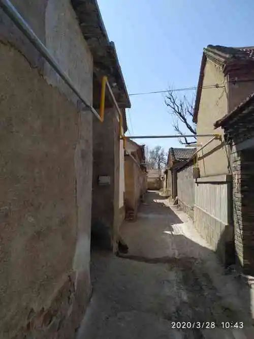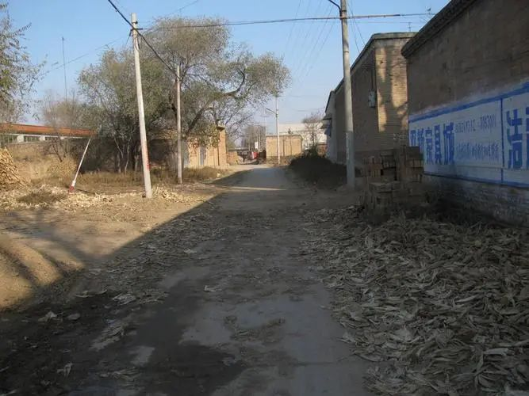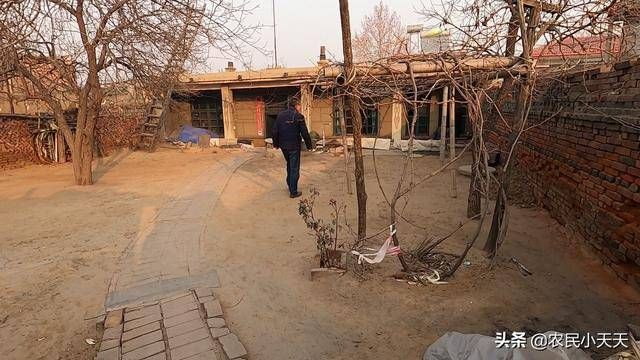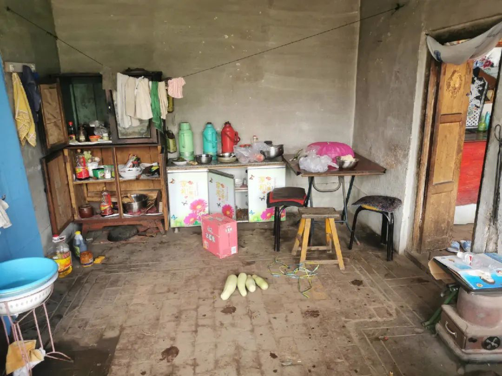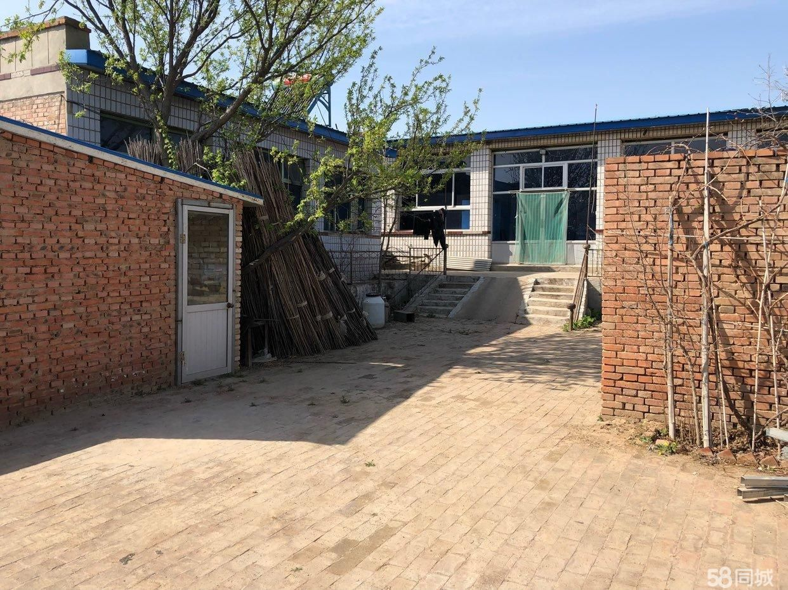

----

##### 20.[30] \<pid:730872293\> 2023-12-06 14:01:49 by 雨棚2022\(中国\)
你来我们山东农村看一看嘛，比以前那真是强得多——通路通电通水通气通网。但跟发达国家城镇比那真是夜郎自大

----

##### 21.[56] \<pid:730872377\> 2023-12-06 14:02:13 by 兜里叮当响\(辽宁\)
你怎么跟阿三棒子似的，日本冷战时期就步入发达国家行列了。

----

##### 22.[82] \<pid:730872401\> 2023-12-06 14:02:22 by cqlol\(浙江\)
人家是真的把安倍噶了
你行你上啊

----

##### 23.[1] \<pid:730872414\> 2023-12-06 14:02:28 by 修齐治平济天下\(北京\)
国内没那么差，本子也没那么好。
今年一个铁杆精日朋友带全家去了趟本子，回来一顿吐槽

----

##### 24.[0] \<pid:730872494\> 2023-12-06 14:02:55 by 泡泡咖啡机\(天津\)
我以前听说过有中国人去日本打黑工
我现在没听过有日本人跑中国打黑工

哈哈哈，现在生育率都比不过日本了……

----

##### 25.[36] \<pid:730872527\> 2023-12-06 14:03:04 by 月辰在上\(安徽\)
他妈的这么不要脸的话都能说得出口啊？

----

##### 26.[18] \<pid:730872626\> 2023-12-06 14:03:33 by 露西小囡\(韩国\)
楼主的农村是特指江浙沪为首的发达地区农村么？

----

##### 27.[14] \<pid:730872650\> 2023-12-06 14:03:41 by 十万の瞬间\(山东\)
你只在江浙沪农村或别有用心的示范村看是吧

----

##### 28.[3] \<pid:730872688\> 2023-12-06 14:03:54 by Archersline\(江苏\)
这也太赢过头了，有的领域领先还能说道说道，直接发展水平领先发达国家了

----

##### 29.[21] \<pid:730872716\> 2023-12-06 14:04:02 by 灼眼的安娜\(中国\)
上海的农村比爱媛的农村好这个我信，河南的农村比静冈的农村好我不信。

----

##### 30.[19] \<pid:730872757\> 2023-12-06 14:04:13 by 泡泡咖啡机\(天津\)
>[jump](#pid730872085) 考勒根(2023-12-06 14:00) 说: 
>
>大概一几年的时候，网络小说开始从本子当大BOSS变成把本子当中BOSS都丢份、只能当丑角

本质是民粹上头 事实啥都没变

----

##### 31.[0] \<pid:730872782\> 2023-12-06 14:04:20 by wanlianghai\(江苏\)
确实不如，输友们都想润日本呢

----

##### 32.[15] \<pid:730872833\> 2023-12-06 14:04:34 by VASUmk2\(广东\)
赢！zsbd

----

##### 33.[20] \<pid:730872973\> 2023-12-06 14:05:17 by psp3004pb\(广东\)
你是没去过农村还是没去过日本

----

##### 34.[10] \<pid:730872998\> 2023-12-06 14:05:23 by 然然的玫瑰花\(山东\)
>[jump](#pid730871491) 范阿尔特(2023-12-06 13:57) 说: 
>
>说实话你真去过农村吗，特别是中西部的农村，你这自信过了头吧

青岛的农村你去过吗？还有很多地方跟20年前没变化

----

##### 35.[16] \<pid:730873060\> 2023-12-06 14:05:41 by Makii_Sagiri\(山东\)
浙江的说话就是硬气！

----

##### 36.[23] \<pid:730873132\> 2023-12-06 14:06:03 by Blue蓝色经典Ra\(江苏\)
都不用说远的，你从bj开车，只要出了bj移动范围，你先看看什么光景。

----

##### 37.[26] \<pid:730873188\> 2023-12-06 14:06:23 by uverduefly\(上海\)
>[jump](#pid730871595) 天天宅家(2023-12-06 13:57) 说: 
>
>那你去过日本的偏远农村么

我去过冈山和熊本郊县，冈山是日本同事觉得很落后的地方
大概就和江浙沪这边农村差不多

----

##### 38.[12] \<pid:730873198\> 2023-12-06 14:06:25 by 咕嗒咕嗒狛绝势力\(上海\)
弱智吧入侵实录

----

##### 39.[0] \<pid:730873207\> 2023-12-06 14:06:28 by chriswang2019\(上海\)
综合国力远大于，部分方面有不足。

特别是文娱领域，差太远了。  

举个例子，日本奥运会会出很多纰漏是必然的，综合不如北京奥运会也是必然的。但是日本申奥时用的那套标识系统(会动的运动项目标识)就很妙，体现了很强的广告设计能力。

后来我们的运动会(好像是亚运会)也尝试抄了一套标识，效果就不咋滴。

----

##### 40.[2] \<pid:730873242\> 2023-12-06 14:06:38 by 十万の瞬间\(山东\)
>[jump](#pid730872293) 雨棚2022(2023-12-06 14:01) 说: 
>
>你来我们山东农村看一看嘛，比以前那真是强得多——通路通电通水通气通网。但跟发达国家城镇比那真是夜郎自大

不通气的多的是，通路这点还是给山东省点赞的，尤其是某个县级市12年不少村就弄上水泥路了。15年有的村小伙子相亲的时候，其中一点就是村里是水泥路，比不是水泥路的强

----

##### 41.[0] \<pid:730873329\> 2023-12-06 14:07:01 by 夏日荔枝\(广东\)
只见过江浙沪农村的就是硬气

----

##### 42.[6] \<pid:730873473\> 2023-12-06 14:07:44 by ミクのために生きでる\(上海\)
建议去支支教

----

##### 43.[0] \<pid:730873474\> 2023-12-06 14:07:44 by 泡泡咖啡机\(天津\)
>[jump](#pid730873329) 夏日荔枝(2023-12-06 14:07) 说: 
>
>只见过江浙沪农村的就是硬气

江浙沪水平在日本算差的

----

##### 44.[0] \<pid:730873496\> 2023-12-06 14:07:55 by 風行騅\(山东\)
我不知道日本富人过的啥日子  反正b站那个开宝马家里能看到东京塔的东京大明白吃住条件远不如我这个三线潍坊的

----

##### 45.[0] \<pid:730873509\> 2023-12-06 14:07:59 by JS05\(湖南\)
泥潭看的还不清楚？
国产手游，一定要日文配音，中文配音就弃游。手游的周年庆清一色日文配音，没有半句中文配音
影音区，韩系死绝了，日本的动画电影电视剧还吹上天，动不动就起高楼
漩涡书局，日系桥段死都死不觉，八竿子的剧情讨论着臭BS绿帽龟汹涌而至
然后B站，精日大本营，吹日系BGM捧成世界第一
谁在跪？

----

##### 46.[0] \<pid:730873572\> 2023-12-06 14:08:14 by 时雨思\(浙江\)
>[jump](#pid730873242) 十万の瞬间(2023-12-06 14:06) 说: 
>
>不通气的多的是，通路这点还是给山东省点赞的，尤其是某个县级市12年不少村就弄上水泥路了。15年有的村小伙子相亲的时候，其中一点就是村里是水泥路，比不是水泥路的强

农村通水泥路也不行吧…我们村这里十年前都是柏油路了

----

##### 47.[0] \<pid:730873580\> 2023-12-06 14:08:17 by 考勒根\(江苏\)
>[jump](#pid730872757) 泡泡咖啡机(2023-12-06 14:04) 说: 
>
>本质是民粹上头 事实啥都没变

至少从战略上藐视敌人的角度来说，心态上站起来了

----

##### 48.[0] \<pid:730873586\> 2023-12-06 14:08:18 by ragnarokhz\(中国\)
>[jump](#pid730872072) 五个半先生(2023-12-06 14:00) 说: 
>
>我以前听说过有中国人去日本打黑工
>我现在没听过有日本人跑中国打黑工

打黑工有的，但肯定不能和当初我们去日本打黑工那么大规模，更多的是一帮老头子混了永居后拿着退休金在中国过日子

----

##### 49.[33] \<pid:730873621\> 2023-12-06 14:08:30 by kiss14513879\(江苏\)
让我看到了一些印度人的自信

----

##### 50.[0] \<pid:730873630\> 2023-12-06 14:08:35 by 艾露恩的和谐\(广东\)
田忌赛马？
我们还是发展中国家

----

##### 51.[0] \<pid:730873692\> 2023-12-06 14:08:56 by 天天宅家\(江苏\)
>[jump](#pid730873474) 泡泡咖啡机(2023-12-06 14:07) 说: 
>
>江浙沪水平在日本算差的

笑死，别吹了

----

##### 52.[21] \<pid:730873706\> 2023-12-06 14:09:00 by 白兔糖不是Hentai\(福建\)
你这是赢上头了...
我们的确有长足的进步,但是整天觉得老牌发达国家过的比我们差,是不是有点太那啥了...
搁现在还有很多人去日本留学打工的...

----

##### 53.[0] \<pid:730873737\> 2023-12-06 14:09:08 by 十万の瞬间\(山东\)
>[jump](#pid730871789) 人类厄运共同体(2023-12-06 13:58) 说: 
>
>不算战前的，小日子至少富了有将近四十年吧，我们有富过那么久吗?
>

其实我们理应该比日本富得时间长多了，只是耽误了30多年

----

##### 54.[0] \<pid:730873764\> 2023-12-06 14:09:17 by 天天宅家\(江苏\)
>[jump](#pid730873188) uverduefly(2023-12-06 14:06) 说: 
>
>我去过冈山和熊本郊县，冈山是日本同事觉得很落后的地方
>大概就和江浙沪这边农村差不多

差不多？

----

##### 55.[0] \<pid:730873773\> 2023-12-06 14:09:20 by 其夜\(辽宁\)
想想这里是NGA，看到这种言论也不奇怪

----

##### 56.[8] \<pid:730873813\> 2023-12-06 14:09:31 by 艾露恩的和谐\(广东\)
>[jump](#pid730873474) 泡泡咖啡机(2023-12-06 14:07) 说: 
>
>江浙沪水平在日本算差的

认清我们是发展中国家是有必要的，但搁着儿吹牛逼大可不必。

----

##### 57.[0] \<pid:730873839\> 2023-12-06 14:09:36 by 熊大帅\(广东\)
>[jump](#pid730873188) uverduefly(2023-12-06 14:06) 说: 
>
>我去过冈山和熊本郊县，冈山是日本同事觉得很落后的地方
>大概就和江浙沪这边农村差不多

山阳的枢纽冈山都落后？？？
你让岛根、高知、宫崎、岩手这些县原地爆炸么？

----

##### 58.[0] \<pid:730873946\> 2023-12-06 14:10:09 by DragonKid\(日本\)
>[jump](#pid730872270) 哈夏课思敏(2023-12-06 14:01)说:
>>[jump](#pid0) 阴云笼罩的彼端(2023-12-06 13:55) 说: 
>>
>>说实话现在去农村地区逛一圈都觉得发展程度不比小日子小城镇要差，居然还有人觉得我们发展还不如日本的，什么心态？
>
>你去过哪里的农村？
>
>这是我家乡农村. 河北

我2017年在爱知县知多郡美浜町河和台南边的渔村边上打工，没比你这好哪儿去

----

##### 59.[0] \<pid:730873999\> 2023-12-06 14:10:23 by Ke3397\(广东\)
>[jump](#pid730871595) 天天宅家(2023-12-06 13:57) 说: 
>
>那你去过日本的偏远农村么

前几天看论坛，四川彝族那里应该没日本偏远农村好吧。

----

##### 60.[0] \<pid:730874046\> 2023-12-06 14:10:40 by 香草猪头肉\(中国\)
>[jump](#pid730871595) 天天宅家(2023-12-06 13:57) 说: 
>
>那你去过日本的偏远农村么

你去过？？夜郎国来的？？中国就TMD江浙沪那一片是不？

----

##### 61.[0] \<pid:730874166\> 2023-12-06 14:11:17 by NN777\(江苏\)
>[jump](#pid730871789) 人类厄运共同体(2023-12-06 13:58) 说: 
>
>不算战前的，小日子至少富了有将近四十年吧，我们有富过那么久吗?
>

去掉那么久！

----

##### 62.[0] \<pid:730874172\> 2023-12-06 14:11:19 by kagakey\(日本\)
国家肯定摁着锤
老百姓还得有几年吧

----

##### 63.[0] \<pid:730874326\> 2023-12-06 14:12:01 by 文莫周永西\(中国\)
>[jump](#pid0) 阴云笼罩的彼端(2023-12-06 13:55) 说: 
>
>说实话现在去农村地区逛一圈都觉得发展程度不比小日子小城镇要差，居然还有人觉得我们发展还不如日本的，什么心态？

你这么牛逼，应该有钱吧，好歹去西部看看

----

##### 64.[0] \<pid:730874379\> 2023-12-06 14:12:16 by 泡泡咖啡机\(天津\)
>[jump](#pid730873692) 天天宅家(2023-12-06 14:08) 说: 
>
>笑死，别吹了

比鸟取强 比冈山差 三大都市圈更别提了
我认为我是在拿日本的浙南 苏中和中国的江浙沪比

----

##### 65.[17] \<pid:730874427\> 2023-12-06 14:12:29 by dilidili带会员\(北京\)
什么时候出现日韩欧美来中国打黑工了，说明国内福利已经进入发达国家了

----

##### 66.[0] \<pid:730874517\> 2023-12-06 14:12:57 by unieksnowl\(上海\)
我路过过日本农村……

就是那种山脚下的那种

看着外貌和国内差不多，有土地，有大棚

就是房子精致点，车好点，路好点

工资不知道，家里没有还在种地的，
日本农民一个月挣多少俺也不清楚，有人来补充补充吗？

----

##### 67.[0] \<pid:730874536\> 2023-12-06 14:13:02 by 有个小德\(中国\)
又赢了，好耶

----

##### 68.[0] \<pid:730874709\> 2023-12-06 14:13:53 by kimihomu\(江苏\)
>[jump](#pid730874046) 香草猪头肉(2023-12-06 14:10) 说: 
>
>你去过？？夜郎国来的？？中国就TMD江浙沪那一片是不？

日本就东京那一片？

----

##### 69.[0] \<pid:730874766\> 2023-12-06 14:14:11 by 泡泡咖啡机\(天津\)
>[jump](#pid730873764) 天天宅家(2023-12-06 14:09) 说: 
>
>差不多？
>
>

冈山是大阪都市圈外围 但是无论多偏 还是濑户内海范围 可以理解成珠三角的惠州

----

##### 70.[7] \<pid:730874877\> 2023-12-06 14:14:43 by 人类厄运共同体\(广东\)
>[jump](#pid730873242) 十万の瞬间(2023-12-06 14:06) 说: 
>
>不通气的多的是，通路这点还是给山东省点赞的，尤其是某个县级市12年不少村就弄上水泥路了。15年有的村小伙子相亲的时候，其中一点就是村里是水泥路，比不是水泥路的强

山东基本都是大平原吧，修路成本低啊，来福建广东广西再看看。要流眼泪了。别说乡下了，城市里还很多土路呢。

----

##### 71.[0] \<pid:730874957\> 2023-12-06 14:15:04 by kometei\(四川\)
国内没那么差，日本也没那么好
但是你要说觉得现在比日本强？

----

##### 72.[0] \<pid:730875033\> 2023-12-06 14:15:22 by 吃人不吐骨头\(上海\)
日本待过多久？

----

##### 73.[0] \<pid:730875057\> 2023-12-06 14:15:28 by 自律且安逸\(广东\)
>[jump](#pid730871491) 范阿尔特(2023-12-06 13:57) 说: 
>
>说实话你真去过农村吗，特别是中西部的农村，你这自信过了头吧

那么你去过吗？
你觉得差在什么地方呢？

----

##### 74.[7] \<pid:730875197\> 2023-12-06 14:16:06 by 熊大帅\(广东\)
>[jump](#pid730872716) 灼眼的安娜(2023-12-06 14:04) 说: 
>
>上海的农村比爱媛的农村好这个我信，河南的农村比静冈的农村好我不信。

你说爱媛，我敢赌论坛里多数人第一想到的是果冻橙，而不是伊予国的那个县。
而且，想到果冻橙的人里，又有一多半不知道这个蜜柑品种是引进的。

----

##### 75.[0] \<pid:730875224\> 2023-12-06 14:16:13 by 泡泡咖啡机\(天津\)
>[jump](#pid730873839) 熊大帅(2023-12-06 14:09) 说: 
>
>山阳的枢纽冈山都落后？？？
>你让岛根、高知、宫崎、岩手这些县原地爆炸么？

人家大阪人 看不起冈山 自然更看不起鸟取

上海人顶多看得起苏南(兵库县) 冈山属于苏中了 鸟取就是苏北了

----

##### 76.[9] \<pid:730875460\> 2023-12-06 14:17:22 by euuns\(北京\)
日本一亿多人口一大半都在城市群，农村有好有差，差点如北海道其实也不怎么样，但是这部分人不多

如果只拿中国头部一亿多人口跟日本比，不见得会差甚至可能还强过日本，但中国大部分人口还是在农村地区的，要算整体水平明显差很多的

----

##### 77.[0] \<pid:730875595\> 2023-12-06 14:18:08 by jvozen\(上海\)
对对对~~~~~~

----

##### 78.[11] \<pid:730875645\> 2023-12-06 14:18:22 by thatcoolman\(河南\)
你说的农村是
村里盖了个写字楼租出去，一年分红十几个的农村么

----

##### 79.[0] \<pid:730875680\> 2023-12-06 14:18:31 by Ke3397\(广东\)
>[jump](#pid730873329) 夏日荔枝(2023-12-06 14:07) 说: 
>
>只见过江浙沪农村的就是硬气

苏北应该没那么好吧，我叔转业在徐州，以前我去铜山区机械厂打工，他们乡下感觉一般般，还第一次看到办白事，晚上跳艳舞，大为震惊。

----

##### 80.[21] \<pid:730875706\> 2023-12-06 14:18:42 by 十万の瞬间\(山东\)
>[jump](#pid730875057) 自律且安逸(2023-12-06 14:15) 说: 
>
>那么你去过吗？
>你觉得差在什么地方呢？

江浙沪论坛又来了，支教去的都是外国是吧

----

##### 81.[10] \<pid:730875754\> 2023-12-06 14:18:58 by fe8923232\(江苏\)
人均差远了  真以为人均北上啊

----

##### 82.[0] \<pid:730875913\> 2023-12-06 14:19:50 by UID61490621\(重庆\)
懂你意思，这下遥遥领先发达国家了，你已经帮国家完成小康社会了，无敌了。

----

##### 83.[0] \<pid:730878491\> 2023-12-06 14:32:44 by 打小补氪\(福建\)
我觉得我们绝对是比日本要强多了。
大题比较可以从经济、文化 、军事、民族独立性层面去比。
经济总量就不说了，我们对日本总量优势是不可逆的。日式企业在他们自己国家乃至全球的发展也是越来越停滞不前了。
而我们国家的经济，就当是在这波全球经济衰退的浪潮中还是有可圈可点的一面。大方向还是能做到挺立向前，坚持不懈的。
国民平均收入这块对比日本还是有差距的。但是人民币的购买力，中国和日本的生活工作成本差距也抵消了一大部分这种收入差距。
文化方面，日本与我们中国比差距太大。他们国家的历史沉淀太差，很多文化还是借鉴抄袭我们的汉文化。这个根本没必要去比，不在一个层面上。可能最多有一点比我们做的好，就是文化输出这块。包括，游戏，动漫等，向全球输出的程度。但是这块也不能完全说是我们做的不好，主要问题还是在于我们国家体制问题。毕竟我们是社会主义国家，我们国家文化输出在世界范围内还是没那么容易被人接受的。(这个世界上大部分别的国家的民众思想政治水平太低，还是需要以我们中国为首的社会主义阵营慢慢宣传，指导，改变他们的。)
军事实力方面，相信也不用比。
民族独立性这块，我认为是最重要的。日本现在还是美国的附属国，他们的民众也好，所谓的精英人士也好，政要也好，全部都是清一色依附美国投靠美国的。在我的说法，他们根本做不到独立自主，这点朝鲜人民都可以自豪的说他们比日本人强多了，别说我们中国人民了。
作为一个中国人，我是非常自豪的。我们国家(国家层面)真的是一个独立，富强，民主，正直，宽仁，谦让，但同时坚定立场，关键时候，敢打敢拼，勇于向前的大国。  
至于很多人说农民生活水平问题。这块你非要说收入跟日本农民比，我是觉得有失偏颇的。我们农村生活成本大概也比日本农村生活成本低多了。

----

##### 84.[0] \<pid:730878648\> 2023-12-06 14:33:36 by 阿强1998\(广东\)
睁开眼睛再看看吧

----

##### 85.[14] \<pid:730878821\> 2023-12-06 14:34:27 by km585\(江苏\)
>[jump](#pid730875057) 自律且安逸(2023-12-06 14:15)说:
>>[jump](#pid730871491) 范阿尔特(2023-12-06 13:57) 说: 
>>
>>说实话你真去过农村吗，特别是中西部的农村，你这自信过了头吧
>
>那么你去过吗？
>你觉得差在什么地方呢？

<b>作为一个江苏人，我在B站偶尔看到一些日本的风土人情 旅游 老屋改造的一些乡村场景，我觉得小日子虽然不当人，但是我们暂时确实没有全方面超越人家。

不要跟隔壁阿三一样，拿孟买好的地方跟我们上海弄堂里比(虽然可能地价还是上海高)

旅游去过苏北 东北 云南等地方，欠发达地区的基建其实还是很一般，咱就是说苏锡常一些乡下。。。的地方可能也就那样，就一些郊区的改造也就是这几年间的事吧，苏锡常在国内应该还算不错的地方了吧，另外日本的农民应该比我们的农民日子好过的多。
</b>

----

##### 86.[6] \<pid:730879048\> 2023-12-06 14:35:32 by 大号又被禁言了\(上海\)
这种铁钓鱼的帖子都能回复这么多

----

##### 87.[7] \<pid:730879187\> 2023-12-06 14:36:19 by tianpei326\(北京\)
差了十万八千里，真是迷之自信

----

##### 88.[5] \<pid:730879216\> 2023-12-06 14:36:26 by 熊大帅\(广东\)
>[jump](#pid730875224) 泡泡咖啡机(2023-12-06 14:16) 说: 
>
>人家大阪人 看不起冈山 自然更看不起鸟取
>
>上海人顶多看得起苏南(兵库县) 冈山属于苏中了 鸟取就是苏北了

大家都是用着60Hz交流电的人，要团结起来对抗关东那些用50Hz核辐射电的人哇。

----

##### 89.[6] \<pid:730879374\> 2023-12-06 14:37:16 by 灰头土脸回来了\(广东\)
你怕是红红的水军把，你看看日本的中国人口，很多人是没法出去，不然更多人去

----

##### 90.[0] \<pid:730879401\> 2023-12-06 14:37:25 by ailcx\(上海\)
工资不如日本人高，日本法定最低工资都是我现在收入的两倍多

----

##### 91.[2] \<pid:730879425\> 2023-12-06 14:37:33 by listrey0722\(广东\)
别把自信当无知。

----

##### 92.[13] \<pid:730879489\> 2023-12-06 14:37:56 by 生产队的驴\(山东\)
>[jump](#pid730872095) mumei无名闻天下(2023-12-06 14:00) 说: 
>
>我觉得这是一种自信

是的，印度人是世界上最自信的民族

----

##### 93.[5] \<pid:730879524\> 2023-12-06 14:38:08 by bigmango1995\(四川\)
男女平等方面确实不如人家那边男女都是牛马，这边嘛…只有一方是牛马，你猜是哪方？

----

##### 94.[0] \<pid:730879542\> 2023-12-06 14:38:13 by 沉默的表示\(江苏\)
>[jump](#pid730875460) euuns(2023-12-06 14:17) 说: 
>
>日本一亿多人口一大半都在城市群，农村有好有差，差点如北海道其实也不怎么样，但是这部分人不多
>
>如果只拿中国头部一亿多人口跟日本比，不见得会差甚至可能还强过日本，但中国大部分人口还是在农村地区的，要算整体水平明显差很多的

3202年了……
城市化率6成了，还有流动性更强不计入城市常驻人口的部分，哪里来的大部分在农村

----

##### 95.[0] \<pid:730879544\> 2023-12-06 14:38:13 by impk2004\(河北\)
>[jump](#pid730872401) cqlol(2023-12-06 14:02) 说: 
>
>人家是真的把安倍噶了
>你行你上啊
>

你赢了

----

##### 96.[0] \<pid:730879658\> 2023-12-06 14:38:47 by DisciplineSloth\(澳大利亚\)
主要还是看发帖的形式，如果主楼换成“还真能有人觉得我们现在全面超过日本的？”，那答案就完全反过来了

----

##### 97.[0] \<pid:730879681\> 2023-12-06 14:38:56 by 非洲人在欧洲\(上海\)
>[jump](#pid730872716) 灼眼的安娜(2023-12-06 14:04) 说: 
>
>上海的农村比爱媛的农村好这个我信，河南的农村比静冈的农村好我不信。

你先去看看崇明的再来说

----

##### 98.[6] \<pid:730879849\> 2023-12-06 14:39:49 by ailcx\(上海\)
>[jump](#pid730875057) 自律且安逸(2023-12-06 14:15) 说: 
>
>那么你去过吗？
>你觉得差在什么地方呢？

日本人工资比我们高，各个不同阶级的工资收入差距没有我们这么悬殊，像是我们老百姓普通社畜，工资还不到日本法定最低工资的一半
但是看到很多做it的说开发的收入国内大厂比日本还高

这个贫富差距太大了让人难顶

----

##### 99.[0] \<pid:730879917\> 2023-12-06 14:40:10 by 翱翔的肥皂泡\(广东\)
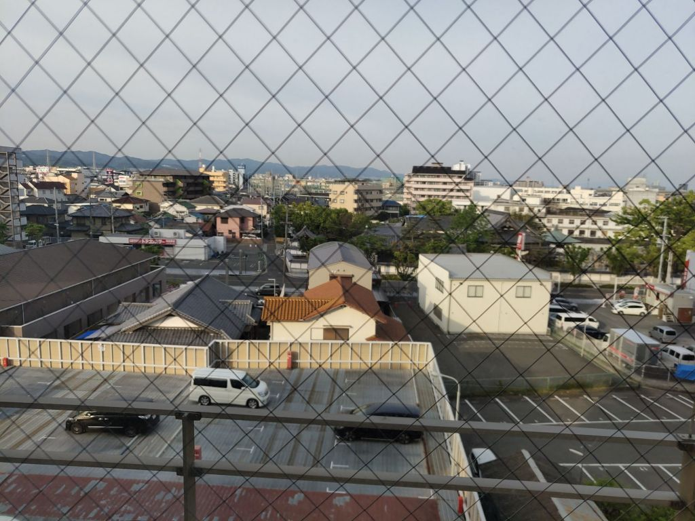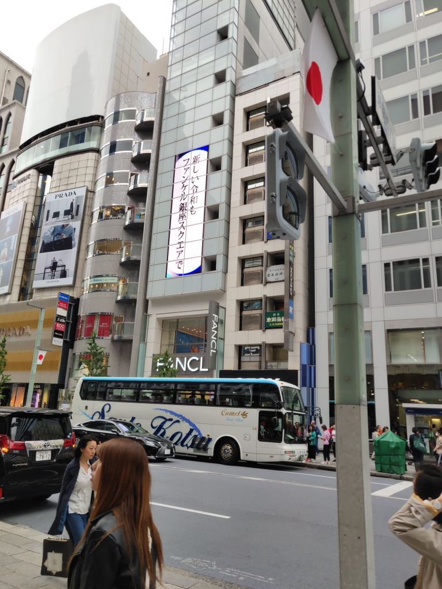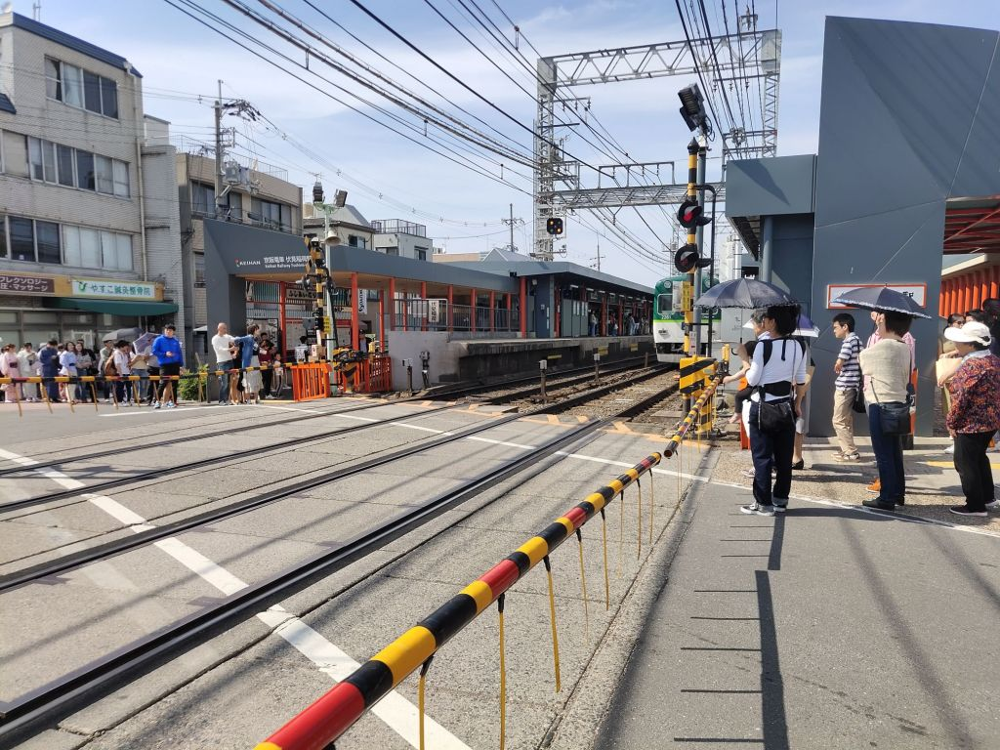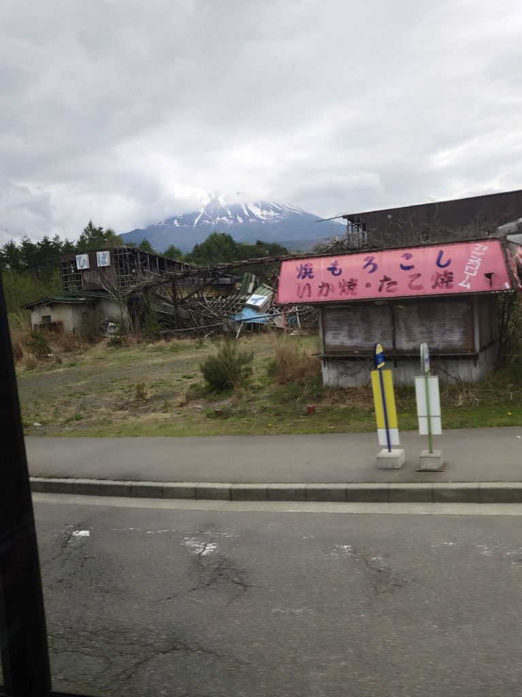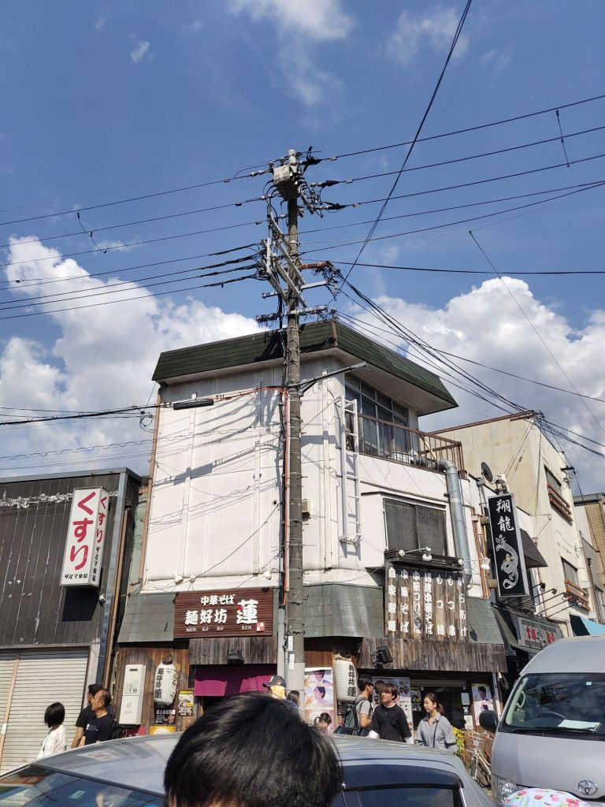
没特意跑农村去，不过感觉他们的农村跟梅州那边差不多

----

##### 100.[0] \<pid:730879984\> 2023-12-06 14:40:32 by ailcx\(上海\)
>[jump](#pid730879681) 非洲人在欧洲(2023-12-06 14:38) 说: 
>
>你先去看看崇明的再来说

崇明有啥不好啊生态岛，绿色环保，你小日本能做到？

----

##### 101.[0] \<pid:730879985\> 2023-12-06 14:40:32 by 玩恩基爱玩的\(江苏\)
>[jump](#pid730872270) 哈夏课思敏(2023-12-06 14:01) 说: 
>
>你去过哪里的农村？
>
>这是我家乡农村. 河北[img].

怎么还有汽车，不应该只有牛车么

----

##### 102.[0] \<pid:730880081\> 2023-12-06 14:41:03 by 白兔糖不是Hentai\(福建\)
>[jump](#pid730874517) unieksnowl(2023-12-06 14:12)说:
>我路过过日本农村……
>
>就是那种山脚下的那种
>
>看着外貌和国内差不多，有土地，有大棚
>
>就是房子精致点，车好点，路好点
>
>工资不知道，家里没有还在种地的，
>日本农民一个月挣多少俺也不清楚，有人来补充补充吗？

日本农民赚的不少,他们政府补贴特别多
农产品卖的也很贵,他们有很严格的农业贸易保护

----

##### 103.[2] \<pid:730880110\> 2023-12-06 14:41:14 by 星星到达的地方\(安徽\)
坐井观天，被洗脑了吧，哪点超日本了

----

##### 104.[0] \<pid:730880170\> 2023-12-06 14:41:34 by lxpz\(广西\)
核海产自产自销，你觉得能比？

----

##### 105.[3] \<pid:730880287\> 2023-12-06 14:42:16 by joahnn\(中国\)
发达国家 发展中国家 这是事实 认清楚 中国踏入发达国家的时候 要么就是打过仗了 要么其他国家基本都废了 要么人口已经很少了 就这么几种可能

----

##### 106.[5] \<pid:730880331\> 2023-12-06 14:42:29 by 孝典批乐急崩润麻赢6\(福建\)
楼主这种未尝不是一种反差

----

##### 107.[5] \<pid:730880338\> 2023-12-06 14:42:31 by 基金小天才\(香港\)
自信过头了 
我国农村平均程度 要是能超过日本
已经是发达国家了

----

##### 108.[0] \<pid:730880436\> 2023-12-06 14:43:01 by 非洲人在欧洲\(上海\)
>[jump](#pid730879984) ailcx(2023-12-06 14:40) 说: 
>
>崇明有啥不好啊生态岛，绿色环保，你小日本能做到？

你见过崇明的农村吗？张口就来

----

##### 109.[14] \<pid:730880572\> 2023-12-06 14:43:46 by 泡泡咖啡机\(天津\)
>[jump](#pid730879542) 沉默的表示(2023-12-06 14:38) 说: 
>
>3202年了……
>城市化率6成了，还有流动性更强不计入城市常驻人口的部分，哪里来的大部分在农村

日本这个数是93%  
别跟我谈什么日本93%是假的
日本的乡村是一种享受了城市化服务的地区，医疗、公园、金融服务、给排水、供电等，按照中国标准已经城市化了，只不过有一些人还从事农业工作。
更像美国的郊区。
比如某家日本工厂在枥木县的小田原，在工厂门口有农田，距离工厂不远的大超市，门口就是一大片大麦地。
日本按照中国标准的城市化可以说基本已经完成，不会有多大的进展了。

天津东丽疫情前交付的小区 往外看也能看到耕种的农田啥的，骑车十分钟可以到附近工厂

----

##### 110.[4] \<pid:730880610\> 2023-12-06 14:43:54 by 小小的tony\(广东\)
山东已经不算穷地方吧，我看很多up主采购当地老农，一年十亩地扣掉成本一年也就赚个万八。。。

----

##### 111.[0] \<pid:730880786\> 2023-12-06 14:44:47 by kqwert\(江西\)
楼里这么多急着去吃核海鲜的吗

----

##### 112.[4] \<pid:730881034\> 2023-12-06 14:46:04 by unlimited_blade\(广东\)
上网多了上出幻觉了，你也不想想这种环境都强行人工过滤了多少遍了。

----

##### 113.[0] \<pid:730881155\> 2023-12-06 14:46:43 by 花客333\(陕西\)
>[jump](#pid730871789) 人类厄运共同体(2023-12-06 13:58) 说: 
>
>不算战前的，小日子至少富了有将近四十年吧，我们有富过那么久吗?
>

老祖宗富了几千年你咋不说了？噢你不是中国人，那确实不怪你

----

##### 114.[6] \<pid:730883410\> 2023-12-06 14:58:38 by 毛纸的傲娇\(中国\)
>[jump](#pid730872626) 露西小囡(2023-12-06 14:03)说:
>楼主的农村是特指江浙沪为首的发达地区农村么？

我那个笨蛋姐姐嫁的江苏人，苏北的农村，淮安市下面的某县工作，她结婚时候我去过。

那个小村子连车辆单行道都没有，全村加起来也就十几户人家，房子破的都不如我们东北的农村。

哪怕是最富裕的江浙沪都有这种农村，何况其他省。。。。。

----

##### 115.[0] \<pid:730883678\> 2023-12-06 14:59:51 by Juice_G\(四川\)
整体国力肯定超过日本了，但是我们目前的阶段对比日本同期的类似阶段，两国普通人的经济水平还是差远了

----

##### 116.[0] \<pid:730883881\> 2023-12-06 15:00:43 by 熊大帅\(广东\)
>[jump](#pid730880572) 泡泡咖啡机(2023-12-06 14:43) 说: 
>
>日本这个数是93%  
>别跟我谈什么日本93%是假的
>日本的乡村是一种享受了城市化服务的地区，医疗、公园、金融服务、给排水、供电等，按照中国标准已经城市化了，只不过有一些人还从事农业工作。
>更像美国的郊区。
>比如某家日本工厂在枥木县的小田原，在工厂门口有农田，距离工厂不远的大超市，门口就是一大片大麦地。
>日本按照中国标准的城市化可以说基本已经完成，不会有多大的进展了。
>
>天津东丽疫情前交付的小区 往外看也能看到耕种的农田啥的，骑车十分钟可以到附近工厂

你说的确实没错，可小田原怎么跑到枥木县去了啊？

----

##### 117.[15] \<pid:730884482\> 2023-12-06 15:03:48 by 泡泡咖啡机\(天津\)
>[jump](#pid730881155) 花客333(2023-12-06 14:46) 说: 
>
>老祖宗富了几千年你咋不说了？噢你不是中国人，那确实不怪你

菜就多练 输不起就别玩 以前是以前 现在是现在 
你要是一直拿以前当现在 哥们 你怎么不拿你刚出生的时候对比啊

----

##### 119.[0] \<pid:730884906\> 2023-12-06 15:06:05 by 哈夏课思敏\(河北\)
>[jump](#pid730879985) 玩恩基爱玩的(2023-12-06 14:40) 说: 
>
>怎么还有汽车，不应该只有牛车么

别逗了，即使河北农村也基本家家有汽车啊.

----

##### 120.[5] \<pid:730884943\> 2023-12-06 15:06:20 by 自由浪者\(广东\)
农民是不是对你家做过啥了？这么看不得？狗东西楼主。

----

##### 121.[14] \<pid:730885131\> 2023-12-06 15:07:14 by 【心殇\(江苏\)
超日本？超美国！人民的日子好起来啦

----

##### 122.[4] \<pid:730885220\> 2023-12-06 15:07:46 by 被绊倒的章鱼哥\(海南\)
比啥呢，沿海省份也有农村很贫穷的，而且不少。

----

##### 123.[0] \<pid:730885244\> 2023-12-06 15:07:54 by 自律且安逸\(广东\)
>[jump](#pid730879849) ailcx(2023-12-06 14:39) 说: 
>
>日本人工资比我们高，各个不同阶级的工资收入差距没有我们这么悬殊，像是我们老百姓普通社畜，工资还不到日本法定最低工资的一半
>但是看到很多做it的说开发的收入国内大厂比日本还高
>
>这个贫富差距太大了让人难顶

那为什么润人会在日本饿死？
日本这么好的话，那应该和讲师一样街道上领食物了。
我爱说实话。

----

##### 124.[0] \<pid:730885359\> 2023-12-06 15:08:28 by ailcx\(上海\)
>[jump](#pid730880436) 非洲人在欧洲(2023-12-06 14:43) 说: 
>
>你见过崇明的农村吗？张口就来

去年花博会没去过？一路上都是小别墅，城里人看的酸了

----

##### 125.[0] \<pid:730885499\> 2023-12-06 15:09:13 by merlini0403\(四川\)
楼里的反贼是真的明目张胆啊，那你要比最穷的，给大家看看饿死的日本人可以吗，2023年了满大街圆椒女，还有人饿死，这就是强大的日本

----

##### 126.[5] \<pid:730885579\> 2023-12-06 15:09:37 by 偶数极限\(中国\)
日本农村的也开自动拾取？
虽然我知道东京那边都是明抢 

----

##### 127.[0] \<pid:730885595\> 2023-12-06 15:09:40 by Ken__leung\(香港\)
在变态这一方面确实不如

----

##### 128.[11] \<pid:730885614\> 2023-12-06 15:09:45 by 光幽幽\(贵州\)
满脑子赢赢赢建议发国际新闻版

----

##### 129.[2] \<pid:730885729\> 2023-12-06 15:10:17 by 公子琭\(辽宁\)
>[jump](#pid730872401) cqlol(2023-12-06 14:02) 说: 
>
>人家是真的把安倍噶了
>你行你上啊
>

不要命辣

----

##### 130.[0] \<pid:730885847\> 2023-12-06 15:10:47 by 爱学习的小羊\(中国\)
你居然敢在输区发这种大逆不道的话

----

##### 131.[0] \<pid:730885942\> 2023-12-06 15:11:13 by 雪城月心\(江苏\)
确实，从网络小说来说，0几年的时候基本每本都有干鬼子的大段剧情，哪怕打外星人，也有那种矮子穿兜裆布的外星人打。

----

##### 132.[6] \<pid:730886173\> 2023-12-06 15:12:23 by 堂堂正正發帖\(四川\)
>[jump](#pid730871595) 天天宅家(2023-12-06 13:57) 说: 
>
>那你去过日本的偏远农村么

还真去过，对比一下吧。

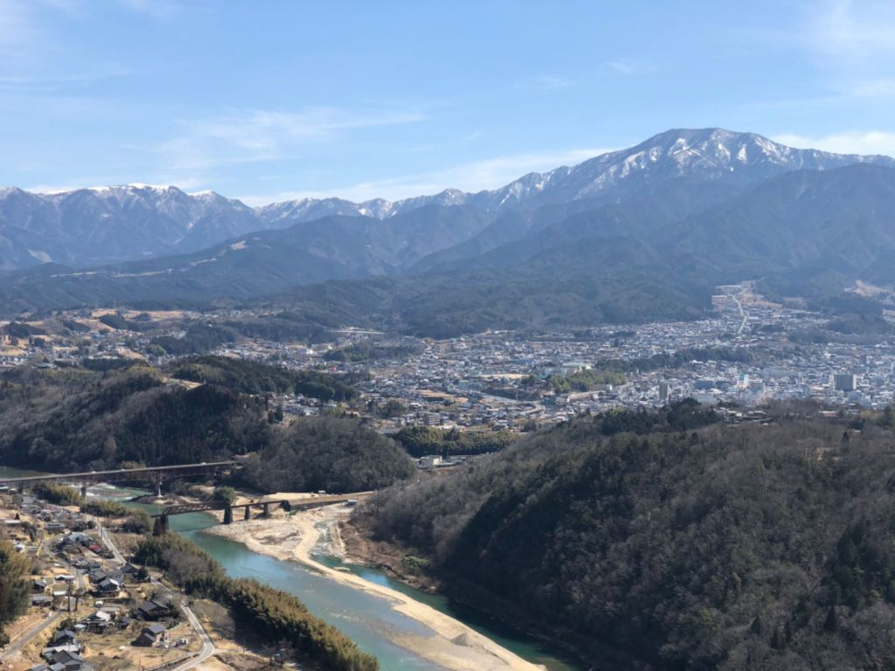

----

##### 133.[0] \<pid:730886221\> 2023-12-06 15:12:37 by peawawa\(江苏\)
还好我去过几个省的农村。

----

##### 134.[0] \<pid:730886389\> 2023-12-06 15:13:20 by 偶数极限\(中国\)
>[jump](#pid730885942) 雪城月心(2023-12-06 15:11) 说: 
>
>确实，从网络小说来说，0几年的时候基本每本都有干鬼子的大段剧情，哪怕打外星人，也有那种矮子穿兜裆布的外星人打。

那个傲世九重天就难绷  最后boss是脚盆

----

##### 135.[4] \<pid:730886609\> 2023-12-06 15:14:23 by 非洲人在欧洲\(上海\)
>[jump](#pid730885359) ailcx(2023-12-06 15:08) 说: 
>
>去年花博会没去过？一路上都是小别墅，城里人看的酸了

你以为崇明就是陈海公路？

----

##### 136.[0] \<pid:730886648\> 2023-12-06 15:14:32 by 天天宅家\(江苏\)
>[jump](#pid730886173) 堂堂正正發帖(2023-12-06 15:12) 说: 
>
>还真去过，对比一下吧。
>
>
>

对比啥，这也不行啊

----

##### 137.[0] \<pid:730886748\> 2023-12-06 15:14:56 by 路过鱼店的猫\(上海\)
>[jump](#pid730872401) cqlol(2023-12-06 14:02) 说: 
>
>人家是真的把安倍噶了
>你行你上啊
>

行啊，你把安倍复活了，我再去噶一遍

----

##### 138.[11] \<pid:730886819\> 2023-12-06 15:15:19 by 奶牛人\(中国\)
至少在房价上，已经碾压日本了

----

##### 139.[0] \<pid:730886886\> 2023-12-06 15:15:40 by Owen2k\(江苏\)
这个问题的争议不会存在太久了，现在日本还在稳步下降中国在稳步上升，10年后就双向奔赴了

----

##### 140.[0] \<pid:730887036\> 2023-12-06 15:16:26 by 笨熊不爬树\(四川\)
任你巧舌如簧，我们的土地上可没有美国大兵横行霸道

----

##### 141.[8] \<pid:730887041\> 2023-12-06 15:16:26 by 棘になる\(日本\)
>[jump](#pid730871595) 天天宅家(2023-12-06 13:57) 说: 
>
>那你去过日本的偏远农村么

我去过啊
鹿儿岛的农村比苏州西边北边的农村可好太多了

----

##### 142.[0] \<pid:730887076\> 2023-12-06 15:16:37 by fateofter3\(北京\)
>[jump](#pid730872401) cqlol(2023-12-06 14:02)说:
>人家是真的把安倍噶了
>你行你上啊
>

你杀死了比赛

----

##### 143.[0] \<pid:730887101\> 2023-12-06 15:16:44 by zorro_2\(贵州\)
>[jump](#pid730872072) 五个半先生(2023-12-06 14:00) 说: 
>
>我以前听说过有中国人去日本打黑工
>我现在没听过有日本人跑中国打黑工

日本人确实不打黑工 只是下南洋
现在上海是时下热门的下南洋地点之一

----

##### 144.[6] \<pid:730887114\> 2023-12-06 15:16:48 by 泡泡咖啡机\(天津\)
>[jump](#pid730885244) 自律且安逸(2023-12-06 15:07) 说: 
>
>那为什么润人会在日本饿死？
>日本这么好的话，那应该和讲师一样街道上领食物了。
>我爱说实话。

那位喝可乐都喝无糖的 有钱不买吃的 去健身房办卡

她作为媒体人非常不专业
神待少女了解一下 等待不到神明 直接化身女版三和大神
日本称之麦当劳难民少女
现在主要组成部分是找不到工作又不想离开东京的无业年轻女性
经济下行 日本男性都去当“新时代独立男性”了
职场上卷 彻底杜绝转移支付
她作为媒体人这个都不懂
直接杀入东京 喜迎大逃杀
饿死还是挺正常的

----

##### 145.[0] \<pid:730887177\> 2023-12-06 15:17:04 by 狗大佐宰了炖汤\(中国\)
>[jump](#pid730872072) 五个半先生(2023-12-06 14:00)说:
>我以前听说过有中国人去日本打黑工
>我现在没听过有日本人跑中国打黑工

有的，上海这里某些传统职业收入比日本高，有日本老师常驻，工作中还能播放老师的作品一起品鉴

----

##### 146.[0] \<pid:730887436\> 2023-12-06 15:18:24 by 小五是sam\(广东\)
>[jump](#pid730871491) 范阿尔特(2023-12-06 13:57) 说: 
>
>说实话你真去过农村吗，特别是中西部的农村，你这自信过了头吧

看你IP也是湖北的，恩施算中西部了吧，很差吗？

----

##### 147.[8] \<pid:730887447\> 2023-12-06 15:18:28 by 白兔糖不是Hentai\(福建\)
>[jump](#pid730886648) 天天宅家(2023-12-06 15:14)说:
>>[jump](#pid730886173) 堂堂正正發帖(2023-12-06 15:12) 说: 
>>
>>还真去过，对比一下吧。
>>
>>
>>
>
>对比啥，这也不行啊

求求你别天天宅家里了,出门看看吧
中国广袤土地多走走,好歹出趟市区啊,别整天活在网络上

----

##### 148.[11] \<pid:730887688\> 2023-12-06 15:19:44 by 德纲正恩\(河南\)
日本衰退40年社会保持稳定不出乱子，你行吗？

----

##### 149.[6] \<pid:730887860\> 2023-12-06 15:20:36 by 卖血狂魔郭奉孝\(法国\)
长三角的农村和陕甘宁的农村
那是一回事吗？

----

##### 150.[5] \<pid:730888273\> 2023-12-06 15:22:33 by tedtaylor\(中国\)
>[jump](#pid730887860) 卖血狂魔郭奉孝(2023-12-06 15:20)说:
>长三角的农村和陕甘宁的农村
>那是一回事吗？

长三角也差远了，不仅是建筑的设计、维护，还是各方面软硬件实力都不在一个档次上。更不用说人，人摆在一起看得清清楚楚。

----

##### 151.[0] \<pid:730888437\> 2023-12-06 15:23:22 by Ecilho\(江苏\)
如果不比整体，中国现在确实比日本强。就他妈的大阪世博会这种事，2009年的上海都比大阪现在强的多都做不出现在这种事。如果比整体，那就是不如。因为全中国的人过上发达国家的生活根本不现实。

----

##### 152.[0] \<pid:730888502\> 2023-12-06 15:23:43 by UID63222424\(湖北\)
非要比农村的话别人有农协。。。农产品交个保护费就给你拖走了

----

##### 153.[4] \<pid:730888600\> 2023-12-06 15:24:11 by 可拉哈了\(江苏\)
>[jump](#pid730873692) 天天宅家(2023-12-06 14:08)说:
>>[jump](#pid730873474) 泡泡咖啡机(2023-12-06 14:07) 说: 
>>
>>江浙沪水平在日本算差的
>
>笑死，别吹了

<b>江浙沪我都去过 江浙沪农村 苏北最差 苏南 上海 浙江非杭州附近中等 杭州附近是最好的</b>
但是就算苏北 也是全国前列水平了
但是有个问题 外部 也就是非个人出资的道路 绿化 水电 水准远高于农民自己造的房子和内部装修
有一种只有外表好看的感觉

----

##### 154.[6] \<pid:730888605\> 2023-12-06 15:24:12 by jiagao2003\(浙江\)
日本虽然旅游过,但是乡下没有深入了解,但是自己老家是乡下的,我就这么说吧,农村到现在还有用公共旱厕的,地上挖个方形的坑,铺两块木板就是厕所了,然后跟猪圈在同一个屋...
我这还是浙江乡下呢,更偏的地方更难以想象了

----

##### 155.[0] \<pid:730888612\> 2023-12-06 15:24:14 by 港南村吴彦祖\(江苏\)
核辐射摄入量不如日本，中恐输

----

##### 156.[0] \<pid:730888808\> 2023-12-06 15:25:17 by Antoc\(河北\)
 

各有千秋

比如梅毒就比不上日本

----

##### 157.[12] \<pid:730888812\> 2023-12-06 15:25:17 by aliensung\(江苏\)
>[jump](#pid730887036) 笨熊不爬树(2023-12-06 15:16) 说: 
>
>任你巧舌如簧，我们的土地上可没有美国大兵横行霸道

有美国大兵，有洋大人是合理的
我们没美国大兵为啥也有洋大人

----

##### 158.[0] \<pid:730888891\> 2023-12-06 15:25:37 by Waynesboro\(北京\)
不知道
但是我看b站的视频日本乡下学校旁边的草地辐射指数很高，他们的人均辐射水平遥遥领先，这点怎么跟别人比

----

##### 159.[0] \<pid:730888956\> 2023-12-06 15:25:55 by 天天宅家\(江苏\)
>[jump](#pid730887041) 棘になる(2023-12-06 15:16) 说: 
>
>我去过啊
>鹿儿岛的农村比苏州西边北边的农村可好太多了

西边值东山西山么

北边值阳澄湖么

----

##### 160.[12] \<pid:730889190\> 2023-12-06 15:27:04 by cl595596419\(天津\)
建议你去趟日本看看，我去过一次，然后就深切体会到发达国家与发展中国家是有区别的，这都是按着实事求是的心态说的，真的我也不喜欢那个国家，但是在批评之前先试着看看它们

----

##### 161.[0] \<pid:730889196\> 2023-12-06 15:27:05 by 天天宅家\(江苏\)
>[jump](#pid730887447) 白兔糖不是Hentai(2023-12-06 15:18) 说: 
>
>求求你别天天宅家里了,出门看看吧
>中国广袤土地多走走,好歹出趟市区啊,别整天活在网络上

你都不觉得白兔糖有问题了

那就对对对吧

----

##### 163.[3] \<pid:730889404\> 2023-12-06 15:28:11 by 玻璃渣大神\(浙江\)
>[jump](#pid730871595) 天天宅家(2023-12-06 13:57) 说: 
>
>那你去过日本的偏远农村么

去过，北海道

----

##### 164.[0] \<pid:730889418\> 2023-12-06 15:28:14 by Asukawish\(江苏\)
单就一个自杀率，你比的过日本？楼主哪来得自信？

----

##### 165.[3] \<pid:730889501\> 2023-12-06 15:28:41 by 流言蜚语113\(江苏\)
>[jump](#pid730871789) 人类厄运共同体(2023-12-06 13:58) 说: 
>
>不算战前的，小日子至少富了有将近四十年吧，我们有富过那么久吗?
>

有人富过那么久不行吗

----

##### 166.[0] \<pid:730889653\> 2023-12-06 15:29:25 by yuri漫游\(辽宁\)
全国都能能达到日本福利文明开放工资水平 中国就是世界第一了，你不能拿东南沿海地区比，至少我们东北现在还赶不上

----

##### 167.[0] \<pid:730889696\> 2023-12-06 15:29:38 by 泡泡咖啡机\(天津\)
>[jump](#pid730888808) Antoc(2023-12-06 15:25) 说: 
>
> 
>
>各有千秋
>
>比如梅毒就比不上日本

这个我还真有过研究 日本梅毒发病率其实还不到中国的一半 不到上海的四分之一
不过再这样直线增长的话 可能在三年内超越中国

----

##### 168.[7] \<pid:730889768\> 2023-12-06 15:30:04 by sinoiyuki311\(贵州\)
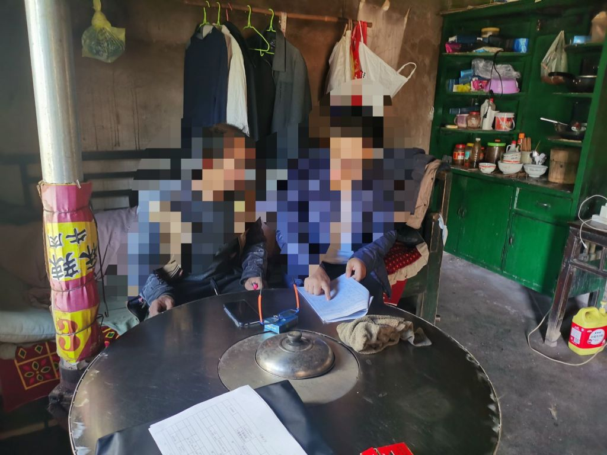说啥呢，我前两天还在村里面，你确定农村都是你想象那样吗

----

##### 169.[0] \<pid:730889994\> 2023-12-06 15:31:15 by 堂堂正正發帖\(四川\)
>[jump](#pid730886886) Owen2k(2023-12-06 15:15) 说: 
>
>这个问题的争议不会存在太久了，现在日本还在稳步下降中国在稳步上升，10年后就双向奔赴了

说反了吧，趋势。

----

##### 170.[9] \<pid:730890010\> 2023-12-06 15:31:18 by Petronas\(上海\)
和日本比，中国男人普遍算蓬头垢面的，这就是生活水平的差距了。

更不用说农村什么的。

----

##### 171.[0] \<pid:730890055\> 2023-12-06 15:31:36 by lopowiki\(浙江\)
跪久了站不起来了是吧

----

##### 172.[10] \<pid:730890326\> 2023-12-06 15:32:59 by 海の女婿\(江苏\)
这个时候真得看人均GDP了

----

##### 173.[0] \<pid:730890469\> 2023-12-06 15:33:35 by 暴白克星考迪克\(福建\)
>[jump](#pid730871491) 范阿尔特(2023-12-06 13:57)说:
>说实话你真去过农村吗，特别是中西部的农村，你这自信过了头吧

中西部的农村很多甚至有通地铁

----

##### 174.[2] \<pid:730890671\> 2023-12-06 15:34:32 by Tomoyo。。。\(陕西\)
>[jump](#pid730872270) 哈夏课思敏(2023-12-06 14:01)说:
>>[jump](#pid0) 阴云笼罩的彼端(2023-12-06 13:55) 说: 
>>
>>说实话现在去农村地区逛一圈都觉得发展程度不比小日子小城镇要差，居然还有人觉得我们发展还不如日本的，什么心态？
>
>你去过哪里的农村？
>
>这是我家乡农村. 河北

<b>  你这些图比我老家生活环境好多了
</b>

----

##### 175.[0] \<pid:730890699\> 2023-12-06 15:34:43 by Hlozs8\(中国\)
比平均比不了，比最富比不了，比最穷也比不了

----

##### 176.[4] \<pid:730891766\> 2023-12-06 15:39:58 by 金箔法王\(中国\)
>[jump](#pid730872270) 哈夏课思敏(2023-12-06 14:01) 说: 
>
>你去过哪里的农村？
>
>这是我家乡农村. 河北[img].

这都算不错的了。

----

##### 177.[8] \<pid:730891954\> 2023-12-06 15:40:50 by devinc\(江苏\)
现在的这些夜郎自大的人和19世纪闭关锁国那些人有啥区别， 人均GDP这么重要的指标是瞎么？
退一万步， 比较不应该是比较广大的普通的劳动人民的情况吗？ 我们现阶段的主要矛盾你们还记得吗？(XXXX和广大的人民群众需求之间的XXXXXXX)

----

##### 178.[0] \<pid:730892041\> 2023-12-06 15:41:13 by 悠闲地玩\(江西\)
需要正确理解综合国力的含义

----

##### 179.[0] \<pid:730892663\> 2023-12-06 15:44:20 by zxldt2007\(广东\)
这个帖子里基本盘真多啊，突显TG洗脑成果之显著

----

##### 180.[4] \<pid:730892963\> 2023-12-06 15:45:55 by 风之舞丶\(广东\)
>[jump](#pid730872072) 五个半先生(2023-12-06 14:00) 说: 
>
>我以前听说过有中国人去日本打黑工
>我现在没听过有日本人跑中国打黑工

我同学今年刚去 东北的 东北去日本说实话是真的挺香的 去北京又卷不过

----

##### 181.[12] \<pid:730892996\> 2023-12-06 15:46:05 by yuyuko__\(陕西\)
八说了，赢！！！

----

##### 182.[0] \<pid:730893173\> 2023-12-06 15:47:00 by 灼眼的安娜\(中国\)
>[jump](#pid730879681) 非洲人在欧洲(2023-12-06 14:38) 说: 
>
>你先去看看崇明的再来说

我十年前还真去过崇明岛，有一说一，崇明岛的农村比日本偏远地区的乡下是不差的，我苏北的同学也说那边的农村感觉跟他老家农村差不多，但建得比我老家的农村可强多了。
而且上海的农村也不是只有崇明，16号线沿线不也过了大片的农村吗？

----

##### 183.[0] \<pid:730893430\> 2023-12-06 15:48:09 by s28765137\(辽宁\)
思维固化是很可怕的，你很难改变他们，无视就好

----

##### 184.[0] \<pid:730894016\> 2023-12-06 15:51:12 by shasi\(陕西\)
说实话，不光是比不过，差的还不是一星半点

----

##### 185.[0] \<pid:730894047\> 2023-12-06 15:51:19 by 足迹之后\(山东\)
>[jump](#pid730871491) 范阿尔特(2023-12-06 13:57) 说: 
>
>说实话你真去过农村吗，特别是中西部的农村，你这自信过了头吧

不用中西部，来北方看看就行。

----

##### 186.[1] \<pid:730894158\> 2023-12-06 15:51:48 by 奶牛喵\(吉林\)
>[jump](#pid730885244) 自律且安逸(2023-12-06 15:07) 说: 
>
>那为什么润人会在日本饿死？
>日本这么好的话，那应该和讲师一样街道上领食物了。
>我爱说实话。

有一说一，那个饿死的还有人给他拿吃的还出去买过，还天天晒，纯粹的一神经病吧自己饿死了

----

##### 187.[1] \<pid:730894347\> 2023-12-06 15:52:42 by 大写取个名字\(湖北\)
你是国新区看多了吧，江浙的农村能和日本比，别的地方比不过的

----

##### 188.[1] \<pid:730894467\> 2023-12-06 15:53:11 by 微辣最好吃\(江苏\)
楼主反串狗

----

##### 189.[0] \<pid:730895025\> 2023-12-06 15:55:53 by 幽绯\(安徽\)
要不怎么说印度有其先进性。全国一亿人，发达国家

----

##### 190.[1] \<pid:730896328\> 2023-12-06 16:02:13 by 五个半先生\(山东\)
>[jump](#pid730887101) zorro_2(2023-12-06 15:16) 说: 
>
>日本人确实不打黑工 只是下南洋
>现在上海是时下热门的下南洋地点之一

仙人南渡是吧，笑死

----

##### 191.[0] \<pid:730896937\> 2023-12-06 16:05:14 by 菜老板\(湖北\)
夜朗自大，别说偏远地区农村，就算武汉这种省会城市的远城区农村也有2010后才通水电的。

----

##### 192.[0] \<pid:730897589\> 2023-12-06 16:08:09 by zorro_2\(贵州\)
>[jump](#pid730896328) 五个半先生(2023-12-06 16:02) 说: 
>
>仙人南渡是吧，笑死

但凡你对日本历史 以及现在日本的情况稍微了解一下 也行
百万妇女下南洋这种日本政府官方都支持的活动你不去支持一下？

----

##### 194.[0] \<pid:730898925\> 2023-12-06 16:14:19 by 拔刀斩落樱sakura\(江苏\)
>[jump](#pid730875680) Ke3397(2023-12-06 14:18) 说: 
>
>苏北应该没那么好吧，我叔转业在徐州，以前我去铜山区机械厂打工，他们乡下感觉一般般，还第一次看到办白事，晚上跳艳舞，大为震惊。

高铁从上海往北边走  越往北沿线农村风貌越差 南通扬州还有一层的自建房 再往北一层的越来越多

----

##### 195.[2] \<pid:730899477\> 2023-12-06 16:16:56 by 小小李探花\(江苏\)
小区都没出去过的人在这里高谈阔论

----

##### 196.[0] \<pid:730899726\> 2023-12-06 16:18:13 by xingzoude100w\(广西\)
>[jump](#pid730873496) 風行騅(2023-12-06 14:07) 说: 
>
>我不知道日本富人过的啥日子  反正b站那个开宝马家里能看到东京塔的东京大明白吃住条件远不如我这个三线潍坊的

何止东京不如你潍坊，就是北京也一堆吃住不如你的社畜，住鸽子笼能有什么体验。

----

##### 197.[3] \<pid:730901162\> 2023-12-06 16:25:08 by 阿垚就是三个阿土\(福建\)
赢！大赢！

----

##### 198.[1] \<pid:730901304\> 2023-12-06 16:25:56 by 漂泊的兔子\(中国\)
首先，请问你们都是谁？

----

##### 199.[0] \<pid:730901784\> 2023-12-06 16:28:16 by FQuartets\(甘肃\)
才脱贫几年，而且很多地方有持续的返贫风险。
来甘肃农村看看，很多人生活条件依然不咋样，即使和日本的偏远农村比也远不如

----

##### 200.[3] \<pid:730902104\> 2023-12-06 16:29:52 by maydaytalker\(上海\)
你在比较，就已经输了，你会和非洲比吗？

----

##### 201.[0] \<pid:730902335\> 2023-12-06 16:30:57 by 姑苏大牙齿\(江苏\)
发展中硬刚发达国家，，人才。。

----

##### 202.[1] \<pid:730902382\> 2023-12-06 16:31:12 by Belldandy123\(山西\)
不是游戏论坛么，steam日区价格基本要加个30%

----

##### 203.[0] \<pid:730902452\> 2023-12-06 16:31:32 by 梦魇鸟\(江苏\)
赢蛆日常外溢

----

##### 204.[0] \<pid:730902541\> 2023-12-06 16:32:00 by 子夜四時歌\(广东\)
辩证地分析问题
要具体问题具体分析
不要一概而论<h4 class='subtitle'></h4>12.6打卡

[url](http://bbs.nga.cn/read.php?tid=26648937)

----

##### 205.[0] \<pid:730902570\> 2023-12-06 16:32:09 by 用筷子当心夹手\(广西\)
>[jump](#pid730873198) 咕嗒咕嗒狛绝势力(2023-12-06 14:06) 说: 
>
>弱智吧入侵实录

别弱智吧没有真弱智

----

##### 206.[0] \<pid:730902715\> 2023-12-06 16:32:46 by 同平谈\(江苏\)
>[jump](#pid730871576) 北斗寒冰(2023-12-06 13:57) 说: 
>
>你只拿东南沿海比较？

你拿东京湾的农村做比较？

----

##### 208.[0] \<pid:730904252\> 2023-12-06 16:40:00 by 人类厄运共同体\(广东\)
>[jump](#pid730890469) 暴白克星考迪克(2023-12-06 15:33) 说: 
>
>中西部的农村很多甚至有通地铁

东南沿海城市还一堆没地铁的呢

东莞至少算二线里头强一点的吧？到现在地铁才一条。

----

##### 209.[2] \<pid:730904589\> 2023-12-06 16:41:29 by 133123132\(黑龙江\)
以女拳版本来说，日服遥遥领先国服，至少人家各种节都是女方花钱，现在这个日韩服摇摆甚至要走新道路的状态我是不看好的

----

##### 210.[0] \<pid:730905042\> 2023-12-06 16:43:38 by skywalker431\(河南\)
主要是日本城市建的比较精致吧，海洋气候也没什么灰尘，中国城市观感差了点

----

##### 211.[2] \<pid:730905340\> 2023-12-06 16:44:55 by Guayaba\(江苏\)

----

##### 212.[0] \<pid:730907297\> 2023-12-06 16:54:06 by tedtaylor\(中国\)
>[jump](#pid730899726) xingzoude100w(2023-12-06 16:18) 说: 
>
>何止东京不如你潍坊，就是北京也一堆吃住不如你的社畜，住鸽子笼能有什么体验。

不行了我快笑死了

----

##### 213.[1] \<pid:730907449\> 2023-12-06 16:54:50 by 代我问候令堂\(浙江\)
除了东南沿海，内陆的同胞在你眼里不当人？

----

##### 214.[4] \<pid:730907654\> 2023-12-06 16:55:39 by Sourtower\(辽宁\)
夜郎自大 自取其辱

----

##### 215.[0] \<pid:730908107\> 2023-12-06 16:57:41 by UID6090281\(中国\)
>[jump](#pid730873242) 十万の瞬间(2023-12-06 14:06) 说: 
>
>不通气的多的是，通路这点还是给山东省点赞的，尤其是某个县级市12年不少村就弄上水泥路了。15年有的村小伙子相亲的时候，其中一点就是村里是水泥路，比不是水泥路的强

我在上海还有不通气的地方，这个正常吧

----

##### 216.[0] \<pid:730908600\> 2023-12-06 16:59:52 by 五个半先生\(山东\)
>[jump](#pid730897589) zorro_2(2023-12-06 16:08) 说: 
>
>但凡你对日本历史 以及现在日本的情况稍微了解一下 也行
>百万妇女下南洋这种日本政府官方都支持的活动你不去支持一下？

我说的是烧鸡仙人下“南洋”到上海捞金，你说的是

----

##### 217.[0] \<pid:730908716\> 2023-12-06 17:00:21 by hamsterr\(江西\)
咋没见日本人来中国打工呢

----

##### 218.[0] \<pid:730908788\> 2023-12-06 17:00:45 by 横戈凌风\(上海\)
>[jump](#pid730871789) 人类厄运共同体(2023-12-06 13:58) 说: 
>
>不算战前的，小日子至少富了有将近四十年吧，我们有富过那么久吗?
>

你这话说得，我们相对全球(那怕相对日本)富了几千年

----

##### 219.[0] \<pid:730908922\> 2023-12-06 17:01:21 by UID6090281\(中国\)
你是印度人吧，上海东方小孟买？

----

##### 220.[0] \<pid:730909507\> 2023-12-06 17:03:57 by icyfoxbbb\(上海\)
啊呀前面几楼输友又输啦，快有点骨气，告诉蝇蛆：赢！

----

##### 221.[4] \<pid:730911385\> 2023-12-06 17:12:27 by 鸡蛋番茄\(中国\)
坐标广西
之前扶贫的村子
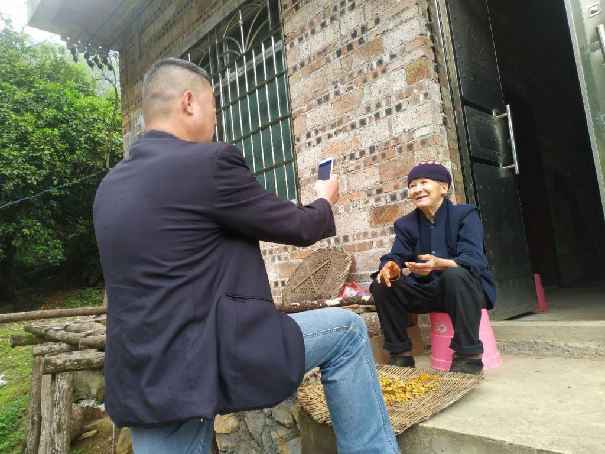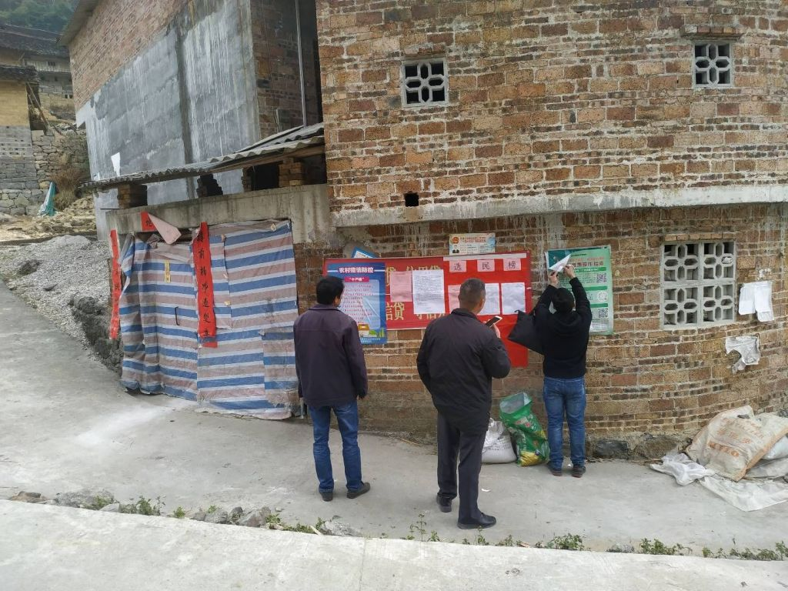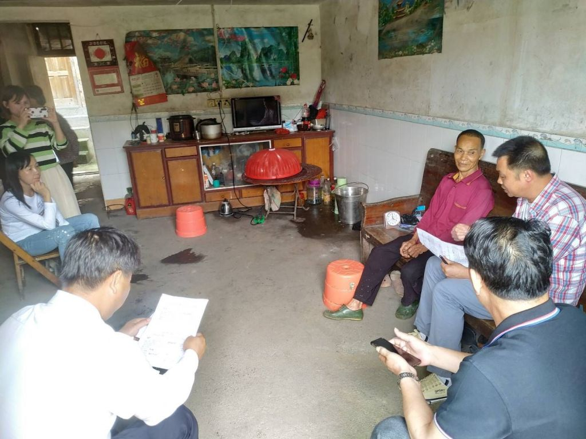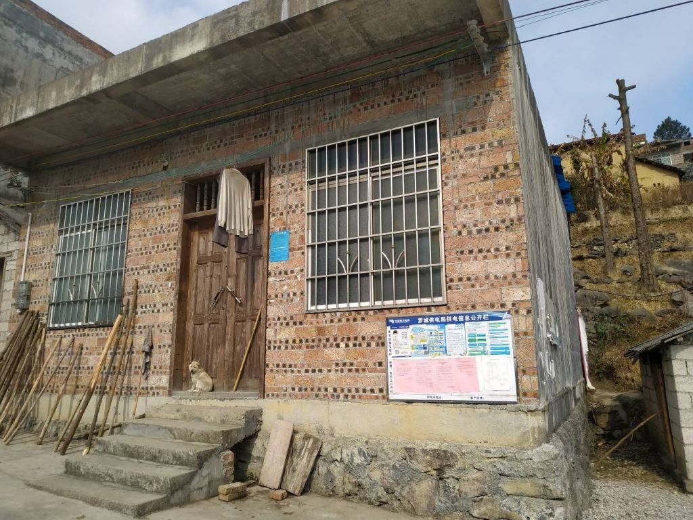

----

##### 222.[2] \<pid:730911570\> 2023-12-06 17:13:17 by 昵称已被占用了\(江苏\)
>[jump](#pid730871595) 天天宅家(2023-12-06 13:57) 说: 
>
>那你去过日本的偏远农村么

我是无锡人，在名古屋待过6年，给你个参照。

2023年江苏宜兴农村的生活水平远不如2006年三重县四日市农村，全方面被碾压的那种不如。

----

##### 223.[0] \<pid:730911664\> 2023-12-06 17:13:42 by 人类厄运共同体\(广东\)
>[jump](#pid730908788) 横戈凌风(2023-12-06 17:00) 说: 
>
>你这话说得，我们相对全球(那怕相对日本)富了几千年

可人家那四十年是一直在积累财富。你这几千年都积累了啥？埃及能说他们从法老时代开始富到现在吗？

----

##### 224.[0] \<pid:730911990\> 2023-12-06 17:15:15 by 醒醒、该吃夜宵了！\(福建\)
>[jump](#pid730871801) 抠门的路边老方(2023-12-06 13:59) 说: 
>
>哈哈哈，生育率都比不过日本了……

诡辩
那怕中国生育是0
日本该比不过的还是比不过

----

##### 225.[0] \<pid:730912204\> 2023-12-06 17:16:22 by xhxdau\(浙江\)
你又是赢区跑来的沙雕吧？

----

##### 226.[0] \<pid:730913125\> 2023-12-06 17:20:58 by 隆中不对\(上海\)
我这的农村确实比日本那好
我寻思大凉山扶贫的帖子也没多久吧

----

##### 227.[0] \<pid:730913233\> 2023-12-06 17:21:31 by 罗莎普鲁克斯\(陕西\)
赢友真害虫→_→

----

##### 228.[0] \<pid:730913276\> 2023-12-06 17:21:44 by 布雷啧啧啧\(广东\)
江浙沪核心地区的农村我信，其他地方，不信。包括珠三角的农村都8行、

----

##### 229.[0] \<pid:730913559\> 2023-12-06 17:23:06 by 怎堪江湖梦已远。\(广东\)
基建肯定比日本强啊，这没有可质疑的吧
但是其他很多地方依然还有差距的

----

##### 230.[0] \<pid:730913872\> 2023-12-06 17:24:41 by 方大支\(美国\)
今年是未来十年最好的一年，蝇蛆们好日子还在后头

----

##### 231.[0] \<pid:730913937\> 2023-12-06 17:25:00 by 老汉推车乀\(广东\)
比个人收入吧，比其他的赢了又不关你的事

----

##### 232.[0] \<pid:730914015\> 2023-12-06 17:25:25 by 牙膏纸网\(河南\)
不能 100% 赢，就是 100% 的输

----

##### 233.[0] \<pid:730914024\> 2023-12-06 17:25:27 by lczpwow2\(四川\)
中国太大了，经济的话，日本10分的话，超过10分的地区面积加起来应该是比日本大的，但3-9分的地方国内还很多，还需要努力。各种产业日本领先的已经不多，而且还在被追赶中。最重要的军事相关领域不说了，全面碾压。总得来说还需努力

----

##### 234.[0] \<pid:730914090\> 2023-12-06 17:25:47 by Leopard846\(江苏\)
>[jump](#pid730871491) 范阿尔特(2023-12-06 13:57) 说: 
>
>说实话你真去过农村吗，特别是中西部的农村，你这自信过了头吧

就算上海农村也比不过啊

----

##### 235.[0] \<pid:730914169\> 2023-12-06 17:26:07 by 君1638\(中国\)
老家的农村，跟20年前比，除了水电，还有个别有钱人家起了好点的房子，其他没什么进步，小卖部都没一个，买瓶可乐都要走十公里

----

##### 236.[0] \<pid:730914231\> 2023-12-06 17:26:29 by 塑料袋子\(浙江\)
ip中国 。。

----

##### 237.[0] \<pid:730914415\> 2023-12-06 17:27:18 by xqiru57\(山东\)
>[jump](#pid730871789) 人类厄运共同体(2023-12-06 13:58) 说: 
>
>不算战前的，小日子至少富了有将近四十年吧，我们有富过那么久吗?
>

你怎么这么爱说大实话，人家是服了然后蹦的，我们是未付蹦的。就这样人家gdp也比我们高。

----

##### 238.[0] \<pid:730914726\> 2023-12-06 17:28:49 by 柴郡猫444\(上海\)
>[jump](#pid730872401) cqlol(2023-12-06 14:02) 说: 
>
>人家是真的把安倍噶了
>你行你上啊
>

那是上不去的，毕竟连周围围观群众那都是过了政审的。

----

##### 239.[0] \<pid:730914852\> 2023-12-06 17:29:22 by 三月三儿三\(浙江\)
沿海农村过的差的都刷了个白，外观上村里出钱都翻新了，过得好的都起五六层的小楼了
日本我不知道，没去过

----

##### 241.[3] \<pid:730915298\> 2023-12-06 17:31:33 by 森言莫语\(四川\)
>[jump](#pid730871595) 天天宅家(2023-12-06 13:57)说:
>>[jump](#pid730871491) 范阿尔特(2023-12-06 13:57) 说: 
>>
>>说实话你真去过农村吗，特别是中西部的农村，你这自信过了头吧
>
>那你去过日本的偏远农村么

2018年我住过佐贺的乡下，佐贺放在日本也算贼拉穷的地方了
基本家家有车，两层小楼比较干净，基本就和动漫里那种乡下没差，马桶加热设备也有(当时国内城市才开始普及)
农民晚上会一起去镇上泡温泉，人口构成基本就是9成老年人，偶尔能看见小孩和中年人
怎么说呢，和四川农村比那确实好太多

----

##### 242.[0] \<pid:730915381\> 2023-12-06 17:31:59 by deedlit80\(湖北\)
>[jump](#pid730872038) ros-agv(2023-12-06 14:00) 说: 
>
>最近新闻调查在报道北京东西岔胡同改造，你看看知道祖国心脏的底层人再来说吧！

莫非东京就没有类似的情况？

----

##### 243.[0] \<pid:730915459\> 2023-12-06 17:32:21 by 白鸟义彦\(上海\)
>[jump](#pid730914090) Leopard846(2023-12-06 17:25) 说: 
>
>就算上海农村也比不过啊

上海农村怎么比不过？和本地人比你是认真的么？
如果说中国很大，落后地区确实比日本差远了。但上海本地人的生活水平怎么就不如鬼子农村了？
人家本地人京阪神都懒得去落户，何况日本农村？

----

##### 244.[1] \<pid:730916045\> 2023-12-06 17:35:30 by 伊寇妮雅\(广西\)
也是难为你了，直接赢不就行了，还走什么程序。整个日本不比贵州旁边一个农村！

----

##### 245.[1] \<pid:730916804\> 2023-12-06 17:39:45 by ptrd41\(北京\)
>[jump](#pid730871595) 天天宅家(2023-12-06 13:57) 说: 
>
>那你去过日本的偏远农村么

去过，去过很多

----

##### 246.[0] \<pid:730917061\> 2023-12-06 17:41:05 by 天天宅家\(江苏\)
>[jump](#pid730915298) 森言莫语(2023-12-06 17:31) 说: 
>
>2018年我住过佐贺的乡下，佐贺放在日本也算贼拉穷的地方了
>基本家家有车，两层小楼比较干净，基本就和动漫里那种乡下没差，马桶加热设备也有(当时国内城市才开始普及)
>农民晚上会一起去镇上泡温泉，人口构成基本就是9成老年人，偶尔能看见小孩和中年人
>怎么说呢，和四川农村比那确实好太多

这也能吹么

----

##### 247.[0] \<pid:730917224\> 2023-12-06 17:42:06 by b307326678\(江苏\)
9亿人不足2000块啊 怎么比啊

----

##### 248.[0] \<pid:730917653\> 2023-12-06 17:44:19 by 这是第六个号了\(中国\)
跑中国打工的日本人一定比跑日本打工的多！

----

##### 249.[0] \<pid:730917738\> 2023-12-06 17:44:45 by 丶汹信丨\(上海\)
>[jump](#pid730872270) 哈夏课思敏(2023-12-06 14:01) 说: 
>
>你去过哪里的农村？
>
>这是我家乡农村. 河北[img].

你这算好的了，等过年回老家给你们拍拍云南的农村

----

##### 250.[0] \<pid:730917839\> 2023-12-06 17:45:19 by 暴白克星考迪克\(福建\)
>[jump](#pid730917224) b307326678(2023-12-06 17:42)说:
>9亿人不足2000块啊 怎么比啊

这是造谣吧，6亿的那个都被证实是假的了

----

##### 251.[1] \<pid:730918304\> 2023-12-06 17:47:53 by 不敢笑黄巢不丈夫\(黑龙江\)
人人都小韩国人 人人都是韩国人

----

##### 252.[3] \<pid:730918551\> 2023-12-06 17:48:59 by 白兔糖不是Hentai\(福建\)
>[jump](#pid730889196) 天天宅家(2023-12-06 15:27)说:
>>[jump](#pid730887447) 白兔糖不是Hentai(2023-12-06 15:18) 说: 
>>
>>求求你别天天宅家里了,出门看看吧
>>中国广袤土地多走走,好歹出趟市区啊,别整天活在网络上
>
>你都不觉得白兔糖有问题了
>
>那就对对对吧

老哥你真是给我整笑了
既然说偏僻乡村,我就不列举我从小生长的福建省内的乡村的具体情况了
这两年我整好走了一圈青甘环线和西藏环线,那里偏僻的乡村什么样我也是亲眼见过的
日本的偏僻乡村楼里的各位去过有现身说法的,再不济你可以用谷歌地图实景走走日本偏僻乡村的街道
中国的发展和进步是有目共睹的,我们是应该骄傲和自豪自己国家的进步
但是也不能像你这样骄傲过了头,到了自欺欺人的地步
我们是发展中国家,肯定有很多方面比不上发达国家,睁开眼看看世界,了解不同的国家不同制度不同发展
学习先进之处,弥补我们的差距,让我们广大中国人过的更好才是最重要的,不是整天在网上发表发达国家抵不上咱们的一根毛

----

##### 253.[0] \<pid:730920483\> 2023-12-06 17:59:10 by 天天宅家\(江苏\)
>[jump](#pid730918551) 白兔糖不是Hentai(2023-12-06 17:48) 说: 
>
>老哥你真是给我整笑了
>既然说偏僻乡村,我就不列举我从小生长的福建省内的乡村的具体情况了
>这两年我整好走了一圈青甘环线和西藏环线,那里偏僻的乡村什么样我也是亲眼见过的
>日本的偏僻乡村楼里的各位去过有现身说法的,再不济你可以用谷歌地图实景走走日本偏僻乡村的街道
>中国的发展和进步是有目共睹的,我们是应该骄傲和自豪自己国家的进步
>但是也不能像你这样骄傲过了头,到了自欺欺人的地步
>我们是发展中国家,肯定有很多方面比不上发达国家,睁开眼看看世界,了解不同的国家不同制度不同发展
>学习先进之处,弥补我们的差距,

你不会以为我没去过日本吧

----

##### 254.[3] \<pid:730920848\> 2023-12-06 18:01:06 by 影虹irisdescent\(澳大利亚\)
>[jump](#pid730917061) 天天宅家(2023-12-06 17:41) 说: 
>
>这也能吹么
>
>

nmd外宾装尼玛呢，来我们黄土高原的农村看看，你给我在日本找个同水平的

----

##### 255.[0] \<pid:730921167\> 2023-12-06 18:02:57 by leave430\(河北\)
浙江………………

----

##### 256.[0] \<pid:730921624\> 2023-12-06 18:05:26 by 单东东\(江苏\)
什么数据都不贴直接赢啊？这也能这么多人回

----

##### 257.[2] \<pid:730921877\> 2023-12-06 18:06:58 by 影虹irisdescent\(澳大利亚\)
>[jump](#pid730871595) 天天宅家(2023-12-06 13:57) 说: 
>
>那你去过日本的偏远农村么

byd江浙沪爷给我逗笑了，真以为全中国农村跟你那一个样？

----

##### 259.[0] \<pid:730922850\> 2023-12-06 18:12:13 by 白兔糖不是Hentai\(福建\)
>[jump](#pid730920483) 天天宅家(2023-12-06 17:59)说:
>>[jump](#pid730918551) 白兔糖不是Hentai(2023-12-06 17:48) 说: 
>>
>>老哥你真是给我整笑了
>>既然说偏僻乡村,我就不列举我从小生长的福建省内的乡村的具体情况了
>>这两年我整好走了一圈青甘环线和西藏环线,那里偏僻的乡村什么样我也是亲眼见过的
>>日本的偏僻乡村楼里的各位去过有现身说法的,再不济你可以用谷歌地图实景走走日本偏僻乡村的街道
>>中国的发展和进步是有目共睹的,我们是应该骄傲和自豪自己国家的进步
>>但是也不能像你这样骄傲过了头,到了自欺欺人的地步
>>我们是发展中国家,肯定有很多方面比不上发达国家,睁开眼看看世界,了解不同的国家不同制度不同发展
>>学习先进之处,弥补我们的差距,
>
>你不会以为我没去过日本吧
>
>

口说无凭啊,上图说话啊,来点日本偏僻乡村的图给大家伙开开眼啊,比国内都不如 

----

##### 260.[1] \<pid:730923602\> 2023-12-06 18:16:48 by 闇光火\(河南\)
要我过年回老家拍一下旱厕么，我怕你会吐

----

##### 261.[4] \<pid:730923706\> 2023-12-06 18:17:24 by 流浪的艾兰特\(四川\)
>[jump](#pid730920483) 天天宅家(2023-12-06 17:59) 说: 
>
>你不会以为我没去过日本吧
>

还真以为你江苏是苏联独立出中国了是吧，中西部农村你又去过哪里？不说中西部也不说江苏，江浙的大哥上海，前阵子有个日本画手(好像是这个身份)来上海参加活动，浦东机场出来后由于社恐没坐上大巴，步行到了市区，沿路照了不少农村照片，发网上了，看看是啥吊样还去过日本呢，去日本旅游比去东南亚还方便，装啥呢

----

##### 262.[0] \<pid:730924084\> 2023-12-06 18:19:41 by 是游客\(河南\)
赢赢赢，又开始了

----

##### 263.[0] \<pid:730924164\> 2023-12-06 18:20:19 by 希瓦是我大姨\(日本\)
>[jump](#pid730871650) 彳亍！(2023-12-06 13:58) 说: 
>
>日本太小，中国太大，不好比

中肯

----

##### 265.[0] \<pid:730924257\> 2023-12-06 18:20:51 by mildsevenlly1\(上海\)
>[jump](#pid730872072) 五个半先生(2023-12-06 14:00)说:
>我以前听说过有中国人去日本打黑工
>我现在没听过有日本人跑中国打黑工

现在还好多人跑去日本打黑工呢。。。

----

##### 266.[0] \<pid:730924323\> 2023-12-06 18:21:19 by delebug\(广东\)
中国很大。。。

----

##### 267.[0] \<pid:730924354\> 2023-12-06 18:21:30 by ordo1986\(四川\)
对啊，我就这么觉得

----

##### 268.[0] \<pid:730924477\> 2023-12-06 18:22:12 by 谣摇领先\(云南\)
可能是日本没有田忌，不会赛马

----

##### 269.[0] \<pid:730924893\> 2023-12-06 18:24:54 by 小小马路大大人\(山东\)
日本人一定是大批大批的往中国移民吧

----

##### 271.[0] \<pid:730925734\> 2023-12-06 18:29:37 by 苦逼脸少男\(福建\)
有自信是好事。

不过发展中国家和富了几十年的发达国家比是不是有点......太印度了？

日本很偏远的农村我没去过，不过一般的农村还是去过的。和国内一般农村不知道怎么形容的差距吧。从直观眼睛看上去得差距，精神面貌，街道，生活水平，文明程度，养老服务，我们是被碾压的。我们能超过的可能就是农村房子比人家大，不过墙壁不铺砖，只是红砖砌起来的多。就国内各个地区农村差距都很大。云贵川那边的农村呢？东北的农村，都不用说农村，县城都比不上人家农村估计。

上个月飞了一趟东北，去了一个市，不知道是不是县级市，老龄化小区垃圾堆成山，整个地方给我看上去整个空荡荡灰蒙蒙得，可能就是这个色彩吧。都把我震惊到了，国内还有这种地方？哪个地方就不说了。还农村呢。~

国力来比肯定我们吊锤日本，但是这一平均下去。我们还得好多年赶上，要是达到平均日本水平，那得多可怕得国力，丑国和全世界都得喊一声我们爸爸。

这种给人最直接的体感，一时半会赶不上，得慢慢来。这就是我们说推进城镇化还有很大空间得原因

----

##### 273.[0] \<pid:730928084\> 2023-12-06 18:42:14 by UID38389372\(海南\)
支持神圣切割，和贫困地区划清界限

----

##### 274.[0] \<pid:730928235\> 2023-12-06 18:43:07 by 殿元山\(安徽\)
>[jump](#pid730875680) Ke3397(2023-12-06 14:18) 说: 
>
>苏北应该没那么好吧，我叔转业在徐州，以前我去铜山区机械厂打工，他们乡下感觉一般般，还第一次看到办白事，晚上跳艳舞，大为震惊。

你说的这个艳舞，现在依然有

----

##### 275.[0] \<pid:730928579\> 2023-12-06 18:45:16 by Leopard846\(江苏\)
>[jump](#pid730915459) 白鸟义彦(2023-12-06 17:32) 说: 
>
>上海农村怎么比不过？和本地人比你是认真的么？
>如果说中国很大，落后地区确实比日本差远了。但上海本地人的生活水平怎么就不如鬼子农村了？
>人家本地人京阪神都懒得去落户，何况日本农村？

如果是十几年前就没地的本地人确实是看不上
然鹅现在种地的小农纯穷鬼，江浙沪也就好一些而已，如果你觉得外墙刷个漆再印个宣传标语就很好的话那没话说

----

##### 277.[0] \<pid:730929077\> 2023-12-06 18:48:12 by impk2004\(河北\)
脑残一个

----

##### 278.[0] \<pid:730929348\> 2023-12-06 18:49:59 by 罪歌DRRR\(广西\)
你这标题跟内容看得我脑壳痛，这是要比啥，农村gdp还是城市gpd，基建还是民生，文娱产业还是工业制作，好歹列出点啥数据、图表、图片对比再赢吧，

----

##### 279.[0] \<pid:730929496\> 2023-12-06 18:50:50 by SElina12345\(上海\)
中国除了北上广深及省会城市和包邮区。还有其他地区的。。。。。经济和人民生活水平差距是巨大的。没法和日本比。日本才多大点地方，他们农村能建设好不是很正常吗。
浙江农村也发达。中国可不止上面说的那些城市，穷地方也多了，能在NGA天天混的也不是那些地方出来的

